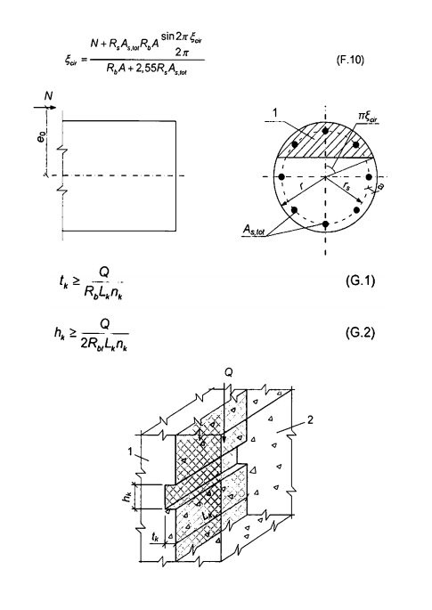

## PHỤ LỤC G  (Tham khảo)  TÍNH TOÁN CHỐT BÊ TÔNG

### G.1  Các kích thước của chốt bê tông (Hình G.1) truyền lực trượt giữa các cấu kiện lắp ghép và bê tông hoặc vữa đổ bù nên được xác định theo các công thức:

$$\begin{aligned} t_k &\ge \frac{Q}{R_b L_k n_k} \qquad (G.1) \\ h_k &\ge \frac{Q}{2R_b L_k n_k} \qquad (G.2) \end{aligned}$$
<!-- formula_id: "F_TCVN_5574_2018_FORMULA_G_1_2" -->

trong đó:

&nbsp;&nbsp;&nbsp;&nbsp;\- Q  là lực trượt truyền qua chốt bê tông;

&nbsp;&nbsp;&nbsp;&nbsp;\- $t_{k}$, $h_{k}$, $L_{k}$  lần lượt là chiều sâu, chiều cao và chiều dài chốt bê tông;

&nbsp;&nbsp;&nbsp;&nbsp;\- $n_{k}$  là số lượng chốt bê tông đưa vào tính toán và lấy không lớn hơn 3.

**CHÚ DẪN:**

1 - Cấu kiện lắp ghép;

2 - Bê tông liền khối.

<strong>Hình G.1 — Sơ đồ tính toán chốt bê tông truyền lực trượt từ cấu kiện lắp ghép sang bê tông liền khối</strong>

Khi có lực nén N thì chiều cao chốt bê tông được phép xác định theo công thức:

$$h_k \ge \frac{Q - 0,7N}{2 R_{bt} L_k n_k} \tag{G.3}$$
<!-- formula_id: "F_TCVN_5574_2018_FORMULA_G_3" -->

và lấy giảm xuống so với chiều cao đã được xác định theo công thức (G.2) nhưng không giảm quá hai lần.

Khi nối các cấu kiện sàn bằng các chốt bê tông thì chiều dài chốt bê tông đưa vào tính toán không được lớn hơn một nửa nhịp cấu kiện, khi đó đại lượng Q lấy bằng tổng lực trượt trên toàn bộ chiều dài cấu kiện.

Đối với các chốt bê tông của cấu kiện lắp ghép và các chốt bê tông làm từ bê tông đổ bù, cần kiểm tra các điều kiện (G.1) đến (G.3), trong đó các cường độ tính toán của bê tông làm chốt, $R_{b}$ và $R_{bt}$, được lấy như đối với kết cấu bê tông. Khi tính toán nhánh chịu kéo trong cột hai nhánh chịu lực nhổ từ cốc móng thì cho phép kể đến sự làm việc của 5 chốt bê tông (Hình G.1).

