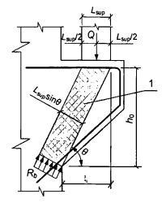
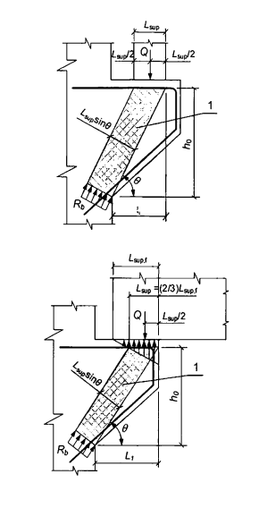

## PHỤ LỤC H  (Tham khảo)  TÍNH TOÁN CÔNG XÔN NGẮN

### H.1  Tính toán công xôn ngắn của cột (vai cột) với $L_{1}$ ≤ 0,9$ h_{0}$ (Hình H.1) chịu tác dụng của lực cắt, để đảm bảo độ bền trên dải bê tông nghiêng chịu nén giữa tải trọng tác dụng và gối tựa, cần được tiến hành theo điều kiện:

$$Q \le 0,8R_b b l_{sub} \sin^2 \theta \left(1 + 5 \alpha \mu_v\right) \tag{H.1}$$
<!-- formula_id: "F_TCVN_5574_2018_FORMULA_H_1" -->

trong đó: vế phải lấy không lớn hơn 3,5$R_{bt}bh_{0}$ và không nhỏ hơn 2,5$ R_{bt}bh_{0}$.

&nbsp;&nbsp;&nbsp;&nbsp;\- Trong điều kiện (H.1):

&nbsp;&nbsp;&nbsp;&nbsp;\- $L_{sup}$  là chiều dài diện tích gối tựa của tải trọng dọc theo chiều dài vươn công xôn;

&nbsp;&nbsp;&nbsp;&nbsp;\- là góc nghiêng của dải bê tông chịu nén tính toán so với phương nằm ngang, $\sin^2 \theta = \frac{h_0^2}{h_0^2 + L_1^2} \tag{G.4}
<!-- formula_id: "F_TCVN_5574_2018_FORMULA_G_4" -->$

&nbsp;&nbsp;&nbsp;&nbsp;\- $\alpha$ là tỉ số mô đun đàn hồi của cốt thép và bê tông, α = $E_{s}$/$ E_{b}$;

&nbsp;&nbsp;&nbsp;&nbsp;\- $\mu_{w}= \frac{A_{sw}}{b s_w}$ là hàm lượng của các cốt thép đai nằm theo chiều cao công xôn, với $ s_{w}$ là khoảng cách giữa các cốt thép đai, được đo theo đường vuông góc với chúng.

<!-- DIAGRAM: word/media/image286.png -->

**CHÚ DẪN:**

1 - Dải bê tông nghiêng tính toán.

<strong>Hình H.1 — Sơ đồ tính toán công xôn ngắn chịu tác dụng của lực cắt</strong>

Khi tính toán cần kể đến các cốt thép đai nằm ngang và nằm nghiêng một góc không lớn hơn 45 ° so với phương nằm ngang.

Ứng suất nén tại các vị trí truyền tải trọng lên công xôn không được vượt quá cường độ chịu nén cục bộ tính toán $R_{b,loc}$.

Đối với công xôn ngắn được liên kết cứng vào nút kết cấu khung với mối nối được đổ bù bê tông thì giá trị $L_{sup}$ trong điều kiện (H.1) lấy bằng chiều dài vươn công xôn $ L_{1}$, nếu khi đó thỏa mãn điều kiện M/Q ≥ 0,3 (tính bằng mét (m)) và $ L_{sup}$/$ L_{1}$ ≥ 2/3 (trong đó M và Q lần lượt là mô men gây kéo mép trên của xà (dầm) và lực cắt trong tiết diện thẳng góc của xà theo mép công xôn). Trong trường hợp này, vế phải điều kiện (H.1) lấy không lớn hơn 5$ R_{bt}bh_{0}$.

Khi dầm chạy dọc theo chiều dài vươn công xôn và tựa khớp lên công xôn ngắn mà không có các chi tiết đặt sẵn bổ sung nhô ra để cố định diện tích gối tựa (Hình H.2) thì giá trị $L_{sup}$ trong điều kiện (H.1) lấy bằng 2/3 chiều dài diện tích thực tế của gối tựa $ L_{sup,f}$.

Bố trí cốt thép ngang cho công xôn ngắn phải thỏa mãn các yêu cầu cấu tạo.

<!-- DIAGRAM: word/media/image287.png -->

**CHÚ DẪN:**

1 - Dải bê tông nghiêng tính toán.

<strong>Hình H.2 — Sơ đồ tính toán công xôn ngắn khi dầm lắp ghép chạy dọc chiều dài vươn công xôn và tựa khớp lên công xôn</strong>

### H.2  Khi dầm tựa khớp lên công xôn của cột (vai cột) thì cốt thép dọc của công xôn được kiểm tra theo điều kiện:

$$Q \frac{L_1}{h_0} \le R_s A_s \tag{H.2}$$
<!-- formula_id: "F_TCVN_5574_2018_FORMULA_H_2" -->

trong đó $L_{1}$, $ h_{0}$ - xem Hình H.1.

Khi đó, cốt thép dọc của công xôn phải được kéo đến đầu tự do của công xôn và phải được neo chắc chắn.

Khi xà và cột liên kết cứng với nhau cùng với bê tông đổ bù mối nối và cốt thép dưới của xà được hàn với cốt thép của công xôn thông qua các chi tiết đặt sẵn thì cốt thép dọc của công xôn được kiểm tra theo điều kiện:

$$Q \frac{L_1}{h_0} - N_s \le R_s A_s \tag{H.3}$$
<!-- formula_id: "F_TCVN_5574_2018_FORMULA_H_3" -->

trong đó:

&nbsp;&nbsp;&nbsp;&nbsp;\- $L_{1}$, $ h_{0}$  lần lượt là chiều dài vươn và chiều cao làm việc của công xôn ngắn;

&nbsp;&nbsp;&nbsp;&nbsp;\- $N_{s}$  là nội lực nằm ngang do xà tác dụng lên mặt trên công xôn ngắn, bằng:

$$N_s = \frac{M + \frac{Q L_{\text{sup}}}{2}}{h_{0b}}$$
<!-- formula_id: "F_TCVN_5574_2018_FORMULA_H_4" -->

&nbsp;&nbsp;&nbsp;&nbsp;\- và lấy không lớn hơn:

$$1,4k_l l_w f_{wi} + 0,3Q$$
<!-- formula_id: "F_TCVN_5574_2018_RID385" -->

trong đó:

&nbsp;&nbsp;&nbsp;&nbsp;\- $k_{f}$ và $ l_{w}$  lần lượt là chiều cao và chiều dài đường hàn góc giữa chi tiết đặt sẵn của xà và công xôn;

&nbsp;&nbsp;&nbsp;&nbsp;\- $f_{wf}$  là cường độ chịu cắt của đường hàn góc theo kim loại đường hàn, được xác định theo TCVN 5575:2012;

&nbsp;&nbsp;&nbsp;&nbsp;\- 0,3 - là hệ số ma sát của thép với thép,

&nbsp;&nbsp;&nbsp;&nbsp;\- cũng như không lớn hơn:

&nbsp;&nbsp;&nbsp;&nbsp;\- $R_{sw}A_{sw}$

&nbsp;&nbsp;&nbsp;&nbsp;\- trong đó $R_{sw}$ và $ A_{sw}$ lần lượt là cường độ chịu kéo tính toán và diện tích tiết diện của cốt thép trên của xà.

Trong các công thức (H.3) và (H.4):

M, Q  lần lượt là mô men uốn và lực cắt trong tiết diện thẳng góc của xà theo mép công xôn; nếu mô men M gây kéo biên dưới của xà thì giá trị M trong công thức (H.4) lấy dấu “âm";

$L_{sup}$  là chiều dài thực tế của diện tích gối tựa của tải trọng dọc theo chiều dài vươn công xôn;

$h_{0b}$  là chiều cao làm việc của xà.

