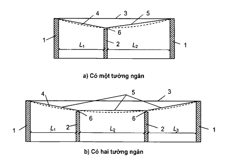
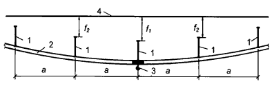
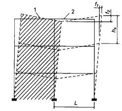

## PHỤ LỤC M  (Quy định)  ĐỘ VÕNG VÀ CHUYỂN VỊ CỦA KẾT CẤU

### M.1  Phạm vi áp dụng

Phụ lục này quy định các giá trị giới hạn về độ võng và chuyển vị của kết cấu chịu lực và bao che của nhà và công trình khi tính toán theo các trạng thái giới hạn thứ hai.

Phụ lục này không áp dụng cho các công trình thủy công, giao thông, nhà máy điện nguyên tử cũng như cột của đường dây tải điện, các thiết bị phân phối ngoài trời và các ăng ten của các công trình thông tin liên lạc.

### M.2  Chỉ dẫn chung

### M.2.1  Khi tính toán các kết cấu xây dựng thì độ võng (độ vồng) hoặc chuyển vị cần phải thoả mãn điều kiện:

$$f \le f_{u} \tag{M.1}$$
<!-- formula_id: "F_TCVN_5574_2018_FORMULA_M_1" -->

trong đó:

&nbsp;&nbsp;&nbsp;&nbsp;\- f  là độ võng (độ vồng) hoặc chuyển vị của các cấu kiện (hay toàn bộ kết cấu) được xác định có kể đến các yếu tố có ảnh hưởng đến các giá trị của chúng theo M.3;

&nbsp;&nbsp;&nbsp;&nbsp;\- $f_{u}$  là độ võng (độ vồng) hoặc chuyển vị giới hạn được quy định trong M.4.

&nbsp;&nbsp;&nbsp;&nbsp;\- Việc tính toán cần được thực hiện xuất phát từ các yêu cầu về:

&nbsp;&nbsp;&nbsp;&nbsp;\- a) Công nghệ (đảm bảo điều kiện sử dụng bình thường của các thiết bị công nghệ, các thiết bị nâng chuyển, các dụng cụ đo đạc và kiểm tra, v.v...);

&nbsp;&nbsp;&nbsp;&nbsp;\- b) Cấu tạo (đảm bảo sự toàn vẹn của các cấu kiện tiếp giáp với nhau và các mối nối của chúng, đảm bảo độ nghiêng quy định);

&nbsp;&nbsp;&nbsp;&nbsp;\- c) Tâm sinh lý (ngăn ngừa các tác động có hại và cảm giác không thoải mái khi kết cấu dao động);

&nbsp;&nbsp;&nbsp;&nbsp;\- d) Thẩm mỹ - tâm lý (đảm bảo có ấn tượng tốt về hình dáng bên ngoài của kết cấu, loại trừ các cảm giác sợ nguy hiểm).

Khi tính toán, mỗi yêu cầu trên cần được thỏa mãn riêng biệt không phụ thuộc lẫn nhau.

Các hạn chế về dao động của kết cấu cần được xác định phù hợp với các yêu cầu nêu trong M.3.4.

### M.2.2  Các trường hợp tính toán mà trong đó cần xác định độ võng, chuyển vị và các tải trọng tương ứng với chúng, cũng như các yêu cầu liên quan đến độ vồng thi công được nêu trong M.3.5.

### M.2.3  Độ võng của các cấu kiện kết cấu theo các yêu cầu thẩm mỹ - tâm lý không cần phải hạn chế nếu chúng bị khuất không nhìn thấy, hoặc không làm xấu đi hình dáng bên ngoài của kết cấu (ví dụ: mái mỏng, mái đua nghiêng, kết cấu có thanh cánh hạ treo hoặc nâng cao). Độ võng theo các yêu cầu kể trên cũng không cần phải hạn chế đối với cả kết cấu sàn tầng và sàn mái trên các phòng có người lui tới trong thời gian không lâu (ví dụ như trạm biến thế và gác mái).

**CHÚ THÍCH:** Đối với tất cả các dạng mái thì sự toàn vẹn của lớp phủ mái cần được đảm bảo bằng các biện pháp cấu tạo (ví dụ: sử dụng cơ cấu bù trừ hoặc tạo tính liên tục cho các cấu kiện của mái mà không phải bằng cách tăng độ cứng của các cấu kiện chịu lực.

### M.2.4  Đối với cấu kiện mái cần phải đảm bảo sao cho khi tính cả độ võng của chúng thì độ dốc của mái theo một trong các phương không nhỏ hơn L/200 (trừ các trường hợp được đề cập đến trong các tiêu chuẩn khác).

### M.2.5  Hệ số động lực đối với các tải trọng xe tải, xe tải điện, cần trục kiểu cầu (cầu trục) và cần trục treo lấy bằng 1.

### M.3  Xác định độ võng và chuyển vị

### M.3.1  Khi xác định độ võng và chuyển vị cần phải kể đến tất cả các yếu tố chính ảnh hưởng đến giá trị của chúng (biến dạng không đàn hồi của vật liệu, sự hình thành vết nứt, kể đến sơ đồ biến dạng, các kết cấu liền kề, độ mềm của các nút và nền). Khi có đủ cơ sở, có thể không cần tính đến một số yếu tố nào đó hoặc tính đến bằng phương pháp gần đúng.

### M.3.2  Đối với các kết cấu dùng loại vật liệu có tính từ biến thì cần phải kể đến sự tăng độ võng theo thời gian. Khi hạn chế độ võng theo yêu cầu tâm sinh lý thì chỉ kể đến từ biến ngắn hạn xuất hiện ngay sau khi đặt tải, còn theo yêu cầu công nghệ và cấu tạo (trừ khi tính toán kể đến tải trọng gió), thẩm mỹ - tâm lý thì kể đến từ biến toàn phần.

### M.3.3  Khi xác định độ võng (ngang) của cột nhà một tầng và của trụ cầu cạn do tải trọng ngang của cần trục cần chọn sơ đồ tính của cột (trụ) có kể đến điều kiện liên kết với giả thiết:

&nbsp;&nbsp;\- Cột nhà và trụ các cầu cạn trong nhà không có dịch chuyển ngang ở cao độ gối tựa trên cùng (nếu sàn mái không tạo thành miếng cứng trong mặt phẳng ngang, cần kể đến độ mềm theo phương ngang của gối tựa này);

&nbsp;&nbsp;\- Trụ các cầu cạn ngoài trời được coi như công xôn.

### M.3.4  Khi trong nhà và công trình có các thiết bị công nghệ và vận chuyển gây dao động cho các kết cấu xây dựng, cũng như có các nguồn rung động khác, thì giá trị giới hạn của chuyển vị rung, vận tốc rung và gia tốc rung cần phải lấy theo các yêu cầu về độ rung tại chỗ làm việc và chỗ ở trong các tiêu chuẩn liên quan.

Khi có các thiết bị và dụng cụ độ chính xác cao nhạy với dao động của kết cấu mà chúng đặt trên đó thì giá trị giới hạn của chuyển vị rung, vận tốc rung và gia tốc rung cần phải xác định phù hợp với các điều kiện kỹ thuật riêng.

### M.3.5  Trường hợp tính toán mà trong đó cần xác định độ võng, chuyển vị và các tải trọng tương ứng phải được chọn tùy thuộc vào việc tính toán được thực hiện theo các yêu cầu nào.

Trường hợp tính toán được đặc trưng bởi sơ đồ tính toán của kết cấu, loại tải trọng, giá trị của các hệ số điều kiện làm việc và các hệ số độ tin cậy, số các trạng thái giới hạn được xét đến trong trường hợp tính toán đó.

Nếu việc tính toán được thực hiện theo các yêu cầu về công nghệ thì trường hợp tính toán cần phải phù hợp với tác dụng của các tải trọng gây ảnh hưởng đến sự làm việc của các thiết bị công nghệ.

Nếu việc tính toán được thực hiện theo các yêu cầu về cấu tạo thì trường hợp tính toán cần phải phù hợp với tác dụng của các tải trọng gây ra các hư hỏng của các cấu kiện liền kề do độ võng và chuyển vị quá lớn.

Nếu việc tính toán được thực hiện theo các yêu cầu về tâm sinh lý thì trường hợp tính toán cần phải phù hợp với trạng thái liên quan đến dao động của kết cấu và khi đó phải kể đến các tải trọng gây ảnh hưởng đến dao động của kết cấu được quy định trong Phụ lục này và các tiêu chuẩn liên quan khác nêu trong M.3.4.

Nếu việc tính toán được thực hiện theo các yêu cầu về thẩm mỹ - tâm lý thì trường hợp tính toán  cần phải phù hợp với tác dụng của các tải trọng thường xuyên và tạm thời dài hạn.

Đối với các kết cấu mái và sàn tầng được thiết kế với độ vồng thi công thì khi hạn chế độ võng theo các yêu cầu về thẩm mỹ - tâm lý, độ võng theo phương đứng xác định được cần phải giảm đi một đại lượng bằng giá trị độ vồng thi công đó.

### M.3.6  Độ võng của các cấu kiện của sàn tầng và mái theo các yêu cầu về cấu tạo không được vượt quá khoảng cách (khe hở) giữa mặt dưới của các cấu kiện đó và mặt trên (đỉnh) của tường ngăn, vách kính, khuôn cửa sổ, cửa đi và các bộ phận khác dưới các cấu kiện chịu lực.

Khe hở giữa mặt dưới của các cấu kiện của mái, sàn tầng và mặt trên của tường ngăn nằm dưới các cấu kiện đó, thông thường, không được vượt quá 40 mm. Trong những trường hợp khi việc thực hiện các yêu cầu trên liên quan đến sự tăng độ cứng của sàn tầng và mái thì phải sử dụng các biện pháp cấu tạo để tránh sự tăng độ cứng đó (ví dụ không bố trí các tường ngăn ngay dưới dầm chịu uốn mà bố trí ở bên cạnh nó).

### M.3.7  Trong trường hợp giữa các tường có tường ngăn chịu lực (với chiều cao gần bằng chiều cao tường) thì giá trị L trong mục 2a Bảng M.1 cần lấy bằng khoảng cách giữa mặt trong của các tường chịu lực (hoặc các cột) và các tường ngăn (hoặc giữa các mặt trong của các tường ngăn như trên Hình M.1).

### M.3.8  Độ võng của các kết cấu vì kèo khi có đường ray của cần trục treo (Bảng M.1, mục 2d) cần lấy bằng hiệu giữa các độ võng $f_{1}$ và $ f_{2}$ của các kết cấu vì kèo liền kề (Hình M.2).

### M.3.9  Chuyển vị theo phương ngang của khung cần được xác định trong mặt phẳng của các tường và tường ngăn mà sự toàn vẹn của chúng cần được đảm bảo.

Đối với các hệ khung giăng của nhà nhiều tầng có chiều cao trên 40 m thì độ nghiêng của các mảng tường (thuộc phạm vi các tầng) tiếp giáp với vách cứng lấy bằng $f_{1}$/$ h_{s}$ + $ f_{1}$/L (Hình M.3) không được vượt quá (xem Bảng M.4): L/300 đối với mục 2; L/500 đối với mục 2a và L/500 đối với mục 2b.

<!-- DIAGRAM: word/media/image315.png -->

**CHÚ DẪN:**

| 1 - Tường chịu lực (hoặc cột); trọng 2 - Tường ngăn; 3 - Sàn tầng (hoặc mái) trước khi chịu tải trọng; | 4 - Sàn tầng (hoặc sàn mái) khi chịu tải 5 - Các đoạn thẳng móc để tính độ võng; 6 - Khe hở. |
| :--- | :--- |

<strong>Hình M.1 — Sơ đồ xác định các giá trị L (L1, L2, L3) khi có tường ngăn nằm giữa các tường chịu lực</strong>

<!-- DIAGRAM: word/media/image316.png -->

**CHÚ DẪN:**

1 - Kết cấu vì kèo; 			3 - Cần trục treo;

2 - Dầm đỡ đường ray cần trục treo; 	4 - Vị trí ban đầu của kết cấu vì kèo.

**CHÚ THÍCH:** 

$f_{1}$ - Độ võng của kết cấu vì kèo chịu tải nhiều nhất;

$f_{2}$ - Độ võng của kết cấu vì kèo gắn kết cấu vì kèo chịu tải nhiều nhất.

<strong>Hình M.2 — Sơ đồ tính độ võng của kết cấu vì kèo khi có đường ray của cần trục treo</strong>

<!-- DIAGRAM: word/media/image317.png -->

**CHÚ DẪN:**

1 - Vách cứng;

2 - Mảng tường thuộc phạm vi các tầng.

**CHÚ THÍCH:** 

Đường nét liền chỉ sơ đồ ban đầu của khung trước khi chịu tải trọng.

<strong>Hình M.3 — Sơ đồ độ lệch của mảng tường thuộc phạm vi các tầng, tiếp giáp với vách cứng trong nhà khung giằng</strong>

### M.4  Độ võng và chuyển vị giới hạn

### M.4.1  Quy định chung

### M.4.1.1  Độ võng giới hạn của các cấu kiện của kết cấu mái và sàn tầng theo các yêu cầu về công nghệ, cấu tạo và tâm sinh lý cần được tính từ trục uốn của cấu kiện tương ứng với trạng thái tại thời điểm đặt tải trọng gây ra độ võng cần tính, còn theo các yêu cầu về thẩm mỹ - tâm lý được tính từ đường thẳng nối các gối tựa của cấu kiện này (xem M.3.7).

### M.4.1.2  Khoảng cách (khe hở) từ đỉnh xe con của cần trục kiểu cầu (cầu trục) đến điểm dưới cùng của kết cấu chịu lực bị võng của mái (hoặc các vật gắn với chúng) lấy không nhỏ hơn 100 mm.

### M.4.1.3  Độ võng giới hạn đối với các trường hợp tính toán khác nhau được nêu trong M.4.2.

Đối với các cấu kiện của kết cấu nhà và công trình mà độ võng và chuyển vị giới hạn của chúng không được đề cập trong Phụ lục này và các tiêu chuẩn khác thì độ võng và chuyển vị theo phương đứng và phương ngang do tải trọng thường xuyên, tạm thời dài hạn và tạm thời ngắn hạn không được vượt quá 1/150 nhịp hoặc 1/75 chiều dài vươn công xôn.

### M.4.2  Độ võng giới hạn theo phương đứng của các cấu kiện

### M.4.2.1  Độ võng giới hạn theo phương đứng của các cấu kiện và tải trọng tương ứng dùng để xác định độ võng đó được nêu trong Bảng M.1. Các yêu cầu đối với các khe hở giữa các cấu kiện liền kề được nêu trong M.3.6.

### Bảng M.1 - Độ võng giới hạn theo phương đứng $f_{u}$ và tải trọng tương ứng để xác định độ võng theo phương đứng

| Cấu kiện kết cấu | Các yêu cầu | Độ võng giới hạn theo phương đứng $f_{u}$ | Tải trọng để xác định độ võng theo phương đứng |
| :--- | :--- | :--- | :--- |
| 1. Dầm cầu trục dưới cần trục kiểu cầu (cầu trục) và cần trục treo được điều khiển: |  |  |  |
| &nbsp;&nbsp;\- từ dưới nền, kể cả palăng | Công nghệ | L/250 | Tải trọng do một cần trục |
| &nbsp;&nbsp;\- từ cabin ứng với chế độ làm việc (theo TCVN 8590- 1:2010 (ISO 4301-1:1986)): | Tâm sinh lý và công nghệ |  |  |
| nhóm A1 đến A6 | Tâm sinh lý và công nghệ | L/400 | Tải trọng do một cần trục |
| nhóm A7 | Tâm sinh lý và công nghệ | L/500 | Tải trọng do một cần trục |
| nhóm A8 | Tâm sinh lý và công nghệ | L/600 | Tải trọng do một cần trục |
| 2. Dầm, giàn, xà, bản, xà gồ, tấm (bao gồm cả sườn của tấm và bản) của: |  |  |  |
| a) Mái và sàn tầng nhìn thấy được với nhịp L, m: | Thẩm mỹ - tâm lý |  | Tải trọng thường xuyên và tạm thời dài hạn |
| L ≤ 1 | Thẩm mỹ - tâm lý | L/120 | Tải trọng thường xuyên và tạm thời dài hạn |
| L = 3 | Thẩm mỹ - tâm lý | L/150 | Tải trọng thường xuyên và tạm thời dài hạn |
| L = 6 | Thẩm mỹ - tâm lý | L/200 | Tải trọng thường xuyên và tạm thời dài hạn |
| L = 24(12) | Thẩm mỹ - tâm lý | L/250 | Tải trọng thường xuyên và tạm thời dài hạn |
| L ≥ 36(24) | Thẩm mỹ - tâm lý | L/300 | Tải trọng thường xuyên và tạm thời dài hạn |
| b) Mái và sàn tầng có tường ngăn ở dưới chúng | Cấu tạo | Lấy theo M.3.6 | Tải trọng làm giảm khe hở giữa các cấu kiện chịu lực của kết cấu và các tường ngăn |
| c) Mái và sàn tầng khi trên chúng có các bộ phận có thể bị tách (các lớp lót, lớp mặt sàn, vách ngăn) | Cấu tạo | L/150 | Tải trọng tác dụng sau khi hoàn thành tường ngăn, lớp mặt sàn và các lớp lót |
| d) Mái và sàn tầng khi sử dụng palăng, cần trục treo được điều khiển từ: |  |  |  |
| -nền | Công nghệ | Giá trị nhỏ hơn trong hai giá trị: L/300và a/150 | Tải trọng tạm thời có kể đến tải trọng do một cần trục hoặc palăng trên một đường ray |
| &nbsp;&nbsp;\- cabin | Tâm sinh lý | Giá trị nhỏ hơn trong hai giá trị: L/400 và a/200 | Tải trọng do một cần trục hoặc palăng trên một đường ray |
| e) Sàn tầng chịu tác dụng của: | Tâm sinh lý và công nghệ |  |  |
| &nbsp;&nbsp;\- các tải trọng di chuyển, vật liệu, chi tiết máy móc và các tải trọng di động khác (trong đó có tải trọng di chuyển trên nền không ray) | Tâm sinh lý và công nghệ | L/350 | Giá trị bất lợi hơn trong hai giá trị tải trọng: &nbsp;&nbsp;\- 70 % toàn bộ tải trọng tạm thời tiêu chuẩn &nbsp;&nbsp;\- tải trọng của một xe xếp tải |
| &nbsp;&nbsp;\- tải trọng di chuyển trên ray: + khổ hẹp | Tâm sinh lý và công nghệ | L/400 | Tải trọng do một toa chạy trên một đường ray |
| &nbsp;&nbsp;&nbsp;&nbsp;\+ khổ rộng | Tâm sinh lý và công nghệ | L/500 | Tải trọng do một toa chạy trên một đường ray |
| 3. Các bộ phận của cầu thang bộ (bản thang, chiếu nghỉ, chiếu tới, cốn), của ban công, của lôgia | Thẩm mỹ - tâm lý | Như trong mục 2a |  |
| 3. Các bộ phận của cầu thang bộ (bản thang, chiếu nghỉ, chiếu tới, cốn), của ban công, của lôgia | Tâm sinh lý | Xác định theo M.4.2.2 |  |
| 4. Các bản sàn tầng, bản thang, chiếu nghỉ, chiếu tới, mà độ võng của chúng không bị cản trở bởi các cấu kiện liền kề | Tâm sinh lý | 0,7 mm | Tải trọng tập trung 1 kN ở giữa nhịp |
| 5. Lanh tô, tấm tường treo phía trên lỗ cửa sổ và cửa đi (xà và xà gồ vách kính) | Cấu tạo | L/200 | Tải trọng làm giảm khe hở giữa các cấu kiện chịu lực và phần chèn của các cửa sổ, cửa đi dưới các cấu kiện chịu lực đó. |
|  | Thẩm mỹ - tâm lý | Như trong mục 2a |  |
| Các ký hiệu trong bảng: L là nhịp tính toán của cấu kiện. a là bước dầm hoặc giàn mà đường đi của cần trục treo liên kết vào. |  |  |  |

**CHÚ THÍCH 1:** Đối với công xôn L được lấy bằng hai lần chiều dài vươn công xôn.

**CHÚ THÍCH 2:** Đối với các giá trị trung gian của L trong mục 2a, độ võng giới hạn xác định bằng nội suy tuyến tính có kể đến các yêu cầu trong M.3.7.

**CHÚ THÍCH 3:** Trong mục 2a lấy số trong ngoặc đơn khi chiều cao phòng đến 6 m.

**CHÚ THÍCH 4:** Cách tính độ võng theo mục 2d được nêu trong L.3.8.

**CHÚ THÍCH 5:** Khi lấy độ võng giới hạn theo các yêu cầu thẩm mỹ - tâm lý thì cho phép chiều dài nhịp L lấy bằng khoảng cách giữa các mặt trong của tường chịu lực (hoặc cột).

**CHÚ THÍCH 6:** Nhóm chế độ làm việc của cần trục kiểu cầu (cầu trục) và cần trục treo lấy theo Phụ lục N.

### M.4.2.2  Độ võng giới hạn theo các yêu cầu về tâm sinh lý của các cấu kiện của: sàn tầng (dầm, xà, bản), cầu thang, ban công, lôgia, các phòng trong nhà ở và nhà công cộng, cũng như của các phòng sinh hoạt của các nhà sản xuất cần xác định theo công thức:

$$f_v = \frac{g(p + p_1 + q)}{30n^2(bp + p_1 + q)}$$
<!-- formula_id: "F_TCVN_5574_2018_FORMULA_M_2" -->

trong đó:

&nbsp;&nbsp;&nbsp;&nbsp;\- g  là gia tốc trọng trường;

&nbsp;&nbsp;&nbsp;&nbsp;\- p  là giá trị tiêu chuẩn của tải trọng do trọng lượng người gây ra dao động, lấy theo Bảng M.2;

&nbsp;&nbsp;&nbsp;&nbsp;\- $p_{1}$  là giá trị tiêu chuẩn đã được giảm đi của tải trọng sàn, lấy theo Bảng 3 của TCVN 2737:1995 và Bảng M.2 trong tiêu chuẩn này;

&nbsp;&nbsp;&nbsp;&nbsp;\- q  là giá trị tiêu chuẩn của tải trọng do trọng lượng của cấu kiện đang tính và các kết cấu tựa lên nó;

&nbsp;&nbsp;&nbsp;&nbsp;\- n  là tần số gia tải khi người đi lại, lấy theo Bảng M.2;

&nbsp;&nbsp;&nbsp;&nbsp;\- b  là hệ số, lấy theo Bảng M.2.

Độ võng cần được xác định theo tổng các tải trọng $\psi_{AI}$ + $ p_{1}$ + q, trong đó: $\psi_{AI}$= $\beta = 0,4 + 0,6\sqrt{A_l} \tag{M.3}
<!-- formula_id: "F_TCVN_5574_2018_FORMULA_M_3" -->$ với A là diện chịu tải, $ A_{1}$ = 9 $ m^{2}$.

### Bảng M.2 - Các hệ số p, $p_{1}$, n, b

| Loại phòng (theo Bảng 3 của TCVN 2737:1995) | p kPa | $p_{1}$ kPa | n Hz | b |
| :--- | :---: | :--- | :---: | :--- |
| Mục 1, 2, ngoại trừ phòng sinh hoạt và lớp học; Mục 4, 6b, 14b, 18b | 0,25 | Lấy theo Bảng 3 của TCVN 2737:1995 | 1,5 | $125 \sqrt{\frac{Q}{\alpha p a L}}$ |
| Mục 2: phòng học và phòng sinh hoạt; Mục 7, 8 ngoại trừ phòng khiêu vũ, khán đài; Mục 14a, 15, 18a, 20 | 0,50 | Lấy theo Bảng 3 của TCVN 2737:1995 | 1,5 | $125 \sqrt{\frac{Q}{\alpha p a L}}$ |
| Mục 8: phòng khiêu vũ, khán đài; Mục 9 | 1,50 | 0,2 | 2,0 | 50 |
| Các ký hiệu trong bảng: Q  là trọng lượng của một người lấy bằng 0,8 kN. α  là hệ số, lấy bằng 1,0 đối với cấu kiện tính theo sơ đồ dầm và bằng 0,6 đối với các cấu kiện còn lại (ví dụ, khi bản sàn kê theo ba hoặc bốn cạnh). a  là bước dầm, xà, chiều rộng của bản sàn, tính bằng mét (m). L  là nhịp tính toán của cấu kiện, tính bằng mét (m). |  |  |  |  |

### M.4.3  Độ võng giới hạn theo phương ngang của cột và các kết cấu hãm do tải trọng cần trục

### M.4.3.1  Độ võng giới hạn theo phương ngang của cột nhà có cần trục kiểu cầu (cầu trục), của trụ cầu cạn, cũng như của dầm cầu trục và của kết cấu hãm (dầm và giàn) lấy theo Bảng M.3 nhưng không nhỏ hơn 6 mm.

Độ võng cần được kiểm tra tại cao độ mặt trên của đường ray cầu trục theo lực hãm xe con của một cầu trục tác dụng theo hướng cắt ngang đường đi của cầu trục, không kể đến độ nghiêng của móng.

### Bảng M.3 - Độ võng giới hạn theo phương ngang $f_{u}$ của cột nhà có cầu trục, trụ cầu cạn, dầm cầu trục và kết cấu hãm

| Nhóm chế độ làm việc của cần trục kiểu cầu (cầu trục) | Độ võng giới hạn $f_{u}$ của |  |  |
| :--- | :--- | :--- | :--- |
| Nhóm chế độ làm việc của cần trục kiểu cầu (cầu trục) | Cột nhà và trụ cầu cạn trong nhà | Trụ cầu cạn ngoài trời | Dầm cầu trục và kết cấu hãm, nhà và cầu cạn (cả trong nhà và ngoài trời) |
| A1 đến A3 | h/500 | h/1500 | L/500 |
| A4 đến A6 | h/1000 | h/2000 | L/1000 |
| A7 đến A8 | h/2000 | h/2500 | L/2000 |
| Các ký hiệu trong bảng: h  là chiều cao từ mặt trên của móng đến đỉnh của đường ray cầu trục (đối với nhà 1 tầng và cầu cạn ngoài trời hoặc trong nhà) hoặc khoảng cách từ trục dầm sàn đến đỉnh của đường ray cầu trục (đối với các tầng trên của nhà nhiều tầng); L  là nhịp tính toán của cấu kiện (dầm). |  |  |  |

**CHÚ THÍCH:** Nhóm chế độ làm việc của cầu trục lấy theo Phụ lục N.

### M.4.3.2  Độ dịch vào giới hạn theo phương ngang của đường đi cầu trục, cầu cạn ngoài trời do tải trọng theo phương ngang và tải trọng theo phương đứng đặt lệch tâm do một cầu trục gây ra (không kể đến độ nghiêng của móng) theo các yêu cầu về công nghệ lấy bằng 20 mm.

### M.4.4  Chuyển vị và độ võng giới hạn theo phương ngang của nhà, các cấu kiện riêng lẻ và các gối đỡ băng tải do tải trọng gió, độ nghiêng của móng và tác động nhiệt khí hậu

### M.4.4.1  Chuyển vị ngang giới hạn của nhà theo yêu cầu cấu tạo (đảm bảo sự nguyên vẹn của lớp chèn khung như tường, tường ngăn, các bộ phận của cửa đi và cửa sổ) được nêu trong Bảng M.4. Các chỉ dẫn về xác định chuyển vị nêu trong M.3.9.

### M.4.4.2  Chuyển vị ngang của nhà cần được xác định có kể đến độ nghiêng (lún không đều) của móng. Khi đó tải trọng do trọng lượng của thiết bị, đồ gỗ, con người, các loại vật liệu chất kho chỉ kể đến khi các tải trọng này được chất đều lên toàn bộ tất cả các sàn của nhà nhiều tầng (có giảm đi phụ thuộc vào số tầng), trừ các trường hợp dự kiến trước phương án tải khác theo điều kiện sử dụng bình thường.

Đối với nhà cao đến 40 m (và các gối đỡ băng tải bất kỳ chiều cao nào) nằm trong vùng gió I đến IV thì cho phép không cần kể đến độ nghiêng của móng do gió gây ra.

### Bảng M.4 - Chuyển vị giới hạn theo phương ngang $f_{u}$ theo yêu cầu cấu tạo

| Nhà, tường và tường ngăn | Liên kết giữa tường, tường ngăn với khung nhà | Chuyển vị giới hạn $f_{u}$ |  |
| :--- | :--- | :--- | :--- |
| 1. Nhà nhiều tầng | Bất kỳ | h/500 |  |
| 2. Một tầng của nhà nhiều tầng: | Mềm | $h_{s}$/300 |  |
| a) Tường và tường ngăn bằng gạch, bằng bê tông thạch cao, bằng panen bê tông cốt thép | Cứng | $h_{s}$/500 |  |
| b) Tường (ốp đá tự nhiên) làm từ gạch ceramic | Cứng | $h_{s}$/700 |  |
| 3. Nhà một tầng (với tường chịu tải bản thân) chiều cao tầng $h_{s}$, m | nhỏ hơn hoặc bằng 6 | Mềm | $h_{s}$/150 |
| 3. Nhà một tầng (với tường chịu tải bản thân) chiều cao tầng $h_{s}$, m | bằng 15 | Mềm | $h_{s}$/200 |
| 3. Nhà một tầng (với tường chịu tải bản thân) chiều cao tầng $h_{s}$, m | lớn hơn hoặc bằng 30 | Mềm | $h_{s}$/300 |
| Các ký hiệu trong bảng: h  là chiều cao nhà nhiều tầng, lấy bằng khoảng cách từ mặt móng đến trục của xà đỡ mái. $h_{s}$  là chiều cao tầng của nhà một tầng, lấy bằng khoảng cách từ mặt móng đến mặt dưới của kết cấu vì kèo; trong nhà nhiều tầng: đối với tầng dưới - bằng khoảng cách từ trên mặt móng đến trục của xà đỡ sàn mái; đối với các tầng còn lại - bằng khoảng cách giữa các trục của các xà liền kề. |  |  |  |

**CHÚ THÍCH 1:** Đối với các giá trị trung gian của $h_{s}$ (theo mục 3) thì chuyển vị ngang giới hạn cần được xác định bằng nội suy tuyến tính.

**CHÚ THÍCH 2:** Đối với tầng trên cùng của nhà nhiều tầng được thiết kế có sử dụng các cấu kiện của mái nhà một tầng thì các chuyển vị ngang giới hạn cần được lấy như đối với nhà một tầng. Khi đó chiều cao tầng trên cùng $h_{s}$ được tính từ trục của dầm sàn tầng đến mặt dưới của kết cấu vì kèo.

**CHÚ THÍCH 3:** Các liên kết mềm bao gồm các liên kết giữa tường hoặc tường ngăn với khung mà không ngăn cản dịch chuyển của khung (không truyền vào tường và tường ngăn nội lực có thể gây hư hỏng các chi tiết cấu tạo); các liên kết cứng bao gồm các liên kết ngăn cản các dịch chuyển tương hỗ của khung, tường hoặc tường ngăn.

**CHÚ THÍCH 4:** Đối với nhà một tầng có tường treo (cũng như khi không có tấm cứng của mái) và khung giá nhiều tầng, chuyển vị ngang giới hạn cho phép tăng lên 30 % (nhưng không lớn hơn $h_{s}$/150).

### M.4.4.3  Đối với các trạng thái giới hạn thứ hai thì các chuyển vị ngang của nhà không khung do tải trọng gió không cần giới hạn.

### M.4.4.4  Độ võng giới hạn theo phương ngang theo các yêu cầu cấu tạo của trụ và xà đầu hồi, cũng như của các panen tường treo do tải trọng gió lấy bằng L/200, trong đó L là chiều dài tính toán của trụ hoặc panen.

### M.4.4.5  Độ võng giới hạn theo phương ngang theo các yêu cầu về công nghệ của các gối đỡ băng tải do tải trọng gió lấy bằng h/250, trong đó h là chiều cao của gối đỡ tính từ mặt móng đến mặt dưới của giàn hoặc dầm.

### M.4.4.6  Độ võng giới hạn theo phương ngang của cột (trụ) nhà khung do tác động của nhiệt khí hậu và lún lấy bằng:

$h_{s}$/150 - khi tường và tường ngăn bằng gạch, bê tông thạch cao, bê tông cốt thép hay panen treo;

$h_{s}$/200 - khi tường được ốp bằng đá thiên nhiên, tường bằng gạch gốm hoặc bằng kính (vách kính), trong đó $ h_{s}$ là chiều cao một tầng, còn đối với nhà một tầng có cầu trục thì $ h_{s}$ là chiều cao từ mặt móng đến mặt dưới của dầm cầu trục.

Khi đó tác động của nhiệt độ cần được lấy không kể đến sự thay đổi nhiệt độ không khí ngày đêm và chênh lệch nhiệt độ do bức xạ mặt trời.

Khi xác định các độ võng theo phương ngang do tác động của nhiệt khí hậu và lún, giá trị của chúng không được cộng với độ võng do tải trọng gió và do độ nghiêng của móng.

### M.4.5  Độ vồng của các cấu kiện của kết cấu sàn giữa các tầng do lực nén trước

### M.4.5.1  Độ vồng giới hạn $f_{u}$ của các cấu kiện của sàn tầng theo các yêu cầu về cấu tạo được lấy bằng 15 mm khi L ≤ 3 m và bằng 40 mm khi L ≤ 12 m (đối với các giá trị L trung gian thì độ vồng giới hạn được xác định bằng nội suy tuyến tính).

### M.4.5.2  Độ vồng f cần xác định do lực nén trước, trọng lượng bản thân của các cấu kiện của sàn tầng và trọng lượng các lớp lát sàn.
