# TIÊU CHUẨN QUỐC GIA

## TCVN 5574:2018

THIẾT KẾ KẾT CẤU BÊ TÔNG VÀ BÊ TÔNG CỐT THÉP

Design of concrete and reinforced concrete structures

#### Lời nói đầu

## TCVN 5574:2018 thay thế TCVN 5574:2012.

## TCVN 5574:2018 được xây dựng trên cơ sở tham khảo tiêu chuẩn của Liên bang Nga SP 63.13330.2012 và các sửa đổi đến năm 2018.

## TCVN 5574:2018 do Viện Khoa học Công nghệ Xây dựng biên soạn, Bộ Xây dựng đề nghị, Tổng cục Tiêu chuẩn Đo lường Chất lượng thẩm định, Bộ Khoa học và Công nghệ công bố.

Lời giới thiệu

Cơ sở tham khảo để xây dựng TCVN 5574:2018 là tiêu chuẩn của Liên bang Nga SP 63.13330.2012 và các sửa đổi đến năm 2018. Tiêu chuẩn SP 63.13330.2012 là bản cập nhật của SNIP 52-01-2003 với một số nội dung hài hòa với tiêu chuẩn châu Âu. Tiêu chuẩn SP 63.13330.2012 đã và đang được cập nhật trong các phần mềm tính toán chuyên dụng phổ biến tại Việt Nam hiện nay.

Trong phần tài liệu viện dẫn ở Điều 2 của TCVN 5574:2018, GOST 13015-2012 chính là tiêu chuẩn quốc gia của Liên bang Nga và được làm cơ sở tham khảo để biên soạn thành tiêu chuẩn quốc gia của Việt Nam. Dự thảo tiêu chuẩn quốc gia dựa trên GOST 13015-2012 đang chờ thẩm định để ban hành.

Trong tiêu chuẩn TCVN 5574:2018 này, nhiều điểm mới đáng được quan tâm chú ý, trong đó có thay đổi mô hình ứng suất sang mô hình biến dạng (chấp nhận giả thiết tiết diện phẳng) khi tính toán tiết diện cấu kiện. Mô hình này được khuyến nghị ưu tiên sử dụng để tính toán theo các trạng thái giới hạn (thứ nhất và thứ hai) cho các cấu kiện chịu tác dụng của mô men uốn và lực dọc. Đối với các cấu kiện có hình dạng tiết diện đơn giản (chữ nhật, chữ T, chữ I) thì vẫn cho phép sử dụng phương pháp nội lực giới hạn nhưng có điều chỉnh. Ngoài ra, các thay đổi còn liên quan đến tính toán cắt, chọc thủng, nén cục bộ, xoắn v.v...

THIẾT KẾ KẾT CẤU BÊ TÔNG VÀ BÊ TÔNG CỐT THÉP

Design of concrete and reinforced concrete structures

---

## 1  PHẠM VI ÁP DỤNG

Tiêu chuẩn này quy định các yêu cầu thiết kế kết cấu bê tông và bê tông cốt thép của nhà và công trình với các chức năng khác nhau, chịu tác động có hệ thống của nhiệt độ không cao hơn dương 50 °C và không thấp hơn âm 70 °C, làm việc trong môi trường không xâm thực.

Tiêu chuẩn này quy định các yêu cầu về thiết kế kết cấu bê tông và bê tông cốt thép được chế tạo từ bê tông nặng, bê tông hạt nhỏ, bê tông nhẹ, bê tông tổ ong và bê tông tự ứng suất.

Tiêu chuẩn này không quy định các yêu cầu để thiết kế kết cấu liên hợp thép - bê tông, kết cấu bê tông cốt sợi, kết cấu bán lắp ghép, kết cấu bê tông và bê tông cốt thép của các công trình thủy công, cầu, lớp phủ mặt đường ô tô và đường băng sân bay và của các công trình đặc biệt khác, cũng như không quy định các yêu cầu để thiết kế kết cấu được chế tạo từ bê tông có khối lượng thể tích trung bình nhỏ hơn 500 kg/$m^{3}$ và lớn hơn 2500 kg/$m^{3}$, bê tông polyme và polyme bê tông, bê tông trên nền chất kết dính là vôi, xỉ và chất kết dính hỗn hợp (trừ khi sử dụng chúng trong bê tông tổ ong), trên nền thạch cao và chất kết dính đặc biệt, bê tông dùng cốt liệu đặc biệt và cốt liệu hữu cơ, bê tông có cấu trúc rỗng lớn. Thiết kế các kết cấu nêu trên cần được thực hiện theo các tiêu chuẩn liên quan. Một số thông tin tham khảo cho kết cấu bán lắp ghép được nêu trong Phụ lục I.

## 2  TÀI LIỆU VIỆN DẪN

Các tài liệu viện dẫn sau cần thiết cho việc áp dụng tiêu chuẩn này. Đối với các tài liệu viện dẫn ghi năm công bố thì áp dụng phiên bản được nêu. Đối với các tài liệu viện dẫn không ghi năm công bố thì áp dụng phiên bản mới nhất, bao gồm cả các sửa đổi, bổ sung (nếu có).

TCVN 1651-1:2008, Thép cốt cho bê tông - Phần 1: Thép thanh tròn trơn

TCVN 1651-2:2018, Thép cốt cho bê tông - Phần 2: Thép thanh vằn

TCVN 2737:1995, Tải trọng và tác động - Tiêu chuẩn thiết kế

TCVN 3108:1993, Hỗn hợp bê tông nặng - Phương pháp xác định khối lượng thể tích

TCVN 3116:1993, Bê tông nặng - Phương pháp xác định độ chống thấm nước

TCVN 5575:2012, Kết cấu thép - Tiêu chuẩn thiết kế

TCVN 6284-2:1997 (ISO 6394-2:1991), Thép cốt bê tông dự ứng lực - Phần 2: Dây kéo nguội

TCVN 6284-4:1997 (ISO 6934-4:1991), Thép cốt bê tông dự ứng lực - Phần 4: Dảnh

TCVN 6284-5:1997 (ISO 6934-5:1991), Thép cốt bê tông dự ứng lực - Phần 5: Thép thanh cán nóng có hoặc không xử lý tiếp

TCVN 6288:1997 (ISO 10544:1992), Dây thép vuốt nguội để làm cốt bê tông và sản xuất lưới thép hàn làm cốt

TCVN 8163:2009, Thép cốt bê tông - Mối nối bằng ống ren

TCVN 8590-1:2010 (ISO 4301-1:1986), Cần trục - Phân loại theo chế độ làm việc - Phần 1: Yêu cầu chung

TCVN 9362:2012, Tiêu chuẩn thiết kế nền nhà và công trình

TCVN 9379:2012, Kết cấu xây dựng và nền - Nguyên tắc cơ bản về tính toán

TCVN 9386:2012, Thiết kế công trình chịu động đất

TCVN 9390:2012, Thép cốt bê tông - Mối nối bằng dập ép ống - Yêu cầu thiết kế, thi công và nghiệm thu

TCVN 12251:2018, Bảo vệ chống ăn mòn cho kết cấu xây dựng

GOST 13015-2012, Concrete and reinforced concrete products for construction. General technical requirements. Rules for acceptance, marking, transportation and storage (Các sản phẩm bê tông và bê tông cốt thép cho xây dựng - Yêu cầu kỹ thuật chung - Nguyên tắc nghiệm thu, ghi nhận, vận chuyển và bảo quản)

## 3  THUẬT NGỮ, ĐỊNH NGHĨA VÀ KÝ HIỆU

### 3.1  Thuật ngữ và định nghĩa

Tiêu chuẩn này sử dụng các thuật ngữ và định nghĩa sau:

3.1.1

Các đặc trưng tiêu chuẩn của các tính chất vật lý của vật liệu (normative characteristics of physical properties of materials)

Các giá trị của các đặc trưng vật lý của vật liệu được quy định trong các tiêu chuẩn hoặc yêu cầu kỹ thuật và được kiểm soát trong quá trình chế tạo, thi công và khai thác sử dụng công trình xây dựng.

3.1.2

Các hệ số độ tin cậy, hệ số an toàn (partial factors, partial safety factors)

Các hệ số kể đến các sai lệch bất lợi có thể có của các giá trị tải trọng, các đặc trưng vật liệu và sơ đồ tính toán công trình xây dựng do điều kiện sử dụng thực tế của nó, cũng như kể đến mức độ tầm quan trọng của các công trình xây dựng. Có 4 loại hệ số độ tin cậy: hệ số độ tin cậy về tải trọng; hệ số độ tin cậy về vật liệu, hệ số điều kiện làm việc, hệ số độ tin cậy về tầm quan trọng của công trình.

3.1.3

Cấp cường độ chịu kéo của bê tông, $B_{t}$ (grade of tensile strength of concrete)

Giá trị được kiểm soát nhỏ nhất của cường độ chịu kéo tức thời, tính bằng megapascan (MPa), với xác suất đảm bảo không dưới 95 %, được xác định trên các mẫu thử kéo chuẩn đã được chế tạo, dưỡng hộ trong điều kiện tiêu chuẩn và thử kéo ở tuổi 28 ngày.

**CHÚ THÍCH:** Mẫu thử chuẩn để xác định cường độ chịu kéo dọc trục có kích thước tiết diện ngang (150 x 150) mm (tham khảo tiêu chuẩn liên quan).

3.1.4

Cấp cường độ chịu kéo của cốt thép (grade of tensile strength of steel)

Giá trị được kiểm soát nhỏ nhất của giới hạn chảy thực tế hoặc quy ước (bằng giá trị của ứng suất ứng với độ giãn dài dư tương đối 0,1 % hoặc 0,2 %) với xác suất đảm bảo không nhỏ hơn 0,95, tính bằng megapascan (MPa).

3.1.5

Cấp cường độ chịu nén của bê tông, B (grade of compressive strength of concrete)

Giá trị được kiểm soát nhỏ nhất của cường độ chịu nén tức thời, tính bằng megapascan (MPa), với xác suất đảm bảo không dưới 95 %, được xác định trên các mẫu lập phương chuẩn đã được chế tạo, dưỡng hộ trong điều kiện tiêu chuẩn và thử nén ở tuổi 28 ngày.

**CHÚ THÍCH:** Mẫu lập phương chuẩn để xác định cường độ chịu nén có kích thước (150 x 150 x 150) mm.

3.1.6

Chiều cao làm việc của tiết diện (effective depth of cross section)

Khoảng cách từ biên chịu nén của cấu kiện đến trọng tâm của cốt thép dọc chịu kéo hoặc chịu nén ít hơn.

3.1.7

Cốt thép chịu lực (load-bearing reinforcement)

Cốt thép được bố trí theo tính toán.

3.1.8

Cốt thép cấu tạo (constructive reinforcement)

Cốt thép được bố trí theo các yêu cầu về cấu tạo mà không cần tính toán.

3.1.9

Cốt thép hạn chế biến dạng ngang (confinement reinforcement)

Cốt thép ngang dùng để gia cường các vị trí cần tăng độ bền, tăng khả năng chống nứt.

3.1.10

Cốt thép ứng suất trước (prestressing steel)

Cốt thép được ứng suất trước trong quá trình chế tạo kết cấu trước khi ngoại lực tác dụng trong giai đoạn khai thác sử dụng.

3.1.11

Cường độ (strength)

Tính chất cơ học của vật liệu, chỉ khả năng chịu được các tác động, thường được tính bằng đơn vị của ứng suất.

3.1.12

Điều kiện sử dụng bình thường (serviceability)

Điều kiện sử dụng các công trình xây dựng phù hợp với các điều kiện đã quy định trong các tiêu chuẩn hoặc nhiệm vụ thiết kế, bao gồm cả bảo dưỡng (bảo trì), sửa chữa lớn và sửa chữa nhỏ.

3.1.13

Độ bền (resistance)

Khả năng của một cấu kiện hoặc của tiết diện ngang cấu kiện, chịu được các tác động mà không bị phá hoại về cơ học, ví dụ khả năng chịu uốn, khả năng chịu kéo, khả năng chống mất ổn định.

3.1.14

Độ bền lâu (durability)

Khả năng của công trình xây dựng bảo toàn được các tính chất độ bền, vật lý và các tính chất khác đã được quy định trong thiết kế và đảm bảo cho công trình xây dựng sử dụng bình thường trong suốt thời hạn sử dụng theo thiết kế.

3.1.15

Độ thấm của bê tông (penetrability of concrete)

Tính chất của bê tông cho phép khí hoặc chất lỏng thấm qua khi có gradient áp lực (được biểu thị bằng mác chống thấm nước W) hoặc đảm bảo độ thấm khuyếch tán các chất hòa tan trong nước khi không có gradient áp lực (được biểu thị bằng các giá trị quy định về mật độ dòng điện và hiệu điện thế).

3.1.16

Hàm lượng cốt thép (reinforcement percentage)

Tỉ số giữa diện tích tiết diện cốt thép và diện tích làm việc của tiết diện bê tông, tính bằng phần trăm.

3.1.17

Kết cấu bê tông (concrete structure)

Kết cấu được làm từ bê tông không cốt thép hoặc có cốt thép đặt theo cấu tạo và không được kể đến trong tính toán; nội lực gây bởi tất cả các tác động trong kết cấu bê tông đều do bê tông chịu.

3.1.18

Kết cấu bê tông cốt thép (reinforced concrete structure)

Kết cấu được làm từ bê tông với cốt thép chịu lực và cốt thép cấu tạo; nội lực gây bởi tất cả các tác động trong kết cấu bê tông cốt thép do bê tông và cốt thép chịu lực cùng chịu.

3.1.19

Kết cấu dạng khối (massive structure)

Kết cấu mà có tỉ số diện tích bề mặt hở để khô, tính bằng mét vuông ($m^{2}$), và thể tích của nó, tính bằng mét khối ($m^{3}$), không lớn hơn 2.

3.1.20

Khả năng chịu lực (load bearing capacity)

Hệ quả tác động lớn nhất xuất hiện trong công trình xây dựng mà không vượt qua các trạng thái giới hạn.

3.1.21

Khối lượng thể tích của bê tông (density of concrete)

Đặc trưng của bê tông, tính bằng tỉ số giữa khối lượng và thể tích của nó, được biểu thị bằng mác khối lượng thể tích trung bình D.

3.1.22

Lớp bê tông bảo vệ (concrete cover)

Lớp bê tông tính từ biên (mép) cấu kiện đến bề mặt gần nhất của thanh cốt thép.

3.1.23

Mác chống thấm nước của bê tông, W (watertightness mark of concrete)

Chỉ tiêu thấm nước của bê tông, được xác định bằng áp lực nước lớn nhất, mà khi đó trong các điều kiện thử nghiệm tiêu chuẩn, nước không thấm qua mẫu thử bê tông, đơn vị tính bằng một trên megapascan ($MPa^{-1}$).

**CHÚ THÍCH:** Mẫu trụ tròn để thử độ chống thấm nước nêu trong TCVN 3116:1993 có đường kính 150 mm và chiều cao 150 mm.

3.1.24

Mác khối lượng thể tích trung bình của bê tông, D (mark of density)

Giá trị khối lượng thể tích trung bình của bê tông mà có yêu cầu cách nhiệt được đề ra, tính bằng kilôgam trên mét khối (kg/$m^{3}$).

3.1.25

Mác tự ứng suất của bê tông, $S_{p}$ (self-stressing mark of concrete)

Giá trị ứng suất trước trong bê tông, tính bằng megapascan (MPa), do bê tông tự trương nở với hàm lượng cốt thép dọc μ = 0,01.

**CHÚ THÍCH:** Mẫu thử chuẩn để xác định tự ứng suất của bê tông là mẫu lăng trụ có kích thước (100 x 100 x 400) mm hoặc (50 x 50 x 200) mm.

3.1.26

Mô hình biến dạng phi tuyến (nonlinear deformation model)

Mô hình biến dạng phi tuyến của vật liệu bê tông và cốt thép.

3.1.27

Mối nối chồng cốt thép (overlap connection of reinforcement)

Liên kết không hàn các thanh cốt thép theo chiều dài của chúng bằng cách kéo dài một đầu của một thanh cốt thép so với đầu kia.

3.1.28

Mối nối cơ khí cốt thép (mechanical connection of reinforcement)

Mối nối các thanh thép bằng các ống nối chuyên dụng để đảm bảo truyền lực từ thanh này sang thanh kia.

3.1.29

Neo cốt thép (reinforcement anchorage)

Sự đảm bảo cho cốt thép chịu được nội lực tác dụng lên nó bằng cách kéo dài nó thêm một đoạn tính từ tiết diện tính toán hoặc bằng cách bố trí chi tiết neo đặc biệt ở các đầu của nó.

3.1.30

Nội lực giới hạn (ultimate internal force)

Nội lực lớn nhất mà cấu kiện, tiết diện của nó, với các đặc trưng đã chọn của vật liệu, có thể chịu được.

3.1.31

Sơ đồ tính toán, mô hình tính toán (structural model)

Mô hình hệ kết cấu được sử dụng khi tính toán.

3.1.32

Tiết diện nghiêng (inclined cross section)

Tiết diện của cấu kiện mã mặt phẳng của tiết diện nằm nghiêng với trục dọc cấu kiện và vuông góc với mặt phẳng thẳng đứng chứa trục dọc cấu kiện.

3.1.33

Tiết diện thẳng góc (normal cross section)

Tiết diện của cấu kiện mà mặt phẳng tiết diện vuông góc với trục dọc cấu kiện.

3.1.34

Trạng thái giới hạn (limit state)

Trạng thái mà khi vượt quá các thông số đặc trưng của nó thì việc sử dụng kết cấu hoặc là không được phép, hoặc bị gây khó khăn hoặc không còn phù hợp.

3.1.35

Tự ứng suất của bê tông (self-stress of concrete)

Ứng suất nén xuất hiện trong bê tông của kết cấu khi đóng rắn do đá xi măng trương nở trong điều kiện bị cản trở sự trương nở này, được biểu thị bằng mác tự ứng suất $S_{p}$.

3.1.36

Xác suất đảm bảo (probability)

Xác suất có lợi của một giá trị đại lượng ngẫu nhiên. Ví dụ, đối với tải trọng thì “xác suất đảm bảo” là xác suất không bị vượt của một giá trị cho trước; đối với các đặc trưng vật liệu thì “xác suất đảm bảo” là xác suất của các giá trị nhỏ hơn hoặc bằng giá trị cho trước.

### 3.2  Ký hiệu

### 3.2.1  Nội lực trong tiết diện ngang của cấu kiện do tải trọng và tác động ngoài

M   Mô men uốn (Nm);

$M_{p}$  Mô men uốn có kể đến mô men của lực nén trước đối với trọng tâm tiết diện quy đổi (Nm);

N  Lực dọc (N);

Q  Lực cắt (N);

T  Mô men xoắn (Nm).

### 3.2.2  Các đặc trưng vật liệu

$E_{b}$  Mô đun đàn hồi ban đầu của bê tông khi nén và kéo (MPa);

$E_{b,red}$  Mô đun biến dạng quy đổi của bê tông khi nén (MPa);

$E_{bt,red}$  Mô đun biến dạng quy đổi của bê tông khi kéo (MPa);

$E_{s}$  Mô đun đàn hồi của cốt thép (MPa);

$E_{s,red}$  Mô đun biến dạng quy đổi của cốt thép nằm trong vùng chịu kéo của cấu kiện có vết nứt (MPa);

$R_{b}$  Cường độ chịu nén dọc trục tính toán của bê tông đối với các trạng thái giới hạn thứ nhất (MPa);

$R_{bond}$  Cường độ bám dính tính toán của cốt thép với bê tông (MPa);

$R_{b,n}$  Cường độ chịu nén dọc trục tiêu chuẩn của bê tông (MPa);

$R_{b,ser}$  Cường độ chịu nén dọc trục tính toán của bê tông đối với các trạng thái giới hạn thứ hai (MPa);

$R_{bp}$  Cường độ chịu nén của bê tông khi truyền ứng suất (MPa);

$R_{bt}$  Cường độ chịu kéo dọc trục tính toán của bê tông đối với các trạng thái giới hạn thứ nhất;

$R_{bt,n}$  Cường độ chịu kéo dọc trục tiêu chuẩn của bê tông (MPa);

$R_{bt,ser}$  Cường độ chịu kéo dọc trục tính toán của bê tông đối với các trạng thái giới hạn thứ hai (MPa);

$R_{s}$  Cường độ chịu kéo tính toán của cốt thép đối với các trạng thái giới hạn thứ nhất (MPa);

$R_{sc}$  Cường độ chịu nén tính toán của cốt thép đối với các trạng thái giới hạn thứ nhất (MPa);

$R_{s,n}$  Cường độ chịu kéo tiêu chuẩn của cốt thép (MPa);

$R_{sw}$  Cường độ chịu kéo tính toán của cốt thép ngang (MPa);

$R_{s,ser}$  Cường độ chịu kéo tính toán của cốt thép đối với các trạng thái giới hạn thứ hai (MPa);

α  Tỉ số mô đun đàn hồi của cốt thép $E_{s}$ và của bê tông $E_{b}$, α = $E_{s}$/$E_{b}$;

$\epsilon_{b0}$  Biến dạng tương đối giới hạn của bê tông khi nén đều dọc trục;

$\epsilon_{bt0}$  Biến dạng tương đối giới hạn của bê tông khi kéo đều dọc trục;

$\epsilon_{b,sh}$  Biến dạng co ngót tương đối của bê tông;

$\varphi_{b,cr}$ Hệ số từ biến của bê tông.

### 3.2.3  Các đặc trưng vị trí cốt thép dọc trong tiết diện ngang của cấu kiện

S  Ký hiệu cốt thép dọc;

&nbsp;&nbsp;\- Nằm trong vùng chịu kéo khi trong tiết diện có vùng chịu nén và chịu kéo do ngoại lực;

&nbsp;&nbsp;\- Nằm ở biên chịu nén ít hơn của tiết diện khi toàn bộ tiết diện chịu nén do ngoại lực;

&nbsp;&nbsp;\- Nằm ở biên chịu kéo nhiều hơn của tiết diện khi toàn bộ tiết diện chịu kéo do ngoại lực đối với cấu kiện chịu kéo lệch tâm;

&nbsp;&nbsp;\- Nằm trong tiết diện ngang của cấu kiện khi toàn bộ tiết diện chịu kéo do ngoại lực đối với cấu kiện chịu kéo đúng tâm;

S'  Ký hiệu cốt thép dọc:

&nbsp;&nbsp;\- Nằm trong vùng chịu nén khi trong tiết diện có vùng chịu nén và chịu kéo do ngoại lực;

&nbsp;&nbsp;\- Nằm ở biên chịu nén nhiều hơn của tiết diện khi toàn bộ tiết diện chịu nén do ngoại lực;

&nbsp;&nbsp;\- Nằm ở biên chịu kéo ít hơn của tiết diện khi toàn bộ tiết diện chịu kéo của cấu kiện chịu kéo lệch tâm do ngoại lực.

### 3.2.4  Các đặc trưng hình học

A  Diện tích toàn bộ tiết diện ngang của bê tông ($mm^{2}$);

a  Khoảng cách từ hợp lực trong cốt thép S đến biên gần nhất của tiết diện (mm);

a'  Khoảng cách từ hợp lực trong cốt thép S’ đến biên gần nhất của tiết diện (mm);

$A_{b}$  Diện tích tiết diện bê tông vùng chịu nén ($mm^{2}$);

$A_{bt}$  Diện tích tiết diện bê tông vùng chịu kéo ($mm^{2}$);

$A_{loc}$  Diện tích bê tông chịu nén cục bộ ($mm^{2}$);

$A_{red}$  Diện tích tiết diện quy đổi của cấu kiện ($mm^{2}$);

$A_{s}$  Diện tích tiết diện của cốt thép S ($mm^{2}$);

$A_s'$  Diện tích tiết diện của cốt thép S' ($mm^{2}$);

$A_{sw}$  Diện tích tiết diện cốt thép đai nằm trong một mặt phẳng vuông góc với trục dọc cấu kiện, cắt qua tiết diện nghiêng ($mm^{2}$);

b  Chiều rộng của tiết diện chữ nhật; chiều rộng sườn của tiết diện chữ T và chữ I (mm);

$b_{f}$  Chiều rộng cánh của tiết diện chữ T và chữ I trong vùng chịu kéo (mm);

$b_r$  Chiều rộng cánh của tiết diện chữ T và chữ I trong vùng chịu nén (mm);

$d_{s}$  Đường kính danh nghĩa của các thanh cốt thép dọc (mm);

$d_{sw}$  Đường kính danh nghĩa của các thanh cốt thép ngang (mm);

e  Khoảng cách từ điểm đặt lực dọc N đến hợp lực trong cốt thép S (mm);

e'  Khoảng cách từ điểm đặt lực dọc N đến hợp lực trong cốt thép S' (mm);

$e_{p}$  Khoảng cách từ điểm đặt lực nén trước $N_{p}$, có kể đến mô men uốn do ngoại lực, đến trọng tâm cốt thép chịu kéo hoặc chịu nén ít hơn (mm);

$e_{0}$  Độ lệch tâm ban đầu của lực dọc N đối với trọng tâm tiết diện quy đổi, được xác định theo các chỉ dẫn trong 7.3.1 và 8.1.2.2.4 (mm);

$e_{0p}$  Độ lệch tâm của lực nén trước đối với trọng tâm tiết diện quy đổi (mm);

h  Chiều cao tiết diện chữ nhật, chữ T và chữ I (mm);

$h_{f}$  Chiều cao cánh tiết diện chữ T và chữ I trong vùng chịu kéo (mm);

$h_r$  Chiều cao cánh tiết diện chữ T và chữ I trong vùng chịu nén (mm);

$h_{0}$  Chiều cao làm việc của tiết diện, bằng h - a (mm);

$h'_0$  Chiều cao làm việc của tiết diện, bằng h - a' (mm);

I  Mô men quán tính của toàn bộ tiết diện bê tông đối với trọng tâm tiết diện cấu kiện ($mm^{4}$);

$I_{red}$  Mô men quán tính của diện tích quy đổi của cấu kiện đối với trọng tâm của nó ($mm^{4}$);

i  Bán kính quán tính của tiết diện ngang của cấu kiện đối với trọng tâm tiết diện (mm);

L  Nhịp cấu kiện (mm);

$L_{an}$  Chiều dài vùng neo của cốt thép (mm);

$L_{p}$  Chiều dài vùng truyền ứng suất trước trong cốt thép ứng suất trước vào bê tông (mm);

$L_{0}$  Chiều dài tính toán của cấu kiện chịu lực nén dọc trục (mm);

$s_{w}$  Khoảng cách cốt thép đai, đo theo chiều dài cấu kiện (mm);

x  Chiều cao vùng chịu nén của bê tông (mm);

y  khoảng cách từ trục trung hòa đến điểm đặt lực nén trước có kể đến mô men uốn do ngoại lực (mm);

W  Mô men kháng uốn của tiết diện cấu kiện đối với thớ chịu kéo ngoài cùng ($mm^{3}$);

ξ  Chiều cao tương đối của vùng chịu nén của bê tông, bằng x/$h_{0}$;

$\mu_{s}$ Hàm lượng cốt thép thanh, được xác định bằng tỉ số giữa diện tích tiết diện của cốt thép S và diện tích tiết diện ngang của cấu kiện (b . $h_{0}$), không kể đến phần cánh chịu nén và chịu kéo nhô ra.

### 3.2.5  Các đặc trưng của cấu kiện ứng suất trước

P, $N_{p}$  Lực nén trước có kể đến hao tổn ứng suất trước trong cốt thép ứng suất trước tương ứng với giai đoạn làm việc đang xét của cấu kiện (N):

$P_{(1)}$  Nội lực trong cốt thép ứng suất trước có kể đến các hao tổn ứng suất trước thứ nhất (N):

$P_{(2)}$  Nội lực trong cốt thép ứng suất trước có kể đến tất cả các hao tổn ứng suất trước (N);

$\sigma_{bp}$  Ứng suất nén trong bê tông ở giai đoạn nén trước có kể đến các hao tổn ứng suất trước trong cốt thép ứng suất trước (MPa);

$\sigma_{sp}$  Ứng suất trước trong cốt thép ứng suất trước có kể đến các hao tổn ứng suất trước trong cốt thép ứng với giai đoạn làm việc đang xét của cấu kiện (MPa);

$\Delta\sigma_{sp}$  Hao tổn ứng suất trước trong cốt thép ứng suất trước (MPa).

## 4  YÊU CẦU CHUNG ĐỐI VỚI KẾT CẤU BÊ TÔNG VÀ BÊ TÔNG CỐT THÉP

### 4.1  Tất cả các loại kết cấu bê tông và bê tông cốt thép cần phải thỏa mãn:

&nbsp;&nbsp;\- Các yêu cầu về an toàn;

&nbsp;&nbsp;\- Các yêu cầu về điều kiện sử dụng bình thường;

&nbsp;&nbsp;\- Các yêu cầu về độ bền lâu;

&nbsp;&nbsp;\- Các yêu cầu bổ sung nêu trong nhiệm vụ thiết kế.

### 4.2  Để thực hiện các yêu cầu về an toàn thì kết cấu cần phải có các đặc trưng ban đầu sao cho dưới các tác động tính toán khác nhau trong quá trình xây dựng và sử dụng nhà và công trình loại trừ được sự phá hoại bất kỳ đặc điểm nào hoặc sự vi phạm điều kiện sử dụng bình thường làm hại cho cuộc sống hoặc sức khỏe của người, tài sản, môi trường xung quanh, cuộc sống và sức khỏe của động vật và thực vật.

### 4.3  Để thực hiện các yêu cầu về điều kiện sử dụng bình thường thì kết cấu cần phải có các đặc trưng ban đầu sao cho dưới các tác động tính toán khác nhau không xảy ra sự hình thành hoặc mở rộng vết nứt quá mức, cũng như không xảy ra chuyển vị quá mức, dao động và các hư hỏng khác làm khó khăn cho việc sử dụng bình thường (vi phạm các yêu cầu về hình dạng bên ngoài của kết cấu, các yêu cầu công nghệ về sự làm việc bình thường của các thiết bị, cơ cấu, các yêu cầu cấu tạo về sự làm việc đồng thời của các cấu kiện và các yêu cầu khác đặt ra khi thiết kế).

Trong các trường hợp cần thiết thì kết cấu cần phải có các đặc trưng đảm bảo được các yêu cầu về cách nhiệt, cách âm, bảo vệ sinh học và các yêu cầu khác.

Các yêu cầu không được có vết nứt được đề ra đối với:

&nbsp;&nbsp;\- Các kết cấu bê tông cốt thép, mà trong đó khi toàn bộ tiết diện của chúng là chịu kéo thì độ không thấm vẫn cần được đảm bảo (các kết cấu chịu áp lực chất lỏng hoặc khí, các kết cấu chịu tác động phóng xạ và các kết cấu tương tự);

&nbsp;&nbsp;\- Các kết cấu đặc thù mà có yêu cầu nâng cao về độ bền lâu;

&nbsp;&nbsp;\- Các kết cấu làm việc trong môi trường xâm thực theo TCVN 12251:2018.

Trong các kết cấu bê tông còn lại thì cho phép hình thành các vết nứt và đối với chúng phải có các yêu cầu hạn chế chiều rộng vết nứt.

### 4.4  Để thực hiện các yêu cầu về độ bền lâu thì kết cấu cần phải có các đặc trưng ban đầu sao cho trong suốt khoảng thời gian dài đã được thiết lập, nó sẽ vẫn thỏa mãn các yêu cầu về an toàn và điều kiện sử dụng có kể đến ảnh hưởng của các tác động tính toán khác nhau (tác dụng dài hạn của tải trọng, các tác động bất lợi của khí hậu, công nghệ, nhiệt độ và độ ẩm, tác động xâm thực, v.v...) đến các đặc trưng hình học của kết cấu và các đặc trưng cơ học của vật liệu.

### 4.5  Sự an toàn, điều kiện sử dụng, độ bền lâu của kết cấu bê tông và bê tông cốt thép và các yêu cầu khác đặt ra trong nhiệm vụ thiết kế cần được đảm bảo bởi việc thực hiện:

&nbsp;&nbsp;\- Các yêu cầu đối với bê tông và các thành phần của nó;

&nbsp;&nbsp;\- Các yêu cầu đối với cốt thép;

&nbsp;&nbsp;\- Các yêu cầu đối với tính toán kết cấu;

&nbsp;&nbsp;\- Các yêu cầu cấu tạo;

&nbsp;&nbsp;\- Các yêu cầu công nghệ;

&nbsp;&nbsp;\- Các yêu cầu sử dụng.

Các yêu cầu về tải trọng và tác động, giới hạn chịu lửa, độ không thấm nước, các giá trị giới hạn của biến dạng (độ võng, chuyển vị, biên độ dao động), về các giá trị tính toán của nhiệt độ không khí bên ngoài và độ ẩm tương đối của môi trường xung quanh, về bảo vệ kết cấu chịu tác động của môi trường xâm thực và các yêu cầu khác được quy định trong các tiêu chuẩn tương ứng (TCVN 2737:1995, Phụ lục M của TCVN 5574:2018 này. TCVN 9386:2012, TCVN 12251:2018, TCVN 9362:2012 và các tiêu chuẩn liên quan khác).

### 4.6  Khi thiết kế kết cấu bê tông và bê tông cốt thép, độ tin cậy của các kết cấu được quy định trong TCVN 9379:2012 theo phương pháp tính toán bán xác suất bằng cách sử dụng các giá trị tính toán của tải trọng và tác động, các đặc trưng tính toán của bê tông và cốt thép (hoặc thép kết cấu), được xác định với các hệ số độ tin cậy riêng tương ứng của các giá trị tiêu chuẩn của các đặc trưng này, có kể đến mức độ tầm quan trọng của nhà và công trình.

Giá trị tiêu chuẩn của tải trọng và tác động, giá trị của hệ số độ tin cậy về tải trọng, hệ số độ tin cậy về công năng của kết cấu, cũng như sự phân loại tải trọng thành thường xuyên và tạm thời (dài hạn và ngắn hạn) được quy định trong các tiêu chuẩn tương ứng đối với kết cấu xây dựng (TCVN 2737:1995 và các tiêu chuẩn khác).

Giá trị tính toán của tải trọng và tác động lấy phụ thuộc vào trạng thái giới hạn tính toán và trường hợp tính toán.

Mức độ tin cậy của các giá trị tính toán của các đặc trưng vật liệu được quy định phụ thuộc vào trường hợp tính toán và vào nguy cơ đạt tới trạng thái giới hạn tương ứng và được điều chỉnh bằng giá trị của hệ số độ tin cậy về bê tông và cốt thép (hoặc thép kết cấu).

Tính toán kết cấu bê tông và bê tông cốt thép có thể được tiến hành theo giá trị độ tin cậy tiền định trên cơ sở tính toán xác suất toàn phần khi có đủ số liệu về sự biến động của các yếu tố chính trong các công thức tính toán.

## 5  YÊU CẦU ĐỐI VỚI TÍNH TOÁN KẾT CẤU BÊ TÔNG VÀ BÊ TÔNG CỐT THÉP

### 5.1  Yêu cầu chung

### 5.1.1  Tính toán kết cấu bê tông và bê tông cốt thép cần được tiến hành phù hợp với các yêu cầu của TCVN 9379:2012 theo các trạng thái giới hạn, bao gồm:

&nbsp;&nbsp;\- Các trạng thái giới hạn thứ nhất, dẫn tới mất hoàn toàn khả năng sử dụng kết cấu;

&nbsp;&nbsp;\- Các trạng thái giới hạn thứ hai, làm khó khăn cho sử dụng bình thường hoặc giảm độ bền lâu của nhà và công trình so với thời hạn sử dụng đã dự định.

Các tính toán cần phải đảm bảo được độ tin cậy của nhà và công trình trong suốt thời hạn sử dụng của chúng, cũng như trong quá trình thi công phù hợp với các yêu cầu đề ra đối với chúng.

Các tính toán theo các trạng thái giới hạn thứ nhất bao gồm:

&nbsp;&nbsp;\- Tính toán độ bền;

&nbsp;&nbsp;\- Tính toán ổn định hình dạng (đối với kết cấu thành mỏng);

&nbsp;&nbsp;\- Tính toán ổn định vị trí (lật, trượt, đẩy nổi).

Tính toán độ bền kết cấu bê tông và bê tông cốt thép cần được tiến hành theo điều kiện mà trong đó nội lực, ứng suất và biến dạng trong kết cấu do các tác động khác nhau có kể đến trạng thái ứng suất ban đầu (ứng suất trước, tác động nhiệt độ và các tác động khác) không được vượt quá các giá trị tương ứng mà kết cấu có thể chịu được.

Tính toán ổn định hình dạng kết cấu, cũng như ổn định vị trí (có kể đến sự làm việc đồng thời của kết cấu và nền, các tính chất biến dạng của chúng, khả năng chống trượt tại bề mặt tiếp xúc với nền và các đặc điểm riêng khác) cần được tiến hành theo các chỉ dẫn của các tiêu chuẩn áp dụng cho các loại kết cấu riêng.

Trong các trường hợp cần thiết, tùy thuộc vào loại, công năng kết cấu cần tiến hành các tính toán theo các trạng thái giới hạn liên quan đến các hiện tượng dẫn đến phải dừng sử dụng nhà và công trình (biến dạng quá mức, trượt trong các liên kết và các hiện tượng khác).

Tính toán theo các trạng thái giới hạn thứ hai bao gồm:

&nbsp;&nbsp;\- Tính toán hình thành vết nứt;

&nbsp;&nbsp;\- Tính toán mở rộng vết nứt;

&nbsp;&nbsp;\- Tính toán biến dạng.

Tính toán kết cấu bê tông và bê tông cốt thép theo sự hình thành vết nứt cần được tiến hành theo điều kiện mà trong đó nội lực, ứng suất hoặc biến dạng trong kết cấu do các tải trọng không được vượt quá các giá trị giới hạn tương ứng của chúng do kết cấu phải chịu khi hình thành vết nứt.

Tính toán kết cấu bê tông và bê tông cốt thép theo sự mở rộng vết nứt cần được tiến hành theo điều kiện mà trong đó chiều rộng vết nứt trong kết cấu do các tải trọng không được vượt quá các giá trị giới hạn cho phép được quy định phụ thuộc vào các yêu cầu đối với kết cấu, các điều kiện sử dụng kết cấu, tác động của môi trường xung quanh và các đặc trưng vật liệu có kể đến các đặc điểm riêng về ứng xử ăn mòn của cốt thép.

Tính toán kết cấu bê tông và bê tông cốt thép theo biến dạng cần được tiến hành theo điều kiện mà trong đó độ võng, góc xoay, chuyển vị và biên độ dao động của kết cấu do các tải trọng không được vượt quá các giá trị giới hạn cho phép tương ứng.

Đối với kết cấu mà trong đó không cho phép hình thành vết nứt thì cần phải đảm bảo các yêu cầu không xuất hiện vết nứt. Trong trường hợp này, không cần tính toán mở rộng vết nứt.

Đối với các kết cấu khác mà trong đó cho phép hình thành vết nứt thì tính toán theo sự hình thành vết nứt được tiến hành để xác định sự cần thiết phải tính toán theo sự mở rộng vết nứt và kể đến vết nứt trong tính toán biến dạng.

### 5.1.2  Tính toán kết cấu bê tông và bê tông cốt thép (dạng thanh, phẳng, không gian, khối) theo các trạng thái giới hạn thứ nhất và thứ hai được tiến hành theo ứng suất, nội lực, biến dạng và chuyển vị đã tính được do các tác động ngoài trong các kết cấu và được hình thành trong các hệ được tạo ra từ các kết cấu của nhà và công trình có kể đến tính phi tuyến vật lý (biến dạng không đàn hồi của bê tông và cốt thép), khả năng hình thành vết nứt và trong các trường hợp cần thiết - tính không đẳng hướng, sự tích tụ hư hỏng và tính phi tuyến hình học (ảnh hưởng của biến dạng đến sự thay đổi nội lực trong kết cấu).

Tính phi tuyến vật lý và tính không đẳng hướng cần được kể đến trong các quan hệ giữa ứng suất và biến dạng (hoặc nội lực và chuyển vị), cũng như trong các điều kiện độ bền và độ chống nứt của vật liệu.

Trong các kết cấu siêu tĩnh cần kể đến sự phân bố lại nội lực trong các cấu kiện của hệ kết cấu do hình thành vết nứt và phát triển các biến dạng không đàn hồi trong bê tông và cốt thép đến tận khi xuất hiện trạng thái giới hạn trong cấu kiện. Khi không có các phương pháp tính toán mà có thể kể đến được các tính chất không đàn hồi của bê tông cốt thép, cũng như đối với các tính toán sơ bộ có kể đến các tính chất không đàn hồi của bê tông cốt thép thì cho phép xác định nội lực và ứng suất trong các kết cấu và các hệ siêu tĩnh với giả thiết sự làm việc đàn hồi của các cấu kiện bê tông cốt thép. Khi đó, ảnh hưởng của tính phi tuyến vật lý nên được kể đến bằng cách hiệu chỉnh các kết quả tính toán đàn hồi trên cơ sở các số liệu nghiên cứu thực nghiệm, mô hình phi tuyến, kết quả tính toán các công trình tương tự và các đánh giá chuyên gia.

Khi tính toán kết cấu theo độ bền, biến dạng, hình thành và mở rộng vết nứt trên cơ sở phương pháp phần tử hữu hạn thì cần phải kiểm tra các điều kiện độ bền và độ chống nứt đối với tất cả các phần tử hữu hạn tạo nên kết cấu, cũng như các điều kiện xuất hiện các chuyển vị quá mức của kết cấu. Khi đánh giá trạng thái giới hạn về độ bền thì cho phép giả thiết rằng các phần tử hữu hạn riêng lẻ bị phá hoại, nếu như điều này không dẫn đến phá hủy dây chuyền (lũy tiến) nhà hoặc công trình, và khi tác động đang xét thôi tác dụng thì khả năng sử dụng bình thường của nhà hoặc công trình được bảo toàn hoặc có thể khôi phục được.

Xác định các nội lực và biến dạng giới hạn trong các kết cấu bê tông và bê tông cốt thép cần được tiến hành dựa trên các sơ đồ (mô hình) tính toán phản ánh được thực chất đặc điểm vật lý về sự làm việc của các kết cấu và vật liệu ở trạng thái giới hạn đang xét.

Cho phép xác định khả năng chịu lực của các kết cấu bê tông cốt thép mà có thể chịu được các biến dạng dẻo (ví dụ: khi sử dụng cốt thép có giới hạn chảy thực tế) bằng phương pháp cân bằng giới hạn.

### 5.1.3  Khi tính toán các kết cấu bê tông và bê tông cốt thép theo các trạng thái giới hạn thì cần xét các trường hợp tính toán khác nhau phù hợp với TCVN 9379:2012, trong đó có giai đoạn chế tạo, vận chuyển, sử dụng, các trường hợp sự cố, cũng như trường hợp có cháy.

### 5.1.4  Tính toán kết cấu bê tông và bê tông cốt thép cần được tiến hành với tất cả các loại tải trọng theo chức năng của nhà và công trình, có kể đến ảnh hưởng của môi trường xung quanh (các tác động khí hậu và nước - đối với các kết cấu nằm trong nước), còn trong các trường hợp cần thiết - có kể đến tác động của lửa, các tác động công nghệ, các tác động nhiệt độ và ẩm và các tác động của môi trường hóa học xâm thực.

### 5.1.5  Tính toán kết cấu bê tông và bê tông cốt thép được tiến hành dưới tác dụng của mô men uốn, lực dọc, lực cắt và mô men xoắn, cũng như dưới tác dụng cục bộ của tải trọng.

### 5.1.6  Khi tính toán các cấu kiện của các kết cấu lắp ghép chịu tác dụng của nội lực sinh ra khi nâng, vận chuyển và lắp dựng, thì tải trọng do trọng lượng các cấu kiện cần được nhân với hệ số động lực bằng:

1,60 khi vận chuyển;

1,40 khi nâng và lắp dựng.

Khi có cơ sở thì cho phép lấy giá trị hệ số động lực thấp hơn, nhưng không thấp hơn 1,25.

### 5.1.7  Khi tính toán các kết cấu bê tông và bê tông cốt thép cần kể đến các đặc điểm riêng của các tính chất của các loại bê tông và cốt thép, ảnh hưởng của đặc điểm tải trọng và môi trường xung quanh đến chúng, biện pháp đặt cốt thép, sự làm việc đồng thời của cốt thép và bê tông (khi có hoặc không có bám dính giữa cốt thép và bê tông), công nghệ chế tạo các loại cấu kiện bê tông cốt thép của nhà và công trình.

### 5.1.8  Tính toán các kết cấu ứng suất trước cần được tiến hành có kể đến ứng suất ban đầu (ứng suất trước) và biến dạng trong cốt thép và bê tông, hao tổn ứng suất trước và các đặc điểm truyền lực nén trước lên bê tông.

### 5.1.9  Trong các kết cấu liền khối cần phải đảm bảo được độ bền của các kết cấu có kể đến các mạch ngừng thi công.

### 5.1.10  Khi tính toán kết cấu lắp ghép cần phải đảm bảo độ bền của các liên kết nút và liên kết đối đầu của các cấu kiện lắp ghép đã được thực hiện bằng cách nối các chi tiết thép đặt sẵn, các đầu thép chờ và đổ bù bằng bê tông.

### 5.1.11  Khi tính toán các kết cấu phẳng và kết cấu không gian chịu tác dụng của lực theo hai phương vuông góc nhau thì cần xét các phần tử phẳng nhỏ hoặc không gian điển hình tách từ kết cấu với các nội lực tác dụng theo các cạnh bên của phần tử. Khi có các vết nứt thì các nội lực này cần được xác định có kể đến vị trí các vết nứt, độ cứng của cốt thép (độ cứng dọc trục và tiếp tuyến), độ cứng của bê tông (nằm giữa các vết nứt và ở tại các vết nứt) và các đặc điểm riêng khác. Khi không có vết nứt thì nội lực được xác định như đối với vật thể đặc.

Khi có các vết nứt thì cho phép xác định nội lực với giả thiết cấu kiện bê tông làm việc đàn hồi.

Tính toán các cấu kiện cần được tiến hành theo các tiết diện nguy hiểm nhất nằm dưới một góc so với phương nội lực tác dụng lên cấu kiện, trên cơ sở các mô hình tính toán có kể đến sự làm việc của cốt thép chịu kéo ở vị trí có vết nứt và sự làm việc của bê tông giữa các vết nứt trong các điều kiện trạng thái ứng suất phẳng.

### 5.1.12  Tính toán các kết cấu phẳng và không gian cho phép được tiến hành đối với kết cấu về tổng thể dựa trên phương pháp cân bằng giới hạn, kể cả có kể đến trạng thái biến dạng tại thời điểm gần phá hoại.

### 5.1.13  Khi tính toán các kết cấu khối chịu tác dụng của lực theo ba phương trực giao thì cần xét các phần tử khối nhỏ điển hình tách từ kết cấu với các nội lực tác dụng theo các mặt của phần tử. Khi đó, các nội lực cần được xác định dựa trên giả thiết tương tự đã được chấp nhận đối với các phần tử phẳng (xem 5.1.11).

Tính toán các cấu kiện cần được tiến hành theo các tiết diện nguy hiểm nhất nằm dưới một góc so với phương nội lực tác dụng lên cấu kiện, trên cơ sở các mô hình tính toán có kể đến sự làm việc của bê tông và cốt thép trong các điều kiện trạng thái ứng suất khối.

### 5.1.14  Đối với các kết cấu có cấu hình phức tạp (ví dụ, kết cấu không gian) thì ngoài các phương pháp tính toán để đánh giá khả năng chịu lực, khả năng chống nứt và biến dạng, cũng có thể sử dụng các kết quả thử nghiệm mô hình kết cấu.

### 5.2  Yêu cầu đối với tính toán cấu kiện bê tông và bê tông cốt thép theo độ bền

### 5.2.1  Yêu cầu chung

### 5.2.1.1  Tính toán kết cấu bê tông và bê tông cốt thép theo độ bền được tiến hành:

&nbsp;&nbsp;\- Theo các tiết diện thẳng góc (khi có tác dụng của mô men uốn và lực dọc) - theo mô hình biến dạng phi tuyến. Đối với các loại kết cấu bê tông cốt thép đơn giản (tiết diện chữ nhật, chữ T và chữ I với cốt thép nằm ở biên trên và biên dưới của tiết diện) thì cho phép tiến hành tính toán theo nội lực giới hạn;

&nbsp;&nbsp;\- Theo tiết diện nghiêng (khi có tác dụng của lực cắt), theo tiết diện không gian (khi có tác dụng của mô men xoắn), chịu tác dụng cục bộ của tải trọng (nén cục bộ, chọc thủng) - theo nội lực giới hạn.

Tính toán độ bền các cấu kiện bê tông cốt thép ngắn (công xôn ngắn và các cấu kiện khác tương tự) được tiến hành theo mô hình thanh - giàn (mô hình giàn ảo).

### 5.2.1.2  Tính toán độ bền cấu kiện bê tông và bê tông cốt thép theo nội lực giới hạn được tiến hành theo điều kiện mà nội lực do tải trọng và tác động ngoài F trong tiết diện đang xét không vượt quá nội lực giới hạn $F_{u}$ mà cấu kiện có thể chịu được trong tiết diện này:

$$F \le F_u \tag{1}$$
<!-- formula_id: "F_TCVN_5574_2018_FORMULA_1" -->

### 5.2.2  Tính toán cấu kiện bê tông theo độ bền

### 5.2.2.1  Các cấu kiện bê tông, tùy thuộc vào điều kiện làm việc và yêu cầu đối với chúng, cần được tính toán theo các tiết diện thẳng góc theo nội lực giới hạn không kể đến (xem 5.2.2.2) hoặc có kể đến (xem 5.2.2.3) cường độ chịu kéo của bê tông vùng chịu kéo.

### 5.2.2.2  Tiến hành tính toán không kể đến cường độ chịu kéo của bê tông đối với các cấu kiện bê tông chịu nén lệch tâm với độ lệch tâm của lực dọc không vượt quá 0,9 khoảng cách từ trọng tâm tiết diện đến thớ chịu nén nhiều nhất. Khi đó, nội lực giới hạn, mà cấu kiện có thể chịu được, được xác định theo cường độ chịu nén tính toán của bê tông $R_{b}$, phân bố đều trên vùng chịu nén quy ước của tiết diện có trọng tâm trùng với điểm đặt lực dọc.

Đối với kết cấu bê tông dạng khối thì sử dụng biểu đồ ứng suất trong vùng chịu nén dạng tam giác với ứng suất không vượt quá giá trị tính toán của cường độ chịu nén tính toán của bê tông $R_{b}$. Khi đó, độ lệch tâm của lực dọc đối với trọng tâm tiết diện không được vượt quá 0,65 khoảng cách từ trọng tâm tiết diện đến thớ bê tông chịu nén nhiều nhất.

### 5.2.2.3  Tiến hành tính toán có kể đến cường độ chịu kéo của bê tông đối với các cấu kiện bê tông chịu nén lệch tâm với độ lệch tâm của lực dọc lớn hơn giá trị nêu trong 5.2.2.2, đối với cấu kiện bê tông chịu uốn (mà được phép sử dụng), cũng như đối với cấu kiện chịu nén lệch tâm với độ lệch tâm của lực dọc bằng giá trị nêu trong 5.2.2.2, nhưng trong đó không cho phép hình thành vết nứt theo các điều kiện sử dụng. Khi đó, nội lực giới hạn, mà tiết diện cấu kiện có thể chịu được, được xác định như đối với vật thể đàn hồi với ứng suất kéo lớn nhất bằng giá trị tính toán của cường độ chịu kéo dọc trục của bê tông $R_{bt}$.

### 5.2.2.4  Khi tính toán cấu kiện bê tông chịu nén lệch tâm cần kể đến ảnh hưởng của uốn dọc và độ lệch tâm ngẫu nhiên.

### 5.2.3  Tính toán cấu kiện bê tông cốt thép theo độ bền tiết diện thẳng góc

### 5.2.3.1  Tính toán cấu kiện bê tông cốt thép theo nội lực giới hạn cần được tiến hành với các nội lực giới hạn mà bê tông và cốt thép có thể chịu được, dựa trên các giả thiết sau:

&nbsp;&nbsp;\- Cường độ chịu kéo của bê tông lấy bằng không;

&nbsp;&nbsp;\- Cường độ chịu nén của bê tông lấy bằng ứng suất có giá trị bằng cường độ chịu nén tính toán của bê tông và được phân bố đều trên vùng chịu nén quy ước của bê tông;

&nbsp;&nbsp;\- Ứng suất kéo và nén trong cốt thép lấy không lớn hơn cường độ chịu kéo tính toán và chịu nén tính toán tương ứng.

### 5.2.3.2  Tính toán cấu kiện bê tông cốt thép theo mô hình biến dạng phi tuyến được tiến hành trên cơ sở các biểu đồ biến dạng của bê tông và cốt thép, xuất phát từ giả thiết tiết diện phẳng. Tiêu chí độ bền của tiết diện thẳng góc là biến dạng tương đối trong bê tông hoặc cốt thép đạt tới giá trị giới hạn.

### 5.2.3.3  Khi tính toán cấu kiện bê tông cốt thép chịu nén lệch tâm cần kể đến ảnh hưởng của uốn dọc và độ lệch tâm ngẫu nhiên.

### 5.2.4  Tính toán cấu kiện bê tông cốt thép theo độ bền tiết diện nghiêng

### 5.2.4.1  Tính toán cấu kiện bê tông cốt thép theo độ bền các tiết diện nghiêng được tiến hành: theo tiết diện nghiêng chịu tác dụng của lực cắt, theo tiết diện nghiêng chịu tác dụng của mô men uốn và theo dải bê tông giữa các tiết diện nghiêng chịu tác dụng của lực cắt.

### 5.2.4.2  Khi tính toán cấu kiện bê tông cốt thép theo độ bền các tiết diện nghiêng chịu tác dụng của lực cắt thì lực cắt giới hạn mà cấu kiện có thể chịu được trên tiết diện nghiêng cần được xác định bằng tổng các lực cắt giới hạn chịu bởi bê tông trong tiết diện nghiêng và bởi cốt thép ngang cắt qua tiết diện nghiêng.

### 5.2.4.3  Khi tính toán cấu kiện bê tông cốt thép theo độ bền các tiết diện nghiêng chịu tác dụng của mô men uốn thì mô men uốn giới hạn mà cấu kiện có thể chịu được trên tiết diện nghiêng cần được xác định bằng tổng các mô men uốn giới hạn chịu bởi cốt thép dọc và cốt thép ngang cắt qua tiết diện nghiêng, đối với trục đi qua điểm đặt hợp lực của các nội lực trong vùng chịu nén.

### 5.2.4.4  Khi tính toán cấu kiện bê tông cốt thép theo độ bền dải bê tông giữa các tiết diện nghiêng chịu tác dụng của lực cắt thì lực cắt giới hạn mà cấu kiện có thể chịu được cần được xác định theo độ bền của dải bê tông nghiêng nằm dưới tác dụng của nội lực nén dọc theo dải bê tông này và nội lực kéo do cốt thép ngang cắt qua dải bê tông nghiêng.

### 5.2.5  Tính toán cấu kiện bê tông cốt thép theo độ bền tiết diện không gian

Khi tính toán cấu kiện bê tông cốt thép theo độ bền các tiết diện không gian thì mô men xoắn giới hạn mà cấu kiện có thể chịu được cần được xác định bằng tổng mô men xoắn giới hạn chịu bởi cốt thép dọc và cốt thép ngang nằm ở mỗi cạnh cấu kiện. Ngoài ra, cần tiến hành tính toán độ bền cấu kiện bê tông cốt thép theo dải bê tông giữa các tiết diện không gian và chịu tác dụng của lực nén dọc theo dải bê tông và lực kéo do cốt thép ngang cắt qua dải bê tông.

### 5.2.6  Tính toán cấu kiện bê tông cốt thép chịu tác dụng cục bộ của tải trọng

### 5.2.6.1  Khi tính toán cấu kiện bê tông cốt thép chịu tác dụng cục bộ thì lực nén giới hạn mà cấu kiện có thể chịu được cần được xác định xuất phát từ cường độ của bê tông ở trạng thái ứng suất khối được tạo bởi bê tông bao quanh và cốt thép hạn chế biến dạng ngang, nếu có.

### 5.2.6.2  Tính toán chọc thủng được tiến hành đối với các cấu kiện bê tông cốt thép phẳng (bản sàn) khi có tác dụng của lực tập trung và mô men tập trung trong vùng chọc thủng. Nội lực giới hạn mà cấu kiện bê tông cốt thép có thể chịu được khi chọc thủng được xác định bằng tổng nội lực giới hạn chịu bởi bê tông và cốt thép ngang nằm trong vùng chọc thủng.

### 5.3  Yêu cầu đối với tính toán cấu kiện bê tông cốt thép theo sự hình thành vết nứt

### 5.3.1  Tính toán cấu kiện bê tông cốt thép theo sự hình thành vết nứt thẳng góc được tiến hành theo nội lực giới hạn hoặc theo mô hình biến dạng phi tuyến. Tính toán theo sự hình thành vết nứt xiên được tiến hành theo nội lực giới hạn.

### 5.3.2  Tính toán theo sự hình thành các vết nứt của các cấu kiện bê tông cốt thép theo nội lực giới hạn được tiến hành theo điều kiện mà nội lực do tải trọng và tác động ngoài F trong tiết diện đang xét không vượt quá nội lực giới hạn $F_{crc,u}$ mà cấu kiện bê tông cốt thép có thể chịu được khi hình thành vết nứt:

$$F \le F_{crc,u} \tag{2}$$
<!-- formula_id: "F_TCVN_5574_2018_FORMULA_2" -->

### 5.3.3  Nội lực chịu bởi cấu kiện bê tông cốt thép khi hình thành các vết nứt thẳng góc cần được xác định từ tính toán cấu kiện bê tông cốt thép như đối với vật thể đặc có kể đến các biến dạng đàn hồi trong cốt thép và biến dạng không đàn hồi trong bê tông chịu kéo và chịu nén với ứng suất pháp lớn nhất khi kéo trong bê tông bằng giá trị tính toán của cường độ chịu kéo dọc trục của bê tông $R_{bt,ser}$.

### 5.3.4  Tính toán theo sự hình thành các vết nứt thẳng góc của các cấu kiện bê tông cốt thép theo mô hình biến dạng phi tuyến được tiến hành dựa trên các biểu đồ biến dạng của cốt thép, của bê tông chịu kéo và bê tông chịu nén, và dựa trên giả thiết tiết diện phẳng. Tiêu chí hình thành các vết nứt là biến dạng tương đối trong bê tông chịu kéo đạt tới giá trị giới hạn.

### 5.3.5  Nội lực mà cấu kiện bê tông cốt thép có thể chịu được khi hình thành vết nứt xiên cần được xác định từ tính toán cấu kiện bê tông cốt thép như đối với vật thể đàn hồi và theo tiêu chí độ bền của bê tông ở trạng thái ứng suất phẳng “kéo-nén”.

### 5.4  Yêu cầu đối với tính toán cấu kiện bê tông cốt thép theo sự mở rộng vết nứt

### 5.4.1  Tính toán cấu kiện bê tông cốt thép được tiến hành theo sự mở rộng các loại vết nứt khác nhau trong các trường hợp khi mà việc kiểm tra bằng tính toán theo sự hình thành vết nứt chỉ ra rằng các vết nứt sẽ hình thành.

### 5.4.2  Tính toán theo sự mở rộng vết nứt được tiến hành theo điều kiện mà chiều rộng vết nứt $a_{crc}$ do ngoại lực không được vượt quá giá trị chiều rộng vết nứt giới hạn cho phép $a_{crc,u}$:

$$a_{crc} \le a_{crc,u} \tag{3}$$
<!-- formula_id: "F_TCVN_5574_2018_FORMULA_3" -->

### 5.4.3  Chiều rộng vết nứt thẳng góc được xác định bằng tích của biến dạng tương đối trung bình của cốt thép trên đoạn giữa các vết nứt và chiều dài đoạn này. Biến dạng tương đối trung bình giữa các vết nứt được xác định có kể đến sự làm việc của bê tông chịu kéo giữa các vết nứt. Biến dạng tương đối của cốt thép tại vết nứt được xác định từ tính toán đàn hồi quy ước cấu kiện bê tông cốt thép có vết nứt với việc sử dụng mô đun biến dạng quy đổi của bê tông chịu nén được xác định có kể đến ảnh hưởng của biến dạng không đàn hồi của bê tông vùng chịu nén, hoặc theo mô hình biến dạng phi tuyến. Khoảng cách giữa các vết nứt được xác định theo các điều kiện mà hiệu số nội lực trong cốt thép dọc tại tiết diện có vết nứt và giữa các vết nứt cần phải được chịu bởi lực bám dính của cốt thép với bê tông trên chiều dài đoạn này.

Chiều rộng vết nứt thẳng góc cần được xác định có kể đến đặc điểm tác dụng của tải trọng (tính lặp lại, thời hạn (ngắn hạn hoặc dài hạn) và đặc điểm tương tự) và loại bề mặt cốt thép.

### 5.4.4  Chiều rộng vết nứt giới hạn cho phép $a_{crc,u}$ cần được lấy theo các yêu cầu thẩm mỹ, yêu cầu độ thấm của kết cấu, cũng như phụ thuộc vào thời hạn (ngắn hạn hoặc dài hạn) tác dụng của tải trọng, loại cốt thép và khả năng phát triển ăn mòn của nó tại vết nứt (theo TCVN 12251:2018).

### 5.5  Yêu cầu đối với tính toán cấu kiện bê tông cốt thép theo biến dạng

### 5.5.1  Tính toán cấu kiện bê tông cốt thép theo biến dạng được tiến hành theo điều kiện mà độ võng hoặc chuyển vị của kết cấu f do ngoại lực không được vượt quá giá trị giới hạn cho phép của độ võng hoặc chuyển vị $f_{u}$ (xem Phụ lục M):

$$f \le f_u \tag{4}$$
<!-- formula_id: "F_TCVN_5574_2018_FORMULA_4" -->

### 5.5.2  Độ võng hoặc chuyển vị của kết cấu bê tông cốt thép được xác định theo các nguyên tắc chung của cơ học kết cấu phụ thuộc vào các đặc trưng biến dạng uốn, biến dạng trượt và biến dạng dọc trục của cấu kiện bê tông cốt thép tại các tiết diện dọc theo chiều dài cấu kiện (độ cong, góc xoay, v.v...).

### 5.5.3  Trong các trường hợp, khi mà độ võng của các cấu kiện bê tông cốt thép chủ yếu phụ thuộc vào biến dạng uốn, thì giá trị độ võng được xác định theo độ cong của các cấu kiện hoặc theo các đặc trưng độ cứng.

Độ cong của cấu kiện bê tông cốt thép được xác định bằng cách chia mô men uốn cho độ cứng khi uốn của tiết diện bê tông cốt thép

Độ cứng tiết diện đang xét của cấu kiện bê tông cốt thép được xác định theo các nguyên tắc chung của sức bền vật liệu: đối với tiết diện không nứt - như đối với cấu kiện đặc đàn hồi quy ước, còn đối với tiết diện nứt - như đối với cấu kiện đàn hồi quy ước có vết nứt (với quan hệ tuyến tính giữa ứng suất và biến dạng tương đối). Ảnh hưởng của các biến dạng không đàn hồi của bê tông được kể đến bằng cách sử dụng mô đun biến dạng quy đổi của bê tông, còn ảnh hưởng của sự làm việc của bê tông chịu kéo nằm giữa các vết nứt - bằng cách sử dụng mô đun biến dạng quy đổi của cốt thép.

Tính toán biến dạng các kết cấu bê tông cốt thép có kể đến vết nứt được tiến hành trong các trường hợp khi mà việc kiểm tra bằng tính toán theo sự hình thành các vết nứt chỉ ra rằng các vết nứt sẽ hình thành. Trong trường hợp ngược lại, tính toán biến dạng được tiến hành như đối với cấu kiện bê tông cốt thép không nứt.

Độ cong và biến dạng dọc trục của cấu kiện bê tông cốt thép cũng được xác định theo mô hình biến dạng phi tuyến xuất phát từ các phương trình cân bằng ngoại lực và nội lực tác dụng tại tiến diện thẳng góc của cấu kiện, từ giả thiết tiết diện phẳng, từ các biểu đồ biến dạng của bê tông và cốt thép và các biến dạng trung bình của cốt thép giữa các vết nứt.

### 5.5.4  Tính toán biến dạng các cấu kiện bê tông cốt thép có kể đến thời hạn (ngắn hạn hoặc dài hạn) tác dụng của tải trọng đã được quy định trong các tiêu chuẩn tương ứng.

Khi tính độ võng thì độ cứng của các đoạn cấu kiện cần được xác định có kể đến sự có hoặc không có các vết nứt thẳng góc với trục dọc cấu kiện ở vùng chịu kéo của tiết diện của chúng.

### 5.5.5  Giá trị biến dạng giới hạn cho phép được lấy theo các chỉ dẫn trong 8.2.3.1.2. Khi có tác dụng của các tải trọng thường xuyên, tạm thời dài hạn và tạm thời ngắn hạn thì độ võng của các cấu kiện bê tông cốt thép trong tất cả các trường hợp không được vượt quá 1/150 nhịp hoặc 1/75 chiều dài vươn công xôn.

## 6  VẬT LIỆU CHO KẾT CẤU BÊ TÔNG VÀ BÊ TÔNG CỐT THÉP

### 6.1  Bê tông

### 6.1.1  Các chỉ tiêu chất lượng của bê tông được sử dụng khi thiết kế

### 6.1.1.1  Đối với các kết cấu bê tông và bê tông cốt thép được thiết kế phù hợp với các yêu cầu của tiêu chuẩn này thì cần sử dụng các loại bê tông kết cấu sau:

&nbsp;&nbsp;\- Bê tông nặng, bao gồm cả bê tông tự ứng suất, có khối lượng thể tích trung bình từ 2 200 kg/$m^{3}$ đến 2 500 kg/$m^{3}$;

&nbsp;&nbsp;\- Bê tông hạt nhỏ có khối lượng thể tích trung bình từ 1 800 kg/$m^{3}$ đến 2 200 kg/$m^{3}$;

&nbsp;&nbsp;\- Bê tông nhẹ có khối lượng thể tích trung bình từ 800 kg/$m^{3}$ đến 1 400 kg/$m^{3}$;

&nbsp;&nbsp;\- Bê tông tổ ong có khối lượng thể tích trung bình từ 500 kg/$m^{3}$ đến 1 200 kg/$m^{3}$;

### 6.1.1.2  Khi thiết kế các công trình bê tông và bê tông cốt thép phù hợp với các yêu cầu đối với các kết cấu cụ thể thì cần phải quy định loại bê tông và các chỉ tiêu chất lượng quy định của nó được kiểm soát trong thi công.

### 6.1.1.3  Các chỉ tiêu chất lượng quy định và cần được kiểm soát của bê tông bao gồm:

&nbsp;&nbsp;\- Cấp cường độ chịu nén B;

&nbsp;&nbsp;\- Cấp cường độ chịu kéo dọc trục $B_{t}$;

&nbsp;&nbsp;\- Mác chống thấm nước W;

&nbsp;&nbsp;\- Mác khối lượng thể tích trung bình D;

&nbsp;&nbsp;\- Mác tự ứng suất $S_{p}$.

Cấp cường độ chịu nén của bê tông B được định nghĩa trong 3.1.5 và được gọi là cường độ lập phương tiêu chuẩn.

Cấp cường độ chịu kéo dọc trục của bê tông $B_{t}$ được định nghĩa trong 3.1.3 và được gọi là cường độ chịu kéo tiêu chuẩn.

Cho phép lấy giá trị xác suất đảm bảo khác của cường độ chịu nén và chịu kéo dọc trục của bê tông theo yêu cầu của các tiêu chuẩn đối với các loại công trình đặc biệt cụ thể.

Mác khối lượng thể tích trung bình của bê tông D được định nghĩa trong 3.1.24.

**CHÚ THÍCH:** Phương pháp xác định khối lượng thể tích trung bình được nêu trong TCVN 3108:1993.

Mác tự ứng suất của bê tông $S_{p}$ được định nghĩa trong 3.1.25.

Khi cần thiết thì cần quy định các chỉ tiêu chất lượng bổ sung của bê tông liên quan đến độ dẫn nhiệt, tính chịu nhiệt, tính chịu lửa, biến dạng co ngót, từ biến, tính mỏi, sự tỏa nhiệt, khả năng chống ăn mòn (đối với bản thân bê tông, cũng như đối với cốt thép nằm trong bê tông), khả năng bảo vệ sinh học và các yêu cầu khác đối với bê tông của kết cấu (xem TCVN 12251:2018 và các tiêu chuẩn khác).

Các chỉ tiêu chất lượng quy định của bê tông cần được quy định khi thiết kế kết cấu bê tông và bê tông cốt thép trên cơ sở kết quả tính toán và điều kiện sử dụng kết cấu.

Các chỉ tiêu chất lượng quy định của bê tông cần phải được đảm bảo bằng việc thiết kế thành phần bê tông cho kết cấu và công trình có kể đến công nghệ chế tạo nó và thi công công tác bê tông. Các chỉ tiêu chất lượng quy định của bê tông phải được kiểm soát cả trong quá trình thi công bê tông, cũng như trực tiếp bê tông của kết cấu.

Các chỉ tiêu chất lượng quy định cần thiết của bê tông cần được quy định khi thiết kế các kết cấu bê tông và bê tông cốt thép phù hợp với tính toán và các điều kiện chế tạo và sử dụng kết cấu có kể đến các tác động khác nhau của môi trường xung quanh và các tính chất bảo vệ của bê tông đối với loại cốt thép được lựa chọn áp dụng.

Cấp cường độ chịu nén của bê tông B được chỉ định đối với tất cả các loại bê tông và kết cấu.

Cấp cường độ chịu kéo dọc trục $B_{t}$ được chỉ định trong các trường hợp khi mà đặc trưng này có ý nghĩa quyết định đến sự làm việc của kết cấu và nó được kiểm soát trong sản xuất.

Mác chống thấm nước của bê tông W được chỉ định đối với các kết cấu có yêu cầu về hạn chế độ thấm nước.

Mác tự ứng suất của bê tông phải được chỉ định đối với các kết cấu tự ứng suất khi mà đặc trưng này được kể vào tính toán và được kiểm soát trong sản xuất.

### 6.1.1.4  Đối với các kết cấu bê tông và bê tông cốt thép, cần sử dụng bê tông với các cấp và mác nêu trong các bảng từ 1 đến 5.

### 6.1.1.5  Tuổi thiết kế của bê tông, nghĩa là tuổi mà bê tông cần phải đạt tất cả các chỉ tiêu chất lượng quy định đối với nó, được chỉ định khi thiết kế xuất phát từ thời hạn chất tải thực tế có thể của kết cấu bằng các tải trọng theo thiết kế, có kể đến các biện pháp thi công kết cấu và các điều kiện đóng rắn bê tông. Khi không có các số liệu này thì cấp bê tông được quy định ở tuổi thiết kế 28 ngày.

Giá trị quy định của cường độ bê tông xuất xưởng và cường độ bê tông khi truyền ứng suất trong các cấu kiện lắp ghép cần được chỉ định phù hợp với GOST 13015-2012 và các tiêu chuẩn đối với các loại kết cấu cụ thể.

### 6.1.1.6  Đối với các kết cấu bê tông cốt thép thì cần sử dụng cấp cường độ chịu nén của bê tông không thấp hơn B15.

Đối với các kết cấu bê tông cốt thép ứng suất trước thì cần sử dụng bê tông có cấp cường độ chịu nén phụ thuộc vào loại và cấp cường độ chịu kéo của cốt thép ứng suất trước, nhưng không thấp hơn B20.

Cường độ bê tông tại thời điểm truyền ứng suất $R_{bp}$ (cường độ chịu nén tại thời điểm nén trước) được kiểm soát tương tự như cấp cường độ chịu nén cần được chỉ định không nhỏ hơn 15 MPa và không nhỏ hơn 50 % cấp cường độ chịu nén đã được lựa chọn của bê tông.

### Bảng 1 - Cấp và mác bê tông

| Bê tông | Cấp cường độ chịu nén |  |
| :--- | :--- | :--- |
| Bê tông nặng | B3,5; B5; B7,5; B10; B12,5; B15; B20; B25; B30; B35; B40; B45; B50; B55; B60; B70; B80; B90; B100 |  |
| Bê tông tự ứng suất | B20; B25; B30; B35; B40; B45; B50; B55; B60; B70 |  |
| Bê tông hạt nhỏ nhóm: | A - đóng rắn tự nhiên hoặc gia công nhiệt dưới áp suất khí quyển | B3,5; B5; B7,5; B10; B12,5; B15; B20; B25; B30; B35; B40 |
| Bê tông hạt nhỏ nhóm: | B - gia công chưng áp | B15; B20; B25; B30; B35; B40; B45; B50; B55; B60 |
| Bê tông nhẹ với mác khối lượng thể tích trung bình: | D800, D900 | B2,5; B3,5; B5; B7,5 |
| Bê tông nhẹ với mác khối lượng thể tích trung bình: | D1000, D1100 | B2,5; B3,5; B5; B7,5; B10; B12,5 |
| Bê tông nhẹ với mác khối lượng thể tích trung bình: | D1200, D1300 | B2,5; B3,5; B5; B7,5; B10; B12.5; B15; B20 |
| Bê tông nhẹ với mác khối lượng thể tích trung bình: | D1400, D1500 | B3,5; B5; B7,5; B10; B12,5; B15; B20; B25; B30 |
| Bê tông nhẹ với mác khối lượng thể tích trung bình: | D1600, D1700 | B7,5; B10; B12,5; B15; B20; B25; B30; B35; B40 |
| Bê tông nhẹ với mác khối lượng thể tích trung bình: | D1800, D1900 | B15; B20; B25; B30; B35; B40 |
| Bê tông nhẹ với mác khối lượng thể tích trung bình: | D2000 | B25; B30; B35; B40 |
| Bê tông tổ ong với mác khối lượng thể tích trung bình: | Chưng áp | Không chưng áp |
| D500 | B1,5; B2; B2,5 | - |
| D600 | B1,5; B2; B2,5; B3,5 | B1,5; B2 |
| D700 | B2; B2,5; B3,5; B5 | B1,5; B2; B2,5 |
| D800 | B2,5; B3,5; B5; B7,5 | B2; B2,5; B3,5 |
| D900 | B3,5; B5; B7,5; B10 | B2,5; B3,5; B5 |
| D1000 | B7,5; B10; B12,5 | B5; B7,5 |
| D1100 | B10; B12,5; B15; B17,5 | B7,5; B10 |
| D1200 | B12.5; B15; B17,5; B20 | B10; B12,5 |
| Bê tông rỗng với mác khối lượng thể tích trung bình: | D800, D900, D1000 | B2,5; B3,5; B5 |
| Bê tông rỗng với mác khối lượng thể tích trung bình: | D1100, D1200, D1300 | B7,5 |
| Bê tông rỗng với mác khối lượng thể tích trung bình: | D1400 | B3,5; B5; B7,5 |

**CHÚ THÍCH:** Trong tiêu chuẩn này, các thuật ngữ “bê tông nhẹ” và “bê tông rỗng” được sử dụng để chỉ bê tông nhẹ có cấu trúc đặc chắc và bê tông nhẹ có cấu trúc rỗng (với độ rỗng lớn hơn 6 %).

### Bảng 2 - Cấp cường độ chịu kéo dọc trục của bê tông

| Bê tông | Cấp cường độ chịu kéo dọc trục |
| :--- | :--- |
| Bê tông nặng, bê tông tự ứng suất, bê tông hạt nhỏ | $B_{t}$0,8; $B_{t}$1,2; $B_{t}$1,6; $B_{t}$2,0; $B_{t}$2,4; $B_{t}$2,8; $B_{t}$3,2; $B_{t}$3,6; $B_{t}$4,0; $B_{t}$4,4; $B_{t}$4,8 |
| Bê tông nhẹ | $B_{t}$0,8; $B_{t}$1,2; $B_{t}$1,6; $B_{t}$2,0; $B_{t}$2,4; $B_{t}$2,8; $B_{t}$3,2 |

### Bảng 3 - Mác chống thấm nước của bê tông

| Bê tông | Mác chống thấm nước |
| :--- | :--- |
| Bê tông nặng, bao gồm cả bê tông tự ứng suất; bê tông hạt nhỏ | W2; W4; W6; W8; W10; W12; W14; W16; W18; W20 |
| Bê tông nhẹ | W2; W4; W6; W8; W10; W12 |

### Bảng 4 - Mác khối lượng thể tích trung bình của bê tông

| Bê tông | Mác khối lượng thể tích trung bình |
| :--- | :--- |
| Bê tông nhẹ | D800; D900; D1000; D1100; D1200; D1300; D1400; D1500; D1600; D1700; D1800; D1900; D2000 |
| Bê tông tổ ong | D500; D600; D700; D800; D900; D1000; D1100; D1200 |
| Bê tông rỗng | D800; D900; D1000; D1100; D1200; D1300; D1400 |

### Bảng 5 - Mác tự ứng suất của bê tông

| Bê tông | Mác tự ứng suất |
| :--- | :--- |
| Bê tông tự ứng suất | $S_{p}$0,6; $S_{p}$0,8; $S_{p}$1; $S_{p}$1,2; $S_{p}$1,5; $S_{p}$2; $S_{p}$3; $S_{p}$4 |

### 6.1.1.7  Khi không có căn cứ thực nghiệm riêng thì không cho phép sử dụng bê tông hạt nhỏ cho các kết cấu bê tông cốt thép chịu tác dụng của tải trọng lặp lại nhiều lần, cũng như cho các kết cấu ứng suất trước có nhịp lớn hơn 12 m với cốt thép bằng dây kéo nguội và cáp.

Cấp cường độ chịu nén của bê tông hạt nhỏ, dùng để bảo vệ chống ăn mòn và đảm bảo bám dính với bê tông của cốt thép ứng suất trước nằm ở các rãnh và trên bề mặt kết cấu, không được thấp hơn B20, còn dùng để bơm vào các ống lồng - không thấp hơn B25.

### 6.1.1.8  Mác chống thấm nước của bê tông cần được chỉ định phụ thuộc vào điều kiện sử dụng và mức tác động của môi trường xâm thực lên bê tông của kết cấu phù hợp với TCVN 12251:2018.

### 6.1.2  Các đặc trưng độ bền tiêu chuẩn và tính toán của bê tông

### 6.1.2.1  Các đặc trưng độ bền cơ bản của bê tông là các giá trị tiêu chuẩn của:

&nbsp;&nbsp;\- Cường độ chịu nén dọc trục, $R_{b,n}$;

&nbsp;&nbsp;\- Cường độ chịu Kéo dọc trục, $R_{bt,n}$.

Các giá trị tiêu chuẩn của cường độ chịu nén dọc trục (cường độ lăng trụ) và chịu kéo dọc trục của bê tông (trong trường hợp chỉ định cấp cường độ chịu nén của bê tông) được lấy theo Bảng 6 phụ thuộc vào cấp cường độ chịu nén dọc trục B của bê tông.

**CHÚ THÍCH 1:** Mẫu lăng trụ chuẩn để xác định cường độ chịu nén tiêu chuẩn có kích thước (150 x 150 x 600) mm.

**CHÚ THÍCH 2:** Tham khảo Phụ lục A để có thêm thông tin về quan hệ giữa cấp cường độ chịu nén B với cường độ chịu nén tiêu chuẩn $R_{b,n}$.

Trong trường hợp chỉ định cấp cường độ chịu kéo dọc trục $B_{t}$ của bê tông thì giá trị tiêu chuẩn của cường độ chịu kéo dọc trục $R_{bt,n}$ được lấy bằng trị số của cấp cường độ chịu kéo dọc trục của bê tông.

### 6.1.2.2  Giá trị tính toán của cường độ chịu nén dọc trục, $R_{b}$, và chịu kéo dọc trục, $R_{bt}$, của bê tông được xác định theo các công thức:

$$\begin{aligned} R_b &= \frac{R_{b,n}}{\gamma_b} \qquad (5) \\ R_{bt} &= \frac{R_{bt,n}}{\gamma_{bt}} \qquad (6) \end{aligned}$$
<!-- formula_id: "F_TCVN_5574_2018_FORMULA_5_6" -->

Giá trị hệ số độ tin cậy của bê tông khi nén $\gamma_{b}$ lấy như sau:

&nbsp;&nbsp;\- Đối với các trạng thái giới hạn thứ nhất:

Đối với bê tông nặng, bê tông hại nhỏ, bê tông tự ứng suất và bê tông nhẹ: 	1,3;

Đối với bê tông tổ ong: 	1,5;

&nbsp;&nbsp;\- Đối với các trạng thái giới hạn thứ hai: 	1,0.

Giá trị hệ số độ tin cậy của bê tông khi kéo $\gamma_{bt}$ lấy như sau:

&nbsp;&nbsp;\- Đối với tính toán theo các trạng thái giới hạn thứ nhất khi chỉ định cấp cường độ chịu nén của bê tông:

Đối với bê tông nặng, bê tông hạt nhỏ, bê tông tự ứng suất và bê tông nhẹ: 	1,5;

Đối với bê tông tổ ong: 	2,3.

&nbsp;&nbsp;\- Đối với tính toán theo các trạng thái giới hạn thứ nhất khi chỉ định cấp cường độ chịu kéo của bê tông:

Đối với bê tông nặng, bê tông hạt nhỏ, bê tông tự ứng suất và bê tông nhẹ: 	1,3.

&nbsp;&nbsp;\- Đối với tính toán theo các trạng thái giới hạn thứ hai: 	1,0.

Giá trị các cường độ tính toán của bê tông $R_{b}$, $R_{bt}$, $R_{b,ser}$, $R_{bt,ser}$(đã làm tròn) phụ thuộc vào cấp cường độ chịu nén và chịu kéo dọc trục của bê tông được nêu trong Bảng 7 và Bảng 8 đối với các trạng thái giới hạn thứ nhất và trong Bảng 6 đối với các trạng thái giới hạn thứ hai.

### 6.1.2.3  Trong các trường hợp cần thiết, giá trị tính toán của các đặc trưng độ bền của bê tông được nhân thêm với các hệ số điều kiện làm việc $\gamma_{bi}$ sau đây để kể đến đặc điểm làm việc của bê tông trong kết cấu (đặc điểm tải trọng, điều kiện môi trường xung quanh, v.v...):

a) \- $\gamma_{b1}$ - đối với kết cấu bê tông và bê tông cốt thép: nhân với giá trị của các cường độ $R_{b}$ và $R_{bt}$ để kể đến ảnh hưởng của thời hạn tác dụng của tải trọng tĩnh:

$\gamma_{b1}$ = 1,0 - khi có tác dụng của toàn bộ tải trọng, bao gồm cả tải trọng tạm thời ngắn hạn;

$\gamma_{b1}$ = 0,9 (đối với bê tông tổ ong và bê tông rỗng $\gamma_{b1}$ = 0,85) - khi có tác dụng chỉ của tải trọng thường xuyên và tải trọng tạm thời dài hạn;

b) \- $\gamma_{b2}$ - đối với kết cấu bê tông: nhân với giá trị cường độ $R_{b}$ để kể đến đặc điểm phá hoại của kết cấu này, $\gamma_{b2}$ = 0,9;

c) \- $\gamma_{b3}$ - đối với kết cấu bê tông và bê tông cốt thép được đổ bê tông ở vị trí thẳng đứng với chiều cao lớp bê tông đổ lớn hơn 1,5 m: nhân với giá trị của cường độ bê tông $R_{b}$, $\gamma_{b3}$ = 0,85.

**CHÚ THÍCH:** Hệ số $\gamma_{b3}$ kể đến độ không đồng nhất của cường độ bê tông trong kết cấu được đổ bê tông ở vị trí thẳng đứng chứ không phải là kể đến chiều cao lớp hỗn hợp bê tông.

d) \- $\gamma_{b4}$ - đối với bê tông tổ ong: nhân với giá trị của cường độ $R_{b}$:

$\gamma_{b4}$ = 1,00 - khi độ ẩm của bê tông tổ ong bằng 10 % và nhỏ hơn;

$\gamma_{b4}$ = 0,85 - khi độ ẩm của bê tông tổ ong lớn hơn 25 %;

Theo nội suy tuyến tính - khi độ ẩm của bê tông tổ ong lớn hơn 10 % đến 25 %.

### Bảng 6 - Các cường độ tiêu chuẩn của bê tông, $R_{b,n}$ và $R_{bt,n}$, và các cường độ tính toán của bê tông đối với các trạng thái giới hạn thứ hai, $R_{b,ser}$ và $R_{bt,ser}$

| Cường độ | Bê tông | Các giá trị $R_{b,n}$, $R_{bt,n}$, $R_{b,ser}$ và $R_{bt,ser}$ khi cấp cường độ chịu nén của bê tông bằng |  |  |  |  |  |  |  |  |  |  |  |  |  |  |  |  |  |  |  |  |  |
| :--- | :--- | :--- | :--- | :--- | :--- | :--- | :--- | :--- | :--- | :--- | :--- | :--- | :--- | :--- | :--- | :--- | :--- | :--- | :--- | :--- | :--- | :--- | :--- |
| Cường độ | Bê tông | B1,5 | B2 | B2,5 | B3,5 | B5 | B7,5 | B10 | B12,5 | B15 | B20 | B25 | B30 | B35 | B40 | B45 | B50 | B55 | B60 | B70 | B80 | B90 | B100 |
| Chịu nén dọc trục (cường độ lăng trụ) $R_{b,n}$ và $R_{b,ser}$ | Bê tông nặng, bê tông hạt nhỏ và bê tông tự ứng suất | - | 2,7 | 3,5 | 5,5 | 7,5 | 9,5 | 11,0 | 15,0 | 18,5 | 22,0 | 25,5 | 29,0 | 32,0 | 36,0 | 39,5 | 43,0 | 50,0 | 57,0 | 64,0 | 71,0 |  |  |
| Chịu nén dọc trục (cường độ lăng trụ) $R_{b,n}$ và $R_{b,ser}$ | Bê tông nhẹ | - | 1,9 | 2,7 | 3,5 | 5,5 | 7,5 | 9,5 | 11,0 | 15,0 | 18,5 | 22,0 | 25,5 | 29,0 | - |  |  |  |  |  |  |  |  |
| Chịu nén dọc trục (cường độ lăng trụ) $R_{b,n}$ và $R_{b,ser}$ | Bê tông tổ ong | 1,4 | 1,9 | 2,4 | 3,3 | 4,6 | 6,9 | 9,0 | 10,5 | 11,5 | - |  |  |  |  |  |  |  |  |  |  |  |  |
| Chịu kéo dọc trục $R_{bt,n}$ và $R_{bt,ser}$ | Bê tông nặng, bê tông hạt nhỏ và bê tông tự ứng suất | - | 0,39 | 0,55 | 0,70 | 0,85 | 1,00 | 1,10 | 1,35 | 1,55 | 1,75 | 1,95 | 2,10 | 2,25 | 2,45 | 2,60 | 2,75 | 3,00 | 3,30 | 3,60 | 3,80 |  |  |
| Chịu kéo dọc trục $R_{bt,n}$ và $R_{bt,ser}$ | Bê tông nhẹ | - | 0,29 | 0,39 | 0,55 | 0,70 | 0,85 | 1,00 | 1,10 | 1,35 | 1,55 | 1,75 | 1,95 | 2,10 | - |  |  |  |  |  |  |  |  |
| Chịu kéo dọc trục $R_{bt,n}$ và $R_{bt,ser}$ | Bê tông tổ ong | 0,22 | 0,26 | 0,31 | 0,41 | 0,55 | 0,63 | 0,89 | 1,00 | 1,05 | - |  |  |  |  |  |  |  |  |  |  |  |  |

**CHÚ THÍCH 1:** Các giá trị cường độ của bê tông tổ ong ghi trong bảng này áp dụng cho bê tông tổ ong có độ ẩm trung bình 10 %.

**CHÚ THÍCH 2:** Đối với bê tông hạt nhỏ dùng cát có mô đun độ lớn bằng 2,0 và nhỏ hơn, cũng như đối với bê tông nhẹ dùng cốt liệu nhỏ rỗng thì các giá trị $R_{bt,n}$, $R_{bt,ser}$ trong bảng cần được nhân thêm với hệ số 0,8.

**CHÚ THÍCH 3:** Đối với bê tông rỗng, cũng như đối với bê tông keramzit-perlit dùng cát perlit phún xuất thì các giá trị $R_{bt,n}$, $R_{bt,ser}$ lấy như đối với bê tông nhẹ rồi nhân thêm với hệ số 0,7.

**CHÚ THÍCH 4:** Đối với bê tông tự ứng suất thì giá trị $R_{bt,n}$, $R_{bt,ser}$ trong bảng cần được nhân thêm với hệ số 1,2.

### Bảng 7 - Các cường độ tính toán của bê tông, $R_{b}$ và $R_{bt}$, đối với các trạng thái giới hạn thứ nhất

| Cường độ | Bê tông | Các giá trị $R_{b}$ và $R_{bt}$ khi cấp cường độ chịu nén của bê tông bằng |  |  |  |  |  |  |  |  |  |  |  |  |  |  |  |  |  |  |  |  |  |
| :--- | :--- | :--- | :--- | :--- | :--- | :--- | :--- | :--- | :--- | :--- | :--- | :--- | :--- | :--- | :--- | :--- | :--- | :--- | :--- | :--- | :--- | :--- | :--- |
| Cường độ | Bê tông | B1,5 | B2,0 | B2,5 | B3,5 | B5 | B7,5 | B10 | B12,5 | B15 | B20 | B25 | B30 | B35 | B40 | B45 | B50 | B55 | B60 | B70 | B80 | B90 | B100 |
| Chịu nén dọc trục (cường độ lăng trụ) $R_{b}$ | Bê tông nặng, bê tông hạt nhỏ và bê tông tự ứng suất | - | 2,1 | 2,8 | 4,5 | 6,0 | 7,5 | 8,5 | 11,5 | 14,5 | 17,0 | 19,5 | 22,0 | 25,0 | 27,5 | 30,0 | 33,0 | 37,0 | 41,0 | 44,0 | 47,5 |  |  |
| Chịu nén dọc trục (cường độ lăng trụ) $R_{b}$ | Bê tông nhẹ | - | 1,5 | 2,1 | 2,8 | 4,5 | 6,0 | 7,5 | 8,5 | 11,5 | 14,5 | 17,0 | 19,5 | 22,0 | - |  |  |  |  |  |  |  |  |
| Chịu nén dọc trục (cường độ lăng trụ) $R_{b}$ | Bê tông tổ ong | 0,95 | 1,3 | 1,6 | 2,2 | 3,1 | 4,6 | 6,0 | 7,0 | 7,7 | - |  |  |  |  |  |  |  |  |  |  |  |  |
| Chịu kéo dọc trục $R_{bt}$ | Bê tông nặng, bê tông hạt nhỏ và bê tông tự ứng suất | - | 0,26 | 0,37 | 0,48 | 0,56 | 0,66 | 0,75 | 0,90 | 1,05 | 1,15 | 1,30 | 1,40 | 1,50 | 1,60 | 1,70 | 1,80 | 1,90 | 2,10 | 2,15 | 2,20 |  |  |
| Chịu kéo dọc trục $R_{bt}$ | Bê tông nhẹ | - | 0,20 | 0,26 | 0,37 | 0,48 | 0,56 | 0,66 | 0,75 | 0,90 | 1,05 | 1,15 | 1,30 | 1,40 | - |  |  |  |  |  |  |  |  |
| Chịu kéo dọc trục $R_{bt}$ | Bê tông tổ ong | 0,09 | 0,12 | 0,14 | 0,18 | 0,24 | 0,28 | 0,39 | 0,44 | 0,46 | - |  |  |  |  |  |  |  |  |  |  |  |  |

**CHÚ THÍCH 1:** Các giá trị cường độ của bê tông tổ ong ghi trong bảng này áp dụng cho bê tông tổ ong có độ ẩm trung bình 10 %.

**CHÚ THÍCH 2:** Đối với bê tông hạt nhỏ dùng cát có mô đun độ lớn bằng 2,0 và nhỏ hơn, cũng như đối với bê tông nhẹ dùng cốt liệu nhỏ rỗng thì giá trị cường độ tính toán $R_{bt}$ cần được nhân thêm với hệ số 0,8.

**CHÚ THÍCH 3:** Đối với bê tông rỗng cũng như đối với bê tông keramzit-perlit dùng cát perlit phún xuất thì giá trị cường độ tính toán $R_{bt}$ lấy như đối với bê tông nhẹ rồi nhân thêm với hệ số 0,7.

**CHÚ THÍCH 4:** Đối với bê tông tự ứng suất thì giá trị $R_{bt}$ trong bảng cần được nhân thêm với hệ số 1,2.

**CHÚ THÍCH 5:** Đối với bê tông nặng có cấp cường độ chịu nén từ B70 đến B100 thì giá trị cường độ chịu nén dọc trục tính toán $R_{b}$ và chịu kéo dọc trục tính toán $R_{bt}$ đã được nhân thêm với hệ số giảm bổ sung $\gamma_{b,br}$ để kể đến sự tăng độ giòn của bê tông cường độ cao do biến dạng từ biến giảm và lấy bằng $\gamma_{bb,br}$ = (360 - B)/300, trong đó B là cấp cường độ chịu nén của bê tông.

### Bảng 8 - Cường độ chịu kéo tính toán của bê tông đối với các trạng thái giới hạn thứ nhất $R_{bt}$

| Cường độ | Bê tông | Giá trị của $R_{bt}$ khi cấp cường độ chịu kéo của bê tông bằng |  |  |  |  |  |  |
| :--- | :--- | :--- | :--- | :--- | :--- | :--- | :--- | :--- |
| Cường độ | Bê tông | $B_{t}$0,8 | $B_{t}$1,2 | $B_{t}$1,6 | $B_{t}$2,0 | $B_{t}$2,4 | $B_{t}$2,8 | $B_{t}$3,2 |
| Chịu kéo dọc trục $R_{bt}$ | Bê tông nặng, bê tông hạt nhỏ và bê tông tự ứng suất | 0,62 | 0,93 | 1,25 | 1,55 | 1,85 | 2,15 | 2,45 |

### 6.1.3  Các đặc trưng biến dạng của bê tông

### 6.1.3.1  Các đặc trưng biến dạng cơ bản của bê tông là các giá trị của:

&nbsp;&nbsp;\- Biến dạng tương đối giới hạn của bê tông (ở trạng thái ứng suất một trục của bê tông) khi nén dọc trục $\epsilon_{b0}$ và khi kéo dọc trục $\epsilon_{bt0}$;

&nbsp;&nbsp;\- Mô đun đàn hồi ban đầu $E_{b}$;

&nbsp;&nbsp;\- Mô đun trượt G;

&nbsp;&nbsp;\- Hệ số (đặc trưng) từ biến $\varphi_{b,cr}$;

&nbsp;&nbsp;\- Hệ số biến dạng ngang của bê tông (hệ số Poát xông) $v_{b,P}$;

&nbsp;&nbsp;\- Hệ số biến dạng nhiệt tuyến tính của bê tông $\alpha_{bt}$.

### 6.1.3.2  Các giá trị biến dạng tương đối giới hạn của bê tông nặng, bê tông hạt nhỏ và bê tông tự ứng suất lấy như sau:

&nbsp;&nbsp;\- Khi có tác dụng ngắn hạn của tải trọng:

$\epsilon_{b0}$ = 0,002 - khi nén dọc trục;

$\epsilon_{bt0}$ = 0,0001 - khi kéo dọc trục;

&nbsp;&nbsp;\- Khi có tác dụng dài hạn của tải trọng: lấy theo Bảng 9 phụ thuộc vào độ ẩm tương đối của không khí môi trường xung quanh.

Các giá trị biến dạng tương đối giới hạn của bê tông nhẹ, bê tông tổ ong và bê tông rỗng cần lấy theo các chỉ dẫn riêng.

Cho phép lấy các giá trị biến dạng tương đối giới hạn của bê tông nhẹ khi có tác dụng dài hạn của tải trọng theo Bảng 9 với hệ số giảm (0,4 + 0,6ρ/2200) ≥ 0,7 (ở đây ρ là khối lượng thể tích trung bình của bê tông).

### Bảng 9 - Biến dạng tương đối của bê tông khi có tác dụng dài hạn của tải trọng

| Độ ẩm tương đối của không khí môi trường xung quanh, % | Biến dạng tương đối của bê tông khi có tác dụng dài hạn của tải trọng |  |  |  |  |  |
| :--- | :--- | :--- | :--- | :--- | :--- | :--- |
| Độ ẩm tương đối của không khí môi trường xung quanh, % | Khi nén | Khi kéo |  |  |  |  |
| Độ ẩm tương đối của không khí môi trường xung quanh, % | $\epsilon_{b0}$ | $\epsilon_{b2}$ | $\epsilon_{b1,red}$ | $\epsilon_{bt0}$ | $\epsilon_{bt2}$ | $\epsilon_{bt1,red}$ |
| Cao hơn 75 | 0,0030 | 0,0042 | 0,0024 | 0,00021 | 0,00027 | 0,00019 |
| Từ 40 đến 75 | 0,0034 | 0,0048 | 0,0028 | 0,00024 | 0,00031 | 0,00022 |
| Thấp hơn 40 | 0,0040 | 0,0056 | 0,0034 | 0,00028 | 0,00036 | 0,00026 |

**CHÚ THÍCH 1:** Các giá trị trong bảng áp dụng cho bê tông có cấp cường độ chịu nén đến B60.

**CHÚ THÍCH 2:** Độ ẩm tương đối của không khí môi trường bên ngoài lấy theo quy định hiện hành về độ ẩm tương đối trung bình tháng của tháng nóng nhất đối với vùng xây dựng.

**CHÚ THÍCH 3:** Đối với bê tông cường độ cao (từ B70 đến B100) thì giá trị biến dạng tương đối trong bảng cần nhân thêm với hệ số (270-B)/210.

### 6.1.3.3  Giá trị mô đun đàn hồi ban đầu của bê tông khi nén và khi kéo $E_{b}$ lấy theo Bảng 10 phụ thuộc vào cấp cường độ chịu nén của bê tông B. Giá trị mô đun trượt G của bê tông lấy bằng 0,4$E_{b}$.

Khi có tác dụng dài hạn của tải trọng thì giá trị mô đun biến dạng của bê tông được xác định theo công thức:

$$E_{b,\tau} = \frac{E_b}{1 + \varphi_{b,cr}} \tag{7}$$
<!-- formula_id: "F_TCVN_5574_2018_FORMULA_7" -->

trong đó: $\varphi_{b,cr}$ là hệ số từ biến của bê tông, lấy theo 6.1.3.4.

### 6.1.3.4  Giá trị hệ số từ biến $\varphi_{b,cr}$ của bê tông lấy phụ thuộc vào các điều kiện môi trường xung quanh (độ ẩm tương đối của không khí) và cấp cường độ chịu nén của bê tông. Giá trị hệ số từ biến của bê tông nặng, bê tông hạt nhỏ, bê tông tự ứng suất nêu trong Bảng 11.

Giá trị hệ số từ biến của bê tông nhẹ, bê tông tổ ong và bê tông rỗng cần được lấy theo các chỉ dẫn riêng.

Cho phép lấy giá trị hệ số từ biến của bê tông nhẹ theo Bảng 11 với hệ số giảm (ρ/2200)$^{2}$.

### 6.1.3.5  Giá trị hệ số biến dạng ngang (hệ số Poát xông) của bê tông $v_{b,P}$ cho phép lấy bằng 0,2.

### 6.1.3.6  Giá trị hệ số biến dạng nhiệt tuyến tính của bê tông khi nhiệt độ biến thiên trong khoảng từ âm 40 °C đến dương 50 °C lấy như sau:

$\alpha_{bt}$ = 1,0 x 10$^{-5}$ °$C^{-1}$ - đối với bê tông nặng, bê tông hạt nhỏ, bê tông tự ứng suất và bê tông nhẹ với cốt liệu mịn đặc chắc;

$\alpha_{bt}$ = 0,7 x 10$^{-5}$ °$C^{-1}$ - đối với bê tông nhẹ với cốt liệu mịn có cấu trúc rỗng;

$\alpha_{bt}$ = 1,0 x 10$^{-5}$ °$C^{-1}$ - đối với bê tông tổ ong và bê tông rỗng.

### Bảng 10 - Mô đun đàn hồi ban đầu của bê tông khi nén và khi kéo, $E_{b}$

| Loại bê tông | Giá trị $E_{b}$ x 10$^{-3}$ khi cấp cường độ chịu nén của bê tông bằng |  |  |  |  |  |  |  |  |  |  |  |  |  |  |  |  |  |  |  |  |  |
| :--- | :--- | :--- | :--- | :--- | :--- | :--- | :--- | :--- | :--- | :--- | :--- | :--- | :--- | :--- | :--- | :--- | :--- | :--- | :--- | :--- | :--- | :--- |
| Loại bê tông | B1,5 | B2 | B2,5 | B3,5 | B5 | B7,5 | B10 | B12,5 | B15 | B20 | B25 | B30 | B35 | B40 | B45 | B50 | B55 | B60 | B70 | B80 | B90 | B100 |
| Bê tông nặng | - | 9,5 | 13,0 | 16,0 | 19,0 | 21,5 | 24,0 | 27,5 | 30,0 | 32,5 | 34,5 | 36,0 | 37,0 | 38,0 | 39,0 | 39,5 | 41,0 | 42,0 | 42,5 | 43,0 |  |  |
| Bê tông hạt nhỏ nhóm | A - đóng rắn tự nhiên | - | 7,0 | 10,0 | 13,5 | 15,5 | 17,5 | 19,5 | 22,0 | 24,0 | 26,0 | 27,5 | 28,5 | - | 34,5 | 36,0 | 37,5 |  |  |  |  |  |
| Bê tông hạt nhỏ nhóm | B - gia công chưng áp | - | 16,5 | 18,0 | 19,5 | 21,0 | 22,0 | 23,0 | 23,5 | 24,0 | 24,5 | 25,0 | - |  |  |  |  |  |  |  |  |  |
| Bê tông nhẹ và bê tông rỗng với mác khối lượng thể tích trung bình: | D800 | - | 4,0 | 4,5 | 5,0 | 5,5 | - |  |  |  |  |  |  |  |  |  |  |  |  |  |  |  |
| Bê tông nhẹ và bê tông rỗng với mác khối lượng thể tích trung bình: | D1000 | - | 5,0 | 5,5 | 6,3 | 7,2 | 8,0 | 8,4 | - |  |  |  |  |  |  |  |  |  |  |  |  |  |
| Bê tông nhẹ và bê tông rỗng với mác khối lượng thể tích trung bình: | D1200 | - | 6,0 | 6,7 | 7,6 | 8,7 | 9,5 | 10,0 | 10,5 | - |  |  |  |  |  |  |  |  |  |  |  |  |
| Bê tông nhẹ và bê tông rỗng với mác khối lượng thể tích trung bình: | D1400 | - | 7,0 | 7,8 | 8,8 | 10,0 | 11,0 | 11,7 | 12,5 | 13,5 | 14,5 | 15,5 | - |  |  |  |  |  |  |  |  |  |
| Bê tông nhẹ và bê tông rỗng với mác khối lượng thể tích trung bình: | D1600 | - | 9,0 | 10,0 | 11,5 | 12,5 | 13,2 | 14,0 | 15,5 | 16,5 | 17,5 | 18,0 | - |  |  |  |  |  |  |  |  |  |
| Bê tông nhẹ và bê tông rỗng với mác khối lượng thể tích trung bình: | D1800 | - | 11,2 | 13,0 | 14,0 | 14,7 | 15,5 | 17,0 | 18,5 | 19,5 | 20,5 | 21,0 | - |  |  |  |  |  |  |  |  |  |
| Bê tông nhẹ và bê tông rỗng với mác khối lượng thể tích trung bình: | D2000 | - | 14,5 | 16,0 | 17,0 | 18,0 | 19,5 | 21,0 | 22,0 | 23,0 | 23,5 | - |  |  |  |  |  |  |  |  |  |  |
| Bê tông tổ ong chưng áp với mác khối lượng thể tích trung bình | D500 | 1,4 | - |  |  |  |  |  |  |  |  |  |  |  |  |  |  |  |  |  |  |  |
| Bê tông tổ ong chưng áp với mác khối lượng thể tích trung bình | D600 | 1,7 | 1,8 | 2,1 | - |  |  |  |  |  |  |  |  |  |  |  |  |  |  |  |  |  |
| Bê tông tổ ong chưng áp với mác khối lượng thể tích trung bình | D700 | 1,9 | 2,2 | 2,5 | 2,9 | - |  |  |  |  |  |  |  |  |  |  |  |  |  |  |  |  |
| Bê tông tổ ong chưng áp với mác khối lượng thể tích trung bình | D800 | - | 2,9 | 3,4 | 4,0 | - |  |  |  |  |  |  |  |  |  |  |  |  |  |  |  |  |
| Bê tông tổ ong chưng áp với mác khối lượng thể tích trung bình | D900 | - | 3,8 | 4,5 | 5,5 | - |  |  |  |  |  |  |  |  |  |  |  |  |  |  |  |  |
| Bê tông tổ ong chưng áp với mác khối lượng thể tích trung bình | D1000 | - | 5,0 | 6,0 | 7,0 | - |  |  |  |  |  |  |  |  |  |  |  |  |  |  |  |  |
| Bê tông tổ ong chưng áp với mác khối lượng thể tích trung bình | D1100 | - | 6,8 | 7,9 | 8,3 | 8,6 | - |  |  |  |  |  |  |  |  |  |  |  |  |  |  |  |
|  | D1200 | - | 8,4 | 8,8 | 9,3 | - |  |  |  |  |  |  |  |  |  |  |  |  |  |  |  |  |

**CHÚ THÍCH 1:** Đối với bê tông hạt nhỏ nhóm A được gia công nhiệt hoặc dưới áp suất khí quyển thì giá trị mô đun đàn hồi ban đầu của bê tông cần được nhân thêm với hệ số 0,89.

**CHÚ THÍCH 2:** Đối với bê tông nhẹ, bê tông tổ ong và bê tông rỗng thì ứng với các giá trị trung gian của khối lượng thể tích trung bình giá trị $E_{b}$ được lấy theo nội suy tuyến tính.

**CHÚ THÍCH 3:** Đối với bê tông tổ ong không chưng áp thì giá trị $E_{b}$ được lấy như đối với bê tông chưng áp rồi nhân thêm với hệ số 0,8.

**CHÚ THÍCH 4:** Đối với bê tông tự ứng suất thì giá trị $E_{b}$ được lấy như đối với bê tông nặng rồi nhân thêm với hệ số α = 0,56 + 0,006B.

### Bảng 11 - Hệ số từ biến của bê tông $\varphi_{b,cr}$

| Độ ẩm tương đối của không khí môi trường xung quanh, % | Giá trị của $\varphi_{b,cr}$ khi cấp cường độ chịu nén của bê tông nặng bằng |  |  |  |  |  |  |  |  |  |  |
| :--- | :--- | :--- | :--- | :--- | :--- | :--- | :--- | :--- | :--- | :--- | :--- |
| Độ ẩm tương đối của không khí môi trường xung quanh, % | B10 | B15 | B20 | B25 | B30 | B35 | B40 | B45 | B50 | B55 | B60 đến B100 |
| Trên 75 | 2,8 | 2,4 | 2,0 | 1,8 | 1,6 | 1,5 | 1,4 | 1,3 | 1,2 | 1,1 | 1,0 |
| Từ 40 đến 75 | 3,9 | 3,4 | 2,8 | 2,5 | 2,3 | 2,1 | 1,9 | 1,8 | 1,6 | 1,5 | 1,4 |
| Dưới 40 | 5,6 | 4,8 | 4,0 | 3,6 | 3,2 | 3,0 | 2,8 | 2,6 | 2,4 | 2,2 | 2,0 |

**CHÚ THÍCH:** Độ ẩm tương đối của không khí môi trường xung quanh lấy theo độ ẩm tương đối trung bình tháng của tháng nóng nhất đối với vùng xây dựng theo quy định hiện hành.

### 6.1.4  Các biểu đồ biến dạng của bê tông

### 6.1.4.1  Các biểu đồ biến dạng của bê tông được sử dụng khi tính toán cấu kiện bê tông cốt thép theo mô hình biến dạng phi tuyến.

Có thể sử dụng bất kỳ loại biểu đồ biến dạng (xác định quan hệ giữa ứng suất và biến dạng tương đối) của bê tông sau đây để làm biểu đồ tính toán của bê tông: biểu đồ đường cong, bao gồm cả nhánh xuống (xem Phụ lục B); biểu đồ các đoạn thẳng (hai đoạn thẳng hoặc ba đoạn thẳng) phản ánh được ứng xử của bê tông. Khi đó, cần phải ghi giá trị các điểm chính trên các biểu đồ (ứng suất lớn nhất và biến dạng tương ứng, các giá trị giới hạn và v.v...).

Đối với bê tông nặng, bê tông hạt nhỏ và bê tông tự ứng suất, thì sử dụng các biểu đồ biến dạng (xác định quan hệ giữa ứng suất và biến dạng tương đối) đơn giản hóa dưới dạng ba đoạn thẳng và hai đoạn thẳng (Hình 1a, b) theo loại biểu đồ Prandl.

### 6.1.4.2  Đối với biểu đồ ba đoạn thẳng (Hình 1a) thì ứng suất nén của bê tông $\sigma_{b}$, phụ thuộc vào biến dạng co ngắn tương đối của bê tông $\epsilon_{b}$, được xác định theo các công thức:

$$\begin{aligned} &\text{Khi } 0 \le \varepsilon_b \le \varepsilon_{b1}: & \sigma_b &= E_b \varepsilon_b \qquad (8) \\ &\text{Khi } \varepsilon_{b1} < \varepsilon_b < \varepsilon_{b0}: & \sigma_b &= \left[ \left(1 - \frac{\sigma_{b1}}{R_b}\right) \frac{\varepsilon_b - \varepsilon_{b1}}{\varepsilon_{b0} - \varepsilon_{b1}} + \frac{\sigma_{b1}}{R_b} \right] R_b \qquad (9) \\ &\text{Khi } \varepsilon_{b0} \le \varepsilon_b \le \varepsilon_{b2}: & \sigma_b &= R_b \qquad (10) \end{aligned}$$
<!-- formula_id: "F_TCVN_5574_2018_FORMULA_8_9_10" -->

Ứng suất $\sigma_{b1}$ lấy bằng $\sigma_{b1}$ = 0,6$R_{b}$.

Biến dạng tương đối $\epsilon_{b1}$ lấy bằng $\epsilon_{b1}$ = $\sigma_{b1}$/$E_{b}$.

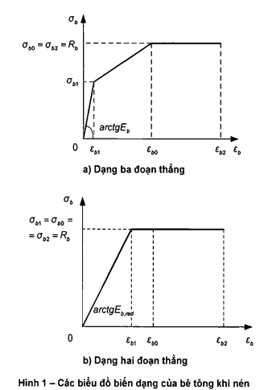

<strong>Hình 1 — Các biểu đồ biến dạng của bê tông khi nén</strong>

Giá trị biến dạng tương đối $\epsilon_{b2}$ đối với bê tông nặng, bê tông hạt nhỏ và bê tông tự ứng suất lấy như sau:

&nbsp;&nbsp;\- Khi có tác dụng ngắn hạn của tải trọng:

Đối với bê tông có cấp cường độ chịu nén từ B60 trở xuống: $\epsilon_{b2}$ = 0,0035;

Đối với bê tông cường độ cao có cấp cường độ chịu nén từ B70 đến B100: $\epsilon_{b2}$ lấy theo nội suy tuyến tính trong khoảng giá trị từ 0,0033 ứng với B70 đến 0,0028 ứng với B100;

&nbsp;&nbsp;\- Khi có tác dụng dài hạn của tải trọng: theo Bảng 9.

Giá trị $R_{b}$ lấy theo 6.1.2.2, 6.12.3, $E_{b}$ theo 6.1.3.3 và $\epsilon_{b0}$ theo 6.1.3.2.

### 6.1.4.3  Đối với biểu đồ hai đoạn thẳng (Hình 1b) thì ứng suất nén của bê tông $\sigma_{b}$, phụ thuộc vào biến dạng co ngắn tương đối của bê tông $\epsilon_{b}$, được xác định theo các công thức sau:

$$\begin{aligned} &\text{Khi } 0 \le \varepsilon_b \le \varepsilon_{b1} \text{ (với } \varepsilon_{b1} = R_b/E_{b,\text{red}}): & \sigma_b &= E_{b,\text{red}}\varepsilon_b \qquad (11) \\ &\text{Khi } \varepsilon_{b1} \le \varepsilon_b \le \varepsilon_{b2}: & \sigma_b &= R_b \qquad (12) \end{aligned}$$
<!-- formula_id: "F_TCVN_5574_2018_FORMULA_11_12" -->

&nbsp;&nbsp;\- Khi 0 ≤ $\varepsilon_{b}$ ≤ $\varepsilon_{b1}$ (với $\varepsilon_{b1}$ = $R_{b}$/$E_{b,red}$)

Mô đun biến dạng quy đổi của bê tông $E_{b,red}$ được xác định theo công thức:

$$E_{b,red} = \frac{R_b}{\varepsilon_{b1,red}}$$
<!-- formula_id: "F_TCVN_5574_2018_FORMULA_13" -->

Biến dạng tương đối của bê tông $\epsilon_{b1,red}$ được lấy như sau:

&nbsp;&nbsp;\- Khi có tác dụng ngắn hạn của tải trọng:

Đối với bê tông nặng: $\epsilon_{b1,red}$ = 0,0015;

Đối với bê tông nhẹ: $\epsilon_{b1,red}$ = 0,0022;

&nbsp;&nbsp;\- Khi có tác dụng dài hạn của tải trọng:

Đối với bê tông nặng: lấy theo Bảng 9.

Các giá trị $R_{b}$, $\epsilon_{b2}$ lấy như trong 6.1.4.2.

### 6.1.4.4  Ứng suất kéo của bê tông $\sigma_{bt}$, phụ thuộc vào biến dạng tương đối $\epsilon_{bt}$, được xác định theo các biểu đồ trong 6.1.4.2 và 6.1.4.3. Khi đó:

&nbsp;&nbsp;\- Giá trị cường độ chịu nén tính toán của bê tông $R_{b}$ được thay bằng giá trị cường độ chịu kéo tính toán của bê tông $R_{bt}$ theo 6.1.2.2, 6.1.2.3;

&nbsp;&nbsp;\- Giá trị mô đun đàn hồi ban đầu $E_{b}$ được xác định theo 6.1.3.3;

&nbsp;&nbsp;\- Giá trị biến dạng tương đối $\epsilon_{bt0}$ lấy theo 6.1.3.2;

&nbsp;&nbsp;\- Giá trị biến dạng tương đối $\epsilon_{bt2}$ đối với bê tông nặng, bê tông hạt nhỏ và bê tông tự ứng suất lấy

bằng 0,00015 khi có tác dụng ngắn hạn của tải trọng và lấy theo Bảng 9 khi có tác dụng dài hạn của tải trọng.

Đối với biểu đồ hai đoạn thẳng lấy $\epsilon_{bt1,red}$ = 0,00008 khi có tác dụng ngắn hạn của tải trọng và theo Bảng 9 khi có tác dụng dài hạn của tải trọng; giá trị $E_{bt,red}$ được xác định theo công thức (13), nhưng trong đó thay $R_{b}$ bằng $R_{bt}$ và $\epsilon_{b1,red}$ bằng $\epsilon_{bt1,red}$.

### 6.1.4.5  Khi tính toán độ bền cấu kiện bê tông cốt thép theo mô hình biến dạng phi tuyến thì để đánh giá trạng thái ứng suất - biến dạng của vùng bê tông chịu nén nên sử dụng các biểu đồ biến dạng của bê tông chịu nén nêu trong 6.1.4.2 và 6.1.4.3 với các đặc trưng biến dạng ứng với tác dụng ngắn hạn của tải trọng. Khi đó, để đơn giản nhất, nên sử dụng biểu đồ biến dạng hai đoạn thẳng của bê tông.

### 6.1.4.6  Khi tính toán theo sự hình thành vết nứt trong cấu kiện bê tông cốt thép theo mô hình biến dạng phi tuyến thì để đánh giá trạng thái ứng suất - biến dạng của bê tông vùng chịu nén và chịu kéo nên sử dụng biểu đồ biến dạng ba đoạn thẳng của bê tông nêu trong 6.1.4.2 và chỉ dẫn nêu trong 6.1.4.4 với các đặc trưng biến dạng ứng với tác dụng ngắn hạn của tải trọng. Khi đó, để đơn giản nhất thì nên sử dụng biểu đồ biến dạng hai đoạn thẳng của bê tông (xem 6.1.4.3) để đánh giá trạng thái ứng suất - biến dạng của bê tông chịu kéo khi bê tông chịu nén làm việc đàn hồi.

### 6.1.4.7  Khi tính toán biến dạng của cấu kiện bê tông cốt thép không có vết nứt theo mô hình biến dạng phi tuyến thì để đánh giá trạng thái ứng suất - biến dạng trong bê tông chịu nén và chịu kéo nên sử dụng biểu đồ biến dạng ba đoạn thẳng của bê tông có kể đến tác dụng ngắn hạn và dài hạn của tải trọng. Khi có vết nứt thì để đánh giá trạng thái ứng suất - biến dạng của bê tông chịu nén, ngoài biểu đồ biến dạng vừa nêu, để đơn giản nhất, sử dụng biểu đồ biến dạng hai đoạn thẳng của bê tông có kể đến tác dụng ngắn hạn và dài hạn của tải trọng.

### 6.1.4.8  Khi tính toán mở rộng vết nứt thẳng góc theo mô hình biến dạng phi tuyến thì để đánh giá trạng thái ứng suất - biến dạng trong bê tông chịu nén nên sử dụng các biểu đồ biến dạng nêu trong 6.1.4.2 và 6.1.4.3 có kể đến tác dụng ngắn hạn của tải trọng. Khi đó, để đơn giản nhất thì nên sử dụng biểu đồ biến dạng hai đoạn thẳng của bê tông.

### 6.1.4.9  Giá trị các đặc trưng độ bền của bê tông ở trạng thái ứng suất phẳng (hai trục) hoặc ứng suất khối (ba trục) cần được xác định có kể đến loại và cấp bê tông theo quan hệ giữa giá trị giới hạn của ứng suất theo hai hoặc ba phương vuông góc với nhau.

Biến dạng của bê tông cần được xác định có kể đến các trạng thái ứng suất phẳng hoặc ứng suất khối.

### 6.2  Cốt thép

### 6.2.1  Các chỉ tiêu chất lượng của cốt thép được sử dụng khi thiết kế

### 6.2.1.1  Khi thiết kế nhà và công trình bê tông cốt thép phù hợp với các yêu cầu đối với kết cấu bê tông và bê tông cốt thép thì phải quy định loại cốt thép sử dụng, các chỉ tiêu chất lượng quy định và cần được kiểm soát của nó.

### 6.2.1.2  Để làm cốt cho kết cấu bê tông cốt thép cần sử dụng các loại thép sau đây phù hợp với các yêu cầu của các tiêu chuẩn tương ứng:

&nbsp;&nbsp;\- Thép thanh cán nóng trơn với đường kính từ 6 mm đến 40 mm theo TCVN 1651-1:2008 và thép thanh cán nóng có gân với đường kính từ 6 mm đến 50 mm theo TCVN 1651-2:2018;

&nbsp;&nbsp;\- Thép thanh gia công cơ nhiệt với đường kính từ 15 mm đến 40 mm theo TCVN 6284-5:1997 (ISO 6934-5:1991);

&nbsp;&nbsp;\- Dãy thép vuốt nguội với đường kính từ 5 mm đến 12 mm theo TCVN 6288:1997 (ISO 10544:1992);

&nbsp;&nbsp;\- Dây thép kéo nguội với đường kính từ 2,5 mm đến 12,2 mm theo TCVN 6284-2:1997 (ISO 6394- 2:1991);

&nbsp;&nbsp;\- Cáp 7 sợi hoặc 19 sợi với đường kính từ 9,3 mm đến 21,8 mm theo TCVN 6284-4:1997 (ISO 6934-4:1991). Cáp được phân thành loại có bề mặt trơn, có gân, hoặc lồi lõm (có vết ấn), hoặc được nén chặt từ dây thép trơn.

### 6.2.1.3  Chỉ tiêu chất lượng cơ bản của cốt thép được quy định khi thiết kế là cấp cường độ chịu kéo của cốt thép.

Cấp cường độ chịu kéo của cốt thép thỏa mãn giá trị được đảm bảo của giới hạn chảy thực tế hoặc quy ước (bằng giá trị của ứng suất ứng với độ giản dài dư tương đối 0,1 % hoặc 0,2 %) với xác suất đảm bảo không nhỏ hơn 0,95 theo các tiêu chuẩn tương ứng.

Ngoài ra, trong các trường hợp cần thiết, cần quy định thêm yêu cầu về các chỉ tiêu chất lượng bổ sung như: tính hàn được, tính dẻo, tính chịu lạnh, tính chống ăn mòn, các đặc trưng bám dính với bê tông, v.v...

### 6.2.1.4  Đối với các kết cấu bê tông cốt thép không ứng suất trước:

&nbsp;&nbsp;\- Để làm cốt thép dọc đặt theo tính toán nên ưu tiên sử dụng cốt thép thanh có gân theo TCVN 1651-2:2018 (loại CB300-V, CB400-V, CB500-V và CB600-V), cũng như cốt thép dạng dây vuốt nguội (theo TCVN 6288:1997 (ISO 10544:1992)) cho lưới cốt thép hàn và khung cốt thép hàn. Khi có luận chứng kinh tế hợp lý thì cho phép sử dụng cốt thép có cấp cường độ chịu kéo (cường độ chịu kéo) cao hơn.

&nbsp;&nbsp;\- Để làm cốt thép ngang và cốt thép hạn chế biến dạng ngang, sử dụng cốt thép trơn theo TCVN 1651-1:2008 (loại CB240-T, CB300-T), cũng như cốt thép thanh có gân theo TCVN 1651-2:2018 (loại CB300-V, CB400-V, CB500-V) và dây thép vuốt nguội theo TCVN 6288:1997 (ISO 10544:1992).

Đối với các kết cấu bê tông cốt thép ứng suất trước:

&nbsp;&nbsp;\- Để làm cốt thép ứng suất trước, sử dụng:

Cốt thép cán nóng có gân theo TCVN 1651-2:2018 (loại CB600-V);

Cốt thép thanh cán nóng cường độ cao có gân theo TCVN 6284-5:1997 (ISO 6934-5:1991);

Dây thép kéo nguội cường độ cao theo TCVN 6284-2:1997 (ISO 6394-2:1991);

Cáp 7 sợi hoặc 19 sợi theo TCVN 6284-4:1997 (ISO 6934-4:1991);

&nbsp;&nbsp;\- Để làm cốt thép không ứng suất trước, sử dụng:

Cốt thép cán nóng trơn theo TCVN 1651-1:2008 (loại CB240-T, CB300-T);

Cốt thép cán nóng có gân theo TCVN 1651-2:2018 (loại CB300-V, CB400-V, CB500-V và CB600-V);

Cốt thép cường độ cao theo TCVN 6284-5:1997 (ISO 6934-5:1991);

Dây thép vuốt nguội theo TCVN 6288:1997 (ISO 10544:1992).

**CHÚ THÍCH:** Tham khảo Phụ lục C để có thêm thông tin về các loại cốt thép tương đương hoặc gần tương đương về cường độ.

### 6.2.1.5  Khi lựa chọn loại cốt thép đặt theo tính toán, cũng như thép cán định hình để làm các chi tiết đặt sẵn thì cần kể đến các điều kiện nhiệt độ làm việc của các kết cấu và đặc điểm chất tải của chúng.

Khi thiết kế vùng truyền ứng suất trước, neo cốt thép trong bê tông và các mối nối chồng cốt thép (không hàn) thì cần kể đến đặc điểm bề mặt cốt thép.

Khi thiết kế các mối nối hàn cốt thép thì cần kể đến biện pháp gia công cốt thép.

### 6.2.1.6  Đối với các móc cẩu (móc nâng) của các cấu kiện bê tông và bê tông cốt thép lắp ghép thì cần sử dụng thép cán nóng loại trơn CB240-T, CB300-T theo TCVN 1651-1:2008.

### 6.2.2  Các đặc trưng độ bền tiêu chuẩn và tính toán của cốt thép

### 6.2.2.1  Đặc trưng độ bền cơ bản của cốt thép là giá trị tiêu chuẩn của cường độ chịu kéo, $R_{s,n}$, lấy phù hợp với loại cốt thép theo Bảng 12.

**CHÚ THÍCH:** Giá trị $R_{s,n}$ lấy bằng giới hạn chảy thực tế (hoặc quy ước) của cốt thép.

### 6.2.2.2  Giá trị tính toán của cường độ chịu kéo của cốt thép $R_{s}$ được xác định theo công thức:

$$R_s = \frac{R_{s,n}}{\gamma_s}$$
<!-- formula_id: "F_TCVN_5574_2018_FORMULA_14" -->

trong đó:

&nbsp;&nbsp;&nbsp;&nbsp;\- $\gamma_{s}$ là hệ số độ tin cậy của cốt thép, lấy bằng 1,15 đối với các trạng thái giới hạn thứ nhất và bằng 1,0 đối với các trạng thái giới hạn thứ hai.

Giá trị tính toán của cường độ chịu kéo của cốt thép $R_{s}$ (đã được làm tròn) đối với các trạng thái giới hạn thứ nhất nêu trong Bảng 13, đối với các trạng thái giới hạn thứ hai - trong Bảng 12. Khi đó giá trị $R_{s,n}$ đối với các trạng thái giới hạn thứ nhất lấy bằng giá trị được kiểm soát nhỏ nhất theo tiêu chuẩn sản phẩm tương ứng.

Cường độ chịu nén tính toán của cốt thép $R_{sc}$ lấy bằng cường độ chịu kéo tính toán $R_{s}$, nhưng không lớn hơn giá trị ứng với biến dạng co ngắn của bê tông bao quanh cốt thép chịu nén: khi có tác dụng ngắn hạn của tải trọng - không lớn hơn 400 MPa, khi có tác dụng dài hạn của tải trọng - không lớn hơn 500 MPa.

Đối với cốt thép dạng dây vuốt nguội theo TCVN 6288:1997 (ISO 10544:1992) và cốt thép cán nóng có gân CB600-V theo TCVN 1651-2:2018 thì các giá trị giới hạn của cường độ chịu nén được lấy với hệ số điều kiện làm việc giảm. Các giá trị tính toán $R_{sc}$ nêu trong Bảng 13.

### 6.2.2.3  Trong các trường hợp cần thiết, giá trị tính toán của các đặc trưng độ bền của cốt thép được nhân thêm với hệ số điều kiện làm việc $\gamma_{si}$ kể đến đặc điểm làm việc của cốt thép trong kết cấu.

Giá trị cường độ tính toán $R_{sw}$ của các loại cốt thép CB240-T, CB300-T theo TCVN 1651-1:2008; CB300-V, CB400-V, CB500-V theo TCVN 1651-2:2018 và dây thép vuốt nguội theo TCVN 6288:1997 (ISO 10544:1992) được nêu trong Bảng 14 (đã được làm tròn).

Đối với cốt thép ngang tất cả các loại thì giá trị cường độ tính toán $R_{sw}$ lấy không lớn hơn 300 MPa.

**CHÚ THÍCH:** TCVN 6288:2997 chỉ đưa ra một loại dây thép vuốt nguội có giới hạn chảy quy ước 500 MPa.

### Bảng 12 - Cường độ chịu kéo tiêu chuẩn của cốt thép $R_{s,n}$ và cường độ chịu kéo tính toán của cốt thép đối với các trạng thái giới hạn thứ hai $R_{s,ser}$

| Loại cốt thép | Tiêu chuẩn | Đường kính danh nghĩa, mm | Giá trị của $R_{s,n}$, MPa, và $R_{s,ser}$, MPa |  |
| :--- | :--- | :--- | :--- | :---: |
| Thép thanh | CB240-T | TCVN 1651-1:2008 | 6,0 đến 40,0 | 240 |
| Thép thanh | CB300-T | TCVN 1651-1:2008 | 6,0 đến 40,0 | 300 |
| Thép thanh | CB300-V | TCVN 1651-2:2018 | 6,0 đến 50,0 | 300 |
| Thép thanh | CB400-V | TCVN 1651-2:2018 | 6,0 đến 50,0 | 400 |
| Thép thanh | CB500-V | TCVN 1651-2:2018 | 6,0 đến 50,0 | 500 |
| Thép thanh | CB600-V | TCVN 1651-2:2018 | 6,0 đến 50,0 | 600 |
| Thép thanh có giới hạn chảy quy ước, MPa | 835 | TCVN 6284-5:1997 (ISO 6934-5:1991) | 15,0 đến 40,0 | 835 |
| Thép thanh có giới hạn chảy quy ước, MPa | 930 | TCVN 6284-5:1997 (ISO 6934-5:1991) | 15,0 đến 40,0 | 930 |
| Thép thanh có giới hạn chảy quy ước, MPa | 1 080 | TCVN 6284-5:1997 (ISO 6934-5:1991) | 15,0 đến 40,0 | 1 080 |
| Dây thép có giới hạn bền, MPa | 1 470 | TCVN 6284-2:1997 (ISO 6394-2:1991) | 9,0; 10,0; 12,2 | 1 200 |
| Dây thép có giới hạn bền, MPa | 1 570 | TCVN 6284-2:1997 (ISO 6394-2:1991) | 7,0; 8,0; 10,0; 12,2 | 1 300 |
| Dây thép có giới hạn bền, MPa | 1 670 | TCVN 6284-2:1997 (ISO 6394-2:1991) | 4,0; 5,0; 6,0; 7,0; 8,0 | 1 400 |
| Dây thép có giới hạn bền, MPa | 1 770 | TCVN 6284-2:1997 (ISO 6394-2:1991) | 4,0; 5,0; 6,0 | 1 500 |
| Dày thép vuốt nguội | TCVN 6288:1997 (ISO 10544:1992) | 5,0 đến 12,0 | 500 |  |
| Cáp 7 sợi thường khử ứng suất có giới hạn bền, MPa | 1 720 | TCVN 6284-4:1997 (ISO 6934-4:1991) | 9,3; 10,8; 12,4; 15,2 | 1450 |
| Cáp 7 sợi thường khử ứng suất có giới hạn bền, MPa | 1 860 | TCVN 6284-4:1997 (ISO 6934-4:1991) | 9,5; 11,1; 12,7; 15,2 | 1 550 |
| Cáp 7 sợi nén chặt khử ứng suất có giới hạn bền, MPa | 1 700 | TCVN 6284-4:1997 (ISO 6934-4:1991) | 18,0 | 1 500 |
| Cáp 7 sợi nén chặt khử ứng suất có giới hạn bền, MPa | 1 820 | TCVN 6284-4:1997 (ISO 6934-4:1991) | 15,2 | 1 600 |
| Cáp 7 sợi nén chặt khử ứng suất có giới hạn bền, MPa | 1 960 | TCVN 6284-4:1997 (ISO 6934-4:1991) | 12,7 | 1 700 |
| Cáp 19 sợi | 1 810 | TCVN 6284-4:1997 (ISO 6934-4:1991) | 20,3; 21,8 | 1 500 |
| Cáp 19 sợi | 1 860 | TCVN 6284-4:1997 (ISO 6934-4:1991) | 17,8; 19,3 | 1 600 |

**CHÚ THÍCH 1:** Giới hạn chảy quy ước của cốt thép đã được khử ứng suất theo TCVN 6284-2:1997 (ISO 6394-2:1991) trong bảng này bằng 85 % giới hạn bền đối với đường kính 8 mm và nhỏ hơn, bằng 82 % giới hạn bền đối với đường kính lớn hơn 8 mm.

**CHÚ THÍCH 2:** Giới hạn chảy quy ước của cáp 7 sợi thường, 7 sợi nén chặt, 19 sợi theo TCVN 6284-4:1997 (ISO 6934-4:1991) trong bảng này lần lượt bằng 85 %, 88 % và 85 % giới hạn bền đối với các loại đường kính.

### Bảng 13 - Cường độ tính toán chịu kéo và chịu nén của cốt thép đối với các trạng thái giới hạn thứ nhất

| Loại cốt thép | Tiêu chuẩn | Cường độ tính toán của cốt thép đối với các trạng thái giới hạn thứ nhất |  |  |
| :--- | :--- | :--- | :--- | :--- |
| Loại cốt thép | Tiêu chuẩn | Khi kéo, $R_{s}$ | Khi nén, $R_{sc}$ |  |
| Thép thanh | CB240-T | TCVN 1651-1:2008 | 210 |  |
| Thép thanh | CB300-T | TCVN 1651-1:2008 | 260 |  |
| Thép thanh | CB300-V | TCVN 1651-2:2018 | 260 |  |
| Thép thanh | CB400-V | TCVN 1651-2:2018 | 350 |  |
| Thép thanh | CB500-V | TCVN 1651-2:2018 | 435 | 435 (400) |
| Thép thanh | CB600-V | TCVN 1651-2:2018 | 520 | 470 (400) |
| Thép thanh có giới hạn chảy quy ước, MPa | 835 | TCVN 6284-5:1997 (ISO 6934-5:1991) | 730 | 500 (400) |
| Thép thanh có giới hạn chảy quy ước, MPa | 930 | TCVN 6284-5:1997 (ISO 6934-5:1991) | 810 | 500 (400) |
| Thép thanh có giới hạn chảy quy ước, MPa | 1 080 | TCVN 6284-5:1997 (ISO 6934-5:1991) | 940 | 500 (400) |
| Dây thép vuốt nguội | TCVN 6288:1997 (ISO 10544:1992) | 435 | 415(380) |  |
| Dây thép có giới hạn chảy quy ước, MPa | 1 200 | TCVN 6284-2:1997 (ISO 6394-2:1991) | 1 040 | 500 (400) |
| Dây thép có giới hạn chảy quy ước, MPa | 1 300 | TCVN 6284-2:1997 (ISO 6394-2:1991) | 1 130 | 500 (400) |
| Dây thép có giới hạn chảy quy ước, MPa | 1 400 | TCVN 6284-2:1997 (ISO 6394-2:1991) | 1 220 | 500 (400) |
| Dây thép có giới hạn chảy quy ước, MPa | 1 500 | TCVN 6284-2:1997 (ISO 6394-2:1991) | 1 300 | 500 (400) |
| Cáp 7 sợi thường khử ứng suất có giới hạn chảy quy ước, MPa | 1 450 | TCVN 6284-4:1997 (ISO 6934-4:1991) | 1 260 | 500 (400) |
| Cáp 7 sợi thường khử ứng suất có giới hạn chảy quy ước, MPa | 1 550 | TCVN 6284-4:1997 (ISO 6934-4:1991) | 1 350 | 500 (400) |
| Cáp 7 sợi nén chặt khử ứng suất có giới hạn chảy quy ước, MPa | 1 500 | TCVN 6284-4:1997 (ISO 6934-4:1991) | 1 300 | 500 (400) |
| Cáp 7 sợi nén chặt khử ứng suất có giới hạn chảy quy ước, MPa | 1 600 | TCVN 6284-4:1997 (ISO 6934-4:1991) | 1 390 | 500 (400) |
| Cáp 7 sợi nén chặt khử ứng suất có giới hạn chảy quy ước, MPa | 1 700 | TCVN 6284-4:1997 (ISO 6934-4:1991) | 1 480 | 500 (400) |
| Cáp 19 sợi có giới hạn chảy quy ước, MPa | 1 500 | TCVN 6284-4:1997 (ISO 6934-4:1991) | 1 300 | 500 (400) |
| Cáp 19 sợi có giới hạn chảy quy ước, MPa | 1 600 | TCVN 6284-4:1997 (ISO 6934-4:1991) | 1 390 | 500 (400) |

**CHÚ THÍCH 1:** Giá trị $R_{sc}$ trong ngoặc đơn được sử dụng chỉ khi tính toán với tác dụng ngắn hạn của tải trọng.

**CHÚ THÍCH 2:** Giới hạn chảy (theo ký hiệu cốt thép) và giới hạn chảy quy ước của cốt thép xem trong Bảng 12.

### Bảng 14 - Cường độ chịu kéo tính toán của cốt thép ngang (cốt thép đai và các thanh uốn xiên) đối với các trạng thái giới hạn thứ nhất

| Loại cốt thép | Tiêu chuẩn | Giá trị của $R_{sw}$ |
| :--- | :--- | :---: |
| CB240-T | TCVN 1651-1:2008 | 170 |
| CB300-T | TCVN 1651-1:2008 | 210 |
| CB300-V | TCVN 1651-2:2018 | 210 |
| CB400-V | TCVN 1651-2:2018 | 280 |
| CB500-V | TCVN 1651-2:2018 | 300 |
| Dây thép kéo nguội | TCVN 6288:1997 (ISO 10544:1992) | 300 |

### 6.2.3  Các đặc trưng biến dạng của cốt thép

### 6.2.3.1  Các đặc trưng biến dạng cơ bản của cốt thép là các giá trị của:

&nbsp;&nbsp;\- Biến dạng giãn dài tương đối của cốt thép $\epsilon_{s0}$ khi ứng suất đạt tới cường độ tính toán $R_{s}$;

&nbsp;&nbsp;\- Mô đun đàn hồi của cốt thép $E_{s}$.

### 6.2.3.2  Giá trị biến dạng tương đối của cốt thép $\epsilon_{s0}$ lấy bằng:

&nbsp;&nbsp;\- Đối với cốt thép có giới hạn chảy thực tế:

$$\varepsilon_{s0} = \frac{R_s}{E_s} \tag{15}$$
<!-- formula_id: "F_TCVN_5574_2018_FORMULA_15" -->

&nbsp;&nbsp;\- Đối với cốt thép có giới hạn chảy quy ước:

$$\varepsilon_{s0} = \frac{R_s}{E_s} + 0,002 \tag{16}$$
<!-- formula_id: "F_TCVN_5574_2018_FORMULA_16" -->

### 6.2.3.3  Giá trị mô đun đàn hồi của cốt thép $E_{s}$ khi kéo và khi nén lấy như nhau và bằng:

&nbsp;&nbsp;\- Đối với cốt thép thanh theo TCVN 1651-1:2008, TCVN 1651-2:2018, TCVN 6284-5:1997 (ISO 6934-5:1991) và đối với dây thép vuốt nguội theo TCVN 6288:1997 (ISO 10544:1992): ……………………………………………………………………………………………. 2,0 x 10$^{5}$ MPa;

&nbsp;&nbsp;\- Đối với dây thép kéo nguội theo TCVN 6284-2:1997 (ISO 6394-2:1991): ……… 2,0 x 10$^{5}$ MPa;

&nbsp;&nbsp;\- Đối với cáp theo TCVN 6284-4:1997 (ISO 6934-4:1991): ……………………….. 1,95 x 10$^{5}$ MPa.

### 6.2.4  Các biểu đồ biến dạng của cốt thép

### 6.2.4.1  Các biểu đồ biến dạng của cốt thép được sử dụng khi tính toán các cấu kiện bê tông cốt thép theo mô hình biến dạng phi tuyến.

Khi tính toán cấu kiện bê tông cốt thép theo mô hình biến dạng phi tuyến, để lấy làm biểu đồ biến dạng của cốt thép (xác định quan hệ giữa ứng suất và biến dạng tương đối của cốt thép), có thể sử dụng các biểu đồ đơn giản hóa theo loại biểu đồ Prandl:

&nbsp;&nbsp;\- Đối với cốt thép có giới hạn chảy thực tế loại CB240-T, CB300-T (theo TCVN 1651-1:2008); CB300- V, CB400-V, CB500-V (theo TCVN 1651-2:2018) và dây thép vuốt nguội (theo TCVN 6288:1997 (ISO 10544:1992)) thì nên sử dụng biểu đồ hai đoạn thẳng (Hình 2a);

&nbsp;&nbsp;\- Đối với cốt thép có giới hạn chảy quy ước (theo TCVN 6284-5:1997 (ISO 6934-5:1991), TCVN 6284-2:1997 (ISO 6394-2:1991), TCVN 6284-4:1997 (ISO 6934-4:1991) và CB600-V theo TCVN 1651-2:2018) thì nên sử dụng biểu đồ ba đoạn thẳng (Hình 2b), không kể đến biến cứng sau thềm chảy.

Các biểu đồ biến dạng của cốt thép khi kéo và khi nén được lấy như nhau, có kể đến cường độ chịu kéo và chịu nén tính toán của cốt thép đã quy định.

Để sử dụng làm các biểu đồ biến dạng tính toán, cho phép sử dụng các biểu đồ đường cong, các biểu đồ biến dạng thực tế gần đúng của cốt thép.

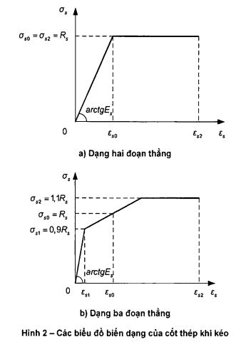

<strong>Hình 2 — Các biểu đồ biến dạng của cốt thép khi kéo</strong>

### 6.2.4.2  Ứng suất trong cốt thép $\sigma_{s}$ theo biểu đồ hai đoạn thẳng được xác định phụ thuộc vào biến dạng tương đối của cốt thép $\epsilon_{s}$ theo các công thức:

$$\begin{aligned} &\text{Khi } 0 < \varepsilon_s < \varepsilon_{s0} : & \sigma_s = \varepsilon_s E_s \qquad (17) \\ &\text{Khi } \varepsilon_{s0} \le \varepsilon_s \le \varepsilon_{s2} : & \sigma_s = R_s \qquad (18) \end{aligned}$$
<!-- formula_id: "F_TCVN_5574_2018_FORMULA_17_18" -->

Các giá trị của $\epsilon_{s0}$, $E_{s}$ và $R_{s}$ lấy theo 6.2.3.2, 6.2.3.3 và 6.2.2.2. Giá trị biến dạng tương đối của cốt thép $\epsilon_{s2}$ lấy bằng 0,025.

Khi có cơ sở phù hợp thì cho phép lấy giá trị biến dạng tương đối $\epsilon_{s2}$ nhỏ hơn hoặc lớn hơn 0,025 phụ thuộc vào mác thép, bố trí cốt thép, tiêu chí tin cậy của kết cấu vá các yếu tố khác.

### 6.2.4.3  Ứng suất trong cốt thép $\sigma_{s}$, theo biểu đồ ba đoạn thẳng được xác định phụ thuộc vào biến dạng tương đối của cốt thép $\epsilon_{s}$, theo các công thức:

$$\begin{aligned} &\text{Khi } 0 < \varepsilon_s < \varepsilon_{s1} : & \sigma_s = \varepsilon_s E_s \qquad (19) \\ &\text{Khi } \varepsilon_{s1} \le \varepsilon_s \le \varepsilon_{s0} : & \sigma_s = \left[ \left(1 - \frac{\sigma_{s1}}{R_s}\right)\frac{\varepsilon_s - \varepsilon_{s1}}{\varepsilon_{s0} - \varepsilon_{s1}} + \frac{\sigma_{s1}}{R_s} \right] R_s \qquad (20) \\ &\text{Khi } \varepsilon_{s0} \le \varepsilon_s \le \varepsilon_{s2} : & \sigma_s = \left[ \left(\frac{\sigma_{s2}}{R_s} - 1\right)\frac{\varepsilon_s - \varepsilon_{s0}}{\varepsilon_{s2} - \varepsilon_{s0}} + 1 \right] R_s \qquad (21) \end{aligned}$$
<!-- formula_id: "F_TCVN_5574_2018_FORMULA_19_21" -->

Các giá trị của $\epsilon_{s0}$, $E_{s}$ và $R_{s}$ lấy theo 6.2.3.2, 6.2.3.3 và 6.2.2.2.

Giá trị ứng suất $\sigma_{s1}$ lấy bằng 0,9$R_{s}$, còn giá trị ứng suất $\sigma_{s2}$ lấy bằng 1,1$R_{s}$.

Giá trị biến dạng tương đối $\epsilon_{s1}$ lấy bằng 0,9$R_{s}$/$E_{s}$, còn biến dạng $\epsilon_{s2}$ lấy bằng 0,015.

## 7  KẾT CẤU BÊ TÔNG

### 7.1  Yêu cầu chung

Kết cấu được xem là kết cấu bê tông nếu như độ bền của nó được đảm bảo chỉ bởi bê tông.

Các cấu kiện bê tông được sử dụng:

a) \- Chủ yếu để chịu nén khi lực nén dọc trục nằm trong phạm vi tiết diện ngang của cấu kiện;

b) \- Trong các trường hợp riêng: trong các kết cấu chịu nén khi lực nén dọc trục nằm ngoài phạm vi tiết diện ngang của cấu kiện, cũng như trong các kết cấu chịu uốn khi mà sự phá hoại của chúng không gây nguy hiểm trực tiếp cho người và sự toàn vẹn của thiết bị.

Kết cấu với cốt thép có diện tích tiết diện nhỏ hơn giá trị tối thiểu cho phép theo yêu cầu cấu tạo trong 10.3 được xem là kết cấu bê tông.

### 7.2  Tính toán cấu kiện bê tông theo độ bền

### 7.2.1  Cấu kiện bê tông được tính toán theo độ bền chịu tác dụng của lực nén dọc trục, mô men uốn và lực cắt, cũng như chịu nén cục bộ.

### 7.2.2  Tính toán độ bền các cấu kiện bê tông khi có tác dụng của lực nén dọc trục (nén lệch tâm) và mô men uốn cần được tiến hành đối với các tiết diện thẳng góc với trục dọc của chúng.

Tính toán các cấu kiện bê tông được tiến hành trên cơ sở mô hình biến dạng phi tuyến theo 8.1.2.7, trong đó diện tích cốt thép trong các công thức tính toán lấy bằng không.

Cho phép tính toán các cấu kiện bê tông tiết diện chữ nhật và chữ T khi có tác dụng của nội lực trong mặt phẳng đối xứng của tiết diện thẳng góc được tiến hành theo nội lực giới hạn theo 7.3 và 7.4.

### 7.2.3  Các cấu kiện bê tông, phụ thuộc vào điều kiện làm việc của chúng và các yêu cầu đối với chúng, được tính toán theo nội lực giới hạn mà không kể đến hoặc có kể đến cường độ chịu kéo của bê tông vùng chịu kéo.

Không kể đến cường độ chịu kéo của bê tông vùng chịu kéo khi tính toán các cấu kiện chịu nén lệch tâm với lực nén dọc trục nằm trong phạm vi tiết diện ngang của cấu kiện, trong đó trạng thái giới hạn được đặc trưng bởi sự phá hoại của bê tông vùng chịu nén (Hình 3). Khi tính toán theo nội lực giới hạn thì cường độ chịu nén của bê tông được quy ước là ứng suất nén của bê tông, có giá trị bằng $R_{b}$ và phân bố đều trên vùng chịu nén của tiết diện (vùng chịu nén quy ước) có trọng tâm trùng với điểm đặt lực dọc (7.3.3).

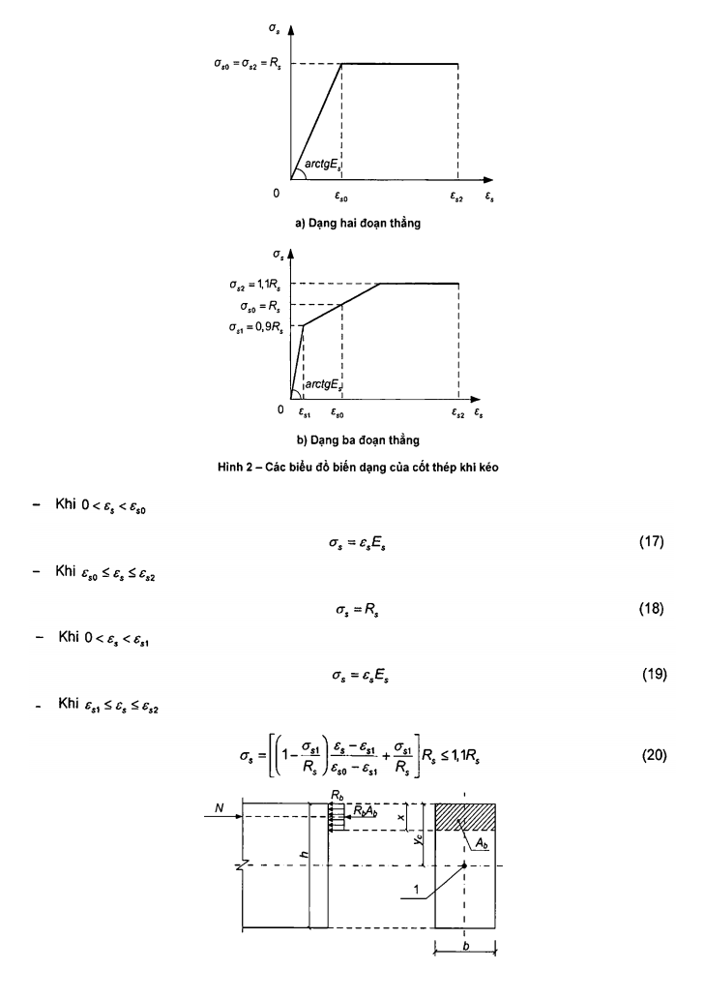

**CHÚ DẪN:**

1 - Trọng tâm tiết diện.

<strong>Hình 3 — Sơ đồ nội lực và biểu đồ ứng suất (tại trạng thái giới hạn) trong tiết diện thẳng góc với trục dọc cấu kiện bê tông chịu nén lệch tâm khi tính toán độ bền không kể đến cường độ chịu kéo của bê tông vùng chịu kéo</strong>

Có kể đến cường độ chịu kéo của bê tông vùng chịu kéo khi tính toán các cấu kiện chịu nén với lực nén dọc trục nằm ngoài phạm vi tiết diện ngang của cấu kiện, khi tính toán các cấu kiện chịu uốn, cũng như khi tính toán các cấu kiện không cho phép nứt theo điều kiện sử dụng kết cấu (Hình 4). Khi đó, khi tính toán theo nội lực giới hạn thì trạng thái giới hạn được đặc trưng bởi sự đạt tới các nội lực giới hạn trong bê tông vùng chịu kéo. Các nội lực giới hạn này được xác định với giả thiết bê tông làm việc đàn hồi (7.3.3, 7.3.4, 7.4).

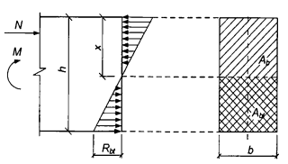

<strong>Hình 4 — Sơ đồ nội lực và biểu đồ ứng suất (tại trạng thái giới hạn) trong tiết diện thẳng góc với trục dọc cấu kiện bê tông chịu uốn (chịu nén lệch tâm) khi tính toán độ bền có kể đến cường độ chịu kéo của bê tông vùng chịu kéo</strong>

### 7.2.4  Tính toán độ bền các cấu kiện bê tông khi có tác dụng của lực cắt được tiến hành theo điều kiện mà tổng của tỉ số giữa ứng suất kéo chính và cường độ chịu kéo dọc trục tính toán, ($\sigma_{mt}$/$R_{bt}$), và tỉ số giữa ứng suất nén chính và cường độ chịu nén tính toán dọc trục, ($\sigma_{mc}$/$R_{b}$), không được vượt quá 1,0, nghĩa là ($\sigma_{mt}$/$R_{bt}$) + ($\sigma_{mc}$/$R_{b}$) ≤ 1,0.

### 7.2.5  Tính toán độ bền các cấu kiện bê tông chịu tác dụng của tải trọng cục bộ (nén cục bộ) được tiến hành theo các chỉ dẫn trong 8.1.5.

### 7.2.6  Trong các cấu kiện bê tông thì phải đặt cốt thép cấu tạo trong các trường hợp nêu trong 10.3.3.2.

### 7.3  Tính toán cấu kiện bê tông chịu nén lệch tâm theo nội lực giới hạn

### 7.3.1  Khi tính toán độ bền các cấu kiện bê tông chịu nén lệch tâm chịu tác dụng của lực nén dọc trục thì cần kể đến độ lệch tâm ngẫu nhiên $e_{a}$. Độ lệch tâm $e_{a}$ này lấy không nhỏ hơn:

1/600 của chiều dài của cấu kiện hoặc của khoảng cách giữa các tiết diện của nó được liên kết chặn chuyển vị;

1/30 chiều cao tiết diện cấu kiện;

## 10  MM.

Đối với các cấu kiện của kết cấu siêu tĩnh, giá trị độ lệch tâm $e_{0}$ của lực dọc đối với trọng tâm của tiết diện quy đổi lấy bằng giá trị độ lệch tâm đã xác định được từ tính toán tĩnh học, nhưng không nhỏ hơn $e_{a}$.

Đối với các cấu kiện của kết cấu tĩnh định, độ lệch tâm $e_{0}$ lấy bằng tổng độ lệch tâm xác định được từ tính toán tĩnh học và độ lệch tâm ngẫu nhiên.

### 7.3.2  Khi độ mảnh của các cấu kiện $L_{0}$/i > 14 thì phải kể đến ảnh hưởng của uốn dọc đến khả năng chịu lực của chúng bằng cách nhân giá trị độ lệch tâm $e_{0}$ với hệ số η được xác định theo 7.3.5.

### 7.3.3  Tính toán cấu kiện bê tông chịu nén lệch tâm khi lực nén dọc nằm trong phạm vi tiết diện ngang của cấu kiện được tiến hành theo điều kiện:

$$N \le R_{b}A_{b} \tag{21}$$
<!-- formula_id: "F_TCVN_5574_2018_FORMULA_21" -->

trong đó:

&nbsp;&nbsp;&nbsp;&nbsp;\- N  là lực dọc tác dụng;

&nbsp;&nbsp;&nbsp;&nbsp;\- $A_{b}$  là diện tích vùng chịu nén của bê tông, được xác định từ điều kiện trọng tâm của nó trùng với điểm đặt lực dọc N (có kể đến uốn dọc).

Đối với các cấu kiện tiết diện ngang chữ nhật:

$$N \le R_b b x \tag{22}$$
<!-- formula_id: "F_TCVN_5574_2018_FORMULA_22" -->

Cho phép tính toán các cấu kiện chịu nén lệch tâm tiết diện chữ nhật khi độ lệch tâm của lực dọc $e_{0}$ ≤ h/30 và $L_{0}$ ≤ 20h theo điều kiện:

$$N \le \varphiR_{b} A \tag{23}$$
<!-- formula_id: "F_TCVN_5574_2018_FORMULA_23" -->

trong đó:

&nbsp;&nbsp;&nbsp;&nbsp;\- A  là diện tích tiết diện ngang của cấu kiện;

&nbsp;&nbsp;&nbsp;&nbsp;\- $\varphi$ là hệ số, phụ thuộc vào độ mảnh của cấu kiện, lấy như sau:

Khi có tác dụng dài hạn của tải trọng: theo Bảng 15;

Khi có tác dụng ngắn hạn của tải trọng: xác định theo quy luật tuyến tính với φ = 0,9 khi $L_{0}$/h = 10 và φ = 0,85 khi $L_{0}$/h = 20;

$L_{0}$  là chiều dài tính toán của cấu kiện, được xác định như đối với cấu kiện bê tông cốt thép.

### Bảng 15 - Hệ số φ khi có tác dụng dài hạn của tải trọng

| $L_{0}$/h | 6 | 10 | 15 | 20 |
| :--- | :---: | :---: | :---: | :---: |
| φ | 0,92 | 0,90 | 0,80 | 0,60 |

**CHÚ THÍCH:** Đối với các giá trị trung gian của $L_{0}$/h thì lấy các giá trị của φ theo nội suy tuyến tính.

Đối với các cấu kiện bê tông chịu nén lệch tâm mà không cho phép xuất hiện vết nứt theo điều kiện sử dụng thì ngoài tính toán theo điều kiện (21) cần phải kiểm tra thêm điều kiện (24) có kể đến sự làm việc của bê tông vùng chịu kéo:

$$N \le \frac{R_{bt} A}{\frac{A}{I} e_0 \eta y_t - 1} \tag{24}$$
<!-- formula_id: "F_TCVN_5574_2018_FORMULA_24" -->

Đối với cấu kiện tiết diện ngang chữ nhật thì điều kiện (24) có dạng:

$$N \le \frac{R_{bt} bh}{\frac{6 e_0 \eta}{h} - 1} \tag{25}$$
<!-- formula_id: "F_TCVN_5574_2018_FORMULA_25" -->

Trong các điều kiện (24) và (25):

A  là diện tích tiết diện ngang của cấu kiện bê tông;

I  là mô men quán tính của tiết diện cấu kiện bê tông đối với trọng tâm của nó;

$y_{t}$  là khoảng cách từ trọng tâm tiết diện cấu kiện đến thớ chịu kéo nhiều nhất;

η là hệ số, lấy theo các chỉ dẫn trong 7.3.5.

### 7.3.4  Tính toán các cấu kiện bê tông chịu nén lệch tâm khi lực nén dọc trục nằm ngoài phạm vi tiết diện ngang của cấu kiện được tiến hành theo các điều kiện (24) và (25).

### 7.3.5  Giá trị hệ số V, kể đến ảnh hưởng của uốn dọc đến giá trị độ lệch tâm của lực dọc $e_{0}$, được xác định theo công thức:

$$\eta = \frac{1}{1 - \frac{N}{N_{cr}}} \tag{26}$$
<!-- formula_id: "F_TCVN_5574_2018_FORMULA_26" -->

trong đó $N_{cr}$ là lực tới hạn quy ước, được xác định theo công thức:

$$N_{cr} = \frac{\pi^2 D}{L_0^2} \tag{27}$$
<!-- formula_id: "F_TCVN_5574_2018_FORMULA_27" -->

trong đó:

&nbsp;&nbsp;&nbsp;&nbsp;\- D  là độ cứng của cấu kiện ở trạng thái giới hạn về độ bền, được xác định như đối với cấu kiện bê tông cốt thép, nhưng không kể đến cốt thép, theo 8.1.2.4.2;

&nbsp;&nbsp;&nbsp;&nbsp;\- $L_{0}$  là chiều dài tính toán của cấu kiện, được xác định theo 8.1.2.4.4.

### 7.4  Tính toán cấu kiện bê tông chịu uốn theo nội lực giới hạn

Tính toán cấu kiện bê tông chịu uốn được tiến hành theo điều kiện:

$$M \le M_u \tag{28}$$
<!-- formula_id: "F_TCVN_5574_2018_FORMULA_28" -->

trong đó:

&nbsp;&nbsp;&nbsp;&nbsp;\- M  là mô men uốn do ngoại lực;

&nbsp;&nbsp;&nbsp;&nbsp;\- $M_{u}$ là mô men uốn giới hạn mà tiết diện cấu kiện có thể chịu được.

Giá trị $M_{u}$ được xác định theo công thức:

$$M_u = R_{bt} W \tag{29}$$
<!-- formula_id: "F_TCVN_5574_2018_FORMULA_29" -->

trong đó: W là mô men kháng uốn của tiết diện cấu kiện đối với thớ chịu kéo ngoài cùng.

Đối với cấu kiện tiết diện ngang chữ nhật:

$$W = \frac{bh^2}{6} \tag{30}$$
<!-- formula_id: "F_TCVN_5574_2018_FORMULA_30" -->

## 8  KẾT CẤU BÊ TÔNG CỐT THÉP KHÔNG ỨNG SUẤT TRƯỚC

### 8.1  Tính toán cấu kiện bê tông cốt thép theo các trạng thái giới hạn thứ nhất

### 8.1.1  Yêu cầu chung đối với tính toán độ bền

Cấu kiện bê tông cốt thép được tính toán theo độ bền chịu tác dụng của mô men uốn, lực dọc, lực cắt, mô men xoắn và chịu tác dụng của tải trọng cục bộ (nén cục bộ, chọc thủng).

### 8.1.2  Tính toán độ bền cấu kiện bê tông cốt thép chịu tác dụng của mô men uốn và lực dọc

### 8.1.2.1  Yêu cầu chung

### 8.1.2.1.1  Tính toán độ bền cấu kiện bê tông cốt thép khi có tác dụng của mô men uốn và lực dọc (nén lệch tâm hoặc kéo lệch tâm) cần được tiến hành đối với các tiết diện thẳng góc với trục dọc cấu kiện.

Tính toán độ bền các tiết diện thẳng góc của các cấu kiện bê tông cốt thép cần được tiến hành trên cơ sở mô hình biến dạng phi tuyến theo 8.1.2.7, cũng như trên cơ sở nội lực giới hạn đối với:

&nbsp;&nbsp;\- Các cấu kiện bê tông cốt thép tiết diện chữ nhật, chữ T và chữ I có cốt thép nằm ở biên vuông góc với mặt phẳng uốn của cấu kiện khi có tác dụng của nội lực trong mặt phẳng đối xứng của tiết diện thẳng góc - theo 8.1.2.2, 8.1.2.3, 8.1.2.4.1 đến 8.1.2.4.3;

&nbsp;&nbsp;\- Các cấu kiện chịu nén lệch tâm tiết diện vành khuyên và tròn - theo Phụ lục F.

### 8.1.2.1.2  Khi tính toán các cấu kiện chịu nén lệch tâm thì cần kể đến ảnh hưởng của uốn dọc đến khả năng chịu lực của chúng bằng cách tính kết cấu theo sơ đồ biến dạng (phi tuyến hình học).

Cho phép tính toán kết cấu theo sơ đồ không biến dạng, nhưng kể đến ảnh hưởng của uốn dọc cấu kiện đến độ bền của nó khi độ mảnh $L_{0}$/i > 14 bằng cách nhân độ lệch tâm ban đầu $e_{0}$ với hệ số η, xác định theo 8.1.2.4.2.

### 8.1.2.1.3  Đối với các cấu kiện bê tông cốt thép, mà trong đó nội lực giới hạn về độ bền nhỏ hơn nội lực giới hạn về hình thành vết nứt (xem 8.2.2.2), thì diện tích tiết diện cốt thép dọc chịu kéo cần phải tăng thêm không ít hơn 15 % so với diện tích cốt thép yêu cầu từ tính toán độ bền, hoặc được xác định từ tính toán độ bền chịu tác dụng của nội lực giới hạn về hình thành vết nứt.

### 8.1.2.2  Tính toán độ bền tiết diện thẳng góc theo nội lực giới hạn

### 8.1.2.2.1  Nội lực giới hạn trên tiết diện thẳng góc với trục dọc cấu kiện cần xác định từ các giả thiết sau:

&nbsp;&nbsp;\- Cường độ chịu kéo của bê tông lấy bằng không:

&nbsp;&nbsp;\- Cường độ chịu nén của bê tông lấy bằng ứng suất, có giá trị bằng $R_{b}$ và được phân bố đều trên vùng chịu nén của bê tông;

&nbsp;&nbsp;\- Biến dạng (ứng suất) trong cốt thép được xác định phụ thuộc vào chiều cao vùng chịu nén của bê tông;

&nbsp;&nbsp;\- Ứng suất kéo trong cốt thép lấy không lớn hơn cường độ chịu kéo tính toán $R_{s}$;

&nbsp;&nbsp;\- Ứng suất nén trong cốt thép lấy không lớn hơn cường độ chịu nén tính toán $R_{sc}$.

### 8.1.2.2.2  Tính toán độ bền tiết diện thẳng góc cần được tiến hành phụ thuộc vào sự tương quan giữa giá trị chiều cao tương đối của vùng chịu nén của bê tông ξ = x/$h_{0}$, được xác định từ các điều kiện cân bằng tương ứng, và giá trị chiều cao tương đối giới hạn của vùng chịu nén của bê tông $\xi_{R}$, tại thời điểm khi trạng thái giới hạn của cấu kiện xảy ra đồng thời với việc ứng suất trong cốt thép chịu kéo đạt tới cường độ tính toán $R_{s}$.

### 8.1.2.2.3  Giá trị $\xi_{R}$ được xác định theo công thức:

$$\xi_R = \frac{x_R}{h_0} = \frac{0,8}{1 + \frac{\varepsilon_{s,el}}{\varepsilon_{b2}}} \tag{31}$$
<!-- formula_id: "F_TCVN_5574_2018_FORMULA_31" -->

trong đó:

&nbsp;&nbsp;&nbsp;&nbsp;\- $x_{R}$  là chiều cao giới hạn của vùng bê tông chịu nén;

&nbsp;&nbsp;&nbsp;&nbsp;\- $\epsilon_{sel}$  là biến dạng tương đối của cốt thép chịu kéo khi ứng suất bằng $R_{s}$:

$$\varepsilon_{s,el} = \frac{R_s}{E_s} \tag{32}$$
<!-- formula_id: "F_TCVN_5574_2018_FORMULA_32" -->

$\epsilon_{b2}$ là biến dạng tương đối của bê tông chịu nén khi ứng suất bằng $R_{b}$, lấy theo các chỉ dẫn trong 6.1.4.2 khi có tác dụng ngắn hạn của tải trọng.

Đối với bê tông nặng có cấp cường độ chịu nén từ B70 đến B100 và đối với bê tông hạt nhỏ thì trên tử số của công thức (31) thay 0,8 bằng 0,7.

### 8.1.2.2.4  Khi tính toán các cấu kiện bê tông cốt thép chịu nén lệch tâm thì trong độ lệch tâm ban đầu của lực dọc $e_{0}$ cần kể đến độ lệch tâm ngẫu nhiên $e_{a}$. Độ lệch tâm $e_{a}$ này lấy không nhỏ hơn:

1/600 của chiều dài của cấu kiện hoặc của khoảng cách giữa các tiết diện của nó được liên kết chặn chuyển vị;

1/30 chiều cao tiết diện cấu kiện;

## 10  MM.

Đối với các cấu kiện của kết cấu siêu tĩnh, giá trị độ lệch tâm $e_{0}$ của lực dọc đối với trọng tâm của tiết diện quy đổi lấy bằng giá trị độ lệch tâm đã xác định được từ tính toán tĩnh học, nhưng không nhỏ hơn $e_{a}$.

Đối với các cấu kiện của kết cấu tĩnh định, độ lệch tâm $e_{0}$ lấy bằng tổng độ lệch tâm xác định được từ tính toán tĩnh học và độ lệch tâm ngẫu nhiên.

### 8.1.2.3  Tính toán cấu kiện bê tông cốt thép chịu uốn theo nội lực giới hạn

### 8.1.2.3.1  Tính toán độ bền tiết diện của cấu kiện bê tông cốt thép chịu uốn được tiến hành theo điều kiện:

$$M \le M_{u} \tag{33}$$
<!-- formula_id: "F_TCVN_5574_2018_FORMULA_33" -->

trong đó:

&nbsp;&nbsp;&nbsp;&nbsp;\- M  là mô men do ngoại lực;

&nbsp;&nbsp;&nbsp;&nbsp;\- $M_{u}$  là mô men giới hạn mà tiết diện cấu kiện có thể chịu được.

### 8.1.2.3.2  Giá trị $M_{u}$ đối với cấu kiện chịu uốn tiết diện chữ nhật (Hình 5) khi ξ = x/$h_{0}$ ≤ $\xi_{R}$ được xác định theo công thức:

$$M_u = R_b b x (h_0 - 0,5x) + R_{sc} A'_s (h_0 - a') \tag{34}$$
<!-- formula_id: "F_TCVN_5574_2018_FORMULA_34" -->

trong đó chiều cao vùng chịu nén x được xác định theo công thức:

$$x = \frac{R_s A_s - R_{sc} A'_s}{R_b b} \tag{35}$$
<!-- formula_id: "F_TCVN_5574_2018_FORMULA_35" -->

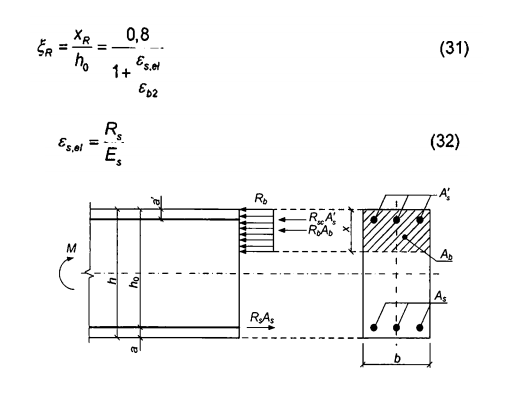

<strong>Hình 5 — Sơ đồ nội lực và biểu đồ ứng suất trong tiết diện thẳng góc với trục dọc cấu kiện bê tông cốt thép chịu uốn khi tính toán theo độ bền</strong>

### 8.1.2.3.3  Giá trị $M_{u}$ đối với cấu kiện chịu uốn có cánh nằm trong vùng chịu nén (tiết diện chữ T và chữ I), khi ξ = x/$h_{0}$ ≤ $\xi_{R}$ được xác định phụ thuộc vào vị trí biên vùng chịu nén:

a) \- Nếu biên vùng chịu nén nằm trong cánh (Hình 6a), nghĩa là thỏa mãn điều kiện:

$$R_s A_s \le R_b b'_f h'_f + R_{sc} A'_s \tag{36}$$
<!-- formula_id: "F_TCVN_5574_2018_FORMULA_36" -->

thì giá trị $M_{u}$ được xác định theo 8.1.2.3.2 như đối với tiết diện chữ nhật có chiều rộng $b_r$.

b) \- Nếu biên vùng nén nằm trong sườn (Hình 6b), nghĩa là điều kiện (36) không được thỏa mãn thì giá trị $M_{u}$ được xác định theo công thức:

$$M_u = R_b b x (h_0 - 0,5x) + R_b (b'_f - b) h'_f (h_0 - 0,5 h'_f) + R_{sc} A'_s (h_0 - a') \tag{37}$$
<!-- formula_id: "F_TCVN_5574_2018_FORMULA_37" -->

trong đó chiều cao vùng chịu nén của bê tông x được xác định theo công thức:

$$x = \frac{R_s A_s - R_{sc} A'_s - R_b (b'_f - b) h'_f}{R_b b} \tag{38}$$
<!-- formula_id: "F_TCVN_5574_2018_FORMULA_38" -->

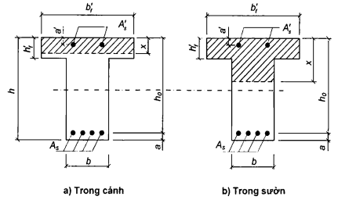

<strong>Hình 6 — Vị trí biên vùng chịu nén trên tiết diện của cấu kiện bê tông cốt thép chịu uốn</strong>

### 8.1.2.3.4  Giá trị $b_r$ đưa vào tính toán được lấy từ điều kiện sao cho chiều rộng mỗi bên cánh, tính từ mép sườn dầm, không được lớn hơn 1/6 nhịp cấu kiện và không lớn hơn:

a) \- Khi $h_r$ ≥ 0,1h:1/2 khoảng cách thông thủy giữa các sườn dọc khi có sườn ngang;

b) \- Khi không có sườn ngang (hoặc khi khoảng cách giữa chúng lớn hơn khoảng cách giữa các sườn dọc) và $h_r$; < 0,1h: 6$h_r$;

c) \- Khi cánh có dạng công xôn:

&nbsp;&nbsp;&nbsp;&nbsp;\- Khi $h_r$ ≥ 0,1h: 6$h_r$;

&nbsp;&nbsp;&nbsp;&nbsp;\- Khi 0,05h ≤ $h_r$ < 0,1h: 3$h_r$;

&nbsp;&nbsp;&nbsp;&nbsp;\- Khi $h_r$ < 0,05h: cánh không kể đến trong tính toán.

### 8.1.2.3.5  Khi tính toán độ bền cấu kiện chịu uốn nên tuân theo điều kiện x ≤ $\xi_{R}h_{0}$.

Trong trường hợp, nếu diện tích cốt thép chịu kéo đặt theo yêu cầu cấu tạo hoặc từ tính toán theo các trạng thái giới hạn thứ hai được lấy lớn hơn so với cốt thép yêu cầu để tuân theo điều kiện x ≤ $\xi_{R}h_{0}$, thì cho phép xác định mô men uốn giới hạn $M_{u}$ theo các công thức (34) hoặc (37), trong đó thay chiều cao vùng chịu nén x = $\xi_{R}h_{0}$.

### 8.1.2.3.6  Trường hợp đặt cốt thép đối xứng, khi $R_{s}A_{s}$ = $R_{sc}A_s'$, thì giá trị $M_{u}$ được xác định theo công thức:

$$Mu = R_{s}A_{s} ( h_{0} -a’) \tag{39}$$
<!-- formula_id: "F_TCVN_5574_2018_FORMULA_39" -->

Nếu chiều cao vùng chịu nén x được tính không kể đến cốt thép chịu nén ($A_s'$ = 0) mà nhỏ hơn 2a' thì trong công thức (39) thay giá trị a' bằng giá trị x/2.

### 8.1.2.4  Tính toán cấu kiện bê tông cốt thép chịu nén lệch tâm theo nội lực giới hạn

### 8.1.2.4.1  Tính toán độ bền tiết diện chữ nhật của cấu kiện chịu nén lệch tâm được tiến hành theo điều kiện:

$$N e \le R_b b x (h_0 - 0,5x) + R_{sc} A'_s (h_0 - a')$$
<!-- formula_id: "F_TCVN_5574_2018_FORMULA_39" -->

trong đó:

&nbsp;&nbsp;&nbsp;&nbsp;\- N  là lực dọc do ngoại lực;

&nbsp;&nbsp;&nbsp;&nbsp;\- e  là khoảng cách từ điểm đặt lực dọc N đến trọng tâm tiết diện cốt thép chịu kéo hoặc chịu nén ít hơn (khi toàn bộ tiết diện chịu nén):

$$e = e_0 \eta + 0,5h - a$$
<!-- formula_id: "F_TCVN_5574_2018_FORMULA_40" -->

trong đó:

&nbsp;&nbsp;&nbsp;&nbsp;\- $\eta$ là hệ số, kể đến ảnh hưởng của uốn dọc cấu kiện đến khả năng chịu lực của nó và được xác định theo 8.1.2.4.2;

&nbsp;&nbsp;&nbsp;&nbsp;\- $e_{0}$ - theo 8.1.2.2.4.

Chiều cao vùng chịu nén x được xác định như sau:

a) \- Khi ξ = x/$h_{0}$ ≤ $\xi_{R}$ (Hình 7): theo công thức

$$x = \frac{N + R_s A_s - R_{sc} A'_s}{R_b b} \tag{42}$$
<!-- formula_id: "F_TCVN_5574_2018_FORMULA_42" -->

$$x = \frac{N + R_s A_s \frac{1 + \xi_R}{1 - \xi_R} - R_{sc} A'_s}{R_b b + \frac{2 R_s A_s}{h_0 (1 - \xi_R)}} \tag{43}$$
<!-- formula_id: "F_TCVN_5574_2018_FORMULA_43" -->

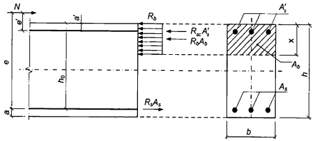

<strong>Hình 7 — Sơ đồ nội lực và biểu đồ ứng suất trong tiết diện thẳng góc với trục dọc cấu kiện bê tông cốt thép chịu nén lệch tâm khi tính toán độ bền</strong>

### 8.1.2.4.2  Giá trị hệ số uốn dọc η khi tính toán kết cấu theo sơ đồ không biến dạng được xác định theo công thức:

$$\eta = \frac{1}{1 - \frac{N}{N_{cr}}} \tag{44}$$
<!-- formula_id: "F_TCVN_5574_2018_FORMULA_44" -->

trong đó:

&nbsp;&nbsp;&nbsp;&nbsp;\- N  là lực dọc do ngoại lực;

&nbsp;&nbsp;&nbsp;&nbsp;\- $N_{cr}$  là lực tới hạn quy ước, được xác định theo công thức:

$$N_{cr} = \frac{\pi^2 D}{L_0^2} \tag{45}$$
<!-- formula_id: "F_TCVN_5574_2018_FORMULA_45" -->

trong đó:

&nbsp;&nbsp;&nbsp;&nbsp;\- D  là độ cứng của cấu kiện bê tông cốt thép ở trạng thái giới hạn về độ bền, được xác định theo các chỉ dẫn về tính toán biến dạng;

&nbsp;&nbsp;&nbsp;&nbsp;\- $L_{0}$ là chiều dài tính toán của cấu kiện, được xác định theo 8.1.2.4.4.

Cho phép xác định giá trị D theo công thức:

$$D = k_{b}E_{b} I + k_{s}E_{s}I_{s} \tag{46}$$
<!-- formula_id: "F_TCVN_5574_2018_FORMULA_46" -->

trong đó:

&nbsp;&nbsp;&nbsp;&nbsp;\- $E_{b}$, $E_{s}$ là mô đun đàn hồi lần lượt của bê tông và của cốt thép;

&nbsp;&nbsp;&nbsp;&nbsp;\- I, $I_{s}$ là mô men quán tính của diện tích tiết diện lần lượt của bê tông và của toàn bộ cốt thép dọc đối với trọng tâm tiết diện ngang của cấu kiện;

&nbsp;&nbsp;&nbsp;&nbsp;\- $k_{s}$ = 0,7;

$$k_b = \frac{0,15}{\varphi_L (0,3 + \delta_e)} \tag{47}$$
<!-- formula_id: "F_TCVN_5574_2018_FORMULA_47" -->

$\varphi_{L}$ là hệ số, kể đến ảnh hưởng của thời hạn tác dụng của tải trọng:

$$\varphi_L = 1 + \frac{M_{L1}}{M_L} \tag{48}$$
<!-- formula_id: "F_TCVN_5574_2018_FORMULA_48" -->

nhưng không lớn hơn 2;

$M_{L}$ là mô men đối với trọng tâm của thanh thép chịu kéo nhiều nhất hoặc chịu nén ít nhất (khi toàn bộ tiết diện chịu nén) do tác dụng của toàn bộ tải trọng;

$M_{L1}$  là mô men đối với trọng tâm của thanh thép chịu kéo nhiều nhất hoặc chịu nén ít nhất (khi toàn bộ tiết diện chịu nén) do tác dụng của tải trọng thường xuyên và tạm thời dài hạn;

$\delta_{e}$ là giá trị độ lệch tâm tương đối của lực dọc ($\delta_{e}$ = $e_{0}$/h), lấy không nhỏ hơn 0,15 và không lớn hơn 1,5.

Cho phép giảm giá trị hệ số η để kể đến sự phân bố mô men uốn theo chiều dài cấu kiện, đặc điểm biến dạng của nó và ảnh hưởng của uốn dọc đến giá trị mô men uốn trong tiết diện tính toán bằng cách tính toán kết cấu như một hệ đàn hồi.

### 8.1.2.4.3  Tính toán độ bền tiết diện chữ nhật của các cấu kiện chịu nén lệch tâm với cốt thép nằm ở các phía đối diện nhau trong mặt phẳng uốn của tiết diện, khi độ lệch tâm của lực dọc $e_{0}$ ≤ h/30 và độ mảnh $L_{0}$/h ≤ 20, được phép tiến hành theo điều kiện:

$$N \le N_{u} \tag{49}$$
<!-- formula_id: "F_TCVN_5574_2018_FORMULA_49" -->

trong đó $N_{u}$ là giá trị giới hạn của lực dọc mà tiết diện có thể chịu được, được xác định theo công thức:

$$N_{u} = φ( R_{b} A+ R_{sc}A_{s,tot} ) \tag{50}$$
<!-- formula_id: "F_TCVN_5574_2018_FORMULA_50" -->

trong đó:

&nbsp;&nbsp;&nbsp;&nbsp;\- A  là diện tích tiết diện bê tông;

&nbsp;&nbsp;&nbsp;&nbsp;\- $A_{s,tot}$  là diện tích toàn bộ cốt thép dọc trong tiết diện cấu kiện;

&nbsp;&nbsp;&nbsp;&nbsp;\- $\varphi$ là hệ số, phụ thuộc vào độ mảnh của cấu kiện, lấy như sau:

Khi có tác dụng dài hạn của tải trọng: lấy theo Bảng 16;

Khi có tác dụng ngắn hạn của tải trọng: xác định theo quy luật tuyến tính với φ = 0,9 khi $L_{0}$/h = 10 và φ = 0,85 khi $L_{0}$/h = 20.

### Bảng 16 - Hệ số φ khi có tác dụng dài hạn của tải trọng

| Cấp cường độ chịu nén của bê tông | Giá trị của φ khi $L_{0}$/h bằng |  |  |  |
| :--- | :---: | :---: | :---: | :---: |
| Cấp cường độ chịu nén của bê tông | 6 | 10 | 15 | 20 |
| B20 đến B55 | 0,92 | 0,90 | 0,83 | 0,70 |
| B60 đến B70 | 0,91 | 0,89 | 0,80 | 0,65 |
| B80 đến B90 | 0,90 | 0,88 | 0,79 | 0,64 |
| B100 | 0,89 | 0,87 | 0,78 | 0,63 |

**CHÚ THÍCH:** Với các giá trị trung gian của $L_{0}$/h thì giá trị của φ lấy theo nội suy tuyến tính.

### 8.1.2.4.4  Chiều dài tính toán $L_{0}$ của cấu kiện chịu nén lệch tâm được xác định như đối với cấu kiện của kết cấu khung có kể đến trạng thái biến dạng của kết cấu khung khi tải trọng bố trí ở vị trí bất lợi nhất của đối với cấu kiện này, có chú ý đến biến dạng không đàn hồi của vật liệu và sự có mặt của vết nứt.

Cho phép lấy chiều dài tính toán $L_{0}$ của cấu kiện có tiết diện ngang không đổi dọc theo chiều dài L khi có tác dụng của lực dọc như sau:

&nbsp;&nbsp;\- Đối với cấu kiện hai đầu khớp: 	1,0L;

&nbsp;&nbsp;\- Đối với cấu kiện một đầu ngàm cứng (loại trừ được sự xoay của tiết diện gối tựa) và một đầu tự do (công xôn): 	2,0L;

&nbsp;&nbsp;\- Đối với cấu kiện một đầu khớp cố định và một đầu:

Ngàm cứng (không xoay): 	0,7L;

Ngàm nửa cứng (cho phép xoay một góc hạn chế): 	0,9L;

&nbsp;&nbsp;\- Đối với cấu kiện một đầu khớp cho phép gối tựa dịch chuyển hạn chế và một đầu:

Ngàm cứng (không xoay): 	1,5L;

Ngàm nửa cứng (với góc xoay hạn chế): 	2,0L;

&nbsp;&nbsp;\- Đối với cấu kiện hai đầu ngàm cố định:

Ngàm cứng (không xoay): 	0,5L;

Ngàm nửa cứng (với góc xoay hạn chế): 	0,8L;

&nbsp;&nbsp;\- Đối với cấu kiện hai đầu ngàm di động hạn chế:

Ngàm cứng (không xoay): 	0,8L;

Ngàm nửa cứng (với góc xoay hạn chế): 	1,2L.

### 8.1.2.5  Tính toán cấu kiện bê tông cốt thép chịu kéo đúng tâm theo nội lực giới hạn

Tính toán độ bền tiết diện của cấu kiện chịu kéo đúng tâm cần được tiến hành theo điều kiện:

$$N \le N_{u} \tag{51}$$
<!-- formula_id: "F_TCVN_5574_2018_FORMULA_51" -->

trong đó:

&nbsp;&nbsp;&nbsp;&nbsp;\- N  là lực kéo do ngoại lực;

&nbsp;&nbsp;&nbsp;&nbsp;\- $N_{u}$  là lực kéo giới hạn mà cấu kiện có thể chịu được.

Giá trị lực $N_{u}$ được xác định theo công thức:

$$N_{u} = R_{s}A_{s,tot} \tag{52}$$
<!-- formula_id: "F_TCVN_5574_2018_FORMULA_52" -->

trong đó $A_{s,tot}$ là diện tích tiết diện của toàn bộ cốt thép dọc.

### 8.1.2.6  Tính toán cấu kiện bê tông cốt thép chịu kéo lệch tâm theo nội lực giới hạn

Tính toán độ bền các tiết diện của cấu kiện chịu kéo lệch tâm tiết diện chữ nhật cần được tiến hành phụ thuộc vào vị trí của lực dọc N:

a) \- Nếu lực dọc N nằm trong khoảng giữa các hợp lực của các nội lực trong cốt thép S và S' (Hình 8a): theo các điều kiện

$$N e \le M_u \tag{53}$$
<!-- formula_id: "F_TCVN_5574_2018_FORMULA_53" -->

$$N e' \le M'_u \tag{54}$$
<!-- formula_id: "F_TCVN_5574_2018_FORMULA_54" -->

trong đó:

&nbsp;&nbsp;&nbsp;&nbsp;\- Ne và Ne' là các mô men do ngoại lực;

&nbsp;&nbsp;&nbsp;&nbsp;\- $M_{u}$ và $
<!-- formula_id: "F_TCVN_5574_2018_RID74" -->$ là các mô men giới hạn mà tiết diện có thể chịu được.

Các mô men $M_{u}$ và $
<!-- formula_id: "F_TCVN_5574_2018_RID76" -->$ được xác định theo các công thức:

$$M_u = R_s A_s (h_0 - a') \tag{55}$$
<!-- formula_id: "F_TCVN_5574_2018_FORMULA_55" -->

$$M'_u = R_s A'_s (h_0 - a') \tag{56}$$
<!-- formula_id: "F_TCVN_5574_2018_FORMULA_56" -->

b) \- Nếu lực dọc N nằm ngoài khoảng giữa các hợp lực của các nội lực trong cốt thép S và S' (Hình 8b): theo điều kiện (53), với mô men giới hạn $M_{u}$ được xác định theo công thức:

$$M_u = R_b b x (h_0 - 0,5x) + R_{sc} A'_s (h_0 - a') \tag{57}$$
<!-- formula_id: "F_TCVN_5574_2018_FORMULA_57" -->

khi đó, chiều cao vùng chịu nén x được xác định theo công thức:

$$x = \frac{R_s A_s - R_{sc} A'_s - N}{R_b b} \tag{58}$$
<!-- formula_id: "F_TCVN_5574_2018_FORMULA_58" -->

Nếu giá trị x tính được theo công thức (58) lớn hơn $\xi_{R}h_{0}$ thì thay x = $\xi_{R}h_{0}$ vào công thức (57), trong đó $\xi_{R}$ được xác định theo các chỉ dẫn trong 8.1.2.2.3.

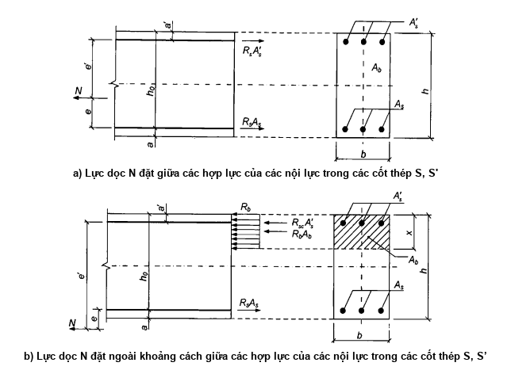

<strong>Hình 8 — Sơ đồ nội lực và biểu đồ ứng suất trên tiết diện thẳng góc với trục dọc cấu kiện bê tông cốt thép chịu kéo lệch tâm khi tính toán tiết diện theo độ bền</strong>

### 8.1.2.7  Tính toán độ bền tiết diện thẳng góc theo mô hình biến dạng phi tuyến

### 8.1.2.7.1  Khi tính toán độ bền thì nội lực và biến dạng trong tiết diện thẳng góc với trục dọc cấu kiện được xác định dựa trên mô hình biến dạng phi tuyến có sử dụng các phương trình cân bằng ngoại lực và nội lực trong tiết diện cấu kiện, cũng như dựa trên các giả thiết sau:

&nbsp;&nbsp;\- Sự phân bố biến dạng tương đối của bê tông và cốt thép theo chiều cao tiết diện cấu kiện được lấy theo quy luật tuyến tính (giả thiết tiết diện phẳng);

&nbsp;&nbsp;\- Quan hệ giữa ứng suất dọc trục và biến dạng tương đối của bê tông và của cốt thép được lấy theo các biểu đồ biến dạng của bê tông và cốt thép;

&nbsp;&nbsp;\- Cường độ chịu kéo của bê tông vùng chịu kéo cho phép không kể đến, trong đó lấy ứng suất $\sigma_{bi}$ = 0 khi $\epsilon_{bi}$ ≥ 0. Trong các trường hợp riêng (ví dụ, các kết cấu bê tông chịu uốn và chịu nén lệch tâm, mà trong đó không cho phép có vết nứt) thì tính toán độ bền được tiến hành có kể đến sự làm việc của bê tông chịu kéo.

### 8.1.2.7.2  Để tính nội lực tổng quát từ biểu đồ ứng suất trong bê tông thì sử dụng quy trình tích phân số các ứng suất trên tiết diện thẳng góc. Để làm được điều này, tiết diện thẳng góc được quy ước chia ra thành nhiều phần nhỏ: khi nén (kéo) lệch tâm xiên và uốn xiên - theo chiều cao và chiều rộng tiết diện; khi nén (kéo) lệch tâm và uốn trong mặt phẳng chứa trục đối xứng của tiết diện ngang của cấu kiện - chỉ theo chiều cao tiết diện. Ứng suất trong phạm vi các phần nhỏ này được coi như phân bố đều (lấy trung bình).

### 8.1.2.7.3  Khi tính toán cấu kiện theo mô hình biến dạng phi tuyến thì lấy:

&nbsp;&nbsp;\- Giá trị của lực nén dọc trục, cũng như của ứng suất nén và biến dạng co ngắn của bê tông và cốt thép, với dấu “trừ”;

&nbsp;&nbsp;\- Giá trị của lực kéo dọc trục, cũng như của ứng suất kéo và biến dạng giãn dài của bê tông và cốt thép, với dấu “cộng”.

Dấu của tọa độ các trọng tâm của các thanh cốt thép và các phần bê tông tách ra, cũng như các điểm đặt lực dọc lấy phù hợp với hệ tọa độ đã lựa chọn XOY. Trong trường hợp tổng quát, gốc tọa độ của hệ này (điểm O trên Hình 9) nằm tại vị tri bất kỳ trong phạm vi tiết diện ngang của cấu kiện.

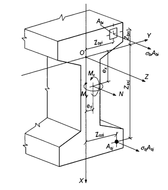

<strong>Hình 9 — Sơ đồ tính toán tiết diện thẳng góc của cấu kiện bê tông cốt thép</strong>

### 8.1.2.7.4  Khi tính toán độ bền tiết diện thẳng góc trong trường hợp tổng quát (xem Hình 9) thì sử dụng:

&nbsp;&nbsp;\- Các phương trình cân bằng ngoại lực và nội lực trong tiết diện thẳng góc của cấu kiện:

$$\begin{aligned}
M_x &= \sum_i \sigma_{bi} A_{bi} Z_{bxi} + \sum_j \sigma_{sj} A_{sj} Z_{syj} \qquad (59) \\
M_y &= \sum_i \sigma_{bi} A_{bi} Z_{byi} + \sum_j \sigma_{sj} A_{sj} Z_{syj} \qquad (60) \\
N &= \sum_i \sigma_{bi} A_{bi} + \sum_j \sigma_{sj} A_{sj} \qquad (61)
\end{aligned}$$
<!-- formula_id: "F_TCVN_5574_2018_FORMULA_59" -->

&nbsp;&nbsp;\- Các phương trình xác định sự phân bố biến dạng tương đối trên tiết diện cấu kiện:

$$\begin{aligned} \varepsilon_{bi} &= \varepsilon_0 + \frac{1}{r_x} Z_{bxi} + \frac{1}{r_y} Z_{byi} \qquad (62) \\ \varepsilon_{sj} &= \varepsilon_0 + \frac{1}{r_x} Z_{sxj} + \frac{1}{r_y} Z_{syj} \qquad (63) \end{aligned}$$
<!-- formula_id: "F_TCVN_5574_2018_FORMULA_62_63" -->

&nbsp;&nbsp;\- Các quan hệ giữa ứng suất và biến dạng tương đối của bê tông và của cốt thép:

$$\begin{aligned} \nu_{bi} &= \frac{\sigma_{bi}}{E_{bi} \varepsilon_{bi}} \qquad (64) \\ \nu_{sj} &= \frac{\sigma_{sj}}{E_{sj} \varepsilon_{sj}} \qquad (65) \end{aligned}$$
<!-- formula_id: "F_TCVN_5574_2018_FORMULA_64_65" -->

Trong các phương trình từ (59) đến (65):

$M_{x}$, $M_{y}$ là các mô men uốn do ngoại lực đối với các trục tọa độ đã chọn nằm trong phạm vi tiết diện ngang của cấu kiện (lần lượt tác dụng trong các mặt phẳng XOZ và YOZ hoặc song song với chúng), được xác định theo các công thức:

$$M_{x} = M_{xd} + Ne_{x} \tag{66}$$
<!-- formula_id: "F_TCVN_5574_2018_FORMULA_66" -->

$$M_{y} = M_{yd} + Ne_{y} \tag{67}$$
<!-- formula_id: "F_TCVN_5574_2018_FORMULA_67" -->

trong đó:

&nbsp;&nbsp;&nbsp;&nbsp;\- $M_{xd}$, $M_{yd}$  là các mô men uốn trong các mặt phẳng tương ứng do ngoại lực, được xác định từ tính toán tĩnh học kết cấu;

&nbsp;&nbsp;&nbsp;&nbsp;\- N  là lực dọc do ngoại lực;

&nbsp;&nbsp;&nbsp;&nbsp;\- $e_{x}$, $e_{y}$ là các khoảng cách từ điểm đặt lực dọc N đến các trục đã chọn tương ứng Y và X;

&nbsp;&nbsp;&nbsp;&nbsp;\- $A_{bi}$, $Z_{bxi}$, $Z_{byi}$, $\sigma_{bi}$  lần lượt là diện tích, các tọa độ trọng tâm phần bê tông thứ i và ứng suất tại mức trọng tâm của nó;

&nbsp;&nbsp;&nbsp;&nbsp;\- $A_{sj}$, $Z_{sxj}$, $Z_{syj}$, $\sigma_{sj}$  lần lượt là diện tích, các tọa độ trọng tâm thanh cốt thép thứ j và ứng suất trong nó;

&nbsp;&nbsp;&nbsp;&nbsp;\- $\epsilon_{0}$ là biến dạng tương đối của thớ nằm tại giao điểm các trục đã chọn (điểm O);

&nbsp;&nbsp;&nbsp;&nbsp;\- 1/$r_{x}$, 1/$r_{y}$ là độ cong của trục dọc tại tiết diện ngang đang xét của cấu kiện trong các mặt phẳng tác dụng của các mô men $M_{x}$ và $M_{y}$;

&nbsp;&nbsp;&nbsp;&nbsp;\- $E_{b}$  là mô đun đàn hồi ban đầu của bê tông;

&nbsp;&nbsp;&nbsp;&nbsp;\- $E_{sj}$  là mô đun đàn hồi của thanh cốt thép thứ j;

&nbsp;&nbsp;&nbsp;&nbsp;\- $v_{bi}$  là hệ số đàn hồi của phần bê tông thứ i;

&nbsp;&nbsp;&nbsp;&nbsp;\- $v_{sj}$ là hệ số đàn hồi của thanh cốt thép thứ j.

&nbsp;&nbsp;&nbsp;&nbsp;\- Các hệ số $v_{bi}$ và $v_{sj}$ lấy theo các biểu đồ biến dạng tương ứng của bê tông và của cốt thép nêu trong 6.1.4.1, 6.2.4.1.

Giá trị các hệ số $v_{bi}$ và $v_{sj}$ được xác định bằng tỉ số giữa các giá trị ứng suất và biến dạng tương đối đối với các điểm đang xét của các biểu đồ biến dạng tương ứng của bê tông và cốt thép đã chọn trong tính toán, chia cho mô đun đàn hồi của bê tông $E_{b}$ và cốt thép $E_{s}$ (với biểu đồ biến dạng hai đoạn thẳng của bê tông - chia cho mô đun biến dạng quy đổi của bê tông chịu nén $E_{b,red}$). Khi đó, sử dụng các quan hệ “ứng suất - biến dạng” từ (9) đến (13), (18) và (19) trên các đoạn đang xét của các biểu đồ biến dạng.

$$\begin{aligned} \nu_{bi} &= \frac{\sigma_{bi}}{E_b \varepsilon_{bi}} \qquad (66) \\ \nu_{sj} &= \frac{\sigma_{sj}}{E_s \varepsilon_{sj}} \qquad (67) \end{aligned}$$
<!-- formula_id: "F_TCVN_5574_2018_FORMULA_66_67" -->

### 8.1.2.7.5  Tính toán độ bền tiết diện thẳng góc của các cấu kiện bê tông cốt thép được tiến hành theo các điều kiện:

$$\begin{aligned} |\varepsilon_{b,\max}| &\le \varepsilon_{b,u} \qquad (70) \\ \varepsilon_{s,\max} &\le \varepsilon_{s,u} \qquad (71) \end{aligned}$$
<!-- formula_id: "F_TCVN_5574_2018_FORMULA_70" -->

trong đó:

&nbsp;&nbsp;&nbsp;&nbsp;\- $\epsilon_{b,max}$ là biến dạng tương đối của thớ bê tông chịu nén nhiều nhất trong tiết diện thẳng góc của cấu kiện do tác dụng của ngoại lực;

&nbsp;&nbsp;&nbsp;&nbsp;\- $\epsilon_{s,max}$ là biến dạng tương đối của thanh cốt thép chịu kéo nhiều nhất trong tiết diện thẳng góc của cấu kiện do tác dụng của ngoại lực;

&nbsp;&nbsp;&nbsp;&nbsp;\- $\epsilon_{b,u}$ là giá trị giới hạn của biến dạng tương đối của bê tông chịu nén, lấy theo 8.1.2.7.11;

&nbsp;&nbsp;&nbsp;&nbsp;\- $\epsilon_{s,u}$ là giá trị giới hạn của biến dạng giãn dài tương đối của cốt thép, lấy theo 8.1.2.7.11.

### 8.1.2.7.6  Đối với các cấu kiện bê tông cốt thép chịu tác dụng của các mô men uốn theo hai phương và lực dọc (Hình 9) thì biến dạng tương đối của bê tông $\epsilon_{b,max}$ và của cốt thép $\epsilon_{s,max}$ tại tiết diện thẳng góc có hình dạng bất kỳ được xác định từ việc giải hệ các phương trình từ (72) đến (74) có sử dụng các phương trình (62) và (63).

$$\begin{aligned} M_x &= D_{11} \frac{1}{r_x} + D_{12} \frac{1}{r_y} + D_{13} \varepsilon_0 \qquad (72) \\ M_y &= D_{12} \frac{1}{r_x} + D_{22} \frac{1}{r_y} + D_{23} \varepsilon_0 \qquad (73) \\ N &= D_{13} \frac{1}{r_x} + D_{23} \frac{1}{r_y} + D_{33} \varepsilon_0 \qquad (74) \end{aligned}$$
<!-- formula_id: "F_TCVN_5574_2018_FORMULA_72_74" -->

Các đặc trưng độ cứng $D_{ij}$ (i, j = 1, 2, 3) trong hệ các phương trình từ (72) đến (74) được xác định theo các công thức:

$$\begin{aligned} D_{11} &= \sum_i A_{bi} Z_{bi}^2 E_b \nu_{bi} + \sum_j A_{sj} Z_{sj}^2 E_{sj} \nu_{sj} \qquad (75) \\ D_{22} &= \sum_i A_{bi} Y_{bi}^2 E_b \nu_{bi} + \sum_j A_{sj} Y_{sj}^2 E_{sj} \nu_{sj} \qquad (76) \\ D_{12} &= \sum_i A_{bi} Z_{bi} Y_{bi} E_b \nu_{bi} + \sum_j A_{sj} Z_{sj} Y_{sj} E_{sj} \nu_{sj} \qquad (77) \\ D_{13} &= \sum_i A_{bi} Z_{bi} E_b \nu_{bi} + \sum_j A_{sj} Z_{sj} E_{sj} \nu_{sj} \qquad (78) \\ D_{23} &= \sum_i A_{bi} Y_{bi} E_b \nu_{bi} + \sum_j A_{sj} Y_{sj} E_{sj} \nu_{sj} \qquad (79) \\ D_{33} &= \sum_i A_{bi} E_b \nu_{bi} + \sum_j A_{sj} E_{sj} \nu_{sj} \qquad (80) \end{aligned}$$
<!-- formula_id: "F_TCVN_5574_2018_FORMULA_75_80" -->

Các ký hiệu trong các công thức trên xem trong 8.1.2.7.4.

### 8.1.2.7.7  Đối với các cấu kiện bê tông cốt thép chỉ chịu tác dụng của các mô men uốn theo hai phương $M_{x}$ và $M_{y}$, (uốn xiên) thì trong phương trình (74) lấy N = 0.

### 8.1.2.7.8  Đối với các cấu kiện bê tông cốt thép chịu nén lệch tâm trong mặt phẳng đối xứng của tiết diện ngang và trục X nằm trong mặt phẳng này thì trong các phương trình từ (72) đến (74) lấy $M_{y}$ = 0 và $D_{12}$ = $D_{22}$ = $D_{23}$ = 0. Trong trường hợp này, các phương trình cân bằng có dạng:

$$\begin{aligned}
M_x &= D_{11} \frac{1}{r_x} + D_{13} \varepsilon_0 \qquad (81) \\
N &= D_{13} \frac{1}{r_x} + D_{33} \varepsilon_0 \qquad (82)
\end{aligned}$$
<!-- formula_id: "F_TCVN_5574_2018_FORMULA_81" -->

### 8.1.2.7.9  Đối với các cấu kiện bê tông cốt thép chịu uốn trong mặt phẳng đối xứng của tiết diện ngang và trục X nằm trong mặt phẳng này thì trong các phương trình từ (72) đến (74) lấy N = 0, $M_{y}$ = 0 và $D_{12}$ = $D_{22}$ = $D_{23}$ = 0. Trong trường hợp này, các phương trình cân bằng có dạng:

$$\begin{aligned}
M_x &= D_{11} \frac{1}{r_x} + D_{13} \varepsilon_0 \qquad (83) \\
0 &= D_{13} \frac{1}{r_x} + D_{33} \varepsilon_0 \qquad (84)
\end{aligned}$$
<!-- formula_id: "F_TCVN_5574_2018_FORMULA_83" -->

### 8.1.2.7.10  Tính toán độ bền tiết diện thẳng góc của các cấu kiện bê tông chịu nén lệch tâm khi lực nén dọc trục nằm trong phạm vi tiết diện ngang của cấu kiện được tiến hành theo điều kiện (70) dựa trên các chỉ dẫn trong 8.1.2.7.5 đến 8.1.2.7.9, trong đó trong các công thức ở 8.1.2.7.6 lấy diện tích cốt thép $A_{sj}$ = 0 để xác định $D_{ij}$.

Đối với các cấu kiện bê tông chịu nén lệch tâm, mà trong đó không cho phép có vết nứt, thì tính toán được tiến hành có kể đến sự làm việc của bê tông chịu kéo trong tiết diện ngang của cấu kiện theo điều kiện:

$$\epsilon_{bt,max} \le \epsilon_{bt,u} \tag{85}$$
<!-- formula_id: "F_TCVN_5574_2018_FORMULA_85" -->

trong đó:

&nbsp;&nbsp;&nbsp;&nbsp;\- $\epsilon_{bt,max}$ là biến dạng tương đối của thớ bê tông chịu kéo nhiều nhất trong tiết diện thẳng góc của cấu kiện do tác dụng của ngoại lực, được xác định theo 8.1.2.7.6 đến 8.1.2.7.9.

&nbsp;&nbsp;&nbsp;&nbsp;\- $\epsilon_{bt,u}$ là biến dạng tương đối giới hạn của bê tông chịu kéo, lấy theo các chỉ dẫn trong 8.1.2.7.11.

### 8.1.2.7.11  Giá trị giới hạn của các biến dạng tương đối của bê tông $\epsilon_{b,u}$ và $\epsilon_{bt,u}$ khi biểu đồ biến dạng đổi dấu (nén và kéo) trong tiết diện ngang của bê tông của cấu kiện (uốn, nén lệch tâm hoặc kéo lệch tâm với độ lệch tâm lớn) được lấy lần lượt bằng $\epsilon_{b2}$ và $\epsilon_{bt2}$.

Khi nén lệch tâm hoặc kéo lệch tâm các cấu kiện và sự phân bố biến dạng tương đối cùng dấu trong tiết diện ngang của bê tông cấu kiện thì các giá trị giới hạn của các biến dạng tương đối của bê tông $\epsilon_{b,u}$ và $\epsilon_{bt,u}$ được xác định phụ thuộc vào tỉ số giữa các biến dạng tương đối của bê tông tại các biên đối diện của tiết diện cấu kiện $\epsilon_{1}$ và $\epsilon_{2}$ ($I\epsilon_{2}$ I ≥ $I\epsilon_{1}$ I) theo các công thức:

$$\begin{aligned}
\varepsilon_{b,u} &= \varepsilon_{b2} - (\varepsilon_{b2} - \varepsilon_{b0}) \frac{\varepsilon_1}{\varepsilon_2} \qquad (86) \\
\varepsilon_{bt,u} &= \varepsilon_{bt2} - (\varepsilon_{bt2} - \varepsilon_{bt0}) \frac{\varepsilon_1}{\varepsilon_2} \qquad (87)
\end{aligned}$$
<!-- formula_id: "F_TCVN_5574_2018_FORMULA_86" -->

trong đó:

&nbsp;&nbsp;&nbsp;&nbsp;\- $\epsilon_{b0}$, $\epsilon_{bt0}$ và $\epsilon_{bt2}$ là các thông số biến dạng của các biểu đồ biến dạng tính toán của bê tông (xem 6.1.3.2, 6.1.4.2, 6.1.4.4).

Giá trị giới hạn của biến dạng tương đối của cốt thép $\epsilon_{s,u}$ lấy bằng:

0,025 - đối với cốt thép có giới hạn chảy thực tế;

0,015 - đối với cốt thép có giới hạn chảy quy ước.

### 8.1.3  Tính toán độ bền cấu kiện bê tông cốt thép chịu tác dụng của lực cắt

### 8.1.3.1  Yêu cầu chung

Tính toán độ bền cấu kiện bê tông cốt thép khi có tác dụng của lực cắt được tiến hành theo mô hình tiết diện nghiêng.

Khi tính toán theo mô hình tiết diện nghiêng thì phải đảm bảo độ bền của cấu kiện theo dải giữa các tiết diện nghiêng và theo tiết diện nghiêng chịu tác dụng của lực cắt, cũng như đảm bảo độ bền theo tiết diện nghiêng chịu tác dụng của mô men.

Độ bền theo dải bê tông nghiêng được đặc trưng bởi giá trị lực cắt lớn nhất mà dải bê tông nghiêng có thể chịu được dưới tác dụng của nội lực nén nằm dọc theo dải bê tông này và nội lực kéo do cốt thép ngang cắt qua dải bê tông nghiêng. Khi đó, độ bền của bê tông được xác định theo cường độ chịu nén dọc trục của bê tông có kể đến ảnh hưởng của trạng thái ứng suất phức tạp trên dải bê tông nghiêng.

Tính toán theo tiết diện nghiêng chịu lực cắt được tiến hành trên cơ sở phương trình cân bằng ngoại lực cắt và nội lực cắt tác dụng trong tiết diện nghiêng với chiều dài hình chiếu C lên trục dọc của cấu kiện. Nội lực cắt bao gồm lực cắt chịu bởi bê tông trên tiết diện nghiêng và lực cắt chịu bởi cốt thép ngang cắt qua tiết diện nghiêng. Khi đó, các lực cắt chịu bởi bê tông và bởi cốt thép ngang được xác định theo cường độ chịu kéo của bê tông và của cốt thép ngang có kể đến chiều dài hình chiếu C của tiết diện nghiêng.

Tính toán theo tiết diện nghiêng chịu mô men được tiến hành trên cơ sở phương trình cân bằng các mô men do ngoại lực và do nội lực tác dụng trên tiết diện nghiêng với chiều dài hình chiếu C lên trục dọc cấu kiện. Mô men do nội lực bao gồm mô men chịu bởi bê tông, mô men chịu bởi cốt thép dọc chịu kéo cắt qua tiết diện nghiêng, mô men chịu bởi cốt thép ngang cắt qua tiết diện nghiêng. Khi đó, các mô men chịu bởi bê tông, bởi cốt thép dọc và cốt thép ngang được xác định theo cường độ chịu kéo của cốt thép dọc và cốt thép ngang có kể đến chiều dài hình chiếu C của tiết diện nghiêng.

### 8.1.3.2  Tính toán cấu kiện bê tông cốt thép theo dải bê tông giữa các tiết diện nghiêng

Tính toán cấu kiện bê tông cốt thép chịu uốn theo dải bê tông giữa các tiết diện nghiêng được tiến hành theo điều kiện:

$$Q \le \varphi_{b1}R_{b}bh_{0} \tag{88}$$
<!-- formula_id: "F_TCVN_5574_2018_FORMULA_88" -->

trong đó:

&nbsp;&nbsp;&nbsp;&nbsp;\- Q  là lực cắt trong tiết diện thẳng góc của cấu kiện;

&nbsp;&nbsp;&nbsp;&nbsp;\- $\varphi_{b1}$  là hệ số, kể đến ảnh hưởng của đặc điểm trạng thái ứng suất của bê tông trong dải nghiêng lấy bằng 0,3.

### 8.1.3.3  Tính toán cấu kiện bê tông cốt thép theo tiết diện nghiêng chịu lực cắt

### 8.1.3.3.1  Tính toán cấu kiện bê tông cốt thép chịu uốn theo tiết diện nghiêng (Hình 10) được tiến hành theo điều kiện:

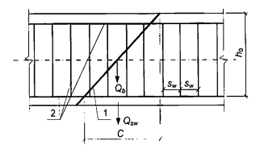

**CHÚ DẪN:**

1 - Tiết diện nghiêng; 2 - cốt thép.

<strong>Hình 10 — Sơ đồ nội lực khi tính toán cấu kiện bê tông cốt thép theo tiết diện nghiêng chịu tác dụng của lực cắt</strong>

$$Q \le Q_{b} + Q_{sw} \tag{89}$$
<!-- formula_id: "F_TCVN_5574_2018_FORMULA_89" -->

trong đó:

&nbsp;&nbsp;&nbsp;&nbsp;\- Q  là lực cắt trên tiết diện nghiêng với chiều dài hình chiếu C lên trục dọc cấu kiện, được xác định do tất cả các ngoại lực nằm ở một phía của tiết diện nghiêng đang xét; khi đó, cần kể đến tác dụng nguy hiểm nhất của tải trọng trong phạm vi tiết diện nghiêng;

&nbsp;&nbsp;&nbsp;&nbsp;\- $Q_{b}$  là lực cắt chịu bởi bê tông trong tiết diện nghiêng;

&nbsp;&nbsp;&nbsp;&nbsp;\- $Q_{sw}$  là lực cắt chịu bởi cốt thép ngang trong tiết diện nghiêng.

&nbsp;&nbsp;&nbsp;&nbsp;\- Lực cắt $Q_{b}$ được xác định theo công thức:

$$Q_b = \frac{\varphi_{b2} R_{bt} b h_0^2}{C} \tag{90}$$
<!-- formula_id: "F_TCVN_5574_2018_FORMULA_90" -->

nhưng không lớn hơn 2,5$R_{bt}bh_{0}$ và không nhỏ hơn 0,5$R_{bt}bh_{0}$,

trong đó: $\varphi_{b2}$ là hệ số, kể đến ảnh hưởng của cốt thép dọc, lực bám dính và đặc điểm trạng thái ứng suất của bê tông nằm phía trên vết nứt xiên, lấy bằng 1,5.

&nbsp;&nbsp;&nbsp;&nbsp;\- Lực cắt $Q_{sw}$ đối với cốt thép ngang nằm vuông góc với trục dọc cấu kiện được xác định theo công thức:

$$Q_{sw} = \varphi_{sw}q_{sw} C \tag{91}$$
<!-- formula_id: "F_TCVN_5574_2018_FORMULA_91" -->

trong đó:

&nbsp;&nbsp;&nbsp;&nbsp;\- $\varphi_{sw}$ là hệ số, kể đến sự suy giảm nội lực dọc theo chiều dài hình chiếu của tiết diện nghiêng C, lấy bằng 0,75;

&nbsp;&nbsp;&nbsp;&nbsp;\- $q_{sw}$ là lực trong cốt thép ngang trên một đơn vị chiều dài cấu kiện, được xác định theo công thức:

$$q_{sw} = \frac{R_{sw} A_{sw}}{s_w} \tag{92}$$
<!-- formula_id: "F_TCVN_5574_2018_FORMULA_92" -->

Cần tiến hành tính toán đối với một loạt tiết diện nghiêng, nằm dọc theo chiều dài cấu kiện, với chiều dài nguy hiểm nhất của hình chiếu tiết diện nghiêng C. Khi đó, chiều dài hình chiếu C trong công thức (91) lấy không nhỏ hơn $h_{0}$ và không lớn hơn 2$h_{0}$.

Cho phép tính toán các tiết diện nghiêng theo điều kiện (93) mà không cần xem xét các tiết diện nghiêng khi xác định lực cắt do ngoại lực:

$$Q_{1} \le Q_{b,1} + Q_{sw,1} \tag{93}$$
<!-- formula_id: "F_TCVN_5574_2018_FORMULA_93" -->

trong đó: $Q_{1}$ là lực cắt trong tiết diện thẳng góc do ngoại lực;

$$Q_{b,1} = 0,5 R_{bt}bh_{0} \tag{94}$$
<!-- formula_id: "F_TCVN_5574_2018_FORMULA_94" -->

$$Q_{sw,1} = q_{sw}h_{0} \tag{95}$$
<!-- formula_id: "F_TCVN_5574_2018_FORMULA_95" -->

Khi tiết diện thẳng góc, mà trong đó kể đến lực cắt $Q_{1}$, nằm gần gối tựa ở khoảng cách a nhỏ hơn 2,5$h_{0}$, thì tính toán theo điều kiện (93) được tiến hành với việc nhân giá trị $Q_{b,1}$ đã được xác định theo công thức (94) với hệ số bằng 2,5/(a $h_{0}$), nhưng lấy giá trị $Q_{b,1}$ không lớn hơn 2,5$R_{bt}bh_{0}$.

Khi tiết diện thẳng góc, mà trong đó kể đến lực cắt $Q_{1}$, nằm ở khoảng cách a nhỏ hơn $h_{0}$, thì tính toán theo điều kiện (93) được tiến hành với việc nhận giá trị $Q_{sw,1}$ đã được xác định theo công thức (95) với hệ số bằng a/$h_{0}$.

Cốt thép ngang được kể đến trong tính toán khi thỏa mãn điều kiện:

$$q_{sw} \ge 0,25 R_{bt} b \tag{96}$$
<!-- formula_id: "F_TCVN_5574_2018_FORMULA_96" -->

Cho phép kể đến cốt thép ngang ngay cả khi điều kiện (96) không thỏa mãn, nếu như giá trị $Q_{b}$ trong điều kiện (89) được xác định theo công thức:

$$Q_b = \frac{4\varphi_{b2} h_0^2 q_{sw}}{C} \tag{97}$$
<!-- formula_id: "F_TCVN_5574_2018_FORMULA_97" -->

và lấy giá trị này có kể đến các điều kiện giới hạn như đối với công thức (90).

Bước cốt thép ngang kể đến trong tính toán (tính trên $h_{0}$) $\frac{s_w}{h_0}$ không được lớn hơn giá trị $\frac{s_{w,\max}}{h_0}$ với $\frac{s_{w,\max}}{h_0}$ được xác định theo công thức:

$$\frac{s_{w,\max}}{h_0} = \frac{R_{bt} b h_0}{Q} \tag{98}$$
<!-- formula_id: "F_TCVN_5574_2018_FORMULA_98" -->

Khi không có cốt thép ngang hoặc khi các yêu cầu nêu trên, cũng như các yêu cầu cấu tạo nêu trong 10.3 không thỏa mãn thì tiến hành tính toán theo điều kiện (89) hoặc (93), với $Q_{sw}$ hoặc $Q_{sw,1}$ lấy bằng không.

Cốt thép ngang cần phải thỏa mãn các yêu cầu cấu tạo nêu trong 10.3.

### 8.1.3.3.2  Ảnh hưởng của các ứng suất nén và kéo khi tính toán dải bê tông giữa các tiết diện nghiêng và khi tính toán các tiết diện nghiêng cần được kể đến bằng hệ số $\varphi_{n}$ mà vế phải các điều kiện (88), (90) hoặc (94) phải nhân vào.

Giá trị hệ số $\varphi_{n}$ lấy bằng 1 đối với các kết cấu chịu uốn không ứng suất trước cốt thép. Trong các trường hợp còn lại giá trị hệ số $\varphi_{n}$ lấy bằng:

$$\begin{aligned} & 1 + \frac{\sigma_m}{R_b} & \text{khi} & \quad 0 \le \sigma_m \le 0,25 R_b \\ & 1,25 & \text{khi} & \quad 0,25 R_b < \sigma_m \le 0,75 R_b \\ & 5\left(1 - \frac{\sigma_m}{R_b}\right) & \text{khi} & \quad 0,75 R_b < \sigma_m \le R_b \\ & 1 - \frac{\sigma_t}{2R_{bt}} & \text{khi} & \quad 0 < \sigma_t \le R_{bt} \end{aligned}$$
<!-- formula_id: "F_TCVN_5574_2018_RID113" -->

trong đó:

&nbsp;&nbsp;&nbsp;&nbsp;\- $\sigma_{m}$ và $\sigma_{t}$ lần lượt là ứng suất nén và kéo trung bình trong bê tông do tác dụng của lực dọc, đều lấy dấu “dương".

Các đại lượng $\sigma_{m}$ và $\sigma_{t}$ được lấy bằng các ứng suất trung bình trong các tiết diện của cấu kiện. Cho phép xác định các đại lượng $\sigma_{m}$ và $\sigma_{t}$ mà không kể đến cốt thép khi hàm lượng cốt thép dọc không lớn hơn 3 %.

### 8.1.3.4  Tính toán cấu kiện bê tông cốt thép theo tiết diện nghiêng chịu mô men

Tính toán cấu kiện bê tông cốt thép theo tiết diện nghiêng chịu mô men (Hình 11) được tiến hành theo điều kiện:

$$M \le M_{s} + M_{sw} \tag{99}$$
<!-- formula_id: "F_TCVN_5574_2018_FORMULA_99" -->

trong đó:

&nbsp;&nbsp;&nbsp;&nbsp;\- M  là mô men trong tiết diện nghiêng với chiều dài hình chiếu C lên trục dọc cấu kiện, được xác định do tất cả các ngoại lực nằm ở một phía của tiết diện nghiêng đang xét, đối với đầu cuối của tiết diện nghiêng (điểm 0), nằm đối diện với đầu mà có cốt thép dọc đang được kiểm tra chịu lực kéo do mô men trong tiết diện nghiêng; khi đó cần kể đến tác dụng nguy hiểm nhất của tải trọng trong phạm vi tiết diện nghiêng;

&nbsp;&nbsp;&nbsp;&nbsp;\- Ms  là mô men chịu bởi cốt thép dọc cắt qua tiết diện nghiêng đối với đầu đối diện của tiết diện nghiêng (điểm 0);

&nbsp;&nbsp;&nbsp;&nbsp;\- $M_{sw}$ là mô men chịu bởi cốt thép ngang cắt qua tiết diện nghiêng đối với đầu đối diện của tiết diện nghiêng (điểm 0).

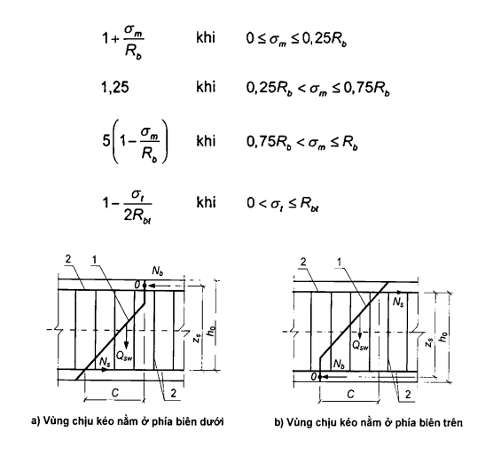

**CHÚ DẪN:**

1 - Tiết diện nghiêng;

2 - Cốt thép.

**CHÚ THÍCH:** $N_{b}$ là hợp lực của các nội lực nén trong vùng bê tông chịu nén.

<strong>Hình 11 — Sơ đồ nội lực khi tính toán cấu kiện bê tông cốt thép theo tiết diện nghiêng chịu mô men</strong>

Mô men $M_{s}$ được xác định theo công thức:

$$M_{s} = N_{s}z_{s} \tag{100}$$
<!-- formula_id: "F_TCVN_5574_2018_FORMULA_100" -->

trong đó:

&nbsp;&nbsp;&nbsp;&nbsp;\- $N_{s}$  là lực trong cốt thép dọc, lấy bằng $R_{s}A_{s}$, còn trong vùng neo - được xác định theo 10.3.5;

&nbsp;&nbsp;&nbsp;&nbsp;\- $z_{s}$  là cánh tay đòn của ngẫu lực, cho phép lấy $z_{s}$ = 0,9$h_{0}$.

&nbsp;&nbsp;&nbsp;&nbsp;\- Mô men $M_{sw}$ chịu bởi cốt thép ngang nằm vuông góc với trục dọc cấu kiện được xác định theo công thức:

$$M_{sw} = 0,5 Q_{sw} C \tag{101}$$
<!-- formula_id: "F_TCVN_5574_2018_FORMULA_101" -->

trong đó:

&nbsp;&nbsp;&nbsp;&nbsp;\- $Q_{sw}$  là lực trong cốt thép ngang, lấy bằng $q_{sw}$ C với $q_{sw}$ được xác định theo công thức (92), còn C lấy trong khoảng từ $h_{0}$ đến 2$h_{0}$.

Tính toán được tiến hành đối với các tiết diện nghiêng, nằm dọc theo chiều dài cấu kiện ở các đoạn đầu mút của nó và tại các vị trí cắt cốt thép dọc, với chiều dài nguy hiểm nhất của hình chiếu tiết diện nghiêng C lấy trong khoảng từ $h_{0}$ đến 2$h_{0}$ nêu trên.

Cho phép tính toán các tiết diện nghiêng theo công thức (99) mà trong đó giá trị mô men M trong tiết diện nghiêng lấy với chiều dài hình chiếu lên trục dọc cấu kiện C bằng 2$h_{0}$, còn mô men $M_{sw}$ lấy bằng $0,5q_{sw}h_0^2$.

### 8.1.4  Tính toán độ bền cấu kiện bê tông cốt thép chịu tác dụng của mô men xoắn

### 8.1.4.1  Yêu cầu chung

Tính toán độ bền cấu kiện bê tông cốt thép tiết diện chữ nhật chịu tác dụng của mô men xoắn được tiến hành theo mô hình tiết diện không gian.

Khi tính toán theo mô hình tiết diện không gian thì xem xét các tiết diện được hình thành từ các đoạn thẳng nằm nghiêng, đi theo ba biên chịu kéo của cấu kiện, và kết thúc bằng đoạn thẳng theo biên thứ tư của cấu kiện.

Tính toán cấu kiện bê tông cốt thép chịu tác dụng của mô men xoắn được tiến hành theo độ bền cấu kiện giữa các tiết diện không gian và theo độ bền của các tiết diện không gian.

Độ bền của bê tông giữa các tiết diện không gian được đặc trưng bởi giá trị lớn nhất của mô men xoắn, được xác định theo cường độ chịu nén dọc trục của bê tông có kể đến trạng thái ứng suất trong bê tông giữa các tiết diện không gian.

Tính toán các tiết diện không gian được tiến hành trên cơ sở các phương trình cân bằng tất cả nội lực và ngoại lực đối với trục nằm ở tâm vùng chịu nén của tiết diện không gian của cấu kiện. Các mô men do nội lực bao gồm mô men chịu bởi cốt thép chạy dọc theo trục cấu kiện và mô men chịu bởi cốt thép nằm ngang trục cấu kiện cắt qua tiết diện nghiêng và nằm trong vùng chịu nén của tiết diện không gian và nằm ở gần biên chịu kéo của cấu kiện đối diện với vùng chịu nén của tiết diện không gian. Khi đó, nội lực chịu bởi cốt thép được xác định theo các giá trị tính toán của cường độ chịu kéo của cốt thép dọc và cốt thép ngang.

Khi tính toán thì xem xét tất cả các vị trí của tiết diện không gian với vùng chịu nén của tiết diện không gian nằm ở biên dưới, biên bên và biên trên của cấu kiện.

Khi có tác dụng đồng thời của mô men xoắn và mô men uốn, cũng như mô men xoắn và lực cắt thì tính toán được tiến hành theo các phương trình tương tác giữa các yếu tố lực tương ứng.

### 8.1.4.2  Tính toán cấu kiện bê tông cốt thép chỉ chịu tác dụng của mô men xoắn

### 8.1.4.2.1  Tính toán độ bền của cấu kiện giữa các tiết diện không gian được tiến hành theo điều kiện:

$$T \le 0,1 R_{b}b^{2} h \tag{102}$$
<!-- formula_id: "F_TCVN_5574_2018_FORMULA_102" -->

trong đó:

&nbsp;&nbsp;&nbsp;&nbsp;\- T  là mô men xoắn do ngoại lực trong tiết diện thẳng góc của cấu kiện;

&nbsp;&nbsp;&nbsp;&nbsp;\- b và h lần lượt là cạnh nhỏ và cạnh lớn của tiết diện ngang của cấu kiện.

### 8.1.4.2.2  Tính toán độ bền các tiết diện không gian được tiến hành theo điều kiện (Hình 12):

$$T \le T_{sw} + T_{s} \tag{103}$$
<!-- formula_id: "F_TCVN_5574_2018_FORMULA_103" -->

trong đó:

&nbsp;&nbsp;&nbsp;&nbsp;\- T  là mô men xoắn trong tiết diện không gian, được xác định do tất cả ngoại lực nằm ở một phía của tiết diện không gian;

&nbsp;&nbsp;&nbsp;&nbsp;\- $T_{sw}$ là mô men xoắn chịu bởi cốt thép (của tiết diện không gian) nằm theo phương ngang so với trục cấu kiện;

&nbsp;&nbsp;&nbsp;&nbsp;\- $T_{s}$  là mô men xoắn chịu bởi cốt thép (của tiết diện không gian) nằm theo phương dọc trục cấu kiện.

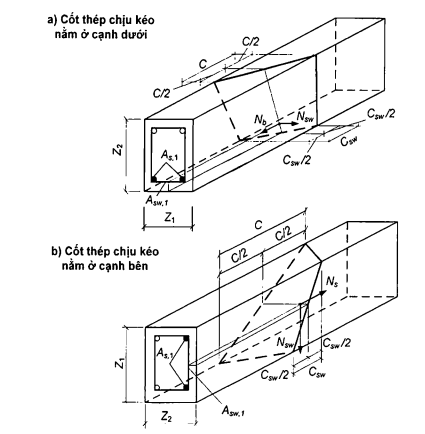

<strong>Hình 12 — Sơ đồ nội lực trong tiết diện không gian khi tính toán chịu mô men xoắn</strong>

Mô men xoắn $T_{sw}$ được xác định theo công thức:

$$T_{sw} = 0,9 N_{sw}Z_{2} \tag{104}$$
<!-- formula_id: "F_TCVN_5574_2018_FORMULA_104" -->

còn mô men xoắn $T_{s}$ được xác định theo công thức:

$$T_s = 0,9 N_s \frac{z_1}{C} z_2 \tag{105}$$
<!-- formula_id: "F_TCVN_5574_2018_FORMULA_105" -->

trong đó:

&nbsp;&nbsp;&nbsp;&nbsp;\- $N_{sw}$  là lực trong cốt thép nằm theo phương ngang so với trục dọc cấu kiện; đối với cốt thép nằm vuông góc với trục dọc thì lực $N_{sw}$ được xác định theo công thức:

$$N_{sw} = q_{sw,1}C_{sw} \tag{106}$$
<!-- formula_id: "F_TCVN_5574_2018_FORMULA_106" -->

$q_{sw,1}$  là lực trong cốt thép ngang này tính trên một đơn vị chiều dài cấu kiện:

$$q_{sw1} = \frac{R_{sw} A_{sw1}}{s_w} \tag{107}$$
<!-- formula_id: "F_TCVN_5574_2018_FORMULA_107" -->

$A_{sw,1}$ là diện tích tiết diện cốt thép nằm theo phương ngang với trục dọc cấu kiện;

$s_{w}$  là bước cốt thép nằm theo phương ngang với trục dọc cấu kiện;

$C_{sw}$  là chiều dài hình chiếu của cạnh chịu kéo của tiết diện không gian lên trục dọc cấu kiện:

$$C_{sw} = δ . C \tag{108}$$
<!-- formula_id: "F_TCVN_5574_2018_FORMULA_108" -->

δ  là hệ số, kể đến tỷ lệ các cạnh của tiết diện ngang:

$$\delta = \frac{Z_1}{2Z_2 + Z_1} \tag{109}$$
<!-- formula_id: "F_TCVN_5574_2018_FORMULA_109" -->

C  là chiều dài hình chiếu của cạnh chịu nén của tiết diện không gian lên trục dọc cấu kiện:

$N_{s}$  là lực trong cốt thép dọc nằm gần biên đang xét của cấu kiện:

$$N_{s} = R_{s}A_{s,1} \tag{110}$$
<!-- formula_id: "F_TCVN_5574_2018_FORMULA_110" -->

$A_{s,1}$  là diện tích tiết diện cốt thép dọc nằm gần biên đang xét của cấu kiện;

$Z_{1}$ và $Z_{2}$  lần lượt là chiều dài cạnh của tiết diện ngang ở biên chịu kéo đang xét của cấu kiện và chiều dài cạnh còn lại của tiết diện ngang của cấu kiện.

Tỉ số $\frac{q_{sw,1} z_1}{R_s A_{s,1}}$lấy trong khoảng 0,5 đến 1,5. Trong trường hợp này, nếu giá trị $\frac{q_{sw,1} z_1}{R_s A_{s,1}}$nằm ngoài khoảng đó thì trong tính toán cần kể đến số lượng cốt thép (dọc và ngang) mà ứng với nó giá trị $\frac{q_{sw,1} z_1}{R_s A_{s,1}}$ nằm trong khoảng nêu trên.

Cần tiến hành tính toán với một loạt tiết diện không gian nằm dọc chiều dài cấu kiện, với chiều dài nguy hiểm nhất của hình chiếu tiết diện không gian C lên trục dọc cấu kiện. Khi đó, giá trị C lấy không lớn hơn 2$Z_{2}$ + $Z_{1}$ và không lớn hơn $Z_1 \sqrt{2/\delta}.$

Cho phép tiến hành tính toán cấu kiện chỉ chịu mô men xoắn theo điều kiện (111) mà không cần xem xét các xét tiết diện không gian khi xác định mô men xoắn do ngoại lực:

$$T_{1} \le T_{sw,1} + T_{s,1} \tag{111}$$
<!-- formula_id: "F_TCVN_5574_2018_FORMULA_111" -->

trong đó:

&nbsp;&nbsp;&nbsp;&nbsp;\- $T_{1}$  là mô men xoắn trong tiết diện thẳng góc của cấu kiện;

&nbsp;&nbsp;&nbsp;&nbsp;\- $T_{sw,1}$  là mô men xoắn chịu bởi cốt thép (theo phương ngang so với trục dọc cấu kiện) nằm ở biên đang xét của cấu kiện và được xác định theo công thức:

$$T_{sw,1} = q_{sw,1} \delta Z_1 Z_2 \tag{112}$$
<!-- formula_id: "F_TCVN_5574_2018_FORMULA_112" -->

$T_{s,1}$ là mô men xoắn chịu bởi cốt thép dọc nằm ở biên đang xét của cấu kiện và được xác định theo công thức:

$$T_{s,1} = 0,5R_s A_{s,1} Z_2 \tag{113}$$
<!-- formula_id: "F_TCVN_5574_2018_FORMULA_113" -->

Tỉ số $\frac{q_{sw,1} z_1}{R_s A_{s,1}}$ lấy trong khoảng 0,5 đến 1,5 đã nêu trên.

Cần tiến hành tính toán đối với một loạt các tiết diện thẳng góc nằm dọc theo chiều dài cấu kiện đối với cốt thép nằm ở mỗi biên đang xét của cấu kiện.

Khi có mô men xoắn tác dụng thì cần tuân thủ các yêu cầu cấu tạo nêu trong 10.3.

### 8.1.4.3  Tính toán cấu kiện bê tông cốt thép chịu tác dụng đồng thời của mô men xoắn và mô men uốn

### 8.1.4.3.1  Tính toán độ bền cấu kiện giữa các tiết diện không gian được tiến hành theo 8.1.4.2.1.

### 8.1.4.3.2  Tính toán độ bền các tiết diện không gian được tiến hành theo điều kiện:

$$T \le T_0 \sqrt{1 - \left( \frac{M}{M_0} \right)^2} \qquad (114)$$
<!-- formula_id: "F_TCVN_5574_2018_FORMULA_114" -->

trong đó:

&nbsp;&nbsp;&nbsp;&nbsp;\- T  là mô men xoắn do ngoại lực tác dụng trong tiết diện không gian;

&nbsp;&nbsp;&nbsp;&nbsp;\- $T_{0}$  là mô men xoắn giới hạn mà tiết diện không gian có thể chịu được;

&nbsp;&nbsp;&nbsp;&nbsp;\- M  là mô men uốn do ngoại lực tác dụng trong tiết diện thẳng góc;

&nbsp;&nbsp;&nbsp;&nbsp;\- $M_{0}$  là mô men uốn giới hạn mà tiết diện thẳng góc có thể chịu được.

Khi tính toán chịu tác dụng đồng thời của mô men xoắn và mô men uốn thì xem xét tiết diện không gian có cốt thép chịu kéo nằm ở biên chịu kéo do mô men uốn, nghĩa là ở biên vuông góc với mặt phẳng tác dụng của mô men uốn.

Mô men xoắn T do ngoại lực được xác định trong tiết diện thẳng góc nằm ở giữa chiều dài hình chiếu C dọc theo trục dọc cấu kiện. Mô men uốn M do ngoại lực được xác định trong chính tiết diện thẳng góc này.

Mô men xoắn giới hạn $T_{0}$ được xác định theo 8.1.4.2.2 và lấy bằng vế phải điều kiện (103) đối với tiết diện không gian đang xét.

Mô men uốn giới hạn $M_{0}$ được xác định theo 8.1.2.3.2.

Để xác định các mô men xoắn, cho phép sử dụng điều kiện (111). Trong trường hợp này, mô men xoắn T = $T_{1}$ và mô men uốn M được xác định trong các tiết diện thẳng góc dọc theo chiều dài cấu kiện. Trong tiết diện thẳng góc đang xét thì mô men xoắn giới hạn lấy bằng vế phải điều kiện (111).

Mô men uốn giới hạn $M_{0}$ được xác định đối với chính tiết diện thẳng góc đã nêu ở trên.

Khi có tác dụng đồng thời của mô men xoắn và mô men uốn thì cần tuân thủ các yêu cầu cấu tạo nêu trong 8.1.4.2.2 và 10.3.

### 8.1.4.4  Tính toán cấu kiện bê tông cốt thép chịu tác dụng đồng thời của mô men xoắn và lực cắt

### 8.1.4.4.1  Tính toán độ bền cấu kiện giữa các tiết diện không gian được tiến hành theo điều kiện:

$$T \le T_0 \left( 1 - \frac{Q}{Q_0} \right) \tag{115}$$
<!-- formula_id: "F_TCVN_5574_2018_FORMULA_115" -->

trong đó:

&nbsp;&nbsp;&nbsp;&nbsp;\- T  là mô men xoắn do ngoại lực tác dụng trong tiết diện thẳng góc;

&nbsp;&nbsp;&nbsp;&nbsp;\- $T_{0}$  là mô men xoắn giới hạn mà cấu kiện (trong khoảng giữa các tiết diện không gian) có thể chịu được và lấy bằng vế phải điều kiện (102);

&nbsp;&nbsp;&nbsp;&nbsp;\- Q  là lực cắt do ngoại lực tác dụng trong chính tiết diện thẳng góc nêu trên;

&nbsp;&nbsp;&nbsp;&nbsp;\- $Q_{0}$  là lực cắt giới hạn chịu được bởi bê tông giữa các tiết diện nghiêng và lấy bằng vế phải điều kiện (88).

### 8.1.4.4.2  Tính toán độ bền tiết diện không gian được tiến hành theo điều kiện (115), nhưng trong đó các đại lượng được lấy như sau:

T  là mô men xoắn trong tiết diện không gian do ngoại lực;

$T_{0}$  là mô men xoắn giới hạn chịu được bởi tiết diện không gian;

Q  là lực cắt trong tiết diện nghiêng;

$Q_{0}$  là lực cắt giới hạn chịu được bởi tiết diện nghiêng.

Khi tính toán với tác dụng đồng thời của mô men xoắn và lực cắt thì cần xem xét tiết diện không gian có cốt thép chịu kéo nằm ở một trong các biên chịu kéo do lực cắt, nghĩa là ở biên song song với mặt phẳng tác dụng của lực cắt.

Mô men xoắn T do ngoại lực được xác định trong tiết diện thẳng góc nằm ở giữa hình chiếu C dọc theo trục dọc cấu kiện. Lực cắt Q do ngoại lực được xác định trong chính tiết diện thẳng góc này.

Mô men xoắn giới hạn $T_{0}$ được xác định theo 8.1.4.2.2 và lấy bằng vế phải điều kiện (103) (nghĩa là bằng $T_{sw}$ + $T_{s}$) đối với tiết diện không gian đang xét.

Lực cắt giới hạn $Q_{0}$ được xác định theo 8.1.3.3.1 và lấy bằng vế phải điều kiện (89). Khi đó, điểm giữa của chiều dài hình chiếu tiết diện nghiêng lên trục dọc cấu kiện nằm trong tiết diện thẳng góc đi qua điểm giữa của chiều dài hình chiếu tiết diện không gian lên trục dọc cấu kiện.

Để xác định các mô men xoắn cho phép sử dụng điều kiện (111), còn để xác định các lực cắt - điều kiện (93). Trong trường hợp này, mô men xoắn T = $T_{1}$ và lực cắt Q = $Q_{1}$ do ngoại lực được xác định trong các tiết diện thẳng góc theo chiều dài cấu kiện. Trong tiết diện thẳng góc đang xét thì mô men xoắn giới hạn $T_{0}$ lấy bằng vế phải điều kiện (111), còn lực cắt giới hạn $Q_{0}$ cũng trong tiết diện thẳng góc này lấy bằng vế phải điều kiện (93).

Khi có tác dụng đồng thời của mô men xoắn và lực cắt thì cần tuân thủ các yêu cầu cấu tạo nêu trong 10.3.

### 8.1.5  Tính toán cấu kiện bê tông cốt thép chịu nén cục bộ

### 8.1.5.1  Tính toán cấu kiện bê tông cốt thép chịu nén (ép) cục bộ được tiến hành khi có tác dụng của lực nén đặt trên một diện tích giới hạn, vuông góc với bề mặt cấu kiện bê tông cốt thép. Khi đó, cần kể đến cường độ chịu nén nâng cao của bê tông trong phạm vi diện chịu tải (diện tích chịu nén cục bộ) do trạng thái ứng suất ba chiều của bê tông nằm dưới diện chịu tải, phụ thuộc vào vị trí diện chịu tải trên bề mặt cấu kiện.

Khi đặt lưới thép trong vùng nén cục bộ, cần kể đến cường độ chịu nén nâng cao bổ sung của bê tông nằm dưới diện chịu tải do cốt thép hạn chế biến dạng ngang.

Tính toán cấu kiện chịu nén cục bộ khi không có cốt thép hạn chế biến dạng ngang được tiến hành theo 8.1.5.2, còn khi có cốt thép hạn chế biến dạng ngang - theo 8.1.5.3.

### 8.1.5.2  Tính toán cấu kiện chịu nén cục bộ khi không có cốt thép hạn chế biến dạng ngang (Hình 13) được tiến hành theo điều kiện:

$$N \le \psi R_{b,loc} A_{b,loc} \tag{116}$$
<!-- formula_id: "F_TCVN_5574_2018_FORMULA_116" -->

trong đó:

&nbsp;&nbsp;&nbsp;&nbsp;\- N  là lực nén cục bộ do ngoại lực;

&nbsp;&nbsp;&nbsp;&nbsp;\- $A_{b,loc}$  là diện tích đặt lực nén (diện tích chịu nén cục bộ);

&nbsp;&nbsp;&nbsp;&nbsp;\- $R_{b,loc}$  là cường độ chịu nén cục bộ tính toán của bê tông khi có lực nén cục bộ tác dụng;

&nbsp;&nbsp;&nbsp;&nbsp;\- $\psi$ là hệ số, lấy bằng 1,0 khi tải trọng cục bộ phân bố đều và bằng 0,75 khi tải trọng cục bộ phân bố không đều trên diện tích chịu nén cục bộ.

Giá trị của $R_{b,loc}$ được xác định theo công thức:

$$R_{b,loc} = \varphi_b R_b \tag{117}$$
<!-- formula_id: "F_TCVN_5574_2018_FORMULA_117" -->

trong đó $\varphi_{b}$ là hệ số, được xác định theo công thức:

$$\varphi_b = 0,8 \sqrt{\frac{A_{b,\text{max}}}{A_{b,\text{loc}}}} \tag{118}$$
<!-- formula_id: "F_TCVN_5574_2018_FORMULA_118" -->

nhưng lấy không lớn hơn 2,5 và không nhỏ hơn 1,0.

Trong công thức (118), $A_{b,max}$ là diện tích tính toán lớn nhất, được xác định theo các nguyên tắc sau:

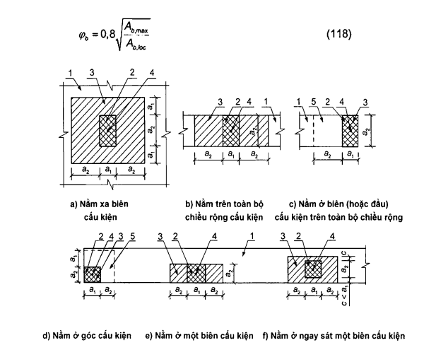

&nbsp;&nbsp;\- Trọng tâm của các diện tích $A_{b,loc}$ và $A_{b,max}$ phải trùng nhau;

&nbsp;&nbsp;\- Biên của diện tích tính toán $A_{b,max}$ nằm cách mỗi cạnh của diện tích $A_{b,loc}$ một khoảng bằng kích thước tương ứng của các cạnh này (Hình 13).

**CHÚ DẪN:**

1 - Cấu kiện có tải trọng cục bộ tác dụng;

2 - Diện tích chịu nén cục bộ $A_{b,loc}$;

3 - Diện tích tính toán lớn nhất $A_{b,max}$;

4 - Trọng tâm của các diện tích $A_{b,loc}$ và $A_{b,max}$;

5 - Vùng tối thiểu cần đặt lưới thép mà trong đó lưới thép được kể đến trong tính toán.

<strong>Hình 13 — Sơ đồ tính toán cấu kiện chịu nén cục bộ khi có tải trọng cục bộ tác dụng</strong>

### 8.1.5.3  Tính toán các cấu kiện chịu nén cục bộ khi đặt lưới thép hàn (cốt thép hạn chế biến dạng ngang) được tiến hành theo điều kiện:

$$N \le \psi R_{bs,loc} A_{b,loc}$$
<!-- formula_id: "F_TCVN_5574_2018_FORMULA_120" -->

trong đó:

&nbsp;&nbsp;&nbsp;&nbsp;\- $R_{bs,loc}$ là cường độ chịu nén tính toán quy đổi của bê tông có kể đến lưới thép đặt trong vùng chịu nén cục bộ, được xác định theo công thức:

$$R_{bs,loc} = R_{b,loc} + 2 \varphi_{s,xy} R_{s,xy} \mu_{s,xy}$$
<!-- formula_id: "F_TCVN_5574_2018_FORMULA_121" -->

trong đó:

&nbsp;&nbsp;&nbsp;&nbsp;\- $\varphi_{s,xy}$  là hệ số, được xác định theo công thức:

$$\varphi_{s,xy} = \sqrt{\frac{A_{b,loc,ef}}{A_{b,loc}}}$$
<!-- formula_id: "F_TCVN_5574_2018_FORMULA_122" -->

$A_{b,loc,ef}$  là diện tích nằm trong chu vi của lưới thép, tính theo các thanh ngoài cùng của lưới thép và lấy trong công thức (121) không lớn hơn $A_{b,max}$;

$R_{s,xy}$ là cường độ chịu kéo tính toán của cốt thép hạn chế biến dạng ngang;

µ$_{s,xy}$  là hàm lượng cốt thép hạn chế biến dạng ngang, được xác định theo công thức:

$$\mu_{s,xy} = \frac{n_x A_{sx} L_x + n_y A_{sy} L_y}{A_{b,\text{loc},\text{ef}} s}$$
<!-- formula_id: "F_TCVN_5574_2018_FORMULA_123" -->

$n_{x}$, $A_{sx}$, $L_{x}$ lần lượt là số lượng các thanh thép, diện tích tiết diện và chiều dài thanh thép của lưới, tính theo trục các thanh ngoài cùng, theo phương X;

$n_{y}$, $A_{sy}$, $L_{y}$  lần lượt là số lượng các thanh thép, diện tích tiết diện và chiều dài thanh thép của lưới, tính theo trục các thanh ngoài cùng, theo phương Y;

s  là bước lưới thép.

Các giá trị của $R_{b,loc}$, $A_{b,loc}$, ψ và N lấy theo 8.1.5.2.

Giá trị lực nén cục bộ chịu bởi cấu kiện được gia cường lưới thép cục bộ (vế phải của điều kiện (119)) lấy không lớn hơn hai lần giá trị lực nén cục bộ chịu bởi cấu kiện không được gia cường lưới thép cục bộ (vế phải của điều kiện (116)).

Cốt thép hạn chế biến dạng ngang phải được bố trí thỏa mãn các yêu cầu cấu tạo nêu trong 10.3.

### 8.1.6  Tính toán chọc thủng cấu kiện bê tông cốt thép

### 8.1.6.1  Yêu cầu chung

Tính toán chọc thủng được tiến hành đối với các cấu kiện bê tông cốt thép dạng phẳng (bản) khi có tác dụng của lực cục bộ (vuông góc với mặt phẳng cấu kiện) đặt tập trung - lực tập trung và mô men uốn tập trung.

Khi tính toán chọc thủng, cần xét tiết diện tính toán nằm gần vùng truyền lực lên cấu kiện ở khoảng cách $h_{0}$/2, vuông góc với trục dọc của nó, nơi có lực tiếp tuyến tác dụng lên bề mặt do lực tập trung và mô men uốn tập trung gây ra (Hình 14).

Lực tiếp tuyến tác dụng trên diện tích của tiết diện tính toán phải được chịu bởi bê tông với cường độ chịu kéo dọc trục $R_{bt}$ và bởi các thanh cốt thép ngang với cường độ chịu kéo $R_{sw}$ nằm cách diện chịu tải một khoảng $h_{0}$/3.

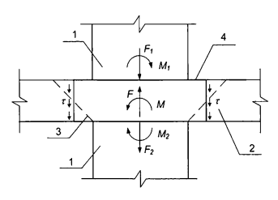

**CHÚ DẪN:**

1 - Cột; 		3 - Tháp chọc thủng;

2 - Bản; 	4 - Đường bao tính toán quy ước.

<strong>Hình 14 — Mô hình quy ước để tính toán chọc thủng</strong>

Khi có tác dụng của lực tập trung thì lực tiếp tuyến do bê tông và cốt thép cùng chịu được lấy như là lực phân bổ đều trên toàn bộ diện tích tiết diện tính toán. Khi có tác dụng của mô men uốn tập trung thì lực tiếp tuyến do bê tông và cốt thép ngang cùng chịu được lấy như là lực thay đổi tuyến tính dọc theo chiều dài tiết diện tính toán theo phương tác dụng của mô men uốn với lực tiếp tuyến lớn nhất ngược dấu ở biên của tiết diện ngang tính toán theo phương này.

Tính toán chọc thủng được tiến hành:

&nbsp;&nbsp;\- Khi có tác dụng của lực tập trung và không có cốt thép ngang - theo 8.1.6.2.1;

&nbsp;&nbsp;\- Khi có tác dụng của lực tập trung và có cốt thép ngang - theo 8.1.6.2.2;

&nbsp;&nbsp;\- Khi có tác dụng đồng thời của lực tập trung, mô men uốn tập trung và không có cốt thép ngang - theo 8.1.6.3.1;

&nbsp;&nbsp;\- Khi có tác dụng đồng thời của lực tập trung, mô men uốn tập trung và có cốt thép ngang - theo 8.1.6.3.2.

Đường bao tính toán của tiết diện ngang được xác định như sau:

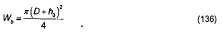

&nbsp;&nbsp;\- Khi diện truyền tải nằm ở phía trong của cấu kiện phẳng: là đường bao khép kín và bao quanh diện truyền tải (Hình 15c, d);

&nbsp;&nbsp;\- Khi diện truyền tải nằm ở biên hoặc ở góc cấu kiện phẳng thì cần xét hai phương án: một là, đường bao không khép kín nằm cách biên của cấu kiện phẳng (Hình 15a.1, b.1) và hai là, đường bao khép kín bao quanh diện truyền tải (Hình 15a.2, b.2); trong trường hợp này, lấy giá trị nhỏ hơn của khả năng chống chọc thủng tính được theo hai phương án đường bao tính toán của tiết diện ngang.

**CHÚ DẪN:**

1 - Diện diện truyền tải;

2 - Đường bao tính toán không khép kín của tiết diện ngang (phương án 1);

2' - Đường bao tính toán khép kín (phương án 2);

3 - Trọng tâm đường bao tính toán (vị trí giao nhau của các trục $X_{1}$ và $Y_{1}$);

4 - Trọng tâm diện truyền tải (vị trí giao nhau của các trục X và Y);

5 - Cốt thép ngang;

6 - Đường bao của tiết diện ngang tính toán mà trong tính toán không kể đến cốt thép ngang;

7 - Biên cấu kiện phẳng.

<strong>Hình 15 — Sơ đồ đường bao tính toán của tiết diện ngang khi chọc thủng</strong>

Hình 15 (kết thúc)

Trong trường hợp có lỗ mở trong bản với khoảng cách từ góc hoặc biên lỗ mở đến góc hoặc biên diện truyền tải không lớn hơn 6$h_{0}$ (Hình 16) thì không được kể vào tính toán phần đường bao tính toán nằm giữa hai đường tiếp tuyến với lỗ mở kẻ từ trọng tâm diện truyền tải.

**CHÚ DẪN:**

1 - Trọng tâm diện diện truyền tải;

2 - Đường bao tính toán không khép kín của tiết diện ngang (đã trừ đi đoạn thẳng nằm giữa hai đường tiếp tuyến kẻ từ trọng tâm diện truyền tải đến góc hoặc các biên lỗ mở);

3 - Trọng tâm đường bao tính toán;

4 - Hai đường tiếp tuyến kẻ từ trọng tâm diện truyền tải đến góc hoặc các biên lỗ mở;

5 - Lỗ mở.

<strong>Hình 16 — Sơ đồ đường bao tính toán khi có lỗ mở trong bản</strong>

Khi có tác dụng của mô men $M_{loc}$ tại vị trí đặt lực tập trung thì một nửa mô men này được kể vào tính toán chọc thủng, còn một nửa còn lại - được kể vào tính toán theo tiết diện thẳng góc theo chiều rộng tiết diện, bao gồm chiều rộng diện truyền tải và chiều cao tiết diện của cấu kiện phẳng về hai phía của diện truyền tải.

Khi có tác dụng của các mô men uốn tập trung và lực tập trung thì trong các điều kiện độ bền tỉ số giữa các mô men uốn tập trung tác dụng M, đã được kể đến khi tính toán chọc thủng, và các mô men uốn giới hạn $M_{u}$ lấy không lớn hơn một nửa tỉ số giữa lực tập trung tác dụng F và lực giới hạn $F_{u}$.

Khi lực tập trung nằm lệch tâm so với trọng tâm đường bao tính toán của tiết diện ngang thì giá trị các mô men uốn tập trung do ngoại lực được xác định có kể đến mô men bổ sung do lực tập trung đặt lệch tâm so với trọng tâm đường bao tính toán của tiết diện ngang với dấu “dương” hoặc “âm” so với các mô men trong cột.

Giá trị lực tập trung cần được lấy sau khi đã trừ đi lực tác dụng trong phạm vi tháp chọc thủng theo hướng ngược lại.

### 8.1.6.2  Tính toán chọc thủng cấu kiện chịu lực tập trung

### 8.1.6.2.1  Tính toán chọc thủng cho cấu kiện không có cốt thép ngang chịu lực tập trung được tiến hành theo điều kiện:

$$F \le F_{b,u} \tag{123}$$
<!-- formula_id: "F_TCVN_5574_2018_FORMULA_123" -->

trong đó:

&nbsp;&nbsp;&nbsp;&nbsp;\- F là lực tập trung do ngoại lực;

&nbsp;&nbsp;&nbsp;&nbsp;\- $F_{b,u}$ là lực tập trung giới hạn mà bê tông có thể chịu được.

&nbsp;&nbsp;&nbsp;&nbsp;\- Lực giới hạn $F_{b,u}$ được xác định theo công thức:

$$F_{b,u} = R_{bt}A_{b} \tag{124}$$
<!-- formula_id: "F_TCVN_5574_2018_FORMULA_124" -->

trong đó: $A_{b}$ là diện tích tiết diện ngang tính toán nằm ở khoảng cách 0,5$h_{0}$, tính từ biên của diện truyền lực tập trung F, với chiều cao làm việc của tiết diện $h_{0}$ (Hình 17).

&nbsp;&nbsp;&nbsp;&nbsp;\- Diện tích $A_{b}$ được xác định theo công thức:

$$A_{b} = uh_{0} \tag{125}$$
<!-- formula_id: "F_TCVN_5574_2018_FORMULA_125" -->

trong đó:

&nbsp;&nbsp;&nbsp;&nbsp;\- u  là chu vi đường bao của tiết diện ngang tính toán;

&nbsp;&nbsp;&nbsp;&nbsp;\- $h_{0}$  là chiều cao làm việc quy đổi của tiết diện, $h_{0}$ = 0,5($h_{0x}$ + $h_{0y}$), với $h_{0x}$ và $h_{0y}$ là chiều cao làm việc của tiết diện đối với cốt thép dọc nằm theo phương các trục X và Y.

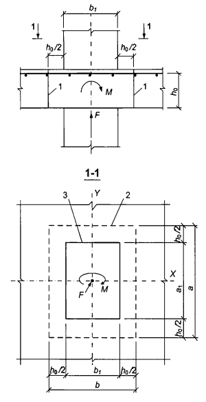

**CHÚ DẪN:**

1 - Tiết diện ngang tính toán;

2 - Đường bao của tiết diện ngang tính toán;

3 - Đường bao của diện truyền tải.

<strong>Hình 17 — Sơ đồ tính toán chọc thủng của cấu kiện không có cốt thép ngang</strong>

### 8.1.6.2.2  Tính toán chọc thủng cho cấu kiện có cốt thép ngang chịu lực tập trung (Hình 18) được tiến hành theo điều kiện:

$$F \le F_{b,u} + F_{sw,u} \tag{126}$$
<!-- formula_id: "F_TCVN_5574_2018_FORMULA_126" -->

trong đó:

&nbsp;&nbsp;&nbsp;&nbsp;\- $F_{sw,u}$ là lực giới hạn do cốt thép ngang chịu khi chọc thủng;

&nbsp;&nbsp;&nbsp;&nbsp;\- $F_{b,u}$ là lực giới hạn do bê tông chịu, được xác định theo 8.1.6.2.1.

&nbsp;&nbsp;&nbsp;&nbsp;\- Lực giới hạn $F_{sw,u}$ chịu bởi cốt thép ngang nằm vuông góc với trục dọc cấu kiện và phân bố đều dọc theo đường bao của tiết diện ngang tính toán được xác định theo công thức:

$$F_{sw,u} = 0,8 q_{sw} u \tag{127}$$
<!-- formula_id: "F_TCVN_5574_2018_FORMULA_127" -->

trong đó:

&nbsp;&nbsp;&nbsp;&nbsp;\- u  là chu vi đường bao của tiết diện ngang tính toán, được xác định theo 8.1.6.2.1;

&nbsp;&nbsp;&nbsp;&nbsp;\- $q_{sw}$  là nội lực trong cốt thép ngang trên một đơn vị chiều dài đường bao của tiết diện tính toán, nằm trong phạm vi 0,5$h_{0}$ về hai phía đường bao của tiết diện tính toán, được xác định theo công thức:

$$q_{sw} = \frac{R_{sw} A_{sw}}{s_w} \tag{128}$$
<!-- formula_id: "F_TCVN_5574_2018_FORMULA_128" -->

trong đó:

&nbsp;&nbsp;&nbsp;&nbsp;\- $A_{sw}$  là diện tích tiết diện cốt thép ngang với bước $s_{w}$, nằm trong phạm vi 0,5$h_{0}$ về hai phía đường bao của tiết diện ngang tính toán theo chu vi của nó.

Khi cốt thép ngang phân bố không đều dọc theo đường bao của tiết diện tính toán mà phân bố tập trung ở các trục của diện truyền tải (cốt thép ngang đặt chồng dạng chữ thập) thì chu vi đường bao u đối với cốt thép ngang lấy theo chiều dài thực tế của các đoạn có bố trí cốt thép ngang $L_{sw,x}$ và $L_{sw,y}$ theo đường bao chọc thủng tính toán (Hình 15d).

Giá trị của tổng ($F_{b,u}$ + $F_{sw,u}$) lấy không lớn hơn 2$F_{b,u}$. Cốt thép ngang được kể vào tính toán khi $F_{sw,u}$ không nhỏ hơn 0,25$F_{b,u}$.

Vùng nằm ngoài biên bố trí cốt thép ngang được tính toán chọc thủng theo 8.1.6.2.1, trong đó xét đường bao của tiết diện tính toán ở khoảng cách 0,5$h_{0}$ tính từ biên bố trí cốt thép ngang (Hình 18). Khi cốt thép ngang đặt tập trung theo các trục của diện truyền tải thì đường bao tính toán của tiết diện ngang của bê tông lấy theo các đường chéo tính từ biên bố trí cốt thép ngang (Hình 15d).

Cốt thép ngang phải thỏa mãn các yêu cầu cấu tạo nêu trong 10.3. Khi các yêu cầu cấu tạo nêu trong 10.3 không được thỏa mãn thì trong tính toán chọc thủng chỉ được kể cốt thép ngang cắt tháp chọc thủng với điều kiện đảm bảo được điều kiện neo cốt thép ngang này.

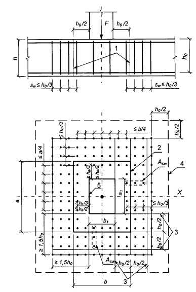

**CHÚ DẪN:**

1 - Tiết diện ngang tính toán;

2 - Đường bao của tiết diện ngang tính toán;

3 - Các biên của vùng mà trong đó cốt thép ngang được kể đến trong tính toán;

4 - Đường bao của tiết diện ngang tính toán mà cốt thép ngang không kể đến trong tính toán;

5 - Đường bao của diện truyền tải.

<strong>Hình 18 — Sơ đồ tính toán chọc thủng của bản bê tông cốt thép có cốt thép ngang đặt đều nhau theo phương đứng</strong>

### 8.1.6.3  Tính toán chọc thủng cấu kiện chịu lực tập trung và mô men uốn tập trung

### 8.1.6.3.1  Tính toán chọc thủng cấu kiện không có cốt thép ngang khi có tác dụng đồng thời của lực tập trung và mô men uốn tập trung (Hình 17) được tiến hành theo điều kiện:

$$\frac{F}{F_{b,u}} + \frac{M}{M_{b,u}} \le 1 \tag{129}$$
<!-- formula_id: "F_TCVN_5574_2018_FORMULA_129" -->

trong đó:

&nbsp;&nbsp;&nbsp;&nbsp;\- F  là lực tập trung do ngoại lực;

&nbsp;&nbsp;&nbsp;&nbsp;\- M  là mô men uốn tập trung do ngoại lực, được kể đến trong tính toán chọc thủng (xem 8.1.6.1);

&nbsp;&nbsp;&nbsp;&nbsp;\- $F_{b,u}$ và $M_{b,u}$ lần lượt là lực tập trung giới hạn và mô men uốn tập trung giới hạn mà bê tông có thể chịu được trong tiết diện tính toán khi chúng tác dụng độc lập.

&nbsp;&nbsp;&nbsp;&nbsp;\- Trong khung bê tông cốt thép của nhà với các sàn phẳng thì mô men uốn tập trung $M_{loc}$ bằng tổng mô men uốn trong các tiết diện của cột trên và cột dưới tiếp giáp với sàn trong nút đang xét.

&nbsp;&nbsp;&nbsp;&nbsp;\- Lực giới hạn $F_{b,u}$ được xác định theo 8.1.6.2.1.

&nbsp;&nbsp;&nbsp;&nbsp;\- Mô men uốn giới hạn $M_{b,u}$ được xác định theo công thức:

$$M_{b,u} = R_{bt}W_{b}h_{0} \tag{130}$$
<!-- formula_id: "F_TCVN_5574_2018_FORMULA_130" -->

trong đó:

&nbsp;&nbsp;&nbsp;&nbsp;\- $W_{b}$  là mô men kháng uốn của đường bao tính toán của tiết diện ngang, xác định theo 8.1.6.3.3.

Khi có tác dụng của các mô men uốn trong hai mặt phẳng vuông góc với nhau thì tính toán chọc thủng được tiến hành theo điều kiện:

$$\frac{F}{F_{b,u}} + \frac{M_x}{M_{bx,u}} + \frac{M_y}{M_{by,u}} \le 1 \tag{131}$$
<!-- formula_id: "F_TCVN_5574_2018_FORMULA_131" -->

khi đó lấy

$$\frac{M_x}{M_{bx,u}} + \frac{M_y}{M_{by,u}} \le 0,5 \frac{F}{F_{b,u}}$$
<!-- formula_id: "F_TCVN_5574_2018_RID152" -->

trong đó:

&nbsp;&nbsp;&nbsp;&nbsp;\- F, $M_{x}$ và $M_{y}$  lần lượt là lực tập trung và các mô men uốn tập trung theo phương các trục X và Y, đã được kể đến trong tính toán chọc thủng (xem 8.1.6.1), do ngoại lực;

&nbsp;&nbsp;&nbsp;&nbsp;\- $F_{b,u}$, $M_{bx,u}$ và $M_{by,u}$  lần lượt là lực tập trung giới hạn và các mô men uốn tập trung giới hạn theo phương các trục X và Y, mà bê tông trong tiết diện ngang tính toán có thể chịu được, khi chúng tác dụng độc lập.

&nbsp;&nbsp;&nbsp;&nbsp;\- Lực giới hạn $F_{b,u}$ được xác định theo 8.1.6.2.1.

Các mô men uốn giới hạn $M_{bx,u}$ và $M_{by,u}$ được xác định theo các chỉ dẫn đã nêu ở trên khi có tác dụng của mô men uốn trong mặt phẳng các trục X và Y tương ứng.

### 8.1.6.3.2  Tính toán chọc thủng cấu kiện có cốt thép ngang khi có tác dụng đồng thời của lực tập trung và mô men uốn tập trung được tiến hành theo điều kiện:

$$\frac{F}{F_{b,u} + F_{sw,u}} + \frac{M_x}{M_{bx,u} + M_{swx,u}} + \frac{M_y}{M_{by,u} + M_{swy,u}} \le 1 \tag{132}$$
<!-- formula_id: "F_TCVN_5574_2018_FORMULA_132" -->

khi đó lấy

$$\frac{M_x}{M_{bx,u} + M_{swx,u}} + \frac{M_y}{M_{by,u} + M_{swy,u}} \le 0,5 \frac{F}{F_{b,u} + F_{sw,u}}$$
<!-- formula_id: "F_TCVN_5574_2018_RID154" -->

trong đó:

&nbsp;&nbsp;&nbsp;&nbsp;\- F, $M_{x}$ và $M_{y}$  được xác định theo 8.1.6.3.1;

&nbsp;&nbsp;&nbsp;&nbsp;\- $F_{b,u}$, $M_{bx,u}$ và $M_{by,u}$  lần lượt là lực tập trung giới hạn và các mô men uốn tập trung giới hạn theo phương các trục X và Y, mà bê tông trong tiết diện tính toán có thể chịu được, khi chúng tác dụng độc lập;

&nbsp;&nbsp;&nbsp;&nbsp;\- $F_{sw,u}$, $M_{swx,u}$ và $M_{swy,u}$  lần lượt là lực tập trung giới hạn và các mô men uốn tập trung giới hạn theo phương các trục X và Y, mà cốt thép ngang trong tiết diện tính toán có thể chịu được, khi chúng tác dụng độc lập.

&nbsp;&nbsp;&nbsp;&nbsp;\- Các lực giới hạn $F_{b,u}$, $F_{sw,u}$ và các mô men giới hạn $M_{bx,u}$, $M_{by,u}$ được xác định theo 8.1.6.2.2 và 8.1.6.3.1.

Các mô men giới hạn $M_{swx,u}$ và $M_{swy,u}$ chịu bởi cốt thép ngang nằm vuông góc với trục dọc cấu kiện và phân bố đều dọc theo đường bao của tiết diện tính toán được xác định khi có tác dụng của mô men uốn theo phương các trục X và Y tương ứng theo công thức:

$$M_{sw,u} = 0,8 q_{sw}W_{sw} \tag{133}$$
<!-- formula_id: "F_TCVN_5574_2018_FORMULA_133" -->

trong đó: $q_{sw}$ và $W_{sw}$ được xác định theo 8.1.6.2.2 và 8.1.6.3.4.

&nbsp;&nbsp;&nbsp;&nbsp;\- Các giá trị của các tổng ($F_{b,u}$ + $F_{sw,u}$), ($M_{bx,u}$ + $M_{swx,u}$), ($M_{by,u}$ + $M_{swy,u}$) trong điều kiện (132) lấy lần lượt không lớn hơn 2$F_{b,u}$ , 2$M_{bx,u}$, 2$M_{by,u}$.

Cốt thép ngang phải thỏa mãn các yêu cầu cấu tạo nêu trong 10.3. Khi các yêu cầu cấu tạo nêu trong 10.3 không được thỏa mãn thì trong tính toán chọc thủng chỉ kể đến cốt thép ngang cắt tháp chọc thủng với điều kiện đảm bảo được điều kiện neo cốt thép ngang này.

### 8.1.6.3.3  Trong trường hợp tổng quát, các giá trị mô men kháng uốn khi chọc thủng $W_{bx(y)}$ của đường bao tính toán bê tông, theo phương các trục vuông góc với nhau X và Y được xác định theo công thức:

$$W_{bx(y)} = \frac{I_{bx(y)}}{x(y)_{\max}} \tag{134}$$
<!-- formula_id: "F_TCVN_5574_2018_FORMULA_134" -->

trong đó:

&nbsp;&nbsp;&nbsp;&nbsp;\- $I_{bx(y)}$  là mô men quán tính của đường bao tính toán đối với các trục $Y_{1}$ và $X_{1}$, đi qua trọng tâm của nó (Hình 15);

&nbsp;&nbsp;&nbsp;&nbsp;\- x(y)$_{max}$  là khoảng cách lớn nhất tính từ đường bao tính toán đến trọng tâm của nó.

Giá trị của mô men quán tính $I_{bx(y)}$ được tính bằng tổng của mô men quán tính $I_{bx(y)i}$ của các đoạn thành phần của đường bao tính toán của tiết diện ngang đối với các trục trung tâm, đi qua trọng tâm của đường bao tính toán với chiều rộng của mỗi đoạn thành phần được quy ước lấy bằng đơn vị.

Vị trí trọng tâm đường bao tính toán đối với trục đã chọn được xác định theo công thức:

$$W_b = \frac{\pi (D + h_0)^2}{4} \tag{135}$$
<!-- formula_id: "F_TCVN_5574_2018_FORMULA_135" -->

trong đó:

&nbsp;&nbsp;&nbsp;&nbsp;\- $L_{i}$  là chiều dài đoạn thứ i của đường bao tính toán;

&nbsp;&nbsp;&nbsp;&nbsp;\- xi(yi)$_{0}$  là khoảng cách từ trọng tâm các đoạn thành phần của đường bao tính toán đến các trục đã chọn.

Khi tính toán thì lấy giá trị nhỏ nhất của mô men kháng uốn $W_{bx}$ và giá trị nhỏ nhất của mô men kháng uốn $W_{by}$.

Mô men kháng uốn của đường bao tính toán của bê tông đối với cột tiết diện tròn được xác định theo công thức:

$$W_b = \frac{\pi(D+h_0)^2}{4} \tag{136}$$
<!-- formula_id: "F_TCVN_5574_2018_FORMULA_136" -->

trong đó: D là đường kính tiết diện cột.

### 8.1.6.3.4  Giá trị các mô men kháng uốn $W_{sw,x}$ và $W_{sw,y}$ của cốt thép ngang khi chọc thủng trong trường hợp, khi mà cốt thép ngang phân bố đều dọc theo đường bao chọc thủng tính toán trong phạm vi của vùng có các biên nằm ở khoảng cách $h_{0}$/2 về mỗi phía của đường bao chọc thủng bê tông (Hình 18), lần lượt lấy bằng các giá trị $W_{bx}$ và $W_{by}$.

Khi cốt thép ngang trong cấu kiện phẳng đặt tập trung theo các trục của diện chịu tải, ví dụ theo trục các cột (cốt thép ngang đặt chồng chữ thập trong sàn), thì các mô men kháng uốn của cốt thép ngang cũng được xác định theo các nguyên tắc như đối với các mô men kháng uốn của bê tông, với chiều dài thực tế tương ứng $L_{sw,x}$ và $L_{sw,y}$ của đoạn bố trí cốt thép ngang theo đường bao chọc thủng tính toán (Hình 15d).

### 8.1.7  Tính toán cấu kiện bê tông cốt thép phẳng của bản và tường theo độ bền

### 8.1.7.1  Tính toán độ bền các bản phẳng của sàn tầng, sàn mái và bản móng cần được tiến hành như đối với các phần tử phẳng được tách ra chịu tác dụng đồng thời của mô men uốn theo phương các trục vuông góc với nhau và mô men xoắn tác dụng ở cạnh bên của phần tử phẳng được tách ra, cũng như chịu tác dụng của lực dọc và lực cắt tác dụng ở các cạnh bên của phần tử phẳng (Hình 19).

Ngoài ra, khi các bản phẳng tựa lên cột thì cần tiến hành tính toán chọc thủng cho bản chịu tác dụng của lực pháp tuyến tập trung và mô men uốn tập trung theo 8.1.6.

### 8.1.7.2  Tính toán độ bền các bản phẳng trong trường hợp tổng quát nên được tiến hành bằng cách chia phần tử phẳng ra thành các lớp bê tông chịu nén và cốt thép chịu kéo và tính toán riêng biệt từng lớp chịu tác dụng của lực pháp tuyến và lực trượt trong lớp này. Các lực này do tác dụng của mô men uốn, mô men xoắn và lực pháp tuyến gây ra (Hình 20).

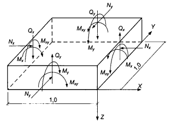

<strong>Hình 19 — Sơ đồ nội lực tác dụng lên phần tử phẳng được tách ra với chiều rộng đơn vị</strong>

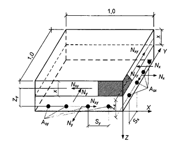

<strong>Hình 20 — Sơ đồ nội lực tác dụng trong các lớp bê tông và cốt thép của phần tử phẳng được tách ra của bản (ở đây quy ước không thể hiện nội lực ở các cạnh đối diện)</strong>

Tính toán các phần tử phẳng của bản cũng có thể được tiến hành bằng cách không thành chia các lớp bê tông và cốt thép chịu kéo chịu tác dụng đồng thời của mô men uốn và mô men xoắn theo các điều kiện dựa trên các phương trình cân bằng giới hạn tổng quát:

$$\begin{aligned}
(M_{x,u} - M_x)(M_{y,u} - M_y) - M_{xy}^2 \ge 0 \qquad (137) \\
M_{x,u} \ge M_x \qquad (138) \\
M_{y,u} \ge M_y \qquad (139) \\
M_{xy,u} \ge M_{xy} \qquad (140)
\end{aligned}$$
<!-- formula_id: "F_TCVN_5574_2018_FORMULA_137" -->

trong đó:

&nbsp;&nbsp;&nbsp;&nbsp;\- $M_{x}$, $M_{y}$, $M_{xy}$ lần lượt là các mô men uốn và mô men xoắn tác dụng lên phần tử phẳng được tách ra;

&nbsp;&nbsp;&nbsp;&nbsp;\- $M_{x,u}$, $M_{y,u}$, $M_{xy,u}$ lần lượt là giá trị giới hạn của các mô men uốn và mô men xoắn mà phần tử phẳng được tách ra có thể chịu được.

Giá trị của các mô men uốn giới hạn $M_{x,u}$ và $M_{y,u}$ được xác định từ tính toán tiết diện thẳng góc, nằm vuông góc với các trục X và Y, của phần tử phẳng được tách ra của cấu kiện với cốt thép dọc nằm song song với các trục X và Y theo các chỉ dẫn trong 8.1.2.1 đến 8.1.2.3.

Giá trị giới hạn của các mô men xoắn giới hạn cần được xác định theo bê tông $M_{bxy,u}$ và theo cốt thép dọc chịu kéo $M_{sxy,u}$ theo các công thức:

$$M_{bxy,u} = 0,1 R_{b}b^{2} h \tag{141}$$
<!-- formula_id: "F_TCVN_5574_2018_FORMULA_141" -->

trong đó: b và h lần lượt là cạnh nhỏ và cạnh lớn của phần tử phẳng được tách ra;

$$M_{sxy,u} = 0,5 R_{s} ( A_{sx} + A_{sy} ) h_{0} \tag{142}$$
<!-- formula_id: "F_TCVN_5574_2018_FORMULA_142" -->

trong đó:

&nbsp;&nbsp;&nbsp;&nbsp;\- $A_{sx}$ và $A_{sy}$ là diện tích tiết diện cốt thép dọc theo phương các trục X và Y;

&nbsp;&nbsp;&nbsp;&nbsp;\- $h_{0}$ là chiều cao làm việc của tiết diện ngang của bản.

Cho phép sử dụng cả các phương pháp khác để tính toán độ bền phần tử phẳng được tách ra, trên cơ sở cân bằng ngoại lực tác dụng theo các cạnh bên của phần tử tách ra và nội lực trong các tiết diện chéo của phần tử phẳng được tách ra.

Khi có cả lực dọc tác dụng lên phần tử phẳng được tách ra của bản thì tính toán được tiến hành như đối với phần tử phẳng được tách ra của tường theo 8.1.7.5.

### 8.1.7.3  Tính toán phần tử phẳng được tách ra chịu tác dụng của lực cắt được tiến hành theo điều kiện:

$$\frac { Q _ { x } } { Q _ { x , u } } + \frac { Q _ { y } } { Q _ { y , u } } . . \le 1 \tag{ 143 }$$
<!-- formula_id: "F_TCVN_5574_2018_RID161" -->

trong đó:

&nbsp;&nbsp;&nbsp;&nbsp;\- $Q_{x}$ và $Q_{y}$ là các lực cắt tác dụng theo các mặt bên của phần tử phẳng được tách ra;

&nbsp;&nbsp;&nbsp;&nbsp;\- $Q_{x,u}$ và $Q_{y,u}$ là các lực cắt giới hạn mà phần tử phẳng được tách ra có thể chịu được.

Giá trị các lực cắt giới hạn, $Q_{x,u}$ và $Q_{y,u}$, được xác định theo công thức:

$$Q_{x(y),u} = Q_{b} + Q_{sw} \tag{144}$$
<!-- formula_id: "F_TCVN_5574_2018_FORMULA_144" -->

trong đó:

&nbsp;&nbsp;&nbsp;&nbsp;\- $Q_{b}$ và $Q_{sw}$ là các lực cắt giới hạn mà bê tông và cốt thép ngang có thể chịu được và được xác định theo các công thức:

$$Q_{b} = 0,5 R_{bt}bh_{0} \tag{145}$$
<!-- formula_id: "F_TCVN_5574_2018_FORMULA_145" -->

$$Q_{sw} = q_{sw}h_{0} \tag{146}$$
<!-- formula_id: "F_TCVN_5574_2018_FORMULA_146" -->

trong đó: $q_{sw}$ là mật độ cốt thép ngang, được xác định theo công thức (92).

### 8.1.7.4  Tính toán độ bền của tường trong trường hợp tổng quát được tiến hành như đối với các phần tử phẳng được tách ra chịu tác dụng đồng thời của lực pháp tuyến, mô men uốn, mô men xoắn, lực trượt, lực cắt tác dụng theo các cạnh của phần tử phẳng được tách ra (Hình 21).

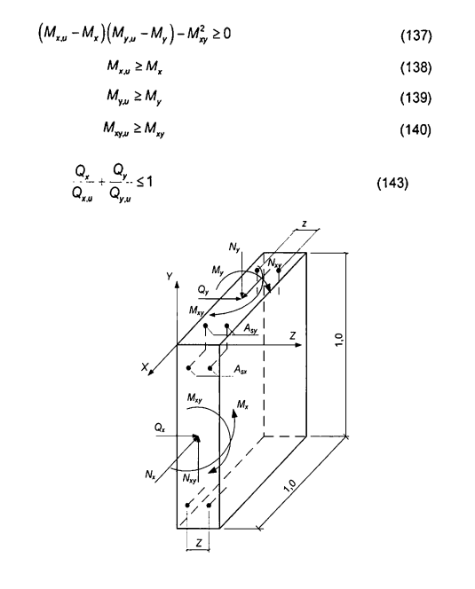

<strong>Hình 21 — Sơ đồ nội lực tác dụng lên phần tử phẳng được tách ra của tường có chiều rộng đơn vị (quy ước không thể hiện nội lực ở phía đối diện)</strong>

### 8.1.7.5  Tính toán tường trong trường hợp tổng quát nên được tiến hành bằng cách chia phần tử phẳng thành các lớp bê tông chịu nén và cốt thép chịu kéo và tính toán từng lớp riêng biệt chịu tác dụng của lực pháp tuyến và lực trượt trong lớp này. Các lực này do tác dụng của mô men uốn và mô men xoắn, lực pháp tuyến tổng quát và lực trượt tổng quát gây ra.

Cho phép tính toán ngoài mặt phẳng với tác dụng đồng thời của mô men uốn, mô men xoắn và lực pháp tuyến mà cần không chia ra thành các lớp bê tông và cốt thép chịu kéo và tính toán trong mặt phẳng với tác dụng đồng thời của lực pháp tuyến và lực trượt.

Tính toán tường trong mặt phẳng của nó nên được tiến hành theo các điều kiện dựa trên các phương trình cân bằng giới hạn tổng quát:

$$\begin{aligned}
(N_{x,u} - N_x)(N_{y,u} - N_y) - N_{xy,u}^2 \ge 0 \qquad (147) \\
N_{x,u} \ge N_x \qquad (148) \\
N_{y,u} \ge N_y \qquad (149) \\
N_{xy,u} \ge N_{xy} \qquad (150)
\end{aligned}$$
<!-- formula_id: "F_TCVN_5574_2018_FORMULA_147" -->

trong đó:

&nbsp;&nbsp;&nbsp;&nbsp;\- $N_{x}$, $N_{y}$ và $N_{xy}$ lần lượt là các lực pháp tuyến và lực trượt tác dụng theo các cạnh bên của phần tử phẳng được tách ra;

&nbsp;&nbsp;&nbsp;&nbsp;\- $N_{x,u}$, $N_{y,u}$ và $N_{xy,u}$ lần lượt là các giá trị giới hạn của các lực pháp tuyến và lực trượt mà phần tử phẳng được tách ra có thể chịu được.

Giá trị của các lực pháp tuyến giới hạn $N_{x,u}$ và $N_{y,u}$ cần được xác định từ tính toán tiết diện thẳng góc, nằm vuông góc với các trục X và Y, của phần tử phẳng được tách ra với cốt thép theo phương đứng và phương ngang nằm song song với các trục X và Y, theo các chỉ dẫn trong 8.1.2.4 đến 8.1.2.6.

Giá trị của các lực trượt giới hạn cần được xác định theo bê tông $N_{bxy,u}$ và theo cốt thép $N_{sxy,u}$ theo các công thức:

$$N_{bxy,u} = 0,3 R_{b}A_{b} \tag{151}$$
<!-- formula_id: "F_TCVN_5574_2018_FORMULA_151" -->

trong đó:

&nbsp;&nbsp;&nbsp;&nbsp;\- $A_{b}$  là diện tích làm việc của tiết diện ngang của bê tông của phần tử phẳng được tách ra;

$$N_{sxy,u} = 0,5 R_{s} ( A_{sx} + A_{sy} ) \tag{152}$$
<!-- formula_id: "F_TCVN_5574_2018_FORMULA_152" -->

trong đó:

&nbsp;&nbsp;&nbsp;&nbsp;\- $A_{sx}$ và $A_{sy}$ là diện tích tiết diện cốt thép theo phương các trục X và Y trong phần tử phẳng được tách ra.

Tính toán ngoài mặt phẳng đối với tường được tiến hành tương tự như tính toán bản phẳng của sàn tầng với các giá trị mô men uốn giới hạn và có kể đến ảnh hưởng của lực pháp tuyến.

Cho phép sử dụng cả các phương pháp khác để tính toán độ bền phần tử phẳng được tách ra trên cơ sở cân bằng ngoại lực tác dụng theo các cạnh bên của phần tử phẳng được tách ra và nội lực trong các tiết diện chéo của phần tử phẳng được tách ra.

### 8.1.7.6  Tính toán độ bền các phần tử phẳng được tách ra của tường chịu tác dụng của lực cắt cần được tiến hành tương tự như tính toán bản, nhưng có kể đến ảnh hưởng của lực dọc.

### 8.1.7.7  Tính toán khả năng chống nứt của bản (về hình thành và mở rộng vết nứt thẳng góc với trục dọc cấu kiện), cần được tiến hành với tác dụng của mô men uốn (không kể đến mô men xoắn) theo các chỉ dẫn trong 8.2.

### 8.2  Tính toán cấu kiện của các kết cấu bê tông cốt thép theo các trạng thái giới hạn thứ hai

### 8.2.1  Yêu cầu chung

### 8.2.1.1  Tính toán theo các trạng thái giới hạn thứ hai bao gồm:

&nbsp;&nbsp;\- Tính toán theo sự hình thành vết nứt;

&nbsp;&nbsp;\- Tính toán theo sự mở rộng vết nứt;

&nbsp;&nbsp;\- Tính toán biến dạng.

### 8.2.1.2  Tính toán theo sự hình thành vết nứt được tiến hành khi phải đảm bảo không có vết nứt được hình thành (xem 4.3), cũng như được coi là phép tính toán bổ sung khi tính toán mở rộng vết nứt và tính toán biến dạng.

### 8.2.1.3  Khi tính toán theo sự hình thành vết nứt với mục đích không cho phép vết nứt xuất hiện thì lấy hệ số độ tin cậy về tải trọng $\gamma_{f}$ > 1,0 (như khi tính toán độ bền). Khi tính toán mở rộng vết nứt và tính toán biến dạng (bao gồm tính toán bổ sung về hình thành vết nứt) thì lấy hệ số độ tin cậy về tải trọng $\gamma_{f}$ = 1,0.

### 8.2.2  Tính toán cấu kiện bê tông cốt thép theo sự hình thành và mở rộng vết nứt

### 8.2.2.1  Yêu cầu chung

### 8.2.2.1.1  Tính toán theo sự hình thành vết nứt của cấu kiện bê tông cốt thép được tiến hành trong các trường hợp khi mà điều kiện sau được tuân thủ:

$$M > M_{crc} \tag{153}$$
<!-- formula_id: "F_TCVN_5574_2018_FORMULA_153" -->

trong đó:

&nbsp;&nbsp;&nbsp;&nbsp;\- M  là mô men uốn do ngoại lực đối với trục vuông góc với mặt phẳng tác dụng của mô men uốn và đi qua trọng tâm tiết diện ngang quy đổi của cấu kiện;

&nbsp;&nbsp;&nbsp;&nbsp;\- $M_{crc}$  là mô men uốn do tiết diện thẳng góc của cấu kiện chịu khi hình thành vết nứt, được xác định theo công thức (158).

Đối với các cấu kiện chịu kéo đúng tâm thì sự hình thành vết nứt được xác định theo điều kiện:

$$N > N_{crc} \tag{154}$$
<!-- formula_id: "F_TCVN_5574_2018_FORMULA_154" -->

trong đó:

&nbsp;&nbsp;&nbsp;&nbsp;\- N  là lực kéo dọc trục do ngoại lực;

&nbsp;&nbsp;&nbsp;&nbsp;\- $N_{crc}$  là lực kéo dọc trục chịu bởi cấu kiện khi hình thành vết nứt, xác định theo 8.2.2.2.6.

### 8.2.2.1.2  Trong các trường hợp, khi mà các điều kiện (153) và (154) xảy ra, thì cần tính toán chiều rộng vết nứt. Cần tính toán các cấu kiện bê tông cốt thép theo các vết nứt ngắn hạn và dài hạn.

Chiều rộng vết nứt ngắn hạn được xác định do tác dụng đồng thời của tải trọng thường xuyên và tạm thời (dài hạn và ngắn hạn), còn chiều rộng vết nứt dài hạn được xác định chỉ do tải trọng thường xuyên và tạm thời dài hạn (xem 4.6).

### 8.2.2.1.3  Tính toán chiều rộng vết nứt được tiến hành theo điều kiện:

$$a_{crc} \le a_{crc,u} \tag{155}$$
<!-- formula_id: "F_TCVN_5574_2018_FORMULA_155" -->

trong đó:

&nbsp;&nbsp;&nbsp;&nbsp;\- $a_{crc}$ là chiều rộng vết nứt do tác dụng của ngoại lực, xác định theo 8.2.2.1.4, 8.2.2.3.1 đến 8.2.2.3.3;

&nbsp;&nbsp;&nbsp;&nbsp;\- $a_{crc,u}$ là chiều rộng vết nứt giới hạn cho phép, lấy theo Bảng 17.

### Bảng 17 - Chiều rộng vết nứt giới hạn cho phép

| Loại cốt thép | Tiêu chuẩn | Giá trị $a_{crc,u}$ của vết nứt |  |
| :--- | :--- | :--- | :--- |
| Loại cốt thép | Tiêu chuẩn | Dài hạn | Ngắn hạn |
| 1. Theo điều kiện đảm bảo tính toàn vẹn cho cốt thép |  |  |  |
| CB240-T, CB300-T | TCVN 1651-1:2008 | 0,3 | 0,4 |
| CB300-V, CB400-V, CB500-V, CB600-V | TCVN 1651-2:2018 | 0,3 | 0,4 |
| Dây thép vuốt nguội | TCVN 6288:1997 (ISO 10544:1992) | 0,3 | 0,4 |
| Cốt thép thanh cường độ cao (có giới hạn chảy quy ước 835, 930 và 1 080 MPa) | TCVN 6284-5:1997 (ISO 6934-5:1991) | 0,2 | 0,3 |
| Dây thép kéo nguội cường độ cao | TCVN 6284-2:1997 (ISO 6394-2:1991) | 0,2 | 0,3 |
| Cáp 7 sợi đường kính 12,4 mm trở lên | TCVN 6284-4:1997 (ISO 6934-4:1991) | 0,2 | 0,3 |
| Cáp 19 sợi | TCVN 6284-4:1997 (ISO 6934-4:1991) | 0,2 | 0,3 |
| Cáp 7 sợi đường kính nhỏ hơn 12,4 mm | TCVN 6284-4:1997 (ISO 6934-4:1991) | 0,1 | 0,2 |
| 2. Theo điều kiện hạn chế thấm cho kết cấu |  |  |  |
|  | - | 0,2 | 0,3 |

### 8.2.2.1.4  Tính toán cấu kiện bê tông cốt thép cần được tiến hành theo sự mở rộng dài hạn và ngắn hạn của các vết nứt thẳng góc và xiên.

Chiều rộng vết nứt dài hạn được xác định theo công thức:

$$a_{crc} = a_{crc,1} \tag{156}$$
<!-- formula_id: "F_TCVN_5574_2018_FORMULA_156" -->

còn chiều rộng vết nứt ngắn hạn được xác định theo công thức:

$$a_{crc} = a_{crc,1} + a_{crc,2} - a_{crc,3} \tag{157}$$
<!-- formula_id: "F_TCVN_5574_2018_FORMULA_157" -->

trong đó:

&nbsp;&nbsp;&nbsp;&nbsp;\- $a_{crc,1}$  là chiều rộng vết nứt do tác dụng dài hạn của tải trọng thường xuyên và tạm thời dài hạn;

&nbsp;&nbsp;&nbsp;&nbsp;\- $a_{crc,2}$  là chiều rộng vết nứt do tác dụng ngắn hạn của tải trọng thường xuyên và tạm thời (dài hạn và ngắn hạn);

&nbsp;&nbsp;&nbsp;&nbsp;\- $a_{crc,3}$  là chiều rộng vết nứt do tác dụng ngắn hạn của tải trọng thường xuyên và tạm thời dài hạn.

### 8.2.2.2  Xác định mô men hình thành vết nứt thẳng góc với trục dọc cấu kiện

### 8.2.2.2.1  Trong trường hợp tổng quát, mô men uốn khi hình thành vết nứt $M_{cr}$ được xác định theo mô hình biến dạng phi tuyến theo 8.2.2.2.7.

Đối với cấu kiện tiết diện ngang chữ nhật, chữ T hoặc chữ I có cốt thép nằm ở biên trên và biên dưới thì mô men hình thành vết nứt có kể đến các biến dạng không đàn hồi của bê tông chịu kéo được phép xác định theo các chỉ dẫn trong 8.2.2.2.3 đến 8.2.2.2.5.

### 8.2.2.2.2  Cho phép mô men hình thành vết nứt được xác định không kể đến các biến dạng không đàn hồi của bê tông chịu kéo theo các chỉ dẫn 8.2.2.2.4, nhưng trong công thức (158) lấy $W_{pl}$ = $W_{red}$. Nếu khi đó điều kiện (155) hoặc điều kiện (177) không thỏa mãn thì mô men hình thành vết nứt cần được xác định có kể đến biến dạng không đàn hồi của bê tông chịu kéo.

### 8.2.2.2.3  Mô men hình thành vết nứt có kể đến biến dạng không đàn hồi của bê tông chịu kéo cần được xác định dựa trên các giả thiết sau:

&nbsp;&nbsp;\- Tiết diện sau khi biến dạng vẫn phẳng;

&nbsp;&nbsp;\- Biểu đồ ứng suất trong vùng chịu nén của bê tông lấy dạng tam giác, như đối với vật thể đàn hồi (Hình 22);

&nbsp;&nbsp;\- Biểu đồ ứng suất trong vùng chịu kéo của bê tông lấy dạng hình thang với ứng suất không vượt quá cường độ chịu kéo tính toán của bê tông $R_{bt,ser}$;

&nbsp;&nbsp;\- Biến dạng tương đối của thớ chịu kéo ngoài cùng của bê tông lấy bằng giá trị giới hạn của nó $\epsilon_{bt,u}$ khi có tác dụng ngắn hạn của tải trọng (xem 8.1.2.7.11); khi biểu đồ biến dạng trong tiết diện cấu kiện với biến dạng có hai dấu (âm, dương) thì $\epsilon_{bt,u}$ = 0,00015;

&nbsp;&nbsp;\- Ứng suất trong cốt thép lấy phụ thuộc vào biến dạng tương đối như đối với vật thể đàn hồi.

### 8.2.2.2.4  Mô men hình thành vết nứt có kể đến các biến dạng không đàn hồi của vùng bê tông chịu kéo được xác định theo công thức:

$$M_{cr} = R_{bt,ser} W_{pl} \pm N e_0 \tag{158}$$
<!-- formula_id: "F_TCVN_5574_2018_FORMULA_158" -->

trong đó:

&nbsp;&nbsp;&nbsp;&nbsp;\- $W_{pl}$  là mô men kháng uốn đàn dẻo của tiết diện đối với thớ bê tông chịu kéo ngoài cùng, được xác định có kể đến các yêu cầu trong 8.2.2.2.3;

&nbsp;&nbsp;&nbsp;&nbsp;\- $e_{x}$  là khoảng cách từ điểm đặt lực dọc N (nằm ở trọng tâm tiết diện quy đổi của cấu kiện) đến điểm lõi nằm xa hơn cả so với vùng chịu kéo mà ở đó sự hình thành vết nứt cần được kiểm tra (xem 8.2.2.2.5).

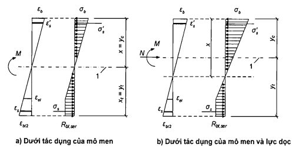

**CHÚ DẪN:**

1 - Mức trọng tâm tiết diện ngang quy đổi.

<strong>Hình 22 — Sơ đồ trạng thái ứng suất - biến dạng của tiết diện cấu kiện khi kiểm tra sự hình thành vết nứt</strong>

Trong công thức (158) lấy dấu “cộng” khi lực dọc là lực nén, lấy dấu “trừ" khi lực dọc là lực kéo.

Đối với tiết diện chữ nhật và chữ T (có cánh nằm trong vùng chịu nén) thì giá trị $W_{pl}$ khi có tác dụng của mô men uốn trong mặt phẳng trục đối xứng cho phép lấy bằng:

$$W_{pl} = \gammaW_{red} \tag{159}$$
<!-- formula_id: "F_TCVN_5574_2018_FORMULA_159" -->

trong đó:

&nbsp;&nbsp;&nbsp;&nbsp;\- $W_{red}$  là mô men kháng uốn đàn hồi của tiết diện quy đổi theo vùng chịu kéo của tiết diện, được xác định theo 8.2.2.2.5.

&nbsp;&nbsp;&nbsp;&nbsp;\- $\gamma$ là hệ số, lấy bằng 1,3.

Đối với tiết diện chữ I, chữ T (có cánh nằm trong vùng chịu kéo) thì giá trị $W_{pl}$ khi có tác dụng của mô men uốn trong mặt phẳng trục đối xứng cho phép lấy theo công thức (159) nhưng hệ số γ lấy theo Phụ lục L.

### 8.2.2.2.5  Mô men kháng uốn $W_{red}$ và khoảng cách $e_{x}$ được xác định theo các công thức:

$$\begin{aligned} W_{red} &= \frac{I_{red}}{y_t} \qquad (160) \\ e_x &= \frac{W_{red}}{A_{red}} \qquad (161) \end{aligned}$$
<!-- formula_id: "F_TCVN_5574_2018_FORMULA_160_161" -->

trong đó:

&nbsp;&nbsp;&nbsp;&nbsp;\- $I_{red}$ là mô men quán tính của tiết diện quy đổi của cấu kiện đối với trọng tâm của nó:

$$I_{red} = I + \alpha I_s + \alpha I'_s \tag{162}$$
<!-- formula_id: "F_TCVN_5574_2018_FORMULA_162" -->

I, $I_{s}$, $I'_s$ là mô men quán tính lần lượt của tiết diện bê tông, của tiết diện cốt thép chịu kéo và của cốt thép chịu nén;

$A_{red}$ là diện tích của tiết diện ngang quy đổi của cấu kiện, được xác định theo công thức:

$$A_{\text{red}} = A + \alpha A_s + \alpha A'_s \tag{163}$$
<!-- formula_id: "F_TCVN_5574_2018_FORMULA_163" -->

α  là hệ số quy đổi cốt thép về bê tông, α = $E_{s}$/$E_{b}$;

A, $A_{s}$, $A'_s$ là diện tích tiết diện ngang lần lượt của bê tông, của cốt thép chịu kéo và của cốt thép chịu nén;

$y_{t}$ là khoảng cách từ thớ bê tông chịu kéo nhiều nhất đến trọng tâm tiết diện quy đổi của cấu kiện:

$$y_t = \frac{S_{t,red}}{A_{red}} \tag{164}$$
<!-- formula_id: "F_TCVN_5574_2018_FORMULA_164" -->

trong đó: $S_{t,red}$ là mô men tĩnh của diện tích tiết diện quy đổi của cấu kiện đối với thớ bê tông chịu kéo nhiều hơn.

Cho phép xác định mô men kháng uốn $W_{red}$ mà không kể đến cốt thép.

### 8.2.2.2.6  Nội lực $N_{crc}$ khi hình thành vết nứt trong các cấu kiện chịu kéo đúng tâm được xác định theo công thức:

$$N_{crc} = A_{red}R_{bt,ser} \tag{165}$$
<!-- formula_id: "F_TCVN_5574_2018_FORMULA_165" -->

### 8.2.2.2.7  Xác định mô men hình thành vết nứt theo mô hình biến dạng phi tuyến được tiến hành dựa trên các yêu cầu chung nêu trong 6.1.4.6 và 8.1.2.7, nhưng có kể đến sự làm việc của bê tông trong vùng chịu kéo của tiết diện thẳng góc, mà sự làm việc này được xác định bằng biểu đồ biến dạng của bê tông chịu kéo theo 6.1.4.4. Các đặc trưng tính toán của vật liệu được lấy đối với các trạng thái giới hạn thứ hai.

Giá trị $M_{crc}$ được xác định từ việc giải hệ các phương trình nêu trong 8.1.2.7, trong đó lấy biến dạng tương đối của bê tông $\epsilon_{bt,max}$ ở biên chịu kéo của cấu kiện do tác dụng của ngoại lực bằng giá trị giới hạn của biến dạng tương đối của bê tông khi kéo $\epsilon_{bt,u}$. Giá trị $\epsilon_{bt,u}$ được xác định theo các chỉ dẫn trong 8.1.2.7.11.

### 8.2.2.3  Tính toán chiều rộng vết nứt thẳng góc với trục dọc cấu kiện

### 8.2.2.3.1  Chiều rộng vết nứt thẳng góc $a_{crc,i}$ (i = 1, 2, 3 - xem 8.2.2.1.4) được xác định theo công thức:

$$a_{crc,i} = \varphi_1 \varphi_2 \varphi_3 \psi_s \frac{\sigma_s}{E_s} L_s \tag{166}$$
<!-- formula_id: "F_TCVN_5574_2018_FORMULA_166" -->

trong đó:

&nbsp;&nbsp;&nbsp;&nbsp;\- $\sigma_{s}$  là ứng suất trong cốt thép dọc chịu kéo tại tiết diện thẳng góc có vết nứt do ngoại lực tương ứng, được xác định theo 8.2.2.3.2;

&nbsp;&nbsp;&nbsp;&nbsp;\- $L_{s}$  là khoảng cách cơ sở (không kể đến ảnh hưởng của loại bề mặt cốt thép) giữa các vết nứt thẳng góc kề nhau (Hình 23a), được xác định theo 8.2.2.3.3;

&nbsp;&nbsp;&nbsp;&nbsp;\- $\psi_{s}$ là hệ số, kể đến sự phân bố không đều biến dạng tương đối của cốt thép chịu kéo giữa các vết nứt; cho phép lấy $\psi_{s}$ = 1, nếu khi đó điều kiện (153) không thỏa mãn thì giá trị $\psi_{s}$ cần được xác định theo công thức (176);

&nbsp;&nbsp;&nbsp;&nbsp;\- $\varphi_{1}$  là hệ số, kể đến thời hạn tác dụng của tải trọng, lấy bằng:

&nbsp;&nbsp;&nbsp;&nbsp;\- 1,0 - khi có tác dụng ngắn hạn của tải trọng;

&nbsp;&nbsp;&nbsp;&nbsp;\- 1,4 - khi có tác dụng dài hạn của tải trọng;

&nbsp;&nbsp;&nbsp;&nbsp;\- $\varphi_{2}$  là hệ số, kể đến loại hình dạng bề mặt của cốt thép dọc, lấy bằng:

&nbsp;&nbsp;&nbsp;&nbsp;\- 0,5 - đối với cốt thép có gân và cáp;

&nbsp;&nbsp;&nbsp;&nbsp;\- 0,8 - đối với cốt thép trơn;

&nbsp;&nbsp;&nbsp;&nbsp;\- $\varphi_{3}$  là hệ số, kể đến đặc điểm chịu lực, lấy bằng:

&nbsp;&nbsp;&nbsp;&nbsp;\- 1,0 - đối với cấu kiện chịu uốn và chịu nén lệch tâm;

&nbsp;&nbsp;&nbsp;&nbsp;\- 1,2 - đối với cấu kiện chịu kéo.

### 8.2.2.3.2  Giá trị ứng suất $\sigma_{s}$ trong cốt thép chịu kéo của cấu kiện chịu uốn được xác định theo công thức:

$$\sigma_s = \frac{M(h_0 - y_c)}{I_{red}} \alpha_{s1} \tag{167}$$
<!-- formula_id: "F_TCVN_5574_2018_FORMULA_167" -->

trong đó:

&nbsp;&nbsp;&nbsp;&nbsp;\- $I_{red}$, $y_{c}$ lượt là mô men quán tính và chiều cao vùng chịu nén của tiết diện ngang quy đổi của cấu kiện, được xác định có kể đến diện tích tiết diện chỉ của vùng bê tông chịu nén, các diện tích tiết diện cốt thép chịu kéo và chịu nén theo 8.2.3.3.5, với giá trị hệ số quy đổi cốt thép về bê tông trong các công thức tương ứng $\alpha_{s2}$ = $\alpha_{s1}$.

Đối với cấu kiện chịu uốn thì $y_{c}$ = x (Hình 23a, b), trong đó x là chiều cao vùng chịu nén của bê tông, được xác định theo 8.2.3.3.6 với $\alpha_{s2}$ = $\alpha_{s1}$.

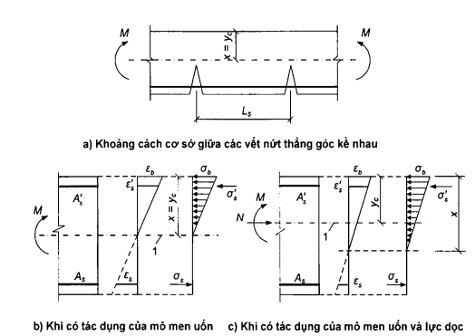

**CHÚ DẪN:**

1 - Mức trọng tâm tiết diện ngang quy đổi.

<strong>Hình 23 — Sơ đồ trạng thái ứng suất - biến dạng của cấu kiện có vết nứt</strong>

Giá trị hệ số quy đổi cốt thép về bê tông $\alpha_{s1}$, được xác định theo công thức:

$$\alpha_{s1} = \frac{E_s}{E_{b,red}} \tag{168}$$
<!-- formula_id: "F_TCVN_5574_2018_FORMULA_168" -->

trong đó:

&nbsp;&nbsp;&nbsp;&nbsp;\- $E_{b,red}$ là mô đun biến dạng quy đổi của bê tông chịu nén, kể đến biến dạng không đàn hồi của bê tông chịu nén và được xác định theo công thức:

$$E_{b,red} = \frac{R_{b,n}}{\varepsilon_{b1,red}} \tag{169}$$
<!-- formula_id: "F_TCVN_5574_2018_FORMULA_169" -->

Biến dạng tương đối của bê tông $\epsilon_{b1,red}$ lấy bằng 0,0015.

Cho phép xác định ứng suất $\sigma_{s}$ theo công thức:

$$\sigma_s = \frac{M}{z_s A_s} \tag{170}$$
<!-- formula_id: "F_TCVN_5574_2018_FORMULA_170" -->

trong đó:

&nbsp;&nbsp;&nbsp;&nbsp;\- $z_{s}$  là khoảng cách từ trong tâm cốt thép chịu kéo đến điểm đặt hợp lực của các nội lực trong vùng chịu nén của cấu kiện.

Đối với cấu kiện tiết diện ngang chữ nhật khi không có (hoặc không kể đến) cốt thép chịu nén thì giá trị $z_{s}$ được xác định theo công thức:

$$z_s = h_0 - \frac{x}{3} \tag{171}$$
<!-- formula_id: "F_TCVN_5574_2018_FORMULA_171" -->

Đối với cấu kiện tiết diện ngang chữ nhật, chữ T (có cánh nằm trong vùng chịu nén) và chữ I thì cho phép lấy giá trị $z_{s}$ bằng 0,8$h_{0}$.

Khi có tác dụng của mô men uốn M và lực dọc N thì ứng suất trong cốt thép chịu kéo $\sigma_{s}$ được xác định theo công thức:

$$\sigma_s = \left[ \frac{M(h_0 - y_c)}{I_{red}} \pm \frac{N}{A_{red}} \right] \alpha_{s1} \tag{172}$$
<!-- formula_id: "F_TCVN_5574_2018_FORMULA_172" -->

trong đó: $A_{red}$, $y_{c}$ lần lượt là diện tích tiết diện ngang quy đổi của cấu kiện và khoảng cách từ thớ bê tông chịu nén nhiều hơn đến trọng tâm tiết diện quy đổi, được xác định theo các nguyên tắc chung về tính toán các đặc trưng hình học của các tiết diện cấu kiện đàn hồi có kể đến diện tích chỉ của tiết diện vùng chịu nén của bê tông và các diện tích tiết diện cốt thép chịu kéo và chịu nén theo 8 2.3.3.6, với hệ số quy đổi cốt thép về bê tông $\alpha_{s1}$.

Cho phép xác định ứng suất $\sigma_{s}$ theo công thức:

$$\sigma_s = \frac{N(e_s \pm z_s)}{A_s z_s} \tag{173}$$
<!-- formula_id: "F_TCVN_5574_2018_FORMULA_173" -->

trong đó:

&nbsp;&nbsp;&nbsp;&nbsp;\- $e_{s}$ là khoảng cách từ trọng tâm cốt thép chịu kéo đến điểm đặt lực dọc N có kể đến độ lệch tâm bằng M/N.

Đối với cấu kiện tiết diện ngang chữ nhật khi không có (hoặc không kể đến) cốt thép chịu nén thì cho phép xác định giá trị $z_{s}$ theo công thức (171), trong đó thay x bằng $x_{m}$ là chiều cao vùng chịu nén của bê tông có kể đến ảnh hưởng của lực dọc, được xác định theo 8.2.3.3.6, với hệ số quy đổi cốt thép về bê tông $\alpha_{s2}$ = $\alpha_{s1}$.

Đối với cấu kiện tiết diện ngang chữ nhật, chữ T (có cánh nằm trong vùng chịu nén) và chữ I thì cho phép lấy giá trị $z_{s}$ bằng 0,7$h_{0}$.

Trong các công thức (172) và (173) lấy dấu “cộng” đối với lực kéo dọc và dấu “trừ” đối với lực nén dọc.

Ứng suất $\sigma_{s}$ lấy không lớn hơn $R_{s,ser}$.

### 8.2.2.3.3  Khoảng cách cơ sở giữa các vết nứt thẳng góc kề nhau $L_{s}$ được xác định theo công thức:

$$L_s = 0,5 \frac{A_{bf}}{A_s} d_s \tag{174}$$
<!-- formula_id: "F_TCVN_5574_2018_FORMULA_174" -->

nhưng lấy không nhỏ hơn 10$d_{s}$ và 100 mm và không lớn hơn 40$d_{s}$ và 400 mm,

trong đó:

&nbsp;&nbsp;&nbsp;&nbsp;\- $A_{bt}$  là diện tích tiết diện bê tông chịu kéo;

&nbsp;&nbsp;&nbsp;&nbsp;\- $A_{s}$  là diện tích tiết diện cốt thép chịu kéo;

&nbsp;&nbsp;&nbsp;&nbsp;\- $d_{s}$  là đường kính danh nghĩa của cốt thép.

Giá trị $A_{bt}$ được xác định theo chiều cao vùng chịu kéo của bê tông $x_{t}$, dựa trên nguyên tắc tính toán mô men hình thành vết nứt theo các chỉ dẫn trong 8.2.2.2.

Trong mọi trường hợp lấy $A_{bt}$ bằng diện tích tiết diện với chiều cao của diện tích này trong khoảng không nhỏ hơn 2a và không lớn hơn 0,5h.

### 8.2.2.3.4  Giá trị hệ số $\psi_{s}$ được xác định theo công thức:

$$M_{crc} = R_{bt,ser} W_{pl} \pm N e_x$$
<!-- formula_id: "F_TCVN_5574_2018_FORMULA_157" -->

trong đó:

&nbsp;&nbsp;&nbsp;&nbsp;\- $\sigma_{s,crc}$  là ứng suất trong cốt thép dọc chịu kéo trong tiết diện có vết nứt ngay sau khi hình thành các vết nứt thẳng góc, được xác định theo các chỉ dẫn trong 8.2.2.3.2, trong đó lấy M = $M_{crc}$ trong các công thức tương ứng;

&nbsp;&nbsp;&nbsp;&nbsp;\- $\sigma_{s}$  là ứng suất trong cốt thép dọc chịu kéo trong tiết diện dưới tác dụng của tải trọng đang xét.

Đối với cấu kiện chịu uốn thì cho phép xác định giá trị hệ số $\psi_{s}$ theo công thức:

$$\psi_s = 1 - 0,8 \frac{M_{crc}}{M}$$
<!-- formula_id: "F_TCVN_5574_2018_FORMULA_158" -->

trong đó: $M_{crc}$ được xác định theo công thức (158).

### 8.2.3  Tính toán cấu kiện bê tông cốt thép theo biến dạng

### 8.2.3.1  Yêu cầu chung

### 8.2.3.1.1  Tính toán cấu kiện bê tông cốt thép theo biến dạng được tiến hành có kể đến các yêu cầu sử dụng đối với kết cấu.

Cần tính toán theo biến dạng dưới tác dụng của:

&nbsp;&nbsp;\- Tải trọng thường xuyên, tạm thời dài hạn và tạm thời ngắn hạn (xem 4.6) khi biến dạng cần được hạn chế do các yêu cầu công nghệ hoặc cấu tạo;

&nbsp;&nbsp;\- Tải trọng thường xuyên và tạm thời dài hạn khi biến dạng cần được hạn chế do các yêu cầu thẩm mỹ.

### 8.2.3.1.2  Giá trị biến dạng giới hạn cho phép của cấu kiện lấy theo Phụ lục M và các tiêu chuẩn áp dụng cho từng loại kết cấu.

### 8.2.3.2  Tính toán độ võng cấu kiện bê tông cốt thép

### 8.2.3.2.1  Tính toán độ võng của cấu kiện bê tông cốt thép được tiến hành theo điều kiện:

$$f \le f_{u} \tag{177}$$
<!-- formula_id: "F_TCVN_5574_2018_FORMULA_177" -->

trong đó:

&nbsp;&nbsp;&nbsp;&nbsp;\- f  là độ võng của cấu kiện bê tông cốt thép dưới tác dụng của ngoại lực;

&nbsp;&nbsp;&nbsp;&nbsp;\- $f_{u}$  là giá trị độ võng giới hạn cho phép của cấu kiện bê tông cốt thép.

&nbsp;&nbsp;&nbsp;&nbsp;\- Độ võng của các kết cấu bê tông cốt thép được xác định theo các nguyên tắc chung của cơ học kết cấu phụ thuộc vào các đặc trưng biến dạng uốn, biến dạng trượt và biến dạng dọc trục của cấu kiện bê tông cốt thép tại các tiết diện dọc theo chiều dài của nó (độ cong, góc trượt, biến dạng dọc trục, v.v...).

Trong các trường hợp, khi mà độ võng của các cấu kiện bê tông cốt thép chủ yếu phụ thuộc vào biến dạng uốn, thì giá trị độ võng được xác định dựa trên độ cong theo 8.2.3.3 và 8.2.3.4 hoặc dựa trên các đặc trưng độ cứng theo 8.2.3.2.3 và 8.2.3.3.9.

### 8.2.3.2.2  Độ võng do biến dạng uốn gây ra được xác định theo công thức:

$$f_m = \int_0^L \overline{M}_x \left( \frac{1}{r} \right)_x dx \tag{178}$$
<!-- formula_id: "F_TCVN_5574_2018_FORMULA_178" -->

trong đó:

&nbsp;&nbsp;&nbsp;&nbsp;\- $\bar{M}_x$  là mô men uốn trong tiết diện x do tác dụng của lực đơn vị đặt theo hướng chuyển vị cần tìm của cấu kiện trong tiết diện trên chiều dài nhịp L cần xác định độ võng;

&nbsp;&nbsp;&nbsp;&nbsp;\- (1/r)$_{x}$  là độ cong toàn phần tại tiết diện x do ngoại lực gây nên độ võng cần xác định.

&nbsp;&nbsp;&nbsp;&nbsp;\- Trong trường hợp tổng quát, đối với cấu kiện bê tông cốt thép chịu uốn thì việc tính toán độ võng được tiến hành bằng cách chia cấu kiện ra thành nhiều đoạn rồi xác định độ cong ở biên các đoạn này (có kể đến sự có hoặc không có vết nứt và dấu của độ cong) và nhân biểu đồ mô men uốn $\bar{M}_x$ với biểu đồ độ cong (1/r)$_{x}$ theo chiều dài cấu kiện khi độ cong phân bố tuyến tính trong phạm vi từng đoạn cấu kiện. Trong trường hợp này độ võng tại giữa nhịp cấu kiện được xác định theo công thức:

$$f_m = \frac{L^2}{12n^2} \left\{ \left( \frac{1}{r} \right)_{\text{sup},L} + \left( \frac{1}{r} \right)_{\text{sup},r} + 6 \sum_{i=1}^{\frac{n}{2}-1} i \left[ \left( \frac{1}{r} \right)_{iL} + \left( \frac{1}{r} \right)_{ir} \right] + (3n-2) \left( \frac{1}{r} \right)_c \right\} \tag{179}$$
<!-- formula_id: "F_TCVN_5574_2018_FORMULA_179" -->

trong đó:

&nbsp;&nbsp;&nbsp;&nbsp;\- (1/r)$_{sup,L}$ và (1/r)$_{sup,r}$  là độ cong của cấu kiện lần lượt ở gối trái và gối phải;

&nbsp;&nbsp;&nbsp;&nbsp;\- (1/r)$_{iL}$ và (1/r)$_{ir}$  là các độ cong của cấu kiện tại các tiết diện đối xứng nhau i và i’ (i = i’) ở phía trái và phía phải của trục đối xứng (giữa nhịp);

&nbsp;&nbsp;&nbsp;&nbsp;\- (1/r)$_{c}$  là độ cong của cấu kiện tại giữa nhịp;

&nbsp;&nbsp;&nbsp;&nbsp;\- n  là số chẵn các đoạn bằng nhau được chia từ nhịp, lấy không nhỏ hơn 6;

&nbsp;&nbsp;&nbsp;&nbsp;\- L  là nhịp cấu kiện.

Trong các công thức (178) và (179) giá trị các độ cong (1/r) được xác định theo 8 2.3.3 tương ứng với các đoạn không có và có vết nứt; dấu của (1/r) được lấy phù hợp với biểu đồ độ cong.

### 8.2.3.2.3  Đối với các cấu kiện chịu uốn tiết diện không đổi dọc theo chiều dài cấu kiện không có vết nứt thì độ võng được xác định theo các nguyên tắc chung của cơ học kết cấu với việc sử dụng độ cứng tiết diện ngang được xác định theo công thức (188).

### 8.2.3.2.4  Đối với các cấu kiện chịu uốn tiết diện không đổi dọc theo chiều dài cấu kiện có vết nứt thì độ cong trên từng đoạn có mô men uốn không đổi dấu cho phép được xác định đối với tiết diện chịu lực lớn hơn cả và độ cong của các tiết diện còn lại trên từng đoạn đó được lấy tỷ lệ với các giá trị mô men uốn.

Đối với cấu kiện tựa tự do hoặc cấu kiện công xôn thì độ võng lớn nhất được xác định theo công thức:

$$f_m = sL^2 \left( \frac{1}{r} \right)_{\text{max}} \tag{180}$$
<!-- formula_id: "F_TCVN_5574_2018_FORMULA_180" -->

trong đó:

&nbsp;&nbsp;&nbsp;&nbsp;\- s  là hệ số phụ thuộc vào sơ đồ tính toán cấu kiện và loại tải trọng, hệ số này được xác định theo các nguyên tắc cơ học kết cấu; khi có tác dụng của tải trọng phân bố đều thì giá trị s lấy bằng:

&nbsp;&nbsp;&nbsp;&nbsp;\- $\frac{5}{-8}$ - đối với dầm tựa tự do;

&nbsp;&nbsp;&nbsp;&nbsp;\- $\frac{1}{i}$ - đối với dầm công xôn;

&nbsp;&nbsp;&nbsp;&nbsp;\- (1/r)$_{max}$ là độ cong toàn phần tại tiết diện có mô men uốn lớn nhất do tải trọng dùng để tính độ võng; độ võng toàn phần được xác định theo 8.2.3.3 đến 8.2.3.4.

### 8.2.3.2.5  Đối với cấu kiện chịu uốn khi L/h < 10 thì cần kể đến ảnh hưởng của lực cắt đến độ võng. Trong trường hợp này, độ võng toàn phần f bằng tổng độ võng do biến dạng uốn $f_{m}$ (xem 8.2.3.2.3 và 8.2.3.2.4) và độ võng do biến dạng trượt $f_{q}$.

Độ võng do biến dạng trượt $f_{q}$ được xác định theo công thức:

$$f_q = \int_0^L \overline{Q}_x \gamma_x \, dx \tag{181}$$
<!-- formula_id: "F_TCVN_5574_2018_FORMULA_181" -->

trong đó:

&nbsp;&nbsp;&nbsp;&nbsp;\- $\overline{Q}_x$  là lực cắt trong tiết diện x do lực đơn vị, đặt tại tiết diện cần xác định độ võng, tác dụng theo phương độ võng này;

&nbsp;&nbsp;&nbsp;&nbsp;\- $\gamma_{x}$  là biến dạng trượt (góc trượt) của cấu kiện tại tiết diện x do tác dụng của ngoại lực dùng để xác định độ võng, được xác định theo công thức:

$$\gamma_x = \frac{1,2 Q_x \varphi_b}{G b h_0} \varphi_{crc} \tag{182}$$
<!-- formula_id: "F_TCVN_5574_2018_FORMULA_182" -->

trong đó:

&nbsp;&nbsp;&nbsp;&nbsp;\- $Q_{x}$  là lực cắt trong tiết diện x do tác dụng của ngoại lực;

&nbsp;&nbsp;&nbsp;&nbsp;\- G  là mô đun trượt của bê tông;

&nbsp;&nbsp;&nbsp;&nbsp;\- $\varphi_{b}$  là hệ số, kể đến ảnh hưởng từ biến của bê tông, lấy như sau:

Khi có tác dụng ngắn hạn của tải trọng: $\varphi_{b}$ = 1,0;

Khi có tác dụng dài hạn của tải trọng: $\varphi_{b}$ = 1 + $\varphi_{b,cr}$ trong đó $\varphi_{b,cr}$ lấy theo Bảng 11;

$\varphi_{crc}$  là hệ số, kể đến ảnh hưởng của vết nứt đến biến dạng trượt, lấy như sau:

Trên các đoạn dọc theo chiều dài cấu kiện không có vết nứt thẳng góc và vết nứt xiên với trục dọc cấu kiện: $\varphi_{crc}$ = 1,0;

Trên các đoạn chỉ có vết nứt xiên với trục dọc cấu kiện: $\varphi_{crc}$ = 4,0;

Trên đoạn chỉ có vết nứt thẳng góc hoặc có đồng thời vết nứt thẳng góc và vết nứt xiên với trục dọc cấu kiện: tính theo công thức

$$\varphi_{crc} = \frac{3 E_b I_{red}}{M_x} \left( \frac{1}{r} \right)_x \tag{183}$$
<!-- formula_id: "F_TCVN_5574_2018_FORMULA_183" -->

trong đó:

&nbsp;&nbsp;&nbsp;&nbsp;\- $M_{x}$, (1/r)$_{x}$  lần lượt là mô men uốn và độ cong do ngoại lực tác dụng ngắn hạn;

&nbsp;&nbsp;&nbsp;&nbsp;\- $I_{red}$  là mô men quán tính của toàn bộ tiết diện quy đổi với hệ số quy đổi cốt thép về bê tông α = $E_{s}$/$E_{b}$.

&nbsp;&nbsp;&nbsp;&nbsp;\- Vết nứt xiên hình thành khi thỏa mãn điều kiện:

$$Q > 0,5 R_{bt,ser}bh_{0} \tag{184}$$
<!-- formula_id: "F_TCVN_5574_2018_FORMULA_184" -->

### 8.2.3.3  Xác định độ cong cấu kiện bê tông cốt thép

### 8.2.3.3.1  Để làm cơ sở tính độ võng của các cấu kiện chịu uốn, chịu nén lệch tâm và chịu kéo lệch tâm thì cần xác định độ cong của chúng như sau:

a) \- Đối với cấu kiện hoặc đoạn cấu kiện, nơi mà trong vùng chịu kéo không hình thành vết nứt thẳng góc với trục dọc cấu kiện: theo 8.2.3.3.2, 8.2.3.3.4;

b) \- Đối với cấu kiện hoặc đoạn cấu kiện, nơi mà trong vùng chịu kéo có vết nứt: theo 8.2.3.3.2, 8.2.3.3.3 và 8.2.3.3.5.

Các cấu kiện hoặc đoạn cấu kiện được xem là không nứt nếu các vết nứt không hình thành (nghĩa là điều kiện (153) không được thỏa mãn) khi có tác dụng của toàn bộ tải trọng, bao gồm tải trọng thường xuyên, tạm thời dài hạn và tạm thời ngắn hạn.

Độ cong của cấu kiện bê tông cốt thép có hoặc không có vết nứt cũng có thể được xác định dựa trên mô hình biến dạng phi tuyến theo 8.2.3.4

### 8.2.3.3.2  Độ cong toàn phần của cấu kiện chịu uốn, chịu nén lệch tâm và chịu kéo lệch tâm được xác định theo các công thức:

&nbsp;&nbsp;\- Đối với các đoạn cấu kiện không có vết nứt trong vùng chịu kéo:

$$\left(\frac{1}{r}\right) = \left(\frac{1}{r}\right)_1 + \left(\frac{1}{r}\right)_2 \tag{185}$$
<!-- formula_id: "F_TCVN_5574_2018_FORMULA_185" -->

&nbsp;&nbsp;\- Đối với các đoạn cấu kiện có vết nứt trong vùng chịu kéo:

$$\left(\frac{1}{r}\right) = \left(\frac{1}{r}\right)_1 - \left(\frac{1}{r}\right)_2 + \left(\frac{1}{r}\right)_3$$
<!-- formula_id: "F_TCVN_5574_2018_FORMULA_185" -->

Trong công thức (185):

(1/r)$_{1}$  là độ cong do tác dụng ngắn hạn của tải trọng tạm thời ngắn hạn;

(1/r)$_{2}$  là độ cong do tác dụng dài hạn của tải trọng thường xuyên và tạm thời dài hạn.

Trong công thức (186):

(1/r)$_{1}$  là độ cong do tác dụng ngắn hạn của toàn bộ tải trọng mà dùng để tính toán biến dạng;

(1/r)$_{2}$  là độ cong do tác dụng ngắn hạn của tải trọng thường xuyên và tạm thời dài hạn;

(1/r)$_{3}$  là độ cong của tác dụng dài hạn của tải trọng thường xuyên và tạm thời dài hạn.

Các độ cong (1/r)$_{1}$, (1/r)$_{2}$ và (1/r)$_{2}$ được xác định theo các chỉ dẫn trong 8.2.3.3.3.

### 8.2.3.3.3  Độ cong của cấu kiện bê tông cốt thép (1/r) do tác dụng của các tải trọng tương ứng (xem 8.2.3.3.2) được xác định theo công thức:

$$\left(\frac{1}{r}\right) = \frac{M}{D} \tag{187}$$
<!-- formula_id: "F_TCVN_5574_2018_FORMULA_187" -->

trong đó:

&nbsp;&nbsp;&nbsp;&nbsp;\- M  là mô men uốn do ngoại lực (có kể đến mô men do lực dọc N) đối với trục vuông góc với phẳng tác dụng của mô men uốn và đi qua trọng tâm tiết diện ngang quy đổi của cấu kiện;

&nbsp;&nbsp;&nbsp;&nbsp;\- D  là độ cứng chống uốn của tiết diện ngang quy đổi của cấu kiện, được xác định theo công thức:

$$D = E_{b1}I_{red} \tag{188}$$
<!-- formula_id: "F_TCVN_5574_2018_FORMULA_188" -->

trong đó:

&nbsp;&nbsp;&nbsp;&nbsp;\- $E_{b1}$  là mô đun biến dạng của bê tông chịu nén, được xác định phụ thuộc vào thời hạn (ngắn hạn hoặc dài hạn) tác dụng của tải trọng và có kể đến sự có hay không có các vết nứt;

&nbsp;&nbsp;&nbsp;&nbsp;\- $I_{red}$  là mô men quán tính của tiết diện ngang quy đổi đối với trọng tâm của nó, được xác định có kể đến sự có hay không có các vết nứt.

Giá trị mô đun biến dạng của bê tông $E_{b1}$ và mô men quán tính của tiết diện ngang quy đổi $I_{red}$ đối với các cấu kiện không có hoặc có vết nứt trong vùng chịu kéo được xác định theo các chỉ dẫn tương ứng trong 8.2.3.3.4 và 8.2.3.3.5.

### 8.2.3.3.4  Độ cứng của các cấu kiện bê tông cốt thép trên các đoạn không có vết nứt trong vùng chịu kéo

Độ cứng của cấu kiện bê tông cốt thép D trên các đoạn không có vết nứt trong vùng chịu kéo được xác định theo công thức (188).

Mô men quán tính $I_{red}$ của tiết diện ngang quy đổi của cấu kiện đối với trọng tâm của nó được xác định như đối với vật thể đặc theo các nguyên tắc chung về sức bền của các cấu kiện đàn hồi có kể đến toàn bộ diện tích tiết diện bê tông và diện tích tiết diện cốt thép với hệ số quy đổi cốt thép về bê tông α:

$$I_{red} = I + I_s \alpha + I'_s \alpha \tag{189}$$
<!-- formula_id: "F_TCVN_5574_2018_FORMULA_189" -->

trong đó:

&nbsp;&nbsp;&nbsp;&nbsp;\- I  là mô men quán tính của tiết diện bê tông đối với trọng tâm tiết diện ngang quy đổi của cấu kiện;

&nbsp;&nbsp;&nbsp;&nbsp;\- $I_{s}$, $i_s$  là mô men quán tính của tiết diện cốt thép lần lượt chịu kéo và chịu nén đối với trọng tâm tiết diện ngang quy đổi của cấu kiện;

&nbsp;&nbsp;&nbsp;&nbsp;\- $\alpha$ là hệ số quy đổi cốt thép về bê tông:

$$\alpha = \frac{E_s}{E_{b1}} \tag{190}$$
<!-- formula_id: "F_TCVN_5574_2018_FORMULA_190" -->

Giá trị I được xác định theo các nguyên tắc chung về tính toán các đặc trưng hình học của tiết diện cấu kiện đàn hồi.

Cho phép xác định mô men quán tính $I_{red}$ mà không kể đến cốt thép.

Giá trị mô đun biến dạng của bê tông $E_{b1}$ trong các công thức (188) và (190) lấy bằng:

&nbsp;&nbsp;\- Khi có tác dụng ngắn hạn của tải trọng:

$$E_{b1} = 0,85 E_{b} \tag{191}$$
<!-- formula_id: "F_TCVN_5574_2018_FORMULA_191" -->

&nbsp;&nbsp;\- Khi có tác dụng dài hạn của tải trọng:

$$E_{b1} = E_{b,r} = \frac{E_b}{1 + \varphi_{b,cr}} \tag{192}$$
<!-- formula_id: "F_TCVN_5574_2018_FORMULA_192" -->

trong đó: $\varphi_{b,cr}$ là hệ số từ biến của bê tông, lấy theo Bảng 11.

### 8.2.3.3.5  Độ cứng của cấu kiện bê tông cốt thép trên các đoạn có vết nứt trong vùng chịu kéo

Độ cứng của cấu kiện bê tông cốt thép trên các đoạn có vết nứt trong vùng chịu kéo được xác định dựa trên các giả thiết sau:

&nbsp;&nbsp;\- Tiết diện sau khi biến dạng vẫn phẳng;

&nbsp;&nbsp;\- Ứng suất trong bê tông vùng chịu nén được xác định như đối với vật thể đàn hồi;

&nbsp;&nbsp;\- Sự làm việc của bê tông chịu kéo trong tiết diện có các vết nứt thẳng góc không cần kể đến;

&nbsp;&nbsp;\- Sự làm việc của bê tông chịu kéo trên đoạn giữa các vết nứt thẳng góc kề nhau được kể đến trực tiếp bằng hệ số $\psi_{s}$.

Độ cứng của cấu kiện bê tông cốt thép D trên các đoạn có vết nứt được xác định theo công thức (188) và lấy không lớn hơn độ cứng khi không có vết nứt.

Giá trị mô đun biến dạng của bê tông chịu nén $E_{b1}$ lấy bằng giá trị mô đun biến dạng quy đổi $E_{b,red}$ được xác định theo công thức (13) với giá trị cường độ chịu nén tính toán $R_{b,ser}$ đối với các tải trọng tương ứng (ngắn hạn và dài hạn).

Mô men quán tính $I_{red}$ của tiết diện ngang quy đổi của cấu kiện đối với trọng tâm của nó được xác định theo các nguyên tắc chung về sức bền của các cấu kiện đàn hồi có kể đến diện tích của bê tông chỉ ở vùng chịu nén, diện tích tiết diện cốt thép chịu nén với hệ số quy đổi cốt thép về bê tông $\alpha_{s1}$ và diện tích tiết diện cốt thép chịu kéo với hệ số quy đổi cốt thép về bê tông $\alpha_{s2}$:

$$I_{r e d}=I_{b}+I_{s} \alpha_{s 2}+I_{s}^{\prime} \alpha_{s 1} \tag{193}$$
<!-- formula_id: "F_TCVN_5574_2018_FORMULA_193" -->

trong đó:

&nbsp;&nbsp;&nbsp;&nbsp;\- $I_{b}$, $I_{s}$, $i_s$ là mô men quán tính của diện tích tiết diện lần lượt của vùng bê tông chịu nén, của cốt thép chịu kéo và của cốt thép chịu nén đối với trọng tâm tiết diện ngang quy đổi không kể đến bê tông vùng chịu kéo.

&nbsp;&nbsp;&nbsp;&nbsp;\- Các giá trị $I_{s}$ và $i_s$ được xác định theo nguyên tắc chung của sức bền vật liệu với khoảng cách $y_{cm}$ từ thớ bê tông chịu nén nhiều nhất đến trọng tâm tiết diện ngang quy đổi (có kể đến các hệ số quy đổi $\alpha_{s1}$ và $\alpha_{s2}$) mà không kể đến bê tông vùng chịu kéo (Hình 24); đối với cấu kiện chịu uốn thì

&nbsp;&nbsp;&nbsp;&nbsp;\- $y_{cm}$ = $x_{m}$

&nbsp;&nbsp;&nbsp;&nbsp;\- trong đó: $x_{m}$ là chiều cao trung bình của vùng chịu nén của bê tông, kể đến ảnh hưởng của sự làm việc của bê tông chịu kéo giữa các vết nứt và được xác định theo 8.2.3.3.6 (Hình 24).

&nbsp;&nbsp;&nbsp;&nbsp;\- Các giá trị $I_{b}$ và $y_{cm}$ được xác định theo các nguyên tắc chung về tính toán các đặc trưng hình học của tiết diện các cấu kiện đàn hồi.

Giá trị các hệ số quy đổi cốt thép về bê tông $\alpha_{s1}$ và $\alpha_{s2}$ được xác định theo 8.2.3.3.8.

**CHÚ DẪN:**

1 - Mức trọng tâm tiết diện ngang quy đổi (không kể đến vùng bê tông chịu kéo) của tiết diện ngang.

<strong>Hình 24 — Tiết diện ngang quy đổi và sơ đồ trạng thái ứng suất - biến dạng của cấu kiện có vết nứt khi tính toán biến dạng cấu kiện dưới tác dụng của mô men uốn</strong>

### 8.2.3.3.6  Đối với cấu kiện chịu uốn thì vị trí trục trung hòa (chiều cao trung bình của vùng bê tông chịu nén) được xác định từ phương trình:

$$S_{b0} = \alpha_{s2} S_{s0} - \alpha_{s1} S'_{s0} \tag{194}$$
<!-- formula_id: "F_TCVN_5574_2018_FORMULA_194" -->

trong đó: $S_{b0}$, $S_{s0}$ và $s'_{s0}$ là mô men tĩnh lần lượt của vùng bê tông chịu nén, của cốt thép chịu kéo và của cốt thép chịu nén đối với trục trung hòa.

Đối với tiết diện chữ nhật chỉ có cốt thép chịu kéo thì chiều cao vùng chịu nén của bê tông được xác định theo công thức:

$$\mu_s = \frac{A_s}{b h_0} \tag{193}$$
<!-- formula_id: "F_TCVN_5574_2018_FORMULA_193" -->

$$\text{trong đó: } \mu_s = \frac{A_s}{bh_0}.$$
<!-- formula_id: "F_TCVN_5574_2018_RID221" -->

Đối với tiết diện chữ nhật có cả cốt thép chịu kéo và chịu nén thì chiều cao vùng chịu nén của bê tông được xác định theo công thức:

$$x_m = h_0 \left(\sqrt{\left(\mu_s \alpha_{s2}+\mu'_s \alpha_{s1}\right)^2+2 \left(\mu_s \alpha_{s2}+\mu'_s \alpha_{s1}\frac{a'}{h_0}\right)}-\left(\mu_s \alpha_{s2}+\mu'_s \alpha_{s1}\right)\right) \tag{196}
\text{trong đó: } \mu'_s = \frac{A'_s}{bh_0}.$$
<!-- formula_id: "F_TCVN_5574_2018_FORMULA_196" -->

Đối với tiết diện chữ T (có cánh nằm trong vùng chịu nén) và tiết diện chữ I thì chiều cao vùng chịu nén của bê tông được xác định theo công thức:

$$x_m = h_0 \left( \sqrt{(\mu_s \alpha_{s2} + \mu'_s \alpha_{s1} + \mu'_f)^2 + 2 \left( \mu_s \alpha_{s2} + \mu'_s \alpha_{s1} \frac{a'}{h_0} + \mu'_f \frac{h'_f}{2h_0} \right)} - (\mu_s \alpha_{s2} + \mu'_s \alpha_{s1} + \mu'_f) \right) \tag{197}$$
<!-- formula_id: "F_TCVN_5574_2018_FORMULA_197" -->

trong đó:

&nbsp;&nbsp;&nbsp;&nbsp;\- $\mu'_f = \frac{A'_f}{bh_0}$ với $A_i$ là diện tích tiết diện phần vươn của cánh chịu nén.

Đối với cấu kiện chịu nén lệch tâm và chịu kéo lệch tâm thì vị trí trục trung hòa (chiều cao vùng chịu nén) được xác định từ phương trình:

$$y_N = \frac{I_{b0} + \alpha_{s2}I_{s0} + \alpha_{s1}I'_{s0}}{S_{b0} + \alpha_{s2}S_{s0} - \alpha_{s1}S'_{s0}} \qquad (198)$$
<!-- formula_id: "F_TCVN_5574_2018_FORMULA_198" -->

trong đó:

&nbsp;&nbsp;&nbsp;&nbsp;\- $y_{N}$  là khoảng cách từ trục trung hòa đến điểm đặt lực dọc N, cách trọng tâm toàn bộ tiết diện (không kể đến vết nứt) một khoảng bằng $e_{0}$ = M/N;

&nbsp;&nbsp;&nbsp;&nbsp;\- $I_{b0}$, $I_{s0}$, $I'_{s0}$  là mô men quán tính lần lượt của vùng bê tông chịu nén, của cốt thép chịu kéo và của cốt thép chịu nén đối với trục trung hòa.

&nbsp;&nbsp;&nbsp;&nbsp;\- $S_{b0}$, $S_{s0}$, $s'_{s0}$ là mô men tĩnh lần lượt của vùng bê tông chịu nén, của cốt thép chịu kéo và của cốt thép chịu nén đối với trục trung hòa.

Cho phép xác định chiều cao vùng chịu nén $x_{m}$ của cấu ki

ện tiết diện ngang chữ nhật dưới tác dụng của mô men uốn M và lực dọc N theo công thức:

$$x_m = x_M \pm \frac{I_{red}N}{A_{red}M} \tag{199}$$
<!-- formula_id: "F_TCVN_5574_2018_FORMULA_199" -->

trong đó:

&nbsp;&nbsp;&nbsp;&nbsp;\- $x_{M}$ là chiều cao vùng chịu nén của cấu kiện chịu uốn, được xác định theo các công thức từ (194) đến (197);

&nbsp;&nbsp;&nbsp;&nbsp;\- $I_{red}$, $A_{red}$ lần lượt là mô men quán tính và diện tích của tiết diện ngang quy đổi, được xác định đối với toàn bộ tiết diện (không kể đến vết nứt).

Giá trị các đặc trưng hình học của tiết diện cấu kiện được xác định theo các nguyên tắc chung về tính toán tiết diện các cấu kiện đàn hồi.

Trong công thức (199) lấy dấu “cộng” đối với lực nén dọc và dấu “trừ” đối với lực kéo dọc.

### 8.2.3.3.7  Cho phép xác định độ cứng của cấu kiện bê tông cốt thép chịu uốn theo công thức:

$$D = E_{s,red}A_{s} z( h_{0} - x_{m} ) \tag{200}$$
<!-- formula_id: "F_TCVN_5574_2018_FORMULA_200" -->

trong đó: z là khoảng cách từ trọng tâm cốt thép chịu kéo đến điểm đặt hợp lực của các nội lực trong vùng chịu nén.

Đối với cấu kiện tiết diện ngang chữ nhật không có (hoặc không kể đến) cốt thép chịu nén thì giá trị z được xác định theo công thức:

$$z = h_0 - \frac{x_m}{3} \tag{201}$$
<!-- formula_id: "F_TCVN_5574_2018_FORMULA_201" -->

Đối với cấu kiện tiết diện ngang chữ nhật, chữ T (có cánh nằm trong vùng chịu nén) và chữ I thì giá trị z cho phép lấy bằng 0,8$h_{0}$.

### 8.2.3.3.8  Giá trị các hệ số quy đổi cốt thép về bê tông được lấy bằng:

&nbsp;&nbsp;\- Đối với cốt thép chịu nén:

$$\alpha_{s1} = \frac{E_s}{E_{b,red}} \tag{202}$$
<!-- formula_id: "F_TCVN_5574_2018_FORMULA_202" -->

&nbsp;&nbsp;\- Đối với cốt thép chịu kéo:

$$\alpha_{s2} = \frac{E_{s,red}}{E_{b,red}} \tag{203}$$
<!-- formula_id: "F_TCVN_5574_2018_FORMULA_203" -->

trong đó:

&nbsp;&nbsp;&nbsp;&nbsp;\- $E_{b,red}$  là mô đun biến dạng quy đổi của bê tông chịu nén, được xác định theo công thức (13) khi có tác dụng ngắn hạn và dài hạn của tải trọng, nhưng trong đó thay $R_{b}$ bằng $R_{b,ser}$;

&nbsp;&nbsp;&nbsp;&nbsp;\- $E_{s,red}$  là mô đun biến dạng quy đổi của cốt thép chịu kéo, được xác định có kể đến ảnh hưởng của sự làm việc của bê tông chịu kéo giữa các vết nứt theo công thức:

$$E_{s,red} = \frac{E_s}{\psi_s}$$
<!-- formula_id: "F_TCVN_5574_2018_FORMULA_176" -->

Giá trị hệ số $\psi_{s}$ được xác định theo công thức (176).

Cho phép lấy $\psi_{s}$ = 1 và dẫn đến $\alpha_{s2}$ = $\alpha_{s1}$. Khi đó, nếu điều kiện (177) không thỏa mãn thì tiến hành tính toán với hệ số đã được xác định theo công thức (176).

### 8.2.3.3.9  Độ võng của cấu kiện bê tông cốt thép có thể được xác định theo các nguyên tắc chung của cơ học kết cấu với việc sử dụng trực tiếp các đặc trưng độ cứng chống uốn D thay cho độ cong 1/r bằng cách thay các đặc trưng chống uốn đàn hồi EI trong các công thức tính toán bằng các đặc trưng D đã được tính theo các công thức trong 8.2.3.3.3 và 8.2.3.3.7.

Khi có tác dụng đồng thời của các tải trọng tạm thời ngắn hạn và tạm thời dài hạn thì độ võng toàn phần của các cấu kiện không có hoặc có vết nứt trong vùng chịu kéo được xác định bằng cách cộng các độ võng do các tải trọng tương ứng gây ra theo cách tương tự như cộng các độ cong theo 8.2.3.3.2, với các đặc trưng độ cứng D trong các công thức tính toán do thời hạn (ngắn hạn hoặc dài hạn) tác dụng đã chọn của tải trọng đang xét trong điều này.

Khi xác định các đặc trưng độ cứng D của các cấu kiện có vết nứt trong vùng chịu kéo, cho phép lấy hệ số $\psi_{s}$ = 1. Trong trường hợp này, khi có tác dụng đồng thời của các tải trọng tạm thời ngắn hạn và tạm thời dài hạn thì độ võng toàn phần của cấu kiện chịu uốn có vết nứt được xác định bằng cách cộng các độ võng do tác dụng ngắn hạn của tải trọng tạm thời ngắn hạn và do tác dụng dài hạn của tải trọng tạm thời dài hạn có kể đến các giá trị tương ứng của các đặc trưng độ cứng D, nghĩa là tương tự các giá trị D đối với các cấu kiện không có vết nứt.

### 8.2.3.4  Xác định độ cong cấu kiện bê tông cốt thép theo mô hình biến dạng phi tuyến

Độ cong toàn phần của các cấu kiện bê tông cốt thép trên các đoạn không có vết nứt trong vùng chịu kéo của tiết diện được xác định theo công thức (185), còn trên các đoạn có vết nứt trong vùng chịu kéo của tiết diện - theo công thức (186).

Giá trị các độ cong trong các công thức (185) và (186) được xác định từ việc giải hệ các phương trình từ (59) đến (63). Khi đó, đối với các cấu kiện có vết nứt thẳng góc trong vùng chịu kéo thì ứng suất trong cốt thép cắt qua các vết nứt được xác định theo công thức:

$$\sigma_{sj} = \frac{E_{sj} \nu_{sj} \varepsilon_{sj}}{\psi_{sj}}$$
<!-- formula_id: "F_TCVN_5574_2018_FORMULA_186" -->

trong đó:

$$\psi_{sj} = 1 - \frac{1}{1 + 0,8 \frac{\varepsilon_{sj,crc}}{\varepsilon_{sj}}} \tag{206}$$
<!-- formula_id: "F_TCVN_5574_2018_FORMULA_206" -->

trong đó:

&nbsp;&nbsp;&nbsp;&nbsp;\- $\epsilon_{sj,crc}$  là biến dạng tương đối của cốt thép dọc chịu kéo trong tiết diện thẳng góc ngay sau khi hình thành vết nứt thẳng góc;

&nbsp;&nbsp;&nbsp;&nbsp;\- $\epsilon_{sj}$ là biến dạng tương đối trung bình của cốt thép chịu kéo cắt qua các vết nứt trong giai đoạn tính toán đang xét.

Khi xác định độ cong do tác dụng ngắn hạn của tải trọng thì trong tính toán sử dụng các biểu đồ biến dạng ngắn hạn của bê tông chịu nén và chịu kéo, còn khi xác định độ cong do tác dụng dài hạn của tải trọng - các biểu đồ biến dạng dài hạn của bê tông với các đặc trưng tính toán ứng với các trạng thái giới hạn thứ hai.

Đối với các trường hợp riêng khi có tác dụng của ngoại lực (độ võng theo hai phương, độ võng trong mặt phẳng trục đối xứng của tiết diện ngang của cấu kiện và tương tự) thì các giá trị độ cong trong các công thức (185) và (186) được xác định từ việc giải các hệ phương trình nêu trong 8.1.2.7.7 đến 8.1.2.7.9.

## 9  KẾT CẤU BÊ TÔNG CỐT THÉP ỨNG SUẤT TRƯỚC

### 9.1  Ứng suất trước của cốt thép

### 9.1.1  Ứng suất trước của cốt thép $\sigma_{sp}$ lấy không lớn hơn 0,9$R_{s,n}$ đối với cốt thép cán nóng và cốt thép gia công nhiệt và không lớn hơn 0,8$R_{s,n}$ đối với cốt thép kéo (cán) nguội và cáp.

### 9.1.2  Khi tính toán kết cấu ứng suất trước, cần kể đến sự suy giảm ứng suất trong cốt thép do hao tổn ứng suất trước trước khi truyền lực căng cho bê tông (các hao tổn thứ nhất) và sau khi truyền lực căng cho bê tông (các hao tổn thứ hai).

Khi căng cốt thép trên bệ cần kể đến:

&nbsp;&nbsp;\- Các hao tổn thứ nhất: do chùng ứng suất trước trong cốt thép, do chênh lệch nhiệt độ khi gia công kết cấu bằng nhiệt, do biến dạng neo và biến dạng khuôn (hoặc bệ căng);

&nbsp;&nbsp;\- Các hao tổn thứ hai: do co ngót và từ biến của bê tông.

Khi căng cốt thép trên bê tông cần kể đến:

&nbsp;&nbsp;\- Các hao tổn thứ nhất: do biến dạng neo, do ma sát cốt thép với thành của rãnh (ống lồng) hoặc với bề mặt kết cấu;

&nbsp;&nbsp;\- Các hao tổn thứ hai: do chùng ứng suất trước trong cốt thép, do co ngót và từ biến của bê tông.

### 9.1.3  Hao tổn do chùng ứng suất của cốt thép $\Delta\sigma_{sp1}$ được xác định theo các công thức sau:

&nbsp;&nbsp;\- Đối với cốt thép thanh CB600-V theo TCVN 1651-2:2018, cốt thép thanh ứng suất trước theo TCVN 6284-5:1997 (ISO 6934-5:1991) khi căng bằng phương pháp:

Cơ học:

$$\Delta \sigma_{sp1} = 0,1 \sigma_{sp} - 20$$
<!-- formula_id: "F_TCVN_5574_2018_FORMULA_207" -->

Nhiệt-điện:

$$\Delta \sigma_{sp1} = 0,03 \sigma_{sp}$$
<!-- formula_id: "F_TCVN_5574_2018_FORMULA_208" -->

&nbsp;&nbsp;\- Đối với dây thép vuốt nguội theo TCVN 6284-2:1997 (ISO 6394-2:1991), cáp 7 sợi và 19 sợi theo TCVN 6284-4:1997 (ISO 6934-4:1991), khi căng bằng phương pháp:

Cơ học:

$$\Delta \sigma_{sp1} = \left(0,22\frac{\sigma_{sp}}{R_{s,n}} - 0,1\right)\sigma_{sp} \tag{209}$$
<!-- formula_id: "F_TCVN_5574_2018_FORMULA_209" -->

Nhiệt-điện:

$$\Delta \sigma_{sp1} = 0,05 \sigma_{sp}$$
<!-- formula_id: "F_TCVN_5574_2018_FORMULA_210" -->

Trong các công thức từ (207) đến (210) $\sigma_{sp}$ lấy không kể đến hao tổn, tính bằng megapascan (MPa).

Khi $\Delta\sigma_{sp1}$ có giá trị âm thì lấy $\Delta\sigma_{sp1}$ = 0.

Khi có số liệu chính xác hơn về chùng ứng suất của cốt thép thì cho phép lấy các giá trị khác của các hao tổn do chùng ứng suất.

**CHÚ THÍCH:** Tham khảo Phụ lục C để có thêm thông tin về các loại thép tương đương hoặc gần tương đương về cường độ.

### 9.1.4  Hao tổn $\Delta\sigma_{sp2}$ do chênh lệch nhiệt độ được xác định theo công thức:

$$\Delta \sigma_{sp2} = 1,25 \Delta t$$
<!-- formula_id: "F_TCVN_5574_2018_FORMULA_211" -->

trong đó:

&nbsp;&nbsp;&nbsp;&nbsp;\- $\Delta\sigma_{sp2}$  tính bằng megapascan (MPa);

&nbsp;&nbsp;&nbsp;&nbsp;\- Δt  là chênh lệch nhiệt độ, được tính bằng hiệu số nhiệt độ của cốt thép ứng suất trước trong vùng nung nóng và của thiết bị tiếp nhận lực căng khi bê tông bị nung nóng, tính bằng độ Celsius (°C).

Khi không có số liệu chính xác về chênh lệch nhiệt độ thì cho phép lấy Δt = 65 °C.

Khi có số liệu chính xác hơn về gia công kết cấu bằng nhiệt thì cho phép lấy giá trị khác của hao tổn do chênh lệch nhiệt độ.

### 9.1.5  Hao tổn $\Delta\sigma_{sp3}$ do biến dạng khuôn thép (bệ căng) khi căng cốt thép không đồng thời trên khuôn được xác định theo công thức:

$$\Delta \sigma_{sp3} = \frac{n - 1}{2n} \cdot \frac{\Delta L}{L} E_s \tag{212}$$
<!-- formula_id: "F_TCVN_5574_2018_FORMULA_212" -->

trong đó:

&nbsp;&nbsp;&nbsp;&nbsp;\- n  là số lượng thanh thép (nhóm thanh thép) được căng không đồng thời;

&nbsp;&nbsp;&nbsp;&nbsp;\- ΔL là độ dịch chuyển gần vào nhau của các bệ căng theo đường tác dụng của lực căng, được xác định từ tính toán biến dạng của khuôn;

&nbsp;&nbsp;&nbsp;&nbsp;\- L  là khoảng cách giữa các mép ngoài của các bệ căng.

Khi không có số liệu về kết cấu của khuôn và công nghệ chế tạo thì cho phép lấy $\Delta\sigma_{sp3}$ = 30 MPa.

Khi căng cốt thép bằng biện pháp nhiệt-điện thì không kể các hao tổn do biến dạng của khuôn.

### 9.1.6  Hao tổn $\Delta\sigma_{sp4}$ do biến dạng neo của thiết bị căng được xác định theo công thức:

$$\Delta \sigma_{sp4} = \frac{\Delta L}{L} E_s \tag{213}$$
<!-- formula_id: "F_TCVN_5574_2018_FORMULA_213" -->

trong đó:

&nbsp;&nbsp;&nbsp;&nbsp;\- ΔL  là độ nén ép neo hoặc dịch chuyển của thanh thép trong đoạn kẹp của neo giữ;

&nbsp;&nbsp;&nbsp;&nbsp;\- L  là khoảng cách giữa các mép ngoài của các bệ căng.

Khi không có số liệu thì cho phép lấy ΔL = 2 mm.

Khi căng cốt thép bằng biện pháp nhiệt-điện thì không kể các hao tổn do biến dạng của neo.

### 9.1.7  Khi căng cốt thép trên bê tông thì hao tổn $\Delta\sigma_{sp4}$ do biến dạng neo của thiết bị căng được xác định theo công thức (213), trong đó lấy ΔL = 2 mm, còn hao tổn $\Delta\sigma_{sp7}$ do ma sát với thành của rãnh (hoặc ống lồng) hoặc với bề mặt kết cấu được xác định theo công thức:

$$\Delta \sigma_{sp7} = \sigma_{sp} \left(1 - \frac{1}{e^{\omega x + \delta \theta}}\right)$$
<!-- formula_id: "F_TCVN_5574_2018_FORMULA_217" -->

trong đó:

&nbsp;&nbsp;&nbsp;&nbsp;\- e  là cơ số lôgarít tự nhiên;

&nbsp;&nbsp;&nbsp;&nbsp;\- ω, δ  là các hệ số, lấy theo Bảng 18;

&nbsp;&nbsp;&nbsp;&nbsp;\- χ  là chiều dài đoạn từ thiết bị căng đến tiết diện tính toán, tính bằng mét (m);

&nbsp;&nbsp;&nbsp;&nbsp;\- $\theta$ là tổng góc xoay của trục cốt thép, tính bằng radian (rad);

&nbsp;&nbsp;&nbsp;&nbsp;\- $\sigma_{sp}$  lấy không kể đến các hao tổn.

### Bảng 18 - Các hệ số để xác định hao tổn do ma sát cốt thép

| Rãnh (hoặc ống lông) hoặc bề mặt tiếp xúc | Các hệ số để xác định hao tổn do ma sát cốt thép |  |  |
| :--- | :--- | :--- | :--- |
| Rãnh (hoặc ống lông) hoặc bề mặt tiếp xúc | ω | δ khi cốt thép là |  |
| Rãnh (hoặc ống lông) hoặc bề mặt tiếp xúc | ω | bó, cáp | thanh có gân |
| 1. Rãnh hoặc ống lồng: |  |  |  |
| có bề mặt kim loại | 0,0030 | 0,35 | 0,40 |
| có bề mặt bê tông tạo bởi khuôn bằng lõi cứng | 0,0000 | 0,55 | 0,65 |
| có bề mặt bê tông tạo bởi khuôn có lõi mềm | 0,0015 | 0,55 | 0,65 |
| 2. Bề mặt bê tông | 0,0000 | 0,55 | 0,65 |

### 9.1.8  Hao tổn $\Delta\sigma_{sp5}$ do co ngót của bê tông khi căng cốt thép trên bệ được xác định theo công thức:

$$\Delta \sigma_{sp5} = \varepsilon_{b,sh} E_s \tag{215}$$
<!-- formula_id: "F_TCVN_5574_2018_FORMULA_215" -->

trong đó:

&nbsp;&nbsp;&nbsp;&nbsp;\- $\epsilon_{b,sh}$ là biến dạng co ngót của bê tông, có thể lấy gần đúng phụ thuộc vào cấp cường độ chịu nén của bê tông, bằng:

&nbsp;&nbsp;&nbsp;&nbsp;\- 0,0002 - đối với bê tông có cấp cường độ chịu nén B35 trở xuống;

&nbsp;&nbsp;&nbsp;&nbsp;\- 0,00025 - đối với bê tông có cấp cường độ chịu nén B40;

&nbsp;&nbsp;&nbsp;&nbsp;\- 0,0003 - đối với bê tông có cấp cường độ chịu nén B45 trở lên.

Đối với bê tông được gia công nhiệt dưới áp suất khí quyển thì hao tổn do co ngót của bê tông $\Delta\sigma_{sp5}$ được tính theo công thức (215) rồi nhân thêm với hệ số 0,85.

Hao tổn do có ngót của bê tông $\Delta\sigma_{sp5}$ khi căng cốt thép trên bê tông được xác định theo công thức (215) rồi nhân thêm với hệ số 0,75 không phụ thuộc vào điều kiện đóng rắn của bê tông.

Cho phép xác định các hao tổn do co ngót của bê tông bằng các phương pháp chính xác hơn.

### 9.1.9  Hao tổn $\Delta\sigma_{sp6}$ do từ biến của bê tông được xác định theo công thức:

$$\Delta \sigma_{sp6} = \frac{0,8 \alpha \varphi_{b,cr}\sigma_{bpj}}{1 + \alpha \mu_{spj}\left(1 + \frac{y_{sj}^2 A_{red}}{I_{red}}\right)(1 + 0,8 \varphi_{b,cr})} \tag{216}$$
<!-- formula_id: "F_TCVN_5574_2018_FORMULA_216" -->

trong đó:

&nbsp;&nbsp;&nbsp;&nbsp;\- $\varphi_{b,cr}$  là hệ số từ biến của bê tông, lấy theo 6.1.3.4;

&nbsp;&nbsp;&nbsp;&nbsp;\- $\sigma_{bpj}$  là ứng suất trong bê tông ở mức trọng tâm của nhóm các thanh cốt thép ứng suất trước thứ j đang xét;

&nbsp;&nbsp;&nbsp;&nbsp;\- $y_{sj}$  là khoảng cách giữa trọng tâm tiết diện của nhóm các thanh cốt thép ứng suất trước thứ j và của tiết diện ngang quy đổi của cấu kiện;

&nbsp;&nbsp;&nbsp;&nbsp;\- $A_{red}$, $I_{red}$  lần lượt là diện tích tiết diện quy đổi của cấu kiện và mô men quán tính của diện tích này đối với trọng tâm tiết diện quy đổi;

&nbsp;&nbsp;&nbsp;&nbsp;\- µ$_{spj}$  là hàm lượng cốt thép ứng suất trước, bằng $A_{spj}$/A, trong đó A và $A_{spj}$ là diện tích tiết diện ngang tương ứng của cấu kiện và của nhóm các thanh cốt thép ứng suất trước đang xét.

Đối với bê tông được gia công nhiệt thì hao tổn được tính theo công thức (216) rồi nhân thêm với hệ số 0,85.

Cho phép xác định các hao tổn do từ biến của bê tông bằng các phương pháp chính xác hơn.

Ứng suất $\sigma_{bpj}$ được xác định theo các nguyên tắc tính toán vật liệu đàn hồi với tiết diện quy đổi của cấu kiện, bao gồm diện tích tiết diện bê tông và diện tích toàn bộ cốt thép dọc (ứng suất trước và không ứng suất trước) với hệ số quy đổi cốt thép về bê tông α = $E_{s}$/$E_{b}$, theo 9.1.11.

Khi $\sigma_{bpj}$ < 0 thì lấy $\Delta\sigma_{sp6}$ và $\Delta\sigma_{sp5}$ = 0.

### 9.1.10  Tổng các hao tổn thứ nhất của ứng suất trước trong cốt thép (theo 9.1.3 đến 9.1.6) được xác định theo công thức:

$$\Delta \sigma_{sp(1)} = \sum_{i} \Delta \sigma_{spi} \tag{217}$$
<!-- formula_id: "F_TCVN_5574_2018_FORMULA_217" -->

trong đó: i là số thứ tự hao tổn ứng suất trước.

&nbsp;&nbsp;&nbsp;&nbsp;\- Lực nén trước bê tông có kể đến các hao tổn thứ nhất được xác định theo công thức:

$$P_{(1)} = \sum_{j} \left( A_{spj} \sigma_{sp(1)j} \right) \tag{218}$$
<!-- formula_id: "F_TCVN_5574_2018_FORMULA_218" -->

trong đó:

&nbsp;&nbsp;&nbsp;&nbsp;\- $A_{spj}$  là diện tích tiết diện của nhóm thanh thép ứng suất trước thứ j trong tiết diện cấu kiện;

&nbsp;&nbsp;&nbsp;&nbsp;\- $\sigma_{sp(1)j}$  là ứng suất trước trong nhóm thanh thép ứng suất trước thứ j, có kể đến các hao tổn thứ nhất: $\sigma_{sp(1)}$ = $\sigma_{spj}$ - $\Delta\sigma_{sp(1)j}$ (với $\sigma_{spj}$ là ứng suất trước ban đầu của nhóm thanh cốt thép đang xét).

&nbsp;&nbsp;&nbsp;&nbsp;\- Tổng giá trị các hao tổn thứ nhất và thứ hai của ứng suất trước trong cốt thép (theo 9.1.3 đến 9.1.8) được xác định theo công thức:

$$\Delta \sigma_{sp(2)} = \sum_{i} \Delta \sigma_{spi} \tag{219}$$
<!-- formula_id: "F_TCVN_5574_2018_FORMULA_219" -->

Lực trong cốt thép ứng suất trước có kể đến tổng hao tổn được xác định theo công thức:

$$P_{(2)} = \sum_{j} \left( A_{spj} \sigma_{sp(2)j} \right) \tag{220}$$
<!-- formula_id: "F_TCVN_5574_2018_FORMULA_220" -->

trong đó: $\sigma_{sp(2)j}$ = $\sigma_{spj}$ - $\Delta\sigma_{sp(2)j}$

Khi thiết kế kết cấu, tổng hao tổn $\sigma_{sp(2)j}$ đối với cốt thép nằm trong vùng chịu kéo của tiết diện cấu kiện trong giai đoạn sử dụng (cốt thép chịu lực chính) lấy không nhỏ hơn 100 MPa.

Khi xác định lực nén trước bê tông P có kể đến tổng hao tổn ứng suất thì cần kể đến ứng suất nén trong cốt thép không ứng suất trước với giá trị bằng tổng hao tổn do co ngót và từ biến của bê tông tại mức cốt thép này.

Khi xác định lực nén trước có kể đến cốt thép không ứng suất trước ở mức cốt thép không ứng suất trước thì hao tổn do từ biến ở mức này lấy bằng $\Delta\sigma_{spj6}$ ($\sigma_{bs}$ / $\sigma_{bp}$) trong đó $\Delta\sigma_{spj6}$ là hao tổn do từ biến đối với các thanh cốt thép ứng suất trước nằm gần với cốt thép không ứng suất trước đang xét; $\sigma_{bs}$ và $\sigma_{bp}$ là các ứng suất trong bê tông ở mức cốt thép không ứng suất trước và cốt thép ứng suất trước đang xét.

### 9.1.11  Ứng suất trước trong bè tông $\sigma_{bp}$, khi truyền lực nén trước $P_{(1)}$, được xác định có kể đến các hao tổn thứ nhất, không được vượt quá:

0,9$R_{bp}$  nếu ứng suất giảm xuống hoặc không thay đổi khi có tác dụng của ngoại lực;

0,7$R_{bp}$  nếu ứng suất tăng lên khi có tác dụng của ngoại lực.

Ứng suất trong bê tông $\sigma_{bp}$ được xác định theo công thức:

$$\sigma_{bp} = \frac{P}{A_{red}} \pm \frac{P e_{0p} y}{I_{red}}$$
<!-- formula_id: "F_TCVN_5574_2018_FORMULA_225" -->

trong đó:

&nbsp;&nbsp;&nbsp;&nbsp;\- $P_{(1)}$  là lực nén trước có kể đến các hao tổn thứ nhất;

&nbsp;&nbsp;&nbsp;&nbsp;\- M  là mô men uốn do ngoại lực tác dụng ở giai đoạn nén trước (do trọng lượng bản thân của cấu kiện);

&nbsp;&nbsp;&nbsp;&nbsp;\- $e_{0p}$  là độ lệch tâm của lực $P_{(1)}$ đối với trọng tâm tiết diện tiết diện ngang quy đổi của cấu kiện;

&nbsp;&nbsp;&nbsp;&nbsp;\- y  là khoảng cách từ trọng tâm tiết diện đến thớ đang xét.

### 9.1.12  Chiều dài vùng truyền ứng suất trước vào bê tông được xác định như sau:

&nbsp;&nbsp;\- Đối với cốt thép ứng suất trước không có chi tiết neo bổ sung: theo công thức

$$l_p = \frac{\sigma_{sp} A_s}{R_{\text{bond}} u_s}$$
<!-- formula_id: "F_TCVN_5574_2018_FORMULA_222" -->

nhưng không được nhỏ hơn 10$d_{s}$ và 200 mm;

&nbsp;&nbsp;\- Đối với cáp: theo công thức (222) nhưng không được nhỏ hơn 10$d_{s}$ và 300 mm.

Trong công thức (222):

$\sigma_{bp}$  là ứng suất trước trong cốt thép ứng suất trước có kể đến các hao tổn thứ nhất;

$R_{bond}$  là cường độ bám dính của cốt thép ứng suất trước với bê tông khi bê tông đạt cường độ truyền ứng suất và được xác định theo 10.3.5.4;

$A_{s}$, $u_{s}$  lần lượt là diện tích và chu vi tiết diện thanh cốt thép.

Nên truyền ứng suất trước từ cốt thép ứng suất trước sang bê tông một cách từ từ.

### 9.2  Tính toán cấu kiện bê tông cốt thép ứng suất trước theo các trạng thái giới hạn thứ nhất

### 9.2.1  Yêu cầu chung

### 9.2.1.1  Tính toán cấu kiện ứng suất trước được tiến hành đối với giai đoạn sử dụng chịu tác dụng của mô men uốn và lực cắt do ngoại lực và đối với giai đoạn nén trước chịu tác dụng của nội lực do căng trước cốt thép và nội lực do ngoại lực tác dụng trong giai đoạn nén trước.

### 9.2.1.2  Tính toán độ bền các cấu kiện ứng suất trước khi có tác dụng của mô men uốn được tiến hành đối với các tiết diện thẳng góc với trục dọc cấu kiện.

Tính toán độ bền tiết diện thẳng góc trong trường hợp tổng quát được tiến hành trên cơ sở mô hình biến dạng phi tuyến theo 9.2.4, cũng như trên cơ sở nội lực giới hạn theo 9.2.2 đến 9.2.3.

### 9.2.1.3  Đối với các cấu kiện bê tông cốt thép, mà trong đó nội lực giới hạn về độ bền nhỏ hơn nội lực giới hạn về hình thành vết nứt, thì diện tích cốt thép dọc chịu kéo cần phải lấy tăng thêm không ít hơn 15 % so với diện tích cốt thép yêu cầu từ tính toán độ bền hoặc lấy bằng diện tích từ tính toán độ bền chịu mô men hình thành vết nứt.

### 9.2.1.4  Tính toán các cấu kiện ứng suất trước trong giai đoạn nén trước được tiến hành như đối với trường hợp chịu nén lệch tâm với lực nén trước ở trạng thái giới hạn theo 9.2.3.

### 9.2.1.5  Tính toán các cấu kiện ứng suất trước theo độ bền chịu tác dụng của lực cắt (tính toán theo tiết diện nghiêng) và tải trọng cục bộ (tính toán nén cục bộ và chọc thủng) cần được tiến hành theo các chỉ dẫn trong 8.1.

### 9.2.1.6  Khi tính toán cấu kiện ứng suất trước theo độ bền thì cần kể đến sai lệch có thể có của ứng suất trước đã được xác định theo 9.1.9 bằng cách nhân giá trị $\sigma_{bpj}$ (hoặc lực nén trước $P_{j}$) đối với thanh thép thứ j đang xét hoặc nhóm các thanh thép ứng suất trước với hệ số $\gamma_{sp}$.

Giá trị hệ số $\gamma_{sp}$ lấy bằng:

0,9 - khi ứng suất trước có ảnh hưởng có lợi;

1,1 - khi ứng suất trước có ảnh hưởng bất lợi.

### 9.2.2  Tính toán cấu kiện bê tông cốt thép ứng suất trước chịu mô men uốn trong giai đoạn sử dụng theo nội lực giới hạn

### 9.2.2.1  Tính toán độ bền các tiết diện thẳng góc cần được tiến hành theo các chỉ dẫn trong 8.1 có kể đến các chỉ dẫn bổ sung trong 9.2.2.2 đến 9.2.2.3. Khi đó, trong các công thức của 8.1, các ký hiệu $A_{s}$ và $A_s'$ dùng cho cả cốt thép ứng suất trước và không ứng suất trước.

Đối với cốt thép chịu kéo có giới hạn chảy quy ước thì cho phép lấy ứng suất lớn hơn $R_{s}$, nhưng không lớn hơn 1,1$R_{s}$ phụ thuộc vào tương quan giữa ξ và $\xi_{R}$ (xem 9.2.2.2).

### 9.2.2.2  Giá trị $\xi_{R}$ lấy theo công thức (31), trong đó giá trị biến dạng tương đối của cốt thép vùng chịu kéo $\epsilon_{s,el}$ được xác định theo các công thức:

&nbsp;&nbsp;\- Đối với cốt thép có giới hạn chảy quy ước:

$$\varepsilon_{s,el} = \frac{R_s + 400 - \sigma_{sp}}{E_s}$$
<!-- formula_id: "F_TCVN_5574_2018_FORMULA_202" -->

trong đó:

&nbsp;&nbsp;&nbsp;&nbsp;\- $\sigma_{sp}$ là ứng suất trước trong cốt thép có kể đến tất cả các hao tổn và hệ số $\gamma_{sp}$ = 0,9;

&nbsp;&nbsp;&nbsp;&nbsp;\- $R_{s}$, $\sigma_{sp}$, $E_{s}$ tính bằng megapascan (MPa);

&nbsp;&nbsp;&nbsp;&nbsp;\- Đối với cốt thép không ứng suất trước có giới hạn chảy thực tế: $\epsilon_{s,el}$ = $R_{s}$/$E_{s}$ .

&nbsp;&nbsp;&nbsp;&nbsp;\- 9 2.2.3  Đối với cốt thép ứng suất trước nằm ở vùng chịu nén thì cường độ chịu nén tính toán $R_{sc}$ cần được thay bằng ứng suất $\sigma_{sc}$ có giá trị bằng:

&nbsp;&nbsp;&nbsp;&nbsp;\- $50\theta\sigma'_{\text{sp}}$ khi kể đến hệ số điều kiện làm việc của bê tông $\gamma_{b1}$ = 0,9 (xem 6.1.2.3);

&nbsp;&nbsp;&nbsp;&nbsp;\- $40\theta - \sigma'_{sp}$ khi $\gamma_{b1}$ =1,0.

&nbsp;&nbsp;&nbsp;&nbsp;\- Ở đây $\sigma'_{\text{sp}}$ tính bằng megapascan (MPa).

Giá trị $\sigma'_{\text{sp}}$ được xác định với hệ số $\gamma_{sp}$ = 1,1.

Trong mọi trường hợp ứng suất $\sigma_{sc}$ lấy không lớn hơn $R_{sc}$.

### 9.2.3  Tính toán cấu kiện ứng suất trước trong giai đoạn nén trước theo nội lực giới hạn

### 9.2.3.1  Khi tính toán cấu kiện ứng suất trước trong giai đoạn nén trước thì nội lực trong cốt thép ứng suất trước được đưa vào tính toán như là ngoại lực dọc tác dụng và được xác định theo công thức:

$$N_p = (\sigma'_{sp} - 330) A'_{sp} + \sigma_{sp} A_{sp}$$
<!-- formula_id: "F_TCVN_5574_2018_FORMULA_224" -->

trong đó:

&nbsp;&nbsp;&nbsp;&nbsp;\- $A_{\text{sp}}$ và $A_{sp}$ là diện tích tiết diện cốt thép ứng suất trước nằm lần lượt trong vùng chịu nén ép và trong vùng chịu kéo (hoặc chịu nén ít hơn) của tiết diện;

&nbsp;&nbsp;&nbsp;&nbsp;\- $\sigma'_{\text{sp}}$ và $\sigma_{sp}$ là các ứng suất trước có kể đến các hao tổn thứ nhất và hệ số $\gamma_{sp}$ = 1,1 trong các cốt thép ứng suất trước với diện tích tiết diện $A_{\text{sp}}$ và $A_{sp}$.

### 9.2.3.2  Tính toán độ bền cấu kiện ứng suất trước tiết diện chữ nhật trong giai đoạn nén trước được tiến hành theo điều kiện:

$$N_p e_p \le R_b b x (h_0 - 0,5x) + R_{sc} A'_s (h_0 - a')$$
<!-- formula_id: "F_TCVN_5574_2018_FORMULA_227" -->

trong đó:

&nbsp;&nbsp;&nbsp;&nbsp;\- $e_{p}$ là khoảng cách từ điểm đặt lực dọc $N_{p}$ có kể đến ảnh hưởng của mô men uốn M do ngoại lực tác dụng trong giai đoạn chế tạo (trọng lượng bản thân của cấu kiện) đến trọng tâm tiết diện cốt thép không ứng suất trước ở vùng chịu kéo hoặc chịu nén ít hơn (khi toàn bộ tiết diện cấu kiện là chịu nén) do các nội lực này gây ra (Hình 25) và được xác định theo công thức:

$$e_p = e_{0p} + 0,5h - a \pm \frac{M}{N_p}$$
<!-- formula_id: "F_TCVN_5574_2018_FORMULA_228" -->

trong đó:

&nbsp;&nbsp;&nbsp;&nbsp;\- $e_{0p}$  là khoảng cách từ điểm đặt lực dọc $N_{p}$ đến trọng tâm tiết diện cấu kiện;

&nbsp;&nbsp;&nbsp;&nbsp;\- $R_{b}$  là cường độ chịu nén tính toán của bê tông, lấy theo nội suy tuyến tính (xem Bảng 7) như đối với cấp cường độ chịu nén của bê tông có trị số bằng cường độ bê tông khi truyền ứng suất $R_{bp}$;

&nbsp;&nbsp;&nbsp;&nbsp;\- $R_{sc}$  là cường độ chịu nén tính toán của cốt thép không ứng suất trước, lấy không lớn hơn 330 MPa trong giai đoạn nén trước;

&nbsp;&nbsp;&nbsp;&nbsp;\- $A_s'$ là diện tích tiết diện cốt thép không ứng suất trước nằm trong vùng chịu nén nhiều nhất của tiết diện cấu kiện.

Chiều cao vùng chịu nén của bê tông x được xác định phụ thuộc vào đại lượng đã được xác định theo công thức (31), trong đó lấy giá trị $\epsilon_{s,el}$ = $R_{s}$/$E_{s}$ (trong đó $R_{s}$ là cường độ chịu kéo tính toán của cốt thép không ứng suất trước $A_{s}$) và giá trị $\epsilon_{b2}$ = 0,003:

a) \- Khi ξ = x/$h_{0}$ ≤ $\xi_{R}$ (Hình 25): theo công thức

$$x = \frac{N_p + R_s A_s - R_{sc} A'_s}{R_b b}$$
<!-- formula_id: "F_TCVN_5574_2018_FORMULA_229" -->

$$x = \frac{N_p + R_s A_s \frac{1 + \xi_R}{1 - \xi_R} - R_{sc} A'_s}{R_b b + R_s A_s \frac{2}{1 - \xi_R}}$$
<!-- formula_id: "F_TCVN_5574_2018_FORMULA_230" -->

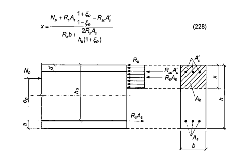

<strong>Hình 25 — Sơ đồ nội lực và biểu đồ ứng suất trong tiết diện thẳng góc với trục dọc cấu kiện ứng suất trước chịu uốn khi tính toán độ bền trong giai đoạn nén trước</strong>

### 9.2.3.3  Tính toán độ bền cấu kiện có tiết diện chữ T và chữ I trong giai đoạn nén trước được tiến hành phụ thuộc vào vị trí biên vùng chịu nén:

a) \- Nếu biên vùng chịu nén nằm trong cánh (Hình 6a), nghĩa là thỏa mãn điều kiện:

$$N_p \le R_b b_f' h_f' - R_s A_s + R_{sc} A_s' \tag{229}$$
<!-- formula_id: "F_TCVN_5574_2018_FORMULA_229" -->

thì việc tính toán được tiến hành như đối với tiết diện chữ nhật có chiều rộng $b_r$ theo 9.2.3.2;

b) \- Nếu biên vùng chịu nén nằm trong sườn (Hình 6b), nghĩa là điều kiện (229) không được thỏa mãn thì việc tính toán được tiến hành theo điều kiện:

$$N_p e_p \le R_b b x (h_0 - 0,5x) + R_b (b'_f - b) h'_f (h_0 - 0,5h'_f) + R_{sc} A'_s (h_0 - a') \tag{230}$$
<!-- formula_id: "F_TCVN_5574_2018_FORMULA_230" -->

trong đó:

&nbsp;&nbsp;&nbsp;&nbsp;\- $e_{p}$ = $e_{0p}$ + $z_{s}$ ± M/$N_{p}$;

&nbsp;&nbsp;&nbsp;&nbsp;\- $e_{0p}$ - xem 9.2.3.2;

&nbsp;&nbsp;&nbsp;&nbsp;\- $z_{s}$  là khoảng cách từ trọng tâm tiết diện cấu kiện đến cốt thép không ứng suất trước chịu kéo (hoặc chịu nén ít nhất).

Chiều cao vùng chịu nén x được xác định theo các công thức:

a) \- Khi ξ = x/$h_{0}$ ≤ $\xi_{R}$ ($\xi_{R}$ - xem 9.2.3.2):

$$x = \frac{N_p + R_s A_s - R_{sc} A'_s - R_b (b'_f - b) h'_f}{R_b b}$$
<!-- formula_id: "F_TCVN_5574_2018_FORMULA_231" -->

b) \- Khi ξ = x/$h_{0}$ > $\xi_{R}$:

$$x = \frac{N_p + R_s A_s \frac{1 + \xi_R}{1 - \xi_R} - R_{sc} A'_s - R_b (b'_f - b) h'_f}{R_b b + R_s A_s \frac{2}{1 - \xi_R}}$$
<!-- formula_id: "F_TCVN_5574_2018_FORMULA_232" -->

### 9.2.4  Tính toán độ bền tiết diện thẳng góc theo mô hình biến dạng phi tuyến

### 9.2.4.1  Khi tính toán độ bền theo mô hình biến dạng phi tuyến thì nội lực và biến dạng trong tiết diện thẳng góc với trục dọc cấu kiện được xác định dựa trên các quy định chung nêu trong 8.1.2.7.1 đến 8.1.2.7.3.

### 9.2.4.2  Khi tính toán độ bền tiết diện thẳng góc (Hình 26) trong trường hợp tổng quát thì sử dụng:

&nbsp;&nbsp;\- Các phương trình cân bằng ngoại lực và nội lực trong tiết diện thẳng góc của cấu kiện:

$$\begin{aligned}
M_x &= \sum_i \sigma_{bi} A_{bi} Z_{bxi} + \sum_j \sigma_{sj} A_{sj} Z_{sxj} + \sum_i \sigma_{s'i} A_{s'i} Z_{s'xi} \qquad (233) \\
M_y &= \sum_i \sigma_{bi} A_{bi} Z_{byi} + \sum_j \sigma_{sj} A_{sj} Z_{syj} + \sum_i \sigma_{s'i} A_{s'i} Z_{s'yi} \qquad (234) \\
N &= \sum_i \sigma_{bi} A_{bi} + \sum_j \sigma_{sj} A_{sj} + \sum_i \sigma_{s'i} A_{s'i} \qquad (235)
\end{aligned}$$
<!-- formula_id: "F_TCVN_5574_2018_FORMULA_233" -->

&nbsp;&nbsp;\- Các phương trình xác định sự phân bố biến dạng tương đối trên tiết diện cấu kiện do tác dụng của ngoại lực:

$$\begin{aligned}
\varepsilon_{bi} &= \varepsilon_0 + \frac{1}{r_x} Z_{bxi} + \frac{1}{r_y} Z_{byi} \qquad (236) \\
\varepsilon_{sj} &= \varepsilon_0 + \frac{1}{r_x} Z_{sxj} + \frac{1}{r_y} Z_{syj} \qquad (237) \\
\varepsilon_{si} &= \varepsilon_0 + \frac{1}{r_x} Z_{sxi} + \frac{1}{r_y} Z_{syi} \qquad (238)
\end{aligned}$$
<!-- formula_id: "F_TCVN_5574_2018_RID287" -->

&nbsp;&nbsp;\- Các quan hệ giữa ứng suất và biến dạng tương đối của bê tông và của cốt thép:

Của bê tông:

$$\sigma_{bi} = E_b \nu_{bi} \varepsilon_{bi} \tag{239}$$
<!-- formula_id: "F_TCVN_5574_2018_FORMULA_239" -->

Của cốt thép không ứng suất trước:

$$\sigma_{si} = E_{si} \nu_{si} \varepsilon_{si} \tag{240}$$
<!-- formula_id: "F_TCVN_5574_2018_FORMULA_240" -->

Của cốt thép ứng suất trước:

$$\sigma_{si} = E_{si} \gamma_{si} \left( \varepsilon_{si} + \varepsilon_{spi} \right) \tag{241}$$
<!-- formula_id: "F_TCVN_5574_2018_FORMULA_241" -->

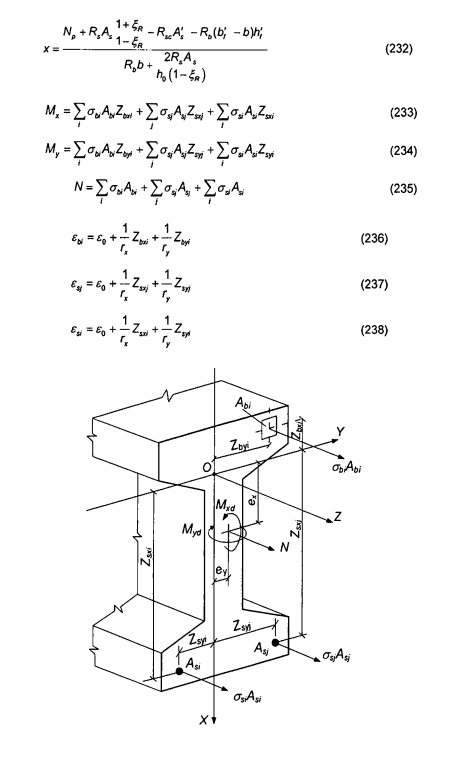

<strong>Hình 26 — Sơ đồ tính toán tiết diện thẳng góc của cấu kiện bê tông cốt thép ứng suất trước</strong>

Trong các phương trình từ (233) đến (241):

$A_{si}$, $Z_{sxi}$, $Z_{syi}$, $\sigma_{si}$  lần lượt là diện tích, các tọa độ của trọng tâm thanh cốt thép ứng suất trước thứ i và ứng suất trong nó;

$e_{si}$  là biến dạng tương đối của thanh cốt thép ứng suất trước thứ i do tác dụng của ngoại lực;

$e_{spi}$  là biến dạng tương đối của cốt thép ứng suất trước có kể đến các hao tổn ứng suất trước ứng với giai đoạn tính toán đang xét;

$E_{si}$  là mô đun đàn hồi của thanh cốt thép ứng suất trước thứ i;

$_{si}$  là hệ số đàn hồi của thanh cốt thép ứng suất trước thứ i;

các thông số còn lại - xem 8.1.2.7.4.

Giá trị của các hệ số $v_{bi}$ và $v_{sj}$ được xác định theo các chỉ dẫn trong 8.1.2.7.4, còn giá trị của các hệ số $v_{si}$ - theo công thức:

$$\nu_{si} = \frac{\sigma_{si}}{E_{si} (\varepsilon_{si} + \varepsilon_{0si})}$$
<!-- formula_id: "F_TCVN_5574_2018_FORMULA_239" -->

### 9.2.4.3  Tính toán độ bền tiết diện thẳng góc của các cấu kiện bê tông cốt thép được tiến hành theo các điều kiện nêu trong 8.1.2.7.5.

### 9.3  Tính toán cấu kiện ứng suất trước của các kết cấu bê tông cốt thép theo các trạng thái giới hạn thứ hai

### 9.3.1  Yêu cầu chung

### 9.3.1.1  Tính toán theo các trạng thái giới hạn thứ hai bao gồm:

&nbsp;&nbsp;\- Tính toán theo sự hình thành vết nứt;

&nbsp;&nbsp;\- Tính toán theo sự mở rộng vết nứt;

&nbsp;&nbsp;\- Tính toán biến dạng.

### 9.3.1.2  Tính toán theo sự hình thành vết nứt được tiến hành khi phải đảm bảo các vết nứt không được hình thành, cũng như được coi là phép tính bổ sung khi tính toán chiều rộng vết nứt và tính toán biến dạng.

Các yêu cầu không được có vết nứt được đề ra:

&nbsp;&nbsp;\- Đối với các kết cấu ứng suất trước, mà trong đó khi toàn bộ tiết diện của chúng là chịu kéo thì độ không thấm vẫn cần được đảm bảo (các kết cấu chịu áp lực chất lỏng hoặc khí, các kết cấu chịu tác động phóng xạ và các kết cấu tương tự);

&nbsp;&nbsp;\- Đối với các kết cấu đặc thù;

&nbsp;&nbsp;\- Cũng như đối với các kết cấu chịu tác động của môi trường xâm thực mạnh.

### 9.3.1.3  Khi tính toán theo sự hình thành vết nứt với mục đích không cho vết nứt xuất hiện thì lấy hệ số độ tin cậy về tải trọng $\gamma_{f}$ >1,0 (như khi tính toán độ bền). Khi tính toán mở rộng vết nứt và tính toán biến dạng (bao gồm cả tính toán bổ sung về hình thành vết nứt) thì lấy hệ số độ tin cậy về tải trọng $\gamma_{f}$ = 1,0.

### 9.3.1.4  Tính toán cấu kiện ứng suất trước chịu uốn theo các trạng thái giới hạn thứ hai được tiến hành như đối với cấu kiện chịu nén lệch tâm dưới tác dụng đồng thời của mô men uốn do ngoại lực M và lực dọc $N_{p}$ (bằng lực nén trước P).

### 9.3.2  Tính toán cấu kiện bê tông cốt thép ứng suất trước theo sự hình thành và mở rộng vết nứt

### 9.3.2.1  Yêu cầu chung

Tính toán cấu kiện bê tông cốt thép ứng suất trước chịu uốn về mở rộng vết nứt được tiến hành dựa trên các yêu cầu chung nêu trong 8.2.2.1 và có kể đến các chỉ dẫn trong 9.3.2.2.

### 9.3.2.2  Xác định mô men hình thành vết nứt thẳng góc với trục dọc cấu kiện

### 9.3.2.2.1  Mô men uốn hình thành vết nứt $M_{crc}$ trong trường hợp tổng quát được xác định theo mô hình biến dạng phi tuyến theo 9.3.2.2.5. Đối với các tiết diện đơn giản (chữ nhật và chữ T với cốt thép nằm ở biên trên và biên dưới tiết diện, có cánh nằm trong vùng chịu nén) thì cho phép xác định mô men hình thành vết nứt theo 9 3.2.2.2.

### 9.3.2.2.2  Xác định mô men hình thành vết nứt được tiến hành có kể đến các biến dạng không đàn hồi của bê tông chịu kéo theo 9.3.2.2.3.

Cho phép xác định mô men hình thành vết nứt mà không kể đến các biến dạng không đàn hồi của bê tông chịu kéo, nhưng trong công thức (243) lấy $W_{pl}$ = $W_{red}$. Nếu khi đó các điều kiện (155) và (177) không thỏa mãn thì mô men hình thành vết nứt cần được xác định có kể đến các biến dạng không đàn hồi của bê tông chịu kéo.

### 9.3.2.2.3  Mô men hình thành vết nứt của các cấu kiện ứng suất trước chịu uốn có kể đến các biến dạng không đàn hồi của bê tông chịu kéo được xác định theo công thức:

$$M_{crc} = R_{bt,ser} W_{pl} \pm P e_{core,p}$$
<!-- formula_id: "F_TCVN_5574_2018_FORMULA_242" -->

trong đó:

&nbsp;&nbsp;&nbsp;&nbsp;\- $W_{pl}$  là mô men kháng uốn của tiết diện quy đổi đối với thớ chịu kéo ngoài cùng có kể đến các giả thiết nêu trong 8.2.2.2.3;

&nbsp;&nbsp;&nbsp;&nbsp;\- $e_{core,p}$ = $e_{0p}$ + r là khoảng cách từ điểm đặt lực nén trước P đến điểm lõi nằm xa vùng chịu kéo hơn cả mà tại đó sự hình thành vết nứt cần được kiểm tra;

&nbsp;&nbsp;&nbsp;&nbsp;\- $e_{0p}$  là khoảng cách từ điểm đặt lực nén trước P đến trọng tâm tiết diện quy đổi;

&nbsp;&nbsp;&nbsp;&nbsp;\- r  là khoảng cách từ trọng tâm tiết diện quy đổi đến điểm lõi:

$$r = \frac{W_{red}}{A_{red}} \tag{244}$$
<!-- formula_id: "F_TCVN_5574_2018_FORMULA_244" -->

Trong công thức (243) lấy dấu “cộng” khi hướng quay của mô men $Pe_{core,p}$ và của mô men uốn M do ngoại lực là ngược nhau; lấy dấu “trừ" khi hướng của các mô men này trùng nhau.

Các giá trị $W_{red}$ và $A_{red}$ được xác định theo các chỉ dẫn trong 8.2.

Đối với các tiết diện chữ nhật và chữ T (có cánh nằm trong vùng chịu nén) thì giá trị $W_{pl}$ khi có tác dụng của mô men trong mặt phẳng trục đối xứng được phép xác định theo công thức (159).

### 9.3.2.2.4  Nội lực $N_{crc}$ khi hình thành vết nứt trong các cấu kiện chịu kéo đúng tâm được xác định theo công thức (165).

### 9.3.2.2.5  Xác định mô men hình thành vết nứt theo mô hình biến dạng phi tuyến được tiến hành dựa trên các quy định chung nêu trong 6.1.4.6, 9.2.4.1 đến 9.2.4.3, nhưng có kể đến sự làm việc của bê tông trong vùng chịu kéo của tiết diện thẳng góc, mà sự làm việc này được xác định bởi biểu đồ biến dạng của bê tông chịu kéo theo 6.1.4.4. Các đặc trưng tính toán của vật liệu được lấy đối với các trạng thái giới hạn thứ hai.

Giá trị $M_{crc}$ được xác định từ việc giải hệ các phương trình nêu trong 9.2.4.1 đến 9.2.4.3, trong đó lấy biến dạng tương đối của bê tông $\epsilon_{bt,max}$ ở biên chịu kéo của cấu kiện do tác dụng của ngoại lực bằng giá trị giới hạn của biến dạng tương đối của bê tông khi kéo $\epsilon_{bt,u}$ đã được xác định theo các chỉ dẫn trong 8.1.2.7.11.

### 9.3.2.3  Tính toán chiều rộng vết nứt thẳng góc với trục dọc cấu kiện

Chiều rộng vết nứt thẳng góc được xác định theo công thức (166), trong đó giá trị ứng suất $\sigma_{s}$ trong cốt thép chịu kéo của cấu kiện ứng suất trước chịu uốn do ngoại lực được xác định theo công thức:

$$\sigma_s = \left[ \frac{M_p (h_0 - y_c)}{I_{red}} - \frac{N_p}{A_{red}} \right] \frac{E_s}{E_b}$$
<!-- formula_id: "F_TCVN_5574_2018_FORMULA_166" -->

trong đó:

&nbsp;&nbsp;&nbsp;&nbsp;\- $I_{red}$, $A_{red}$, $y_{c}$ lần lượt là mô men quán tính, diện tích tiết diện ngang quy đổi của cấu kiện và khoảng cách từ thớ chịu nén nhiều nhất đến trọng tâm tiết diện ngang quy đổi, được xác định có kể đến diện tích tiết diện chỉ của vùng bê tông chịu nén, diện tích tiết diện cốt thép chịu kéo và cốt thép chịu nén theo 8.2.3.3.5, trong đó trong các công thức tính toán tương ứng lấy hệ số quy đổi cốt thép về bê tông $\alpha_{s2}$ = $\alpha_{s1}$;

&nbsp;&nbsp;&nbsp;&nbsp;\- $N_{p}$  là lực nén trước (xem 9.3.1.4);

&nbsp;&nbsp;&nbsp;&nbsp;\- $M_{p}$  là mô men uốn do ngoại lực và lực nén trước, được xác định theo công thức:

$$M_{p} = M \pm N_{p}e_{0p} \tag{246}$$
<!-- formula_id: "F_TCVN_5574_2018_FORMULA_246" -->

trong đó: $e_{0p}$ là khoảng cách từ điểm đặt lực nén trước $N_{p}$ đến trọng tâm tiết diện quy đổi của cấu kiện.

&nbsp;&nbsp;&nbsp;&nbsp;\- Trong công thức (246), lấy dấu “trừ" khi hướng quay của các mô men M và $N_{p}e_{0p}$ không trùng nhau, và lấy dấu “cộng” khi chúng trùng nhau.

Cho phép xác định ứng suất $\sigma_{s}$ theo công thức:

$$\sigma_s = \frac{M - N_p(z - e_{sp})}{z A_s}$$
<!-- formula_id: "F_TCVN_5574_2018_FORMULA_247" -->

trong đó:

&nbsp;&nbsp;&nbsp;&nbsp;\- z  là khoảng cách từ trọng tâm cốt thép nằm trong vùng chịu kéo của tiết diện đến điểm đặt hợp lực của các nội lực trong vùng chịu nén của cấu kiện;

&nbsp;&nbsp;&nbsp;&nbsp;\- $e_{sp}$  là khoảng cách từ trọng tâm cốt thép nêu trên đến điểm đặt lực $N_{p}$.

Đối với các cấu kiện tiết diện ngang chữ nhật khi không có (hoặc không kể đến) cốt thép chịu nén thì giá trị z được xác định theo công thức:

$$z = h_0 - \frac{x_N}{3} \tag{248}$$
<!-- formula_id: "F_TCVN_5574_2018_FORMULA_248" -->

trong đó: $x_{N}$ là chiều cao vùng chịu nén, được xác định theo 8.2.3.3.6 có kể đến tác dụng của lực nén trước $N_{p}$.

Đối với cấu kiện tiết diện ngang chữ nhật, chữ T (có cánh nằm trong vùng chịu nén) và chữ I thì cho phép lấy giá trị z bằng 0,7$h_{0}$.

Ứng suất $\sigma_{s}$, đã được xác định theo các công thức (245) và (247), không được vượt quá ($R_{s,ser}$ - $\sigma_{sp}$).

### 9.3.3  Tính toán cấu kiện bê tông cốt thép ứng suất trước theo biến dạng

### 9.3.3.1  Tính toán cấu kiện ứng suất trước theo biến dạng được tiến hành theo các chỉ dẫn trong 8.2.3 và có kể đến các chỉ dẫn bổ sung trong 9.3.3.2 đến 9.3.3.4.

### 9.3.3.2  Độ cong toàn phần của các cấu kiện ứng suất trước chịu uốn để tính độ võng của chúng được xác định theo các chỉ dẫn trong 8.2.3.3.2, khi đó các giá trị độ cong (1/r)$_{1}$, (1/r)$_{2}$ và (1/r)$_{3}$ trong các công thức (185), (186) được xác định theo các chỉ dẫn trong 9.3.3.3 có kể đến lực nén trước.

Khi xác định độ cong thì cho phép kể đến ảnh hưởng của biến dạng co ngót và từ biến của bê tông trong giai đoạn nén trước.

### 9.3.3.3  Độ cong của cấu kiện ứng suất trước chịu uốn 1/r do tác dụng của các tải trọng tương ứng được xác định theo công thức:

$$\frac{1}{r} = \frac{M \pm N_p e_{0p}}{D} \tag{249}$$
<!-- formula_id: "F_TCVN_5574_2018_FORMULA_249" -->

trong đó:

&nbsp;&nbsp;&nbsp;&nbsp;\- M  là mô men uốn do ngoại lực;

&nbsp;&nbsp;&nbsp;&nbsp;\- $N_{p}$ và $e_{0p}$ là lực nén trước và độ lệch tâm của nó đối với trọng tâm tiết diện ngang quy đổi của cấu kiện;

&nbsp;&nbsp;&nbsp;&nbsp;\- D  là độ cứng chống uốn của tiết diện ngang quy đổi của cấu kiện, được xác định theo các chỉ dẫn trong 8.2 như đối với trường hợp nén lệch tâm với lực nén trước cấu kiện có kể đến mô men uốn do ngoại lực (Hình 27).

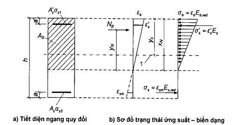

**CHÚ DẪN:**

1 - Mức trọng tâm tiết diện ngang quy đổi không kể đến vùng chịu kéo của bê tông.

<strong>Hình 27 — Tiết diện ngang quy đổi và sơ đồ trạng thái ứng suất - biến dạng khi tính toán cấu kiện ứng suất trước chịu uốn có vết nứt theo biến dạng</strong>

### 9.3.3.4  Cho phép xác định độ cong của cấu kiện ứng suất trước chịu uốn theo công thức:

$$\frac{1}{r} = \frac{M - N_p z_p}{E_{s,red} A_s z (h_0 - x_N)}$$
<!-- formula_id: "F_TCVN_5574_2018_FORMULA_249" -->

trong đó:

&nbsp;&nbsp;&nbsp;&nbsp;\- $z_{p}$  là khoảng cách từ điểm đặt lực nén trước đến điểm đặt hợp lực của các nội lực trong vùng chịu nén;

&nbsp;&nbsp;&nbsp;&nbsp;\- z  là khoảng cách từ trọng tâm cốt thép chịu kéo đến điểm đặt hợp lực của các nội lực trong vùng chịu nén;

&nbsp;&nbsp;&nbsp;&nbsp;\- $x_{N}$  là chiều cao vùng chịu nén có kể đến ảnh hưởng của lực nén trước.

Chiều cao vùng chịu nén được xác định như đối với cấu kiện không ứng suất trước chịu uốn theo 8 2.3.3.6 nhưng trong đó giá trị µ$\varepsilon_{s}$ được nhân với $1 + \frac{N_\rho}{M_\rho} z$.

Cho phép xác định các giá trị $z_{p}$ và z trên cơ sở khoảng cách từ điểm đặt hợp lực của các nội lực trong vùng chịu nén đến thớ chịu nén nhiều nhất của tiết diện lấy bằng 0,3$h_{0}$.

### 9.3.4  Xác định độ cong của cấu kiện ứng suất trước theo mô hình biến dạng phi tuyến

Độ cong toàn phần của cấu kiện ứng suất trước chịu uốn trên các đoạn không có vết nứt trong vùng chịu kéo của tiết diện được xác định theo công thức (185), còn trên các đoạn có vết nứt trong vùng chịu kéo của tiết diện - theo công thức (186).

Các giá trị độ cong trong các công thức (185) và (186) được xác định từ việc giải hệ các phương trình từ (233) đến (241) có kể đến các chỉ dẫn trong 9.2.4.1. Khi đó, đối với các cấu kiện có vết nứt thẳng góc trong vùng chịu kéo thì ứng suất trong cốt thép ứng suất trước cắt qua các vết nứt được xác định theo công thức:

$$\sigma_{si} = \left( \frac{E_{si} \varepsilon_{si}}{\psi_{si}} + E_{si}\varepsilon_{0si} \right)$$
<!-- formula_id: "F_TCVN_5574_2018_FORMULA_244" -->

còn ứng suất trong cốt thép không ứng suất trước:

$$\sigma_{sj} = \frac{E_{sj} \varepsilon_{sj}}{\psi_{sj}}$$
<!-- formula_id: "F_TCVN_5574_2018_FORMULA_248" -->

trong đó:

$$\psi_{si(j)} = \frac{1}{1 + 0,8 \frac{\varepsilon_{si(j),cr}}{\varepsilon_{si(j)}}}$$
<!-- formula_id: "F_TCVN_5574_2018_FORMULA_246" -->

trong đó:

&nbsp;&nbsp;&nbsp;&nbsp;\- $\epsilon_{si(j),cr}$  là biến dạng tương đối của cốt thép chịu kéo trong tiết diện có vết nứt do tác dụng của ngoại lực ngay sau khi hình thành vết nứt;

&nbsp;&nbsp;&nbsp;&nbsp;\- $\epsilon_{si(j)}$  là biến dạng tương đối trung bình của cốt thép chịu kéo cắt qua các vết nứt trong giai đoạn đang xét;

&nbsp;&nbsp;&nbsp;&nbsp;\- $\epsilon_{spi}$  là biến dạng tương đối của cốt thép ứng suất trước.

Khi xác định độ cong do tác dụng ngắn hạn của tải trọng thì trong tính toán sử dụng các biểu đồ biến dạng ngắn hạn của bê tông chịu nén và chịu kéo, còn khi xác định độ cong do tác dụng dài hạn của tải trọng - sử dụng các biểu đồ biến dạng dài hạn của bê tông, với các đặc trưng tính toán được lấy đối với các trạng thái giới hạn thứ hai.

## 10  YÊU CẦU CẤU TẠO

### 10.1  Yêu cầu chung

Để đảm bảo an toàn và sử dụng bình thường của kết cấu bê tông và bê tông cốt thép thì ngoài các yêu cầu tính toán, cũng cần thực hiện các yêu cầu cấu tạo về kích thước hình học và bố trí cốt thép.

Các yêu cầu cấu tạo được quy định đối với các trường hợp khi mà:

&nbsp;&nbsp;\- Bằng tính toán chưa đảm bảo đủ chính xác và xác định hoàn toàn về khả năng kết cấu chịu được các tải trọng và tác động bên ngoài;

&nbsp;&nbsp;\- Các yêu cầu cấu tạo xác định được các điều kiện biên mà trong phạm vi đó có thể sử dụng các giả thiết tính toán đã lựa chọn;

&nbsp;&nbsp;\- Các yêu cầu cấu tạo đảm bảo cho việc thực hiện công nghệ chế tạo kết cấu bê tông và bê tông cốt thép.

### 10.2  Yêu cầu về kích thước hình học

### 10.2.1  Các kích thước hình học của kết cấu bê tông và bê tông cốt thép không được nhỏ hơn các giá trị mà đảm bảo được:

&nbsp;&nbsp;\- Khả năng bố trí cốt thép, neo cốt thép và sự làm việc đồng thời của cốt thép với bê tông, có kể đến các yêu cầu trong 10.3;

&nbsp;&nbsp;\- Hạn chế độ mảnh của các cấu kiện chịu nén;

&nbsp;&nbsp;\- Các chỉ tiêu chất lượng cần thiết của bê tông trong kết cấu (GOST 13015-2012).

### 10.2.2  Để đảm bảo độ cứng của các cấu kiện chịu nén lệch tâm thì kích thước tiết diện của chúng nên lấy sao cho độ mảnh $L_{0}$/i của các cấu kiện này theo phương bất kỳ không vượt quá:

200 - đối với các cấu kiện bê tông cốt thép;

120 - đối với cột là cấu kiện của nhà;

90 - đối với các cấu kiện bê tông.

### 10.2.3  Trong các kết cấu của nhà và công trình, cần bố trí các khe co giãn - nhiệt cố định và tạm thời với khoảng cách giữa chúng được lựa chọn phụ thuộc vào điều kiện khí hậu, đặc điểm kết cấu của công trình, trình tự thi công và các điều kiện tương tự.

Khi độ lún của móng không đều, cần tách kết cấu ra bằng các khe lún.

### 10.3  Yêu cầu về bố trí cốt thép

### 10.3.1  Lớp bê tông bảo vệ

### 10.3.1.1  Lớp bê tông bảo vệ cần phải đảm bảo được:

&nbsp;&nbsp;\- Sự làm việc đồng thời của cốt thép với bê tông;

&nbsp;&nbsp;\- Sự neo cốt thép trong bê tông và khả năng bố trí các mối nối của các chi tiết cốt thép;

&nbsp;&nbsp;\- Tính toàn vẹn của cốt thép dưới các tác động của môi trường xung quanh (kể cả môi trường xâm thực);

&nbsp;&nbsp;\- Khả năng chịu lửa của kết cấu.

### 10.3.1.2  Chiều dày lớp bê tông bảo vệ được xác định dựa theo các yêu cầu trong điều này có kể đến vai trò của cốt thép trong kết cấu (là cốt thép dọc chịu lực hoặc cốt thép cấu tạo), loại kết cấu (cột, bản sàn, dầm, các cấu kiện của móng, tường và các kết cấu tương tự), đường kính và loại cốt thép, cũng như TCVN 12251:2018.

Giá trị tối thiểu của chiều dày lớp bê tông bảo vệ của cốt thép chịu lực (kể cả cốt thép nằm ở mép trong của các cấu kiện rỗng tiết diện vành khuyên hoặc tiết diện hộp) lấy theo Bảng 19.

### Bảng 19 - Chiều dày tối thiểu của lớp bê tông bảo vệ

| Điều kiện làm việc của kết cấu nhà | Chiều dày tối thiểu của lớp bê tông bảo vệ |
| :--- | :---: |
| 1. Trong các gian phòng được che phủ với độ ẩm bình thường và thấp (không lớn hơn 75 %). | 20 |
| 2. Trong các gian phòng được che phủ với độ ẩm nâng cao (lớn hơn 75 %) (khi không có các biện pháp bảo vệ bổ sung). | 25 |
| 3. Ngoài trời (khi không có các biện pháp bảo vệ bổ sung). | 30 |
| 4. Trong đất (khi không có các biện pháp bảo vệ bổ sung), trong móng khi có lớp bê tông lót. | 40 |

Đối với các cấu kiện lắp ghép thì giá trị tối thiểu của chiều dày lớp bê tông bảo vệ cốt thép chịu lực nêu trong Bảng 19 được lấy giảm bớt 5 mm.

Đối với cốt thép cấu tạo thì giá trị tối thiểu của chiều dày lớp bê tông bảo vệ được lấy giảm bớt 5 mm so với giá trị yêu cầu đối với cốt thép chịu lực.

Trong mọi trường hợp, chiều dày lớp bê tông bảo vệ cũng cần được lấy không nhỏ hơn đường kính thanh cốt thép và không nhỏ hơn 10 mm.

Trong các kết cấu một lớp làm từ bê tông nhẹ và bê tông rỗng có cấp cường độ chịu nén từ B7,5 trở xuống thì chiều dày lớp bê tông bảo vệ cần được lấy không nhỏ hơn 20 mm, còn đối với các tấm tường ngoài (không có lớp trang trí) - không nhỏ hơn 25 mm. Trong các kết cấu một lớp làm từ bê tông tổ ong thì chiều dày lớp bê tông bảo vệ trong mọi trường hợp cần được lấy không nhỏ hơn 25 mm.

Trong lớp bê tông bảo vệ dày hơn 50 mm của các cấu kiện chịu uốn, chịu kéo và chịu nén lệch tâm (khi tỉ số M/N > 0,3h do tải trọng thường xuyên và tạm thời dài hạn), trừ móng cần bố trí cốt thép cấu tạo dưới dạng lưới với diện tích tiết diện cốt thép dọc không nhỏ hơn 0,05$A_{s}$, khi đó bước cốt thép ngang không được lớn hơn cạnh nhỏ nhất của tiết diện ngang của cấu kiện.

### 10.3.1.3  Chiều dày lớp bê tông bảo vệ ở phần đầu các cấu kiện ứng suất trước trên khoảng chiều dài vùng truyền ứng suất (xem 9.1.12) cần lấy không nhỏ hơn 3d và không nhỏ hơn 40 mm đối với cốt thép thanh và không nhỏ hơn 20 mm đối với cáp.

Cho phép lấy chiều dày lớp bê tông bảo vệ của tiết diện ở gối tựa đối với cốt thép ứng suất trước có hoặc không có neo tương tự như của tiết diện trong nhịp đối với các cấu kiện ứng suất trước với nội lực gối tựa truyền tập trung khi có chi tiết thép ở gối tựa và cốt thép hạn chế biến dạng ngang (lưới thép hàn nằm ngang hoặc cốt thép đai ôm cốt thép dọc) được bố trí theo các chỉ dẫn trong 10.3.4.10.

### 10.3.1.4  Trong các cấu kiện có cốt thép dọc ứng suất trước căng trên bê tông và nằm trong các ống lồng thì khoảng cách từ bề mặt cấu kiện đến bề mặt ống lồng cần lấy không nhỏ hơn 40 mm và không nhỏ hơn chiều rộng (đường kính) ống lồng, còn đến mặt bên - không nhỏ hơn một nửa chiều cao (đường kính) ống lồng. Khi cốt thép ứng suất trước nằm trong các rãnh hoặc nằm ngoài tiết diện cấu kiện thì chiều dày lớp bê tông bảo vệ được tạo bởi phương pháp phun sau đó hoặc phương pháp khác được lấy không nhỏ hơn 20 mm.

### 10.3.2  Khoảng cách thông thủy tối thiểu giữa các thanh cốt thép

Khoảng cách thông thủy tối thiểu giữa các thanh cốt thép cần được lấy sao cho đảm bảo được sự làm việc đồng thời giữa cốt thép với bê tông và có kể đến sự thuận tiện khi đổ và đầm hỗn hợp bê tông, nhưng không nhỏ hơn đường kính lớn nhất của thanh cốt thép, đồng thời không nhỏ hơn:

## 25  MM - ĐỐI VỚI CÁC THANH CỐT THÉP DƯỚI ĐƯỢC BỐ TRÍ THÀNH MỘT HOẶC HAI LỚP VÀ NẰM NGANG HOẶC NGHIÊNG TRONG LÚC ĐỔ BÊ TÔNG;

## 30  MM - ĐỐI VỚI CÁC THANH CỐT THÉP TRÊN ĐƯỢC BỐ TRÍ THÀNH MỘT HOẶC HAI LỚP VÀ NẰM NGANG HOẶC NGHIÊNG TRONG LÚC ĐỔ BÊ TÔNG;

50 mm - đối với các thanh cốt thép dưới được bố trí thành ba lớp trở lên (trừ các thanh của hai lớp dưới cùng) và nằm ngang hoặc nghiêng trong lúc đổ bê tông, cũng như đối với các thanh nằm theo phương đứng trong lúc đổ bê tông.

Trong điều kiện chật hẹp khó bố trí cốt thép, cho phép bố trí các thanh cốt thép thành các nhóm-bó (không có khoảng hở giữa chúng). Khi đó, khoảng cách thông thủy giữa các bó thanh thép cũng phải không được nhỏ hơn đường kính quy đổi $d_{s,red}$ của thanh thép có diện tích tiết diện tương đương với diện tích tiết diện của bó thanh thép. Giá trị $d_{s,red}$ được xác định theo công thức:

$$d_{s,red} = \sqrt{\sum_{1}^{n} d_{si}^{2}}$$
<!-- formula_id: "F_TCVN_5574_2018_FORMULA_253" -->

trong đó:

&nbsp;&nbsp;&nbsp;&nbsp;\- $d_{si}$  là đường kính danh nghĩa một thanh cốt thép trong bó;

&nbsp;&nbsp;&nbsp;&nbsp;\- n  là số lượng thanh cốt thép trong bó.

### 10.3.3  Bố trí cốt thép dọc

### 10.3.3.1  Trong các cấu kiện bê tông cốt thép, diện tích tiết diện của cốt thép dọc chịu kéo, cũng như chịu nén nếu cần theo tính toán, tính theo phần trăm diện tích tiết diện bê tông (bằng tích của chiều rộng tiết diện chữ nhật hoặc chiều rộng sườn của tiết diện chữ T hoặc chữ I và chiều cao làm việc của tiết diện), µ$\varepsilon_{s}$ = ($A_{s}$/$bh_{0}$) $^{.}$ 100%, cần lấy không nhỏ hơn:

0,1 % - đối với các cấu kiện chịu uốn, chịu kéo lệch tâm, chịu nén lệch tâm khi độ mảnh $L_{0}$/h ≤ 17 (đối với tiết diện chữ nhật với $L_{0}$/h ≤ 5);

0,25 % - đối với các cấu kiện chịu nén lệch tâm khi độ mảnh $L_{0}$/i ≥ 87 (đối với tiết diện chữ nhật với $L_{0}$/h ≥ 25);

Đối với các giá trị độ mảnh trung gian của cấu kiện thì giá trị µ$\varepsilon_{s}$ được xác định bằng nội suy tuyến tính.

Trong các cấu kiện có cốt thép dọc bố trí đều theo chu vi tiết diện, cũng như trong các cấu kiện chịu kéo đúng tâm thì diện tích tiết diện tối thiểu của toàn bộ cốt thép dọc cần phải lấy gấp hai lần so với các giá trị nêu trên và tính trên toàn bộ diện tích tiết diện bê tông.

### 10.3.3.2  Trong các kết cấu bê tông cần bố trí cốt thép cấu tạo:

&nbsp;&nbsp;\- Tại các vị trí thay đổi kích thước tiết diện cấu kiện;

&nbsp;&nbsp;\- Trong các tường bê tông ở các vị trí dưới và trên các lỗ mở;

&nbsp;&nbsp;\- Trong các cấu kiện chịu nén lệch tâm về phía các biên, nơi mà xuất hiện ứng suất kéo; khi đó, hàm lượng cốt thép µ$\varepsilon_{s}$ lấy không nhỏ hơn 0,025 %.

### 10.3.3.3  Trong các kết cấu bê tông cốt thép dạng thanh và bản thì khoảng cách tối đa giữa trục các thanh cốt thép dọc để đảm bảo đưa chúng vào làm việc cùng với bê tông, đảm bảo cho ứng suất và biến dạng được phân bố đều, cũng như để hạn chế chiều rộng vết nứt giữa các thanh cốt thép, không được lớn hơn:

&nbsp;&nbsp;\- Trong các dầm và bản bê tông cốt thép:

200 mm khi chiều cao tiết diện ngang h ≤ 150 mm;

1,5h và 400 mm khi chiều cao tiết diện ngang h > 150 mm;

&nbsp;&nbsp;\- Trong các cột bê tông cốt thép:

400 mm theo phương vuông góc với mặt phẳng uốn (300 mm khi sử dụng bê tông từ B70 đến B100);

500 mm theo phương mặt phẳng uốn (400 mm khi sử dụng bê tông từ B70 đến B100).

Trong các tường bê tông cốt thép, khoảng cách giữa các thanh cốt thép thẳng đứng lấy không lớn hơn 2t và 400 mm (t là chiều dày tường), và khoảng cách giữa các thanh cốt thép nằm ngang - không lớn hơn 400 mm.

### 10.3.3.4  Trong dầm và sườn có chiều rộng lớn hơn 150 mm, số lượng cốt thép dọc chịu lực kéo trong tiết diện ngang không được ít hơn 2 thanh. Khi chiều rộng tiết diện từ 150 mm trở xuống thì cho phép đặt 1 thanh cốt thép dọc chịu lực trong tiết diện ngang.

### 10.3.3.5  Trong dầm cần kéo vào gối tựa các thanh cốt thép dọc chịu lực với diện tích tiết diện không nhỏ hơn 1/2 diện tích tiết diện các thanh trong nhịp và không ít hơn 2 thanh.

Trong bản cần kéo vào gối tựa các thanh cốt thép dọc chịu lực trên 1 m chiều rộng bản với diện tích tiết diện không nhỏ hơn 1/3 diện tích tiết diện các thanh trên 1 m chiều rộng bản trong nhịp.

### 10.3.4  Bố trí cốt thép ngang

### 10.3.4.1  Cốt thép ngang cần được đặt theo tính toán để chịu nội lực, cũng như để hạn chế vết nứt phát triển, để giữ các thanh thép dọc ở vị trí thiết kế và giữ chúng không bị phình theo bất kỳ phương nào.

Cốt thép ngang cần được bố trí ở tất cả các mặt bên (nơi có bố trí cốt thép dọc) của cấu kiện bê tông cốt thép.

### 10.3.4.2  Đường kính cốt thép ngang (cốt thép đai) trong các khung cốt thép buộc của các cấu kiện chịu nén lệch tâm lấy không nhỏ hơn 0,25 lần đường kính cốt thép dọc lớn nhất và không nhỏ hơn 6 mm (8 mm khi sử dụng bê tông từ B70 đến B100).

Đường kính cốt thép ngang trong các khung cốt thép buộc của các cấu kiện chịu uốn lấy không nhỏ hơn 6 mm (8 mm khi sử dụng bê tông từ B70 đến B100).

Trong các khung cốt thép hàn, đường kính cốt thép ngang lấy không nhỏ hơn đường kính đã được chọn theo điều kiện để có thể hàn được đối với đường kính lớn nhất của cốt thép dọc.

### 10.3.4.3  Trong các cấu kiện bê tông cốt thép mà lực cắt tính toán không thể chỉ do mỗi bê tông chịu thì cần đặt cốt thép ngang với bước không lớn hơn 0,5$h_{0}$ và không lớn hơn 300 mm (250 mm khi sử dụng bê tông từ B70 đến B100).

Trong các bản đặc, cũng như trong các bản nhiều sườn có chiều cao nhỏ hơn 300 mm và trong các dầm (sườn) có chiều cao nhỏ hơn 150 mm thì không cần đặt cốt thép ngang trên đoạn cấu kiện mà lực cắt tính toán chỉ cần do bê tông chịu.

Trong các dầm và sườn cao 150 mm trở lên, cũng như trong các bản nhiều sườn có chiều cao từ 300 mm trở lên thì cần đặt cốt thép ngang với bước không lớn hơn 0,75$h_{0}$ và không lớn hơn 500 mm (400 mm khi sử dụng bê tông từ B70 đến B100) trên các đoạn cấu kiện mà có lực cắt tính toán chỉ cần do bê tông chịu.

### 10.3.4.4  Trong các cấu kiện chịu nén lệch tâm dạng thanh, cũng như trong các cấu kiện chịu uốn khi cần đặt cốt thép dọc chịu nén theo tính toán, thì để ngăn ngừa cốt thép dọc này bị phình cần phải đặt cốt thép ngang với bước không lớn hơn 15d và không lớn hơn 500 mm (400 mm khi sử dụng bê tông từ B70 đến B100) (d là đường kính cốt thép dọc chịu nén).

Nếu diện tích tiết diện cốt thép dọc chịu nén, đã được đặt ở một trong số các mặt bên của cấu kiện, lớn hơn 1,5 % thì cần đặt cốt thép ngang với bước không lớn hơn 10d và không lớn hơn 300 mm (250 mm khi sử dụng bê tông từ B70 đến B100).

### 10.3.4.5  Cấu tạo cốt thép đai (các thanh cốt thép ngang) trong các cấu kiện chịu nén lệch tâm dạng thanh phải sao cho các thanh cốt thép dọc (ít nhất là cách một thanh) nằm tại các vị trí uốn của cốt thép đai, còn các vị trí uốn này nằm ở khoảng cách không lớn hơn 400 mm theo chiều rộng mặt bên. Khi chiều rộng mặt bên không lớn hơn 400 mm và số lượng các thanh cốt thép dọc ở mặt bên này không lớn hơn 4 thì cho phép dùng một cốt thép đai ôm tất cả các thanh cốt thép dọc.

### 10.3.4.6  Trong các cấu kiện có mô men xoắn tác dụng thì cốt thép ngang (cốt thép đai) phải có dạng khép kín.

### 10.3.4.7  Trong các bản tại vùng chọc thủng theo phương vuông góc với các cạnh của đường bao tính toán, cốt thép ngang cần được đặt với bước không lớn hơn $h_{0}$/3 và không lớn hơn 300 mm (250 mm khi sử dụng bê tông từ B70 đến B100). Các thanh cốt thép nằm gần đường bao của diện chịu tải cần được bố trí cách đường bao này một khoảng không nhỏ hơn $h_{0}$/3 và không lớn hơn $h_{0}$/2. Khi đó, chiều rộng của vùng cần đặt cốt thép ngang (tính từ đường bao của diện chịu tải) không được nhỏ hơn 1,5 $h_{0}$. Cho phép tăng bước cốt thép ngang đến $h_{0}$/2. Khi đó, cần xem xét vị trí bất lợi nhất của tháp chọc thủng và trong tính toán chỉ cần kể đến các thanh cốt thép cắt qua tháp chọc thủng.

Khoảng cách giữa các thanh cốt thép ngang nằm theo phương song song với các cạnh của đường bao tính toán lấy không lớn hơn 1/4 chiều dài cạnh tương ứng của đường bao tính toán.

### 10.3.4.8  Khi nén (ép) cục bộ thì cốt thép ngang tính toán dạng lưới gia cường cần được bố trí trong phạm vi diện tích tính toán $A_{b,max}$ (xem 8.1.5.2). Khi diện chịu tải nằm gần biên cấu kiện thì các lưới này được bố trí trên một diện tích với kích thước các cạnh theo mỗi phương không nhỏ hơn tổng hai cạnh vuông góc với nhau của diện chịu tải (Hình 13).

Các lưới thép cần được bố trí theo chiều sâu khi:

&nbsp;&nbsp;\- Chiều dày cấu kiện lớn hơn hai lần cạnh lớn nhất của diện chịu tải - trong phạm vi dài bằng hai lần cạnh của diện chịu tải;

&nbsp;&nbsp;\- Chiều dày cấu kiện nhỏ hơn hai lần cạnh lớn nhất của diện chịu tải - trong phạm vi dài bằng chiều dày cấu kiện.

### 10.3.4.9  Cốt thép ngang đã được tính để chịu lực cắt và mô men xoắn phải có neo chắc chắn ở các đầu của nó bằng cách hàn hoặc ôm cốt thép dọc để đảm bảo được cường độ của mối nối tương đương với cường độ của cốt thép ngang.

### 10.3.4.10  Ở các phần đầu của các cấu kiện ứng suất trước cần phải bố trí bổ sung cốt thép ngang hoặc cốt thép hạn chế biến dạng ngang (lưới thép hàn ôm tất cả các thành cốt thép dọc, cốt thép đai và tương tự với bước 50 mm đến 100 mm) trên một đoạn dài không nhỏ hơn 0,6 lần chiều dài vùng truyền ứng suất trước $L_{p}$, còn trong các cấu kiện làm từ bê tông nhẹ cấp cường độ chịu nén B7,5 đến B12,5 - với bước 50 mm trên một đoạn dài không nhỏ hơn $L_{p}$ và không nhỏ hơn 200 mm đối với các cấu kiện với cốt thép không có neo, còn khi có các chi tiết neo - trên một đoạn bằng hai lần chiều dài các chi tiết neo này. Việc bố trí neo ở các đầu của cốt thép là bắt buộc đối với cốt thép ứng suất trước căng trên bê tông, cũng như đối với cốt thép ứng suất trước căng trên bệ khi không đủ bám dính với bê tông (dây thép trơn, cáp nhiều sợi), khi đó, các chi tiết neo cần phải đảm bảo ngàm được chắc chắn cốt thép trong bê tông trong tất cả giai đoạn làm việc của nó.

Khi sử dụng dây thép cường độ cao có gân, cáp xoắn một lớp, cốt thép thanh cán nóng có gân và cốt thép thanh gia công nhiệt có gân, được căng trên bệ để làm cốt thép ứng suất trước chịu lực thì thông thường không cần phải đặt neo ở các đầu các thanh ứng suất trước.

### 10.3.5  Neo cốt thép

### 10.3.5.1  Neo cốt thép được thực hiện bằng một hoặc tổ hợp các biện pháp sau đây:

&nbsp;&nbsp;\- Đầu các thanh thép để thẳng (neo thẳng);

&nbsp;&nbsp;\- Uốn một đầu thanh thép dưới dạng móc, uốn chữ L hoặc uốn chữ U (chỉ đối với cốt thép không ứng suất trước);

&nbsp;&nbsp;\- Hàn hoặc đặt các thanh thép ngang (chỉ đối với cốt thép không ứng suất trước);

&nbsp;&nbsp;\- Sử dụng các chi tiết neo đặc biệt ở đầu thanh thép (bản, vòng đệm, đai ốc, đầu phình...).

Kích thước các chi tiết neo và các thanh thép ngang bổ sung được xác định có kể đến các yêu cầu trong 10.3.5.8.

### 10.3.5.2  Neo thẳng và neo chữ L chỉ được phép sử dụng đối với cốt thép có gân. Đối với các thanh trơn chịu kéo thì cần uốn móc, uốn chữ U, hoặc hàn với các thanh thép ngang hoặc phải có các chi tiết neo đặc biệt.

Neo chữ L, neo có móc hoặc uốn chữ U không nên sử dụng để neo cốt thép chịu nén, trừ trường hợp cốt thép trơn mà có thể phải chịu kéo trong một số tổ hợp tải trọng.

### 10.3.5.3  Khi tính toán chiều dài neo cốt thép, cần kể đến biện pháp neo, loại cốt thép và hình dạng của nó, đường kính cốt thép, cường độ của bê tông và trạng thái ứng suất của nó trong vùng neo, giải pháp cấu tạo vùng neo của cấu kiện (có hay không có cốt thép ngang, vị trí các thanh thép trong tiết diện cấu kiện, v.v...).

### 10.3.5.4  Chiều dài neo cơ sở cần để truyền lực trong cốt thép với toàn bộ giá trị tính toán của cường độ $R_{s}$ vào bê tông được xác định theo công thức:

$$L_{0,an} = \frac{R_s A_s}{R_{bond} u_s} \tag{255}$$
<!-- formula_id: "F_TCVN_5574_2018_FORMULA_255" -->

trong đó:

&nbsp;&nbsp;&nbsp;&nbsp;\- $A_{s}$ và $u_{s}$ lần lượt là diện tích tiết diện ngang của thanh cốt thép được neo và chu vi tiết diện của nó, được xác định theo đường kính danh nghĩa của thanh cốt thép:

&nbsp;&nbsp;&nbsp;&nbsp;\- $R_{bond}$ là cường độ bám dính tính toán của cốt thép với bê tông, với giả thiết là độ bám dính này phân bố đều theo chiều dài neo, và được xác định theo công thức:

$$R_{bond} = \eta_1 \eta_2 R_{bt}$$
<!-- formula_id: "F_TCVN_5574_2018_FORMULA_256" -->

trong đó:

&nbsp;&nbsp;&nbsp;&nbsp;\- $R_{bt}$  là cường độ chịu kéo dọc trục tính toán của bê tông;

&nbsp;&nbsp;&nbsp;&nbsp;\- $\eta_{1}$ là hệ số, kể đến ảnh hưởng của loại bề mặt cốt thép, lấy bằng:

Đối với cốt thép không ứng suất trước:

1,5 - đối với cốt thép thanh trơn theo TCVN 1651-1:2008;

2,0 - đối với cốt thép kéo (hoặc cán) nguội có gân;

2,5 - đối với cốt thép cán nóng có gân và cốt thép gia công cơ nhiệt có gân;

Đối với cốt thép ứng suất trước:

1,8 - đối với dây thép kéo (cán) nguội có gân theo TCVN 6284-2:1997 (ISO 6394-2:1991);

2,2 - đối với cáp 7 sợi trơn và 19 sợi theo TCVN 6284-4:1997 (ISO 6934-4:1991);

2,4 - đối với cáp 7 sợi theo TCVN 6284-4:1997 (ISO 6934-4:1991), được chế tạo từ dây thép có gân.

2,5 - đối với cốt thép cán nóng và cốt thép gia công cơ nhiệt.

$\eta_{2}$ là hệ số, kể đến ảnh hưởng của cỡ đường kính cốt thép, lấy bằng:

Đối với cốt thép không ứng suất trước:

1,0 - khi đường kính cốt thép $d_{s}$ ≤ 32 mm;

0,9 - khi đường kính cốt thép $d_{s}$ là 36 mm, 40 mm và lớn hơn.

Đối với cốt thép ứng suất trước:

1,0 - đối với tất cả các loại cốt thép ứng suất trước.

### 10.3.5.5  Chiều dài neo tính toán yêu cầu của cốt thép, có kể đến giải pháp cấu tạo vùng neo của cấu kiện, được xác định theo công thức:

$$l_{an} = \alpha_1 l_{0,an} \frac{A_{s,cal}}{A_{s,ef}}$$
<!-- formula_id: "F_TCVN_5574_2018_FORMULA_257" -->

trong đó:

&nbsp;&nbsp;&nbsp;&nbsp;\- $\alpha_{1}$  là hệ số, kể đến ảnh hưởng của trạng thái ứng suất của bê tông và của cốt thép và ảnh hưởng của giải pháp cấu tạo vùng neo của cấu kiện đến chiều dài neo.

&nbsp;&nbsp;&nbsp;&nbsp;\- $L_{0,an}$  là chiều dài neo cơ sở, được xác định theo công thức (255);

&nbsp;&nbsp;&nbsp;&nbsp;\- $A_{s,cal}$ , $A_{s,ef}$  là diện tích tiết diện ngang của cốt thép lần lượt theo tính toán và theo thực tế;

Đối với cốt thép không ứng suất trước, khi neo các thanh thép có gân với các đầu để thẳng (neo thẳng) hoặc neo cốt thép trơn có móc hoặc uốn chữ U mà không có các chi tiết neo bổ sung thì lấy $\alpha_{1}$ = 1,0 đối với các thanh cốt thép chịu kéo và lấy $\alpha_{1}$ = 0,75 đối với các thanh chịu nén; đối với cốt thép ứng suất trước lấy $\alpha_{1}$ = 1,0.

Cho phép giảm chiều dài neo của các thanh thép không ứng suất trước phụ thuộc vào số lượng và đường kính cốt thép ngang, loại chi tiết neo (hàn thêm cốt thép ngang, uốn đầu các thanh thép có gân) và giá trị lực nén (ép) ngang của bê tông trong vùng neo (ví dụ, do phản lực gối tựa), nhưng không giảm quá 30 %.

Trong bất kỳ trường hợp nào, chiều dài neo thực tế lấy không nhỏ hơn 15$d_{s}$ và 200 mm, còn đối với thanh thép không ứng suất trước thì còn phải không nhỏ hơn 0,3$L_{0,an}$.

Đối với cấu kiện làm từ bê tông hạt nhỏ nhóm A (đóng rắn tự nhiên) thì giá trị tính toán yêu cầu của chiều dài neo cần được tăng thêm 10$d_{s}$ đối với bê tông chịu kéo và 5$d_{s}$ đối với bê tông chịu nén.

### 10.3.5.6  Lực chịu bởi thanh cốt thép được neo $N_{s}$ xác định theo công thức:

$$N_s = R_s A_s \frac{l_s}{l_{an}} \le R_s A_s$$
<!-- formula_id: "F_TCVN_5574_2018_FORMULA_258" -->

trong đó:

&nbsp;&nbsp;&nbsp;&nbsp;\- $L_{an}$  là chiều dài neo tính toán, xác định theo 10.3.5.5, với $A_{s,cal}$/$A_{s,ef}$ = 1;

&nbsp;&nbsp;&nbsp;&nbsp;\- $L_{s}$  là khoảng cách từ đầu mút thanh thép được neo đến tiết diện ngang đang xét của cấu kiện.

### 10.3.5.7  Ở các gối tự do ngoài cùng của cấu kiện, chiều dài đoạn kéo vào gối của các thanh thép chịu kéo tính từ mép trong của gối tựa tự do khi thỏa mãn điều kiện Q ≤ $Q_{b,1}$ (xem 8.1.3.1, 8.1.3.2, 8.1.3.3.1, 8.1.3.3.2, 8.1.3.4) không được nhỏ hơn 5$d_{s}$. Nếu điều kiện này không thỏa mãn thì chiều dài đoạn kéo vào gối này được xác định theo 10.3.5.5.

### 10.3.5.8  Khi ở đầu các thanh thép có các chi tiết neo đặc biệt dạng tấm, bản đệm, đai ốc, thép góc, đầu phình và tương tự, thì diện tích tiếp xúc của neo với bê tông phải thỏa mãn điều kiện về cường độ chịu nén cục bộ của bê tông. Ngoài ra, khi thiết kế các chi tiết neo hàn thêm thì cần kể đến các đặc trưng của kim loại về tính hàn được, cũng như biện pháp và điều kiện hàn.

### 10.3.6  Nối cốt thép không ứng suất trước

### 10.3.6.1  Để nối cốt thép không ứng suất trước cần sử dụng một trong các loại mối nối sau:

a) \- Mối nối chồng không hàn:

&nbsp;&nbsp;&nbsp;&nbsp;\- Với đầu các thanh thép có gân để thẳng;

&nbsp;&nbsp;&nbsp;&nbsp;\- Với đầu các thanh thép để thẳng được hàn hoặc buộc các thanh thép ngang trên đoạn nối chồng;

&nbsp;&nbsp;&nbsp;&nbsp;\- Với đầu các thanh thép được uốn (dạng móc, chữ L, chữ U); khi đó đối với các thanh thép trơn chỉ sử dụng uốn móc và uốn chữ U;

b) \- Mối nối đối đầu bằng hàn và cơ khí:

&nbsp;&nbsp;&nbsp;&nbsp;\- Với cốt thép được hàn;

&nbsp;&nbsp;&nbsp;&nbsp;\- Sử dụng các chi tiết cơ khí chuyên dụng (mối nối ép dập, mối nối ren, v.v...).

### 10.3.6.2  Mối nối chồng (không hàn) cốt thép thanh được sử dụng khi nối các thanh thép đường kính không lớn hơn 40 mm. Các mối nối chồng cốt thép thanh cần tuân theo các chỉ dẫn trong 10.3.5.2.

Các mối nối cốt thép thanh chịu kéo hoặc chịu nén phải có chiều dài nối chồng không nhỏ hơn giá trị chiều dài $L_{lap}$ xác định theo công thức:

$$l_{lap} = \alpha_2 l_{0,an} \frac{A_{s,cal}}{A_{s,ef}}$$
<!-- formula_id: "F_TCVN_5574_2018_FORMULA_259" -->

trong đó:

&nbsp;&nbsp;&nbsp;&nbsp;\- $\alpha_{2}$ là hệ số, kể đến ảnh hưởng của trạng thái ứng suất của cốt thép thanh, giải pháp cấu tạo của cấu kiện trong vùng nối các thanh thép, số lượng thanh thép được nối trong một tiết diện so với tổng số thanh thép trong tiết diện này, khoảng cách giữa các thanh thép được nối.

&nbsp;&nbsp;&nbsp;&nbsp;\- $L_{0,an}$  là chiều dài neo cơ sở, xác định theo công thức (255);

&nbsp;&nbsp;&nbsp;&nbsp;\- $A_{s,cal}$ , $A_{s,ef}$ lấy theo 10.3.5.5;

Khi nối cốt thép có gân với các đầu để thẳng, cũng như nối các thanh thép trơn có móc hoặc uốn chữ U mà không có chi tiết neo bổ sung thì hệ số $\alpha_{2}$ đối với cốt thép chịu kéo lấy bằng 1,2, còn đối với cốt thép chịu nén lấy bằng 0,9. Khi đó, phải tuân theo các điều kiện sau:

&nbsp;&nbsp;\- Số lượng tương đối (tính bằng phần trăm) cốt thép có gân chịu lực kéo được nối trong một tiết diện tính toán không được lớn hơn 50 %, cốt thép trơn có móc hoặc uốn chữ U - không lớn hơn 25 %.

&nbsp;&nbsp;\- Nội lực chịu bởi toàn bộ cốt thép ngang bố trí trong phạm vi mối nối không được nhỏ hơn một nửa nội lực chịu bởi cốt thép chịu lực kéo được nối trong một tiết diện tính toán.

&nbsp;&nbsp;\- Khoảng cách giữa các thanh cốt thép chịu lực được nối không được vượt quá 4$d_{s}$;

&nbsp;&nbsp;\- Khoảng cách giữa các mối nối chồng kề nhau (theo chiều rộng của cấu kiện bê tông cốt thép) không được nhỏ hơn 2$d_{s}$ và không nhỏ hơn 30 mm.

Để lấy làm một tiết diện tính toán của cấu kiện đang xét nhằm xác định số lượng cốt thép được nối trong một tiết diện thì lấy một đoạn cấu kiện dài 1,3$L_{lap}$ dọc theo cốt thép được nối. Các mối nối cốt thép được coi là nằm trong một tiết diện tính toán nếu tâm của các mối mối này nằm trong phạm vi chiều dài đoạn này.

Cho phép tăng số lượng tương đối của cốt thép chịu lực kéo được nối trong một tiết diện tính toán đến 100 % khi lấy giá trị hệ số $\alpha_{2}$ bằng 2,0, cũng như cho phép tăng số lượng tương đối của cốt thép chịu lực nén được nối trong một tiết diện tính toán đến 100 % khi lấy giá trị hệ số $\alpha_{2}$ bằng 1,2. Khi số lượng thanh thép được nối trong một tiết diện tính toán lớn hơn 50 % đối với cốt thép có gân và lớn hơn 25 % đối với cốt thép trơn thì giá trị của hệ số $\alpha_{2}$ được xác định theo nội suy tuyến tính.

Khi có các chi tiết neo bổ sung ở đầu các thanh thép được nối (hàn thêm cốt thép ngang, uốn đầu các thanh thép có gân được nối, v.v...) thì chiều dài đoạn nối chồng của các thanh thép được nối có thể giảm xuống, nhưng không giảm quá 30 %.

Trong mọi trường hợp, chiều dài đoạn nối chồng thực tế không được nhỏ hơn 0,4$\alpha_{2}L_{0,an}$ 20$d_{s}$ và 250 mm.

### 10.3.6.3  Khi nối cốt thép bằng hàn thì việc lựa chọn loại liên kết hàn và biện pháp hàn được tiến hành có kể đến điều kiện làm việc của kết cấu, tính hàn được của thép và các yêu cầu về công nghệ chế tạo.

### 10.3.6.4  Khi sử dụng các mối nối cơ khí (mối nối ren, mối nối ép dập, v.v...) để nối cốt thép thì các tính chất cơ học của các mối nối này cần phải phù hợp với các yêu cầu của TCVN 8163:2009, TCVN 9390:2012 và các tiêu chuẩn khác liên quan.

Cường độ tiêu chuẩn và tính toán, mô đun đàn hồi, các hệ số điều kiện làm việc của cốt thép được nối được lấy như đối với các thanh cốt thép nguyên.

Khi nối cốt thép bằng các mối nối cơ khí thì chiều dày lớp bê tông bảo vệ của các mối nối không được nhỏ hơn các giá trị nêu trong Bảng 19.

Số lượng các thanh cốt thép (có gân) chịu kéo hoặc chịu nén được nối trong một tiết diện cấu kiện bằng các mối nối cơ khí cho phép lấy bằng 100 % khi hàm lượng cốt thép dọc µ$\varepsilon_{s}$ ≤ 3% và không lớn hơn 50 % trong các trường hợp còn lại. Khoảng cách giữa các tiết diện của cốt thép được nối lấy bằng chiều dài đoạn nối chồng $L_{lap}$ (xem công thức (259)).

Khoảng cách thông thủy tối thiểu giữa các mối nối cơ khí được xác định bởi kích thước bao của thiết bị nối (ép dập hoặc kéo ống nối) và lấy không được nhỏ hơn 2d và không nhỏ hơn các giá trị nêu trong 10.3.2.

Trong các khung cốt thép sử dụng mối nối cơ khí, việc bố trí cốt thép ngang được thực hiện như đối với các khung cốt thép hàn và buộc không sử dụng mối nối cơ khí.

Phạm vi áp dụng (theo nhiệt độ tính toán) đối với cốt thép có sử dụng mối nối cơ khí được lấy như đối với cốt thép cùng cường độ không sử dụng mối nối.

Khi sử dụng mối nối ren thì cần đảm bảo sao cho mối nối phải đủ căng để loại trừ được độ dơ của ren theo các tài liệu kỹ thuật tương ứng. Lực căng phải phù hợp với yêu cầu kỹ thuật của nhà sản xuất.

### 10.3.7  Các thanh thép uốn

Khi sử dụng thanh thép uốn thì đường kính uốn tối thiểu của một thanh đơn lẻ phải sao cho tránh được sự phá hoại hoặc nứt vỡ bê tông nằm phía trong phần uốn của thanh thép và sự phá hoại thanh tại vị trí uốn.

Đường kính tối thiểu của gối uốn $d_{bend}$ đối với cốt thép thanh phụ thuộc vào đường kính thanh thép $d_{s}$ và lấy không nhỏ hơn:

&nbsp;&nbsp;\- Đối với thanh thép trơn:

$d_{bend}$ = 2,5$d_{s}$ khi $d_{s}$ < 20 mm;

$d_{bend}$ = 4$d_{s}$ khi $d_{s}$ ≥ 20 mm;

&nbsp;&nbsp;\- Đối với thanh thép có gân:

$d_{bend}$ = 5$d_{s}$ khi $d_{s}$ < 20 mm;

$d_{bend}$ = 8$d_{s}$ khi $d_{s}$ ≥ 20 mm.

Đường kính gối uốn cũng có thể được quy định theo các điều kiện kỹ thuật đối với từng loại cốt thép cụ thể.

### 10.4  Cấu tạo các kết cấu bê tông cốt thép chịu lực chính

### 10.4.1  Khi cấu tạo cho các kết cấu chịu lực chính của hệ kết cấu (cột, tường, bản sàn tầng và sàn mái, dầm, bản móng) cần tuân theo các yêu cầu chung trong 10.2 và 10.3 về cấu tạo cho kết cấu bê tông cốt thép, cũng như tuân theo các chỉ dẫn trong điều này.

### 10.4.2  Cột thường được bố trí cốt thép dọc đối xứng, nằm theo chu vi tiết diện ngang, và trong các trường hợp cần thiết, nằm trong tiết diện ngang, và được bố trí cốt thép ngang theo chiều cao cột và ôm tất cả các thanh thép dọc và nằm theo chu vi hoặc bên trong tiết diện ngang.

Cấu tạo cốt thép ngang trong phạm vi tiết diện ngang và khoảng cách tối đa giữa các cốt thép đai theo chiều cao cột cần được lấy sao cho ngăn ngừa được cốt thép dọc chịu nén khỏi bị phình và đảm bảo được sự tiếp nhận đều lực cắt theo chiều cao cột.

### 10.4.3  Tường nên được bố trí cốt thép, thông thường, theo phương đứng và phương ngang, nằm đối xứng ở các mặt bên của tường, và các thanh thép giằng ngang (đai móc) nối cốt thép theo phương đứng và phương ngang nằm ở các mặt bên đối diện của tường.

Khoảng cách tối đa giữa các thanh thép đứng và ngang, cũng như khoảng cách tối đa giữa các thanh thép giằng ngang cần được lấy sao cho ngăn ngừa được các thanh thép đứng chịu nén khỏi bị phình và đảm bảo được sự tiếp nhận đều lực cắt tác dụng trong tường.

### 10.4.4  Ở các vùng đầu tường chạy dọc theo chiều cao của nó cần bố trí cốt thép ngang dưới dạng chữ U hoặc dạng cốt thép đai khép kín để tạo được neo cần thiết các đoạn đầu của các thanh thép nằm ngang và ngăn ngừa được các thanh đứng chịu nén nằm ở vùng đầu tường khỏi bị phình (Hình 28a).

### 10.4.5  Ở các vùng giao nhau của các tường khi không thể xuyên được cốt thép nằm ngang của tường qua nút giao này cần bố trí cốt thép đai dạng chữ U để đảm bảo chịu được các lực nằm ngang tập trung trong nút giao các tường, cũng như ngăn ngừa các thanh thép đứng chịu nén trong nút giao khỏi bị phình và đảm bảo neo được các đoạn đầu của các thành nằm ngang (Hình 28b, c).

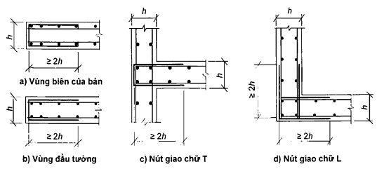

<strong>Hình 28 — Neo bằng các thanh uốn chữ U</strong>

### 10.4.6  Bố trí cốt thép cho các trụ trung gian nằm giữa các tường và các cột được tiến hành như đối với cột hoặc đối với tường phụ thuộc vào tỉ số giữa chiều dài và chiều rộng của tiết diện ngang của trụ.

### 10.4.7  Số lượng cốt thép thẳng đứng và nằm ngang trong tường cần được xác định theo các nội lực tác dụng trong tường. Khi đó, nên bố trí đều theo diện tích tường và có tăng cường ở các đầu tường và ở gần các lỗ mở.

### 10.4.8  Cần bố trí cốt thép dọc cho các bản phẳng theo hai phương ở mặt dưới và mặt trên của bản, còn trong các trường hợp cần thiết (theo tính toán) cần bố trí cả cốt thép ngang ở gần cột, tường và trên diện tích của bản.

### 10.4.9  Ở các vùng biên của các bản phẳng cần bố trí cốt thép ngang dạng chữ U ở mép bản để đảm bảo chịu được mô men xoắn ở mép bản và neo được các đầu cốt thép dọc.

### 10.4.10  Số lượng cốt thép dọc phía trên và phía dưới trong bản sàn tầng (sàn mái) cần được xác định theo các nội lực tác dụng. Khi đó, đối với các hệ kết cấu không đều đặn thì để đơn giản trong việc bố trí cốt thép, cho phép bố trí:

&nbsp;&nbsp;\- Cốt thép phía dưới như nhau trên toàn bộ diện tích kết cấu đang xét phù hợp với các giá trị nội lực lớn nhất trong nhịp của bản;

&nbsp;&nbsp;\- Cốt thép chính phía trên như cốt thép phía dưới;

&nbsp;&nbsp;\- Cốt thép phía trên bổ sung ở gần sát cột và tường (vách) để kết hợp với cốt thép chính cùng chịu phản lực gối tựa trong bản.

Đối với các hệ kết cấu đều đặn thì bố trí cốt thép dọc theo các dải phía trên cột và giữa các cột theo hai phương vuông góc nhau phù hợp với các nội lực tác dụng trong các dải này.

Cho phép bố trí một phần cốt thép của bản dưới dạng các khung cốt thép hàn liên tục trong các dải phía trên của bản theo hai phương (các dầm chìm), khi đó, các khung cốt thép này cần phải xuyên qua thân của cột.

Để tiết kiệm cốt thép, cần bố trí cốt thép phía dưới và phía trên (theo hàm lượng tối thiểu) cho toàn bộ diện tích của bản, còn trên các đoạn, nơi có nội lực tác dụng vượt quá nội lực chịu được bởi cốt thép này, thì bố trí cốt thép bổ sung để kết hợp với cốt thép vừa nêu cùng chịu nội lực tác dụng trong các đoạn này. Bố trí cốt thép cho bản móng được tiến hành theo cách tương tự.

### 10.4.11  Bố trí cốt thép cho các nút giao dầm với cột cần được tiến hành phù hợp với Hình 29. Khi đó, phải bố trí cốt thép ngang dưới dạng đai khép kín hoặc dạng chữ U trong vùng neo cốt thép chịu lực của dầm.

### 10.4.12  Trong các nút giao các dầm (Hình 30) cần bố trí cốt thép ngang bổ sung để chịu phản lực do dầm phụ gây ra. Trong dầm chính, cốt thép này cần được bố trí trên khoảng dài bằng (b + 2h), trong đó b và h là chiều rộng và chiều cao của dầm phụ, trong dầm phụ - trên đoạn dài bằng h/3. Cốt thép phải có dạng đai ôm được cốt thép dọc, để kết hợp với cốt thép yêu cầu theo tính toán tiết diện nghiêng hoặc tiết diện không gian.

### 10.4.13  Trong các kết cấu chịu uốn kiểu dầm khi chiều cao tiết diện lớn hơn 700 mm cần bố trí các thanh cốt thép dọc cấu tạo ở các mặt bên với khoảng cách giữa chúng theo chiều cao không lớn hơn 400 mm và diện tích tiết diện không nhỏ hơn 0,1 % diện tích tiết diện bê tông có kích thước theo chiều cao cấu kiện bằng khoảng cách giữa các thanh cốt thép này, theo chiều rộng - bằng một nửa chiều rộng sườn của cấu kiện, nhưng không lớn hơn 200 mm.

### 10.4.14  Trong các bản móng phẳng và trong các bản sàn tầng khi chiều cao tiết diện của chúng bằng 700 mm và lớn hơn cần bố trí cốt thép dọc cấu tạo dưới dạng lưới làm từ các thanh cốt thép có diện tích tiết diện không nhỏ hơn 0,05 % diện tích tiết diện bê tông, lấy bằng tích của khoảng cách giữa các lưới theo chiều cao và kích thước tương ứng trong mặt bằng của bản. Bước lưới thép cấu tạo theo chiều cao lấy không lớn hơn 1000 mm và không lớn hơn 1/3 chiều dày bản.

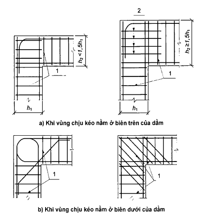

**CHÚ DẪN:**

1 - Cốt thép đai kín; 2 - cốt thép đai uốn chữ U.

<strong>Hình 29 — Các nút giao dầm với cột</strong>

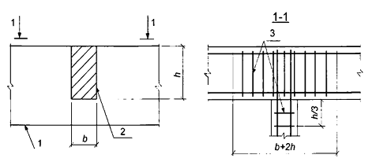

**CHÚ DẪN:**

1 - Dầm chính; 2 - Dầm phụ; 3 - Cốt thép đai bổ sung.

<strong>Hình 30 — Bố trí cốt thép gối tựa trong vùng hai dầm giao nhau</strong>

Trong các kết cấu này, khoảng cách thông thủy giữa các thanh thép chịu lực theo chiều rộng tiết diện được xác định theo kích thước cốt liệu bê tông, nhưng không nhỏ hơn 2,5d, trong đó d là đường kính cốt thép chịu lực.

Theo chu vi và ở các mép tự do của các bản này cần bố trí cốt thép ngang dưới dạng chữ U để đảm bảo sự tiếp nhận mô men xoắn ở mép bản và sự neo cần thiết các đoạn đầu của cốt thép dọc.

Đường kính cốt thép ngang trong các khung cốt thép buộc của các bản này lấy không nhỏ hơn 8 mm. Trong các khung cốt thép hàn, đường kính cốt thép ngang lấy không nhỏ hơn đường kính được đặt theo điều kiện hàn cốt thép dọc với đường kính lớn nhất.

Bố trí cốt thép ngang trong vùng chọc thủng trong các bản này được thực hiện theo 10.3.4.7, khi đó bước cốt thép ngang trong vùng chọc thủng theo phương vuông góc với các cạnh của đường bao tính toán không được lớn hơn 1/3$h_{0}$ và không lớn hơn 500 mm.

## 11  YÊU CẦU ĐỐI VỚI KHÔI PHỤC VÀ GIA CƯỜNG KẾT CẤU BÊ TÔNG CỐT THÉP

### 11.1  Yêu cầu chung

Việc khôi phục và gia cường kết cấu bê tông cốt thép cần được tiến hành dựa trên các kết quả khảo sát hiện trạng, tính toán kiểm tra, tính toán và cấu tạo các kết cấu cần gia cường.

### 11.2  Khảo sát hiện trạng kết cấu

Bằng khảo sát hiện trạng phụ thuộc vào nhiệm vụ cụ thể, phải xác định được tình trạng của kết cấu, các kích thước hình học của kết cấu, bố trí cốt thép trong kết cấu, cường độ bê tông, loại và cấp cường độ của cốt thép và trạng thái của nó, độ võng của kết cấu, chiều rộng các vết nứt, chiều dài và vị trí các vết nứt, kích thước và đặc điểm của các khuyết tật và hư hỏng, tải trọng, sơ đồ tĩnh học của kết cấu.

### 11.3  Tính toán kiểm tra kết cấu

### 11.3.1  Tính toán kiểm tra các kết cấu hiện hữu cần được tiến hành khi có sự thay đổi của tải trọng tác dụng lên chúng, của các điều kiện sử dụng và của các giải pháp mặt bằng - hình khối, cũng như khi phát hiện các khuyết tật và hư hỏng nghiêm trọng trong kết cấu.

Trên cơ sở tính toán kiểm tra xác định được khả năng sử dụng được của các kết cấu, sự cần thiết phải gia cường chúng, hoặc khả năng kết cấu không sử dụng được hoàn toàn.

### 11.3.2  Tính toán kiểm tra phải được tiến hành trên cơ sở các hồ sơ thiết kế, các số liệu về chế tạo và thì công kết cấu, cũng như các kết quả khảo sát hiện trạng.

Các sơ đồ tính toán khi tiến hành tính toán kiểm tra cần được lựa chọn có kể đến các kích thước hình học thực tế đã đo đạc được, các liên kết thực tế và tác dụng tương hỗ giữa các kết cấu và các cấu kiện kết cấu, các sai lệch đã được phát hiện khi lắp dựng.

### 11.3.3  Tính toán kiểm tra cần được tiến hành về khả năng chịu lực, biến dạng và khả năng chống nứt. Cho phép không cần tiến hành tính toán kiểm tra về khả năng sử dụng, nếu chuyển vị và chiều rộng các vết nứt trong các kết cấu hiện hữu dưới các tải trọng thực tế lớn nhất không vượt quá các giá trị cho phép, còn nội lực trong các tiết diện của các cấu kiện do các tải trọng có thể không vượt quá các giá trị nội lực do các tải trọng thực tế tác dụng.

### 11.3.4  Các giá trị tính toán của các đặc trưng của bê tông lấy theo Bảng 7 phụ thuộc vào cấp cường độ của bê tông quy định trong thiết kế, hoặc cấp cường độ quy ước của bê tông được xác định với các hệ số chuyển đổi mà đảm bảo được cường độ tương đương theo giá trị thực tế của cường độ trung bình của bê tông thu được từ thử nghiệm bê tông bằng các phương pháp không phá hủy hoặc từ các thử nghiệm mẫu lấy từ kết cấu.

### 11.3.5  Các giá trị tính toán của các đặc trưng của cốt thép lấy theo các bảng 13, 14 phụ thuộc vào loại cốt thép quy định trong thiết kế, hoặc cấp cường độ quy ước của cốt thép được xác định với các hệ số chuyển đổi mà đảm bảo được cường độ tương đương theo giá trị thực tế của cường độ trung bình của cốt thép thu được từ thử nghiệm các mẫu cốt thép lấy từ kết cấu.

Khi không có các số liệu thiết kế và không thể lấy mẫu thì cho phép lấy cấp cường độ của cốt thép dựa theo hình dạng cốt thép, còn các cường độ tính toán lấy giảm xuống 20 % so với các giá trị tương ứng trong các tiêu chuẩn hiện hành đối với cấp cường độ của cốt thép đó.

**CHÚ THÍCH:** Các loại cốt thép được sản xuất với các loại hình dạng bề mặt ban đầu để nhận dạng.

### 11.3.6  Khi tiến hành tính toán kiểm tra phải kể đến các khuyết tật và hư hỏng của kết cấu đã được phát hiện trong quá trình khảo sát hiện trạng: sự suy giảm cường độ, các hư hỏng và phá hoại cục bộ bê tông; đứt cốt thép, ăn mòn cốt thép, hư hỏng neo và bám dính của cốt thép với bê tông, sự hình thành và mở rộng các vết nứt nguy hiểm; sai lệch kết cấu so với thiết kế trong các cấu kiện riêng lẻ của kết cấu và trong các liên kết của chúng.

### 11.3.7  Các kết cấu không thỏa mãn các yêu cầu của tính toán kiểm tra về khả năng chịu lực và khả năng sử dụng cần phải được gia cường hoặc phải giảm tải trọng tác dụng lên chúng.

Đối với các kết cấu không thỏa mãn các yêu cầu của tính toán kiểm tra về khả năng sử dụng thì cho phép không cần phải gia cường hoặc không phải giảm tải trọng, nếu như độ võng thực tế vượt quá giá trị cho phép nhưng không cản trở việc sử dụng bình thường, cũng như nếu chiều rộng các vết nứt thực tế lớn hơn các giá trị cho phép nhưng không gây nguy cơ sụp đổ.

### 11.4  Gia cường kết cấu bê tông cốt thép

### 11.4.1  Việc gia cường kết cấu bê tông cốt thép được thực hiện bằng các cấu kiện thép, bê tông và bê tông cốt thép, cốt thép và các vật liệu polyme.

### 11.4.2  Khi gia cường kết cấu bê tông cốt thép cần kể đến khả năng chịu lực cả của các cấu kiện gia cường và của kết cấu cần gia cường. Để làm được điều này, cần phải đảm bảo được việc đưa các cấu kiện gia cường vào làm việc và sự làm việc đồng thời của chúng với kết cấu cần gia cường. Đối với các kết cấu bị hư hỏng nặng (khi tiết diện bê tông bị phá hoại từ 50 % trở lên hoặc diện tích tiết diện cốt thép chịu lực bị phá hoại) thì các cấu kiện gia cường cần được tính toán chịu toàn bộ tải trọng tác dụng, khi đó, khả năng chịu lực của kết cấu cần gia cường không kể vào tính toán.

Khi trám các vết nứt rộng hơn giá trị cho phép và các khuyết tật khác của bê tông thì cần đảm bảo được độ bền của các phần kết cấu phải khôi phục tương đương với độ bền của bê tông cũ.

### 11.4.3  Giá trị tính toán của các đặc trưng của vật liệu gia cường lấy theo các tiêu chuẩn hiện hành.

Giá trị tính toán của các đặc trưng vật liệu của kết cấu cần gia cường lấy theo các số liệu thiết kế có kể đến kết quả khảo sát theo các nguyên tắc đã chọn khi tính toán kiểm tra.

### 11.4.4  Tính toán kết cấu bê tông cốt thép cần gia cường phải được tiến hành theo các nguyên tắc chung về tính toán kết cấu bê tông cốt thép có kể đến trạng thái ứng suất - biến dạng của kết cấu đã thu được trước khi gia cường.

12  Tính toán kết cấu bê tông cốt thép chịu mỏi

### 12.1  Tính toán kết cấu bê tông cốt thép chịu mỏi được thực hiện khi có tác dụng của tải trọng lặp lại nhiều lần (đều đặn). Khi tính toán chịu mỏi cần kiểm tra cường độ đối với bê tông và cốt thép một cách riêng biệt.

Tính toán chịu mỏi được thực hiện trong giai đoạn đàn hồi có vết nứt. Sự làm việc của bê tông chịu kéo và cốt thép chịu nén không được kể đến, và cường độ chịu mỏi của chúng cũng không được kể vào tính toán.

### 12.2  Tính toán chịu mỏi phải được tiến hành theo các điều kiện mà trong đó các ứng suất lớn nhất trong bê tông chịu nén và cốt thép chịu kéo do tải trọng lặp lại không được vượt quá lần lượt cường độ chịu mỏi tính toán khi nén của bê tông và cường độ chịu mỏi tính toán khi kéo của cốt thép.

### 12.3  Cường độ chịu mỏi tính toán của bê tông khi nén và cốt thép khi kéo trong trường hợp tổng quát được xác định có kể đến sự không đối xứng của các chu kỳ chất tải, cấp cường độ chịu nén của bê tông và cấp cường độ chịu kéo (giới hạn chảy thực tế hoặc quy ước) của cốt thép ứng với số chu kỳ N = 2 x 10$^{6}$ với việc sử dụng nhánh xuống của đường cong thu được dựa trên các số liệu thực nghiệm.

Khi xác định cường độ chịu mỏi tính toán của bê tông khi nén thì cần kể đến loại bê tông (nặng hoặc nhẹ), cũng như trạng thái ẩm của bê tông. Khi xác định cường độ chịu mỏi tính toán của cốt thép khi kéo thì cần kể đến sự có mặt của các liên kết hàn.

Sự không đối xứng của các chu kỳ chất tải được đặc trưng bởi tỉ số giữa ứng suất nhỏ nhất và lớn nhất trong bê tông và cốt thép trong phạm vi chu kỳ thay đổi của tải trọng.

---

## 📑 DANH MỤC PHỤ LỤC KỸ THUẬT CHUYÊN ĐỀ (MODULAR ANNEXES)

Toàn bộ 13 Phụ lục kỹ thuật chuyên đề đã được module hóa thành các tệp độc lập nhằm tối ưu hóa tra cứu và thẩm tra thiết kế (ADR 0021 & ADR 0030):

| Ký hiệu | Tên Phụ Lục | Tính chất | Liên kết Tập tin |
| :---: | :--- | :---: | :---: |
| **Phụ lục A** | Quan hệ giữa các cường độ chịu nén của bê tông | Quy định | [📑 **Xem Phụ lục**](annexes/phu_luc_a_quan_he_giua_cac_cuong_do_chiu_nen_cua_be_ton.md#phu-luc-a) |
| **Phụ lục B** | Các biểu đồ biến dạng của bê tông | Tham khảo | [📑 **Xem Phụ lục**](annexes/phu_luc_b_cac_bieu_do_bien_dang_cua_be_tong.md#phu-luc-b) |
| **Phụ lục C** | Hướng dẫn áp dụng một số loại cốt thép | Tham khảo | [📑 **Xem Phụ lục**](annexes/phu_luc_c_huong_dan_ap_dung_mot_so_loai_cot_thep.md#phu-luc-c) |
| **Phụ lục D** | Tính toán chi tiết đặt sẵn | Tham khảo | [📑 **Xem Phụ lục**](annexes/phu_luc_d_tinh_toan_chi_tiet_dat_san.md#phu-luc-d) |
| **Phụ lục E** | Tính toán hệ kết cấu | Tham khảo | [📑 **Xem Phụ lục**](annexes/phu_luc_e_tinh_toan_he_ket_cau.md#phu-luc-e) |
| **Phụ lục F** | Tính toán cột tiết diện vành khuyên và tròn | Tham khảo | [📑 **Xem Phụ lục**](annexes/phu_luc_f_tinh_toan_cot_tiet_dien_vanh_khuyen_va_tron.md#phu-luc-f) |
| **Phụ lục G** | Tính toán chốt bê tông | Tham khảo | [📑 **Xem Phụ lục**](annexes/phu_luc_g_tinh_toan_chot_be_tong.md#phu-luc-g) |
| **Phụ lục H** | Tính toán công xôn ngắn | Tham khảo | [📑 **Xem Phụ lục**](annexes/phu_luc_h_tinh_toan_cong_xon_ngan.md#phu-luc-h) |
| **Phụ lục I** | Tính toán kết cấu bán lắp ghép | Tham khảo | [📑 **Xem Phụ lục**](annexes/phu_luc_i_tinh_toan_ket_cau_ban_lap_ghep.md#phu-luc-i) |
| **Phụ lục K** | Xét đến cốt thép hạn chế biến dạng ngang khi tính toán các cấu kiện chịu nén lệch tâm theo mô hình biến dạng phi tuyến | Tham khảo | [📑 **Xem Phụ lục**](annexes/phu_luc_k_xet_den_cot_thep_han_che_bien_dang_ngang_khi.md#phu-luc-k) |
| **Phụ lục L** | Hệ số xác định mô men kháng uốn đàn dẻo của một số tiết diện | Quy định | [📑 **Xem Phụ lục**](annexes/phu_luc_l_he_so_xac_dinh_mo_men_khang_uon_dan_deo_cua_m.md#phu-luc-l) |
| **Phụ lục M** | Độ võng và chuyển vị của kết cấu | Quy định | [📑 **Xem Phụ lục**](annexes/phu_luc_m_do_vong_va_chuyen_vi_cua_ket_cau.md#phu-luc-m) |
| **Phụ lục N** | Các nhóm chế độ làm việc của cần trục kiểu cầu và cần trục treo | Quy định | [📑 **Xem Phụ lục**](annexes/phu_luc_n_cac_nhom_che_do_lam_viec_cua_can_truc_kieu_ca.md#phu-luc-n) |

---

## 📊 HỆ THỐNG TRA CỨU BẢNG & SƠ ĐỒ KỸ THUẬT

- **Tra cứu 32 Bảng Số Liệu:** Tra cứu chi tiết dạng CSV/JSON tại [Thư mục Bảng Số Liệu](tables/README.md).
- **Tra cứu Sơ Đồ Hình Vẽ:** Tra cứu ảnh nét cao và đặc tả phân vùng tại [Danh Mục Sơ Đồ Khí Động](figures/figures_catalog.yaml).
