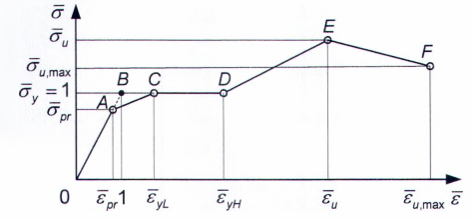

## PHỤ LỤC B (Tham khảo) — Vật liệu dùng cho kết cấu thép

### Bảng B.1 - Các tính chất vật lý của vật liệu dùng cho kết cấu thép

| Các tính chất vật lý | Giá trị |
| :--- | :--- |
| 1. Khối lượng riêng ρ, kg/ $m^{3}$: |  |
| a) Thép cán và khối đúc bằng thép | 7 850 |
| b) Khối đúc bằng gang | 7 200 |
| 2. Hệ số giãn dài do nhiệt α, $^{o}$C-1 | 0,12x10$^{-4}$ |
| 3. Mô đun đàn hồi E, MPa: |  |
| a) Thép cán và khối đúc bằng thép | 2,06x10$^{5}$ |
| b) Khối đúc bằng gang | 0,85x10$^{5}$ |
| c) Cáp thép: |  |
| &nbsp;&nbsp;\- Bó và tao cáp các sợi thép song song | 1,96x10$^{5}$ |
| &nbsp;&nbsp;\- Cáp xoắn và cáp kín chịu lực | 1,67x10$^{5}$ |
| &nbsp;&nbsp;\- Cáp bện đôi | 1,47x10$^{5}$ |
| &nbsp;&nbsp;\- Cáp bện đôi lõi thép | 1,27x10$^{5}$ |
| 4. Mô đun trượt của thép cán và khối đúc bằng thép G, MPa | 0,79x10$^{5}$ |
| 5. Hệ số nở ngang (hệ số Poát xông) | 0,3 |

> CHÚ THÍCH 2: Để có thông tin đầy đủ, xem các tiêu chuẩn sản phẩm đối với cáp thép.
>
> CHÚ THÍCH 2: Để có thông tin đầy đủ, xem các tiêu chuẩn sản phẩm đối với cáp thép.
>
> _CHÚ THÍCH:_

**CHÚ THÍCH 1:** ** Các giá trị mô đun đàn hồi nêu trong bảng là dành cho cáp có lực căng trước không nhỏ hơn 60 % lực kéo đứt cáp.

### Bảng B.2 - Giới hạn chảy và giới hạn bền kéo của thép kết cấu công dụng chung theo TCVN 9986-2:2013 (ISO 630-2:2011)

| Mác | Chất lượng | Giới hạn chảy nhỏ nhất 1) , MPa, cho chiều dày danh nghĩa, mm — ≤ 16 | Giới hạn chảy nhỏ nhất 1) , MPa, cho chiều dày danh nghĩa, mm — > 16; ≤ 40 | Giới hạn chảy nhỏ nhất 1) , MPa, cho chiều dày danh nghĩa, mm — > 40; ≤ 63 | Giới hạn chảy nhỏ nhất 1) , MPa, cho chiều dày danh nghĩa, mm — > 63; ≤ 80 | Giới hạn chảy nhỏ nhất 1) , MPa, cho chiều dày danh nghĩa, mm — > 80; ≤100 | Giới hạn bền kéo, MPa, cho chiều dày danh nghĩa, mm — ≥ 3; ≤ 100 |
| :--- | :--- | :---: | :---: | :---: | :---: | :---: | :--- |
| S235 | B, C, D | 235 | 225 | 215 | 215 | 215 | 360÷510 |
| S275 | B, C, D | 275 | 265 | 255 | 245 | 235 | 410÷560 |
| S355 | B, C, D | 355 | 345 | 335 | 325 | 315 | 470÷630 |
| S450 2) | C | 450 | 430 | 410 | 390 | 380 | 550÷720 |
| **1) Đối với tấm và tấm rộng bản có chiều rộng không nhỏ hơn 600 mm, áp dụng hướng ngang so với hướng cán. Đối với tất cả các sản phẩm khác, áp dụng các giá trị đối với hướng song song so với hướng cán. 2) Chỉ áp dụng cho sản phẩm dài.** |  |  |  |  |  |  |  |

> **CHÚ THÍCH:** Để có thêm thông tin đầy đủ, xem TCVN 9986-2:2013 (ISO 630-2:2011).

### Bảng B.3 - Độ giãn dài tương đối của thép kết cấu công dụng chung theo TCVN 9986-2:2013 (ISO 630-2:2011)

| Mác | Chất lượng | Vị trí của mẫu thử 1) | Độ giãn dài tương đối nhỏ nhất, %, cho chiều dày danh nghĩa, mm — > 3; ≤ 40 | Độ giãn dài tương đối nhỏ nhất, %, cho chiều dày danh nghĩa, mm — > 40; ≤ 63 | Độ giãn dài tương đối nhỏ nhất, %, cho chiều dày danh nghĩa, mm — > 63; ≤ 100 |
| :--- | :--- | :--- | :---: | :---: | :---: |
| S235 | B, C, D | Dọc | 26 | 25 | 24 |
| S235 | B, C, D | Ngang | 24 | 23 | 22 |
| S275 | B, C, D | Dọc | 23 | 22 | 21 |
| S275 | B, C, D | Ngang | 21 | 20 | 19 |
| S355 | B, C, D | Dọc | 22 | 21 | 20 |
| S355 | B, C, D | Ngang | 20 | 19 | 18 |
| S450 2) | C | Dọc | 17 | 17 | 17 |
| **1) Đối với tấm và tấm rộng bản có chiều rộng không nhỏ hơn 600 mm, áp dụng hướng ngang so với hướng cán. Đối với tất cả các sản phẩm khác, áp dụng các giá trị đối với hướng song song so với hướng cán. 2) Chỉ áp dụng cho sản phẩm dài.** |  |  |  |  |  |

> **CHÚ THÍCH:** Để có thêm thông tin đầy đủ, xem TCVN 9986-2:2013 (ISO 630-2:2011).

### Bảng B.4 - Độ dai va đập của thép kết cấu công dụng chung theo TCVN 9986-2:2013 (ISO 630-2:2011)

| Mác | Chất lượng | Nhiệt độ, $^{o}$C | Năng lượng va đập nhỏ nhất, J, cho chiều dày danh nghĩa, mm 1) , 2) — ≤ 150 |
| :--- | :--- | :---: | :---: |
| S235 | B | 20 | 27 |
| S235 | C | 0 | 27 |
| S235 | D | -20 | 27 |
| S275 | B | 20 | 27 |
| S275 | C | 0 | 27 |
| S275 | D | -20 | 27 |
| S355 | B | 20 | 27 |
| S355 | C | 0 | 27 |
| S355 | D | -20 | 27 |
| S450 3) | C | 0 | 27 |
| **1) Đối với chiều dày danh nghĩa nhỏ hơn 12 mm, xem TCVN 9986-2:2013 (ISO 630-2:2011). 2) Đối với thép hình có chiều dày danh nghĩa lớn hơn 100 mm, các giá trị này phải được thỏa thuận. 3) Chỉ áp dụng cho sản phẩm dài.** |  |  |  |

> **CHÚ THÍCH:** Để có thông tin đầy đủ, xem TCVN 9986-2:2013 (ISO 630-2:2011).

### Bảng B.5 - Tính chất cơ học của thép kết cấu thường hóa ở nhiệt độ phòng theo TCVN 9986-3:2014 (ISO 630-3:2012)

| Mác | Chất lượng | Giới hạn chåy trên nhỏ nhất, MPa, cho chiều dày danh nghĩa, mm — ≤ 16 | Giới hạn chåy trên nhỏ nhất, MPa, cho chiều dày danh nghĩa, mm — > 16; ≤ 40 | Giới hạn chåy trên nhỏ nhất, MPa, cho chiều dày danh nghĩa, mm — > 40; ≤ 63 | Giới hạn chåy trên nhỏ nhất, MPa, cho chiều dày danh nghĩa, mm — > 63; ≤ 80 | Giới hạn chåy trên nhỏ nhất, MPa, cho chiều dày danh nghĩa, mm — > 80; ≤ 100 | Giới hạn bền kéo, MPa, cho chiều dày danh nghĩa, mm — ≤ 100 | Độ giãn dài tương đối nhỏ nhất, %, cho chiều dày danh nghĩa, mm — ≤ 16 | Độ giãn dài tương đối nhỏ nhất, %, cho chiều dày danh nghĩa, mm — > 16; ≤ 40 | Độ giãn dài tương đối nhỏ nhất, %, cho chiều dày danh nghĩa, mm — > 40; ≤ 80 |
| :--- | :--- | :---: | :---: | :---: | :---: | :---: | :--- | :---: | :---: | :---: |
| S275N | D, E | 275 | 265 | 255 | 245 | 235 | 370÷510 | 24 | 24 | 23 |
| S355N | D, E | 355 | 345 | 335 | 325 | 315 | 470÷630 | 22 | 22 | 22 |
| S420N | D, E | 420 | 400 | 390 | 370 | 360 | 520÷680 | 19 | 19 | 19 |
| S460N | D, E | 460 | 440 | 430 | 410 | 400 | 540÷720 | 17 | 17 | 17 |

> **CHÚ THÍCH:** Để có thêm thông tin đầy đủ, xem TCVN 9986-3:2014 (ISO 630-3:2012).

### Bảng B.6 - Tính chất cơ học của thép tấm mỏng cán nóng chất lượng kết cấu theo TCVN 6522:2018 (ISO 4995:2014)

| Mác | Giới hạn chảy nhỏ nhất, MPa | Giới hạn bền kéo, MPa | Độ giãn dài tương đối nhỏ nhất, %, cho chiều dày danh nghĩa, mm — < 3 | Độ giãn dài tương đối nhỏ nhất, %, cho chiều dày danh nghĩa, mm — ≥ 3; ≤ 6 |
| :--- | :---: | :---: | :---: | :---: |
| HR235 | 235 | 330 | 20 | 23 |
| HR275 | 275 | 370 | 17 | 20 |
| HR355 | 355 | 450 | 15 | 19 |

> **CHÚ THÍCH:** Để có thêm thông tin đầy đủ, xem TCVN 6522:2018 (ISO 4995:2014).

### Bảng B.7 - Tính chất cơ học của thép tấm mỏng cán nóng chất lượng kết cấu có giới hạn chảy cao theo TCVN 6523:2018 (ISO 4996:2014)

| Mác | Giới hạn chảy nhỏ nhất, MPa | Giới hạn bền kéo, MPa | Độ giãn dài tương đối nhỏ nhất, %, cho chiều dày danh nghĩa, mm — < 3 | Độ giãn dài tương đối nhỏ nhất, %, cho chiều dày danh nghĩa, mm — ≥ 3; ≤ 6 |
| :--- | :---: | :---: | :---: | :---: |
| HS355 | 355 | 430 | 18 | 22 |
| HS390 | 390 | 460 | 16 | 20 |
| HS420 | 420 | 490 | 14 | 19 |
| HS460 | 460 | 530 | 12 | 17 |
| HS490 | 490 | 590 | 10 | 15 |

> **CHÚ THÍCH:** Để có thêm thông tin đầy đủ, xem TCVN 6523:2018 (ISO 4996:2014).

### Bảng B.8 - Tính chất cơ học của thép hình cho kết cấu công dụng chung theo TCVN 7571:2019 (các phần 1, 2, 11, 15) và TCVN 7571-16:2017

| Ký hiệu loại thép hình | Giới hạn chảy nhỏ nhất, MPa, cho chiều dày danh nghĩa, mm — ≤ 16 | Giới hạn chảy nhỏ nhất, MPa, cho chiều dày danh nghĩa, mm — > 16; ≤ 40 | Giới hạn bền kéo, MPa | Độ giãn dài tương đối nhỏ nhất, %, cho chiều dày danh nghĩa, mm — ≤ 5 | Độ giãn dài tương đối nhỏ nhất, %, cho chiều dày danh nghĩa, mm — > 5; ≤ 16 | Độ giãn dài tương đối nhỏ nhất, %, cho chiều dày danh nghĩa, mm — > 16; ≤ 50 |
| :--- | :---: | :---: | :--- | :---: | :---: | :---: |
| AGS 400, USGS 400 | 245 | 235 | 400÷510 | 21 | 17 | 21 |
| ISGS 400, HSGS 400 | 245 | 235 | 400÷510 | 21 | 17 | 21 |
| AGS 490, USGS 490 | 285 | 275 | 490÷610 | 19 | 15 | 19 |
| ISGS 490, HSGS 490 | 285 | 275 | 490÷610 | 19 | 15 | 19 |
| AGS 540, USGS 540 | 400 | 390 | ≥ 540 | 16 | 13 | 17 |
| ISGS 540, HSGS 540 | 400 | 390 | ≥ 540 | 16 | 13 | 17 |

> **CHÚ THÍCH:** Các ký hiệu “A”, “US”, “IS’, “HS” biểu thị lần lượt là thép góc, chữ U (hoặc C), chữ I và chữ H. Ký hiệu “GS” biểu thị “kết cấu công dụng chung”.

### Bảng B.9 - Tính chất cơ học của thép hình cho kết cấu hàn theo TCVN 7571:2019 (các phần 1, 2, 11, 15) và TCVN 7571-16:2017

| Ký hiệu loại thép hình | Giới hạn chảy nhỏ nhất, MPa, cho chiều dày danh nghĩa, mm — ≤ 16 | Giới hạn chảy nhỏ nhất, MPa, cho chiều dày danh nghĩa, mm — > 16; ≤ 40 | Giới hạn bền kéo, MPa | Độ giãn dài tương đối nhỏ nhất, %, cho chiều dày danh nghĩa, mm — ≤ 5 | Độ giãn dài tương đối nhỏ nhất, %, cho chiều dày danh nghĩa, mm — > 5; ≤ 16 | Độ giãn dài tương đối nhỏ nhất, %, cho chiều dày danh nghĩa, mm — > 16; ≤ 50 |
| :--- | :---: | :---: | :--- | :--- | :--- | :--- |
| AWS 400A, AWS 400B, AWS 400C | 245 | 235 | 400÷510 | 23 | 18 | 22 |
| USWS 400A, USWS 400B, USWS 400C | 245 | 235 | 400÷510 | 23 | 18 | 22 |
| ISWS 400A, ISWS 400B, ISWS 400C | 245 | 235 | 400÷510 | 23 | 18 | 22 |
| HSWS 400A, HSWS 400B, HSWS 400C | 245 | 235 | 400÷510 | 23 | 18 | 22 |
| AWS 490A, AWS 490B, AWS 490C | 325 | 315 | 490÷610 | 22 | 17 | 21 |
| USWS 490A, USWS 490B, USWS 490C | 325 | 315 | 490÷610 | 22 | 17 | 21 |
| ISWS 490A, ISWS 490B, ISWS 490C | 325 | 315 | 490÷610 | 22 | 17 | 21 |
| HSWS 490A, HSWS 490B, HSWS 490C | 325 | 315 | 490÷610 | 22 | 17 | 21 |
| AWS 520B, AWS 520C | 365 | 355 | 520÷640 | 19 | 15 | 19 |
| USWS 520B, USWS 520C | 365 | 355 | 520÷640 | 19 | 15 | 19 |
| ISWS 520B, ISWS 520C | 365 | 355 | 520÷640 | 19 | 15 | 19 |
| HSWS 520B, HSWS 520C | 365 | 355 | 520÷640 | 19 | 15 | 19 |
| AWS 570, USWS 570 | 460 | 450 | 570÷720 | 19 1) | 26 2) | 20 3) |
| ISWS 570, HSWS 570 | 460 | 450 | 570÷720 | 19 1) | 26 2) | 20 3) |
| **1) Cho chiều dày ≤ 16 mm; 2) Cho chiều dày > 16 mm và ≤ 20 mm; 3) Cho chiều dày > 20 mm.** |  |  |  |  |  |  |

> **CHÚ THÍCH:** Các ký hiệu “A”, “US”, “IS’, “HS” biểu thị lần lượt là thép góc, chữ U (hoặc C), chữ I và chữ H. Ký hiệu “WS” biểu thị “kết cấu hàn”.

### Bảng B.10 - Tính chất cơ học của thép hình cho kết cấu xây dựng theo TCVN 7571:2019 (các phần 1, 2, 11, 15) và TCVN 7571-16:2017

| Ký hiệu loại thép hình | Giới hạn chảy nhỏ nhất, MPa — ≤ 16 | Giới hạn chảy nhỏ nhất, MPa — > 16; ≤ 40 | Giới hạn bền kéo, MPa | Độ giãn dài tương đối nhỏ nhất, % — < 6 | Độ giãn dài tương đối nhỏ nhất, % — ≥ 6; ≤ 16 | Độ giãn dài tương đối nhỏ nhất, % — > 16; ≤ 50 |
| :--- | :--- | :--- | :--- | :---: | :---: | :--- |
| ABS 400A, USBS 400A, ISBS 400A, HSBS 400A | 235 1) | 235 1) | 400÷510 | - | 17 | 21 |
| ABS 400B, USBS 400B, ISBS 400B, HSBS 400B | 235 2) | 235÷355 3) | 400÷510 | - | 18 | 22 5) |
| ABS 400C, USBS 400C, ISBS 400C, HSBS 400C | - | 235÷355 4) | 400÷510 | - | 18 | 22 5) |
| **1) Cho chiều dày > 6 mm và ≤ 40 mm; 2) Cho chiều dày ≥ 6 mm và < 12 mm; 3) Cho chiều dày ≥ 12 mm và ≤ 40 mm; 4) Cho chiều dày ≥ 16 mm và ≤ 40 mm; 5) Cho chiều dày > 16 mm và ≤ 40 mm.** |  |  |  |  |  |  |

> **CHÚ THÍCH:** Các ký hiệu “A”, “US”, “IS’, “HS” biểu thị lần lượt là thép góc, chữ U (hoặc C), chữ I và chữ H. Ký hiệu “BS” biểu thị “kết cấu xây dựng”.

### Bảng B.11 - Tính chất cơ học của thép ống, thép hộp làm bằng thép không hợp kim theo TCVN 11228-1:2015 (ISO 12633-1:2011)

| Ký hiệu loại thép | Giới hạn chảy nhỏ nhất, MPa, cho chiều dày danh nghĩa, mm — ≤ 16 | Giới hạn chảy nhỏ nhất, MPa, cho chiều dày danh nghĩa, mm — > 16; ≤ 40 | Giới hạn bền kéo, MPa, cho chiều dày danh nghĩa, mm — < 3 | Giới hạn bền kéo, MPa, cho chiều dày danh nghĩa, mm — ≥ 3; ≤ 40 | Độ giãn dài tương đối nhỏ nhất, % — dọc — cho chiều dày danh nghĩa, mm — ≤ 40 | Độ giãn dài tương đối nhỏ nhất, % — ngang — cho chiều dày danh nghĩa, mm — ≤ 40 |
| :--- | :---: | :---: | :--- | :--- | :---: | :---: |
| S235JRH | 235 | 225 | 360÷510 | 340÷470 | 26 | 24 |
| S275J0H | 275 | 265 | 430÷580 | 410÷560 | 22 | 20 |
| S275J2H | 275 | 265 | 430÷580 | 410÷560 | 22 | 20 |
| S355J0H | 355 | 345 | 510÷680 | 490÷630 | 22 | 20 |
| S355J2H | 355 | 345 | 510÷680 | 490÷630 | 22 | 20 |

> **CHÚ THÍCH:** Để có thêm thông tin đầy đủ, xem TCVN 11228-1:2015 (ISO 12633-1:2011).

### Bảng B.12 - Tính chất cơ học của thép ống, thép hộp làm bằng thép hạt mịn theo TCVN 11228-1:2015 (ISO 12633-1:2011)

| Ký hiệu loại thép | Giới hạn chảy nhỏ nhất, MPa, cho chiều dày danh nghĩa, mm — ≤ 16 | Giới hạn chảy nhỏ nhất, MPa, cho chiều dày danh nghĩa, mm — > 16; ≤ 40 | Giới hạn bền kéo, MPa | Độ giãn dài tương đối nhỏ nhất, %, — dọc — cho chiều dày danh nghĩa, mm — ≤ 65 | Độ giãn dài tương đối nhỏ nhất, %, — ngang — cho chiều dày danh nghĩa, mm — ≤ 65 |
| :--- | :---: | :---: | :--- | :---: | :---: |
| S275NH | 275 | 265 | 370÷540 | 24 | 22 |
| S275NLH | 275 | 265 | 370÷540 | 24 | 22 |
| S355NH | 355 | 345 | 470÷630 | 22 | 20 |
| S355NLH | 355 | 345 | 470÷630 | 22 | 20 |
| S460NH | 460 | 440 | 470÷630 | 17 | 15 |
| S460NLH | 460 | 440 | 470÷630 | 17 | 15 |

> **CHÚ THÍCH:** Để có thêm thông tin đầy đủ, xem TCVN 11228-1:2015 (ISO 12633-1:2011).

### Bảng B.13 - Cường độ tính toán của thép cán khi ép mặt tì đầu, ép cục bộ trong ổ trục, ép theo đường kính con lăn

| Giới hạn bền kéo, fu | Cường độ tính toán — Chịu ép mặt tì đầu (có gia công phẳng mặt), $f_{c}$ | Cường độ tính toán — Chịu ép cục bộ trong ổ trục (giữa các thớt cong với trục hình trụ) khi tiếp xúc chặt, $f_{cc}$ | Cường độ tính toán — Chịu ép theo đường kính con lăn (trong các kết cấu có độ di động hạn chế), $f_{cd}$ |
| :---: | :--- | :--- | :--- |
| 360 365 370 380 390 400 430 440 450 460 470 480 490 500 510 520 530 540 570 590 635 | 343/327 348/332 352/336 362/346 371/355 381/364 409/391 419/400 429/409 438/418 448/427 457/436 467/446 476/455 486/464 495/473 505/482 514/491 543/518 562/536 605/577 | 171/164 174/166 176/168 181/173 186/177 191/182 205/196 210/200 214/205 219/209 224/214 229/218 233/223 238/227 243/232 248/236 252/241 257/246 271/259 281/268 302/289 | 9/9 9/9 9/9 9/9 10/10 10/10 10/10 11/11 11/11 11/11 11/11 12/12 12/12 12/12 12/12 12/12 12/12 13/13 14/14 14/14 15/15 |

> **CHÚ THÍCH:** Giá trị các cường độ tính toán trong Bảng B.13 (đã được làm tròn) được tính theo các công thức nêu trong Bảng 2 với $\gamma_{m}$ = 1,05 (ở tử số) và với $\gamma_{m}$ = 1,1 (ở mẫu số).

$$\begin{aligned}
&\bar{\sigma} \\
&\bar{\sigma}_u \\
&\bar{\sigma}_{u,\max} \\
&\bar{\sigma}_y = 1 \\
&\bar{\sigma}_{pr}
\end{aligned}$$
<!-- formula_id: "F_TCVN_5575_2024_RID659" -->

**CHÚ THÍCH:** 

| $\bar{\varepsilon} = \frac{\varepsilon E}{f_y}$ là biến dạng tương đối | $\ddot{\sigma} = c_f f_r$ là ứng suất pháp tương đối |
| :--- | :--- |
| $\bar{\varepsilon}_{\text{pt}}$ là biến dạng đàn hồi tương đối | $\bar{\sigma}_{p}$ là ứng suất đàn hồi tương đối |
| $\bar{\varepsilon}_{yR}$ là biến dạng chảy dưới tương đối |  |
| $\overline{\varepsilon}_{yH}$ là biến dạng chảy trên tương đối | $\overline{\sigma}_y$ là ứng suất chảy tương đối |
| $\overline{\varepsilon}_u$ là biến dạng bền (kéo, nén) tương đối | $\bar{\sigma}_v$ là ứng suất bền (kéo, nén) tương đối |
| $\mathcal{E}$ là biến dạng bền (kéo, nén) tương đối | $\bar{\sigma}_{u, p, 8k}$ là ứng suất bền (kéo, nén) tương đối |

<strong>Hình B.1 — Biểu đồ tính toán tổng quát sự làm việc chịu kéo và chịu nén của thép xây dựng</strong>
