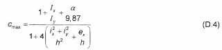

## PHỤ LỤC D (Quy định) — Các hệ số để tính toán ổn định các cấu kiện chịu nén đúng tâm và nén lệch tâm

### D.1  Hệ số ổn định khi nén đúng tâm φ

### Bảng D.1 - Hệ số ổn định khi nén đúng tâm φ

| Độ mảnh quy ước $` delimiters. So, the final string is `$ | Giá trị φ đối với loại tiết diện — a | Giá trị φ đối với loại tiết diện — b | Giá trị φ đối với loại tiết diện — c | Độ mảnh quy ước $` delimiters. So, the final string is `$ | Giá trị φ đối với loại tiết diện — a | Giá trị φ đối với loại tiết diện — b | Giá trị φ đối với loại tiết diện — c |
| :---: | :---: | :---: | :---: | :---: | :---: | :---: | :---: |
| 0,4 0,6 0,8 1,0 1,2 1,4 1,6 1,8 2,0 2,2 2,4 2,6 2,8 3,0 3,2 3,4 3,6 3,8 4,0 4,2 4,4 | 1,000 0,994 0,981 0,968 0,953 0,938 0,920 0,900 0,877 0,851 0,821 0,786 0,747 0,704 0,660 0,616 0,572 0,526 0,475 0,431 0,393 | 1,000 0,986 0,967 0,948 0,927 0,905 0,881 0,855 0,826 0,794 0,760 0,723 0,683 0,643 0,602 0,562 0,524 0,487 0,453 0,422 0,392 | 0,984 0,956 0,929 0,901 0,872 0,842 0,811 0,778 0,744 0,709 0,672 0,635 0,598 0,562 0,527 0,493 0,460 0,430 0,402 0,375 0,351 | 4,6 4,8 5,0 5,2 5,4 5,6 | 0,359 0,330 0,304 0,281 0,261 0,242 | 0,359 0,330 0,304 0,281 0,261 0,242 | 0,329 0,308 0,289 0,271 0,255 0,241 |
| 0,4 0,6 0,8 1,0 1,2 1,4 1,6 1,8 2,0 2,2 2,4 2,6 2,8 3,0 3,2 3,4 3,6 3,8 4,0 4,2 4,4 | 1,000 0,994 0,981 0,968 0,953 0,938 0,920 0,900 0,877 0,851 0,821 0,786 0,747 0,704 0,660 0,616 0,572 0,526 0,475 0,431 0,393 | 1,000 0,986 0,967 0,948 0,927 0,905 0,881 0,855 0,826 0,794 0,760 0,723 0,683 0,643 0,602 0,562 0,524 0,487 0,453 0,422 0,392 | 0,984 0,956 0,929 0,901 0,872 0,842 0,811 0,778 0,744 0,709 0,672 0,635 0,598 0,562 0,527 0,493 0,460 0,430 0,402 0,375 0,351 | 5,8 6,0 6,2 6,4 6,6 6,8 7,0 7,2 7,4 7,6 7,8 8,0 8,5 9,0 9,5 10,0 | 0,226 0,211 0,198 0,186 0,174 0,164 0,155 0,147 0,139 0,132 0,125 0,119 0,105 0,094 0,084 0,076 | 0,226 0,211 0,198 0,186 0,174 0,164 0,155 0,147 0,139 0,132 0,125 0,119 0,105 0,094 0,084 0,076 | 0,226 0,211 0,198 0,186 0,174 0,164 0,155 0,147 0,139 0,132 0,125 0,119 0,105 0,094 0,084 0,076 |

> **CHÚ THÍCH:** Công thức tính φ xem trong 7.1.2.1.

### D.2  Hệ số ảnh hưởng của hình dạng tiết diện

### Bảng D.2 - Hệ số ảnh hưởng của hình dạng tiết diện η

| Loại tiết diện | Sơ đồ tiết diện và độ lệch tâm | $` delimiters as requested.$ | Giá trị η khi — 0 ≤ $` as requested.$ ≤ 5 — 0,1 ≤ m ≤ 5 | Giá trị η khi — 0 ≤ $` as requested.$ ≤ 5 — 5 < m ≤ 20 | Giá trị η khi — $` as requested.$ > 5 — 0,1 ≤ m ≤ 5 | Giá trị η khi — $` as requested.$ > 5 — 0,1 ≤ m ≤ 5 | Giá trị η khi — $` as requested.$ > 5 — 5 < m ≤ 20 |
| :---: | :--- | :--- | :--- | :--- | :--- | :--- | :--- |
| 1 | $\phi$ | - | 1,0 | 1,0 | 1,0 | 1,0 | 1,0 |
| 2 | $\frac{t}{h} = 0,25$ | - | 0,85 | 0,85 | 0,85 | 0,85 | 0,85 |
| 3 | $\Phi$ | - | 0,75 + 0,02$` as requested.$ | 0,75 + 0,02$` as requested.$ | 0,85 | 0,85 | 0,85 |
| 4 | $\frac{t}{h} = 0,25$ | - | (1,35 - 0,05m) - 0,01(5 - m)$` as requested.$ | 1,10 | 1,10 | 1,10 | 1,10 |
| 5 | $\frac{s_1}{b} \le 0,15$ | 0,25 | (1, 45 - 0,05m) - 0,01(5 - m)$` as requested.$ | 1,20 | 1,20 | 1,20 | 1,20 |
| 5 | $\frac{s_1}{b} \le 0,15$ | 0,50 | (1,75-0,1m)-0,02(5-m)$` as requested.$ | 1,25 | 1,25 | 1,25 | 1,25 |
| 5 | $\frac{s_1}{b} \le 0,15$ | ≥ 1,00 | (1,90 - 0,1m) - 0,02 (6 - m)$` as requested.$ | 1,4 - 0,02$` as requested.$ | 1,30 | 1,30 | 1,30 |
| 6 | $\frac{a_f}{h} \leq 0,15$ | - | $\eta_5 \left[ 1 - 0,3(5 - m) \frac{a_1}{h} \right]$ | $\eta_{5}$ | $\eta_{5}$ | $\eta_{5}$ | $\eta_{5}$ |
| 7 | $\frac{a_1}{h} \le 0,15$ | - | $\eta_5 \left( 1 - 0,8 \frac{a_1}{h} \right)$ | $\eta_5 \left( 1 - 0,8 \frac{a_1}{h} \right)$ | $\eta_{5}\left(1 - 0,8 \frac{a_1}{h}\right)$ | $\eta_{5}\left(1 - 0,8 \frac{a_1}{h}\right)$ | $\eta_{5}\left(1 - 0,8 \frac{a_1}{h}\right)$ |
| 8 | $0{,}5A_w \quad A_f$ | 0,25 | (0,75 + 0,05m) + 0,01(5 - m)$` as requested.$ | 1,0 | 1,0 | 1,0 | 1,0 |
| 8 | $0{,}5A_w \quad A_f$ | 0,50 | (0,5 + 0,1m) + 0,02 (5 - m)$` as requested.$ | 1,0 | 1,0 | 1,0 | 1,0 |
| 8 | $0{,}5A_w \quad A_f$ | ≥ 1,00 | (0,25 + 0,15m) + 0,03(5 - m)$` as requested.$ | 1,0 | 1,0 | 1,0 | 1,0 |
| 9 | $0,5A_w \qquad A_f$ | 0,50 | (1,25 - 0,05m) - 0,01(5 - m)$` as requested.$ | 1,0 | 1,0 | 1,0 | 1,0 |
| 9 | $0,5A_w \qquad A_f$ | ≥ 1,00 | (1,5 - 0,1m) - 0,02 (5 - m)$` as requested.$ | 1,0 | 1,0 | 1,0 | 1,0 |
| 10 | $A_f, \quad A_w, \quad 0{,}5A_f, \quad 0{,}5A_w, \quad 0{,}25A_f, \quad e$ | 0,5 | 1,4 | 1,4 | 1,4 | 1,4 | 1,4 |
| 10 | $A_f, \quad A_w, \quad 0{,}5A_f, \quad 0{,}5A_w, \quad 0{,}25A_f, \quad e$ | 1,0 | 1,6 - 0,01(5 - m)$` as requested.$ | 1,6 | 1,35 + 0,05m | 1,6 | 1,6 |
| 10 | $A_f, \quad A_w, \quad 0{,}5A_f, \quad 0{,}5A_w, \quad 0{,}25A_f, \quad e$ | 2,0 | 1,8 - 0,02(5 - m)$` as requested.$ | 1,8 | 1,3 + 0,1m | 1,8 | 1,8 |
| 11 | $A_f, \quad 0,5A_f, \quad 0,5A_w$ | 0,5 | 1,45 + 0,04m | 1,65 | 1,45 + 0,04m | 1,65 | 1,65 |
| 11 | $A_f, \quad 0,5A_f, \quad 0,5A_w$ | 1,0 | 1,8 + 0,12m | 2,4 | 1,8 + 0,12m | 2,4 | 2,4 |
| 11 | $A_f, \quad 0,5A_f, \quad 0,5A_w$ | 1,5 | 2,0 + 0,25m + 0,1$` as requested.$ | - | - | - | - |
| 11 | $A_f, \quad 0,5A_f, \quad 0,5A_w$ | 2,0 | 3,0 + 0,25m + 0,1$` as requested.$ | - | - | - | - |

> CHÚ THÍCH 2: Đối với các loại tiết diện từ 6 đến 7 thì các giá trị $\eta_{5}$ lấy bằng các giá trị η của loại tiết diện 5 với chính các giá trị $A_{f}$ /$A_{w}$ của tiết diện loại 5 này.
>
> CHÚ THÍCH 2: Đối với các loại tiết diện từ 6 đến 7 thì các giá trị $\eta_{5}$ lấy bằng các giá trị η của loại tiết diện 5 với chính các giá trị $A_{f}$ /$A_{w}$ của tiết diện loại 5 này.
>
> CHÚ THÍCH 2: Đối với các loại tiết diện từ 6 đến 7 thì các giá trị $\eta_{5}$ lấy bằng các giá trị η của loại tiết diện 5 với chính các giá trị $A_{f}$ /$A_{w}$ của tiết diện loại 5 này.
>
> CHÚ THÍCH 2: Đối với các loại tiết diện từ 6 đến 7 thì các giá trị $\eta_{5}$ lấy bằng các giá trị η của loại tiết diện 5 với chính các giá trị $A_{f}$ /$A_{w}$ của tiết diện loại 5 này.
>
> CHÚ THÍCH 2: Đối với các loại tiết diện từ 6 đến 7 thì các giá trị $\eta_{5}$ lấy bằng các giá trị η của loại tiết diện 5 với chính các giá trị $A_{f}$ /$A_{w}$ của tiết diện loại 5 này.
>
> CHÚ THÍCH 2: Đối với các loại tiết diện từ 6 đến 7 thì các giá trị $\eta_{5}$ lấy bằng các giá trị η của loại tiết diện 5 với chính các giá trị $A_{f}$ /$A_{w}$ của tiết diện loại 5 này.
>
> CHÚ THÍCH 2: Đối với các loại tiết diện từ 6 đến 7 thì các giá trị $\eta_{5}$ lấy bằng các giá trị η của loại tiết diện 5 với chính các giá trị $A_{f}$ /$A_{w}$ của tiết diện loại 5 này.
>
> CHÚ THÍCH 2: Đối với các loại tiết diện từ 6 đến 7 thì các giá trị $\eta_{5}$ lấy bằng các giá trị η của loại tiết diện 5 với chính các giá trị $A_{f}$ /$A_{w}$ của tiết diện loại 5 này.
>
> _CHÚ THÍCH:_

**CHÚ THÍCH 1:** ** Đối với các loại tiết diện từ 5 đến 7 thì khi tính tỉ số $A_{f}$ /$A_{w}$ không kể đến phần cánh thẳng đứng;

### D.3  Hệ số ổn định khi nén lệch tâm $\varphi_{e}$ của cấu kiện tiết diện bụng đặc trong mặt phẳng tác dụng của mô men uốn trùng với mặt phẳng đối xứng

### Bảng D.3 - Hệ số ổn định khi nén lệch tâm $\varphi_{e}$ của cấu kiện tiết diện bụng đặc trong mặt phẳng tác dụng của mô men uốn trùng với mặt phẳng đối xứng

| Độ mảnh quy ước, $` as requested.$ | Giá trị $\varphi_{e}$ khi độ lệch tâm tương đối quy đổi $m_{ef}$ bằng — 0,1 | Giá trị $\varphi_{e}$ khi độ lệch tâm tương đối quy đổi $m_{ef}$ bằng — 0,25 | Giá trị $\varphi_{e}$ khi độ lệch tâm tương đối quy đổi $m_{ef}$ bằng — 0,5 | Giá trị $\varphi_{e}$ khi độ lệch tâm tương đối quy đổi $m_{ef}$ bằng — 0,75 | Giá trị $\varphi_{e}$ khi độ lệch tâm tương đối quy đổi $m_{ef}$ bằng — 1,0 | Giá trị $\varphi_{e}$ khi độ lệch tâm tương đối quy đổi $m_{ef}$ bằng — 1,25 | Giá trị $\varphi_{e}$ khi độ lệch tâm tương đối quy đổi $m_{ef}$ bằng — 1,5 | Giá trị $\varphi_{e}$ khi độ lệch tâm tương đối quy đổi $m_{ef}$ bằng — 1,75 | Giá trị $\varphi_{e}$ khi độ lệch tâm tương đối quy đổi $m_{ef}$ bằng — 2,0 |
| :---: | :---: | :---: | :---: | :---: | :---: | :---: | :---: | :---: | :---: |
| 0,5 1,0 1,5 2,0 2,5 3,0 3,5 4,0 4,5 5,0 5,5 6,0 6,5 7,0 8,0 9,0 | 0,967 0,925 0,875 0,813 0,742 0,667 0,587 0,505 0,418 0,354 0,302 0,258 0,223 0,194 0,152 0,122 | 0,922 0,854 0,804 0,742 0,672 0,597 0,522 0,447 0,382 0,326 0,280 0,244 0,213 0,186 0,146 0,117 | 0,850 0,778 0,716 0,653 0,587 0,520 0,455 0,394 0,342 0,295 0,256 0,223 0,196 0,173 0,138 0,112 | 0,782 0,711 0,647 0,587 0,526 0,465 0,408 0,356 0,310 0,273 0,240 0,210 0,185 0,163 0,133 0,107 | 0,722 0,653 0,593 0,536 0,480 0,425 0,375 0,330 0,288 0,253 0,224 0,198 0,176 0,157 0,128 0,103 | 0,669 0,600 0,548 0,496 0,442 0,395 0,350 0,309 0,272 0,239 0,212 0,190 0,170 0,152 0,121 0,100 | 0,620 0,563 0,507 0,457 0,410 0,365 0,325 0,289 0,257 0,225 0,200 0,178 0,160 0,145 0,117 0,098 | 0,577 0,520 0,470 0,425 0,383 0,342 0,303 0,270 0,242 0,215 0,192 0,172 0,155 0,141 0,115 0,096 | 0,538 0,484 0,439 0,397 0,357 0,320 0,287 0,256 0,229 0,205 0,184 0,166 0,149 0,136 0,113 0,093 |

### Bảng D - 3 (tiếp theo)

| Độ mảnh quy ước, $` as requested.$ | Giá trị $\varphi_{e}$ khi độ lệch tâm tương đối quy đổi $m_{ef}$ bằng — 2,5 | Giá trị $\varphi_{e}$ khi độ lệch tâm tương đối quy đổi $m_{ef}$ bằng — 3,0 | Giá trị $\varphi_{e}$ khi độ lệch tâm tương đối quy đổi $m_{ef}$ bằng — 3,5 | Giá trị $\varphi_{e}$ khi độ lệch tâm tương đối quy đổi $m_{ef}$ bằng — 4,0 | Giá trị $\varphi_{e}$ khi độ lệch tâm tương đối quy đổi $m_{ef}$ bằng — 4,5 | Giá trị $\varphi_{e}$ khi độ lệch tâm tương đối quy đổi $m_{ef}$ bằng — 5,0 | Giá trị $\varphi_{e}$ khi độ lệch tâm tương đối quy đổi $m_{ef}$ bằng — 5,5 | Giá trị $\varphi_{e}$ khi độ lệch tâm tương đối quy đổi $m_{ef}$ bằng — 6,0 | Giá trị $\varphi_{e}$ khi độ lệch tâm tương đối quy đổi $m_{ef}$ bằng — 6,5 |
| :---: | :---: | :---: | :---: | :---: | :---: | :---: | :---: | :---: | :---: |
| 0,5 1,0 1,5 2,0 2,5 3,0 3,5 4,0 4,5 5,0 5,5 6,0 6,5 7,0 8,0 | 0,469 0,427 0,388 0,352 0,317 0,287 0,258 0,232 0,208 0,188 0,170 0,153 0,140 0,127 0,106 | 0,417 0,382 0,347 0,315 0,287 0,260 0,233 0,212 0,192 0,175 0,158 0,145 0,132 0,121 0,100 | 0,370 0,341 0,312 0,286 0,262 0,238 0,216 0,197 0,178 0,162 0,148 0,137 0,125 0,115 0,095 | 0,337 0,307 0,283 0,260 0,238 0,217 0,198 0,181 0,165 0,150 0,138 0,128 0,117 0,108 0,091 | 0,307 0,283 0,262 0,240 0,220 0,202 0,183 0,168 0,155 0,143 0,132 0,120 0,112 0,102 0,087 | 0,280 0,259 0,240 0,222 0,204 0,187 0,172 0,158 0,146 0,135 0,124 0,115 0,106 0,098 0,083 | 0,260 0,240 0,223 0,206 0,190 0,175 0,162 0,149 0,137 0,126 0,117 0,109 0,101 0,094 0,081 | 0,237 0,225 0,207 0,193 0,178 0,166 0,153 0,140 0,130 0,120 0,112 0,104 0,097 0,091 0,078 | 0,222 0,209 0,195 0,182 0,168 0,156 0,145 0,135 0,125 0,117 0,108 0,100 0,094 0,087 0,076 |

### Bảng D - 3 (kết thúc)

| Độ mảnh quy ước, $` as requested.$ | Giá trị $\varphi_{e}$ khi độ lệch tâm tương đối quy đổi $m_{ef}$ bằng — 7,0 | Giá trị $\varphi_{e}$ khi độ lệch tâm tương đối quy đổi $m_{ef}$ bằng — 8,0 | Giá trị $\varphi_{e}$ khi độ lệch tâm tương đối quy đổi $m_{ef}$ bằng — 9,0 | Giá trị $\varphi_{e}$ khi độ lệch tâm tương đối quy đổi $m_{ef}$ bằng — 10 | Giá trị $\varphi_{e}$ khi độ lệch tâm tương đối quy đổi $m_{ef}$ bằng — 12 | Giá trị $\varphi_{e}$ khi độ lệch tâm tương đối quy đổi $m_{ef}$ bằng — 14 | Giá trị $\varphi_{e}$ khi độ lệch tâm tương đối quy đổi $m_{ef}$ bằng — 17 | Giá trị $\varphi_{e}$ khi độ lệch tâm tương đối quy đổi $m_{ef}$ bằng — 20 |
| :---: | :---: | :---: | :---: | :---: | :---: | :---: | :---: | :---: |
| 0,5 1,0 1,5 2,0 2,5 3,0 3,5 4,0 4,5 5,0 5,5 | 0,210 0,196 0,182 0,170 0,158 0,147 0,137 0,127 0,118 0,111 0,104 | 0,183 0,175 0,163 0,153 0,144 0,135 0,125 0,118 0,110 0,103 0,095 | 0,164 0,157 0,148 0,138 0,130 0,123 0,115 0,108 0,101 0,095 0,089 | 0,150 0,142 0,134 0,125 0,118 0,112 0,106 0,098 0,093 0,088 0,084 | 0,125 0,121 0,114 0,107 0,101 0,097 0,092 0,088 0,083 0,079 0,075 | 0,106 0,103 0,099 0,094 0,090 0,086 0,082 0,078 0,075 0,072 0,069 | 0,090 0,086 0,082 0,079 0,076 0,073 0,069 0,066 0,064 0,062 0,060 | 0,077 0,074 0,070 0,067 0,065 0,063 0,060 0,057 0,055 0,053 0,051 |

> **CHÚ THÍCH:** Giá trị $\varphi_{e}$ lấy không lớn hơn giá trị φ.

### D.4  Hệ số ổn định khi nén lệch tâm $\varphi_{e}$ của cấu kiện tiết diện rỗng trong mặt phẳng tác dụng của mô men uốn trùng với mặt phẳng đối xứng

### Bảng D.4 - Hệ số ổn định khi nén lệch tâm $\varphi_{e}$ của cấu kiện tiết diện rỗng trong mặt phẳng tác dụng của mô men uốn trùng với mặt phẳng đối xứng

| $\bar{\lambda}_{\text{ef}}$ | Giá trị $\varphi_{e}$ khi độ lệch tâm tương đối m bằng — 0,1 | Giá trị $\varphi_{e}$ khi độ lệch tâm tương đối m bằng — 0,25 | Giá trị $\varphi_{e}$ khi độ lệch tâm tương đối m bằng — 0,5 | Giá trị $\varphi_{e}$ khi độ lệch tâm tương đối m bằng — 0,75 | Giá trị $\varphi_{e}$ khi độ lệch tâm tương đối m bằng — 1,0 | Giá trị $\varphi_{e}$ khi độ lệch tâm tương đối m bằng — 1,25 | Giá trị $\varphi_{e}$ khi độ lệch tâm tương đối m bằng — 1,5 | Giá trị $\varphi_{e}$ khi độ lệch tâm tương đối m bằng — 1,75 | Giá trị $\varphi_{e}$ khi độ lệch tâm tương đối m bằng — 2,0 |
| :---: | :---: | :---: | :---: | :---: | :---: | :---: | :---: | :---: | :---: |
| 0,5 1,0 1,5 2,0 2,5 3,0 3,5 4,0 4,5 5,0 5,5 6,0 6,5 7,0 8,0 | 0,908 0,872 0,830 0,774 0,708 0,637 0,562 0,484 0,415 0,350 0,300 0,255 0,221 0,192 0,148 | 0,800 0,762 0,727 0,673 0,608 0,545 0,480 0,422 0,365 0,315 0,273 0,237 0,208 0,184 0,142 | 0,666 0,640 0,600 0,556 0,507 0,455 0,402 0,357 0,315 0,277 0,245 0,216 0,190 0,168 0,136 | 0,571 0,553 0,517 0,479 0,439 0,399 0,355 0,317 0,281 0,250 0,223 0,198 0,178 0,160 0,130 | 0,500 0,483 0,454 0,423 0,391 0,356 0,320 0,288 0,258 0,230 0,203 0,183 0,165 0,150 0,123 | 0,444 0,431 0,407 0,381 0,354 0,324 0,294 0,264 0,237 0,212 0,192 0,174 0,157 0,141 0,118 | 0,400 0,387 0,367 0,346 0,322 0,296 0,270 0,246 0,223 0,201 0,182 0,165 0,149 0,135 0,113 | 0,364 0,351 0,336 0,318 0,297 0,275 0,251 0,228 0,207 0,186 0,172 0,156 0,142 0,130 0,108 | 0,333 0,328 0,311 0,293 0,274 0,255 0,235 0,215 0,196 0,178 0,163 0,149 0,137 0,125 0,105 |

### Bảng D - 4 (tiếp theo)

| $\bar{\lambda}_{\text{ef}}$ | Giá trị $\varphi_{e}$ khi độ lệch tâm tương đối m bằng — 2,5 | Giá trị $\varphi_{e}$ khi độ lệch tâm tương đối m bằng — 3,0 | Giá trị $\varphi_{e}$ khi độ lệch tâm tương đối m bằng — 3,5 | Giá trị $\varphi_{e}$ khi độ lệch tâm tương đối m bằng — 4,0 | Giá trị $\varphi_{e}$ khi độ lệch tâm tương đối m bằng — 4,5 | Giá trị $\varphi_{e}$ khi độ lệch tâm tương đối m bằng — 5,0 | Giá trị $\varphi_{e}$ khi độ lệch tâm tương đối m bằng — 5,5 | Giá trị $\varphi_{e}$ khi độ lệch tâm tương đối m bằng — 6,0 | Giá trị $\varphi_{e}$ khi độ lệch tâm tương đối m bằng — 6,5 |
| :---: | :---: | :---: | :---: | :---: | :---: | :---: | :---: | :---: | :---: |
| 0,5 1,0 1,5 2,0 2,5 3,0 3,5 4,0 4,5 5,0 | 0,286 0,280 0,271 0,255 0,238 0,222 0,206 0,191 0,176 0,161 | 0,250 0,243 0,240 0,228 0,215 0,201 0,187 0,173 0,160 0,149 | 0,222 0,218 0,211 0,202 0,192 0,182 0,170 0,160 0,149 0,138 | 0,200 0,197 0,190 0,183 0,175 0,165 0,155 0,145 0,136 0,127 | 0,182 0,180 0,178 0,170 0,162 0,153 0,143 0,133 0,124 0,117 | 0,167 0,165 0,163 0,156 0,148 0,138 0,130 0,124 0,116 0,108 | 0,154 0,151 0,149 0,143 0,136 0,130 0,123 0,118 0,110 0,104 | 0,143 0,142 0,137 0,132 0,127 0,121 0,115 0,110 0,105 0,100 | 0,133 0,131 0,128 0,125 0,120 0,116 0,110 0,105 0,100 0,095 |

### Bảng D - 4 (kết thúc)

| $\bar{\lambda}_{\text{ef}}$ | Giá trị $\varphi_{e}$ khi độ lệch tâm tương đối m bằng — 7,0 | Giá trị $\varphi_{e}$ khi độ lệch tâm tương đối m bằng — 8,0 | Giá trị $\varphi_{e}$ khi độ lệch tâm tương đối m bằng — 9,0 | Giá trị $\varphi_{e}$ khi độ lệch tâm tương đối m bằng — 10 | Giá trị $\varphi_{e}$ khi độ lệch tâm tương đối m bằng — 12 | Giá trị $\varphi_{e}$ khi độ lệch tâm tương đối m bằng — 14 | Giá trị $\varphi_{e}$ khi độ lệch tâm tương đối m bằng — 17 | Giá trị $\varphi_{e}$ khi độ lệch tâm tương đối m bằng — 20 |
| :---: | :---: | :---: | :---: | :---: | :---: | :---: | :---: | :---: |
| 0,5 1,0 1,5 2,0 2,5 3,0 3,5 4,0 4,5 | 0,125 0,121 0,119 0,117 0,113 0,110 0,106 0,100 0,096 | 0,111 0,109 0,108 0,106 0,103 0,100 0,096 0,093 0,089 | 0,100 0,098 0,096 0,095 0,093 0,091 0,088 0,084 0,079 | 0,091 0,090 0,088 0,086 0,083 0,081 0,078 0,076 0,073 | 0,077 0,077 0,077 0,076 0,074 0,071 0,069 0,067 0,065 | 0,067 0,066 0,065 0,064 0,062 0,061 0,059 0,057 0,055 | 0,058 0,055 0,053 0,052 0,051 0,051 0,050 0,049 0,048 | 0,048 0,046 0,045 0,045 0,044 0,043 0,042 0,041 0,040 |

> **CHÚ THÍCH:** Giá trị hệ số $\varphi_{e}$ lấy không lớn hơn giá trị φ.

### D.5  Độ lệch tâm tương đối quy đổi của cấu kiện chịu nén lệch tâm hai đầu khớp

### Bảng D.5 - Độ lệch tâm tương đối quy đổi $m_{ef}$ của cấu kiện chịu nén lệch tâm hai đầu khớp

| $\delta = \frac{M_2}{M_1}$ | $\bar{\lambda}$ | Giá trị $m_{ef}$ khi $m_{ef,1}$ bằng — 0,1 | Giá trị $m_{ef}$ khi $m_{ef,1}$ bằng — 0,5 | Giá trị $m_{ef}$ khi $m_{ef,1}$ bằng — 1,0 | Giá trị $m_{ef}$ khi $m_{ef,1}$ bằng — 1,5 | Giá trị $m_{ef}$ khi $m_{ef,1}$ bằng — 2,0 | Giá trị $m_{ef}$ khi $m_{ef,1}$ bằng — 3,0 | Giá trị $m_{ef}$ khi $m_{ef,1}$ bằng — 4,0 | Giá trị $m_{ef}$ khi $m_{ef,1}$ bằng — 5,0 | Giá trị $m_{ef}$ khi $m_{ef,1}$ bằng — 7,0 | Giá trị $m_{ef}$ khi $m_{ef,1}$ bằng — 10,0 | Giá trị $m_{ef}$ khi $m_{ef,1}$ bằng — 20,0 |
| :--- | :---: | :---: | :---: | :---: | :---: | :---: | :---: | :---: | :---: | :---: | :---: | :---: |
| $\delta = -1{,}0$ | 1 2 3 4 5 6 7 | 0,10 0,10 0,10 0,10 0,10 0,10 0,10 | 0,30 0,17 0,10 0,10 0,10 0,10 0,10 | 0,68 0,39 0,22 0,10 0,10 0,10 0,10 | 1,12 0,68 0,36 0,18 0,10 0,10 0,10 | 1,60 1,03 0,55 0,30 0,15 0,10 0,10 | 2,62 1,80 1,17 0,57 0,23 0,15 0,10 | 3,55 2,75 1,95 1,03 0,48 0,18 0,10 | 4,55 3,72 2,77 1,78 0,95 0,40 0,10 | 6,50 5,65 4,60 3,35 2,18 1,25 0,50 | 9,40 8,60 7,40 5,90 4,40 3,00 1,70 | 19,40 18,50 17,20 15,40 13,40 11,40 9,50 |
| $\delta = -0,5$ | 1 2 3 4 5 6 7 | 0,10 0,10 0,10 0,10 0,10 0,10 0,10 | 0,31 0,22 0,17 0,14 0,10 0,16 0,22 | 0,68 0,46 0,38 0,32 0,26 0,28 0,32 | 1,12 0,73 0,58 0,49 0,41 0,40 0,42 | 1,60 1,05 0,80 0,66 0,57 0,52 0,55 | 2,62 1,88 1,33 1,05 0,95 0,95 0,95 | 3,55 2,75 2,00 1,52 1,38 1,25 1,10 | 4,55 3,72 2,77 2,22 1,80 1,60 1,35 | 6,50 5,65 4,60 3,50 2,95 2,50 2,20 | 9,40 8,60 7,40 5,90 4,70 4,00 3,50 | 19,40 18,50 17,20 15,40 13,40 11,50 10,80 |
| $\delta = 0$ | 1 2 3 4 5 6 7 | 0,10 0,10 0,10 0,10 0,10 0,10 0,10 | 0,32 0,28 0,27 0,26 0,25 0,28 0,32 | 0,70 0,60 0,55 0,52 0,52 0,52 0,52 | 1,12 0,90 0,84 0,78 0,78 0,78 0,78 | 1,60 1,28 1,15 1,10 1,10 1,10 1,10 | 2,62 1,96 1,75 1,60 1,55 1,55 1,55 | 3,55 2,75 2,43 2,20 2,10 2,00 1,90 | 4,55 3,72 3,17 2,83 2,78 2,70 2,60 | 6,50 5,65 4,80 4,00 3,85 3,80 3,75 | 9,40 8,40 7,40 6,30 5,90 5,60 5,50 | 19,40 18,50 17,20 15,40 14,50 13,80 13,00 |
| $\delta = 0,5$ | 1 2 3 4 5 6 7 | 0,10 0,10 0,10 0,10 0,10 0,10 0,10 | 0,40 0,40 0,40 0,40 0,40 0,40 0,40 | 0,80 0,78 0,77 0,75 0,75 0,75 0,75 | 1,23 1,20 1,17 1,13 1,10 1,10 1,10 | 1,68 1,60 1,55 1,55 1,55 1,50 1,40 | 2,62 2,30 2,30 2,30 2,30 2,30 2,30 | 3,55 3,15 3,10 3,05 3,00 3,00 3,00 | 4,55 4,10 3,90 3,80 3,80 3,80 3,80 | 6,50 5,85 5,55 5,30 5,30 5,30 5,30 | 9,40 8,60 8,13 7,60 7,60 7,60 7,60 | 19,40 18,50 18,00 17,50 17,00 16,50 16,00 |
| **Các ký hiệu trong Bảng D.5: $m_{\text{ef},1} = \eta \frac{M_1}{N} \cdot \frac{A}{W_c} \,;\, \delta = \frac{M_2}{M_1}$** |  |  |  |  |  |  |  |  |  |  |  |  |

### D.6  Hệ số $c_{max}$ để tính toán ổn định cấu kiện chịu nén tiết diện hở

### D.6.1  Hệ số $c_{max}$ đối với các tiết diện loại 1, 2, 3 như trên các hình trong Bảng D.6 được tính theo công thức:

$$c_{\max} = \frac{2}{1 + \delta B + \sqrt{(1 - \delta B)^2 + \frac{16}{\mu} \left(\alpha - \frac{e_x}{h}\right)^2}} \qquad (\text{D}.1)$$
<!-- formula_id: "F_TCVN_5575_2024_RID697" -->

trong đó:

$$\begin{aligned}
\delta &= \frac{4\rho}{\mu}; \\
B &= 1 + 2\frac{\beta}{\rho}\frac{e_x}{h}; \qquad \text{(D.2)} \\
\mu &= 8\omega + 0{,}156 \frac{I_1 \lambda_y^2}{Ah^2}
\end{aligned}$$
<!-- formula_id: "F_TCVN_5575_2024_RID698" -->

&nbsp;&nbsp;&nbsp;&nbsp;\- $\alpha$ = $\alpha_{x}$/h là tỉ số khoảng cách giữa trọng tâm và tâm uốn của tiết diện $a_{x}$ trên chiều cao tiết diện h;

&nbsp;&nbsp;&nbsp;&nbsp;\- $e_{x}$ = $M_{x}$/N là độ lệch tâm của lực nén so với trục x-x, lấy với dấu tương ứng (trong Bảng D.6 là dấu “dương”);

&nbsp;&nbsp;&nbsp;&nbsp;\- A là diện tích tiết diện;

$$\rho = \frac{I_x + I_y}{Ah^2} + a^2;$$
<!-- formula_id: "F_TCVN_5575_2024_RID699" -->

&nbsp;&nbsp;&nbsp;&nbsp;\- $\omega = \frac{I_s}{I_y h^2},$ với $I_{\omega}$ là mô men quán tính quạt của tiết diện;

&nbsp;&nbsp;&nbsp;&nbsp;\- $I_1$ là mô men quán tính của tiết diện khi xoắn tự do;

&nbsp;&nbsp;&nbsp;&nbsp;\- $b_{i}$ và $t_{i}$ là chiều rộng và chiều dày của các bản tạo nên tiết diện, bao gồm cả bản bụng;

&nbsp;&nbsp;&nbsp;&nbsp;\- k  là hệ số, lấy bằng:

&nbsp;&nbsp;&nbsp;&nbsp;\- 1,29 - đối với tiết diện chữ I có hai trục đối xứng;

&nbsp;&nbsp;&nbsp;&nbsp;\- 1,25 - đối với tiết diện chữ I có một trục đối xứng;

&nbsp;&nbsp;&nbsp;&nbsp;\- 1,20 - đối với tiết diện chữ T;

&nbsp;&nbsp;&nbsp;&nbsp;\- 1,12 - đối với tiết diện chữ Π.

### D.6.2  Hệ số $c_{max}$ khi tính toán ổn định của cấu kiện chịu nén đúng tâm có tiết diện chữ Π (tiết diện loại 4 với các ký hiệu trong Bảng D.6 và $I_{y}$ > $I_{x}$ ) được tính theo công thức (D.1) với $e_{x}$ = 0 và β = 0 (khi đó B = 1) và khi đó lấy:

$$A = h t_r (2 + \eta); \quad I_o = \frac{t_r h^3 b^2 (3 + 2\eta)}{12(6 + \eta)} = \frac{A h^2 b^2 (3 + 2\eta)}{12(6 + \eta)(2 + \eta)}; \quad I_y = \frac{h t_r b^2 (6 + \eta)}{12} = \frac{A b^2 (6 + \eta)}{12(2 + \eta)}$$
<!-- formula_id: "F_TCVN_5575_2024_RID702" -->

$$...$$
<!-- formula_id: "F_TCVN_5575_2024_RID703" -->

### D.6.3  Hệ số $c_{max}$ khi tính toán ổn định cấu kiện tiết diện chữ C (tiết diện loại 5 với các ký hiệu trong Bảng D.6 và $I_{x}$ > $I_{y}$ ) được tính theo công thức:

$$c_{\max} = \frac{2}{1 + \delta + \sqrt{(1 - \delta)^2 + \frac{16}{\mu} \left( \alpha - \frac{a_y}{b} \right)^2}} \quad (\text{D.3})$$
<!-- formula_id: "F_TCVN_5575_2024_RID704" -->

trong đó:

$$`.$$
<!-- formula_id: "F_TCVN_5575_2024_RID705" -->

$$\mu = 8\omega + 0,156 \frac{I_t \lambda_x^2}{A b^2};$$
<!-- formula_id: "F_TCVN_5575_2024_RID706" -->

&nbsp;&nbsp;&nbsp;&nbsp;\- $\alpha$ = $a_{y}$/b là tỉ số khoảng cách giữa trọng tâm và tâm uốn của tiết diện $a_{y}$ trên chiều rộng tiết diện b - xem Bảng D.6;

$$`.
-   Write `a_y =`.
-   Write `\frac{numerator}{denominator}`.
-   Numerator: `4\eta_1 b (3\eta_1 + 1)`.
-   Denominator: `(2\eta_1 + 1)(6\eta_1 + 1)`.
-   End with `;`.
-   Close with `$$
<!-- formula_id: "F_TCVN_5575_2024_RID707" -->

$$\rho = \frac{I_x + I_y}{Ab^2};$$
<!-- formula_id: "F_TCVN_5575_2024_RID708" -->

$$I_t = 0,37 \sum b_i t_i^3;$$
<!-- formula_id: "F_TCVN_5575_2024_RID709" -->

&nbsp;&nbsp;&nbsp;&nbsp;\- $b_{i}$ và $t_{i}$  tương ứng là chiều rộng và chiều dày của các bản tạo nên tiết diện;

&nbsp;&nbsp;&nbsp;&nbsp;\- $\omega = \frac{I_p}{I_k b^2}$ xem Bảng D.6.

Khi đó:

$$A = h t_w (2 \eta_1 + 1) ;$$
<!-- formula_id: "F_TCVN_5575_2024_RID711" -->

$$I_{\omega} = \frac{\eta_1 t_w h^3 b^2 (3\eta_1 + 1)}{12(6\eta_1 + 1)};$$
<!-- formula_id: "F_TCVN_5575_2024_RID712" -->

$$I_y = \frac{2\eta_1 t_w h b^2 (\eta_1^2 + 2,5\eta_1 + 1)}{3(2\eta_1 + 1)^2};$$
<!-- formula_id: "F_TCVN_5575_2024_RID713" -->

$$I_x = \frac{t_w h^3 (6\eta_1 + 1)}{12}$$
<!-- formula_id: "F_TCVN_5575_2024_RID714" -->

Công thức xác định ω, α và β hoặc các giá trị của chúng được nêu trong Bảng D.6.

### Bảng D.6 - Các hệ số ω, α, β

| Tiết diện — Loại | Tiết diện — Sơ đồ | ω | α | β |
| :--- | :--- | :--- | :--- | :--- |
| 1 | $\begin{aligned} &y_1 \\ &y_1 \end{aligned} \qquad \begin{aligned} &0,5h \\ &0,5h \end{aligned} \qquad h \qquad y_x \qquad x-x \qquad O \qquad N$ | 0,25 | 0 | 0 |
| 2 | $\begin{aligned} h &= h_1 + h_2 \\ e_x &= a_x + h_1 \end{aligned}$ | $\frac{I_1 I_2}{I_y^2}$ | $\frac{I_1 h_1 - I_2 h_2}{I_y h}$ | Theo công thức (F.12), Phụ lục F |
| 3 | $e_x, a_x, h_1, h_2, h$ | 0 | $n_1$ | Theo công thức (F.12), Phụ lục F |
| 4 | $a_k$ | $\frac{3 + 2\eta}{(6 + \eta)^2}$ | $\frac{4(3 + \eta)}{(2 + \eta)(6 + \eta)}$ | 0 |
| 5 |  | $\frac{\eta_{1}\left(3\eta_{1}+2\right)}{\left(6\eta_{1}+\eta_{1}\right)^{2}}$ | $\frac{4\eta_1(3\eta_1 + 1)}{(2\eta_1 + 1)(6\eta_1 + 1)}$ | 0 |
| **Các ký hiệu trong Bảng D.6: $I_{1}$ và $I_{2}$ là các mô men quán tính của bản cánh lớn và bản cánh nhỏ đối với trục đối xứng của tiết diện y-y; η = $bt_{w}$/($ht_{f}$); $\eta_{1}$ = $b_{tf}$/($ht_{w}$), trong đó $t_{w}$ là chiều dày bản bụng; $t_{f}$ là chiều dày bản cánh.** |  |  |  |  |

### D.6.4  Tính toán ổn định của cấu kiện chịu nén lệch tâm có tiết diện chữ I với hai trục đối xứng, có liên kết liên tục dọc theo một trong hai cánh (Hình D.1), cần được thực hiện theo công thức (110), trong đó lấy hệ số c = $c_{max}$ với $c_{max}$ được tính theo công thức:

$$c_{\text{max}} = \frac{1 + \frac{I_x}{I_y} + \frac{\alpha}{9,87}}{1 + 4\left(\frac{i_x^2 + i_y^2}{h^2} + \frac{e_x}{h}\right)} \tag{D.4}$$
<!-- formula_id: "F_TCVN_5575_2024_RID727" -->

<strong>Hình D.1 — Sơ đồ tiết diện cấu kiện được liên kết dọc theo cánh</strong>

Hệ số α trong công thức (D.4) được xác định theo công thức (F.4) trong Phụ lục F.

Khi xác định hệ số α thì giá trị $L_{ef}$ được lấy bằng khoảng cách giữa các tiết diện của cấu kiện được ngàm chặn xoay đối với trục dọc (khoảng cách giữa các nút liên kết của thanh giằng, thanh chống và tương tự).

Độ lệch tâm $e_{x}$ = $M_{x}$/N trong công thức (D.4) được lấy dấu dương nếu điểm đặt lực dịch chuyển về phía cánh tự do; đối với cấu kiện chịu nén đúng tâm thì $e_{x}$ = 0.

Khi xác định $e_{x}$ thì lấy mô men uốn $M_{x}$ là mô men uốn lớn nhất trong phạm vi chiều dài tính toán $L_{ef}$ của cấu kiện.