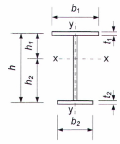

## PHỤ LỤC F (Quy định) — Hệ số ổn định khi uốn φb

### F.1  Hệ số $\varphi_{b}$ để tính toán ổn định của các cấu kiện chịu uốn có tiết diện chữ I, chữ T và chữ C được xác định phụ thuộc vào bố trí giằng giữ cánh chịu nén, loại tải trọng và vị trí của tải trọng. Khi đó, giả thiết rằng tải trọng tác dụng trong mặt phẳng có độ cứng lớn nhất ($I_{x}$ > $I_{y}$), còn các tiết diện gối tựa được liên kết chặn chuyển vị ngang và xoay.

### F.2  Đối với dầm và công xôn tiết diện chữ I có hai trục đối xứng thì hệ số $\varphi_{b}$ được lấy bằng:

&nbsp;&nbsp;\- Khi $\varphi_{1}$ ≤ 0,85

$\varphi_{b}$ = $\varphi_{1}$

$$\dots \qquad (F.1)$$
<!-- formula_id: "F_TCVN_5575_2024_FORMULA_F_1" -->

&nbsp;&nbsp;\- Khi $\varphi_{1}$ > 0, 85

$\varphi_{b}$ = 0,68 + 0,21$\varphi_{1}$ ≤ 1

$$\dots \qquad (F.2)$$
<!-- formula_id: "F_TCVN_5575_2024_FORMULA_F_2" -->

trong đó:

&nbsp;&nbsp;&nbsp;&nbsp;\- $\varphi_{1}$ được tính theo công thức:

$$\varphi_1 = \psi \frac{I_y}{I_x} \left(\frac{h}{L_{ef}}\right)^2 \frac{E}{f_{yd}} \qquad (F.3)$$
<!-- formula_id: "F_TCVN_5575_2024_RID739" -->

trong đó:

&nbsp;&nbsp;&nbsp;&nbsp;\- Ψ  là hệ số, được tính theo các yêu cầu trong F.3;

&nbsp;&nbsp;&nbsp;&nbsp;\- h  là chiều cao toàn bộ tiết diện dầm chữ I cán hoặc khoảng cách giữa các trục của các cánh (hoặc các tập bản cánh) của chữ I tổ hợp;

&nbsp;&nbsp;&nbsp;&nbsp;\- $L_{ef}$ là chiều dài tính toán của dầm hoặc công xôn, được xác định theo 8.4.2.

### F.3  Giá trị hệ số Ψ trong công thức (F.3) được tính theo các công thức trong các bảng F.1 và F.2 phụ thuộc vào số điểm liên kết cánh chịu nén, loại tải trọng và hệ số α. Giá trị hệ số α được tính như sau:

a) \- Đối với thép chữ I cán:

$$`.
    -   `\alpha = k \frac{I_t}{I_y} \left( \frac{L_{er}}{h} \right)^2`
    -   Add the tag: `\qquad (F.4)`
    -   End with `$$
<!-- formula_id: "F_TCVN_5575_2024_RID740" -->

trong đó:

&nbsp;&nbsp;&nbsp;&nbsp;\- $I_{t}$  là mô men quán tính khi xoắn tự do, được xác định theo Phụ lục D;

&nbsp;&nbsp;&nbsp;&nbsp;\- h  là chiều cao toàn bộ tiết diện;

&nbsp;&nbsp;&nbsp;&nbsp;\- k  là hệ số phụ thuộc vào liên kết cánh chịu nén trong nhịp và lấy bằng:

&nbsp;&nbsp;&nbsp;&nbsp;\- 1,0 - khi không có liên kết;

&nbsp;&nbsp;&nbsp;&nbsp;\- 1,54 - khi có liên kết;

b) \- Đối với chữ I tổ hợp hàn từ các bản thép hoặc tổ hợp bằng liên kết ma sát cánh với bụng:

$$\alpha = k \left( \frac{L_{ef} t_f}{h_m b_f} \right)^2 \left( 1 + \frac{0.5 h_m t_w^3}{b_f t_f^3} \right) \qquad (\text{F. 5})$$
<!-- formula_id: "F_TCVN_5575_2024_RID741" -->

trong đó:

&nbsp;&nbsp;&nbsp;&nbsp;\- đối với chữ I tổ hợp hàn:

&nbsp;&nbsp;&nbsp;&nbsp;\- k  là hệ số phụ thuộc vào liên kết cánh chịu nén trong nhịp và lấy bằng:

4 - khi không có liên kết;

8 - khi có liên kết;

$t_{f}$  là chiều dày bản cánh;

$b_{f}$  là chiều rộng bản cánh;

$t_{w}$  là chiều dày bản bụng;

$h_{m}$  là chiều cao tính toán của tiết diện, phụ thuộc vào liên kết cánh chịu nén trong nhịp và lấy bằng:

chiều cao thép tổ hợp h - khi không có liên kết;

khoảng cách giữa các trục của các bản cánh (h - $t_{f}$) - khi có liên kết;

&nbsp;&nbsp;\- đối với chữ I tổ hợp bằng liên kết ma sát cánh với bụng:

$t_{f}$  là tổng chiều dày của tập bản cánh và cánh nằm ngang của một thép góc ghép cánh;

$b_{f}$  là chiều rộng tập bản cánh;

$t_{w}$  là tổng chiều dày của bản bụng và các cánh thẳng đứng của các thép góc ghép cánh;

$h_{m}$ là khoảng cách giữa các trục của các tập bản cánh (h - $t_{f}$);

0,5$h_{m}$  thay bằng hiệu của chiều rộng cánh thẳng đứng của thép góc ghép cánh và chiều dày cánh của nó.

Nếu trên đoạn $L_{ef}$ của dầm mà hình dạng biểu đồ mô men uốn $M_{x}$ khác với hình dạng thể hiện trong Bảng F.1 thì xác định hệ số Ψ bằng các công thức ứng với biểu đồ có hình dạng gần giống nhất với hình dạng biểu đồ $M_{x}$ mà biểu đồ thực tế có thể nội tiếp trong đó.

Trong các trường hợp, khi tại phần công xôn của dầm cánh chịu nén được liên kết chặn chuyển vị ngang ở đầu mút công xôn hoặc dọc theo chiều dài công xôn thì giá trị Ψ lấy như sau:

&nbsp;&nbsp;\- Khi có tải trọng tập trung đặt lên cánh chịu kéo ở đầu mút công xôn: lấy Ψ = 1,75$Ψ_{1}$ , trong đó giá trị $Ψ_{1}$ được lấy theo CHÚ THÍCH 2 trong Bảng F.1.

&nbsp;&nbsp;\- Trong các trường hợp khác: lấy như đối với công xôn không được liên kết chặn chuyển vị ngang.

### Bảng F.1 - Hệ số Ψ cho dầm tiết diện chữ I có hai trục đối xứng

| Số điểm liên kết cánh chịu nén trong nhịp | Loại tải trọng trong nhịp | Biểu đồ $M_{x}$ trên đoạn $L_{ef}$ $L$ | $C_{1}$ | $C_{2}$ | Cánh được chất tải | Giá trị Ψ khi α — ≥ 0,1; ≤ 40 | Giá trị Ψ khi α — > 40; ≤ 400 |  |
| :--- | :--- | :--- | :---: | :---: | :--- | :--- | :--- | :--- |
| 1. Không có điểm liên kết $L_{ef}$ = L | $q_1 = 10 \cdot K \cdot \sqrt{P} \tag{1}$ | $và kết thúc bằng$ | 1,37 | 0,55 | Chịu nén, Chịu kéo | $C_1 \left( \sqrt{0,95\alpha + 6,09C_2^2 + 5,78} \mp 2,47C_2 \right)$ | $C_1 \left( \sqrt{0,95\alpha + 6,09C_2^2 + 5,78} \mp 2,47C_2 \right)$ |  |
| 1. Không có điểm liên kết $L_{ef}$ = L | $P, \quad \frac{L}{4}$ | $Hình ảnh bạn cung cấp là một biểu đồ hình học (biểu đồ nội lực hoặc biểu đồ phân bố tải trọng), không chứa công thức toán học hay ký hiệu văn bản nào để chuyển đổi sang LaTeX.$ | 1,49 | 0,41 | Chịu nén, Chịu kéo | $C_1 \left( \sqrt{0,95\alpha + 6,09C_2^2 + 5,78} \mp 2,47C_2 \right)$ | $C_1 \left( \sqrt{0,95\alpha + 6,09C_2^2 + 5,78} \mp 2,47C_2 \right)$ |  |
| 1. Không có điểm liên kết $L_{ef}$ = L | $\text{Hình ảnh không chứa công thức toán học để chuyển đổi sang LaTeX.}$ | $Hình ảnh bạn cung cấp là một biểu đồ hình học (biểu đồ bao mô-men hoặc biểu đồ phân bố tải trọng), không chứa công thức toán học hay ký hiệu văn bản. Do đó, không có nội dung để chuyển đổi sang mã LaTeX.$ | 1,10 | 0,50 | Chịu nén, Chịu kéo | $C_1 \left( \sqrt{0,95\alpha + 6,09C_2^2 + 5,78} \mp 2,47C_2 \right)$ | $C_1 \left( \sqrt{0,95\alpha + 6,09C_2^2 + 5,78} \mp 2,47C_2 \right)$ |  |
| 1. Không có điểm liên kết $L_{ef}$ = L | $Hình ảnh bạn cung cấp là một sơ đồ kết cấu (dầm chịu lực), không chứa công thức toán học. Do đó, không có mã LaTeX tương ứng để chuyển đổi.$ | $M_{\text{sup}} = M_{\text{sp}}$ | 1,73 | 1,40 | Chịu nén, Chịu kéo | $C_1 \left( \sqrt{0,95\alpha + 6,09C_2^2 + 5,78} \mp 2,47C_2 \right)$ | $C_1 \left( \sqrt{0,95\alpha + 6,09C_2^2 + 5,78} \mp 2,47C_2 \right)$ |  |
| 1. Không có điểm liên kết $L_{ef}$ = L | $Hình ảnh bạn cung cấp là một sơ đồ kết cấu (dầm đơn giản chịu tải trọng phân bố đều), không chứa công thức toán học. Do đó, không có nội dung để chuyển đổi sang mã LaTeX.$ | $--$ | 1,13 | 0,46 | Chịu nén, Chịu kéo | $C_1 \left( \sqrt{0,95\alpha + 6,09C_2^2 + 5,78} \mp 2,47C_2 \right)$ | $C_1 \left( \sqrt{0,95\alpha + 6,09C_2^2 + 5,78} \mp 2,47C_2 \right)$ |  |
| 1. Không có điểm liên kết $L_{ef}$ = L | $Ảnh này không chứa công thức toán học nào mà chỉ là một sơ đồ cơ học (dầm đơn giản chịu tải trọng phân bố đều và có các mômen tập trung ở hai đầu). Do không có công thức, hệ thống trả về khối trống hoặc không thể trích xuất.$ | $M_{s,p} = M_{s,\rho}$ |  |  | Chịu nén, Chịu kéo | $C_1 \left( \sqrt{0,95\alpha + 6,09C_2^2 + 5,78} \mp 2,47C_2 \right)$ | $C_1 \left( \sqrt{0,95\alpha + 6,09C_2^2 + 5,78} \mp 2,47C_2 \right)$ |  |
| 1. Không có điểm liên kết $L_{ef}$ = L | $Xin lỗi, hình ảnh bạn cung cấp là một sơ đồ kết cấu cơ học (dầm đơn giản chịu momen) chứ không chứa công thức toán học nào. Vui lòng cung cấp hình ảnh có chứa công thức để tôi có thể chuyển đổi sang mã LaTeX KaTeX cho bạn.$ | $M \quad \text{.................} \quad M$ | 1,00 | - | - | $C_1\sqrt{0,95\alpha+5,78}$ | $C_1\sqrt{0,95\alpha+5,78}$ |  |
| 1. Không có điểm liên kết $L_{ef}$ = L | $Hình ảnh bạn cung cấp là một sơ đồ cơ học (dầm đơn giản chịu mô-men xoắn/uốn ở đầu) chứ không chứa công thức toán học hay ký hiệu LaTeX nào để chuyển đổi.$ | $M$ | 1,88 | - | - | $C_1\sqrt{0,95\alpha+5,78}$ | $C_1\sqrt{0,95\alpha+5,78}$ |  |
| 1. Không có điểm liên kết $L_{ef}$ = L | $\text{Hình ảnh chỉ chứa sơ đồ dầm chịu lực, không có công thức toán học}$ | $M$ | 2,77 | - | - | $C_1\sqrt{0,95\alpha+5,78}$ | $C_1\sqrt{0,95\alpha+5,78}$ |  |
| 2. Hai hay nhiều điểm liên kết chia nhịp L thành các đoạn bằng nhau | Bất kỳ | $L_{\text{ef}}$ | - | - | Bất kỳ | 2,25 + 0,07+ | 2,25 + 0,07+ | 3,6 + 0,04α - 3,5.10$^{-5}$ $\alpha^{2}$ |
| 3. Một điểm liên kết ở giữa | $L/2, \quad P$ | $L_{\text{ef}}$ | - | - | Bất kỳ | 1,75$Ψ_{1}$ | 1,75$Ψ_{1}$ | 1,75$Ψ_{1}$ |
| 3. Một điểm liên kết ở giữa | $P$ | $l_{ot}$ | - | - | Chịu nén | 1,14$Ψ_{1}$ | 1,14$Ψ_{1}$ | 1,14$Ψ_{1}$ |
| 3. Một điểm liên kết ở giữa | $P$ | $l_{ot}$ | - | - | Chịu kéo | 1, 60$Ψ_{1}$ | 1, 60$Ψ_{1}$ | 1, 60$Ψ_{1}$ |
| 3. Một điểm liên kết ở giữa | $Hình ảnh này không chứa công thức toán học nào cần chuyển đổi (chỉ hiển thị sơ đồ dầm đơn giản chịu tải trọng phân bố đều). Do đó, không có biểu thức LaTeX nào được tạo ra.$ | $L_{\text{ef}}$ | - | - | Chịu nén | 1,14$Ψ_{1}$ | 1,14$Ψ_{1}$ | 1,14$Ψ_{1}$ |
| 3. Một điểm liên kết ở giữa | $Hình ảnh này không chứa công thức toán học nào cần chuyển đổi (chỉ hiển thị sơ đồ dầm đơn giản chịu tải trọng phân bố đều). Do đó, không có biểu thức LaTeX nào được tạo ra.$ | $L_{\text{ef}}$ | - | - | Chịu kéo | 1,30$Ψ_{1}$ | 1,30$Ψ_{1}$ | 1,30$Ψ_{1}$ |

> CHÚ THÍCH 2: Giá trị Ψ lấy bằng giá trị Ψ ứng với trường hợp có hai hay nhiều điểm liên kết cánh chịu nén trong nhịp (xem điểm 2).
>
> CHÚ THÍCH 3: Các tiết diện gối tựa của dầm được giữ chống lật.
>
> CHÚ THÍCH 2: Giá trị Ψ lấy bằng giá trị Ψ ứng với trường hợp có hai hay nhiều điểm liên kết cánh chịu nén trong nhịp (xem điểm 2).
>
> CHÚ THÍCH 3: Các tiết diện gối tựa của dầm được giữ chống lật.
>
> CHÚ THÍCH 2: Giá trị Ψ lấy bằng giá trị Ψ ứng với trường hợp có hai hay nhiều điểm liên kết cánh chịu nén trong nhịp (xem điểm 2).
>
> CHÚ THÍCH 3: Các tiết diện gối tựa của dầm được giữ chống lật.
>
> CHÚ THÍCH 2: Giá trị Ψ lấy bằng giá trị Ψ ứng với trường hợp có hai hay nhiều điểm liên kết cánh chịu nén trong nhịp (xem điểm 2).
>
> CHÚ THÍCH 3: Các tiết diện gối tựa của dầm được giữ chống lật.
>
> CHÚ THÍCH 2: Giá trị Ψ lấy bằng giá trị Ψ ứng với trường hợp có hai hay nhiều điểm liên kết cánh chịu nén trong nhịp (xem điểm 2).
>
> CHÚ THÍCH 3: Các tiết diện gối tựa của dầm được giữ chống lật.
>
> CHÚ THÍCH 2: Giá trị Ψ lấy bằng giá trị Ψ ứng với trường hợp có hai hay nhiều điểm liên kết cánh chịu nén trong nhịp (xem điểm 2).
>
> CHÚ THÍCH 3: Các tiết diện gối tựa của dầm được giữ chống lật.
>
> CHÚ THÍCH 2: Giá trị Ψ lấy bằng giá trị Ψ ứng với trường hợp có hai hay nhiều điểm liên kết cánh chịu nén trong nhịp (xem điểm 2).
>
> CHÚ THÍCH 3: Các tiết diện gối tựa của dầm được giữ chống lật.
>
> CHÚ THÍCH 2: Giá trị Ψ lấy bằng giá trị Ψ ứng với trường hợp có hai hay nhiều điểm liên kết cánh chịu nén trong nhịp (xem điểm 2).
>
> CHÚ THÍCH 3: Các tiết diện gối tựa của dầm được giữ chống lật.
>
> CHÚ THÍCH 2: Giá trị Ψ lấy bằng giá trị Ψ ứng với trường hợp có hai hay nhiều điểm liên kết cánh chịu nén trong nhịp (xem điểm 2).
>
> CHÚ THÍCH 3: Các tiết diện gối tựa của dầm được giữ chống lật.
>
> _CHÚ THÍCH:_

**CHÚ THÍCH 1:** ** Đối với các sơ đồ ở điểm 1 trong bảng, trong các công thức tính Ψ lấy dấu “-” khi tải trọng đặt ở cánh trên, lấy dấu “+” khi tải trọng đặt ở cánh dưới.

### Bảng F.2 - Hệ số Ψ cho công xôn ngàm cứng có tiết diện chữ I với hai trục đối xứng

| Loại tải trọng | Cánh được chất tải | Giá trị Ψ khi cánh chịu nén không được liên kết chặn chuyển vị ngang và với α — ≥ 4; ≤ 28 | Giá trị Ψ khi cánh chịu nén không được liên kết chặn chuyển vị ngang và với α — > 28; ≤ 100 |
| :--- | :--- | :--- | :--- |
| $P$ | Chịu kéo | 1,0 + 0,16α | 4,0 + 0, 05α |
| $P$ | Chịu nén | 6,2 + 0, 08α | 7,0 + 0, 05α |
| $Xin lỗi, hình ảnh bạn cung cấp chỉ chứa sơ đồ kết cấu (dầm công xôn chịu tải trọng phân bố đều) mà không chứa công thức toán học nào. Do đó, tôi không thể chuyển đổi thành mã LaTeX. Vui lòng cung cấp hình ảnh chứa công thức toán học để tôi có thể hỗ trợ bạn!$ | Chịu kéo | $...$ | $...$ |

> **CHÚ THÍCH:** Hệ số α lấy theo các công thức (F.4) và (F.5) với các giá trị k như đối với các sơ đồ có các liên kết cánh chịu nén trong nhịp: k = 1,54 và k = 8 ứng với $h_{m}$ tương ứng.

### F.4  Đối với dầm không liên tục tiết diện chữ I có một trục đối xứng (Hình F.1), hệ số $\varphi_{b}$ được xác định theo Bảng F.3, trong đó các giá trị $\varphi_{1}$ , $\varphi_{2}$ và n được xác định theo các công thức:

$$\varphi_1 = \psi_a \cdot \frac{I_y}{I_x} \cdot \frac{2hh_1}{L_{ef}^2} \cdot \frac{E}{f_{yd}} \qquad (F.6)$$
<!-- formula_id: "F_TCVN_5575_2024_RID773" -->

$$\varphi_2 = \psi_a \cdot \frac{I_y}{I_x} \cdot \frac{2hh_2}{L_{ef}^2} \cdot \frac{E}{f_{yd}} \quad (F.7)$$
<!-- formula_id: "F_TCVN_5575_2024_RID774" -->

$$n = \frac{I_1}{I_1 + I_2} \tag{F.8}$$
<!-- formula_id: "F_TCVN_5575_2024_RID775" -->

Trong các công thức từ (F.6) đến (F.8):

$Ψ_{a}$ là hệ số, được tính theo công thức:

$$`.
-   Write `\psi_a = (B + \sqrt{B^2 + C})D`.
-   Add the tag `\qquad (F.9)`.
-   End with `$$
<!-- formula_id: "F_TCVN_5575_2024_RID776" -->

h  là khoảng cách giữa các trục của các cánh;

$h_{1}$  là khoảng cách từ trọng tâm tiết diện đến trục của cánh lớn;

$h_{2}$  là khoảng cách từ trọng tâm tiết diện đến trục của cánh nhỏ;

$L_{ef}$  là chiều dài tính toán của dầm, được xác định theo 8.4.2;

$I_{1}$ và $I_{2}$  lần lượt là mô men quán tính của tiết diện cánh lớn và cánh nhỏ đối với trục đối xứng của tiết diện dầm.

Các hệ số B, C và D trong công thức (F.9) được xác định theo F.5.

<strong>Hình F.1 — Sơ đồ tiết diện chữ I có một trục đối xứng</strong>

### Bảng F.3 - Hệ số $\varphi_{b}$

| Cánh chịu nén | Giá trị $\varphi_{b}$ khi giá trị $\varphi_{2}$ — ≤ 0,85 | Giá trị $\varphi_{b}$ khi giá trị $\varphi_{2}$ — > 0,85 |
| :--- | :--- | :--- |
| 1. Lớn hơn | $\varphi_{1}$ ≤ 1 | $\varphi_t \left( 0,21 + 0,68 \left( \frac{n}{\varphi_1} + \frac{1-n}{\varphi_2} \right) \right) \le 1$ |
| 2. Nhỏ hơn | $\varphi_{2}$ | 0,68 + 0,21$\varphi_{2}$ ≤ 1 |

### F.5  Các giá trị B, C và D trong công thức (F.9) được xác định theo các bảng F.4 và F.5 phụ thuộc vào các hệ số:

$$\delta = n + 0.734 \beta \qquad (F.10)$$
<!-- formula_id: "F_TCVN_5575_2024_RID779" -->

$$`.
    *   Write `\mu = n + 1,145\beta`.
    *   Add the tag: `\tag{F.11}`.
    *   End with `$$
<!-- formula_id: "F_TCVN_5575_2024_RID780" -->

$$\beta = (2n - 1) \left\{ 0,47 - 0,035 \left( \frac{b_1}{h} \right) \left[ 1 + \frac{b_1}{h} - 0,072 \left( \frac{b_1}{h} \right)^2 \right] \right\} \qquad (\text{F.12})$$
<!-- formula_id: "F_TCVN_5575_2024_RID781" -->

$$\eta = (1 - n) \left[ 9,87n + 0,385 \frac{I_t}{I_2} \left( \frac{L_{ef}}{h} \right)^2 \right] \qquad (\text{F.13})$$
<!-- formula_id: "F_TCVN_5575_2024_RID782" -->

trong đó: các giá trị n, $b_{1}$, h, $I_{2}$ , $L_{ef}$ được xác định theo Phụ lục F này, còn $I_{t}$ - theo Phụ lục D.

&nbsp;&nbsp;&nbsp;&nbsp;\- Hệ số α trong Bảng F.5 được xác định theo công thức (F.4).

### F.6  Đối với tiết diện chữ I khi 0,9 < n < 1,0 thì hệ số $Ψ_{a}$ cần được xác định bằng nội suy tuyến tính giữa các giá trị tính được theo công thức (F.9) đối với tiết diện chữ I khi n = 0,9 và đối với tiết diện chữ T khi n = 1,0.

Đối với tiết diện chữ T khi có tải trọng tập trung (hoặc phân bố đều) và α < 40 thì hệ số $Ψ_{a}$ cần được nhân với (0,8 + 0,004α).

Đối với dầm có cánh chịu nén nhỏ hơn khi n > 0,7 và 5 ≤ $L_{ef}$/$b_{2}$ ≤ 25 thì giá trị hệ số $Ψ_{2}$ phải được giảm xuống bằng cách nhân với (1,025 - 0,015$L_{ef}$/$b_{2}$) và được lấy khi đó không lớn hơn 0,95. Không cho phép có giá trị $L_{ef}$/$b_{2}$ > 25 trong các dầm này.

### Bảng F.4 - Hệ số B

| Sơ đồ tiết diện và vị trí đặt tải trọng | Hệ số B khi tải trọng — tập trung ở giữa nhịp | Hệ số B khi tải trọng — phân bố đều | Hệ số B khi tải trọng — gây uốn thuần tuý |
| :--- | :--- | :--- | :--- |
| $\begin{aligned} I &\downarrow \\ T &\downarrow \end{aligned}$ | δ | μ | β |
| $Hình ảnh bạn cung cấp là các ký hiệu hình học/kỹ thuật (biểu diễn tải trọng tập trung lên dầm), không chứa công thức toán học hay ký tự văn bản để chuyển đổi sang LaTeX.$ | δ - 1 | μ - 1 | β |
| $Hình ảnh bạn cung cấp là các ký hiệu hình học (ký hiệu dung sai độ vuông góc), không phải là một công thức toán học có chứa ký tự, số hiệu hay đơn vị đo lường. Do đó, không thể chuyển đổi thành mã LaTeX theo yêu cầu của bạn.$ | 1 - δ | 1 - μ | -β |
| $Hình ảnh bạn cung cấp là sơ đồ minh họa kỹ thuật (hình vẽ), không chứa công thức toán học hay ký hiệu cần chuyển đổi sang LaTeX.$ | -δ | -μ | -β |

### Bảng F.5 - Các hệ số C và D

| Loại tải trọng | Hệ số C khi tiết diện có dạng — chữ I (n ≤ 0,9) | Hệ số C khi tiết diện có dạng — chữ T (n = 1,0) | Hệ số D |
| :--- | :--- | :--- | :---: |
| 1. Tập trung ở giữa nhịp | 0,330η | 0,0826α | 3,265 |
| 2. Phân bố đều | 0,481η | 0,1202α | 2,247 |
| 3. Gây uốn thuần tuý | 0,101η | 0,0253α | 4,315 |

### F.7  Đối với tiết diện chữ C thì hệ số $\varphi_{b}$ cần được lấy bằng $\varphi_{b}$ = 0,7$\varphi_{1}$, trong đó $\varphi_{1}$ được xác định như đối với dầm tiết diện chữ I có hai trục đối xứng bằng cách sử dụng các công thức (F.3) và (F.4) với các giá trị $I_{x}$, $I_{y}$, $I_{t}$ được lấy đối với tiết diện chữ C.