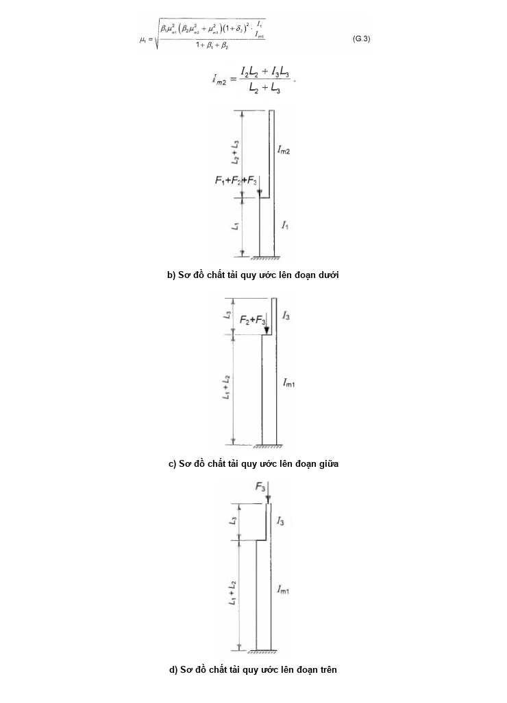

## PHỤ LỤC G (Quy định) — Hệ số chiều dài tính toán của các cấu kiện

### G.1  Cột một bậc

### G.1.1  Hệ số chiều dài tính toán $\mu_{1}$ của đoạn cột dưới được ngàm vào móng của cột một bậc được lấy như sau:

&nbsp;&nbsp;\- Khi đầu trên cột tự do: theo Bảng G.1;

&nbsp;&nbsp;\- Khi đầu trên cột được ngàm trượt (chỉ chặn xoay, nhưng có thể chuyển vị trượt tự do): theo Bảng G.2;

&nbsp;&nbsp;\- Khi đầu trên cột được liên kết chặn chuyển vị: theo công thức

$$\mu_1 = \sqrt{\frac{\mu_{12}^2 + \mu_{11}^2(\beta - 1)}{\beta}} \qquad (\text{G.1})$$
<!-- formula_id: "F_TCVN_5575_2024_RID787" -->

trong đó:

&nbsp;&nbsp;&nbsp;&nbsp;\- $\mu_{12}$ là hệ số chiều dài tính toán của đoạn cột dưới khi $F_{1}$ = 0 ;

&nbsp;&nbsp;&nbsp;&nbsp;\- $\mu_{11}$ là hệ số chiều dài tính toán của đoạn cột dưới khi $F_{2}$ = 0 .

Giá trị của $\mu_{12}$ và $\mu_{11}$ lấy như sau:

&nbsp;&nbsp;\- Khi đầu trên cột tựa khớp cố định: theo Bảng G.3;

&nbsp;&nbsp;\- Khi đầu trên cột được ngàm cố định (chặn xoay, chặn chuyển vị): theo Bảng G.4.

Trong các bảng từ G.1 đến G.4:

$$\alpha_1 = \frac{L_2}{L_1} \sqrt{\frac{I_1}{\beta I_2}} \text{ và } n = \frac{I_2 L_1}{I_1 L_2}$$
<!-- formula_id: "F_TCVN_5575_2024_RID788" -->

trong đó:

&nbsp;&nbsp;&nbsp;&nbsp;\- $I_{1}$, $L_{1}$ là mô men quán tính của tiết diện và chiều dài của đoạn cột dưới;

&nbsp;&nbsp;&nbsp;&nbsp;\- $I_{2}$, $L_{2}$ là mô men quán tính của tiết diện và chiều dài của đoạn cột trên;

### G.1.2  Hệ số chiều dài tính toán $\mu_{2}$ của đoạn cột trên của cột một bậc trong mọi trường hợp được xác định theo công thức:

$$\mu_2 = \frac{\mu_1}{\alpha_1} \le 3 \qquad (\text{G.2})$$
<!-- formula_id: "F_TCVN_5575_2024_RID789" -->

### Bảng G.1 - Hệ số chiều dài tính toán $\mu_{1}$ của cột một bậc có đầu trên tự do

| Sơ đồ tính | $\alpha_{1}$ | Hệ số $\mu_{1}$ khi n bằng — 0 | Hệ số $\mu_{1}$ khi n bằng — 0,1 | Hệ số $\mu_{1}$ khi n bằng — 0,2 | Hệ số $\mu_{1}$ khi n bằng — 0,3 | Hệ số $\mu_{1}$ khi n bằng — 0,4 | Hệ số $\mu_{1}$ khi n bằng — 0,5 | Hệ số $\mu_{1}$ khi n bằng — 0,6 | Hệ số $\mu_{1}$ khi n bằng — 0,7 | Hệ số $\mu_{1}$ khi n bằng — 0,8 | Hệ số $\mu_{1}$ khi n bằng — 0,9 | Hệ số $\mu_{1}$ khi n bằng — 1,0 | Hệ số $\mu_{1}$ khi n bằng — 1,2 | Hệ số $\mu_{1}$ khi n bằng — 1,4 | Hệ số $\mu_{1}$ khi n bằng — 1,6 | Hệ số $\mu_{1}$ khi n bằng — 1,8 | Hệ số $\mu_{1}$ khi n bằng — 2,0 | Hệ số $\mu_{1}$ khi n bằng — 2,5 | Hệ số $\mu_{1}$ khi n bằng — 5,0 | Hệ số $\mu_{1}$ khi n bằng — 10,0 | Hệ số $\mu_{1}$ khi n bằng — 20,0 |
| :--- | :---: | :---: | :---: | :---: | :---: | :---: | :---: | :---: | :---: | :---: | :---: | :---: | :---: | :---: | :---: | :---: | :---: | :---: | :---: | :---: | :---: |
| $Xin lỗi, hình ảnh bạn cung cấp chỉ chứa sơ đồ cơ học (hình vẽ cột chịu lực) mà không chứa công thức toán học nào. Do đó, không có công thức để chuyển đổi sang LaTeX theo các quy tắc đã cho. Vui lòng cung cấp hình ảnh chứa công thức toán học để tôi có thể hỗ trợ bạn.$ | 0,0 0,2 0,4 0,6 0,8 1,0 1,5 2,0 2,5 3,0 | 2,0 2,0 2,0 2,0 2,0 2,0 3,0 4,0 5,0 6,0 | 2,00 2,01 2,04 2,11 2,25 2,50 3,43 4,44 5,55 6,65 | 2,00 2,02 2,08 2,20 2,42 2,73 3,77 4,90 6,08 7,25 | 2,00 2,03 2,11 2,28 2,56 2,94 4,07 5,29 6,56 7,82 | 2,00 2,04 2,13 2,36 2,70 3,13 4,35 5,67 7,00 - | 2,00 2,05 2,18 2,44 2,83 3,29 4,61 6,03 - - | 2,00 2,06 2,21 2,52 2,96 3,44 4,86 - - - | 2,00 2,06 2,25 2,59 3,07 3,59 5,05 - - - | 2,00 2,07 2,28 2,66 3,17 3,74 - - - - | 2,00 2,08 2,32 2,73 3,27 3,87 - - - - | 2,00 2,09 2,35 2,80 3,36 4,00 - - - - | 2,00 2,10 2,42 2,93 3,55 - - - - - | 2,00 2,12 2,48 3,05 3,74 - - - - - | 2,00 2,14 2,54 3,17 - - - - - - | 2,00 2,15 2,60 3,28 - - - - - - | 2,00 2,17 2,66 3,39 - - - - - - | 2,00 2,21 2,80 - - - - - - - | 2,00 2,40 - - - - - - - - | 2,00 2,76 - - - - - - - - | 2,00 3,38 - - - - - - - - |

### Bảng G.2 - Hệ số chiều dài tính toán $\mu_{1}$ của cột một bậc có đầu trên ngàm trượt

| Sơ đồ tính | $\alpha_{1}$ | Hệ số $\mu_{1}$ khi n bằng — 0 | Hệ số $\mu_{1}$ khi n bằng — 0,1 | Hệ số $\mu_{1}$ khi n bằng — 0,2 | Hệ số $\mu_{1}$ khi n bằng — 0,3 | Hệ số $\mu_{1}$ khi n bằng — 0,4 | Hệ số $\mu_{1}$ khi n bằng — 0,5 | Hệ số $\mu_{1}$ khi n bằng — 0,6 | Hệ số $\mu_{1}$ khi n bằng — 0,7 | Hệ số $\mu_{1}$ khi n bằng — 0,8 | Hệ số $\mu_{1}$ khi n bằng — 0,9 | Hệ số $\mu_{1}$ khi n bằng — 1,0 | Hệ số $\mu_{1}$ khi n bằng — 1,2 | Hệ số $\mu_{1}$ khi n bằng — 1,4 | Hệ số $\mu_{1}$ khi n bằng — 1,6 | Hệ số $\mu_{1}$ khi n bằng — 1,8 | Hệ số $\mu_{1}$ khi n bằng — 2,0 | Hệ số $\mu_{1}$ khi n bằng — 2,5 | Hệ số $\mu_{1}$ khi n bằng — 5,0 | Hệ số $\mu_{1}$ khi n bằng — 10,0 | Hệ số $\mu_{1}$ khi n bằng — 20,0 |
| :--- | :---: | :---: | :---: | :---: | :---: | :---: | :---: | :---: | :---: | :---: | :---: | :---: | :---: | :---: | :---: | :---: | :---: | :---: | :---: | :---: | :---: |
| $\text{Hình ảnh không chứa công thức toán học.}$ | 0,0 0,2 0,4 0,6 0,8 1,0 1,5 2,0 2,5 3,0 | 2,0 2,0 2,0 2,0 2,0 2,0 2,0 2,0 2,5 3,0 | 1,92 1,93 1,94 1,95 1,97 2,00 2,12 2,45 2,94 3,43 | 1,86 1,87 1,88 1,91 1,94 2,00 2,25 2,66 3,17 3,70 | 1,80 1,82 1,83 1,86 1,92 2,00 2,33 2,81 3,34 3,93 | 1,76 1,76 1,77 1,83 1,90 2,00 2,38 2,91 3,50 4,12 | 1,70 1,71 1,75 1,79 1,88 2,00 2,43 3,00 - - | 1,67 1,68 1,72 1,77 1,87 2,00 2,48 - - - | 1,64 1,64 1,69 1,76 1,86 2,00 2,52 - - - | 1,60 1,62 1,66 1,72 1,85 2,00 - - - - | 1,57 1,59 1,62 1,71 1,83 2,00 - - - - | 1,55 1,56 1,61 1,69 1,82 2,00 - - - - | 1,50 1,52 1,57 1,66 1,80 - - - - - | 1,46 1,48 1,53 1,63 1,79 - - - - - | 1,43 1,45 1,50 1,61 - - - - - - | 1,40 1,41 1,48 1,59 - - - - - - | 1,37 1,39 1,45 - - - - - - - | 1,32 1,33 1,40 - - - - - - - | 1,18 1,20 - - - - - - - - | 1,10 1,11 - - - - - - - - | 1,05 - - - - - - - - - |

### Bảng G.3 - Các hệ số chiều dài tính toán $\mu_{12}$ và $\mu_{11}$ của cột một bậc có đầu trên tựa khớp cố định

| Sơ đồ tính | $\frac{l_2}{l_1}$ | Các hệ số $\mu_{12}$ và $\mu_{11}$ khi L2/L1 bằng — 0,1 | Các hệ số $\mu_{12}$ và $\mu_{11}$ khi L2/L1 bằng — 0,2 | Các hệ số $\mu_{12}$ và $\mu_{11}$ khi L2/L1 bằng — 0,3 | Các hệ số $\mu_{12}$ và $\mu_{11}$ khi L2/L1 bằng — 0,4 | Các hệ số $\mu_{12}$ và $\mu_{11}$ khi L2/L1 bằng — 0,5 | Các hệ số $\mu_{12}$ và $\mu_{11}$ khi L2/L1 bằng — 0,6 | Các hệ số $\mu_{12}$ và $\mu_{11}$ khi L2/L1 bằng — 0,7 | Các hệ số $\mu_{12}$ và $\mu_{11}$ khi L2/L1 bằng — 0,8 | Các hệ số $\mu_{12}$ và $\mu_{11}$ khi L2/L1 bằng — 0,9 | Các hệ số $\mu_{12}$ và $\mu_{11}$ khi L2/L1 bằng — 1,0 | Các hệ số $\mu_{12}$ và $\mu_{11}$ khi L2/L1 bằng — 1,2 | Các hệ số $\mu_{12}$ và $\mu_{11}$ khi L2/L1 bằng — 1,4 | Các hệ số $\mu_{12}$ và $\mu_{11}$ khi L2/L1 bằng — 1,6 | Các hệ số $\mu_{12}$ và $\mu_{11}$ khi L2/L1 bằng — 1,8 | Các hệ số $\mu_{12}$ và $\mu_{11}$ khi L2/L1 bằng — 2,0 |
| :--- | :--- | :--- | :--- | :--- | :--- | :--- | :--- | :--- | :--- | :--- | :--- | :--- | :--- | :--- | :--- | :--- |
| $F_2$ | Hệ số $\mu_{12}$ | Hệ số $\mu_{12}$ | Hệ số $\mu_{12}$ | Hệ số $\mu_{12}$ | Hệ số $\mu_{12}$ | Hệ số $\mu_{12}$ | Hệ số $\mu_{12}$ | Hệ số $\mu_{12}$ | Hệ số $\mu_{12}$ | Hệ số $\mu_{12}$ | Hệ số $\mu_{12}$ | Hệ số $\mu_{12}$ | Hệ số $\mu_{12}$ | Hệ số $\mu_{12}$ | Hệ số $\mu_{12}$ | Hệ số $\mu_{12}$ |
| $F_2$ | 0,04 0,06 0,08 0,10 0,20 0,30 0,40 0,50 1,00 | 1,02 0,91 0,86 0,83 0,79 0,78 0,78 0,78 0,78 | 1,84 1,47 1,31 1,21 0,98 0,90 0,88 0,86 0,85 | 2,25 1,93 1,73 1,57 1,23 1,09 1,02 0,99 0,92 | 2,59 2,26 2,05 1,95 1,46 1,27 1,17 1,10 0,99 | 2,85 2,57 2,31 2,14 1,67 1,44 1,32 1,22 1,06 | 3,08 2,74 2,49 2,33 1,85 1,60 1,45 1,35 1,13 | 3,24 2,90 2,68 2,46 2,02 1,74 1,58 1,47 1,20 | 3,42 3,05 2,85 2,60 2,15 1,86 1,69 1,57 1,27 | 3,70 3,24 3,00 2,76 2,28 1,98 1,81 1,67 1,34 | 4,00 3,45 3,14 2,91 2,40 2,11 1,92 1,76 1,41 | 4,55 3,88 3,53 3,28 2,67 2,35 2,14 1,96 1,54 | 5,25 4,43 3,93 3,61 2,88 2,51 2,31 2,15 1,68 | 5,80 4,90 4,37 4,03 3,11 2,76 2,51 2,34 1,82 | 6,55 5,43 4,85 4,43 3,42 2,99 2,68 2,50 1,97 | 7,20 5,94 5,28 4,85 3,71 3,25 2,88 2,76 2,10 |
| $\begin{aligned} L_1, &\quad l_1, \quad F_1 \\ L_2, &\quad l_2, \quad F_2 \end{aligned}$ | Hệ số $\mu_{11}$ | Hệ số $\mu_{11}$ | Hệ số $\mu_{11}$ | Hệ số $\mu_{11}$ | Hệ số $\mu_{11}$ | Hệ số $\mu_{11}$ | Hệ số $\mu_{11}$ | Hệ số $\mu_{11}$ | Hệ số $\mu_{11}$ | Hệ số $\mu_{11}$ | Hệ số $\mu_{11}$ | Hệ số $\mu_{11}$ | Hệ số $\mu_{11}$ | Hệ số $\mu_{11}$ | Hệ số $\mu_{11}$ | Hệ số $\mu_{11}$ |
| $\begin{aligned} L_1, &\quad l_1, \quad F_1 \\ L_2, &\quad l_2, \quad F_2 \end{aligned}$ | 0,04 0,06 0,08 0,10 0,20 0,30 0,40 0,50 1,00 | 0,67 0,67 0,67 0,67 0,67 0,67 0,67 0,67 0,67 | 0,67 0,67 0,67 0,67 0,67 0,67 0,67 0,67 0,67 | 0,83 0,81 0,75 0,73 0,69 0,67 0,67 0,67 0,67 | 1,25 1,07 0,98 0,93 0,75 0,71 0,69 0,69 0,68 | 1,43 1,27 1,19 1,11 0,89 0,80 0,75 0,73 0,71 | 1,55 1,41 1,32 1,25 1,02 0,90 0,84 0,81 0,74 | 1,65 1,51 1,43 1,36 1,12 0,99 0,92 0,87 0,78 | 1,70 1,60 1,51 1,45 1,21 1,08 1,00 0,94 0,82 | 1,75 1,64 1,58 1,52 1,29 1,15 1,07 1,01 0,87 | 1,78 1,70 1,63 1,57 1,36 1,22 1,13 1,07 0,91 | 1,84 1,78 1,72 1,66 1,46 1,33 1,24 1,17 0,99 | 1,87 1,82 1,77 1,72 1,54 1,41 1,33 1,26 1,07 | 1,88 1,84 1,81 1,77 1,60 1,48 1,40 1,33 1,13 | 1,90 1,87 1,82 1,80 1,65 1,54 1,47 1,39 1,19 | 1,92 1,88 1,84 1,82 1,69 1,59 1,51 1,44 1,24 |

### Bảng G.4 - Các hệ số chiều dài tính toán $\mu_{12}$ và $\mu_{11}$ của cột một bậc có đầu trên ngàm cố định

| Sơ đồ tính | $\frac{l_2}{l_1}$ | Các hệ số $\mu_{12}$ và $\mu_{11}$ khi $L_{2}$/$L_{1}$ bằng — 0,1 | Các hệ số $\mu_{12}$ và $\mu_{11}$ khi $L_{2}$/$L_{1}$ bằng — 0,2 | Các hệ số $\mu_{12}$ và $\mu_{11}$ khi $L_{2}$/$L_{1}$ bằng — 0,3 | Các hệ số $\mu_{12}$ và $\mu_{11}$ khi $L_{2}$/$L_{1}$ bằng — 0,4 | Các hệ số $\mu_{12}$ và $\mu_{11}$ khi $L_{2}$/$L_{1}$ bằng — 0,5 | Các hệ số $\mu_{12}$ và $\mu_{11}$ khi $L_{2}$/$L_{1}$ bằng — 0,6 | Các hệ số $\mu_{12}$ và $\mu_{11}$ khi $L_{2}$/$L_{1}$ bằng — 0,7 | Các hệ số $\mu_{12}$ và $\mu_{11}$ khi $L_{2}$/$L_{1}$ bằng — 0,8 | Các hệ số $\mu_{12}$ và $\mu_{11}$ khi $L_{2}$/$L_{1}$ bằng — 0,9 | Các hệ số $\mu_{12}$ và $\mu_{11}$ khi $L_{2}$/$L_{1}$ bằng — 1,0 | Các hệ số $\mu_{12}$ và $\mu_{11}$ khi $L_{2}$/$L_{1}$ bằng — 1,2 | Các hệ số $\mu_{12}$ và $\mu_{11}$ khi $L_{2}$/$L_{1}$ bằng — 1,4 | Các hệ số $\mu_{12}$ và $\mu_{11}$ khi $L_{2}$/$L_{1}$ bằng — 1,6 | Các hệ số $\mu_{12}$ và $\mu_{11}$ khi $L_{2}$/$L_{1}$ bằng — 1,8 | Các hệ số $\mu_{12}$ và $\mu_{11}$ khi $L_{2}$/$L_{1}$ bằng — 2,0 |
| :--- | :--- | :--- | :--- | :--- | :--- | :--- | :--- | :--- | :--- | :--- | :--- | :--- | :--- | :--- | :--- | :--- |
| $\text{Hình ảnh kỹ thuật mô tả hệ thống chịu lực}$ | Hệ số $\mu_{12}$ | Hệ số $\mu_{12}$ | Hệ số $\mu_{12}$ | Hệ số $\mu_{12}$ | Hệ số $\mu_{12}$ | Hệ số $\mu_{12}$ | Hệ số $\mu_{12}$ | Hệ số $\mu_{12}$ | Hệ số $\mu_{12}$ | Hệ số $\mu_{12}$ | Hệ số $\mu_{12}$ | Hệ số $\mu_{12}$ | Hệ số $\mu_{12}$ | Hệ số $\mu_{12}$ | Hệ số $\mu_{12}$ | Hệ số $\mu_{12}$ |
| $\text{Hình ảnh kỹ thuật mô tả hệ thống chịu lực}$ | 0,04 0,06 0,08 0,10 0,20 0,30 0,40 0,50 1,00 | 0,78 0,70 0,68 0,67 0,64 0,62 0,60 0,59 0,55 | 1,02 0,86 0,79 0,76 0,70 0,68 0,66 0,65 0,60 | 1,53 1,23 1,05 1,00 0,79 0,74 0,71 0,70 0,65 | 1,73 1,47 1,31 1,20 0,93 0,85 0,78 0,77 0,70 | 2,01 1,73 1,54 1,42 1,07 0,95 0,87 0,82 0,75 | 2,21 1,93 1,74 1,61 1,23 1,06 0,99 0,93 0,80 | 2,38 2,08 1,91 1,78 1,41 1,18 1,07 0,99 0,85 | 2,54 2,23 2,05 1,92 1,50 1,28 1,16 1,08 0,90 | 2,65 2,38 2,20 2,04 1,60 1,39 1,26 1,17 0,95 | 2,85 2,49 2,31 2,20 1,72 1,48 1,34 1,23 1,00 | 3,24 2,81 2,55 2,40 1,92 1,67 1,50 1,39 1,10 | 3,70 3,17 2,80 2,60 2,11 1,82 1,65 1,53 1,20 | 4,20 3,50 3,11 2,86 2,28 1,96 1,79 1,66 1,30 | 4,76 3,92 3,45 3,18 2,45 2,12 1,94 1,79 1,40 | 5,23 4,30 3,73 3,41 2,64 2,20 2,08 1,92 1,50 |
| $\text{Hình ảnh sơ đồ cột bậc (không có công thức toán học)}$ | Hệ số $\mu_{11}$ | Hệ số $\mu_{11}$ | Hệ số $\mu_{11}$ | Hệ số $\mu_{11}$ | Hệ số $\mu_{11}$ | Hệ số $\mu_{11}$ | Hệ số $\mu_{11}$ | Hệ số $\mu_{11}$ | Hệ số $\mu_{11}$ | Hệ số $\mu_{11}$ | Hệ số $\mu_{11}$ | Hệ số $\mu_{11}$ | Hệ số $\mu_{11}$ | Hệ số $\mu_{11}$ | Hệ số $\mu_{11}$ | Hệ số $\mu_{11}$ |
| $\text{Hình ảnh sơ đồ cột bậc (không có công thức toán học)}$ | 0,04 0,06 0,08 0,10 0,20 0,30 0,40 0,50 1,00 | 0,66 0,65 0,64 0,64 0,62 0,60 0,58 0,57 0,55 | 0,68 0,67 0,66 0,65 0,64 0,63 0,63 0,61 0,58 | 0,75 0,68 0,67 0,65 0,65 0,64 0,63 0,63 0,60 | 0,94 0,76 0,68 0,65 0,65 0,65 0,64 0,64 0,61 | 1,08 0,94 0,84 0,78 0,66 0,66 0,64 0,64 0,62 | 1,24 1,10 1,00 0,92 0,73 0,67 0,66 0,65 0,63 | 1,37 1,25 1,12 1,05 0,83 0,73 0,68 0,68 0,65 | 1,47 1,35 1,25 1,15 0,92 0,81 0,75 0,72 0,67 | 1,55 1,44 1,34 1,25 1,01 0,89 0,82 0,77 0,70 | 1,64 1,50 1,41 1,33 1,09 0,94 0,88 0,83 0,73 | 1,72 1,61 1,53 1,45 1,23 1,09 1,01 0,94 0,80 | 1,78 1,69 1,62 1,55 1,33 1,20 1,10 1,04 0,88 | 1,81 1,74 1,68 1,62 1,41 1,28 1,19 1,12 0,93 | 1,85 1,79 1,75 1,68 1,48 1,35 1,26 1,19 1,01 | 1,89 1,82 1,79 1,71 1,54 1,41 1,32 1,25 1,05 |

### G.2  Cột hai bậc

### G.2.1  Hệ số chiều dài tính toán $\mu_{1}$ của đoạn cột dưới được ngàm vào móng của cột hai bậc (Hình G.1a) khi đầu trên của cột được liên kết như trong Bảng G.5 được xác định theo công thức:

$$\mu_1 = \sqrt{\frac{\beta_1 \mu_{m1}^2 \left(\beta_2 \mu_{m2}^2 + \mu_{m3}^2\right) (1 + \delta_2)^2 \cdot \frac{I_1}{I_{m1}}}{1 + \beta_1 + \beta_2}} \tag{G.3}$$
<!-- formula_id: "F_TCVN_5575_2024_RID797" -->

trong đó:

$$\beta_1 = \frac{F_1}{F_3} \;;\; \beta_2 = \frac{F_2}{F_3} \;;\; \delta_2 = \frac{L_2}{L_1} \; ;$$
<!-- formula_id: "F_TCVN_5575_2024_RID798" -->

&nbsp;&nbsp;&nbsp;&nbsp;\- $\mu_{m1}$, $\mu_{m2}$, $\mu_{m3}$ là các hệ số, được xác định theo Bảng G.5 như đối với cột một bậc trên Hình G.1b, c, d;

&nbsp;&nbsp;&nbsp;&nbsp;\- $I_{m1}$ là mô men quán tính quy đổi của tiết diện đoạn cột có chiều dài ($L_{1}$ + $L_{2}$), được tính theo công thức:

$$I_{m1} = \frac{I_1 L_1 + I_2 L_2}{L_1 + L_2};$$
<!-- formula_id: "F_TCVN_5575_2024_RID799" -->

&nbsp;&nbsp;&nbsp;&nbsp;\- $F_{1}$, $F_{2}$, $F_{3}$ là các lực dọc đặt tương ứng lên đoạn dưới, đoạn giữa và đoạn trên của cột có các mô men quán tính $I_{1}$; $I_{2}$; $I_{3}$ và chiều dài tương ứng $L_{1}$; $L_{2}$; $L_{3}$.

Mô men quán tính quy đổi của tiết diện đoạn cột có chiều dài ($L_{2}$ + $L_{3}$) trên Hình G.1b được tính theo công thức:

$$I_{m2} = \frac{I_2 L_2 + I_3 L_3}{L_2 + L_3}$$
<!-- formula_id: "F_TCVN_5575_2024_RID800" -->

| $Hình ảnh bạn cung cấp là một sơ đồ cơ học (thanh bậc chịu nén/kéo) chứ không phải là một công thức toán học có chứa ký hiệu KaTeX. Do đó không có công thức để chuyển đổi.$ | $F_1 + F_2 + F_3$ |  |  |
| :--- | :--- | :--- | :--- |
| a) Sơ đồ cột hai bậc | b) Sơ đồ chất tải quy ước lên đoạn dưới | c) Sơ đồ chất tải quy ước lên đoạn giữa | d) Sơ đồ chất tải quy ước lên đoạn trên |

**CHÚ THÍCH:** 

$F_{1}$, $F_{2}$, $F_{3}$ là các lực tập trung;

$L_{1}$, $L_{2}$, $L_{3}$ là chiều dài các đoạn cột bậc.

<strong>Hình G.1 — Sơ đồ cột hai bậc và sơ đồ chất tải quy ước</strong>

### Bảng G.5 - Các hệ số $\mu_{m1}$, $\mu_{m2}$, $\mu_{m3}$

| Liên kết đầu trên của cột | Giá trị các hệ số — $\mu_{m1}$ — với sơ đồ tải trọng — theo Hình G.1b | Giá trị các hệ số — $\mu_{m2}$ — với sơ đồ tải trọng — theo Hình G.1c | Giá trị các hệ số — $\mu_{m3}$ — với sơ đồ tải trọng — theo Hình G.1d |
| :--- | :--- | :--- | :--- |
| 1. Tự do | 2,0 | 2,0 | $\mu_{1}$ ($\mu_{1}$ theo bảng G.1 với $\alpha_1 = \frac{L_3}{L_1 + L_2} \sqrt{\frac{I_{\text{m1}}}{I_3}}$) |
| 2. Ngàm trượt (chỉ chặn xoay, cho chuyển vị) | $\mu_{1}$ ($\mu_{1}$  theo Bảng G.2 với $\alpha_{1}$ = 0 ) | $\mu_{1}$ ($\mu_{1}$  theo Bảng G.2 với $\alpha_{1}$ = 0 ) | $\mu_{1}$ ($\mu_{1}$ theo bảng G.2 với $\alpha_1 = \frac{L_3}{L_1 + L_2} \sqrt{\frac{I_{\text{m1}}}{I_3}}$) |
| 3. Khớp cố định (cho xoay, chặn chuyển vị) | $\mu_{11}$ ($\mu_{11}$ theo Bảng G.3) | $\mu_{11}$ ($\mu_{11}$ theo Bảng G.3) | $\mu_{12}$ ($\mu_{12}$ theo Bảng G.3) |
| 4. Ngàm (chặn xoay, chặn chuyển vị) | $\mu_{11}$ ($\mu_{11}$ theo Bảng G.4) | $\mu_{11}$ ($\mu_{11}$ theo Bảng G.4) | $\mu_{12}$ ($\mu_{12}$ theo Bảng G.4) |

### G.2.2  Hệ số chiều dài tính toán $\mu_{2}$ của đoạn cột giữa (với chiều dài $L_{2}$) của cột hai bậc được tính theo công thức:

$$\mu_2 = \frac{\mu_1}{\alpha_2} \tag{G.4}$$
<!-- formula_id: "F_TCVN_5575_2024_RID806" -->

trong đó:

$$\alpha_2 = \frac{L_2}{L_1} \sqrt{\frac{I_1(F_2 + F_3)}{I_2(F_1 + F_2 + F_3)}}$$
<!-- formula_id: "F_TCVN_5575_2024_RID807" -->

&nbsp;&nbsp;&nbsp;&nbsp;\- Hệ số chiều dài tính toán $\mu_{3}$ của đoạn cột trên (với chiều dài $L_{3}$) của cột hai bậc được tính theo công thức:

$$\mu_3 = \frac{\mu_1}{\alpha_3} \le 3 \qquad (\text{G.5})$$
<!-- formula_id: "F_TCVN_5575_2024_RID808" -->

trong đó:

$$\alpha_3 = \frac{L_3}{L_1} \sqrt{\frac{I_1 F_3}{I_3 (F_1 + F_2 + F_3)}}$$
<!-- formula_id: "F_TCVN_5575_2024_RID809" -->

### G.3  Cột tiết diện không đổi chịu tải trọng không đều

### Bảng G.6 - Hệ số chiều dài tính toán μ của cột tiết diện không đổi chịu tải trọng không đều

| Sơ đồ tính của cột — Hệ số μ | $N_{\max}$ — 1,12 | $N_{\max}$ — 0,725 | $L, \ N_{\text{max}}$ — 0,60 | $N_{\max}$ — 0,56 |
| :--- | :--- | :--- | :--- | :--- |

### G.4  Cột tiết diện không đổi với liên kết đàn hồi hai đầu

### Bảng G.7 - Hệ số chiều dài tính toán của cột tiết diện không đổi với liên kết đàn hồi hai đầu

| Sơ đồ tính tổng quát — $\text{Không có công thức toán học trong ảnh này.}$ | Công thức tính hệ số µ — $\sqrt{\frac{n_1(0{,}25n+1{,}2)+5{,}4(n+4)}{n_1(n+2{,}4)+5{,}4(n+1)}}$ 0,5 ≤ μ ≤ 2,0 | Các trường hợp riêng — 0 ≤ $n_{1}$ ≤ $\infty$ | Các trường hợp riêng — n = 0 — n = $\infty$ — $n_{1}$ = 0 — $n_{1}$ = $\infty$ | Sơ đồ tính — $N$ — $q_1 = 10 \cdot K \cdot \sqrt{P} \tag{1}$ — $và kết thúc bằng$ — $q_1 = 10 \cdot K \cdot \sqrt{P} \tag{1}$ | Công thức tính hệ số µ — $`. One detail: Is it `n_1` or just `n`? The subscript `1` is quite clear. Is it `2n_1`? Yes, the `2` is next to `n`. Is it `4.5`? Yes, looks like a decimal point. So the LaTeX string is: `\sqrt{\frac{n_1 + 18}{2n_1 + 4.5}};` Wait, looking really closely at the end, it might be a comma or a semicolon. It looks like a semicolon `;`. I will include it. Let's construct the final block.$ (G.6) 0,7 ≤ μ ≤ 2,0 — $\sqrt{\frac{0,25n_1 + 5,4}{n_1 + 5,4}}$ (G.7) 0,5 ≤ μ ≤ 2,0 — $\sqrt{\frac{n+4}{n+1}};$ (G.8) 1,0 ≤ μ ≤ 2,0 — $0,5 \sqrt{\frac{n+4,8}{n+2,4}}$(G.9) 0,5 ≤ μ ≤ 0,7 | Công thức tính hệ số µ — $`. One detail: Is it `n_1` or just `n`? The subscript `1` is quite clear. Is it `2n_1`? Yes, the `2` is next to `n`. Is it `4.5`? Yes, looks like a decimal point. So the LaTeX string is: `\sqrt{\frac{n_1 + 18}{2n_1 + 4.5}};` Wait, looking really closely at the end, it might be a comma or a semicolon. It looks like a semicolon `;`. I will include it. Let's construct the final block.$ (G.6) 0,7 ≤ μ ≤ 2,0 — $\sqrt{\frac{0,25n_1 + 5,4}{n_1 + 5,4}}$ (G.7) 0,5 ≤ μ ≤ 2,0 — $\sqrt{\frac{n+4}{n+1}};$ (G.8) 1,0 ≤ μ ≤ 2,0 — $0,5 \sqrt{\frac{n+4,8}{n+2,4}}$(G.9) 0,5 ≤ μ ≤ 0,7 |
| :--- | :--- | :--- | :--- | :--- | :--- | :--- |
|  | $0,5 \cdot \sqrt{\frac{(n + 4,8)(\psi n + 4,8)}{(n + 2,4)(\psi n + 2,4)}};$ 0,5 ≤ μ ≤ 1,0 | $n_{1}$ = $\infty$ 0,5 ≤ n ≤ $\infty$ | Ψ = $\infty$ | $q_1 = 10 \cdot K \cdot \sqrt{P} \tag{1}$ | $0,5 \sqrt{\frac{n+4,8}{n+2,4}}$(G.9) 0,5 ≤ μ ≤ 0,7 | $0,5 \sqrt{\frac{n+4,8}{n+2,4}}$(G.9) 0,5 ≤ μ ≤ 0,7 |
|  | $0,5 \cdot \sqrt{\frac{(n + 4,8)(\psi n + 4,8)}{(n + 2,4)(\psi n + 2,4)}};$ 0,5 ≤ μ ≤ 1,0 | $n_{1}$ = $\infty$ 0,5 ≤ n ≤ $\infty$ | Ψ = 1 | $Hình ảnh bạn cung cấp là một sơ đồ kỹ thuật (hình vẽ mô tả thanh chịu nén), không chứa công thức toán học. Do đó, không có nội dung để chuyển đổi sang mã LaTeX.$ | $\frac{n + 4,8}{2n + 4,8}$ (G.10) 0,5 ≤ μ ≤ 1,0 | $\frac{n + 4,8}{2n + 4,8}$ (G.10) 0,5 ≤ μ ≤ 1,0 |
|  | $0,5 \cdot \sqrt{\frac{(n + 4,8)(\psi n + 4,8)}{(n + 2,4)(\psi n + 2,4)}};$ 0,5 ≤ μ ≤ 1,0 | $n_{1}$ = $\infty$ 0,5 ≤ n ≤ $\infty$ | Ψ = 0 | $Xin lỗi, hình ảnh bạn cung cấp là một sơ đồ cơ học (hình vẽ), không chứa công thức toán học để chuyển đổi sang LaTeX. Vui lòng cung cấp hình ảnh chứa công thức toán học nếu bạn cần hỗ trợ.$ | $\sqrt{\frac{n+4,8}{2n+4,8}};$(G.11) 0,7 ≤ μ ≤ 1,0 | $\sqrt{\frac{n+4,8}{2n+4,8}};$(G.11) 0,7 ≤ μ ≤ 1,0 |
|  | $\pi \sqrt{\frac{3 + 1,3n}{nn_1 + 3(n + n_1)}}$ μ ≥ 1,0 | 0 ≤ n ≤ $\infty$ | $n_{1}$ = $\infty$ | $Xin lỗi, hình ảnh bạn cung cấp là một sơ đồ cơ học (hình vẽ), không chứa công thức toán học để chuyển đổi sang LaTeX. Vui lòng cung cấp hình ảnh chứa công thức toán học nếu bạn cần hỗ trợ.$ | $\sqrt{\frac{n+4,8}{2n+4,8}};$(G.11) 0,7 ≤ μ ≤ 1,0 | $\sqrt{\frac{n+4,8}{2n+4,8}};$(G.11) 0,7 ≤ μ ≤ 1,0 |
|  | $\pi \sqrt{\frac{3 + 1,3n}{nn_1 + 3(n + n_1)}}$ μ ≥ 1,0 | 0 ≤ $n_{1}$ ≤ $\pi^{2}$ | n = $\infty$ | $Hình ảnh bạn cung cấp là một sơ đồ kỹ thuật (hình vẽ mô hình thanh chịu nén có liên kết đàn hồi), không chứa công thức toán học để chuyển đổi sang LaTeX.$ | $\pi \sqrt{\frac{1,3}{n_1 + 3}}$(G.12) 1,0 ≤ μ ≤ 2,0 | $\pi \sqrt{\frac{1,3}{n_1 + 3}}$(G.12) 1,0 ≤ μ ≤ 2,0 |
|  | $\pi \sqrt{\frac{3 + 1,3n}{nn_1 + 3(n + n_1)}}$ μ ≥ 1,0 | 0 ≤ $n_{1}$ ≤ $\pi^{2}$ | n = 0 | $N$ | $\frac{\pi}{\sqrt{n_1}}$ | (G.13) |
|  | $\pi \sqrt{\frac{3 + 1,3n}{nn_1 + 3(n + n_1)}}$ μ ≥ 1,0 | $n_{1}$ > $\pi^{2}$ | n = 0 | $N$ | 1,0 | (G.13) |
| **Các ký hiệu trong Bảng G.7: $n = \frac{C_m L}{EI}$ $n_1 = \frac{C_n L^3}{EI};$ $C_{m}$ là hệ số độ cứng của liên kết đàn hồi, bằng giá trị của mô men phản lực tại tiết diện gối tựa khi nó bị xoay một góc bằng 1,0; $C_{n}$ là hệ số độ cứng của gối tựa đàn hồi, bằng giá trị của phản lực tại tiết diện gối tựa khi nó bị xê dịch 1,0 đơn vị.** |  |  |  |  |  |  |

### Bảng G.8 - Các hệ số $C_{m}$ và $C_{n}$ của cột khung

| Sơ đồ tính của khung | Số công thức tính μ theo Bảng G.7 | Giá trị $C_{m}$ và $C_{n}$ |
| :--- | :--- | :--- |
| $Không tìm thấy công thức toán học nào trong hình ảnh này (hình ảnh chỉ chứa sơ đồ kết cấu chịu lực).$ | (G.11) | $C_m = \frac{3EI_1}{l_1^3}$ |
| $N, EI, EI_1, L, L_1$ | (G.11) | $C_m = \frac{4EI_1}{L_1}$ |
| $N, \quad EI, \quad EI_1, \quad L, \quad L_1$ | (G.10) | $C_m = \frac{3EI_1}{L_1}$ |
| $Hình ảnh được cung cấp chỉ chứa sơ đồ kỹ thuật (sơ đồ kết cấu cột chịu lực), không chứa công thức toán học hay văn bản nào. Do đó không thể chuyển đổi thành mã LaTeX.$ | (G.6) | $C_{m}$ = 0 $C_n = \frac{3EI_1}{L_1^3}$ |
|  | (G.9) | $C_m = \frac{3EI_1}{L_1}$ |
| $Xin lỗi, hình ảnh bạn cung cấp là một sơ đồ kết cấu kỹ thuật (khung phẳng chịu lực) chứ không chứa công thức toán học. Tôi không thể chuyển đổi hình ảnh này sang mã LaTeX KaTeX được.$ | (G.9) | $C_m = \frac{4EI_1}{L_1}$ |
| $\text{Hình vẽ minh họa kết cấu}$ | (G.9) | $C_m = \frac{3 E I_1 (L_1 + L_2)}{L_1 L_2}$ |
|  | (G.8) | $C_m = \frac{3EI_1(L_1 + L_2)}{L_1 L_2}$ |
| $Hình ảnh này là một sơ đồ kết cấu kỹ thuật (hình vẽ cơ học/kết cấu), không phải là một công thức toán học hay văn bản chứa ký hiệu LaTeX. Do đó không thể chuyển đổi thành mã KaTeX.$ | (G.11) | $C_m = \frac{3EI_1(4L_1 + 3L_2)}{L_1 L_2}$ |
| $\text{Hình vẽ kỹ thuật cơ học kết cấu}$ | (G.10) | $C_m = \frac{3EI_1(L_1 + L_2)}{L_1 L_2}$ $C_{m1} = \frac{3EI_2(L_1 + L_2)}{L_1 L_2}$ |

### G.5  Các thanh giằng giao nhau

Các hệ số chiều dài tính toán μ và $\mu_{2}$ của các thanh giằng giao nhau tiết diện không đổi dùng để xác định chiều dài tính toán của chúng $L_{ef}$ = $\mu_{L}$ và $L_{ef,2}$ = $\mu_{2}L_{2}$ được xác định phụ thuộc vào sơ đồ kết cấu nút giao theo các công thức trong Bảng G.9.

### Bảng G.9 - Các hệ số chiều dài tính toán μ và $\mu_{2}$ của các thanh giao nhau

| Kết cấu nút giao và chất tải các thanh | Sơ đồ tính toán của kết cấu nút giao | Các hệ số μ và $\mu_{2}$ |
| :--- | :--- | :--- |
| 1. Cả hai thanh liên tục; thanh giao với thanh đang xét - chịu nén | $Xin lỗi, hình ảnh bạn cung cấp là một sơ đồ kết cấu chịu lực (hình vẽ kỹ thuật) chứ không phải là một công thức toán học hay biểu thức LaTeX. Do đó, tôi không thể chuyển đổi nó thành mã LaTeX theo yêu cầu.  Nếu bạn có hình ảnh chứa công thức toán học, vui lòng cung cấp lại để tôi hỗ trợ chính xác cho bạn!$ | $\mu = \sqrt{\frac{m + \alpha_2}{m + n_2}} \ge 0,5$ |
| 1. Cả hai thanh liên tục; thanh giao với thanh đang xét - chịu nén | $Xin lỗi, hình ảnh bạn cung cấp là một sơ đồ kết cấu chịu lực (hình vẽ kỹ thuật) chứ không phải là một công thức toán học hay biểu thức LaTeX. Do đó, tôi không thể chuyển đổi nó thành mã LaTeX theo yêu cầu.  Nếu bạn có hình ảnh chứa công thức toán học, vui lòng cung cấp lại để tôi hỗ trợ chính xác cho bạn!$ | $`. No equation number is visible in the image, so I will not add a tag. 4.  **Final Construction:**$ |
| 2. Cả hai thanh liên tục; thanh giao với thanh đang xét - chịu kéo |  | $\mu = \sqrt{\frac{m - 0,75\alpha_2}{m + n_2}} \ge 0,5 \ ; \ \alpha_2 > 0$ |
| 3. Thanh đang xét liên tục; thanh giao với thanh đang xét - chịu nén, gián đoạn và được phủ bằng bản mã |  | $`.     *   Write `\mu =`.     *   Write `\sqrt{1 + 0,82 \frac{\alpha_2}{m}}`. Note: The comma in `0,82` and `0,5` suggests a European or specific regional notation, but standard LaTeX usually uses a dot. However, the prompt asks for "exact 100%" conversion. Looking closely at the image, it is clearly a comma `,`. I will use `0,82` and `0,5`. Wait, standard LaTeX math mode treats commas as punctuation. To be safe and strictly follow the visual, I will write `0,82` and `0,5`. Actually, in math mode, `0,82` renders as "0, 82" with a space. To make it look like a decimal comma, one might use `0{,}82` or just rely on the font. Let's look at the prompt requirements. It says "Bảo tồn nguyên vẹn...". The image shows a comma. I will use `0,82` and `0,5`.     *   Write `\ge`.     *   Write `0,5`.     *   End with `$ |
| 3. Thanh đang xét liên tục; thanh giao với thanh đang xét - chịu nén, gián đoạn và được phủ bằng bản mã |  | $\mu_2 = \sqrt{\frac{n_2}{\alpha_2} \left( 1 + 0.82 \frac{\alpha_2}{m} \right)} > 0.5;$ $`.     *   `\mu_2 = 0,5 \text{ khi } EI \ge \frac{N_2 L^3}{12 L_2} \left( 1 + 1,21 \frac{m}{\alpha_2} \right)`.     *   Wait, let's refine the fraction. The numerator is $N_2 L^3$. The denominator is $12 L_2$.     *   The term inside the parenthesis is $1 + 1,21 \frac{m}{\alpha_2}$.     *   Let's check the indices. $N_2$, $L_2$, $\alpha_2$.     *   Let's check the Greek letters. $\mu$ (mu), $\alpha$ (alpha).     *   Let's check the text. "khi". 3.  **Final Polish:**     *   The expression is: $\mu_2 = 0,5 \text{ khi } EI \ge \frac{N_2 L^3}{12 L_2} \left( 1 + 1,21 \frac{m}{\alpha_2} \right)$.     *   There are no equation numbers visible in the image (like (120)), so I won't add `\tag{...}`.     *   The prompt asks for "chính xác 100%" (100% accurate).     *   The comma usage `0,5` and `1,21` is distinct. I will use commas.     Let's assemble the string:     `$ |
| 4. Thanh đang xét liên tục; thanh giao với thanh đang xét - chịu kéo, gián đoạn và được phủ bằng bản mã |  | $...$ |
| 5. Thanh đang xét gián đoạn và được phủ bằng bản mã; thanh giao với thanh đang xét - chịu kéo và liên tục | $`, I need to decide how to format a diagram. Usually, for diagrams, one might use `tikz` or just list the variables. But the prompt implies a direct transcription of "formulas". Let's look at the "Rules": - Keep formula numbers if present (none here). - Preserve Greek letters, fractions, roots, subscripts. - If multiple lines, use `aligned`. - Units in `\text{}`. - Vietnamese subscripts in `\text{}`. The image doesn't have a single equation. It has labels. Maybe I should just transcribe the text/variables as a list or a system? Or perhaps the user considers the diagram itself as the "formula" context. Let's look at the labels again. $N$ $N_2$ $L/2$ $L_2/2$ $EI$ $EI_2$ There are no equations. Just labels. However, often these requests come from a context where the image *is* the problem statement. Let's try to represent the geometry/forces mathematically if possible, or just list the variables. Actually, looking at the very specific instruction "Chỉ trả về duy nhất khối công thức bắt đầu bằng$ |  |
| **Các ký hiệu trong Bảng G.9: $...$ N là lực tác dụng vào thanh đang xét; $N_{2}$ là lực tác dụng vào thanh giao với thanh đang xét.** |  |  |