
## PHỤ LỤC I (Tham khảo) — Yêu cầu bổ sung đối với giàn và giằng

### I.1  Giàn và giằng làm bằng thanh định hình uốn hàn

### I.1.1  Ổn định cục bộ của thành bụng khi có tải trọng tập trung

### I.1.1.1  Khi mặt phẳng tác dụng của tải trọng trùng với mặt phẳng bụng (sơ đồ tựa như trên Hình I.1b), giá trị lớn nhất của tải trọng tập trung hoặc phản lực tại tiết diện gối tựa tác dụng lên từng thành bụng cần được xác định như sau:

а) Phản lực của gối tựa biên, tải trọng tại đầu công xôn và trên đoạn 1,5h' (trong đó h' = Н −2t , trên Hình I.1a) sát gối tựa: theo công thức

$$P_1 \le$$
<!-- formula_id: "F_TCVN_5575_2024_RID896" -->

$$\dots \qquad (I.1)$$
<!-- formula_id: "F_TCVN_5575_2024_FORMULA_I_1" -->

b) \- Phản lực của gối tựa trung gian và gối tựa công xôn, tải trọng trên các đoạn nằm cách gối tựa một khoảng lớn hơn 1,5h' : theo công thức

$$P_2 \le t^2 f_{yd} \gamma_c \left( 11,1 + 2,4 \sqrt{\frac{z}{t}} \right)$$
<!-- formula_id: "F_TCVN_5575_2024_RID897" -->

$$\dots \qquad (I.2)$$
<!-- formula_id: "F_TCVN_5575_2024_FORMULA_I_2" -->

$$q_1 = 10 \cdot K \cdot \sqrt{P} \tag{1}$$
<!-- formula_id: "F_TCVN_5575_2024_RID898" -->

а) Sơ đồ tải trọng và phản lực

<!-- DIAGRAM: word/media/image829.png -->

b) \- Sơ đồ tựa thông qua bản đệm

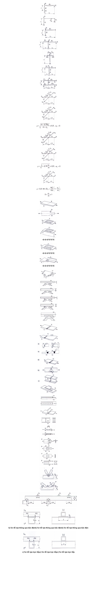

<strong>Hình I.1 — Sơ đồ tính toán ổn định cục bộ thành bụng của các thanh làm bằng thép định hình uốn hàn</strong>

$$và kết thúc bằng$$
<!-- formula_id: "F_TCVN_5575_2024_RID900" -->

c) \- Sơ đồ tựa trực tiếp

<strong>Hình I.1 (kết thúc)</strong>

### I.1.1.2  Khi mặt phẳng tác dụng của tải trọng không trùng với mặt phẳng bụng (sơ đồ tựa như trên Hình I.1c):

$$P_1 \le 5 \cdot 10^{-3} t^2 f_{yd} \gamma_c \left( 980 + 42 \frac{z}{t} - 0.22 \frac{zh}{t^2} - 0.11 \frac{h}{t} \right) \rho_1$$
<!-- formula_id: "F_TCVN_5575_2024_RID901" -->

$$\dots \qquad (I.3)$$
<!-- formula_id: "F_TCVN_5575_2024_FORMULA_I_3" -->

$$`.
*   `P_2 \le 5 \cdot 10^{-3} t^2 f_{yd} \gamma_c \left( 3050 + 23 \frac{z}{t} - 0.09 \frac{zh}{t^2} - 5 \frac{h}{t} \right) \rho_2`
*   End with `$$
<!-- formula_id: "F_TCVN_5575_2024_RID902" -->

$$\dots \qquad (I.4)$$
<!-- formula_id: "F_TCVN_5575_2024_FORMULA_I_4" -->

trong đó:

$$\rho_1 = \left( 1,15 - 0,15 \frac{r}{t} \right) \left( 1,33 - 0,33 \frac{f_{yd}}{230} \right)$$
<!-- formula_id: "F_TCVN_5575_2024_RID903" -->

$$\dots \qquad (I.5)$$
<!-- formula_id: "F_TCVN_5575_2024_FORMULA_I_5" -->

$$\rho_2 = \left( 1,06 - 0,06 \frac{r}{t} \right) \left( 1,22 - 0,22 \frac{f_{y\sigma}}{230} \right)$$
<!-- formula_id: "F_TCVN_5575_2024_RID904" -->

$$\dots \qquad (I.6)$$
<!-- formula_id: "F_TCVN_5575_2024_FORMULA_I_6" -->

Trong các công thức từ (I.1) đến (I.6):

t  là chiều dày bụng của thanh định hình uốn hàn;

z  là chiều dài quy ước phân bố tải trọng tập trung, không vượt quá chiều cao bụng h;

r  là bán kính vê tròn bên trong, không quá 4t;

$f_{yd}$  là cường độ tính toán của thanh định hình uốn hàn, tính bằng megapascan (МPа);

$P_{1}$ và $P_{2}$ là tải trọng và phản lực, tính bằng kilôniutơn (kN).

### I.1.2  Nút giàn có thanh bụng liên kết trực tiếp với thanh cánh

### I.1.2.1  Yêu cầu chung

Đối với nút giàn có các thanh bụng liên kết trực tiếp với thanh cánh (Hình I.2) cần kiểm tra (theo 15.2.5):

&nbsp;&nbsp;\- Khả năng chịu lực của bụng (cánh) của thanh cánh có thanh bụng tiếp giáp vào;

&nbsp;&nbsp;\- Khả năng chịu lực của thanh bụng ở chỗ gần mối tiếp giáp với thanh cánh;

&nbsp;&nbsp;\- Độ bền của đường hàn.

| а) Nút chữ K trong hệ thanh bụng tam giác | b) Nút chữ K  trong hệ thanh bụng xiên |  |
| :--- | :--- | :--- |

| c) Nút gối tựa | d) Nút chữ Y |  |
| :--- | :--- | :--- |

| e) Nút chữ X | f) Nút chữ T |  |
| :--- | :--- | :--- |

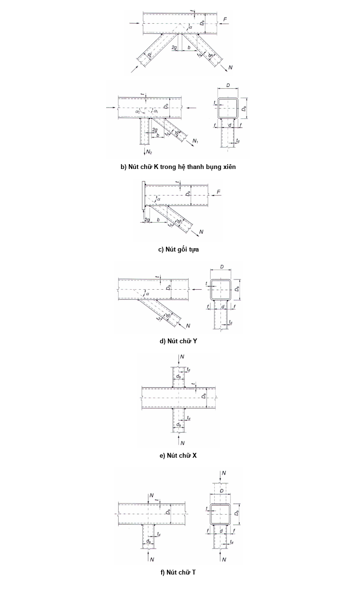

<strong>Hình I.2 — Nút giàn thép định hình uốn hàn</strong>

Các ký hiệu dùng trong I.1.2:

N  là lực trong các thanh tiếp giáp (các thanh bụng);

М  là mô men uốn do tác dụng chính trong thanh tiếp giáp trong mặt phẳng giàn tại tiết diện trùng với bụng (cánh) tiếp giáp của thanh cánh (mô men do độ cứng nút được tính đến theo 15.2.2; đối với giàn thép ống tròn - mô men tương tự trong thanh đang xét tại tiết diện đi qua giao điểm của trục thanh này với đường sinh của thanh cánh);

F  là lực dọc trong thanh cánh từ phía thanh bụng chịu kéo;

А  là diện tích tiết diện ngang của thanh cánh;

$f_{yd}$  là cường độ tính toán theo giới hạn chảy của thép thanh cánh;

t  là chiều dày bụng (cánh) của thanh cánh;

α  là góc tiếp giáp của thanh bụng với thanh cánh;

$A_{d}$  là diện tích tiết diện ngang của thanh bụng;

$t_{d}$  là chiều dày bụng (cánh) của thanh bụng;

$f_{yd,d}$  là cường độ tính toán theo giới hạn chảy của thép thanh bụng;

g  là một nửa khoảng cách giữa các bản bụng liền kề của các thanh bụng hoặc giữa thành ngang của thanh xiên và sườn gối; khoảng cách này cần đủ để đặt hai đường hàn.

### I.1.2.2  Tính toán nút giàn thép định hình uốn hàn

### I.1.2.2.1  Đối với nút giàn thép hộp chữ nhật uốn hàn (Hình I.2), cần kiểm tra theo các yêu cầu trong I.1.2.1, cũng như tính toán khả năng chịu lực của bụng thanh cánh (bụng song song mặt phẳng nút) tại vị trí tiếp giáp của thanh bụng chịu nén.

### I.1.2.2.2  Trong trường hợp hai thanh bụng trở lên có nội lực khác dấu tiếp giáp một bên với thanh cánh (xem Hình I.2a, b), cũng như một thanh bụng tiếp giáp một bên với thanh cánh tại nút gối tựa  (xem Hình I.2c) khi d/D ≤ 0, 9 và g/b ≤ 0, 25 , khả năng chịu lực của thành của cánh thanh cánh cần được kiểm tra đối với từng thanh tiếp giáp theo công thức:

$$\left( N + \frac{1,5M}{d_b} \right) \frac{(0,4 + 1,8gb)f \sin\alpha}{\gamma_c \gamma_d \gamma_D f_{yd} t^2 (b + g + \sqrt{2Df})} \leq 1$$
<!-- formula_id: "F_TCVN_5575_2024_RID911" -->

$$\dots \qquad (I.7)$$
<!-- formula_id: "F_TCVN_5575_2024_FORMULA_I_7" -->

trong đó:

&nbsp;&nbsp;&nbsp;&nbsp;\- $\gamma_{d}$  là hệ số ảnh hưởng của dấu nội lực trong thanh tiếp giáp, lấy bằng:

&nbsp;&nbsp;&nbsp;&nbsp;\- 1,2 - khi kéo;

&nbsp;&nbsp;&nbsp;&nbsp;\- 1,0 - trong các trường hợp còn lại;

&nbsp;&nbsp;&nbsp;&nbsp;\- $\gamma_{D}$  là hệ số ảnh hưởng của lực dọc trong thanh cánh, lấy như sau:

&nbsp;&nbsp;&nbsp;&nbsp;\- khi thanh cánh chịu nén và có |F|/($Af_{yd}$) > 0,5 :  $\gamma_{D}$= 1,5 − |F|/($Af_{yd}$);

&nbsp;&nbsp;&nbsp;&nbsp;\- trong các trường hợp còn lại:                             $\gamma_{D}$= 1,0;

&nbsp;&nbsp;&nbsp;&nbsp;\- b  là chiều dài đoạn thẳng giao nhau của thanh tiếp giáp với thanh cánh theo phương trục thanh cánh, bằng $d_{b}$/sinα;

&nbsp;&nbsp;&nbsp;&nbsp;\- f = (D − d)/ 2.

### I.1.2.2.3  Khả năng chịu lực của thành của cánh thanh cánh tại các nút chữ Y, X và T (xem Hình I.2d, e, f), cũng như các nút nêu tại I.1.2.2.2 khi g/b > 0, 25 cần được kiểm tra theo công thức:

$$\left( N + \frac{1,7M}{d_b} \right) \frac{f \sin \alpha}{\gamma_c \gamma_d \gamma_D f_{yd} t^2 (b + 2\sqrt{2Df})} \leq 1$$
<!-- formula_id: "F_TCVN_5575_2024_RID912" -->

$$\dots \qquad (I.8)$$
<!-- formula_id: "F_TCVN_5575_2024_FORMULA_I_8" -->

Công thức (I.8) áp dụng cho các nút chữ T, Y và X, cũng như cho nút chữ K nhưng có các thanh xiên cách nhau đủ lớn (chính là có tỉ số g/b > 0, 25 ). Trong trường hợp nút chữ K vừa nêu, ranh giới quy ước của phạm vi áp dụng các công thức (I.7) và (I.8) là giá trị g/b = 0,25 .

### I.1.2.2.4  Khả năng chịu lực của bụng thanh cánh trong mặt phẳng nút tại mối tiếp giáp của thanh chịu nén khi d/D > 0,85 cần được kiểm tra theo công thức:

$$\frac{N \sin^2 \alpha}{2 \gamma_c \gamma_t k f_{yd} t d_b} \leq 1$$
<!-- formula_id: "F_TCVN_5575_2024_RID913" -->

$$\dots \qquad (I.9)$$
<!-- formula_id: "F_TCVN_5575_2024_FORMULA_I_9" -->

trong đó:

&nbsp;&nbsp;&nbsp;&nbsp;\- $\gamma_{t}$  là hệ số ảnh hưởng độ mỏng thành tương đối của thanh cánh, lấy bằng:

&nbsp;&nbsp;&nbsp;&nbsp;\- khi $D_{b}$/t ≥ 25 :                          0,8;

&nbsp;&nbsp;&nbsp;&nbsp;\- trong các trường hợp còn lại:  1,0;

&nbsp;&nbsp;&nbsp;&nbsp;\- k  là hệ số, lấy bằng (Hình I.3):

&nbsp;&nbsp;&nbsp;&nbsp;\- khi 4 (t/$D_{b}$)$^{2}$ - $f_{yd}$/E≤0:                     k = 3,6 (t/$D_{b}$)$^{2}$ E/$f_{yd}$;

&nbsp;&nbsp;&nbsp;&nbsp;\- khi 0 < 4 (t/$D_{b}$)$^{2}$ - $f_{yd}$/E<6.10$^{-4}$:       k = 0,9 + 670(t/$D_{b}$)$^{2}$ - 170$f_{yd}$/E;

&nbsp;&nbsp;&nbsp;&nbsp;\- trong các trường hợp còn lại: k = 1,0.

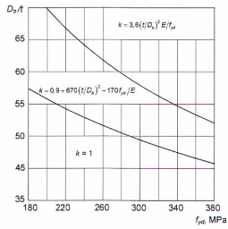

<strong>Hình I.3 — Đồ thị để xác định giá trị hệ số k phụ thuộc vào độ mỏng thành tương đối của thanh cánh</strong>

Hệ số k kể đến sự suy giảm có thể có của khả năng chịu lực của phần bụng thanh cánh như là bản mỏng chịu nén làm việc trong giai đoạn đàn hồi hoặc đàn dẻo ( k =$\sigma_{cr}$/$f_{yd}$ với $\sigma_{cr}$  là ứng suất tới hạn);

k = 1,0 đối với thép có $f_{yd}$ ≤ 400 МPа khi $D_{b}$/t ≤ 40 .

### I.1.2.2.5  Khả năng chịu lực của thanh bụng ở chỗ gần mối tiếp giáp với thanh cánh cần được kiểm tra như sau:

а) Tại các nút nêu trong I.1.2.2.2: theo công thức

$$\left( N + \frac{0,5M}{d_b} \right) \frac{(1,4 + 0,018 D t) \sin \alpha}{\gamma_c \gamma_d k f_{yd,d} A_d} \leq 1$$
<!-- formula_id: "F_TCVN_5575_2024_RID915" -->

$$\dots \qquad (I.10)$$
<!-- formula_id: "F_TCVN_5575_2024_FORMULA_I_10" -->

trong đó: k được xác định như trong I.1.2.2.4, nhưng thay các đặc trưng của thanh cánh bằng các đặc trưng của thanh bụng: $D_{b}$ thay bằng giá trị lớn hơn trong hai giá trị d hoặc $d_{d}$ ; t thay bằng $t_{d}$ và $f_{yd}$ thay bằng $f_{yd,d}$.

Đối với thanh bụng tiết diện không vuông, cần đưa thêm thừa số $\frac{3(1+\sigma \sigma_b)}{2(2+\sigma \sigma_b)}$ vào vế trái công thức (I.10).

b) \- Tại các nút nêu trong I.1.2.2.3: theo công thức

$$\left( N + \frac{0,5M}{d_b} \right) \frac{\left[ 1 + 0,01(3 + 5d \cdot D - 0,1d_b \cdot t_d)D \cdot t \right] \sin\alpha}{\gamma_c \gamma_d k f_{yd,d} A_d} \leq 1$$
<!-- formula_id: "F_TCVN_5575_2024_RID917" -->

$$\dots \qquad (I.11)$$
<!-- formula_id: "F_TCVN_5575_2024_FORMULA_I_11" -->

Biểu thức (3 + 5d/D − 0,1$d_{b/}t_{d}$ ) trong công thức (I.11) không được nhỏ hơn 0.

Đối với các thanh bụng tiết diện không vuông, cần đưa thêm thừa số (1 + d $d_{b}$)/2 vào vế trái công thức (I.11).

### I.1.2.2.6  Độ bền của đường hàn liên kết các thanh bụng với thanh cánh cần được kiểm tra như sau:

а) Tại các nút nêu trong I.1.2.2.2: theo công thức

$$\left( N + \frac{0,5M}{d_b} \right) \frac{(1,06 + 0,014 D t) \sin \alpha}{\beta_f h_f \gamma_c f_{wf} (2d_b \sin \alpha + d)} \leq 1$$
<!-- formula_id: "F_TCVN_5575_2024_RID918" -->

$$\dots \qquad (I.12)$$
<!-- formula_id: "F_TCVN_5575_2024_FORMULA_I_12" -->

trong đó: $\beta_{f}$ , $h_{f}$ , $f_{wf}$ lấy theo các yêu cầu của Điều 12;

b) \- Tại các nút nêu trong I.1.2.2.3: theo công thức

$$\left( N + \frac{0,5M}{d_b} \right) \frac{\left[ 1 + 0,01(3 + 5d'D - 0,1d_b t_d)D t \right] \sin \alpha}{4 \beta_t h_t d_b \gamma_c f_{wf}} \leq 1$$
<!-- formula_id: "F_TCVN_5575_2024_RID919" -->

$$\dots \qquad (I.13)$$
<!-- formula_id: "F_TCVN_5575_2024_FORMULA_I_13" -->

c) \- Các đường hàn thấu suốt chiều dày thành của thanh định hình uốn hàn khi để khe hở hàn bằng (0,5 ÷ 0,7) $t_{d}$ cần được tính toán như đường hàn đối đầu.

### I.1.2.2.7  Các công thức từ (I.7) đến (I.13) kể đến sự phân bố ứng suất không đều theo chu vi mặt đầu thanh bụng và khi khả năng chịu lực của thanh cánh tương đối cao có thể giới hạn được độ bền tính toán của nút.

### I.1.2.3  Tính toán nút giằng

### I.1.2.3.1  Đối với nút giằng thép định hình uốn hàn (Hình I.4) cần kiểm tra:

а) Độ bền và ổn định của các chi tiết nút và vùng tiếp giáp của thép định hình với nút;

b) \- Độ bền của liên kết hàn.

<!-- DIAGRAM: word/media/image850.png -->

а) Các dạng đuôi nút giằng

$$Hình ảnh bạn cung cấp là một bản vẽ kỹ thuật (sơ đồ cấu tạo mối nối), không chứa công thức toán học. Do đó, không có nội dung để chuyển đổi sang mã LaTeX.$$
<!-- formula_id: "F_TCVN_5575_2024_RID921" -->

b) \- Liên kết dùng/bản mã

**CHÚ DẪN:**

| 1  Đường trọng tâm tiết diện của bản mã giằng kèm sườn | 4  Sườn | 7  Mặt bích |
| :--- | :--- | :--- |
| 2  Trục bản mã giàn | 5  Bản mã giằng | 8  Bản táp |
| 3  Trục thép định hình uốn hàn | 6  Bản mã giàn | 9  Thanh giằng |

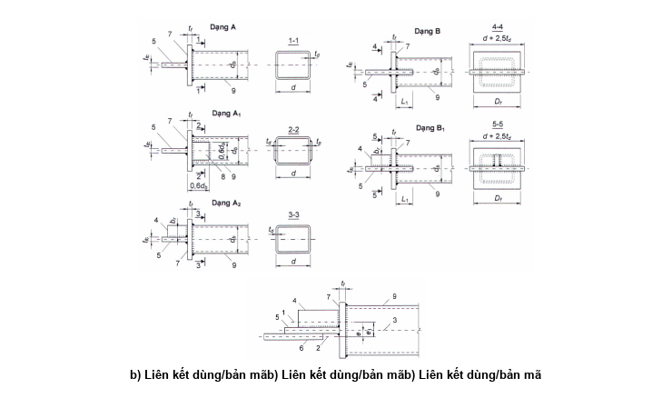

<strong>Hình I.4 — Nút giằng thép định hình uốn hàn</strong>

### I.1.2.3.2  Khả năng chịu kéo của thanh giằng được kiểm tra như sau:

a) \- Đối với nút dạng A (Hình I.4a): theo công thức

$$\frac{N}{\frac{f_{yf} t_f^2 D_f}{d_b - 3t_{f0}} + f_{yd,d} t_d d_b} \le 1$$
<!-- formula_id: "F_TCVN_5575_2024_RID922" -->

$$\dots \qquad (I.14)$$
<!-- formula_id: "F_TCVN_5575_2024_FORMULA_I_14" -->

trong đó:

&nbsp;&nbsp;&nbsp;&nbsp;\- N   là lực trong thanh giằng;

&nbsp;&nbsp;&nbsp;&nbsp;\- $f_{yf}$   là cường độ tính toán của thép mặt bích;

&nbsp;&nbsp;&nbsp;&nbsp;\- $D_{f}$   là chiều dài mặt bích dọc theo bản mã giằng;

&nbsp;&nbsp;&nbsp;&nbsp;\- $f_{yd ,d}$  là cường độ tính toán của thép thanh giằng.

&nbsp;&nbsp;&nbsp;&nbsp;\- Công thức (I.14) dựa trên cơ sở giả thiết khớp dẻo tuyến tính hình thành trong mặt bích dọc theo bản mã giằng;

b) \- Đối với nút dạng $A_{1}$ (xem Hình I.4a): theo công thức (I.14), nhưng thay $t_{d}$ bằng ($t_{d}$ + 0, 6$t_{p}$) , trong đó

$t_{p}$  là chiều dày bản táp;

c) \- Đối với nút dạng/b (xem Hình I.4a): theo công thức

$$\frac{N}{A f_{yd,d} \delta_f} \le 1$$
<!-- formula_id: "F_TCVN_5575_2024_RID923" -->

$$\dots \qquad (I.15)$$
<!-- formula_id: "F_TCVN_5575_2024_FORMULA_I_15" -->

trong đó:

&nbsp;&nbsp;&nbsp;&nbsp;\- A  là diện tích tiết diện ngang của thanh giằng;

&nbsp;&nbsp;&nbsp;&nbsp;\- $\delta_{f}$  là hệ số ảnh hưởng chiều sâu rãnh xẻ, lấy bằng:

&nbsp;&nbsp;&nbsp;&nbsp;\- khi 0,8 ≤ $L_{1/}$ $d_{b}$ < 1, 6 :   $\delta_{f}$ = 0,5 $L_{1}$/$d_{b}$ + 0,18 ;

&nbsp;&nbsp;&nbsp;&nbsp;\- khi $L_{1}$/$d_{b}$ ≥ 1, 6 :            $\delta_{f}$ = 1,0 .

### I.1.2.3.3  Khả năng chịu nén của thanh giằng được kiểm tra như sau:

a) \- Đối với nút dạng A (xem Hình I.4a): theo công thức (I.14) và theo các công thức

$$\frac{N}{A_{tc}f_{yd,d}} + \frac{Ne}{W_{tc}f_{yd,d}} \leq 1$$
<!-- formula_id: "F_TCVN_5575_2024_RID924" -->

$$\dots \qquad (I.16)$$
<!-- formula_id: "F_TCVN_5575_2024_FORMULA_I_16" -->

$$\frac{N}{A f_{yd, d} \gamma_e} + \frac{Ne}{W f_{yd, d} \gamma_e} \le 1$$
<!-- formula_id: "F_TCVN_5575_2024_RID925" -->

$$\dots \qquad (I.17)$$
<!-- formula_id: "F_TCVN_5575_2024_FORMULA_I_17" -->

b) \- Đối với các nút dạng $A_{2}$ và $B_{1}$: theo công thức (I.17) và theo công thức

$$\frac{N}{A_{\text{fc}} f_{\text{yd}, d}} + \frac{N e_1}{W_{\text{fc}} f_{\text{yd}, d}} \le 1$$
<!-- formula_id: "F_TCVN_5575_2024_RID926" -->

$$\dots \qquad (I.18)$$
<!-- formula_id: "F_TCVN_5575_2024_FORMULA_I_18" -->

Trong các công thức từ (I.16) đến (I.18):

e, $e_{1}$  là các khoảng cách từ trục bản mã giàn đến trục thanh giằng và đến trọng tâm tiết diện chữ T của bản mã giằng kèm sườn (xem Hình I.4b);

A, W  lần lượt là diện tích và mô men chống uốn của tiết diện ngang của thép định hình đối với trục bản mã giằng;

$A_{fc}$ , $W_{fc}$  lần lượt là diện tích và mô men chống uốn của tiết diện ngang của bản mã giằng kèm cả sườn (khi có sườn);

$\gamma_{e}$  là hệ số điều kiện làm việc, lấy phụ thuộc vào độ mảnh quy ước lớn nhất của thép định hình:

$$\begin{aligned}
\text{khi } \overline{\lambda} \le 0,45 &: \qquad \gamma_e = 0,6 \text{;} \\
\text{khi } \overline{\lambda} > 0,45 &: \qquad \gamma_e = 0,54 + 0,15\overline{\lambda} \text{, nhưng không lớn hơn } 1,0\text{.}
\end{aligned}$$
<!-- formula_id: "F_TCVN_5575_2024_RID927" -->

Các công thức từ (I.16) đến (I.18) chỉ đúng khi tỷ số các kích thước tiết diện ngang của thanh giằng nằm trong khoảng 0,75 ≤ $d_{b/}$ d ≤ 1,1 và tỷ số cạnh lớn trên chiều dày của thanh giằng không lớn hơn 45.

### I.1.2.3.4  Tính toán liên kết hàn của thanh định hình và bản mã giằng với mặt bích của các nút dạng A, A1, A2 cần được tiến hành theo 14.1 có kể đến hệ số điều kiện làm việc $\gamma_{cf}$ = 0,8 (để kể đến sự truyền nội lực không đều) và theo kim loại biên nóng chảy với mặt bích theo phương chiều dày thép cán theo công thức

$$\frac{N}{h_f L_w f_{th} \gamma_{ws} \gamma_{cf}} \le 1$$
<!-- formula_id: "F_TCVN_5575_2024_RID928" -->

$$\dots \qquad (I.19)$$
<!-- formula_id: "F_TCVN_5575_2024_FORMULA_I_19" -->

trong đó: $f_{th}$ là cường độ của thép theo phương chiều dày thép cán.

### I.1.2.4  Thiết kế

### I.1.2.4.1  Chiều dài tính toán của các khoang cánh trên của giàn mái không xà gồ $L_{ef}$ được xác định theo công thức:

$L_{ef}$ = μL

$$\dots \qquad (I.20)$$
<!-- formula_id: "F_TCVN_5575_2024_FORMULA_I_20" -->

trong đó:

&nbsp;&nbsp;&nbsp;&nbsp;\- L  là chiều dài khoang;

&nbsp;&nbsp;&nbsp;&nbsp;\- $\mu$ là hệ số chiều dài tính toán, lấy bằng:

| $0{,}65 \cdot \sqrt{\frac{n \cdot 10^3 + 1}{n \cdot 10^3 + 0{,}43}}$ | &nbsp;&nbsp;\- đối với khoang cánh không giáp biên với nút khớp (ví dụ: liên kết mặt bích dùng/bu lông) và khi có tải trọng phân bố đều trên các khoang liền kề; |
| :--- | :--- |
| $0,8 \cdot \sqrt{\frac{n \cdot 10^3 + 1}{n \cdot 10^3 \div 0,65}}$ | &nbsp;&nbsp;\- đối với khoang cánh giáp biên với nút khớp hoặc với khoang không có tải trọng phân bố đều; |

trong đó:

&nbsp;&nbsp;&nbsp;&nbsp;\- n = qH/(2N)  là tham số của tải trọng phân bố đều $\left(0 \le n \le \frac{4 H H_t}{L^2}\right);$

&nbsp;&nbsp;&nbsp;&nbsp;\- q  là tải trọng phân bố đều trên thanh cánh;

&nbsp;&nbsp;&nbsp;&nbsp;\- N  là lực dọc;

&nbsp;&nbsp;&nbsp;&nbsp;\- H  là chiều cao tiết diện thanh cánh;

&nbsp;&nbsp;&nbsp;&nbsp;\- $H_{t}$  là chiều cao giàn tính theo trục các thanh cánh;

&nbsp;&nbsp;&nbsp;&nbsp;\- L  là nhịp giàn.

### I.1.2.4.2  Tỷ số chiều cao trên chiều dày thành của thanh cánh $D_{b}$/t lấy không lớn hơn 45, của thanh bụng $d_{b}$/$t_{d}$ - không lớn hơn 60.

### I.1.2.4.3  Kích thước thanh bụng theo chiều rộng (ngoài mặt phẳng kết cấu) lấy không lớn hơn D -2 (t + $t_{d}$) để thuận tiện cho việc đặt các đường hàn.

### I.1.2.4.4  Đối với thanh bụng, chiều rộng d lấy không nhỏ hơn 0,6D (D là chiều rộng thanh cánh).

### I.1.2.4.5  Khoảng cách giữa “các mũi” liền kề của các thanh xiên được lấy tối thiểu theo điều kiện sao cho đặt được hai đường hàn.

### I.1.2.4.6  Các mối nối trong nhà máy của các thanh cần được thực hiện bằng hàn đối đầu trên bản lót để lại. Không được bố trí các mối nối này trong thanh chịu kéo có ứng suất lớn hơn 0,9$f_{yd}$.

### I.2  Giàn có các thanh cánh làm bằng thép chữ I cánh rộng

### I.2.1  Yêu cầu chung

### I.2.1.1  Giàn mái có các thanh cánh làm bằng thép chữ I cánh rộng song song (sau đây gọi là chữ H) và các thanh bụng làm bằng thép định hình kín uốn hàn và thép chữ H, tiếp giáp trực tiếp với cánh của thanh cánh, được sử dụng trong vùng có nhiệt độ tính toán cao hơn âm 40 °С.

Đối với các giàn này, sử dụng thép có $f_{y}$ ≤ 380 МPа và vật liệu hàn có $f_{wun}$ = 490 МPа.

### I.2.1.2  Khi tính toán giàn có e/$D_{b}$ ≤ 1/10 (trong đó $D_{b}$ là chiều cao tiết diện thanh cánh; e là khoảng cách từ điểm giao trục các thanh bụng đến trục thanh cánh), không cần kể đến độ lệch tâm nút (xem các hình I.5 và I.6).

$$\text{a) Nút chữ K} \qquad \text{b) Nút chữ T}$$
<!-- formula_id: "F_TCVN_5575_2024_RID932" -->

<!-- DIAGRAM: word/media/image863.png -->

c) \- Nút gối tựa

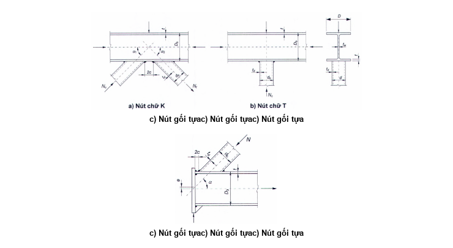

<strong>Hình I.5 — Các dạng nút giao thép chữ H với thép hộp chữ nhật uốn hàn</strong>

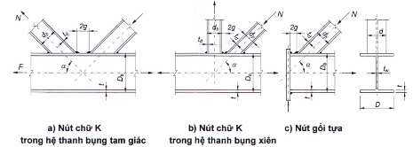

<strong>Hình I.6 — Các dạng nút giàn thép chữ H</strong>

### I.2.1.3  Mô men uốn do độ lệch tâm nút và độ cứng nút trong các thanh giàn có lực dọc không đổi dấu (khi không có tải trọng ngang tác dụng lên thanh) được kể đến theo công thức:

<!-- DIAGRAM: word/media/image865.png -->

$$\dots \qquad (I.21)$$
<!-- formula_id: "F_TCVN_5575_2024_FORMULA_I_21" -->

trong đó:

&nbsp;&nbsp;&nbsp;&nbsp;\- N và М  là lực dọc tính toán và mô men tính toán;

&nbsp;&nbsp;&nbsp;&nbsp;\- А và W  là diện tích và mô men chống uốn của tiết diện ngang của thanh giàn.

Khi đó, giá trị mô men $M_{e}$ do độ lệch tâm nút phải thỏa mãn điều kiện:

$$M_e \le W \left( f_{yd} - \frac{N}{A} \right)$$
<!-- formula_id: "F_TCVN_5575_2024_RID936" -->

$$\dots \qquad (I.22)$$
<!-- formula_id: "F_TCVN_5575_2024_FORMULA_I_22" -->

trong đó:

&nbsp;&nbsp;&nbsp;&nbsp;\- A, W, $f_{yd}$  lần lượt là diện tích tiết diện ngang, mô men chống uốn của tiết diện ngang và cường độ tính toán của thép của một trong các khoang cánh của nút lệch tâm.

&nbsp;&nbsp;&nbsp;&nbsp;\- Công thức (I.21) kể đến biến dạng dẻo của thép trong các tiết diện tại các đầu thanh.

### I.2.1.4  Đối với thanh bụng chịu kéo mà được tính không kể đến mô men uốn, lấy hệ số điều kiện làm việc $\gamma_{c}$ = 0,85 .

### I.2.1.5  Tính toán ổn định của thanh chịu nén khi nó không chịu tác dụng của tải trọng ngang được thực hiện không kể đến mô men uốn. Chiều dài tính toán lấy theo Bảng 25. Đối với giàn có kể đến mô men uốn khi tính toán, cần giảm chiều dài tính toán của các thanh bụng trong mặt phẳng giàn có kể đến liên kết đàn hồi của chúng vào hai thanh cánh.

Khi tại nút của thanh cánh chịu nén không có các bản gia cường (xem I.2.3.2), thì trong tính toán ổn định của thanh này sử dụng hệ số điều kiện làm việc $\gamma_{c}$ = 0,85 .

Các thanh chống giữ thanh cánh chịu nén ngoài mặt phẳng giàn và liên kết của chúng phải được tính theo công thức (17).

### I.2.2  Tính toán nút

### I.2.2.1  Đối với nút giàn không tăng cứng (xem các hình I.5 và I.6), gồm thanh cánh chữ H và các thanh bụng tiếp giáp với thanh cánh, cần kiểm tra:

− Khả năng/bị uốn cong của phần cánh thanh cánh tiếp xúc với thanh bụng;

− Khả năng chịu lực của đoạn bụng thanh cánh ứng với thanh bụng chịu nén;

− Khả năng chịu lực của tiết diện ngang thanh cánh;

− Khả năng chịu lực của thanh bụng tại vùng tiếp giáp với thanh cánh;

− Độ bền của đường hàn liên kết thanh bụng với thanh cánh.

### I.2.2.2  Tại mối tiếp giáp không tăng cứng của các thanh bụng tiết diện hộp chữ nhật uốn hàn với thanh cánh trong nút chữ K và nút gối tựa (xem Hình I.5a,c) khi с ≤ 15 mm (c là một nửa khoảng cách giữa các “mũi” của các thanh bụng), khả năng/bị uốn cong cánh của thanh cánh cần được kiểm tra đối với từng mối tiếp giáp riêng/biệt theo công thức:

$$\frac{|N| + \frac{|M|}{d_b}}{\gamma_c \left[ \gamma_D f_{yd} t^2 \left( \frac{4}{\sin\alpha} + \frac{2D\sqrt{2}}{d_a} \right) + f_{yd,0} t_0 d \right]} \le 1$$
<!-- formula_id: "F_TCVN_5575_2024_RID937" -->

$$\dots \qquad (I.23)$$
<!-- formula_id: "F_TCVN_5575_2024_FORMULA_I_23" -->

trong đó:

&nbsp;&nbsp;&nbsp;&nbsp;\- N  là nội lực trong thanh bụng;

&nbsp;&nbsp;&nbsp;&nbsp;\- М  là mô men uốn trong thanh tiếp giáp trong mặt phẳng nút tại tiết diện trùng với cánh tiếp giáp của thanh cánh;

&nbsp;&nbsp;&nbsp;&nbsp;\- $\gamma_{c}$  là hệ số điều kiện làm việc, lấy theo Bảng 1;

&nbsp;&nbsp;&nbsp;&nbsp;\- $\gamma_{D}$  là hệ số, lấy bằng:

&nbsp;&nbsp;&nbsp;&nbsp;\- (1,5 - σ/$f_{yd}$) - nếu thanh cánh chịu nén khi σ/$f_{yd}$ > 0,5 ;

&nbsp;&nbsp;&nbsp;&nbsp;\- 1,0              - trong các trường hợp còn lại;

&nbsp;&nbsp;&nbsp;&nbsp;\- $\sigma$ là ứng suất dọc trục trong khoang cánh từ phía thanh xiên chịu kéo;

&nbsp;&nbsp;&nbsp;&nbsp;\- $f_{yd}$  là cường độ tính toán theo giới hạn chảy của thép thanh cánh;

&nbsp;&nbsp;&nbsp;&nbsp;\- $f_{yd ,d}$  là cường độ tính toán theo giới hạn chảy của thép thanh bụng.

### I.2.2.3  Tại mối tiếp giáp không tăng cứng của thanh bụng tiết diện hộp chữ nhật uốn hàn với thanh cánh trong nút chữ T (xem Hình I.5b) cũng như nút chữ K và nút gối tựa, khi c > 15 mm thì khả năng bị uốn cong mép cánh của thanh cánh cần được kiểm tra theo công thức:

$$\frac{|N| + \frac{|M|}{d_0}}{0,9 \gamma_c \left( f_{yd} \gamma_D t^2 \frac{2D\sqrt{2} + d_0}{d \sin\alpha} + f_{yd,d} t_d d \right)} \le 1$$
<!-- formula_id: "F_TCVN_5575_2024_RID938" -->

$$\dots \qquad (I.24)$$
<!-- formula_id: "F_TCVN_5575_2024_FORMULA_I_24" -->

Khi $d_{b}$ = d : kiểm tra theo công thức

$$\frac{|N| + \frac{|M|}{d_a}}{\gamma_c \left( 3\gamma_0 \frac{f_{yd} t^2 D}{d \sin\alpha} + f_{yd,d} t_d d \right)} \leq 1$$
<!-- formula_id: "F_TCVN_5575_2024_RID939" -->

$$\dots \qquad (I.25)$$
<!-- formula_id: "F_TCVN_5575_2024_FORMULA_I_25" -->

### I.2.2.4  Đối với nút giàn thép chữ H (xem Hình I.6), cần kiểm tra theo I.2.2.1, cũng như kiểm tra:

&nbsp;&nbsp;\- Khả năng chịu lực của đoạn bụng thanh cánh ứng với thanh bụng chịu nén;

&nbsp;&nbsp;\- Khả năng chịu trượt của tiết diện ngang của thanh cánh.

### I.2.2.5  Trường hợp có hai hoặc nhiều hơn thanh bụng chữ H có nội lực khác dấu tiếp giáp một bên với thanh cánh chữ H (xem Hình I.6a, b), cũng như trường hợp có một thanh bụng chữ H tiếp giáp một bên với thanh cánh chữ H tại nút gối tựa (xem Hình I.6c), khi g ≤ 15 mm thì khả năng chịu lực của cánh thanh cánh cần được kiểm tra đối với từng thanh tiếp giáp theo công thức:

$$\frac{N + \frac{M}{d_b}}{\frac{\gamma_c \gamma_D f_{yd} t^2}{d} \left( \frac{2d_d}{\sin^2 \alpha} + \frac{D^2}{d_a} + \frac{2D\sqrt{2}}{\sin \alpha} \right) + f_{yd,d} (A_d - t_d d)} \le 1$$
<!-- formula_id: "F_TCVN_5575_2024_RID940" -->

$$\dots \qquad (I.26)$$
<!-- formula_id: "F_TCVN_5575_2024_FORMULA_I_26" -->

trong đó: $\gamma_{D}$ là hệ số, được xác định theo I.1.2.2.2.

### I.2.2.6  Khả năng chịu lực của đoạn bụng thanh cánh chữ H dưới tác dụng của thanh bụng tiết diện hộp chữ nhật uốn hàn chịu nén cần được kiểm tra theo công thức:

$$\frac{N\sin\alpha}{10\gamma_c\gamma_Df_{yd}t_w(t+t_d)} \le 1$$
<!-- formula_id: "F_TCVN_5575_2024_RID941" -->

$$\dots \qquad (I.27)$$
<!-- formula_id: "F_TCVN_5575_2024_FORMULA_I_27" -->

Khả năng chịu lực của đoạn bụng thanh cánh chữ H dưới tác dụng của thanh bụng chữ H chịu nén cần được kiểm tra theo công thức:

$$\frac{N\sin^2\alpha}{1,5\gamma_c\gamma_D f_{yd} d_b t_w} \le 1$$
<!-- formula_id: "F_TCVN_5575_2024_RID942" -->

$$\dots \qquad (I.28)$$
<!-- formula_id: "F_TCVN_5575_2024_FORMULA_I_28" -->

trong đó:

&nbsp;&nbsp;&nbsp;&nbsp;\- $t_{w}$  là chiều dày bụng thanh cánh.

### I.2.2.7  Khả năng chịu lực của tiết diện ngang thanh cánh chữ H dưới tác dụng của lực cắt tại nút cần được kiểm tra theo công thức:

$$\frac{V}{\gamma_c f_v \left[ A - (2 - \chi) Dt + (t_w + 2r)t \right]} \le 1$$
<!-- formula_id: "F_TCVN_5575_2024_RID943" -->

$$\dots \qquad (I.29)$$
<!-- formula_id: "F_TCVN_5575_2024_FORMULA_I_29" -->

trong đó:

&nbsp;&nbsp;&nbsp;&nbsp;\- V  là lực cắt tại nút, bằng giá trị nhỏ nhất trong các tích N sinα;

&nbsp;&nbsp;&nbsp;&nbsp;\- $f_{v}$  là cường độ chịu trượt tính toán của thép thanh cánh;

$$\chi = \frac{1}{\sqrt{1 + 16(g^2 - 3t^2)}}$$
<!-- formula_id: "F_TCVN_5575_2024_RID944" -->

&nbsp;&nbsp;&nbsp;&nbsp;\- r  là bán kính vê tròn của thanh cánh định hình.

### I.2.2.8  Khả năng chịu lực của thanh bụng chữ H tại chỗ gần mối tiếp giáp với thanh cánh cần được kiểm tra theo công thức:

$$\frac{N\left(1 + 0{,}05\frac{d}{t}\right)}{\gamma_c \gamma_d f_{yd,p} A_d} \le 1$$
<!-- formula_id: "F_TCVN_5575_2024_RID945" -->

$$\dots \qquad (I.30)$$
<!-- formula_id: "F_TCVN_5575_2024_FORMULA_I_30" -->

trong đó: $\gamma_{D}$ là hệ số, lấy theo I.1.2.2.2.

Đối với các thanh tiếp giáp làm bằng thép hộp chữ nhật uốn hàn, thay giá trị 0,05 trong công thức (I.30) bằng:

0,14 - cho nút chữ K;

0,06 - cho nút gối tựa;

0,10 - cho nút chữ T.

### I.2.2.9  Tiết diện của các đường hàn dùng để liên kết các thanh bụng với thanh cánh cần được lấy tương ứng với độ bền của các đoạn (cánh, bụng) của thanh bụng chữ H.

### I.2.2.10  Tại nút giàn được gia cường/bằng các bản nghiêng (Hình I.7) cần kiểm tra khả năng chịu lực của đoạn bụng thanh cánh chữ H ứng với thanh bụng theo công thức:

$$\left(|N| + \frac{|M|}{d_b}\right) \frac{\sin\alpha}{2\gamma_c \gamma_d \gamma_D f_{yd} t_w d} \le 1$$
<!-- formula_id: "F_TCVN_5575_2024_RID946" -->

$$\dots \qquad (I.31)$$
<!-- formula_id: "F_TCVN_5575_2024_FORMULA_I_31" -->

Ngoài ra, cần kiểm tra khả năng chịu lực của các bản nghiêng dưới tác dụng của lực là hiệu của nội lực trong thanh bụng N và khả năng chịu lực của thanh bụng đã tính theo I.2.2.8.

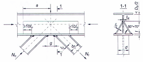

<strong>Hình I.7 — Nút của giàn được gia cường/bằng các bản nghiêng</strong>

### I.2.2.11  Các công thức từ (I.23) đến (I.26) được xây dựng dựa trên giả thiết sự phát triển biến dạng dẻo đồng thời trong cánh thanh cánh và trên đoạn thành của cánh thanh bụng tiếp xúc với cánh thanh cánh. Các công thức (I.27), (I.28), (I.29) và (I.31) được dựa trên cơ sở biểu thức rút gọn về sự làm việc của bụng thanh cánh tại vùng nút. Việc tính toán mối tiếp giáp các thanh bụng làm bằng thép định hình uốn hàn theo công thức (I.30) sẽ giới hạn được khả năng chịu lực của các nút không tăng cứng trong miền đủ rộng các tham số khi giảm đáng kể hệ số sử dụng tiết diện của các thanh bụng này và yêu cầu cùng với đó là tăng cứng cánh của thanh cánh chữ H.

### I.2.3  Cấu tạo

### I.2.3.1  Mối tiếp giáp của các thanh bụng vào thanh cánh cần được thiết kế bằng hàn không/bản mã.

### I.2.3.2  Để đảm bảo khả năng chịu lực của nút, cánh của chữ H tại vị trí tiếp giáp với các thanh bụng cần được tăng cứng/bằng các bản nghiêng dọc (xem Hình I.7). Cần đặt các cặp sườn cứng tại vị trí tiếp giáp của thanh bụng chữ H, cũng như tại nút chữ T có thanh đứng khi dùng/bản mã đứng để liên kết thanh giằng.

### I.2.3.3  Mối nối tổ hợp giàn cần được thiết kế bằng liên kết mặt bích dùng/bu lông: tại cao độ cánh chịu nén - dùng/bu lông thường, tại cao độ cánh chịu kéo - dùng/bu lông cường độ cao (xem 12.3).

### I.2.3.4  Hệ giằng nằm ngang theo các giàn cần được liên kết vào cánh ngoài của thanh cánh.

### I.2.3.5  Trong liên kết với cột (đoạn cột trên), phải loại trừ được chuyển vị đứng của đầu thanh cánh trên và đảm bảo đầu này có độ di động ngang với giá trị bằng giá trị chuyển dịch so với nút gối tựa.

### I.2.3.6  Cần gia công vát mép trước khi thực hiện đường hàn góc tại “mũi” các thanh bụng làm bằng thép định hình uốn hàn có $t_{d}$ > 5 mm (Hình I.8). Các thông số đường hàn ở “mũi” các thanh bụng xem trong/bảng I.1.

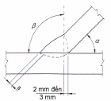

<strong>Hình I.8 — Chi tiết hàn “mũi” thép định hình uốn hàn</strong>

### Bảng I.1 - Các thông số đường hàn ở “mũi” các thanh bụng

| α , ° | β , ° | s, mm |
| :--- | :---: | :--- |
| ≥ 35; ≤ 45 | 90 | ≥ 2; ≤ 3 |
| ≥ 46; ≤ 60 | 75 | ≥ 3; ≤ 4 |
| ≥ 61; ≤ 90 | 55 | ≥ 3; ≤ 5 |

### I.2.3.7  Khoảng cách giữa các đường hàn ngang (các đường hàn góc đầu) trên cánh của thanh cánh (ở mũi các thanh bụng) được lấy không nhỏ hơn:

## 5  MM - TẠI NÚT GỐI TỰA VÀ NÚT NỐI ĐỐI ĐẦU CỦA THANH CÁNH CHỊU NÉN;

## 20  MM - TRONG CÁC TRƯỜNG HỢP CÒN LẠI (XEM G TRÊN HÌNH I.7).

### I.3  Kết cấu thép ống tròn

### I.3.1  Yêu cầu chung

### I.3.1.1  Kết cấu rỗng làm bằng thép ống cần được thiết kế với các liên kết hàn trực tiếp (không/bản mã) tại các nút, trong đó có dự tính việc thực hiện các đường cắt cong và cắt mép ống đối với các liên kết này bằng các máy cắt hơi chuyên dụng.

### I.3.1.2  Trong kết cấu rỗng, đặc biệt khi được sử dụng trong môi trường xâm thực, cả các thanh chịu nén và các thanh chịu kéo cần được làm bằng thép ống, khi đó các thanh chịu lực nhiều nhất (với các thanh chịu nén - khi độ mảnh không lớn hơn 60) cần được làm bằng thép có giới hạn chảy bằng 440 MPa trở lên.

### I.3.2  Tính toán

### I.3.2.1  Khi tính toán liên kết hàn đối đầu của các thanh ống/bằng hàn không có ống lót, cần bổ sung thêm hệ số điều kiện làm việc $\gamma_{wc}$ = 0,75, còn khi tính toán liên kết chữ T có góc mở đường hàn lớn hơn 30° (được tính toán như liên kết hàn đối đầu) khi hàn không hàn đắp gốc đường hàn thì lấy $\gamma_{wc}$ = 0,85.

### I.3.2.2  Chiều dài tính toán $L_{ef}$ của các thanh trong kết cấu rỗng làm bằng thép ống với các nút không/bản mã, trừ các thanh của hệ thanh bụng chữ thập, cần được lấy theo Bảng I.2.

### Bảng I.2 - Chiều dài tính toán $L_{ef}$ của các thanh làm bằng thép ống trong kết cấu rỗng

| Phương uốn dọc | Giá trị $L_{ef}$ của — thanh cánh, thanh xiên gối tựa và thanh đứng gối tựa | Giá trị $L_{ef}$ của — các thanh bụng khác — không/bóp bẹp đầu | Giá trị $L_{ef}$ của — các thanh bụng khác — có bóp bẹp — một hoặc hai đầu trong các mặt phẳng khác nhau | Giá trị $L_{ef}$ của — các thanh bụng khác — có bóp bẹp — hai đầu trong một mặt phẳng |
| :--- | :--- | :--- | :--- | :--- |
| 1. Trong mặt phẳng hệ thanh bụng | L | 0, 85L | 0,9L | 0,95L |
| 2. Theo phương vuông góc với mặt phẳng hệ thanh bụng (ngoài mặt phẳng) | $L_{1}$ | 0,85$L_{1}$ | 0,9$L_{1}$ | 0,95$L_{1}$ |
| **Các ký hiệu trong/bảng I.2: L là chiều dài hình học của thanh (khoảng cách giữa tâm các nút); $L_{1}$ là khoảng cách giữa các nút có liên kết chặn chuyển vị ngoài mặt phẳng hệ thanh bụng.** |  |  |  |  |

### I.3.2.3  Tính toán độ bền của thanh bằng thép ống có đường kính D và chiều dày t có bóp bẹp đầu,  chịu nén đúng tâm, cần được thực hiện theo công thức (4) có kể đến hệ số $\gamma_{ct}$ xác định như sau:

a) \- Khi đoạn chuyển tiếp từ tiết diện tròn đến phần tiết diện bóp bẹp đầu được tạo hình tự do: theo công thức

$$\gamma_\alpha = 1 - 0{,}015 \frac{D}{t}$$
<!-- formula_id: "F_TCVN_5575_2024_RID949" -->

$$\dots \qquad (I.32)$$
<!-- formula_id: "F_TCVN_5575_2024_FORMULA_I_32" -->

nhưng không lớn hơn 0,7 và không nhỏ hơn 0,3.

b) \- Khi đoạn chuyển tiếp từ tiết diện tròn đến phần tiết diện bóp bẹp đầu được tạo hình bắt buộc (thoải dần trên một đoạn dài (2,5 ÷ 3)D: theo công thức

$$\gamma_{cl} = 1,3 - 0,015 \frac{D}{t}$$
<!-- formula_id: "F_TCVN_5575_2024_RID950" -->

$$\dots \qquad (I.33)$$
<!-- formula_id: "F_TCVN_5575_2024_FORMULA_I_33" -->

nhưng không lớn hơn 1,0 và không nhỏ hơn 0,4.

### I.3.2.4  Tính toán liên kết hàn đối đầu của các thanh làm bằng thép ống chịu kéo đúng tâm hoặc nén đúng tâm cần được tiến hành theo công thức:

$$\frac{N}{\pi D_m t f_w \gamma_{wc}} \le 1$$
<!-- formula_id: "F_TCVN_5575_2024_RID951" -->

$$\dots \qquad (I.34)$$
<!-- formula_id: "F_TCVN_5575_2024_FORMULA_I_34" -->

trong đó:

&nbsp;&nbsp;&nbsp;&nbsp;\- $D_{m}$  là đường kính trung/bình (bằng một nửa tổng đường kính ngoài và đường kính trong) của ống có chiều dày thành nhỏ hơn;

&nbsp;&nbsp;&nbsp;&nbsp;\- t  là chiều dày thành nhỏ nhất của các ống được nối;

&nbsp;&nbsp;&nbsp;&nbsp;\- $f_{w}$ ,$\gamma_{wc}$  là cường độ tính toán theo giới hạn chảy và hệ số điều kiện làm việc của liên kết hàn đối đầu tương ứng, $\gamma_{wc}$ lấy theo I.3.2.1.

&nbsp;&nbsp;&nbsp;&nbsp;\- Không cần tính toán liên kết hàn đối đầu trong trường hợp hàn có ống lót dùng vật liệu hàn theo tiêu chuẩn này và kiểm tra các đường hàn chịu kéo bằng phương pháp thử không phá hủy.

### I.3.2.5  Tính toán liên kết hàn chữ T trong liên kết của các thanh thép ống hàn với các thanh khác (Hình I.9) có mặt trụ hoặc mặt phẳng (các thanh cái) dưới tác dụng của lực dọc N cần được thực hiện theo các công thức:

$$N \le 0,85 ( S_{wh} + S_{wt} ) \qquad (I.35)$$
<!-- formula_id: "F_TCVN_5575_2024_FORMULA_I_35" -->

$$N \le 2 S_{wh} \qquad (I.36)$$
<!-- formula_id: "F_TCVN_5575_2024_FORMULA_I_36" -->

$$N \le 2 S_{wt} \qquad (I.37)$$
<!-- formula_id: "F_TCVN_5575_2024_FORMULA_I_37" -->

trong đó:

&nbsp;&nbsp;&nbsp;&nbsp;\- $S_{wh}$ và $S_{wt}$ lần lượt là khả năng chịu lực của các đoạn đường hàn gót và mũi (các đoạn đường hàn thuộc một nửa tiết diện thanh xiên tính từ phía góc nhọn và góc tù tương ứng của trục giao nhau của ống với bề mặt thanh cái), được xác định theo các công thức:

$$S_{wh} = (t_d L_{wzh} f_{w} \gamma_{wc} + h_f L_{wzh} f_{wd})\gamma_c$$
<!-- formula_id: "F_TCVN_5575_2024_RID952" -->

$$\dots \qquad (I.38)$$
<!-- formula_id: "F_TCVN_5575_2024_FORMULA_I_38" -->

$$`.
    *   `S_{wt}`
    *   `=`
    *   `(`
    *   `t_d L_{wt} f_w \gamma_{wc}`
    *   `+`
    *   `h_r L_{wt} f_{wd}`
    *   `)`
    *   `\gamma_c`
    *   End with `$$
<!-- formula_id: "F_TCVN_5575_2024_RID953" -->

$$\dots \qquad (I.39)$$
<!-- formula_id: "F_TCVN_5575_2024_FORMULA_I_39" -->

trong đó:

&nbsp;&nbsp;&nbsp;&nbsp;\- $f_{w}$  là cường độ chịu nén tính toán hoặc chịu kéo tính toán của liên kết hàn đối đầu theo giới hạn chảy;

&nbsp;&nbsp;&nbsp;&nbsp;\- $f_{wd}$  là giá trị nhỏ hơn trong hai giá trị: 0, 7$f_{wf}$ hoặc $f_{ws}$ với $f_{wf}$ và $f_{ws}$ là cường độ chịu cắt  (hoặc cắt quy ước) của đường hàn góc theo kim loại đường hàn và theo kim loại biên nóng chảy tương ứng;

&nbsp;&nbsp;&nbsp;&nbsp;\- $t_{d}$  là chiều dày thành ống được liên kết;

&nbsp;&nbsp;&nbsp;&nbsp;\- $h_{f}$  là chiều cao đường hàn góc;

&nbsp;&nbsp;&nbsp;&nbsp;\- $L_{wah}$ và $L_{wat}$ là các tổng chiều dài các đoạn đường hàn mà được coi như là đường hàn đối đầu ở các đoạn đường hàn gót và mũi tương ứng;

&nbsp;&nbsp;&nbsp;&nbsp;\- $L_{wfh}$ và $L_{wft}$    là các tổng chiều dài các đoạn đường hàn mà được coi như là đường hàn góc ở các đoạn đường hàn gót và mũi tương ứng;

&nbsp;&nbsp;&nbsp;&nbsp;\- $\gamma_{wc}$  là hệ số điều kiện làm việc của liên kết hàn chữ T, lấy theo I.3.2.1.

&nbsp;&nbsp;&nbsp;&nbsp;\- Các đường hàn sau đây được coi là đường hàn góc:

a) \- Khi cắt vuông góc (không vát) đầu ống được liên kết (xem Hình I.9c): các đoạn đường hàn mà có góc mở đường hàn θ tính theo công thức (I.40) nhỏ hơn 30° hoặc lớn hơn 60°;

b) \- Khi cắt vát đầu ống được liên kết dưới một góc không đổi hoặc thay đổi ω (xem Hình I.9d, e): các đoạn đường hàn có giá trị θ tính theo công thức (I.40) nhỏ hơn 15° hoặc lớn hơn 60°;

c) \- Khi phay đầu ống được liên kết (xem Hình I.9f), cũng như trong các liên kết có ống cắm xuyên qua lỗ vào thanh cái: toàn bộ chiều dài đường hàn;

d) \- Khi các thanh xiên giao nhau, nếu xét liên kết một thanh xiên xuyên qua (không/bị gián đoạn trên đường giao nhau) thanh xiên khác (bị gián đoạn): toàn bộ chiều dài đoạn giao nhau các thanh xiên.

Các đoạn còn lại của đường hàn được coi như là đường hàn đối đầu.

Góc θ được xác định theo công thức:

$$\theta = \arcsin(\dots)$$
<!-- formula_id: "F_TCVN_5575_2024_RID954" -->

$$\dots \qquad (I.40)$$
<!-- formula_id: "F_TCVN_5575_2024_FORMULA_I_40" -->

$\beta_{in}$ = $d_{in}$/D  là tỉ số đường kính trong của ống được liên kết và đường kính thanh cái (khi liên kết vào bề mặt phẳng $\beta_{in}$ = 0 );

$\varphi_{d}$  là tọa độ góc của ống được liên kết đối với điểm hàn đang xét, tính từ đường sinh ở đoạn đường hàn mũi.

Tổng chiều dài đoạn đường hàn gót $L_{wh}$ và tổng chiều dài đoạn đường hàn mũi $L_{wt}$ được xác định theo đồ thị trên Hình I.10, còn chiều dài tương đối của các đoạn đường hàn góc - theo các đồ thị trên Hình I.11.

Chiều dài các đoạn đường hàn đối đầu bằng: $L_{wah}$ = $L_{wh}$ − $L_{wfh}$ ; $L_{wat}$ = $L_{wt}$ − $L_{wft}$ .

<!-- DIAGRAM: word/media/image885.png -->

**CHÚ DẪN:**

A  Mũi

B  Điểm bên

C  Gót

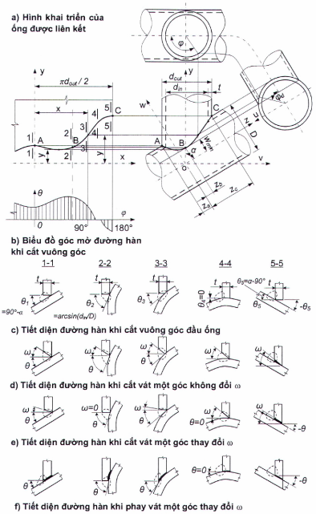

<strong>Hình I.9 — Các sơ đồ tiết diện đường hàn trong nút liên kết hai ống</strong>

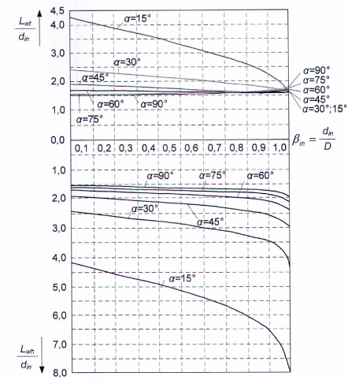

<strong>Hình I.10 — Các đồ thị để xác định tổng chiều dài đoạn đường hàn gót Lwh và tổng chiều dài đoạn đường hàn mũi Lwt trong liên kết hai ống thép</strong>

<!-- DIAGRAM: word/media/image887.png -->

a) \- Cắt vuông góc đầu ống

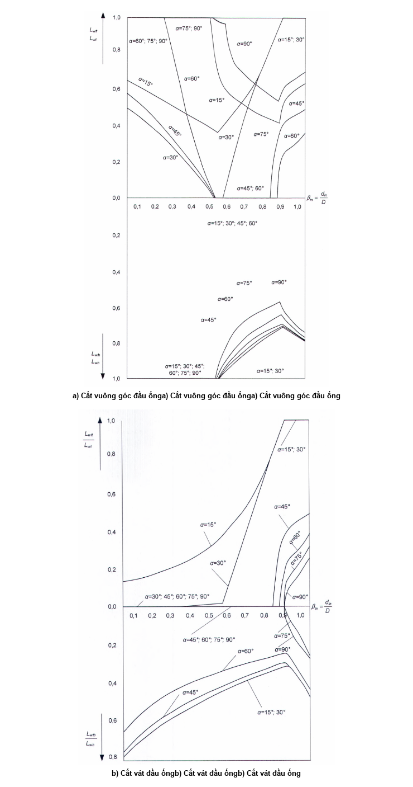

<strong>Hình I.11 — Các đồ thị để xác định các hệ số Lwfh/Lwh và Lwft/ Lwt khi cắt ống</strong>

<!-- DIAGRAM: word/media/image888.png -->

b) \- Cắt vát đầu ống

<strong>Hình I.11 (kết thúc)</strong>

### I.3.2.6  Đối với nút của kết cấu rỗng (giàn phẳng hoặc không gian), gồm một thanh ống liên tục (Hình I.12b, c) tại nút với độ mỏng thành tương đối ( δ = D/t ) không nhỏ hơn 20 và không lớn hơn 60, hoặc gồm n thanh tiếp giáp (Hình I.13), thì tính toán chịu uốn cục bộ của thành thanh cánh cần được tiến hành đối với từng thanh thứ j ( $d_{j}$ ≥ 0,2D ) dưới tác dụng của tất cả các tổ hợp tải trọng tính toán trong các thanh của nút theo các công thức:

$$\frac{\sum_{i=1}^{n} \left( \varepsilon_i \mu_i N_i \frac{\sin \alpha_i}{\psi_i} \right)}{\gamma_{Rd} \gamma_s S} \le 1 ; j = 1, ..., n;$$
<!-- formula_id: "F_TCVN_5575_2024_RID959" -->

$$\dots \qquad (I.41)$$
<!-- formula_id: "F_TCVN_5575_2024_FORMULA_I_41" -->

$$\frac{|N_j| \sin \alpha_j}{\psi_j 2S} \le 1$$
<!-- formula_id: "F_TCVN_5575_2024_RID960" -->

$$\dots \qquad (I.42)$$
<!-- formula_id: "F_TCVN_5575_2024_FORMULA_I_42" -->

trong đó:

&nbsp;&nbsp;&nbsp;&nbsp;\- I  là số thứ tự thanh tiếp giáp;

&nbsp;&nbsp;&nbsp;&nbsp;\- J  là số thứ tự thanh tiếp giáp đang xét;

&nbsp;&nbsp;&nbsp;&nbsp;\- $N_{i}$ , $N_{j}$ là nội lực trong thanh tiếp giáp, lấy có kể đến dấu (dấu ‟dương” khi kéo, dấu ‟âm” khi nén);

&nbsp;&nbsp;&nbsp;&nbsp;\- $\mu_{i}$  là hệ số, được xác định như sau:

&nbsp;&nbsp;&nbsp;&nbsp;\- khi i = j : theo công thức

$$\mu_j$$
<!-- formula_id: "F_TCVN_5575_2024_RID961" -->

$$\dots \qquad (I.43)$$
<!-- formula_id: "F_TCVN_5575_2024_FORMULA_I_43" -->

&nbsp;&nbsp;&nbsp;&nbsp;\- khi i # j :                    $\mu_{i = 1}$

| $q_1 = ...$ a) Nút chữ K | b) Nút chữ X |
| :--- | :--- |

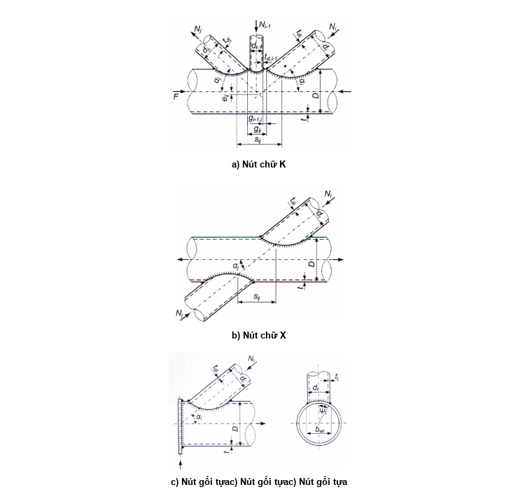

<strong>Hình I.12 — Nút giàn thép ống</strong>

<!-- DIAGRAM: word/media/image894.png -->

**CHÚ THÍCH:** Trên hình không thể hiện mặt bích.

c) \- Nút gối tựa

<strong>Hình I.12 (kết thúc)</strong>

<!-- DIAGRAM: word/media/image895.png -->

**CHÚ DẪN:**

A  Mũi

B  Điểm bên

C  Gót.

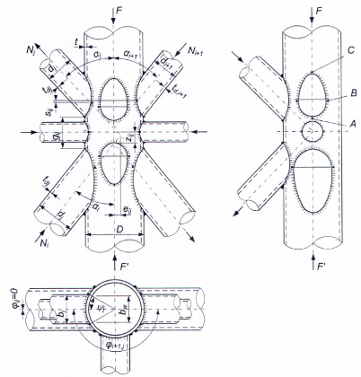

<strong>Hình I.13 — Nút kết cấu không gian rỗng làm bằng thép ống</strong>

Trong công thức (I.43):

$\gamma_{dj}$  là hệ số ảnh hưởng của dấu nội lực trong thanh tiếp giáp đang xét, lấy bằng 0,8 khi kéo và bằng 1,0 trong các trường hợp còn lại;

$L_{zj}$  là chiều dài đoạn tiếp giáp của thanh đang xét (đối với thanh ống $L_{zj}$ = $d_{j}$/sin $\alpha_{j}$);

$\gamma_{zj}$  là hệ số ảnh hưởng của chiều dài tiếp giáp của thanh đang xét, được xác định như sau:

&nbsp;&nbsp;\- đối với các tiếp giáp không mặt trụ: theo công thức

$$\gamma_{zj} = 1 + \frac{L_{zj} - b_j}{2(2D - b_j)}$$
<!-- formula_id: "F_TCVN_5575_2024_RID966" -->

$$\dots \qquad (I.44)$$
<!-- formula_id: "F_TCVN_5575_2024_FORMULA_I_44" -->

&nbsp;&nbsp;\- đối với các tiếp giáp mặt trụ (ống): $\gamma_{zj}$ = 1;

$b_{i}$ hoặc $b_{j}$  là chiều rộng thanh tiếp giáp (đối với thanh ống $b_{i}$ = $d_{i}$ hoặc $b_{j}$ = $d_{j}$ );

S  là đặc trưng khả năng chịu lực của cánh, được xác định theo công thức:

$$S = 13(1 + 0,02\delta)t^2 f_{yd} \gamma_c$$
<!-- formula_id: "F_TCVN_5575_2024_RID967" -->

$$\dots \qquad (I.45)$$
<!-- formula_id: "F_TCVN_5575_2024_FORMULA_I_45" -->

trong đó:

&nbsp;&nbsp;&nbsp;&nbsp;\- $\delta$ = D/t  là độ mỏng thành tương đối;

&nbsp;&nbsp;&nbsp;&nbsp;\- $\gamma_{Dj}$ là hệ số ảnh hưởng của lực dọc trong cánh:

&nbsp;&nbsp;&nbsp;&nbsp;\- khi nén trong cánh: được xác định theo công thức

$$\gamma_{d} = 1 - 0,5 \left( \frac{F_j}{Af_{yd}} \right)^2$$
<!-- formula_id: "F_TCVN_5575_2024_RID968" -->

$$\dots \qquad (I.46)$$
<!-- formula_id: "F_TCVN_5575_2024_FORMULA_I_46" -->

&nbsp;&nbsp;&nbsp;&nbsp;\- trong các trường hợp còn lại: $\gamma_{Dj}$ = 1,

trong đó: $F_{j}$ là lực dọc trong cánh ở phía thanh bụng chịu kéo;

&nbsp;&nbsp;&nbsp;&nbsp;\- $\gamma_{rj}$ là hệ số ảnh hưởng của sự tăng cứng thành thanh cánh trong nút bằng các sườn cứng ngang, vách cứng và tương tự, lấy bằng:

&nbsp;&nbsp;&nbsp;&nbsp;\- 1,25 - khi sườn cứng ngang tăng cứng/bố trí trong phạm vi đoạn tiếp giáp đang xét;

&nbsp;&nbsp;&nbsp;&nbsp;\- 1,0 - trong các trường hợp còn lại;

&nbsp;&nbsp;&nbsp;&nbsp;\- $\epsilon_{ij}$  là hệ số ảnh hưởng của vị trí mỗi thanh trong số các thanh tiếp giáp so với thanh đang xét thứ j, được xác định theo Bảng I.3; khi i = j  thì $\epsilon_{ij}$ = 1;

&nbsp;&nbsp;&nbsp;&nbsp;\- $\psi_{i}$ = arcsin $\beta_{wi}$ ,

&nbsp;&nbsp;&nbsp;&nbsp;\- khi $\beta_{i}$ ≤ 0, 7:            $\psi_{i}$ = 1,05 $\beta_{i}$ ($\beta_{i}$ xem Bảng I.3);

&nbsp;&nbsp;&nbsp;&nbsp;\- khi $\beta_{i}$ > 0, 7:            $\psi_{i}$ = 1,05 $\beta_{i}$ (1 + 0,15 $\beta_{i}^{8}$);

&nbsp;&nbsp;&nbsp;&nbsp;\- $\beta_{wi}$ = $b_{wi}$/D;

&nbsp;&nbsp;&nbsp;&nbsp;\- $b_{wi}$  là chiều rộng phần ôm cánh bởi thanh tiếp giáp giữa các mép đường hàn (khi $\beta_{i}$ ≤ 0,7 thì $b_{wi}$ = $b_{i}$ ; khi $\beta_{i}$ > 0, 7 thì $b_{wi}$ = $b_{i}$ − $t_{di}$ ).

### Bảng I.3 - Hệ số $\epsilon_{ij}$

| Vị trí trục thanh tiếp giáp so với trục thanh đang xét | Dạng nút | $s_{ij}$ | $\epsilon_{ij}$ |
| :--- | :--- | :--- | :--- |
| 1. Cùng phía với cánh | K | - | $1 - \frac{1,3\zeta_y(1 + 0,02\delta)}{(1 - 0,04\delta)}$ |
| 2. Phía đối diện với cánh | X | 0 < $s_{ij}$ < D | $\cos^2 \left( \frac{\pi s_i}{2D} \right) \left[ \frac{3\psi_i (1 + 0,02\delta)}{1 + 5,4\beta_i + 5,6\beta_i^8} - 1 \right]$ |
| 2. Phía đối diện với cánh | X | $s_{ij}$ ≥ D | 0 |
| **Các ký hiệu trong/bảng I.3 (xem Hình I.12): $g_{ij}$ là khoảng cách nhỏ nhất dọc theo trục cánh giữa các đường hàn liên kết thanh đang xét và thanh bụng liền kề với cánh (khoảng cách thông thủy): $g_{ij} = \left( \frac{D}{2} + e_{ij} \right) (\text{ctg}\alpha_i + \text{ctg}\alpha_j) - \frac{D}{2} \left( \frac{\beta_i}{\sin\alpha_i} + \frac{\beta_j}{\sin\alpha_j} \right);$ $s_{ij}$ là khoảng cách dọc theo cánh giữa các điểm bên của thanh tiếp giáp đang xét và thanh tiếp giáp liền kề: $s_{ij} = \left( \frac{D}{2} \sqrt{1 - \beta_{wi}^2} + e_{ij} \right) c \operatorname{tg} \alpha_i + \left( \frac{D}{2} \sqrt{1 - \beta_{wj}^2} + e_{ij} \right) c \operatorname{tg} \alpha_j$ $\beta_{i}$ = $b_{i}$/D là tỉ số chiều rộng tiếp giáp của thanh liền kề và đường kính thanh cánh (đối với thanh ống $\beta_{i}$ = di/D ). Giá trị $ζ_{ij}$ lấy bằng: khi $g_{ij}$ ≤ 0 :         $ζ_{ij}$ = 0, 6 ; khi 0 < $g_{ij}$ ≤ D :   $ζ_{ij}$ = 1− 0,4(1− $g_{ij}$/D)$^{4}$; khi gij ≥ D :        $ζ_{ij}$ = 1 .** |  |  |  |

### I.3.2.7  Khả năng chịu lực của thành các thanh bụng ống tại vị trí gần chỗ tiếp giáp với thanh cánh cần được kiểm tra theo công thức:

$$\frac{N(1+\chi\delta)}{\gamma_c\gamma_d\gamma_{cd}f_{yd}A_d} \leq 1$$
<!-- formula_id: "F_TCVN_5575_2024_RID973" -->

$$\dots \qquad (I.47)$$
<!-- formula_id: "F_TCVN_5575_2024_FORMULA_I_47" -->

trong đó:

&nbsp;&nbsp;&nbsp;&nbsp;\- χ  là hệ số, lấy bằng:

&nbsp;&nbsp;&nbsp;&nbsp;\- 0,008 - đối với các thanh xiên tại nút chữ K mà khi tính toán liên kết của chúng giá trị $ζ_{ij}$ xác định theo Bảng I.3 nhỏ hơn 0,85;

&nbsp;&nbsp;&nbsp;&nbsp;\- 0,015 - trong các trường hợp còn lại;

&nbsp;&nbsp;&nbsp;&nbsp;\- $\gamma_{cd}$  là hệ số điều kiện làm việc, lấy bằng:

&nbsp;&nbsp;&nbsp;&nbsp;\- 0,85 - đối với các thanh giao nhau tại nút với hai thanh khác có dấu nội lực khác nhau;

&nbsp;&nbsp;&nbsp;&nbsp;\- 1,0 - trong các trường hợp còn lại.

### I.3.2.8  Khi tăng cứng thành của thanh cánh tại nút (tại các vị trí tiếp giáp của thanh tiếp giáp đang xét) bằng/bản đệm với chiều dày $t_{a}$ nằm sát và được hàn với thanh cánh thì trong công thức (I.45) thay $f_{yd}$ bằng giá trị cường độ tính toán của vật liệu bản đệm $f_{yd,a}$ , thay t bằng chiều dày quy đổi $t_{ef}$ có giá trị trị bằng:

&nbsp;&nbsp;\- Đối với các thanh tiếp giáp chịu kéo: $t_{a}$ nhưng không lớn hơn 1,5t;

&nbsp;&nbsp;\- Đối với các thanh tiếp giáp chịu nén: $t_{max}$ + 0,25$t_{min}$ , trong đó $t_{max}$ là chiều dày lớn và $t_{min}$ là chiều dày nhỏ trong số các chiều dày t và $t_{a}$ .

### I.3.2.9  Độ bền của các đường hàn trong trường hợp cắt vát đầu ống cần được kiểm tra theo công thức:

$$\frac{1,05N}{A_d f_w} \leq 1$$
<!-- formula_id: "F_TCVN_5575_2024_RID974" -->

$$\dots \qquad (I.48)$$
<!-- formula_id: "F_TCVN_5575_2024_FORMULA_I_48" -->

trong đó:

&nbsp;&nbsp;&nbsp;&nbsp;\- $f_{w}$  là cường độ tính toán của liên kết hàn đối đầu theo giới hạn chảy.

### I.3.2.10  Trong trường hợp, nếu thanh bụng đang xét giao nhau với m thanh liền kề khác trong vùng nút (xem Hình I.14) nằm trong cùng một mặt phẳng tiếp giáp (Φ = 0) thì trong các công thức (I.41) và  (I.42) thay $N_{i}$ $sin\alpha_{i}$ = $N_{j}$ $sin\alpha_{j}$ bằng giá trị lực quy đổi $P_{efj}$ , xác định theo công thức:

$$P_{efj} = P_j + \sum_{k=1}^{m} \xi_{kj} P_{kj}$$
<!-- formula_id: "F_TCVN_5575_2024_RID975" -->

$$\dots \qquad (I.49)$$
<!-- formula_id: "F_TCVN_5575_2024_FORMULA_I_49" -->

trong đó:

&nbsp;&nbsp;&nbsp;&nbsp;\- $P_{kj}$  là giá trị $P_{j}$ đối với các thanh liền kề giao nhau với thanh đang xét thứ j;

&nbsp;&nbsp;&nbsp;&nbsp;\- $\xi_{kj}$  là tỉ lệ chu vi tiết diện thanh liền kề, ứng với đoạn giao nhau của nó với thanh đang xét (đối với thanh ống $\xi_{kj}$ = $L_{kj}$ /$\pi d_{k}$ ); ở đây $L_{kj}$ là chiều dài đoạn chu vi tiết diện của thanh liền kề, ứng với đoạn giao nhau của nó với thanh đang xét, $d_{k}$ là đường kính ngoài của thanh ống.

Nếu đường hàn không ôm hết toàn bộ chu vi thanh liền kề (Hình I.14b) thì $\xi_{kj}$ lấy bằng:

$$\xi_{ij} = \frac{L_{ij}}{\sum_{w=1}^{v} L_{iw}}$$
<!-- formula_id: "F_TCVN_5575_2024_RID976" -->

$$\dots \qquad (I.50)$$
<!-- formula_id: "F_TCVN_5575_2024_FORMULA_I_50" -->

trong đó:

&nbsp;&nbsp;&nbsp;&nbsp;\- $\sum_{w=1}^{v} L_w$ là tổng các đoạn chu vi tiết diện của thanh liền kề ứng với các đoạn đặt đường hàn.

Nếu gần một thanh bụng giao nhau với các thanh khác trong vùng nút không có hàn thêm với thanh cánh hoặc hàn ít ($\xi_{D}$ < 0,25 , trong đó $\xi_{D}$ là tỉ lệ chu vi tiết diện thanh ứng với đoạn hàn thêm của nó với thanh cánh) thì không cần kể đến tác động của thanh đó đến thanh cánh, nghĩa là giá trị $P_{j}$ và $P_{i}$ đối với nó không cần đưa vào công thức (I.41), còn khi có hàn toàn bộ thì thêm $\xi_{kj}P_{kj}$ giữa các thanh liền kề.

$$Xin lỗi, hình ảnh bạn cung cấp là một sơ đồ kỹ thuật (hình vẽ kết cấu mối hàn nút giàn ống) chứ không chứa công thức toán học nào để chuyển đổi sang mã LaTeX.$$
<!-- formula_id: "F_TCVN_5575_2024_RID978" -->

a) \- Hai thanh bụng giao nhau

<!-- DIAGRAM: word/media/image909.png -->

b) \- Ba thanh bụng (có bóp bẹp đầu thanh đứng) giao nhau

**CHÚ DẪN:**

## 1  THANH BỤNG ‟KHÔNG LIÊN TỤC”        3  ĐOẠN GIAO NHAU CỦA CÁC THANH BỤNG

## 2  THANH BỤNG ‟XUYÊN”                    4  THANH ĐỨNG

**CHÚ THÍCH:** 

I  Hình khai triển của ống 1

II  Hình khai triển của ống 2

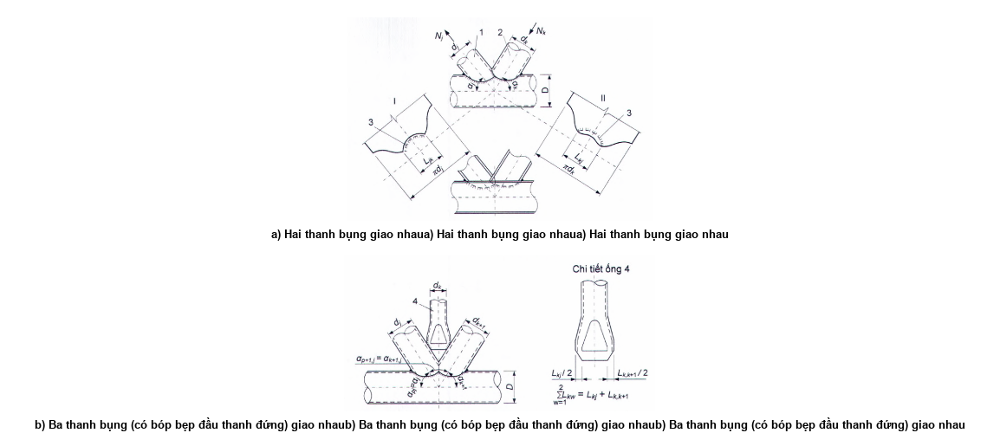

<strong>Hình I.14 — Nút giao không/bản mã có các thanh bụng giao nhau</strong>

### I.3.2.11  Đối với mỗi thanh bụng giao nhau với các thanh khác tại nút, cần kiểm tra độ bền tổ hợp của các thành tất cả các thanh (thanh cánh và các thanh bụng) mà thanh đang xét giao nhau với chúng theo công thức:

$$N_j \le 1{,}5 \gamma_{dj} \sum_{p=1}^{q} \frac{\xi_{pj} \gamma_{Dp} \psi_{pj} S_p}{\sin \alpha_{pj}}$$
<!-- formula_id: "F_TCVN_5575_2024_RID980" -->

$$\dots \qquad (I.51)$$
<!-- formula_id: "F_TCVN_5575_2024_FORMULA_I_51" -->

trong đó:

&nbsp;&nbsp;&nbsp;&nbsp;\- $N_{j}$  là lực trong thanh đang xét;

&nbsp;&nbsp;&nbsp;&nbsp;\- $S_{p}$  là đặc trưng khả năng chịu lực của từng thanh cái (đóng vai trò là thanh cánh) (thanh cánh và các thanh bụng liền kề giao nhau với thanh đang xét), được xác định theo công thức (I.45), trong đó các giá trị δ, t và $f_{yd}$ lấy theo các giá trị tương ứng của thanh cái;

&nbsp;&nbsp;&nbsp;&nbsp;\- $\gamma_{Dp}$ là hệ số ảnh hưởng của lực dọc trong từng thanh cái, được xác định theo công thức (I.46), trong đó các giá trị F, A và $f_{yd}$ lấy theo các giá trị tương ứng của thanh cái;

&nbsp;&nbsp;&nbsp;&nbsp;\- $\xi_{pj}$  là tỉ lệ chu vi tiết diện thanh đang xét, ứng với đường giao nhau của nó với từng thanh cái, được xác định theo công thức $\xi_{pj}$ = $L_{pj}$/$\pi d_{j}$ , với $L_{pj}$ là chiều dài đoạn chu vi tiết diện thanh đang xét ứng với đường giao nhau với thanh cái;

&nbsp;&nbsp;&nbsp;&nbsp;\- $\psi_{pj}$  là góc ôm một nửa của từng thanh cái bởi sự tiếp giáp của thanh đang xét, được xác định theo công thức:

$$\psi_{pj} = \arcsin\left(\frac{b_{wj}}{D_p}\right)$$
<!-- formula_id: "F_TCVN_5575_2024_RID981" -->

$$\dots \qquad (I.52)$$
<!-- formula_id: "F_TCVN_5575_2024_FORMULA_I_52" -->

&nbsp;&nbsp;&nbsp;&nbsp;\- $D_{p}$  là đường kính ngoài của thanh cái;

&nbsp;&nbsp;&nbsp;&nbsp;\- $\alpha_{pj}$ là góc tiếp giáp của thanh đang xét với từng thanh cái.

### I.3.3  Cấu tạo

### I.3.3.1  Chiều dày thành của các ống dùng làm các thanh chịu lực chính (thanh cánh và thanh xiên gối tựa, các nhánh cột và tương tự) cần được lấy không nhỏ hơn 3 mm, dùng làm các thanh khác - không nhỏ hơn 2,5 mm.

### I.3.3.2  Khi liên kết trực tiếp (không/bản mã) tại các nút, độ mỏng thành tương đối δ của các thanh cánh cần được lấy không lớn hơn các giá trị nêu trong/bảng I.4, độ mỏng thành tương đối của các thanh tiếp giáp $\delta_{d}$ - lấy tối đa, nhưng không lớn hơn các giá trị nêu trong/bảng I.4. Chiều dày thành của các thanh tiếp giáp cần được lấy không lớn hơn chiều dày thành của các thanh cánh.

### Bảng I.4 - Độ mỏng thành tương đối

| Giới hạn chảy của thép $f_{y}$, MPa | Độ mỏng thành tương đối của — thanh cánh, δ = D/t | Độ mỏng thành tương đối của — thanh tiếp giáp, $\delta_{d}$ = d/$t_{d}$ — chịu nén | Độ mỏng thành tương đối của — thanh tiếp giáp, $\delta_{d}$ = d/$t_{d}$ — chịu kéo |
| :--- | :---: | :---: | :---: |
| ≤ 295 | 30 | 90 | 90 |
| > 295 và ≤ 390 | 35 | 80 | 90 |
| > 390 | 40 | 70 | 90 |

> CHÚ THÍCH 2: Đối với các thanh tiếp giáp chịu nén với các giá trị $\delta_{d}$ nêu trong/bảng I.4 thì không cần kiểm tra ổn định cục bộ của thành của chúng.
>
> CHÚ THÍCH 2: Đối với các thanh tiếp giáp chịu nén với các giá trị $\delta_{d}$ nêu trong/bảng I.4 thì không cần kiểm tra ổn định cục bộ của thành của chúng.
>
> CHÚ THÍCH 2: Đối với các thanh tiếp giáp chịu nén với các giá trị $\delta_{d}$ nêu trong/bảng I.4 thì không cần kiểm tra ổn định cục bộ của thành của chúng.
>
> CHÚ THÍCH 2: Đối với các thanh tiếp giáp chịu nén với các giá trị $\delta_{d}$ nêu trong/bảng I.4 thì không cần kiểm tra ổn định cục bộ của thành của chúng.
>
> _CHÚ THÍCH:_

**CHÚ THÍCH 1:** ** Các giá trị δ nêu trong/bảng I.4 đối với các thanh cánh là các giá trị định hướng và không loại trừ việc cần kiểm tra độ bền của nút;

### I.3.3.3  Với các nút không/bản mã, đường kính ống của các thanh bụng cần được lấy không nhỏ hơn 0,3 lần đường kính thanh cánh và không lớn hơn đường kính thanh cánh.