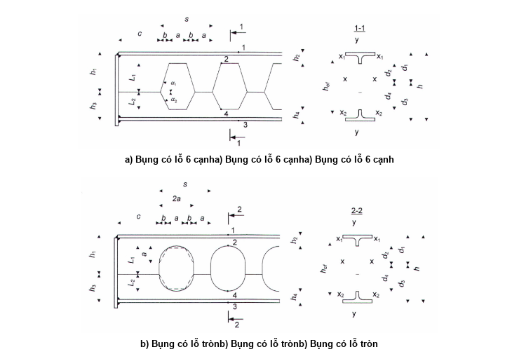
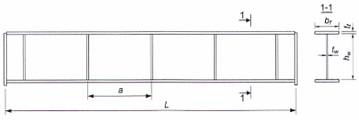

## PHỤ LỤC K (Tham khảo) — Dầm bụng lỗ và dầm bụng mảnh

### K.1  Dầm bụng lỗ

### K.1.1  Dầm bụng lỗ (là dầm có bụng được khoét lỗ) được thiết kế bằng thép chữ I cán (với chiều cao tiết diện không nhỏ hơn 200 mm) làm bằng thép có giới hạn chảy đến 440 MPa.

Mức độ khai triển của thép cán (tỉ số chiều cao của dầm khai triển và chiều cao chữ I ban đầu) lấy không lớn hơn 1,5.

Liên kết hàn của bụng cần được thực hiện bằng đường hàn đối đầu thấu suốt chiều dày.

### K.1.2  Tính toán độ bền của dầm chịu uốn trong mặt phẳng/bụng (Hình K.1) được thực hiện theo các công thức:

− Đối với các điểm ở các góc lỗ khoét, gần nhất so với các cánh của chữ T:

$$\frac{1}{f_{ud}\gamma_c} \cdot \left(\frac{M}{W_x} + \frac{Va}{4W_{\min}}\right) \leq 1$$
<!-- formula_id: "F_TCVN_5575_2024_RID982" -->

$$\dots \qquad (K.1)$$
<!-- formula_id: "F_TCVN_5575_2024_FORMULA_K_1" -->

− Đối với các điểm gần nhất nằm ở mặt trên cánh của chữ T phía trên các lỗ khoét:

$$\frac{1}{f_{yd}\gamma_c} \cdot \left(\frac{M}{W_x} + \frac{V_1a}{4W_{\text{max}}}\right) \le 1$$
<!-- formula_id: "F_TCVN_5575_2024_RID983" -->

$$\dots \qquad (K.2)$$
<!-- formula_id: "F_TCVN_5575_2024_FORMULA_K_2" -->

$$\frac{V_s s}{t_w a h_{ef} f_v \gamma_c} \le 1$$
<!-- formula_id: "F_TCVN_5575_2024_RID984" -->

$$\dots \qquad (K.3)$$
<!-- formula_id: "F_TCVN_5575_2024_FORMULA_K_3" -->

trong đó:

&nbsp;&nbsp;&nbsp;&nbsp;\- M  là mô men uốn trong tiết diện dầm;

&nbsp;&nbsp;&nbsp;&nbsp;\- $t_{w}$  là chiều dày bụng dầm;

&nbsp;&nbsp;&nbsp;&nbsp;\- V l à lực cắt trong tiết diện dầm;

&nbsp;&nbsp;&nbsp;&nbsp;\- $V_{s}$  là lực cắt trong tiết diện dầm tại khoảng cách (c + s − 0,5a) tính từ gối tựa (xem  Hình K.1);

&nbsp;&nbsp;&nbsp;&nbsp;\- $W_{x}$  là mô men chống uốn bản thân của dầm chữ I khai triển tại tiết diện có lỗ (tiết diện thực) đối với trục x-x (khi tính tiết diện theo điểm 2: $W_{x}$ = $I_{x}$/$d_{2}$ ; khi tính tiết diện theo điểm 4: $W_{x}$ = $I_{x}$/$d_{4}$ , trong đó $d_{2}$, $d_{4}$ là các khoảng cách từ trọng tâm tiết diện đến điểm 2 và điểm 4 tương ứng);

&nbsp;&nbsp;&nbsp;&nbsp;\- $W_{max}$, $W_{min}$  là các mô men chống uốn lớn nhất và nhỏ nhất của tiết diện chữ T.

$$\text{Không có công thức toán học nào trong hình ảnh này.}$$
<!-- formula_id: "F_TCVN_5575_2024_RID985" -->

a) \- Bụng có lỗ 6 cạnh

<!-- DIAGRAM: word/media/image916.png -->

b) \- Bụng có lỗ tròn

<strong>Hình K.1 — Sơ đồ đoạn dầm bụng lỗ</strong>

### K.1.3  Khi xác định khả năng chịu lực của dầm bụng lỗ tại các điểm 2 và 4:

$$\frac{\gamma_u}{f_{ud}\gamma_c} \cdot \left( \frac{Md_2}{I_x} + \frac{V_1a}{2W_{1,\min}} + \frac{N}{A_n} \right) \le 1$$
<!-- formula_id: "F_TCVN_5575_2024_RID987" -->

$$\dots \qquad (K.4)$$
<!-- formula_id: "F_TCVN_5575_2024_FORMULA_K_4" -->

$$\frac{\gamma_u}{f_{ud}\gamma_c} \cdot \left(\frac{Md_4}{I_x} + \frac{V_2 a}{2W_{2,\text{min}}} + \frac{N}{A_n}\right) \le 1$$
<!-- formula_id: "F_TCVN_5575_2024_RID988" -->

$$\dots \qquad (K.5)$$
<!-- formula_id: "F_TCVN_5575_2024_FORMULA_K_5" -->

trong đó:

&nbsp;&nbsp;&nbsp;&nbsp;\- M  là mô men uốn trong tiết diện dầm;

&nbsp;&nbsp;&nbsp;&nbsp;\- $V_{1}$, $V_{2}$  là các lực cắt chịu bởi tiết diện chữ T trên và chữ T dưới;

&nbsp;&nbsp;&nbsp;&nbsp;\- N  là lực dọc trong tiết diện dầm;

&nbsp;&nbsp;&nbsp;&nbsp;\- $I_{x}$  là mô men quán tính của chữ I khai triển tại tiết diện dầm có lỗ (tiết diện thực) đối với trục x-x;

&nbsp;&nbsp;&nbsp;&nbsp;\- $A_{n}$  là diện tích tiết diện chữ I khai triển tại tiết diện dầm có lỗ (tiết diện thực);

&nbsp;&nbsp;&nbsp;&nbsp;\- $W_{1,min}$ , $W_{2,min}$ là các mô men chống uốn nhỏ nhất của tiết diện chữ T trên và chữ T dưới tương ứng;

&nbsp;&nbsp;&nbsp;&nbsp;\- a  là chiều rộng lanh tô của bụng dầm;

&nbsp;&nbsp;&nbsp;&nbsp;\- $d_{2}$, $d_{4}$   là các khoảng cách từ trọng tâm tiết diện đến điểm 2 và điểm 4 tương ứng.

### K.1.4  Khi xác định khả năng chịu lực của dầm bụng lỗ tại các điểm 1 và 3:

$$\frac{1}{f_{yd}\gamma_c} \cdot \left(\frac{Md_1}{I_x} + \frac{V_1a}{2W_{1,\min}} + \frac{N}{A_n}\right) \le 1$$
<!-- formula_id: "F_TCVN_5575_2024_RID989" -->

$$\dots \qquad (K.6)$$
<!-- formula_id: "F_TCVN_5575_2024_FORMULA_K_6" -->

$$\frac{1}{f_{yd}\gamma_c} \cdot \left(\frac{Md_3}{I_x} + \frac{V_2a}{2W_{2,\min}} + \frac{N}{A_n}\right) \le 1$$
<!-- formula_id: "F_TCVN_5575_2024_RID990" -->

$$\dots \qquad (K.7)$$
<!-- formula_id: "F_TCVN_5575_2024_FORMULA_K_7" -->

trong đó:

&nbsp;&nbsp;&nbsp;&nbsp;\- M, V1, V2 , N, $I_{x}$ , $A_{n}$, $W_{1,min}$ , $W_{2,min}$ , a lấy như ở K.1.3;

&nbsp;&nbsp;&nbsp;&nbsp;\- $d_{1}$, $d_{3}$  là các khoảng cách từ trọng tâm tiết diện đến điểm 1 và điểm 3 tương ứng.

### K.1.5  Tính toán ổn định của dầm được thực hiện theo 8.4.1; khi đó các đặc trưng hình học của dầm được tính đối với tiết diện có lỗ. Ổn định của dầm được coi là đảm bảo nếu thỏa mãn các yêu cầu trong 8.4.4 và 8.4.5.

### K.1.6  Tại các tiết diện gối tựa, nếu bụng có $h_{ef}$/$t_{w}$ > 40 thì nó cần được tăng cứng/bằng các sườn cứng và được tính toán theo 8.5.17; khi đó ở tiết diện gối cần lấy c ≥ 250 mm (xem Hình K.1).

### K.1.7  Bụng dầm tại vùng phía trên phải được kiểm tra ổn định theo công thức:

$$\tau \le \tau_{cr}$$
<!-- formula_id: "F_TCVN_5575_2024_RID991" -->

$$\dots \qquad (K.8)$$
<!-- formula_id: "F_TCVN_5575_2024_FORMULA_K_8" -->

Ứng suất tiếp tại lanh tô của bụng dầm được tính theo công thức:

$$\tau = \frac{V_s}{t_w a h_{\text{ef}}}$$
<!-- formula_id: "F_TCVN_5575_2024_RID992" -->

$$\dots \qquad (K.9)$$
<!-- formula_id: "F_TCVN_5575_2024_FORMULA_K_9" -->

trong đó:

&nbsp;&nbsp;&nbsp;&nbsp;\- V  là lực cắt tại tiết diện của lanh tô đang xét;

&nbsp;&nbsp;&nbsp;&nbsp;\- $t_{w}$  là chiều dày bụng dầm;

&nbsp;&nbsp;&nbsp;&nbsp;\- a  là chiều rộng lanh tô của bụng dầm;

&nbsp;&nbsp;&nbsp;&nbsp;\- s  là bước lỗ của bụng dầm;

&nbsp;&nbsp;&nbsp;&nbsp;\- $h_{ef}$  là khoảng cách giữa các trọng tâm của các chữ T.

&nbsp;&nbsp;&nbsp;&nbsp;\- Ứng suất tiếp tới hạn được tính theo công thức:

$$\tau_{cr} = \frac{4\left(\alpha - \frac{\pi}{2}\right)^2 \sigma_{cr}}{3\operatorname{tg}\left(\alpha - \frac{\pi}{2}\right)} \leq f_v\gamma_c$$
<!-- formula_id: "F_TCVN_5575_2024_RID993" -->

$$\dots \qquad (K.10)$$
<!-- formula_id: "F_TCVN_5575_2024_FORMULA_K_10" -->

trong đó:

&nbsp;&nbsp;&nbsp;&nbsp;\- $\alpha$ là góc khoét lỗ của bụng dầm (xem Hình K.1);

&nbsp;&nbsp;&nbsp;&nbsp;\- $\sigma_{cr}$  là ứng suất pháp tới hạn, được tính theo công thức:

$$\sigma_{\text{cr}} = \varphi f_{\text{yd}} \gamma_c$$
<!-- formula_id: "F_TCVN_5575_2024_RID994" -->

$$\dots \qquad (K.11)$$
<!-- formula_id: "F_TCVN_5575_2024_FORMULA_K_11" -->

trong đó:

&nbsp;&nbsp;&nbsp;&nbsp;\- $\varphi$ là hệ số ổn định, được xác định theo 7.1.3 với độ mảnh λ = L/(0,289$t_{w}$ sinα), trong đó  L = $L_{1}$ + $L_{2}$ là chiều cao lỗ của bụng dầm (xem Hình 26).

Khi tính toán bụng của dầm có khoét lỗ tròn hoặc lỗ ô van ở bụng thì tại vùng lanh tô sử dụng các kích thước hình học của lục giác đều nội tiếp trong đường tròn có đường kính 2a (xem Hình K.1b).

Chỉ được đặt các tải trọng tập trung tại các tiết diện dầm không/bị giảm yếu bởi lỗ khoét.

Chiều cao bụng của tiết diện chữ T chịu nén cần thỏa mãn các yêu cầu trong 7.3.2, trong đó lấy $\bar{\lambda}$ = 1,4 trong công thức (28).

### K.1.8  Độ võng dầm bụng lỗ sáu cạnh đều có chiều cao lỗ d = 0,667h và tỉ số L/$h_{ef}$ ≥ 12 (với L là nhịp dầm) cần được xác định theo công thức:

$$f_{\text{perf}} = f \cdot \left[ 1 + \frac{1,3 \pi^2 d A_r \alpha(\eta) \left( 1 + \frac{2}{\eta} \right)}{t_w L^2} \right]$$
<!-- formula_id: "F_TCVN_5575_2024_RID996" -->

$$\dots \qquad (K.12)$$
<!-- formula_id: "F_TCVN_5575_2024_FORMULA_K_12" -->

trong đó:

&nbsp;&nbsp;&nbsp;&nbsp;\- $f = \frac{5qL^4}{384EI_{\text{m}}}$  là độ võng dầm tính theo thuyết uốn (có kể đến $I_{m}$);

&nbsp;&nbsp;&nbsp;&nbsp;\- $A_{f}$  là diện tích phần cánh chữ T phía trên lỗ, được tính theo công thức:

$$A_r = t_f b_f + t_w \left(0,5(h - d) - t_f\right)$$
<!-- formula_id: "F_TCVN_5575_2024_RID998" -->

$$\dots \qquad (K.13)$$
<!-- formula_id: "F_TCVN_5575_2024_FORMULA_K_13" -->

&nbsp;&nbsp;&nbsp;&nbsp;\- $\eta$ = 2/(s a − 1)  là khoảng cách tương đối thông thủy giữa các lỗ, với a là khoảng cách thông thủy giữa các lỗ liền kề tại mức trục trung hòa và s là bước lỗ (xem Hình K.1);

&nbsp;&nbsp;&nbsp;&nbsp;\- α(η)  là hàm số của η :

$$\alpha(\eta) = -2{,}43\eta^2 + 4{,}54\eta + 0{,}586$$
<!-- formula_id: "F_TCVN_5575_2024_RID999" -->

$$\dots \qquad (K.14)$$
<!-- formula_id: "F_TCVN_5575_2024_FORMULA_K_14" -->

Mô men quán tính của tiết diện $I_{m}$ được tính theo công thức:

$$I_m = \frac{b_f t_f (h - t_f)^2}{2} + \frac{t_w (h - 2t_f)^3}{12} - \frac{t_w d^3}{24}$$
<!-- formula_id: "F_TCVN_5575_2024_RID1000" -->

$$\dots \qquad (K.15)$$
<!-- formula_id: "F_TCVN_5575_2024_FORMULA_K_15" -->

### K.2  Dầm bụng mảnh

### K.2.1  Dầm không liên tục bụng mảnh tiết diện chữ I đối xứng, chịu tải trọng tĩnh và uốn trong mặt phẳng/bụng, thì được sử dụng khi chịu tải trọng (tương đương với tải trọng phân bố đều) đến 50 kN/m và được thiết kế bằng thép có giới hạn chảy đến 345 MPa.

### K.2.2  Ổn định của dầm bụng mảnh được đảm bảo hoặc bởi việc thực hiện các yêu cầu 8.4.4 hoặc bởi liên kết của cánh chịu nén có độ mảnh quy ước $\overline{\lambda}_b = (L_{\text{ef}} / b_f) \sqrt{f_{yd} / E}$ không vượt quá 0,21 (trong đó $b_{f}$ là chiều rộng cánh chịu nén).

### K.2.3  Tỉ số chiều rộng phần vươn cánh chịu nén trên chiều dày của nó lấy không lớn hơn $0{,}38\sqrt{E/f_{yd}}$

### K.2.4  Tỉ số các diện tích tiết diện của cánh và bụng $\alpha_{f}$ = $A_{f}$/$A_{w}$ (với $A_{f}$ = $b_{f}t_{f}$ và $A_{w}$ = $t_{w}h_{w}$ ) không được vượt quá giá trị giới hạn $\alpha_{fu}$ xác định theo công thức:

$$\alpha_{\text{tu}} = \frac{10^3}{\overline{\lambda}_w^3} \left( 1,34 - 412 \frac{f_{\text{yd}}}{E} \right)$$
<!-- formula_id: "F_TCVN_5575_2024_RID1003" -->

$$\dots \qquad (K.16)$$
<!-- formula_id: "F_TCVN_5575_2024_FORMULA_K_16" -->

### K.2.5  Đoạn bụng dầm trên gối tựa cần được tăng cứng/bằng sườn cứng gối tựa hai bên và tính toán theo 8.5.17.

Trong khoảng không nhỏ hơn chiều rộng sườn và không lớn hơn $1,3 t_w \sqrt{\frac{E}{f_{yd}}}$ tính từ sườn gối tựa cần bố trí sườn cứng hai bên bổ sung với kích thước phù hợp với K.2.9.

### K.2.6  Ứng suất cục bộ $\sigma_{loc}$ trong/bụng dầm đã được xác định theo công thức (46) không được lớn hơn 0,75$f_{yd}$, khi đó giá trị $L_{ef}$ cần được tính theo công thức (47).

### K.2.7  Khi xác định độ võng của dầm, mô men quán tính của tiết diện nguyên của dầm cần được nhân với hệ số α = 1,2 - 0,033 $`.

One more look. Is it possible the subscript is `10`? The first digit is a straight vertical line (1). The second is a circle (0). But there is a cross on the vertical line. That suggests 't'. And the next part looks like 'h'. So 'th' is the most likely candidate.

Let's refine the subscript. It looks like `th`.
So, `\bar{\lambda}_{th}`.

Let's consider if it is `\bar{\lambda}_{16}`. The 6 has a loop. The image doesn't clearly show a loop.
Let's consider `\bar{\lambda}_{18}`.
Let's consider `\bar{\lambda}_{th}`. This is standard notation for "thickness" related lambda in some contexts, or just a variable name.

Let's look at the shape again.
Top part: `\bar{\lambda}`.
Bottom part: `th`.
The 't' has a crossbar. The 'h' has a vertical stem and a hump.
Yes, `th` is the best fit.

So the final LaTeX is `\bar{\lambda}_{th}`.$ đối với dầm có sườn cứng trong nhịp và với hệ số $`.

4.  **Final check:**
    *   $\alpha$ -> `\alpha`
    *   $=$ -> `=`
    *   $1,2$ -> `1,2`
    *   $-$ -> `-`
    *   $0,033$ -> `0,033`
    *   $\bar{\lambda}_w$ -> `\bar{\lambda}_w`
    *   $-$ -> `-`
    *   $h_w$ -> `h_w`
    *   $/$ -> `/`
    *   $L$ -> `L`

    So the code is: `\alpha = 1,2 - 0,033 \bar{\lambda}_w - h_w / L`

    Wait, looking very closely at the image, the bar is over the lambda. Yes, `\bar{\lambda}`.
    The subscript is definitely $w$.
    The last part is $h_w / L$.

    Let's assemble it.$ đối với dầm không có sườn cứng trong nhịp.

### K.2.8  Độ bền của dầm không liên tục tiết diện chữ I đối xứng chịu tải trọng tĩnh, uốn trong mặt phẳng/bụng, được tăng cứng chỉ bằng các sườn cứng ngang (Hình K.2), có độ mảnh quy ước của bụng $6 \le \bar{\lambda}_w \le 13$, cần được kiểm tra theo công thức:

$$\left( \frac{M}{M_u} \right)^4 + \left( \frac{V}{V_u} \right)^4 \le 1$$
<!-- formula_id: "F_TCVN_5575_2024_RID1008" -->

$$\dots \qquad (K.17)$$
<!-- formula_id: "F_TCVN_5575_2024_FORMULA_K_17" -->

trong đó:

&nbsp;&nbsp;&nbsp;&nbsp;\- М và V  là giá trị mô men và lực cắt trong tiết diện đang xét của dầm;

&nbsp;&nbsp;&nbsp;&nbsp;\- М$_{u}$  là giá trị giới hạn của mô men, được tính theo công thức:

$$M_u = f_{yd} \gamma_c t_w h_w^2 \left[ \frac{A_v}{t_w h_w} + \frac{0.85}{\bar{\lambda}_w} \left( 1 - \frac{1}{\bar{\lambda}_w} \right) \right]$$
<!-- formula_id: "F_TCVN_5575_2024_RID1009" -->

$$\dots \qquad (K.18)$$
<!-- formula_id: "F_TCVN_5575_2024_FORMULA_K_18" -->

&nbsp;&nbsp;&nbsp;&nbsp;\- $V_{u}$  là giá trị giới hạn của lực cắt, được tính theo công thức:

$$V_v = f_v \gamma_c t_w h_w \left[ \frac{\tau_{cr}}{f_v} + 3.3 \left( 1 - \frac{\tau_{cr}}{f_v} \right) \frac{\beta \mu}{1 + \mu^2} \right]$$
<!-- formula_id: "F_TCVN_5575_2024_RID1010" -->

$$\dots \qquad (K.19)$$
<!-- formula_id: "F_TCVN_5575_2024_FORMULA_K_19" -->

trong đó:

&nbsp;&nbsp;&nbsp;&nbsp;\- $t_{w}$ và $h_{w}$  là chiều dày và chiều cao bản bụng;

&nbsp;&nbsp;&nbsp;&nbsp;\- $A_{f}$  là diện tích tiết diện bản cánh dầm;

&nbsp;&nbsp;&nbsp;&nbsp;\- $\tau_{cr}$, μ  lần lượt là ứng suất tiếp tới hạn và tỉ số các kích thước ô bản bụng, được xác định theo 8.5.3;

&nbsp;&nbsp;&nbsp;&nbsp;\- $\beta$ là hệ số, được tính theo công thức:

<!-- FORMULA_IMAGE_PLACEHOLDER: 4ec244c8 -->

$$\dots \qquad (K.20)$$
<!-- formula_id: "F_TCVN_5575_2024_FORMULA_K_20" -->

trong đó:

$$\alpha = \frac{8W_{\min}}{t_w h_w^2 a^2} (h_w^2 + a^2); \alpha \leq 0,1;$$
<!-- formula_id: "F_TCVN_5575_2024_RID1012" -->

&nbsp;&nbsp;&nbsp;&nbsp;\- $W_{min}$  là mô men chống uốn nhỏ nhất (đối với trục bản thân song song với cánh dầm) của tiết diện chữ T gồm cánh chịu nén của dầm và phần bụng với chiều cao $0,5 t_w \sqrt{E/f_{yd}}$ nối vào cánh này;

&nbsp;&nbsp;&nbsp;&nbsp;\- а  là bước sườn cứng ngang.

<strong>Hình K.2 — Sơ đồ dầm bụng mảnh</strong>

### K.2.9  Sườn cứng ngang có tiết diện đã chọn không nhỏ hơn giá trị nêu trong 8.5.9 cần được tính toán ổn định như thanh chịu lực nén N, với N xác định theo công thức:

$$N = 3,3 f_v \gamma_c t_w h_w \left( 1 - \frac{\tau_{cr}}{f_v} \right) \frac{\beta \mu}{1 + \mu^2}$$
<!-- formula_id: "F_TCVN_5575_2024_RID1015" -->

$$\dots \qquad (K.21)$$
<!-- formula_id: "F_TCVN_5575_2024_FORMULA_K_21" -->

trong đó: tất cả các ký hiệu lấy theo K.2.8.

Giá trị N lấy không nhỏ hơn giá trị của tải trọng tập trung đặt phía trên sườn.

Chiều dài tính toán của thanh lấy bằng $L_{ef}$ = $h_{w}$ (1 − β) , nhưng không nhỏ hơn 0,7 $h_{w}$ .

Sườn cứng hai bên đối xứng cần được tính toán chịu nén đúng tâm, sườn cứng một bên - chịu nén lệch tâm với độ lệch tâm bằng khoảng cách từ trục bụng đến trọng tâm tiết diện tính toán của thanh.

Tiết diện tính toán của thanh bao gồm tiết diện của sườn cứng và các dải bụng rộng $0,65 t_w \sqrt{E/f_{yd}}$ ở mỗi bên của sườn.

### K.2.10  Đối với dầm trên Hình K.1 có độ mảnh quy ước của bụng $7 \le \bar{\lambda}_w \le 10$ , khi có tác dụng của tải trọng phân bố đều hoặc khi có từ 5 tải trọng tập trung như nhau đặt cách nhau và cách gối tựa những khoảng đều nhau, thì không cần tăng cứng/bụng/bằng các sườn cứng ngang trong nhịp, khi đó tải trọng cần được đặt đối xứng đối với mặt phẳng bụng.

Độ bền của dầm nêu trên cần được kiểm tra theo công thức:

$$M \leq f_{y\sigma} t_w h_w^2 \left[ \frac{A_y}{t_w h_w} + \frac{1,4}{\bar{\lambda}_w} \left( 1 - \frac{1}{\bar{\lambda}_w} \right) \right] \delta$$
<!-- formula_id: "F_TCVN_5575_2024_RID1018" -->

$$\dots \qquad (K.22)$$
<!-- formula_id: "F_TCVN_5575_2024_FORMULA_K_22" -->

trong đó:

&nbsp;&nbsp;&nbsp;&nbsp;\- $\delta$ là hệ số kể đến ảnh hưởng của lực cắt đến khả năng chịu lực của dầm và được xác định theo công thức $\delta = 1 - 5,6 \cdot \frac{A_f}{A_w} \cdot \frac{h_w}{L}$  (trong đó L là nhịp dầm).

Khi đó, lấy chiều dày cánh $t_f \geq 0,3 \bar{\lambda}_w t_w \text{ và } 0,025 \leq \frac{A_f}{A_w} \cdot \frac{h_w}{L} \leq 0,1.$

### K.2.11  Độ bền tiết diện của dầm chịu tải trọng chất không đều cần được kiểm tra theo các công thức:

$$\text{khi } M/M_u \le 0,5 : \qquad V/V_u \le 1 \qquad (K.23)$$
<!-- formula_id: "F_TCVN_5575_2024_FORMULA_K_23" -->

$$\text{khi } 0,5 < M/M_u < 1: ^2 + (M/M_u - 0,5)^2 \le 0,25 \qquad (K.24)$$
<!-- formula_id: "F_TCVN_5575_2024_FORMULA_K_24" -->

$$\text{khi } M / M_u = 1: \qquad V / V_u \le 0,5 \qquad (K.25)$$
<!-- formula_id: "F_TCVN_5575_2024_FORMULA_K_25" -->

trong đó:

&nbsp;&nbsp;&nbsp;&nbsp;\- М và V  là mô men và lực cắt trong tiết diện đang xét của dầm;

&nbsp;&nbsp;&nbsp;&nbsp;\- М$_{u}$  là mô men giới hạn, được tính theo công thức:

$$M_u = f_{yf} A_w h_w \left[ 0,95 \frac{A_f}{A_w} + \frac{f_{yw}}{f_{yf}} \cdot \frac{25}{\lambda_w} \left( 1 - \frac{25}{\lambda_w} \right) \right] \quad (\text{trong đó } \lambda_w = h_w / t_w)$$
<!-- formula_id: "F_TCVN_5575_2024_RID1024" -->

$$\dots \qquad (K.26)$$
<!-- formula_id: "F_TCVN_5575_2024_FORMULA_K_26" -->

&nbsp;&nbsp;&nbsp;&nbsp;\- $V_{u}$  là lực cắt giới hạn, tính bằng Niutơn (N), được tính theo công thức:

$$V_u = h_w t_w \left[ \frac{27 \cdot 10^4}{\lambda_w^2} + 31 \left( \frac{A_w + 0{,}25 A_f}{A_w} + \frac{h_w}{L} \right) \right] \sqrt{\frac{f_{yw}}{210}}$$
<!-- formula_id: "F_TCVN_5575_2024_RID1025" -->

$$\dots \qquad (K.27)$$
<!-- formula_id: "F_TCVN_5575_2024_FORMULA_K_27" -->

&nbsp;&nbsp;&nbsp;&nbsp;\- $f_{yf}$ và $f_{yw}$  tính bằng megapascan (MPa).

### K.2.12  Khi tải trọng truyền lên cánh trên, cần có giải pháp cấu tạo để loại trừ sự xuất hiện độ lệch tâm vượt quá 12 chiều dày bụng.

### K.2.13  Độ võng ngang/ban đầu của bụng dầm (so với mặt phẳng thẳng đứng) không được vượt quá giá trị $h_w \bar{\lambda}_w \cdot 10^{-3} \text{ cm.}$

### K.2.14  Mối nối hàn bụng dầm trong nhà máy cần được bố trí cách sườn gối tựa một khoảng không nhỏ hơn 3$h_{w}$ .