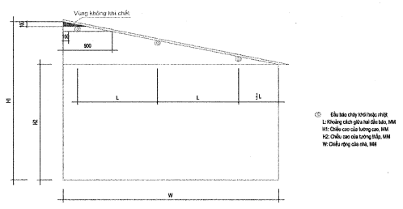
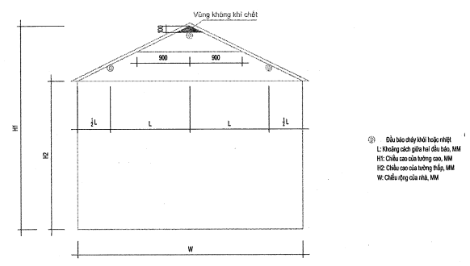
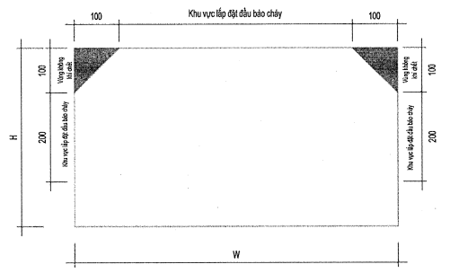

# TIÊU CHUẨN QUỐC GIA

## TCVN 5738 : 2021

### PHÒNG CHÁY CHỮA CHÁY - HỆ THỐNG BÁO CHÁY TỰ ĐỘNG - YÊU CẦU KỸ THUẬT
*Fire protection - Automatic fire alarm system - Technical requirements*

#### Lời nói đầu

TCVN 5738 : 2021 thay thế cho TCVN 5738 : 2001.

TCVN 5738 : 2021 được xây dựng trên cơ sở tham khảo tiêu chuẩn SP 5.13130.2009 của Liên Bang Nga.

TCVN 5738 : 2021 do Cục Cảnh sát Phòng cháy, chữa cháy và Cứu nạn, cứu hộ biên soạn, Bộ Công an đề nghị, Tổng cục Tiêu chuẩn Đo lường Chất lượng thẩm định, Bộ Khoa học và Công nghệ công bố.

---

1. Phạm vi áp dụng

Tiêu chuẩn này quy định yêu cầu kỹ thuật đối với hệ thống báo cháy tự động cho nhà, công trình.

Tiêu chuẩn này không quy định yêu cầu kỹ thuật đối với hệ thống báo cháy tự động cho nhà và công trình được thiết kế theo quy định đặc biệt.

2. Tài liệu viện dẫn

Các tài liệu viện dẫn sau là cần thiết khi áp dụng tiêu chuẩn này. Đối với các tài liệu viện dẫn ghi năm công bố thì áp dụng bản được nêu. Đối với tài liệu viện dẫn không ghi năm công bố thì áp dụng phiên bản mới nhất, bao gồm cả các bản sửa đổi, bổ sung (nếu có).

TCVN 7568-14:2015 (ISO 7240-14:2013): Hệ thống báo cháy - Phần 14: Thiết kế, lắp đặt, vận hành và bảo dưỡng các hệ thống báo cháy trong nhà và xung quanh tòa nhà.

TCVN 7568-10:2015 (ISO 7240-10:2012) Hệ thống báo cháy - Phần 10: đầu báo cháy lửa kiểu điểm.

3. Thuật ngữ và định nghĩa

Trong tiêu chuẩn này sử dụng các thuật ngữ, định nghĩa sau:

3.1

Hệ thống báo cháy tự động (Automatic fire alarm system)

Hệ thống tự động phát hiện và thông báo địa điểm cháy.

3.1.1

Hệ thống báo cháy thường (Conventional fire alarm system)

Hệ thống báo cháy tự động khi báo cháy sẽ báo đến một khu vực, khu vực đó có thể có một hoặc nhiều đầu báo cháy.

3.1.2

Hệ thống báo cháy địa chỉ (Addressable fire alarm system)

Hệ thống báo cháy tự động có chức năng thông báo địa chỉ của từng đầu báo cháy.

3.1.3

Hệ thống báo cháy thông minh (Intelligent fire alarm system)

Hệ thống báo cháy tự động ngoài chức năng báo cháy thường và địa chỉ còn có thể đo được một số thông số về cháy của khu vực nơi lắp đặt đầu báo cháy như nhiệt độ, nồng độ khói hoặc / và tự động thay đổi ngưỡng tác động của đầu báo cháy theo yêu cầu của nhà thiết kế và lắp đặt.

3.2

Đầu báo cháy tự động (Automatic fire detector)

Thiết bị tự động nhạy cảm với các hiện tượng kèm theo sự cháy (sự tăng nhiệt độ, toả khói, phát sáng) và truyền tín hiệu thích hợp đến trung tâm báo cháy.

3.2.1

Đầu báo cháy kiểu điểm (Point detector)

Đầu báo cháy đặt trực tiếp trong khu vực được bảo vệ nhạy cảm với sự tác động của môi trường theo đặc tính của từng loại đầu báo.

3.2.2

Đầu báo cháy nhiệt (Heat detector)

Đầu báo cháy tự động nhạy cảm với sự gia tăng nhiệt độ của môi trường nơi lắp đặt đầu báo cháy.

3.2.2.1

Đầu báo cháy nhiệt cố định (Fixed temperature heat detector)

Đầu báo cháy nhiệt, tác động khi nhiệt độ tại vị trí lắp đặt đầu báo cháy đạt đến giá trị xác định trước.

3.2.2.2

Đầu báo cháy nhiệt gia tăng (Rate of rise heat detector)

Đầu báo cháy nhiệt, tác động khi tốc độ gia tăng nhiệt độ tại vị trí lắp đặt đầu báo cháy đạt đến giá trị xác định.

3.2.2.3

Cáp báo cháy nhiệt kiểu dây (Line type heat detector)

Cáp báo cháy nhiệt có cấu tạo dưới dạng dây được sử dụng báo cháy trên toàn bộ chiều dài tuyến cáp.

3.2.3

Đầu báo cháy khói (Smoke detector)

Đầu báo cháy tự động nhạy cảm với tác động của các hạt rắn hoặc lỏng sinh ra từ quá trình cháy và / hoặc quá trình phân hủy do nhiệt gọi là khói.

3.2.3.1

Đầu báo cháy khói ion hóa (Lonization smoke detector)

Đầu báo cháy khói nhạy cảm với các sản phẩm được sinh ra khi cháy có khả năng tác động tới các dòng ion hoá bên trong đầu báo cháy.

3.2.3.2

Đầu báo cháy khói quang điện (Photoelectric smoke detector)

Đầu báo cháy khói nhạy cảm với các sản phẩm được sinh ra khi cháy có khả năng ảnh hưởng đến sự hấp thụ bức xạ hay tán xạ trong vùng hồng ngoại và / hoặc vùng cực tím nhìn thấy được của phổ điện từ.

3.2.3.3

Đầu báo cháy khói quang học (Optical smoke detector)

Đầu báo cháy khói nhạy cảm với các sản phẩm được sinh ra khi cháy có khả năng ảnh hưởng đến sự hấp thụ bức xạ hay tán xạ trong vùng hồng ngoại và / hoặc vùng cực tím nhìn thấy được của phổ điện từ.

3.2.3.4

Đầu báo cháy khói tia chiếu (Projected beam type smoke detector)

Đầu báo cháy khói có hai bộ phận gồm đầu phát tia sáng và đầu thu tia sáng hoặc đầu phát / thu và gương phản xạ, sẽ tác động khi ở khoảng giữa đầu phát và đầu thu hoặc giữa đầu phát / thu với gương phản xạ xuất hiện nồng độ khói đạt ngưỡng.

3.2.4

Đầu báo cháy lửa (Flame detector)

Đầu báo cháy tự động nhạy cảm với sự bức xạ phát ra của ngọn lửa.

3.2.5

Đầu báo cháy hỗn hợp (Combine detector)

Đầu báo cháy tự động nhạy cảm với ít nhất 2 hiện tượng kèm theo sự cháy.

3.2.6

Đầu báo cháy khói kiểu hút (Aspirating Smoke Detector)

Tự động lấy mẫu thông qua các miệng hút lấy mẫu không khí trên hệ thống đường ống và đưa mẫu không khí (hút) từ khu vực bảo vệ đến thiết bị để phân tích và phát hiện dấu hiệu cháy (khói, thay đổi thành phần hóa học của môi trường). Mỗi miệng hút tương đương như một đầu báo cháy khói.

3.2.7

Hệ thống báo cháy không dây (Wireless fire alarm system)

Là hệ thống báo cháy sử dụng sóng vô tuyến để truyền và nhận tín hiệu.

3.3

Nút ấn báo cháy (Manual call point)

Thiết bị để thực hiện việc báo cháy ban đầu bằng tay.

3.4

Nguồn điện (Electrical power supply)

Thiết bị cấp năng lượng điện cho hệ thống báo cháy.

3.5

Các bộ phận liên kết (Conjunctive devices)

Gồm các linh kiện, hệ thống cáp và dây dẫn tín hiệu, các bộ phận tạo thành tuyến liên kết các thiết bị của hệ thống báo cháy với nhau.

3.6

Trung tâm báo cháy (Fire alarm control panel)

Thiết bị cung cấp năng lượng cho các đầu báo cháy tự động và các thiết bị khác trong hệ thống và thực hiện các chức năng sau đây:

- Nhận tín hiệu từ đầu báo cháy tự động và phát tín hiệu báo động cháy, chỉ thị nơi xảy ra cháy.

- Có thể truyền tín hiệu phát hiện cháy qua thiết bị truyền tín hiệu đến nơi nhận tin báo cháy hoặc / và đến các thiết bị phòng cháy, chữa cháy tự động.

- Kiểm tra sự làm việc bình thường của các thiết bị trong hệ thống, chỉ thị sự cố của hệ thống như đứt dây, chập mạch...

- Tự động điều khiển sự hoạt động của các thiết bị ngoại vi khác.

3.7

Báo động bằng âm thanh (Sound alarm)

Cung cấp cảnh báo bằng âm thanh cho tất cả con người bên trong nhà và công trình biết khi có cháy.

3.8

Báo động bằng ánh sáng (Light alarm)

Cung cấp cảnh báo bằng ánh sáng cho tất cả con người bên trong nhà và công trình biết khi có cháy.

4. Quy định chung

### 4.1  Việc thiết kế, lắp đặt hệ thống báo cháy phải tuân thủ các yêu cầu, quy định của các tiêu chuẩn hiện hành có liên quan.

### 4.2  Hệ thống báo cháy phải đáp ứng những yêu cầu sau:

- Phát hiện cháy nhanh chóng theo chức năng đã được đề ra;

- Chuyển tín hiệu khi phát hiện cháy thành tín hiệu báo động rõ ràng để những người xung quanh có thể thực hiện ngay các biện pháp thích hợp;

- Có khả năng chống nhiễu tốt;

- Báo hiệu nhanh chóng và rõ ràng mọi trường hợp sự cố của hệ thống;

- Không bị ảnh hưởng bởi các hệ thống khác lắp đặt chung hoặc riêng rẽ;

- Không bị tê liệt một phần hay toàn bộ do cháy gây ra trước khi phát hiện ra cháy.

### 4.3  Hệ thống báo cháy phải bảo đảm độ tin cậy và thực hiện đầy đủ các chức năng đã được đề ra mà không xảy ra sai sót.

### 4.4  Những tác động bên ngoài gây ra sự cố cho một bộ phận của hệ thống không được gây ra những sự cố tiếp theo trong hệ thống.

### 4.5  Hệ thống báo cháy bao gồm các bộ phận cơ bản: Trung tâm báo cháy, đầu báo cháy tự động, hộp nút ấn báo cháy, các bộ phận liên kết, nguồn điện. Tùy theo yêu cầu, hệ thống báo cháy còn có các module, các thiết bị truyền tín hiệu, giám sát...

### 4.6  Khi lựa chọn loại đầu báo cháy cần lưu ý các vấn đề sau:

### 4.6.1  Chọn loại đầu báo cháy khói có độ nhạy phù hợp đối với các loại khói khác nhau.

### 4.6.2  Sử dụng đầu báo lửa tại những nơi:

- Khi xảy ra cháy ở giai đoạn ban đầu của đám cháy có xuất hiện ngọn lửa hoặc bề mặt quá nhiệt (thường là trên 600°C);

- Khi xuất hiện ngọn lửa ở các phòng có chiều cao vượt quá giới hạn cho việc sử dụng đầu báo khói hoặc nhiệt;

- Khi tốc độ phát triển đám cháy nhanh, thời điểm phát hiện cháy bởi các loại đầu báo cháy khác không bảo đảm yêu cầu bảo vệ người và tài sản.

### 4.6.3  Độ nhạy của đầu báo cháy lửa phải tương ứng với phổ phát xạ của ngọn lửa tạo bởi các vật liệu cháy nằm trong vùng bảo vệ.

### 4.6.4  Sử dụng đầu báo nhiệt ở những nơi khi xảy ra cháy ở giai đoạn ban đầu của đám cháy chủ yếu phát sinh nhiệt và khi sử dụng các đầu báo khác có thể xảy ra hiện tượng báo cháy giả.

### 4.6.5  Không nên sử dụng đầu báo cháy nhiệt gia tăng hoặc đầu báo cháy nhiệt kép (nhiệt gia tăng và nhiệt cố định) trong môi trường có biến động nhiệt độ đột ngột, bất thường vượt quá 5°C/min.

Không nên sử dụng đầu báo cháy nhiệt cố định trong môi trường mà nhiệt độ không khí trong đám cháy có thể không đạt đến nhiệt độ kích hoạt đầu báo cháy hoặc đạt tới ngưỡng tác động sau một thời gian dài (vượt quá thời gian phát hiện cháy theo quy định).

### 4.6.6  Khi chọn đầu báo cháy nhiệt, cần lưu ý rằng ngưỡng nhiệt độ kích hoạt của đầu báo cháy nhiệt cố định, đầu báo cháy nhiệt kép phải cao hơn ít nhất 20°C so với nhiệt độ tối đa của môi trường tại vị trí lắp đặt đầu báo cháy.

### 4.6.7  Khi không xác định được hiện tượng đặc trưng của sự cháy trong khu vực bảo vệ, nên sử dụng kết hợp các đầu báo cháy nhạy cảm với các hiện tượng cháy khác nhau hoặc đầu báo cháy hỗn hợp.

**CHÚ THÍCH:** Hiện tượng đặc trưng của sự cháy là hiện tượng được phát hiện ở giai đoạn ban đầu của đám cháy trong thời gian ngắn nhất.

5. Trung tâm báo cháy

### 5.1  Trung tâm báo cháy phải có chức năng tự động kiểm tra tín hiệu từ các đầu báo cháy, kênh báo cháy và các thiết bị báo cháy khác truyền về để loại trừ các tín hiệu báo cháy giả. Không được dùng các trung tâm không có chức năng báo cháy làm trung tâm báo cháy tự động.

### 5.2  Trung tâm báo cháy phải đặt ở những nơi thường xuyên có người trực suốt ngày đêm. Trong trường hợp không có người trực suốt ngày đêm, trung tâm báo cháy phải có chức năng truyền các tín hiệu báo cháy và báo sự cố đến nơi trực cháy hay nơi có người thường trực suốt ngày đêm và phải có biện pháp phòng ngừa người không có nhiệm vụ tiếp xúc với trung tâm báo cháy.

Nơi đặt các trung tâm báo cháy phải có điện thoại liên lạc trực tiếp với đơn vị cảnh sát phòng cháy, chữa cháy và cứu nạn, cứu hộ hay nơi nhận tin báo cháy.

### 5.3  Trung tâm báo cháy phải được lắp đặt trên tường, vách ngăn, trên bàn tại những nơi không nguy hiểm về cháy và nổ.

### 5.4  Nếu trung tâm báo cháy được lắp trên các cấu kiện xây dựng bằng vật liệu cháy thì những cấu kiện này phải được bảo vệ bằng lá kim loại dầy từ 1 mm trở lên hoặc bằng các vật liệu không cháy khác có độ dầy không dưới 10 mm. Trong trường hợp này tấm bảo vệ phải có kích thước sao cho mỗi cạnh của tấm bảo vệ vượt ra ngoài cạnh của trung tâm tối thiểu 100 mm về mọi phía.

### 5.5  Khoảng cách giữa các trung tâm báo cháy và trần nhà bằng vật liệu cháy được không nhỏ hơn 1,0 m.

### 5.6  Trong trường hợp lắp cạnh nhau, khoảng cách giữa các trung tâm báo cháy không được nhỏ hơn 50 mm.

### 5.7  Nếu trung tâm báo cháy lắp trên tường, cột nhà hoặc giá máy thì khoảng cách từ phần điều khiển của trung tâm báo cháy đến mặt sàn từ 0,8 đến 1,8 m và phù hợp chiều cao vận hành của con người.

### 5.8  Nhiệt độ và độ ẩm tại nơi đặt trung tâm báo cháy phải phù hợp với tài liệu kỹ thuật và hướng dẫn sử dụng của trung tâm báo cháy.

### 5.9  Tín hiệu âm thanh, ánh sáng khi báo cháy và báo sự cố phải khác nhau.

### 5.10  Việc lắp các đầu báo cháy tự động với trung tâm báo cháy phải chú ý đến sự phù hợp của hệ thống (điện áp cấp cho đầu báo cháy, dạng tín hiệu báo cháy, phương pháp phát hiện sự cố, bộ phận kiểm tra đường dây).

### 5.11  Dung lượng trung tâm báo cháy của hệ thống báo cháy thường phải có số kênh dự trữ ít nhất là 10%.

6. Đầu báo cháy tự động

### 6.1  Các đầu báo cháy tự động phải bảo đảm phát hiện cháy theo chức năng và các đặc tính kỹ thuật quy định tại TCVN 7568-14.

Việc lựa chọn đầu báo cháy tự động phải căn cứ vào tính chất của các chất cháy, đặc điểm của môi trường bảo vệ theo tính chất của công trình tham khảo tại Phụ lục A.

### 6.2  Các đầu báo cháy phải có đèn chỉ thị khi tác động. Trường hợp đầu báo cháy tự động không có đèn chỉ thị khi tác động thì đế đầu báo cháy tự động phải có đèn báo thay thế.

Đối với đầu báo cháy không dây (đầu báo cháy vô tuyến và đầu báo cháy tại chỗ) ngoài đèn chỉ thị khi tác động còn phải có tín hiệu báo về tình trạng của nguồn cấp.

### 6.3  Số lượng đầu báo cháy tự động cần phải lắp đặt cho một khu vực bảo vệ phụ thuộc vào yêu cầu phát hiện cháy trên toàn bộ diện tích của khu vực đó và phải bảo đảm yêu cầu kỹ thuật.

Trường hợp hệ thống báo cháy tự động dùng để điều khiển hệ thống chữa cháy tự động thì mỗi điểm trong khu vực bảo vệ phải được kiểm soát bằng 2 đầu báo cháy tự động thuộc 2 kênh hoặc 2 địa chỉ khác nhau.

Trường hợp nhà có trần treo giữa các lớp trần có lắp đặt các hệ thống kỹ thuật, cáp điện, cáp tín hiệu thì phải lắp bổ sung đầu báo cháy ở trần phía trên.

### 6.4  Các đầu báo cháy khói và đầu báo cháy nhiệt được lắp dưới trần nhà hoặc mái nhà. Trong trường hợp không lắp được trên trần nhà hoặc mái nhà cho phép lắp trên dầm, xà, cột hoặc treo các đầu báo cháy trên dây dưới trần nhà nhưng bảo đảm các điều kiện sau:

- Mái dốc là mái có độ dốc lớn hơn 1/8 từ phía tường cao đến phía tường thấp.

- Mái đỉnh chữ A là mái có độ dốc lớn hơn 1/8 từ điểm cao nhất của mái về hai phía (áp dụng cho cả mái vòm hoặc mái cong).

- Biểu thức xác định độ dốc của mái:

| S = | $H_{1}$ – $H_{2}$ | (Nếu S nhỏ hơn hoặc bằng 1/8 thì được coi là trần phẳng) |
| :--- | :--- | :--- |
| S = | W | (Nếu S nhỏ hơn hoặc bằng 1/8 thì được coi là trần phẳng) |

- Xác định vị trí các điểm trên trần nhà trong phạm vi 0,9 m từ phía tường cao.

- Vị trí lắp đặt đầu báo cháy đầu tiên sẽ ở bất kì điểm nào trong phạm vi khu vực 0,9 m đó. (Ngoại trừ vùng tam giác khu vực dưới mái và cách tường 0,1 m, đây được coi là vùng không khí chết, không chuyển động nên khi cháy nhiệt độ và khói khó xâm nhập được vào vùng này).

- Các đầu báo cháy còn lại được xác định vị trí và khoảng cách trên cơ sở hình chiếu bằng của mái, các thông số tính toán như trường hợp trần phẳng.

<strong>Hình 1 — Phương pháp xác định vị trí lắp đặt các đầu báo cháy trên nhà mái dốc</strong>

<strong>Hình 2 — Phương pháp xác định vị trí lắp đặt các đầu báo cháy trên nhà mái đỉnh chữ A</strong>

- Một số trường hợp đặc biệt khác khi phải lắp đặt đầu báo cháy gần tường hoặc trên tường cũng không được phép lắp đặt trong vùng tam giác 0,1 m tính từ góc phía cạnh tường và mái nhà. Đối với đầu báo cháy lắp ở trên tường thì chỉ nên lắp trong khoảng 0,1 m đến 0,3 m tính từ mái nhà xuống.

<strong>Hình 3 — Phương pháp xác định vị trí lắp đặt các đầu báo cháy gần tường hoặc trên tường nhà</strong>

### 6.5  Phải lắp đặt bổ sung đầu báo cháy khỏi, nhiệt kiểu điểm ở bên dưới cấu trúc có chiều cao lớn hơn 0,4 m tính từ trần nhà đến vị trí thấp nhất của phần nhô ra và chiều rộng lớn hơn hoặc bằng 0,75 m.

Trường hợp trần nhà có những phần nhô ra về phía dưới từ 0,08 m đến 0,4 m thì việc lắp đặt đầu báo cháy tự động được tính như trần nhà không có các phần nhô ra nói trên nhưng diện tích bảo vệ của một đầu báo cháy tự động giảm 25 %.

Trường hợp trần nhà có những phần nhô ra về phía dưới trên 0,4 m và độ rộng nhỏ hơn 0,75 m thì việc lắp đặt đầu báo cháy tự động được tính như trần nhà không có các phần nhô ra nói trên nhưng diện tích bảo vệ của một đầu báo cháy tự động giảm 40 %.

### 6.6  Trường hợp các chất cháy, thiết bị công nghệ, kết cấu của công trình được sắp xếp có điểm cao nhất cách trần nhà nhỏ hơn hoặc bằng 0,6 m thì các đầu báo cháy tự động phải được lắp ngay phía trên đường biên những vị trí đó.

Khi lắp đặt đầu báo cháy khói kiểu điểm tại các khu vực có chiều rộng dưới 3 m, hoặc dưới sàn nâng hoặc trên trần treo và trong các không gian khác có chiều cao dưới 1,7 m, khoảng cách giữa các đầu báo cháy quy định tại Bảng 1 được phép tăng 1,5 lần.

Khi lắp đặt đầu báo cháy dưới sàn nâng, trên trần giả và những nơi khác không thấy đầu báo cháy phải xác định được vị trí khi đầu báo cháy hoạt động (Ví dụ: đầu báo cháy địa chỉ hoặc thiết bị báo địa chỉ hoặc có chỉ thị quang từ xa, V.V.). Sàn nâng, trần giả phải có vị trí tiếp cận để bảo trì, bảo dưỡng các đầu báo cháy.

### 6.7  Đầu báo cháy khói, nhiệt kiểu điểm khi lắp đặt trên trần nhà cho phép được sử dụng để bảo vệ không gian bên dưới trần treo hở, nếu đáp ứng được đồng thời các điều kiện sau:

- Khoảng hở có cấu trúc tuần hoàn và diện tích của nó vượt quá 40 % bề mặt;

- Kích thước tối thiểu của mỗi khoảng hở trong bất kỳ phần nào không nhỏ hơn 10 mm;

- Độ dầy của tấm trần treo không lớn hơn ba lần kích thước tối thiểu của lỗ hở.

Nếu một trong những điều kiện trên không được đáp ứng, các đầu báo cháy phải được lắp đặt trong vị trí chính dưới trần treo, trường hợp cần thiết phải lắp đặt bổ sung đầu báo cháy bảo vệ khu vực trên trần treo.

### 6.8  Số đầu báo cháy tự động loại thụ động lắp trên một kênh của hệ thống báo cháy phụ thuộc vào đặc tính kỹ thuật của trung tâm báo cháy nhưng diện tích bảo vệ của mỗi kênh không lớn hơn 2 000 $m^{2}$ đối với khu vực bảo vệ hở và 500 $m^{2}$ đối với khu vực bảo vệ kín. Các đầu báo cháy tự động phải sử dụng theo yêu cầu kỹ thuật, tiêu chuẩn và tài liệu kỹ thuật của đầu báo cháy tự động do nhà sản xuất công bố và có tính đến điều kiện môi trường nơi cần bảo vệ.

**CHÚ THÍCH:** 

- Khu vực bảo vệ hở là khu vực khi đứng ở trong đó có thể quan sát thấy khói, ánh lửa nằm trong vùng diện tích bảo vệ của toàn bộ khu vực như kho tàng, phân xưởng sản xuất, hội trường....

- Khu vực kín là khu vực khi đứng ở trong đó không thể nhìn thấy khói, ánh lửa nằm trong diện tích bảo vệ của toàn bộ khu vực như trong hầm cáp, trần treo, các phòng được ngăn cách với nhau...

### 6.9  Trong trường hợp trung tâm báo cháy không có chức năng chỉ thị địa chỉ của từng đầu báo cháy tự động, các đầu báo cháy tự động lắp đặt trên một kênh cho phép kiểm soát đến 20 căn phòng hoặc khu vực trên cùng một tầng nhà có lối ra hành lang chung nhưng ở phía ngoài từng phòng, từng khu vực phải có đèn chỉ thị về sự tác động báo cháy của bất cứ đầu báo cháy nào được lắp đặt trong các phòng, khu vực đó đồng thời phải bảo đảm yêu cầu của Điều 6.8.

Trường hợp căn phòng có cửa kính hoặc vách kính với hành lang chung mà từ hành lang nhìn được vào trong phòng qua vách kính hoặc cửa kính thì cho phép không lắp đặt các đèn chỉ thị ở phía ngoài căn phòng đó.

### 6.10  Khoảng cách từ đầu báo cháy đến mép ngoài của miệng thổi của các hệ thống thông gió hoặc hệ thống điều hòa không khí không được nhỏ hơn 1 m.

Không được lắp đặt đầu báo cháy trực tiếp trước các miệng thổi trên.

Việc lắp đặt đầu báo cháy phải được thực hiện sao cho các thiết bị gần đó (ống, ống dẫn khí, thiết bị, v.v.) không cản trở tác động từ hiện tượng của sự cháy lên các đầu báo cháy và các nguồn bức xạ ánh sáng, nhiễu điện từ không ảnh hưởng đến việc hoạt động của đầu báo.

### 6.11  Trường hợp trong một khu vực bảo vệ được lắp đặt nhiều loại đầu báo cháy thì khoảng cách giữa các đầu báo cháy phải bảo đảm sao cho mỗi vị trí trong khu vực đó đều được bảo vệ bởi ít nhất một đầu báo cháy.

Trường hợp lắp đặt trong một vùng bảo vệ của các loại đầu báo cháy khác nhau, vị trí của chúng phải bảo đảm theo các yêu cầu của tiêu chuẩn này cho từng loại đầu báo cháy.

Nếu không xác định được hiện tượng đặc trưng của sự cháy, có thể lắp đặt các đầu báo cháy hỗn hợp (khói - nhiệt) hoặc kết hợp giữa đầu báo cháy khói và đầu báo cháy nhiệt lắp đặt xem kẽ. Trong trường hợp này, vị trí của các đầu báo cháy phải đáp ứng yêu cầu tại Bảng 2.

Nếu hiện tượng đặc trưng của sự cháy phổ biến là khói, thì các đầu báo cháy được lựa chọn và lắp đặt theo Bảng 1 hoặc Bảng 3.

Khi xác định số lượng đầu báo cháy, đầu báo cháy hỗn hợp được tính như một đầu báo cháy.

Trường hợp trong một khu vực bảo vệ được lắp đặt đầu báo cháy hỗn hợp thì khoảng cách giữa các đầu báo cháy được xác định theo hiện tượng đặc trưng của sự cháy.

### 6.12  Đối với môi trường có nguy hiểm về nổ phải sử dụng các đầu báo cháy có khả năng chống nổ.

Tại những khu vực cỏ độ ẩm cao và / hoặc nhiều bụi phải sử dụng các đầu báo cháy có khả năng chống ẩm và / hoặc chống bụi phù hợp.

Tại những khu vực có nhiều côn trùng phải sử dụng các đầu báo cháy có khả năng chống côn trùng xâm nhập vào bên trong đầu báo cháy hoặc có biện pháp chống côn trùng xâm nhập vào trong đầu báo cháy nhưng không ảnh hưởng đến việc hoạt động của đầu báo.

### 6.13  Đầu báo cháy khói kiểu điểm

Diện tích bảo vệ của một đầu báo cháy khói, khoảng cách tối đa giữa các đầu báo cháy khói với nhau và giữa đầu báo cháy khói với tường nhà phải xác định theo Bảng 1, nhưng không được lớn hơn các trị số ghi trong yêu cầu kỹ thuật và tài liệu kỹ thuật của đầu báo cháy khói.

### Bảng 1 - Quy định lắp đặt đầu báo cháy khói kiểu điểm

| Độ cao của khu vực bảo vệ (m) | Diện tích bảo vệ trung bình của một đầu báo cháy ($m^{2}$) | Khoảng cách tối đa (m) |  |
| :--- | :--- | :--- | :--- |
| Độ cao của khu vực bảo vệ (m) | Diện tích bảo vệ trung bình của một đầu báo cháy ($m^{2}$) | Giữa các đầu báo cháy | Từ đầu báo cháy đến tường nhà |
| Đến 3,5 | Đến 85 | 9,0 | 4,5 |
| Lớn hơn 3,5 đến 6,0 | Đến 70 | 8,5 | 4,0 |
| Lớn hơn 6,0 đến 10 | Đến 65 | 8,0 | 4,0 |
| Lớn hơn 10 đến 12 | Đến 55 | 7,5 | 3,5 |

### 6.14  Đầu báo cháy khói tia chiếu

### 6.14.1  Các đầu báo cháy khói tia chiếu được sử dụng cho các khu vực bảo vệ có độ cao đến 21 m. Khoảng cách giữa các tia chiếu với tường không lớn hơn 4,5 m và giữa các tia chiếu không lớn hơn 9,0 m. Đối với khu vực mái dốc hoặc mái chữ A, khoảng cách trên được xác định theo phương ngang.

### 6.14.2  Khoảng cách từ tia chiếu đến trần phải trong khoảng 0,025 m đến 0,6 m. Cho phép tia chiếu cách trần lớn hơn 0,6 m khi khoảng cách giữa các tia chiếu không lớn hơn 25 % chiều cao lắp đặt của đầu báo cháy khói tia chiếu và khoảng cách giữa tia chiếu với tường không lớn hơn 12,5 % chiều cao lắp đặt đầu báo cháy khói tia chiếu, khi đó khoảng cách của tia chiếu theo phương đứng đến điểm cao nhất của chất cháy không nhỏ hơn 2 m.

### 6.14.3  Khoảng cách tối thiểu và tối đa giữa bộ phát với bộ thu hoặc bộ thu - phát với gương phản xạ được xác định bởi tài liệu kỹ thuật cho các loại đầu báo cháy cụ thể.

Khoảng cách tối thiểu giữa các tia chiếu, từ tia chiếu đến tường và các vật thể xung quanh phải được thiết lập theo các yêu cầu của tài liệu kỹ thuật để tránh nhiễu lẫn nhau.

Trong khoảng giữa đầu phát với đầu thu hoặc đầu thu - phát với gương phản xạ của đầu báo cháy khói tia chiếu không được có vật chắn che khuất tia chiếu.

### 6.15  Đầu báo cháy nhiệt kiểu điểm

### 6.15.1  Diện tích bảo vệ của một đầu báo cháy nhiệt, khoảng cách tối đa giữa các đầu báo cháy nhiệt với nhau và giữa đầu báo cháy nhiệt với tường nhà phải xác định theo Bảng 2 nhưng không lớn hơn các trị số ghi trong điều kiện kỹ thuật và tài liệu kỹ thuật của đầu báo cháy nhiệt.

### Bảng 2 - Quy định lắp đặt đầu báo cháy nhiệt kiểu điểm

| Độ cao của khu vực bảo vệ (m) | Diện tích bảo vệ trung bình của một đầu báo cháy ($m^{2}$) | Khoảng cách tối đa (m) |  |
| :--- | :--- | :--- | :--- |
| Độ cao của khu vực bảo vệ (m) | Diện tích bảo vệ trung bình của một đầu báo cháy ($m^{2}$) | Giữa các đầu báo cháy | Từ đầu báo cháy đến tường nhà |
| Đến 3,5 | Đến 25 | 5,0 | 2,5 |
| Lớn hơn 3,5 đến 6,0 | Đến 20 | 4,5 | 2,0 |
| Lớn hơn 6,0 đến 9,0 | Đến 15 | 4,0 | 2,0 |

### 6.15.2  Đầu báo cháy nhiệt phải được bố trí nhằm loại bỏ ảnh hưởng của các hiệu ứng nhiệt không liên quan đến đám cháy.

### 6.16  Đầu báo cháy lửa

### 6.16.1  Các đầu báo cháy lửa trong các phòng hoặc khu vực phải được lắp trên trần nhà, tường nhà và các cấu kiện xây dựng khác hoặc lắp ngay trên thiết bị cần bảo vệ. Trường hợp phát sinh khói trong giai đoạn đầu của đám cháy thì khoảng cách của đầu báo cháy lửa đến trần không nhỏ hơn 0,8 m.

### 6.16.2  Không gian của khu vực bảo vệ phải được xác định theo góc nhìn, độ nhạy với phổ phát xạ của ngọn lửa tạo bởi vật liệu cháy, cũng như độ nhạy và yêu cầu kỹ thuật quy định tại TCVN 7568-10. Ngoài ra, các thông số của đầu báo cháy lửa phải lấy theo tài liệu kỹ thuật do nhà sản xuất công bố.

Khi khu vực bảo vệ bị che chắn bởi các thiết bị, các giá bảo quản hoặc các đồ vật khác thì phải lắp đặt bổ sung đầu báo cháy lửa cho khu vực này.

### 6.17  Đầu báo cháy khói kiểu hút

### 6.17.1  Đầu báo cháy khói kiểu hút làm việc phụ thuộc vào độ nhạy của đầu báo và được chia thành ba loại:

- Loại A - siêu nhạy (độ che mờ do khói dưới 0,8 %/m);

- Loại B - độ nhạy cao (độ che mờ do khói từ 0,8 đến dưới 2,0 %/m);

- Loại C - độ nhạy tiêu chuẩn (độ che mờ do khói từ 2,0 đến 4,5 %/m).

### 6.17.2  Thời gian lấy mẫu không khí từ lỗ hút xa nhất đến đầu báo cháy, tùy thuộc vào độ nhạy của đầu báo cháy kiểu hút, không được vượt quá:

- 60 s đối với loại A;

- 90 s đối với loại B;

- 120 s đối với loại c.

### 6.17.3  Đầu báo cháy khói kiểu hút phải được lắp đặt theo Bảng 3, tùy thuộc vào loại độ nhạy.

### Bảng 3 - Quy định lắp đặt đầu báo cháy khói kiểu hút

| Độ nhạy của đầu báo cháy khói kiểu hút | Chiều cao tối đa khu vực bảo vệ (m) | Bán kính bảo vệ của 1 lỗ hút (m) |
| :--- | :---: | :---: |
| Loại A, siêu nhạy | 30 | 6,5 |
| Loại B, độ nhạy cao | 18 | 6,5 |
| Loại C, độ nhạy tiêu chuẩn | 12 | 6,5 |

Các đầu báo cháy khói kiểu hút được sử dụng để bảo vệ các không gian hở lớn và các công trình như: sảnh thông tầng, nhà sản xuất, nhà kho, nhà ga hành khách, gian tập thể thao, sân vận động, rạp xiếc, phòng triển lãm bảo tàng, trong phòng tranh, phòng trưng bày...

Các khu vực bảo vệ có tập trung nhiều thiết bị điện tử: phòng máy chủ, tổng đài, trung tâm xử lý dữ liệu... nên sử dụng các đầu báo cháy khỏi kiểu hút loại A.

### 6.17.4  Được phép đặt các ống lấy mẫu của đầu báo cháy khói kiểu hút vào các kết cấu của tòa nhà hoặc các thành phần trang trí phòng, tuy nhiên phải bảo đảm khả năng hoạt động của các lỗ hút khí. Đường ống lấy mẫu có thể được đặt phía trên trần treo hoặc phía dưới sàn nâng với các miệng hút được bố trí dọc theo chiều dài của đường ống đi qua trần treo hoặc sàn nâng để lỗ hút khí của đường lấy mẫu phải nằm trong không gian của khu vực bảo vệ. Được phép sử dụng các lỗ trong ống lấy mẫu (bao gồm cả việc sử dụng ống dẫn) để kiểm soát sự xuất hiện của khói cả trong không gian chính và trong không gian phía trên trần treo, dưới sàn nâng. Nếu cần thiết, cho phép sử dụng các ống nhánh có lỗ ở cuối để bảo vệ những nơi khó tiếp cận, cũng như lấy các mẫu không khí từ không gian bên trong của các thiết bị, máy móc...

Chiều dài tối đa của ống lấy mẫu, cũng như số lượng lỗ hút khí tối đa, được xác định bởi các đặc tính kỹ thuật của đầu báo cháy.

Khi lắp đặt các ống lấy mẫu trong các vị trí có chiều rộng dưới 3 m, dưới sàn nâng hoặc trên trần treo và trong các không gian khác có chiều cao dưới 1,7 m, bán kính bảo vệ của các lỗ hút như trong Bảng 3 có thể tăng thêm 1,5 lần.

### 6.18  Cáp báo cháy nhiệt kiểu dây

### 6.18.1  Cáp báo cháy nhiệt được lắp đặt dưới trần hoặc tiếp xúc trực tiếp với chất cháy.

### 6.18.2  Khi lắp đặt cáp báo cháy nhiệt kiểu dây dưới trần phải bảo đảm các yêu cầu kỹ thuật như đối với đầu báo cháy nhiệt kiểm điểm.

Trường hợp bố trí chất cháy trên giá kệ hàng, cho phép chỉ lắp đặt cáp báo cháy nhiệt kiểu dây phía trên từng tầng của giá kệ hàng.

Cáp báo cháy nhiệt kiểu dây cần lắp đặt tránh hư hỏng do tác động cơ học.

### 6.19  Thiết bị báo cháy không dây

Thiết bị báo cháy không dây được lắp đặt và sử dụng để bảo vệ khu vực nguy hiểm.

Thiết bị báo cháy không dây phải được cơ quan có thẩm quyền kiểm định đạt theo tiêu chuẩn ISO 7240-25 hoặc tiêu chuẩn tương đương.

7. Nút ấn báo cháy

### 7.1  Nút ấn báo cháy được lắp bên trong cũng như bên ngoài nhà và công trình, được lắp trên tường và các cấu kiện xây dựng ở độ cao 1,4 m ± 0,2 m tính từ mặt sàn hay mặt đất và có một không gian trống dạng nửa đường tròn bán kính 0,6 m xung quanh mặt trước của nút ấn báo cháy.

### 7.2  Nút ấn báo cháy phải lắp trên các lối thoát nạn, chiếu nghỉ cầu thang ở vị trí dễ thấy, dễ thao tác (tham khảo Phụ lục B). Trong trường hợp xét thấy cần thiết có thể lắp trong từng phòng. Khoảng cách giữa các nút ấn báo cháy không quá 45 m và khoảng cách từ nút ấn báo cháy đến lối ra của mọi gian phòng không quá 30 m.

### 7.3  Trường hợp nút ấn báo cháy được lắp ở bên ngoài tòa nhà thì khoảng cách tối đa giữa các nút ấn báo cháy là 150 m và phải có ký hiệu, chỉ thị vị trí rõ ràng. Nút ấn báo cháy lắp ngoài nhà phải là loại chống thấm nước hoặc phải có biện pháp chống mưa hắt cũng như các tác động từ môi trường. Nơi lắp đặt các nút ấn báo cháy phải được chiếu sáng liên tục vào ban đêm.

### 7.4  Các nút ấn báo cháy có thể lắp theo kênh riêng, địa chỉ riêng hoặc lắp chung trên một kênh với các đầu báo cháy.

### 7.5  Trường hợp tránh tác động ngoài ý muốn đến nút ấn báo cháy tại nhà chung cư, cơ sở giáo dục phải sử dụng nút ấn báo cháy có nắp trong suốt có bản lề bảo vệ.

8. Hệ thống cáp và dây tín hiệu, dây cấp nguồn

### 8.1  Việc lựa chọn cáp và dây tín hiệu của hệ thống báo cháy tự động phải thỏa mãn tiêu chuẩn, quy phạm lắp đặt thiết bị và dây dẫn điện hiện hành có liên quan phù hợp với yêu cầu kỹ thuật của tiêu chuẩn này và tài liệu kỹ thuật đối với từng loại thiết bị cụ thể.

### 8.2  Phải có biện pháp bảo vệ cáp và dây tín hiệu của hệ thống báo cháy tự động để chống chập hoặc đứt dây (luồn trong ống kim loại hoặc ống bảo vệ khác), chống chuột cắn, côn trùng hoặc các nguyên nhân cơ học khác làm hư hỏng cáp và dây tín hiệu. Các lỗ xuyên trần, tường sau khi thi công xong phải được chèn bịt hoặc xử lý thích hợp để không làm giảm các chỉ tiêu kỹ thuật về cháy theo yêu cầu của kết cấu.

### 8.3  Các mạch tín hiệu của hệ thống báo cháy tự động phải được kiểm tra tự động về tình trạng kỹ thuật theo suốt chiều dài của mạch tín hiệu.

### 8.4  Các mạch tín hiệu của hệ thống báo cháy tự động phải sử dụng dây dẫn riêng và cáp có lõi bằng đồng. Cho phép sử dụng cáp thông tin lõi đồng của mạng thông tin hỗn hợp nhưng phải tách riêng kênh liên lạc.

### 8.5  Tiết diện lõi đồng của cáp và dây tín hiệu phải được xác định dựa trên độ sụt áp cho phép của hệ thống báo cháy tự động nhưng không nhỏ hơn 0,75 $mm^{2}$ (tương đương với lõi đòng cỏ đường kính 1 mm) đối với đường cáp trục chính. Cho phép dùng nhiều dây dẫn tết lại nhưng tổng diện tích tiết diện của các lõi đồng được tết lại không được nhỏ hơn 0,75 $mm^{2}$. Tiết diện từng lõi đồng của đường cáp trục chính phải không nhỏ hơn 0,5 $mm^{2}$. Cho phép dùng cáp nhiều dây trong một lớp bọc bảo vệ chung nhưng đường kính lõi đồng của mỗi dây không được nhỏ hơn 0,5 mm.

Tổng điện trở của đường dây tín hiệu trên mỗi kênh báo cháy không được lớn 100 Ω và không được lớn hơn giá trị yêu cầu đối với từng loại trung tâm báo cháy.

### 8.6  Cáp tín hiệu điều khiển thiết bị ngoại vi, dây tín hiệu nối từ các đầu báo cháy trong hệ thống báo cháy tự động dùng để kích hoạt hệ thống chữa cháy tự động là loại chịu nhiệt cao (cáp, dây tín hiệu chống cháy có thời gian chịu lửa 30 min). Cho phép sử dụng cáp tín hiệu điều khiển thiết bị ngoại vi là loại cáp thường nhưng phải có biện pháp bảo vệ khỏi sự tác động của nhiệt ít nhất trong thời gian 30 min.

### 8.7  Không cho phép lắp đặt chung dây tín hiệu của hệ thống báo cháy tự động và dây tín hiệu điều khiển của hệ thống chữa cháy tự động có điện áp nhỏ hơn 60 V với đường dây có điện áp khác trên 110 V trong cùng một đường ống, một hộp, một bó, một rãnh kín của cấu kiện xây dựng.

Cho phép lắp đặt chung các mạch trên khi có vách ngăn dọc giữa chúng bằng vật liệu không cháy có giới hạn chịu lửa không dưới 15 min.

### 8.8  Trong trường hợp mắc hở song song thì khoảng cách giữa dây dẫn của đường điện chiếu sáng và điện động lực với cáp, dây tín hiệu của hệ thống báo cháy tự động không được nhỏ hơn 0,5 m. Nếu khoảng cách này nhỏ hơn 0,5 m phải có biện pháp chống nhiễu điện từ.

### 8.9  Trường hợp trong công trình có nguồn phát nhiễu hoặc đối với hệ thống báo cháy địa chỉ thì bắt buộc phải sử dụng cáp và dây tín hiệu chống nhiễu. Nếu cáp và dây tín hiệu không chống nhiễu thì nhất thiết phải luồn trong ống hoặc hộp kim loại có tiếp đất.

Đối với hệ thống báo cháy tự động thông thường khuyến khích sử dụng cáp và dây tín hiệu chống nhiễu hoặc không chống nhiễu nhưng được luồn trong ống kim loại hoặc hộp kim loại có tiếp đất.

### 8.10  Số lượng đầu nối của các hộp đấu dây và số lượng dây dẫn của cáp trục chính phải có dự phòng là 20 %.

9. Âm thanh và ánh sáng

### 9.1  Thiết bị báo động bằng âm thanh:

### 9.1.1  Các thiết bị báo cháy bằng âm thanh phải bảo đảm các yêu cầu sau:

- Tín hiệu báo động phải phân bố đồng thời trong khoang cháy / nhà và công trình

- Các tín hiệu báo động, nghe thấy rõ ở tất cả các địa điểm trong khoang cháy / nhà và công trình.

- Mức cường độ âm ở tất cả các vị trí phải bảo đảm lớn hơn mức áp suất âm thanh của môi trường xung quanh ít nhất 10 dBA và không lớn hơn 105 dBA.

Tín hiệu báo động bằng âm thanh đối với các khu vực ngủ phải lớn hơn mức áp suất âm thanh của môi trường xung quanh ít nhất 15 dBA (với điều kiện các cửa ra vào đều đóng).

### 9.1.2  Đối với các khu vực như bệnh viện nơi bệnh nhân không chịu được sự căng thẳng do các tiếng ồn lớn thì mức cường độ âm thanh và nội dung thông báo phải được bố trí để đưa ra cảnh báo cho các nhân viện của bệnh viện và giảm tới mức tối thiểu sự khủng hoảng về tinh thần cho các bệnh nhân.

Lưu ý: Trong trường hợp nhà và công trình có trang bị hệ thống âm thanh công cộng thì mức cường độ âm của các hệ thống này cần bảo đảm yêu cầu Điều 9.1.1

### 9.2  Thiết bị cảnh báo bằng ánh sáng:

### 9.2.1  Vị trí lắp đặt thiết bị cảnh báo bằng ánh sáng:

- Được lắp đặt trên hành lang, lối ra thoát nạn;

- Nơi người khiếm thính thường ở;

- Nơi có tiếng ồn xung quanh vượt quá 95 dBA;

- Khu vực yêu cầu hạn chế về âm thanh (ví dụ khu vực phòng mổ trong bệnh viện)

### 9.2.2  Thiết bị cảnh báo bằng ánh sáng được lắp đặt cho nhà và công trình bảo đảm các yêu cầu sau:

- Phải lắp đặt trên trần hoặc tường với số lượng thích hợp sao cho có thể nhìn thấy ở tất cả các vị trí trong khu vực quy định tại Điều 9.2.1;

- Khi lắp đặt trên tường chiều cao tối thiểu từ chân tường đến đèn tối thiểu 2,0 m;

- Tín hiệu cảnh báo bằng ánh sáng cần bảo đảm tính đồng bộ khi lóe sáng;

- Sự cố của thiết bị cảnh báo bằng ánh sáng trong khu vực bất kỳ không làm ảnh hưởng đến hoạt động của các thiết bị cảnh báo bằng ánh sáng trong khu vực khác.

10. Nguồn điện và tiếp đất bảo vệ

### 10.1  Trung tâm của hệ thống báo cháy phải có hai nguồn điện độc lập: Một nguồn 220 V xoay chiều và một nguồn là ắc quy dự phòng.

Giá trị dao động của hiệu điện thế của nguồn xoay chiều cung cấp cho trung tâm báo cháy không được vượt quá ±10 %. Trường hợp giá trị dao động này lớn hơn 10 % phải sử dụng ổn áp trước khi cấp cho trung tâm.

Dung lượng của ắc quy dự phòng phải bảo đảm ít nhất 24 h cho thiết bị hoạt động ở chế độ thường trực và 1 h khi có cháy.

Khi sử dụng ắc quy làm nguồn điện, ắc quy phải được nạp điện tự động.

### 10.2  Các trung tâm báo cháy phải được tiếp đất bảo vệ. Việc tiếp đất bảo vệ phải thỏa mãn yêu cầu của quy phạm nối đất thiết bị điện hiện hành.

---

## 📑 DANH MỤC PHỤ LỤC KỸ THUẬT CHUYÊN ĐỀ (MODULAR ANNEXES)

Toàn bộ 2 Phụ lục kỹ thuật chuyên đề đã được module hóa thành các tệp độc lập nhằm tối ưu hóa tra cứu và thẩm tra thiết kế (ADR 0021 & ADR 0030):

| Ký hiệu | Tên Phụ Lục | Tính chất | Liên kết Tập tin |
| :---: | :--- | :---: | :---: |
| **Phụ lục A** | Chọn đầu báo cháy tự động theo tính chất các cơ sở được trang bị | Tham khảo | [📑 **Xem Phụ lục**](annexes/phu_luc_a_chon_dau_bao_chay_tu_dong.md) |
| **Phụ lục B** | Vị trí lắp đặt nút ấn báo cháy tùy thuộc vào mục đích của các tòa nhà và các vị trí | Tham khảo | [📑 **Xem Phụ lục**](annexes/phu_luc_b_vi_tri_lap_dat_nut_an_bao_chay.md) |

---

## 📊 HỆ THỐNG TRA CỨU BẢNG & SƠ ĐỒ KỸ THUẬT

- **Tra cứu 5 Bảng Số Liệu:** Tra cứu chi tiết dạng CSV/JSON tại [Thư mục Bảng Số Liệu](tables/README.md).
- **Tra cứu Sơ Đồ Hình Vẽ:** Tra cứu ảnh nét cao và đặc tả phân vùng tại [Danh Mục Sơ Đồ Hình Vẽ](figures/figures_catalog.yaml).

