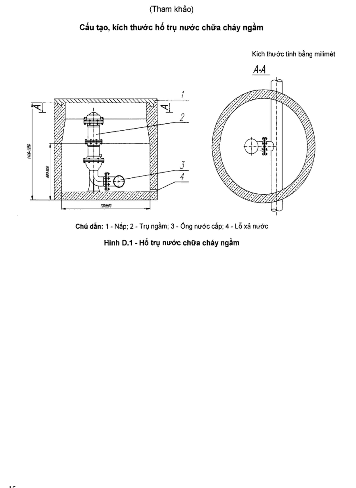

## PHỤ LỤC D (tham khảo) — Hố trụ nước chữa cháy ngầm

<strong>Hình D.1 — Hố trụ nước chữa cháy ngầm</strong>

Thư mục tài liệu tham khảo

[1] TCVN 5738:2021 Phòng cháy chữa cháy — Hệ thống báo cháy tự động — Yêu cầu kỹ thuật.

[2] TCVN 3890:2023 Phòng cháy chữa cháy — Phương tiện phòng cháy và chữa cháy cho nhà và công trình — Trang bị, bố trí.

[3] QCVN 06:2022/BXD Quy chuẩn kỹ thuật quốc gia về An toàn cháy cho nhà và công trình.