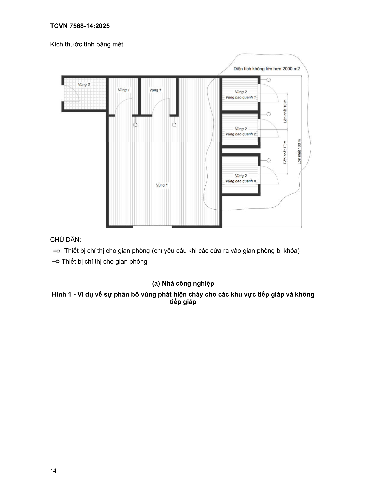
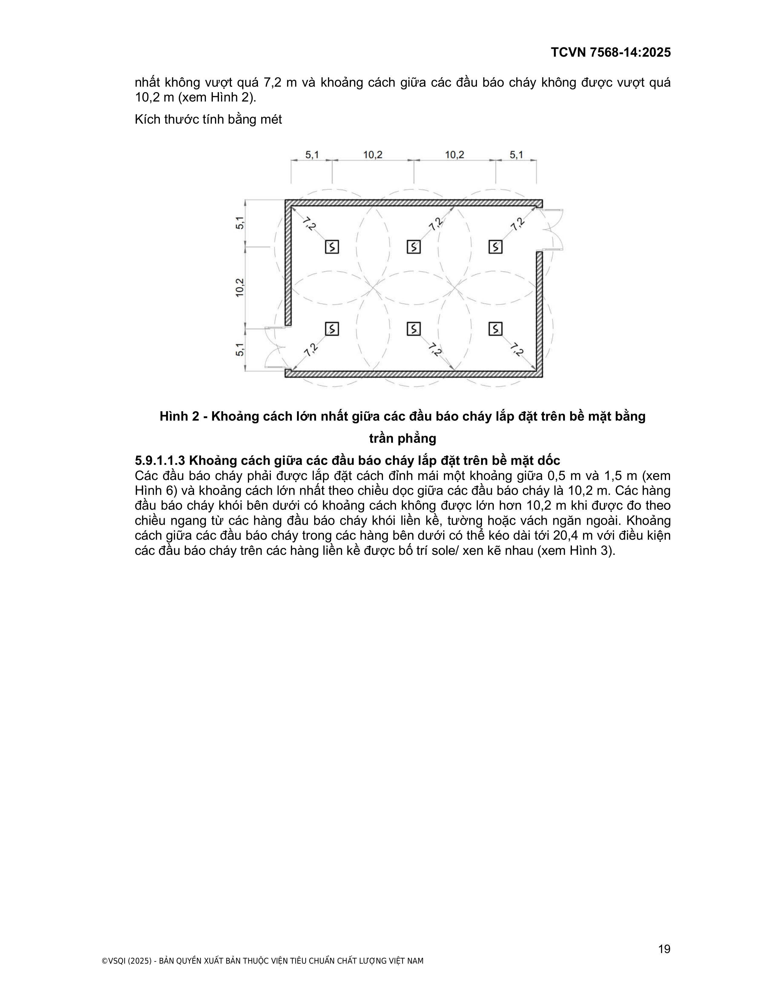
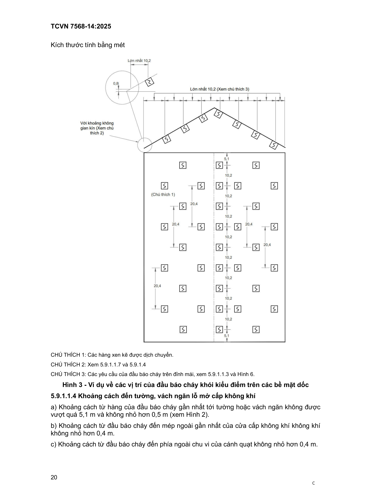
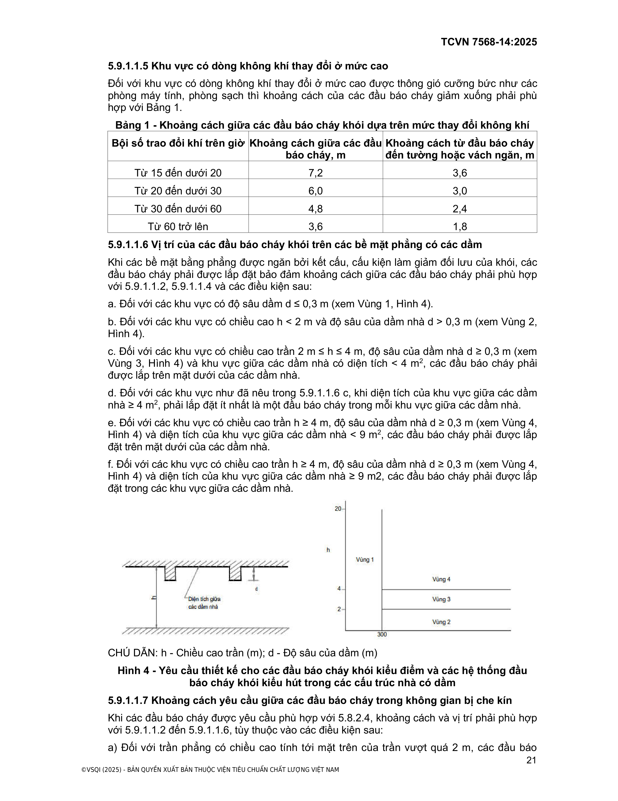
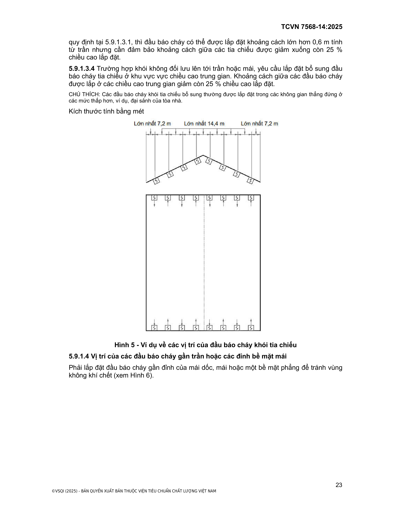
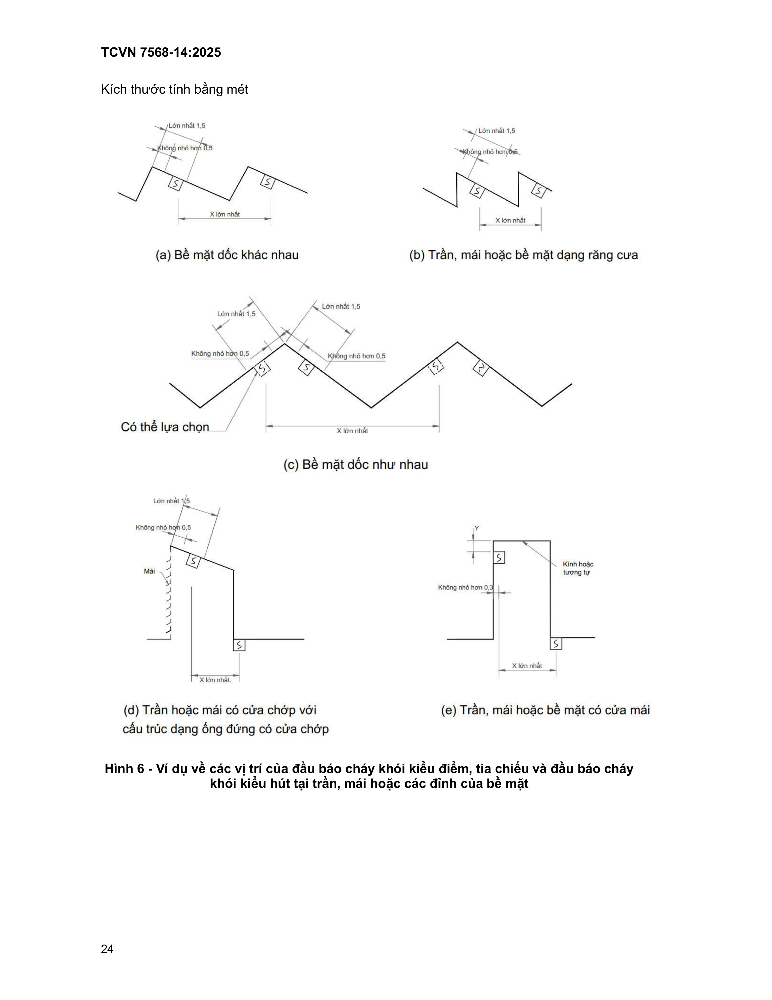
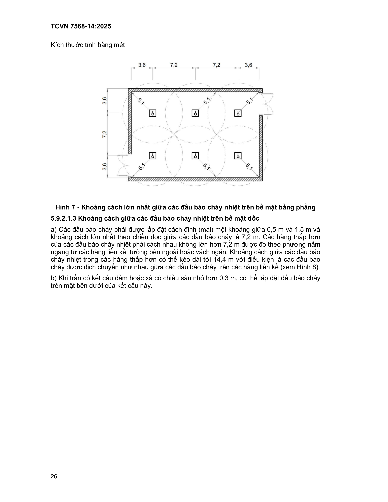
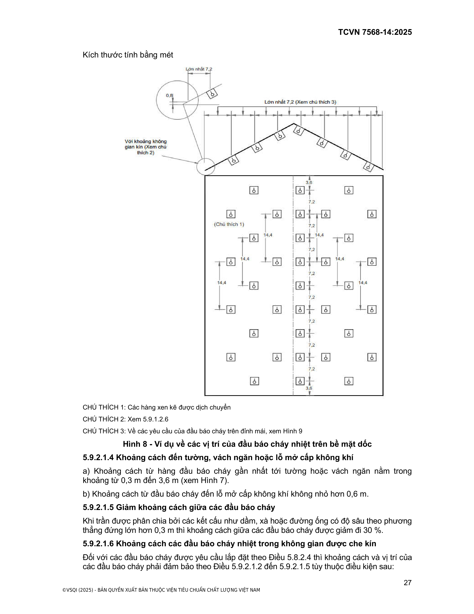
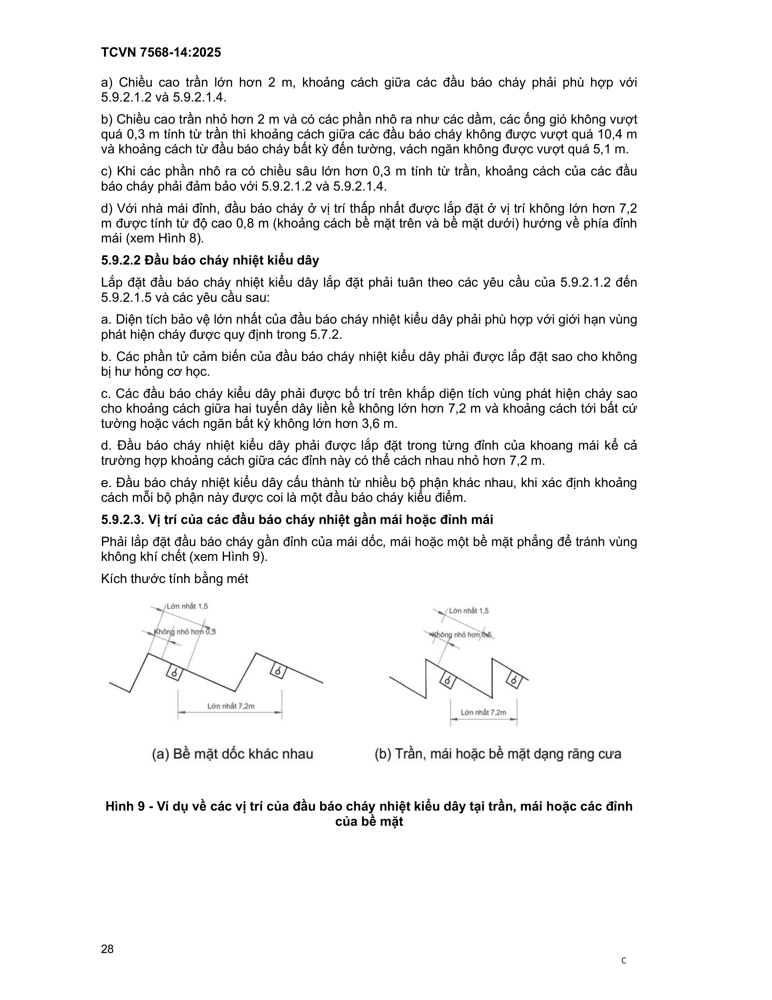
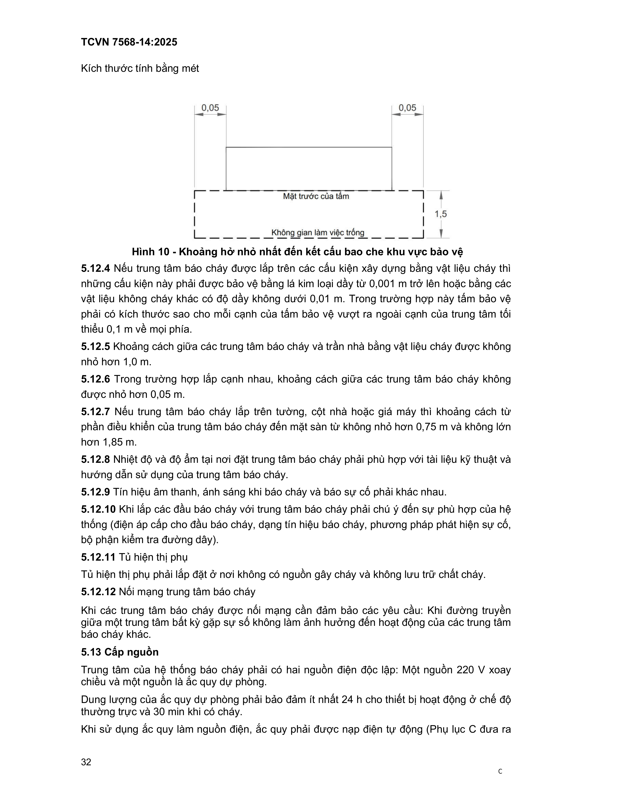

# TIÊU CHUẨN QUỐC GIA

**TCVN 7568-14:2025**

Xuất bản lần 2

HỆ THỐNG BÁO CHÁY — PHẦN 14: THIẾT KẾ, LẮP ĐẶT CÁC HỆ THỐNG BÁO CHÁY CHO NHÀ VÀ CÔNG TRÌNH

Fire detection and alarm systems — Part 14: Design and installation of fire alarm systems for houses and constructions

HÀ NỘI — 2025

5

## Lời nói đầu

**TCVN 7568-14:2025 thay thế TCVN 7568-14:2015 và TCVN 5738:2021**

**TCVN 7568-14:2025 do Cục Cảnh sát phòng cháy, chữa cháy và cứu nạn, cứu hộ biên soạn**

trên cơ sở ISO 7240-14:2013, TCVN 5738:2021, Bộ Công an đề nghị, Ủy ban Tiêu chuẩn Đo

lường Chất lượng Quốc gia thẩm định, Bộ Khoa học và Công nghệ công bố.

Giới thiệu

Bộ TCVN 7568, Hệ thống báo cháy gồm các phần sau:

- TCVN 7568-1:2024 (ISO 7240-1:2014) – Phần 1: Quy định chung và định nghĩa.

- TCVN 7568-2:2013 (ISO 7240-2:2003) – Phần 2: Trung tâm báo cháy.

- TCVN 7568-3:2015 (ISO 7240-3:2010) – Phần 3: Thiết bị báo cháy bằng âm thanh.

- TCVN 7568-4:2013 (ISO 7240-4:2003) – Phần 4: Thiết bị cấp nguồn.

- TCVN 7568-5:2013 (ISO 7240-5:2003) – Phần 5: Đầu báo cháy nhiệt kiểu điểm.

- TCVN 7568-6:2013 (ISO 7240-6-2011) – Phần 6: Đầu báo cháy khí cacbon monoxit dùng

pin điện hóa.

- TCVN 7568-7:2015 (ISO 7240-7-2011) – Phần 7: Đầu báo cháy khói kiểu điểm sử dụng

ánh sáng, ánh sáng tán xạ hoặc ion hóa.

- TCVN 7568-8:2015 (ISO 7240-8:2014) - Phần 8: Đầu báo cháy kiểu điểm sử dụng cảm

biến cacbon monoxit kết hợp với cảm biến nhiệt.

- TCVN 7568-9:2015 (ISO/TS 7240-9:2012) - Phần 9: Đám cháy thử nghiệm cho các đầu

báo cháy.

- TCVN 7568-10-2015 (ISO 7240-10:2012) - Phần 10: Đầu báo cháy lửa kiểu điểm.

- TCVN 7568-11:2015 (ISO 7240-11:2011) - Phần 11: Hộp nút ấn báo cháy.

- TCVN 7568-12:2015 (ISO 7240-12:2014) - Phần 12: Đầu báo cháy khói kiểu đường truyền

sử dụng chùm tia chiếu quang học.

- TCVN 7568-13:2015 (ISO 7240-13:2005) - Phần 13: Đánh giá tính tương thích của các bộ

phận trong hệ thống.

- TCVN 7568-15:2015 (ISO 7240-15:2014) - Phần 15: Đầu báo cháy kiểu điểm sử dụng cảm

biến khói và cảm biến nhiệt.

- TCVN 7568-16:2016 (ISO 7240-16:2007) – Phần 16: Thiết bị điều khiển và hiển thị hệ

thống âm thanh.

- TCVN 7568-17:2016 (ISO 7240-17:2009) - Phần 17: Thiết bị cách ly ngắn mạch.

- TCVN 7568-18:2016 (ISO 7240-18:2009) - Phần 18: Thiết bị vào/ra.

- TCVN 7568-19:2016 (ISO 7240-19:2007) - Phần 19: Thiết kế, lắp đặt, chạy thử và bảo

dưỡng các hệ thống âm thanh dùng cho tình huống khẩn cấp.

- TCVN 7568-20:2016 (ISO 7240-20:2010) - Phần 20: Bộ phát hiện khói công nghệ hút.

- TCVN 7568-21:2016 (ISO 7240-21:2005) - Phần 21: Thiết bị định tuyến.

- TCVN 7568-22:2016 (ISO 7240-22:2007) - Phần 22: Thiết bị phát hiện khói dùng trong các

đường ống.

- TCVN 7568-23:2016 (ISO 7240-23:2013) - Phần 23: Thiết bị báo động qua thị giác.

- TCVN 7568-25:2023 (ISO 7240-25:2010) - Phần 25: Các thành phần sử dụng kết nối bằng

đường truyền vô tuyến.

- TCVN 7568-29:2023 (ISO/TS 7240-29:2017) - Phần 29: Đầu báo cháy video.

Bộ ISO 7240, Fire detetion and alarm systems (Hệ thống báo cháy) còn có các phần sau:

- ISO 7240-24:2010 - Part 24: Soud-system loundspeakers (Loa hệ thống âm thanh).

- ISO 7240-27:2009 - Part 27: Point-type fire detectors using a scattered-light, transmitted-

light or ionization smoke sensor, and electrochemical-cell carbon-monoxide sensor and a

heat sensor (Đầu báo cháy kiểu điểm sử dụng ánh sáng tán xạ, ánh sáng truyền qua hoặc

cảm biến khói lớn ion hóa và cảm biến khí cacbon monoxit pin điện hoá và cảm biến nhiệt).

- ISO 7240-28:2008 - Part 28: Fire protection control equipment (Thiết bị kiểm soát phòng

cháy chữa cháy).

- ISO/TS 7240-30:2022 - Part 30: Fire detection and alarm systems - Design, installation,

commissioning and service of video fire detector systems (Hệ thống báo cháy - Thiết kế, lắp

đặt, vận hành và bảo dưỡng hệ thống báo cháy video).

- ISO 7240-31:2022 - Fire detection and alarm systems — Part 31: Resettable line-type heat

detectors (Hệ thống báo cháy - Phần 31 - Đầu báo cháy nhiệt kiểu dây có thể đặt lại).

T I Ê U C H U Ẩ N Q U Ố C G I A                                                     TCVN 7568-14:2025

Hệ thống báo cháy - Phần 14: Thiết kế, lắp đặt các hệ thống báo cháy

cho nhà và công trình

Fire detection and alarm systems - Part 14: Design and installation of fire alarm systems for houses

and constructions

---

## 1  PHẠM VI ÁP DỤNG

Tiêu chuẩn này quy định yêu cầu thiết kế, lắp đặt đối với hệ thống báo cháy cho nhà,

công trình.

Tiêu chuẩn này không quy định yêu cầu kỹ thuật đối với hệ thống báo cháy cho nhà và công

trình được thiết kế theo quy định đặc biệt.

## 2  TÀI LIỆU VIỆN DẪN

Các tài liệu viện dẫn sau rất cần thiết cho áp dụng tiêu chuẩn này. Đối với các tài liệu viện

dẫn có ghi năm công bố thì áp dụng phiên bản đã nêu. Đối với các tài liệu viện dẫn không

ghi năm công bố thì áp dụng phiên bản mới nhất, bao gồm cả các sửa đổi.

TCVN 7568 (tất cả các phần), Hệ thống báo cháy.

## 3  THUẬT NGỮ, ĐỊNH NGHĨA

Tiêu chuẩn này áp dụng các thuật ngữ và định nghĩa trong TCVN 7568-1 (ISO 7240-1) và

các thuật ngữ, định nghĩa nêu dưới đây:

3.1

Hệ thống báo cháy thường (Conventional fire alarm system)

Hệ thống báo cháy khi báo cháy sẽ báo đến một khu vực, khu vực đó có thể có một hoặc

nhiều đầu báo cháy.

3.2

Hệ thống báo cháy địa chỉ (Addressable fire alarm system)

Hệ thống báo cháy khi báo cháy sẽ báo đến từng thiết bị địa chỉ trong hệ thống (đầu báo

cháy địa chỉ, module, nút ấn báo cháy địa chỉ,…).

3.3

Hệ thống báo cháy thông minh (Intelligent fire alarm system)

Hệ thống báo cháy thông minh, ngoài chức năng báo cháy còn có khả năng đo lường các

thông số của đám cháy tại khu vực lắp đặt đầu báo cháy như nhiệt độ, nồng độ khói. Đồng

thời, có thể tự điều chỉnh ngưỡng tác động của các đầu báo cháy để thích nghi với sự thay

đổi của môi trường, nâng cao hiệu quả phát hiện cháy và giảm thiểu báo cháy giả.

3.4

Đầu báo cháy tự động (Automatic fire detector)

Thiết bị tự động nhạy cảm với các hiện tượng kèm theo sự cháy (sự tăng nhiệt độ, toả khói,

phát sáng) và truyền tín hiệu thích hợp đến trung tâm báo cháy.

3.5

Đầu báo cháy kiểu điểm (Point detector)

Đầu báo cháy đặt trực tiếp trong khu vực được bảo vệ để nhạy cảm với sự tác động của môi

trường xung quanh vị trí lắp đặt đầu báo cháy theo đặc tính của từng loại đầu báo.

T I Ê U  C H U Ẩ N  Q U Ố C   G I A

Hệ thống báo cháy – Phần 14: Thiết kế, lắp đặt các hệ thống báo

cháy cho nhà và công trình

Fire detection and alarm systems – Part 14: Design and installation of fire alarm systems for

Houses and Constructions

3.6

Đầu báo cháy nhiệt (Heat detector)

Đầu báo cháy tự động nhạy cảm với sự gia tăng nhiệt độ của môi trường nơi lắp đặt đầu

báo cháy.

3.7

Đầu báo cháy nhiệt cố định (Fixed temperature heat detector)

Đầu báo cháy nhiệt cố định nhạy cảm với nhiệt độ môi trường đạt đến một giá trị xác

định (ngưỡng).

3.8

Đầu báo cháy nhiệt gia tăng (Rate of rise heat detector)

Đầu báo cháy nhiệt, tác động khi tốc độ gia tăng nhiệt độ tại vị trí lắp đặt đầu báo cháy đạt

đến giá trị xác định.

3.9

Đầu báo cháy khói (Smoke detector)

Đầu báo cháy tự động nhạy cảm với tác động của các hạt rắn hoặc lỏng sinh ra từ quá trình

cháy và / hoặc quá trình phân hủy do nhiệt gọi là khói.

3.10

Đầu báo cháy hỗn hợp (Combine detector)

Đầu báo cháy tự động nhạy cảm với ít nhất 2 hiện tượng kèm theo của sự cháy.

3.11

Đầu báo cháy khói kiểu hút (Aspirating Smoke Detector)

Đầu báo cháy tự động lấy mẫu thông qua các miệng hút lấy mẫu không khí trên hệ thống

đường ống và đưa mẫu không khí (hút) từ khu vực bảo vệ đến thiết bị để phân tích và phát

hiện dấu hiệu cháy (khói, thay đổi thành phần hóa học của môi trường). Mỗi miệng hút lấy

mẫu tương đương như một đầu báo cháy khói kiểu điểm.

3.12

Hệ thống báo cháy không dây (Wireless fire alarm system)

Là hệ thống báo cháy sử dụng sóng vô tuyến để truyền và nhận tín hiệu.

3.13

Vùng báo động cháy (alarm zone)

Khu vực được chia theo mục đích thông báo cháy hoặc/và theo công năng sử dụng trong

nhà, công trình, ở đó được lắp đặt một hoặc nhiều thiết bị báo động cháy và được cung cấp

chỉ thị báo động cháy chung.

3.14

Vùng phát hiện cháy (fire detection zone)

Khu vực được chia theo kiến trúc của nhà, công trình, trong đó có lắp đặt đầu báo cháy tại

một hoặc nhiều điểm và được cung cấp chỉ thị phát hiện cháy chung.

3.15

Phạm vi hoạt động (area of coverage)

Vùng bên trong và/hoặc bên ngoài của nhà hoặc công trình ở đó hệ thống báo cháy đáp ứng

các yêu cầu của tiêu chuẩn này.

**CHÚ THÍCH:** Phạm vi hoạt động có thể không bao gồm một số bộ phận của vùng bên trong và/hoặc bên ngoài

nhà và công trình.

C

3.16

Đường thoát nạn (escape route)

Đường di chuyển của người, dẫn trực tiếp ra ngoài hoặc dẫn vào vùng an toàn, tầng lánh

nạn, gian lánh nạn và đáp ứng các yêu cầu thoát nạn an toàn của người khi có cháy.

3.18

Điện áp cực thấp (extra low voltage)

Điện áp cực thấp là điện áp không vượt quá điện áp xoay chiều 50 V hoặc điện áp một chiều

120 V.

3.19

Khoang cháy (fire compartment)

Thể tích được giới hạn bởi các thành phần xây dựng để ngăn cản đám cháy và các sản

phẩm cháy lan truyền từ một khoang cháy hoặc từ một gian phòng có đám cháy tới các

khoang cháy hoặc gian phòng khác.

3.20

Bề mặt bằng phẳng (level surface)

Bề mặt, mái hoặc trần có độ dốc nhỏ hơn hoặc bằng 1/8

3.21

Bề mặt dốc (nghiêng) (sloping surface)

Bề mặt, mái hoặc trần có độ dốc lớn hơn 1/8.

**CHÚ THÍCH:** Bề mặt dốc không thể là bề mặt bằng phẳng và bao gồm các trần dạng vòm - hình trống.

3.22

Chế độ tĩnh (quiescent condition)

Là trạng thái báo động cháy, cảnh báo lỗi và các trạng thái không hoạt động và thử nghiệm.

## 4  QUY ĐỊNH CHUNG

### 4.1  Yêu cầu về thiết kế, lựa chọn hệ thống báo cháy

### 4.1.1  Việc thiết kế, lắp đặt hệ thống báo cháy phải tuân thủ các yêu cầu, quy định của các

tiêu chuẩn hiện hành có liên quan.

### 4.1.2  Hệ thống báo cháy phải đáp ứng những yêu cầu sau:

&nbsp;&nbsp;\- Phát hiện cháy nhanh chóng theo chức năng đã được đề ra;

&nbsp;&nbsp;\- Chuyển tín hiệu khi phát hiện cháy thành tín hiệu báo động rõ ràng để những người xung

quanh có thể thực hiện ngay các biện pháp thích hợp;

&nbsp;&nbsp;\- Có khả năng chống nhiễu tốt;

&nbsp;&nbsp;\- Hệ thống báo hiệu nhanh chóng và rõ ràng mọi trường hợp;

&nbsp;&nbsp;\- Không bị ảnh hưởng bởi các hệ thống khác lắp đặt chung hoặc riêng rẽ;

&nbsp;&nbsp;\- Không bị tê liệt một phần hay toàn bộ do cháy gây ra trước khi phát hiện ra cháy.

### 4.1.3  Hệ thống báo cháy phải bảo đảm độ tin cậy và thực hiện đầy đủ các chức năng đã

được thiết kế.

### 4.1.4  Những tác động bên ngoài gây ra sự cố cho một bộ phận của hệ thống không được

gây ra những sự cố tiếp theo trong hệ thống.

### 4.1.5  Khi lựa chọn loại đầu báo cháy cần lưu ý các vấn đề sau:

### 4.1.5.1  Chọn loại đầu báo cháy khói có độ nhạy phù hợp đối với các loại khói khác nhau.

### 4.1.5.2  Sử dụng đầu báo lửa tại những nơi:

&nbsp;&nbsp;\- Khi xảy ra cháy ở giai đoạn ban đầu của đám cháy có xuất hiện ngọn lửa hoặc bề mặt quá

nhiệt (thường là trên 600 °C);

&nbsp;&nbsp;\- Khi xuất hiện ngọn lửa ở các phòng có chiều cao vượt quá giới hạn cho việc sử dụng đầu

báo khói hoặc nhiệt;

&nbsp;&nbsp;\- Khi tốc độ phát triển đám cháy nhanh, thời điểm phát hiện cháy bởi các loại đầu báo cháy

khác không bảo đảm yêu cầu bảo vệ người và tài sản.

### 4.1.5.3  Độ nhạy của đầu báo cháy lửa phải tương ứng với phổ phát xạ của ngọn lửa tạo bởi

các vật liệu cháy nằm trong vùng bảo vệ.

### 4.1.5.4  Sử dụng đầu báo nhiệt ở những nơi khi xảy ra cháy ở giai đoạn ban đầu của đám

cháy chủ yếu phát sinh nhiệt và khi sử dụng các đầu báo khác có thể xảy ra hiện tượng báo

cháy giả.

### 4.1.5.5  Không sử dụng đầu báo cháy nhiệt gia tăng hoặc đầu báo cháy nhiệt kép (nhiệt gia

tăng và nhiệt cố định) trong môi trường có biến động nhiệt độ đột ngột, bất thường vượt quá

5 °C/min.

Không sử dụng đầu báo cháy nhiệt cố định trong môi trường mà nhiệt độ không khí trong

đám cháy có thể không đạt đến nhiệt độ kích hoạt đầu báo cháy hoặc đạt tới ngưỡng tác

động sau một thời gian dài (vượt quá thời gian phát hiện cháy theo quy định).

### 4.1.5.6  Khi chọn đầu báo cháy nhiệt, cần lưu ý rằng ngưỡng nhiệt độ kích hoạt của đầu báo

cháy nhiệt cố định, đầu báo cháy nhiệt kép phải cao hơn ít nhất 20 °C so với nhiệt độ tối đa

của môi trường tại vị trí lắp đặt đầu báo cháy.

### 4.1.5.7  Khi không xác định được hiện tượng đặc trưng của sự cháy trong khu vực bảo vệ,

nên sử dụng kết hợp các đầu báo cháy nhạy cảm với các hiện tượng khác nhau của sự

cháy hoặc đầu báo cháy hỗn hợp.

**CHÚ THÍCH:** Hiện tượng đặc trưng của sự cháy là hiện tượng được phát hiện ở giai đoạn ban đầu của đám cháy

(khói, lửa, nhiệt...) trong thời gian ngắn nhất.

### 4.2  Thiết bị bổ sung

### 4.2.1  Thiết bị bổ sung (ví dụ, các thiết bị đầu cuối điều khiển từ xa hoặc các màn hình hiển

thị) có thể được bao gồm trong thiết kế hệ thống báo cháy hoặc được kết nối với hệ thống

báo cháy.

### 4.2.2  Các thiết bị bổ sung khi lắp đặt không làm ảnh hưởng đến hoạt động của hệ thống

báo cháy.

### 4.2.3  Trường hợp các thiết bị bổ sung hư hỏng không ảnh hưởng đến hoạt động vận hành

của hệ thống báo cháy.

## 5  THIẾT KẾ HỆ THỐNG BÁO CHÁY

### 5.1  Hệ thống báo cháy phải được thiết kế phù hợp với các yêu cầu của tiêu chuẩn này, các

tiêu chí thiết kế phải thỏa mãn các mục tiêu về an toàn cháy và bao gồm:

&nbsp;&nbsp;\- Các điều kiện về môi trường;

&nbsp;&nbsp;\- Loại nhà và công trình;

&nbsp;&nbsp;\- Phát hiện cháy nhanh chóng theo chức năng đã được đề ra;

&nbsp;&nbsp;\- Chuyển tín hiệu khi phát hiện cháy thành tín hiệu báo động rõ ràng để những người xung

quanh có thể thực hiện ngay các biện pháp thích hợp;

&nbsp;&nbsp;\- Có khả năng chống nhiễu tốt;

&nbsp;&nbsp;\- Báo hiệu nhanh chóng và rõ ràng mọi trường hợp;

&nbsp;&nbsp;\- Không bị ảnh hưởng bởi các hệ thống khác được lắp đặt chung hoặc riêng rẽ;

&nbsp;&nbsp;\- Không bị tê liệt một phần hay toàn bộ do cháy gây ra trước khi phát hiện ra cháy.

### 5.2  Thiết kế có thể loại trừ các vùng không có vật liệu cháy.

C

### 5.3  Khi không có yêu cầu thiết kế phát hiện đám cháy cho toàn bộ nhà và công trình (trừ các

vùng được nêu trong 5.2), các khu vực sau có thể được bao gồm trong phạm vi thiết kế:

&nbsp;&nbsp;\- Một hoặc nhiều khoang cháy;

&nbsp;&nbsp;\- Một phần của khoang cháy;

&nbsp;&nbsp;\- Đường thoát nạn (Vùng phát hiện cháy trên đường thoát nạn có thể không phát hiện cháy

từ nơi phát sinh đám cháy);

&nbsp;&nbsp;\- Thiết bị trong tòa nhà (Đầu báo cháy được lắp đặt ở trong hoặc liền kề với thiết bị).

### 5.4  Khi không có yêu cầu tự động phát hiện đám cháy và các quy định khác cho phép có thể

lắp đặt một hệ thống các nút ấn báo cháy (xem 5.10).

### 5.5  Khi thiết kế hệ thống báo cháy bao gồm cả sử dụng các chức năng tùy chọn được quy

định trong các tiêu chuẩn thiết bị có liên quan thì việc sử dụng chức năng tùy chọn và lý do

sử dụng phải được đưa vào trong tài liệu thiết kế.

**CHÚ THÍCH:** Các quy định khác có thể yêu cầu sử dụng một số chức năng tùy chọn hoặc có thể cấm sử dụng

một số chức năng tùy chọn.

### 5.6  Khi thiết kế phải quan tâm đến tất cả giới hạn khác bao gồm:

a. Kích thước của các vùng phát hiện cháy và các vùng báo động cháy;

b. Số lượng lớn nhất của các đầu báo cháy được lắp đặt trong một vùng phát hiện cháy;

c. Các giới hạn của các thiết bị khởi động tự động và khởi động bằng tay trên mạng

báo cháy;

d. Các yêu cầu về giao tiếp đối với yêu cầu về hệ thống âm thanh dùng cho các mục đích

khẩn cấp;

e. Các yêu cầu đặc biệt đối với các mạng báo cháy có cả đầu báo cháy và thiết bị báo

động cháy;

f. Các yêu cầu đặc biệt đối với sự kết hợp của mạng thiết bị khởi động và thiết bị báo động cháy;

g. Các yêu cầu cho các hệ thống truyền tín hiệu báo cháy và tín hiệu cảnh báo lỗi;

h. Sử dụng vật liệu cho lắp đặt như cáp có vỏ bảo vệ các ống dẫn...;

i. Lắp đặt thiết bị trong các môi trường dễ xảy ra nổ.

### 5.7  Vùng phát hiện cháy

### 5.7.1  Quy định chung

Nhà và công trình phải được phân chia thành các vùng phát hiện cháy sao cho có thể xác

định được một cách nhanh chóng nguồn gốc của báo động cháy từ các chỉ báo tại tủ trung

tâm báo cháy và trên các đầu báo cháy.

### 5.7.2  Các giới hạn của vùng phát hiện cháy

### 5.7.2.1  Một vùng phát hiện cháy trong nhà, công trình được giới hạn không lớn hơn 2000 m2

diện tích sàn liên tục (xem Vùng 1 của Hình 1); đối với khu vực sàn diện tích không liên tục,

một vùng phát hiện cháy không quá 2000 m2 (xem Vùng 2 của Hình 1) và phải đảm bảo điều

kiện các lối vào của hai khu vực sàn liền kề có khoảng cách không lớn hơn 10 m và nhìn

thấy nhau. Kích thước lớn nhất của vùng phát hiện cháy không vượt quá 100 m và  được

giới hạn trong một tầng nhà. Các vùng không có lối vào từ bên trong nhà phải được bố trí

thành các vùng phát hiện cháy độc lập với vùng phát hiện cháy có lối vào từ bên trong nhà.

Ví dụ về sự phân bố vùng phát hiện cháy được giới thiệu trên Hình 1.

Kích thước tính bằng mét

**CHÚ DẪN:**

Thiết bị chỉ thị cho gian phòng (chỉ yêu cầu khi các cửa ra vào gian phòng bị khóa)

Thiết bị chỉ thị cho gian phòng

(a) Nhà công nghiệp

<strong>Hình 1 — Ví dụ về sự phân bố vùng phát hiện cháy cho các khu vực tiếp giáp và không</strong>

tiếp giáp

**CHÚ DẪN:**

Thiết bị chỉ thị cho gian phòng khi lối vào gian phòng bị hạn chế.

(b) Văn phòng, thương mại, dịch vụ và nhà có công năng tương tự

<strong>Hình 1 — Ví dụ về sự phân bố vùng phát hiện cháy cho các khu vực tiếp giáp và không</strong>

### 5.7.2.2  Cho phép dùng chung vùng phát hiện cháy đối với khu vực có tầng lửng, khi tầng

lửng này có thể tiếp cận được từ sàn chung.

### 5.7.2.3  Các đầu báo cháy bảo vệ trong các không gian bị che kín có tổng diện tích không

vượt quá 500 m2 cho phép kết nối vào vùng phát hiện cháy trên cùng một sàn với điều kiện

là tổng số các đầu báo cháy không vượt quá 40.

### 5.7.2.4  Các vùng phát hiện cháy có thể được chia nhỏ ra sao cho các tín hiệu từ các đầu

báo cháy riêng biệt hoặc nhóm các đầu báo cháy có thể được chỉ thị tại tủ trung tâm báo

cháy, như vậy có thể cung cấp thông tin chi tiết về vị trí phát hiện cháy.

### 5.7.2.5  Một vùng phát hiện cháy chỉ cho phép thuộc một vùng báo động cháy.

**CHÚ THÍCH:** nhiều vùng phát hiện cháy có thể chung một vùng báo động cháy nhưng một vùng phát hiện cháy

không chia thành nhiều vùng báo động cháy.

### 5.8  Vị trí của đầu báo cháy

### 5.8.1  Quy định chung

Vị trí lắp đặt và khoảng cách giữa các đầu báo cháy dựa trên đặc điểm kiến trúc và nguy cơ

phát sinh cháy bao gồm:

&nbsp;&nbsp;\- Chiều cao đến trần;

&nbsp;&nbsp;\- Cầu trúc của trần;

&nbsp;&nbsp;\- Hàng hóa;

&nbsp;&nbsp;\- Sự hiện diện của con người;

&nbsp;&nbsp;\- Công năng.

### 5.8.2  Yêu cầu vị trí lắp đặt đầu báo cháy

### 5.8.2.1  Quy định chung

### 5.8.2.1.1  Khi xác định vị trí lắp đặt của các đầu báo cháy tham khảo Phụ lục A và phải bảo

đảm các yêu cầu:

a. Các khu vực phòng ngủ phải lắp đặt đầu báo cháy khói quang điện hoặc khói quang học

hoặc đầu báo cháy CO.

b. Các khu vực như hành lang, đường, lối đi, lối ra thoát nạn hoặc các khu vực tương tự

khác phải lắp đặt đầu báo cháy khói quang điện hoặc khói tia chiếu.

c. Khi một khu vực được chia thành nhiều phần bởi tường, vách ngăn hoặc các giá kệ hàng

cách trần (hoặc mặt dưới của dầm ngang) không quá 0,3 m thì mỗi khu vực này được coi

như phòng riêng biệt và phải được trang bị đầu báo cháy đảm bảo theo quy định.

d. Duy trì khoảng trống xung quanh đầu báo cháy có bán kính tối thiểu là 0,1 m và độ sâu

0,6 m.

**CHÚ THÍCH:** Đối với các khu vực có thiết bị điện chiếu sáng hoặc các thiết bị khác lắp đặt trên trần, nếu không

thể đảm bảo độ sâu 0,6 m, cần ưu tiên đảm bảo bán kính tối thiểu 0,1 m xung quanh đầu báo cháy. Trong trường

hợp này, cần bố trí vị trí lắp đặt đầu báo cháy sao cho hạn chế tối đa sự che chắn của thiết bị chiếu sáng hoặc

thiết bị khác đối với khả năng phát hiện khói/nhiệt của đầu báo.

e. Đèn chỉ thị của đầu báo cháy phải quan sát được từ các lối đi.

### 5.8.2.1.2  Khi lắp đặt các đầu báo cháy có trang bị nhiều hơn một cảm biến và đầu báo cháy

được điều chỉnh cài đặt với một cảm biến thì phải áp dụng các yêu cầu về lắp đặt cho bộ

phận cảm biến được cài đặt.

### 5.8.2.2  Các đường dẫn kín

Các đường dẫn kín không được ngăn cháy phục vụ di chuyển giữa các tòa nhà hoặc các

phần của tòa nhà phải được lắp đặt các đầu báo cháy (xem 5.8.2.8).

### 5.8.2.3  Hệ thống xử lý không khí

### 5.8.2.3.1  Phải sử dụng đầu báo cháy khói [xem TCVN 7568-22 (ISO 7240-22)] để giám sát

không khí trong các đường ống dẫn.

### 5.8.2.3.2  Trong các hệ thống xử lý không khí, các đầu báo cháy phải được lắp đặt ở các vị

trí sau:

a) \- Nhà và công trình có sử dụng hệ thống cấp không khí tuần hoàn phục vụ cho nhiều hơn

một khu vực kín, nếu khu vực kín đó không được trang bị đầu báo cháy khói thì phải lắp đặt

các đầu báo cháy khói liền kề với cửa vào của đường ống hút hoặc sử dụng các đầu báo

cháy khói cho đường ống lấy mẫu không khí chung.

**CHÚ THÍCH:** có thể lắp đặt riêng từng miệng hút hoặc chung tại ống góp đối với đường ống hút nhiều gian phòng.

b) \- Các quạt đặt bên trong nhà dùng để cung cấp không khí cho nhiều hơn một tầng nhà đặt

bên trong nhà và công trình cần lắp đặt đầu báo cháy ở vị trí gần quạt để phát hiện khói ở lối

vào quạt hút.

**CHÚ THÍCH:** Dựa trên tín hiệu báo cháy của đầu báo ngắt thiết bị xử lý không khí nhằm ngăn chặn sự lan truyền

của khói bên trong nhà và công trình.

c) \- Các đường ống hút - các đường ống được sử dụng để hút mùi khu vực bếp, các hơi dễ

cháy, vật liệu dạng xơ và các vật liệu tương tự khác phải lắp đặt tối thiểu một đầu báo cháy

ở điểm xa nhất của đường ống xả.

**CHÚ THÍCH:** Các đầu báo cháy dùng cho khu vực này cần được lựa chọn đảm bảo điều kiện môi trường để

giảm tín hiệu báo cháy giả nên lựa chọn sử dụng đầu báo cháy nhiệt.

### 5.8.2.3.3  Các đèn chỉ thị của các đầu báo cháy khói lắp đặt trong hệ thống xử lý không khí

phải được nhìn thấy, trường hợp không nhìn thấy phải lắp đặt các đèn chỉ thị từ xa về trạng

thái hoạt động của các đầu báo (xem 5.8.2.4.3).

### 5.8.2.4  Không gian bị che kín

### 5.8.2.4.1  Quy định chung

Các đầu báo cháy phải được lắp đặt ở các khu vực bị che kín. Phải có lối vào để bảo dưỡng

các đầu báo cháy được lắp đặt trong các khu vực bị che kín. Kích thước của lối vào không

được nhỏ hơn 0,450 m x 0,350 m.

### 5.8.2.4.2  Thiết bị điện

&nbsp;&nbsp;\- Khu vực bị che kín chứa hệ thống điện chiếu sáng hoặc thiết bị điện dùng để cấp nguồn

được đặt hoàn toàn vào bên trong khu vực bị che kín và được kết nối với nguồn điện vượt quá

điện áp cực thấp thì phải lắp đặt đầu báo cháy trên trần của không gian bị che kín đảm bảo

khoảng cách tối đa theo phương ngang từ thiết bị điện đến đầu báo cháy không quá 1,5 m.

Trong trường hợp bề mặt lắp đặt đầu báo cháy là dạng mặt nghiêng (dốc) thì đầu báo cháy

lắp đặt ở vị trí có chiều cao lớn hơn.

&nbsp;&nbsp;\- Đối với thiết bị điện chiếu sáng có công suất danh định không vượt quá 100 W, thiết bị

cung cấp năng lượng dạng có thể tháo rời có công suất danh định dưới 100 W hoặc các

thiết bị khác có công suất danh định dưới 500 W không phải trang bị hệ thống báo cháy

(thiết bị điện không đặt trong các khu vực kín).

**CHÚ THÍCH 1:** Đường dây điện, máng cáp của thiết bị chiếu sáng là vật liệu không cháy thì không được xem là

thiết bị điện.

**CHÚ THÍCH 2:** Đầu báo cháy được sử dụng để bảo vệ thiết bị điện không yêu cầu phải bảo vệ không gian

bị che kín.

### 5.8.2.4.3  Thiết bị chỉ thị cho đầu báo cháy

a) \- Khi đèn chỉ thị của đầu báo cháy không nhìn thấy được ở khu vực thường xuyên có

người, phải sử dụng các thiết bị chỉ thị từ xa để hiển thị trạng thái báo cháy ngoại trừ quy

định tại 5.8.2.4.3 e.

b) \- Các thiết bị chỉ thị từ xa dùng cho các phòng, các tủ hoặc các khu vực tương tự phải

được lắp đặt liền kề với cửa ra vào để xác định được vị trí đầu báo cháy.

c) \- Các thiết bị chỉ thị từ xa cho không gian kín phải được lắp đặt ở khu vực có thể tiếp

cận được.

d) \- Cho phép sử dụng một đèn chỉ thị từ xa để chỉ thị cho nhiều đầu báo hoặc nhiều miệng

hút của cùng một đầu báo cháy khói kiểu hút khi các thiết bị này lắp đặt chung cho cùng một

phòng, một căn hộ.

e) \- Không yêu cầu lắp đặt đèn chỉ thị từ xa khi:

&nbsp;&nbsp;&nbsp;&nbsp;\- Vị trí của đầu báo cháy hiển thị tại tủ trung tâm báo cháy, hoặc

&nbsp;&nbsp;&nbsp;&nbsp;\- Không gian bị che kín có thể tiếp cận được và có chiều cao lớn hơn 2 m, con người có thể

đi lại được, hoặc ở bên dưới vật liệu làm sàn tháo ra được (như vật liệu làm sàn máy tính).

f) \- Đối với đầu báo cháy không dây (đầu báo cháy vô tuyến và đầu báo cháy độc lập) ngoài

đèn chỉ thị khi tác động phải có tín hiệu báo về tình trạng của nguồn cấp.

### 5.8.2.5  Tủ

### 5.8.2.5.1  Tủ có thể tích lớn hơn 3 m3 phải được lắp đặt các đầu báo cháy. Các tủ được chia

nhỏ bởi các vách ngăn hoặc giá tạo thành các khu vực có thể tích nhỏ hơn 3 m3 không yêu

cầu phải lắp đặt đầu báo cháy.

### 5.8.2.5.2  Tủ với thể tích trên 1 m3 chứa thiết bị điện hoặc điện tử có điện áp lớn hơn điện áp

cực thấp phải lắp đặt đầu báo cháy (không áp dụng các yêu cầu của 5.8.2.1.1 e).

### 5.8.2.6  Bề mặt trung gian nằm ngang

### 5.8.2.6.1  Phải lắp đặt đầu báo cháy ở dưới của các bề mặt trung gian nằm ngang như các

đường ống, sàn thao tác, giá kệ có chiều rộng lớn hơn 3,5 m và bề mặt bên dưới của bề mặt

trung gian cách sàn lớn hơn 0,8 m.

### 5.8.2.6.2  Khi khoảng cách từ mặt bên dưới của các bề mặt trung gian đến trần nhỏ hơn 0,8 m

thì mặt bên dưới của bề mặt trung gian có thể được xem là trần và không yêu cầu phải lắp đầu

báo cháy phía trên bề mặt trung gian.

### 5.8.2.6.3  Nếu ống gió hay kết cấu cách tường hoặc ống gió hoặc kết cấu lớn hơn 0,8 m thì

đầu báo phải lắp ở vị trí trên trần nhà (thuận lợi cho việc lắp đặt, bảo trì bảo dưỡng).

### 5.8.2.7  Trần dạng lưới hở

### 5.8.2.7.1  Khi sử dụng đầu báo cháy lửa thì chúng phải được lắp đặt phía trên và phía dưới

trần dạng lưới hở. Cho phép không lắp đặt đầu báo cháy phía dưới các trần hở tuần hoàn

khi tổng diện tích lỗ hở lớn hơn hai phần ba diện tích trần của khu vực bảo vệ, khi đã có đầu

báo cháy được lắp đặt phía trên trần hở.

### 5.8.2.7.2  Khi một phần bất kỳ của trần không có lỗ hở nhô xuống và có kích thước tối thiểu

lớn hơn 3,5 m phải áp dụng 5.8.2.6.

### 5.8.2.7.3  Phải lắp đặt đầu báo cháy bảo vệ cho phần không gian phía trên trần hở nếu có

yêu cầu quy định tại tiêu chuẩn này.

### 5.8.2.8  Khu vực khó tiếp cận khi có cháy

Khi đầu báo cháy được lắp đặt trong các khu vực khó tiếp cận khi có cháy thì mỗi khu vực

phải được phân chia thành các vùng phát hiện cháy riêng biệt và có đèn chỉ thị từ xa được

lắp đặt bên ngoài (xem Hình 1).

**CHÚ THÍCH:** Các ví dụ khu vực khó tiếp cận bao gồm các khu vực được khóa: cửa hàng, mái vòm, hầm kiên cố,

phòng kỹ thuật thang máy, phòng lạnh, tủ và các phòng tủ điện.

### 5.8.2.9  Phần nhà sở hữu riêng

### 5.8.2.9.1  Tín hiệu chỉ thị báo động cho phần nhà được sở hữu riêng (căn hộ, shophouse...)

cần được chỉ thị:

a. Vị trí tại trung tâm báo cháy, hoặc

b. Sử dụng chung vùng phát hiện cháy tại tủ trung tâm báo cháy khi từng khu vực sở hữu

riêng đó lắp đặt đèn chỉ thị từ xa gần với lối vào của từng khu vực sở hữu riêng.

### 5.8.2.9.2  Khi phần nhà sở hữu riêng được sử dụng để ngủ bao gồm khu vực phòng chính và

một phòng tắm (không được sử dụng cho các mục đính khác, ví dụ giặt ủi) cho phép lắp đặt

một đầu báo cháy khói hoặc một đầu báo cháy hỗn hợp trong phòng chính với điều kiện là

tổng diện tích của toàn bộ khu vực < 50 m2.

### 5.8.2.10  Gian phòng di động sử dụng làm kho hoặc văn phòng làm việc

Bất kỳ gian phòng kín có thể tích bên trong lớn hơn 10 m3 được chế tạo có thể di chuyển

được, sử dụng làm kho hoặc văn phòng làm việc và được đặt trong phạm vi của nhà, công

trình phải được bảo vệ như một phần của nhà, công trình.

### 5.8.2.11  Yêu cầu bổ sung cho đầu báo cháy lửa

### 5.8.2.11.1  Đầu báo cháy lửa phải được lắp đặt sao cho tầm nhìn của đầu báo cháy không bị

hạn chế bởi các bộ phận, cấu trúc của tòa nhà hoặc các vật thể khác.

### 5.8.2.11.2  Khi đầu báo cháy lửa được đặt trong các môi trường có thể dẫn đến sự lắng đọng

của các hạt trên mặt kính của bộ phận cảm biến quang, phải lắp các tấm chắn thích hợp

hoặc thiết bị làm sạch để bảo đảm cho phạm vi độ nhạy của đầu báo cháy được duy trì giữa

các chu kỳ bảo dưỡng.

### 5.9  Yêu cầu khoảng cách giữa các đầu báo cháy

### 5.9.1  Đầu báo cháy khói và đầu báo cháy cacbon monoxit (CO)

### 5.9.1.1  Đầu báo cháy kiểu điểm

### 5.9.1.1.1  Quy định chung

Đối với khu vực có chiều cao trần dưới 4 m, khoảng cách từ bộ phận cảm biến của các đầu

báo cháy kiểu điểm đến trần từ 0,025 m đến 0,3 m. Đối với khu vực có chiều cao trần từ 4 m

đến 15 m, khoảng cách từ bộ phận cảm biến đến trần không quá 0,6 m.

**CHÚ THÍCH:** Đối với khu vực có chiều cao trần lớn hơn 15 m có thể tham khảo các loại đầu báo cháy khác.

### 5.9.1.1.2  Khoảng cách giữa các đầu báo cháy trên trần phẳng

Đối với các trần phẳng, khoảng cách từ điểm bất kỳ trên trần phẳng đến đầu báo cháy gần

nhất không vượt quá 7,2 m và khoảng cách giữa các đầu báo cháy không được vượt quá

10,2 m (xem Hình 2).

Kích thước tính bằng mét

<strong>Hình 2 — Khoảng cách lớn nhất giữa các đầu báo cháy lắp đặt trên bề mặt bằng</strong>

trần phẳng

### 5.9.1.1.3  Khoảng cách giữa các đầu báo cháy lắp đặt trên bề mặt dốc

Các đầu báo cháy phải được lắp đặt cách đỉnh mái một khoảng giữa 0,5 m và 1,5 m (xem

Hình 6) và khoảng cách lớn nhất theo chiều dọc giữa các đầu báo cháy là 10,2 m. Các hàng

đầu báo cháy khói bên dưới có khoảng cách không được lớn hơn 10,2 m khi được đo theo

chiều ngang từ các hàng đầu báo cháy khói liền kề, tường hoặc vách ngăn ngoài. Khoảng

cách giữa các đầu báo cháy trong các hàng bên dưới có thể kéo dài tới 20,4 m với điều kiện

các đầu báo cháy trên các hàng liền kề được bố trí sole/ xen kẽ nhau (xem Hình 3).

Kích thước tính bằng mét

**CHÚ THÍCH 1:** Các hàng xen kẽ được dịch chuyển.

**CHÚ THÍCH 2:** Xem 5.9.1.1.7 và 5.9.1.4

**CHÚ THÍCH 3:** Các yêu cầu của đầu báo cháy trên đỉnh mái, xem 5.9.1.1.3 và Hình 6.

<strong>Hình 3 — Ví dụ về các vị trí của đầu báo cháy khói kiểu điểm trên các bề mặt dốc</strong>

### 5.9.1.1.4  Khoảng cách đến tường, vách ngăn lỗ mở cấp không khí

a) \- Khoảng cách từ hàng của đầu báo cháy gần nhất tới tường hoặc vách ngăn không được

vượt quá 5,1 m và không nhỏ hơn 0,5 m (xem Hình 2).

b) \- Khoảng cách từ đầu báo cháy đến mép ngoài gần nhất của cửa cấp không khí không khí

không nhỏ hơn 0,4 m.

c) \- Khoảng cách từ đầu báo cháy đến phía ngoài chu vi của cánh quạt không nhỏ hơn 0,4 m.

C

### 5.9.1.1.5  Khu vực có dòng không khí thay đổi ở mức cao

Đối với khu vực có dòng không khí thay đổi ở mức cao được thông gió cưỡng bức như các

phòng máy tính, phòng sạch thì khoảng cách của các đầu báo cháy giảm xuống phải phù

hợp với Bảng 1.

### Bảng 1 - Khoảng cách giữa các đầu báo cháy khói dựa trên mức thay đổi không khí

| Bội số trao đổi khí trên giờ | Khoảng cách giữa các đầu báo cháy, m | Khoảng cách từ đầu báo cháy đến tường hoặc vách ngăn, m |
| :--- | :---: | :---: |
| Từ 15 đến dưới 20 | 7,2 | 3,6 |
| Từ 20 đến dưới 30 | 6,0 | 3,0 |
| Từ 30 đến dưới 60 | 4,8 | 2,4 |
| Từ 60 trở lên | 3,6 | 1,8 |

### 5.9.1.1.6  Vị trí của các đầu báo cháy khói trên các bề mặt phẳng có các dầm

Khi các bề mặt bằng phẳng được ngăn bởi kết cấu, cấu kiện làm giảm đối lưu của khói, các

đầu báo cháy phải được lắp đặt bảo đảm khoảng cách giữa các đầu báo cháy phải phù hợp

với 5.9.1.1.2, 5.9.1.1.4 và các điều kiện sau:

a. Đối với các khu vực có độ sâu dầm d ≤ 0,3 m (xem Vùng 1, Hình 4).

b. Đối với các khu vực có chiều cao h < 2 m và độ sâu của dầm nhà d > 0,3 m (xem Vùng 2,

Hình 4).

c. Đối với các khu vực có chiều cao trần 2 m ≤ h ≤ 4 m, độ sâu của dầm nhà d ≥ 0,3 m (xem

Vùng 3, Hình 4) và khu vực giữa các dầm nhà có diện tích < 4 m2, các đầu báo cháy phải

được lắp trên mặt dưới của các dầm nhà.

d. Đối với các khu vực như đã nêu trong 5.9.1.1.6 c, khi diện tích của khu vực giữa các dầm

nhà ≥ 4 m2, phải lắp đặt ít nhất là một đầu báo cháy trong mỗi khu vực giữa các dầm nhà.

e. Đối với các khu vực có chiều cao trần h ≥ 4 m, độ sâu của dầm nhà d ≥ 0,3 m (xem Vùng 4,

Hình 4) và diện tích của khu vực giữa các dầm nhà < 9 m2, các đầu báo cháy phải được lắp

đặt trên mặt dưới của các dầm nhà.

f. Đối với các khu vực có chiều cao trần h ≥ 4 m, độ sâu của dầm nhà d ≥ 0,3 m (xem Vùng 4,

Hình 4) và diện tích của khu vực giữa các dầm nhà ≥ 9 m2, các đầu báo cháy phải được lắp

đặt trong các khu vực giữa các dầm nhà.

**CHÚ DẪN: h - Chiều cao trần (m); d - Độ sâu của dầm (m)**

<strong>Hình 4 — Yêu cầu thiết kế cho các đầu báo cháy khói kiểu điểm và các hệ thống đầu</strong>

báo cháy khói kiểu hút trong các cấu trúc nhà có dầm

### 5.9.1.1.7  Khoảng cách yêu cầu giữa các đầu báo cháy trong không gian bị che kín

Khi các đầu báo cháy được yêu cầu phù hợp với 5.8.2.4, khoảng cách và vị trí phải phù hợp

với 5.9.1.1.2 đến 5.9.1.1.6, tùy thuộc vào các điều kiện sau:

a) \- Đối với trần phẳng có chiều cao tính tới mặt trên của trần vượt quá 2 m, các đầu báo

cháy phải được lắp đặt phù hợp quy định 5.9.1.1.2 và 5.9.1.1.4.

b) \- Đối với trần phẳng có chiều cao tính tới mặt trên của trần nhỏ hơn 2 m và có các cấu

kiện bên dưới như dầm, đường ống có chiều sâu không vượt quá 0,3 m tính từ mặt trên

của trần phẳng thì khoảng cách giữa các đầu báo cháy không vượt quá 15 m và khoảng

cách từ tường hoặc vách ngăn đến đầu báo cháy gần nhất không được vượt quá 10,2 m.

Khi các cấu kiện bên dưới có chiều sâu tính từ mặt trên của trần phẳng lớn hơn 0,3 m thì

khoảng cách giữa đầu báo cháy lắp đặt theo 5.9.1.1.6 b.

c) \- Với các nhà mái đỉnh, đầu báo cháy thấp nhất phải được lắp đặt ở vị trí không lớn hơn

10,2 m được đo theo phương nằm ngang về phía đỉnh (mái) tính từ vị trí chiều cao giữa

các bề mặt phía trên và phía dưới của không gian là 0,8 m (xem Hình 3).

### 5.9.1.2  Đầu báo cháy khói kiểu hút

### 5.9.1.2.1  Diện tích bảo vệ của một đầu báo cháy khói kiểu hút không lớn hơn một vùng phát

hiện cháy (xem 5.7).

a) \- Đầu báo cháy khói kiểu hút làm việc phụ thuộc vào độ nhạy của đầu báo và được chia

thành ba loại:

&nbsp;&nbsp;\- Loại A - siêu nhạy (độ che mờ do khói dưới 0,8 %/m);

&nbsp;&nbsp;\- Loại B - độ nhạy cao (độ che mờ do khói từ 0,8 đến dưới 2,0 %/m);

&nbsp;&nbsp;\- Loại C - độ nhạy tiêu chuẩn (độ che mờ do khói từ 2,0 đến 4,5 %/m).

b) \- Thời gian lấy mẫu không khí từ lỗ hút xa nhất đến đầu báo cháy, tùy thuộc vào độ nhạy

của đầu báo cháy kiểu hút, không được vượt quá:

&nbsp;&nbsp;\- 60 s đối với loại A;

&nbsp;&nbsp;\- 90 s đối với loại B;

&nbsp;&nbsp;\- 120 s đối với loại C.

### 5.9.1.2.2  Vị trí của các lỗ lấy mẫu phải phù hợp với các yêu cầu về khoảng cách cho các đầu

báo cháy kiểu điểm

### Bảng 2 - Quy định lắp đặt đầu báo cháy khói kiểu hút

| Độ nhạy của đầu báo cháy khói kiểu hút | Chiều cao tối đa khu vực bảo vệ (m) | Bán kính bảo vệ của 1 lỗ hút (m) |
| :--- | :---: | :---: |
| Loại A, siêu nhạy | 30 | 6,5 |
| Loại B, độ nhạy cao | 18 | 6,5 |
| Loại C, độ nhạy tiêu chuẩn | 12 | 6,5 |

Cho phép sử dụng đầu báo cháy khói kiểu hút để bảo vệ trong các phòng có chiều

cao đến 40 m; Trong trường hợp này, các lỗ lấy mẫu phải được bố trí theo hai lớp bảo vệ:

&nbsp;&nbsp;\- Lớp bảo vệ thứ nhất: Lỗ lấy mẫu không thấp hơn loại B ở độ cao không quá 30 m

(dưới các tầng giá đỡ);

&nbsp;&nbsp;\- Lớp bảo vệ thứ hai: Lỗ lấy mẫu loại A ở độ cao không quá 40 m (dưới trần nhà).

### 5.9.1.3  Đầu báo cháy khói kiểu tia chiếu

### 5.9.1.3.1  Đầu báo cháy khói tia chiếu được lắp đặt cho khu vực có chiều cao trần đến 40 m.

Khoảng cách lắp đặt đầu báo nằm trong khoảng từ 0,025 m đến 0,6 m bến dưới trần hoặc mái.

### 5.9.1.3.2  Khoảng cách giữa các tia chiếu không được vượt quá 14,4 m (xem Hình 5).

Khoảng cách tia chiếu đến tường, vách ngăn không được vượt quá 7,2 m.

### 5.9.1.3.3  Do đặc điểm kiến trúc kết cấu mà không thể lắp đặt đầu báo cháy đảm bảo theo

quy định tại 5.9.1.3.1, thì đầu báo cháy có thể được lắp đặt khoảng cách lớn hơn 0,6 m tính

từ trần nhưng cần đảm bảo khoảng cách giữa các tia chiếu được giảm xuống còn 25 %

chiều cao lắp đặt.

### 5.9.1.3.4  Trường hợp khói không đối lưu lên tới trần hoặc mái, yêu cầu lắp đặt bổ sung đầu

báo cháy tia chiếu ở khu vực vực chiều cao trung gian. Khoảng cách giữa các đầu báo cháy

được lắp ở các chiều cao trung gian giảm còn 25 % chiều cao lắp đặt.

**CHÚ THÍCH:** Các đầu báo cháy khói tia chiếu bổ sung thường được lắp đặt trong các không gian thẳng đứng ở

các mức thấp hơn, ví dụ, đại sảnh của tòa nhà.

Kích thước tính bằng mét

<strong>Hình 5 — Ví dụ về các vị trí của đầu báo cháy khói tia chiếu</strong>

### 5.9.1.4  Vị trí của các đầu báo cháy gần trần hoặc các đỉnh bề mặt mái

Phải lắp đặt đầu báo cháy gần đỉnh của mái dốc, mái hoặc một bề mặt phẳng để tránh vùng

không khí chết (xem Hình 6).

Kích thước tính bằng mét

<strong>Hình 6 — Ví dụ về các vị trí của đầu báo cháy khói kiểu điểm, tia chiếu và đầu báo cháy</strong>

khói kiểu hút tại trần, mái hoặc các đỉnh của bề mặt

**CHÚ DẪN:**

X: 10,2 m đối với các đầu báo cháy khói kiểu điểm và các đầu báo cháy khói kiểu hút và 14,4 m đối với các đầu

báo cháy khói tia chiếu.

**CHÚ THÍCH:** Đối với hình (c), vị trí thay thế được hiển thị bằng biểu tượng có đường viền nét đứt.

<strong>Hình 6 — Ví dụ về các vị trí của đầu báo cháy khói kiểu điểm, tia chiếu và đầu báo cháy</strong>

### 5.9.2  Đầu báo cháy nhiệt

### 5.9.2.1  Đầu báo cháy nhiệt kiểu điểm

### 5.9.2.1.1  Quy định chung

Đầu báo cháy nhiệt kiểu điểm được lắp đặt đảm bảo khoảng cách từ bộ phận cảm biến đến

trần hoặc mái nằm trong khoảng từ 0,015 m đến 0,1 m. Trường hợp cấu trúc của mái nhà

làm ảnh hưởng đến khả năng đối lưu của nhiệt từ đám cháy tới đầu báo, thì các đầu báo

cháy này được lắp đặt trên cấu trúc này và đảm bảo bộ phận cảm biến đến mái không lớn

0,35 m khoảng cách đến mái.

### 5.9.2.1.2  Khoảng cách giữa các đầu báo cháy nhiệt trên bề mặt trần phẳng

Đối với các bề mặt bằng phẳng, khoảng cách từ bất cứ điểm nào trên bề mặt bằng phẳng

đến đầu báo cháy gần nhất cũng không được vượt quá 5,1 m và khoảng cách giữa các đầu

báo cháy không được vượt quá 7,2 m (xem Hình 7).

Kích thước tính bằng mét

<strong>Hình 7 — Khoảng cách lớn nhất giữa các đầu báo cháy nhiệt trên bề mặt bằng phẳng</strong>

### 5.9.2.1.3  Khoảng cách giữa các đầu báo cháy nhiệt trên bề mặt dốc

a) \- Các đầu báo cháy phải được lắp đặt cách đỉnh (mái) một khoảng giữa 0,5 m và 1,5 m và

khoảng cách lớn nhất theo chiều dọc giữa các đầu báo cháy là 7,2 m. Các hàng thấp hơn

của các đầu báo cháy nhiệt phải cách nhau không lớn hơn 7,2 m được đo theo phương nằm

ngang từ các hàng liền kề, tường bên ngoài hoặc vách ngăn. Khoảng cách giữa các đầu báo

cháy nhiệt trong các hàng thấp hơn có thể kéo dài tới 14,4 m với điều kiện là các đầu báo

cháy được dịch chuyển như nhau giữa các đầu báo cháy trên các hàng liền kề (xem Hình 8).

b) \- Khi trần có kết cấu dầm hoặc xà có chiều sâu nhỏ hơn 0,3 m, có thể lắp đặt đầu báo cháy

trên mặt bên dưới của kết cấu này.

Kích thước tính bằng mét

**CHÚ THÍCH 1:** Các hàng xen kẽ được dịch chuyển

**CHÚ THÍCH 2:** Xem 5.9.1.2.6

**CHÚ THÍCH 3:** Về các yêu cầu của đầu báo cháy trên đỉnh mái, xem Hình 9

<strong>Hình 8 — Ví dụ về các vị trí của đầu báo cháy nhiệt trên bề mặt dốc</strong>

### 5.9.2.1.4  Khoảng cách đến tường, vách ngăn hoặc lỗ mở cấp không khí

a) \- Khoảng cách từ hàng đầu báo cháy gần nhất tới tường hoặc vách ngăn nằm trong

khoảng từ 0,3 m đến 3,6 m (xem Hình 7).

b) \- Khoảng cách từ đầu báo cháy đến lỗ mở cấp không khí không nhỏ hơn 0,6 m.

### 5.9.2.1.5  Giảm khoảng cách giữa các đầu báo cháy

Khi trần được phân chia bởi các kết cấu như dầm, xà hoặc đường ống có độ sâu theo phương

thẳng đứng lớn hơn 0,3 m thì khoảng cách giữa các đầu báo cháy được giảm đi 30 %.

### 5.9.2.1.6  Khoảng cách các đầu báo cháy nhiệt trong không gian được che kín

Đối với các đầu báo cháy được yêu cầu lắp đặt theo Điều 5.8.2.4 thì khoảng cách và vị trí của

các đầu báo cháy phải đảm bảo theo Điều 5.9.2.1.2 đến 5.9.2.1.5 tùy thuộc điều kiện sau:

a) \- Chiều cao trần lớn hơn 2 m, khoảng cách giữa các đầu báo cháy phải phù hợp với

### 5.9.2.1.2  và 5.9.2.1.4.

b) \- Chiều cao trần nhỏ hơn 2 m và có các phần nhô ra như các dầm, các ống gió không vượt

quá 0,3 m tính từ trần thì khoảng cách giữa các đầu báo cháy không được vượt quá 10,4 m

và khoảng cách từ đầu báo cháy bất kỳ đến tường, vách ngăn không được vượt quá 5,1 m.

c) \- Khi các phần nhô ra có chiều sâu lớn hơn 0,3 m tính từ trần, khoảng cách của các đầu

báo cháy phải đảm bảo với 5.9.2.1.2 và 5.9.2.1.4.

d) \- Với nhà mái đỉnh, đầu báo cháy ở vị trí thấp nhất được lắp đặt ở vị trí không lớn hơn 7,2

m được tính từ độ cao 0,8 m (khoảng cách bề mặt trên và bề mặt dưới) hướng về phía đỉnh

mái (xem Hình 8).

### 5.9.2.2  Đầu báo cháy nhiệt kiểu dây

Lắp đặt đầu báo cháy nhiệt kiểu dây lắp đặt phải tuân theo các yêu cầu của 5.9.2.1.2 đến

### 5.9.2.1.5  và các yêu cầu sau:

a. Diện tích bảo vệ lớn nhất của đầu báo cháy nhiệt kiểu dây phải phù hợp với giới hạn vùng

phát hiện cháy được quy định trong 5.7.2.

b. Các phần tử cảm biến của đầu báo cháy nhiệt kiểu dây phải được lắp đặt sao cho không

bị hư hỏng cơ học.

c. Các đầu báo cháy kiểu dây phải được bố trí trên khắp diện tích vùng phát hiện cháy sao

cho khoảng cách giữa hai tuyến dây liền kề không lớn hơn 7,2 m và khoảng cách tới bất cứ

tường hoặc vách ngăn bất kỳ không lớn hơn 3,6 m.

d. Đầu báo cháy nhiệt kiểu dây phải được lắp đặt trong từng đỉnh của khoang mái kể cả

trường hợp khoảng cách giữa các đỉnh này có thể cách nhau nhỏ hơn 7,2 m.

e. Đầu báo cháy nhiệt kiểu dây cấu thành từ nhiều bộ phận khác nhau, khi xác định khoảng

cách mỗi bộ phận này được coi là một đầu báo cháy kiểu điểm.

### 5.9.2.3  Vị trí của các đầu báo cháy nhiệt gần mái hoặc đỉnh mái

Phải lắp đặt đầu báo cháy gần đỉnh của mái dốc, mái hoặc một bề mặt phẳng để tránh vùng

không khí chết (xem Hình 9).

Kích thước tính bằng mét

<strong>Hình 9 — Ví dụ về các vị trí của đầu báo cháy nhiệt kiểu dây tại trần, mái hoặc các đỉnh</strong>

của bề mặt

C

(f) Dầm nóc có thông gió

(g) Đỉnh hẹp)

<strong>Hình 9 — Ví dụ về các vị trí của đầu báo cháy nhiệt kiểu dây tại trần, mái hoặc các đỉnh</strong>

### 5.9.3  Đầu báo cháy lửa

Các đầu báo cháy lửa phải được lắp đặt sao cho tầm nhìn của đầu báo cháy không bị hạn

chế bởi các bộ phận cấu trúc của tòa nhà hoặc các vật thể khác.

Các đầu báo cháy lửa [xem TCVN 7568-10 (ISO 7240-10)] phải được đặt cách nhau để bảo

đảm cho các khu vực nguy hiểm được bảo vệ có các chỗ bị che khuất hoặc không phát hiện

được là nhỏ nhất. Khi có nhiều khu vực không được bảo vệ do các đồ vật như máy bay,

thiết bị hoặc các giá bảo quản thì phải lắp đặt các đầu báo cháy bổ sung để bao phủ các khu

vực này.

**CHÚ THÍCH:** Cần hiểu các nguyên lý hoạt động của các đầu báo cháy lửa (hồng ngoại hoặc tia cực tím) để có

thể lựa chọn và định vị đúng một thiết bị riêng biệt thích hợp với mối nguy hiểm cháy và mức bảo vệ yêu cầu.

Hướng dẫn lắp đặt của nhà sản xuất cung cấp thông tin quan trọng về kiểu đầu báo cháy được lựa chọn.

### 5.9.4  Đầu báo cháy hỗn hợp (đa cảm biến)

### 5.9.4.1  Khi lắp đặt các đầu báo cháy hỗn hợp [ví dụ, TCVN 7568-8 (ISO 7240-8) TCVN

7568-15 (ISO 7240-15) và ISO 7240-27] mà chỉ có cảm biến nhiệt hoạt động thì các đầu báo

cháy lắp đặt đảm bảo theo yêu cầu đối với đầu báo nhiệt.

### 5.9.4.2  Đối với các đầu báo cháy thay đổi được thông số kỹ thuật (ngưỡng tác động, thời

gian tác động) thì các giá trị này đảm bảo trong giới hạn cho phép.

### 5.10  Hộp nút ấn báo cháy

### 5.10.1  Phải lắp đặt hộp nút ấn báo cháy ở vị trí có thể nhìn thấy rõ và tiếp cận được dễ dàng

gần với khu vực lối ra của tầng, công trình tham khảo Phụ lục B.

### 5.10.2  Cho phép lắp đặt nút ấn báo cháy chung với vùng phát hiện cháy khi các nút ấn này

được lắp đặt ở bên ngoài.

### 5.10.3  Khoảng cách giữa các hộp nút ấn báo cháy không được vượt quá 45 m.

**CHÚ THÍCH:** Khi quãng đường di chuyển vượt quá 45 m cần lắp đặt một hộp nút ấn báo cháy bổ sung và không

cần áp dụng yêu cầu về vị trí trong 5.10.1.

### 5.10.4  Hộp nút ấn báo cháy phải được lắp đặt ở chiều cao (1,4 ± 0,2) m tính từ mặt đường

đi lại và có một không gian trống dạng nửa hình cầu bán kính 0,6 m xung quanh mặt trước

của hộp nút ấn báo cháy.

### 5.11  Thiết bị báo cháy

### 5.11.1  Quy định chung

Các vùng báo cháy có thể bao gồm nhiều hơn một vùng phát hiện cháy.

### 5.11.2  Thiết bị báo cháy bằng âm thanh

### 5.11.2.1  Các thiết bị báo cháy bằng âm thanh phải bảo đảm các yêu cầu sau:

&nbsp;&nbsp;\- Tín hiệu báo cháy phải phân bố đồng thời trong khoang cháy / nhà và công trình

&nbsp;&nbsp;\- Các tín hiệu báo cháy, nghe thấy rõ ở tất cả các địa điểm trong khoang cháy / nhà và

công trình.

&nbsp;&nbsp;\- Mức cường độ âm thanh được tính toán trung bình trong khoảng thời gian 60 s, mức

cường độ âm ở tất cả các vị trí đảm bảo lớn hơn độ ồn của môi trường xung quanh ít nhất là

10 dBA, mức cường độ âm thanh không nhỏ hơn 65 dBA và không lớn hơn 105 dBA.

Tín hiệu báo động bằng âm thanh đối với các khu vực ngủ phải lớn hơn độ ồn của môi

trường xung quanh ít nhất 15 dBA (với điều kiện các cửa ra vào đều đóng) và không nhỏ

hơn 75 dBA.

### 5.11.2.2  Đối với các khu vực như bệnh viện nơi bệnh nhân không chịu được sự căng thẳng

do các tiếng ồn lớn thì mức cường độ âm thanh và nội dung thông báo phải được bố trí để

đưa ra báo cháy cho các nhân viên của bệnh viện và giảm tới mức tối thiểu sự khủng hoảng

về tinh thần cho các bệnh nhân.

### 5.11.3  Thiết bị báo cháy bằng ánh sáng

### 5.11.3.1  Thiết bị chỉ thị trong nhà:

### 5.11.3.1.1  Vị trí lắp đặt thiết bị báo cháy bằng ánh sáng:

&nbsp;&nbsp;\- Được lắp đặt trên hành lang, lối ra thoát nạn;

&nbsp;&nbsp;\- Nơi người khiếm thính thường ở;

&nbsp;&nbsp;\- Nơi có tiếng ồn xung quanh vượt quá 95 dBA;

&nbsp;&nbsp;\- Khu vực yêu cầu hạn chế về âm thanh (ví dụ khu vực phòng mổ trong bệnh viện).

### 5.11.3.1.2  Thiết bị báo cháy bằng ánh sáng được lắp đặt cho nhà và công trình bảo đảm các

yêu cầu sau:

&nbsp;&nbsp;\- Phải lắp đặt trên trần hoặc tường với số lượng thích hợp sao cho có thể nhìn thấy ở tất cả

các vị trí trong khu vực quy định tại Điều 5.11.3.1.1;

&nbsp;&nbsp;\- Khi lắp đặt trên tường chiều cao từ chân tường đến đèn tối thiểu 2 m; khoảng cách giữa

các thiết bị không quá 45 m.

&nbsp;&nbsp;\- Thiết bị báo cháy bằng ánh sáng phải là loại chớp nháy và tín hiệu báo cháy bằng ánh

sáng cần bảo đảm tính đồng bộ khi chớp nháy;

&nbsp;&nbsp;\- Sự cố của thiết bị báo cháy bằng ánh sáng trong khu vực bất kỳ không làm ảnh hưởng đến

hoạt động của các thiết bị báo cháy bằng ánh sáng trong khu vực khác.

### 5.11.3.2  Thiết bị chỉ thị bên ngoài nhà và công trình.

### 5.11.3.2.1  Thiết bị chỉ thị được đặt bên ngoài gian phòng được nhìn thấy rõ ràng từ các lối đi

chính, gần các cửa ra vào. Khi được lắp đặt trên tường, chiều cao tối đa không quá 2,4 m

tính từ mặt đường đi lại.

### 5.11.3.2.2  Từ “FIRE” phải được tích hợp hoặc đặt cạnh đèn chỉ thị đảm bảo chiều cao bằng

chữ không nhỏ hơn 0,025 m trên nền tương phản, chữ viết phải đứng thẳng và đọc được

một cách rõ ràng.

### 5.11.3.2.3  Thiết bị chỉ thị phải được kết nối với tín hiệu ra giám sát của tủ trung tâm báo cháy.

### 5.12  Trung tâm báo cháy và thiết bị chỉ thị

### 5.12.1  Trung tâm báo cháy phải có chức năng tự động kiểm tra tín hiệu từ các đầu báo cháy,

kênh báo cháy và các thiết bị báo cháy khác truyền về để loại trừ các tín hiệu báo cháy giả.

Không được dùng các trung tâm không có chức năng báo cháy làm trung tâm báo cháy. Trung

tâm báo cháy có khả năng giám sát tình trạng hoạt động của các thiết bị trong hệ thống.

### 5.12.2  Trung tâm báo cháy phải đặt ở những nơi thường xuyên có người trực suốt ngày

đêm. Trong trường hợp không có người trực suốt ngày đêm, trung tâm báo cháy phải có

chức năng truyền các tín hiệu báo cháy và báo sự cố đến nơi trực cháy hay nơi có người

thường trực suốt ngày đêm và phải có biện pháp phòng ngừa người không có nhiệm vụ tiếp

xúc với trung tâm báo cháy.

Trung tâm báo cháy phải có chức năng tự động truyền tin báo cháy đến đơn vị Cảnh sát

Phòng cháy, chữa cháy và cứu nạn, cứu hộ.

Nơi đặt các trung tâm báo cháy phải có điện thoại liên lạc trực tiếp với đơn vị Cảnh sát

Phòng cháy, chữa cháy và cứu nạn, cứu hộ hay nơi nhận tin báo cháy.

### 5.12.3  Trung tâm báo cháy phải được lắp đặt trên tường, vách ngăn, trên bàn tại những nơi

không nguy hiểm về cháy và nổ và có một không gian trống xung quanh mặt trước của tủ

trung tâm báo cháy tối thiểu là 1,5 m (xem Hình 10).

Kích thước tính bằng mét

<strong>Hình 10 — Khoảng hở nhỏ nhất đến kết cấu bao che khu vực bảo vệ</strong>

### 5.12.4  Nếu trung tâm báo cháy được lắp trên các cấu kiện xây dựng bằng vật liệu cháy thì

những cấu kiện này phải được bảo vệ bằng lá kim loại dầy từ 0,001 m trở lên hoặc bằng các

vật liệu không cháy khác có độ dầy không dưới 0,01 m. Trong trường hợp này tấm bảo vệ

phải có kích thước sao cho mỗi cạnh của tấm bảo vệ vượt ra ngoài cạnh của trung tâm tối

thiểu 0,1 m về mọi phía.

### 5.12.5  Khoảng cách giữa các trung tâm báo cháy và trần nhà bằng vật liệu cháy được không

nhỏ hơn 1,0 m.

### 5.12.6  Trong trường hợp lắp cạnh nhau, khoảng cách giữa các trung tâm báo cháy không

được nhỏ hơn 0,05 m.

### 5.12.7  Nếu trung tâm báo cháy lắp trên tường, cột nhà hoặc giá máy thì khoảng cách từ

phần điều khiển của trung tâm báo cháy đến mặt sàn từ không nhỏ hơn 0,75 m và không lớn

hơn 1,85 m.

### 5.12.8  Nhiệt độ và độ ẩm tại nơi đặt trung tâm báo cháy phải phù hợp với tài liệu kỹ thuật và

hướng dẫn sử dụng của trung tâm báo cháy.

### 5.12.9  Tín hiệu âm thanh, ánh sáng khi báo cháy và báo sự cố phải khác nhau.

### 5.12.10  Khi lắp các đầu báo cháy với trung tâm báo cháy phải chú ý đến sự phù hợp của hệ

thống (điện áp cấp cho đầu báo cháy, dạng tín hiệu báo cháy, phương pháp phát hiện sự cố,

bộ phận kiểm tra đường dây).

### 5.12.11  Tủ hiện thị phụ

Tủ hiện thị phụ phải lắp đặt ở nơi không có nguồn gây cháy và không lưu trữ chất cháy.

### 5.12.12  Nối mạng trung tâm báo cháy

Khi các trung tâm báo cháy được nối mạng cần đảm bảo các yêu cầu: Khi đường truyền

giữa một trung tâm bất kỳ gặp sự số không làm ảnh hưởng đến hoạt động của các trung tâm

báo cháy khác.

### 5.13  Cấp nguồn

Trung tâm của hệ thống báo cháy phải có hai nguồn điện độc lập: Một nguồn 220 V xoay

chiều và một nguồn là ắc quy dự phòng.

Dung lượng của ắc quy dự phòng phải bảo đảm ít nhất 24 h cho thiết bị hoạt động ở chế độ

thường trực và 30 min khi có cháy.

Khi sử dụng ắc quy làm nguồn điện, ắc quy phải được nạp điện tự động (Phụ lục C đưa ra

C

các tính toán dùng làm ví dụ về dung lượng của ác quy, dòng điện nạp và nguồn cấp điện

khi tính toán công suất của nguồn cấp điện, công suất này phải bao gồm bất cứ các phụ tải

phụ trợ vào được cấp điện bởi thiết bị cấp điện).

### 5.13.1  Các trung tâm báo cháy phải được tiếp đất bảo vệ. Việc tiếp đất bảo vệ phải thỏa

mãn yêu cầu của quy phạm nối đất thiết bị điện hiện hành.

### 5.13.2  Điều khiển hệ thống chữa cháy

Trường hợp hệ thống báo cháy dùng để điều khiển kích hoạt hệ thống chữa cháy thì mỗi

điểm trong khu vực bảo vệ phải được kiểm soát bằng 2 đầu báo cháy tự động thuộc 2 kênh

hoặc 2 địa chỉ khác nhau.

### 5.14  Đường truyền

### 5.14.1  Đường truyền độc lập với hệ thống khác

Dây tín hiệu của hệ thống báo cháy không đi chung với dây cấp nguồn của hệ thống chiếu

sáng và hệ thống khác.

Việc lựa chọn cáp và dây tín hiệu của hệ thống báo cháy phải thỏa mãn tiêu chuẩn, quy

phạm lắp đặt thiết bị và dây dẫn điện hiện hành có liên quan phù hợp với yêu cầu kỹ thuật

của tiêu chuẩn này và tài liệu kỹ thuật đối với từng loại thiết bị cụ thể.

### 5.14.2  Phải có biện pháp bảo vệ cáp và dây tín hiệu của hệ thống báo cháy để chống chập

hoặc đứt dây (luồn trong ống kim loại hoặc ống bảo vệ khác), chống chuột cắn, côn trùng

hoặc các nguyên nhân cơ học khác làm hư hỏng cáp và dây tín hiệu. Các lỗ xuyên trần,

tường sau khi thi công xong phải được chèn bịt hoặc xử lý thích hợp để không làm giảm các

chỉ tiêu kỹ thuật về cháy theo yêu cầu của kết cấu.

### 5.14.3  Các mạch tín hiệu của hệ thống báo cháy phải được kiểm tra tự động về tình trạng kỹ

thuật theo suốt chiều dài của mạch tín hiệu.

### 5.14.4  Các mạch tín hiệu của hệ thống báo cháy phải sử dụng dây dẫn riêng và cáp có lõi

bằng đồng. Cho phép sử dụng cáp thông tin lõi đồng của mạng thông tin hỗn hợp nhưng

phải tách riêng kênh liên lạc.

### 5.14.5  Tiết diện lõi đồng của cáp và dây tín hiệu phải được xác định dựa trên độ sụt áp cho

phép của hệ thống báo cháy nhưng không nhỏ hơn 0,75 mm2 (tương đương với lõi đồng có

đường kính 1 mm) đối với đường cáp trục chính. Cho phép dùng nhiều dây dẫn tết lại nhưng

tổng diện tích tiết diện của các lõi đồng được tết lại không được nhỏ hơn 0,75 mm2. Tiết diện

từng lõi đồng của đường cáp trục chính phải không nhỏ hơn 0,5 mm2. Cho phép dùng cáp

nhiều dây trong một lớp bọc bảo vệ chung nhưng đường kính lõi đồng của mỗi dây không

được nhỏ hơn 0,5 mm.

Tổng điện trở của đường dây tín hiệu trên mỗi kênh báo cháy không được lớn hơn 100 Ω và

không được lớn hơn giá trị yêu cầu đối với từng loại trung tâm báo cháy.

### 5.14.6  Cáp tín hiệu điều khiển thiết bị ngoại vi và dây tín hiệu nối từ các đầu báo cháy trong

hệ thống báo cháy dùng để kích hoạt hệ thống chữa cháy tự động là loại chịu nhiệt cao (cáp,

dây tín hiệu chống cháy có thời gian chịu lửa 30 min). Cho phép sử dụng cáp tín hiệu điều

khiển thiết bị ngoại vi là loại cáp thường nhưng phải có biện pháp bảo vệ khỏi sự tác động

của nhiệt ít nhất trong thời gian 30 min.

### 5.14.7  Không cho phép lắp đặt chung dây tín hiệu của hệ thống báo cháy và dây tín hiệu

điều khiển của hệ thống chữa cháy có điện áp nhỏ hơn 60 V với đường dây có điện áp

khác trên 110 V trong cùng một đường ống, một hộp, một bó, một rãnh kín của cấu kiện

xây dựng.

Cho phép lắp đặt chung các mạch trên khi có vách ngăn dọc giữa chúng bằng vật liệu không

cháy có giới hạn chịu lửa không dưới 15 min.

### 5.14.8  Trong trường hợp mắc hở song song thì khoảng cách giữa dây dẫn của đường điện

chiếu sáng và điện động lực với cáp, dây tín hiệu của hệ thống báo cháy không được nhỏ

hơn 0,5 m. Nếu khoảng cách này nhỏ hơn 0,5 m phải có biện pháp chống nhiễu điện từ.

### 5.14.9  Trường hợp trong công trình có nguồn phát nhiễu hoặc đối với hệ thống báo cháy địa

chỉ thì bắt buộc phải sử dụng cáp và dây tín hiệu chống nhiễu. Nếu cáp và dây tín hiệu

không chống nhiễu thì nhất thiết phải luồn trong ống hoặc hộp kim loại có tiếp đất.

Đối với hệ thống báo cháy khuyến khích sử dụng cáp và dây tín hiệu chống nhiễu hoặc

không chống nhiễu nhưng được luồn trong ống kim loại hoặc hộp kim loại có tiếp đất

### 5.14.10  Các mối nối và các đầu kẹp dây

### 5.14.10.1  Các mối nối và các đầu kẹp dây phải được chế tạo thích hợp với hộp đầu dây kín

được đánh dấu cho các đầu dây khi sử dụng các đầu kẹp dây cố định được tính toán không

nhỏ hơn dây dẫn.

### 5.14.10.2  Các mối nối và các đầu kẹp dây cho các dây dẫn lắp trong ống tường thẳng đứng

phải được chế tạo phù hợp với ống dẫn dây.

Đối với hệ thống báo cháy địa chỉ phần dây tín hiệu dùng kết nối thiết bị địa chỉ phải là dây

chống nhiễu, chống cháy (cho phép chỉ sử dụng dây chống nhiễu khi thiết bị và trung tâm

báo cháy được kết nối dưới dạng mạch vòng).

### 5.14.11  Liên kết vô tuyến

Thiết kế có thể bao gồm sử dụng các liên kết vô tuyến (radio) xem TCVN 7568-25 để liên kết

các thiết bị với tủ trung tâm báo cháy.

---

## 📑 DANH MỤC PHỤ LỤC KỸ THUẬT CHUYÊN ĐỀ (MODULAR ANNEXES)

Toàn bộ 3 Phụ lục kỹ thuật chuyên đề đã được module hóa thành các tệp độc lập nhằm tối ưu hóa tra cứu và thẩm tra thiết kế (ADR 0021 & ADR 0030):

| Ký hiệu | Tên Phụ Lục | Tính chất | Liên kết Tập tin |
| :---: | :--- | :---: | :---: |
| **Phụ lục A** | Chọn đầu báo cháy tự động theo tính chất các cơ sở được trang bị | Tham khảo | [📑 **Xem Phụ lục**](annexes/phu_luc_a_chon_dau_bao_chay_tu_dong_theo_tinh_chat_cac.md#phu-luc-a) |
| **Phụ lục B** | Vị trí lắp đặt nút ấn báo cháy tùy thuộc vào mục đích của các tòa nhà và các vị trí | Tham khảo | [📑 **Xem Phụ lục**](annexes/phu_luc_b_vi_tri_lap_dat_nut_an_bao_chay_tuy_thuoc_vao.md#phu-luc-b) |
| **Phụ lục C** | Tính toán nguồn diện | Tham khảo | [📑 **Xem Phụ lục**](annexes/phu_luc_c_tinh_toan_nguon_dien.md#phu-luc-c) |

---

## 📊 HỆ THỐNG TRA CỨU BẢNG & SƠ ĐỒ KỸ THUẬT

- **Tra cứu 2 Bảng Số Liệu:** Tra cứu chi tiết dạng CSV/JSON tại [Thư mục Bảng Số Liệu](tables/README.md).
- **Tra cứu Sơ Đồ Hình Vẽ:** Tra cứu ảnh nét cao và đặc tả phân vùng tại [Danh Mục Sơ Đồ Khí Động](figures/figures_catalog.yaml).