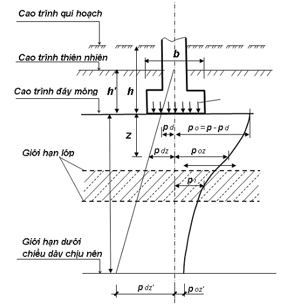
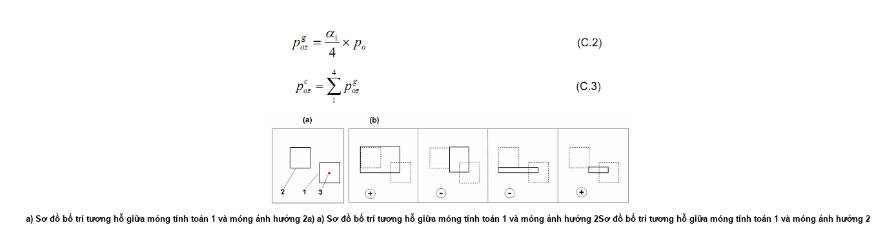
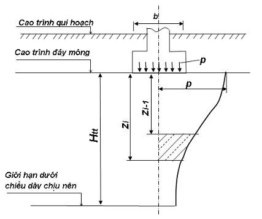
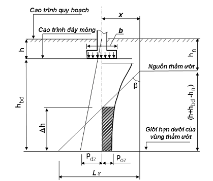
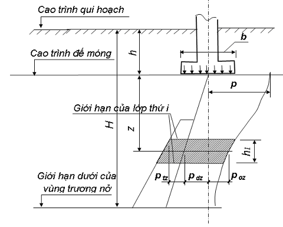

## PHỤ LỤC C (Tham khảo) — Tính toán biến dạng của nền

### C.1  Xác định độ lún

### C.1.1  Độ lún của nền móng có dùng sơ đồ tính toán dưới dạng bán không gian biến dạng đàn hồi tuyến tính (xem 4.6.8a)) xác định bằng phương pháp cộng lún các lớp trong phạm vi chiều dày chịu nén của nền. Thừa nhận rằng đối với các móng có chiều rộng hoặc đường kính nhỏ hơn 10 m, độ lún xảy ra là do áp lực thêm bằng hiệu số của áp lực trung bình do móng truyền lên và áp lực thiên nhiên do trọng lượng của đất trước khi đào móng gây ra, còn đại lượng chiều dày chịu nén của nền có thể xác định theo các chỉ dẫn ở C.1.5.

Phương pháp cộng lớp cho phép xác định độ lún chẳng những của móng riêng rẽ mà cả đối với móng mà tải trọng do các móng lân cận truyền tới gây ảnh hưởng đến độ lún của nó. Trong cả hai trường hợp, áp lực thêm xác định theo phương thẳng đứng đi qua trung tâm đáy móng và để tính toán độ lún của các lớp nằm ngang trong tầng chịu nén của nền.

Để tính ảnh hưởng của các móng lân cận, ngoài những áp lực đó ra cũng cần phải xác định áp lực theo phương thẳng đứng đi qua các góc của “các móng ảo” theo chỉ dẫn ở C.1.3.

### C.1.2  Khi tính toán độ lún của các móng riêng rẽ bằng phương pháp cộng lớp nên chú ý đến sơ đồ phân bố áp lực thẳng đứng trong đất nền vẽ trên Hình C.1, ở đây nên dùng các ký hiệu sau:

&nbsp;&nbsp;\- h là độ sâu đặt móng kể từ cao trình quy hoạch (đắp thêm vào hoặc san ủi bớt đi);

&nbsp;&nbsp;\- h’ là độ sâu đặt móng kể từ cao trình bề mặt địa hình thiên nhiên;

&nbsp;&nbsp;\- p là áp lực thực tế trung bình dưới đáy móng;

&nbsp;&nbsp;\- $p_{đ}$ là áp lực thiên nhiên trong đất tại đáy móng do trọng lượng của đất phía trên (đến cao trình địa hình thiên nhiên) gây ra;

&nbsp;&nbsp;\- $p_{đz}$ là áp lực thiên nhiên ở độ sâu z dưới đáy móng (hay ở độ sâu h’+z cách bề mặt địa hình thiên nhiên);

&nbsp;&nbsp;\- $p_{o}$ = p-$p_{đ}$ là áp lực thêm thẳng đứng trong đất dưới đáy móng;

&nbsp;&nbsp;\- $p_{0z}$ là áp lực thêm trong đất ở độ sâu z kể từ đáy móng, xác định theo công thức:

$$p_{oz} = \alpha \times (p - p_{\text{đ}}) = \alpha \times p_o \qquad (\text{C.1})$$
<!-- formula_id: "F_TCVN_9362_2012_RID113" -->

&nbsp;&nbsp;\- là hệ số tính đến sự thay đổi theo độ sâu của áp lực thêm trong đất và lấy theo Bảng C.1, phụ thuộc vào độ sâu tương đối m = 2 x $\frac{z}{b}$ và hình dạng của đáy móng còn đối với móng chữ nhật thì phụ thuộc vào tỷ số các cạnh của nó n = $\frac{l}{b}$ (chiều dài l và chiều rộng b).

<strong>Hình C.1 — Sơ đồ để tính lún theo phương pháp cộng lớp</strong>

**CHÚ THÍCH:** 

1) Đối với móng tròn (bán kính r) các giá trị  được chọn tùy thuộc vào m = $\frac{z}{r}$

2) Đối với các móng có diện tích đế móng F là đa giác đều, các giá trị  được chọn như móng tròn có bán kính r = $\frac{F}{\pi}$

3) Áp lực tiêu chuẩn ở độ sâu z theo phương thẳng đứng qua điểm góc của móng chữ nhật tính theo công thức:

$$p_{oz}^g = \frac{\alpha_1}{4} \times p_o \qquad (\text{C.2})$$
<!-- formula_id: "F_TCVN_9362_2012_RID123" -->

trong đó:

$_{1}$ là hệ số xác định theo Bảng C.1 nhưng thay giá trị m bằng $m_{1}$ = $\frac{q_{sw,1} Z_1}{R_s A_{s,1}}$.

### Bảng C.1 - Hệ số

| m = 2z/b hoặc m = z/r | Hệ số đối với các móng — Chữ nhật ứng với tỷ số các cạnh n = l/b — Hình tròn | Hệ số đối với các móng — Chữ nhật ứng với tỷ số các cạnh n = l/b — 1 | Hệ số đối với các móng — Chữ nhật ứng với tỷ số các cạnh n = l/b — 1,4 | Hệ số đối với các móng — Chữ nhật ứng với tỷ số các cạnh n = l/b — 1,8 | Hệ số đối với các móng — Chữ nhật ứng với tỷ số các cạnh n = l/b — 2,4 | Hệ số đối với các móng — Chữ nhật ứng với tỷ số các cạnh n = l/b — 3,2 | Hệ số đối với các móng — Chữ nhật ứng với tỷ số các cạnh n = l/b — 5 | Băng, khi n ≥ 0 |
| :---: | :---: | :---: | :---: | :---: | :---: | :---: | :---: | :---: |
| 1 | 2 | 3 | 4 | 5 | 6 | 7 | 8 | 9 |
| 0,0 | 1,000 | 1,000 | 1,000 | 1,000 | 1,000 | 1,000 | 1,000 | 1,000 |
| 0,4 | 0,949 | 0,960 | 0,972 | 0,975 | 0,976 | 0,977 | 0,977 | 0,977 |
| 0,8 | 0,756 | 0,800 | 0,848 | 0,866 | 0,875 | 0,879 | 0,881 | 0,881 |
| 1,2 | 0,547 | 0,606 | 0,682 | 0,717 | 0,740 | 0,749 | 0,754 | 0,755 |
| 1,6 | 0,390 | 0,449 | 0,532 | 0,578 | 0,612 | 0,630 | 0,639 | 0,642 |
| 2,0 | 0,285 | 0,336 | 0,414 | 0,463 | 0,505 | 0,529 | 0,545 | 0,550 |
| 2,4 | 0,214 | 0,257 | 0,325 | 0,374 | 0,419 | 0,449 | 0,470 | 0,477 |
| 2,8 | 0,165 | 0,201 | 0,260 | 0,304 | 0,350 | 0,383 | 0,410 | 0,420 |
| 3,2 | 0,130 | 0,160 | 0,210 | 0,251 | 0,294 | 0,329 | 0,360 | 0,374 |
| 3,6 | 0,106 | 0,130 | 0,173 | 0,209 | 0,250 | 0,283 | 0,320 | 0,337 |
| 4,0 | 0,087 | 0,108 | 0,145 | 0,176 | 0,214 | 0,248 | 0,285 | 0,306 |
| 4,4 | 0,073 | 0,091 | 0,122 | 0,150 | 0,185 | 0,218 | 0,256 | 0,280 |
| 4,8 | 0,067 | 0,077 | 0,105 | 0,130 | 0,161 | 0,192 | 0,230 | 0,258 |
| 5,2 | 0,053 | 0,066 | 0,091 | 0,112 | 0,141 | 0,170 | 0,208 | 0,239 |
| 5,6 | 0,046 | 0,058 | 0,079 | 0,099 | 0,124 | 0,152 | 0,189 | 0,223 |
| 6,0 | 0,040 | 0,051 | 0,070 | 0,087 | 0,110 | 0,136 | 0,172 | 0,208 |
| 6,4 | 0,036 | 0,045 | 0,062 | 0,077 | 0,098 | 0,122 | 0,158 | 0,106 |
| 6,8 | 0,032 | 0,040 | 0,055 | 0,069 | 0,088 | 0,110 | 0,144 | 0,184 |
| 7,2 | 0,028 | 0,036 | 0,049 | 0,062 | 0,080 | 0,100 | 0,133 | 0,175 |
| 7,6 | 0,024 | 0,032 | 0,044 | 0,056 | 0,072 | 0,091 | 0,123 | 0,166 |
| 8,0 | 0,022 | 0,029 | 0,040 | 0,051 | 0,066 | 0,084 | 0,113 | 0,158 |
| 8,4 | 0,021 | 0,026 | 0,037 | 0,046 | 0,060 | 0,077 | 0,105 | 0,150 |
| 8,8 | 0,019 | 0,024 | 0,034 | 0,042 | 0,055 | 0,070 | 0,098 | 0,144 |
| 9,2 | 0,018 | 0,022 | 0,031 | 0,039 | 0,051 | 0,065 | 0,091 | 0,137 |
| 9,6 | 0,016 | 0,020 | 0,028 | 0,036 | 0,047 | 0,060 | 0,085 | 0,132 |
| 10,0 | 0,015 | 0,019 | 0,026 | 0,033 | 0,044 | 0,056 | 0,079 | 0,126 |
| 11 | 0,011 | 0,017 | 0,023 | 0,029 | 0,040 | 0,050 | 0,071 | 0,114 |
| 12 | 0,009 | 0,015 | 0,020 | 0,026 | 0,031 | 0,044 | 0,060 | 0,104 |

> **CHÚ THÍCH:** Đối với những giá trị trung gian của m và n, đại lượng số  được xác định bằng cách nội suy.

### C.1.3  Sự phân bố theo độ sâu áp lực pháp tuyến tại điểm C nào đó trong hoặc ngoài phạm vi của móng có áp lực thêm ở đáy móng $p_{0}$ sẽ tìm được bằng cách dùng phương pháp điểm góc.

Trong phương pháp này áp lực $\frac{q_{sw,1} Z_1}{R_s A_{s,1}}$ theo phương thẳng đứng qua điểm C xác định bằng tổng đại số áp lực tại các điểm góc của bốn móng ảo (Hình C.2) chịu áp lực phân bố đều, theo công thức:

$$p_{oz}^c = \sum_{1}^{4} p_{oz}^g \qquad (\text{C.3})$$
<!-- formula_id: "F_TCVN_9362_2012_RID128" -->

<!-- DIAGRAM: word/media/image88.png -->

**CHÚ DẪN:**

a) \- Sơ đồ bố trí tương hỗ giữa móng tính toán 1 và móng ảnh hưởng 2

b) \- Sơ đồ bố trí “các móng áo” với chỉ dẫn các dấu dương “+” và ẩm để tính toán theo công thức (C.4):

1 - Móng tính toán; 2 - Móng ảnh hưởng; 3 - Điểm mà tại đó cần xác định độ lún

<strong>Hình C.2 — Sơ đồ bố trí “móng ảo” để tính ảnh hưởng đến độ lún theo phương pháp điểm góc</strong>

### C.1.4  Áp lực đứng p’$_{oz}$ tại độ sâu nào đó theo phương thẳng đứng qua trung tâm móng tính toán khi kể đến ảnh hưởng của các móng lân cận xác định theo công thức:

$$p'_{oz} = p_{oz} + \sum_{1}^{k} p_{oz}^{c} \qquad (\text{C.4})$$
<!-- formula_id: "F_TCVN_9362_2012_RID130" -->

trong đó: k là số móng ảnh hưởng.

### C.1.5  Độ sâu tầng chịu nén của nền z’ được hạn chế dựa vào tỷ số giữa các đại lượng áp lực thêm do móng p’$_{oz}$ hoặc khi kể đến ảnh hưởng của các móng lân cận p’$_{oz}$, (theo phương thẳng đứng qua trung tâm của móng) và áp lực thiên nhiên tại cùng độ sâu $p_{dz}$’. Khi có nước ngầm, áp lực thiên nhiên được xác định có kể đến tác dụng đẩy nổi của nước.

Đối với đất cát và đất sét tỷ số đó cho phép lấy bằng:

p’$_{oz}$ = 0,2 x $P_{dz'}$

Nếu giới hạn dưới của tầng chịu nén đã tìm được kết thúc trong lớp đất có mô đun biến dạng E < 5 000 kPa hoặc nếu lớp đó nằm trực tiếp phía dưới giới hạn kể trên thì nó cần được tính vào tầng chịu nén. Trong những trường hợp này giới hạn của tầng chịu nén được hạn chế bởi tỷ số p’$_{oz}$ = 0,1 x $P_{dz'}$

### C.1.6  Độ lún nền móng theo phương pháp cộng lớp xác định (có hoặc không kể đến ảnh hưởng của các móng lân cận) theo công thức:

$$S = \beta \times \sum_{1}^{n} \frac{p_i \times h_i}{E_i} \qquad (\text{C.5})$$
<!-- formula_id: "F_TCVN_9362_2012_RID131" -->

trong đó:

&nbsp;&nbsp;&nbsp;&nbsp;\- S là độ lún cuối cùng (ổn định) của móng;

&nbsp;&nbsp;&nbsp;&nbsp;\- n là số lớp chia theo độ sâu của tầng chịu nén của nền.

&nbsp;&nbsp;&nbsp;&nbsp;\- $h_{i}$ là chiều dày của lớp đất thứ i;

&nbsp;&nbsp;&nbsp;&nbsp;\- $E_{i}$ là mô đun biến dạng của lớp đất thứ i;

&nbsp;&nbsp;&nbsp;&nbsp;\- $p_{i}$ là áp lực thêm trung bình trong lớp đất thứ i, bằng nửa tổng số áp lực thêm $p_{0z}$ tại giới hạn trên và dưới của lớp đó xác định theo công thức (C.1) đối với trường hợp không tính đến ảnh hưởng của các móng lân cận và theo công thức (C.4) khi có kể đến ảnh hưởng đó.

&nbsp;&nbsp;&nbsp;&nbsp;\- là hệ số không thứ nguyên bằng 0,8.

### C.1.7  Việc xác định độ lún của nền khi dùng sơ đồ tính toán theo lớp biến dạng tuyến tính (đàn hồi) có chiều dày hữu hạn được dùng trong các trường hợp nói ở 4.6.8b). Cần chú ý rằng độ lún trong các trường hợp này là do áp lực toàn phần trung bình tác dụng ở đế móng (không trừ áp lực thiên nhiên) gây ra.

Chiều dày của lớp biến dạng tuyến tính (đàn hồi) lấy theo chỉ dẫn ở C.1.9.

### C.1.8  Độ lún của móng riêng rẽ sẽ theo sơ đồ tính toán nền dưới dạng lớp đàn hồi biến dạng tuyến tính có chiều dày hữu hạn H xác định theo công thức:

$$S = b_p \times M \times \sum_{1}^{n} \frac{k_i - k_{i-1}}{E_i} \qquad (\text{C.6})$$
<!-- formula_id: "F_TCVN_9362_2012_RID132" -->

trong đó:

&nbsp;&nbsp;&nbsp;&nbsp;\- b là chiều rộng của móng chữ nhật hay đường kính của móng tròn;

&nbsp;&nbsp;&nbsp;&nbsp;\- p là áp lực trung bình trên đất dưới đáy móng;

&nbsp;&nbsp;&nbsp;&nbsp;\- M là hệ số điều chỉnh xác định theo Bảng C.2, phụ thuộc vào m;

&nbsp;&nbsp;&nbsp;&nbsp;\- m là tỷ số chiều dày lớp đàn hồi H và nửa chiều rộng hoặc bán kính của móng khi chiều rộng của nó bằng 10 đến 15 m;

&nbsp;&nbsp;&nbsp;&nbsp;\- n là số lớp phân chia theo tính chịu nén trong phạm vi lớp đàn hồi H;

&nbsp;&nbsp;&nbsp;&nbsp;\- k là hệ số xác định theo Bảng C.3 đối với lớp i, phụ thuộc vào hình dáng đáy móng, tỷ số các cạnh móng chữ nhật n = l/b và tỷ số độ sâu đáy lớp z với nửa chiều rộng của móng m = 2z/b hay bán kính của nó m = z / r ;

&nbsp;&nbsp;&nbsp;&nbsp;\- $E_{i}$ là mô đun biến dạng của lớp đất thứ i.

### C.1.9  Chiều dày tính toán của lớp biến dạng tuyến tính $H_{u}$ (Hình C.3) được chọn đến mái của lớp đất có mô đun biến dạng E ≥ 100 000 kPa và đối với các móng kích thước lớn (bề rộng hoặc đường kính lớn hơn 10 m) thì tới mái lớp có mô đun biến dạng E ≥ 10 000 kPa xác định theo công thức:

$$H_{\text{tt}} = H_o + t \times b \tag{C.7}$$
<!-- formula_id: "F_TCVN_9362_2012_RID133" -->

trong đó $H_{o}$ và t đối với nền đất sét nên lấy lần lượt bằng 9 m và 0,15; đối với nền đất cát lấy 6 m và 0,1.

**CHÚ THÍCH:** 

1) Nếu nền bao gồm cả đất sét và đất cát thì giá trị $H_{tt}$ được xác định là trị trung bình cân.

2) Giá trị $H_{tt}$ tìm được theo công thức (7) cần phải cộng thêm chiều dày của đất có mô đun biến dạng E < 10 000 kPa, nếu lớp đó nằm dưới $H_{tt}$ và độ dày của nó không vượt quá 5 m. Khi chiều dày của đất ấy lớn, cũng như nếu các lớp đất phía trên có mô đun biến dạng E < 10 000 kPa thì việc tính toán độ lún thực hiện theo sơ đồ bán không gian biến dạng tuyến tính bằng phương pháp cộng lớp.

### Bảng C.2 - Hệ số M

| Các giới hạn của tỷ số m' = 2 X H/b m' = 2 X H/r | Hệ số M |
| :--- | :---: |
| 0< m’ ≤0,5 | 1,0 |
| 0,5< m’ ≤1 | 0,95 |
| 1<m’ ≤2 | 0,90 |
| 2< m’ ≤3 | 0,80 |
| 3< m’ ≤5 | 0,75 |

### Bảng C.3 - Hệ số $k_{1}$ và $k_{b}$

| m=2z/b hoặc m=z/r | Hệ số k đối với các móng — Hình tròn bán kính r | Hệ số k đối với các móng — Hình chữ nhật với tỷ số các cạnh n=l/b bằng — 1 | Hệ số k đối với các móng — Hình chữ nhật với tỷ số các cạnh n=l/b bằng — 1,4 | Hệ số k đối với các móng — Hình chữ nhật với tỷ số các cạnh n=l/b bằng — 1,8 | Hệ số k đối với các móng — Hình chữ nhật với tỷ số các cạnh n=l/b bằng — 2,4 | Hệ số k đối với các móng — Hình chữ nhật với tỷ số các cạnh n=l/b bằng — 3,2 | Hệ số k đối với các móng — Hình chữ nhật với tỷ số các cạnh n=l/b bằng — 5 | Móng băng khi n ≥ 10 |
| :---: | :---: | :---: | :---: | :---: | :---: | :---: | :---: | :---: |
| 0,0 | 0,000 | 0,000 | 0,000 | 0,000 | 0,000 | 0,000 | 0,000 | 0,000 |
| 0,4 | 0,090 | 0,100 | 0,100 | 0,100 | 0,100 | 0,100 | 0,100 | 0,104 |
| 0,8 | 0,179 | 0,200 | 0,200 | 0,200 | 0,200 | 0,200 | 0,200 | 0,208 |
| 1,2 | 0,266 | 0,299 | 0,300 | 0,300 | 0,300 | 0,300 | 0,300 | 0,311 |
| 1,6 | 0,348 | 0,380 | 0,394 | 0,397 | 0,397 | 0,397 | 0,397 | 0,412 |
| 2,0 | 0,411 | 0,446 | 0,472 | 0,486 | 0,486 | 0,486 | 0,486 | 0,511 |
| 2,4 | 0,461 | 0,499 | 0,538 | 0,556 | 0,565 | 0,567 | 0,567 | 0,605 |
| 2,8 | 0,501 | 0,542 | 0,592 | 0,618 | 0,635 | 0,640 | 0,640 | 0,687 |
| 3,2 | 0,532 | 0,577 | 0,637 | 0,671 | 0,696 | 0,707 | 0,709 | 0,763 |
| 3,6 | 0,558 | 0,606 | 0,676 | 0,700 | 0,760 | 0,700 | 0,772 | 0,831 |
| 4,0 | 0,579 | 0,630 | 0,708 | 0,756 | 0,796 | 0,820 | 0,830 | 0,892 |
| 4,4 | 0,596 | 0,650 | 0,735 | 0,789 | 0,837 | 0,867 | 0,888 | 0,949 |
| 4,8 | 0,611 | 0,668 | 0,759 | 0,819 | 0,873 | 0,908 | 0,932 | 1,001 |
| 5,2 | 0,624 | 0,683 | 0,780 | 0,884 | 0,904 | 0,948 | 0,977 | 1,050 |
| 5,6 | 0,635 | 0,697 | 0,798 | 0,867 | 0,933 | 0,981 | 1,018 | 1,095 |
| 6,0 | 0,645 | 0,708 | 0,814 | 0,887 | 0,958 | 1,011 | 1,056 | 1,138 |
| 6,4 | 0,653 | 0,719 | 0,828 | 0,904 | 0,980 | 1,031 | 1,090 | 1,178 |
| 6,8 | 0,661 | 0,728 | 0,841 | 0,920 | 1,000 | 1,065 | 1,122 | 1,215 |
| 7,2 | 0,668 | 0,736 | 0,852 | 0,935 | 1,019 | 1,088 | 1,152 | 1,251 |
| 7,6 | 0,674 | 0,744 | 0,863 | 0,948 | 1,036 | 1,109 | 1,180 | 1,285 |
| 8,0 | 0,679 | 0,751 | 0,872 | 0,960 | 1,051 | 1,128 | 1,205 | 1,316 |
| 8,4 | 0,684 | 0,757 | 0,887 | 0,970 | 1,065 | 1,146 | 1,229 | 1,347 |
| 8,8 | 0,689 | 0,762 | 0,888 | 0,980 | 1,078 | 1,162 | 1,251 | 1,376 |
| 9,2 | 0,693 | 0,768 | 0,896 | 0,989 | 1,089 | 1,178 | 1,272 | 1,404 |
| 9,6 | 0,697 | 0,772 | 0,902 | 0,998 | 1,100 | 1,192 | 1,291 | 1,431 |
| 10,0 | 0,700 | 0,777 | 0,908 | 1,005 | 1,110 | 1,205 | 1,309 | 1,456 |
| 11,0 | 0,705 | 0,786 | 0,922 | 1,022 | 1,132 | 1,233 | 1,349 | 1,506 |
| 12,0 | 0,710 | 0,794 | 0,933 | 1,037 | 1,151 | 1,257 | 1,384 | 1,550 |

<strong>Hình C.3 — Sơ đồ để tính độ lún bằng phương pháp lớp biến dạng tuyến tính có chiều dày hữu hạn</strong>

### C.2  Xác định độ nghiêng của móng khi tác dụng tải trọng lệch tâm

### C.2.1  Độ nghiêng của móng (khi tác dụng tải trọng lệch tâm) theo sơ đồ tính toán nền ở dạng bán không gian đàn hồi biến dạng tuyến tính (xem 4.6.8a)) xác định như sau:

a) \- Móng chữ nhật theo phương cạnh lớn của móng 1 (dọc theo trục dọc) theo công thức:

$$i_e = \frac{1 - \mu^2}{E} \times k_l \times \frac{P \times e_l}{(l / 2)^3} \qquad (\text{C}.8)$$
<!-- formula_id: "F_TCVN_9362_2012_RID135" -->

b) \- Móng chữ nhật theo phương cạnh bé của nó (dọc theo trục ngang) theo công thức:

$$i_b = \frac{1 - \mu^2}{E} \times k_b \times \frac{P \times e_b}{(b / 2)^3} \qquad (\text{C}.9)$$
<!-- formula_id: "F_TCVN_9362_2012_RID136" -->

c) \- Móng tròn có đường kính r, theo công thức:

$$i_r = \frac{1 - \mu^2}{E} \times \frac{3 \times P \times e}{4 \times r^3} \tag{C.10}$$
<!-- formula_id: "F_TCVN_9362_2012_RID137" -->

trong đó:

&nbsp;&nbsp;&nbsp;&nbsp;\- P là hợp lực tất cả tải trọng đứng của móng trên nền, tính bằng kilôgam (kg);

&nbsp;&nbsp;&nbsp;&nbsp;\- $e_{l}$, eb, e lần lượt là khoảng cách của điểm đặt hợp lực đến giữa đáy móng theo phương trục dọc, trục ngang và theo bán kính đường tròn, tính bằng xentimét (cm);

&nbsp;&nbsp;&nbsp;&nbsp;\- E,  lần lượt là mô đun biến dạng, tính bằng kilôpascan (kPa), và hệ số Poat - xông của đất lấy theo trị trung bình trong phạm vi tầng chịu nén;

&nbsp;&nbsp;&nbsp;&nbsp;\- $k_{l}$ và $k_{b}$ lần lượt là các hệ số xác định theo Bảng C.4, phụ thuộc vào tỷ số của các cạnh đáy móng.

### C.2.2  Độ nghiêng của móng tròn theo sơ đồ tính toán nền thuộc loại lớp biến dạng tuyến tính có chiều dày hữu hạn, xác định theo công thức:

$$i_r = \frac{1 - \mu^2}{E} \times k_c \times \frac{P \times e}{r^3} \tag{C.11}$$
<!-- formula_id: "F_TCVN_9362_2012_RID138" -->

trong đó $k_{c}$ là hệ số, xác định theo Bảng C.5 phụ thuộc vào tỷ số của chiều dày lớp đàn hồi và bán kính của móng H/r.

### Bảng C.4 - Hệ số $k_{l}$ và $k_{b}$

| Hệ số | Hệ số $k_{l}$ và $k_{b}$ ứng với tỷ số các cạnh của móng chữ nhật n=l/b bằng — 1,0 | Hệ số $k_{l}$ và $k_{b}$ ứng với tỷ số các cạnh của móng chữ nhật n=l/b bằng — 1,4 | Hệ số $k_{l}$ và $k_{b}$ ứng với tỷ số các cạnh của móng chữ nhật n=l/b bằng — 1,8 | Hệ số $k_{l}$ và $k_{b}$ ứng với tỷ số các cạnh của móng chữ nhật n=l/b bằng — 2,4 | Hệ số $k_{l}$ và $k_{b}$ ứng với tỷ số các cạnh của móng chữ nhật n=l/b bằng — 3,2 | Hệ số $k_{l}$ và $k_{b}$ ứng với tỷ số các cạnh của móng chữ nhật n=l/b bằng — 5,0 |
| :--- | :---: | :---: | :---: | :---: | :---: | :---: |
| $k_{l}$ | 0,55 | 0,71 | 0,83 | 0,97 | 1,1 | 1,44 |
| $k_{b}$ | 0,50 | 0,39 | 0,33 | 0,25 | 0,19 | 0,13 |

> **CHÚ THÍCH:** Độ nghiêng của móng có đáy đa giác đều được tính toán theo công thức (C.10), trong đó lấy bán kính r = $F/ \pi$ với F là diện tích đáy móng đa giác.

### Bảng C.5 - Hệ số $k_{c}$

| H/r | 0,25 | 0,5 | 1 | 2 | >2 |
| :--- | :---: | :---: | :---: | :---: | :---: |
| $k_{c}$ | 0,26 | 0,43 | 0,63 | 0,74 | 0,75 |

### C.3  Xác định độ lún ướt của nền bằng đất có tính lún ướt

### C.3.1  Độ lún ướt của đất nền $S_{s}$ do tải trọng của móng gây ra khi thấm ướt trong vùng biến dạng $h_{bd}$ xác định theo 5.2, được tính theo công thức:

$$S_s = \sum_{1}^{n} \delta_{si} \times h_i \times m \tag{C.12}$$
<!-- formula_id: "F_TCVN_9362_2012_RID141" -->

trong đó:

&nbsp;&nbsp;&nbsp;&nbsp;\- $_{si}$ là độ lún ướt tương đối, xác định khi no nước hoàn toàn, theo 3.14, còn khi chưa no nước theo C.3.2 cho mỗi lớp đất trong vùng biến dạng; $h_{bd}$ ở áp lực bằng tổng áp lực thiên nhiên và áp lực do móng công trình hay nhà tại giữa lớp đất đang xét;

&nbsp;&nbsp;&nbsp;&nbsp;\- $h_{i}$ là chiều dày lớp đất thứ i;

&nbsp;&nbsp;&nbsp;&nbsp;\- n là số lớp đất được chia trong vùng biến dạng $h_{bd}$;

&nbsp;&nbsp;&nbsp;&nbsp;\- m là hệ số điều kiện làm việc của nền, lấy m = 1 đối với móng rộng từ 12 m trơ lên, đối với móng băng rộng đến 3 m và các móng đa giác rộng đến 5 m được tính theo công thức:

$$m = 0,5 + 1,5 \times \frac{p - p_s}{p_o} \qquad (\text{C}.13)$$
<!-- formula_id: "F_TCVN_9362_2012_RID142" -->

&nbsp;&nbsp;&nbsp;&nbsp;\- m = 0,5 +1,5 X p — p (C 13)

&nbsp;&nbsp;&nbsp;&nbsp;\- p là áp lực trung bình dưới đáy móng, tính bằng kilôpascan (kPa);

&nbsp;&nbsp;&nbsp;&nbsp;\- $p_{s}$ là áp lực lún ướt ban đầu, tính bằng kilôpascan (kPa);

&nbsp;&nbsp;&nbsp;&nbsp;\- $p_{0}$ là áp lực bằng 100 kPa;

**CHÚ THÍCH:** Hệ số m đối với móng băng rộng hơn 3 m và móng đa giác rộng hơn 5 m xác định bằng cách nội suy giữa các giá trị m tính toán theo công thức (C.13) và m = 1.

### C.3.2  Độ lún ướt tương đối của đất khi không no nước (’$\varepsilon_{s}$) xác định theo công thức:

$$\delta'_s = 0,01 + \frac{W_k - W_s}{W_n - W_s} \times (\delta_s - 0,01) \qquad (\text{C}.14)$$
<!-- formula_id: "F_TCVN_9362_2012_RID143" -->

trong đó:

&nbsp;&nbsp;&nbsp;&nbsp;\- $W_{k}$ là độ ẩm cuối cùng của đất sau khi thấm ướt;

&nbsp;&nbsp;&nbsp;&nbsp;\- $W_{s}$ là độ ẩm lún ướt ban đầu của đất;

&nbsp;&nbsp;&nbsp;&nbsp;\- $W_{n}$ là độ ẩm khi đất hoàn toàn no nước;

&nbsp;&nbsp;&nbsp;&nbsp;\- $\varepsilon_{s}$ có ý nghĩa như trong công thức (C.12).

**CHÚ THÍCH:** Khi độ ẩm lún ướt ban đầu $W_{s}$ nhỏ hơn độ ẩm tự nhiên W thì trong công thức (14) có thể thay $W_{s}$ bằng W.

### C.3.3  Độ lún ướt của nền, độ lệch lún ướt và độ nghiêng của các móng riêng rẽ ở trong vùng xuất hiện lún ướt không đều của nền do sự lan truyền của nước từ nguồn thấm ướt ra xung quanh, cần phải xác định có tính đến sự thấm ướt hữu hạn vùng dưới của nền trong khoảng độ sâu h (Hình C.4), bằng:

$$\Delta h = h + h_{bd} - h_n \times \frac{x}{m_\beta \times \operatorname{tg}\beta} \tag{C.15}$$
<!-- formula_id: "F_TCVN_9362_2012_RID144" -->

trong đó:

&nbsp;&nbsp;&nbsp;&nbsp;\- h là độ sâu đặt móng so với cao trình quy hoạch;

&nbsp;&nbsp;&nbsp;&nbsp;\- $h_{bd}$ là vùng biến dạng của nền xác định theo yêu cầu ở 5.2;

&nbsp;&nbsp;&nbsp;&nbsp;\- $h_{n}$ là độ sâu nguồn thấm ướt so với bề mặt quy hoạch;

&nbsp;&nbsp;&nbsp;&nbsp;\- x là khoảng cách từ mép nguồn thấm ướt đến trục của móng đang xét;

&nbsp;&nbsp;&nbsp;&nbsp;\- m là hệ số tính đến khả năng tăng góc lan truyền nước về các phía do tính phân lớp của đất nền;

&nbsp;&nbsp;&nbsp;&nbsp;\- là góc lan truyền nước từ nguồn thấm ướt ra các phía, đối với á cát dạng lún ướt p = 35°, còn đối với á sét dạng lún ướt = 50°.

&nbsp;&nbsp;&nbsp;&nbsp;\- Chiều dài $L_{s}$, nơi có thể xuất hiện độ lún ướt không đều của đất, có thể xác định theo công thức:

$$L_s = (h + h_{bd} - h_n) \times m_\beta \times \operatorname{tg}\beta \tag{C.16}$$
<!-- formula_id: "F_TCVN_9362_2012_RID145" -->

&nbsp;&nbsp;&nbsp;&nbsp;\- trong đó các ký hiệu giống như công thức (15).

### C.3.4  Giá trị cực đại của độ lún ướt $S^{max}_{sd}$ do trọng lượng bản thân của đất gây ra khi thấm ướt mạnh phía trên với diện tích có bề rộng không nhỏ hơn chiều dày lún ướt hoặc có bề rộng không nhỏ hơn chiều dày lún ướt hoặc khi dâng mực nước ngầm, xác định theo công thức (C.12), trong đó tổng (C.12) gồm có:

a) \- Độ lún ướt chỉ trong phạm vi vùng lún ướt của đất do trọng lượng bản thân, khi không có tải trọng ngoài cũng như khi móng hẹp mà ở đó vùng biến dạng do tải trọng móng gây ra không liên hợp với vùng lún ướt của đất do trọng lượng bản thân gây ra;

b) \- Độ lún ướt chỉ trong phạm vi nào đó của vùng lún ướt do trọng lượng bản thân đất mà tại đấy độ ẩm bị nâng cao do mực nước ngầm dâng lên hoặc tăng dần độ ẩm;

c) \- Độ lún ướt trong phạm vi từ đáy vùng biến dạng (do tải trọng móng) đến mái của lớp đất không lún ướt khi móng rộng và trong một phần vùng biến dạng do tải trọng móng gây ra với vùng biến dạng lún ướt do trọng lượng bản thân của đất gây ra.

Chiều dày của vùng lún ướt do trọng Iượng bản thân của đất được tính từ độ sâu mà ở đó ứng suất thẳng đứng do trọng Iượng bản thân của đất bằng áp lực lún ướt ban đầu đến giới hạn dưới của lớp lún ướt.

Độ lún ướt tương đối ’$\varepsilon_{s}$ xác định cho mỗi lớp đất trong vùng lún ướt ở áp Iực bằng áp lực thiên nhiên tại giữa lớp đó.

<strong>Hình C.4 — Sơ đồ để tính toán trị hữu hạn Ah thấm ướt thuộc vùng dưới của nền dọc theo trục thẳng đứng của móng trong trường hợp nếu nó ở phía ngoài nguồn thấm ướt.</strong>

### C.3.5  Trị số lún ướt khả dĩ của đất do trọng lượng bản thân đất gây ra trên vùng đất loại II về tính lún ướt khi làm ướt cục bộ tạm thời với diện tích có bề rộng nhỏ hơn chiều dày lún ướt H, sẽ được xác định theo công thức:

$$S_{s.d}^{B} = S_{sd}^{\max} \times \sqrt{\frac{B}{H} \times \left(2 - \frac{B}{H}\right)} \tag{C.16}$$
<!-- formula_id: "F_TCVN_9362_2012_RID147" -->

### C.3.6  Trị số lún ướt của đất $S_{s,d}^{max,B}$ do trọng lượng bản thân đất gây ra tại các điểm khác nhau của diện tích thấm ướt và của diện tích gần đó xác định theo công thức:

<!-- DIAGRAM: word/media/image107.png -->

trong đó:

&nbsp;&nbsp;&nbsp;&nbsp;\- $S_{s,d}^{max,B}$ là độ lún ướt lớn nhất hoặc khả dĩ của đất do trọng lượng bản thân tại trung tâm diện tích thấm ướt, xác định theo C.3.4 hoặc C.3.5;

&nbsp;&nbsp;&nbsp;&nbsp;\- x là khoảng cách tính bằng xentimét (cm) từ tâm diện tích thấm ướt hoặc điểm đầu của phần đất lún ướt nằm ngang đến điểm xác định trị số lún ướt $S_{s,d}^{max,B}$ trong phạm vi 0 < x < r;

&nbsp;&nbsp;&nbsp;&nbsp;\- r là chiều dài tính toán tính bằng xentimét (cm) của phần đất lún ướt do trọng lượng bản thân đất gây ra, xác định theo công thức:

$$r = H \times (0,5 + m_{\beta} \times \operatorname{tg}\beta) \qquad (\text{C}.19)$$
<!-- formula_id: "F_TCVN_9362_2012_RID154" -->

trong đó: các ký hiệu như trong công thức (C.15) và (C.17).

### C.3.7  Trị số chuyển vị ngang $U_{s}$ (cm) trên mặt đất khi độ lún ướt của nó do trọng lượng bản thân gây ra bơi sự thấm ướt mạnh hoặc cục bộ (xem 5.5) tính toán theo công thức:

$$U_s = 0,5 \times \varepsilon \times r \times \left(1 + \cos \frac{2 \times \pi \times x}{r}\right) \tag{C.20}$$
<!-- formula_id: "F_TCVN_9362_2012_RID155" -->

trong đó:

&nbsp;&nbsp;&nbsp;&nbsp;\- là chuyển vị ngang tương đối, tính bằng:

$$\varepsilon = 0,66 \times \left(\frac{U_s}{r} - 0,05\right) \tag{C.21}$$
<!-- formula_id: "F_TCVN_9362_2012_RID156" -->

trong đó:

&nbsp;&nbsp;&nbsp;&nbsp;\- r và x là những ký hiệu có ý nghĩa như trong công thức (C.18) và (C.19).

### C.4  Xác định sự trương nở và sự co ngót của nền gồm đất có tính trương nở

### C.4.1  Độ nâng cao nền móng $S_{tr.n}$ do sự trương nở của đất bị thấm ướt gây ra được xác định theo công thức:

$$S_{\text{tr\_n}} = \sum_{i=1}^{n} \delta_{\text{tr\_n}} \times h_i \times m \qquad (\text{C}.22)$$
<!-- formula_id: "F_TCVN_9362_2012_RID157" -->

trong đó:

&nbsp;&nbsp;&nbsp;&nbsp;\- $_{tr.n}$ là độ trương nở tương đối của lớp đất thứ i xác định theo chỉ dẫn ở C.4.2;

&nbsp;&nbsp;&nbsp;&nbsp;\- hi Ià chiều dày lớp đất đang xét;

&nbsp;&nbsp;&nbsp;&nbsp;\- m là hệ số điều kiện làm việc, lấy m = 0,8 khi áp lực tổng $p_{t}$ = 50 kPa; m = 0,6 khi áp lực tổng $p_{t}$ = 300 kPa; với các giá trị trung gian của $p_{t}$ tính nội suy. Giá trị áp Iực tổng $p_{t}$ xác định theo chỉ dẫn ở C.4.3.

&nbsp;&nbsp;&nbsp;&nbsp;\- n là số lớp đất được chia ra trong vùng đất trương nở có biên dưới xác định theo chỉ dẫn ở C.4.4;

### C.4.2  Độ trương nở tương đối của đất $_{tr.n}$ xác định như sau:

a) \- Khi thấm ẩm, theo công thức:

$$\delta_{tr.n} = \frac{h'-h}{h} \qquad (\text{C}.23)$$
<!-- formula_id: "F_TCVN_9362_2012_RID158" -->

trong đó:

&nbsp;&nbsp;&nbsp;&nbsp;\- h là chiều cao mẫu đất có độ chặt và độ ẩm tự nhiên được nén không nở hông dưới áp lực tổng;

&nbsp;&nbsp;&nbsp;&nbsp;\- h’ là chiều cao mẫu đất đó sau khi thấm ướt và được nén trong cùng điều kiện trên.

b) \- Khi phủ bề mặt và thay đổi trạng thái thủy nhiệt, theo công thức:

$$\delta_{tr.n} = \frac{k \times (W_k - W_o)}{1 + e_o} \qquad (\text{C.24})$$
<!-- formula_id: "F_TCVN_9362_2012_RID159" -->

trong đó:

&nbsp;&nbsp;&nbsp;&nbsp;\- k là hệ số xác định bằng thực nghiệm, khi không có số liệu thực nghiệm, lấy bằng 2;

&nbsp;&nbsp;&nbsp;&nbsp;\- $W_{k}$ là độ ẩm cuối cùng của đất;

&nbsp;&nbsp;&nbsp;&nbsp;\- $W_{0}$ là độ ẩm ban đầu của đất;

&nbsp;&nbsp;&nbsp;&nbsp;\- $e_{0}$ là hệ số rỗng ban đầu của đất.

### C.4.3  Áp lực tổng $p_{t}$ ở giữa lớp đang xét (Hình C.5) được xác định theo công thức:

$$p_t = p_z + p_{dz} + p_{tz} \tag{C.25}$$
<!-- formula_id: "F_TCVN_9362_2012_RID160" -->

trong đó:

&nbsp;&nbsp;&nbsp;&nbsp;\- $p_{z}$ là áp Iực do tải trọng của móng gây ra tại giữa lớp đang xét, tính bằng kilôpascan (kPa);

&nbsp;&nbsp;&nbsp;&nbsp;\- $p_{dz}$ Ià áp Iực do trọng Iượng bản thân của lớp đất kể từ đáy móng đến giữa Iớp đang xét, tính bằng kilôpascan (kPa);

&nbsp;&nbsp;&nbsp;&nbsp;\- $p_{tz}$ Ià áp Iực thêm, tính bằng kilôpascan (kPa), gây ra do ảnh hưởng của trọng lượng phần đất không bị ẩm nằm ngoài phạm vi thấm ướt, và xác định theo công thức:

$$p_{tz} = m_n \times \gamma' \times (Z + h) \qquad (\text{C}.26)$$
<!-- formula_id: "F_TCVN_9362_2012_RID161" -->

&nbsp;&nbsp;&nbsp;&nbsp;\- $m_{n}$ là hệ số lấy theo Bảng C.6, phụ thuộc vào tỷ số giữa chiều dài L và chiều rộng B của diện tích thấm ướt và vào độ sâu tương đổi của lớp đang xét;

&nbsp;&nbsp;&nbsp;&nbsp;\- là khối lượng thể tích của đất, tính bằng kilôgam trên xentimét khối (kg/cm³).

<strong>Hình C.5 — Sơ đồ để tính độ nâng cao của nền khi đất trương nở</strong>

### C.4.4  Biên dưới của vùng trương nở $H_{tn}$ (Hình C.5) được chọn:

a) \- Khi thấm nước đến độ sâu ở đó áp lực tổng bằng áp lực trương nở của đất $P_{tn}$.

b) \- Khi che bề mặt và thay đổi trạng thái thủy nhiệt đến độ sâu xác định bằng thí nghiệm đối với từng vùng khí hậu. Khi không có số liệu thí nghiệm, độ sâu này lấy bằng 5 m.

### Bảng C.6 - Hệ số $m_{3}$

| (Z+h)/B | Hệ số $m_{n}$ ứng với tỷ số chiều dài và chiều rộng của diện tích thấm ướt L/B — 1 | Hệ số $m_{n}$ ứng với tỷ số chiều dài và chiều rộng của diện tích thấm ướt L/B — 2 | Hệ số $m_{n}$ ứng với tỷ số chiều dài và chiều rộng của diện tích thấm ướt L/B — 3 | Hệ số $m_{n}$ ứng với tỷ số chiều dài và chiều rộng của diện tích thấm ướt L/B — 4 | Hệ số $m_{n}$ ứng với tỷ số chiều dài và chiều rộng của diện tích thấm ướt L/B — 5 |
| :---: | :---: | :---: | :---: | :---: | :---: |
| 0,5 | 0 | 0 | 0 | 0 | 0 |
| 1 | 0,58 | 0,50 | 0,43 | 0,36 | 0,29 |
| 2 | 0,81 | 0,70 | 0,61 | 0,50 | 0,40 |
| 3 | 0,94 | 0,82 | 0,71 | 0,59 | 0,47 |
| 4 | 1,02 | 0,89 | 0,77 | 0,64 | 0,53 |
| 5 | 1,07 | 0,94 | 0,82 | 0,69 | 0,57 |

### C.4.5  Đại lượng co ngót của nền do quá trình khô đất trương nở $S_{c}$ xác định theo công thức:

$$S_c = \sum_{i=1}^{n} \delta_{ci} \times h_i \times m_c \tag{C.27}$$
<!-- formula_id: "F_TCVN_9362_2012_RID163" -->

trong đó:

&nbsp;&nbsp;&nbsp;&nbsp;\- $_{ci}$ là độ co ngót theo chiều dài tương đối của lớp thứ i xác định theo chỉ dẫn ở 3.16 dưới tác dụng của lực bằng tổng áp Iực thiên nhiên và áp Iực thiên nhiên và áp lực thêm của móng tại giữa lớp đất đang xét khi thay đổi độ ẩm của nó từ trị số lớn nhất đến nhỏ nhất có thể có;

&nbsp;&nbsp;&nbsp;&nbsp;\- $h_{i}$ là chiều dày của lớp đang xét;

&nbsp;&nbsp;&nbsp;&nbsp;\- $m_{c}$ là hệ số điều kiện làm việc của đất khi co ngót, lấy bằng 1,3;

&nbsp;&nbsp;&nbsp;&nbsp;\- n là số lớp đất được chia ra trong vùng đất co ngót: giới hạn dưới của vùng co ngót $H_{c}$ được xác định bằng thực nghiệm, còn khi không có số liệu thí nghiệm thì lấy bằng 5 m;

Khi khô đất do tác dụng nhiệt của thiết bị công nghệ, giới hạn dưới của vùng co ngót $H_{c}$ được xác định bằng thí nghiệm hoặc bằng tính toán tương ứng.

### C.5  Xác định độ xói ngầm của nền đất nhiễm muối

### C.5.1  Độ lún xói ngầm của nền đất nhiễm muối $S_{x}$ được xác định theo công thức:

$$S_x = \sum_{i=1}^n \delta_{xi} \times h_i \qquad (\text{C}.28)$$
<!-- formula_id: "F_TCVN_9362_2012_RID164" -->

trong đó:

&nbsp;&nbsp;&nbsp;&nbsp;\- n là số lớp đất được chia ra trong vùng đất mặn có khả năng tạo thành lún xói ngầm;

&nbsp;&nbsp;&nbsp;&nbsp;\- $_{xi}$ là độ lún xói ngầm tương đối của lớp đất thứ i khi áp lực do tải trọng móng và trọng lượng bản thân của lớp đất tại đó, xác định theo chỉ dẫn trong C.5.2 đến C.5.4;

&nbsp;&nbsp;&nbsp;&nbsp;\- $h_{i}$ là chiều dày của lớp đất nhiễm muối thứ i;

### C.5.2  Trị số lún xói ngầm tương đối $_{x}$ của đất nhiễm muối xác định bằng thí nghiệm nén tĩnh hiện trường hoặc các phương pháp nén thấm trong phòng theo các trường hợp quy định ở 10.4.

Việc thí nghiệm cần phải tiến hành khi nước thấm lâu dài qua đất trong khoảng thời gian theo như chỉ dẫn ở 10.5.

### C.5.3  Trị số lún xói ngầm tương đối $_{x}$ quy định bằng thí nghiệm hiện trường được xác định theo công thức:

$$\delta_x = \frac{S_{x.n}}{h_n} \tag{C.29}$$
<!-- formula_id: "F_TCVN_9362_2012_RID165" -->

trong đó:

&nbsp;&nbsp;&nbsp;&nbsp;\- $S_{x.n}$ là độ lún xói ngầm của bàn nén sau khi thấm ướt liên tục trong suốt quá trình thí nghiệm dưới áp lực nói ở C.5.1;

&nbsp;&nbsp;&nbsp;&nbsp;\- $h_{n}$ Ià chiều dày chịu nén của nền dưới bàn nén.

### C.5.4  Trị số độ lún xói ngầm tương đối theo thí nghiệm nén thấm được xác định bằng công thức:

$$\delta_x = \frac{h - h'}{h} \tag{C.30}$$
<!-- formula_id: "F_TCVN_9362_2012_RID166" -->

trong đó:

&nbsp;&nbsp;&nbsp;&nbsp;\- h là độ cao của mẫu đất ở độ ẩm tự nhiên và độ chặt thiên nhiên;

&nbsp;&nbsp;&nbsp;&nbsp;\- h’ là độ cao của mẫu đất đó sau khi thấm ướt bởi nước và nén dưới áp lực nêu ở C.5.1