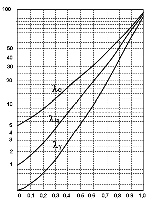
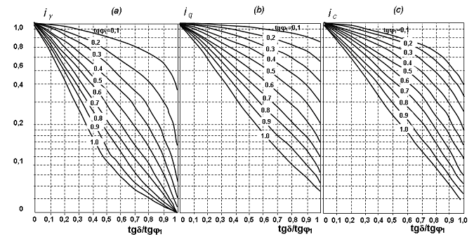

## PHỤ LỤC E (Quy định) — Các hệ số dùng để tính toán sức chịu tải của nền

Các hệ số dùng để tính theo công thức (28) ở 4.7.7 về sức chịu tải của nền đất đồng nhất không phải đá ở trạng thái ổn định như sau:

a) \- , $_{q}$ và $_{c}$ là các hệ số sức chịu tải theo biểu đồ Hình E.1 Phụ Iục E phụ thuộc vào $tg_{1}$, trong đó $_{1}$ là trị tính toán góc ma sát trong, xác định theo 4.3.4, 4.3.5 và 4.3.6;

b) \- i, $i_{q}$ và $i_{c}$ là các hệ số ảnh hưởng độ nghiêng của tải trọng theo biểu đồ Hình E.2, phụ thuộc vào $tg_{1}$ và tg (trong đó  là góc nghiêng so với phương thẳng đứng của hợp lực các Iực tác dụng lên đáy móng);

c) \- n, $n_{q}$ và $n_{c}$ là các hệ số ảnh hưởng tỷ lệ các cạnh của móng theo các công thức:

$$\begin{aligned}
n_{\gamma} &= 1 + \frac{0,25}{n} \qquad (\text{E.1}) \\
n_{q} &= 1 + \frac{1,5}{n} \qquad (\text{E.2}) \\
n_{c} &= 1 + \frac{0,3}{n} \qquad (\text{E.3})
\end{aligned}$$
<!-- formula_id: "F_TCVN_9362_2012_RID169" -->

trong đó:

&nbsp;&nbsp;&nbsp;&nbsp;\- n = l/b, ở đây l và b Ià chiều dài và chiều rộng của đáy móng, trong trường hợp lực đặt lệch tâm thì lấy bằng các giá trị quy đổi $l$ và $b$ xác định theo chỉ dẫn ở 4.7.3.

<strong>Hình E.1 — Biểu đồ để xác định hệ số sức chịu tải</strong>

<strong>Hình E.2 — Biểu đồ để xác định hệ số độ nghiêng tải trọng</strong>

MỤC LỤC

Lời nói đầu

## 1  PHẠM VI ÁP DỤNG

## 2  QUY ĐỊNH CHUNG

## 3  PHÂN LOẠI ĐẤT NỀN

## 4  THIẾT KẾ NỀN

## 5  ĐẶC ĐIỂM THIẾT KẾ NỀN CỦA NHÀ VÀ CÔNG TRÌNH XÂY TRÊN ĐẤT LÚN ƯỚT

## 6  ĐẶC ĐIỂM THIẾT KẾ NỀN, NHÀ VÀ CÔNG TRÌNH XÂY TRÊN ĐẤT TRƯƠNG NỞ

## 7  ĐẶC ĐIỂM THIẾT KẾ NỀN, NHÀ VÀ CÔNG TRÌNH XÂY TRÊN ĐẤT THAN BÙN NO NƯỚC

## 8  ĐẶC ĐIỂM THIẾT KẾ NỀN, NHÀ VÀ CÔNG TRÌNH XÂY TRÊN BÙN

## 9  ĐẶC ĐIỂM THIẾT KẾ NỀN, NHÀ VÀ CÔNG TRÌNH XÂY TRÊN ĐẤT ELUVI

## 10  ĐẶC ĐIỂM THIẾT KẾ NỀN, NHÀ VÀ CÔNG TRÌNH XÂY TRÊN ĐẤT NHIỄM MUỐI

## 11  ĐẶC ĐIỂM THIẾT KẾ NỀN, NHÀ VÀ CÔNG TRÌNH XÂY TRÊN ĐẤT ĐẮP

## 12  ĐẶC ĐIỂM THIẾT KẾ NỀN, NHÀ VÀ CÔNG TRÌNH XÂY Ở NHỮNG NƠI KHÁC

## 13  ĐẶC ĐIỂM THIẾT KẾ NỀN, NHÀ VÀ CÔNG TRÌNH XÂY Ở NHỮNG VÙNG ĐỘNG ĐẤT

## 14  ĐẶC ĐIỂM THIẾT KẾ NỀN ĐƯỜNG DÂY TẢI ĐIỆN TRÊN KHÔNG

## 15  ĐẶC ĐIỂM THIẾT KẾ NỀN, MÓNG CẦU VÀ CỐNG

16 Phụ lục A Quy định) Quy tắc thiết lập trị tiêu chuẩn và trị tính toán các đặc trưng của đất

17 Phụ lục B (Tham khảo) Các bảng trị tiêu chuẩn các đặc trưng độ bền và biến dạng của đất

## 18  PHỤ LỤC C (THAM KHẢO) TÍNH TOÁN BIẾN DẠNG CỦA NỀN

## 19  PHỤ LỤC D (THAM KHẢO) ÁP LỰC TÍNH TOÁN QUY ƯỚC TRÊN NỀN ĐẤT

## 20  PHỤ LỤC E (QUY ĐỊNH) CÁC HỆ SỐ DÙNG ĐỂ TÍNH TOÁN SỨC CHỊU TẢI CỦA NỀN