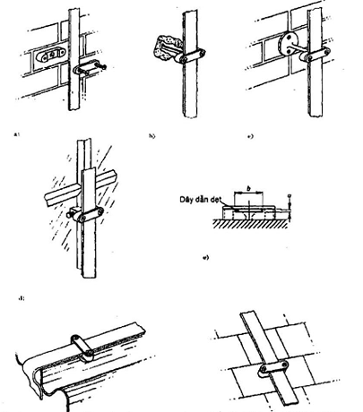

## PHỤ LỤC A (Tham khảo) — Các khía cạnh kỹ thuật của hiện tượng sét

A.1. Cường độ dòng điện của một tia sét

Cường độ dòng điện của một tia sét thường nằm trong khoảng từ 2 000 A đến 200 000 A. Thống kê các giá trị này trong thiên nhiên theo phân bố chuẩn logarit như sau:

&nbsp;&nbsp;\- 1 % các tia sét đánh vượt quá 200 000 A

&nbsp;&nbsp;\- 10 % các tia sét đánh vượt quá 80 000 A

&nbsp;&nbsp;\- 50 % các tia sét đánh vượt quá 28 000 A

&nbsp;&nbsp;\- 90 % các tia sét đánh vượt quá 8 000 A

&nbsp;&nbsp;\- 99 % các tia sét đánh vượt quá 3 000 A

Dòng điện trong hầu hết các tia sét đánh xuống mặt đất là từ các phần tử mang điện tích âm trong các đám mây dông và như vậy tia sét là dòng các hạt tích điện âm từ mây xuống mặt đất. Cũng có các tia sét từ các phần tử mang điện tích dương, nhưng ít thường xuyên hơn. Về chiều dòng điện là dòng điện một chiều tăng vọt trong quãng thời gian không đến 10 s đối với tia sét mang điện tích âm (đối với tia sét mang điện tích dương thời gian này dài hơn khá nhiều), sau đó giảm dần tới một giá trị nhỏ, đối với một tia sét đơn, trong khoảng thời gian 100 s hoặc nhỏ hơn.

Để tính toán thiết kế hệ thống chống sét, người ta sử dụng giá trị dòng điện sét ($i_{max}$) được cho là có hại nhất sau đây:

$I_{max}$ = 200 kA

$$\dots \qquad (A.1)$$
<!-- formula_id: "F_TCVN_9385_2012_FORMULA_A_1" -->

$$\left(\frac{di}{dt}\right) \qquad (A.2)$$
<!-- formula_id: "F_TCVN_9385_2012_FORMULA_A_2" -->

A.2. Điện thế

Trước khi hiện tượng phóng điện xảy ra, điện thế của khối cầu tích điện có thể ước tính sơ bộ bằng cách giả thiết điện tích Q là 100 C và bán kính của hình cầu tương đương vào khoảng 1 km. Do đó điện dung của cả khối vào khoảng 10$^{-7}$ F. Từ công thức Q = CV, điện thế tính được sẽ vào khoảng 10$^{9}$ V. Điều này có nghĩa điện áp ban đầu ở đám mây là trên 100 MV.

A.3. Các hiệu ứng về điện

Khi cường độ dòng điện bị tiêu hao qua điện trở của phần cực nối đất của hệ thống chống sét, nó sẽ tạo ra sự tụt điện áp kháng và có thể làm tăng tức thời hiệu điện thế với đất của hệ thống chống sét. Nó cũng có thể tạo nên xung quanh cực nối đất một vùng có chênh lệch điện thế cao có thể gây nguy hiểm cho người và động vật. Tương tự như vậy cũng cần phải lưu ý đến điện cảm tự cảm của hệ thống chống sét do đoạn dốc đứng của xung điện do sét gây ra.

Độ tụt điện áp do hiện tượng trên gây ra trong hệ thống chống sét do đó sẽ là tổng số học của hai thành phần là điện áp cảm ứng và điện áp kháng.

A.4. Hiệu ứng lan truyền sét

Điểm mà sét đánh vào hệ thống chống sét có thể có điện thế bị tăng cao hơn rất nhiều so với các vật thể kim loại xung quanh. Bởi vậy sẽ có nguy cơ lan truyền sét sang các vật kim loại trên hoặc phía bên trong công trình. Nếu sự lan truyền này xảy ra, một phần của dòng điện do sét gây ra sẽ được tiêu hao qua các thiết bị lắp đặt bên trong như đường ống hoặc dây dẫn, và như vậy sẽ dẫn đến rủi ro cho người sống trong nhà cũng như kết cấu công trình.

A.5. Hiệu ứng nhiệt

Việc quan tâm đến hiệu ứng nhiệt chỉ gói gọn trong việc tăng nhiệt độ trong hệ thống dẫn sét. Mặc dù cường độ dòng điện cao nhưng thời gian xảy ra là rất ngắn nên ảnh hưởng về nhiệt độ trong hệ thống bảo vệ là rất nhỏ.

Nói chung, diện tích cắt ngang của dây dẫn sét được chọn chủ yếu sao cho thỏa mãn về độ bền cơ khí, có nghĩa là nó đủ lớn để giữ cho độ tăng nhiệt độ trong khoảng 1 °C. Ví dụ như, với dây dẫn đồng có tiết diện 50 $mm^{2}$, một cú sét đánh 100 kA với thời gian là 100 s sẽ phóng ít hơn 400 J trên 1 m dây dẫn, dẫn đến độ tăng nhiệt độ khoảng 1 °C. Nếu dây dẫn là thép thì độ tăng này cũng ít hơn 10 °C.

A.6. Hiệu ứng cơ

Khi một dòng điện có cường độ cao được tiêu tán qua các dây dẫn đặt song song gần nhau hoặc dọc theo một dây dẫn duy nhất nhưng có nhiều gấp khúc, nó sẽ gây ra các lực cơ học có độ lớn đáng kể. Do đó các điểm giữ hệ thống dây dẫn là rất cần thiết (Xem Hình A.1 và Bảng A.1).

### Bảng A.1 - Khoảng cách các trụ đỡ hệ thống dẫn sét.

| Cách bố trí | Khoảng cách (mm) |
| :--- | :---: |
| Dây dẫn nằm ngang trên các mặt phẳng ngang | 1 000 |
| Dây dẫn nằm ngang trên mặt phẳng đứng | 500 |
| Dây dẫn thẳng đứng từ đất lên độ cao 20 m | 1 000 |
| Dây dẫn thẳng đứng từ 20 m trở lên | 500 |

> CHÚ THÍCH 2: Cần khảo sát các điều kiện môi trường và khoảng cách thực tế giữa các trụ đỡ có thể khác so với những kích thước nêu trên.
>
> CHÚ THÍCH 2: Cần khảo sát các điều kiện môi trường và khoảng cách thực tế giữa các trụ đỡ có thể khác so với những kích thước nêu trên.
>
> _CHÚ THÍCH:_

**CHÚ THÍCH 1:** ** Bảng này không áp dụng cho các trụ đỡ là các bộ phận của công trình, các trụ đỡ kiểu đó có thể có các yêu cầu đặc biệt.

Một tác động cơ học khác từ sét là do sự tăng cao đột ngột nhiệt độ không khí đến khoảng 30 000 °C (30 000 K) và sự giãn nở đột ngột không khí xung quanh đường dẫn sét xuống đất. Đây là do, khi độ dẫn điện của kim loại được thay thế bởi độ dẫn của một đường vòng cung, năng lượng sẽ tăng lên 100 lần. Một năng lượng lớn nhất khoảng 100 MW/m có thể được tạo ra trong cú phóng điện xuống mặt đất và sóng xung kích gần cú phóng điện này có thể làm trốc ngói lợp mái nhà.

Tương tự như vậy, với hiệu ứng lan truyền sét của sét trong các công trình, sóng xung kích có thể gây ra các hư hại cho kết cấu.

**CHÚ THÍCH 1:** Kẹp cho dây dẫn sét cần chế tạo riêng cho phù hợp với dây dẫn; kích thước a ở Hình e) phải bằng chiều dày dây và kích thước b phải bằng chiều rộng dây cộng thêm 1,3 mm (để giãn nở). Dây có tiết diện tròn cần được xử lý tương tự.

**CHÚ THÍCH 2:** Tất cả các kẹp cần được gắn chắc chắn vào kết cấu; không nên dùng vữa để gắn.

<strong>Hình A.1 — Thiết kế điển hình kẹp cố định dây dẫn sét</strong>

