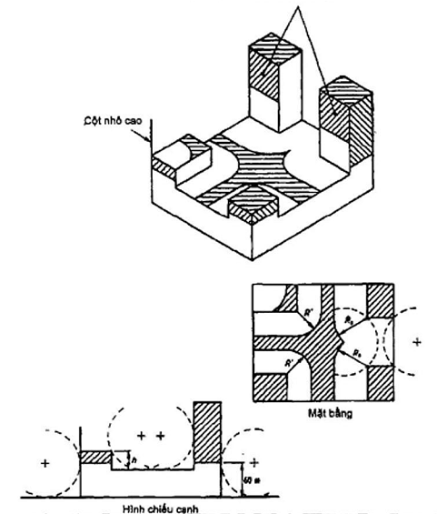

## PHỤ LỤC B (Tham khảo) — Giải thích một số điều khoản của tiêu chuẩn

B.1. Mạng nối đất và cực nối đất

(Xem Điều 13 và Điều 14)

B.1.1. Hiệu ứng lan truyền sét và vùng tiềm ẩn điện áp bước lân cận vị trí nối đất

Nguy cơ lan truyền sét trong công trình có hệ thống chống sét và chênh lệch điện áp trong vùng đất xung quanh khu vực nối đất phụ thuộc vào điện trở của đất. Nguy cơ lan truyền sét còn phụ thuộc vào một số yếu tố khác được đề cập ở A.4. Chênh lệch điện áp ở khu vực nối đất là hàm của điện trở suất của đất. Trong Hình 19, cú sét được mô phỏng xảy ra trên một hệ thống chống sét. Dòng sét được truyền xuống đất qua các cực nối đất, điện áp khu vực nối đất tăng lên và sự chênh điện áp tác dụng lên các lớp đất. Có thể làm giảm sự chênh lệch điện áp này bằng cách nối vòng các cực nối đất với nhau.

Chênh lệch điện áp có thể gây nguy hiểm tới tính mạng của con người nếu như nó vượt qua vài ngàn vôn, tới động vật nếu như vượt qua vài trăm vôn. Do sự chênh lệch điện áp này là hàm của tích dòng điện sét và điện trở nối đất của cực nối đất nên hiển nhiên là việc giảm điện trở nối đất xuống càng thấp càng tốt trở nên hết sức quan trọng. Thực tế nên giới hạn giá trị điện trở nối đất lớn nhất là 10  để bảo vệ cho người và động vật, tuy nhiên giá trị này càng nhỏ thì càng tốt. Một biện pháp khác để khắc phục chênh lệch điện áp trên bề mặt đất là chôn sâu các cọc nối đất với mũi cọc sâu ít nhất là 1 m, và bọc liên kết giữa dây xuống và bộ phận nối đất bằng vật liệu cách điện chịu điện áp đánh thủng tối thiểu 500 kV như polyethylene dày 5 mm. Mối nguy cơ đối với con người trong công trình giảm đi đáng kể nếu nhà có sàn thay vì nền bằng đất hay đá.

B.1.2. Sử dụng các đường ống kỹ thuật làm mạng nối đất

Không được sử dụng các đường ống dẫn nhiên liệu vào công trình làm mạng nối đất.

Các đường ống kỹ thuật khác có thể được sử dụng cho hệ thống chống sét bên trong công trình với điều kiện các điểm nối phải kiểm soát dễ dàng.

**CHÚ THÍCH:** đường ống cấp gas không được sử dụng làm cực nối đất (xem Hình 28).

B.1.3. Mạng nối đất

Ví dụ về kích thước cực nối đất trong đất có điện trở suất 100 m ở nhiệt độ 10 °C thông thường tạo ra điện trở nối đất của mạng nối đất khoảng 10  như sau:

&nbsp;&nbsp;\- Cực nối đất dạng vòng khép kín có chiều dài không nhỏ hơn 20 m chôn sâu ít nhất là 0,6 m dưới mặt đất; hoặc

&nbsp;&nbsp;\- Đường ống hoặc thanh đứng có chiều dài mỗi thanh không dưới 1,5 m, tổng cộng chiều dài các thanh không dưới 9 m;

&nbsp;&nbsp;\- Các thanh bố trí hướng tâm có chiều dài không nhỏ hơn 20 m chôn sâu ít nhất 0,6 m dưới mặt đất, hoặc

&nbsp;&nbsp;\- Bê tông cốt thép (xem B.1.5).

Các cực nối đất cần được chôn sâu trong một số trường hợp như có lớp sét nằm dưới lớp cuội sỏi. Không nên tin cậy vào độ sâu mực nước ngầm. Nước ngầm, đặc biệt trong lớp sỏi, có thể bị rút sạch và sẽ không có tác dụng đảm bảo cho điện trở nối đất thấp cho hệ thống nối đất.

Điện trở nối đất giảm không đáng kể khi giảm tiết diện của cọc mà kích thước lớn của cọc nối đất còn làm tăng giá thành hệ thống và gây khó cho thi công.

Ví dụ về quan hệ giữa đường kính cọc nối đất với trọng lượng của cọc dài 1,2 m được kê ở Bảng B.1.

### Bảng B.1 - Quan hệ đường kính và trọng lượng của cọc nối đất

| Đường kính d mm | Trọng lượng m kg |
| :---: | :---: |
| 13 | 1,4 |
| 16 | 2,3 |
| 19 | 3,2 |
| 25 | 5,4 |

Đối với cùng loại vật liệu trong cùng một loại đất thì một thanh cọc 4,8 m d = 13 mm hoặc 4 cọc 1,2 m d = 13 mm cho một giá trị điện trở vào khoảng 1/3 của thanh 1,2 m; d = 25 mm.

B.1.4. Trường hợp đặc biệt

Cần có sự cân nhắc đặc biệt đối với các trường hợp sau:

&nbsp;&nbsp;\- Hàng rào có sử dụng kim loại (xem 20.3.1);

&nbsp;&nbsp;\- Cây cối (xem Điều 23);

&nbsp;&nbsp;\- Nhà ở nông thôn (xem 24.4)

&nbsp;&nbsp;\- Công trình trên đá (xem 13.5)

Nếu công trình trên đá được chống sét theo phương án được đề cập trong 13.5 và kim loại trong và trên công trình được nối với hệ thống chống sét như giới thiệu ở 15.3 thì sẽ có được mức độ bảo vệ sét thích hợp cho người trong công trình. Tuy nhiên có thể nguy hiểm cho con người ra vào công trình khi có sét vì sự chênh lệch điện áp bên ngoài khi sét truyền xuống hệ thống chống sét của công trình.

Nếu bề mặt của đất hoặc đá có tính chất dẫn điện cao trong phạm vi khoảng 30 m đến 50 m tới công trình thì nối đất được mô tả ở Điều 14 có thể được sử dụng và nó có thể được nối với mạng nối đất mạch vòng. Nguy cơ đối với người ra vào giảm đi mặc dù không hoàn toàn bị loại bỏ.

B.1.5. Sử dụng móng bê tông cốt thép làm bộ phận nối đất

Khi móng bê tông cốt thép được sử dụng làm bộ phận nối đất thì có thể áp dụng công thức tính gần đúng như sau:

$$R = \frac{\rho}{\pi .1,57.V}$$
<!-- formula_id: "F_TCVN_9385_2012_RID117" -->

$$\dots \qquad (B.1)$$
<!-- formula_id: "F_TCVN_9385_2012_FORMULA_B_1" -->

trong đó: R là điện trở nối đất tính bằng ôm ();

&nbsp;&nbsp;&nbsp;&nbsp;\- là điện trở suất của đất tính bằng ôm nhân mét (m);

&nbsp;&nbsp;&nbsp;&nbsp;\- V là khối tích bê tông tính bằng mét khối ($m^{3}$).

&nbsp;&nbsp;&nbsp;&nbsp;\- VÍ DỤ:

&nbsp;&nbsp;&nbsp;&nbsp;\- Ứng dụng của công thức:

## 5  $M^{3}$ BÊ TÔNG CỐT THÉP TRONG ĐẤT 100 M THÌ ĐIỆN TRỞ NỐI ĐẤT XẤP XỈ 10 .

Các chân đế móng trong đất 100 m có giá trị điện trở sau:

0,2 $m^{3}$ (quy đổi bằng bán cầu đường kính 0,9 m) có giá trị điện trở R = 30 . Nghĩa là cần 3 cái thì sẽ đạt được giá trị yêu cầu 10 .

0,6 $m^{3}$ (tương đương 1,4 m bán cầu) có R = 20 . Nghĩa là cần 2 cái thì đạt giá trị 10 .

B.2. Kim loại trong và trên công trình cao hơn 20 m

(Xem Điều 15, Điều 16).

B.2.1. Máng dẫn nước kim loại có hoặc không nối đất

Bất cứ bộ phận kim loại nào trong hoặc trên công trình không nối với hệ thống chống sét nhưng lại nối với đất như các đường ống cấp nước, cấp gas, tấm kim loại, hệ thống điện đều có nguy cơ nhiễm sét. Thậm chí những bộ phận không tiếp xúc với đất cũng có chênh lệch điện thế giữa chúng với hệ thống chống sét mặc dù sự chênh lệch điện thế này nhỏ hơn so với trường hợp bộ phận kim loại đó được nối đất. Nếu sự chênh lệch điện thế gây ra trong một thời gian ngắn như vậy giữa bất kỳ bộ phận nào của hệ thống chống sét và các bộ phận kim loại gần kề vượt quá khả năng chống điện áp đánh thủng của vật liệu nằm giữa chúng (có thể là không khí, tường gạch, hoặc bất cứ vật liệu nào khác) thì có thể xảy ra hiện tượng lan truyền sét. Điều này có thể gây hư hỏng trong thiết bị, gây cháy hoặc sốc điện đối với người và vật.

B.2.2. Liên kết tại hai đầu máng nước kim loại

Liên kết này phải được thực hiện ở cả hai đầu của bất cứ chi tiết kim loại nào chìa ra. Khi đó kim loại có thể tham gia vào việc tiêu tán dòng điện sét nhưng phải tránh các nguy cơ hư hại vật lý hoặc thương tổn con người.

B.2.3. Lựa chọn bộ phận kim loại liên kết

Rất khó lựa chọn bộ phận kim loại nào thì liên kết, bộ phận nào thì bỏ qua. Đối với các bộ phận kim loại dài như đường ống nước, thang máy, thang sắt dài thì có thể dễ dàng quyết định chúng cần được nối với hệ thống bảo vệ chống sét của công trình mà không phải tốn kém nhiều. Tuy nhiên các bộ phận kim loại ngắn cách ly như khung cửa sổ chỉ có thể tiếp đất ngẫu nhiên qua màn nước mưa trên bề mặt kết cấu thì có thể bỏ qua.

Các công trình có cốt thép hoặc vách bao che kim loại tạo thành lưới kim loại khép kín liên tục tạo ra một trạng thái mà các kim loại bên trong không được liên kết có thể được giả thiết rằng chúng có cùng điện thế với bản thân kết cấu. Đối với các công trình đó nguy cơ lan truyền sét được giảm nhiều và yêu cầu đối với việc liên kết cũng giảm đi.

B.2.4. Nguy cơ của lớp phủ kim loại mỏng

Nếu bất cứ một phần bề mặt ngoài của công trình nào được bao phủ bởi một lớp kim loại mỏng, lớp kim loại này có thể được thiết kế hay ngẫu nhiên tạo thành một bộ phận dẫn dòng điện sét xuống đất. Dòng sét đó có thể tách ra khỏi lớp kim loại do các nguyên nhân như lớp kim loại không liên tục hoặc tiết diện lớp kim loại quá nhỏ nên nó sẽ bị chảy ra khi dòng điện sét đi qua. Cả hai trường hợp đó đều dẫn tới hiện tượng hồ quang điện và dễ gây cháy nếu có vật liệu dễ cháy ở gần. Khuyến nghị là nên tránh các nguy cơ đánh tia lửa điện ghi trong 15.2.

B.2.5. Dòng tự cảm trong dây xuống trong mối liên quan với chiều cao công trình

Khi chiều cao công trình tăng lên thì điện áp cảm kháng tại cực nối đất được cho là từng bước kém quan trọng hơn so với điện áp tự cảm rơi trên đường dẫn sét.

B.3. Cây và công trình gần cây

(Xem Điều 21)

Điều 21 đề cập tới giải pháp chống sét cho cây. Hệ thống chống sét được thiết kế để bảo vệ an toàn cho cây và giảm điện áp bước nằm trong vùng chôn đường dây dẫn sét, cực nối đất. Đứng dưới tán cây khi có giông sét là rất nguy hiểm.

Khi bị sét đánh, dòng sét lan truyền theo nhánh, cành tới thân cây và có thể gây hiệu ứng lan truyền sét sang các hạng mục công trình liền kề. Cường độ phóng điện của cây có thể lấy bằng 250 kV/m so với khả năng kháng dòng của không khí là 500 V/m. Các số liệu này là cơ sở của Điều 21 quy định khoảng cách tối thiểu giữa công trình và cây.

Khi công trình quá gần cây, có nguy cơ lan truyền sét từ cây sang công trình khi có sét thì hệ thống chống sét của công trình cần phải phủ vùng bảo vệ lên cả cây đó. Nếu cây nằm trong vùng bảo vệ của hệ thống chống sét của công trình thì công trình được coi là an toàn.

B.4. Các công trình khác

(Xem Điều 23)

B.4.1. Lều trại nhỏ

Đối với lều trại nhỏ tuân thủ theo 23.1.1 có thể sẽ tốn kém. Mặc dù vậy, trong vùng nhiều sét thì nên có biện pháp chống sét. Cụ thể là:

a) \- Để chống sét cho lều trại nhỏ có thể sử dụng một hoặc hai cần kim loại (dạng ống lồng ăng ten) phía bên ngoài lều, bố trí sao cho lều nằm trong phạm vi được bảo vệ như ở 9.2. Chân của các cần kim loại cần được nối với cọc chống nối đất đặt xa lều và cắm vào đất ẩm. Thêm nữa có thể sử dụng một dây kim loại trần đặt trên mặt đất xung quanh lều và nối tới chân của mỗi cần kim loại.

b) \- Trong trường hợp lều trong khung kim loại thì khung đó làm việc như là một dây dẫn sét. Khung đó phải được nối xuống đất như hướng dẫn ở phần a) ở hai đầu của lều.

c) \- Khi có giông sét, đối với lều không được chống sét, thì cần phải tìm cách loại bỏ điện áp bước tác dụng lên cơ thể người. Có thể thực hiện điều đó bằng cách nằm lên trên một vật kim loại đặt trực tiếp trên đất. Nếu không có điều kiện như vậy thì có thể ngồi bó gối trên mặt đất và tránh tiếp xúc với lều và với người khác.

B.4.2. Sân vận động

Khi cột đèn cao bị sét đánh, dòng điện sét truyền xuống nền qua chân cột và có thể ước lượng độ chênh điện áp của đất nền từ giả thiết rằng các lớp đẳng thế ở dưới nền phân bố dạng các bán cầu. Do đó với dòng trung bình khoảng 30 kA và điện trở suất của đất 10$^{3}$ m, độ chênh điện áp của đất nền sẽ vào khoảng 50 kV/m trong khoảng 10 m từ chân cột và nó thay đổi tỷ lệ nghịch với khoảng cách và diện tích (Hình 19, Hình 36).

Với giả thiết đó, đối với người gradient điện áp không được vượt quá 10 kV/m tương ứng với khoảng cách 22 m từ chân cột. Sử dụng một cực nối đất thích hợp dưới hình thức một lưới tròn bán kính 10 m có thể làm giảm ứng suất điện áp xung quanh cột. Thêm nữa có thể chống lại điện áp bước bằng cách bọc tấm cách điện bằng PVC dưới lớp asphan. Để tránh tiếp xúc trực tiếp với chân cột có thể sơn phủ keo epoxy dày 5 mm từ chân cột tới độ cao 3 m.

Lưu ý tránh việc tăng nhiệt độ quá mức giới hạn dưới tác dụng của bức xạ mặt trời sẽ làm giảm giá trị của lớp bảo vệ.

B.5. Công trình có hình dáng phức tạp

(Xem 11.2.4)

Phương pháp "hình cầu lăn" được mô tả ở mục này có thể được sử dụng để nhận biết các phần không được bảo vệ sét đánh của công trình cao nhiều mô đun phức tạp. Phương pháp này dựa trên nguyên lý quá trình tiếp xúc của đầu tích điện sét tới công trình.

Trước khi xảy ra sét, đầu tích điện sét hướng xuống đất (hình thành trên các đám mây dông) và cách nhánh tích điện của nó hạ thấp dần. Khi đầu tích điện sét hạ xuống thì xảy ra quá trình điện ngược dấu ở trên mặt đất (cũng hình thành đầu tích điện sét hướng lên trên) và tạo ra trường điện giữa hai mảng tích điện trái dấu. Cường độ của trường điện này tăng dần tới khi đủ lớn thì đầu tích điện hướng lên ở phía dưới phóng lên trên để gặp đầu tích điện sét hướng xuống phóng xuống dưới và tạo thành tia sét.

Do đó tia sét sẽ đánh trên mặt đất hoặc trên công trình tại nơi mà đầu tích điện hướng lên được phóng đi và do các đầu tích điện hướng lên đó được phóng lên tại các điểm có cường độ điện trường cao nhất và có thể phóng thẳng lên trời mà không bị cản nên chúng có thể phóng theo bất cứ hướng nào để gặp đầu tích điện sét từ mây phóng xuống. Một ví dụ cho hình ảnh này là sét vẫn đánh vào mặt bên của công trình cao mặc dù thông thường nó không đánh vào phần công trình nằm dưới góc 45° của hình côn từ điểm bảo vệ cao nhất của công trình.

Các điểm có cường độ điện trường mạnh nhất trên đất hoặc công trình thường là khu vực gần nhất với đầu tích điện hướng lên trước khi nó phóng lên. Các điểm có khoảng cách bằng nhau từ điểm cuối của các đầu tích điện đều có cùng nguy cơ bị sét đánh còn các điểm xa hơn sẽ ít bị nguy cơ sét đánh hơn. Do đó các điểm trên bề mặt của hình cầu tưởng tượng có tâm nằm ở đầu tích điện hướng lên trước khi xảy ra sét là các vị trí mà đầu tích điện hướng lên có thể phóng điện lên (xem Hình B.1). Do đầu tích điện của mây dông có thể phóng xuống bất cứ hướng nào nên tất cả các vị trí mà đầu tích điện của mây dông có thể tiếp cận được có thể mô phỏng bằng cách lăn một hình cầu tưởng tượng có bán kính bằng chiều dài của bước cuối (last step length), xung quanh công trình và thẳng xuống mặt đất. Khi nó tiếp xúc với công trình có thể tạo ra cú sét đánh và những vị trí hay bề mặt như vậy cần phải có bộ phận thu sét như mô tả ở Điều 11. Tuy nhiên nếu các bộ phận đó của công trình không có các điểm góc nhọn hay vật nhô ra thì bộ phận thu sét hiện hữu có thể chấp nhận được. Nếu có các điểm góc nhọn hay vật nhô ra thì cần xem xét để bổ sung thêm bộ phận thu sét.

Công trình cao có hình dạng đơn giản có thể được chống sét như mô tả ở Hình 22 nhưng đối với công trình phức tạp cần áp dụng phương pháp hình cầu lăn này. Phương pháp này cũng có thể áp dụng cho các công trình có bộ phận thu sét đặt trên công trình hoặc có các bộ phận thu sét treo phía trên. Phương pháp này cũng có thể sử dụng để xác định vùng được bảo vệ sét của bất cứ một thiết kế hệ thống chống sét nào.

Nhìn chung kích thước cầu càng nhỏ thì khả năng bảo vệ chống sét càng tốt hơn nhưng sẽ tốn kém khi xây lắp hệ thống. Cỡ cầu được khuyến nghị có bán kính từ 20 m đến 60 m. Thông thường nên sử dụng cầu có bán kính 60 m. Còn cầu có bán kính 20 m chỉ nên dùng cho các công trình có nguy cơ cháy cao.

### Bảng B - 1 chỉ ra rằng trọng lượng của cọc 1,2 m, đường kính 25 mm thì nặng hơn cọc 1,2 m đường kính 13 mm tới 4 lần.

| Các vùng gạch chéo và cột nhô cao cần được đánh giá xem có cần bộ phận thu sét hay không. Trong nhiều trường hợp dây xuống đã đảm bảo thu sét trên các cạnh công trình. |
| :--- |

<strong>Hình B.1 — Ví dụ sử dụng phương pháp "hình cầu lăn" để đánh giá sự cần thiết phải bố trí bộ phận thu sét cho một công trình có hình dạng phức tạp.</strong>

