
## PHỤ LỤC C (Tham khảo) — Hướng dẫn chung chống sét cho thiết bị điện trong và trên công trình

C.1. Thông tin chung

Mục này đưa ra những hướng dẫn đánh giá các nguy cơ làm hư hại hoặc vận hành sai hệ thống thiết bị điện trong hoặc trên công trình khi bị sét và hướng dẫn thiết kế hệ thống chống sét cho thiết bị. Việc thực hiện các hướng dẫn trong tiêu chuẩn cũng có thể cung cấp mức độ nào đó chống lại các đe dọa có nguồn gốc khác (như việc đóng ngắt mạch).

Hệ thống chống sét thông thường chỉ được thiết kế và lắp đặt cho công trình. Mặc dù vậy, hệ thống thiết bị cần có độ tin cậy cao hơn và nó cũng đòi hỏi một hệ thống chống sét riêng để bảo vệ cho thiết bị điện cũng như các hệ thống thông tin dữ liệu.

Sự phức tạp của sét đánh vào công trình, dòng sét tăng cao trong thời gian ngắn kèm theo các hiện tượng khác là nguyên nhân gây phá hoại thiết bị, xóa dữ liệu. Nguy cơ của sét được đề cập ở C.4, song còn có nhiều yếu tố tác động đến việc cần đến hệ thống chống sét như nhu cầu:

&nbsp;&nbsp;\- Giảm thiểu các nguy cơ cháy và sốc điện;

&nbsp;&nbsp;\- Tránh ngừng trệ hoạt động sản xuất và thương mại có ảnh hưởng đến vấn đề kinh tế;

&nbsp;&nbsp;\- Ngăn ngừa các tác hại về an toàn, sức khỏe;

&nbsp;&nbsp;\- Bảo vệ các dịch vụ thiết yếu về an toàn, báo cháy, thông tin, quản trị công trình;

&nbsp;&nbsp;\- Tránh phải sửa chữa tốn kém các trang thiết bị vi tính.

Các hướng dẫn ở phụ lục này mang tính tổng quát, khi áp dụng cho hệ thống chống sét cần tính đến các điều kiện thực tế. Trong những trường hợp đặc biệt thì cần phải tìm kiếm những lời khuyên của chuyên gia.

Tuy nhiên, ngay cả khi có hệ thống chống sét thì cũng không bao giờ hoàn toàn có thể chắc chắn là an toàn cho hệ thống thiết bị hay an toàn về dữ liệu.

Hình C.1 minh họa dòng sét đánh vào nhà máy công nghiệp, truyền qua các bộ phận của nhà và đi xuống đất.

**CHÚ THÍCH:** Phụ lục này chỉ dùng để tham khảo, việc tuân thủ phụ lục này không có nghĩa là tuân thủ nội dung tiêu chuẩn này.

C.2. Ứng dụng của phụ lục này

Khi áp dụng những hướng dẫn của phụ lục này cần tuân theo quy trình sau:

&nbsp;&nbsp;\- Quyết định xem có cần hệ thống chống sét không (xem Điều 7)

&nbsp;&nbsp;\- Nếu câu trả lời là có thì xem xét thiết kế chống sét rồi chuyển sang c), nếu câu trả lời là không thì chuyển ngay sang c).

&nbsp;&nbsp;\- Quyết định liệu có cần phải chống sét cho các thiết bị điện, điện tử trong hay trên công trình không (xem C.4, C.5)

&nbsp;&nbsp;\- Nếu câu trả lời cho câu hỏi c) là có thì xem các nội dung C.3, C.7, C.13; nếu câu trả lời là không thì không xem xét thêm.

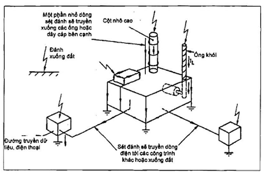

**CHÚ THÍCH 1:** Thông tin cơ bản liên quan tới các khía cạnh chống sét được cho ở C.8, C.9

**CHÚ THÍCH 2:** Các ví dụ tính toán được cho ở C.6, C.10, C.11, C.12.

<strong>Hình C.1 — Các điểm sét đánh vào công trình công nghiệp có thể ảnh hưởng đến hệ thống điện tử</strong>

C.3. Các yếu tố cơ bản về chống sét cho hệ thống điện

C.3.1. Mức độ rủi ro

Trước khi thiết kế hệ thống chống sét cho thiết bị, cần lưu ý tới hệ thống chống sét cơ bản cho công trình. Thông tin ở C.4, C.5 giúp cho việc quyết định có cần phải bảo vệ thiết bị điện hay không.

C.3.2. Chống sét của bản thân công trình

Khi cân nhắc các phương án phòng chống sét cho thiết bị điện của công trình thì cần xem liệu công trình đã được chống sét hoặc sẽ được chống sét theo tiêu chuẩn này chưa.

Loại công trình có khả năng chống sét lý tưởng là công trình có vách bao che bằng kim loại cho tất cả các bức tường và mái, nó tạo ra môi trường dạng "phòng được cách ly" cho các thiết bị điện. Nếu như tất cả các vách bao che và lớp phủ mái liên kết với nhau một cách thỏa đáng thì dòng sét đánh từ bất cứ chỗ nào của công trình sẽ được truyền xuống đất dạng "tấm truyền điện" trên bề mặt công trình và xuống bộ phận nối đất. Các công trình kết cấu thép hoặc Bê tông cốt thép có vách bao che kim loại là các công trình thuộc dạng này và như vậy chỉ cần chú ý đến việc bảo vệ các đường cáp nguồn cấp vào công trình (Hình C.2). Cần lưu ý đạt được kháng trở thấp từ liên kết giữa bộ phận nối đất của hệ thống chống sét với các hệ thống đường ống khác. Nên áp dụng phương pháp đi đường cấp điện vào như minh họa ở Hình 28 có kèm theo các bộ phận chặn xung nếu kết quả tính toán cho thấy cần phải có các bộ phận này.

Công trình xây dựng bằng bê tông cốt thép hoặc bằng khung thép không có vách bao che kim loại thì dòng sét có thể truyền bên trong các cột. Hướng dẫn đối với nơi lắp đặt máy tính và hệ thống dây dẫn được cho ở C.7.2.

Nếu như vật liệu xây dựng công trình chủ yếu là kim loại thì có thể xếp công trình có nguy cơ cao (xem Điều 18) và bố trí hệ thống chống sét tăng cường (xem C.7.1).

Nhìn chung cần lắp đặt các thiết bị chống quá áp càng gần tới các điểm kết nối ra/vào công trình càng tốt.

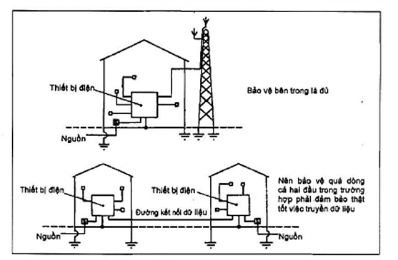

<strong>Hình C.2 — Các dạng chống sét có liên quan tới thiết bị điện tử</strong>

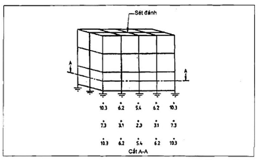

<strong>Hình C.3 — Phân bố dòng điện do sét đánh vào công trình có 15 cột chống xuống đất</strong>

| $\frac{q_{sw,1} Z_1}{R_s A_{s,1}}$ — 1) 0,015 H/m 5) 0,05 H/m | $\frac{q_{sw,1} Z_1}{R_s A_{s,1}}$ — 2) 0,02 H/m 6) 0,07 H/m | $\frac{q_{sw,1} Z_1}{R_s A_{s,1}}$ — 3) 0,03 H/m 7) 0,08 H/m | $\frac{q_{sw,1} Z_1}{R_s A_{s,1}}$ — 4) 0,04 H/m |
| :--- | :--- | :--- | :--- |

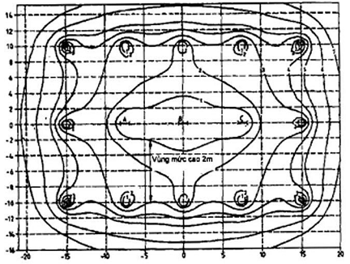

> CHÚ THÍCH 1. Đường đồng mức điện cảm truyền dẫn (MT) như sau:
>
> CHÚ THÍCH 1. Đường đồng mức điện cảm truyền dẫn (MT) như sau:
>
> CHÚ THÍCH 1. Đường đồng mức điện cảm truyền dẫn (MT) như sau:
>
> CHÚ THÍCH 1. Đường đồng mức điện cảm truyền dẫn (MT) như sau:
>
> CHÚ THÍCH 3. Điện cảm tương hỗ đối với mạch trên mặt phẳng đứng có được bằng cách trừ giá trị điện cảm truyền dẫn tại vị trí của một cột từ giá trị tại vị trí khác (bỏ các giá trị âm trong kết quả). Điện cảm truyền tới dây trong cột tính bằng 0.
>
> Ví dụ: Đối với vùng cao 2 m như trên hình vẽ và độ tăng dòng sét đánh $\frac{q_{sw,1} Z_1}{R_s A_{s,1}}$ là 50 kA/s:
>
> Điện cảm tương hỗ (M) = (0,03 - 0,015) = 0,015 H/m
>
> Do đó điện áp = M. (giá trị vùng mức cao). $\frac{q_{sw,1} Z_1}{R_s A_{s,1}}$ = (0,015 x 10$^{-6}$) x (2,0) x (5 x 10$^{10}$) = 1 500 V
>
> CHÚ THÍCH 3. Điện cảm tương hỗ đối với mạch trên mặt phẳng đứng có được bằng cách trừ giá trị điện cảm truyền dẫn tại vị trí của một cột từ giá trị tại vị trí khác (bỏ các giá trị âm trong kết quả). Điện cảm truyền tới dây trong cột tính bằng 0.
>
> Ví dụ: Đối với vùng cao 2 m như trên hình vẽ và độ tăng dòng sét đánh $\frac{q_{sw,1} Z_1}{R_s A_{s,1}}$ là 50 kA/s:
>
> Điện cảm tương hỗ (M) = (0,03 - 0,015) = 0,015 H/m
>
> Do đó điện áp = M. (giá trị vùng mức cao). $\frac{q_{sw,1} Z_1}{R_s A_{s,1}}$ = (0,015 x 10$^{-6}$) x (2,0) x (5 x 10$^{10}$) = 1 500 V
>
> CHÚ THÍCH 3. Điện cảm tương hỗ đối với mạch trên mặt phẳng đứng có được bằng cách trừ giá trị điện cảm truyền dẫn tại vị trí của một cột từ giá trị tại vị trí khác (bỏ các giá trị âm trong kết quả). Điện cảm truyền tới dây trong cột tính bằng 0.
>
> Ví dụ: Đối với vùng cao 2 m như trên hình vẽ và độ tăng dòng sét đánh $\frac{q_{sw,1} Z_1}{R_s A_{s,1}}$ là 50 kA/s:
>
> Điện cảm tương hỗ (M) = (0,03 - 0,015) = 0,015 H/m
>
> Do đó điện áp = M. (giá trị vùng mức cao). $\frac{q_{sw,1} Z_1}{R_s A_{s,1}}$ = (0,015 x 10$^{-6}$) x (2,0) x (5 x 10$^{10}$) = 1 500 V
>
> CHÚ THÍCH 3. Điện cảm tương hỗ đối với mạch trên mặt phẳng đứng có được bằng cách trừ giá trị điện cảm truyền dẫn tại vị trí của một cột từ giá trị tại vị trí khác (bỏ các giá trị âm trong kết quả). Điện cảm truyền tới dây trong cột tính bằng 0.
>
> Ví dụ: Đối với vùng cao 2 m như trên hình vẽ và độ tăng dòng sét đánh $\frac{q_{sw,1} Z_1}{R_s A_{s,1}}$ là 50 kA/s:
>
> Điện cảm tương hỗ (M) = (0,03 - 0,015) = 0,015 H/m
>
> Do đó điện áp = M. (giá trị vùng mức cao). $\frac{q_{sw,1} Z_1}{R_s A_{s,1}}$ = (0,015 x 10$^{-6}$) x (2,0) x (5 x 10$^{10}$) = 1 500 V
>
> **CHÚ THÍCH:** Các cột ở bên trong (A, B và C) chỉ mang tải tương đương 3,1 %, 2,3 % và 3,1 % tổng cường độ sét.

<strong>Hình C.4 — Mặt bằng nhà có 15 cột chống xuống đất thể hiện trường phân bố điện cảm truyền dẫn</strong>

C.3.3. Hành trình dòng điện sét truyền trong công trình

Dòng điện sét truyền trong công trình dạng "phòng được cách ly" như đã được đề cập trong C.3.2 theo kiểu "mành dòng điện" trên bề mặt của mái, tường rồi xuống đất. Sự thay đổi điện trở nhỏ trong các phần khác nhau của bề mặt ảnh hưởng rất ít tới quá trình truyền điện này bởi vì đường dẫn dòng được xác định bằng độ cảm ứng chứ không bằng điện trở do bản chất hiện tượng sét đánh xảy ra rất nhanh. Xu hướng tương tự cũng diễn ra đối với dây xuống ngoài nhà đối với công trình có kết cấu khung thép hoặc Bê tông cốt thép có dạng như ở Hình C.3 và C.4, nơi dòng điện được phân ra bởi 15 đường riêng rẽ. Cần lưu ý là các đường xuống bên trong mang ký hiệu A, B và C ở Hình C.4 mang một lượng phần trăm rất nhỏ của dòng và do đó có trường điện từ nhỏ. Hệ thống chống sét cho hệ thống thiết bị điện trong nhà được phát triển bởi các đường dẫn sét được bố trí ở ngoài biên của nhà. Một số đường dẫn để giải quyết trong trường hợp có dòng giữa thiết bị với nhau. Đó là các dây đơn lẻ được lắp đặt trong nhà và được chấp nhận cho việc truyền sét cũng như chống lại phát sinh tia lửa điện.

C.3.4. Ảnh hưởng của quy mô sét tới định dạng hệ thống khác nhau

Cách bố trí lý tưởng cho công trình và hệ thống điện bên trong để có thể làm giảm các nguy cơ dòng điện sét làm hư hại hoặc tác động không tốt tới chúng được thể hiện ở Hình C.2a.

Trong các trường hợp như vậy, có các biện pháp để bảo vệ tác động của sét gây ra trong hệ thống điện chính của nhà. Đây là sự sắp đặt được mô tả ở C.3.2 đối với một công trình được chống sét tốt.

Hệ thống điện trong các công trình phi kim loại không có hệ thống chống sét có nguy cơ bị sét tác động nhiều nhất. Cần phải xem xét cẩn thận phương pháp chống sét cho công trình và các bộ phận của nó. Một số nguy cơ được giải thích ở dưới đây và các hướng dẫn chống sét cụ thể được trình bày ở C.7.1 và C.7.2.

Một trong các ví dụ về tình huống nơi mà có các nguy cơ có thể xem xét là công trình chứa các thiết bị điện và có thể có các thiết bị liên hợp như đài, rađa hoặc các thiết bị dự báo thời tiết, trong dây chuyền, các sensor được đặt phía ngoài. Các thiết bị liên hợp này có thể được treo ở bên cạnh hoặc đỉnh mái hoặc trên các cột thu, tháp truyền thanh hoặc công trình thông thường như minh họa ở Hình C.2b. Mái hoặc cột thu nằm ngoài phạm vi bảo vệ của hệ thống chống sét cho công trình, nhưng cáp dẫn từ cột thu vào công trình có thể đưa sét vào trong công trình trong khi hệ thống chống sét của công trình không phát huy tác dụng. Hơn thế các bộ phận thiết bị treo trên mái hoặc cột có thể dễ bị ảnh hưởng khi bị sét trực tiếp, hoặc bị hư hại vì dải điện áp cao lan vào. Ví dụ tiếp theo chỉ ra khả năng dính sét tới thiết bị điện phụ thuộc không chỉ vào hệ thống chống sét mà còn phụ thuộc vào các chi tiết lắp đặt như dây, các đầu đọc, thu trên tháp cũng như phụ thuộc vào mạch dẫn vào công trình. Hướng dẫn đo đạc để bảo vệ khỏi các nguy cơ này cho ở C.7.

Ví dụ tiếp theo về vấn đề thường gặp có thể gây ra sự tăng điện áp môi trường lên cao được chỉ ra ở Hình C.2c. Có xu hướng điện sét tiêu tán theo các đường dẫn điện được hình thành bằng các đường cáp nối các công trình, do đó dòng điện sét có thể truyền từ công trình bị sét đánh sang công trình khác không bị sét đánh trực tiếp. Dòng lên tới hàng chục kilôampe (kA) có thể truyền qua các đường cáp này nên việc chống lại hiện tượng này là rất cần thiết. Phương pháp bảo vệ được mô tả ở C.7. Đây là một trong những nguy cơ mà sét truyền đi giữa các công trình.

C.4. Đánh giá mức độ rủi ro

C.4.1. Quyết định lắp đặt hệ thống chống sét

Quyết định lắp đặt một hệ thống chống sét cho hệ thống điện và điện tử chống lại sét thứ cấp phụ thuộc vào:

Lượng sét đánh dự kiến trên khu vực (xem C.4.2);

Sự dễ bị tổn thương hư hại của hệ thống.

C.4.2. Số vụ sét đánh dự kiến

C.4.2.1. Diện tích thu sét hữu dụng

Số vụ sét đánh dự kiến có thể đánh vào một diện tích thu sét hữu dụng trong một năm được cho bởi tích của mật độ sét và diện tích thu sét hữu dụng.

Diện tích thu sét hữu dụng, $A_{e}$ tính theo m vuông được xác định bởi:

$A_{e}$ = diện tích công trình + diện tích thu sét của vùng đất xung quanh + diện tích thu sét của các công trình liên hợp liền kề + diện tích thu sét hữu dụng của các đường nguồn cấp + diện tích thu sét hữu dụng của đường truyền dữ liệu sang công trình liên quan.

C.4.2.2. Diện tích công trình

Là diện tích mặt bằng của công trình.

C.4.2.3. Diện tích thu sét của vùng đất xung quanh

Sét đánh xuống đất hoặc công trình gây ra tại khu vực đặt công trình một điện áp cao. Bất cứ đường trục hay đường dữ liệu đi vào khu vực điện áp cao đó đều là đối tượng của hiện tượng quá điện áp. Ảnh hưởng của một cú sét đánh xuống đất bị tắt dần khi khoảng cách giữa chu vi của công trình và điểm đánh tăng lên. Vượt quá một khoảng cách nhất định thì ảnh hưởng của cú sét đánh tới công trình được coi là không đáng kể. Đấy là khoảng cách lựa chọn D, m. Với loại đất có điện trở suất 100 m khoảng cách D có thể lấy bằng 100 m. Với loại đất có giá trị điện trở suất khác thì giá trị D có thể lấy đúng bằng giá trị điện trở suất cho tới giá trị maximum là 500 m cho đất có giá trị 500 m hoặc hơn nữa.

Diện tích thu sét của đất xung quanh là diện tích có đường cơ sở là viền chu vi công trình và khoảng cách D. Khi mà chiều cao công trình vượt quá giá trị D thì lấy chiều cao công trình làm giá trị để tính.

C.4.2.4. Diện tích thu sét của các công trình liên hợp liền kề

Diện tích thu sét của công trình liên hợp liền kề là nơi có sự kết nối điện trực tiếp hoặc không trực tiếp tới thiết bị điện hoặc điện tử từ công trình chính thì được tính vào.

Lấy ví dụ cây cột chiếu sáng đặt ngoài nhà được cấp điện từ nhà chính. Nhà khác có trạm máy tính đầu cuối, thiết bị điều khiển và tháp truyền.

Tại công trường có một vài ngôi nhà có hệ thống dây nối và khoảng cách không lớn hơn 2D, diện tích thu sét của các công trình liên hợp liền kề là diện tích giữa chu vi của các công trình liên hợp liền kề và đường định dạng bằng khoảng cách D từ chúng. Bất cứ vùng nào nằm trong diện tích thu sét của công trình chính thì đều không tính (xem ví dụ 1 trong C.6).

C.4.2.5. Diện tích thu sét hữu dụng của các đường dây cấp điện nguồn

Diện tích thu sét hữu dụng liên quan tới các đường dây cấp điện nguồn được kê trong Bảng C.1.

Tất cả các đường cáp vào ra (tới các công trình khác, các tháp chiếu sáng, thiết bị ở xa… ) được xem xét một cách riêng biệt và diện tích thu sét được cộng từ các phần riêng đó.

### Bảng C.1 - Diện tích thu sét hữu dụng của các đường nguồn cấp

| Loại nguồn cấp | Diện tích thu sét hữu dụng ($m^{2}$) |
| :--- | :--- |
| Đường dây hạ áp trên không | 10 x D x L |
| Đường dây cao áp trên không (tới biến áp của công trình) | 4 x D x L |
| Đường dây hạ áp đi ngầm | 2 x D x L |
| Đường dây cao áp đi ngầm (tới biến áp của công trình) | 0,1 x D x L |

> CHÚ THÍCH 2: L là chiều dài của cáp động lực với độ dài tối đa 1 000 m. Nơi nào giá trị L không xác định thì có thể lấy giá trị 1 000 m để tính toán.
>
> CHÚ THÍCH 2: L là chiều dài của cáp động lực với độ dài tối đa 1 000 m. Nơi nào giá trị L không xác định thì có thể lấy giá trị 1 000 m để tính toán.
>
> _CHÚ THÍCH:_

**CHÚ THÍCH 1:** ** D là khoảng cách lựa chọn (m) xem C.4.2.3. Việc sử dụng h thay cho D như giải thích ở C.4.2.3 không áp dụng.

C.4.2.6. Diện tích thu sét của đường truyền dữ liệu sang công trình liên quan

Diện tích thu sét liên quan với các loại cáp dữ liệu được kê trong Bảng C.2.

Nếu có nhiều hơn 1 đường cáp thì có thể coi là tính đơn lẻ rồi cộng lại. Trong trường hợp cáp đa lõi thì từng cáp có thể được coi là đơn và không giống như là từng vòng.

### Bảng C.2 - Diện tích thu sét hữu dụng của các đường dữ liệu

| Loại đường dữ liệu | Diện tích thu sét hữu dụng ($m^{2}$) |
| :--- | :--- |
| Đường tín hiệu đi trên không | 10 x D x L |
| Đường tín hiệu đi ngầm | 2 x D x L |
| Đường cáp quang không có đường dẫn hoặc lõi kim loại | 0 |

> CHÚ THÍCH 2: L là chiều dài của cáp động lực với độ dài tối đa 1 000 m. Nơi nào giá trị L không xác định thì có thể lấy giá trị 1 000 m để tính toán.
>
> CHÚ THÍCH 2: L là chiều dài của cáp động lực với độ dài tối đa 1 000 m. Nơi nào giá trị L không xác định thì có thể lấy giá trị 1 000 m để tính toán.
>
> _CHÚ THÍCH:_

**CHÚ THÍCH 1:** ** D là khoảng cách lựa chọn (m) xem C.4.2.3. Việc sử dụng h thay cho D như giải thích ở C.4.2.3 không áp dụng.

C.4.2.7. Đánh giá khả năng sét đánh

Số lượng sét có thể đánh trên một diện tích thu sét được định nghĩa mỗi năm, , theo công thức sau:

p = $A_{e}$ * $N_{g}$ * 10$^{-6}$

$$\dots \qquad (C.1)$$
<!-- formula_id: "F_TCVN_9385_2012_FORMULA_C_1" -->

Trong đó

&nbsp;&nbsp;&nbsp;&nbsp;\- $A_{e}$ là tổng số diện tích thu sét hữu dụng tính bằng mét vuông ($m^{2}$);

&nbsp;&nbsp;&nbsp;&nbsp;\- $N_{g}$ là mật độ sét trên một kilômet vuông mỗi năm.

&nbsp;&nbsp;&nbsp;&nbsp;\- C.4.3. Sự dễ hư hại của các dạng hệ thống

&nbsp;&nbsp;&nbsp;&nbsp;\- Nguy cơ tổng thể của một cú sét xuống thiết bị điện hoặc điện tử sẽ phụ thuộc vào xác suất sét đánh và các tiêu chí dưới đây:

&nbsp;&nbsp;&nbsp;&nbsp;\- Loại công trình;

&nbsp;&nbsp;&nbsp;&nbsp;\- Mức độ bao bọc;

&nbsp;&nbsp;&nbsp;&nbsp;\- Loại địa hình

&nbsp;&nbsp;&nbsp;&nbsp;\- Trong Bảng C.3, Bảng C.4 và C.5 các hệ số hiệu chỉnh F tới H được phân chia cho từng tiêu chí để chỉ mối liên quan của các nguy cơ trong từng trường hợp.

### Bảng C.3 - Hệ số hiệu chỉnh F (hệ số công trình)

| Loại công trình | Giá trị F |
| :--- | :---: |
| Công trình có hệ thống chống sét và nối đẳng thế đơn giản | 1 |
| Công trình có hệ thống chống sét và nối đẳng thế phức hợp | 1,2 |
| Công trình có hệ thống nối đẳng thế khó khăn (nhà dài hơn 100 m) | 2 |

### Bảng C.4 - Hệ số hiệu chỉnh G (hệ số mức độ cách ly)

| Loại bao bọc | Giá trị G |
| :--- | :---: |
| Công trình nằm trên một diện tích rộng có cây và nhà cửa độ cao gần như nhau, ví dụ như trong thị trấn hoặc rừng | 0,4 |
| Công trình nằm trên một diện tích rộng có ít cây và nhà cửa độ cao gần tương đương. | 1,0 |
| Công trình cao hơn hẳn các công trình và cây cối xung quanh ít nhất 2 lần. | 2 |

> **CHÚ THÍCH:** Bảng C.4 có hệ số giống Bảng 9, lặp lại ở đây để tiện sử dụng

### Bảng C.5 - Hệ số hiệu chỉnh H (hệ số địa hình)

| Loại địa hình | Giá trị H |
| :--- | :---: |
| Đồng bằng | 0,3 |
| Đồi | 1,0 |
| Núi từ 300 m đến 900 m | 1,3 |
| Núi trên 900 m | 1,7 |

> **CHÚ THÍCH:** Bảng C.5 có hệ số giống Bảng 8, lặp lại ở đây để tiện sử dụng

C.4.4. Nguy cơ sét đánh vào một hệ thống cụ thể

Nguy cơ sét đánh và khả năng dễ bị hư hỏng của một hệ thống (các hệ số hiệu chỉnh) có thể được kết hợp lại để đánh giá các nguy cơ sét đánh ảnh hưởng tới các hệ thống điện và điện tử thông qua các bộ phận dẫn điện ra/ vào hoặc các hệ thống dữ liệu ra/ vào.

Nguy cơ xảy ra (R) của việc tăng thế tức thì do sét được tính theo công thức:

R = F x G x H x p

$$\dots \qquad (C.2)$$
<!-- formula_id: "F_TCVN_9385_2012_FORMULA_C_2" -->

**CHÚ THÍCH:** Giá trị 1/R thể hiện, theo đơn vị năm, chu kỳ trung bình giữa các lần xảy ra thế tức thì do sét. Nó nhấn mạnh rằng giá trị trung bình được dựa trên dữ liệu thu thập qua nhiều năm.

C.5. Quyết định làm hệ thống chống sét

Quyết định làm hệ thống chống sét cần tính đến các tác động mang tính hậu quả hư hại của các thiết bị điện và điện tử quan trọng. Cần xem xét tới các mối nguy hiểm tới sức khỏe và an toàn do mất khả năng điều khiển nhà máy hoặc các dịch vụ thiết yếu. Cần so sánh chi phí ngừng hoạt động của hệ thống máy tính hoặc của nhà máy với chi phí làm hệ thống chống sét. Sự phân loại công trình và các nội dung cụ thể được cho ở Bảng C.6.

### Bảng C.6 - Phân loại công trình và vật chứa

| Sử dụng công trình và hậu quả của các hư hại tới các đối tượng bên trong | Chỉ số hậu quả |
| :--- | :---: |
| Nhà ở dân dụng và công trình có trang thiết bị giá thấp và có giá trị khấu hao thấp | 1 |
| Tòa nhà thương mại và công nghiệp có các hệ thống máy tính, nơi mà các hư hại hệ thống đó có thể phá hoại sản xuất | 2 |
| Các ứng dụng thương mại và công nghiệp, nơi mà khi mất dữ liệu máy tính có thể gây tổn hại tài chính lớn | 3 |
| Các công trình mà khi mất điều khiển máy tính hoặc hệ thống có thể dẫn tới hủy hoại môi trường và sức khỏe con người | 4 |

Đối với việc lắp đặt thiết bị điện tử giá trị R được xác định (xem C.4.4) và chỉ số tiêu hao được thành lập theo bảng C.6. Bằng việc sử dụng các giá trị trong Bảng C.7, có thể xác định mức để thiết kế (xem C.13). Nơi mà mức độ phơi trần không đáng kể thì sự bảo vệ là sự cần thiết không bình thường.

### Bảng C.7 - Phân loại mức độ phơi trần

| Mức độ hư hao | Mức độ phơi trần — R < 0,005 | Mức độ phơi trần — R = 0,005 ÷ 0,0499 | Mức độ phơi trần — R = 0,05 ÷ 0,499 | Mức độ phơi trần — R > 0,5 |
| :---: | :--- | :--- | :--- | :--- |
| 1 | Không đáng kể | Không đáng kể | Thấp | Trung bình |
| 2 | Không đáng kể | Thấp | Trung bình | Cao |
| 3 | Thấp | Trung bình | Cao | Cao |
| 4 | Trung bình | Cao | Cao | Cao |

> **CHÚ THÍCH:** Tiêu chí mức độ phơi trần trong bảng C.7 chỉ được dựa trên đánh giá nguy cơ sét.

C.6. Ví dụ tính toán

VÍ DỤ 1:

Một trụ sở máy tính của công ty thương mại ở vùng Thanh Trì Hà Nội cao 15 m, dài 100 m, rộng 60 m. Tọa lạc ở vùng đồng bằng, xung quanh bao bọc bởi các công trình và cây cối có độ cao tương tự. Đường cấp chính dài 250 m đi dưới đất và tất cả các đường cáp vi tính là bằng cáp quang không bọc kim. Một đường cáp cấp điện từ tòa nhà chính ra cột đèn cao 7 m, cách công trình 100 m.

Để xác định sự bảo vệ cần thiết, tính hệ số rủi ro như sau:

A) \- Lượng sét trên 1 $km^{2}$ mỗi năm:

Trên cơ sở bản đồ mật độ sét cho ở Hình 2 và các khuyến cáo tại 7.2, đối với vùng Thanh Trì Hà Nội mật độ sét trên 1 $km^{2}$ mỗi năm được lấy bằng 10,9 ($N_{g}$ = 10,9).

B) \- Diện tích thu sét

&nbsp;&nbsp;\- Diện tích công trình:

= 100 x 60 = 6 000 $m^{2}$

&nbsp;&nbsp;\- Diện tích thu sét của đất xung quanh công trình (Hình C.5, phương trình (1))

= 2(100 x 100)+1(100 x 60)+( x 100$^{2}$)

= 63 416 $m^{2}$

**CHÚ THÍCH:** Giả thiết khoảng cách D của diện tích thu sét bằng 100 m.

&nbsp;&nbsp;\- Diện tích thu sét của các công trình liên hợp liền kề (Hình C.5)

= ( + 100$^{2}$)/2

= 15 708 $m^{2}$

**CHÚ THÍCH:** để đơn giản hóa diện tích này được lấy bằng hình bán nguyệt

&nbsp;&nbsp;\- Diện tích thu sét của các nguồn cấp (Bảng C.1)

+ Các nguồn cấp vào công trình

= 2 x 100 x 250

= 50 000 $m^{2}$

+ Các nguồn cấp tới các cột đèn

= 2 x 100 x 100

= 20 000 $m^{2}$

+ Tổng diện tích thu sét của các nguồn cấp

= 50 000 + 20 000

= 70 000 $m^{2}$

&nbsp;&nbsp;\- Diện tích thu sét của các đường dữ liệu đi ra

= 0

**CHÚ THÍCH:** diện tích thu sét bằng không được áp dụng đối với đường truyền dữ liệu bằng cáp quang.

Tổng diện tích thu sét hiệu dụng là:

$A_{e}$ = 6 000 + 63 416 + 15 708 + 70 000 + 0

= 155 000 $m^{2}$

C) \- Xác suất xảy ra sét đánh

&nbsp;&nbsp;\- Xác suất xảy ra sét đánh trên diện tích thu sét hữu dụng được cho bởi phương trình:

P = $A_{e}$ x $N_{g}$ x 10$^{-6}$

= 155 000 x 10,9 x 10$^{-6}$

= 1,69

D) \- Rủi ro

Rủi ro xảy ra quá áp cảm ứng cho bởi các trường hợp sau:

Đối với toàn bộ diện tích

R = F x G x H x p

= 1 x 1 x 0,3 x 1,69

= 0,507

Giá trị R = 0,507 chỉ ra rằng hiện tượng quá áp cảm ứng xảy ra hai năm một lần.

Đối với diện tích liên quan tới đường cáp vào công trình

$N_{g}$ = 10,9

Diện tích thu sét

= 6 000 + 63 416 + 15 708 + 50 000

= 135 000 $m^{2}$

Xác suất xảy ra sét tính theo biểu thức

= 135 000 x 10,9 x 10$^{-6}$

= 1,47

Rủi ro

= 1 x 1 x 0,3 x 1,47

= 0,44

Theo bảng C.6 công trình có chỉ số hậu quả bằng 2. Căn cứ theo bảng C.7 có thể suy ra rằng cần sử dụng thiết bị bảo vệ quá áp phù hợp với môi trường hở có nguy cơ trung bình.

Đối với diện tích liên quan tới các đường cấp tới cột đèn chiếu sáng

$N_{g}$ = 10,9

Diện tích thu sét

= 6 000 + 63 416 + 15 708 + 20 000

= 105 000 $m^{2}$

Xác suất xảy ra sét tính theo biểu thức

= 135 000 x 10,9 x 10$^{-6}$

= 1,47

Rủi ro

= 1 x 1 x 0,3 x 1,47

= 0,44

Theo Bảng C.6 và Bảng C.7 có thể suy ra rằng cần sử dụng thiết bị bảo vệ quá áp phù hợp với môi trường hở có nguy cơ trung bình.

VÍ DỤ 2:

Một nhà điều khiển hệ thống xử lý nước thải tại vùng Khánh Hòa gần bờ biển có các thông số hình học cao dài rộng lần lượt là 6 m x 10 m x 10 m. Tọa lạc trên vùng đồi, công trình được bảo vệ theo tiêu chuẩn này. Đường cáp điện chính dài 250 m đi phía trên cao, đường dây điện thoại đi trên cao, không rõ chiều dài.

Để xác định sự bảo vệ cần thiết, tính hệ số rủi ro như sau:

A) \- Lượng sét trên 1 $km^{2}$ mỗi năm:

Đối với vùng Khánh Hòa gần bờ biển mật độ sét trên $km^{2}$ mỗi năm được lấy trên bản đồ Hình 2 và khuyến cáo ở 7.2 là 3.4 ($N_{g}$ = 3,4).

B) \- Diện tích thu sét

&nbsp;&nbsp;\- Diện tích công trình

= 10 x 10

= 100 $m^{2}$

&nbsp;&nbsp;\- Diện tích thu sét đất xung quanh công trình (Hình C.5, phương trình (1))

= 2(100 x 10) + 2(100 x 10) + ( x 100$^{2}$)

= 35 416 $m^{2}$

**CHÚ THÍCH:** tổng khoảng cách D được giả thiết là 100 m.

&nbsp;&nbsp;\- Diện tích trùm của các công trình liên hợp liền kề (Hình C.5)

= 0

**CHÚ THÍCH:** để đơn giản hóa diện tích được lấy bằng hình bán nguyệt

&nbsp;&nbsp;\- Diện tích thu sét các nguồn cấp (Bảng C.1)

= 2 x 100 x 250

= 250 000 $m^{2}$

&nbsp;&nbsp;\- Diện tích thu sét của các đường dữ liệu (Bảng C.2)

= 10 x 100 x 100

= 1 000 000 $m^{2}$

**CHÚ THÍCH:** chiều dài đường điện thoại được giả thiết là 1000 m do chiều dài không xác định.

Tổng diện tích thu sét hữu dụng là:

$A_{e}$ = 100 + 35 416 + 0 + 250 000 + 1 000 000

= 1,285 5 x 10$^{6}$ $m^{2}$

Diện tích thu sét hữu dụng liên quan tới đường cáp chính:

$A_{em}$ = 100 + 35 416 + 0 + 250 000

= 285,5 x 10$^{3}$ $m^{2}$

Diện tích thu sét hữu dụng liên quan tới đường điện thoại:

$A_{et}$ = 100 + 35 416 + 0 + 1 000 000

= 1,035 5 x 10$^{6}$ $m^{2}$

C) \- Xác suất xảy ra sét đánh

Xác suất xảy ra sét đánh trên tổng diện tích thu sét hữu dụng được cho bởi phương trình:

$P_{s}$ = $A_{e}$ x $N_{g}$ x 10$^{-6}$

= 1,285 5 x 10$^{6}$ x 3,4 x 10$^{-6}$

= 4,37

Xác suất xảy ra sét đánh trên diện tích thu sét hiệu quả liên quan đường cáp chính được cho bởi phương trình:

$P_{m}$ = $A_{em}$ x $N_{g}$ x 10$^{-6}$

= 0,285 5 x 10$^{6}$ x 3,4 x 10$^{-6}$

= 0,97

Xác suất xảy ra sét đánh trên diện tích thu sét hữu dụng liên quan đường điện thoại được cho bởi phương trình:

P = $A_{et}$ x $N_{g}$ x 10$^{-6}$

= 1,035 5 x 10$^{6}$ x 3,4 x 10$^{-6}$

= 3,52

D) \- Rủi ro

Rủi ro xảy ra quá áp cảm ứng cho bởi các trường hợp sau:

Đối với toàn bộ diện tích

R = F x G x H x p

= 1 x 2 x 1 x 4,37

= 8,74

Giá trị R = 8,74 chỉ ra rằng hiện tượng quá áp cảm ứng xảy ra chu kỳ trung bình cứ mỗi 1,4 tháng một lần.

Đối với diện tích liên quan tới đường cáp chính đi vào

R = F x G x H x $p_{m}$

= 1 x 2 x 1 x 0,97

= 1,94

Theo Bảng C.6 công trình có thể được cân nhắc áp dụng chỉ số tổn hại bằng 3 khi mà xảy ra sự phá hủy hệ thống cấp nước của thị trấn.

Theo Bảng C.7, có thể suy ra cần sử dụng thiết bị bảo vệ quá áp cho môi trường hở có nguy cơ cao.

Đối với diện tích liên quan tới đường điện thoại:

R = F x G x H x $p_{t}$

= 1 x 2 x 1 x 3,52

= 7,04

Theo Bảng C.6 và C.7, có thể suy ra cần sử dụng thiết bị bảo vệ quá áp cho môi trường hở có nguy cơ cao.

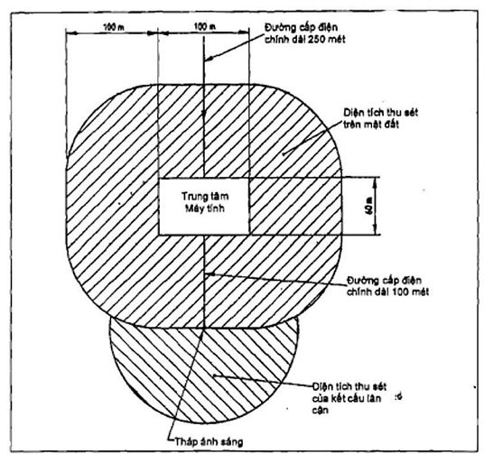

<strong>Hình C.5 — Diện tích thu sét cho công trình và các hạng mục liền kề</strong>

C.7. Phương pháp bảo vệ khi lắp đặt chống sét

C.7.1. Nối đất, liên kết và bình thế

Các yêu cầu nối đất được đề cập ở Điều 13 và 14. Các nội dung dưới đây bổ sung các yêu cầu đó nhằm mục đích san bằng chênh lệch điện thế cho các thiết bị.

Hệ thống kỹ thuật cung cấp cho các công trình có các hệ thống thông tin mở rộng, ví dụ nhà máy công nghiệp, cần liên kết với một thanh liên kết đẳng thế thường ở các dạng tấm kim loại, dây dẫn mạch vòng bên trong, hay dây dẫn mạch vòng riêng phần ở phía trong của bức tường ngoài hoặc theo chu vi khu vực bảo vệ gần mặt đất. Thanh liên kết đẳng thế này được nối với cực nối đất mạch vòng của hệ thống nối đất, ví dụ được minh họa ở Hình C.6.

Tất cả các đường ống kim loại bên ngoài, đường cấp điện, dữ liệu ra và vào công trình tại một điểm được bọc bảo vệ… có thể được nối tới mạng nối đất tại điểm liên kết đơn này (xem Hình 28). Điều này làm giảm thiểu dòng sét xuyên vào trong công trình (xem Hình C.7). Nơi các đường cáp thông tin và cáp điện đi qua các công trình nằm cạnh nhau, hệ thống nối đất cần được nối với nhau và sẽ có lợi nếu có nhiều đường dẫn song song để làm giảm dòng điện trong từng cáp. Hệ nối đất dạng lưới đáp ứng được mục đích này. Ảnh hưởng của dòng điện sét có thể được giảm thiểu hơn nữa bằng cách đi các dây dẫn vào trong các đường ống kỹ thuật và kết hợp các đường ống đó vào hệ nối đất dạng lưới và liên kết với điểm ra vào chung của hệ thống nối đất tạo mỗi đầu. Hình C.6 minh họa một ví dụ về hệ thống nối đất dạng lưới dành cho một cột tháp và công trình có thiết bị gần kề.

Nguyên tắc tương tự như đã áp dụng cho tháp minh họa ở Hình C.6 cũng áp dụng cho các đầu cảm ứng hoặc điều khiển các thiết bị giếng khoan (dầu, nước…). Nơi kết nối có thể bao gồm cả các ống thép của giếng làm giảm khác biệt điện áp giữa giếng và dây dẫn điện. Sự kết nối đó nên được thực hiện đa phương với bất cứ đất nền của công trình khác có cáp thông tin dữ liệu chạy qua.

Công trình liên quan tới các cột thu có thể có sự bảo vệ đặc biệt bởi nó liên quan tới cả nguồn cấp điện.

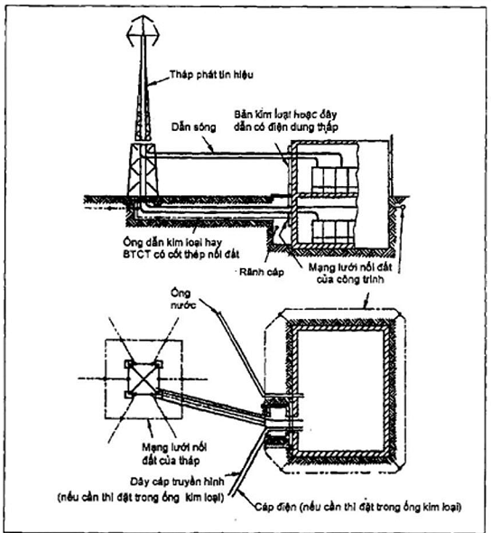

<strong>Hình C.6 — Các dây cáp đi vào công trình tách biệt với ăng ten phát sóng</strong>

a) Đấu nối đất ở điểm đầu vào công trình cho cáp nguồn và máy tính

$\frac{q_{sw,1} Z_1}{R_s A_{s,1}}$

b) Nối đất điểm ra vào các đường ống và cáp ở tường Bêtông cốt thép, nơi cần bảo vệ nhất.

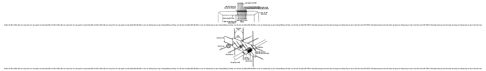

**CHÚ THÍCH:** Giải pháp tương tự như trên được áp dụng cho đường ống và cáp ở vách kim loại.

<strong>Hình C.7 — Liên kết các đường ống và cáp tại điểm ra vào công trình</strong>

C.7.2. Vị trí thiết bị điện tử và cáp

C.7.2.1. Vị trí thiết bị điện tử trong công trình

Lựa chọn vị trí thiết bị điện tử trong công trình phụ thuộc vào xây dựng công trình. Đối với công trình giống như phòng màn chắn, nghĩa là nối mái phủ kim loại với tường, vị trí không quan trọng. Trong công trình khung kim loại thông thường các thiết bị điện tử có thể lắp ở giữa công trình, không nên ở tầng nóc, nhưng cũng có thể lắp ở sát tường ngoài và góc nhà. Đối với công trình bằng vật liệu không dẫn điện với một hệ thống chống sét thì cũng là tương tự. Trong công trình xây bằng các vật liệu không dẫn điện như trong nhà có lắp đặt hệ thống điện tử thì cũng cần lưu ý ví như tránh lắp đặt ở những vị trí các kết cấu cao như ống khói, hoặc nơi sát với đường truyền sét xuống.

C.7.2.2. Vị trí cáp giữa các hạng mục của hệ thống điện tử trong nhà

Hình C.8 và Hình C.9 (minh họa đề xuất nguyên tắc đi dây bên trong. Trong trường hợp khu vực đặt máy tính, hệ thống đi dây nằm trong công trình được kiểm soát chống sét thì không phải là vấn đề nghiêm trọng nhưng dù sao thì vẫn tốt hơn nếu tuân theo các yêu cầu cho nhà có khung kim loại. Nên tránh các vòng kín rộng giữa các nguồn cấp chính và dây lắp đặt điện tử.

Nên đi dây cấp nguồn và cáp của thiết bị điện tử cạnh nhau để giảm thiểu các khu vực tạo ra vòng kín. Nó có thể thực hiện dễ dàng bằng cách sử dụng các ống bao dây cho mỗi loại. Ở Hình C.9 nối đất lưới được sử dụng cục bộ trên các sàn và điểm nối đất chung cho toàn bộ. Đây là hệ thống nối đất hỗn hợp.

Hệ thống đi dây cho thiết bị điện tử không được lắp cùng hệ đỡ với đường nối chống sét. Đi dây có thể ở trên sàn và nên tránh các vòng trên tường đứng. Đi dây trục đứng nên theo như Hình C.9. Bố trí như Hình C.9 có thể sử dụng cho thiết bị đặt theo chiều ngang trong nhà dài.

Đối với công trình xây dựng bằng vật liệu không dẫn điện, bố trí dây được mô tả ở mục phụ này là cần thiết để giảm thiểu các nguy cơ làm hư hại thiết bị, hỏng các dữ liệu. Nơi nào mà việc đi dây không thể áp dụng nguyên tắc như ở điều này thì nên có phương án thay thế.

C.7.3. Bảo vệ đường cáp đi từ ngôi nhà này sang ngôi nhà khác

Nơi mà đường cáp đi giữa các ngôi nhà tách biệt hoặc giữa các đơn nguyên của chúng mà không có các hành lang nối thì cần đặc biệt chú ý bảo vệ.

Nếu có thể, đường cáp quang có thể được sử dụng để cách ly hoàn toàn các mạch điện tử từ nhà máy tới nhà khác. Đây là giải pháp hữu hiệu nhất cho đường truyền đa kênh hoàn toàn độc lập khỏi các vấn đề nhiễm từ, không chỉ có sét. Mặc dầu vậy không nên sử dụng đường cáp quang với lớp bọc kim loại hoặc dây dẫn bên trong.

Nơi mà không chọn dây cáp quang để truyền mà sử dụng các loại dây khác như là dây đồng trục, dây đôi lõi thì cần chú ý phát hiện những hư hại dọc theo tuyến. Hệ thống nối đất của công trình có thể nối sử dụng đường bọc cáp, đường đi dây đi cùng nhiều loại cáp. Nơi mà có nhiều đường dây đi song song thì tốt nhất là điện áp giữa chúng càng chênh ít càng tốt. Thêm nữa đường nối đất có thể nối giữa công trình với công trình.

Nơi cáp đồng trục được lắp đặt giữa các công trình thì lớp vỏ của nó có thể được nối với hệ thống nối đất của công trình tại vị trí vào/ra của ngôi nhà.

Trong một số loại cáp đồng trục hoặc hệ thống chắn, có thể chỉ cần nối cáp xuống đất tại một điểm. Nếu cần thiết cần bố trí các thiết bị bảo vệ quá áp thích hợp.

Nơi chỉ có một hoặc một số lượng nhỏ cáp đi từ công trình này sang công trình khác, như trường hợp đường dữ liệu, đường điện thoại, và nơi không dùng đường cáp quang, cần lắp thiết bị chặn quá áp để tiêu dòng điện sét xuống đất, ví dụ dùng thiết bị dạng ống khí hoặc kẹp bán dẫn chỉ cho dòng có điện áp thích hợp tương đương với điện áp làm việc của thiết bị đi qua. Một hệ thống đặc trưng cho việc nối đất thiết bị chống quá áp được minh họa trên Hình C.10.

Có thể kết hợp giữa các phương pháp trình bày ở mục này, ví dụ dụng thiết bị bảo vệ đối với các đường tín hiệu và thiết bị kết hợp với việc bọc nối các đường cáp để giữ môi trường ở ngưỡng điện áp cho phép. Trừ trường hợp đường cáp quang quá dài, bản thân thiết bị kháng trở cao không đảm bảo trừ phi chúng có thể chịu được điện áp trên 100 kV do sự chênh lệch điện thế lớn giữa các công trình không được bảo vệ do dòng sét truyền dưới đất từ một trong các công trình đó.

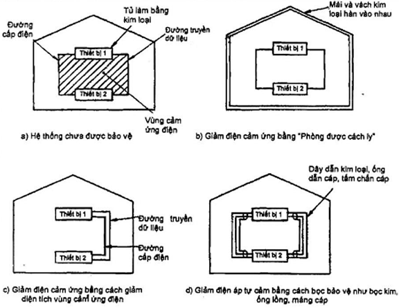

**CHÚ THÍCH:** Các vỏ bọc bảo vệ cần hàn nối ở hai đầu và đảm bảo dẫn điện trên toàn tuyến

<strong>Hình C.8 — Các phương pháp giảm thiểu điện áp cảm ứng</strong>

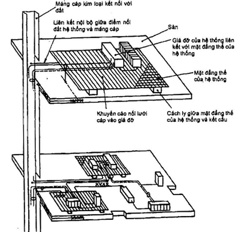

**CHÚ THÍCH 1:** Có thể áp dụng nguyên tắc giảm diện tích mạch vòng đối với thiết bị nằm bên ngoài. Tất cả các liên kết nằm trong một máng cáp để giảm diện tích mạch vòng như ở c) Hình C.8

**CHÚ THÍCH 2:** XXXX minh họa cốt thép hoặc các bộ phận xây dựng bằng kim loại trong sàn

<strong>Hình C.9 — Hệ thống nối đất phức hợp được áp dụng cho thiết bị trong nhà nhiều tầng</strong>

a) Lắp đặt chặn quá dòng không chuẩn gây ra xung lớn

**CHÚ THÍCH:** Các xung này có thể tăng từ tự cảm của đường nối đất đến điểm nối đất B'

b) Khuyến nghị cho việc lắp chặn quá dòng

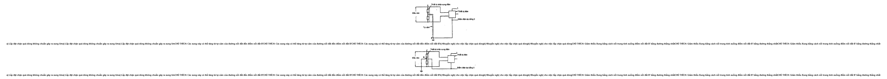

**CHÚ THÍCH:** Giảm thiểu Xung bằng cách nối trung tính xuống điểm nối đất B' bằng đường thẳng nhất

<strong>Hình C.10 — Nối đất từ điểm nối không thiết bị tới điểm nối đất của thiết bị chống quá dòng</strong>

C.7.4. Bảo vệ thiết bị có phần bên ngoài công trình nối vào tháp, cột thu

Cụm thiết bị treo ngoài công trình hoặc nối vào tháp, cột thu sét thì hiện hữu các nguy cơ sau:

a) \- Dòng vào trực tiếp từ các cú sét.

b) \- Dòng cảm ứng và kháng.

C.8. Đặc tính và hiệu ứng của sét

C.8.1. Đặc tính bổ sung của sét liên quan tới thiết bị điện tử

### Bảng C.8 - Chỉ số cực đại của tốc độ tăng di/dt

| Chỉ số cực đại của di/dt kA/s | Mức vượt % |
| :---: | :---: |
| 200 | 1 |
| 30 | 50 |
| 10 | 99 |

Các thông số khác của xung sét là rất quan trọng trong việc đánh giá các khía cạnh gây nguy hại của sét song giá trị cực trị của dòng sét di/dt là một trong các nguyên tắc đánh giá điện áp kháng và trong khoảng thời gian xung là dấu hiệu chỉ số năng lượng sấm. Minh họa dòng sét âm đánh xuống đất xem Hình C.15.

Cảm ứng sét có thể gây ra hai hiệu ứng lên thiết bị điện tử. Phổ biến là thiết bị bị phá hoại bởi 1 cú sét đơn. Hiệu ứng thứ hai là các phần mềm bị phá hủy bởi các xung động của sét. Tổ hợp của các cú sét từ cú đầu tới các cú đánh lặp lại xảy ra trong vòng 1 s đến 2 s là vấn đề đáng phải cân nhắc đối với sự hoạt động của máy tính trừ phi các phép kiểm soát được sử dụng để loại bỏ các kết quả của máy tính trong thời gian vài giây đó.

C.8.2. Điểm sét đánh

Điểm bị sét đánh trên công trình là rất ngẫu nhiên, mặc dù công trình, cây cối cao to thì nguy cơ bị sét có thể nhiều hơn các công trình hay cây cối nhỏ thấp. Tuy vậy sét đánh xuống mặt đất phẳng nằm giữa hai ngôi nhà cao cách nhau hơn hai lần chiều cao của chúng là bình thường.

Trong các nhà máy sản xuất theo dây chuyền, vị trí dễ bị sét có xu hướng là các cột cao đồng thời ít khi đánh vào xưởng thấp. Tuy vậy các bộ phận nằm ngoài góc 45° kể từ điểm cao thì dễ bị sét (xem Hình C.16).

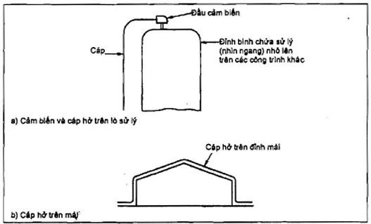

<strong>Hình C.11 — Lắp trực tiếp lên hệ thống điện trần ngoài nhà</strong>

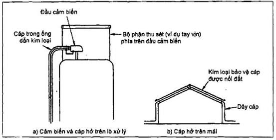

<strong>Hình C.12 — Bảo vệ cho hệ thống trần trực tiếp</strong>

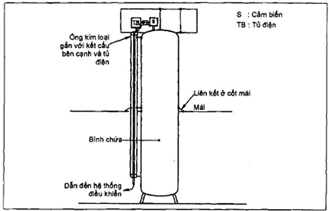

<strong>Hình C.13 — Bảo vệ cáp đi dọc theo các bình chứa cao và liên kết trên mái</strong>

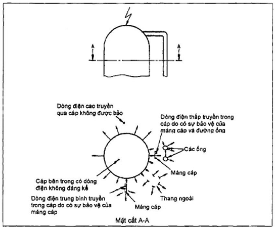

<strong>Hình C.14 — Vị trí các dòng sét cao, trung bình, thấp có thể truyền xuống qua các đường cáp của lò phản ứng</strong>

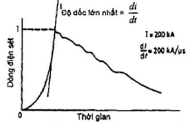

**CHÚ THÍCH:** Sau cú sét đánh ban đầu có thể có nhiều xung điện cường độ thấp hơn và thời gian ngắn hơn gọi là các xung thứ cấp hoặc xung lặp

<strong>Hình C.15 — Đường đặc tính dòng sét âm</strong>

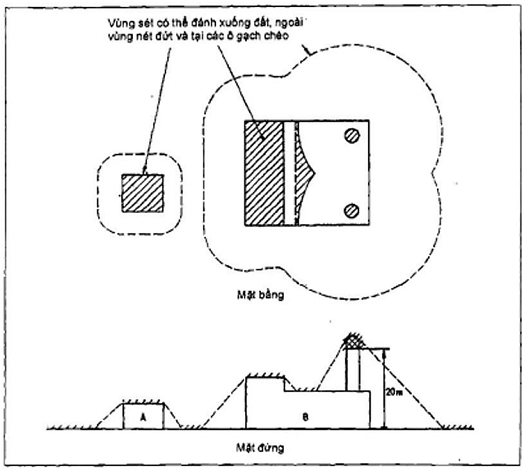

<strong>Hình C.16 — Điểm sét đánh trên công trình</strong>

Trong các công trình cao thì các thiết bị điện tử thường có nguy cơ rủi ro cao đặc biệt, không hẳn nó là điểm rủi ro trực tiếp bắt sét mà còn có các lý do khác như là chúng thường được nối với các hệ thống dây tới các thiết bị khác. Vì thế mà chúng cần phải được bảo vệ cẩn thận.

Các phần, đối tượng dễ bị sét đánh trên công trình được minh họa ở Hình C.16. Đối với nhà cao hơn 20 m góc côn 45° của hệ thống chống sét được cho là quy tắc bảo vệ chống sét tốt. Tuy nhiên đối với nhà, công trình cao trên 20 m phương pháp hình cầu lăn là tốt hơn đối với các khu vực tương tự, đặc biệt là nó hạn chế việc sét đánh vào cạnh bên của công trình. Bán kính hình cầu lăn được khuyến nghị là 20 m. Trong Hình C.16 giả thiết là các thiết bị ở hai nhà A và B được nối với nhau qua các đường cáp. Tuy nhiên có thể thấy sét đánh vào nhà A và một số phần của nhà B cũng như phần mặt đất giữa chúng. Do đó trong từng trường hợp dòng điện trong đất gần với điểm bị sét đánh có thể được nối đất hoặc không đều phải được tính đến và mở rộng phạm vi bảo vệ.

C.9. Sét cảm ứng và nguyên tắc chống

**CHÚ THÍCH:** mục này đề cập tới cơ chế sinh dòng điện cảm ứng, cường độ của nó và cung cấp hướng dẫn việc thiết lập độ an toàn bằng các mức khống chế xung và giới hạn xung thiết kế của thiết bị (TCL/ETDL).

C.9.1. Điện áp cảm kháng

Khi công trình bị sét đánh thì dòng điện đi xuống đất phát triển dải điện áp rộng giữa các bộ phận của công trình, các cấu kiện kim loại và hệ thống chống sét và phần đất ở phía lân cận công trình. Dải điện áp này chính là nguyên nhân sinh ra dòng điện chạy trong các đường cáp dẫn bên ngoài công trình tới vùng đất liền kề. Điện áp được sinh ra là điện áp cảm kháng sơ cấp nhưng ở phần tăng lên nhanh chóng ở dạng sóng sét hiệu ứng truyền dẫn xảy ra ở một phạm vi hẹp hơn.

Bất cứ dòng điện nào chạy trong đường cáp và phần bọc đều là kết quả của điện áp cảm kháng được xông qua dây nối tới thiết bị điện tử với điện áp chung và liền mạch.

C.9.2. Điện áp cảm ứng

Dòng sét chạy trong dây dẫn sét hoặc trong các kênh dẫn vòng cung sinh ra một từ trường thay đổi theo thời gian với khoảng cách đến 100 m tùy thuộc vào cường độ dòng sét. Trường điện từ này sinh ra hai hiệu ứng:

a) \- Một dòng tự cảm điện từ L trong đường dây (ví dụ dây loại đường kính 2 mm L=1 h/m);

b) \- Một vòng tương hỗ ngược chiều trong dây dẫn (cảm dẫn = mt) hoặc vòng kín riêng biệt (cảm tương hỗ);

Trong trường hợp điện áp sinh ra tỷ lệ thuận với di/dt riêng phần bởi L, mt, m (Hình C.17). Đối với dây dẫn đơn thì độ mạnh của trường là tỷ lệ nghịch với khoảng cách của vật dẫn. Đối với trường hợp phức tạp thì tính các giá trị L, mt hay m. Ví dụ dòng sét đi qua dây dẫn xuống các chân nối đất như minh họa ở hình C.4. Điều này rất quan trọng đối với việc tính đến dòng tự cảm của đất tới thiết bị và các thiết bị ngăn ngừa quá điện áp và mạch lưới nối đất.

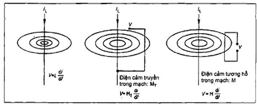

<strong>Hình C.17 — Điện cảm</strong>

C.9.3. Xông dòng từ sét đánh trực tiếp

Các cú sét đánh trực tiếp tới đường dây điện hoặc hệ thống điện cũng như các đầu sensor hoặc tiếp không (xem Hình C.11) có thể xông dòng gây phá hủy. Đây là nguy cơ cần phải được tính đến với việc dây dẫn đi bên ngoài có chiều dài lớn. Việc đi dây trong các ống bảo hộ sẽ làm hạn chế đáng kể tác hại. Điện áp rất cao của sự xông điện gây phá hoại các bộ phận khác của hệ thống, đánh tia lửa điện.

Đó là một phần liên quan tới các bộ phận nhô ra ngoài công trình. Bố trí chúng hợp lý thì tránh được tác hại (xem C.7.4).

C.9.4. Nối trường điện

Độ mạnh của trường phải được tính đến trên toàn bộ diện tích sét đánh trước khi hình thành cú đánh khi mà giá trị của chúng đạt tới ngưỡng ngăn được của không khí (xấp xỉ 500 kV/m).

Sự hình thành giải thoát điểm thay đổi trường xấp xỉ 500 kV/m.s có thể xảy ra. Hiệu ứng của mỗi sự thay đổi thường là không đơn giản khi bảo vệ chúng chống lại hiệu ứng dẫn và cảm sét.

C.9.5. Điện áp do xung điện từ từ sét (lemp) gây ra

Xung điện từ từ sét (lemp) được sinh ra liên quan tới hiện tượng điện từ khác gọi là xung điện từ nguyên tử (nemp). Có hai điểm khác nhau quan trọng trong dải và cường độ của hai hiệu ứng sinh ra, từ nemp sinh ra xung tăng nhanh hơn nhiều (thời gian tăng khoảng 10 ns) với biên độ đứt quãng và nemp chỉ ảnh hưởng tới với hệ thống xung phóng xạ. So với sét thì xung này vô cùng nhỏ. Sét đánh xuống công trình hay đất gần đó thực ra không sinh ra xung điện từ từ sét nhưng tạo ra về nguyên tắc một cặp từ trường đặt gần nhau và sinh ra điện áp từ cảm (và điện áp cảm kháng) như đã mô tả ở C.9.1 và C.9.2.

Các xung trường điện cảm ứng sét trong công trình có chứa thiết bị điện tử thường là không đáng kể. Trong trường hợp hãn hữu các đường dây bên ngoài có thể bị hư hại trừ phi chúng được nối liền mạch hoặc được che chắn sét.

Nói chung tác dụng xấu nhất của xung điện từ từ sét được phòng ngừa bằng cách áp dụng các biện pháp chống sét đánh trực tiếp. Sét đánh trực tiếp sinh ra xung sốc mạnh hơn là xung điện từ từ sét và bảo vệ chống sét đánh trực tiếp vẫn là quan trọng nhất, bảo vệ chống xung điện từ từ sét chỉ là thứ yếu.

C.9.6. Mức khống chế xung (TCL) nguyên tắc giới hạn xung thiết kế của thiết bị (ETDL)

Đối với sự hoạt động của thiết bị điện tử thì môi trường xung quanh lâu dài hay tạm thời đều được thiết kế hệ thống bảo vệ vừa đủ an toàn và kinh tế, đồng thời được nối đất.

Tiêu chí ngăn xung dòng hay xung điện áp được đưa vào khi thử hệ thống. Đây là mức xung lớn nhất cho phép hệ thống vẫn hoạt động, không bị hư hại (gọi là giới hạn xung thiết kế của thiết bị ETDL). Trường hợp sét giá trị này là N vôn của xung mà không gây phá hủy thiết bị. Giới hạn xung thiết kế của thiết bị bằng N vôn. Khi lắp đặt thiết bị thì cần chắc chắn rằng xung trong hệ thống tới thiết bị là P vôn không cao hơn giá trị N vôn của thiết bị. (cho phép sử dụng hệ số điều chỉnh trong tính toán). P vôn gọi là mức khống chế xung, còn hiệu N-P vôn gọi là biên độ an toàn.

Để xác định một thiết bị bảo vệ chống xung quá điện áp cần kiểm soát điện áp xung trong vòng mức khống chế nó là điện áp cho đi qua với mức xấp xỉ mức đã thiết lập. Khi lắp thiết bị thì phải đảm bảo mức khống chế xung của thiết bị phải phù hợp, thiết bị được an toàn trong hệ thống, đồng thời lưu ý nối đất cho thiết bị.

Mặt khác cần lưu ý ngăn ngừa điện áp cảm kháng, tự cảm đáng kể trong bản thân thiết bị.

C.9.7. Các nguyên tắc bảo vệ

Các nội dung C.9.1, C.9.2, C.9.3, C.9.4 và C.9.5 đề cập cơ chế phát sinh dòng điện từ sét. Ngoại trừ trường hợp ăng ten, thiết bị được bảo vệ chống lại điện áp cảm kháng, tự cảm của sét hoặc tác dụng tới công trình sẽ được bảo vệ khỏi trường điện và xung sét.

Việc dòng sét xông vào thiết bị phải được ngăn ngừa bởi nó là nguyên nhân sự phá hoại nghiêm trọng (C.7.4).

Yếu tố chính trong tầm quan trọng của điện áp cảm kháng, tự cảm là cả hai đều được xông với điện trở kháng nguồn thấp từ năng lượng xông cao hơn nhiều lần so với xung điện từ của sét. Vì thế cường độ hay điện áp cảm kháng, cảm ứng cung cấp các thông số cơ bản cho việc đánh giá và chỉ dẫn cho thiết bị bảo vệ.

Hệ thống chống sét có thể bảo vệ chống lại điện áp cao từ sét đánh.

Để thiết bị chống sét đạt được thành công thì các điều kiện sau phải được thỏa mãn:

a) \- Sự tồn tại. Thiết bị bảo vệ có thể cứu được toàn bộ hệ thống khỏi xung điện áp cao thuộc phạm vi của nó.

b) \- Mức khống chế xung. Sự bảo vệ phải có tác dụng ở mức khống chế xung, thấp hơn mức xung thiết kế của thiết bị. Thiết bị bảo vệ chống quá điện áp đó nối tới đường dẫn nối đất có thể tăng đáng kể mức khống chế xung tác dụng.

c) \- Tương thích hệ thống. Bất cứ dạng bảo vệ nào được thêm vào phải không phá vỡ sự hoạt động chung của hệ thống đang được bảo vệ.

Sự quan tâm quan tâm bảo vệ phải được lưu ý đối với hệ thống truyền dữ liệu tốc độ cao.

C.10. Ví dụ tính toán điện áp cảm ứng trong thiết bị

Ví dụ tính toán điện áp cảm ứng bao gồm cả việc sử dụng lớp bọc như là bộ phận nối đất của đường cáp nhiều sợi rải tới công trình.

Lấy ví dụ có tuyến 100 đường cáp bọc nhôm, mỗi đường cáp gồm 65 sợi đường kính 1 mm với điện trở suất 3 x 10$^{-8}$ m, cáp dài 100 m.

Điện trở của mỗi đường cáp sẽ là:

$$R = \frac{\rho xL}{A} = \frac{(3,0 \times 10^{−8 \times 100)}}{65 \times 0,0012 \times  \pi  \times 0,25} = 59m \Omega$$
<!-- formula_id: "F_TCVN_9385_2012_RID143" -->

trong đó:

&nbsp;&nbsp;&nbsp;&nbsp;\- là điện trở suất

&nbsp;&nbsp;&nbsp;&nbsp;\- L là chiều dài cáp

&nbsp;&nbsp;&nbsp;&nbsp;\- A là diện tích tiết diện của lớp bọc

Đối với 100 cáp chạy song song mỗi cáp chịu 1 phần trăm dòng tổng là 100 kA từ phòng máy tính tới thiết bị, dòng trong mỗi cáp là 1 kA.

Bởi thế điện áp chung được tính:

| V | = R x I = 59 x 10$^{-3}$ x 1 x 10$^{3}$ = 59 V |
| :--- | :--- |

Trong thực tế, dòng phân bố trong các cáp là không đều nhưng với sự có mặt của cáp tiếp địa chạy song song, cũng như là cáp nguồn cũng được bọc thì dòng trong cáp của thiết bị sẽ không vượt quá 1 kA với biên độ lớn.

C.11. Ví dụ tính toán việc bảo vệ lõi trong của cáp đồng trục

VÍ DỤ:

Với 20 m cáp bọc được nối hai đầu, 10 % cường độ dòng sét đi qua cáp và bọc cáp có điện trở là 5 /km.

Đối với cú sét 200 kA thì điện áp sinh ra được tính:

V = R x I

= 0,1 x 200 x 10$^{3}$ x 0,1

= 2 000 V

Đối với cú sét 20 kA thì điện áp sinh ra được tính:

V = R x I

= 0,1 x 20 x 10$^{3}$ x 0,1

= 200 V

Điện áp cảm kháng này được dẫn hoàn toàn tới dây bên trong.

Nếu như cáp được đặt trong máng cáp thì dòng điện sẽ chạy trong máng cáp. Trong trường hợp riêng chỉ có 10 % cường độ chạy trong cáp mà thôi.

Đối với cú sét 200 kA thì điện áp sinh ra được tính:

V = R x I

= 0,1 x 200 x 10$^{3}$ x 0,1 x 0,1

= 200 V

Đối với cú sét 20 kA thì điện áp sinh ra được tính:

V = R x I

= 0,1 x 200 x 10$^{3}$ x 0,1 x 0,1

= 20 V

Sự phá hủy đường cáp có thể xảy ra hoặc không theo các ví dụ sau:

&nbsp;&nbsp;\- Nếu như đường cáp là đường dẫn của radio đến ăng ten thì điện áp lớn hơn 2 000 V cũng khó có thể gây phá hủy;

&nbsp;&nbsp;\- Nếu như đường cáp là một phần của đường truyền mạng máy tính, điện áp 2 000 V có thể gây hư hại, điện áp 200 V hoặc 20 V có thể không;

&nbsp;&nbsp;\- Nếu đường cáp là đường nối RS232 thì chỉ chịu được 20 V, điện áp 200 V hay 2 000 V đều có thể gây hư hại.

C.12. Ví dụ tính toán điện áp cảm ứng trong dây dẫn

VÍ DỤ:

Hình 13 cho thấy các giá trị tương đối của dòng trong các cáp riêng lẻ dọc theo hoặc bên trong ống (bình) hoặc các đường dẫn thông thường. Như đã thấy, dòng là hàm của vị trí tương đối tới tháp hoặc các bộ phận kim loại khác. Giá trị của điện áp cảm ứng xấp xỉ các vị trí thay đổi có thể được tính bằng công thức sau:

Đối với cáp được bảo vệ bởi máng, tổng dòng là 400 A, tháp cao 30 m và điện trở suất của cáp là 10 /m:

Tổng điện trở = 30 x 10 x 10$^{-3}$

= 0,3

Điện áp cảm ứng chung:

V = R x I

= 0,3 x 400

= 120 V

Đối với cáp được bảo vệ trong máng cáp và trong ống và tổng dòng bằng 100 A

Điện áp cảm ứng chung:

V = R x I

= 0,3 x 100

= 30 V

Đối với cáp đi trong bình hoặc trong xi lanh kim loại thì điện áp cảm ứng là không đáng kể

C.13. Thiết bị bảo vệ chống xung, vị trí lắp đặt và thử

C.13.1. Vị trí lắp đặt

C.13.1.1. Giới thiệu chung

Như xung chính được mô tả là dao động điện áp 1,2/50 s sinh ra trong công trình, cường độ dòng điện có thể được giảm bớt. Nó được mô tả bởi ba loại vị trí C, B, và A. Loại C là đặt ở bảng điện cấp vào, loại B là đặt ở mạng phân phối chính, loại A là đặt ở phía phụ tải tiêu thụ.

Trong các vị trí đưa ra ở trên, mức độ nghiêm trọng của xung được tính đến là sẽ tăng dần theo nguy cơ rủi ro tăng cao. Điều này được mô tả là bởi đại lượng mức độ phá hủy hệ thống xuất phát từ việc đánh giá rủi ro.

C.13.1.2. Cáp truyền tín hiệu dữ liệu

Tất cả các thiết bị chống xung đường truyền dữ liệu đều thuộc loại vị trí C như là một cái làm giảm thấp xung điện áp 10/700 s được dùng tương ứng với xung của đường dữ liệu không được làm giảm nhẹ bởi đường cáp ở vùng tương tự như xung chính.

C.13.1.3. Nguồn chính

C.13.1.3.1. Loại vị trí C

Thiết bị bảo vệ chống xung được lắp đặt ở các vị trí như sau đây thì thuộc loại C:

&nbsp;&nbsp;\- Trên đầu cấp của nguồn vào bảng phân phối;

&nbsp;&nbsp;\- Trên đầu tải đi ra;

&nbsp;&nbsp;\- Phía ngoài công trình.

C.13.1.3.2. Loại vị trí B

Thiết bị bảo vệ chống xung được lắp đặt ở các vị trí như sau đây thì thuộc loại B:

&nbsp;&nbsp;\- Trên hệ thống phân phối, giữa bên phụ tải từ bảng phân phối chính tới và phía cấp tới các đầu nối, ổ cắm;

&nbsp;&nbsp;\- Trong thiết bị;

&nbsp;&nbsp;\- Phía phụ tải của ổ cắm, cầu chì không quá 20 m so với loại vị trí C.

C.13.1.3.3. Loại vị trí A

Thiết bị bảo vệ được lắp ở phía phụ tải từ cầu chì, ổ cắm với khoảng cách nối trên 20 m so với loại C.

C.13.2. Độ mạnh xoay chiều đại diện cho thiết bị quá điện áp thử nghiệm

Mức xấp xỉ của phép thử được cho trong các bảng C.8, C.9, C.10 cho các loại vị trí khác nhau và mức độ thử của thiết bị bảo vệ chống quá áp trong phép thử.

### Bảng C.8 - Loại vị trí (trục)

| Mức độ thử | Điện áp (kV) | Dòng (A) |
| :--- | :---: | :---: |
| Thấp | 2 | 166,7 |
| Trung bình | 4 | 333,3 |
| Cao | 6 | 500 |

### Bảng C.9 - Loại vị trí B (trục)

| Mức độ thử | Điện áp (kV) | Dòng (kA) |
| :--- | :---: | :---: |
| Thấp | 2 | 1 |
| Trung bình | 4 | 2 |
| Cao | 6 | 3 |

### Bảng C.10 - Loại vị trí C (trục)

| Mức độ thử | Điện áp (kV) | Dòng (A) |
| :--- | :---: | :---: |
| Thấp | 6 | 3 |
| Trung bình | 10 | 5 |
| Cao | 20 | 10 |

C.13.3. Thử thiết bị bảo vệ quá điện áp

Máy phát thử cho loại vị trí B và C là máy phát xoay chiều liên hợp, có thể phát được điện áp 1,2/50 s và dòng xoay chiều 8/20 s. Đối với loại vị trí A, một bộ ngăn không cảm ứng đầu ra được lắp để giới hạn dòng ở giá trị hợp lý. Dòng ngắn sẽ không nhỏ hơn 8/20 s.

Phương pháp thử đối với thiết bị chống quá áp được đề cập ở Điều 23 của UL 1449:1985.

C.13.4. Cường độ xoay chiều đại diện cho ngưỡng thử đường dữ liệu

Mức thử hợp lý được lựa chọn theo Bảng C.11 cho độ thử và thiết bị được chọn.

### Bảng C.11 - Loại vị trí C (đường dữ liệu)

| Mức độ thử | Dòng thử xung cao kA | Thử xông qua điện áp — Điện áp (kV) | Thử xông qua điện áp — Dòng (A) |
| :--- | :---: | :---: | :---: |
| Thấp | 2,5 | 1,5 | 37,5 |
| Trung bình | 5 | 3 | 75 |
| Cao | 10 | 5 | 125 |

C.13.5. Thử nghiệm thiết bị chống quá điện áp đường truyền dữ liệu

C.13.5.1. Phép thử sóng xung dòng cao

Máy phát sóng hỗn hợp mô tả ở C.13.3 là phù hợp cho các phép thử này.

Phương pháp thử cho trong 5.6 của tiêu chuẩn ITU-T K.12 (2000).

C.13.5.2. Thử xông qua điện áp

Phương pháp thử tham khảo trong 23.3 của UL 1449:1985.

C.13.6. Thông tin được cung cấp bởi nhà sản xuất cho sản phẩm thiết bị chống quá điện áp

C.13.6.1. Thông tin về dạng xung

Nhà sản xuất thiết bị được yêu cầu cung cấp các thông tin về dạng xung như sau:

&nbsp;&nbsp;\- Điện áp xông, như là 850 V, tất cả các chế độ, thử 6 kV, 1,2/50 s, 3 kA 8/20 s;

&nbsp;&nbsp;\- Chế độ bảo vệ, ví dụ như đường nối đất, đường nối trung tính, trung tính tới đất đối với trục hay đường tới đường hay đường tới đất đối với cáp dữ liệu;

&nbsp;&nbsp;\- Dòng xung cực đại, ví dụ như 20 000 A , 8/20 s;

**CHÚ THÍCH:** Giá trị thử đối với thiết bị là thực chứ không dùng giá trị lý thuyết.

Làm yếu hệ thống. Nếu như thiết bị này làm yếu sự hoạt động của hệ thống sau khi bị xung đã đi qua thì tất cả các hiệu ứng của nó phải được ghi rõ.

Đường đường ống cấp gas được sử dụng như thiết bị chống quá điện áp được nối tắt với nguồn chính thì nó bị ngắn mạch khi hoạt động. Dòng điện cường độ lớn đi qua có thể phá hủy đường cấp điện cũng như đường ống cấp gas.

C.13.6.2. Thông tin ở trạng thái tĩnh

Nhà sản xuất thiết bị chống quá điện áp được yêu cầu cung cấp các thông tin dạng tĩnh như sau:

&nbsp;&nbsp;\- Điện áp làm việc;

&nbsp;&nbsp;\- Điện áp làm việc tối đa;

&nbsp;&nbsp;\- Dòng hở;

&nbsp;&nbsp;\- Chỉ số dòng;

&nbsp;&nbsp;\- Các yếu tố làm yếu hệ thống.

&nbsp;&nbsp;\- Bất cứ yếu tố nào có thể gây ảnh hưởng, ví dụ như:

&nbsp;&nbsp;\- Trở kháng trên mạch;

&nbsp;&nbsp;\- Điện dung phân nhánh;

&nbsp;&nbsp;\- Độ rộng dải tần;

&nbsp;&nbsp;\- Tỷ số sóng điện áp;

&nbsp;&nbsp;\- Hệ số phản xạ.

C.13.7. Máy phát sóng hỗn hợp

C.13.7.1. Giới thiệu chung

Sơ đồ đơn giản của máy phát minh họa ở Hình C.18

Giá trị các thành phần vi phân $R_{s1}$, $R_{s2}$, $R_{m}$, $L_{r}$ và $C_{c}$ được xác định khi máy phát mang một xung điện áp 1,2/50 s, và một xung dòng 8/20 s tới mạch ngắn, nghĩa là máy đã có trở kháng hiệu quả là 2 .

Để thuận tiện thì một trở kháng đầu ra hiệu quả được định nghĩa cho máy phát xung dựa trên việc tính toán tỷ số của điện áp cực trị mạch hở và dòng cực trị ngắn mạch. Một máy phát như thế có điện áp mở là 1,2/50 s và dòng ngắn mạch là 8/20 s được coi là máy phát xoay chiều liên hợp.

### Bảng C.12 - Định nghĩa thông số xoay chiều 1,2/50 s

| Định nghĩa | Theo BS 923-2 — Thời gian trước s | Theo BS 923-2 — Thời gian của giá trị bán phần s | Theo BS 5698-1 — Thời gian tăng từ 10 % lên 90 % s | Theo BS 5698-1 — Khoảng thời gian 50 % đến 50 % s |
| :--- | :---: | :---: | :---: | :---: |
| Điện áp mạch hở | 12 | 50 | 1 | 50 |
| Dòng ngắn mạch | 8 | 20 | 6,4 | 16 |

> **CHÚ THÍCH:** Các dạng sóng 1,2/50 s và 8/20 s được định nghĩa trong BS 923-2 và minh họa ở Hình C.19 và C.20. Nhiều khuyến cáo gần đây lại dựa trên định nghĩa về dạng sóng theo BS 5698-1 như thể hiện trên Bảng C.12. Cả hai định nghĩa trên đều áp dụng được đối với tiêu chuẩn này và đều tham chiếu đến máy phát sóng đơn.

C.13.7.2. Đặc tính và định dạng của máy phát sóng hỗn hợp

Điện áp ra mạch hở: từ 0,5 kV đến 6 kV thử cho loại B, 20 kV thử cho loại C

Biểu đồ: xem hình C.19, Bảng C.12

Dòng ngắn: từ 0,25 đến 3,0 kA thử cho loại B, 10 kA thử cho loại C

Biểu đồ dòng: xem Hình C.20 và Bảng C.12

Cực: dương/âm

Pha chuyển: trong dải từ 0° đến 360°

Chỉ số lặp: ít nhất 1 lần mỗi phút

**CHÚ THÍCH:** U là nguồn cao áp $R_{C}$ là điện trở thay đổi

$C_{C}$     là tụ điện tích $điệnR_{s}$ là điện trở định dạng độ dài xung

$R_{m}$ là điện trở phối hợp trở kháng    $L_{r}$ là cuộn cảm định dạng thời gian nâng

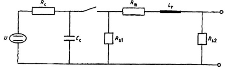

<strong>Hình C.18 — Sơ đồ mạch điện đơn giản của máy phát điện trộn sóng điện từ</strong>

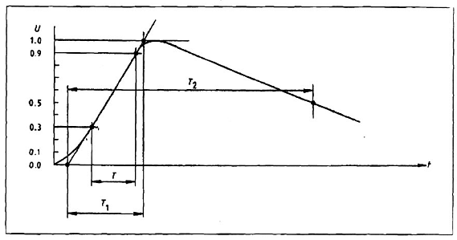

<strong>Hình C.19 — Dạng sóng của điện áp mạch hở</strong>

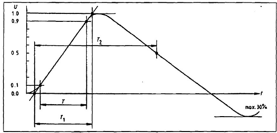

<strong>Hình C.20 — Dạng sóng của dòng ngắn mạch</strong>

