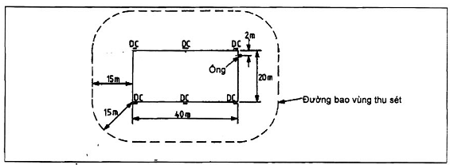

## PHỤ LỤC D (Tham khảo) — Một số ví dụ tính toán

D.1. Ví dụ tính toán xác suất sét đánh tổng hợp

VÍ DỤ 1:

Một bệnh viện thuộc tỉnh Nam Định cao 10 m và chiếm một diện tích là 10 x 12 (m). Bệnh viện xây dựng ở vùng đồng bằng, ở khu vực có ít công trình khác hoặc cây xanh có chiều cao tương đương. Kết cấu công trình bằng Bê tông cốt thép với mái không phải bằng kim loại.

Để xác định rằng liệu có cần đến hệ thống chống sét hay không, tính hệ số rủi ro tổng hợp như sau:

a) \- Số vụ sét đánh trên 1 $km^{2}$ trong 1 năm: Trên cơ sở bản đồ mật độ sét đánh cho ở Hình 2 và hướng dẫn ở 7.2 xác định được giá trị $N_{g}$ là 8,2 lần sét đánh xuống đất trên 1 $km^{2}$ trong một năm.

b) \- Diện tích thu sét: Sử dụng công thức (1) ở 7.2, diện tích thu sét $A_{c}$ ($m^{2}$) được tính như sau:

$A_{c}$ = LW + 2LH + 2WH + $H^{2}$

= (70 x 12) + 2(10 x 10) + 2(12 x 10) + ( x 100)

= 840 + 1 400 + 240 + 314

= 2 794 $m^{2}$

c) \- Xác suất sét đánh: Sử dụng công thức (2) trong 7.2 xác suất sét đánh trong một năm, p là:

P = $A_{c}$ x $N_{g}$ x 10$^{-6}$

= 2 794 x 8,2 x 10$^{-6}$

= 22,9 x 10$^{-3}$

d) \- Sử dụng các hệ số điều chỉnh: Các hệ số sau lần lượt được áp dụng:

&nbsp;&nbsp;&nbsp;&nbsp;\- Hệ số A = 1,7

&nbsp;&nbsp;&nbsp;&nbsp;\- Hệ số B = 0,4

&nbsp;&nbsp;&nbsp;&nbsp;\- Hệ số C = 1,7

&nbsp;&nbsp;&nbsp;&nbsp;\- Hệ số D = 1,0

&nbsp;&nbsp;&nbsp;&nbsp;\- Hệ số E = 0,3

Tích các hệ số = A x B x C x D x E

= 1,7 x 1,0 x 1,7 x 2,0 x 0,3

= 0,35

Xác suất sét đánh tổng hợp là: 22,9 x 0,35 x 10$^{-3}$ = 8,0 x 10$^{-3}$

Kết luận: Cần lắp đặt hệ thống chống sét.

D.2. Ví dụ tính toán về liên kết các chi tiết kim loại với hệ thống chống sét

Dưới đây là ví dụ tính toán để quyết định có hay không liên kết các chi tiết kim loại với hệ thống chống sét.

VÍ DỤ 2:

Tình huống: một ống thép đúc thẳng đứng được bố trí cách dây xuống của hệ thống chống sét 2 m được lắp đặt ở chung cư cao 15 m tại thị xã Bắc Ninh, trong 1 năm có 8,2 lần sét đánh xuống/$km^{2}$. Diện tích của tòa nhà là 40 x 20 (m) (xem Hình D.1).

<strong>Hình D.1 — Mặt bằng vùng thu sét</strong>

Giả thiết: giả thiết rằng mức rủi ro chấp nhận $p_{0}$ = 10$^{-5}$, điện trở của cực nối đất là 10 , và số lượng dây xuống là 6.

Vấn đề đặt ra: Hãy quyết định có hay không nên liên kết cái ống thép đó có chiều cao lớn nhất là 12 m với hệ thống chống sét.

Trình tự: mặt bằng vùng được chọn đã cho là:

L = 40 m, W = 20 m, H = 15 m.

Diện tích thu sét: Xác định theo phương trình (1):

$A_{e}$ = LW + 2LH + 2WH + $H^{2}$

= (40 x 20) + 2(40 x 15) + 2(20 x 15) + ( x 225)

= 800 + 1 200 + 600 + 707

$A_{e}$ = 3 307 $m^{2}$ (làm tròn 3 300 $m^{2}$)

Xác suất bị sét đánh. Xác định theo phương trình (2):

P = $A_{e}$ x $N_{g}$ x 10$^{-6}$

= 3 300 x 8,2 x 10$^{-6}$

P = 27,06 x 10$^{-3}$ lần bị sét đánh trong 1 năm

(làm tròn 27 x 10$^{-3}$ hoặc 1 lần trong 37 năm)

Xác định dòng điện trong tia sét

$$\frac{p}{p_{0}} = \frac{\left(4 \times 10^{−3}\right)}{10^{−5}}$$
<!-- formula_id: "F_TCVN_9385_2012_RID149" -->

= 27 x 10$^{2}$

= 2 700

Vì p lớn hơn 100$p_{0}$ nên giả thiết dòng điện sét lớn nhất là 200 kA (xem Hình 25).

**CHÚ THÍCH:** Với giá trị $\frac{p}{p_{0}}$ nhỏ hơn 100, cường độ dòng điện đó sẽ là 100 $log_{10}\frac{p}{p_{0}}$ như thể hiện trong Hình 25.

Điện áp giữa hệ thống chống sét và ống nối đất ở chiều cao 12 m. Có 2 trường hợp xảy ra, với ống kim loại có liên kết và với ống kim loại không liên kết với cực nối đất, như sau:

A) \- Ống liên kết với cực nối đất. Điện áp kháng có thể được bỏ qua và điện áp giữa hệ thống chống sét và ống nối đất bằng điện áp tự cảm (V = $V_{L}$).

Giả thiết có 6 dây xuống (n = 6), mỗi dãy xuống có kích thước 25 x 3 (mm), bán kính hiệu dụng $r_{e}$ = 0,008 m, chiều dài mạch l = 12 m và S = 2 m, nếu các giá trị này được đưa vào phương trình (4) và (6) thì $V_{L}$ được tính như sau:

$V_{L}$ = 200 x 10$^{3}$ x 12 x $\frac{0,46log_{10}\left(2/0.008\right)}{6}$ = 440 kV

Theo Hình 27, khoảng cách 0,85 m là cần thiết, cộng với 30 % khi tính đến vị trí góc sẽ ra tổng là 1,1 m. Khoảng cách thực tế là 2 m, do đó việc liên kết là không cần thiết ở điểm cao nhất của ống.

B) \- Ống nối đất nhưng không liên kết ống và cực nối đất. Tổng điện áp duy trì bởi hệ thống chống sét (V) được tính như sau:

V = $V_{R}$ + $V_{L}$

Trong đó

&nbsp;&nbsp;&nbsp;&nbsp;\- $V_{R}$ là điện áp kháng phát sinh trong hệ thống mạng nối đất.

&nbsp;&nbsp;&nbsp;&nbsp;\- $V_{L}$ được lấy giá trị như trong trường hợp a) mà $V_{R}$ được tính thêm vào như sau:

&nbsp;&nbsp;&nbsp;&nbsp;\- $V_{R}$ = $\frac{200 \times 10^{3}}{6}$ x 10 x 6 (do mỗi cực nối đất có thể có một điện trở () là n x 10)

&nbsp;&nbsp;&nbsp;&nbsp;\- $V_{R}$ = 2 MV

&nbsp;&nbsp;&nbsp;&nbsp;\- V = 2+0,44 = 2,44 MV

&nbsp;&nbsp;&nbsp;&nbsp;\- Từ Hình 27, khoảng cách 6 m là cần thiết với điện áp như trên và do đó ống cần được liên kết với hệ thống chống sét ở điểm cao nhất hoặc thấp nhất để khử điện áp kháng. Phần tính toán ở trên chứng tỏ điện áp tạo ra bởi hiệu ứng lan truyền sét phụ thuộc chủ yếu vào số lượng dây xuống và độ lớn điện trở đất.

Khi khoảng cách 2 m (bằng khoảng cách ly S) được sử dụng để đánh giá điện áp phóng điện từ Hình 27, nó có nghĩa là cự ly gần nhất của chi tiết kim loại kết nối với ống đến các chi tiết kim loại kết nối với dây xuống là 2 m. Nếu ống có khoảng cách ly 2 m với dây xuống như trong trường hợp này nhưng thêm vào đó nó có nhánh đi gần với điểm cao nhất của dây xuống trong phạm vi 1 m, thì khoảng cách 1 m phải được kiểm tra theo Hình 27 với điện áp do sét tạo ra để bảo đảm rằng có khoảng cách ly thích hợp.
