# TIÊU CHUẨN QUỐC GIA

**TCVN 9385:2012**

BS 6651:1999

CHỐNG SÉT CHO CÔNG TRÌNH XÂY DỰNG - HƯỚNG DẪN THIẾT KẾ, KIỂM TRA VÀ BẢO TRÌ HỆ THỐNG

Protection of structures against lightning - Guide for design, inspection and maintenance

## Lời nói đầu

**TCVN 9385:2012 được chuyển đổi từ TCXDVN 46:2007 thành Tiêu chuẩn Quốc gia theo quy định tại khoản 1 Điều 69 của Luật Tiêu chuẩn và Quy chuẩn kỹ thuật và điểm b khoản 2 Điều 7 Nghị định số 127/2007/NĐ-CP ngày 1/8/2007 của Chính phủ quy định chi tiết thi hành một số điều của Luật Tiêu chuẩn và Quy chuẩn kỹ thuật.**

**TCVN 9385:2012 do Viện Khoa học Công nghệ Xây dựng - Bộ Xây dựng biên soạn, Bộ Xây dựng đề nghị, Tổng cục Tiêu chuẩn Đo lường Chất lượng thẩm định, Bộ Khoa học và Công nghệ công bố.**

CHỐNG SÉT CHO CÔNG TRÌNH XÂY DỰNG - HƯỚNG DẪN THIẾT KẾ, KIỂM TRA VÀ BẢO TRÌ HỆ THỐNG

Protection of structures against lightning - Guide for design, inspection and maintenance

---

1. Phạm vi áp dụng

1.1. Tiêu chuẩn này đưa ra những chỉ dẫn thiết kế, kiểm tra và bảo trì hệ thống chống sét cho các công trình xây dựng. Tiêu chuẩn này cũng đưa ra những chỉ dẫn cho việc chống sét đối với các trường hợp đặc biệt như kho chứa chất nổ, những công trình tạm như cần cẩu, khán đài bằng kết cấu khung thép, và các chỉ dẫn chống sét cho các hệ thống lưu trữ dữ liệu điện tử.

1.2. Tiêu chuẩn này không áp dụng cho các công trình khai thác dầu, khí trên biển, các công trình đặc biệt hay áp dụng các công nghệ chống sét khác.

2. Tài liệu viện dẫn

Các tài liệu viện dẫn sau là cần thiết cho việc áp dụng tiêu chuẩn này. Đối với các tài liệu viện dẫn ghi năm công bố thì áp dụng phiên bản được nêu. Đối với các tài liệu viện dẫn không ghi năm công bố thì áp dụng phiên bản mới nhất, bao gồm cả các sửa đổi, bổ sung (nếu có).

BS 7430:1998, Code of practice for earthing.

BS 923-2:1980, Guide on high-voltage testing techniques.

BS 5698-1, Guide to pulse techniques and apparatus - Part 1: Pulse terms and definitions.

UL 1449:1985, Standard for safety for transient voltage surge suppressors.

ITU-T K.12 (2000), Characteristics of gas discharge tubes for the protection of telecommunications installations.

3. Thuật ngữ và định nghĩa

3.1. Hệ thống chống sét (Lightning protection system)

Toàn bộ hệ thống dây dẫn được sử dụng để bảo vệ một công trình khỏi tác động của sét đánh.

3.2. Bộ phận thu sét (Air termination network)

Một bộ phận của hệ thống chống sét nhằm mục đích thu hút sét đánh vào nó.

3.3. Mạng nối đất (Earth termination network)

Một bộ phận của hệ thống chống sét nhằm mục đích tiêu tán dòng điện sét xuống đất.

3.4. Dây xuống (Down conductor)

Dây dẫn nối bộ phận thu sét và mạng nối đất.

3.5. Cực nối đất (Earth electrode)

Bộ phận hoặc nhóm các bộ phận dẫn điện có tiếp xúc với đất và có thể truyền dòng điện sét xuống đất.

3.6. Cực nối đất mạch vòng (Ring earth electrode)

Cực nối đất tạo ra một vòng khép kín xung quanh công trình ở dưới hoặc trên bề mặt đất, hoặc ở phía dưới hoặc ngay trong móng của công trình.

3.7. Cực nối đất tham chiếu (Reference earth electrode)

Cực nối đất có thể tách hoàn toàn khỏi mạng nối đất để dùng vào mục đích đo đạc kiểm tra.

3.8. Điện cảm tự cảm (Self-inductance)

Đặc trưng của dây dẫn hoặc mạch tạo ra trường điện từ ngược khi có dòng điện thay đổi truyền qua chúng.

Điện cảm tự cảm của một dây dẫn hoặc mạch tạo ra thế điện động được tính từ công thức:

$$V = L\frac{di}{dt}$$
<!-- formula_id: "F_TCVN_9385_2012_RID4" -->

$$\dots \qquad (1)$$
<!-- formula_id: "F_TCVN_9385_2012_FORMULA_1" -->

trong đó:

| V | là trường điện từ ngược tính bằng vôn (V); |
| :--- | :--- |
| L | là điện cảm tự cảm tính bằng Henri (H); |
| $\frac{di}{dt}$ | là tốc độ thay đổi dòng tính bằng Ampe trên giây (A/s). |

3.9. Điện cảm tương hỗ (Mutual-inductance)

Đặc trưng của mạch ở đó một điện áp được tạo ra trong một vòng kín bởi một dòng điện thay đổi trong một dây dẫn độc lập.

Điện cảm tương hỗ của một vòng kín tạo ra một điện áp tự cảm được tính như sau:

$$V = M\frac{di}{dt}$$
<!-- formula_id: "F_TCVN_9385_2012_RID8" -->

$$\dots \qquad (2)$$
<!-- formula_id: "F_TCVN_9385_2012_FORMULA_2" -->

trong đó:

| V | là điện áp tự cảm trong vòng kín tính bằng vôn (V); |
| :--- | :--- |
| M | là điện cảm tương hỗ tính bằng Henri (H); |
| $\frac{di}{dt}$ | là tốc độ thay đổi dòng trong một dây dẫn độc lập tính bằng Ampe trên giây (A/s). |

3.10. Điện cảm truyền dẫn (Transfer-inductance)

Đặc trưng của mạch ở đó một điện áp được tạo ra trong một vòng kín bởi một dòng điện thay đổi trong một mạch khác mà một phần của nó nằm trong vòng kín.

Điện cảm truyền dẫn của một vòng kín tạo ra một điện áp tự cảm được tính như sau:

$$V = M_{t}\frac{di}{dt}$$
<!-- formula_id: "F_TCVN_9385_2012_RID11" -->

$$\dots \qquad (3)$$
<!-- formula_id: "F_TCVN_9385_2012_FORMULA_3" -->

trong đó:

| V | là điện áp tự cảm trong vòng kín tính bằng vôn (V); |
| :--- | :--- |
| Mt | là điện cảm truyền dẫn tính bằng Henri (H); |
| $\frac{di}{dt}$ | là tốc độ thay đổi dòng trong một mạch khác tính bằng Ampe trên giây (A/s). |

3.11. Vùng bảo vệ (Zone of protection)

Thể tích mà trong đó một dây dẫn sét tạo ra khả năng chống sét đánh thẳng bằng cách thu sét đánh vào nó.

4. Quy định chung

4.1. Các hướng dẫn trong tiêu chuẩn này mang tính tổng quát, khi áp dụng vào một hệ thống chống sét cụ thể cần xem xét tới các điều kiện thực tế liên quan đến hệ thống đó. Trong những trường hợp đặc biệt khó khăn thì cần tham khảo ý kiến của các chuyên gia.

4.2. Trước khi tiến hành thiết kế chi tiết một hệ thống chống sét, cần phải quyết định xem công trình có cần chống sét hay không, nếu cần thì phải xem xét điều gì đặc biệt có liên quan đến công trình (xem Điều 7 và Điều 8).

4.3. Cần kiểm tra công trình hoặc nếu công trình chưa xây dựng thì kiểm tra hồ sơ bản vẽ và thuyết minh kỹ thuật theo các yêu cầu về phòng chống sét được quy định ở tiêu chuẩn này.

4.4. Đối với những công trình không có các chi tiết bằng kim loại phù hợp thì cần phải đặc biệt quan tâm tới việc bố trí tất cả các bộ phận của hệ thống chống sét sao cho vừa đáp ứng yêu cầu chống sét vừa không làm ảnh hưởng đến thẩm mỹ của công trình.

4.5. Đối với các công trình xây dựng có đa phần kết cấu bằng kim loại thì nên sử dụng các bộ phận bằng kim loại đó trong hệ thống chống sét để làm tăng số lượng các bộ phận dẫn sét. Như thế vừa tiết kiệm kinh phí cho hệ thống chống sét lại không làm ảnh hưởng đến thẩm mỹ của công trình. Tuy nhiên, khi sét đánh vào phần kim loại, đặc biệt đối với kim loại được sơn mạ, có thể phá hủy các lớp sơn mạ ngoài kim loại; đối với khối xây có cốt thép có thể gây đổ khối xây. Có thể giảm thiểu rủi ro trên bằng giải pháp sử dụng hệ thống chống sét được cố định trên bề mặt công trình.

4.6. Những kết cấu kim loại thường được sử dụng như một bộ phận trong hệ thống chống sét gồm có khung thép, cốt thép trong bê tông, các chi tiết kim loại của mái, ray để vệ sinh cửa sổ trong nhà cao tầng.

4.7. Toàn bộ công trình phải được bảo vệ bằng một hệ thống chống sét kết nối hoàn chỉnh với nhau, không có bộ phận nào của công trình được tách ra để bảo vệ riêng.

5. Chức năng của hệ thống chống sét

Chức năng của hệ thống thu và dẫn sét là thu hút sét đánh vào nó rồi chuyển dòng điện do sét tạo ra xuống đất một cách an toàn, tránh sét đánh vào các phần kết cấu khác cần được bảo vệ của công trình. Phạm vi thu sét của một hệ thống thu và dẫn sét không cố định nhưng có thể coi là một hàm của mức độ tiêu tán dòng điện sét. Bởi vậy phạm vi thu sét là một đại lượng thống kê.

Mặt khác, phạm vi thu sét ít bị ảnh hưởng bởi cách cấu tạo hệ thống thu và dẫn sét, cho nên sự sắp đặt theo chiều ngang và chiều thẳng đứng là tương đương nhau. Do đó không nhất thiết phải sử dụng các đầu thu nhọn hoặc chóp nhọn, ngoại trừ việc đó là cần thiết về mặt thực tiễn.

6. Vật liệu và kích thước

6.1. Vật liệu

Khi lựa chọn vật liệu, cần xem xét nguy cơ bị ăn mòn bao gồm ăn mòn điện hóa. Đối với việc bảo vệ dây dẫn, cần chú ý lớp bảo vệ chống lại sự ăn mòn trong môi trường khắc nghiệt, ví dụ:

a) \- Phủ dây dẫn bằng chì dày ít nhất 2 mm trên đỉnh ống khói. Bọc chì cả hai đầu và tại các điểm đấu nối;

b) \- Nếu có thể thì bộ phận thu sét nên để trần, nếu không có thể dùng lớp PVC mỏng 1 mm để bọc trong trường hợp cần chống gỉ (đặc biệt đối với vật liệu nhôm).

Tiết diện của các mối nối trong có thể bằng khoảng một nửa mối nối ngoài (xem 12.10.2).

6.2. Kích thước

Kích thước của các bộ phận hợp thành trong một hệ thống chống sét cần đảm bảo các yêu cầu nêu trong Bảng 1 và Bảng 2. Độ dày của các tấm kim loại sử dụng trên mái nhà và tạo thành một phần của hệ thống chống sét cần đảm bảo yêu cầu trong Bảng 3.

### Bảng 1 - Vật liệu, cấu tạo và tiết diện tối thiểu của kim thu sét, dây dẫn sét, dây xuống và thanh chôn dưới đất.

| Vật liệu | Cấu tạo | Tiết diện tối $thiểu^{a}$ ($mm^{2}$) | Ghi chú |
| :--- | :--- | :---: | :--- |
| Đồng | Dây dẹt đặc | 50 | Chiều dày tối thiểu 2 mm |
| Đồng | Dây tròn $đặc^{e}$ | 50 | Đường kính 8 mm |
| Đồng | Cáp | 50 | Đường kính tối thiểu của mỗi sợi 1,7 mm |
| Đồng | Dây tròn $đặc^{f,g}$ | 200 | Đường kính 16 mm |
| Đồng phủ $thiếc^{b}$ | Dây dẹt đặc | 50 | Chiều dày tối thiểu 2 mm |
| Đồng phủ $thiếc^{b}$ | Dây tròn $đặc^{e}$ | 50 | Đường kính 8 mm |
| Đồng phủ $thiếc^{b}$ | Cáp | 50 | Đường kính tối thiểu của mỗi sợi 1,7 mm |
| Đồng phủ $thiếc^{b}$ | Dây tròn $đặc^{f,g}$ | 200 | Đường kính 16 mm |
| Nhôm | Dây dẹt đặc | 70 | Chiều dày tối thiểu 3 mm |
| Nhôm | Dây tròn đặc | 50 | Đường kính 8 mm |
| Nhôm | Cáp | 50 | Đường kính tối thiểu của mỗi sợi 1,7 mm |
| Hợp kim nhôm | Dây dẹt đặc | 50 | Chiều dày tối thiểu 2,5 mm |
| Hợp kim nhôm | Dây tròn đặc | 50 | Đường kính 8 mm |
| Hợp kim nhôm | Cáp | 50 | Đường kính tối thiểu của mỗi sợi 1,7 mm |
| Hợp kim nhôm | Dây tròn $đặc^{f}$ | 200 | Đường kính 16 mm |
| Thép mạ $kẽm^{c}$ | Dây dẹt đặc | 50 | Chiều dày tối thiểu 2,5 mm |
| Thép mạ $kẽm^{c}$ | Dây tròn đặc | 50 | Đường kính 8 mm |
| Thép mạ $kẽm^{c}$ | Cáp | 50 | Đường kính tối thiểu của mỗi sợi 1,7 mm |
| Thép mạ $kẽm^{c}$ | Dây tròn $đặc^{f,g}$ | 200 | Đường kính 16 mm |
| Thép không $gỉ^{d}$ | Dây dẹt $đặc^{h}$ | 50 | Chiều dày tối thiểu 2 mm |
| Thép không $gỉ^{d}$ | Dây tròn $đặc^{h}$ | 50 | Đường kính 8 mm |
| Thép không $gỉ^{d}$ | Cáp | 70 | Đường kính tối thiểu của mỗi sợi 1,7 mm |
| Thép không $gỉ^{d}$ | Dây tròn $đặc^{f,g}$ | 200 | Đường kính 16 mm |

> **CHÚ THÍCH:**
>
> &nbsp;&nbsp;\- $^{a}$ Sai số cho phép: - 3 %.
>
> &nbsp;&nbsp;\- $^{b}$ Nhúng nóng hoặc phủ điện, chiều dày lớp phủ tối thiểu là 1 micron.
>
> &nbsp;&nbsp;\- $^{c}$ Lớp phủ phải nhẵn, liên tục và không có vết sần với chiều dày danh định là 50 microns.
>
> &nbsp;&nbsp;\- $^{d}$ Chromium 16 %, Nickel 8 %; Carbon 0,07 %.
>
> &nbsp;&nbsp;\- $^{e}$ 50 $mm^{2}$ (đường kính 8 mm) có thể giảm xuống 28 $mm^{2}$ (đường kính 6 mm) trong một số trường hợp không yêu cầu sức bền cơ học cao. Trong trường hợp đó cần lưu ý giảm khoảng cách giữa các điểm cố định.
>
> &nbsp;&nbsp;\- $^{f}$ Chỉ áp dụng cho kim thu sét. Trường hợp ứng suất phát sinh do tải trọng như gió gây ra không lớn thì có thể sử dụng kim thu sét dài tối đa tới 1m đường kính 10 mm
>
> &nbsp;&nbsp;\- $^{g}$ Chỉ áp dụng cho thanh cắm xuống đất.
>
> &nbsp;&nbsp;\- $^{h}$ Nếu phải quan tâm đặc biệt tới vấn đề cơ và nhiệt thì các giá trị trên cần tăng lên 78 $mm^{2}$ (đường kính 10 mm) đối với dây tròn đặc và 75 $mm^{2}$ (dày tối thiểu 3 mm) đối với thanh dẹt đặc.

### Bảng 2 - Vật liệu, cấu tạo và kích thước tối thiểu của cực nối đất

| Vật liệu | Cấu tạo | Kích thước tối $thiểu^{a}$ — Cọc nối đất | Kích thước tối $thiểu^{a}$ — Dây nối đất | Kích thước tối $thiểu^{a}$ — Tấm nối đất | Ghi chú |
| :--- | :--- | :--- | :--- | :--- | :--- |
| Đồng | $Cáp^{b}$ |  | 50 $mm^{2}$ |  | Đường kính tối thiểu của mỗi sợi 1,7 mm |
| Đồng | Dây tròn $đặc^{b}$ |  | 50 $mm^{2}$ |  | Đường kính 8 mm |
| Đồng | Dây dẹt $đặc^{b}$ |  | 50 $mm^{2}$ |  | Chiều dày tối thiểu 2mm |
| Đồng | Dây tròn đặc | Đường kính 15 mm |  |  |  |
| Đồng | Ống | Đường kính 20 mm |  |  | Chiều dày thành ống tối thiểu 2 mm |
| Đồng | Tấm đặc |  |  | 500 mm x 500 mm | Chiều dày tối thiểu 2 mm |
| Đồng | Tấm mắt cáo |  |  | 600 mm x 600 mm | Tiết diện 25 mm x 2 mm |
| Thép | Dây tròn đặc mạ $kẽm^{c}$ | Đường kính 16 $mm^{d}$ | Đường kính 10 mm |  |  |
| Thép | Ống mạ $kẽm^{c}$ | Đường kính 25 $mm^{d}$ |  |  | Chiều dày thành ống tối thiểu 2 mm |
| Thép | Dây dẹt đặc mạ $kẽm^{c}$ |  | 90 $mm^{2}$ |  | Chiều dày tối thiểu 3 mm |
| Thép | Tấm đặc mạ $kẽm^{c}$ |  |  | 500 mm x 500 mm | Chiều dày tối thiểu 3 mm |
| Thép | Tấm mắt cáo mạ $kẽm^{c}$ |  |  | 600 mm x 600 mm | Tiết diện 30 mm x 3 mm |
| Thép | Dây tròn đặc mạ $đồng^{c,e}$ | Đường kính 14 mm |  |  | Mạ đồng 99,9% đồng, dày tối thiểu 250 microns |
| Thép | Dây tròn đặc không $mạ^{f}$ |  | Đường kính 10 mm |  |  |
| Thép | Dây dẹt đặc trần hoặc mạ $kẽm^{f,g}$ |  | 75 $mm^{2}$ |  | Chiều dày tối thiểu 3 mm |
| Thép | Cáp mạ $kẽm^{f,g}$ |  | 70 $mm^{2}$ |  | Đường kính tối thiểu của mỗi sợi 1,7 mm |
| Thép | Thép ống mạ $kẽm^{c}$ | 50 mm x 50 mm x 3 mm |  |  |  |
| Thép không gỉ | Dây tròn đặc | Đường kính 16 mm | Đường kính 10 mm |  |  |
| Thép không gỉ | Dây dẹt đặc |  | 100 $mm^{2}$ |  | Chiều dày tối thiểu 2 mm |

> **CHÚ THÍCH:**
>
> &nbsp;&nbsp;\- $^{a}$ Sai số cho phép: -3 %.
>
> &nbsp;&nbsp;\- $^{b}$ Có thể phủ bằng thiếc.
>
> &nbsp;&nbsp;\- $^{c}$ Lớp phủ phải nhẵn, liên tục và không có vết sần với chiều dày danh định là 50 microns đối với vật liệu tròn và 70 microns đối với vật liệu dẹt.
>
> &nbsp;&nbsp;\- $^{d}$ Chân ống cần được tiện trước khi mạ kẽm.
>
> &nbsp;&nbsp;\- $^{e}$ Đồng cần được liên kết với lõi thép.
>
> &nbsp;&nbsp;\- $^{f}$ Chỉ cho phép khi hoàn toàn chôn trong Bê tông.
>
> &nbsp;&nbsp;\- $^{g}$ Chỉ cho phép khi được liên kết tốt tại các điểm cách nhau không quá 5m với cốt thép ở những bộ phận móng có tiếp xúc với đất.

### Bảng 3 - Độ dày tối thiểu của tấm kim loại sử dụng để lợp mái nhà và tạo thành một phần của hệ thống chống sét

| Vật liệu | Độ dày tối thiểu (mm) |
| :--- | :---: |
| Thép mạ | 0,5 |
| Thép không gỉ | 0,4 |
| Đồng | 0,3 |
| Nhôm và kẽm | 0,7 |
| Chì | 2,0 |

> **CHÚ THÍCH:** Các số liệu trong bảng này là hợp lý khi mái nhà là một phần của hệ thống chống sét. Tuy nhiên vẫn có nguy cơ tấm kim loại bị đánh thủng đối với các cú sét đánh thẳng.

7. Sự cần thiết của việc phòng chống sét

7.1. Nguyên tắc chung

Các công trình có nguy cơ cháy nổ cao như nhà máy sản xuất thuốc nổ, kho chứa nhiên liệu hoặc tương đương cần sự bảo vệ cao nhất khỏi các nguy cơ bị sét đánh. Chi tiết cho việc bảo vệ các công trình này xem trong Điều 18.

Đối với các công trình khác, các yêu cầu về phòng chống sét được đề cập đến trong tiêu chuẩn này là đủ đáp ứng và câu hỏi duy nhất được đặt ra là có cần chống sét hay không.

Trong nhiều trường hợp, yêu cầu cần thiết phải chống sét là rõ ràng, ví dụ:

a) \- Nơi tụ họp đông người;

b) \- Nơi cần phải bảo vệ các dịch vụ công cộng thiết yếu;

c) \- Nơi mà quanh khu vực đó thường xuyên xảy ra sét đánh;

d) \- Nơi có các kết cấu rất cao hoặc đứng đơn độc một mình;

e) \- Nơi có các công trình có giá trị văn hóa hoặc lịch sử;

f) \- Nơi có chứa các vật liệu dễ cháy, nổ.

Tuy nhiên, trong rất nhiều trường hợp khác thì không dễ quyết định. Trong các trường hợp đó cần tham khảo 7.2; 7.3; 7.4; 7.5; và 7.6 về nhiều yếu tố ảnh hưởng đến xác suất sét đánh và các phân tích về hậu quả của nó.

Cũng có một số yếu tố không thể đánh giá được và chúng có thể bao trùm lên tất cả các yếu tố khác. Ví dụ như yêu cầu không xảy ra các nguy cơ có thể tránh được đối với cuộc sống của con người hoặc là việc tất cả mọi người sống trong tòa nhà luôn cảm thấy được an toàn có thể quyết định cần có hệ thống chống sét, mặc dù thông thường thì điều này là không cần thiết.

Không có bất cứ hướng dẫn cụ thể nào cho những vấn đề như vậy nhưng có thể tiến hành đánh giá căn cứ vào xác suất sét đánh vào công trình với những yếu tố sau:

1) Công năng của tòa nhà.

2) Tính chất của việc xây dựng tòa nhà đó.

3) Giá trị của vật thể trong tòa nhà hoặc những hậu quả do sét đánh gây ra.

4) Vị trí tòa nhà.

5) Chiều cao công trình.

7.2. Xác định xác suất sét đánh vào công trình

Xác suất của một công trình hoặc một kết cấu bị sét đánh trong bất kỳ một năm nào đó là tích của "mật độ sét phóng xuống đất" và "diện tích thu sét hữu dụng" của kết cấu. Mật độ sét phóng xuống đất - $N_{g}$ là số lần sét phóng xuống mặt đất trên 1 $km^{2}$ trong một năm. Giá trị $N_{g}$ thay đổi rất lớn. Ước tính giá trị $N_{g}$ trung bình năm được tính toán bằng quan sát trong rất nhiều năm cho các vùng trên thế giới được cho trong Bảng 4 và Hình 1. Bản đồ mật độ sét đánh trung bình trong năm trên lãnh thổ Việt Nam được cho ở Hình 2 (Do viện Vật lý địa cầu ban hành năm 2006). Số liệu về mật độ sét đánh trung bình trong năm tại các trạm khí tượng ở Việt Nam được cho ở Phụ lục E.

Các mức đồng mức được sử dụng trên bản đồ ở Hình 2 dao động từ 1,4 đến 13,7. Khi áp dụng giá trị mật độ sét phóng xuống đất cho một vị trí không nằm trên đường đồng mức để tính toán nên lấy giá trị lớn hơn giữa các giá trị đường đồng mức lân cận nó. Ví dụ vị trí nằm giữa hai đường đồng mức có giá trị là 5,7 và 8,2 thì có thể lấy giá trị mật độ sét phóng xuống đất là 8,2 lần/$km^{2}$/năm; vị trí nằm giữa hai đường đồng mức có giá trị là 8,2 và 10,9 thì lấy giá trị mật độ sét phóng xuống đất là 10,9 lần/$km^{2}$/năm; vị trí nằm ở vùng có giá trị lớn hơn 13,7 thì lấy giá trị mật độ sét phóng xuống đất 16,7 lần/$km^{2}$/năm. Có thể tham khảo Phụ lục E về mật độ sét phóng xuống đất cho các địa danh được lập trên cơ sở bản đồ mật độ sét (xem Hình 2) và khuyến cáo ở mục này.

Diện tích thu sét hữu dụng của một kết cấu là diện tích mặt bằng của các công trình kéo dài trên tất cả các hướng có tính đến chiều cao của nó. Cạnh của diện tích thu sét hữu dụng được mở rộng ra từ cạnh của kết cấu một khoảng bằng chiều cao của kết cấu tại điểm tính chiều cao. Bởi vậy, đối với một tòa nhà hình chữ nhật đơn giản có chiều dài L, chiều rộng W, chiều cao H (đơn vị tính là m), thì diện tích thu sét hữu dụng có độ dài (L + 2H) m và chiều rộng (W + 2H) m với 4 góc tròn tạo bởi $14$ đường tròn có bán kính là H. Như vậy diện tích thu sét hữu dụng $A_{c}$ ($m^{2}$) sẽ là (xem Hình 3 và ví dụ ở Phụ lục D:

$A_{c}$ = LW + 2 LH + 2WP + $H^{2}$

$$\dots \qquad (4)$$
<!-- formula_id: "F_TCVN_9385_2012_FORMULA_4" -->

Xác suất sét đánh vào công trình trong một năm, p được tính như sau:

P = $A_{c}$ x $N_{g}$ x 10$^{-6}$

$$\dots \qquad (5)$$
<!-- formula_id: "F_TCVN_9385_2012_FORMULA_5" -->

### Bảng 4 - Mối quan hệ giữa số ngày có sét đánh trong 1 năm và số lần sét đánh trên 1 $km^{2}$/năm

| Số ngày có sét đánh trong năm | Số lần sét đánh trên 1 $km^{2}$ trong năm — Trung bình | Số lần sét đánh trên 1 $km^{2}$ trong năm — Khoảng giới hạn |
| :---: | :---: | :--- |
| 5 | 0,2 | Từ 0,1 đến 0,5 |
| 10 | 0,5 | Từ 0,15 đến 1,0 |
| 20 | 1,1 | Từ 0,3 đến 3,0 |
| 30 | 1,9 | Từ 0,6 đến 5,0 |
| 40 | 2,8 | Từ 0,8 đến 8,0 |
| 50 | 3,7 | Từ 1,2 đến 10,0 |
| 60 | 4,7 | Từ 1,8 đến 12,0 |
| 80 | 6,9 | Từ 3,0 đến 17,0 |
| 100 | 9,2 | Từ 4,0 đến 20,0 |

7.3. Xác suất sét đánh cho phép

Xác suất sét đánh cho phép được lấy bằng 10$^{-5}$ trong một năm.

7.4. Xác suất sét đánh tổng hợp

Sau khi đã thiết lập được giá trị của p, là số lần sét có khả năng đánh vào công trình trong một năm, tính xác suất sét đánh tổng hợp bằng cách nhân p với các "hệ số điều chỉnh" được cho ở các bảng từ Bảng 5 đến Bảng 9. Nếu xác suất sét đánh tổng hợp này lớn hơn xác suất sét đánh cho phép $p_{0}$ = 10$^{-5}$ trong một năm thì cần phải bố trí hệ thống chống sét.

7.5. Các hệ số điều chỉnh

Bảng 5 đến Bảng 9 liệt kê các hệ số điều chỉnh từ A đến E biểu thị mức độ quan trọng hoặc mức độ rủi ro tương đối trong mỗi trường hợp.

Bảng 7 liệt kê các hệ số điều chỉnh kể đến thiệt hại về giá trị của các đối tượng bên trong công trình hoặc hậu quả dây chuyền. Thiệt hại về giá trị các đối tượng bên trong công trình là khá rõ ràng; còn thuật ngữ "hậu quả dây chuyền" có ngụ ý không những kể đến thiệt hại vật chất đối với hàng hóa và của cải mà cả những khía cạnh về sự ngắt quãng của các dịch vụ thiết yếu, đặc biệt là trong các bệnh viện.

Rủi ro đối với cuộc sống thông thường có thể là rất nhỏ nhưng nếu một tòa nhà bị sét đánh trúng, hỏa hoạn hay sự hoảng loạn có thể xảy ra một cách tự phát. Bởi vậy nên thực hiện tất cả các biện pháp có thể có để giảm thiểu các tác động này, đặc biệt các tác động đối với người già, trẻ em và người ốm yếu.

Đối với các tòa nhà sử dụng vào nhiều mục đích khác nhau, nên áp dụng hệ số A cho trường hợp nghiêm trọng nhất.

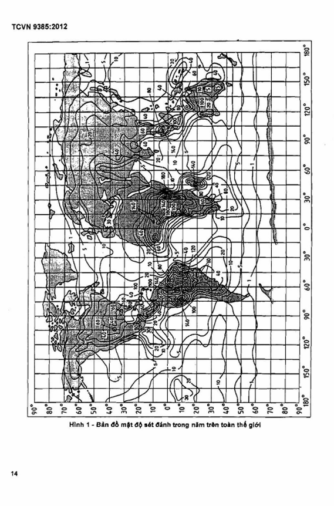

<strong>Hình 1 — Bản đồ mật độ sét đánh trong năm trên toàn thế giới</strong>

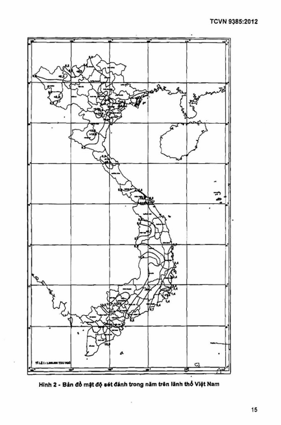

<strong>Hình 2 — Bản đồ mật độ sét đánh trong năm trên lãnh thổ Việt Nam</strong>

### Bảng 5 - Bảng tra giá trị hệ số A (theo dạng công trình)

| Dạng công trình | Giá trị hệ số A |
| :--- | :---: |
| Nhà và công trình với kích thước thông thường | 0,3 |
| Nhà và công trình với kích thước thông thường và có bộ phận nhô cao hơn xung quanh | 0,7 |
| Nhà máy, xưởng sản xuất, phòng thí nghiệm | 1,0 |
| Công sở, khách sạn, nhà ở chung cư | 1,2 |
| Nơi tập trung đông người như hội trường, nhà hát, bảo tàng, siêu thị lớn, bưu điện, nhà ga, bến xe, sân bay, sân vận động | 1,3 |
| Trường học, bệnh viện, nhà trẻ mẫu giáo … | 1,7 |

### Bảng 6 - Bảng tra giá trị hệ số B (theo dạng kết cấu công trình)

| Dạng kết cấu công trình | Giá trị hệ số B |
| :--- | :---: |
| Khung thép hoặc Bê tông cốt thép có mái kim loại | 0,1 |
| Khung thép có mái không phải bằng kim loại (x) | 0,2 |
| Bê tông cốt thép có mái không phải bằng kim loại | 0,4 |
| Thể xây có mái không phải bằng kim loại hoặc tranh tre nứa lá | 1,0 |
| Khung gỗ có mái không phải bằng kim loại hoặc tranh tre nứa lá | 1,4 |
| Thể xây, khung gỗ có mái bằng kim loại | 1,7 |
| Các công trình có mái bằng tranh tre nứa lá | 2,0 |

> **CHÚ THÍCH:** x) Các kết cấu có bộ phận kim loại trên nóc mái và có tính dẫn điện liên tục xuống đất thì không cần theo bảng này

### Bảng 7 - Bảng tra giá trị hệ số C (theo công năng sử dụng)

| Dạng công năng sử dụng | Giá trị hệ số C |
| :--- | :---: |
| Nhà ở, công sở, nhà máy, xưởng sản xuất không chứa các đồ vật quý hiếm hoặc đặc biệt dễ bị hủy hoại (x) | 0,3 |
| Khu công nghiệp, nông nghiệp có chứa các thứ đặc biệt dễ bị hủy hoại (x) | 0,8 |
| Trạm điện, trạm khí đốt, điện thoại, đài phát thanh | 1,0 |
| Khu công nghiệp then chốt, công trình di tích lịch sử, bảo tàng, tòa nhà trưng bày tác phẩm nghệ thuật hoặc công trình có chứa các thứ đặc biệt dễ bị hủy hoại (x) | 1,3 |
| Trường học, bệnh viện, nhà trẻ mẫu giáo, nơi tập trung đông người | 1,7 |

> **CHÚ THÍCH:** x) Dễ bị hủy hoại do cháy hoặc hậu quả của hỏa hoạn

### Bảng 8 - Bảng tra giá trị hệ số D (theo mức độ cách ly)

| Mức độ cách ly | Giá trị hệ số D |
| :--- | :---: |
| Công trình xây dựng trong khu vực đã có nhiều công trình khác hoặc có nhiều cây xanh với chiều cao tương đương hoặc ít hơn | 0,4 |
| Công trình xây dựng trong khu vực có ít công trình khác hoặc cây xanh có chiều cao tương đương | 1,0 |
| Công trình xây dựng hoàn toàn cách ly hoặc cách xa ít nhất hai lần chiều cao của các công trình hay cây xanh hiện hữu trong khu vực | 2,0 |

### Bảng 9 - Bảng tra giá trị hệ số E (theo dạng địa hình)

| Dạng địa hình xây dựng | Giá trị hệ số E |
| :--- | :---: |
| Vùng đồng bằng, trung du | 0,3 |
| Vùng đồi | 1,0 |
| Vùng núi cao từ 300 m đến 900 m | 1,3 |
| Vùng núi cao trên 900 m | 1,7 |

7.6. Diễn giải xác suất sét đánh tổng hợp

Phương pháp xác suất trong tiêu chuẩn này nhằm mục đích hướng dẫn cho các trường hợp khó quyết định. Nếu kết quả tính được nhỏ hơn 10$^{-5}$ (1 trong 100 000) khá nhiều thì nhiều khả năng không cần đến hệ thống chống sét; nếu như kết quả lớn hơn 10$^{-5}$, ví dụ 10$^{-4}$ (1 trong 10 000) thì cần có các lí do xác đáng để làm cơ sở cho việc quyết định không làm hệ thống chống sét.

Khi được cho là các hậu quả dây chuyền sẽ là nhỏ và ảnh hưởng của một cú sét đánh sẽ chỉ gây hư hại rất nhẹ đối với kết cấu của công trình, có thể sẽ là tiết kiệm nếu không đầu tư làm hệ thống chống sét và chấp nhận rủi ro đó. Tuy nhiên ngay cả việc quyết định như vậy cũng cần phải tính toán để biết được mức độ rủi ro đó.

Các kết cấu cũng rất đa dạng và dù có sử dụng phương pháp đánh giá nào đi nữa cũng có thể cho các kết quả không bình thường và những người sẽ phải quyết định liệu sự bảo vệ là cần thiết hay không có thể sẽ phải sử dụng kinh nghiệm và sự phán quyết của mình. Ví dụ như một ngôi nhà kết cấu khung thép có thể được nhận định là có xác suất sét đánh thấp, tuy nhiên việc thêm hệ thống chống sét và nối đất sẽ nâng cao khả năng chống sét rất nhiều nên chi phí để lắp đặt thêm hệ thống này có thể được xem là hợp lý.

Đối với các ống khói bằng gạch hoặc bê tông, kết quả tính xác suất sét đánh tổng hợp có thể thấp. Tuy nhiên nếu chúng đứng một mình hoặc vươn cao hơn các kết cấu xung quanh hơn 4,5 m thì cần phải chống sét cho dù xác suất sét đánh có giá trị nào đi nữa. Những ống khói như vậy sẽ không áp dụng được phương pháp xác suất sét đánh tổng hợp. Tương tự như vậy, các kết cấu chứa chất nổ hay dễ cháy cần được xem xét thêm các yếu tố khác nữa (xem Điều 18 và 8.3).

Ví dụ về việc tính toán xác suất sét đánh tổng hợp để quyết định có cần bố trí hệ thống chống sét hay không được minh họa ở Phụ lục D.

8. Vùng bảo vệ

8.1. Khái niệm

Khái niệm "vùng bảo vệ" được hiểu một cách đơn giản là thể tích mà trong giới hạn đó các bộ phận chống sét tạo ra một sự bảo vệ chống lại các cú phóng điện trực tiếp bằng việc thu các tia sét vào các bộ phận chống sét đó.

Kích thước và hình dáng của vùng bảo vệ thay đổi theo chiều cao của ngôi nhà hoặc chiều cao của các thiết bị thu sét thẳng đứng. Nói chung đối với các công trình không cao quá 20 m, vùng bảo vệ của các bộ phận thu dẫn sét thẳng đứng từ dưới mặt đất lên được xác định là thể tích tạo bởi một hình nón với đỉnh của nó nằm ở đỉnh bộ phận thu sét và đáy nằm dưới mặt đất. Vùng bảo vệ của các bộ phận thu sét ngang được xác định bởi không gian tạo bởi hình nón có đỉnh nằm trên dây thu sét ngang chạy từ điểm đầu đến điểm cuối. Đối với những kết cấu cao hơn 20 m, việc xác định vùng bảo vệ như trên có thể không áp dụng được, và cần phải có thêm các thiết bị chống sét lắp đặt theo cách thức như trong Hình 4 (xem thêm Điều 16) để chống lại các cú sét đánh vào phía bên cạnh công trình.

8.2. Góc bảo vệ

Đối với các kết cấu không vượt quá 20 m về chiều cao, góc giữa cạnh của hình nón với phương thẳng đứng tại đỉnh của hình nón gọi là góc bảo vệ (xem Hình 5). Độ lớn của góc bảo vệ không thể xác định được một cách chính xác vì nó phụ thuộc vào độ lớn của cú sét đánh và sự hiện diện trong vùng bảo vệ các vật thể có khả năng dẫn điện và chúng có thể tạo nên các đường nối đất độc lập với hệ thống chống sét. Tất cả những gì có thể khẳng định là khả năng bảo vệ của hệ thống chống sét sẽ tăng lên khi lấy góc bảo vệ giảm đi. Đối với các kết cấu cao hơn 20 m, góc bảo vệ của bất kỳ một bộ phận dẫn sét nào cao tới 20 m cũng sẽ tương tự như đối với các bộ phận thu dẫn sét của các kết cấu thấp hơn 20 m. Tuy nhiên công trình cao hơn 20 m có khả năng bị sét đánh vào phía bên cạnh, bởi vậy cần xác định thể tích được bảo vệ theo phương pháp hình cầu lăn (xem Phụ lục B.5).

Đối với các mục đích thực hành nhằm cung cấp một mức độ chống sét chấp nhận được cho một kết cấu thông thường cao tới 20 m hoặc cho phần kết cấu dưới 20 m đối với kết cấu cao hơn, góc bảo vệ của bất cứ một bộ phận riêng nào của lưới thu sét, thu sét đứng hay nằm ngang, được quy định là 45° (xem Hình 5-a và Hình 5-b). Giữa các bộ phận thu sét thẳng đứng đặt cách nhau không quá 2 lần chiều cao của chúng thì góc bảo vệ tương đương có thể đạt tới 60° so với phương thẳng đứng (xem Hình 5-c). Đối với mái bằng, diện tích giữa các dây dẫn song song được coi là được chống sét nếu bộ phận thu sét được bố trí theo 11.1 và 11.2. Đối với các kết cấu có yêu cầu chống sét cao hơn thì khuyến cáo áp dụng các góc bảo vệ khác (xem Điều 18).

8.3. Các công trình rất dễ bị nguy hiểm do sét đánh

Đối với các công trình rất dễ bị nguy hiểm do sét đánh, ví dụ có chứa chất cháy nổ, thì cần áp dụng tất cả các giải pháp chống sét có thể có, mặc dù đó chỉ là đề phòng chống các vụ sét đánh rất hiếm khi xảy ra trong vùng bảo vệ được định nghĩa như ở 8.1 và 8.2. Xem chi tiết ở Điều 18 về việc giảm diện tích bảo vệ và các biện pháp đặc biệt khác cho các dạng công trình này.

9. Các lưu ý khi thiết kế hệ thống chống sét

Trước và trong cả quá trình thiết kế, đơn vị thiết kế cần trao đổi và thống nhất về phương án với các bộ phận liên quan. Những số liệu sau đây cần được xác định một cách cụ thể:

a) \- Các tuyến đi của toàn bộ dây dẫn sét;

b) \- Khu vực để đi dây và các cực nối đất;

c) \- Chủng loại vật tư dẫn sét;

d) \- Biện pháp cố định các chi tiết của hệ thống chống sét vào công trình, đặc biệt nếu có ảnh hưởng tới vấn đề chống thấm cho công trình;

e) \- Chủng loại vật liệu chính của công trình, đặc biệt là phần kết cấu kim loại liên tục như các cột, cốt thép;

f) \- Địa chất công trình nơi xây dựng và giải pháp xử lý nền móng công trình;

g) \- Các chi tiết của toàn bộ các đường ống kim loại, hệ thống thoát nước mưa, hệ thống cầu thang trong và ngoài công trình có thể cần hàn đấu nối với hệ thống chống sét;

h) \- Các hệ thống ngầm khác có thể làm mất ổn định cho hệ thống nối đất;

i) \- Các chi tiết của toàn bộ hệ thống trang thiết bị kỹ thuật lắp đặt trong công trình có thể cần hàn đấu nối với hệ thống chống sét.

| Mẫu | Bố trí chung | Diện tích thu sét và phương pháp tính | Diện tích thu sét và phương pháp tính |
| :--- | :--- | :--- | :--- |
| (a) | $\ell$ | $\bar{\epsilon}$ | $A_{c}$ = 14 x 50 + 2(15 x 50) &nbsp;&nbsp;&nbsp;&nbsp;\+ 2(15 x 14) +  x 15$^{2}$ $A_{c}$ = 3 327 $m^{2}$ |
| (b) | $21$ | $\text{[Sơ đồ]}$ | $A_{c}$ = 15 x 50 + 2(21 x 40) &nbsp;&nbsp;&nbsp;&nbsp;\+ 2(21 x 15) +  x 21$^{2}$ $A_{c}$ = 4 296 $m^{2}$ |
| (c) | $\text{Chi tiết 10, 14}$ | $14, 14, 30, 8$ | $A_{c}$ = $^{3}$ x 14$^{2}$ + 2(14 x 30) $A_{c}$ = 1 456 $m^{2}$ |
| (d) | $\text{Hình vẽ sơ đồ minh họa kỹ thuật}$ | $\text{R}6, \text{R}9; \quad 6, 8, 6; \quad 2$ | $A_{c}$ = 7 x 8 + 2(6 x 7) +  x 9$^{2}$ &nbsp;&nbsp;&nbsp;&nbsp;\+ 10 (xấp xỉ) cho vùng tô đen. $A_{c}$ = 405 $m^{2}$ |
| (e) | $12 \qquad 40$ |  | $A_{c}$ =  x 40$^{2}$ $A_{c}$ =5 027 $m^{2}$ |
| (f) | $\bar{b}$ |  | $A_{c}$ = 12 x 55 + 2(18 x 55) + 2(18 x 12) +  x 18$^{2}$ $A_{c}$ = 4 090 $m^{2}$ |
| (g) | $\text{Hình vẽ chi tiết } 6, 7$ |  | $A_{c}$ = 25 x 60 + 25 x 30 + 6 x 60 + 6 x 50 + 6 x 25 + 6 x 25 + 6 x 30 + 6 x 24 + 5/4 x  x 6$^{2}$ $A_{c}$ = 3 675 $m^{2}$ |
| (h) | $\text{[Hình vẽ]}$ |  | $A_{c}$ = 20 x 30 + 2(4 x 30) &nbsp;&nbsp;&nbsp;&nbsp;\+ 2 (4 x 20) +  x 4$^{2}$ &nbsp;&nbsp;&nbsp;&nbsp;\+ 20 (xấp xỉ) cho vùng tô đen $A_{c}$ = 1 070 $m^{2}$ |

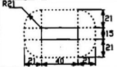

> **CHÚ THÍCH:** Tất cả các kích thước đều tính theo đơn vị là mét (m)

<strong>Hình 3 — Một số dạng công trình và diện tích thu sét</strong>

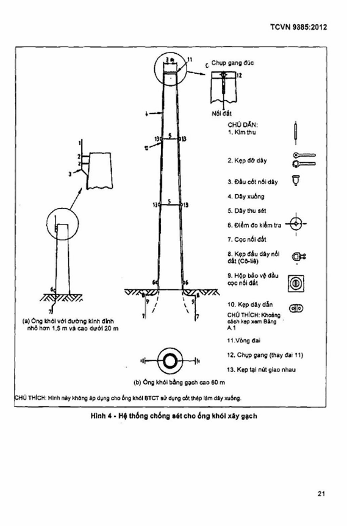

**CHÚ THÍCH:** Hình này không áp dụng cho ống khói BTCT sử dụng cốt thép làm dây xuống.

<strong>Hình 4 — Hệ thống chống sét cho ống khói xây gạch</strong>

| a) Cột đơn thu sét | b) Dây thu sét |
| :--- | :--- |
| (a) Mặt bằng vùng bảo vệ tại cốt nền | (b) Mặt bằng vùng bảo vệ tại cốt nền |
| **c) Bốn cột thu sét với các góc bảo vệ và vùng bảo vệ kết hợp** |  |

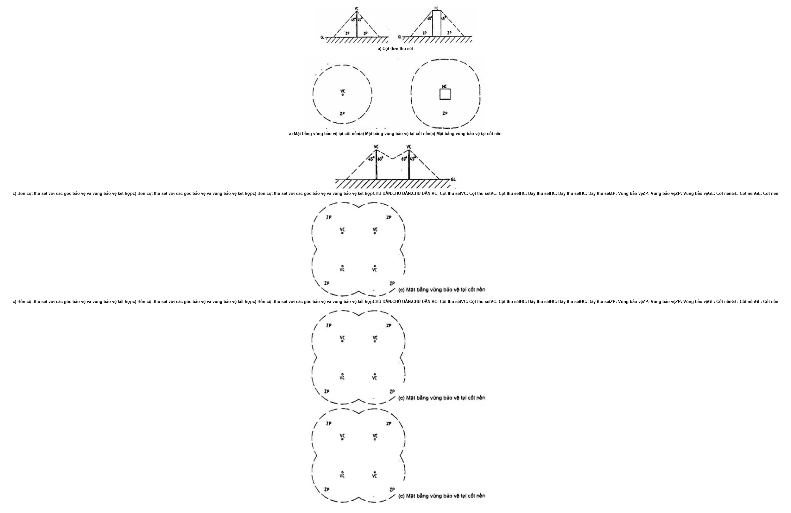

<strong>Hình 5 — Xác định góc và phạm vi bảo vệ hiệu quả của kim thu sét</strong>

10. Các bộ phận cơ bản của hệ thống chống sét

Các bộ phận cơ bản của hệ thống chống sét bao gồm:

a) \- Bộ phận thu sét

b) \- Bộ phận dây xuống

c) \- Các loại mối nối

d) \- Điểm kiểm tra đo đạc

e) \- Bộ phận dây dẫn nối đất

f) \- Bộ phận cực nối đất

Các chi tiết cố định và chi tiết điểm đo kiểm tra điển hình của hệ thống dây dẫn được thể hiện trên Hình 6, Hình 7 và Hình 8.

11. Bộ phận thu sét

11.1. Các nguyên tắc cơ bản

Bộ phận thu sét có thể là các kim thu sét hoặc lưới thu sét hoặc kết hợp cả hai (xem minh họa tại từ Hình 9 đến Hình 14).

Khoảng cách từ bất kỳ bộ phận nào của mái đến bộ phận thu sét nằm ngang không nên lớn hơn 5m (xem CHÚ THÍCH 1 VÀ CHÚ THÍCH 2 trong Hình 10). Đối với những dạng mái bằng có diện tích lớn thường sử dụng lưới thu sét khẩu độ 10 m x 20 m. Đối với những mái nhà có nhiều nóc, nếu khoảng cách S giữa hai nóc lớn hơn 10 + 2H, trong đó H là độ cao của nóc (tất cả được tính bằng đơn vị m) thì phải bổ sung thêm các dây thu sét (xem Hình 11).

Đối với những công trình Bê tông cốt thép, bộ phận thu sét có thể được đấu nối vào hệ cốt thép của công trình tại những vị trí thích ứng với số lượng dây xuống cần thiết theo tính toán.

Tất cả các bộ phận bằng kim loại nằm ngay trên mái hoặc cao hơn bề mặt của mái đều được nối đất như một phần của bộ phận thu sét (xem minh họa tại Hình 4 và Hình 6 và tham khảo Hình 15).

Lớp phủ đỉnh tường, đỉnh mái và lan can bằng kim loại (xem Điều 9), lưới bằng kim loại ở sân thượng nên được tận dụng làm một phần của bộ phận thu sét (xem Hình 4, Hình 6 và Hình 16).

11.2. Các dạng cấu tạo bộ phận thu sét

11.2.1. Nguyên tắc chung

Các dạng cấu tạo bộ phận thu sét thông dụng nhất được minh họa từ Hình 9 đến Hình 14. Phạm vi ứng dụng của từng dạng thu sét được chỉ dẫn tại 11.2.2; 11.2.3; 11.2.4; 11.2.5 và 11.2.6. Việc sử dụng bộ phận thu sét dạng nào là tùy thuộc vào kiến trúc và kết cấu cũng như vị trí xây dựng của từng công trình.

11.2.2. Kim thu sét đơn

Hình 5(a) minh họa kim thu sét đơn và phạm vi bảo vệ. Hình 5(c) minh họa dạng thu sét kết hợp 4 kim thu sét gia tăng phạm vi bảo vệ như thể hiện tại hình vẽ mặt bằng bảo vệ.

11.2.3. Dây thu sét, lưới thu sét cho nhà mái bằng

Hình 5(b) minh họa bố trí dây thu sét viền theo chu vi mái của công trình dạng khối chữ nhật và mặt bằng, mặt cắt phạm vi bảo vệ. Hình 9 minh họa cách bố trí bộ phận chống sét điển hình đối với các công trình mái bằng diện tích lớn (xem 11.1). Thông thường sử dụng lưới thu sét cho các công trình dạng này nhằm giảm tác động của hiệu ứng lan truyền sét.

11.2.4. Công trình có mặt bằng rộng và hình khối phức tạp

Đối với các công trình bao gồm nhiều khối trong đó có cả phần cao tầng và thấp tầng, như minh họa tại Hình 13, hệ thống chống sét sẽ bao gồm đầy đủ các bộ phận: thu sét, dây xuống và tiếp địa. Khi thiết kế hệ thống chống sét cho phần thấp tầng cần bỏ qua sự hiện diện của phần cao tầng. Lưới tiếp địa và các mối đấu nối được sử dụng theo dạng thông dụng (xem Hình 6, 12.9, 12.10, 13, và các Phụ lục B; B.2; và B.5).

Hình 10 minh họa công trình gồm nhiều khối có mái bằng với các độ cao khác nhau. Bảo vệ các khối bằng hệ thống lưới thu sét viền xung quanh chu vi mái và xung quanh phần mái bên trong tại vị trí có các khối nhô cao lên (xem CHÚ THÍCH 1 tại Hình 10). Tất cả các bộ phận của hệ thống chống sét phải được đấu nối với nhau theo quy định ở 4.7 (xem Hình 14 và Hình 30).

**CHÚ THÍCH:** Trên Hình 14 bộ phận dây thu sét xung quanh chân phần cao tầng được sử dụng để đấu nối lưới thu sét với dây xuống của phần cao tầng. Trên thực tế thì khu vực này đã nằm trong phạm vi bảo vệ, nói cách khác là bình thường thì ở đó không cần bố trí dây thu sét.

Hình 11 minh họa các dạng mái có diện tích lớn. Dây thu sét được bố trí trên mái và được đấu nối với nhau ở cả hai đầu mép mái. Nếu mái rộng hơn 20 m thì cần bổ sung thêm dây thu sét ngang để bảo đảm khoảng cách giữa hai dây thu sét không lớn hơn 20 m.

Đối với các công trình có độ cao trên 20 m thì có thể cần phải áp dụng phương pháp hình cầu lăn (xem Phụ lục B và Hình B.1) để xác định vị trí lắp đặt bộ phận thu sét (trừ trường hợp công trình có kết cấu khung thép).

11.2.5. Đối với các công trình mái ngói

Đối với các công trình có mái không dẫn điện, dây dẫn sét có thể bố trí ở dưới hoặc tốt nhất là bố trí trên mái ngói. Mặc dù việc lắp đặt dây dẫn sét ở dưới mái ngói có lợi là đơn giản và giảm được nguy cơ ăn mòn, nhưng tốt hơn là lắp đặt dọc theo bờ nóc của mái ngói. Trường hợp này có ưu điểm là giảm thiểu nhiều hơn nguy hại đối với mái ngói do dây thu sét trực tiếp và công tác kiểm tra cũng dễ dàng, thuận tiện hơn.

Dây dẫn sét bố trí ở dưới mái ngói chỉ được sử dụng chủ yếu trong trường hợp mái có độ dày nhỏ hoặc được đặt ngay dưới lớp phủ bên trên mái, và khoảng cách giữa các dây dẫn không lớn hơn 10m. Đối với công trình dạng nhà thờ hoặc dạng kiến trúc, kết cấu tương tự thì xử lý như công trình đặc biệt. Phần tháp cao hoàn toàn không tính đến trong quá trình thiết kế hệ thống chống sét cho các hạng mục thấp hơn của công trình.

11.2.6. Đối với các công trình đơn giản có chứa các chất dễ gây cháy nổ

Hình 17 minh họa giải pháp bố trí hệ thống chống sét chủ yếu được sử dụng đối với các công trình đơn giản, có chứa các chất dễ gây cháy nổ. Hệ thống bảo vệ chính bao gồm hai kim thu sét nối với nhau bằng một dây thu sét. Phạm vi bảo vệ được thể hiện trên mặt bằng, mặt cắt trong hình vẽ, đồng thời thể hiện ảnh hưởng của độ võng của dây thu sét ngang (xem 18.2.1).

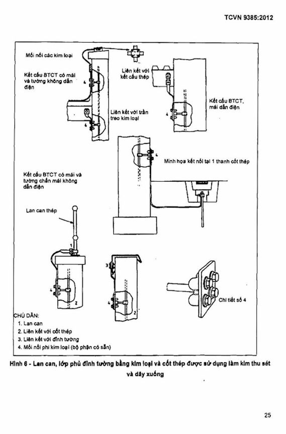

<strong>Hình 6 — Lan can, lớp phủ đỉnh tường bằng kim loại và cốt thép được sử dụng làm kim thu sét và dây xuống</strong>

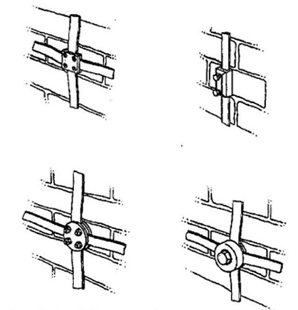

**CHÚ THÍCH:** Phủ lớp chống gỉ cho tất cả các nút và liên kết

<strong>Hình 7 — Điểm đo kiểm tra</strong>

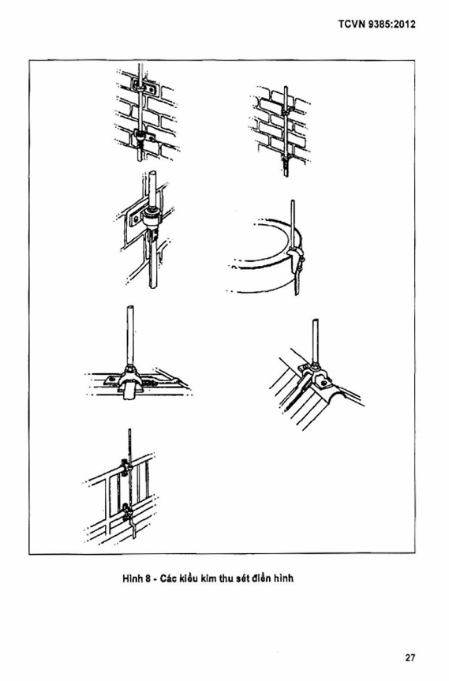

<strong>Hình 8 — Các kiểu kim thu sét điển hình</strong>

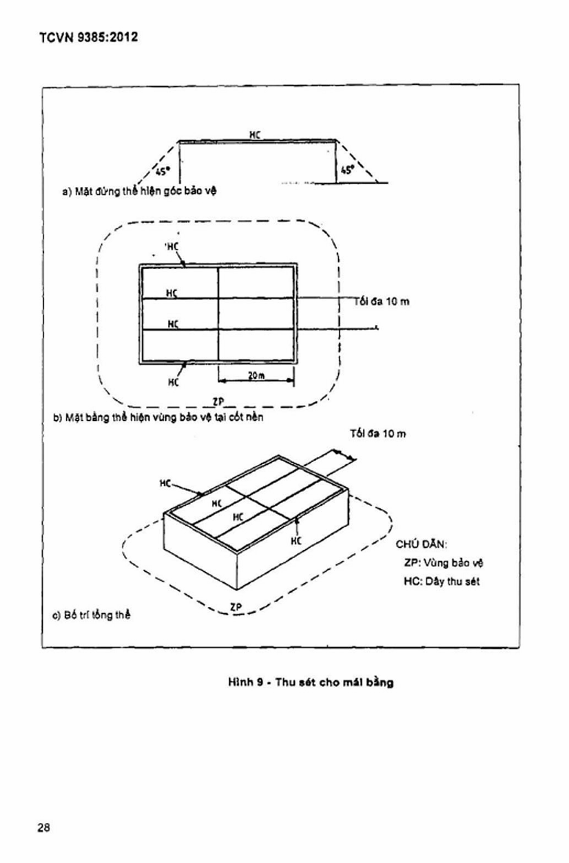

<strong>Hình 9 — Thu sét cho mái bằng</strong>

| $\text{(Hình vẽ)}$ Hình chiếu B | *Nối dây xuống và dây thu sét ở phần mái thấp |
| :--- | :--- |
|  | Chu vi = 24 +24 +12 +12 = 72 m Số dây xuống cần thiết = 72/20 = 4 |

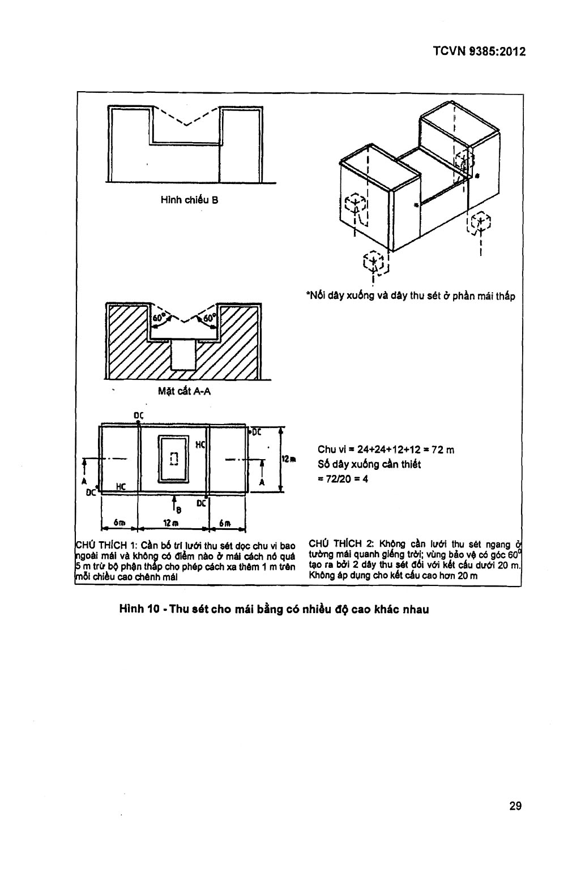

> **CHÚ THÍCH:**
>
> &nbsp;&nbsp;\- Cần bố trí lưới thu sét dọc chu vi bao ngoài mái và không có điểm nào ở mái cách nó quá 5 m trừ bộ phận thấp cho phép cách xa thêm 1 m trên mỗi chiều cao chênh mái
>
> &nbsp;&nbsp;\- Không cần lưới thu sét ngang ở tường mái quanh giếng trời; vùng bảo vệ có góc 60° tạo ra bởi 2 dây thu sét đối với kết cấu dưới 20 m. Không áp dụng cho kết cấu cao hơn 20 m

<strong>Hình 10 — Thu sét cho mái bằng có nhiều độ cao khác nhau</strong>

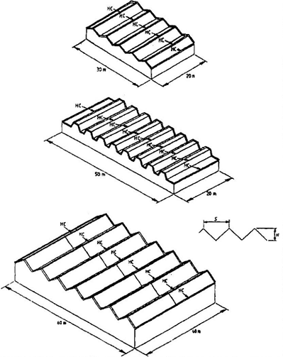

**CHÚ THÍCH 1:** Nếu S > 10+2H cần bổ sung dây thu sét dọc nhà để khoảng cách giữa các dây thu sét < 10 m

**CHÚ THÍCH 2:** Nếu chiều dài mái vượt quá 20 m cần bổ sung các dây dẫn ngang

**CHÚ THÍCH 3:** Các hình vẽ trên không thể hiện các dây xuống

<strong>Hình 11 — Thu sét cho mái có diện tích lớn và nhiều đỉnh nóc</strong>

| $\text{Góc dốc}, \quad 40$ 1. Các mái có góc dốc lớn từ 45° trở lên chỉ yêu cầu dây thu sét ở nóc | 2. Các mái có diềm mái ở cách bờ nóc chưa đến 5 m |
| :--- | :--- |
| 3) | 4) |
| $\text{б)}$ |  |
| **b) Các dây dẫn sét nằm dưới tấm lợp** |  |

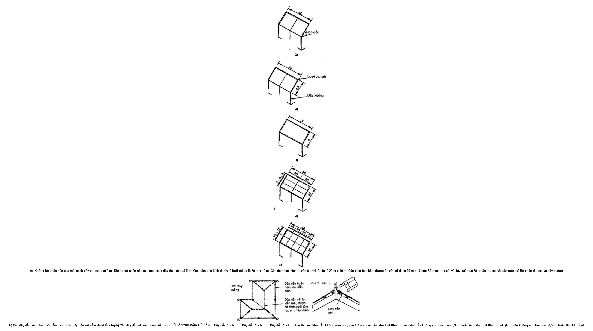

> **CHÚ THÍCH:**
>
> &nbsp;&nbsp;\- Các ví dụ ở trên minh họa cho nhiều loại mái có kích thước khác nhau. Khi thiết kế lưới thu sét mái cần tuân thủ nguyên tắc: &nbsp;&nbsp;\- Không bộ phận nào của mái cách dây thu sét quá 5 m
>
> &nbsp;&nbsp;\- Cần đảm bảo kích thước ô lưới tối đa là 20 m x 10 m
>
> &nbsp;&nbsp;\- a) Bộ phận thu sét và dây xuống
>
> CHÚ DẪN
>
> ---- Dây dẫn đi chìm
>
> · Kim thu sét (kim trần không sơn bọc, cao 0,3 m) hoặc tấm kim loại
>
> CHÚ DẪN
>
> ---- Dây dẫn đi chìm
>
> · Kim thu sét (kim trần không sơn bọc, cao 0,3 m) hoặc tấm kim loại

<strong>Hình 12 — Thu sét và dây xuống đặt trong mái dốc với chiều cao dưới 20 m</strong>

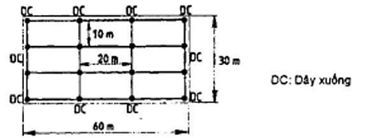

**CHÚ THÍCH:** Các dây dẫn ngang cần được liên kết tại các vị trí giao nhau như quy định tại 12.10.4

<strong>Hình 13 — Thu sét và dây xuống cho công trình mái bằng</strong>

**CHÚ THÍCH:** Thu sét cho kết cấu BTCT hay kết cấu thép cao cần đảm bảo:

a) Lưới thu nằm ngang bố trí theo ô 10 m x 20 m

b) Liên kết với kết cấu thép tại các góc với khoảng cách 20 m dọc chu vi và chân phần nhô cao trên mái thấp một đoạn 0,5 m.

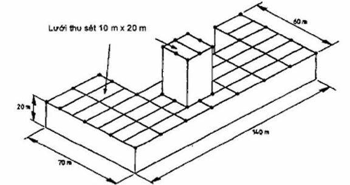

<strong>Hình 14 — Thu sét cho công trình có tháp cao dẫn điện</strong>

* Thể hiện liên kết vào kết cấu thép mái

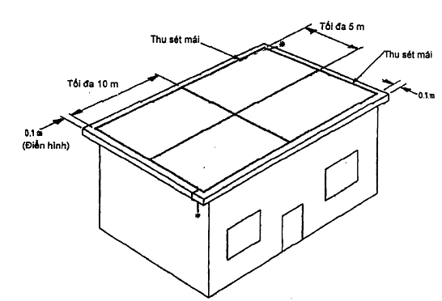

**CHÚ THÍCH 1:** Lưới thu sét 5 m x 10 m hoặc nhỏ hơn, tùy thuộc vào nguy cơ rủi ro

**CHÚ THÍCH 2:** Không thể hiện dây xuống trong hình vẽ này

<strong>Hình 15 — Thu sét cho công trình có chứa các chất dễ gây cháy nổ</strong>

12. Dây xuống

12.1. Khái niệm chung

Chức năng của dây xuống là tạo ra một nhánh có điện trở thấp từ bộ phận thu sét xuống cực nối đất sao cho dòng điện sét được dẫn xuống đất một cách an toàn.

Tiêu chuẩn này bao hàm cả việc sử dụng dây xuống theo nhiều kiểu bao gồm cách sử dụng thép dẹt, thép tròn, cốt thép và trụ kết cấu thép… Bất cứ bộ phận kết cấu công trình nào dẫn điện tốt đều có thể làm dây xuống và được kết nối một cách thích hợp với bộ phận thu sét và nối đất. Nói chung, càng sử dụng nhiều dây xuống càng giảm được rủi ro do hiện tượng lan truyền sét và các hiện tượng không mong muốn khác. Tương tự, các dây dẫn lớn làm giảm rủi ro do hiện tượng lan truyền sét, đặc biệt nếu được bọc cách điện. Sử dụng các dây dẫn có lớp bọc không làm giảm đi số lượng của các dây xuống được kiến nghị ở tiêu chuẩn này.

Trong thực tế, tùy thuộc vào dạng của công trình, thông thường cần có các dây xuống đặt song song, một số hoặc toàn bộ những dây xuống đó có thể là một phần của kết cấu công trình đó. Ví dụ, một khung thép hoặc kết cấu Bê tông cốt thép có thể không cần các dây xuống vì bản thân cái khung đó đã tạo ra một mạng lưới gồm nhiều nhánh xuống đất một cách hiệu quả, ngược lại một kết cấu được làm hoàn toàn từ các vật liệu không dẫn điện sẽ cần các dây xuống bố trí theo kích thước và dạng của kết cấu đó.

Tóm lại, hệ thống dây xuống khi có thể thực hiện được thì nên dẫn thẳng từ bộ phận thu sét đến mạng lưới nối đất và đặt đối xứng xung quanh các tường bao của công trình bắt đầu từ các góc. Trong mọi trường hợp, cần phải lưu ý đến hiện tượng lan truyền sét (xem 12.5).

| $\begin{aligned} &\text{Liên kết bulông 2M8} \\ &\text{Miếng đệm} \\ &\text{Dây dẫn sét} \\ &\text{Thép} \\ &\text{Xà gồ} \\ &\text{Dầm} \end{aligned}$ — &nbsp;&nbsp;\- Thép mạ kẽm &nbsp;&nbsp;\- Đồng &nbsp;&nbsp;\- Nhôm, kẽm &nbsp;&nbsp;\- Chì | $\begin{aligned} &\text{Liên kết bulông 2M8} \\ &\text{Miếng đệm} \\ &\text{Dây dẫn sét} \\ &\text{Thép} \\ &\text{Xà gồ} \\ &\text{Dầm} \end{aligned}$ — 0,5 mm 0,3 mm 0,7 mm 2,0 mm |
| :--- | :--- |

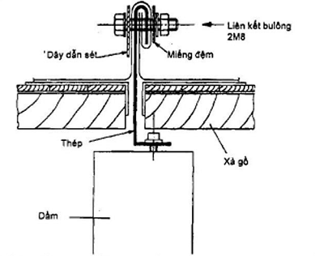

> CHÚ THÍCH: Chiều dày nhỏ nhất khi sử dụng tấm lợp kim loại làm một bộ phận của hệ thống chống sét là:
>
> CHÚ THÍCH: Chiều dày nhỏ nhất khi sử dụng tấm lợp kim loại làm một bộ phận của hệ thống chống sét là:

<strong>Hình 16 — Kẹp đấu nối bộ phận thu sét cho mái bằng trong trường hợp mái kim loại được sử dụng làm một bộ phận của hệ thống chống sét</strong>

12.2. Bố trí dây xuống

Bố trí dây xuống cho nhiều dạng công trình, có hoặc không có khung thép xem Hình 18.

Trong các công trình có chiều cao lớn, khung thép hoặc cốt thép trong bê tông phải được liên kết với nhau và tham gia vào sự tiêu tán dòng điện sét cùng với các cột thẳng đứng và các chi tiết tương tự, chúng nên được liên kết ở phần trên cùng và phần dưới cùng. Thiết kế của hệ thống chống sét do đó sẽ bao gồm các cột liên tục hoặc các trụ thẳng đứng được bố trí phù hợp với 12.3. Với các công trình có khung thép hoặc các công trình bê tông cốt thép không cần thiết phải bố trí, các dây xuống riêng rẽ.

Hình 18a minh họa một công trình có khung thép. Theo đó không cần bố trí thêm các dây xuống nhưng cần nối đất phù hợp với tiêu chuẩn này. Hình 18b thể hiện cách bố trí dây xuống trong trường hợp mái đua ở 3 cạnh. Hình 18c thể hiện cách bố trí trong trường hợp phòng khiêu vũ hoặc bể bơi có khu phụ trợ. Hình 18d, Hình 18e, Hình 18f và Hình 18g thể hiện các công trình có hình dạng mà có thể bố trí tất cả các dây xuống cố định ở các bức tường bao. Cần phải thận trọng khi lựa chọn khoảng cách các dây xuống phù hợp để tránh khu vực ra vào, lưu ý đến yêu cầu tránh điện áp bước nguy hiểm trên bề mặt đất (tham khảo thêm Hình 19).

12.3. Số lượng khuyến cáo

Vị trí và khoảng cách các dây xuống trong công trình lớn thường phụ thuộc vào kiến trúc. Tuy nhiên, nên bố trí một dây xuống với khoảng cách giữa các dây là 20 m hoặc nhỏ hơn theo chu vi ở cao độ mái hoặc cao độ nền. Công trình có chiều cao trên 20 m phải bố trí các dây cách nhau không quá 10 m.

12.4. Những công trình cao khó thực hiện việc đo kiểm tra

Với công trình có chiều cao lớn, điều kiện kiểm tra và đo đạc là khó, cần phải có biện pháp đo kiểm tra tính liên tục của hệ thống. Cần ít nhất hai dây xuống cho công tác đo đạc đó (xem Hình 4).

12.5. Bố trí đường dẫn xuống

Dây xuống cần phải đi theo lối thẳng nhất có thể được giữa lưới thu sét và mạng nối đất. Khi sử dụng nhiều hơn một dây xuống thì các dây xuống cần được sắp xếp càng đều càng tốt xung quanh tường bao của công trình, bắt đầu từ các góc (xem Hình 18), tùy thuộc vào kiến trúc và khả năng thi công.

Trong việc quyết định tuyến xuống, cần phải cân nhắc đến việc liên kết dây xuống với các chi tiết thép trong công trình, ví dụ như các trụ, cốt thép và bất cứ chi tiết kim loại liên tục và cố định của công trình có khả năng liên kết được.

Các bức tường bao quanh sân thượng và giếng trời có thể được sử dụng để gắn các dây xuống nhưng không được sử dụng vách lồng thang máy (xem 15.3.11). Các sân thượng có tường bao cứ 20 m phải được trang bị một dây xuống. Tuy nhiên, cần có tối thiểu hai dây xuống và bố trí đối xứng.

12.6. Sử dụng cốt thép trong kết cấu bê tông

12.6.1. Nguyên tắc chung

Các chi tiết cụ thể cần được quyết định ở giai đoạn thiết kế thi công công trình (xem 9.5).

12.6.2. Tính dẫn điện liên tục

Các thanh cốt thép của kết cấu bê tông cốt thép đúc tại chỗ đôi khi được hàn, trường hợp đó hiển nhiên là nó tạo ra khả năng truyền điện liên tục. Thông thường chúng được nối buộc với nhau bởi các dây nối kim loại ở các điểm giao nhau. Mặc dù vậy, không kể đến những mối liên kết tình cờ tự nhiên của kim loại, thì một số lượng rất lớn của các thanh và các mối giao nhau thi công như vậy cũng là đảm bảo tách nhỏ cường độ của dòng điện sét ra thành nhiều nhánh tiêu tán song song. Kinh nghiệm chỉ ra rằng kết cấu đó rõ ràng có thể tận dụng như là một bộ phận trong hệ thống chống sét.

Tuy nhiên, cần lưu ý các vấn đề sau:

a) \- Phải đảm bảo tiếp xúc giữa các cốt thép, ví dụ bằng cách cố định chúng bằng dây buộc;

b) \- Cần phải nối cốt thép đứng với nhau và cốt thép đứng với cốt thép ngang.

12.6.3. Bê tông ứng lực trước

Các dây dẫn sét không được kết nối với các cột, dầm hay giằng bê tông cốt thép ứng lực trước vì thép ứng lực trước không được liên kết và do đó không có tính dẫn điện liên tục.

12.6.4. Bê tông đúc sẵn

Trong trường hợp các cột, dầm hay trụ bằng bê tông cốt thép đúc sẵn thì cốt thép có thể được sử dụng như là dây dẫn nếu các đoạn cốt thép ở các cấu kiện riêng biệt được gắn kết với nhau và đảm bảo tính dẫn điện liên tục.

12.7. Tuyến đi bên trong

Khi khả năng bố trí tuyến dây xuống phía bên ngoài là không khả thi hoặc là không thích hợp (xem 12.8.3), các dây xuống có thể được bố trí vào trong một ống rỗng bằng vật liệu phi kim loại, không cháy và được kéo thẳng xuống đất (xem Hình 20).

Bất cứ rãnh được che kín, máng thiết bị, ống hoặc máng cáp chạy suốt chiều cao công trình không chứa sợi dây cáp nào đều có thể được sử dụng cho mục đích này.

12.8. Uốn góc nhọn và nhánh vòng

12.8.1. Điều kiện thực tế không phải lúc nào cũng cho phép các tuyến đi theo con đường thẳng nhất. Tuy có thể chấp nhận uốn góc nhọn tại một số vị trí, ví dụ như tại các gờ mái, nhưng cần lưu ý các nhánh vòng trong dây dẫn có thể làm điện cảm cao giảm xuống nhanh làm cho việc tiêu tán dòng điện sét có thể xảy ra phía hở của nhánh vòng. Về cơ bản, rủi ro có thể xuất hiện khi chiều dài của dây dẫn tạo ra nhánh vòng vượt quá 8 lần chiều rộng phần hở của mạch (Xem Hình 21).

12.8.2. Khi không thể tránh được nhánh vòng dài, ví dụ như trong trường hợp tường lan can, tường mái, các dây dẫn phải được sắp đặt sao cho khoảng cách của phần hở nhánh vòng đáp ứng được nguyên tắc đưa ra ở 12.8.1. Cách làm khác là tạo lỗ qua các tường lan can để các dây dẫn có thể xuyên qua dễ dàng.

12.8.3. Tại các công trình có các sàn trên đua ra, cần xét tới nguy cơ lan truyền sét từ dây xuống bên ngoài đến người đứng ở dưới phần nhô ra. Các dây xuống phải theo một tuyến ở bên trong, phù hợp với 12.7, nếu kích thước của phần nhô ra đó có thể gây nguy cơ về lan truyền sét cho người hoặc nếu khoảng cách các dây xuống lớn hơn 20 m.

Rủi ro với người là không thể chấp nhận nếu chiều cao (h) của phần nhô ra nhỏ hơn 3 m. Với phần nhô ra có chiều cao lớn hơn hoặc bằng 3 m thì chiều rộng (w) của phần nhô ra phải nhỏ hơn hoặc bằng (tính theo m) giá trị tính theo biểu thức:

W ≤ 15(0,9xh-2,5)

$$\dots \qquad (6)$$
<!-- formula_id: "F_TCVN_9385_2012_FORMULA_6" -->

Nếu các dây xuống đi theo tuyến bên ngoài, cách xác định h và w của phần nhô ra được minh họa ở Hình 21d.

a) Mặt đứng

b) Mặt bằng

c) Vùng được bảo vệ

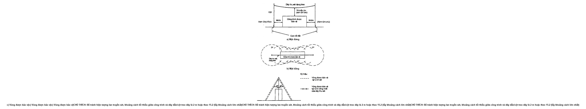

**CHÚ THÍCH:** Để tránh hiện tượng lan truyền sét, khoảng cách tối thiểu giữa công trình và dây dẫn/cột treo dây là 2 m hoặc theo 15.2 (lấy khoảng cách lớn nhất)

<strong>Hình 17 — Bộ phận thu sét và vùng bảo vệ công trình đơn giản có chứa chất dễ cháy nổ</strong>

Ký hiệu

Cột chịu lực

$\square$ Cột chịu lực dẫn điện sử dụng làm dây xuống và nối đất

$\frac{\Phi}{\omega}$ Dây xuống và nối đất bên ngoài

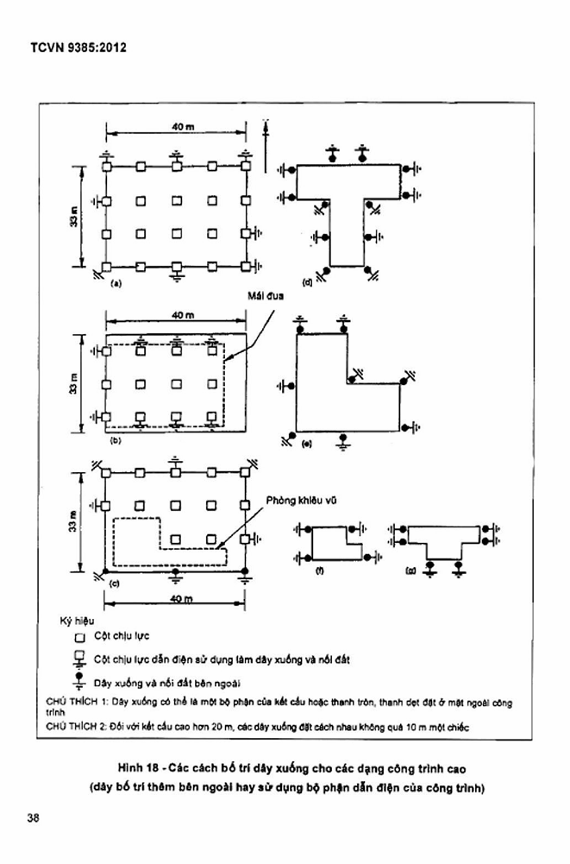

**CHÚ THÍCH 1:** Dây xuống có thể là một bộ phận của kết cấu hoặc thanh tròn, thanh dẹt đặt ở mặt ngoài công trình

**CHÚ THÍCH 2:** Đối với kết cấu cao hơn 20 m, các dây xuống đặt cách nhau không quá 10 m một chiếc

<strong>Hình 18 — Các cách bố trí dây xuống cho các dạng công trình cao</strong>

(dây bố trí thêm bên ngoài hay sử dụng bộ phận dẫn điện của công trình)

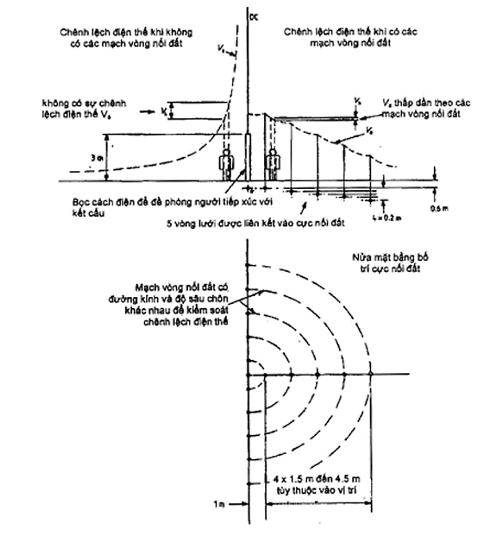

<strong>Hình 19 — Chênh lệch điện áp ở mặt đất gần cột đỡ, tháp, trụ có cực nối đất nhiều cực đơn</strong>

12.9. Liên kết để tránh hiện tượng lan truyền sét

Bất cứ chi tiết kim loại ở trong hoặc là một phần của kết cấu hoặc bất cứ thiết bị công trình có các thành phần kim loại được thiết kế hoặc ngẫu nhiên tiếp xúc với đất nền phải được cách ly hoặc liên kết với dây xuống (Xem Điều 17). Tuy nhiên, trừ phi các tính toán ở 15.2 và các yêu cầu ở B.2 chỉ ra rằng cần phải liên kết thì những thứ có tiếp xúc với hệ thống chống sét, trực tiếp hoặc không trực tiếp, thông qua các liên kết kim loại với kim loại chắc chắn và tin cậy thì không cần các dây dẫn liên kết thêm.

Chỉ dẫn chung cũng áp dụng cho toàn bộ các chi tiết kim loại lớn để hở nối hoặc không nối với đất.

Có thể bỏ qua các chi tiết nhỏ như các bản lề cửa, giá đỡ máng bằng kim loại hay cốt thép của các dầm nhỏ đơn độc.

**CHÚ THÍCH:** Trong phạm vi vấn đề này, chi tiết được coi là lớn khi có kích thước một cạnh bất kỳ lớn hơn 2 m.

12.10. Liên kết

12.10.1. Quy định chung

Hầu hết các phần của hệ thống chống sét được thiết kế sao cho có thể lắp vừa vào trong mặt bằng chung. Tuy nhiên các liên kết được sử dụng để kết nối các bộ phận làm từ kim loại có các hình dạng và thành phần khác nhau do đó không thể có một dạng chuẩn. Do tính đa dạng trong sử dụng của chúng và các nguy cơ ăn mòn nên cần phải chú ý tới các bộ phận kim loại của chúng, ví dụ như phần kết nối và các bộ phận được kết nối.

12.10.2. Các yêu cầu về cơ và điện

Một liên kết phải hiệu quả cả về cơ và điện và được bảo vệ tránh ăn mòn và xâm thực trong môi trường làm việc.

Các chi tiết kim loại bên ngoài ở trên kết cấu hoặc là một phần của kết cấu có thể phải tiêu tán toàn bộ dòng điện do sét đánh vào nó và do đó liên kết của các chi tiết đó với hệ thống chống sét phải có tiết diện không nhỏ hơn tiết diện của dây dẫn chính. Ngược lại, các chi tiết kim loại bên trong không dễ bị hư hại và liên kết của nó ngoài chức năng cân bằng điện áp thì nhiều lắm cũng chỉ tải một phần cường độ dòng điện sét. Do đó các liên kết bên trong có thể có tiết diện nhỏ hơn tiết diện dây dẫn chính.

12.10.3. Dự trù cho việc liên kết các thiết bị tương lai

Đối với mọi công trình, tại mỗi cốt sàn cần phải dự trù cho việc liên kết máy móc thiết bị trong tương lai với hệ thống chống sét, ví dụ như liên kết với thiết bị kim loại cấp gas, nước, hệ thống thoát nước hoặc các thiết bị khác tương tự. Các kết cấu đỡ lưới điện, điện thoại hoặc đường dây khác trên cao không nên liên kết với hệ thống chống sét mà không có sự cho phép của nhà chức trách có thẩm quyền.

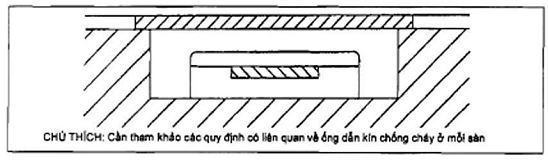

<strong>Hình 20 — Dây xuống trong ống dẫn bố trí bên trong</strong>

12.10.4. Các mối nối

Bất kỳ mối nối khác với mối nối hàn đều thể hiện sự gián đoạn trong hệ thống dẫn điện và nhạy cảm với sự thay đổi và hư hỏng. Cho nên, hệ thống chống sét càng ít mối nối càng tốt.

Các mối nối phải hiệu quả cả về mặt cơ và điện, ví dụ như kẹp, vít, bu lông, chốt, đinh tán hoặc hàn. Với mối nối chồng, khoảng chồng lên của mọi kiểu dây dẫn phải không nhỏ hơn 20 m. Bề mặt tiếp xúc trước hết phải được làm sạch và sau đó ngăn chặn hiện tượng ôxy hóa bằng hóa chất chống rỉ thích hợp. Mối nối giữa hai kim loại khác nhau phải được làm sạch bằng các chất khác nhau với mỗi kiểu vật liệu.

Tất cả các mối nối phải được bảo vệ ăn mòn và xâm thực do môi trường và phải có diện tiếp xúc thích hợp. Kiểm tra định kỳ sẽ thuận tiện nếu sử dụng các lớp phủ bảo vệ bằng:

a) \- Phủ bằng chất có gốc hóa dầu; hoặc

b) \- Phủ cao su bằng phương pháp phun, hoặc

c) \- Phủ bằng chất hàn nhiệt.

Vật liệu sử dụng làm đai ốc và bulông phải phù hợp với các tiêu chuẩn hiện hành về bu lông và đai ốc. Để bắt bulông thanh dẹt, cần ít nhất là 2 bulông M8 hoặc một bulông M10. Với các mối nối đinh tán, cần phải sử dụng ít nhất 4 đinh tán có đường kính 5 mm.

Bulông liên kết các thanh dẹt với tấm kim loại có chiều dày nhỏ hơn 2 mm cần phải có miếng đệm với diện tích không nhỏ hơn 10 $cm^{2}$ và phải sử dụng không ít hơn 2 bulông M8.

12.10.5. Các điểm đo kiểm tra

Mỗi dây xuống phải bố trí một điểm đo kiểm tra ở vị trí thuận tiện cho việc đo đạc nhưng không quá lộ liễu, dễ bị tác động không mong muốn.

Cần đặt các bảng chỉ vị trí, số lượng và kiểu của các cực nối đất ở trên mỗi điểm kiểm tra.

13. Mạng nối đất

**CHÚ THÍCH:** Thông tin thêm về mạng nối đất được trình bày ở Phụ lục B.

13.1. Điện trở nối đất

Cực nối đất phải được kết nối với mỗi dây xuống. Mỗi cực phải có điện trở (đo bằng ) không vượt quá 10 nhân với số cực nối đất được bố trí (xem 12.3). Tất cả mạng nối đất nên có điện trở nối đất tổng hợp không vượt quá 10  và không kể đến bất kỳ một liên kết nào với các thiết bị khác.

Điện trở nối đất trước và sau khi hoàn thành các liên kết cần được đo và ghi chép lại và sử dụng trong mọi đợt đo kiểm tra sau đó (xem 13.4 và Điều 28).

Nếu điện trở của toàn bộ hệ thống chống sét vượt quá 10 , có thể giảm giá trị đó bằng cách kéo dài hoặc thêm vào các điện cực hoặc bằng cách liên kết các cực nối đất riêng rẽ của các dây xuống với một dây dẫn được đặt sâu ít nhất 0,6 m dưới mặt đất, đôi khi gọi là cực nối đất mạch vòng (xem Hình 22). Các cực nối đất mạch vòng nên được bố trí bên dưới các thiết bị đầu vào công trình.

Việc chôn các cực nối đất mạch vòng như trên được xem như một phần không tách rời của mạng nối đất và phải được xét đến khi đánh giá giá trị điện trở nối đất tổng thể của hệ thống được lắp đặt.

Trong kết cấu khung thép, các cấu kiện của khung thép thường được liên kết chắc chắn đảm bảo có thể sử dụng như các dây xuống. Phần thấp nhất của kết cấu nên được nối đất một cách thỏa đáng, với các dây xuống được bố trí tuân theo các yêu cầu ở 12.3. Trong hầu hết các trường hợp, các móng của công trình sẽ có điện trở nối đất thấp phù hợp mà không cần các cực nối đất khác, đặc biệt nếu móng của công trình bao gồm cả các cọc có cốt thép. Việc đo điện trở nối đất của các móng vừa mới hoàn thành sẽ quyết định liệu bản thân móng đã đảm bảo chưa hay có cần thêm các cực nối đất (xem B.1.5). Trong các công trình hiện có, việc đo điện trở nối đất của móng đôi khi bất khả thi và do đó phải tìm kiếm giải pháp nối đất khác như trình bày ở Điều 14. Nếu chỉ sử dụng móng để nối đất, cần có các biện pháp nối từng cấu kiện thẳng đứng của kết cấu thép với nền đất tạo bởi cốt thép trong móng bê tông.

13.2. Tầm quan trọng của việc làm giảm điện trở nối đất

Việc làm giảm giá trị điện trở nối đất xuống dưới 10  tạo thuận lợi cho việc giảm chênh lệch điện thế xung quanh các cực nối đất khi tiêu tán dòng điện sét. Nó có thể làm giảm nguy cơ lan truyền sét vào kim loại trong hoặc trên công trình (xem 12.9).

13.3. Mạng nối đất chung cho mọi thiết bị

Nên sử dụng mạng nối đất chung cho hệ thống chống sét và mọi thiết bị khác. Mạng nối đất cần phù hợp với những đề xuất trong tiêu chuẩn này và cũng cần tuân theo các quy định áp dụng cho các thiết bị có liên quan. Điện trở nối đất trong trường hợp này cần có giá trị thấp nhất đáp ứng bất cứ thiết bị nào.

13.4. Cách ly hệ thống cực nối đất để đo kiểm tra

Các cực nối đất cần đáp ứng yêu cầu cách ly và nên bố trí một cực nối đất tham chiếu (xem 3.7) phục vụ cho mục đích đo kiểm tra.

Khi kết cấu thép trong công trình được sử dụng làm dây xuống, cần bố trí các điểm đo đạc kiểm tra tính liên tục về điện trở thấp của kết cấu thép. Điều này đặc biệt quan trọng với các thành phần không lộ ra của kết cấu. Cực nối đất tham chiếu là cần thiết cho việc đo kiểm tra đó.

13.5. Công trình trên nền đá

Các kết cấu đứng trên nền đá nên được trang bị cực nối đất mạch vòng chạy theo đường đồng mức của nền. Nên phủ đất lên trên nếu có thể. Cực nối đất này nên được lắp đặt bên dưới phần móng của công trình mới. Nếu không áp dụng được các điều trên thì nên sử dụng ít nhất 2 thanh điện cực dẹt hoặc cực nối đất tạo ra bằng cách khoan đá và lấp hố bằng vật liệu dẫn điện như bentonite hay bê tông dẫn điện hoặc xi măng chế tạo với cốt liệu cacbonat hóa dạng hạt cấp phối thay cho cát hay cốt liệu thông thường. Đường kính của hố không nên nhỏ hơn 75 mm. Bụi than cốc hay tro bay không nên sử dụng làm vật liệu lấp bởi tính phá hủy dần của chúng.

| $\text{Tối đa } 8d$ a) Bố trí được chấp nhận | b) Bố trí không được chấp nhận |
| :--- | :--- |
| c) Phương pháp luồn dây xuống qua tường mái được chấp nhận | d) Đường đi của dây xuống đối với nhà có tầng trên đua ra |

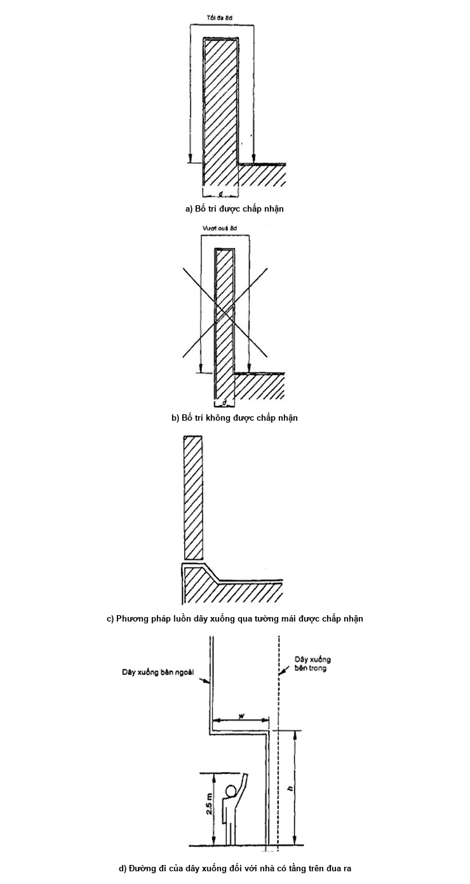

<strong>Hình 21 — Các nhánh vòng</strong>

14. Cực nối đất

**CHÚ THÍCH:** Thông tin thêm về cực nối đất được cho ở phụ lục B.

14.1. Quy định chung

Trước khi bắt đầu quá trình thiết kế, cần quyết định về kiểu của cực nối đất thích hợp nhất với tính chất tự nhiên của đất thu được theo thí nghiệm lỗ khoan.

Các cực nối đất gồm có các thanh kim loại tròn, dẹt, các ống hoặc kết hợp các loại trên hoặc là các bộ phận nối đất tự nhiên như cọc hay móng của công trình (xem B.1.3 và B.1.5).

14.2. Điều kiện đất

14.2.1. Quy định chung

Khi sử dụng các thanh để nối đất, trừ nền đá, chúng nên được đóng vào lớp đất không phải đất đắp, đất lấp hoặc là loại đất dễ bị khô (theo mùa hay do nhiệt tỏa ra từ các thiết bị, nhà máy).

14.2.2. Cực nối đất có lớp bọc để sử dụng bên trong các kết cấu dạng bể chứa

Khi cực nối đất đi qua một kết cấu dạng bể chứa nên áp dụng biện pháp bọc kín như minh họa ở Hình 25.

14.3. Thanh nối đất

14.3.1. Vị trí

Khi sử dụng các thanh nối đất, chúng nên được đóng vào đất ngay bên dưới công trình và càng gần dây xuống càng tốt. Thi công các thanh nối đất xa công trình thường là không cần thiết và không kinh tế (xem Hình 25). Khi các điều kiện về đất là thuận lợi cho việc sử dụng các thanh đứng song song với nhau, sự giảm bớt điện trở nối đất là nhỏ khi khoảng cách giữa các thanh nhỏ hơn chiều dài đóng vào đất.

14.3.2. Đo điện trở nối đất trong quá trình lắp đặt

Trong quá trình đóng các thanh vào đất, nên tiến hành đo điện trở nối đất. Làm như vậy sẽ biết được trạng thái ở đó không cần phải giảm tiếp điện trở nữa, đặc biệt là khi đóng các thanh dài.

14.3.3. Kết nối với mạng nối đất

Điểm kết nối với mạng nối đất phải có khả năng di dời và dễ dàng tiếp cận được từ trên mặt đất để thuận tiện cho việc kiểm tra, đo đạc và bảo dưỡng hệ thống chống sét. Nếu nằm dưới mặt đất, điểm kết nối nên được đặt trong một cái hố hoặc cống được xây dựng cho mục đích kiểm tra. Tuy nhiên, có thể chấp nhận các bố trí đơn giản trong một số trường hợp ví dụ như lắp hệ thống nhỏ, mạng nối đất sâu hơn bình thường hoặc các trường hợp khác phụ thuộc vào điều kiện hiện trường (xem B.1.2).

14.4. Cách thanh dẹt

14.4.1. Vị trí và hình dáng

Khi sử dụng các thanh dẹt, lưới hay bản, có thể chôn chúng bên dưới công trình hoặc trong các rãnh sâu không chịu ảnh hưởng của mùa khô hạn hoặc các hoạt động công nghiệp.

Các thanh dẹt nên được bố trí hướng tâm từ điểm kết nối với dây xuống, số lượng và chiều dài của chúng được xác định sao cho có được điện trở nối đất cần thiết.

Nếu các hạn chế về không gian đòi hỏi sử dụng cách bố trí song song hoặc dạng lưới, nên bố trí như Hình 24 với khoảng cách giữa các thanh song song không nên nhỏ hơn 3 m.

14.4.2. Ăn mòn

Không cho phép bụi than cốc tiếp xúc với các điện cực bọc đồng do tính chất ăn mòn nguy hiểm của chúng. Không nên nhồi muối vào đất xung quanh các cực nối đất.

15. Kim loại ở trong hoặc trên công trình.

**CHÚ THÍCH:** Các thông tin thêm về kim loại ở trong hoặc trên công trình được cho ở B.2.

15.1. Khái niệm chung

Khi sét đánh vào mạng thu sét, điện thế của mạng thu sét với đất tăng lên và, trừ khi có biện pháp phòng ngừa thích hợp, sự phóng điện có thể xảy ra theo các đường khác nhau xuống đất thông qua hiệu ứng lan truyền sét vào các chi tiết kim loại khác trong công trình.

Có 2 biện pháp để phòng ngừa hiệu ứng lan truyền sét, đó là:

a) \- Cách ly

b) \- Liên kết

Biện pháp cách ly yêu cầu khoảng cách ly lớn giữa hệ thống chống sét và các chi tiết kim loại khác trong công trình. Điểm hạn chế chính của biện pháp cách ly nằm ở chỗ rất khó tạo ra và duy trì khoảng cách ly an toàn cần thiết và bảo đảm rằng các chi tiết kim loại được cách ly không kết nối với đất, ví dụ như thông qua nước hoặc các hình thức khác.

Nhìn chung, liên kết là biện pháp thường được sử dụng hơn.

15.2. Ước lượng khoảng cách ly chống lan truyền sét

15.2.1. Khái niệm chung

Khoảng cách ly cần thiết để chống lan truyền sét phụ thuộc vào điện áp duy trì bởi hệ thống chống sét so với đất, điện áp này lại phụ thuộc vào cường độ dòng điện sét. Trình tự đánh giá khoảng cách ly cần thiết được trình bày tại 15.2.2, 15.2.3 và 15.2.4 dưới đây.

**CHÚ THÍCH:** Lý thuyết và thử nghiệm đã chỉ ra rằng các trường điện từ là như nhau đối với một dây xuống được che chắn và một hệ thống thường có kích thước tương tự. Dây dẫn được che chắn có bất lợi là điện thế giữa dây dẫn bên trong và dây dẫn bên ngoài có che chắn có thể lên tới hàng trăm kilôvô đến mức gây ra lan truyền sét. Điểm bất lợi khác nữa là dây dẫn bên trong không tiếp cận được để kiểm tra.

15.2.2. Xác định dòng điện phát sinh

Để xác định dòng điện do sét đánh xuống cần tiến hành theo các bước sau:

&nbsp;&nbsp;\- Ước lượng xác suất sét đánh vào công trình p (xem 7.2).

&nbsp;&nbsp;\- Chia xác suất ước lượng, p cho xác suất sét đánh cho phép $p_{0}$ (xem Hình 25).

&nbsp;&nbsp;\- Sử dụng Hình 25 xác định được dòng điện có cường độ lớn nhất có khả năng phát sinh.

15.2.3. Điện áp duy trì bởi hệ thống chống sét

Điện áp này có 2 thành phần: một là tích của dòng điện và điện trở nối đất và thành phần khác là tích của độ biến thiên dòng điện với điện cảm tự cảm của dây dẫn sét. Trường hợp nguy hiểm nhất, tổng của hai tích này sẽ cho giá trị điện áp cần sử dụng trong tính toán.

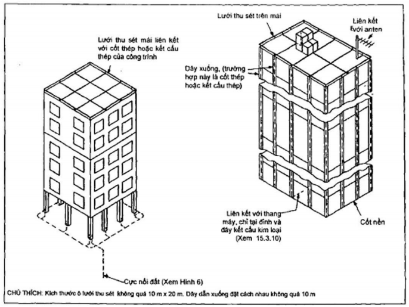

<strong>Hình 22 — Hệ thống chống sét cho nhà cao tầng (trên 20m), thể hiện bộ phận thu sét, dây xuống liên kết với bộ phận nhô lên trên mái</strong>

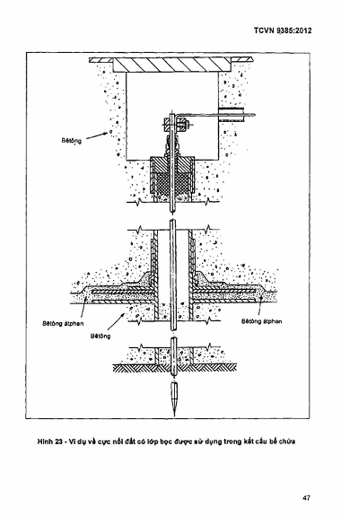

<strong>Hình 23 — Ví dụ về cực nối đất có lớp bọc được sử dụng trong kết cấu bể chứa</strong>

| Mặt bằng bố trí cho các dây song song (nét liền đậm) hoặc dạng lưới (nét đứt) — (a) Cực nối đất dạng dây dẹt | Mặt bằng bố trí cho các dây song song (nét liền đậm) hoặc dạng lưới (nét đứt) — (b) Cực nối đất đơn hoặc đa cực |
| :--- | :--- |

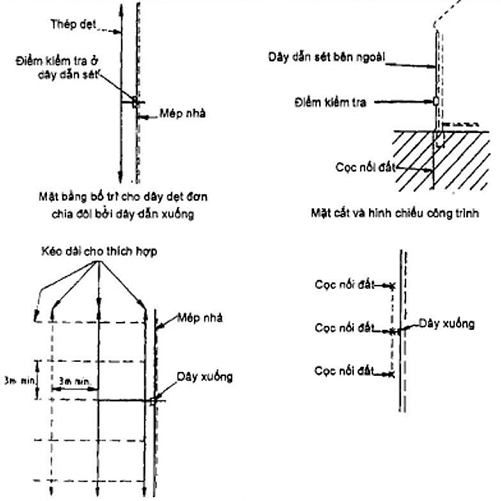

> CHÚ THÍCH 2: Điện thế ở mặt đất có thể giảm bằng cách chôn thanh hoặc dây thép sâu hơn.
>
> CHÚ THÍCH 2: Điện thế ở mặt đất có thể giảm bằng cách chôn thanh hoặc dây thép sâu hơn.
>
> _CHÚ THÍCH:_

**CHÚ THÍCH 1:** ** Khi phần mạng nối đất cần thiết phải chạy gần hoặc dưới đường đi, phần đó nên được chôn sâu không dưới 0,6 m tính từ mặt đất.

<strong>Hình 24 — Mạng nối đất: bố trí các cực nối đất</strong>

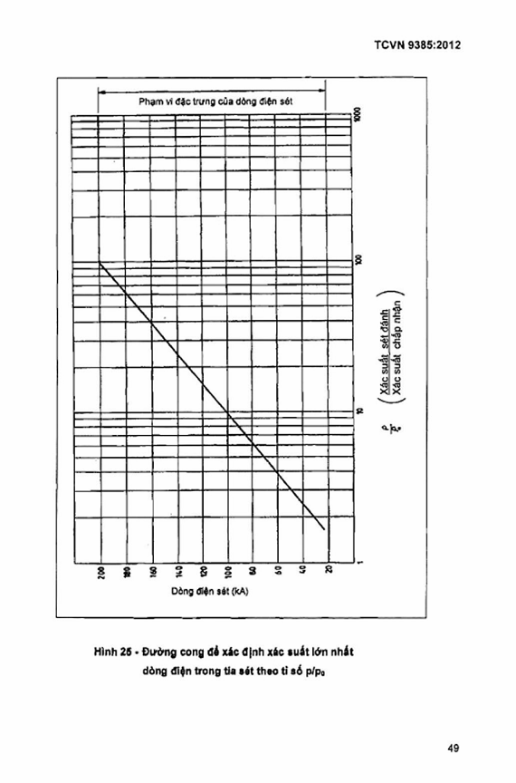

<strong>Hình 25 — Đường cong để xác định xác suất lớn nhất dòng điện trong tia sét theo tỉ số p/p0</strong>

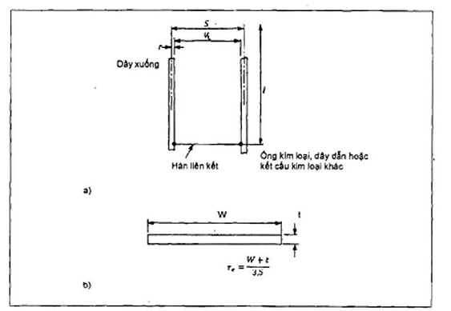

<strong>Hình 26 — Điện cảm ứng truyền trong mạch đơn giản</strong>

15.2.4. Quan hệ giữa điện áp phóng điện và khoảng cách.

Hình 27 minh họa quan hệ giữa điện áp phóng điện trong không khí, qua bề mặt thể xây và qua vết nứt trong khối xây gạch với khoảng cách. Điện áp phóng điện đối với một khoảng cách cho trước được xác định từ Hình 27 để so sánh với kết quả tính toán điện cảm. Ví dụ tính toán để quyết định có cần liên kết các chi tiết kim loại vào hệ thống chống sét hay không được thể hiện ở Phụ lục D.

15.2.5. Tính toán điện cảm phát sinh giữa một dây dẫn sét và các chi tiết kim loại dễ bị ảnh hưởng bởi hiệu ứng lan truyền sét.

Mặc dù cho đến nay thuật ngữ điện cảm tự cảm được sử dụng cho việc tính toán điện áp cảm ứng, trên thực tế điện áp cảm ứng được sinh ra trong một mạch kín tạo bởi chính dây xuống và các chi tiết kim loại khác. Do đó nói chính xác hơn điện áp cảm ứng sẽ tỷ lệ với hiệu của điện cảm tự cảm (L) trừ đi điện cảm tương hỗ (m) giữa dây dẫn sét với các chi tiết kim loại. Hiệu số này được gọi là điện cảm truyền dẫn ($m_{t}$) và được dùng thay thế cho điện cảm tự cảm trong việc tính toán điện áp cảm ứng. Điện cảm truyền dẫn có thể được tính theo phương trình (6).

Cho một dây dẫn sét đứng có tiết diện tròn bán kính r (m), cách các bộ phận kim loại thẳng đứng khác một đoạn là S (m), trong đó S là khoảng cách giữa tâm của 2 dây dẫn như Hình 26 a) và l là chiều cao của mạch, điện cảm ứng truyền $m_{t}$ (đo bằng micro henry) được tính theo phương trình:

$$\frac{S}{r} \qquad (7)$$
<!-- formula_id: "F_TCVN_9385_2012_FORMULA_7" -->

Với những dây xuống không có tiết diện tròn thì phải dùng bán kính hiệu dụng $r_{e}$ (Xem Hình 26-b). Ví dụ với dây có tiết diện ngang là 25 mm x 3 mm, $r_{e}$ (m) được tính theo phương trình dưới đây:

$$R_{e} = \frac{w + t}{3,5} = \frac{0,025 + 0,003}{3,5} = 0,008$$
<!-- formula_id: "F_TCVN_9385_2012_RID85" -->

$$\dots \qquad (8)$$
<!-- formula_id: "F_TCVN_9385_2012_FORMULA_8" -->

Tuy nhiên cách tính $m_{t}$ không bị ảnh hưởng bởi hình dạng tiết diện ngang của ống kim loại hay các chi tiết kim loại khác. Khi đã tính được $m_{t}$ thì điện cảm $V_{L}$ (kV) phát sinh trong mạch minh họa ở Hình 26-a được tính theo phương trình (9):

$$V_{L} = \left(\frac{di}{dt}\right)_{max} \times \frac{M_{T}}{n}$$
<!-- formula_id: "F_TCVN_9385_2012_RID87" -->

$$\dots \qquad (9)$$
<!-- formula_id: "F_TCVN_9385_2012_FORMULA_9" -->

Trong đó $\left(\frac{di}{dt}\right)_{max}$ là độ biến thiên lớn nhất của dòng điện (kA/s) nghĩa là 200 kA/s (xem Phụ lục A.1)

N là số lượng dây xuống cùng chịu dòng điện do sét truyền vào.

Khi có nhiều dây xuống thì khoảng cách S từ dây có sét đến dây xuống gần nhất cần phải được sử dụng để tính toán.

VÍ DỤ:

Khi sử dụng phương trình (6) nếu S = 1 m, l = 5 m và n = 4;

$V_{L}$ = 200 x $\frac{0,46 \times 5log_{10}(1/0,008)}{3,5}$

$V_{L}$ = 240 V

Từ Hình 27, khoảng cách từ điểm cao nhất của mạch (có thể là một nhánh của kết cấu kim loại) đến dây xuống sẽ phải nhỏ đến 0,4 m tại một vị trí nhất định để tạo ra khả năng phóng điện. Nhánh của kết cấu kim loại, nếu ở trong khoảng cách đó thì được hàn liên kết với dây dẫn xuống cho an toàn.

Với công trình có mặt bằng dạng chữ nhật hoặc hình vuông có hơn 4 dây xuống, dây xuống ở góc sẽ chịu một điện áp lớn hơn mức trung bình của tổng dòng điện (i) (nghĩa là > i/n), do đó hệ số 30 % phải được tính thêm vào điện áp phát sinh gần dây dẫn đó. Ngược lại, ở vùng giữa của công trình có rất nhiều dây xuống (cách xa dây xuống nằm  ở góc) giá trị di/dt là thấp hơn giá trị được đưa ra bởi số lượng dây xuống khoảng 30 % và nguy cơ lan truyền sét là tương đối ít, với giả thiết rằng các thiết bị được liên kết sao cho điện trở của đất không tạo ra sự chênh lệch điện thế.

15.3. Tình huống cần thiết phải liên kết

(Xem thêm Phụ lục B.2)

15.3.1. Khi liên kết các chi tiết kim loại liền kề với hệ thống chống sét, cần phải cân nhắc kỹ về các tác động có thể xảy ra của các liên kết đối với các chi tiết kim loại đã được bảo vệ ca-tốt. Cần lưu ý tới các khuyến cáo từ 15.3.2 đến 15.3.11.

15.3.2. Với các công trình có kim loại dẫn điện liên tục (ví dụ như mái, tường, sàn, vỏ bọc hoặc tường bao kim loại) những chi tiết kim loại này có thể được sử dụng như một bộ phận trong hệ thống chống sét với điều kiện số lượng và cách bố trí của chi tiết kim loại tạo ra nó phù hợp với việc sử dụng, như trong khuyến cáo ở Điều 11, 12, 13 và 14.

15.3.3. Với công trình đơn giản chỉ là một khung kim loại liên tục, thì không cần phải có bộ phận thu sét hay dây xuống. Khung đó đủ điều kiện để đảm bảo tính liên tục về mặt cơ học và dẫn điện.

15.3.4. Một kết cấu bê tông cốt thép (BTCT) hoặc một kết cấu khung BTCT có thể có điện trở nối đất của bản thân chúng khá nhỏ để có thể làm phương tiện bảo vệ sét đánh. Nếu các mối nối được đưa ra bên ngoài điểm cao nhất của cốt thép trong lúc xây dựng thì việc kiểm tra có thể được tiến hành để xác minh điều này khi hoàn thành công trình (xem Hình 6).

Nếu điện trở nối đất của khung thép của công trình hoặc cốt thép trong kết cấu BTCT đảm bảo thì cần lắp đặt một bộ phận thu sét ngang ở trên điểm cao nhất và liên kết với khung thép hoặc cốt thép.

**CHÚ THÍCH:** Trong trường hợp đặc biệt của tháp làm lạnh nước thường không lắp bộ phận thu sét.

Khi không thể kiểm tra theo cách thông thường thì nên sử dụng vật liệu chống rỉ để liên kết với thép hoặc cốt thép và nên đưa ra ngoài để kết nối với bộ phận thu sét. Cần trang bị bổ sung dây xuống và bộ phận thu sét nếu khi kiểm tra điện trở nối đất của bản thân công trình không thỏa mãn (xem 13.1)

15.3.5. Khi công trình có các chi tiết kim loại không thể liên kết vào mạng có tính dẫn điện liên tục và nó không hoặc không thể được trang bị hệ thống nối đất bên ngoài, thì sự tồn tại của nó có thể được bỏ qua. Mối nguy hiểm do các chi tiết kim loại đó có thể giảm thiểu bằng cách cách ly hoàn toàn các chi tiết kim loại đó với hệ thống chống sét, phương án xử lý cần tham khảo các khuyến cáo ở 15.2.

15.3.6. Khi bộ phận mái công trình được kim loại che phủ hoàn toàn hoặc một phần thì cần phải thận trọng khi liên kết nó với hệ thống chống sét.

15.3.7. Trong bất cứ kết cấu nào, kim loại gắn với mặt ngoài hoặc nhô ra khỏi tường hay mái mà có khoảng cách ly đến hệ thống chống sét là không đủ và không thích hợp để sử dụng như một phần của hệ thống đó thì cần gắn càng trực tiếp càng tốt với hệ thống chống sét. Nếu có chi tiết kim loại nào chạy gần với bộ phận thu sét, ví dụ như đường ống nước chạy đến bể chứa nước trên mái, dây cáp, các đường ống, máng xối, ống dẫn nước mưa và cầu thang, và nếu các chi tiết này chạy gần như song song với dây xuống hoặc liên kết với nó, nó phải được liên kết ở các điểm cuối nhưng không thấp hơn điểm kiểm tra. Nếu các chi tiết này không liên tục thì mỗi phần của nó phải được liên kết với hệ thống chống sét, khi đã có các khoảng không cho phép thì sự tồn tại của các chi tiết kim loại đó có thể bỏ qua.

15.3.8. Khối kim loại trong công trình như khung chuông trong nhà thờ, tường bao, các thiết bị máy móc mà nó được kết nối hoặc tiếp xúc với đường ống nước hoặc các thiết bị có cáp điện mà bản thân nó nối đất phải được liên kết đến dây xuống gần nhất bằng đường đi càng trực tiếp càng tốt.

15.3.9. Kim loại đi vào hoặc đi ra công trình ở dạng có vỏ bọc hoặc ống dẫn điện, gas, nước, nước mưa, hơi nước, khí nén hoặc các thiết bị khác phải được liên kết càng trực tiếp càng tốt đến cực nối đất. Điểm kết nối phải được làm tại vị trí mà các thiết bị đó đi ra hoặc vào công trình. Khi các chi tiết kim loại ở dạng là một phần của thiết bị chìa ra khoảng cách ly (xem 15.2), nó phải được liên kết với phần gần nhất của hệ thống chống sét ở điểm cao nhất của thiết bị và với các khoảng cách không vượt quá 20 m.

Do các thiết kế hệ thống chống sét rất đa dạng nên không có khuyến cáo chính xác nào được  đưa ra. Tuy nhiên, cần phải lưu ý rằng có thể có vấn đề khi các đường ống hoặc cáp được bọc cách nhiệt hoặc cách điện. Với trường hợp như vậy, mối liên kết phải được thực hiện ở điểm gần nhất nơi mà phần kim loại của ống hoặc cáp được lộ ra. Mối liên kết sau đó phải được nối với hệ thống nối đất bên ngoài công trình càng thẳng càng tốt.

15.3.10. Điều này rất có thể được áp dụng trong công trình biệt lập mà ở đó các thiết bị được kết nối với nhau. Tuy nhiên, khi công trình bao quanh bởi các chi tiết bằng thép gồm một loạt các chi tiết dạng ống nối với nhau thì bản thân nó rất có thể trở thành một điểm thích hợp để nối đất. Đối với hệ thống cấp điện, việc ứng dụng dây "không" chung (vừa là dây bảo vệ, vừa là dây làm việc, PEN) là có vấn đề vì việc ngắt dây trung tính có thể gây dòng tải ngược từ điện cực nối đất. Điều đó có thể gây nguy hiểm cho bất cứ ai ngắt mạch điện cực nối đất để đo thử nghiệm.

Hệ thống kết nối điển hình được thể hiện trong Hình 28. Quy tắc chung là mọi hệ thống cần được đánh giá về ưu điểm của nó và được thảo luận với các bên có liên quan để quyết định phương án phù hợp.

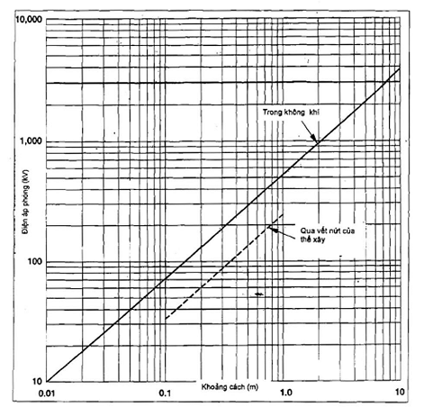

<strong>Hình 27 — Đường quan hệ điện áp phóng điện theo khoảng cách</strong>

15.3.11. Khi lắp đặt thang máy, kết cấu kim loại liên tục bao gồm cả ray dẫn hướng phải được kết nối với hệ thống chống sét ở điểm cao nhất và điểm thấp nhất của bộ phận lắp.

Khi cốt thép hoặc các chi tiết kết cấu kim loại tạo thành một bộ phận của hệ thống chống sét, thì việc kết nối các chi tiết kim loại này là cần thiết.

Khi khó có thể tận dụng được cốt thép hoặc kết cấu kim loại của công trình thì hệ thống thang máy cần được liên kết với hệ thống an toàn điện nối đất ở cả điểm cao nhất và thấp nhất. Trong mỗi trường hợp, cần liên kết ở điểm nối đất của bảng điện gần nhất.

16. Kết cấu cao trên 20 m

**CHÚ THÍCH:** Có thể xem thêm thông tin về các kết cấu cao trong B.2 và B.5.

### 16.1  Các kết cấu không dẫn điện

Trên các kết cấu không dẫn điện, nên có ít nhất 2 dây xuống đặt cách đều nhau và đảm bảo rằng, khi sử dụng phương pháp hình cầu lăn (xem B.5), bộ phận thu sét sẽ tạo ra vùng bảo vệ mong muốn. Trên các ống khói, dây xuống nên nối với chóp kim loại của ống khói hoặc với dây dẫn quanh đỉnh ống khói.

16.2. Các kết cấu dẫn điện

Có thể áp dụng các quy định ở 15.3.4 cho những kết cấu cao dẫn điện, nhưng tại những vị trí cần các dây xuống nên nối ít nhất 2 dây dẫn và đặt cách nhau không quá 10 m quanh chu vi.

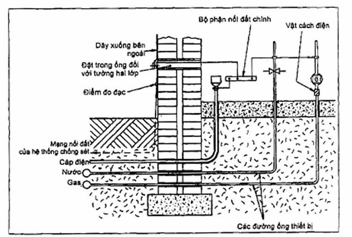

<strong>Hình 28 — Sơ đồ liên kết các thiết bị (gas, nước và điện)</strong>

16.3. Tháp và chóp nhà thờ

Thực tế đã chứng minh sét có thể đánh vào phía dưới điểm cao nhất của các kết cấu cao, do đó nên sử dụng ít nhất hai dây dẫn cho tất cả các tòa tháp và ngọn tháp nhà thờ.

Đối với các kết cấu không dẫn điện, nên thiết kế một lưới thu sét (xem Điều 14) xung quanh tường bao của một tòa tháp; và cũng nên bao gồm trong hệ thống cả cột cờ và bất kỳ những điểm nhô ra nào khác trên tường mái. Mọi vị trí còn lại của nhà thờ nên được bảo vệ theo tiêu chuẩn này và phù hợp với đỉnh, mái hiên và các dây xuống, các mạng nối đất và bộ phận đẳng áp bảo vệ sét. Các dây xuống không nên gắn ở bên trong (xem Hình 29).

Cái mái nhà bằng kim loại có thể được sử dụng như các lưới thu sét (xem Bảng 4 và Hình 16).

17. Công trình có mái che rất dễ cháy

17.1. Các bộ phận thu sét

Với công trình có mái che bằng rơm, tranh, cây, cỏ hoặc các vật liệu có khả năng dễ cháy cao, có thể treo bộ phận thu sét tách khỏi mái một đoạn ít nhất 0,3 m trên bộ phận đỡ không dẫn điện và không cháy hoặc các bộ phận thu sét có thể đặt trên một thanh gỗ cứng dẹt có độ rộng tối thiểu là 75 mm. Với mạng dây được tạo ra để bảo vệ mái che bằng rơm rạ và các mái nhà được lợp theo cách tương tự chống lại các cơn gió và bầy chim, mạng đó không nên kết nối với hệ thống chống sét.

17.2. Dây dẫn và các ghép nối

Với các dây dẫn hoặc các ghép nối buộc phải xuyên qua vật liệu làm mái, nên bố trí vào trong các ống không dẫn điện và không cháy.

18. Nhà chứa các vật có khả năng gây nổ hoặc rất dễ cháy

18.1. Quy định chung

Những vấn đề phát sinh trong quy định về các hệ thống chống sét cho các kết cấu có chứa vật gây nổ hoặc rất dễ cháy tốt nhất nên giải quyết bằng cách hỏi ý kiến các chuyên gia thông thạo về luật hoặc các quy định của chính phủ và các quy phạm thực hành.

Có thể chấp nhận một rủi ro nhất định nếu các vật liệu nguy hiểm được bảo quản một cách nghiêm ngặt, như trong phòng thí nghiệm hoặc kho chứa nhỏ, hoặc tại nơi kết cấu được đặt ở vị trí tách biệt hoặc được thiết kế đặc biệt để hạn chế những ảnh hưởng của thảm họa có thể xảy ra. Trường hợp các vật liệu nguy hiểm không bị hở ra mà được che kín hoàn toàn trong thùng bằng kim loại có độ dày thích hợp thì ngoại trừ phải đảm bảo nối đất thích hợp, có thể không cần bố trí hệ thống chống sét. Trong các trường hợp khác, mối nguy hiểm tới sinh mạng và tài sản có thể đòi hỏi phải áp dụng tất cả các biện pháp có thể có để bảo vệ trước tác động của sét đánh. Đề xuất cho các trường hợp này được trình bày trong 18.2 và có thể áp dụng cho các kết cấu ở đó các chất rắn, chất lỏng, gas, hơi nước hoặc bụi dễ nổ hoặc rất dễ cháy được chế tạo, chứa đựng, hoặc ở đó các chất khí, hơi hoặc bụi dễ cháy nổ có thể tích tụ lại.

| 1. Dây thu sét 2. Dây xuống 3. Liên kết để giữ thanh đứng 4. Dây thu sét ngang | 5. Dây đứng 6. Dây nóc mái 7. Dây viền mái 8. Điểm đo kiểm tra | 9. Cực nối đất 10. Nối đất của hệ thống điện 11. Liên kết với khung đỡ chuông 12. Dây dẫn quanh chu vi |
| :--- | :--- | :--- |

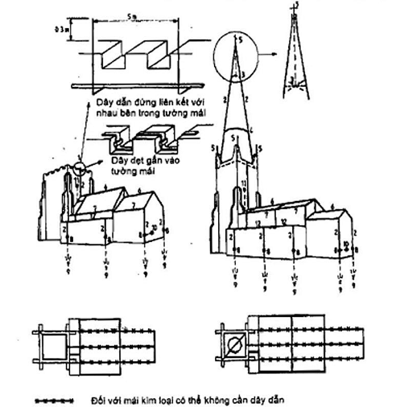

> _CHÚ THÍCH:_

**CHÚ THÍCH 1:** **
>
> CHÚ THÍCH 2: Mái kim loại có thể sử dụng làm bộ phận thu sét.
>
> CHÚ THÍCH 2: Mái kim loại có thể sử dụng làm bộ phận thu sét.
>
> CHÚ THÍCH 2: Mái kim loại có thể sử dụng làm bộ phận thu sét.
>
> **CHÚ THÍCH:** Ô lưới thu sét nên có kích thước 10 x 20 (m). Khoảng cách các dây xuống xung quanh chu vi nên là 20 m đối với kết cấu thấp hơn 20 m, là 10 m đối với kết cấu cao 20 m trở lên. Dây dẫn ngang từ mái trở xuống nên cách nhau 20 m.

<strong>Hình 29 — Tháp và chóp nhà thờ</strong>

18.2. Các phương pháp bảo vệ chống sét đánh

18.2.1. Bộ phận thu sét dạng treo

Lưới thu sét nên được treo ở độ cao thích hợp trên vùng cần bảo vệ. Nếu chỉ dùng một dây dẫn đặt nằm ngang, góc bảo vệ chấp nhận được không nên quá 30° (xem Hình 17).

Nếu sử dụng hai hay nhiều dây dẫn nằm ngang song song nhau, góc bảo vệ thích hợp có thể lên tới 45° trong không gian được bao quanh bởi các dây dẫn, nhưng không vượt quá 30° bên ngoài không gian đó (xem Hình 30). Độ cao của dây dẫn nằm ngang nên lựa chọn theo các gợi ý trong 15.2 (xem Hình 30); trong trường hợp còn chưa chắc chắn, nên tham khảo ý kiến chuyên gia. Bộ phận đỡ của lưới thu sét nên được nối đất một cách phù hợp.

Có thể dùng cách khác đối với những nơi chi phí cho phương pháp ở trên là không hợp lý và không có các rủi ro liên quan tới dòng sét đánh vào bề mặt của kết cấu cần được bảo vệ, có thể chọn lựa một trong hai cách lắp đặt sau đây:

a) \- Bộ phận thu sét dạng treo như thể hiện trên Hình 30 nhưng ở đó các góc bảo vệ là 45° thay vì 30°, và 60° thay vì 45°;

b) \- Một lưới dây dẫn nằm ngang với mỗi mắt lưới 10 m x 5 m hoặc nhỏ hơn tùy theo mức độ rủi ro, được cố định trên mái của kết cấu (xem Hình 15).

**CHÚ THÍCH:** Mỗi kết cấu riêng biệt được bảo vệ theo các cách này nên được nối với số dây xuống và các bộ phận nối đất gấp đôi so với đề xuất ở 12.3.

18.2.2. Các dây dẫn đứng

Một kết cấu hoặc nhóm các kết cấu có kích thước ngang nhỏ có thể được bảo vệ bằng một hoặc nhiều dây dẫn sét đứng. Nếu sử dụng một dây xuống, góc bảo vệ tính toán không nên quá 30°.

Nếu sử dụng hai hay nhiều dây xuống, góc bảo vệ có thể là 45° trong không gian bị giới hạn bởi các dây dẫn, nhưng không nên quá 30° bên ngoài không gian đó. Minh họa về phương pháp bảo vệ này được thể hiện trên Hình 31.

18.2.3. Các kết cấu bị chôn một phần hay toàn bộ dưới đất

18.2.3.1. Kết cấu bị chôn một phần dưới đất nên được bảo vệ theo cách tương tự như đối với kết cấu ở trên mặt đất.

18.2.3.2. Nếu kết cấu hoàn toàn nằm dưới mặt đất và không được kết nối với bất kỳ thiết bị nào trên mặt đất có thể được bảo vệ nhờ một lưới thu sét như trong 18.2.1a, cùng với mạng nối đất của nó là hoàn chỉnh. Khả năng chặn xung điện của đất có thể được tính đến khi xác định mức độ rủi ro của việc phát tia lửa điện từ hệ thống bảo vệ tới kết cấu được bảo vệ, bao gồm các bộ phận phụ trợ của nó. Tại nơi độ sâu chôn lấp là thích hợp, lưới thu sét có thể được thay thế bằng mạng các thanh nối đất dẹt được sắp xếp trên bề mặt theo lời khuyên của chuyên gia. Ở những nơi chấp nhận phương pháp này, nên bỏ qua các đề xuất ghép nối cho kim loại, hoặc các dây dẫn kim loại đưa vào kết cấu (xem 18.2.4, 18.2.5 và 18.2.6).

18.2.4. Các cực nối đất mạch vòng

Các cực nối đất của mỗi hệ thống chống sét nên được nối với nhau bằng một cực nối đất mạch vòng. Cực nối đất mạch vòng này nên được chôn ở độ sâu ít nhất 0,6 m trừ khi có những lý do khác, như cần liên kết của các vật thể khác tới nó, hoặc để lộ ra trong trường hợp cần đo kiểm tra. Các cực nối đất mạch vòng của các kết cấu kề nhau nên được nối với nhau.

18.2.5. Kim loại trên hoặc trong kết cấu (xem B.2)

18.2.5.1. Tất cả kim loại chính tạo ra các bộ phận của kết cấu, bao gồm cốt thép bằng kim loại và các bộ phận phụ trợ bằng kim loại có tính liên tục, nên được ghép cùng nhau và nối với hệ thống chống sét. Các kết cấu nối như vậy nên được làm ít nhất tại hai nơi (xem Hình 15) và ở bất cứ nơi nào có thể, nên đặt cách đều nhau không quá 10 m quanh chu vi của kết cấu.

18.2.5.2. Các chi tiết kim loại bên trong kết cấu nên được gắn với hệ thống chống sét (xem 12.9).

18.2.5.3. Việc sử dụng kho bằng thép chuyên dụng nối hàn để chứa các chất nổ đã trở nên khá phổ biến. Đối với các kho như thế, việc bảo vệ sét thích hợp được thực hiện bằng cách nối đất kết cấu ở ít nhất hai điểm.

18.2.6. Dây dẫn điện vào công trình

18.2.6.1. Các dây dẫn điện vào công trình dễ cháy nổ nên đưa vào trong ống kim loại. Vỏ bọc kim loại này cần được liên tục về điện trong toàn kết cấu; nên được nối đất tại điểm đầu vào trong kết cấu bên phía hệ thống dịch vụ của người dùng và được gắn trực tiếp tới hệ thống chống sét (xem Hình 28). Nên có sự thỏa thuận giữa các bên liên quan khi đấu nối.

18.2.6.2. Tại nơi các dây dẫn điện nối với một đường dây cung cấp điện ở trên cao, nên chèn một đoạn cáp kim loại hoặc bọc kim loại có chiều dài 15 m được chôn sâu vào giữa đường dây trên cao và điểm nối vào kết cấu (xem Hình 32). Nên chú ý tới các quy định có liên quan (xem Điều 24). Việc thực hiện điều này một cách chuẩn xác là quan trọng, cần có sự thống nhất của các bên có liên quan.

**CHÚ THÍCH:** Sét đánh có thể gây xung điện lớn trên các đường dây cấp điện bên trên. Do đó, nên có bộ phận hãm xung điện tại những nơi các đường dây cấp điện bên trên nối với cáp chôn dưới đất. Điều này sẽ cho phép phần lớn dòng điện do sét gây ra được truyền vào đất tại một khoảng cách an toàn so với kết cấu.

$\text{Sơ đồ: Dây thu sét treo ngang - Công trình được bảo vệ - Cực nối đất}$

a) Mặt đứng

b) Mặt bằng

$\begin{array}{rl}
\text{Ký hiệu:} & \\
\text{-- -- --} & \text{Vùng bảo vệ ở vị trí đỉnh dây} \\
\text{--- $\times$ ---} & \text{Vùng bảo vệ ở vị trí dây võng nhất} \\
\\
\text{Góc nghiêng:} & 30^\circ, \, 45^\circ, \, 45^\circ, \, 30^\circ \\
\text{Đối tượng:} & \text{Công trình được bảo vệ}
\end{array}$

c) Mặt đứng đầu hồi thể hiện vùng bảo vệ

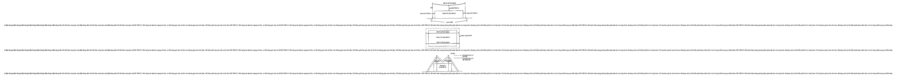

**CHÚ THÍCH 1:** Khi dùng hai dây thu ngang trở lên, có thể dùng góc bảo vệ 45° cho không gian bao bởi dây. Chỗ khác giới hạn góc bảo vệ là 30°.

**CHÚ THÍCH 2:** Để tránh hiện tượng phóng điện giữa dây thu và công trình, khoảng cách ly tối thiểu phải là 2 m hoặc theo 15.2 tùy theo giá trị nào lớn hơn. Khoảng cách ly tối thiểu phải được đảm bảo ở vị trí võng nhất trong mọi điều kiện.

<strong>Hình 30 — Bộ phận thu sét có hai dây thu sét treo ngang và vùng bảo vệ cho kết cấu có chứa chất nổ hoặc chất rất dễ cháy</strong>

$30^\circ, \quad \text{Tối thiểu } 2\text{m}$

a) Mặt đứng

b) Mặt bằng

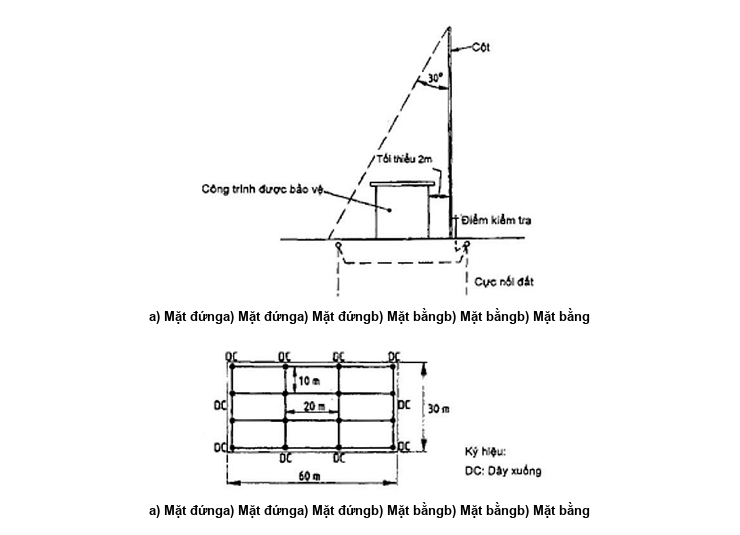

<strong>Hình 31 — Các kim thu sét đứng của nhà kho chứa chất nổ</strong>

18.2.7. Các đường ống, lan can hoặc tương tự nối vào công trình

Các ống dẫn bằng kim loại, dây thép, lan can, đường ray tàu hỏa hoặc các biển hướng dẫn không liên kết thông điện với đất mà nối với công trình chứa vật dễ cháy, nổ, cần được gắn với hệ thống chống sét. Các vật này nên được nối đất tại điểm đầu vào bên ngoài kết cấu và tại 2 điểm xa hơn, một điểm cách xa 75 m và điểm kia cách 75 m tiếp theo. Việc nối đất các lan can nên được thực hiện tại các điểm sau:

&nbsp;&nbsp;\- Điểm đi vào hoặc đi ra kết cấu;

&nbsp;&nbsp;\- Cách xa điểm đi vào hoặc ra 75 m; nghĩa là hướng vào trong nếu đó là kết cấu ngầm hoặc hướng ra ngoài nếu ở trên mặt đất;

&nbsp;&nbsp;\- Cách xa điểm đi vào hoặc ra 150 m hoặc bên ngoài kết cấu trong trường hợp nằm phía trên mặt đất;

&nbsp;&nbsp;\- Các điểm cách nhau 75 m khi lắp đặt dưới mặt đất.

Các yêu cầu này cũng áp dụng cho các tuyến bề mặt trên đó có sử dụng cần trục hoặc cầu trục lưu động (xem 15.3.9).

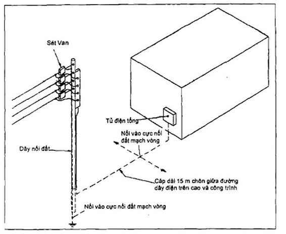

<strong>Hình 32 — Bảo vệ đặc biệt chống quá dòng do sét gây ra trong nguồn điện cấp vào nhà có chứa chất nổ hoặc chất rất dễ cháy</strong>

18.2.8. Đường hoặc hầm vào công trình

Đối với công trình ngầm hoặc các hố đào dưới mặt đất được tiếp cận bằng đường hoặc hầm vào cần tuân theo các gợi ý ở 18.2.7 về việc nối đất bổ sung tại các khoảng cách không quá 75 m, cũng như bên ngoài kết cấu.

18.2.9. Các hàng rào, tường chắn

Các chi tiết thẳng đứng bằng kim loại, các bộ phận và dây kim loại của tất cả các hàng rào và tường chắn trong phạm vi 2 m của kết cấu nên được nối theo cách để tạo ra một kết nối kim loại liên tục giữa chúng và hệ thống chống sét (xem Điều 20).

18.2.10. Các lỗ thông hơi

Để giảm thiểu nguy cơ sét đánh thẳng, các lỗ thông hơi của bất kỳ các thùng chứa cố định nào bao gồm bình gas hoặc chất lỏng dễ cháy, và các lỗ thông khí hoặc ống khói từ các nhà máy chế biến sinh ra hơi hoặc bụi dễ cháy, nếu có thể, nên được đặt trong vùng bảo vệ của hệ thống chống sét. Do điều này không hoàn toàn ngăn chặn sự phát cháy, các lỗ thông hơi cần được bảo vệ tránh sự lan cháy bằng việc sử dụng các vật chặn lửa, các thiết bị lọc khí trơ hoặc các phương tiện thích hợp khác.

18.2.11. Mối nguy hiểm từ các bộ phận cao ở trên hoặc gần các kết cấu dễ bị sét đánh

Không nên trang bị các bộ phận cao như chóp tháp, cột cờ hoặc các dây ăng ten vô tuyến cho các kết cấu dễ bị sét đánh hoặc bố trí chúng trong phạm vi 50 m quanh kết cấu. Khoảng cách ly đó cũng áp dụng đối với việc trồng cây mới, nhưng các kết cấu gần cây đã có nên được xử lý phù hợp với các khuyến cáo ở Điều 21.

18.2.12. Đo kiểm tra độ an toàn

Việc đo kiểm tra nên được thực hiện phù hợp với khuyến cáo ở Điều 28 và thiết bị đo đạc phải thuộc loại an toàn đối với từng trường hợp nguy hiểm cụ thể.

19. Nhà ở

Các quy định của tiêu chuẩn này có thể áp dụng cho nhà ở. Việc chống sét cho các tòa nhà có các ăng ten vô tuyến truyền hình và truyền thanh được nêu chi tiết hơn ở Điều 22. Tại nơi có hệ thống chống sét, gợi ý cách xử lý đối với các đường ống thông hơi bằng kim loại được minh họa trên Hình 33.

20. Hàng rào

20.1. Bản chất của mối nguy hiểm

Nếu sét đánh vào một hàng rào kim loại kéo dài, đoạn giữa điểm bị sét đánh và điểm nối đất gần nhất sẽ tăng ngay lập tức đến một điện thế cao tương đối so với điện thế của đất. Con người hoặc vật nuôi ở gần, hoặc tiếp xúc với hàng rào tại thời điểm sét đánh vào hàng rào có thể bị nguy hiểm. Do đó, cần nối hàng rào tới đất thông qua các cực nối đất tại các đoạn, sao cho có thể tiêu sét một cách hiệu quả nhất.

Về ý tưởng, nên ngắt sự liên tục của hàng rào bằng cách tạo khe hở có đệm chất cách ly dọc chiều dài của hàng rào bởi điều này giúp hạn chế ảnh hưởng của sét đánh tới các đoạn riêng biệt. Tuy nhiên, ở các hàng rào chủ yếu dùng cho các lý do an ninh, việc đưa ra các khe cách ly sẽ làm nảy sinh các vấn đề khác.

Khuyến cáo đối với hàng rào dùng cho các mục đích cụ thể được nêu trong 20.2 và 20.3.

| a) Nhà bằng vật liệu không dẫn điện có ăngten TV trên mái và bộ phận kỹ thuật liên kết với dây xuống | Ống thông hơi được nối đất |
| :--- | :--- |
| b) Cực nối đất vòng cho nhà bằng vật liệu không dẫn điện xây trên nền đá | $\frac{s_w}{h_0}$ |
| $\frac{s_w}{h_0}$ c) Nhà xây bằng đá có cột đỡ ăngten TV được liên kết nối đất và hệ thống máng liên kết với dây xuống | $\frac{s_{w,\max}}{h_0}$ Mặt bằng thể hiện hệ thống chống sét điển hình |

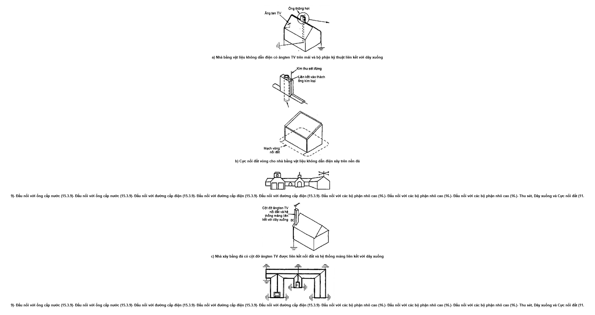

> CHÚ THÍCH: Cần tham khảo thêm các điều sau:
>
> &nbsp;&nbsp;\- Đấu nối với ống cấp nước (15.3.9)
>
> &nbsp;&nbsp;\- Đấu nối với đường cấp điện (15.3.9)
>
> &nbsp;&nbsp;\- Đấu nối với các bộ phận nhô cao (16.)
>
> &nbsp;&nbsp;\- Thu sét, Dây xuống và Cực nối đất (11.; 12.; và 13.)
>
> d) Công trình lớn biệt lập

<strong>Hình 33 — Bảo vệ sét đánh cho các thiết bị trong nhà</strong>

20.2. Bảo vệ vật nuôi trên cánh đồng

20.2.1. Thông tin chung

Thiệt hại về vật nuôi khi có sét đánh trong các cơn mưa dông chủ yếu là do các bầy đàn tụ họp dưới gốc cây trên các cánh đồng trống hoặc quanh các hàng rào bằng kim loại không được nối đất nên bị dòng điện sét phóng vào đủ lớn để giết chết chúng.

Do bản chất của việc nuôi thả vật nuôi trên cánh đồng không thể loại trừ hoàn toàn mối nguy hiểm, nhưng nếu muốn giảm mối nguy hiểm này thì nên thực hiện các biện pháp phòng ngừa trong 20.2.2 và 20.2.3.

20.2.2. Nối đất

Với các hàng rào được xây dựng bằng các cọc kim loại thẳng đứng và các dây kim loại dẫn điện liên tục, ví dụ dây thép gai, các dây được kéo căng hoặc dây xích, mỗi đoạn dây liên tục cần được nối với các cột đứng bằng kim loại đặt tại các khoảng đều nhau. Trong trường hợp sử dụng các cột bằng gỗ hoặc bê tông, nên nối các đoạn dây với các cực nối đất, ví dụ các cọc đóng xuống đất.

Ở những nơi đất thường xuyên bị ướt, khoảng cách giữa các chỗ nối không nên quá 150 m và nên giảm xuống 75 m ở nơi đất khô.

20.2.3. Các khe hở cách điện

Hàng rào kim loại không nên dài liên tục mà chia thành các đoạn không quá 300 m bằng cách chèn các cổng bằng gỗ hoặc các khe hở có độ rộng từ 600 mm trở lên, được khép kín nhờ các đoạn vật liệu không dẫn điện.

**CHÚ THÍCH:** Không nên sử dụng dây xích bọc bằng vật liệu dẻo để nối kín các khe hở trên.

Nối đất cho hàng rào tại khe hở trên nên bố trí cách các cạnh của khe hở ít nhất là 8 m về mỗi phía.

20.3. Hàng rào bao quanh các kết cấu có chứa chất lỏng hoặc khí dễ cháy

20.3.1. Nốt đất các hàng rào hoàn toàn bằng kim loại

Đối với hàng rào bao quanh các vị trí nguy hiểm làm hoàn toàn bằng kim loại thường không có vấn đề gì xảy ra và các hàng rào có thể được nối đất như miêu tả trong 20.2.2 nhưng tại các khoảng cách nhau không quá 75 m.

20.3.2. Nối đất các hàng rào được bọc bằng vật liệu dẻo

Các lớp phủ bằng vật liệu có tác dụng bảo vệ tác động của thời tiết và việc ngắt lớp bọc để nối đất cho phần kim loại sẽ tăng nguy cơ ăn mòn, do đó không được khuyến khích áp dụng.

Tuy nhiên, loại hàng rào này thông thường có một lưới dây thép gai ở trên cao. Do đó nên nối đất lưới thép gai này tại các khoảng không quá 75 m để tạo thành bộ phận thu sét bảo vệ hàng rào.

20.3.3. Các khe cách điện

Các hàng rào chủ yếu dùng cho mục đích an ninh nên các khe cách điện có khả năng vi phạm các yêu cầu an ninh, do đó không được khuyến khích áp dụng.

21. Cây và các kết cấu gần cây

**CHÚ THÍCH:** Các thông tin thêm về cây và kết cấu gần cây có thể xem trong B.3.

Chỉ cần bảo vệ cây tránh tác động của sét đánh trong trường hợp đặc biệt cần giữ gìn cái cây đó vì lý do lịch sử, thực vật học và môi trường hoặc các ý nghĩa tương tự khác. Trong các trường hợp này, nên thực hiện như sau:

a) \- Dây xuống chính chạy từ phần cao nhất của nhánh chính của cây tới cực nối đất và dây đó cần được bảo vệ khỏi các phá hỏng cơ học ở mặt đất.

b) \- Nên cấp thêm các dây dẫn nhánh nối tới dây dẫn chính cho các nhánh cây lớn.

c) \- Các dây dẫn nên được bện và bọc lại. Tổng diện tích mặt cắt ngang không nên nhỏ hơn 50$mm^{2}$ đối với đồng và nhôm. Các kích thước không được cho cụ thể vì điều đó sẽ gây phiền toái cho việc lựa chọn giải pháp dây, nhưng quan trọng là các dây dẫn phải có tính mềm dẻo.

d) \- Khi gắn các dây dẫn nên tính đến sự phát triển tự nhiên của cây và sự đung đưa của cây do các cơn gió gây ra.

e) \- Nối đất nên bao gồm 2 cọc được đóng vào đất ở hai phía đối diện và gần với thân của cây. Nên chôn một cực nối đất mạch vòng bao quanh các rễ cây và nối với các cọc bằng hai dây dẫn hướng tâm. Nối đất và điện trở nối đất nên đáp ứng các điều ở Điều 13.

f) \- Khi hai hay nhiều cây gần nhau và có khả năng các cực nối đất mạch vòng bao quanh-của chúng giao nhau, nên sử dụng một cực nối đất mạch vòng chung được nối thích hợp với các cọc chôn dưới đất để bao quanh tất cả các gốc cây.

g) \- Khi một cây biệt lập ở gần một kết cấu, có độ cao không vượt quá độ cao của kết cấu thì không cần chống sét cho cây này. Nếu cây cao hơn kết cấu, khoảng cách ly sau đây giữa kết cấu và phần cao nhất của cây có thể được xem là đảm bảo an toàn:

&nbsp;&nbsp;&nbsp;&nbsp;\- Đối với các kết cấu thường, khoảng cách ly bằng một nửa chiều cao của kết cấu;

&nbsp;&nbsp;&nbsp;&nbsp;\- Đối với các kết cấu chứa các vật dễ nổ hoặc khả năng cháy cao, khoảng cách ly bằng chiều cao của kết cấu;

Nếu các khoảng cách ly này không được đảm bảo, cần xem xét tới các mức độ rủi ro liên quan. Để giảm rủi ro tới mức tối thiểu mà vẫn giữ lại cây, kết cấu cần được bảo vệ phù hợp với các khuyến cáo của tiêu chuẩn này và bộ phận thu sét hoặc dây xuống nên được sắp xếp để sao cho có thể đi gần tới bộ phận gần nhất của cây.

**CHÚ THÍCH:** Khi một cây không được chống sét, luồng điện do sét đánh vào cây có thể truyền qua khoảng cách hàng chục mét, dọc hoặc dưới bề mặt đất, để tìm một vật dẫn điện tốt, ví dụ ống nước hoặc gas, cáp điện hoặc bề mặt đất bảo vệ sét của một tòa nhà.

22. Các công trình có ăng ten vô tuyến truyền thanh và truyền hình

22.1. Các ăng ten bên trong công trình được chống sét

Với các công trình được chống sét phù hợp với các quy định của tiêu chuẩn này, có thể lắp thêm các ăng ten vô tuyến truyền thanh và truyền hình trong nhà mà không cần có thêm biện pháp phòng chống khác, miễn là khoảng trống giữa hệ thống ăng ten, bao gồm dây thu và dây dẫn xuống, và hệ thống chống sét bên ngoài phù hợp với các giá trị được cho trong Điều 15.

22.2. Các ăng ten bên ngoài công trình được chống sét

Với các công trình được chống sét phù hợp với các quy định của tiêu chuẩn này, có thể lắp các ăng ten vô tuyến truyền thanh và truyền hình bên ngoài mà không cần có biện pháp chống sét bổ sung nếu mỗi phần của hệ thống ăng ten, bao gồm các bộ phận chịu lực bằng kim loại, ở trong vùng bảo vệ của hệ thống chống sét. Ở các vị trí không đáp ứng điều kiện này, cần có biện pháp chống sét để đảm bảo rằng sét có thể truyền xuống mặt đất mà không gây nguy hiểm cho kết cấu và người sử dụng như sau:

a) \- Đối với hệ thống ăng ten được lắp trực tiếp lên kết cấu được chống sét, luồng điện do sét đánh gây ra được tiêu tán bằng cách nối kết cấu giữ ang ten với hệ thống chống sét tại điểm gần nhất có thể tới được bên dưới vị trí lắp đặt ăng ten.

b) \- Đối với hệ thống ăng ten lắp trên kết cấu chống đỡ bằng kim loại nhô ra khỏi hệ thống chống sét, dòng điện do sét đánh gây ra được tiêu tán bằng việc kết nối kết cấu chống đỡ ăng ten với hệ thống chống sét tại điểm gần nhất có thể tới được bên dưới vị trí lắp đặt ăng ten.

22.3. Các ăng ten trên kết cấu không được bảo vệ

Trước khi lắp đặt ăng ten trên một kết cấu không được bảo vệ, cần xem xét nhu cầu đối với hệ thống chống sét như miêu tả trong Điều 7.

22.4. Sử dụng các điện cực đất của hệ thống chống sét

Có thể sử dụng điện cực đất của hệ thống chống sét cho mục đích nối đất hệ thống ăng ten.

23. Các công trình khác

23.1. Lều bạt và rạp bằng vải

23.1.1. Các lều lớn

Ở những nơi các kết cấu tạm lớn thuộc loại này được sử dụng cho các mục đích triển lãm và giải trí liên quan tới số lượng người tập trung lớn cần có biện pháp chống sét. Nói chung, các kết cấu như vậy được chế tạo từ các vật liệu không phải là kim loại và dạng bảo vệ đơn giản nhất thường bao gồm một hoặc nhiều bộ phận thu sét nằm ngang treo phía trên kết cấu và được nối chắc chắn xuống đất.

Phần mở rộng phi kết cấu của các bộ phận chống thẳng đứng cho các kết cấu như vậy, nếu thuận tiện và khả thi, có thể dùng để đỡ hệ thống thu sét nằm ngang. Nên duy trì một khoảng trống từ 1,5 m trở lên giữa dây dẫn và vỏ bạt. Các dây xuống nên được gắn bên ngoài kết cấu và được nối với các cọc trên mặt đất, các cọc này lại được nối với một cực nối đất mạch vòng sao cho không tiếp xúc với người sử dụng.

Đối với các kết cấu có khung bằng kim loại nên nối những phần kim loại đó xuống đất một cách có hiệu quả tại các điểm có khoảng cách ngắn hơn 20 m dọc theo chu vi kết cấu.

23.1.2. Các lều nhỏ

Đối với các lều nhỏ không có hướng dẫn cụ thể nào cả, tuy nhiên có thể tham khảo một số dạng bố trí chống sét minh họa trên Hình 34.

23.2. Khung đỡ bằng kim loại và các kết cấu tương tự

Đối với các kết cấu như trên có kích thước đủ lớn cần phải được chống sét nếu người có thể tiếp cận và sử dụng chúng, đặc biệt với các kết cấu được dựng phía trên và trùm qua một phần đường đi chung hoặc được dùng trong việc xây dựng khu ghế ngồi công cộng thì chúng cần được nối đất một cách có hiệu quả. Một phương pháp đơn giản trong việc lắp ghép các kết cấu như vậy là luồn một thanh dẹt kim loại, không phải nhôm, có kích thước mặt cắt ngang là 20 mm x 2,5 mm, bên dưới và tiếp xúc với các tấm đế đỡ các bộ phận thẳng đứng của khung đỡ và nối xuống đất tại các khoảng cách không vượt quá 20 m.

Với các khu ghế ngồi công cộng, chỉ có các thành phần thuộc chu vi của kết cấu cần được nối đất. Các kết cấu bằng thép khác, như kết cấu được dùng cho các cây cầu dành cho người đi bộ qua các con đường chính, thường được bố trí tại các vị trí trống trải dễ bị sét đánh nên cần phải được nối đất, đặc biệt tại các điểm chân cầu.

23.3. Các cột ăng ten bằng kim loại, các cần trục tháp cao và các kết cấu quay tròn và di động

Các cột ăng ten và các dây thép của chúng, các tháp treo đèn pha và các kết cấu xây dựng bằng kim loại tương tự khác nên được nối đất phù hợp với các điều đưa ra của tiêu chuẩn này.

Các kết cấu cao như cần trục và các thiết bị nâng khác được dùng trong việc xây dựng các tòa nhà, trong các xưởng đóng tàu và trong việc xây lắp cảng cũng nên được bố trí nối đất. Đối với các cần trục hoặc các kết cấu quay lắp trên ray, cần nối đất cho ray một cách hiệu quả, tốt nhất là tại hai vị trí trở nên. Trong các trường hợp đặc biệt, khi có thể xảy ra phá hủy các trụ đỡ do sét đánh, có thể áp dụng các biện pháp bổ sung và nên tham khảo ý kiến chuyên gia.

| $\frac{s_{w,\max}}{h_0}$ | $\frac{s_{w,\max}}{h_0}$ |
| :--- | :--- |
| **$\frac{s_{w,\max}}{h_0}$** |  |
| **$\frac{s_{w,\max}}{h_0}$** |  |
| a) Lều trại không có khung thép | b) Lều trại có khung thép |

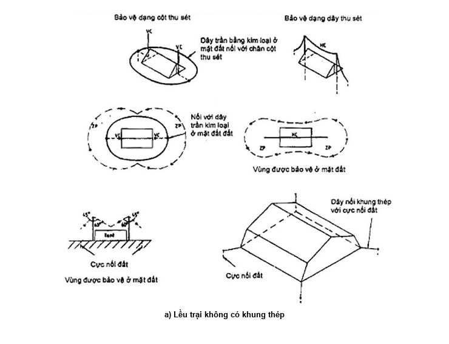

> **CHÚ THÍCH:** VC là cột thu sét; HC là dây thu sét

<strong>Hình 34 — Hệ thống chống sét cho lều trại</strong>

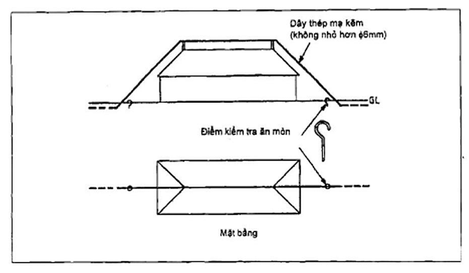

<strong>Hình 35 — Chống sét dùng cho nông trại biệt lập xây gạch lợp ngói</strong>

23.4. Công trình có giá trị thấp trong vùng chịu ảnh hưởng lớn của sét đánh

Trong một số vùng có mật độ sét đánh cao, nhưng tại đó không sử dụng đồng và nhôm vì lý do kinh tế hoặc lý do khác thì có thể sử dụng thép mạ kẽm để bảo vệ các trang trại nhỏ hoặc các kết cấu tương tự. Thép mạ kẽm đó nên bao gồm một sợi dây đơn, có đường kính từ 6 mm trở lên, được lắp dựng kéo ngang qua mái nhà nối hai đầu của kết cấu rồi đi xuống đất ở độ sâu 0,6 m thêm một đoạn 3 m (xem Hình 35). Các vật chống đỡ có thể là các thanh gỗ, được sắp xếp để tạo một khoảng cách ly lớn hơn 0,9 m từ mái nhà. Các mối nối đo kiểm tra là không cần thiết, do có thể không thực hiện được việc kiểm tra sau khi lắp đặt và kiểm tra định kỳ. Tuy nhiên, các hư hỏng có khả năng xảy ra đầu tiên là ở các đoạn được chôn, do đó nên nhét vào trong lòng đất bên cạnh mỗi cực nối đất một thanh dài có vật liệu tương tự như vật liệu của dây xuống để cho phép định kỳ lôi ra, kiểm tra bằng mắt rồi nhét lại nhằm kiểm soát trạng thái của dây dẫn ngầm. Cần có biện pháp ngăn không cho tiếp xúc với dây dẫn bị lộ ra và nền đất trong khu vực lân cận chôn dây kim loại.

23.5. Sân vận động

Các sân vận động lớn thường chứa đầy khán giả trong chỉ một tỷ lệ phần trăm nhỏ thời gian. Tuy vậy, do số lượng lớn người có mặt nên có thể cần tới một vài biện pháp chống sét.

Với các khán đài có nhiều bậc cao, các bộ phận thu sét ở dạng dây dẫn, nằm ngang có thể được căng ngang qua sân vận động từ bên này sang bên kia. Việc ghép tất cả các phần kim loại cần được thực hiện phù hợp với tiêu chuẩn này.

Biện pháp khác là tận dụng các tháp treo đèn pha, vừa như các thành phần thiết yếu của hệ thống chống sét, vừa là các gối tựa cho các dây dẫn nằm ngang. Trong trường hợp đó, cần có biện pháp để bảo vệ người khỏi bị nguy hiểm do tiếp xúc trực tiếp với tháp hoặc với điện áp đất quanh các chân tháp. Có thể ngăn cản việc tiếp xúc trực tiếp với tháp bằng cách bọc bên ngoài từ mặt đất lên tới độ cao 3 m bằng một vật liệu cách điện có khả năng bảo vệ hoặc bằng việc rào chân tháp và hạn chế việc chạm tới tháp.

Việc giảm điện trở suất của đất xuống một cấp độ không gây hại tới con người phụ thuộc vào điện trở suất trung bình của đất và việc lắp hệ thống nối đất. Phụ lục B.4.2 đưa ra một vài nhận xét chung, nhưng thông thường, nên tham khảo ý kiến chuyên gia (xem Hình 19 và Hình 36).

23.6. Công trình cầu

Các nguyên lý tương tự cũng áp dụng cho công trình cầu như đối với bất kỳ công trình xây dựng tương tự khác (xem 9.5; Điều 13 và Hình 37).

Kết cấu Bê tông cốt thép và kết cấu thép cần được nối đất phù hợp với Điều 13.

Khe giãn và các khe hở khác có tính liên tục về điện nên được liên kết; các ống dẫn nước, lan can, tay vịn, biển báo, cột đèn bằng kim loại và các bộ phận bằng kim loại liên tục khác nên được nối với cốt thép (xem 12.10.4).

Đối với cầu nhiều nhịp cần đảm bảo tính liên tục về điện giữa các kết cấu bên trên. Sét đánh vào đỉnh cầu sẽ gây ra dòng điện do sét đánh truyền xuống đất thông qua các kết cấu thấp hơn (xem Điều 15).

Với các bộ phận chế tạo sẵn, nên có thêm các bản đỡ hoặc các đòn ngang tại mỗi đầu để dùng cho mục đích liên kết. Tại chân cầu thang trên các cây cầu dành cho người đi bộ, nên thực hiện việc bao phủ cách điện để chống tiếp xúc và nguy hiểm do điện áp bước gây ra.

Các tính toán đơn giản chỉ ra rằng hiệu ứng lan truyền sét nhiều khả năng xảy ra khi đứng dưới cạnh của cây cầu hơn là đứng giữa các trụ đỡ. Trong trường hợp này, nên áp dụng các điều sau đây:

a) \- Kết cấu chiếu sáng, các lan can… nên được gắn với cốt thép. Trong trường hợp đó, không cần nối một dây xuống tách biệt bên ngoài, nhưng nếu có dây xuống như vậy thì nên nối với cốt thép tại cao độ cao nhất có thể được.

b) \- Trong các vùng có nguy hiểm tiềm tàng nơi con người có khả năng tụ tập, nên đặt các biển cảnh báo chỉ ra các nguy hiểm của việc đứng gần rìa cầu và cầm ô che giương lên.

**CHÚ DẪN:** 

1. Mái kim loại sử dụng làm bộ phận thu sét

2. Liên kết với mái thép và cốt thép của mỗi cột bê tông

3. Cốt thép trong cột, sử dụng làm dây xuống

4. Liên kết với cốt thép để nối đất

5. Cực nối đất được bọc bê tông

6. Cực nối đất mạch vòng liên kết các cực nối đất

**CHÚ THÍCH:** Các kim loại liên tục hoặc nối đất cần nối với cực nối đất mạch vòng

7. Cột thu sét (xem Hình 19)

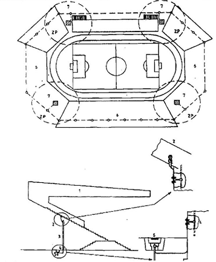

<strong>Hình 36 — Hệ thống chống sét cho sân vận động (sân bóng đá)</strong>

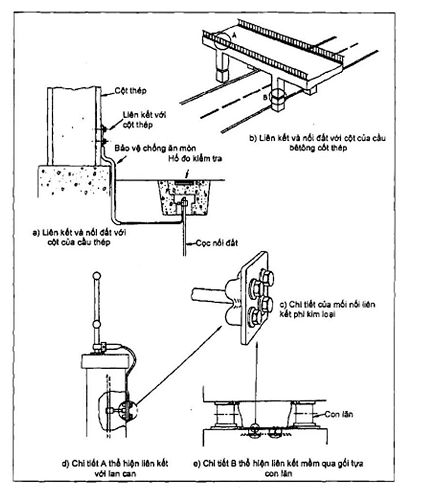

<strong>Hình 37 — Công trình cầu</strong>

24. Sự ăn mòn

24.1. Quy định chung

Tại nơi ăn mòn do khí quyển, hóa học, điện phân hoặc các nguyên nhân khác có khả năng tác động tới bất kỳ phần nào của hệ thống chống sét, nên thực hiện các biện pháp phù hợp để ngăn cản khả năng xảy ra ăn mòn.

24.2. Ăn mòn điện phân giữa các kim loại khác nhau

Việc tiếp xúc giữa các kim loại khác nhau có khả năng gây ra và làm tăng nhanh sự ăn mòn, trừ khi các bề mặt tiếp xúc được giữ hoàn toàn khô và được bảo vệ tránh không cho hơi ẩm đi vào.

Sự tiếp xúc giữa các kim loại khác nhau có thể tồn tại ở những nơi dây dẫn được cố định, hoặc tựa vào các bề mặt kim loại bên ngoài. Sự ăn mòn cũng có thể tăng tại nơi nước chảy qua một kim loại rồi đi vào trong tiếp xúc với kim loại khác. Nước chảy ra từ đồng, hợp kim đồng và chì có thể ăn mòn các hợp kim nhôm và kẽm. Kim loại của hệ thống chống sét nên tương thích với các kim loại được dùng bên ngoài trên bất kỳ kết cấu nào mà hệ thống đi qua hoặc có tiếp xúc.

24.3. Ăn mòn hóa học khi nhôm để gần xi măng Porland, hỗn hợp vữa

Vì nhiều lý do, nhôm dễ bị ăn mòn khi tiếp xúc với xi măng Portland và hỗn hợp vữa. Những gợi ý về các kỹ thuật lắp đặt như sau:

a) \- Các dây dẫn nhôm nên bố trí tách ra khỏi bất kỳ bề mặt nào, đặc biệt là các bề mặt nằm ngang. Điều này sẽ tránh cho các dây dẫn không nằm trong nước hoặc tiếp xúc với các vật liệu ăn mòn, như vữa cũ… Các cách lắp đặt phù hợp được minh họa trên Hình A.1.

b) \- Không nên bố trí các dây dẫn tại những nơi có thể bị các mảnh vụn, lá cây… bao phủ, hoặc bị chôn dưới đất. Điều này sẽ tránh cho các chất điện phân tiếp xúc liên tục với dây dẫn.

c) \- Thiết kế của hệ thống cọc đầu dây nên bố trí các gờ móc nước. Điều này sẽ giúp ngăn cản chất điện phân chảy ra khỏi bề mặt có thể chạm tới và chảy xuống dây dẫn.

d) \- Tại những nơi không thể thực hiện các điều kiện từ a tới c, dây dẫn nên được bảo vệ như gợi ý trong Điều 6 và cần xem xét việc tăng diện tích mặt cắt ngang.

24.4. Ăn mòn hóa học của đồng

Mặc dù đồng có khả năng chịu được nhiều loại tác động hóa học, nhưng nên có lớp phủ bằng chì, tại những nơi dễ bị ăn mòn mạnh do các hợp chất lưu huỳnh. Đặc biệt tại các vị trí không thể tới được; ví dụ tại đỉnh của ống khói. Lớp phủ nên bao trùm toàn bộ vùng có khả năng bị ăn mòn và trùm lên các mối nối. Không nên dùng các lớp phủ không bền vững hoặc dễ cháy. Các chi tiết liên kết nên chịu được tác động ăn mòn hoặc phải được bảo vệ phù hợp. Các mối nối và liên kết có thể được bảo vệ bằng bi tum hoặc được đặt trong hợp chất dẻo tùy điều kiện tại chỗ (xem thêm Điều 6 và 12.10.4).

Mỗi dây dẫn giữa các điểm đo kiểm tra và các điện cực đất nên được bảo vệ chống ăn mòn tại những nơi dây dẫn đi vào lòng đất một khoảng 0,3 m trên và dưới mặt đất, việc lắp ống bọc ngoài PVC là biện pháp thích hợp để bảo vệ chống ăn mòn.

25. Lắp dựng kết cấu

Trong quá trình lắp dựng kết cấu, tất cả các mảng thép lớn và nhô lên như các khung thép, giàn giáo và cần trục thép nên được nối đất một cách có hiệu quả. Từ khi bắt đầu tiến hành lắp đặt hệ thống chống sét, cần duy trì việc nối đất liên tục.

26. Dây điện trên cao

Trong suốt quá trình xây dựng đường dây điện trên cao, thiết bị trên cao của hệ thống cấp điện cho phương tiện chạy trên ray… có thể giảm thiểu nguy hiểm tới con người bằng cách lắp đặt và kết nối một hệ thống nối đất hoàn chỉnh trước khi bất kỳ dây dẫn nào ngoài dây dẫn nối đất được kéo ra. Một khi các dây dẫn được kéo ra và được cách điện, không nên thả nổi các dây dẫn này trong quá trình lắp đặt, mà nên nối đất theo cách giống như khi thực hiện việc bảo dưỡng sau khi đưa đường dây vào hoạt động.

27. Kiểm tra

Toàn bộ hệ thống chống sét nên được một người có trình độ chuyên môn thích hợp kiểm tra kỹ bằng mắt thường trong suốt quá trình lắp đặt, sau khi hoàn thành và sau khi thay đổi hoặc mở rộng, để xác nhận rằng chúng được làm tuân thủ theo tiêu chuẩn này. Việc kiểm tra nên được tiến hành định kỳ, tốt nhát là không quá 12 tháng. Đối với các khu vực có điều kiện khí hậu khắc nghiệt nên tăng tần suất kiểm tra.

Thêm nữa, trạng thái cơ học của tất cả các dây dẫn, liên kết, mối nối và các điện cực đất (bao gồm các điện cực tham chiếu) nên được kiểm tra và ghi chép lại. Nếu với bất kỳ lý do nào, như do các công việc khác tại công trường tạm thời không thể xem xét các phần lắp đặt cụ thể thì cũng nên ghi chép lại điều đó.

Trong suốt quá trình xem xét định kỳ hệ thống chống sét, việc ghép nối bất kỳ bộ phận bổ sung nào mới nên được kiểm tra để đảm bảo rằng nó phù hợp với những quy định của tiêu chuẩn này.

28. Đo đạc

Khi hoàn thành quá trình lắp đặt hoặc bất cứ chỉnh sửa nào, nên thực hiện các phép đo cách ly và kết hợp và/hoặc các kiểm tra sau đây. Các kết quả được ghi trong sổ theo dõi hệ thống chống sét.

e) \- Điện trở nối đất của mỗi điện cực đất cục bộ với đất và bổ sung điện trở nối đất của hệ thống nối đất hoàn chỉnh.

f) \- Mỗi điện cực đất cục bộ nên được đo tách biệt với điểm kiểm tra giữa dây xuống và điện cực đất trong vị trí tách rời (phép đo cách ly).

g) \- Tiến hành đo tại điểm đo ở vị trí nối (phép đo kết hợp). Nếu có bất kỳ sự khác biệt đáng kể trong các phép đo liên quan tới các vị trí khác, nêu điều tra nguyên nhân của sự khác nhau này.

h) \- Các kết quả của việc kiểm tra tất cả các dây dẫn, lắp ghép và mối nối hoặc tính liên tục về điện đo được.

Việc đo đạc chi tiết có thể tham khảo tiêu chuẩn BS 7430 hoặc các tiêu chuẩn quốc tế có liên quan.

Nếu điện trở nối đất của một hệ thống chống sét vượt quá 10  thì nên giảm giá trị này, ngoại trừ các kết cấu trên đá như miêu tả trong 13.5. Nếu điện trở nhỏ hơn 10  nhưng cao hơn đáng kể so với lần kiểm tra trước, nên điều tra nguyên nhân và thực hiện các biện pháp khắc phục cần thiết.

Việc đo kiểm tra nên được tiến hành định kỳ, tốt nhất không quá 12 tháng.

**CHÚ THÍCH 1:** Việc chọn một chu kỳ ngắn hơn 12 tháng một chút có thể thuận lợi để thay đổi mùa mà phép thử được thực hiện.

**CHÚ THÍCH 2:** Trước khi ngắt việc nối đất bảo vệ sét đánh, nên đo kiểm tra để đảm bảo rằng kết nối đã bị ngắt, sử dụng một thiết bị kiểm tra điện áp nhạy.

29. Lưu trữ hồ sơ

Các hồ sơ sau đây nên được lưu trữ tại công trình hoặc do người có trách nhiệm bảo quản việc lắp đặt:

a) \- Các bản vẽ có tỷ lệ mô tả bản chất, kích thước, vật liệu, và vị trí của tất cả các thành phần của hệ thống chống sét;

b) \- Trạng thái tự nhiên của đất và bất kỳ lắp ráp nối đất đặc biệt nào;

c) \- Loại và vị trí của các điện cực đất, bao gồm các điện cực tham chiếu;

d) \- Các điều kiện kiểm tra và các kết quả đạt được (xem Điều 28);

e) \- Các thay đổi, bổ sung hoặc sửa chữa hệ thống;

f) \- Tên của người chịu trách nhiệm lắp đặt hoặc bảo dưỡng.

Nên dán nhãn tại điểm gốc của nguồn lắp điện trong đó ghi nội dung như sau:

"Công trình này được lắp đặt một hệ thống chống sét, phù hợp với TCVN 9385:2012. Các liên kết với các bộ phận khác của công trình và các liên kết đẳng thế chính cần được bảo trì một cách phù hợp."

30. Bảo trì

Các kiểm tra định kỳ và đo đạc khuyến cáo trong Điều 27 và Điều 28 chỉ ra rằng việc bảo trì là cần thiết. Lưu ý cụ thể đến các vấn đề sau:

&nbsp;&nbsp;\- Nối đất;

&nbsp;&nbsp;\- Bằng chứng của sự ăn mòn hoặc các điều kiện có khả năng dẫn tới ăn mòn;

&nbsp;&nbsp;\- Các thay đổi và các bổ sung tới kết cấu có thể ảnh hưởng tới hệ thống chống sét (ví dụ những thay đổi trong việc sử dụng ngôi nhà, việc lắp đặt các rãnh cần trục hoặc việc dựng các ăng ten vô tuyến truyền thanh và truyền hình).

---

## 📑 DANH MỤC PHỤ LỤC KỸ THUẬT CHUYÊN ĐỀ (MODULAR ANNEXES)

Toàn bộ 5 Phụ lục kỹ thuật chuyên đề đã được module hóa thành các tệp độc lập nhằm tối ưu hóa tra cứu và thẩm tra thiết kế (ADR 0021 & ADR 0030):

| Ký hiệu | Tên Phụ Lục | Tính chất | Liên kết Tập tin |
| :---: | :--- | :---: | :---: |
| **Phụ lục A** | Các khía cạnh kỹ thuật của hiện tượng sét | Tham khảo | [📑 **Xem Phụ lục**](annexes/phu_luc_a_cac_khia_canh_ky_thuat_cua_hien_tuong_set.md#phu-luc-a) |
| **Phụ lục B** | Giải thích một số điều khoản của tiêu chuẩn | Tham khảo | [📑 **Xem Phụ lục**](annexes/phu_luc_b_giai_thich_mot_so_dieu_khoan_cua_tieu_chuan.md#phu-luc-b) |
| **Phụ lục C** | Hướng dẫn chung chống sét cho thiết bị điện trong và trên công trình | Tham khảo | [📑 **Xem Phụ lục**](annexes/phu_luc_c_huong_dan_chung_chong_set_cho_thiet_bi_dien_t.md#phu-luc-c) |
| **Phụ lục D** | Một số ví dụ tính toán | Tham khảo | [📑 **Xem Phụ lục**](annexes/phu_luc_d_mot_so_vi_du_tinh_toan.md#phu-luc-d) |
| **Phụ lục E** | Hướng dẫn sử dụng bản đồ mật độ sét trên lãnh thổ Việt Nam | Tham khảo | [📑 **Xem Phụ lục**](annexes/phu_luc_e_huong_dan_su_dung_ban_do_mat_do_set_tren_lanh.md#phu-luc-e) |

---

## 📊 HỆ THỐNG TRA CỨU BẢNG & SƠ ĐỒ KỸ THUẬT

- **Tra cứu 26 Bảng Số Liệu:** Tra cứu chi tiết dạng CSV/JSON tại [Thư mục Bảng Số Liệu](tables/README.md).
- **Tra cứu Sơ Đồ Hình Vẽ:** Tra cứu ảnh nét cao và đặc tả phân vùng tại [Danh Mục Sơ Đồ Khí Động](figures/figures_catalog.yaml).
