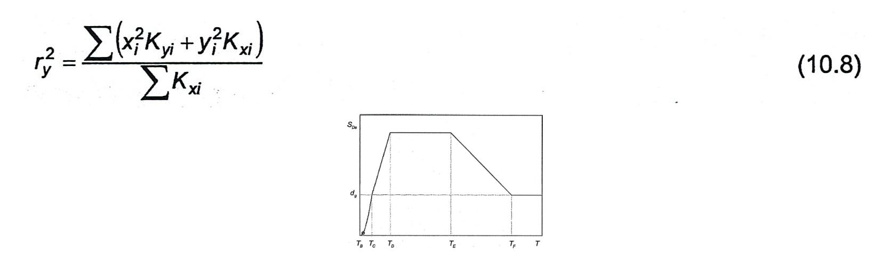

## PHỤ LỤC A (Tham khảo) — Phổ phản ứng chuyển vị đàn hồi

### A.1  Đối với những kết cấu có chu kỳ dao động lớn, tác động động đất có thể được biểu diễn dưới dạng phổ phản ứng chuyển vị, $S_{De}$(T), như Hình A.1.

<strong>Hình A.1 — Phổ phản ứng chuyển vị</strong>

### A.2  Đối với các chu kỳ nhỏ hơn chu kỳ khống chế $T_{E}$​, các giá trị tung độ phổ xác định từ các biểu thức (3.2) đến (3.5), chuyển từ $S_{e}$(T) sang $S_{De}$(T) qua biểu thức (3.7). Đối với các chu kỳ dao động lớn hơn $T_{E}$​ thì các tung độ của phổ phản ứng chuyển vị đàn hồi được xác định từ các biểu thức (A.1) và (A2).

$$\begin{aligned}
T_E \leq T \leq T_F : &\qquad S_{\text{De}}(T) = 0,025 a_g S T_C T_D \left[ 2,5\eta + \left(\frac{T - T_E}{T_F - T_E}\right)(1 - 2,5\eta) \right] &\qquad (A.1) \\
T \geq T_F : &\qquad S_{\text{De}}(T) = d_g &\qquad (A.2)
\end{aligned}$$
<!-- formula_id: "F_TCVN_9386_2025_RID265" -->

trong đó: S, $T_{C}$, $T_{D}$​ nêu trong các Bảng 3.2 và 3.3, η được tính theo biểu thức (3.6) và $d_{g}$​ được tính theo biểu thức (3.12). Các chu kỳ khống chế $T_{E}$ và $T_{F}$​ được nêu trong Bảng A.1.

### Bảng A.1 - Các chu kỳ khống chế bổ sung đối với phổ chuyển vị

| Dạng nền | $T_{E}$​ (s) | $T_{F}$​ (s) |
| :--- | :---: | :---: |
| A | 4,5 | 10,0 |
| B | 5,0 | 10,0 |
| C | 6,0 | 10,0 |
| D | 6,0 | 10,0 |
| E | 6,0 | 10,0 |