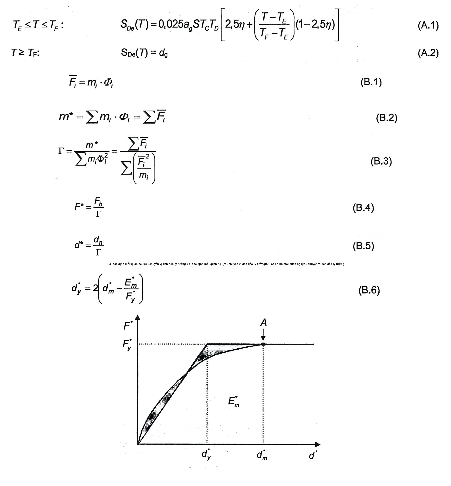
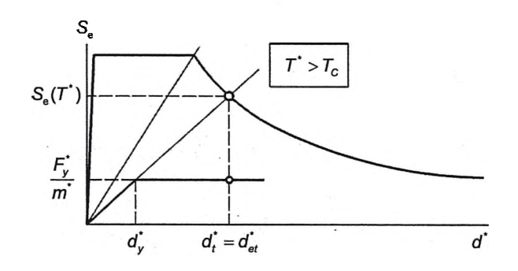

## PHỤ LỤC B (Tham khảo) — Xác định chuyển vị mục tiêu đối với phân tích tĩnh phi tuyến (đẩy dần)

### B.1  Yêu cầu chung

Chuyển vị mục tiêu được xác định từ phổ phản ứng đàn hồi (xem 3.2.2.2). Đường cong khả năng biểu thị quan hệ giữa lực cắt đáy và chuyển vị nút kiểm soát được xác định theo 4.3.3 và 4.2.3.

Quan hệ giữa các lực ngang được chuẩn hóa $`.

So the final LaTeX string is `$ ​ và chuyển vị được chuẩn hóa $Φ_{i}$​ giả thiết:

$$`.
-   Write the equation: `\overline{F}_i = m_i \cdot \Phi_i`.
-   Add the equation number at the end: `\qquad (B.1)`.
-   End with `$$
<!-- formula_id: "F_TCVN_9386_2025_RID267" -->

trong đó: $m_{i}$​ là khối lượng của tầng thứ i.

&nbsp;&nbsp;&nbsp;&nbsp;\- Các chuyển vị được chuẩn hóa sao cho $Φ_{n}$ =1, trong đó n là nút kiểm soát (thường n được chọn là cao trình mái). Do đó $\overline{F}$ .

### B.2  Chuyển đổi sang hệ một bậc tự do tương đương

Khối lượng (m*) của hệ một bậc tự do tương đương được xác định như sau:

$$m^* = \sum m_i \cdot \Phi_i = \sum \overline{F}_i \qquad (B.2)$$
<!-- formula_id: "F_TCVN_9386_2025_RID269" -->

và hệ số chuyển đổi được tính theo công thức:

$$\Gamma = \frac{m^*}{\sum m_i \Phi_i^2} = \frac{\sum \overline{F}_i}{\sum \left( \frac{\overline{F}_i^2}{m_i} \right)} \qquad (B.3)$$
<!-- formula_id: "F_TCVN_9386_2025_RID270" -->

Lực F* và chuyển vị d* của hệ một bậc tự do tương đương được tính như sau:

$$\begin{aligned}
    F^* &= \frac{F_b}{\Gamma} \qquad (B.4) \\
    d^* &= \frac{d_n}{\Gamma} \qquad (B.5)
    \end{aligned}$$
<!-- formula_id: "F_TCVN_9386_2025_RID271" -->

trong đó $F_{b}$​ và $d_{n}$​ lần lượt là lực cắt đáy và chuyển vị nút kiểm soát của hệ nhiều bậc tự do.

### B.3  Xác định mối quan hệ lực - chuyển vị đàn dẻo lý tưởng

Lực chảy dẻo $F_{y}$*​, biểu thị độ bền cực hạn của hệ lý tưởng, là lực cắt đáy lúc hình thành cơ chế dẻo. Độ cứng ban đầu của hệ lý tưởng được xác định sao cho các diện tích nằm dưới các đường cong lực-chuyển vị lý tưởng và thực tế bằng nhau (xem Hình B.1).

Dựa trên giả thiết này, chuyển vị chảy dẻo của hệ một bậc tự do lý tưởng $d_{y}$*​ được cho bởi:

$$`.
    -   Write the equation: `d_y^* = 2 \left( d_m^* - \frac{E_m^*}{F_y^*} \right)`.
    -   Add the label: `\qquad (B.6)`.
    -   End with `$$
<!-- formula_id: "F_TCVN_9386_2025_RID272" -->

trong đó $E_{m}$*​ là năng lượng biến dạng thực tế cho tới khi hình thành cơ chế dẻo.

<!-- DIAGRAM: word/media/image270.png -->

**CHÚ DẪN:**

A  Cơ chế dẻo

<strong>Hình B.1 — Xác định quan hệ giữa lực - chuyển vị đàn dẻo lý tưởng</strong>

### B.4  Xác định chu kỳ của hệ một bậc tự do tương đương lý tưởng

Chu kỳ T* của hệ một bậc tự do tương đương lý tưởng được xác định theo công thức:

$$T^* = 2\pi \sqrt{\frac{m^* d_y^*}{F_y^*}} \qquad (\text{B.7})$$
<!-- formula_id: "F_TCVN_9386_2025_RID274" -->

### B.5  Xác định chuyển vị mục tiêu đối với hệ một bậc tự do tương đương

Chuyển vị mục tiêu của hệ kết cấu có chu kỳ T* và ứng xử đàn hồi không hạn chế được xác định theo công thức:

$$d_{et}^* = S_e(T^*) \left[ \frac{T^*}{2 \times \pi} \right]^2 \qquad (\text{B.8})$$
<!-- formula_id: "F_TCVN_9386_2025_RID275" -->

trong đó: $S_{e}$(T*)  là phổ phản ứng gia tốc đàn hồi tại chu kỳ T*.

Để xác định chuyển vị mục tiêu $d_t^*$​ cho các kết cấu trong miền chu kỳ ngắn và cho các kết cấu trong các miền chu kỳ trung bình và dài cần sử dụng các biểu thức khác nhau sau đây. Gọi $T_{c}$ là chu kỳ ở biên chung của chu kỳ miền ngắn và trung bình (xem Hình 3.1 và Bảng 3.2 và Bảng 3.3).

a) \- T* < $T_{c}$ (miền chu kỳ ngắn):

Nếu $\frac{F_y^*}{m^*} \geq S_e(T^*)$ thì phản ứng là đàn hồi và do đó:

$$d_t^* = d_{et}^* \qquad (\text{B.9})$$
<!-- formula_id: "F_TCVN_9386_2025_RID278" -->

Nếu $\frac{F_y^*}{m^*} < S_e(T^*)$  thì phản ứng là phi tuyến và:

$$d_t^* = \frac{d_{et}^*}{q_u} \left( 1 + (q_u - 1) \frac{T_c}{T^*} \right) \geq d_{et}^* \qquad (\text{B.10})$$
<!-- formula_id: "F_TCVN_9386_2025_RID280" -->

trong đó: $q_{u}$​ là tỷ số giữa gia tốc trong kết cấu có ứng xử đàn hồi không hạn chế $S_{e}$(T*) và gia tốc trong kết cấu có cường độ hạn chế $\frac{F_y^*}{m^*}$

$$q_u = \frac{S_e(T^*) \cdot m^*}{F_y^*} \qquad (\text{B.11})$$
<!-- formula_id: "F_TCVN_9386_2025_RID282" -->

&nbsp;&nbsp;&nbsp;&nbsp;\- $d_{t}$* không được lớn hơn 3$d_{et}$*.

b) \- T* ≥ Tc (miền chu kỳ trung bình và dài):

$$d_t^* = d_{et}^* \qquad (\text{B.12})$$
<!-- formula_id: "F_TCVN_9386_2025_RID283" -->

Quan hệ giữa các đại lượng khác nhau có thể xem trong các Hình B.2 a) và b). Các hình này được vẽ theo định dạng gia tốc - chuyển vị. Chu kỳ T* biểu thị bằng đường bán kính từ gốc của hệ tọa độ đến điểm mà phổ phản ứng đàn hồi được xác định bởi tọa độ $d_{et}^* = S_e(T^*) \left( \frac{T^*}{2\pi} \right)^2 \text{ và } S_e(T^*)$

Quy trình lập (tùy chọn)

Nếu chuyển vị mục tiêu $d_{t}$* được xác định trong bước 4 (B.5) khác nhiều so với chuyển vị $d_{m}$* (Hình B.1) dùng để xác định quan hệ lực - chuyển vị đàn dẻo lý tưởng ở bước 2 (B.3) thì có thể áp dụng phương pháp lập, trong đó bước 2 và bước 4 được lặp lại bằng cách sử dụng $d_{t}$* (và $F_{y}$* tương ứng) thay cho $d_{m}$* trong bước 2.

<!-- DIAGRAM: word/media/image282.png -->

a) \- Miền chu kỳ ngắn

<strong>Hình B.2 — Xác định chuyển vị mục tiêu cho hệ một bậc tự do tương đương</strong>

<!-- DIAGRAM: word/media/image283.png -->

b) \- Miền chu kỳ trung bình và dài

<strong>Hình B.2 — Xác định chuyển vị mục tiêu cho hệ một bậc tự do tương đương (kết thúc)</strong>

### B.6  Xác định chuyển vị mục tiêu đối với hệ nhiều bậc tự do

Chuyển vị mục tiêu của hệ nhiều bậc tự do được cho bởi công thức:

$$d_t = \Gamma d_t^* \tag{B.13}$$
<!-- formula_id: "F_TCVN_9386_2025_RID287" -->

Chuyển vị mục tiêu ứng với nút kiểm soát.