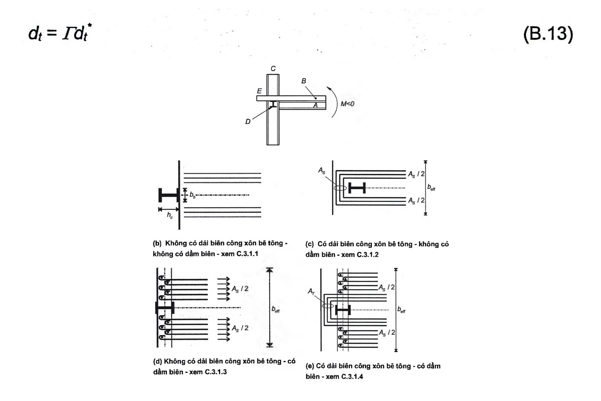
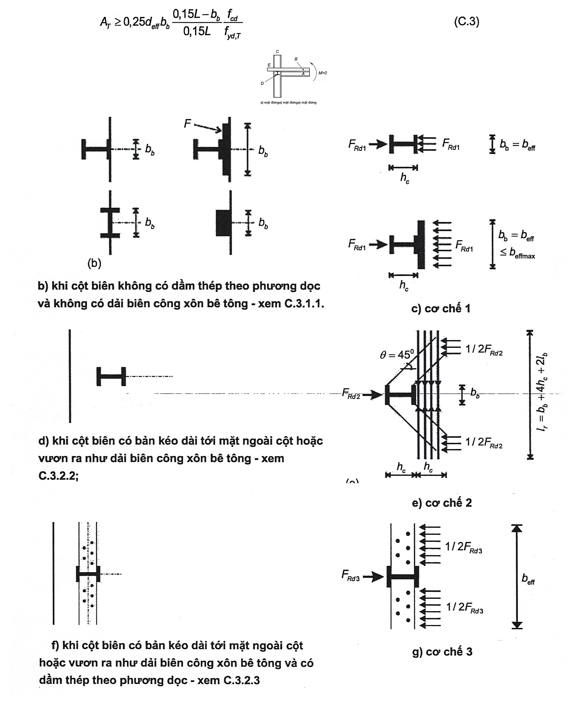
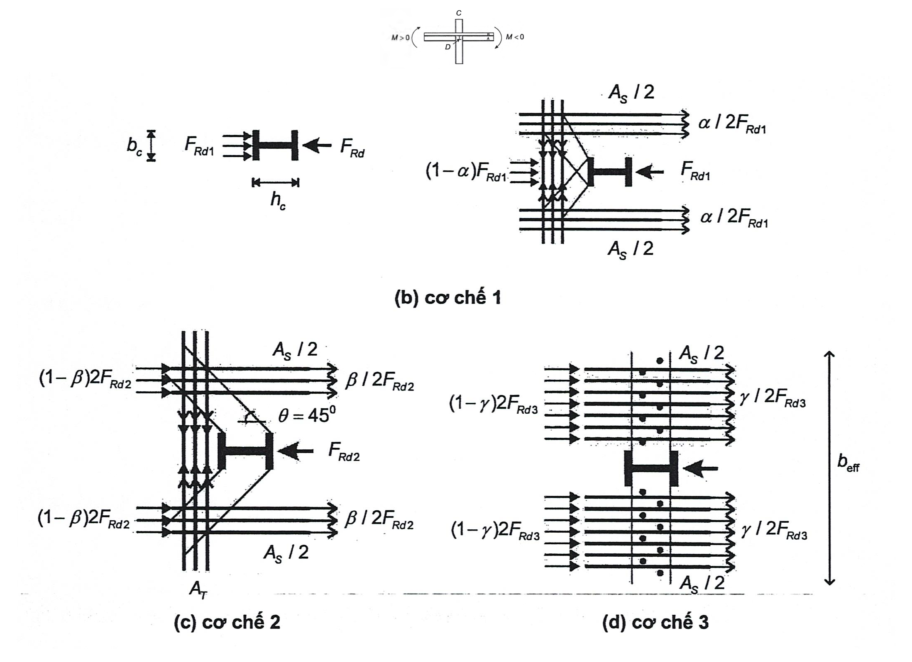

## PHỤ LỤC C (Quy định) — Thiết kế bản của dầm liên hợp thép-bê tông tại liên kết dầm-cột trong khung chịu mô men

### C.1  Yêu cầu chung

(1) Phụ lục này dùng cho thiết kế bản và các liên kết của bản với khung thép trong khung chịu mô men trong đó dầm có dạng chữ T liên hợp tạo bởi một dầm thép và một bản bê tông.

(2) Phụ lục này được xây dựng dựa trên nghiên cứu thực nghiệm cho trường hợp khung liên hợp chịu mô men với các liên kết cứng và khớp dẻo hình thành trong các dầm. Các biểu thức trong Phụ lục này không dùng cho trường hợp các liên kết có độ bền riêng trong đó có biến dạng được hình hành cục bộ tại các nút.

(3) Các khớp dẻo tại các đầu dầm trong khung liên hợp có mô men phải có độ dẻo cao. Theo phụ lục này, để đảm bảo độ dẻo lớn, thì cần thực hiện hai yêu cầu sau:

&nbsp;&nbsp;\- Tránh để phần thép bị mất ổn định sớm;

&nbsp;&nbsp;\- Tránh để phần bê tông của bản bị vỡ sớm.

(4) Điều kiện thứ nhất yêu cầu một giới hạn trên cho diện tích tiết diện ngang $A_{s}$​ của cốt thép dọc nằm trong phạm vi chiều rộng hữu hiệu của bản bê tông. Điều kiện thứ hai yêu cầu một giới hạn dưới cho tiết diện ngang $A_{T}$​ của cốt thép ngang ở phía trước cột (xem Hình C.1).

### C.2  Yêu cầu nhằm ngăn ngừa phần thép bị mất ổn định sớm

(1) Áp dụng 7.6.1(4).

### C.3  Yêu cầu nhằm ngăn ngừa bê tông bị vỡ sớm

### C.3.1  Cột biên - mô men uốn của cột theo phương vuông góc với mặt tiền; mô men âm đặt lên dầm (M < 0)

### C.3.1.1  Không có dầm biên và không có dải biên công xôn bê tông, xem Hình C.1(b)

(1) Khi không có dầm biên và không có dải biên công xôn bê tông thì khả năng chịu mô men của nút phải lấy bằng khả năng chịu mô men dẻo của chỉ riêng dầm thép.

### C.3.1.2  Không có dầm biên và có dải biên công xôn bê tông, xem Hình C.1(c).

(1) Khi không có dầm biên và có dải biên công xôn bê tông thì áp dụng EN 1994-1-1:2004 để tính toán khả năng chịu mô men của nút.

$$M < 0$$
<!-- formula_id: "F_TCVN_9386_2025_RID288" -->

(a) mặt đứng

<!-- DIAGRAM: word/media/image286.png -->

**CHÚ DẪN:**

A  dầm chính;

B  bản;

C  cột biên;

D  dầm biên;

E  dải biên công xôn bê tông.

<strong>Hình C.1 — Liên kết dầm - cột liên hợp ở cột biên dưới tác dụng của mô men âm trong mặt phẳng vuông góc với mặt tiền</strong>

### C.3.1.3  Khi có dầm biên; bản bê tông kéo dài tới mặt ngoài của cột và không có dải biên công xôn bê tông (Hình C.1(d))

(1) Khi cột biên có dầm biên nhưng không có dải biên công xôn bê tông thì khả năng chịu mô men của nút có thể kể đến sự làm việc của cốt thép chịu lực trong bản với điều kiện là các yêu cầu trong các điều từ (2) đến (7) của điều này được thỏa mãn.

(2) Cốt thép chịu lực của bản phải được neo chắc chắn vào các đinh chống cắt có khả năng chịu được lực cắt, các đinh chống cắt này được liên kết vào dầm biên.

(3) Dầm biên phải được ngâm vào cột.

(4) Diện tích tiết diện ngang của cốt thép chịu lực $A_{s}$ của bản phải sao cho nó bị chảy trước khi các đinh chống cắt và dầm dọc bị phá hoại.

(5) Diện tích tiết diện ngang của cốt thép gia cường $A_{s}$ và các đinh chống cắt phải được bố trí trên một phạm vi bằng chiều rộng tính toán của bản được nêu trong 7.6.3 và Bảng 16.II.

(6) Các đinh chống cắt phải thỏa mãn:

$$nP_{Rd} \ge 1,1 F_{Rds} \qquad (C.1)$$
<!-- formula_id: "F_TCVN_9386_2025_FORMULA_C_1" -->

trong đó:

&nbsp;&nbsp;&nbsp;&nbsp;\- n  là số lượng đinh chống cắt trong phạm vi chiều rộng tính toán của bản;

&nbsp;&nbsp;&nbsp;&nbsp;\- $P_{Rd}$ ​ là khả năng chịu lực của một đinh chống cắt;

&nbsp;&nbsp;&nbsp;&nbsp;\- $F_{Rds}$ ​ là khả năng chịu lực của tất cả các thanh cốt thép chịu lực của bản đặt trong phạm vi chiều rộng tính toán $b_{eff}$, $F_{Rds}$ = $A_{s}f_{yd}$;

&nbsp;&nbsp;&nbsp;&nbsp;\- $f_{yd}$​ là cường độ chảy của cốt thép bản.

&nbsp;&nbsp;&nbsp;&nbsp;\- (7) Dầm biên phải được kiểm tra chịu uốn, chịu cắt và xoắn dưới tác dụng của lực ngang $F_{Rds}$ ​đặt lên các đinh chống cắt.

### C.3.1.4  Khi cột biên có dầm biên và có dải biên công xôn bê tông (Hình C.1(e))

(1) Khi cột biên có dầm biên và có dải biên công xôn bê tông thì khả năng chịu mô men của nút có thể kể thêm phần đóng góp do lực truyền lên các dầm biên (như trong C.3.1.3.2) và truyền lực theo cơ chế như mô tả trong (3) của EN 1994-1-1:2004.

(2) Phần khả năng chịu lực do phần cốt thép gia cường được neo vào dầm biên, có thể được tính theo C.3.1.3 với điều kiện là các yêu cầu từ (2) đến (7) của C.3.1.3 được thỏa mãn.

(3) Phần khả năng chịu lực do diện tích tiết diện ngang của cốt thép chịu lực được neo vào phạm vi dải biên công xôn bê tông có thể được xác định theo EN 1994-1-1:2004.

### C.3.2  Cột biên - Mô men uốn của cột theo phương vuông góc với mặt phẳng khung; mô men đặt lên dầm là mô men dương (M > 0)

### C.3.2.1  Không có dầm biên; bản kéo dài tới mặt trong của cột (Hình C.2(b-c))

(1) Khi bản bê tông chỉ kéo dài đến mặt trong của cột thì khả năng chịu mô men của nút có thể được tính dựa trên cơ sở truyền lực bởi lực nén (ép vỡ) trực tiếp của bê tông lên cánh cột. Khả năng chịu mô men này có thể được tính toán từ lực nén tính được theo (2) của điều này, với điều kiện là cốt thép chống nở ngang trong bản thỏa mãn (4) của điều này.

(2) Giá trị lớn nhất của lực được truyền lên bản có thể được tính như sau:

$F_{Rdl}$ = $b_{b}d_{eff}f_{cd}$ ​(C.2)

trong đó:

&nbsp;&nbsp;&nbsp;&nbsp;\- $d_{eff}$  là chiều cao toàn phần của bản trong trường hợp bản sàn đặc hoặc chiều dày phần bê tông nằm bên trên các sườn đối với bản sàn liên hợp;

&nbsp;&nbsp;&nbsp;&nbsp;\- $b_{b}$ ​ là chiều rộng chịu ép của bản bê tông trên cột (xem Hình 40).

&nbsp;&nbsp;&nbsp;&nbsp;\- (3) Cần phải hạn chế nở ngang của vùng bê tông lân cận cánh cột. Diện tích tiết diện ngang của phần thép gia cường này phải thỏa mãn điều kiện:

$$A_T \ge 0,25d_{\text{eff}} b_b \frac{0,15L - b_b}{0,15L} \frac{f_{cd}}{f_{yd,T}} \tag{C.3}$$
<!-- formula_id: "F_TCVN_9386_2025_RID290" -->

trong đó:

&nbsp;&nbsp;&nbsp;&nbsp;\- L  là nhịp dầm, xác định theo 7.6.3 (3) và Hình 7.7

&nbsp;&nbsp;&nbsp;&nbsp;\- $f_{yd,T}$ ​ là cường độ chảy của cốt thép ngang trong bản.

&nbsp;&nbsp;&nbsp;&nbsp;\- Diện tích tiết diện $A_{T}$​ của cốt thép ngang phải được đặt phân bố đều theo chiều dài dầm trong phạm vi một khoảng bằng $b_{b}$. Khoảng cách từ thanh cốt thép ngang đầu tiên tới cánh cột không được vượt quá 30 mm.

&nbsp;&nbsp;&nbsp;&nbsp;\- (4) Diện tích tiết diện ngang $A_{T}$ của cốt thép ngang nếu trong (3) có thể được lấy từ diện tích của những thanh thép được đặt tại vị trí đó do các mục đích khác, ví dụ khả năng chịu mô men uốn của bản. Nếu diện tích thép nằm trong vùng đó nhỏ hơn $A_{T}$ thì phải bổ sung thêm.

### C.3.2.2  Không có dầm biên; có bản kéo dài tới mặt ngoài của cột hoặc vươn ra như một dải biên công xôn bê tông (Hình C.2c, d, e)

(1) Khi không có dầm biên thì khả năng chịu mô men của nút có thể được tính toán từ lực nén được phát triển bởi tổ hợp của 2 cơ chế sau:

Cơ chế 1: lực nén truyền thẳng vào cột. Lực nén theo cơ chế này không được vượt quá giá trị nêu trong biểu thức sau:

$$F_{Rd1} = b_{b}d_{eff}f_{cd} \qquad (C.4)$$
<!-- formula_id: "F_TCVN_9386_2025_FORMULA_C_4" -->

Cơ chế 2: lực nén truyền lên cột thông qua các dải chéo bằng bê tông nghiêng 45° với cạnh cột.

Giá trị thiết kế của lực được truyền theo cơ chế này không được vượt quá giá trị nêu trong biểu thức sau:

$F_{Rd2}$ = 0,7$h_{c}d_{eff}f_{cd}$                         ​(C.5)

trong đó:

&nbsp;&nbsp;&nbsp;&nbsp;\- $h_{c}$ ​ là chiều cao tiết diện cột thép.

$$M > 0$$
<!-- formula_id: "F_TCVN_9386_2025_RID291" -->

a) \- mặt đứng

<!-- DIAGRAM: word/media/image289.png -->

**CHÚ DẪN:**

A  dầm chính

B  bản

C  cột biên

D  dầm thép theo phương dọc (phương vuông góc với mặt phẳng khung)

E  dải biên công xôn bê tông

F  tấm gia cường

<strong>Hình C.2 — Các liên kết dầm - cột biên liên hợp dưới tác dụng của mô men dương trong mặt phẳng khung và sự có thể truyền các lực của bản</strong>

(2) Diện tích tiết diện của thanh giằng chịu kéo $A_{T}$ theo cơ chế 2 phải thỏa mãn biểu thức sau (xem Hình C.2.(e)):

$$A_T \ge 0,5 \frac{F_{Rd2}}{f_{yd,T}} \tag{C.6}$$
<!-- formula_id: "F_TCVN_9386_2025_RID293" -->

(3) Diện tích thép $A_{T}$ phải được phân bố theo chiều dài dầm trong phạm vi một khoảng bằng $h_{c}$ và được neo toàn bộ. Chiều dài yêu cầu của cốt thép ngang là L = $b_{b}$ + 4$h_{c}$ + 2$L_{b}$, trong đó $L_{b}$ là chiều dài neo của các thanh thép này theo EN 1992-1-1:2004.

(4) Khả năng chịu mô men của nút có thể được tính từ giá trị của lực nén lớn nhất có thể truyền:

$$F_{Rd1} + F_{Rd2} = b_{eff} d_{eff} f_{cd} \qquad (C.7)$$
<!-- formula_id: "F_TCVN_9386_2025_FORMULA_C_7" -->

trong đó:

&nbsp;&nbsp;&nbsp;&nbsp;\- $b_{eff}$  là chiều rộng tính toán của bản tại nút được xác định ở 7.6.3 và Bảng 7.5.II. Trong trường hợp này thì $b_{eff}$ = 0,7$h_{c}$ + $b_{b}$.

### C.3.2.3  Khi có dầm biên; có bản kéo dài tới mặt ngoài của cột hoặc vươn ra như một dải biên công xôn bê tông (Hình C.2c, e, f, g)

(1) Cơ chế 3: khi có dầm theo phương vuông góc, lực nén từ bản lên cột $F_{Rd3}$ có thể được truyền một phần qua dầm dọc:

$F_{Rd3}$ = $nP_{Rd}$                                       ​(C.8)

trong đó:

&nbsp;&nbsp;&nbsp;&nbsp;\- n  là số đinh chống cắt trong phạm vi chiều rộng tính toán của bản;

&nbsp;&nbsp;&nbsp;&nbsp;\- $P_{Rd}$  là khả năng chịu lực của một đinh chống cắt.

&nbsp;&nbsp;&nbsp;&nbsp;\- (2) Áp dụng C.3.2.2.

&nbsp;&nbsp;&nbsp;&nbsp;\- (3) Giá trị lớn nhất của lực nén mà có thể được truyền là giá trị của tích số $b_{eff}$ $d_{eff}$ $f_{cd}$. Sự truyền lực theo cơ chế thứ 3 xảy ra khi tích số này thỏa mãn điều kiện sau:

$$b_{eff} d_{eff} f_{cd} ​< F_{Rd1} ​ + F_{Rd2} ​+ F_{Rd3} ​ \qquad (C.9)$$
<!-- formula_id: "F_TCVN_9386_2025_FORMULA_C_9" -->

&nbsp;&nbsp;&nbsp;&nbsp;\- Khả năng chịu mô men dẻo hỗn hợp toàn phần thu được bằng cách chọn số đinh chống cắt n để đạt được lực đủ lớn $F_{Rd3}$. Chiều rộng tính toán lớn nhất tương đương với $b_{eff}$ được xác định theo 7.6.3 và Bảng 7.5.II. Trong trường hợp này thì $b_{eff}$ = 0,15L.

### C.3.3  Cột giữa

### C.3.3.1  Khi không có dầm ngang (Hình C.3b, c)

(1) Khi không có dầm ngang thì khả năng chịu mô men của nút có thể được tính toán từ lực nén được phát triển bởi tổ hợp của 2 cơ chế sau:

Cơ chế 1: lực nén tác dụng thẳng vào cột. Lực được truyền theo cơ chế này không được vượt quá giá trị nêu trong biểu thức sau:

$$F_{Rd1} = b_{b} d_{eff} f_{cd} \qquad (C.10)$$
<!-- formula_id: "F_TCVN_9386_2025_FORMULA_C_10" -->

Cơ chế 2: lực nén truyền lên cột thông qua các dải truyền lực nghiêng. Nếu góc nghiêng của dải truyền lực bằng 45° thì lực được truyền bằng cơ chế này không được vượt quá giá trị nêu trong biểu thức

$$F_{Rd2} = 0,7 h_{c} d_{eff} f_{cd} \qquad (C.11)$$
<!-- formula_id: "F_TCVN_9386_2025_FORMULA_C_11" -->

(2) Tổng diện tích tiết diện của cốt thép ngang chịu kéo $A_{T}$ theo cơ chế 2 phải thỏa mãn biểu thức sau:

$$A_T \ge 0{,}5 \frac{F_{Rd2}}{f_{yd,T}} \tag{C.12}$$
<!-- formula_id: "F_TCVN_9386_2025_RID294" -->

(3) Cần bố trí cốt thép ngang có cùng diện tích $A_{T}$ trên mỗi mặt của cột để giảm mô men uốn.

(4) Giá trị của lực nén được phát triển bởi tổ hợp của 2 cơ chế là:

$$F_{Rd1} + F_{Rd2} = (0,7 h_{c} + b_{b} ) d_{eff} f_{cd} \qquad (C.13)$$
<!-- formula_id: "F_TCVN_9386_2025_FORMULA_C_13" -->

(5) Tổng hệ quả tác động được phát triển trong bản do mô men uốn trên các mặt đối diện của cột và cần được truyền lên cột thông qua tổ hợp các cơ chế 1 và 2 là tổng lực kéo $F_{st}$ trong các thanh cốt thép song song với dầm tại bề mặt cột, nơi có mô men âm và tổng lực nén $F_{sc}$​ trong bê tông tại bề mặt cột, nơi có mô men dương:

$$F_{st} + F_{sc} = A_{s}f_{yd} + b_{eff} d_{eff} f_{cd} \qquad (C.14)$$
<!-- formula_id: "F_TCVN_9386_2025_FORMULA_C_14" -->

trong đó

&nbsp;&nbsp;&nbsp;&nbsp;\- $A_{s}$  là diện tích tiết diện của các thanh thép đặt trong phạm vi chiều rộng tính toán chịu mô men âm $b_{eff}$ như nêu trong 7.6.3 và Bảng 16.II;

&nbsp;&nbsp;&nbsp;&nbsp;\- $b_{eff}$  là chiều rộng tính toán chịu mô men dương nêu trong 7.6.3 và Bảng 7.5.II. Trong trường hợp này thì $b_{eff}$ = 0,15L.

&nbsp;&nbsp;&nbsp;&nbsp;\- (6) Để cho phép xuất hiện sự chảy dẻo ở cánh dưới của dầm thép mà phần bê tông của bản không bị nứt vỡ thì cần đáp ứng điều kiện sau:

&nbsp;&nbsp;&nbsp;&nbsp;\- 1,2 ($F_{sc}$ + $F_{st}$) ≤ $F_{Rd1}$ + $F_{Rd2}$                                              ​(C.15)

Nếu điều kiện trên không thỏa mãn thì khả năng chịu lực của nút để truyền lực từ bản vào cột phải được tăng lên bằng cách bố trí dầm ngang (xem C.3.3.2) hoặc bổ sung các thép chống nở ngang của bê tông (xem C.3.2.1).

### C.3.3.2  Khi có dầm ngang (Hình C.3d)

(1) Khi có một dầm ngang thì lực nén từ bản lên cột có thể được truyền một phần $F_{Rd3}$​ qua dầm dọc theo cơ chế thứ 3.

$F_{Rd3}$ = $nP_{Rd}$                                              ​(C.16)

trong đó:

&nbsp;&nbsp;&nbsp;&nbsp;\- n  là số đinh chống cắt trong phạm vi chiều rộng hữu hiệu của bản tính theo 7.6.3 và bảng 7.5 II.

&nbsp;&nbsp;&nbsp;&nbsp;\- $P_{Rd}$  là khả năng chịu lực thiết kế của một đinh chống cắt;

&nbsp;&nbsp;&nbsp;&nbsp;\- (2) Áp dụng C.3.3.1(2) cho diện tích tiết diện của cốt thép ngang chịu kéo $A_{T}$

&nbsp;&nbsp;&nbsp;&nbsp;\- (3) Giá trị của lực nén được phát triển bởi tổ hợp 3 cơ chế là:

&nbsp;&nbsp;&nbsp;&nbsp;\- $F_{Rd1}$ + $F_{Rd2}$ + $F_{Rd3}$ = (0,7$h_{c}$ + $b_{b}$) $d_{eff}f_{cd}$ + $nP_{Rd}$                ​(C.17)

trong đó:

&nbsp;&nbsp;&nbsp;&nbsp;\- n  là số đinh chống cắt trong chiều rộng $b_{eff}$​ đối với mô men âm hoặc với mô men dương được xác định theo 7.6.3 và Bảng 7.5.II, lấy giá trị lớn hơn trong hai dầm hai bên cột.

&nbsp;&nbsp;&nbsp;&nbsp;\- (4) Áp dụng C.3.3.1(5) để tính toán tổng hệ quả tác động, $F_{st}$ + $F_{sc}$, phát triển trong bản do mô men uốn ở các mặt đối diện của cột.

&nbsp;&nbsp;&nbsp;&nbsp;\- (5) Để thiết kế có được sự chảy dẻo ở cánh dưới của dầm thép mà phần bê tông của bản không bị nứt vỡ thì cần đáp ứng điều kiện sau:

&nbsp;&nbsp;&nbsp;&nbsp;\- 1,2 ($F_{sc}$ + $F_{st}$) ≤ $F_{Rd1}$ + $F_{Rd2}$ + $F_{Rd3}$                                        ​(C.18)

$$M > 0, \quad M < 0$$
<!-- formula_id: "F_TCVN_9386_2025_RID295" -->

&nbsp;&nbsp;&nbsp;&nbsp;\- (a) mặt đứng

<!-- DIAGRAM: word/media/image293.png -->

**CHÚ DẪN:**

A  dầm chính

B  bản

C  cột giữa

D  dầm dọc

<strong>Hình C.3 — Sự truyền lực của bản trong nút liên kết dầm - cột liên hợp của cột giữa có hoặc không có dầm dọc, dưới tác dụng của mô men dương ở một mặt và mô men âm ở mặt còn lại</strong>
