# TIÊU CHUẨN QUỐC GIA

**TCVN 9386-1:2025**

THIẾT KẾ KẾT CẤU CHỊU ĐỘNG ĐẤT -
PHẦN 1: QUY ĐỊNH CHUNG, TÁC ĐỘNG ĐỘNG ĐẤT VÀ QUY ĐỊNH CHO NHÀ

Design of structures for earthquake resistance-
Part 1: General rules, seismic actions and rules for buildings

## Lời nói đầu

**TCVN 9386-1:2025 và TCVN 9386-5:2025 thay thế TCVN 9386:2012.**

**TCVN 9386-1:2025 được xây dựng trên cơ sở tham khảo BS EN 1998- 1:2004+A1:2013, Design of structures for earthquake resistances - Part 1: General rules, seismic actions and rules for buildings.**

**TCVN 9386-1:2025 do Viện Khoa học công nghệ xây dựng biên soạn, Bộ Xây dựng đề nghị, Ủy ban Tiêu chuẩn Đo lường Chất lượng Quốc gia thẩm định, Bộ Khoa học và Công nghệ công bố.**

Bộ TCVN 9386 Thiết kế kết cấu chịu động đất gồm hai phần:

- TCVN 9386-1:2025, Thiết kế kết cấu chịu động đất - Phần 1: Quy định chung, tác động động đất và quy định cho nhà

- TCVN 9386-5:2025, Thiết kế kết cấu chịu động đất - Phần 5: Nền móng, kết cấu chắn và các vấn đề địa kỹ thuật

Bộ BS EN 1998 Design of structures for earthquake resistance (Thiết kế kết cấu chịu động đất) còn có các phần sau:

- BS EN 1998-2:2005, Part 2: Bridges

- BS EN 1998-3:2005, Part 3: Assessment and retrofitting of buildings

- BS EN 1998-4:2006, Part 4: Silos, tanks and pipelines

- BS EN 1998-6:2005, Part 6: Towers, masts and chimneys

Lời giới thiệu

Cơ sở tham khảo chính để xây dựng TCVN 9386-1:2025 là BS EN 1998-1:2004+A1:2013, Design of structures for earthquake resistance - Part 1: General rules, seismic actions and rules for buildings, và TCVN 9386:2012, Phần 1.

**TCVN 9386-1:2025 có một số điểm mới như: áp dụng hai loại đường cong phổ Loại 1 và Loại 2; biên soạn lại Phụ lục về phân cấp công trình theo hướng hài hòa với QCVN 03:2022/BXD; biên soạn lại các Phụ lục về số liệu bản đồ phân vùng động đất và Bảng phân vùng gia tốc nền theo địa danh hành chính theo hướng tham chiếu trực tiếp sang QCVN 02:2022/BXD; bổ sung Phụ lục các địa danh hành chính áp dụng đường cong phổ loại 1 và loại 2; bổ sung các tài liệu viện dẫn như TCVN 2737:2023, TCVN 5574:2018, TCVN 5575:2024.**

Bộ TCVN 9386 áp dụng để thiết kế và xây dựng nhà và công trình trong vùng có động đất. Mục đích của tiêu chuẩn này là để bảo đảm trong trường hợp xảy ra động đất thì:

- Sinh mạng con người được bảo vệ;

- Hạn chế các hư hỏng của công trình;

- Những công trình quan trọng có chức năng phòng vệ dân sự vẫn có thể duy trì hoạt động.

Do bản chất ngẫu nhiên của hiện tượng động đất cũng như những hạn chế của các giải pháp hiện có nhằm giải quyết hậu quả động đất nên những mục đích nói trên chỉ là tương đối khả thi và chỉ có thể đánh giá thông qua khái niệm xác suất. Mức độ bảo vệ đối với các loại công trình khác nhau chỉ có thể đánh giá thông qua khái niệm xác suất là một bài toán phân bổ tối ưu các nguồn tài nguyên, tùy theo tầm quan trọng tương đối của nguy cơ động đất so với các nguy cơ do các nguyên nhân khác cũng như tùy theo điều kiện kinh tế nói chung.

THIẾT KẾ KẾT CẤU CHỊU ĐỘNG ĐẤT -
PHẦN 1: QUY ĐỊNH CHUNG, TÁC ĐỘNG ĐỘNG ĐẤT VÀ QUY ĐỊNH CHO NHÀ

Design of structures for earthquake resistance-
Part 1: General rules, seismic actions and rules for buildings

---

## 1  YÊU CẦU CHUNG

### 1.1  Phạm vi áp dụng

(1) TCVN 9386-1:2025 áp dụng để thiết kế kết cấu của nhà và công trình xây dựng chịu động đất.

(2) Tiêu chuẩn này không áp dụng cho những công trình đặc biệt như nhà máy điện hạt nhân, công trình ngoài khơi và các đập lớn.

(3) Tiêu chuẩn này chỉ bao gồm những yêu cầu bổ sung cho yêu cầu của các tiêu chuẩn liên quan khác, để thiết kế các công trình chịu động đất.

### 1.2  Tài liệu viện dẫn

Các tài liệu viện dẫn sau rất cần thiết cho việc áp dụng tiêu chuẩn này. Đối với các tài liệu viện dẫn ghi năm công bố thì áp dụng phiên bản được nêu. Đối với các tài liệu viện dẫn không ghi năm công bố thì áp dụng phiên bản mới nhất, bao gồm cả các sửa đổi, bổ sung (nếu có).

TCVN 2737:2023, Tải trọng và tác động

TCVN 5574:2018, Thiết kế kết cấu bê tông và bê tông cốt thép

TCVN 5575:2024, Thiết kế kết cấu thép

TCVN 1651-1:2018, Thép cốt bê tông- Thép tròn trơn

TCVN 1651 -2:2018, Thép cốt bê tông - Thép thanh vằn

EN 1990:2002, Basis of structural design (Cơ sở thiết kế kết cấu)

EN 1992-1-1:2004, Design of concrete structures - Part 1-1: General rules and rules for buildings (Thiết kế kết cấu bê tông - Phần 1-1: Quy định chung và quy định cho nhà)

EN 1993-1-1:2005, Design of steel structures - Part 1-1: General rules and rules for buildings (Thiết kế kết cấu thép - Phần 1-1: Quy định chung và quy định cho nhà)

EN 1994-1-1:2004, Design of composite Steel and concrete structures - Part 1-1: General rules and rules for buildings (Thiết kế kết cấu liên hợp thép - bê tông - Phần 1-1: Quy định chung và quy định cho nhà)

EN 1995-1-1:2004, Design of timber structures - Part 1-1: General - Common rules and rules for buildings (Thiết kế kết cấu gỗ - Phần 1-1: Quy định chung và quy định cho nhà)

EN 1996-1-1:2005, Design of masonry structures - Part 1-1: General rules for reinforced and unreinforced masonry structures (Thiết kế kết cấu xây - Phần 1-1: Quy định chung cho khối xây có cốt thép và không có cốt thép)

EN 1997-1-1:2004, Geotechnical design - Part 1: General rules (Thiết kế địa kỹ thuật - Phần 1: Quy định chung)

EN 1090-2, Execution of Steel structures and aluminium structures - Part 2 : Technical requirements for steel structures (Thi công kết cấu nhôm và kết cấu thép - Phần 2: Yêu cầu kỹ thuật với kết cấu thép)

EN 1993-1-8:2005, Design of Steel structures - Part 1-8: Design of joints (Thiết kế kết cấu thép - Phần 1-8: Thiết kế liên kết)

### 1.3  Giả thiết

(1) Áp dụng các giả thiết sau:

&nbsp;&nbsp;\- Việc lựa chọn hệ kết cấu và thiết kế kết cấu được thực hiện bởi những người có kinh nghiệm và có trình độ thích hợp;

&nbsp;&nbsp;\- Việc thi công được tiến hành bởi những người có kinh nghiệm và kỹ năng thích hợp;

&nbsp;&nbsp;\- Giám sát và kiểm tra chất lượng được thực hiện đầy đủ trong quá trình công tác ở văn phòng thiết kế, công xưởng, nhà máy và ngoài hiện trường;

&nbsp;&nbsp;\- Vật liệu và sản phẩm xây dựng được sử dụng theo yêu cầu của các tiêu chuẩn hiện hành có liên quan, theo tài liệu tham khảo hoặc theo các chỉ dẫn kỹ thuật sản phẩm;

&nbsp;&nbsp;\- Kết cấu được bảo trì đầy đủ, đúng cách;

&nbsp;&nbsp;\- Kết cấu được sử dụng phù hợp với giả thiết thiết kế.

(2) Giả thiết là sẽ không xảy ra những thay đổi trong kết cấu ở giai đoạn thi công hoặc giai đoạn sử dụng sau này của công trình, trừ những thay đổi có lý do xác đáng và được kiểm chứng là đúng đắn. Do bản chất đặc thù của phản ứng động đất, điều này được áp dụng ngay cả cho trường hợp có những thay đổi làm tăng khả năng chịu lực của kết cấu.

### 1.4  Thuật ngữ và định nghĩa

Trong tiêu chuẩn này sử dụng các thuật ngữ, định nghĩa nêu dưới đây.

1.4.1

Hệ số ứng xử (behaviour factor)

Hệ số được sử dụng cho mục đích thiết kế để giảm độ lớn của lực thu được từ phân tích tuyến tính, nhằm xét đến phản ứng phi tuyến của kết cấu, liên quan đến vật liệu, hệ kết cấu và quy trình thiết kế.

1.4.2

Thiết kế theo khả năng (capacity design)

Thiết kế trong đó một số cấu kiện của hệ kết cấu được lựa chọn, thiết kế và cấu tạo phù hợp nhằm đảm bảo tiêu tán năng lượng thông qua biến dạng lớn trong khi tất cả những cấu kiện còn lại vẫn đảm bảo đủ cường độ để có thể duy trì được cơ chế tiêu tán năng lượng đã chọn.

1.4.3

Kết cấu tiêu tán năng lượng (dissipative structure)

Kết cấu có khả năng tiêu tán năng lượng bằng ứng xử trễ và/hoặc bằng các cơ chế khác.

1.4.4

Vùng tiêu tán năng lượng (dissipative zone)

Vùng được xác định trước của một kết cấu tiêu tán năng lượng mà sự tiêu tán năng lượng của kết cấu chủ yếu tập trung tại đây.

**CHÚ THÍCH:** Vùng này còn được gọi là vùng tới hạn.

1.4.5

Đơn vị độc lập về mặt động lực (dynamically independent unit)

Kết cấu hoặc một phần kết cấu trực tiếp chịu chuyển động nền và phản ứng của nó không chịu ảnh hưởng bởi phản ứng của các đơn vị hoặc kết cấu bên cạnh.

1.4.6

Hệ số tầm quan trọng (importance factor)

Hệ số có liên quan đến những hậu quả của việc kết cấu bị phá hoại.

1.4.7

Kết cấu không tiêu tán năng lượng (non-dissipative structure)

Kết cấu được thiết kế cho trường hợp chịu động đất nhưng không tính đến ứng xử phi tuyến của vật liệu.

1.4.8

Bộ phận phi kết cấu (non-structural element)

Bộ phận kiến trúc, cơ khí hoặc điện, do không có khả năng chịu lực hoặc do cách liên kết với kết cấu không được xem là cấu kiện chịu lực trong thiết kế chịu động đất.

1.4.9

Cấu kiện kháng chấn chính (primary seismic member)

Cấu kiện được xem là một phần của hệ kết cấu chịu tác động động đất, được mô hình hóa trong tính toán thiết kế chịu động đất và được thiết kế, cấu tạo đảm bảo yêu cầu chịu động đất theo những yêu cầu của tiêu chuẩn này.

1.4.10

Cấu kiện kháng chấn phụ (secondary seismic member)

Cấu kiện không được xem là một phần của hệ kết cấu chịu tác động động đất, bỏ qua độ bền và độ cứng chống lại tác động động đất của nó.

**CHÚ THÍCH:** Những cấu kiện này không yêu cầu phải phù hợp với tất cả các yêu cầu của tiêu chuẩn này, nhưng phải được thiết kế và cấu tạo sao cho vẫn có thể chịu được trọng lực khi chịu các chuyển vị gây ra bởi tình huống thiết kế động đất.

### 1.5  Ký hiệu

### 1.5.1  Yêu cầu chung

(1) Với những ký hiệu liên quan đến vật liệu, cũng như những ký hiệu không liên quan một cách cụ thể với động đất thì áp dụng những điều khoản của các tiêu chuẩn liên quan khác.

(2) Những ký hiệu khác, liên quan đến tác động động đất, được định nghĩa trong tiêu chuẩn nơi chúng xuất hiện để dễ sử dụng. Tuy nhiên, các ký hiệu xuất hiện thường xuyên nhất được sử dụng trong tiêu chuẩn này được liệt kê và định nghĩa trong 1.5.2 tới 1.5.9.

### 1.5.2  Ký hiệu khác trong Điều 2 và Điều 3

| $A_{Ed}$ | Giá trị thiết kế của tác động động đất (= $\gamma_{I}A_{Ek}$) |
| :--- | :--- |
| $A_{Ek}$ | Giá tộ đặc trưng của tác động động đất đối với chu kỳ lặp tham chiếu |
| $E_{d}$ | Giá trị thiết kế của hệ quả tác động |
| $N_{SPT}$ | Số nhát đập trong thí nghiệm xuyên tiêu chuẩn (SPT) |
| $P_{NCR}$ | Xác suất vượt quá tham chiếu trong 50 năm của tác động động đất tham chiếu đối với yêu cầu không sụp đổ |
| Q | Tác động thay đổi (Tải trọng tạm thời) |
| S | Hệ số nền |
| $S_{e}$(T) | Phổ phản ứng gia tốc nền đàn hồi theo phương ngang còn gọi là “phổ phản ứng đàn hồi” Khi T = 0, gia tốc phổ cho bởi phổ này bằng gia tốc nền thiết kế cho nền loại A nhân với hệ số nền S. |
| $S_{ve}$(T) | Phổ phản ứng gia tốc nền đàn hồi theo phương đứng |
| $S_{De}$(T) | Phổ phản ứng chuyển vị đàn hồi |
| $S_{d}$(T) | Phổ thiết kế (trong phân tích đàn hồi) |
| T | Chu kỳ dao động của hệ tuyến tính một bậc tự do |
| $T_{s}$ | Khoảng thời gian kéo dài dao động trong đó biên độ không nhỏ hơn 1/3 biên độ cực đại. |
| $T_{NCR}$ | Chu kỳ lặp tham chiếu của tác động động đất tham chiếu theo yêu cầu không sụp đổ |
| $a_{g}$ R | Đỉnh gia tốc nền tham chiếu trên nền loại A |
| $a_{g}$ | Gia tốc nền thiết kế trên nền loại A |
| $a_{vg}$ | Gia tốc nền thiết kế theo phương đứng |
| $c_{u}$ | Sức kháng cắt không thoát nước của đất nền |
| $d_{g}$ | Chuyển vị nền thiết kế |
| g | Gia tốc trọng trường |
| q | Hệ số ứng xử |
| $v_{s,30}$ | Giá trị trung bình của vận tốc truyền sóng cắt trong 30m phía trên của mặt cắt đất nền nơi có biến dạng cắt bằng hoặc thấp hơn 10$^{-5}$. |
| $\gamma_{I}$ | Hệ số tầm quan trọng |
| η | Hệ số hiệu chỉnh độ cản |
| ξ | Tỷ số cản nhớt tính bằng phần trăm |
| $\psi_{2,i}$ | Hệ số tổ hợp cho giá trị dài hạn của tác động thay đổi thứ i |
| $\psi_{E,i}$ | Hệ số tổ hợp cho tác động thay đổi thứ i, sử dụng khi xác định các hệ quả của tác động động đất thiết kế |

### 1.5.3  Ký hiệu khác trong Điều 4

| $E_{E}$ | Hệ quả của tác động động đất |
| :--- | :--- |
| $E_{Edx}$, $E_{Edy}$ | Giá trị thiết kế của các hệ quả tác động gây ra bởi các thành phần ngang (x và y) của tác động động đất |
| $E_{Edz}$ | Giá trị thiết kế của các hệ quả tác động gây ra bởi thành phần thẳng đứng của tác động động đất |
| α | Tỷ số giữa gia tốc nền thiết kế và gia tốc trọng trường |
| $F_{i}$ | Lực động đất theo phương ngang tại tầng thứ i |
| $F_{a}$ | Lực động đất theo phương ngang tác động lên một bộ phận phi kết cấu |
| $F_{b}$ | Lực cắt đáy |
| H | Chiều cao nhà kể từ móng hoặc từ đỉnh của phần cứng phía dưới |
| $L_{max}$, $L_{min}$ | Kích thước lớn nhất và kích thước nhỏ nhất trên mặt bằng của kết cấu nhà đo theo các phương vuông góc |
| $R_{d}$ | Giá trị thiết kế của độ bền |
| $S_{a}$ | Hệ số động đất của bộ phận phi kết cấu |
| $T_{1}$ | Chu kỳ dao động cơ bản của công trình |
| $T_{a}$ | Chu kỳ dao động cơ bản của bộ phận phi kết cấu |
| $W_{a}$ | Trọng lượng của bộ phận phi kết cấu |
| d | Chuyển vị |
| $d_{r}$ | Chuyển vị ngang tương đối thiết kế giữa các tầng |
| $e_{a}$ | Độ lệch tâm ngẫu nhiên của khối lượng một tầng so với vị trí danh nghĩa của nó |
| h | Chiều cao tầng |
| $m_{i}$ | Khối lượng tầng thứ i |
| n | Số tầng phía trên mỏng hoặc trên đỉnh của phần cứng phía dưới |
| $q_{a}$ | Hệ số ứng xử của bộ phận phi kết cấu |
| $q_{d}$ | Hệ số ứng xử chuyển vị |
| $S_{i}$ | Chuyển vị của khối lượng $m_{i}$ trong dạng dao động cơ bản của công trình |
| $Z_{i}$ | Chiều cao của khối lượng $m_{i}$ phía trên cao trình đặt tác động động đất |
| $\gamma_{a}$ | Hệ số tầm quan trọng của bộ phận phi kết cấu |
| $\gamma_{d}$ | Hệ số vượt cường độ của tấm cứng |
| θ | Hệ số độ nhạy của chuyển vị ngang tương đối giữa các tầng |

### 1.5.4  Ký hiệu khác trong Điều 5

| $A_{c}$ | Diện tích tiết diện của cấu kiện bê tông |
| :--- | :--- |
| $A_{sh}$ | Tổng diện tích tiết diện của cốt thép đai ngang trong nút dầm-cột |
| $A_{si}$ | Tổng diện tích tiết diện các thanh cốt thép theo từng phương chéo của dầm nối tường |
| $A_{st}$ | Diện tích tiết diện của một nhánh cốt thép ngang |
| $A_{sv}$ | Tổng diện tích cốt thép đứng ở bụng tường |
| $A_{sv,i}$ | Tổng diện tích của các thanh thép đứng của cột nằm giữa các thanh ở góc theo một phương đi qua nút |
| $A_{w}$ | Tổng diện tích tiết diện chiếu lên mặt nằm ngang của tường |
| $ƩA_{si}$ | Tổng diện tích tiết diện của tất cả các thanh cốt thép xiên theo cả hai phương, khi trong tường có bố trí các thanh thép xiên để chống lại cắt do trượt |
| $ƩA_{sj}$ | Tổng diện tích tiết diện của tất cả các thanh cốt thép thẳng đứng trong phần bụng tường, hoặc của các thanh cốt thép bổ sung được bố trí theo một cách riêng ở phần đầu tường để chống lại sự cắt do trượt |
| $ƩM_{Rb}$ | Tổng các giá trị thiết kế của khả năng chịu mô men uốn của các dầm quy tụ vào nút khung theo phương đang xét |
| $ƩM_{Rc}$ | Tổng các giá trị thiết kế của khả năng chịu mô men uốn của các cột quy tụ vào nút khung theo phương đang xét |
| $D_{o}$ | Đường kính của lõi có cốt đai hạn chế biến dạng trong cột tiết diện tròn |
| $M_{i,d}$ | Mô men tại đầu mút của dầm hoặc cột để  tính toán lực cắt thiết kế theo khả năng |
| $M_{Rb,i}$ | Giá trị thiết kế của khả năng chịu mô men uốn của dầm tại đầu mút thứ i |
| $M_{Rc,i}$ | Giá trị thiết kế của khả năng chịu mô men uốn của cột tại đầu mút thứ i |
| $N_{Ed}$ | Lực dọc trục thu được từ phân tích theo tình huống thiết kế động đất |
| $T_{1}$ | Chu kỳ cơ bản của công trình theo phương ngang đang xét |
| $T_{C}$ | Chu kỳ ứng với giới hạn trên của đoạn có gia tốc không đổi của phổ đàn hồi |
| V'$_{Ed}$ | Lực cắt trong tường từ phân tích theo tình huống thiết kế động đất |
| $V_{dd}$ | Khả năng chốt của các thanh thép đứng trong tường |
| $V_{Ed}$ | Lực cắt thiết kế trong tường |
| $V_{Ed,max}$ | Lực cắt tác dụng lớn nhất tại tiết diện đầu mút của dầm thu được từ tính toán thiết kế theo khả năng |
| $V_{Ed,min}$ | Lực cắt tác dụng nhỏ nhất tại tiết diện đầu mút của dầm thu được từ tính toán thiết kế theo khả năng |
| $V_{fd}$ | Phần đóng góp của ma sát vào khả năng chống cắt trượt của tường |
| $V_{id}$ | Phần đóng góp của các thanh thép xiên vào khả năng chống cắt trượt của tường |
| $V_{Rd, c}$ | Giá trị thiết kế của khả năng chịu cắt của các cấu kiện không có cốt thép chịu cắt theo EN 1992-1-1:2004 |
| $V_{Rd, s}$ | Giá trị thiết kế của khả năng chống cắt trượt |
| b | Chiều rộng cánh dưới của dầm |
| $b_{c}$ | Chiều rộng tiết diện ngang của cột |
| $b_{eff}$ | Chiều rộng hữu hiệu của cánh dầm chịu kéo tại bề mặt của cột đỡ |
| $b_{i}$ | Khoảng cách giữa các thanh liền kề được giới hạn bởi góc uốn của cốt thép đai hoặc bởi đai móc trong cột |
| $b_{0}$ | Chiều rộng của phần lõi có cốt đai hạn chế biến dạng trong cột hoặc trong phần đầu tường của tường (tính tới tâm của cốt thép đai) |
| $b_{w}$ | Chiều dày của phần có cốt đai hạn chế biến dạng của tiết diện tường, hoặc chiều rộng bụng dầm |
| $b_{w0}$ | Chiều dày phần bụng tường |
| d | Chiều cao làm việc của tiết diện |
| $d_{bL}$ | Đường kính thanh cốt thép dọc |
| $d_{bw}$ | Đường kính thanh cốt thép đai |
| $f_{cd}$ | Cường độ chịu nén thiết kế của bê tông |
| $f_{ctm}$ | Cường độ chịu kéo trung bình của bê tông |
| $f_{yd}$ | Cường độ chảy thiết kế của thép |
| $f_{yd,h}$ | Cường độ chảy thiết kế của cốt thép ngang của bụng tường |
| $f_{yd,v}$ | Cường độ chảy thiết kế của cốt thép đứng của bụng tường |
| $f_{yld}$ | Cường độ chảy thiết kế của cốt thép dọc |
| $f_{ywd}$ | Cường độ chảy thiết kế của cốt thép ngang |
| h | Chiều cao tiết diện ngang |
| $h_{c}$ | Chiều cao tiết diện ngang của cột theo phương đang xét |
| $h_{f}$ | Chiều dày cánh |
| $h_{jc}$ | Khoảng cách giữa các lớp ngoài cùng của cốt thép cột trong nút dầm-cột |
| $h_{jw}$ | Khoảng cách giữa các thanh cốt thép ở phía trên và phía dưới dầm |
| $h_{0}$ | Chiều cao phần lỗi có cốt đai hạn chế biến dạng trong cột (tính tới trục của cốt thép đai) |
| $h_{s}$ | Chiều cao thông thủy của tầng |
| $h_{w}$ | Chiều cao tường hoặc chiều cao tiết diện ngang của dầm |
| $k_{D}$ | Hệ số phản ánh cấp độ dẻo trong tính toán chiều cao tiết diện cột cần thiết để neo các thanh thép dầm trong nút, lấy bằng 1 cho cấp độ dẻo cao và bằng 2/3 cho cấp độ dẻo trung bình |
| $k_{w}$ | Hệ số phản ánh dạng phá hoại chủ đạo trong hệ kết cấu có tường chịu lực |
| $L_{c1}$ | Chiều dài thông thủy của dầm hoặc cột |
| $L_{cr}$ | Chiều dài vùng tới hạn |
| $L_{i}$ | Khoảng cách giữa các trục của hai hàng cốt thép xiên tại tiết diện chân tường có các thanh cốt thép xiên chịu cắt do trượt |
| $L_{w}$ | Chiều dài tiết diện ngang của tường |
| n | Tổng số các thanh thép dọc được giữ bởi các thanh cốt thép đai hoặc giằng ngang theo chu vi của tiết diện cột |
| $q_{0}$ | Giá trị cơ bản của hệ số ứng xử |
| s | Khoảng cách cốt thép ngang |
| $X_{u}$ | Chiều cao của trục trung hòa |
| z | Cánh tay đòn của nội lực |
| α | Hệ số hiệu ứng hạn chế biến dạng, góc giữa các thanh thép đặt chéo và trục của dầm liên kết |
| $\alpha_{0}$ | Tỷ số kích thước của tường trong hệ kết cấu |
| $\alpha_{1}$ | Hệ số nhân của tác động động đất thiết kế theo phương ngang tại thời điểm hình thành khớp dẻo đầu tiên trong hệ kết cấu |
| $\alpha_{u}$ | Hệ số nhân của tác động động đất thiết kế theo phương ngang tại thời điểm hình thành cơ chế dẻo tổng thể |
| $\gamma_{c}$ | Hệ số riêng của bê tông |
| $\gamma_{Rd}$ | Hệ số thiếu tin cậy của mô hình đối với giá trị thiết kế của độ bền khi tính hệ quả của tác động từ thiết kế theo khả năng, có tính đến các nguyên nhân vượt cường độ khác nhau |
| $\gamma_{s}$ | Hệ số riêng của thép |
| $\epsilon_{cu2}$ | Biến dạng tới hạn của bê tông không có cốt đai hạn chế biến dạng |
| $\epsilon_{cu2,c}$ | Biến dạng tới hạn của bê tông có cốt đai hạn chế biến dạng |
| $\epsilon_{su,k}$ | Giá trị đặc trưng của độ dãn dài giới hạn của cốt thép |
| $\epsilon_{sy,d}$ | Giá trị thiết kế của biến dạng thép tại điểm chảy dẻo |
| η | Hệ số giảm cường độ chịu nén của bê tông do biến dạng kéo theo phương ngang của tiết diện |
| ζ | Tỉ số $V_{Ed,min}$ /$V_{Ed,max}$ giữa các lực cắt tác dụng nhỏ nhất và lớn nhất tại tiết diện đầu mút dầm |
| µ$_{f}$ | Hệ số ma sát giữa bê tông với bê tông khi chịu tác động có chu kỳ |
| µɸ | Hệ số dẻo uốn |
| µδ | Hệ số dẻo chuyển vị |
| v | Lực dọc tương đối trong tình huống thiết kế động đất |
| ξ | Chiều cao quy đổi tính đến trục trung hòa |
| ρ | Hàm lượng cốt thép chịu kéo |
| ρ' | Hàm lượng cốt thép chịu nén trong dầm |
| $\sigma_{cm}$ | Giá trị trung bình của ứng suất pháp của bê tông |
| $\rho_{h}$ | Hàm lượng cốt thép ngang của phần bụng tường |
| $\rho_{1}$ | Tổng hàm lượng cốt thép dọc |
| $\rho_{max}$ | Hàm lượng cốt thép chịu kéo cho phép tối đa trong vùng tới hạn của dầm kháng chấn chính |
| $\rho_{v}$ | Hàm lượng cốt thép đứng của phần bụng tường |
| $\rho_{w}$ | Hàm lượng cốt thép chịu cắt |
| $\omega_{v}$ | Tỷ số cơ học của cốt thép thẳng đứng trong bản bụng |
| $\omega_{wd}$ | Tỷ số thể tích cơ học của vùng cốt đai hạn chế biến dạng trong phạm vi các vùng tới hạn |

### 1.5.5  Ký hiệu khác trong Điều 6

| L | Nhịp dầm |
| :--- | :--- |
| $M_{Ed}$ | Mô men uốn thiết kế được tính toán theo tình huống thiết kế động đất |
| $M_{p1,RdA}$ | Giá trị thiết kế của mô men dẻo tại đầu mút A của một cấu kiện |
| $M_{p1,RdB}$ | Giá trị thiết kế của mô men dẻo tại đầu mút B của một cấu kiện |
| $N_{Ed}$ | Lực dọc thiết kế trong tình huống thiết kế động đất |
| $N_{Ed,E}$ | Lực dọc chỉ do tác động động đất thiết kế |
| $N_{Ed,G}$ | Lực dọc do các tác động không phải tác động động đất, được kể đến trong tổ hợp các tác động theo tình huống thiết kế động đất |
| $N_{p1,Rd}$ | Giá trị thiết kế của độ bền dẻo khi kéo của tiết diện ngang của cấu kiện theo EN 1993- 1-1:2005 |
| $N_{Rd}$ ($M_{Ed}$,  $V_{Ed}$) | Giá trị thiết kế của độ bền dọc trục trong cột hoặc thanh chéo theo EN 1993-1-1:2005, có tính đến sự tương tác với mô men uốn $M_{Ed}$ và lực cắt $V_{Ed}$ trong tình huống có động đất |
| $R_{d}$ | Độ bền của liên kết theo EN 1993-1-1:2005 |
| $R_{fy}$ | Độ bền dẻo của cấu kiện tiêu tán năng lượng được liên kết dựa trên ứng suất chảy thiết kế của vật liệu được xác định theo EN 1993-1-1:2005 |
| $V_{Ed}$ | Lực cắt thiết kế được tính toán theo tình huống thiết kế động đất |
| $V_{Ed,G}$ | Lực cắt do các tác động không phải tác động động đất được kể đến trong tổ hợp tác động theo tình huống thiết kế động đất |
| $V_{Ed,M}$ | Lực cắt do các mô men dẻo đặt vào tại hai đầu dầm |
| $V_{wp,Ed}$ | Lực cắt thiết kế trong một ô của bản bụng do tác động động đất thiết kế gây ra |
| $V_{wp,Rd}$ | Độ bền cắt thiết kế của bản bụng theo EN 1993-1-1:2005 |
| e | Chiều dài của đoạn nối kháng chấn |
| $f_{y}$ | Cường độ chảy danh nghĩa của thép |
| $f_{ymax}$ | Ứng suất chảy cho phép tối đa của thép |
| q | Hệ số ứng xử |
| $t_{w}$ | Chiều dày bản bụng của đoạn nối kháng chấn |
| $t_{f}$ | Chiều dày bản cánh của đoạn nối kháng chấn |
| Ω | Hệ số nhân với lực dọc được tính từ tác động động đất thiết kế $N_{Ed,E}$, dành cho việc thiết kế các cấu kiện không tiêu tán năng lượng trong các khung giằng đúng tâm hoặc lệch tâm tương ứng với 6.7.4 và 6.8.3 |
| α | Tỷ số giữa mô men uốn thiết kế nhỏ hơn $M_{Ed,A}$ tại một đầu mút của đoạn nối kháng chấn với mô men uốn lớn hơn $M_{Ed,B}$ tại đầu mút hình thành khớp dẻo; cả hai mô men đều được lấy giá trị tuyệt đối |
| $\alpha_{1}$ | Hệ số nhân của tác động động đất thiết kế theo phương ngang tại thời điểm hình thành khớp dẻo đầu tiên trong hệ kết cấu |
| $\alpha_{u}$ | Hệ số nhân của tác động động đất thiết kế theo phương ngang tại thời điểm hình thành cơ chế chảy dẻo tổng thể |
| $\gamma_{M}$ | Hệ số riêng của đặc trưng vật liệu |
| $\gamma_{ov}$ | Hệ số vượt cường độ của vật liệu |
| δ | Độ võng của dầm tại giữa nhịp so với đường tiếp tuyến với trục dầm tại đầu dầm (Hình 30) |
| $\gamma_{pb}$ | Hệ số nhân với độ bền dẻo thiết kế khi kéo $N_{p1,Rd}$ của giằng chịu nén trong hệ giằng chữ V, để dự tính ảnh hưởng của tác động động đất không cân bằng lên dầm mà giằng đó được liên kết vào |
| $\gamma_{s}$ | Hệ số riêng của thép |
| $\theta_{p}$ | Khả năng xoay của vùng khớp dẻo |
| $\bar{\lambda}$ | Độ mảnh không thứ nguyên của cấu kiện được xác định theo EN 1993-1-1:2005 |

### 1.5.6  Ký hiệu khác trong Điều 7

| $A_{pl}$ | Diện tích của tấm theo phương ngang |
| :--- | :--- |
| $E_{a}$ | Mô đun đàn hồi của thép |
| $E_{cm}$ | Mô đun đàn hồi trung bình của bê tông theo EN 1992-1-1:2004 |
| $I_{a}$ | Mô men quán tính của diện tích phần thép trong tiết diện liên hợp, đối với trục đi qua tâm của tiết diện liên hợp đó |
| $I_{c}$ | Mô men quán tính của diện tích phần bê tông trong tiết diện liên hợp, đối với trục đi qua tâm của tiết diện liên hợp đó |
| $I_{eq}$ | Mô men quán tính tương đương của diện tích tiết diện liên hợp |
| $I_{s}$ | Mô men quán tính của diện tích các thanh cốt thép trong tiết diện liên hợp, đối với trục đi qua tâm của tiết diện liên hợp đó |
| $M_{p1,Rd,c}$ | Mô men dẻo của cột, được lấy là cận dưới và được tính toán có xét tới phần bê tông của tiết diện và chỉ xét tới phần thép của tiết diện được xếp vào loại có tính dẻo |
| $M_{U,Rd,b}$ | Cận trên của mô men dẻo của dầm, được tính toán có xét tới phần bê tông của tiết diện và toàn bộ phần thép trong tiết diện đó, kể cả những tiết diện không được coi là có tính dẻo |
| $V_{wp,Ed}$ | Lực cắt thiết kế trong ô bản bụng, được tính toán trên cơ sở độ bền dẻo của các vùng tiêu tán năng lượng liền kề trong dầm hoặc trong các liên kết |
| $V_{wp,Rd}$ | Độ bền cắt của ô bản bụng bằng liên hợp thép - bê tông theo EN 1994-1-1:2004 |
| b | Chiều rộng của bản cánh |
| $b_{b}$ | Chiều rộng của dầm liên hợp (xem Hình 7.3a) hoặc chiều rộng gối đỡ bê tông của sàn trên cột (xem Hình 7.7) |
| $b_{e}$ | Chiều rộng tính toán của bản cánh về mỗi phía của bản bụng bằng thép |
| $b_{eff}$ | Tổng chiều rộng hữu hiệu của bản cánh bằng bê tông |
| $b_{0}$ | Chiều rộng (kích thước nhỏ nhất) của lõi bê tông bị hạn chế biến dạng (tính tới tim cốt đai) |
| $d_{bL}$ | Đường kính cốt thép dọc |
| $d_{bw}$ | Đường kính cốt thép đai |
| $f_{yd}$ | Cường độ chảy thiết kế của thép |
| $f_{ydf}$ | Cường độ chảy thiết kế của thép trong bản cánh |
| $f_{ydw}$ | Cường độ thiết kế của cốt thép bụng |
| $h_{b}$ | Chiều cao của dầm liên hợp |
| $h_{c}$ | Chiều cao của tiết diện cột liên hợp thép - bê tông |
| $k_{r}$ | Hệ số hữu hiệu của hình dạng các sườn của tấm thép định hình |
| $k_{t}$ | Hệ số suy giảm độ bền cắt thiết kế của các nút liên kết theo EN 1994-1-1:2004 |
| $L_{cl}$ | Chiều dài thông thủy của cột |
| $L_{cr}$ | Chiều dài của vùng tới hạn |
| n | Tỷ số mô đun của thép - bê tông đối với tác động ngắn hạn |
| q | Hệ số ứng xử |
| R | Hệ số giảm độ cứng bê tông để tính toán độ cứng của cột liên hợp thép - bê tông |
| $t_{f}$ | Chiều dày bản cánh |
| $\gamma_{c}$ | Hệ số riêng của bê tông |
| $\gamma_{M}$ | Hệ số riêng của đặc trưng vật liệu |
| $\gamma_{ov}$ | Hệ số vượt cường độ của vật liệu |
| $\gamma_{s}$ | Hệ số riêng của thép |
| εa | Tổng biến dạng của thép tại trạng thái cực hạn |
| $\epsilon_{cu2}$ | Biến dạng nén cực hạn của bê tông không bị hạn chế biến dạng |
| η | Độ liên kết tối thiểu được xác định theo 6.6.1.2 của EN 1994-1-1:2004 |

### 1.5.7  Ký hiệu khác trong Điều 8

| $E_{o}$ | Mô đun đàn hồi của gỗ khi chất tải tức thời |
| :--- | :--- |
| b | Chiều rộng của tiết diện gỗ |
| d | Đường kính vật liên kết |
| h | Chiều cao của dầm gỗ |
| $k_{mod}$ | Hệ số điều chỉnh cường độ của gỗ cho chất tải tức thời theo EN 1995-1-1:2004 |
| q | Hệ số ứng xử |
| $\gamma_{M}$ | Hệ số riêng của đặc trưng vật liệu |

### 1.5.8  Ký hiệu khác trong Điều 9

| $a_{g,urm}$ | Giá trị cận trên của gia tốc nền thiết kế để sử dụng cho loại khối xây không có cốt thép thỏa mãn những điều khoản của tiêu chuẩn này |
| :--- | :--- |
| $A_{min}$ | Tổng diện tích tiết diện ngang của tường xây yêu cầu trong mỗi hướng nằm ngang để áp dụng các yêu cầu cho “nhà xây đơn giản” |
| $f_{b, min}$ | Cường độ nén tiêu chuẩn của viên xây vuông góc với mặt đáy |
| $f_{bh,min}$ | Cường độ nén tiêu chuẩn của viên xây song song với mặt đáy và trong mặt phẳng tường |
| $f_{m,min}$ | Cường độ tối thiểu của vữa xây |
| h | Chiều cao thông thủy lớn nhất của lỗ mở liền kề với bức tường |
| $h_{ef}$ | Chiều cao hữu hiệu của tường |
| L | Chiều dài của tường |
| n | Số tầng nằm phía trên mặt đất |
| $p_{A ,min}$ | Tỷ lệ phần trăm tối thiểu của tổng diện tích tiết diện chiếu lên mặt ngang của vách cứng theo từng phương với tổng diện tích ngang theo tầng |
| $p_{max}$ | Tỷ lệ phần trăm của tổng diện tích sàn bên trên mức đang xét |
| q | Hệ số ứng xử |
| $t_{ef}$ | Chiều dày hữu hiệu của tường |
| $\Delta_{A,max}$ | Độ chênh lệch lớn nhất về diện tích tiết diện ngang của vách cứng ngang giữa các tầng liền kề nhau của “nhà xây đơn giản” |
| $\Delta_{m,max}$ | Độ chênh lệch lớn nhất về khối lượng giữa các tầng liền kề nhau của “nhà xây đơn giản” |
| $\gamma_{M}$ | Hệ số riêng cho đặc trưng vật liệu |
| $\gamma_{s}$ | Hệ số riêng của cốt thép |
| $\lambda_{min}$ | Tỷ số giữa kích thước của cạnh ngắn và cạnh dài trong mặt bằng |

### 1.5.9  Ký hiệu khác trong Điều 10

| $K_{eff}$ | Độ cứng hữu hiệu của hệ cách chấn theo phương ngang xem xét, tại một chuyển vị tương đương với chuyển vị thiết kế $d_{dc}$ |
| :--- | :--- |
| $K_{v}$ | Tổng độ cứng của hệ cách chấn theo phương đứng |
| $K_{xi}$ | Độ cứng hữu hiệu của bộ cách chấn thứ i theo phương x |
| $K_{yi}$ | Độ cứng hữu hiệu của bộ cách chấn thứ i theo phương y |
| $T_{eff}$ | Chu kỳ cơ bản hữu hiệu của kết cấu bên trên trong chuyển động tịnh tiến ngang, kết cấu bên trên được xem là tuyệt đối cứng |
| $T_{f}$ | Chu kỳ cơ bản của kết cấu bên trên được giả thiết là ngàm tại đáy |
| $T_{v}$ | Chu kỳ cơ bản của kết cấu bên trên theo phương đứng, kết cấu bên trên được xem là tuyệt đối cứng |
| M | Khối lượng của kết cấu bên trên |
| $M_{s}$ | Độ lớn động đất theo sóng mặt |
| $d_{dc}$ | Chuyển vị thiết kế hữu hiệu của tâm cứng theo phương xem xét |
| $d_{db}$ | Tổng chuyển vị thiết kế của bộ cách chấn |
| $e_{tot,y}$ | Tổng độ lệch tâm theo phương y |
| $f_{j}$ | Lực theo phương ngang tại tầng thứ j |
| $r_{y}$ | Bán kính xoắn của hệ cách chấn |
| ($x_{i}$,$y_{i}$) | Tọa độ của bộ cách chấn thứ i so với tâm cứng hữu hiệu |
| $\delta_{i}$ | Hệ số khuếch đại |
| $\xi_{eff}$ | Độ cản hữu hiệu |

### 1.5.10  Chữ viết tắt

DCL     Cấp độ dẻo thấp

DCM     Cấp độ dẻo trung bình

DCH     Cấp độ dẻo cao

### 1.6  Đơn vị

(1) Trong tiêu chuẩn này, sử dụng các đơn vị sau đây:

| &nbsp;&nbsp;\- Lực và tải trọng: | kN, kN/m, kN/$m^{2}$ |
| :--- | :--- |
| &nbsp;&nbsp;\- Khối lượng đơn vị: | kg/$m^{3}$, T/$m^{3}$ |
| &nbsp;&nbsp;\- Khối lượng: | kg,T |
| &nbsp;&nbsp;\- Trọng lượng đơn vị: | kN/$m^{3}$ |
| &nbsp;&nbsp;\- Ứng suất và cường độ: | N/$mm^{2}$ (= MN/$m^{2}$ hoặc MPa), kN/$m^{2}$(=kPa) |
| &nbsp;&nbsp;\- Mô men (uốn, v.v.): | kNm |
| &nbsp;&nbsp;\- Gia tốc: | m/$s^{2}$, g (g = 9,81 m/$s^{2}$) |

## 2  YÊU CẦU VỀ TÍNH NĂNG VÀ CÁC TIÊU CHÍ CẦN TUÂN THEO

### 2.1  Yêu cầu cơ bản

(1) Kết cấu trong vùng có động đất phải được thiết kế và thi công sao cho thỏa mãn những yêu cầu sau đây; mỗi yêu cầu phải có độ tin cậy thích hợp:

&nbsp;&nbsp;\- Yêu cầu không sụp đổ

Kết cấu phải được thiết kế và thi công để chịu được tác động động đất thiết kế được xác định theo Điều 3 mà không bị sụp đổ cục bộ hay sụp đổ toàn phần, đồng thời giữ được tính toàn vẹn của kết cấu và còn một phần khả năng chịu tải trọng sau khi động đất xảy ra. Tác động động đất thiết kế được biểu thị qua các yếu tố: a) tác động động đất tham chiếu gắn liền với xác suất vượt quá tham chiếu $P_{NCR}$, trong 50 năm hoặc một chu kỳ lặp tham chiếu, $T_{NCR}$, b) hệ số tầm quan trọng η (xem (2) và (3) của điều này) để tính đến mức độ tin cậy khác nhau.

**CHÚ THÍCH 1:** Các giá trị ấn định cho $P_{NCR}$ hoặc cho $T_{NCR}$ để sử dụng cho Việt Nam là $P_{NCR}$ = 10 % và $T_{NCR}$ = 475 năm.

**CHÚ THÍCH 2:** Giá trị của xác suất vượt quá $P_{R}$, trong $T_{L}$ năm của mức độ tác động động đất cụ thể có liên quan tới chu kỳ lặp trung bình $T_{R}$, của mức độ tác động động đất này như sau $T_{R}$ = -$T_{L}$/ln(1 -$P_{R}$). Vì thế, với một giá trị $T_{L}$ cho trước, tác động động đất có thể được xác định một cách tương đương theo 2 cách: hoặc là bằng chu kỳ lặp trung bình, $T_{R}$, hoặc là bằng xác suất vượt quá, $P_{R}$ trong $T_{L}$ năm.

&nbsp;&nbsp;\- Yêu cầu hạn chế hư hỏng

Công trình phải được thiết kế và thi công để chịu được tác động động đất có xác suất xảy ra lớn hơn so với tác động động đất thiết kế, mà không gây hư hại và những hạn chế sử dụng kèm theo vì những chi phí khắc phục có thể lớn hơn một cách bất hợp lý so với giá thành bản thân kết cấu. Tác động động đất được đưa vào tính toán cho “yêu cầu hạn chế hư hỏng” có xác suất vượt quá, $P_{DLR}$ trong 10 năm và chu kỳ lặp $T_{DLR}$. Khi không có những thông tin chính xác hơn, có thể sử dụng hệ số giảm tác động động đất thiết kế theo 4.4.3.2(2) để tính tác động động đất dùng kiểm tra “yêu cầu hạn chế hư hỏng”.

**CHÚ THÍCH 3:** Các giá trị ấn định cho $P_{DLR}$ hoặc $T_{DLR}$ để sử dụng ở Việt Nam là $P_{DLR}$ =10 % và $T_{DLR}$ = 95 năm.

(2) Độ tin cậy cho “yêu cầu không sụp đổ” và “yêu cầu hạn chế hư hỏng” được thiết lập bởi các cơ quan nhà nước có thẩm quyền đối với các loại nhà và công trình dân dụng khác nhau trên cơ sở những hậu quả của phá hoại.

(3) Các mức độ tin cậy khác nhau được xét tới bằng cách phân cấp công trình theo cấp hậu quả khác nhau. Mỗi cấp hậu quả được gán một hệ số tầm quan trọng $\gamma_{I}$. Khi có thể được, hệ số này cần thiết lập sao cho nó tương ứng với một chu kỳ lặp có giá trị dài hơn hoặc ngắn hơn của hiện tượng động đất (so với chu kỳ lặp tham chiếu), cho chu kỳ lặp này là phù hợp để thiết kế từng loại công trình cụ thể (xem 3.2.1(3)). Các định nghĩa về cấp và hệ số tầm quan trọng nêu trong 4.2.5.

(4) Các mức độ khác nhau của độ tin cậy thu được bằng cách nhân tác động động đất tham chiếu hoặc nhân những hệ quả tác động tương ứng khi sử dụng phương pháp phân tích tuyến tính với hệ số tầm quan trọng này. Chỉ dẫn chi tiết về cấp hậu quả và các hệ số tầm quan trọng được cho ở 4.2.5.

**CHÚ THÍCH:** Tại hầu hết các địa điểm, xác suất vượt quá theo năm H($a_{g}$ R) của đỉnh gia tốc nền tham chiếu $a_{g}$ R có thể xem như đại lượng biến thiên theo $a_{g}$ R như sau: H($a_{g}$ R) ≈ $k_{0}$ $a_{g}R^{-k}$, với giá trị của số mũ k phụ thuộc vào tính chất động đất, nhưng nói chung là bằng 3. Vì thế, nếu tác động động đất được định nghĩa dưới dạng đỉnh gia tốc nền tham chiếu $a_{g}$ R, thì giá trị của hệ số tầm quan trọng $\gamma_{I}$, mà nhân với tác động động đất tham chiếu để đạt được cùng một xác suất vượt quá trong $T_{L}$ năm cũng như trong $T_{LR}$ năm theo đó tác động động đất tham chiếu được xác định, có thể được tính bằng: $\gamma_{I}$ ≈ ($T_{LR}$/$T_{L}$)$^{-1/k}$. Một cách khác, giá trị của hệ số tầm quan trọng $\gamma_{I}$, mà phải nhân với tác động động đất tham chiếu để đạt được xác suất vượt quá $P_{L}$ của tác động động đất trong $T_{L}$ năm, khác với xác suất vượt quá tham chiếu $P_{LR}$, cũng trên cùng số năm là $T_{L}$, có thể được tính bằng: $\gamma_{I}$ ≈ ($P_{L}$/$P_{LR}$)$^{-1/k}$

### 2.2  Tiêu chí cần tuân theo

### 2.2.1  Yêu cầu chung

(1) Để thỏa mãn những yêu cầu cơ bản đã đưa ra trong 2.1, các trạng thái giới hạn sau đây phải được kiểm tra (xem 2.2.2 và 2.2.3):

&nbsp;&nbsp;\- Các trạng thái giới hạn cực hạn

&nbsp;&nbsp;\- Các trạng thái hạn chế hư hỏng

Các trạng thái giới hạn cực hạn là các trạng thái liên quan tới sự sụp đổ hoặc các dạng hư hỏng khác của kết cấu có thể gây nguy hiểm cho sự an toàn của con người.

Các trạng thái hạn chế hư hỏng là các trạng thái liên quan tới sự hư hỏng mà nếu vượt quá sẽ làm, cho một số yêu cầu sử dụng cụ thể không còn được thỏa mãn.

(2) Để hạn chế nguy cơ và để nâng cao khả năng làm việc tốt của kết cấu khi chịu những tác động động đất nghiêm trọng hơn so với tác động động đất thiết kế, phải thực hiện thêm một loạt biện pháp cụ thể thích hợp (xem 2.2.4).

(3) Đối với các loại kết cấu đã xác định rõ là xây dựng trong vùng động đất yếu (xem 3.2.1 (4)), những yêu cầu cơ bản có thể thỏa mãn thông qua việc áp dụng những yêu cầu đơn giản hơn so với những yêu cầu nêu trong các tiêu chuẩn liên quan của bộ TCVN 9386.

(4) Trong trường hợp động đất rất yếu, không nhất thiết phải tuân theo những điều khoản của tiêu chuẩn này (xem 3.2.1 (5)) và có ghi chú về định nghĩa những trường hợp động đất rất yếu).

(5) Những yêu cầu cụ thể cho “Nhà xây đơn giản” được nêu trong Điều 9. Khi phù hợp với những yêu cầu này, “Nhà xây đơn giản” như vậy được xem là thỏa mãn các yêu cầu cơ bản của tiêu chuẩn này mà không cần phân tích kiểm tra độ an toàn.

### 2.2.2  Trạng thái giới hạn cực hạn

(1) Hệ kết cấu phải được kiểm tra về khả năng chịu lực và khả năng tiêu tán năng lượng như được yêu cầu trong các tiêu chuẩn tương ứng của bộ TCVN 9386.

(2) Khả năng chịu lực và khả năng tiêu tán năng lượng được gán cho kết cấu liên quan đến khả năng khai thác phản ứng phi tuyến của nó. Trong thực tế, sự cân bằng giữa khả năng chịu lực và khả năng tiêu tán năng lượng được đặc trưng bởi các giá trị của hệ số ứng xử q và việc phân cấp độ dẻo tương ứng, nêu trong các tiêu chuẩn có liên quan của bộ TCVN 9386. Trong một trường hợp giới hạn, khi thiết kế các kết cấu được xem là không tiêu tán năng lượng thì không tính đến bất kỳ một sự tiêu tán năng lượng nào do hiện tượng trễ và nói chung không xét tới hệ số ứng xử q lớn hơn 1,5, là giá trị đã tính đến ảnh hưởng của vượt cường độ. Đối với kết cấu thép hoặc kết cấu liên hợp thép - bê tông, giá trị giới hạn này của hệ số q có thể lấy từ 1,5 đến 2. Với những kết cấu tiêu tán năng lượng, để tính đến sự tiêu tán năng lượng trễ, hệ số ứng xử được lấy lớn hơn những giá trị giới hạn nói trên, kể đến sự tiêu tán năng lượng chủ yếu xảy ra trong các vùng được thiết kế một cách đặc biệt, gọi là vùng tiêu tán năng lượng hoặc vùng tới hạn.

**CHÚ THÍCH:** Giá trị của hệ số ứng xử q cần được giới hạn bởi trạng thái giới hạn ổn định động của kết cấu và bởi sự hư hỏng do mỏi chu kỳ tháp của các chi tiết kết cấu (đặc biệt là các liên kết). Phải áp dụng điều kiện giới hạn bất lợi nhất khi xác định các giá trị của hệ số q. Các giá trị của hệ số q nêu trong các tiêu chuẩn khác nhau của bộ TCVN 9386 được xem là phù hợp với yêu cầu này.

(3) Phải kiểm tra để bảo đảm ổn định của kết cấu tổng thể dưới tác động động đất thiết kế. Cần phải xem xét cả ổn định về trượt và về lật. Những yêu cầu cụ thể để kiểm tra về lật của công trình được nêu trong các tiêu chuẩn liên quan của bộ TCVN 9386.

(4) Phải kiểm tra cả cấu kiện móng và đất dưới móng có khả năng chịu được những hệ quả của tác động sinh ra từ phản ứng của kết cấu bên trên mà không gây ra những biến dạng thường xuyên đáng kể. Trong việc xác định các phản lực, phải xét đến độ bền thực tế của cấu kiện kết cấu truyền tải.

(5) Khi phân tích cần xét ảnh hưởng có thể có của các hiệu ứng bậc hai đến các giá trị của các hệ quả tác động.

(6) Phải kiểm tra dưới tác động của động đất thiết kế, ứng xử của các bộ phận phi kết cấu không gây rủi ro cho con người và không gây ảnh hưởng bất lợi tới phản ứng của các cấu kiện chịu lực. Những yêu cầu cụ thể đối với kết cấu nhà được cho ở 4.3.5 và 4.3.6.

### 2.2.3  Trạng thái hạn chế hư hỏng

(1) Cần bảo đảm ngăn chặn các hư hỏng không thể chấp nhận với độ tin cậy phù hợp bằng cách thỏa mãn những giới hạn về biến dạng hoặc các giới hạn khác được xác định trong các tiêu chuẩn liên quan của bộ TCVN 9386.

(2) Trong những công trình quan trọng có chức năng phòng vệ dân sự, hệ kết cấu phải được kiểm tra để bảo đảm rằng chúng có đủ độ cứng và khả năng chịu lực nhằm duy trì sự hoạt động của các thiết bị phục vụ thiết yếu khi xảy ra động đất với một chu kỳ lặp phù hợp.

### 2.2.4  Biện pháp cụ thể

### 2.2.4.1  Thiết kế

(1) Ở mức độ có thể, kết cấu cần có hình dạng đơn giản và cân đối trong cả mặt bằng lẫn mặt đứng, (xem 4.2.3). Nếu cần thiết, có thể chia kết cấu thành các đơn nguyên độc lập về mặt động lực bằng các khe kháng chấn.

(2) Để bảo đảm ứng xử dẻo và tiêu tán năng lượng tổng thể, phải tránh sự phá hoại giòn hoặc sự hình thành sớm cơ cấu mất ổn định. Để đạt được mục đích đó, theo yêu cầu trong các tiêu chuẩn liên quan của bộ TCVN 9386, phải sử dụng quy trình thiết kế theo khả năng. Quy trình này được sử dụng để có được các thành phần kết cấu khác nhau xếp theo khả năng chịu lực và theo các dạng phá hoại cần thiết để bảo đảm một cơ chế dẻo phù hợp và để tránh các dạng phá hoại giòn.

(3) Do tính năng kháng chấn của kết cấu phụ thuộc rất nhiều vào ứng xử của các vùng hoặc cấu kiện tới hạn của nó, cấu tạo của kết cấu nói chung và của các vùng hoặc các cấu kiện tới hạn nói riêng phải duy trì được khả năng truyền lực và tiêu tán năng lượng cần thiết trong điều kiện tác động lặp có chu kỳ. Để đáp ứng yêu cầu này, trong thiết kế cần quan tâm đặc biệt đến các chi tiết cấu tạo liên kết giữa các cấu kiện chịu lực và chi tiết cấu tạo các vùng dự đoán có ứng xử phi tuyến.

(4) Phương pháp phân tích phải dựa vào mô hình kết cấu phù hợp, khi cần thiết, mô hình này phải xét tới ảnh hưởng của biến dạng nền đất, của những bộ phận phi kết cấu và những khía cạnh khác, chẳng hạn như sự hiện diện của những kết cấu liền kề.

### 2.2.4.2  Hệ móng

(1) Độ cứng của hệ móng phải đủ để truyền những tác động nhận được từ kết cấu bên trên xuống nền đất càng đều đặn càng tốt.

(2) Trừ công trình cầu, nói chung chỉ nên sử dụng một loại móng cho cùng một kết cấu, trừ phi công trình gồm các đơn nguyên độc lập về mặt động lực.

### 2.2.4.3  Kế hoạch đảm bảo chất lượng

(1) Hồ sơ thiết kế phải chỉ rõ kích thước, chi tiết cấu tạo và đặc trưng vật liệu của các cấu kiện. Nếu có thể, hồ sơ thiết kế còn phải bao gồm cả những đặc trưng của các thiết bị đặc biệt sẽ sử dụng, khoảng cách giữa những cấu kiện chịu lực và bộ phận phi kết cấu. Những điều khoản kiểm soát chất lượng cần thiết cũng phải được nêu ra trong hồ sơ thiết kế.

(2) Yêu cầu phải có sự kiểm tra đặc biệt trong quá trình thi công các cấu kiện có tầm quan trọng đặc biệt về mặt kết cấu và phải được chỉ rõ trên các bản vẽ thiết kế. Trong trường hợp này, cũng phải có các phương pháp kiểm tra được sử dụng.

(3) Trong vùng động đất mạnh và đối với các công trình có tầm quan trọng đặc biệt, cần lập kế hoạch chính thức để đảm bảo chất lượng, bao gồm các khâu thiết kế, thi công và sử dụng công trình. Kế hoạch đảm bảo chất lượng này là để bổ sung vào quy trình kiểm soát chất lượng trong các tiêu chuẩn khác có liên quan

## 3  ĐIỀU KIỆN NỀN ĐẤT VÀ TÁC ĐỘNG ĐỘNG ĐẤT

### 3.1  Điều kiện nền đất

### 3.1.1  Yêu cầu chung

(1) Phải thực hiện công tác khảo sát phù hợp để phân loại nền đất theo 3.1.2.

(2) Những chỉ dẫn thêm liên quan đến khảo sát và phân loại nền đất được nêu trong 4.2, TCVN 9386-5:2025.

(3) Địa điểm xây dựng và nền đất chịu lực nói chung cần tránh những rủi ro đứt gãy, mất ổn định mái dốc và lún gây nên bởi sự hỏa lỏng hoặc sự nén chặt khi động đất xảy ra. Khả năng xuất hiện các hiện tượng như thế phải được khảo sát theo Điều 4, TCVN 9386-5:2025.

(4) Công tác khảo sát nền đất và/hoặc nghiên cứu địa chất cần được thực hiện để xác định tác động động đất, phụ thuộc vào cấp hậu quả của công trình và những điều kiện cụ thể của dự án.

### 3.1.2  Nhận dạng các loại nền đất

(1) Các loại nền đất A, B, C, D và E được mô tả bằng các mặt cắt địa tầng, các tham số nêu trong Bảng 3.1 và được mô tả dưới đây, có thể được sử dụng để kể đến ảnh hưởng của điều kiện nền đất tới tác động động đất. Việc kể đến ảnh hưởng này còn có thể thực hiện bằng cách xem xét thêm ảnh hưởng của địa chất tầng sâu tới tác động động đất.

### Bảng 3.1 - Các loại nền đất

| Loại | Mô tả | Các tham số — $v_{s,30}$ (m/s) | Các tham số — $N_{SPT}$ (nhát/30 cm) | Các tham số — $C_{u}$ (kPa) |
| :--- | :--- | :--- | :--- | :--- |
| A | Đá hoặc các kiến tạo địa chất khác tựa đá, kể cả đất yếu hơn trên bề mặt với chiều dày lớn nhất là 5 m. | >800 | - |  |
| B | Đất cát, cuội sỏi rất chặt hoặc đất sét rất cứng có chiều dày ít nhất hàng chục mét, tính chất cơ học tăng dần theo độ sâu. | 360- 800 | >50 | >250 |
| C | Đất cát, cuội sỏi chặt, chặt vừa hoặc đất sét cứng có chiều dày lớn từ hàng chục tới hàng trăm mét. | 180- 360 | 15-50 | 70- 250 |
| D | Đất rời trạng thái từ xốp đến chặt vừa (có hoặc không xen kẹp vài lớp đất dính) hoặc có đa phần đất dính trạng thái từ mềm đến cứng vừa. | <180 | < 15 | <70 |
| E | Địa tầng bao gồm lớp đất trầm tích sông ở trên mặt với chiều dày trong khoảng 5 m đến 20 m có giá trị tốc độ truyền sóng như loại C, D và bên dưới là các đất cứng hơn với tốc độ truyền sóng $V_{s}$ lớn hơn 800 m/s. |  |  |  |
| S1 | Địa tầng bao gồm hoặc chứa một lớp đất sét mềm/bùn (bụi) tính dẻo cao (Pl lớn hơn 40) và độ ẩm cao, có chiều dày ít nhất là 10 m. | < 100 (tham khảo) | - | 10-20 |
| S2 | Địa tầng bao gồm các đất dễ hóa lỏng, đất sét nhạy hoặc các đất khác với các đất trong các loại nền A-E hoặc S1. |  |  |  |

(2) Nền đất cần được phân loại theo giá tộ của vận tốc sóng cắt trung bình $v_{s,30}$ (m/s) nếu có giá trị này. Nếu không, có thể dùng giá trị $N_{SPT}$.

(3) Vận tốc sóng cắt trung bình, $v_{s,30}$, được tính toán theo biểu thức sau:

$$v_{s,30} = \frac{30}{\sum_{i=1}^{N} \frac{h_i}{v_i}} \qquad (3.1)$$
<!-- formula_id: "F_TCVN_9386_2025_FORMULA_3_1" -->

trong đó:

&nbsp;&nbsp;&nbsp;&nbsp;\- $h_{i}$, $v_{i}$  là chiều dày (m) và vận tốc sóng cắt (tại mức biến dạng cắt bằng 10$^{-5}$ hoặc thấp hơn) của lớp thứ i trong tổng số N lớp tồn tại trong 30 m đất trên bề mặt.

&nbsp;&nbsp;&nbsp;&nbsp;\- (4) Đối với các địa điểm có điều kiện nền đất thuộc một trong hai loại nền đặc biệt $S_{1}$ và $S_{2}$ cần phải có nghiên cứu đặc biệt để xác định tác động động đất. Đối với những loại nền này, đặc biệt là đối với nền $S_{2}$, cần phải xem xét khả năng phá hủy nền khi chịu tác động động đất.

**CHÚ THÍCH:** Cần đặc biệt lưu ý nếu trầm tích là nền loại $S_{1}$. Điển hình của loại nền đất này là giá trị $v_{s}$ rất thấp, độ cản bên trong nhỏ và phạm vi mở rộng bất thường về ứng xử tuyến tính. Vì thế, có thể tạo ra những hiệu ứng dị thường về sự khuếch đại chấn động nền và tương tác nền-công trình (xem Điều 6, TCVN 9386-5:2025). Trường hợp này, cần có nghiên cứu đặc biệt để xác định tác động động đất nhằm thiết lập quan hệ giữa phổ phản ứng với chiều dày và giá trị $v_{s}$ của lớp sét/bùn và sự tương phản về độ cứng giữa lớp này và các lớp đất nằm dưới.

### 3.2  Tác động động đất

### 3.2.1  Vùng động đất

(1) Khi sử dụng tiêu chuẩn này, lãnh thổ Việt Nam được chia thành các khu vực động đất, tùy theo nguy cơ động đất cục bộ, trong mỗi khu vực thì nguy cơ động đất được giả thiết là không đổi.

(2) Với hầu hết những ứng dụng của tiêu chuẩn này, nguy cơ động đất được mô tả dưới dạng một tham số là đỉnh gia tốc nền tham chiếu trên nền loại A, $a_{g}$ R. Các tham số bổ sung cần thiết cho các dạng kết cấu cụ thể được nêu trong các tiêu chuẩn liên quan.

**CHÚ THÍCH:** Đỉnh gia tốc nền tham chiếu trên nền loại A, $a_{g}$ R, được lấy từ bản đồ phân vùng gia tốc nền lãnh thổ Việt Nam chu kỳ lặp 500 năm trên nền loại A, hoặc lấy từ Bảng phân vùng đỉnh gia tốc nền theo địa danh hành chính nêu trong [1], hoặc được lấy từ bản đồ phân vùng nhỏ động đất của một số vùng lãnh thổ đã được cơ quan có thẩm quyền phê duyệt.

(3) Đỉnh gia tốc nền tham chiếu do cơ quan Nhà nước có thẩm quyền lựa chọn cho từng vùng động đất, tương ứng với chu kỳ lặp tham chiếu TNCR của tác động động đất đối với yêu cầu không sụp đổ (hoặc một cách tương đương là xác suất vượt quá tham chiếu trong 50 năm, $P_{NCR}$) (xem 2.1(1)). Hệ số tầm quan trọng $\gamma_{I}$ bằng 1,0 được gán cho chu kỳ lặp tham chiếu. Với chu kỳ lặp khác chu kỳ lặp tham chiếu (xem các cấp hậu quả trong 2.1(3) và (4)), gia tốc nền thiết kế trên nền loại A, $a_{g}$, sẽ bằng $a_{g}$ R nhân với hệ số tầm quan trọng $\gamma_{I}$ (tức là $a_{g}$ = $\gamma_{I}$.$a_{g}$ R) (xem CHÚ THÍCH của 2.1(4)).

(4) Trường hợp động đất yếu, có thể sử dụng các quy trình thiết kế chịu động đất được giảm nhẹ hoặc đơn giản hóa cho một số loại, dạng kết cấu.

**CHÚ THÍCH:** Trường hợp động đất yếu là trường hợp khi gia tốc nền thiết kế trên nền loại A, $a_{g}$, không lớn hơn 0,08g (0,78 m/$s^{2}$).

(5) Trong trường hợp động đất rất yếu, không cần phải đáp ứng những điều khoản của tiêu chuẩn này.

**CHÚ THÍCH:** Trường hợp động đất rất yếu là trường hợp khi gia tốc nền thiết kế trên nền loại A, $a_{g}$, không lớn hơn 0,04g (0,39 m/$s^{2}$).

### 3.2.2  Biểu diễn cơ bản của tác động động đất

### 3.2.2.1  Yêu cầu chung

(1) Trong phạm vi tiêu chuẩn này, chuyển động động đất tại một điểm cho trước trên bề mặt được biểu diễn bằng phổ phản ứng gia tốc đàn hồi, được gọi tắt là “phổ phản ứng đàn hồi”.

(2) Dạng của phổ phản ứng đàn hồi được lấy như nhau đối với hai mức tác động động đất giới thiệu trong 2.1(1) và 2.2.1 (1) với yêu cầu không sụp đổ (trạng thái giới hạn cực hạn - tác động động đất thiết kế) và đối với yêu cầu hạn chế hư hỏng.

(3) Tác động động đất theo phương ngang được mô tả bằng hai thành phần vuông góc được xem là độc lập và biểu diễn bằng cùng một phổ phản ứng.

(4) Đối với ba thành phần của tác động động đất, có thể chấp nhận một hoặc nhiều dạng khác nhau của phổ phản ứng, phụ thuộc vào các vùng nguồn và độ lớn động đất phát sinh từ chúng.

**CHÚ THÍCH:** Khi lựa chọn hình dạng phù hợp cho phổ phản ứng, cần lưu ý tới độ lớn của những trận động đất góp phần lớn nhất trong việc đánh giá nguy cơ động đất theo phương pháp xác suất mà không thiên về giới hạn trên an toàn (ví dụ trận động đất cực đại có thể xảy ra) được xác định nhằm mục đích này.

(5) Ở những nơi chịu ảnh hưởng động đất phát sinh từ các nguồn rất khác nhau, khả năng sử dụng nhiều hơn một dạng phổ phản ứng phải được xem xét để có thể thể hiện đúng tác động động đất thiết kế. Trong những trường hợp như vậy, thông thường giá trị của $a_{g}$ cho từng loại phổ phản ứng và từng trận động đất sẽ khác nhau.

(6) Đối với các công trình quan trọng ($\gamma_{I}$ >1), cần xét các hiệu ứng khuếch đại địa hình.

**CHÚ THÍCH:** Phụ lục tham khảo A, TCVN 9386-5:2025 cung cấp thông tin về hiệu ứng khuếch đại địa hình.

(7) Có thể biểu diễn chuyển động động đất theo hàm số của thời gian (xem 3.2.3).

(8) Đối với một số loại công trình, có thể xét sự biến thiên của chuyển động nền đất trong không gian cũng như theo thời gian (xem EN 1998-4 và EN 1998-6).

### 3.2.2.2  Phổ phản ứng đàn hồi theo phương ngang

(1) Với các thành phần ngang của tác động động đất, phổ phản ứng đàn hồi $S_{e}$(T) được xác định bằng các công thức sau (xem Hình 3.1):

$$0 \leq T \leq T_B : \qquad S_e(T) = a_g \cdot S \cdot \left[ 1 + \frac{T}{T_B} (\eta \cdot 2,5 - 1) \right] \qquad (3.2)$$
<!-- formula_id: "F_TCVN_9386_2025_FORMULA_3_2" -->

$$T_B \le T \le T_C : \qquad S_e(T) = a_g \cdot S \cdot \eta \cdot 2,5 \qquad (3.3)$$
<!-- formula_id: "F_TCVN_9386_2025_FORMULA_3_3" -->

$$T_C \le T \le T_D : \qquad S_e(T) = a_g \cdot S \cdot \eta \cdot 2,5 \cdot \left[ \frac{T_C}{T} \right] \qquad (3.4)$$
<!-- formula_id: "F_TCVN_9386_2025_FORMULA_3_4" -->

$$T_D \le T \le 4\text{s} : \qquad S_e(T) = a_g \cdot S \cdot \eta \cdot 2,5 \cdot \left[ \frac{T_C T_D}{T^2} \right] \qquad (3.5)$$
<!-- formula_id: "F_TCVN_9386_2025_FORMULA_3_5" -->

trong đó:

| $S_{e}$(T) | là phổ phản ứng đàn hồi; |
| :--- | :--- |
| T | T là chu kỳ dao động của hệ tuyến tính một bậc tự do; |
| $a_{g}$ | là gia tốc nền thiết kế trên nền loại A ($a_{g}$ = $\gamma_{I}$.$a_{g}$ R); |
| $T_{B}$ | là giới hạn dưới của chu kỳ, ứng với đoạn nằm ngang của phổ phản ứng gia tốc; |
| $T_{C}$ | là giới hạn trên của chu kỳ, ứng với đoạn nằm ngang của phổ phản ứng gia tốc; |
| $T_{D}$ | là giá trị xác định điểm bắt đầu của phần phản ứng chuyển vị không đổi trong phổ phản ứng; |
| S | là hệ số nền; |
| η | là hệ số điều chỉnh độ cản với giá trị tham chiếu η = 1 đối với độ cản nhớt 5%, xem (3) của điều này. |

(2) Giá trị của chu kỳ $T_{B}$, $T_{C}$ và $T_{D}$ và của hệ số nền S mô tả dạng phổ phản ứng đàn hồi phụ thuộc vào loại nền đất.

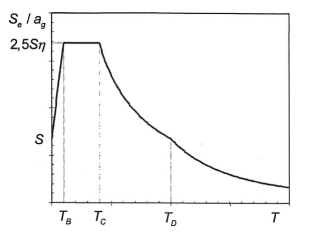

**CHÚ THÍCH 1:** Nếu địa chất tầng sâu không được tính đến (xem 3.1.2 (1)), lựa chọn được khuyến nghị là sử dụng hai loại phổ: Loại 1 và Loại 2. Nếu các trận động đất đóng góp nhiều nhất vào nguy cơ địa chấn được xác định cho địa điểm nhằm mục đích đánh giá nguy cơ động đất theo xác suất có độ lớn sóng mặt, $M_{s}$, không lớn hơn hơn 5,5, nên sử dụng phổ Loại 2. Đối với năm loại nền đất A, B, C, D và E, các giá trị khuyến nghị của các tham số S, $T_{B}$, $T_{C}$ và $T_{D}$ được nêu trong Bảng 3.2 đối với phổ Loại 1 và trong Bảng 3.3 đối với phổ Loại 2. Hình 3.2 và Hình 3.3 cho thấy các hình dạng của phổ Loại 1 và Loại 2 được khuyến nghị, tương ứng, được chuẩn hóa bằng $a_{g}$, đối với độ cản 5%. Các phổ khác nhau có thể được xác định nếu tính đến địa chất tầng sâu.

**CHÚ THÍCH 2:** Danh mục các địa danh hành chính cấp tỉnh áp dụng các phổ Loại 1 và Loại 2 được nêu trong Phụ lục E.

<strong>Hình 3.1 — Dạng của phổ phản ứng đàn hồi</strong>

### Bảng 3.2 - Giá trị của các tham số mô tả phổ phản ứng đàn hồi Loại 1

| Loại nền đất | S | $T_{B}$ (s) | $T_{C}$ (s) | $T_{D}$ (s) |
| :--- | :---: | :---: | :---: | :---: |
| A | 1,0 | 0,15 | 0,4 | 2,0 |
| B | 1,2 | 0,15 | 0,5 | 2,0 |
| C | 1,15 | 0,20 | 0,6 | 2,0 |
| D | 1,35 | 0,20 | 0,8 | 2,0 |
| E | 1,4 | 0,15 | 0,5 | 2,0 |

### Bảng 3.3 - Giá trị của các tham số mô tả phổ phản ứng đàn hồi Loại 2

| Loại nền đất | S | $T_{B}$ (s) | $T_{C}$ (s) | $T_{D}$ (s) |
| :--- | :---: | :---: | :---: | :---: |
| A | 1,0 | 0,05 | 0,25 | 1,2 |
| B | 1,35 | 0,05 | 0,25 | 1,2 |
| C | 1,5 | 0,10 | 0,25 | 1,2 |
| D | 1,8 | 0,10 | 0,30 | 1,2 |
| E | 1,6 | 0,05 | 0,25 | 1,2 |

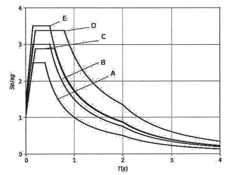

<strong>Hình 3.2 — Phổ phản ứng đàn hồi Loại 1 cho các loại nền đất từ A đến E (độ cản 5%)</strong>

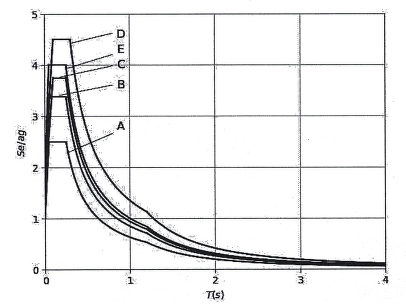

<strong>Hình 3.3 — Phổ phản ứng đàn hồi Loại 2 cho các loại nền đất từ A đến E (độ cản 5%)</strong>

**CHÚ THÍCH 2:** Đối với các nền đất Loại $S_{1}$ và $S_{2}$, cần có các nghiên cứu riêng để xác định các giá trị tương ứng của S, $T_{B}$, $T_{C}$ và $T_{D}$.

(3) Hệ Số điều chỉnh độ cản η có thể xác định bằng biểu thức:

$$\eta = \sqrt{10/(5 + \xi)} \geq 0,55 \qquad (3.6)$$
<!-- formula_id: "F_TCVN_9386_2025_FORMULA_3_6" -->

trong đó:

&nbsp;&nbsp;&nbsp;&nbsp;\- $\xi$ là tỷ số cản nhớt của kết cấu, tính bằng phần trăm.

&nbsp;&nbsp;&nbsp;&nbsp;\- (4) Trường hợp đặc biệt, khi dùng tỷ số cản nhớt khác 5 %, giá trị này được nêu trong các tiêu chuẩn liên quan của bộ TCVN 9386.

&nbsp;&nbsp;&nbsp;&nbsp;\- (5) Phổ phản ứng chuyển vị đàn hồi $S_{De}$(T) nhận được bằng cách biến đổi trực tiếp phổ phản ứng gia tốc đàn hồi $S_{e}$(T) theo biểu thức sau:

$$S_{De}(T) = S_e(T) \left[ \frac{T}{2\pi} \right]^2 \qquad (3.7)$$
<!-- formula_id: "F_TCVN_9386_2025_FORMULA_3_7" -->

&nbsp;&nbsp;&nbsp;&nbsp;\- (6) Thông thường, nên áp dụng biểu thức (3.7) cho các chu kỳ dao động không vượt quá 4,0 s. Đối với các kết cấu có chu kỳ dao động lớn hơn 4,0 s có thể dùng một định nghĩa phổ chuyển vị đàn hồi hoàn chỉnh hơn.

**CHÚ THÍCH:** Với phổ phản ứng đàn hồi tham khảo Chú thích 1 của 3.2.2.2(2), một định nghĩa như thế được trình bày trong Phụ lục A dưới dạng phổ phản ứng chuyển vị. Đối với những chu kỳ dài hơn 4,0 s, phổ phản ứng gia tác đàn hồi $S_{e}$(T) có thể lấy từ phổ phản ứng chuyển vị đàn hồi dựa vào biểu thức (3.7).

### 3.2.2.3  Phổ phản ứng đàn hồi theo phương đứng

(1) Thành phần thẳng đứng của tác động động đất phải được thể hiện bằng phổ phản ứng đàn hồi, $S_{ve}$(T), được xác định bằng cách sử dụng các biểu thức từ (3.8) đến (3.11).

$$0 \le T \le T_B : \qquad S_{ve}(T) = a_{vg} \cdot \left[ 1 + \frac{T}{T_B} \cdot (\eta \cdot 3,0 - 1) \right] \qquad (3.8)$$
<!-- formula_id: "F_TCVN_9386_2025_FORMULA_3_8" -->

$$T_B \le T \le T_C : \qquad S_{ve}(T) = a_{vg} \cdot \eta \cdot 3,0 \qquad (3.9)$$
<!-- formula_id: "F_TCVN_9386_2025_FORMULA_3_9" -->

$$T_C \le T \le T_D : \qquad S_{ve}(T) = a_{vg} \cdot \eta \cdot 3,0 \cdot \frac{T_C}{T} \qquad (3.10)$$
<!-- formula_id: "F_TCVN_9386_2025_FORMULA_3_10" -->

$$T_D \le T \le 4\text{s} : \qquad S_{ve}(T) = a_{vg} \cdot \eta \cdot 3,0 \cdot \frac{T_C T_D}{T^2} \qquad (3.11)$$
<!-- formula_id: "F_TCVN_9386_2025_FORMULA_3_11" -->

**CHÚ THÍCH:** Đối với 5 loại nền đất A, B, C, D và E, giá trị các tham số $T_{B}$, $T_{C}$ và $T_{D}$ mô tả các phổ theo phương đứng được nêu trong Bảng 3.4. Không áp dụng các giá trị này cho các loại nền đất đặc biệt $S_{1}$ và $S_{2}$.

### Bảng 3.4 - Giá trị các tham số mô tả phổ phản ứng đàn hồi theo phương đứng

| Loại phổ | $a_{vg}$/$a_{g}$ | TB (S) | TC (S) | TD (S) |
| :--- | :---: | :---: | :---: | :---: |
| Loại 1 | 0,90 | 0,05 | 0,15 | 1,0 |
| Loại 2 | 0,45 | 0,05 | 0,15 | 1,0 |

### 3.2.2.4  Chuyển vị nền thiết kế

(1) Trừ phi có nghiên cứu riêng dựa trên thông tin sẵn có, giá trị chuyển vị nền thiết kế $d_{g}$ ứng với gia tốc nền thiết kế có thể tính bằng biểu thức sau:

$$d_g = 0,025 \cdot a_g \cdot S \cdot T_C \cdot T_D \qquad (3.12)$$
<!-- formula_id: "F_TCVN_9386_2025_FORMULA_3_12" -->

với $a_{g}$, S, $T_{C}$ và $T_{D}$ được xác định theo 3.2.2. 2.

### 3.2.2.5  Phổ thiết kế dùng cho phân tích đàn hồi

(1) Khả năng ứng xử của hệ kết cấu để chịu tác động động đất trong miền phi tuyến thường cho phép thiết kế kết cấu với các lực động đất nhỏ hơn so với các lực động đất ứng với phản ứng đàn hồi tuyến tính.

(2) Để tránh phải phân tích không đàn hồi trực tiếp các kết cấu trong thiết kế, người ta kể đến khả năng tiêu tán năng lượng chủ yếu thông qua ứng xử dẻo của các cấu kiện của nó và/hoặc các cơ chế khác bằng cách phân tích đàn hồi dựa trên phổ phản ứng được chiết giảm từ phổ phản ứng đàn hồi, vì thế phổ này được gọi là “phổ thiết kế". Sự chiết giảm được thực hiện bằng cách đưa vào hệ số ứng xử q.

(3) Hệ số ứng xử q biểu thị một cách gần đúng tỷ số giữa lực động đất mà kết cấu sẽ phải chịu nếu phản ứng của nó là hoàn toàn đàn hồi với tỷ số cản nhớt 5% và lực động đất có thể sử dụng khi thiết kế theo mô hình phân tích đàn hồi thông thường mà vẫn tiếp tục bảo đảm cho kết cấu một phản ứng thỏa mãn các yêu cầu đặt ra. Giá trị của hệ số ứng xử q trong đó có xét tới ảnh hưởng của tỷ số cản nhớt khác 5 % của các loại vật liệu và hệ kết cấu khác nhau tùy theo cấp độ dẻo tương ứng được nêu trong các phần khác nhau của tiêu chuẩn này. Giá trị của hệ số ứng xử q có thể khác nhau theo các phương ngang khác nhau của kết cấu, mặc dù sự phân loại cấp độ dẻo phải như nhau với mọi hướng.

(4) Đối với các thành phần ngang của tác động động đất, phổ thiết kế $S_{d}$(T) được xác định bằng các biểu thức sau:

$$0 \le T \le T_B : \qquad S_d(T) = a_g \cdot S \cdot \left[ \frac{2}{3} + \frac{T}{T_B} \cdot \left( \frac{2,5}{q} - \frac{2}{3} \right) \right] \qquad (3.13)$$
<!-- formula_id: "F_TCVN_9386_2025_FORMULA_3_13" -->

$$T_B \leq T \leq T_C : \qquad S_d(T) = a_g \cdot S \cdot \frac{2,5}{q} \qquad (3.14)$$
<!-- formula_id: "F_TCVN_9386_2025_FORMULA_3_14" -->

$$T_C \le T \le T_D : \quad S_d(T) \begin{cases} = a_g \cdot S \cdot \frac{2,5}{q} \cdot \frac{T_C}{T} \\ \ge \beta \cdot a_g \end{cases} \qquad (3.15)$$
<!-- formula_id: "F_TCVN_9386_2025_FORMULA_3_15" -->

$$T_D \le T: \quad S_d(T) \begin{cases} = a_g \cdot S \cdot \frac{2,5}{q} \cdot \frac{T_C T_D}{T^2} \\ \ge \beta \cdot a_g \end{cases} \qquad (3.16)$$
<!-- formula_id: "F_TCVN_9386_2025_FORMULA_3_16" -->

trong đó:

| $a_{g}$, S, $T_{C}$, $T_{D}$ | được xác định theo 3.2.2.2; |
| :--- | :--- |
| $S_{d}$(T) | là phổ thiết kế; |
| q | là hệ số ứng xử; |
| β | là hệ số ứng với cận dưới của phổ thiết kế theo phương ngang, β= 0,2. |

(5) Đối với thành phần theo phương đứng của tác động động đất, phổ thiết kế cho bởi các biểu thức từ (3.13) đến (3.16) với gia tốc nền thiết kế theo phương đứng $a_{vg}$ được thay bằng giá trị $a_{g}$; S lấy bằng 1,0 còn các tham số khác được xác định theo 3.2.2.3.

(6) Đối với thành phần theo phương đứng của tác động động đất, hệ số ứng xử q nói chung có thể lấy nhỏ hơn hoặc bằng 1,5 cho mọi loại vật liệu và hệ kết cấu.

(7) Việc lấy giá trị q lớn hơn 1,5 theo phương đứng cần được lý giải thông qua phân tích phù hợp.

(8) Phổ thiết kế được xác định như trên không thích hợp cho thiết kế công trình có hệ cách chấn đáy hoặc có hệ tiêu tán năng lượng.

### 3.2.3  Cách biểu diễn khác của tác động động đất

### 3.2.3.1  Biểu diễn theo lịch sử thời gian

### 3.2.3.1.1  Yêu cầu chung

(1) Chuyển động nền đất do động đất cũng có thể được biểu diễn dưới dạng giản đồ gia tốc nền và các đại lượng liên quan (vận tốc và chuyển vị).

(2) Khi tính toán kết cấu theo mô hình không gian, chuyển động nền đất do động đất phải bao gồm ba giản đồ gia tốc tác động đồng thời. Không thể sử dụng đồng thời cùng một giản đồ gia tốc cho cả hai phương ngang. Có thể thực hiện những đơn giản hóa phù hợp với những tiêu chuẩn liên quan của bộ TCVN 9386.

(3) Tùy theo tính chất của việc áp dụng và thông tin thực có, việc mô tả chuyển động nền đất do động đất có thể thực hiện bằng cách sử dụng các giản đồ gia tốc nhân tạo (xem 3.2.3.1.2) và các giản đồ gia tốc ghi được hoặc các giản đồ gia tốc mô phỏng (xem 3.2.3.1.3).

### 3.2.3.1.2  Giản đồ gia tốc nhân tạo

(1) Các giản đồ gia tốc nhân tạo phải thiết lập phù hợp với phổ phản ứng đàn hồi đã nêu trong 3.2.2.2 và 3.2.2.3 với tỷ số cản nhớt 5 % (ξ = 5 %).

(2) Khoảng thời gian kéo dài của các giản đồ gia tốc phải phù hợp với độ mạnh và các đặc trưng có liên quan khác của hiện tượng động đất dùng làm cơ sở để xác định $a_{g}$.

(3) Khi không có dữ liệu hiện trường cụ thể, khoảng thời gian kéo dài tối thiểu $T_{s}$ của phần ổn định trong các giản đồ gia tốc được lấy bằng 10 s.

(4) Bộ giản đồ gia tốc nhân tạo cần đáp ứng những yêu cầu sau đây:

a) \- Tối thiểu cần sử dụng ba giản đồ gia tốc;

b) \- Giá trị trung bình của các giá trị phổ phản ứng gia tốc khi T = 0 (được tính từ các giản đồ gia tốc riêng rẽ) không nhỏ hơn giá trị $a_{g}$·S của địa điểm đang xét;

c) \- Trong miền chu kỳ từ 0,2$T_{1}$ đến 2$T_{1}$, trong đó $T_{1}$ là chu kỳ cơ bản của kết cấu theo phương mà giản đồ gia tốc sẽ được áp dụng, bất kỳ giá trị nào của phổ phản ứng đàn hồi trung bình ứng với tỷ số cản 5% tính được từ tất cả các giản đồ gia tốc không được nhỏ hơn 90% giá trị ứng với phổ phản ứng đàn hồi ứng với tỷ số cản 5%.

### 3.2.3.1.3  Giản đồ gia tốc ghi được hoặc giản đồ gia tốc mô phỏng

(1) Có thể sử dụng giản đồ gia tốc ghi được hoặc giản đồ gia tốc thiết lập thông qua mô phỏng số hóa nguồn phát sinh và các cơ chế lan truyền miễn là các mẫu sử dụng được đánh giá là tương thích với các đặc trưng động đất của nguồn phát sinh và các điều kiện nền đất phù hợp với địa điểm xây dựng. Các giá trị của giản đồ gia tốc này được hiệu chỉnh theo giá trị $a_{g}$·S của vùng đang xét.

(2) Việc phân tích hiệu ứng khuếch đại nền đất và việc kiểm tra ổn định động lực mái dốc, cần xem 2.2, TCVN 9386-5:2025.

(3) Bộ giản đồ gia tốc ghi được hoặc mô phỏng được sử dụng cần phù hợp với 3.2.3.1.2(4).

### 3.2.3.2  Mô hình không gian của tác động động đất

(1) Đối với kết cấu có những đặc trưng riêng đến mức không thể giả thiết rằng lực tác động ở tất cả các điểm tựa là như nhau, phải sử dụng các mô hình không gian cho tác động động đất (xem 3.2.2.1(8)).

(2) Các mô hình không gian nói trên phải phù hợp với các phổ phản ứng đàn hồi được sử dụng để xác định tác động động đất theo 3.2.2.2 và 3.2.2.3.

### 3.2.4  Tổ hợp tác động động đất với các tác động khác

(1) Giá trị thiết kế Ed của các hệ quả tác động do động đất gây ra phải được xác định theo công thức:

$$E_d = \sum_{j \ge 1} G_{k,j} + P + A_{Ed} + \sum_{i \ge 1} \psi_{2,i} Q_{k,i}$$
<!-- formula_id: "F_TCVN_9386_2025_RID24" -->

trong đó:

| "+" | có nghĩa là “tổ hợp với”; |
| :--- | :--- |
| $G_{kj}$ | là giá trị đặc trưng của tác động thường xuyên thứ j; |
| $A_{Ed}$ | là giá trị thiết kế của tác động động đất (= $\gamma_{I}A_{Ek}$) |
| $Q_{k,i}$ | là giá trị đặc trưng của tác động thay đổi thứ i, |
| P | là giá trị đại diện thích hợp của tác động ứng lực trước; |
| $Ψ_{2,i}$ | là hệ số của giá trị dài hạn của tác động thay đổi thứ i. |

(2) Các hiệu ứng quán tính của tác động động đất thiết kế phải được xác định có xét đến các khối lượng liên quan tới tất cả các lực trọng trường xuất hiện trong tổ hợp tác động sau:

$$\sum G_{k,j} "+" \sum \psi_{E,i} \cdot Q_{k,i} \qquad (3.17)$$
<!-- formula_id: "F_TCVN_9386_2025_FORMULA_3_17" -->

trong đó:

| $Ψ_{E,i}$ | là hệ số tổ hợp tác động đối với tác động thay đổi thứ i (xem 4.2.4); |
| :--- | :--- |

(3) Các hệ số tổ hợp $Ψ_{E,i}$ xét đến khả năng tác động thay đổi $Q_{k,i}$ không xuất hiện trên toàn bộ công trình trong thời gian xảy ra động đất. Các hệ số này còn xét đến sự tham gia hạn chế của khối lượng vào chuyển động của kết cấu do liên kết không cứng giữa chúng.

(4) Các giá trị $Ψ_{2,i}$ nêu trong Bảng 3.5 còn các giá trị $Ψ_{E,i}$ đối với nhà được nêu trong 4.2.4.

### Bảng 3.5 - Các giá trị $\psi_{2,i}$ đối với nhà

| Tác động | $\psi_{2,i}$ |
| :--- | :---: |
| Tác động thay đổi tại các khu vực |  |
| Khu vực A: Khu vực ở | 0,3 |
| Khu vực B: Khu vực làm việc, văn phòng, kỹ thuật, thí nghiệm | 0,3 |
| Khu vực C: Khu vực có thể tập trung đông người, trừ các khu vực A, B và D | 0,6 |
| Khu vực D: Khu vực thương mại | 0,6 |
| Khu vực E: Khu vực kho | 0,8 |
| Khu vực F: Bãi đỗ xe trong nhà cho phương tiện giao thông có tổng trọng lượng không lớn hơn 30 kN | 0,6 |
| Khu vực G: Bãi đỗ xe trong nhà cho phương tiện giao thông có tổng trọng lượng lớn hơn 30 kN nhưng không lớn hơn 160 kN | 0,3 |
| Khu vực G1: Bãi đỗ xe cho phương tiện giao thông có tổng trọng lượng lớn hơn 160 kN | 0,0 |
| Khu vực H: Mái | 0,0 |
| Khu vực L: Chăn nuôi | 0,3 |
| Khu vực K: Bãi đỗ trực thăng | 0,0 |
| Tải trọng gió | 0,0 |

## 4  THIẾT KẾ NHÀ

### 4.1  Yêu cầu chung

### 4.1.1  Phạm vi áp dụng

(1) Điều 4 bao gồm những yêu cầu chung cho thiết kế nhà chịu động đất và phải sử dụng phối hợp với các Điều 2, 3 và từ 5 đến 9.

(2) Các Điều từ 5 đến 9 liên quan đến những yêu cầu cụ thể đối với các loại vật liệu và cấu kiện khác nhau sử dụng cho nhà.

(3) Chỉ dẫn về cách chấn đáy đối với nhà được nêu trong Điều 10.

### 4.2  Đặc trưng của nhà chịu động đất

### 4.2.1  Nguyên tắc cơ bản của thiết kế sơ bộ

(1) Trong vùng có động đất, vấn đề nguy cơ động đất phải được xem xét ngay trong giai đoạn đầu của việc thiết kế nhà, điều này cho phép tạo ra một hệ kết cấu thỏa mãn những yêu cầu cơ bản đặt ra trong 2.1 với chi phí có thể chấp nhận được.

(2)  Những nguyên tắc chủ đạo trong thiết kế sơ bộ:

&nbsp;&nbsp;\- Tính đơn giản về kết cấu;

&nbsp;&nbsp;\- Tính đều đặn, đối xứng và siêu tĩnh;

&nbsp;&nbsp;\- Có độ cứng và khả năng chịu lực theo cả hai phương;

&nbsp;&nbsp;\- Có độ cứng và độ bền chống xoắn;

&nbsp;&nbsp;\- Sàn tầng có ứng xử như tấm cứng;

&nbsp;&nbsp;\- Có móng thích hợp.

Những nguyên tắc này được cụ thể hóa hơn trong những điều khoản sau:

### 4.2.1.1  Tính đơn giản về kết cấu

(1) Tính đơn giản về kết cấu, được đặc trưng bởi các đường truyền lực động đất trực tiếp và rõ ràng, là một mục tiêu quan trọng vì việc mô hình hóa, phân tích, xác định kích thước, cấu tạo và cách thi công của một kết cấu đơn giản thì sẽ giảm thiểu tính bất định, do đó việc dự đoán ứng xử kháng chấn càng tin cậy hơn.

### 4.2.1.2  Tính đều đặn, đối xứng và siêu tĩnh

(1) Tính đều đặn trong mặt bằng được đặc trưng bởi sự phân bố đều các cấu kiện chịu lực cho phép truyền trực tiếp và nhanh chóng các lực quán tính sinh ra bởi những khối lượng phân bố trong nhà. Nếu cần, tính đều đặn có thể tạo ra bằng cách chia nhỏ công trình thành các đơn nguyên độc lập về mặt động lực nhờ các khe kháng chấn, miễn là các khe kháng chấn này được thiết kế để tránh hiện tượng va đập giữa các đơn nguyên theo 4.4.2.7.

(2) Tính đều đặn theo mặt đứng của công trình cũng quan trọng, vì nó có xu hướng loại trừ sự xuất hiện các vùng nhạy cảm, tại đó sự tập trung ứng suất hoặc yêu cầu lớn về độ dẻo có thể nhanh chóng gây nên sự sụp đổ.

(3) Mối quan hệ chặt chẽ giữa phân bố khối lượng và phân bố khả năng chịu lực và độ cứng sẽ loại trừ được độ lệch tâm lớn giữa khối lượng và độ cứng.

(4) Nếu hình dạng của kết cấu nhà đối xứng hoặc gần đối xứng, phương pháp thích hợp nhất để đạt tính đồng đều là bố trí các cấu kiện đối xứng và phân bố chúng đồng đều trong mặt bằng.

(5) Sử dụng các cấu kiện chịu lực được phân bổ đều đặn sẽ làm tăng bậc siêu tĩnh, cho phép phân bố lại nội lực một cách có lợi hơn và tiêu tán năng lượng dàn trải trên toàn bộ công trình.

### 4.2.1.3  Độ cứng và độ bền theo hai phương

(1) Chuyển động nền đất do động đất theo phương ngang diễn ra theo hai phương vuông góc và vì thế kết cấu nhà phải có khả năng chịu được các tác động ngang theo bất kỳ phương nào.

(2) Để thỏa mãn (1), các cấu kiện chịu lực cần bố trí theo hai phương vuông góc nhau trong mặt bằng, để bảo đảm các đặc trưng về độ cứng và khả năng chịu lực tương tự nhau theo cả hai phương chính.

(3) Việc lựa chọn các đặc trưng độ cứng của công trình, trong khi tìm cách giảm thiểu các hệ quả của tác động động đất (có tính đến các đặc trưng cụ thể của động đất tại địa điểm xây dựng) cũng cần hạn chế sự phát triển của chuyển vị quá lớn có thể dẫn tới sự mất ổn định do hiệu ứng bậc hai hoặc do hư hỏng nghiêm trọng.

### 4.2.1.4  Độ cứng và khả năng chống xoắn

(1) Ngoài độ cứng và khả năng chịu lực theo phương ngang, kết cấu nhà cần có độ cứng và khả năng chống xoắn phù hợp nhằm hạn chế sự phát triển của chuyển động xoắn có xu hướng gây ra ứng suất không đều trong các cấu kiện chịu lực khác nhau. Nhằm mục đích đó, việc bố trí các cấu kiện kháng chấn chính gần với chu vi của nhà là rất có lợi.

### 4.2.1.5  Sàn tầng có ứng xử như tấm cứng

(1) Trong kết cấu nhà, các sàn (kể cả sàn mái) đóng một vai trò rất quan trọng trong sự làm việc tổng thể của kết cấu chịu động đất. Chúng làm việc như những tấm cứng ngang, tiếp nhận và truyền các lực quán tính sang hệ kết cấu thẳng đứng và bảo đảm cho các hệ thống này cùng nhau làm việc khi chịu tác động động đất theo phương ngang, ứng xử của sàn như tấm cứng có tác dụng đặc biệt trong trường hợp hệ kết cấu theo phương đứng là phức tạp và không đều đặn, hoặc trong trường hợp sử dụng đồng thời các hệ kết cấu có các đặc trưng biến dạng theo phương ngang khác nhau (ví dụ như trong hệ ghép hoặc hỗn hợp).

(2) Các hệ sàn và mái cần có khả năng chịu lực và độ cứng trong mặt phẳng, có sự liên kết hiệu quả với các hệ kết cấu theo phương đứng. Đặc biệt cần quan tâm đến các trường hợp có hình dạng mặt bằng rời rạc hoặc kéo rất dài trong mặt phẳng và trường hợp sàn có những lỗ mở lớn, đặc biệt khi các lỗ mở này nằm gần với các cấu kiện chính theo phương đứng làm giảm hiệu quả của liên kết giữa các cấu kiện kết cấu theo phương ngang và phương đứng.

(3) Các tấm cứng cần có đủ độ cứng trong mặt phẳng để phân bổ các lực quán tính ngang tới hệ kết cấu theo phương đứng phù hợp với những giả thiết tính toán (ví dụ như độ cứng của tấm cứng, xem 4.3.1(4)), đặc biệt khi có những thay đổi đáng kể về độ cứng hoặc có phần nhô ra thụt vào của cấu kiện theo phương đứng phía trên và phía dưới tấm cứng.

### 4.2.1.6  Có móng phù hợp

(1) Đối với tác động động đất, việc thiết kế và thi công mỏng và sự liên kết với kết cấu bên trên phải bảo đảm toàn bộ công trình chịu tác động động đất đồng đều.

(2) Đối với kết cấu bao gồm một số tường chịu lực rời rạc, có thể khác nhau về độ cứng và chiều rộng, thường chọn hệ móng cứng, kiểu hộp hoặc kiểu nhiều ngăn, gồm một bản đáy và một bản nắp.

(3) Đối với nhà và công trình có những cấu kiện móng độc lập (móng đơn hoặc móng cọc), nên dùng bản giằng móng hoặc dầm giằng móng liên kết các cấu kiện này theo hai hướng chính phù hợp với các yêu cầu trong 5.4.1.2, TCVN 9386-5:2025.

### 4.2.2  Cấu kiện kháng chấn chính và cấu kiện kháng chấn phụ

(1) Một số cấu kiện (ví dụ như dầm và/hoặc cột) có thể chọn là cấu kiện kháng chấn phụ, không tham gia vào hệ kết cấu kháng chấn của công trình. Cường độ và độ cứng kháng chấn của những cấu kiện này có thể bỏ qua. Chúng không cần thiết phải đáp ứng những yêu cầu ở các Điều từ 5 tới 9. Tuy nhiên, các cấu kiện này cùng với các liên kết của chúng phải được thiết kế và cấu tạo để chịu được tải trọng trọng lực khi chịu những chuyển vị gây ra bởi các điều kiện thiết kế chịu động đất bất lợi nhất. Khi thiết kế các bộ phận này cần xét tới những hiệu ứng bậc hai (hiệu ứng P-∆).

(2) Các Điều từ 5 đến 9 đưa ra những yêu cầu bổ sung cho các yêu cầu trong các tiêu chuẩn từ EN 1992 tới EN 1996 khi thiết kế và cấu tạo các cấu kiện kháng chấn phụ.

(3) Tất cả các cấu kiện chịu lực không được thiết kế như cấu kiện kháng chấn phụ đều được xem là cấu kiện kháng chấn chính. Chúng được xem như một phần của hệ chịu lực ngang, cần được mô hình hóa trong phân tích kết cấu theo 4.3.1 và được thiết kế, cấu tạo kháng chấn theo yêu cầu trong các Điều từ 5 đến 9.

(4) Độ cứng ngang của tất cả các cấu kiện kháng chấn phụ không được vượt quá 15 % độ cứng ngang của tất cả các cấu kiện kháng chấn chính.

(5) Việc chọn một số cấu kiện làm cấu kiện kháng chấn phụ không được làm thay đổi sự phân loại công trình từ không đều đặn sang đều đặn theo 4.2.3.

### 4.2.3  Tiêu chí về tính đều đặn của kết cấu

### 4.2.3.1  Yêu cầu chung

(1) Để thiết kế chịu động đất, kết cấu nhà được phân thành hai loại đều đặn và không đều đặn.

**CHÚ THÍCH:** Đối với các công trình xây dựng có nhiều hơn một đơn nguyên độc lập về mặt động lực, sự phân loại trong mục này và các yêu cầu nêu trong 4.2.3 là ứng với từng đơn nguyên độc lập về mặt động lực. Đối với loại kết cấu đó, “đơn nguyên độc lập về mặt động lực" có nghĩa là "nhà" trong 4.2.3.

(2) Sự phân loại này có tác động tới các vấn đề sau trong thiết kế chịu động đất:

&nbsp;&nbsp;\- Mô hình kết cấu, có thể dùng mô hình đơn giản hóa ở dạng phẳng hoặc mô hình không gian.

&nbsp;&nbsp;\- Phương pháp phân tích, có thể là phân tích phổ phản ứng đã được đơn giản hóa (phương pháp phân tích tĩnh lực ngang tương đương) hoặc phân tích dạng dao động.

&nbsp;&nbsp;\- Giá trị của hệ số ứng xử q cần phải lấy nhỏ hơn nếu kết cấu không đều đặn theo chiều cao (xem 4.2.3.3).

(3) Về phương diện các hệ quả của tính đều đặn của kết cấu trong phân tích và thiết kế, các đặc trưng về tính đều đặn của nhà trong mặt bằng và theo mặt đứng được xem xét độc lập (Bảng 4.1).

### Bảng 4.1 - Các hệ quả của tính đều đặn của kết cấu trong phân tích và thiết kế chịu động đất

| Tính đều đặn — Mặt bằng | Tính đều đặn — Mặt đứng | Được phép đơn giản hóa — Mô hình | Được phép đơn giản hóa — Phân tích đàn hồi - tuyến tính | Hệ số ứng xử — (Phân tích tuyến tính) |
| :--- | :--- | :--- | :--- | :--- |
| Có | Có | Phẳng | Lực $ngang^{a}$ | Giá trị tham chiếu |
| Có | Không | Phẳng | Dạng dao động | Giá trị suy giảm |
| Không | Có | Không $gian^{b}$ | Lực $ngang^{a}$ | Giá trị tham chiếu |
| Không | Không | Không gian | Dạng dao động | Giá trị suy giảm |
| **$^{a}$ Nếu điều kiện 4.3.3.2.1(2)a cũng được thỏa mãn. $^{b}$ Theo những điều kiện nêu trong 4.3.3.1(8), có thể sử dụng mô hình phẳng riêng rẽ theo mỗi phương ngang theo 4.3.3.1(8).** |  |  |  |  |

(4) Các tiêu chí mô tả tính đều đặn theo mỗi phương ngang trong mặt bằng và theo mặt đứng nêu trong 4.2.3.2 và 4.2.3.3; các yêu cầu liên quan tới việc mô hình hóa và phân tích nêu trong 4.3.

(5) Các tiêu chí về tính đều đặn trong 4.2.3.2 và 4.2.3.3 nên được xem là những điều kiện cần. Cần kiểm tra tính đều đặn được giả định của kết cấu để đảm bảo nó không bị thay đổi bởi các đặc trưng khác chưa được kể đến trong các tiêu chí đó.

(6) Các giá trị tham chiếu của hệ số ứng xử nêu trong các Điều từ 5 đến 9.

(7) Đối với kết cấu nhà không đều đặn theo phương đứng, giá trị suy giảm của hệ số ứng xử được lấy bằng giá trị tham chiếu nhân với hệ số 0,8.

### 4.2.3.2  Tiêu chí về tính đều đặn trong mặt bằng

(1) Kết cấu nhà được xếp loại có hình dạng đều đặn trong mặt bằng phải thỏa mãn tất cả các điều kiện dưới đây.

(2) Về độ cứng ngang và sự phân bố khối lượng, kết cấu nhà phải gần đối xứng trong mặt bằng theo hai trục vuông góc.

(3) Hình dạng mặt bằng phải gọn, nghĩa là mỗi sàn phải được giới hạn bằng một đa giác lồi. Nếu trong mặt bằng có các chỗ lõm (góc lõm vào hoặc các hốc), tính đều đặn trong mặt bằng vẫn được xem là thỏa mãn nếu các chỗ lõm đó không ảnh hưởng tới độ cứng trong mặt phẳng của sàn và với mỗi chỗ lõm, diện tích giữa biên ngoài của sàn và đa giác lồi bao quanh sàn không vượt quá 5% diện tích sàn.

(4) Độ cứng trong mặt phẳng của sàn phải lớn hơn đáng kể so với độ cứng ngang của các cấu kiện kết cấu theo phương đứng, để biến dạng của sàn ít ảnh hưởng tới sự phân bố lực giữa các cấu kiện theo phương đứng chịu lực. Về mặt này, các mặt bằng dạng chữ L, C, H, I và X cần được xem xét, một cách cẩn thận, nhất là đối với độ cứng của các nhánh vươn ra bên, phải tương xứng với độ cứng phần trung tâm, nhằm thỏa mãn điều kiện tấm cứng. Nên xem xét áp dụng mục này cho ứng xử tổng thể của nhà.

(5) Độ mảnh λ = $L_{max}$/$L_{min}$ của mặt bằng nhà không được lớn hơn 4, trong đó $L_{max}$ và $L_{min}$ lần lượt là kích thước lớn nhất và nhỏ nhất của mặt bằng nhà theo hai phương vuông góc.

(6) Tại mỗi tầng và đối với mỗi phương tính toán x và y, độ lệch tâm kết cấu $e_{0}$ và bán kính xoắn r phải thỏa mãn 2 điều kiện dưới đây, các điều kiện này được viết cho phương y:

$$e_{0x} \le 0,30 r_{x} \qquad (4.1a)$$
<!-- formula_id: "F_TCVN_9386_2025_FORMULA_4_1A" -->

$$r_{x} \ge i_{s} \qquad (4.1b)$$
<!-- formula_id: "F_TCVN_9386_2025_FORMULA_4_1B" -->

trong đó:

&nbsp;&nbsp;&nbsp;&nbsp;\- $e_{0x}$ là khoảng cách giữa tâm cứng và tâm khối lượng, theo phương x, vuông góc với phương tính toán đang xét;

&nbsp;&nbsp;&nbsp;&nbsp;\- $r_{x}$ là căn bậc hai của tỉ số giữa độ cứng xoắn và độ cứng ngang theo phương y (“bán kính xoắn”);

&nbsp;&nbsp;&nbsp;&nbsp;\- $i_{s}$ là bán kính quán tính của khối lượng sàn trong mặt bằng (căn bậc hai của tỉ số giữa mô men quán tính độc cực của khối lượng sàn trong mặt bằng đối với tâm khối lượng của sàn và khối lượng sàn).

&nbsp;&nbsp;&nbsp;&nbsp;\- Những định nghĩa về tâm cứng và bán kính xoắn r được cho từ (7) đến (9).

&nbsp;&nbsp;&nbsp;&nbsp;\- (7) Trong nhà một tầng, tâm cứng được định nghĩa là tâm cứng ngang của tất cả các cấu kiện kháng chấn chính. Bán kính xoắn r được định nghĩa là căn bậc hai của tỉ số giữa độ cứng xoắn tổng thể đối với tâm cứng ngang và độ cứng ngang tổng thể trong một phương, có xét tới tất cả các cấu kiện kháng chấn chính trong phương đó.

&nbsp;&nbsp;&nbsp;&nbsp;\- (8) Trong nhà nhiều tầng, chỉ có thể định nghĩa gần đúng tâm cứng và bán kính xoắn. Để phân loại tính đều đặn của kết cấu trong mặt bằng và để phân tích gần đúng các ảnh hưởng xoắn có thể đưa ra một định nghĩa đơn giản nếu thỏa mãn hai điều kiện sau:

a) \- Toàn bộ các hệ chịu tải trọng ngang như lõi, tường hoặc khung, cần liên tục từ móng lên tới mái nhà.

b) \- Biến dạng của các hệ kết cấu thành phần dưới tác động của tải trọng ngang không quá khác nhau. Điều kiện này có thể xem là thỏa mãn trong trường hợp dùng các hệ khung và hệ tường. Nói chung, điều kiện này không thỏa mãn ở hệ kết cấu hỗn hợp.

(9) Ở các hệ khung và hệ tường mảnh với biến dạng uốn là chủ yếu, vị trí của tâm cứng và bán kính xoắn của tất cả các tầng có thể xác định như của mô men quán tính của các tiết diện ngang của những cấu kiện theo phương đứng. Ngoài biến dạng uốn, nếu biến dạng cắt cũng đáng kể thì có thể xét tới chúng bằng cách sử dụng mô men quán tính tương đương của tiết diện ngang đó.

### 4.2.3.3  Tiêu chí về tính đều đặn theo mặt đứng

(1) Đối với kết cấu nhà được xếp loại đều đặn theo mặt đứng cần thỏa mãn tất cả những điều kiện sau đây.

(2) Tất cả các hệ kết cấu chịu tải trọng ngang như lõi, tường hoặc khung, phải liên tục từ móng tới mái của nhà hoặc tới đỉnh của vùng có giật cấp của nhà nếu có giật cấp tại các độ cao khác nhau.

(3) Cả độ cứng ngang lẫn khối lượng của các tầng riêng rẽ phải giữ nguyên không đổi hoặc giảm từ từ, không thay đổi đột ngột từ móng tới đỉnh nhà.

(4) Trong các nhà khung, tỷ số giữa khả năng chịu lực thực tế và khả năng chịu lực yêu cầu của tầng theo tính toán không được thay đổi một cách không cân xứng giữa các tầng liền kề. Về mặt này, các trường hợp riêng của khung có khối xây chèn được đề cập trong 4.3.6.3.2.

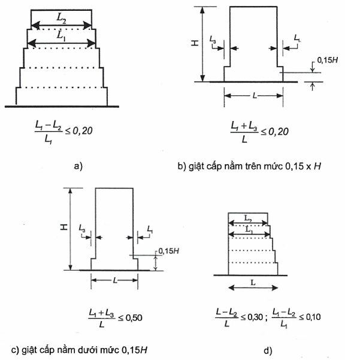

<strong>Hình 4.1 — Các tiêu chí về tính đều đặn của nhà có giật cấp</strong>

(5) Khi có giật cấp thì áp dụng các yêu cầu bổ sung sau:

a) \- Đối với các giật cấp liên tiếp mà vẫn giữ được tính đối xứng trục, sự giật cấp tại bất kỳ tầng nào cũng không được lớn hơn 20 % kích thước của mặt bằng kề dưới theo hướng giật cấp (xem Hình 4.1.a và 4.1.b);

b) \- Đối với giật cấp một lần ở cao trình thấp hơn 15 % chiều cao H của hệ kết cấu chính kể từ móng, kích thước chỗ lùi vào không được lớn hơn 50 % kích thước mặt bằng ngay phía dưới (xem Hình 4.1.c). Trong trường hợp này, kết cấu của vùng đáy trong phạm vi hình chiếu đứng của các tầng phía trên cần được thiết kế để chịu được ít nhất 75 % các lực cắt ngang có thể sinh ra ở vùng này trong một công trình tương tự nhưng có đáy không mở rộng.

c) \- Nếu các giật cấp không giữ được tính đối xứng, tổng kích thước của các giật cấp ở mỗi mặt tại tất cả các tầng không được lớn hơn 30 % kích thước mặt bằng tầng trệt hoặc mặt bằng trên đỉnh của phần cứng phía dưới và kích thước của mỗi giật cấp không được lớn hơn 10 % kích thước mặt bằng liền dưới (xem Hình 4.1.d).

### 4.2.4  Hệ số tổ hợp của tác động thay đổi

(1) Các hệ số tổ hợp $\psi_{2,i}$ (đối với giá trị dài hạn của tác động thay đổi $q_{i}$) dùng để thiết kế nhà (xem 3.2.4) được nêu trong Bảng 3.5.

(2) Các hệ số tổ hợp $\psi_{E,i}$ trong 3.2.4(2) dùng để tính toán các hệ quả của tác động động đất phải được xác định theo biểu thức sau:

$$\psi_{E,i} = φ ∙ \psi_{2,i} \qquad (4.2)$$
<!-- formula_id: "F_TCVN_9386_2025_FORMULA_4_2" -->

Các giá trị φ nêu trong Bảng 4.2.

### Bảng 4.2 - Giá trị của φ để tính toán $\psi_{Ei}$

| Loại tác động thay đổi1) | Tầng | φ |
| :--- | :--- | :---: |
| Các loại từ A đến C | Mái | 1,0 |
|  | Các tầng được sử dụng đồng thời | 0,8 |
|  | Các tầng được sử dụng độc lập | 0,5 |
| Các loại từ D đến F và kho lưu trữ |  | 1,0 |
| **1) Các loại tác động thay đổi được xác định theo Bảng 3.5.** |  |  |

### 4.2.5  Mức và hệ số tầm quan trọng

(1) Nhà và công trình được phân thành bốn cấp hậu quả (mức độ quan trọng), phụ thuộc vào hậu quả của sự sụp đổ tới sinh mạng con người, vào cấp hậu quả của chúng đối với sự an toàn công cộng, vào việc bảo vệ con người ngay sau khi xảy ra động đất và vào hậu quả kinh tế - xã hội gây ra bởi sự sụp đổ của công trình.

(2) Cấp hậu quả được đặc trưng bởi hệ số tầm quan trọng ү$_{I}$ nêu trong 2.1.3.

(3) Hệ số tầm quan trọng ү$_{I}$ = 1,0 ứng với sự kiện động đất có chu kỳ lặp tham chiếu như đã nêu trong 3.2.1(3).

(4) Các định nghĩa về cấp hậu quả và hệ số tầm quan trọng đối với nhà được nêu trong Bảng 4.3.

### Bảng 4.3 - Cấp hậu quả

| Cấp hậu quả1) | Cấp hậu quả1) | Công trình | Hệ số tầm quan trọng ү$_{I}$ |
| :--- | :--- | :--- | :---: |
| C1 | C1 | Công trình nhà có vai trò quan trọng thứ yếu đến an toàn công cộng. | 0,8 |
| C2 | C2 | Công trình nhà thông thường, không thuộc các cấp hậu quả khác | 1,0 |
| C3 | C3-a | Công trình nhà mà khả năng chịu động đất đóng vai trò quan trọng trên quan điểm hậu quả xảy ra khi sụp đổ. | 1,2 |
| C3 | C3-b | Công trình nhà có vai trò quan trọng sống còn cho bảo vệ con người khi xảy ra động đất. | 1,4 |
| **1) Cấp hậu quả của công trình lấy theo [2].** |  |  |  |

> **CHÚ THÍCH:** Các cấp hậu quả C3-a và C3-b được phân nhỏ từ cấp C3 trong [2]. Danh mục một số công trình tương ứng với các cấp hậu quả được nêu trong Phụ lục D.

(5) Đối với những công trình nhà chứa thiết bị hoặc vật liệu nguy hiểm, hệ số tầm quan trọng cần được xác định theo các tiêu chí nêu trong EN 1998-4.

### 4.3  Phân tích kết cấu

### 4.3.1  Mô hình hóa

(1) Mô hình hóa kết cấu nhà phải thể hiện thỏa đáng sự phân bố độ cứng và khối lượng sao cho tất cả các dạng biến dạng quan trọng và lực quán tính đều được xét đến một cách đúng đắn dưới tác động động đất. Trong trường hợp phân tích phi tuyến, mô hình này cũng phải thể hiện một cách thỏa đáng sự phân bố của cường độ.

(2) Mô hình hóa cần xét đến sự đóng góp của các nút liên kết vào biến dạng của kết cấu nhà, ví dụ như các vùng đầu dầm hoặc cột của kết cấu khung. Cũng cần xét đến những bộ phận phi kết cấu mà có thể ảnh hưởng tới phản ứng của kết cấu kháng chấn chính.

(3) Nói chung, có thể xem hệ kết cấu gồm một số kết cấu chịu tải trọng ngang và đứng được liên kết với nhau bởi các tấm cứng.

(4) Khi các sàn nhà có thể được xem là cứng trong mặt phẳng của chúng thì các khối lượng và mô men quán tính của mỗi sàn có thể tập trung tại trọng tâm.

**CHÚ THÍCH:** Sàn được xem là cứng nếu khi được mô hình hóa với biến dạng uốn thực tế trong mặt phẳng, thì các chuyển vị ngang của nó xác định theo giả thiết tấm cứng tại bất kỳ điểm nào cũng không vượt quá 10 % chuyển vị ngang tuyệt đối tương ứng trong tình huống thiết kế động đất.

(5) Đối với nhà phù hợp với các tiêu chí về tính đều đặn trong mặt bằng (xem 4.2.3.2) hoặc với các điều kiện nêu trong 4.3.3.1(8), có thể phân tích bằng cách sử dụng hai mô hình phẳng, mỗi mô hình cho một phương chính.

(6) Trong nhà bê tông, nhà thép-bê tông liên hợp và nhà xây, độ cứng của những cấu kiện chịu lực nói chung cần được đánh giá có xét đến ảnh hưởng của vết nứt. Độ cứng này cần tương ứng với sự bắt đầu chảy dẻo của cốt thép.

(7) Trừ phi thực hiện sự phân tích chính xác hơn đối với các cấu kiện bị nứt, các đặc trưng về độ cứng chống cắt và độ cứng chống uốn đàn hồi của các cấu kiện bê tông và khối xây có thể lấy bằng một nửa độ cứng tương ứng của các cấu kiện không bị nứt.

(8) Các tường chèn góp phần đáng kể vào độ cứng ngang và sức chịu tải của nhà cần được xét đến trong tính toán. Xem 4.3.6 về tường chèn bằng khối xây trong khung bê tông cốt thép, thép hoặc liên hợp.

(9) Tính biến dạng của móng phải được xét trong mô hình, mỗi khi nó có thể ảnh hưởng bất lợi tới phản ứng tổng thể của kết cấu.

**CHÚ THÍCH:** Tính biến dạng của móng (kể cả sự tương tác nền - công trình) cần luôn được xét đến, kể cả các trường hợp ảnh hưởng có lợi.

(10) Các khối lượng phải được tính toán từ các tải trọng trọng trường xuất hiện trong tổ hợp tác động nêu trong 3.2.4. Các hệ số tổ hợp $\psi_{Ei}$ nêu trong 4.2.4(2).

### 4.3.2  Hiệu ứng xoắn ngẫu nhiên

(1) Để xét tính thiếu tin cậy của vị trí các khối lượng và sự thay đổi trong không gian của chuyển động động đất, tâm khối lượng tính toán ở mỗi sàn i được xem như chuyển dịch khỏi vị trí danh nghĩa của nó trong mỗi phương với độ lệch tâm ngẫu nhiên:

$$e_{ai} = \pm 0,05 L_{i} \qquad (4.3)$$
<!-- formula_id: "F_TCVN_9386_2025_FORMULA_4_3" -->

trong đó:

&nbsp;&nbsp;&nbsp;&nbsp;\- $e_{ai}$ là độ lệch tâm ngẫu nhiên của khối lượng tầng thứ i so với vị trí danh nghĩa của nó trong cùng một phương ở tất cả các sàn;

&nbsp;&nbsp;&nbsp;&nbsp;\- $L_{i}$ là kích thước sàn theo phương vuông góc với phương tác động động đất.

### 4.3.3  Phương pháp phân tích

### 4.3.3.1  Yêu cầu chung

(1) Trong phạm vi của Điều 4, những hệ quả của tác động động đất và những hệ quả của các tác động khác kể đến trong thiết kế chịu động đất có thể được xác định trên cơ sở ứng xử đàn hồi tuyến tính của kết cấu.

(2) Phương pháp tham chiếu để xác định các hệ quả động đất phải là phương pháp phân tích phổ phản ứng dạng dao động, sử dụng mô hình đàn hồi tuyến tính của kết cấu và phổ thiết kế nêu trong 3.2.2.5.

(3) Tùy thuộc vào các đặc trưng kết cấu của nhà, có thể sử dụng một trong hai phương pháp phân tích đàn hồi tuyến tính sau:

a) \- “Phương pháp phân tích lực ngang” đối với nhà thỏa mãn những điều kiện nêu trong 4.3.3.2;

b) \- “Phương pháp phân tích phổ phản ứng dạng dao động”, là phương pháp có thể áp dụng cho tất cả các loại nhà (xem 4.3 3.3).

(4) Phương pháp phi tuyến cũng có thể được sử dụng thay thế cho phương pháp tuyến tính, ví dụ:

c) \- Phân tích tĩnh phi tuyến;

d) \- Phân tích phi tuyến theo thời gian (động); miễn là thỏa mãn những điều kiện nêu trong (5), (6) của điều này và trong 4.3.3.4

**CHÚ THÍCH:** Đối với nhà có cách chắn đáy, các điều kiện để sử dụng các phương pháp tuyến tính a) và b) hoặc các phương pháp phi tuyến c) và d) được nêu trong Điều 10. Đối với nhà không có cách chấn đáy, trong mọi trường hợp có thể sử dụng các phương pháp tuyến tính nêu trong 4.3.3.1(3), như đã nêu trong 4.3.3.2.1.

(5) Cần lý giải một cách hợp lý phân tích phi tuyến về các tác động động đất đầu vào, mô hình sử dụng, phương pháp diễn giải kết quả tính toán và các yêu cầu cần thỏa mãn.

(6) Các công trình không có cách chấn đáy được thiết kế trên cơ sở phân tích tĩnh phi tuyến mà không sử dụng hệ số ứng xử q (xem 4.3.3.4.2(1)d, cần thỏa mãn 4.4.2.2(5) cũng như những yêu cầu của các Điều từ 5 đến 9 cho các kết cấu tiêu tán năng lượng.

(7) Nếu thỏa mãn được các tiêu chí về tính đều đặn trong mặt bằng, có thể thực hiện phân tích đàn hồi tuyến tính bằng cách sử dụng hai mô hình phẳng, mỗi mô hình cho một phương ngang chính (xem 4.2.3.2).

(8) Khi không thỏa mãn được các tiêu chí về tính đều đặn trong mặt bằng theo 4.2.3.2, tùy thuộc vào cấp hậu quả của công trình, có thể thực hiện phân tích đàn hồi tuyến tính bằng cách sử dụng hai mô hình phẳng, mỗi mô hình cho một phương ngang chính, miễn là thỏa mãn tất cả các điều kiện đặc thù về tính đều đặn sau:

a) \- Nhà có các tường ngăn và tường bao che tương đối cứng và được phân bố hợp lý;

b) \- Chiều cao nhà không vượt quá 10 m;

c) \- Độ cứng trong mặt phẳng của các sàn tầng phải đủ lớn so với độ cứng ngang của các cấu kiện theo phương đứng để có thể giả thiết sàn làm việc như tấm cứng.

d) \- Các tâm cứng theo phương ngang và tâm khối lượng của các tầng, đều phải gần như nằm trên một đường thẳng đứng tương ứng và trong hai phương ngang phân tích, thỏa mãn các điều kiện $r_x^2 > i_s^2 + e_{ox}^2, \ r_y^2 > i_s^2 + e_{oy}^2$, trong đó, bán kính quán tính $i_{s}$, bán kính xoắn $r_{x}$, $r_{y}$ và các độ lệch tâm ngẫu nhiên $e_{ox}$, $e_{oy}$ được xác định theo 4.2.3.2(6).

**CHÚ THÍCH:** Giá trị của hệ số tầm quan trọng ү$_{I}$, mà dưới giá trị này thì cho phép đơn giản hóa phân tích theo 4.3.3.1(8), nêu trong Bảng 4.3.

(9) Kết cấu nhà thỏa mãn tất cả các điều kiện (8) của mục này nhưng không thỏa mãn d), có thể thực hiện phân tích đàn hồi tuyến tính bằng cách sử dụng hai mô hình phẳng, mỗi mô hình cho một phương ngang chính. Trong những trường hợp như thế, tất cả các hệ quả tác động động đất xác định từ những phân tích này cần nhân với 1,25.

(10) Kết cấu nhà không phù hợp với các tiêu chí từ (7) đến (9) của mục này phải được phân tích bằng mô hình không gian.

(11) Khi sử dụng mô hình không gian, tác động động đất thiết kế phải được đặt theo tất cả các phương ngang cần thiết (xét theo cách bố trí kết cấu của nhà) và các phương ngang vuông góc với chúng. Đối với nhà có các cấu kiện chịu lực bố trí theo hai phương vuông góc thì hai phương này được xem là hai phương cần thiết.

### 4.3.3.2  Phương pháp phân tích lực ngang

### 4.3.3.2.1  Yêu cầu chung

(1) Phương pháp phân tích này có thể áp dụng cho các kết cấu nhà mà phản ứng của nó không chịu ảnh hưởng đáng kể bởi các dạng dao động bậc cao hơn dạng dao động cơ bản trong mỗi phương chính.

(2) Yêu cầu (1) của điều này được xem là thỏa mãn nếu kết cấu nhà đáp ứng được cả hai điều kiện sau:

a) \- Có các chu kỳ dao động cơ bản $T_{1}$ theo hai hướng chính nhỏ hơn các giá trị sau:

$$T_1 \leq \begin{cases} 4T_c \\ 2,0 \text{s} \end{cases} \qquad (4.4)$$
<!-- formula_id: "F_TCVN_9386_2025_FORMULA_4_4" -->

trong đó: $T_{c}$ nêu trong 3.2.2.2.

b) \- Thỏa mãn những tiêu chí về tính đều đặn theo mặt đứng nêu trong 4.2.3.3.

### 4.3.3.2.2  Lực cắt đáy

(1) Theo mỗi phương ngang được phân tích, lực cắt đáy động đất $F_{b}$ phải được xác định theo biểu thức sau:

$$F_{b} = S_{d} ( T_{1} )∙m∙λ \qquad (4.5)$$
<!-- formula_id: "F_TCVN_9386_2025_FORMULA_4_5" -->

trong đó:

&nbsp;&nbsp;&nbsp;&nbsp;\- $S_{d}$ ($T_{1}$) là tung độ của phổ thiết kế (xem 3.2.2.5) tại chu kỳ $T_{1}$;

&nbsp;&nbsp;&nbsp;&nbsp;\- $T_{1}$ là chu kỳ dao động cơ bản của nhà do chuyển động ngang theo phương đang xét;

&nbsp;&nbsp;&nbsp;&nbsp;\- m là tổng khối lượng của nhà ở trên móng hoặc ở trên đỉnh của phần cứng phía dưới, tính toán theo 3.2.4(2);

&nbsp;&nbsp;&nbsp;&nbsp;\- $\lambda$ là hệ số hiệu chỉnh, lấy như sau: λ = 0,85 nếu $T_{1}$ ≤ 2$T_{c}$ và nhà có trên 2 tầng hoặc λ = 1,0 với các trường hợp khác.

**CHÚ THÍCH:** Hệ số λ tính đến thực tế là trong các nhà có ít nhất 3 tầng và 3 bậc tự do theo mỗi phương ngang, khối lượng hữu hiệu của dạng dao động cơ bản là trung bình nhỏ hơn 15 % so với tổng khối lượng nhà.

(2) Để xác định chu kỳ dao động cơ bản $T_{1}$ của nhà, có thể sử dụng các biểu thức của các phương pháp động lực học công trình (ví dụ phương pháp Rayleigh).

(3) Đối với nhà có chiều cao không lớn hơn 40 m, giá trị $T_{1}$ (tính bằng giây) có thể tính gần đúng theo biểu thức sau:

$$T_{1} = C_{t} ∙ H ^{3/4} \qquad (4.6)$$
<!-- formula_id: "F_TCVN_9386_2025_FORMULA_4_6" -->

trong đó:

&nbsp;&nbsp;&nbsp;&nbsp;\- $C_{t}$ = 0,085 đối với khung thép không gian chịu mô men;

&nbsp;&nbsp;&nbsp;&nbsp;\- $C_{t}$ = 0,075 đối với khung bê tông không gian chịu mô men và khung thép có giằng lệch tâm;

&nbsp;&nbsp;&nbsp;&nbsp;\- $C_{t}$ = 0,050 đối với các kết cấu khác;

&nbsp;&nbsp;&nbsp;&nbsp;\- H là chiều cao nhà, tính bằng m, từ mặt móng hoặc đỉnh của phần cứng phía dưới.

&nbsp;&nbsp;&nbsp;&nbsp;\- (4) Đối với các kết cấu có tường chịu cắt bằng bê tông hoặc khối xây, giá trị $C_{t}$ trong biểu thức (4.6) có thể lấy bằng:

$$C_t = \frac{0,075}{\sqrt{A_c}} \qquad (4.7)$$
<!-- formula_id: "F_TCVN_9386_2025_FORMULA_4_7" -->

trong đó:

$$A_c = \sum \left[ A_i \left( 0,2 + \left( \frac{L_{wi}}{H} \right)^2 \right) \right] \qquad (4.8)$$
<!-- formula_id: "F_TCVN_9386_2025_FORMULA_4_8" -->

&nbsp;&nbsp;&nbsp;&nbsp;\- và:

&nbsp;&nbsp;&nbsp;&nbsp;\- $A_{c}$ là tổng diện tích hữu hiệu của các tường chịu cắt trong tầng đầu tiên của nhà, tính bằng mét vuông;

&nbsp;&nbsp;&nbsp;&nbsp;\- $A_{i}$ là diện tích tiết diện ngang hữu hiệu của tường chịu cắt i theo phương đang xét trong tầng đầu tiên của nhà, tính bằng mét vuông;

&nbsp;&nbsp;&nbsp;&nbsp;\- H là tính như trong (3) của điều này;

&nbsp;&nbsp;&nbsp;&nbsp;\- $L_{wi}$ là chiều dài của tường chịu cắt ở tầng đầu tiên theo phương song song với các lực tác động, tính bằng mét, với điều kiện: $L_{wi}$/H không được vượt quá 0,9.

&nbsp;&nbsp;&nbsp;&nbsp;\- (5) Một cách khác có thể xác định $T_{1}$ (s) theo biểu thức sau:

$$T_1 = 2 \cdot \sqrt{d} \qquad (4.9)$$
<!-- formula_id: "F_TCVN_9386_2025_FORMULA_4_9" -->

trong đó:

&nbsp;&nbsp;&nbsp;&nbsp;\- d là chuyển vị ngang đàn hồi tại đỉnh nhà, tính bằng mét, do các lực trọng trường tác dụng theo phương ngang gây ra.

### 4.3.3.2.3  Phân bố lực động đất ngang

(1) Các dạng dao động cơ bản theo các phương ngang được xét của nhà có thể được xác định bằng các phương pháp động lực học công trình hoặc có thể lấy gần đúng bằng các chuyển vị ngang tăng tuyến tính dọc theo chiều cao của nhà.

(2) Tác động động đất phải được xác định bằng cách đặt các lực ngang $F_{i}$ vào tất cả các tầng ở hai mô hình phẳng

$$F_i = F_b \cdot \frac{s_i \cdot m_i}{\sum s_j \cdot m_j} \qquad (4.10)$$
<!-- formula_id: "F_TCVN_9386_2025_FORMULA_4_10" -->

trong đó:

&nbsp;&nbsp;&nbsp;&nbsp;\- $F_{i}$ là lực ngang tác dụng tại tầng thứ i;

&nbsp;&nbsp;&nbsp;&nbsp;\- $F_{b}$ là lực cắt đáy do động đất tính theo (4.5);

&nbsp;&nbsp;&nbsp;&nbsp;\- $s_{i}$, $s_{j}$ lần lượt là chuyển vị của các khối lượng $m_{i}$, $m_{j}$ trong dạng dao động cơ bản;

&nbsp;&nbsp;&nbsp;&nbsp;\- $m_{i}$, $m_{j}$ là khối lượng của các tầng tính theo 3.2.4.(2).

&nbsp;&nbsp;&nbsp;&nbsp;\- (3) Khi dạng dao động cơ bản được lấy gần đúng bằng các chuyển vị nằm ngang tăng tuyến tính dọc theo chiều cao thì lực ngang $F_{i}$ tính bằng:

$$F_i = F_b \cdot \frac{z_i \cdot m_i}{\sum z_j \cdot m_j} \qquad (4.11)$$
<!-- formula_id: "F_TCVN_9386_2025_FORMULA_4_11" -->

trong đó:

&nbsp;&nbsp;&nbsp;&nbsp;\- $z_{i}$, $z_{j}$ là độ cao của các khối lượng $m_{i}$, $m_{j}$ so với điểm đặt tác động động đất (mặt móng hoặc đỉnh của phần cứng phía dưới).

&nbsp;&nbsp;&nbsp;&nbsp;\- (4) Lực ngang $F_{i}$ xác định theo điều này phải được phân bố cho hệ kết cấu chịu tải ngang với giả thiết sàn cứng trong mặt phẳng của chúng.

### 4.3.3.2.4  Hệ quả do xoắn

(1) Nếu độ cứng ngang và khối lượng phân bố đối xứng trong mặt bằng và trừ phi độ lệch tâm ngẫu nhiên nêu trong 4.3.2(1) được xét đến bằng một phương pháp chính xác hơn (ví dụ như phương pháp trong 4.3.3.3.3(1), thì các hệ quả do xoắn ngẫu nhiên có thể được xác định bằng cách nhân các hệ quả tác động trong các cấu kiện chịu lực riêng lẻ tính theo 4.3.3.2.3(4) với một hệ số δ cho bởi:

$$δ = 1 + 0,6(x/ L_{e} ) \qquad (4.12)$$
<!-- formula_id: "F_TCVN_9386_2025_FORMULA_4_12" -->

trong đó:

&nbsp;&nbsp;&nbsp;&nbsp;\- x là khoảng cách từ cấu kiện đang xét đến tâm khối lượng của nhà trong mặt bằng theo phương vuông góc với phương tác động động đất đang xét.

&nbsp;&nbsp;&nbsp;&nbsp;\- $L_{e}$ là khoảng cách giữa hai cấu kiện chịu tải ngang ở xa nhau nhất, theo phương vuông góc với phương tác động động đất đang xét.

&nbsp;&nbsp;&nbsp;&nbsp;\- (2) Nếu thực hiện phân tích bằng cách sử dụng hai mô hình phẳng, mỗi mô hình cho một phương ngang chính thì hệ quả do xoắn có thể xác định bằng cách nhân đôi độ lệch tâm ngẫu nhiên $e_{ai}$ tính theo (4.3) và áp dụng (1) của điều này với hệ số bằng 1,2 thay cho 0,6 trong biểu thức (4.12).

### 4.3.3.3  Phân tích phổ phản ứng dạng dao động

### 4.3.3.3.1  Yêu cầu chung

(1) Phương pháp phân tích này phải được áp dụng cho nhà không thỏa mãn những điều kiện áp dụng phương pháp phân tích lực ngang đã nêu trong 4.3.3.2.1(2).

(2) Phải xét tới phản ứng của tất cả các dạng dao động góp phần đáng kể vào phản ứng tổng thể của nhà.

(3) Các yêu cầu nêu trong (2) có thể thỏa mãn nếu đạt được một trong hai điều kiện sau:

&nbsp;&nbsp;\- Tổng các khối lượng hữu hiệu ứng với các dạng dao động được xét chiếm ít nhất 90 % tổng khối lượng của kết cấu;

&nbsp;&nbsp;\- Tất cả các dạng dao động có khối lượng hữu hiệu lớn hơn 5 % của tổng khối lượng đều được xét đến.

**CHÚ THÍCH:** Khối lượng hữu hiệu $m_{k}$ ứng với dạng dao động k, được xác định sao cho lực cắt đáy $F_{bk}$, tác động theo phương tác động của lực động đất, có thể biểu thị dưới dạng $F_{bk}$ = $S_{d}$($T_{k}$)$m_{k}$. Có thể chứng minh rằng tổng các khối lượng hữu hiệu (đối với tất cả các dạng dao động và đối với một phương cho trước) là bằng khối lượng kết cấu.

(4) Khi sử dụng mô hình không gian, những điều kiện trên cần được kiểm tra cho mỗi phương cần thiết.

(5) Nếu các yêu cầu nêu trong (3) không thể thỏa mãn (ví dụ trong nhà mà các dao động xoắn góp phần đáng kể) thì số lượng tối thiểu các dạng dao động k được xét trong tính toán khi phân tích không gian cần thỏa mãn cả hai điều kiện sau:

$$k \geq 3\sqrt{n} \qquad (4.13)$$
<!-- formula_id: "F_TCVN_9386_2025_FORMULA_4_13" -->

và

$$T_{k} \le 0,20 s \qquad (4.14)$$
<!-- formula_id: "F_TCVN_9386_2025_FORMULA_4_14" -->

trong đó:

&nbsp;&nbsp;&nbsp;&nbsp;\- k là số dạng dao động được xét tới trong tính toán;

&nbsp;&nbsp;&nbsp;&nbsp;\- n là số tầng ở trên móng hoặc đỉnh của phần cứng phía dưới;

&nbsp;&nbsp;&nbsp;&nbsp;\- $T_{k}$ là chu kỳ dao động của dạng thứ k.

### 4.3.3.3.2  Tổ hợp các phản ứng dạng dao động

(1) Phản ứng ở hai dạng dao động i và j (kể cả các dạng dao động tịnh tiến và xoắn) có thể xem là độc lập với nhau, nếu các chu kỳ $T_{i}$ và $T_{j}$ thỏa mãn điều kiện sau:

$$T_{j} \le 0,9 ∙ T_{i} \qquad (4.15)$$
<!-- formula_id: "F_TCVN_9386_2025_FORMULA_4_15" -->

(2) Khi tất cả các dạng dao động cần thiết (xem 4.3.3.3.1(3) - (5)) được xem là độc lập với nhau, thì giá trị lớn nhất $E_{E}$ của hệ quả tác động động đất có thể lấy bằng:

$$E_{\Sigma} = \sqrt{\sum E_{\Sigma i}^2} \qquad (4.16)$$
<!-- formula_id: "F_TCVN_9386_2025_FORMULA_4_16" -->

trong đó:

&nbsp;&nbsp;&nbsp;&nbsp;\- $E_{E}$ là hệ quả của tác động động đất đang xét (lực, chuyển vị, v.v...);

&nbsp;&nbsp;&nbsp;&nbsp;\- $E_{Ei}$ là giá trị của hệ quả tác động động đất này do dạng dao động thứ i gây ra.

&nbsp;&nbsp;&nbsp;&nbsp;\- (3) Nếu (1) không thỏa mãn, cần thực hiện các quy trình chính xác hơn để tổ hợp các phản ứng cực đại của các dạng dao động, ví dụ như cách “Tổ hợp bậc hai đầy đủ”.

### 4.3.3.3.3  Hệ quả do xoắn

(1) Khi sử dụng mô hình không gian để phân tích, có thể xác định các hệ quả do xoắn ngẫu nhiên đã nêu trong 4.3.2(1) dưới dạng giá trị bao của những hệ quả do các tải trọng tĩnh, gồm tập hợp các mô men xoắn $M_{ai}$ xung quanh trục thẳng đứng ở mỗi tầng thứ i:

$$M_{ai} = e_{ai} ∙ F_{i} \qquad (4.17)$$
<!-- formula_id: "F_TCVN_9386_2025_FORMULA_4_17" -->

$M_{ai}$ là mô men xoắn tác dụng tại tầng thứ i quanh trục thẳng đứng của tầng:

$e_{ai}$ là độ lệch tâm ngẫu nhiên của khối lượng tầng thứ i theo biểu thức (4.3) đối với tất cả các phương cần thiết;

$F_{i}$ là lực ngang tác động lên tầng thứ i, theo mọi phương cần thiết, như đã nêu trong 4.3.3.2

(2) Các hệ quả của tải trọng phù hợp với (1) cần được xét với dấu dương và âm (cùng dấu cho tất cả các tầng).

(3) Khi sử dụng hai mô hình phẳng riêng biệt để phân tích, có thể xét hiệu ứng xoắn bằng cách áp dụng các yêu cầu của 4.3.3.2.4.(2) đối với các hệ quả tác động được tính theo 4.3.3.3.2.

### 4.3.3.4  Phương pháp phi tuyến

### 4.3.3.4.1  Yêu cầu chung

(1) Mô hình toán học được sử dụng trong phân tích đàn hồi phải được mở rộng để có thể xét tới độ bền của các cấu kiện chịu lực và ứng xử sau đàn hồi của chúng.

(2) Ở mức cấu kiện, ít nhất phải dùng quan hệ lực - biến dạng hai đoạn thẳng. Trong nhà bê tông cốt thép và nhà xây, độ cứng đàn hồi của quan hệ lực - biến dạng hai đoạn thẳng cần phải tương ứng với độ cứng của các tiết diện bị nứt (xem 4.3.1(7)). Trong các cấu kiện có tính dẻo được giả thiết làm việc sau cường độ chảy, độ cứng đàn hồi của quan hệ hai đoạn thẳng là độ cứng cát tuyến đối với điểm chảy dẻo. Cho phép sử dụng quan hệ lực - biến dạng ba đoạn thẳng có tính đến độ cứng trước và sau khi nứt.

(3) Có thể giả thiết độ cứng sau giai đoạn chảy dẻo bằng không. Nếu sự suy giảm cường độ xảy ra, ví dụ như với các tường xây hoặc các cấu kiện giòn khác thì phải xét sự suy giảm ấy trong quan hệ lực - biến dạng của các cấu kiện đó.

(4) Trừ phi có các yêu cầu khác, các tính chất của cấu kiện cần dựa vào các giá trị trung bình của đặc trưng vật liệu. Đối với kết cấu mới, các giá trị trung bình của đặc trưng đặc trưng vật liệu có thể xác định từ các giá trị đặc trưng tương ứng trên cơ sở những thông tin nêu trong EN 1992 đến EN 1996 hoặc trong các tiêu chuẩn hiện hành khác.

(5) Các lực trọng trường theo 3.2.4 phải được đặt vào các phần tử thích hợp của mô hình tính toán.

(6) Khi xác định quan hệ lực - biến dạng cho các cấu kiện chịu lực, cần xét các lực dọc gây ra bởi lực trọng trường. Có thể bỏ qua mô men uốn gây ra bởi lực trọng trường trong các cấu kiện kết cấu theo phương đứng, trừ phi chúng ảnh hưởng lớn tới ứng xử tổng thể của kết cấu.

(7) Tác động động đất phải được đặt theo cả hai hướng dương và âm và phải sử dụng kết quả là các hệ quả động đất lớn nhất.

### 4.3.3.4.2  Phân tích tĩnh phi tuyến (đẩy dần)

### 4.3.3.4.2.1  Yêu cầu chung

(1) Phân tích đẩy dần là phân tích tĩnh phi tuyến được thực hiện dưới điều kiện lực trọng trường không đổi và tải trọng ngang tăng một cách đơn điệu. Phương pháp này có thể áp dụng để kiểm tra tính năng của kết cấu nhà hiện hữu và nhà được thiết kế mới với những mục đích sau:

&nbsp;&nbsp;\- Để kiểm tra hoặc đánh giá lại các tỷ số vượt cường độ $\alpha_{u}$/$\alpha_{1}$ (xem 5.2.2.2.1, 6.3.2, 7.3.2);

&nbsp;&nbsp;\- Để xác định các cơ chế dẻo dự kiến và sự phân bố hư hỏng;

&nbsp;&nbsp;\- Để đánh giá tính năng kết cấu của nhà hiện hữu hoặc được cải tạo theo các mục tiêu của tiêu chuẩn liên quan;

&nbsp;&nbsp;\- Sử dụng như một phương pháp thiết kế thay cho phương pháp phân tích đàn hồi tuyến tính có sử dụng hệ số ứng xử q. Trong trường hợp đó, chuyển vị mục tiêu nêu trong 4.3.3.4.2.6(1) cần được sử dụng làm cơ sở thiết kế.

(2) Các công trình không thỏa mãn những tiêu chí về tính đều đặn trong 4.2.3.2 hoặc trong 4.3.3.1(8) a) đến d) phải được phân tích bằng mô hình không gian. Có thể sử dụng hai phân tích độc lập trong đó các tải trọng ngang chỉ tác dụng theo một phương.

(3) Đối với các nhà phù hợp với những tiêu chí về tính đều đặn trong 4.2.3.2 hoặc trong 4.3.3.1(8) a) - d) có thể phân tích bằng hai mô hình phẳng, mỗi mô hình cho một phương ngang chính.

(4) Đối với các nhà khối xây thấp tầng, trong đó các tường chủ yếu chịu cắt thì mỗi tầng có thể được phân tích một cách độc lập.

(5) Những yêu cầu trong (4) được xem là thỏa mãn nếu số lượng tầng không lớn hơn 3 và nếu tỷ số hình dạng trung bình (chiều cao trên chiều rộng) của các tường chịu lực nhỏ hơn 1,0.

### 4.3.3.4.2.2  Tải trọng ngang

(1) Cần áp dụng ít nhất hai cách phân bố theo phương đứng của các tải trọng ngang theo hai sơ đồ sau:

&nbsp;&nbsp;\- Sơ đồ “đều”, dựa trên các lực ngang tỷ lệ với khối lượng, không đổi theo chiều cao (gia tốc phản ứng đều);

&nbsp;&nbsp;\- Sơ đồ "dạng dao động", tỷ lệ với các lực ngang tương ứng với sự phân bố lực ngang theo phương đang xét, sự phân bố này đã được xác định trong phân tích đàn hồi (theo 4.3.3.2 hoặc 4.3.3.3).

(2) Các tải trọng ngang phải đặt tại vị trí các khối lượng trong mô hình. Phải xét tới độ lệch tâm ngẫu nhiên theo 4.3.2(1).

### 4.3.3.4.2.3  Đường cong khả năng

(1) Mối quan hệ giữa lực cắt đáy và chuyển vị khống chế (đường cong khả năng) cần được xác định bằng phân tích đẩy dần đối với các giá trị của chuyển vị khống chế nằm trong phạm vi từ 0 đến giá trị ứng với 150 % chuyển vị mục tiêu, xác định trong 4.3.3.4.2.6.

(2) Chuyển vị khống chế có thể lấy ở tâm khối lượng của mái nhà. Đỉnh của nhà xây trên mái không được xem là mái nhà.

### 4.3.3.4.2.4  Hệ số vượt cường độ

(1 ) Khi xác định tỷ số vượt cường độ ($\alpha_{u}$/$\alpha_{1}$) bằng phân tích đẩy dần, cần sử dụng giá trị nhỏ hơn của tỷ số vượt cường độ xác định từ hai sơ đồ phân bố tải trọng ngang.

### 4.3.3.4.2.5  Cơ chế dẻo

(1) Cơ chế dẻo phải được xác định cho cả hai sơ đồ phân bố tải trọng ngang. Các cơ chế dẻo phải phù hợp với các cơ chế dùng để xác định hệ số ứng xử q sử dụng trong thiết kế.

### 4.3.3.4.2.6  Chuyển vị mục tiêu

(1) Chuyển vị mục tiêu phải được xác định là một yêu cầu kháng chấn dưới dạng chuyển vị của hệ một bậc tự do tương đương xác định từ phổ phản ứng đàn hồi theo 3.2.2.2.

**CHÚ THÍCH:** Phụ lục tham khảo B cho quy trình xác định chuyển vị mục tiêu theo phổ phản ứng đàn hồi.

### 4.3.3.4.2.7  Quy trình xác định hệ quả do xoắn

(1) Phân tích đẩy dần thực hiện với các sơ đồ lực nêu trong 4.3.3.4.2.2 có thể đánh giá quá thấp các biến dạng tại phía cứng hơn của kết cấu dễ xoắn, có nghĩa là kết cấu có dạng dao động cơ bản mà xoắn chiếm ưu thế. Điều này cũng đúng với các biến dạng tại phía cứng/khỏe hơn theo một phương của kết cấu có dạng dao động thứ hai mà xoắn chiếm ưu thế. Đối với các kết cấu như vậy, các chuyển vị tại phía cứng/khỏe hơn phải được tăng lên so với chuyển vị của kết cấu tương ứng cân bằng về xoắn.

**CHÚ THÍCH:** Phía cứng/khỏe hơn trong mặt bằng là phía có chuyển vị ngang nhỏ hơn so với phía ít cứng/khỏe hơn dưới tác động của tải trọng ngang tĩnh song song với nó. Đối với các kết cấu dễ xoắn, các chuyển vị động ở phía cứng/khỏe hơn có thể tăng lên đáng kể do ảnh hưởng của dạng dao động xoắn chiếm ưu thế.

(2) Yêu cầu nêu trong (1) của mục này được xem là thỏa mãn nếu hệ số khuếch đại áp dụng cho các chuyển vị của phía cứng/khỏe hơn được dựa trên các kết quả phân tích dạng dao động đàn hồi bằng mô hình không gian.

(3) Nếu sử dụng hai mô hình phẳng để phân tích kết cấu có tính đều đặn trong mặt bằng thì các hệ quả do xoắn có thể xác định theo 4.3.3.2.4 hoặc 4.3.3.3.3.

### 4.3.3.4.3  Phân tích phi tuyến theo lịch sử thời gian

(1 ) Phản ứng phụ thuộc thời gian của kết cấu có thể xác định bằng cách phân tích theo lịch sử thời gian các phương trình vi phân chuyển động của nó, sử dụng các giản đồ gia tốc biểu thị các chuyển động nền nêu trong 3.2.3.1.

(2) Các mô hình kết cấu cần phù hợp với các yêu cầu từ 4.3.3.4.1(2) đến 4.3.3.4.1(4) và cần được bổ sung bằng những yêu cầu mô tả ứng xử của các phần tử khi chịu các chu kỳ chất - dỡ tải sau giai đoạn đàn hồi. Những yêu cầu này cần phản ánh xác thực sự tiêu tán năng lượng của phần tử trong miền biên độ chuyển vị có thể xảy ra khi thiết kế chịu động đất.

(3) Nếu phản ứng được xác định ít nhất từ 7 phân tích phi tuyến theo lịch sử thời gian với các chuyển động nền theo 3.2.3.1, trị trung bình của các giá trị phản ứng từ tất cả các phân tích đó cần được sử dụng như giá trị thiết kế của hệ quả tác động $E_{d}$ trong những kiểm tra cần thiết theo 4.4.2.2. Trong trường hợp trái ngược cần lấy giá trị bất lợi nhất của giá trị phản ứng trong các phân tích là $E_{d}$.

### 4.3.3.5  Tổ hợp các hệ quả của các thành phần tác động động đất

### 4.3.3.5.1  Thành phần ngang của tác động động đất

(1) Nói chung, các thành phần theo phương ngang của tác động động đất (xem 3.2.2.1(3)) phải được xem là tác động đồng thời.

(2) Việc tổ hợp các thành phần theo phương ngang của tác động động đất có thể thực hiện như sau:

a) \- Phản ứng kết cấu đối với mỗi thành phần phải được xác định riêng rẽ bằng cách sử dụng những quy tắc tổ hợp đối với các phản ứng dạng dao động theo 4.3.3.3.2.

b) \- Giá trị lớn nhất của mỗi hệ quả tác động lên kết cấu do hai thành phần theo phương ngang của tác động động đất, có thể xác định bằng căn bậc hai của tổng bình phương các giá trị của hệ quả tác động do mỗi thành phần theo phương ngang gây ra.

c) \- Quy tắc b) ở trên nói chung cho kết quả thiên về an toàn của các giá trị có thể có của các hệ quả tác động khác đồng thời với giá trị lớn nhất thu được như trong b). Có thể sử dụng các mô hình chính xác hơn để xác định các giá trị có thể có đồng thời từ nhiều hệ quả tác động do hai thành phần theo phương ngang của tác động động đất gây ra.

(3) Nếu không dùng b) và c) của (2) trong điều này, các hệ quả tác động do tổ hợp các thành phần theo phương ngang của tác động động đất có thể xác định bằng cách sử dụng cả hai tổ hợp sau:

$$a) \qquad (4.18)$$
<!-- formula_id: "F_TCVN_9386_2025_FORMULA_4_18" -->

$$b) \qquad (4.19)$$
<!-- formula_id: "F_TCVN_9386_2025_FORMULA_4_19" -->

Trong đó:

&nbsp;&nbsp;&nbsp;&nbsp;\- "+" có nghĩa là "tổ hợp với";

&nbsp;&nbsp;&nbsp;&nbsp;\- $E_{Edx}$ biểu thị các hệ quả tác động do đặt tác động động đất dọc theo trục ngang x được chọn của kết cấu;

&nbsp;&nbsp;&nbsp;&nbsp;\- $E_{Edy}$ biểu thị các hệ quả tác động do đặt tác động động đất dọc theo trục ngang y vuông góc của kết cấu.

&nbsp;&nbsp;&nbsp;&nbsp;\- (4) Nếu theo các phương ngang khác nhau, hệ kết cấu hoặc sự phân loại tính đều đặn của nhà theo mặt đứng là khác nhau, giá trị hệ số ứng xử q cũng có thể khác nhau.

&nbsp;&nbsp;&nbsp;&nbsp;\- (5) Dấu của mỗi thành phần trong các tổ hợp kể trên phải lấy là dấu bất lợi nhất đối với hệ quả tác động riêng đang xét.

&nbsp;&nbsp;&nbsp;&nbsp;\- (6) Khi sử dụng phân tích tĩnh phi tuyến (đẩy dần) và mô hình kết cấu không gian, cần áp dụng các quy tắc tổ hợp (2), (3) của điều này, xem $E_{Edx}$ là các lực và biến dạng do dùng chuyển vị mục tiêu theo phương x và $E_{Edy}$ là các lực và biến dạng do dùng chuyển vị mục tiêu theo phương y. Các nội lực có được từ tổ hợp này không được vượt quá các khả năng tương ứng.

&nbsp;&nbsp;&nbsp;&nbsp;\- (7) Khi sử dụng phân tích phi tuyến theo thời gian và mô hình kết cấu không gian, các giản đồ gia tốc tác động đồng thời phải được xem là tác động theo cả hai phương ngang.

&nbsp;&nbsp;&nbsp;&nbsp;\- (8) Đối với nhà thỏa mãn các tiêu chí về tính đều đặn trong mặt bằng, trong đó các tường hoặc các hệ giằng độc lập theo hai phương ngang chính là các cấu kiện kháng chấn chính duy nhất (xem 4.2.2), tác động động đất dọc theo hai trục ngang chính vuông góc của kết cấu có thể được giả thiết tác động riêng rẽ và không dùng những tổ hợp (2), (3) của điều này.

### 4.3.3.5.2  Thành phần đứng của tác động động đất

(1) Nếu $a_{vg}$ lớn hơn 0,25g (2,5 m/$s^{2}$) thì thành phần đứng của tác động động đất, được xác định theo 3.2.2.3, cần được xét trong các trường hợp sau:

&nbsp;&nbsp;\- Các bộ phận kết cấu ngang hoặc gần như nằm ngang có nhịp bằng hoặc lớn hơn 20 m;

&nbsp;&nbsp;\- Các cấu kiện kết cấu dạng công xôn nằm ngang hoặc gần như nằm ngang dài hơn 5 m;

&nbsp;&nbsp;\- Các cấu kiện kết cấu ứng lực trước nằm ngang hoặc gần như nằm ngang;

&nbsp;&nbsp;\- Các dầm đỡ cột;

&nbsp;&nbsp;\- Các kết cấu có cách chấn đáy.

(2) Việc phân tích để xác định các hệ quả của thành phần theo phương đứng của tác động động đất có thể dựa trên mô hình không đầy đủ của kết cấu, bao gồm các cấu kiện chịu tác dụng của thành phần động đất theo phương đứng (ví dụ như các cấu kiện kết cấu đã liệt kê trong (1) của điều này) và có xét tới độ cứng của các cấu kiện liền kề.

(3) Cần đưa vào tính toán các hệ quả của thành phần thẳng đứng chỉ đối với các cấu kiện đang xét (ví dụ các cấu kiện đã liệt kê trong (1) của điều này) và các cấu kiện đỡ hoặc cấu kiện kết cấu liên quan trực tiếp với chúng.

(4) Nếu các thành phần theo phương ngang của tác động động đất cũng được xét đến cho các cấu kiện này, có thể áp dụng những yêu cầu nêu trong 4.3.3.5.1(2) và mở rộng cho 3 thành phần tác động động đất. Nói cách khác, có thể sử dụng tất cả ba tổ hợp sau để tính toán các hệ quả tác động:

$$a) \qquad (4.20)$$
<!-- formula_id: "F_TCVN_9386_2025_FORMULA_4_20" -->

$$b) \qquad (4.21)$$
<!-- formula_id: "F_TCVN_9386_2025_FORMULA_4_21" -->

$$c) \qquad (4.22)$$
<!-- formula_id: "F_TCVN_9386_2025_FORMULA_4_22" -->

trong đó:

&nbsp;&nbsp;&nbsp;&nbsp;\- “+" có nghĩa là “tổ hợp với”;

&nbsp;&nbsp;&nbsp;&nbsp;\- $E_{Edx}$ và $E_{Edy}$ như trong 4.3.3.5.1(3);

&nbsp;&nbsp;&nbsp;&nbsp;\- $E_{Edz}$ biểu thị các hệ quả tác động do tác dụng của thành phần theo phương đứng của tác động động đất thiết kế được xác định theo (5) và (6) của 3.2.2.5.

&nbsp;&nbsp;&nbsp;&nbsp;\- (5) Nếu thực hiện phân tích tĩnh phi tuyến (đẩy dần), có thể bỏ qua thành phần theo phương đứng của tác động động đất.

### 4.3.4  Tính toán chuyển vị

(1) Nếu thực hiện phân tích tuyến tính thì các chuyển vị gây ra bởi tác động động đất thiết kế phải được tính toán trên cơ sở các biến dạng đàn hồi của hệ kết cấu bằng biểu thức đơn giản sau:

$$d_{s} = q_{d} ∙ d_{c} \qquad (4.23)$$
<!-- formula_id: "F_TCVN_9386_2025_FORMULA_4_23" -->

trong đó:

&nbsp;&nbsp;&nbsp;&nbsp;\- $d_{s}$ là chuyển vị của một điểm của hệ kết cấu gây ra bởi tác động động đất thiết kế;

&nbsp;&nbsp;&nbsp;&nbsp;\- $q_{d}$ là hệ số ứng xử chuyển vị, giả thiết bằng q trừ phi có yêu cầu khác;

&nbsp;&nbsp;&nbsp;&nbsp;\- $d_{c}$ là chuyển vị của cùng điểm đó của hệ kết cấu được xác định bằng phân tích tuyến tính dựa trên phổ phản ứng thiết kế theo 3.2.2.5.

Giá trị của $d_{s}$ không nhất thiết phải lớn hơn giá trị xác định từ phổ đàn hồi.

**CHÚ THÍCH:** Nói chung $q_{d}$ lớn hơn q nếu chu kỳ cơ bản của kết cấu nhỏ hơn $T_{c}$ (xem Hình B.2).

(2) Khi xác định các chuyển vị $d_{c}$, phải xét tới các hệ quả do xoắn của tác động động đất.

(3) Đối với cả phân tích tĩnh và động phi tuyến, các chuyển vị được xác định là các chuyển vị nhận trực tiếp từ phân tích mà không cần chỉnh lý gì thêm.

### 4.3.5  Bộ phận phi kết cấu

### 4.3.5.1  Yêu cầu chung

(1) Các cấu kiện phi kết cấu của nhà (ví dụ: tường chắn mái, tường đầu hồi, cột ăng ten, thiết bị và phụ kiện cơ khí, tường bao, tường ngăn, lan can) mà trong trường hợp sụp đổ có thể gây nguy hiểm cho người hoặc ảnh hưởng tới kết cấu chính của công trình hoặc tới hoạt động của các thiết bị quan trọng, phải được kiểm tra khả năng chịu tác động động đất thiết kế cùng với kết cấu đỡ chúng.

(2) Đối với các bộ phận phi kết cấu có tầm quan trọng lớn hoặc có tính chất nguy hiểm đặc biệt thì việc phân tích kháng chấn phải dựa vào một mô hình thực của các kết cấu đang xét và sử dụng các phổ phản ứng thích hợp thu được từ phản ứng của các cấu kiện đỡ của hệ kết cấu kháng chấn chính.

(3) Trong tất cả các trường hợp khác, nếu có lý do xác đáng thì được phép đơn giản hóa quy trình này (như trong 4.3.5.2(2)).

### 4.3.5.2  Kiểm tra

(1) Các bộ phận phi kết cấu, cũng như các liên kết và phần gá lắp hoặc neo giữ chúng, phải được kiểm tra khi thiết kế chịu động đất (xem 3.2.4).

**CHÚ THÍCH:** Cần xét tới sự truyền dẫn cục bộ của các tác động tới kết cấu chính thông qua liên kết chặt với các bộ phận phi kết cấu và ảnh hưởng của các cấu kiện này tới ứng xử của kết cấu. Các yêu cầu về liên kết chặt vào bê tông được nêu trong EN 1992-1-1:2004, 27.

(2) Có thể xác định các hệ quả tác động động đất bằng cách tác dụng vào bộ phận phi kết cấu một lực ngang $F_{a}$ xác định như sau:

$$F_a = \frac{S_a \cdot W_a \cdot \gamma_a}{q_a} \qquad (4.24)$$
<!-- formula_id: "F_TCVN_9386_2025_FORMULA_4_24" -->

trong đó:

&nbsp;&nbsp;&nbsp;&nbsp;\- $F_{a}$ là lực động đất ngang, tác dụng tại tâm khối lượng của bộ phận phi kết cấu theo phương bất lợi nhất;

&nbsp;&nbsp;&nbsp;&nbsp;\- $W_{a}$ là trọng lượng của cấu kiện;

&nbsp;&nbsp;&nbsp;&nbsp;\- $S_{a}$ là hệ số động đất dùng cho bộ phận phi kết cấu (xem (3) của điều này);

&nbsp;&nbsp;&nbsp;&nbsp;\- ү$_{a}$ là hệ số tầm quan trọng của cấu kiện, xem 4.3.5.3;

&nbsp;&nbsp;&nbsp;&nbsp;\- $q_{a}$ là hệ số ứng xử của cấu kiện; xem Bảng 4.3;

&nbsp;&nbsp;&nbsp;&nbsp;\- (3) Hệ số động đất $S_{a}$ có thể tính bằng biểu thức sau:

$$S_a = \alpha \cdot S \cdot \left[ \frac{3 \cdot \left(1 + \frac{z}{H}\right)}{1 + \left(1 - \frac{T_a}{T_1}\right)^2} - 0,5 \right] \qquad (4.25)$$
<!-- formula_id: "F_TCVN_9386_2025_FORMULA_4_25" -->

trong đó:

&nbsp;&nbsp;&nbsp;&nbsp;\- $\alpha$ là tỷ số giữa gia tốc nền thiết kế trên nền đất loại A, $a_{g}$, với gia tốc trọng trường g;

&nbsp;&nbsp;&nbsp;&nbsp;\- S là hệ số nền;

&nbsp;&nbsp;&nbsp;&nbsp;\- $T_{a}$ là chu kỳ dao động cơ bản của bộ phận phi kết cấu;

&nbsp;&nbsp;&nbsp;&nbsp;\- $T_{1}$ là chu kỳ dao động cơ bản của công trình theo phương đang xét;

&nbsp;&nbsp;&nbsp;&nbsp;\- z là độ cao của bộ phận phi kết cấu kể từ điểm đặt lực tác động động đất (mặt móng hoặc đỉnh của phần cứng phía dưới);

&nbsp;&nbsp;&nbsp;&nbsp;\- H là chiều cao công trình tính từ mặt móng hoặc từ đỉnh của phần cứng phía dưới.

Giá trị hệ số động đất $S_{a}$ không được nhỏ hơn α ∙ S.

### 4.3.5.3  Hệ số tầm quan trọng

(1) Hệ số tầm quan trọng ү$_{a}$ không được nhỏ hơn 1,5 đối với các bộ phận phi kết cấu sau:

&nbsp;&nbsp;\- Các bộ phận neo giữ của thiết bị máy móc cần thiết cho hệ thống bảo đảm an toàn cuộc sống;

&nbsp;&nbsp;\- Bể chứa và thùng chứa chất độc hoặc chất gây nổ xem là nguy hiểm cho sự an toàn công cộng.

(2) Trong các trường hợp khác, hệ số tầm quan trọng ү$_{a}$ của các bộ phận phi kết cấu có thể lấy bằng 1,0.

### 4.3.5.4  Hệ số ứng xử

(1) Giới hạn trên của hệ số ứng xử $q_{a}$ đối với các bộ phận phi kết cấu nêu trong Bảng 4.4.

### Bảng 4.4 - Giá trị $q_{a}$ đối với các bộ phận phi kết cấu

| Dạng bộ phận phi kết cấu | $q_{a}$ |
| :--- | :---: |
| Lan can, phù điều dạng công xôn Bảng quảng cáo, bảng tín hiệu Ống khói, cột, bể chứa đặt lên cột làm việc như các công xôn không giằng trong đoạn có chiều dài lớn hơn 1/2 chiều cao tổng thể của chúng | 1,0 |
| Tường ngoài, tường trong Vách ngăn, mặt tiền Ống khói, cột, bể chứa đặt lên cột làm việc như các công xôn không giằng trong đoạn có chiều dài bé hơn 1/2 chiều cao tổng thể của chúng hoặc giằng hoặc neo với kết cấu ở ngay tại hoặc trên tâm khối lượng Cấu kiện neo giữ cho tủ, giá sách đặt thường xuyên trên sàn nhà Cấu kiện neo giữ cho trần giả và các thiết bị cố định nhẹ khác | 2,0 |

### 4.3.6  Biện pháp bổ sung đối với khung có khối xây chèn

### 4.3.6.1  Yêu cầu chung

(1) Các mục từ 4.3.6.1 đến 4.3.6.3 áp dụng cho khung hoặc các hệ hỗn hợp bằng bê tông cốt thép tương đương khung thuộc DCH (xem Điều 5) và các khung chịu mô men bằng thép hoặc liên hợp thép-bê tông thuộc DCH (xem Điều 6 và 7) có khối xây chèn đơn giản làm việc tương tác với kết cấu thỏa mãn những điều kiện sau:

a) \- Chúng được xây sau khi khung bê tông đã cứng hoặc khung thép đã được lắp dựng.

b) \- Chúng tiếp xúc với khung (không có khe hở), nhưng không có liên kết chịu lực với khung (qua các thanh giằng, đai, thanh đứng, neo chống cắt).

c) \- Về nguyên tắc, chúng được xem là các bộ phận phi kết cấu.

(2) Mặc dù phạm vi áp dụng 4.3.6.1 đến 4.3.6.3 bị hạn chế bởi 4.3.6.1(1), nhưng chúng cung cấp các tiêu chí thiết thực trong thực hành mà có thể có lợi khi áp dụng vào các khung bê tông, thép hoặc liên hợp thuộc DCM hoặc DCL có khối xây chèn. Đặc biệt, đối với các ô chèn dễ bị phá hoại ngoài mặt phẳng, tạo các giằng có thể làm giảm nguy cơ rơi khối xây chèn.

(3) Các yêu cầu trong 1.3(2) về khả năng sửa đổi kết cấu trong tương lai cũng phải được áp dụng cho khối xây chèn.

(4) Đối với hệ tường hoặc các hệ hỗn hợp bê tông tương đương tường, cũng như đối với các hệ thép được giằng hoặc hệ liên hợp thép - bê tông, có thể bỏ qua sự tương tác với khối xây chèn.

(5) Nếu các khối xây chèn là một phần của hệ kết cấu kháng chấn, thì việc phân tích và thiết kế cần được thực hiện theo những tiêu chí và yêu cầu nêu trong Điều 9 đối với khối xây bị hạn chế biến dạng.

(6) Những yêu cầu và tiêu chí nêu trong 4.3.6.2 được xem là thỏa mãn, nếu phù hợp với các yêu cầu nêu trong 4.3.6.3, 4.3.6.4 và những yêu cầu đặc biệt nêu trong các Điều 5 đến Điều 7.

### 4.3.6.2  Yêu cầu và tiêu chí

(1) Các hệ quả của tính không đều đặn trong mặt bằng do khối xây chèn gây ra phải được xét trong tính toán.

(2) Các hệ quả của tính không đều đặn theo chiều cao do khối xây chèn gây ra phải được xét trong tính toán.

(3) Cần xét tới tính rất thiếu tin cậy liên quan tới ứng xử của khối xây chèn (ví dụ tính biến động các tính chất cơ học của chúng và sự liên kết giữa chúng với khung bao quanh, khả năng sửa đổi chúng trong quá trình sử dụng công trình, cũng như mức độ hư hỏng không đồng đều của chúng khi chịu động đất).

(4) Cần xét tới các hệ quả cục bộ bất lợi có thể có do tương tác giữa khung với khối xây chèn (ví dụ: sự phá hoại cắt của các cột do lực cắt gây ra bởi tác động của dải chéo của khối xây chèn) (xem Điều 5 tới Điều 7).

### 4.3.6.3  Tính không đều đặn do khối xây chèn

### 4.3.6.3.1  Tính không đều đặn trong mặt bằng

(1) Cần phải tránh bố trí các khối xây chèn không đồng đều, không đối xứng hoặc không đều đặn một cách quá mức trong mặt bằng (có xét tới kích thước các lỗ mở trong các ô chèn).

(2) Cần phải sử dụng các mô hình không gian để phân tích kết cấu trong trường hợp có tính quá không đều đặn trong mặt bằng do bố trí không đối xứng các khối xây chèn (ví dụ: có các khối xây chèn bố trí chủ yếu dọc theo hai mặt kề nhau của nhà). Cần đưa khối xây chèn vào mô hình và cần nghiên cứu tính nhạy cảm liên quan tới vị trí và các tính chất của các khối xây chèn (ví dụ: bỏ qua một trong ba hoặc bốn ô chèn trong một khung phẳng, đặc biệt ở các phía, dễ uốn hơn). Cần chú ý đặc biệt tới việc kiểm tra các cấu kiện chịu lực tại các phía dễ uốn trong mặt bằng (tức là, xa nhất so với phía tập trung các khối xây chèn) chống lại các hệ quả của bất kỳ phản ứng xoắn nào được gây ra bởi các khối xây chèn.

(3) Nên bỏ qua các ô chèn có nhiều hơn một lỗ lớn (ví dụ: cửa ra vào và cửa sổ) trong các mô hình dùng để phân tích theo (2) của điều này.

(4) Khi các khối xây chèn phân bố không đều, nhưng không gây ra tính không đều đặn nghiêm trọng trong mặt bằng, có thể xét tới tính không đều đặn này bằng cách nhân các hệ quả do độ lệch tâm ngẫu nhiên tính toán theo 4.3.3.2.4 và 4.3.3.3.3 với hệ số 2.

### 4.3.6.3.2  Tính không đều đặn theo mặt đứng

(1) Nếu có sự không đều đặn đáng kể theo mặt đứng (ví dụ việc giảm đột ngột số lượng tường chèn ở một hay nhiều tầng so với các tầng khác) thì phải tăng các hệ quả tác động động đất trong các cấu kiện đứng của các tầng tương ứng.

(2) Khi không dùng mô hình chính xác hơn, (1) được xem là thỏa mãn nếu các hệ quả tác động động đất tính toán được tăng lên bằng một hệ số khuếch đại η xác định theo biểu thức:

$$\eta = \left( 1 + \frac{\Delta V_{Rw}}{\sum V_{Ed}} \right) \le \qquad (4.26)$$
<!-- formula_id: "F_TCVN_9386_2025_FORMULA_4_26" -->

trong đó:

&nbsp;&nbsp;&nbsp;&nbsp;\- $\Delta V_{Rw}$ là độ giảm tổng cộng của độ bền của các tường xây chèn trong tầng đang xét so với tầng được xây chèn nhiều hơn ở phía trên;

&nbsp;&nbsp;&nbsp;&nbsp;\- $\Sigma V_{Ed}$ là tổng các lực cắt động đất tác dụng lên tất cả các cấu kiện kháng chấn chính theo phương đứng của tầng đang xét.

&nbsp;&nbsp;&nbsp;&nbsp;\- (3) Nếu biểu thức (4.26) cho hệ số khuếch đại η nhỏ hơn 1,1 thì không cần điều chỉnh các hệ quả tác động.

### 4.3.6.4  Hạn chế hư hỏng của khối xây chèn

(1) Đối với các hệ kết cấu được nêu trong 4.3.6.1(1) thuộc tất cả các cấp độ dẻo thấp, trung bình hoặc cao, trừ các trường hợp động đất yếu (xem 3.2.1(4)), cần phải thực hiện các biện pháp thích hợp để tránh phá hoại giòn và nứt sớm của các ô chèn (đặc biệt là các ô chèn có các lỗ cửa hoặc bằng vật liệu giòn) đồng thời để tránh sự sụp đổ toàn phần hoặc một phần ngoài mặt phẳng của các ô chèn mảnh. Cần chú ý đặc biệt tới các ô chèn có độ mảnh (tỷ số giữa kích thước nhỏ nhất của chiều dài và chiều cao với chiều dày) lớn hơn 15.

(2) Các lưới sợi thép hàn được ốp chắc vào một mặt tường, các giằng ngang nằm trong các mạch vữa của khối xây được gắn vào cột, các giằng đứng và giằng ngang bằng bê tông có chiều dày bằng chiều dày của tường đặt trong các ô chèn là những ví dụ về các biện pháp thỏa mãn (1) của điều này nhằm cải thiện tính toàn vẹn và sự ứng xử cả trong lẫn ngoài mặt phẳng của khối xây chèn.

(3) Phải viền các mép của lỗ cửa hoặc lỗ hổng lớn trong bất kỳ ô chèn nào bằng các giằng đứng và giằng ngang.

### 4.4  Kiểm tra an toàn

### 4.4.1  Yêu cầu chung

(1) Để kiểm tra an toàn, phải xem xét các trạng thái giới hạn cần thiết (xem 4.4.2 và 4.4.3 dưới đây) và các biện pháp cụ thể (xem 2.2.4).

(2) Đối với các nhà và công trình có cấp hậu quả khác cấp 3b (xem Phụ lục D), việc kiểm tra nêu trong 4.4.2 và 4.4.3 được xem là thỏa mãn nếu thỏa mãn cả hai điều kiện sau:

a) \- Tổng lực cắt đáy do tình huống thiết kế động đất được tính với hệ số ứng xử bằng giá trị dùng cho kết cấu có mức độ tiêu tán năng lượng thấp (Xem 2.2.2(2)) nhỏ hơn tổng lực cắt đáy do các tổ hợp tác động khác mà công trình được thiết kế trên cơ sở phân tích đàn hồi tuyến tính. Yêu cầu này áp dụng cho lực cắt tác động lên toàn bộ kết cấu tại đáy của công trình (móng hoặc đỉnh của phần cứng phía dưới).

b) \- Các biện pháp cụ thể nêu trong 2.2.4 được xét tới, ngoại trừ các yêu cầu trong 2.2.4.1(2) - (3).

### 4.4.2  Trạng thái giới hạn cực hạn

### 4.4.2.1  Yêu cầu chung

(1) Yêu cầu không sụp đổ (trạng thái cực hạn) trong tình huống thiết kế động đất được xem là thỏa mãn nếu đáp ứng được các điều kiện về độ bền, độ dẻo, sự cân bằng, độ ổn định của móng và các khe kháng chấn.

### 4.4.2.2  Điều kiện về độ bền

(1) Tất cả các cấu kiện chịu lực, kể cả các liên kết và các bộ phận phi kết cấu cần xét phải thỏa mãn quan hệ sau:

$$E_{d} \le R_{d} \qquad (4.27)$$
<!-- formula_id: "F_TCVN_9386_2025_FORMULA_4_27" -->

trong đó:

&nbsp;&nbsp;&nbsp;&nbsp;\- $E_{d}$ là giá trị thiết kế của hệ quả tác động do tác động động đất thiết kế (xem 3.2.4(1)), kể cả những hiệu ứng bậc hai nếu thấy cần thiết (xem (2) của điều này). Cho phép phân bố lại các mô men uốn theo EN 1992-1-1:2004, EN 1993-1-1:2005 và EN 1994-1-1:2004.

&nbsp;&nbsp;&nbsp;&nbsp;\- $R_{d}$ là độ bền thiết kế tương ứng của cấu kiện, được tính theo các yêu cầu cụ thể đối với vật liệu sử dụng và theo các mô hình cơ học liên quan tới các dạng cụ thể của kết cấu, như nêu trong các Điều 5 đến 9 của tiêu chuẩn này và các tiêu chuẩn khác có liên quan.

&nbsp;&nbsp;&nbsp;&nbsp;\- (2) Không cần xét tới hiệu ứng bậc hai (hiệu ứng P-Δ) nếu tại tất cả các tầng thỏa mãn điều kiện sau:

$$\theta = \frac{P_{\text{tot}} d_r}{V_{\text{tot}} h} \le 0,10 \qquad (4.28)$$
<!-- formula_id: "F_TCVN_9386_2025_FORMULA_4_28" -->

trong đó:

&nbsp;&nbsp;&nbsp;&nbsp;\- $\theta$ là hệ số độ nhạy của chuyển vị ngang tương đối giữa các tầng;

&nbsp;&nbsp;&nbsp;&nbsp;\- $P_{tot}$ là tổng tải trọng đứng tại tầng đang xét và các tầng bên trên nó khi thiết kế chịu động đất;

&nbsp;&nbsp;&nbsp;&nbsp;\- $d_{r}$ là chuyển vị ngang thiết kế tương đối giữa các tầng; được xác định bằng độ chênh của các chuyển vị ngang trung bình $d_{s}$ tại trần và sàn của tầng đang xét được tính theo 4.3.4;

&nbsp;&nbsp;&nbsp;&nbsp;\- $V_{tot}$ là tổng lực cắt tầng do động đất gây ra;

&nbsp;&nbsp;&nbsp;&nbsp;\- h là chiều cao tầng.

&nbsp;&nbsp;&nbsp;&nbsp;\- (3) Nếu 0,1 ≤ θ ≤ 0,2 có thể lấy gần đúng hiệu ứng bậc hai bằng cách nhân các hệ quả tác động động đất cần xét với một hệ số bằng 1/(1-θ).

&nbsp;&nbsp;&nbsp;&nbsp;\- (4) Giá trị của hệ số θ không được vượt quá 0,3.

&nbsp;&nbsp;&nbsp;&nbsp;\- (5) Nếu các hệ quả tác động thiết kế $E_{d}$ đạt được từ một phương pháp phân tích phi tuyến (xem 4.3.3.4), (1) của điều này cần được áp dụng theo lực chỉ đối với các cấu kiện giòn. Đối với các vùng tiêu tán năng lượng, được thiết kế và cấu tạo để có độ dẻo, điều kiện bền theo biểu thức (4.27) phải được thỏa mãn theo biến dạng của cấu kiện (ví dụ chuyển vị xoay của khớp dẻo hoặc của các thanh kéo). Biểu thức (4.27) được sử dụng với Hệ số riêng của vật liệu tương ứng dùng cho khả năng biến dạng của cấu kiện.

&nbsp;&nbsp;&nbsp;&nbsp;\- (6) Không cần kiểm tra độ bền mỏi trong tình huống thiết kế động đất.

### 4.4.2.3  Điều kiện dẻo cục bộ và tổng thể

(1) Phải kiểm tra độ dẻo thích hợp của các cấu kiện chịu lực cũng như của toàn bộ kết cấu, có xét tới yêu cầu độ dẻo muốn có, phụ thuộc vào hệ số ứng xử và hệ kết cấu đã chọn.

(2) Cần thỏa mãn các yêu cầu liên quan tới vật liệu cụ thể, nêu trong các Điều 5 đến 9, kể cả các yêu cầu thiết kế theo khả năng nhằm đạt được các cấp độ bền của các cấu kiện kết cấu khác nhau, cần thiết để đảm bảo hình dạng dự kiến của các khớp dẻo và để tránh các dạng phá hoại giòn.

(3) Cần ngăn ngừa sự hình thành cơ chế dẻo ở tầng mềm trong nhà nhiều tầng, vì một cơ cấu như vậy có thể dẫn tới độ dẻo cục bộ quá mức trong các cột của tầng mềm.

(4) Để đáp ứng yêu cầu (3) của điều này, trong nhà có kết cấu khung, kể cả kết cấu tương đương khung được xác định theo 5.1.2(1) có từ hai tàng trở lên trừ khi có các yêu cầu khác trong các Điều 5 đến 8, cần thỏa mãn điều kiện sau đây tại tất cả các nút giữa các dầm kháng chấn chính hoặc phụ với các cột kháng chấn chính:

$$\Sigma M_{Rc} \ge 1,3 ∙ \Sigma M_{Rb} \qquad (4.29)$$
<!-- formula_id: "F_TCVN_9386_2025_FORMULA_4_29" -->

trong đó:

&nbsp;&nbsp;&nbsp;&nbsp;\- $\Sigma M_{Rc}$ là tổng giá trị thiết kế của khả năng chịu mô men uốn của các cột quy tụ vào nút. Trong biểu thức (46), cần sử dụng giá trị nhỏ nhất của các khả năng chịu mô men uốn của cột trong khoảng biến thiên của các lực dọc của cột sinh ra bởi tác động động đất thiết kế;

&nbsp;&nbsp;&nbsp;&nbsp;\- $\Sigma M_{Rb}$ là tổng các giá trị thiết kế của khả năng chịu mô men uốn của các dầm quy tụ vào nút. Khi sử dụng liên kết có độ bền không hoàn toàn, khả năng chịu mô men uốn của các liên kết này được xét tới trong tính toán $\Sigma M_{Rb}$.

**CHÚ THÍCH:** Để biểu thị một cách chặt chẽ biểu thức (4.29) phải tính toán các mô men ở tâm nút. Những mô men này thu được bằng cách cộng giá trị thiết kế của khả năng chịu mô men uốn của các cột hoặc dầm tại các mặt của nút với một phần thích đáng giá trị mô men sinh ra do lực cắt tại các nút. Tuy nhiên, nếu bỏ qua sự góp phần của lực cắt thì sự thiếu chính xác là không đáng kể mà đơn giản hóa lại nhiều. Vì vậy, sự xấp xỉ này có thể chấp nhận được.

(5) Biểu thức (4.29) cần được thỏa mãn trong hai mặt phẳng uốn theo phương đứng vuông góc với nhau. Trong nhà có các khung được bố trí theo hai phương vuông góc, hai mặt phẳng uốn theo phương đứng đó được xác định bởi hai phương này. Cần thỏa mãn (4.29) cho cả hai chiều (dương và âm) tác động của các mô men dầm quanh nút, với các mô men cột luôn ngược chiều với các mô men dầm. Nếu hệ là kết cấu khung hoặc tương đương khung chỉ ở một trong hai phương ngang chính của hệ kết cấu, thì (4.29) cần được thỏa mãn ngay trong phạm vi mặt phẳng đứng theo hướng đó.

(6) Các yêu cầu (4) và (5) của điều này không áp dụng cho tầng trên cùng của nhà nhiều tầng.

(7) Các yêu cầu thiết kế theo khả năng nhằm tránh các dạng phá hoại giòn được nêu trong các Điều 5 đến 7.

(8) Các yêu cầu (1) và (2) của mục này được xem là thỏa mãn nếu đáp ứng tất cả các điều kiện sau:

a) \- Các cơ chế dẻo thu được bằng phân tích đẩy dần phải được thỏa mãn;

b) \- Các yêu cầu về biến dạng về độ dẻo cục bộ, độ dẻo giữa các tầng và độ dẻo tổng thể từ phân tích đẩy dần (với các sơ đồ tải trọng ngang khác nhau) không được vượt quá các khả năng tương ứng;

c) \- Các cấu kiện giòn vẫn còn làm việc trong miền đàn hồi.

### 4.4.2.4  Điều kiện cân bằng

(1) Kết cấu nhà phải ổn định kể cả về trượt hoặc về lật trong tình huống thiết kế động đất nêu trong 3.2.4(1).

(2) Trong các trường hợp đặc biệt, có thể kiểm tra điều kiện cân bằng theo các phương pháp cân bằng năng lượng, hoặc theo các phương pháp phi tuyến hình học với tác động động đất được xác định theo 3.2.3.1.

### 4.4.2.5  Độ bền của các tấm cứng nằm ngang

(1) Các tấm cứng và thanh giằng trong các mặt phẳng ngang cần phải có khả năng truyền các hệ quả tác động động đất thiết kế với mức vượt cường độ đủ lớn tới các hệ chịu tải trọng ngang liên kết với chúng.

(2) Yêu cầu (1) của mục này được xem là thỏa mãn nếu khi kiểm tra các độ bền cần thiết, các hệ quả tác động động đất trong tấm cứng nhận được từ tính toán được nhân với một hệ số vượt cường độ ү$_{d}$ lớn hơn 1,0.

**CHÚ THÍCH:** Khuyến nghị giá trị ү$_{d}$ là 1,3 cho các dạng phá hoại giòn - như trong các tấm cứng bê tông chịu cắt - và 1,1 cho các dạng phá hoại dẻo.

(3) Các yêu cầu thiết kế đối với các tấm cứng bê tông nêu trong 5.10.

### 4.4.2.6  Độ bền của móng

(1) Hệ móng phải phù hợp với Điều 5 của TCVN 9386-5:2025 và EN 1997-1:2004.

(2) Các hệ quả tác động đối với các cấu kiện móng phải được tính toán trên cơ sở thiết kế theo khả năng có xét tới sự vượt cường độ có thể xảy ra, nhưng chúng không được vượt quá các hệ quả tác động ứng với phản ứng của kết cấu dưới tác động động đất thiết kế khi giả thiết kết cấu có ứng xử đàn hồi (q = 1,0).

(3) Nếu các hệ quả tác động đối với móng được xác định bằng cách dùng hệ số ứng xử q áp dụng cho các kết cấu có độ tiêu tán năng lượng thấp, thì không cần thiết kế theo khả năng như (2) của mục này.

(4) Đối với các móng của các cấu kiện độc lập theo phương đứng (các tường hoặc cột), (2) của mục này được xem là thỏa mãn nếu các giá trị thiết kế của các hệ quả tác động $E_{Fd}$ lên móng được xác định như sau:

$$E_{Fd} = E_{F,G} + ү _{Rd} ∙ Ω ∙ E_{F,E} \qquad (4.30)$$
<!-- formula_id: "F_TCVN_9386_2025_FORMULA_4_30" -->

trong đó:

&nbsp;&nbsp;&nbsp;&nbsp;\- ү$_{Rd}$ là hệ số vượt cường độ, lấy bằng 1,0 khi q ≤ 3 hoặc bằng 1,2 với các trường hợp khác;

&nbsp;&nbsp;&nbsp;&nbsp;\- $E_{F,G}$ là hệ quả tác động do các tác động không phải là động đất được kể đến trong tổ hợp các tác động trong tình huống thiết kế động đất (xem 3.2.4(1));

&nbsp;&nbsp;&nbsp;&nbsp;\- $E_{F,E}$ là hệ quả tác động từ phân tích tác động động đất thiết kế;

&nbsp;&nbsp;&nbsp;&nbsp;\- $\Omega$ là giá trị $R_{di}$/$E_{di}$ ≤ q của vùng tiêu tán hoặc của cấu kiện thứ i của kết cấu, có ảnh hưởng lớn nhất tới hệ quả $E_{F}$ đang xét; ở đây:

&nbsp;&nbsp;&nbsp;&nbsp;\- $R_{di}$ là độ bền thiết kế của vùng hoặc cấu kiện thứ i;

&nbsp;&nbsp;&nbsp;&nbsp;\- $E_{di}$ là giá trị thiết kế của hệ quả tác động lên vùng hoặc cấu kiện thứ i trong thiết kế chịu động đất.

&nbsp;&nbsp;&nbsp;&nbsp;\- (5) Đối với móng của các tường chịu lực hoặc của các cột của các khung chịu mô men, Ω là giá trị nhỏ nhất của tỷ số $M_{Rd}$/$M_{Ed}$ trong hai phương chính vuông góc tại tiết diện ngang thấp nhất nơi có thể hình thành khớp dẻo trong cấu kiện thẳng đứng trong tình huống thiết kế động đất.

&nbsp;&nbsp;&nbsp;&nbsp;\- (6) Đối với các móng cột trong các khung giằng đúng tâm, Ω là giá trị nhỏ nhất của tỷ số $N_{pl,Rd}$/$N_{Ed}$ trong tất cả các thanh chéo chịu kéo của khung giằng (xem 6.7.4(1)).

&nbsp;&nbsp;&nbsp;&nbsp;\- (7) Đối với các móng cột trong các khung giằng lệch tâm, Ω là giá trị nhỏ nhất trong hai giá trị sau: tỷ số $V_{pl,Rd}$/$V_{Ed}$ nhỏ nhất của tất cả các đoạn nối kháng chấn ngắn và tỷ số $M_{pl,Rd}$/$M_{Ed}$ nhỏ nhất của tất cả các đoạn nối kháng chấn vừa và dài trong khung giằng (xem 6.8.3(1)).

&nbsp;&nbsp;&nbsp;&nbsp;\- (8) Đối với các móng chung của từ hai cấu kiện đứng trở lên (dầm móng, móng băng, móng bè, v.v.) (2) của mục này được xem là thỏa mãn nếu giá trị Ω dùng trong (4.30) được xác định từ cấu kiện đứng có lực cắt ngang lớn nhất khi thiết kế chịu động đất, hoặc nếu giá trị Ω = 1 thì dùng giá trị hệ số vượt cường độ ү$_{Rd}$ được tăng lên thành 1,4 trong (4.30).

### 4.4.2.7  Điều kiện khe kháng chấn

(1) Các nhà cần được bảo vệ tránh va đập khi động đất với các kết cấu liền kề hoặc giữa các đơn nguyên độc lập về mặt kết cấu trong cùng một nhà.

(2) (1) của mục này được xem là thỏa mãn:

(a) Đối với các nhà, hoặc các đơn nguyên độc lập về mặt kết cấu, không thuộc cùng một chủ sở hữu, nếu khoảng cách từ đường ranh giới của chủ sở hữu tới các điểm có khả năng va chạm không nhỏ hơn chuyển vị ngang lớn nhất của nhà tại cao trình tương ứng, được tính theo biểu thức (4.23);

(b) Đối với các nhà, hoặc các đơn nguyên độc lập về mặt kết cấu, thuộc cùng một chủ sở hữu, nếu khoảng cách giữa chúng không nhỏ hơn căn bậc hai của tổng các bình phương các chuyển vị ngang lớn nhất của hai nhà hoặc hai đơn nguyên tại cao trình tương ứng, được tính theo biểu thức (4.23).

(3) Nếu các cao trình sàn của nhà hoặc đơn nguyên độc lập về mặt kết cấu được thiết kế giống với các cao trình của nhà hoặc đơn nguyên liền kề, thì khoảng cách nhỏ nhất đã nêu ở trên có thể được lấy giảm đi bằng cách nhân với hệ số 0,7.

### 4.4.3  Hạn chế hư hỏng

### 4.4.3.1  Yêu cầu chung

(1) Yêu cầu “hạn chế hư hỏng" được xem là thỏa mãn, nếu dưới tác động động đất có một xác suất xảy ra lớn hơn so với tác động động đất thiết kế tương ứng với “yêu cầu không sụp đổ” theo 2.1(1) và 3.2.1(3) mà các chuyển vị ngang tương đối giữa các tầng được giới hạn theo 4.4.3.2.

(2) Việc kiểm tra bổ sung về hạn chế hư hỏng có thể được yêu cầu trong trường hợp nhà có tầm quan trọng đối với việc bảo vệ con người hoặc chứa những thiết bị có độ nhạy lớn.

### 4.4.3.2  Hạn chế chuyển vị ngang tương đối giữa các tầng

(1) Ngoại trừ các yêu cầu khác trong các Điều từ 5 đến 9, cần đáp ứng các hạn chế sau:

a) \- Đối với các nhà có bộ phận phi kết cấu bằng vật liệu giòn được gắn vào kết cấu:

$$d_{r} v \le 0,005 h \qquad (4.31)$$
<!-- formula_id: "F_TCVN_9386_2025_FORMULA_4_31" -->

b) \- Đối với các nhà có bộ phận phi kết cấu bằng vật liệu dẻo:

$$d_{r} v \le 0,0075 h \qquad (4.32)$$
<!-- formula_id: "F_TCVN_9386_2025_FORMULA_4_32" -->

c) \- Đối với các nhà có bộ phận phi kết cấu được cố định sao cho không ảnh hưởng đến biến dạng kết cấu hoặc các nhà không có bộ phận phi kết cấu:

$$d_{r} v \le 0,010 h \qquad (4.33)$$
<!-- formula_id: "F_TCVN_9386_2025_FORMULA_4_33" -->

trong đó:

&nbsp;&nbsp;&nbsp;&nbsp;\- $d_{r}$ là chuyển vị ngang thiết kế tương đối giữa các tầng được xác định theo 4.4.2.2(2);

&nbsp;&nbsp;&nbsp;&nbsp;\- h là chiều cao tầng;

&nbsp;&nbsp;&nbsp;&nbsp;\- v là hệ số chiết giảm xét đến chu kỳ lặp thấp hơn của tác động động đất liên quan đến yêu cầu hạn chế hư hỏng.

&nbsp;&nbsp;&nbsp;&nbsp;\- (2) Giá trị của hệ số chiết giảm v cũng có thể phụ thuộc vào cấp hậu quả của nhà. Việc sử dụng hệ số này chính là ngầm giả thiết rằng phổ phản ứng đàn hồi của tác động động đất mà theo đó phải thỏa mãn “yêu cầu hạn chế hư hỏng” (xem 3.2.2.1(1)) có cùng dạng với phổ phản ứng đàn hồi của tác động động đất thiết kế ứng với “yêu cầu không sụp đổ” theo 2.1(1) và 3.2.1(3).

**CHÚ THÍCH:** Các giá trị khác nhau của v phụ thuộc vào các nguy cơ động đất và vào cấp hậu quả của công trình khuyến nghị như sau: v = 0,4 cho các cấp hậu quả C3-a và C3-b, và v = 0,5 cho các cấp hậu quả C1 và C2.

## 5  YÊU CẦU RIÊNG CHO KẾT CẤU BÊ TÔNG

### 5.1  Yêu cầu chung

### 5.1.1  Phạm vi áp dụng

(1) Điều 5 áp dụng để thiết kế nhà bằng bê tông cốt thép xây dựng trong vùng có động đất bao gồm cả loại nhà bằng bê tông cốt thép đúc sẵn và nhà bằng bê tông cốt thép toàn khối, sau đây gọi tắt là kết cấu bê tông.

(2) Khung bê tông với sàn phẳng được sử dụng làm kết cấu kháng chấn chính theo 4.2.2 không được bao hàm toàn bộ trong Điều này.

(3) Đối với kết cấu bê tông được thiết kế theo EN 1992-1-1:2004, ngoài các điều đã nêu trong EN 1992-1-1:2004, cần được bổ sung các điều sau.

### 5.1.2  Thuật ngữ và định nghĩa

(1) Các thuật ngữ được sử dụng trong Điều 5 với các nghĩa sau đây:

5.1.2.1

Vùng tới hạn

Vùng của cấu kiện kháng chấn chính mà ở đó tổ hợp bất lợi nhất của các tác động (M, N, V, T) xảy ra và khớp dẻo có thể hình thành.

**CHÚ THÍCH:** Trong kết cấu bê tông, vùng tới hạn là vùng tiêu tán năng lượng. Độ dài của vùng tới hạn được xác định cho từng loại cấu kiện kháng chấn chính trong các điều khoản liên quan của Điều này.

5.1.2.2

Dầm

Cấu kiện chịu các tải trọng chủ yếu tác dụng vuông góc với trục dầm và có giá trị thiết kế của lực dọc tương đối $v_{d}$ = $N_{Ed}$/($A_{c}f_{cd}$) không lớn hơn 0,1 (nén coi là dương).

**CHÚ THÍCH:** Thông thường, dầm là cấu kiện nằm ngang.

5.1.2.3

Cột

Cấu kiện chịu trọng lực gây nén dọc trục hoặc một lực dọc có giá trị thiết kế quy đổi $v_{d}$ = $N_{Ed}$/($A_{c}f_{cd}$) lớn hơn 0,1.

**CHÚ THÍCH:** Thông thường, cột là cấu kiện thẳng đứng.

5.1.2.4

Tường

Cấu kiện đỡ các cấu kiện khác và có tiết diện ngang với tỷ số [chiều dài /độ dày] $L_{w}$/$b_{w}$ lớn hơn 4.

**CHÚ THÍCH:** Thông thường, mặt của tường là mặt phẳng thẳng đứng.

5.1.2.5

Tường có tính dẻo

Tường được ngàm tại chân nhằm ngăn chuyển vị xoay tương đối của chân đế đối với phần còn lại của hệ kết cấu, nó được tính toán thiết kế và cấu tạo để làm tiêu tán năng lượng trong vùng khớp dẻo hình thành do uốn khi không có lỗ mở hoặc lỗ thủng lớn ngay phía trên chân đế của nó.

5.1.2.6

Tường kích thước ít cốt thép

Kết cấu tường có kích thước tiết diện ngang lớn, nghĩa là kích thước chiều ngang $L_{w}$ ít nhất bằng giá trị nhỏ nhất trong hai giá trị 4 m hoặc hai phần ba của chiều cao tường $h_{w}$, ở đó được dự đoán sẽ phát triển vết nứt hạn chế và sự làm việc không đàn hồi dưới tác dụng của tác động động đất thiết kế.

**CHÚ THÍCH:** Loại tường như vậy được dự tính sẽ chuyển năng lượng động đất sang thế năng (do sự nâng lên tạm thời của khối lượng kết cấu) và năng lượng được tiêu tán trong nền đất thông qua sự lắc như vật thể cứng v.v... Do kích thước của tường, hoặc do ngàm không đủ cứng tại chân đế hoặc do liên kết với các tường ngang tiết diện lớn ngăn cản sự xoay của khớp dẻo tại chân đế nên không thể thiết kế tường một cách hiệu quả để làm tiêu tán năng lượng thông qua sự hình thành khớp dẻo tại chân tường.

5.1.2.7

Tường kép

Bộ phận kết cấu bao gồm hai hay nhiều tường đơn, được liên kết một cách đều đặn bằng các dầm có độ dẻo thích hợp ("dầm liên kết"), có khả năng làm giảm được ít nhất 25 % tổng mô men uốn ở chân đế của các tường riêng rẽ nếu làm việc tách rời nhau.

5.1.2.8

Hệ tường

Hệ kết cấu mà trong đó các tường thẳng (thuộc loại tường kép hoặc không phải tường kép) chịu phần lớn cả tải trọng ngang lẫn tải trọng đứng, mà khả năng chịu cắt của chúng tại chân đế nhà vượt 65 % khả năng chịu cắt của toàn bộ hệ kết cấu.

**CHÚ THÍCH 1:** Trong định nghĩa này và trong các định nghĩa tiếp theo, phần trăm khả năng chịu cắt trên đây có thể được thay bởi phần trăm lực cắt thiết kế trong tình huống thiết kế động đất;

**CHÚ THÍCH 2:** Nếu phần lớn tổng khả năng chịu cắt của các tường được kể đến trong hệ tường có được bởi các tường kép, thì hệ tường có thể được xem như là một hệ tường kép.

5.1.2.9

Hệ khung

Hệ kết cấu mà trong đó các khung không gian chịu cả tải trọng ngang lẫn tải trọng thẳng đứng mà khả năng chịu cắt của chúng tại chân đế nhà vượt quá 65 % tổng khả năng chịu lực cắt của toàn bộ hệ kết cấu.

5.1.2.10

Hệ hỗn hợp

Hệ kết cấu mà trong đó khung không gian chịu chủ yếu các tải trọng đứng và khả năng chịu tải trọng ngang được phân bố một phần cho hệ khung và một phần cho các tường chịu lực, tường kép hoặc không phải tường kép.

5.1.2.11

Hệ hỗn hợp tương đương khung

Hệ kết cấu hỗn hợp mà trong đó khả năng chịu cắt của hệ khung tại chân đế nhà lớn hơn 50 % tổng khả năng chịu cắt của toàn bộ hệ kết cấu.

5.1.2.12

Hệ hỗn hợp tương đương tường

Hệ kết cấu hỗn hợp mà trong đó khả năng chịu cắt của hệ tường tại chân đế của nhà lớn hơn 50 % tổng khả năng chịu cắt của toàn bộ hệ kết cấu.

5.1.2.13

Hệ dễ xoắn

Hệ kết cấu hỗn hợp hoặc hệ tường không có độ cứng chịu xoắn tối thiểu (xem 5.2.2.1(4) và (6)).

**CHÚ THÍCH 1:** Một ví dụ của loại này là một hệ kết cấu bao gồm các khung được kết hợp với tường tập trung ở gần tâm của nhà trên mặt bằng;

**CHÚ THÍCH 2:** Định nghĩa này không bao gồm hệ các tường có nhiều lỗ xung quanh lồng thang máy, hộp kỹ thuật. Với hệ thống như thể, việc xác định phù hợp nhất hình dáng kết cấu tổng thể tương ứng cần được lựa chọn trên cơ sở từng trường hợp cụ thể.

5.1.2.14

Hệ con lắc ngược

Hệ kết cấu mà trong đó ít nhất 50 % khối lượng nằm ở 1/3 chiều cao phía trên của kết cấu, hoặc trong đó sự tiêu tán năng lượng xảy ra chủ yếu tại chân đế của cấu kiện riêng lẻ.

**CHÚ THÍCH:** Khung một tầng có đỉnh cột được liên kết theo cả hai phương chính của nhà và không phương nào lực dọc thiết kế tương đối của cột $v_{d}$ vượt quá 0,3 thì không thuộc loại này.

### 5.2  Quan niệm thiết kế

### 5.2.1  Khả năng tiêu tán năng lượng và các cấp độ dẻo

(1) Việc thiết kế kết cấu bê tông chịu động đất phải đảm bảo kết cấu có đủ khả năng tiêu tán năng lượng mà không gây ra sự suy giảm đáng kể về khả năng chịu toàn bộ các tải trọng ngang và thẳng đứng. Để làm được việc này, cần áp dụng những yêu cầu và tiêu chí trong Điều 2. Trong tình huống thiết kế động đất, phải đảm bảo đủ khả năng chịu tải của các bộ phận kết cấu, và những yêu cầu về biến dạng phi tuyến trong vùng tới hạn cần tương xứng với độ dẻo tổng thể đã được giả thiết trong tính toán.

(2) Kết cấu bê tông cũng có thể được thiết kế theo khả năng tiêu tán năng lượng thấp và độ dẻo thấp, bằng cách chỉ áp dụng các điều khoản của EN 1992-1-1:2004 và bỏ qua các điều khoản cụ thể đã nêu trong Điều này, miễn là những yêu cầu trong 5.3 sau đây được thỏa mãn. Với những nhà không được cách chấn đáy (xem Điều 10), việc thiết kế theo cách này ở cấp độ dẻo thấp, được khuyến nghị dùng cho trường hợp động đất yếu (xem 3.2.1(4)).

(3) Loại kết cấu bê tông chịu động đất không phải những loại áp dụng (2) của mục này, phải được thiết kế đảm bảo khả năng tiêu tán năng lượng và sự làm việc có độ dẻo tổng thể. Sự làm việc có độ dẻo tổng thể được bảo đảm nếu độ dẻo đủ để làm cho phần lớn khối lượng của kết cấu được truyền sang các bộ phận khác và vị trí khác của tất cả các tầng. Để đạt được mục đích này, dạng phá hoại dẻo (ví dụ như uốn) cần xảy ra trước dạng phá hoại giòn (ví dụ như, cắt) với độ tin cậy đủ lớn.

(4) Kết cấu bê tông được thiết kế theo (3) của mục này, tùy theo khả năng tiêu tán năng lượng trễ của chúng, được phân thành hai cấp độ dẻo: cấp độ dẻo trung bình và cấp độ dẻo cao. Cả hai cấp độ dẻo này tương ứng với nhà được thiết kế, chỉ định kích thước và cấu tạo theo những điều khoản kháng chấn cụ thể, cho phép kết cấu phát triển các cơ cấu ổn định cùng với sự làm tiêu tán lớn năng lượng trễ khi chịu tải trọng có chu kỳ, mà không xảy ra phá hoại giòn.

(5) Để có được độ dẻo thích hợp trong các cấp độ dẻo trung bình và cao, những điều khoản cụ thể cho tất cả các kết cấu chịu lực phải được thỏa mãn cho mỗi cấp (xem 5.4 đến 5.6).

Tương ứng với các cấp độ dẻo khác nhau trong hai cấp này, hệ số ứng xử q được lấy các giá trị khác nhau cho mỗi cấp (xem 5.2.2.2).

### 5.2.2  Loại kết cấu và hệ số ứng xử

### 5.2.2.1  Loại kết cấu

(1) Kết cấu bê tông, tùy theo ứng xử của chúng dưới các tác động động đất theo phương ngang, được phân thành một trong những loại kết cấu sau đây (xem 5.1.2).

&nbsp;&nbsp;\- Hệ khung;

&nbsp;&nbsp;\- Hệ kết cấu hỗn hợp (tương đương khung hoặc tương đương tường);

&nbsp;&nbsp;\- Hệ tường có tính dẻo (tường kép hoặc không phải tường kép);

&nbsp;&nbsp;\- Hệ tường kích thước lớn ít cốt thép;

&nbsp;&nbsp;\- Hệ con lắc ngược;

&nbsp;&nbsp;\- Hệ dễ xoắn.

(2) Trừ những loại kết cấu được coi là hệ dễ xoắn, kết cấu bê tông có thể được phân thành một loại kết cấu theo một phương ngang này và thành một loại hệ kết cấu khác theo một phương ngang khác.

(3) Hệ tường được coi là hệ tường kích thước lớn ít cốt thép nếu trong phương ngang đang xét có ít nhất hai tường với kích thước ngang không nhỏ hơn giá trị nhỏ nhất của hai giá trị 4 m và 2$h_{w}$/3 mà khả năng chịu lực đồng thời của chúng ít nhất bằng 20 % tổng trọng lực từ bên trên trong tình huống thiết kế động đất và có chu kỳ cơ bản $T_{1}$ nhỏ hơn hoặc bằng 0,5 s, với giả thiết ngàm tại chân đế để chống xoay. Trường hợp chỉ có một tường thỏa mãn điều kiện trên ở một trong hai phương cũng coi là đủ đạt tiêu chí này, miễn là: (a) giá trị cơ bản của hệ số ứng xử, $q_{0}$, trong phương đó lấy theo các giá trị đã nêu trong Bảng 5.1 được chia cho một hệ số bằng 1,5 và (b) có ít nhất hai tường thỏa mãn các điều kiện trên trong phương vuông góc.

(4) Bốn loại hệ kết cấu đầu tiên (tức là khung, hệ kết cấu hỗn hợp, các hệ tường thuộc cả hai loại; tường có tính dẻo và tường kích thước lớn ít cốt thép) phải có độ cứng chống xoắn tối thiểu thỏa mãn biểu thức (4.1b) theo cả hai phương ngang.

(5) Với hệ khung hoặc hệ tường có các cấu kiện thẳng đứng được phân bố hợp lý trên mặt bằng,

Yêu cầu nêu trong (4) của mục này có thể được xem như là thỏa mãn mà không cần tới sự kiểm tra bằng tính toán.

(6) Các hệ khung, hệ hỗn hợp hoặc hệ tường không có độ cứng chống xoắn tối thiểu theo (4) của mục này cần được coi là hệ dễ xoắn.

(7) Nếu hệ kết cấu không đạt yêu cầu như hệ tường kích thước lớn ít cốt thép theo (3) của mục này, thì tất cả các tường của nó cần được thiết kế và cấu tạo như là tường có tính dẻo.

### 5.2.2.2  Hệ số ứng xử đối với tác động động đất theo phương ngang

(1) Giá trị giới hạn trên của hệ số ứng xử q, nêu trong mục 3.2.2.5(3) để tính đến khả năng tiêu tán năng lượng, phải được tính cho từng phương khi thiết kế như sau:

$$q = q_{0} ∙ k_{w} \ge 1,5 \qquad (5.1)$$
<!-- formula_id: "F_TCVN_9386_2025_FORMULA_5_1" -->

trong đó:

&nbsp;&nbsp;&nbsp;&nbsp;\- $q_{0}$ là giá trị cơ bản của hệ số ứng xử, phụ thuộc vào loại hệ kết cấu và tính đều đặn của nó theo mặt đứng (xem (2) của điều này);

&nbsp;&nbsp;&nbsp;&nbsp;\- $k_{w}$ là hệ số phản ánh dạng phá hoại phổ biến trong hệ kết cấu có tường (xem (11) của điều này).

&nbsp;&nbsp;&nbsp;&nbsp;\- (2) Với loại nhà mà có sự đều đặn theo mặt đứng theo 4.2.3.3, giá trị cơ bản $q_{0}$ cho các loại kết cấu khác nhau được nêu trong Bảng 5.1.

### Bảng 5.1 - Giá trị cơ bản của hệ số ứng xử, $q_{0}$, cho hệ có sự đều đặn theo mặt đứng

| Loại kết cấu | Cấp độ dẻo trung bình | Cấp độ dẻo cao |
| :--- | :--- | :--- |
| Hệ khung, hệ hỗn hợp, hệ tường kép | 3,0 $\alpha_{u}$/$\alpha_{1}$ | 4,5 $\alpha_{u}$/$\alpha_{1}$ |
| Hệ không thuộc hệ tường kép | 3,0 | 4,0 $\alpha_{u}$/$\alpha_{1}$ |
| Hệ dễ xoắn | 2,0 | 3,0 |
| Hệ con lắc ngược | 1,5 | 2,0 |

(3) Với loại nhà không đều đặn theo mặt đứng, giá trị $q_{0}$ cần được giảm xuống 20 % (xem 4.2.3.1(7) và Bảng 4.1).

(4) Các tham số $\alpha_{1}$ và $\alpha_{u}$ được xác định như sau:

$\alpha_{1}$ là giá trị để nhân vào giá trị thiết kế của tác động động đất theo phương ngang để trong mọi cấu kiện kết cấu sẽ đạt giới hạn độ bền chịu uốn trước tiên, trong khi tất cả các tác động khác vẫn không đổi;

$\alpha_{u}$ là giá trị để nhân vào giá trị thiết kế của tác động động đất theo phương ngang sẽ làm cho khớp dẻo hình thành trong một loạt tiết diện đủ để dẫn đến sự mất ổn định tổng thể kết cấu, trong khi tất cả các giá trị thiết kế của các tác động khác vẫn không đổi. Hệ số $\alpha_{u}$ có thể thu được từ phân tích phi tuyến tĩnh tổng thể.

(5) Khi hệ số $\alpha_{u}$/$\alpha_{1}$ không được xác định rõ bằng tính toán đối với loại nhà có tính đều đặn trong mặt bằng, có thể được sử dụng các giá trị xấp xỉ sau đây của $\alpha_{u}$/$\alpha_{1}$.

a) \- Hệ khung hoặc hệ kết cấu hỗn hợp tương đương khung:

&nbsp;&nbsp;&nbsp;&nbsp;\- nhà một tầng: $\alpha_{u}$/$\alpha_{1}$ = 1,1;

&nbsp;&nbsp;&nbsp;&nbsp;\- khung nhiều tầng, một nhịp: $\alpha_{u}$/$\alpha_{1}$ = 1,2;

&nbsp;&nbsp;&nbsp;&nbsp;\- khung nhiều tầng, nhiều nhịp hoặc kết cấu hỗn hợp tương đương khung: $\alpha_{u}$/$\alpha_{1}$ = 1,3.

b) \- Hệ tường hoặc hệ kết cấu hỗn hợp tương đương tường:

&nbsp;&nbsp;&nbsp;&nbsp;\- hệ tường chỉ có hai tường không phải là tường kép theo từng phương ngang: $\alpha_{u}$/$\alpha_{1}$ = 1,0;

&nbsp;&nbsp;&nbsp;&nbsp;\- hệ tường khác không phải là tường kép: $\alpha_{u}$/$\alpha_{1}$ = 1,1;

&nbsp;&nbsp;&nbsp;&nbsp;\- hệ hỗn hợp tương đương tường, hoặc hệ tường kép: $\alpha_{u}$/$\alpha_{1}$ = 1,2.

(6) Với nhà không đều đặn trong mặt bằng (xem 4.2.3.2), khi không tính toán được giá trị của $\alpha_{u}$/$\alpha_{1}$ có thể sử dụng giá trị xấp xỉ của nó, bằng trị số trung bình của 1,0 (a) và giá trị đã nêu trong (5) của điều này (b).

(7) Giá trị của $\alpha_{u}$/$\alpha_{1}$ lớn hơn những giá trị đã nêu trong (5) và (6) của điều này có thể được sử dụng, miễn là chúng được xác định thông qua phân tích tổng thể phi tuyến tính.

(8) Giá trị tối đa của $\alpha_{u}$/$\alpha_{1}$ được sử dụng trong thiết kế có thể lấy bằng 1,5, kể cả khi việc phân tích theo (7) của điều này dẫn tới kết quả cao hơn.

(9) Giá trị của $q_{0}$ đã cho đối với hệ con lắc ngược có thể lấy tăng lên, nếu có thể chứng minh được rằng sự phân tán năng lượng tương ứng cao hơn là được bảo đảm trong vùng tới hạn của kết cấu.

(10) Cho phép tăng giá trị $q_{0}$ nếu có một kế hoạch đảm bảo chất lượng đặc biệt được áp dụng vào việc thiết kế, cung ứng vật tư và thi công ngoài các hệ thống kiểm soát chất lượng thông thường. Giá trị đã tăng lên này không được phép vượt quá 20 % so với các giá trị đã nêu trong Bảng 5.1.

**CHÚ THÍCH:** Các giá trị được gán cho $q_{0}$ có thể được nêu trong từng dự án cụ thể, phụ thuộc vào Kế hoạch đảm bảo chất lượng.

(11) Hệ số $k_{w}$ phản ánh dạng phá hoại thường gặp trong hệ kết cấu có tường và được lấy như sau:

&nbsp;&nbsp;\- 1,00 với hệ khung và hệ kết cấu hỗn hợp tương đương khung;

$$- (1 + \alpha_{0} )/3 \le 1, nhưng không nhỏ hơn 0,5 cho hệ tường, hệ kết cấu hỗn hợp tương đương tường và kết cấu dễ xoắn \qquad (5.2)$$
<!-- formula_id: "F_TCVN_9386_2025_FORMULA_5_2" -->

trong đó: $\alpha_{0}$ là tỷ số kích thước các tường trong hệ kết cấu.

&nbsp;&nbsp;&nbsp;&nbsp;\- (12) Nếu các tỷ số cạnh $h_{wi}$/$L_{wi}$ của tất cả các tường thứ i của một hệ kết cấu không khác nhau một cách đáng kể, thì $\alpha_{0}$ có thể được xác định từ biểu thức sau đây:

$$\alpha_0 = \frac{\sum h_{wi}}{\sum L_{wi}} \qquad (5.3)$$
<!-- formula_id: "F_TCVN_9386_2025_FORMULA_5_3" -->

trong đó:

&nbsp;&nbsp;&nbsp;&nbsp;\- $h_{wi}$ là chiều cao tường thứ i;

&nbsp;&nbsp;&nbsp;&nbsp;\- $L_{wi}$ là chiều dài của tường thứ i.

&nbsp;&nbsp;&nbsp;&nbsp;\- (13) Hệ kết cấu tường kích thước lớn ít cốt thép không thể dựa vào sự tiêu tán năng lượng trong các khớp dẻo cho nên nó cần được thiết kế như kết cấu có cấp độ dẻo trung bình.

### 5.2.3  Tiêu chí thiết kế

### 5.2.3.1  Yêu cầu chung

(1) Những quan niệm thiết kế trong 5.2.1 và trong Điều 2 phải được thực hiện đầy đủ đối với cấu kiện kháng chấn của kết cấu bê tông như đã nêu trong 5.2.3.2 đến 5.2.3.7.

(2) Các tiêu chí thiết kế trong 5.2.3.2 đến 5.2.3.7 được xem là sẽ thỏa mãn, nếu những điều khoản trong 5.4 đến 5.7 được đáp ứng.

### 5.2.3.2  Điều kiện chịu lực cục bộ

(1) Tất cả các vùng tới hạn của kết cấu phải thỏa mãn những yêu cầu của 4.4.2.2(1).

### 5.2.3.3  Yêu cầu thiết kế theo khả năng

(1) Sự phá hoại giòn hoặc các cơ chế phá hoại không mong muốn khác (ví dụ như sự tập trung khớp dẻo trong cột tại một tầng của nhà nhiều tầng, sự phá hoại do cắt của các cấu kiện chịu lực, sự phá hoại của liên kết giữa dầm và cột, sự chảy dẻo của móng hoặc của bất kỳ bộ phận nào được dự tính làm việc đàn hồi) phải được ngăn ngừa. Sự phá hoại như trên được ngăn ngừa bằng cách tính toán các hệ quả của tác động thiết kế cho các vùng được lựa chọn từ điều kiện cân bằng với giả thiết rằng các khớp dẻo với khả năng vượt cường độ được hình thành trong các vùng lân cận của chúng.

(2) Các cột kháng chấn chính của khung hoặc kết cấu tương đương khung bằng bê tông cần thỏa mãn những yêu cầu thiết kế theo khả năng trong 4.4.2.3(4) miễn những điều sau đây:

a) \- Trong khung phẳng có ít nhất 4 cột với kích cỡ tiết diện ngang gần giống nhau, không cần thiết phải thỏa mãn biểu thức (4.29) trong tất cả các cột ấy, nhưng phải thỏa mãn được ở 3 trong số 4 cột bất kỳ;

b) \- Tại tầng dưới của nhà 2 tầng nếu giá trị lực dọc thiết kế tương đối $v_{d}$ không vượt quá 0,3 trong bất kỳ cột nào;

(3) Cốt thép trong bản song song với dầm và trong phạm vi chiều rộng hữu hiệu của bản cánh nêu trong 5.4.3.1.1(3) được giả thiết làm tăng khả năng chịu uốn của các dầm được kể đến khi tính toán tổng $\Sigma M_{Rb}$ trong biểu thức (4.29), nếu nó được neo qua tiết diện dầm tại chỗ nối.

### 5.2.3.4  Điều kiện dẻo cục bộ

(1) Để có được độ dẻo tổng thể theo yêu cầu của kết cấu, vùng có khả năng hình thành khớp dẻo (sẽ được định rõ về sau cho từng loại cấu kiện nhà) phải có độ dẻo cao khi uốn.

(2) Điều (1) được xem là thỏa mãn nếu đáp ứng được những điều kiện sau đây:

a) \- Đảm bảo đủ độ dẻo khi uốn cong trong tất cả các vùng tới hạn của cấu kiện kháng chấn chính, kể cả đầu cột (tùy thuộc vào khả năng hình thành khớp dẻo trong cột) (xem (3) của điều này);

b) \- Ngăn ngừa được sự mất ổn định của cốt thép chịu nén trong phạm vi vùng có khả năng hình thành khớp dẻo của cấu kiện kháng chấn chính. Các yêu cầu có liên quan được nêu trong 5.4.3 và 5.5.3.

c) \- Chất lượng cốt thép và bê tông đáp ứng được các điều kiện sau:

&nbsp;&nbsp;&nbsp;&nbsp;\- Thép được sử dụng trong vùng tới hạn của cấu kiện kháng chấn chính nên có độ giãn dài dẻo đồng đều cao (xem 5.3.2(1); 5.4.1.1(3); 5.5.1.1(3));

&nbsp;&nbsp;&nbsp;&nbsp;\- Tỷ số giữa giới hạn bền chịu kéo và cường độ chảy của cốt thép trong vùng tới hạn của cấu kiện kháng chấn chính phải lớn hơn đáng kể so với 1,0. Cốt thép phù hợp với yêu cầu của 5.3.2(1); 5.4.1.1(3); 5.5.1.1(3) có thể được xem như thỏa mãn những yêu cầu này;

&nbsp;&nbsp;&nbsp;&nbsp;\- Bê tông được sử dụng trong cấu kiện kháng chấn chính cần có cường độ chịu nén phù hợp và biến dạng khi phá hủy vượt quá biến dạng ứng với cường độ chịu nén tối đa một khoảng dư phù hợp. Bê tông phù hợp với những yêu cầu thích hợp của 5.4.1.1(1) hoặc 5.5.1.1(1), có thể được xem như là thỏa mãn những yêu cầu này.

(3) Trừ khi có nhiều dữ liệu chính xác hơn và trừ trường hợp khi áp dụng (4) của điều này, (2)a của điều này được xem là sẽ thỏa mãn nếu hệ số dẻo khi uốn $\mu_{ϕ}$ của các vùng này (được xác định bằng tỷ số giữa độ cong khi đạt cường độ sau cực hạn ứng với 85 % của khả năng chịu mô men uốn và độ cong tại điểm chảy dẻo, khi các biến dạng của bê tông và cốt thép không vượt quá giá trị giới hạn $\epsilon_{cu}$ và $\epsilon_{su,k}$) ít nhất cũng bằng các giá trị sau đây:

$$\mu_{ϕ} = 2 q_{0} -1 nếu T_{1} \ge T_{C} \qquad (5.4)$$
<!-- formula_id: "F_TCVN_9386_2025_FORMULA_5_4" -->

$$\mu_{\phi} = 1 + (2q_0 - 1) \frac{T_C}{T_1} \text{ nếu } T_1 < T \qquad (5.5)$$
<!-- formula_id: "F_TCVN_9386_2025_FORMULA_5_5" -->

trong đó:

&nbsp;&nbsp;&nbsp;&nbsp;\- $q_{0}$ là giá trị cơ bản tương ứng của hệ số ứng xử lấy từ Bảng 5.1 và $T_{1}$ là chu kỳ cơ bản của nhà, cả hai đều lấy trong phạm vi mặt phẳng thẳng đứng mà trong đó có uốn, và $T_{C}$ là chu kỳ tại giới hạn trên của vùng gia tốc phổ không đổi, theo 3.2.2.2(2).

**CHÚ THÍCH:** Các biểu thức (5.4) và (5.5) đều dựa trên mối quan hệ giữa $\mu_{ϕ}$ và hệ số dẻo khi chuyển vị $\mu_{ϕ}$: $\mu_{ϕ}$ = 2$\mu_{ϕ}$-1, mà thông thường hệ số này là một xấp xỉ thiên về an toàn đối với kết cấu bê tông, và mối quan hệ giữa $\mu_{\delta}$ và q: $\mu_{\delta}$ = q nếu $T_{1}$ ≥ $T_{C}$, $\mu_{\delta}$ = 1 + (q - 1) $T_{C}$/$T_{1}$ nếu $T_{1}$ < $T_{C}$ (xem thêm B.5 trong Phụ lục B). Giá trị của $q_{0}$ được sử dụng thay cho giá trị của q, vì q sẽ nhỏ hơn $q_{0}$ đối với những nhà không đều đặn vì đã chấp nhận rằng cần phải có khả năng chịu lực theo phương ngang cao hơn để bảo vệ kết cấu. Tuy nhiên, các yêu cầu về độ dẻo cục bộ trên thực tế có thể cao hơn so với những yêu cầu tương ứng với giá trị của q, vì thế một sự giảm bớt về độ dẻo khi uốn là không đảm bảo.

(4) Trong vùng tới hạn của các cấu kiện kháng chấn chính có cốt thép dọc là thép loại B trong EN 1992-1-1:2004, Bảng C.1, hệ số dẻo khi uốn $\mu_{ϕ}$ cần lấy ít nhất bằng 1,5 lần giá trị tính được từ các biểu thức tương ứng (5.4) hoặc (5.5),

### 5.2.3.5  Tính siêu tĩnh của kết cấu

(1) Mức độ siêu tĩnh cao đi kèm với khả năng phân bố lại nội lực là cần thiết, nó cho phép sự tiêu tán năng lượng lan truyền rộng rãi hơn và tổng năng lượng được tiêu tán cao hơn. Thông thường hệ kết cấu có mức độ siêu tĩnh thấp hơn phải được chỉ định hệ số ứng xử thấp hơn (xem Bảng 5.1). Khả năng phân bố lại nội lực cần thiết phải đạt được thông qua các quy tắc dẻo cục bộ đã nêu trong 5.4 đến 5.6.

### 5.2.3.6  Cấu kiện kháng chấn phụ và khả năng chịu lực

(1) Một số ít các cấu kiện chịu lực có thể được thiết kế như cấu kiện kháng chấn phụ theo 4.2.2.

(2) Quy tắc thiết kế và cấu tạo các cấu kiện kháng chấn phụ nêu trong 5.7.

(3) Một số khả năng chịu động đất và hiệu ứng giữ ổn định không được xét đến một cách rõ ràng trong tính toán có thể làm tăng cả cường độ lẫn sự tiêu tán năng lượng (ví dụ như phản lực màng của bản sàn phát sinh do độ vồng lên của tường chịu lực).

(4) Bộ phận phi kết cấu cũng có thể góp phần làm tiêu tán năng lượng, nếu chúng được phân bố đều trên toàn bộ kết cấu. Cần có các biện pháp làm giảm những ảnh hưởng bất lợi cục bộ có thể có do sự tương tác giữa các cấu kiện chịu lực và các bộ phận phi kết cấu (xem 5.9).

(5) Đối với khung có khối xây chèn (là trường hợp phổ biến của bộ phận phi kết cấu) các quy tắc đặc biệt được nêu trong 4.3.6 và 5.9.

### 5.2.3.7  Biện pháp bổ sung

(1) Do bản chất ngẫu nhiên của tác động động đất và tính thiếu tin cậy của ứng xử sau đàn hồi có chu kỳ của kết cấu bê tông nên tính thiếu tin cậy tổng thể sẽ cao hơn đáng kể so với những tác động không phải do tác động động đất gây ra. Vì thế, phải thực hiện các biện pháp để giảm bớt tính thiếu tin cậy liên quan tới hình dạng kết cấu, liên quan tới sự phân tích kết cấu, tới khả năng chịu tác động và độ dẻo.

(2) Tính thiếu tin cậy chủ yếu về độ bền có thể xuất phát từ sai sót về kích thước hình học. Để giảm thiểu tính thiếu tin cậy này, phải áp dụng các quy tắc sau đây:

a) \- Một số kích thước tối thiểu của các bộ phận kết cấu phải được lưu ý (xem 5.4.1.2 và 5.5.1.2) nhằm giảm bớt mức độ sai sót về kích thước hình học.

b) \- Tỷ số giữa kích thước tối thiểu và kích thước tối đa của các cấu kiện thẳng phải được giới hạn, nhằm giảm thiểu rủi ro mất ổn định ngang của chúng, (xem 5.4.1.2 và 5.5.1.2.1(2)).

c) \- Chuyển vị ngang của tầng phải được giới hạn, để hạn chế ảnh hưởng của hiệu ứng P-Δ trong cột (xem 4.4.2.2(2) đến 4.4.2.2(4)).

d) \- Một phần đáng kể cốt thép trên của dầm tại các tiết diện ngang đầu dầm phải kéo suốt chiều dài của dầm (xem 5.4.3.1.2(5); 5.5.3.1.3(5)) vì khó xác định vị trí của điểm uốn.

e) \- Để xét tới sự đảo chiều của mô men mà khi phân tích kết cấu không tính trước được bằng cách bố trí cốt thép tối thiểu tại mặt đối diện của dầm (xem 5.5.3.1.3).

(3) Để giảm thiểu tính thiếu tin cậy về độ dẻo, cần đáp ứng các quy tắc sau đây:

a) \- Độ dẻo cục bộ tối thiểu phải được đảm bảo trong tất cả các cấu kiện kháng chấn chính không phụ thuộc vào cấp độ dẻo đã được chọn trong thiết kế (xem 5.4 và 5.5).

b) \- Phải bố trí lượng cốt thép chịu kéo tối thiểu để tránh sự phá hoại giòn khi bị nứt (xem 5.4.3 và 5.5.5).

c) \- Phải giới hạn giá trị lực dọc thiết kế tương đối (xem 5.4.3.2.1(3), 5.4.3.4.1(2), 5.5.3.2.1(3) và 5.5.3.4.1(2)) để giảm bớt hậu quả do lớp bê tông bảo vệ bị phá hoại và để tránh tính thiếu tin cậy về độ dẻo khi lực dọc tác dụng lớn.

### 5.2.4  Kiểm tra mức độ an toàn

(1) Đối với việc kiểm tra trạng thái cực hạn, khi lấy các hệ số riêng cho đặc trưng vật liệu ү$_{c}$ và ү$\varepsilon_{s}$ phải tính đến sự suy giảm cường độ có thể có của vật liệu do sự biến dạng có chu kỳ.

(2) Nếu không có những số liệu phù hợp hơn thì áp dụng các giá trị của những hệ số riêng ү$_{c}$ và ү$\varepsilon_{s}$ được chấp nhận trong tình huống thiết kế lâu dài và tạm thời, với giả thiết rằng nhờ các yêu cầu về độ dẻo cục bộ mà tỷ số giữa cường độ còn lại sau khi suy giảm và cường độ ban đầu xấp xỉ bằng tỷ số giữa các giá trị ү$_{M}$ của các tổ hợp tác động đặc biệt và tổ hợp tác động cơ bản.

(3) Nếu sự suy giảm cường độ được tính toán một cách hợp lý khi đánh giá các tính chất của vật liệu, có thể dùng các giá trị ү$_{M}$ được chấp nhận trong tình huống thiết kế đặc biệt.

**CHÚ THÍCH 1:** Các giá trị hệ số riêng của vật liệu ү$_{c}$ và ү$\varepsilon_{s}$ cho các tình huống thiết kế lâu dài và các tình huống thiết kế đặc biệt có thể tìm thấy trong EN 1992-1-1:2004.

**CHÚ THÍCH 2:** EN 1992-1-1:2004 đưa ra việc sử dụng các giá trị ү$_{M}$ cho thiết kế chịu động đất. Chúng có thể là những giá trị dùng cho các tình huống thiết kế lâu dài và thay đổi hoặc cho các tình huống thiết kế đặc biệt. Thậm chí các giá trị trung gian có thể được lựa chọn trong phụ lục phụ thuộc vào việc các đặc trưng vật liệu khi chịu tác động động đất được đánh giá như thế nào. Sự lựa chọn được kiến nghị chính là sự lựa chọn của (2) trong điều này, nó cho phép sử dụng giá trị tương tự của cường độ thiết kế cho các tình huống thiết kế lâu dài và tạm thời (ví dụ như tải trọng trọng trường kèm theo gió) và cho tình huống thiết kế động đất.

### 5.3  Thiết kế với độ dẻo thấp

### 5.3.1  Yêu cầu chung

(1) Thiết kế chịu động đất với độ dẻo thấp, theo EN 1992-1-1: 2004 hoặc TCVN 5574:2018 không có bất kỳ yêu cầu bổ sung nào ngoài những yêu cầu của 5.3.2, được khuyến nghị dùng cho các trường hợp động đất yếu (xem 3.2.1.(4)).

### 5.3.2  Vật liệu

(1) Trong các cấu kiện kháng chấn chính (xem 4.2.2) phải sử dụng cốt thép thuộc Loại B hoặc C trong EN 1992-1-1:2004, Bảng C.1.

**CHÚ THÍCH:** Có thể sử dụng cốt thép CB-400V, CB-500V theo TCVN 1651-2:2018 trong các cấu kiện kháng chấn chính.

### 5.3.3  Hệ số ứng xử

(1) Có thể sử dụng hệ số ứng xử q lên tới 1,5 trong việc xác định các tác động động đất mà không cần xem xét tới hệ kết cấu và tính đều đặn theo mặt đứng.

### 5.4  Thiết kế cho trường hợp cấp độ dẻo trung bình

### 5.4.1  Vật liệu và kích thước hình học

### 5.4.1.1  Yêu cầu về vật liệu

(1) Bê tông có cấp cường độ thấp hơn C16/20 không được sử dụng trong các cấu kiện kháng chấn chính.

(2) Ngoại trừ cốt đai kín và đai móc, chỉ có thép thanh có gờ mới được sử dụng làm cốt trong vùng tới hạn của cấu kiện kháng chấn chính.

(3) Trong vùng tới hạn của cấu kiện kháng chấn chính, phải sử dụng cốt thép thuộc loại B hoặc C trong EN 1992-1-1:2004, Bảng C.1.

**CHÚ THÍCH:** Có thể sử dụng cốt thép CB-400V, CB-500V theo TCVN 1651-2:2018 trong các cấu kiện kháng chấn chính.

(4) Lưới thép hàn có thể được sử dụng nếu chúng thỏa mãn những yêu cầu trong (2) và (3) của điều này.

### 5.4.1.2  Kích thước hình học

### 5.4.1.2.1  Dầm

(1) Độ lệch tâm của trục dầm so với trục của cột tại nút khung phải được hạn chế, nhằm đảm bảo truyền một cách có hiệu quả mô men có chu kỳ từ dầm kháng chấn chính sang cột.

(2) Để các yêu cầu đã nêu trong (1) được thỏa mãn, khoảng cách giữa các trục đi qua trọng tâm của hai cấu kiện cần được hạn chế nhỏ hơn $b_{c}$/4, trong đó $b_{c}$ là kích thước cạnh lớn nhất tiết diện ngang của cột vuông góc với trục dọc dầm.

(3) Để tận dụng ảnh hưởng có lợi của sự làm việc chịu nén của cột đến độ bám dính của các thanh thép nằm ngang xuyên qua nút, chiều rộng $b_{w}$ của dầm kháng chấn chính phải thỏa mãn biểu thức sau đây:

$$b_{w} \le min { b_{c} + h_{w} ; 2 b_{c} } \qquad (5.6)$$
<!-- formula_id: "F_TCVN_9386_2025_FORMULA_5_6" -->

trong đó:

&nbsp;&nbsp;&nbsp;&nbsp;\- $h^{w}$ là chiều cao của dầm và $b_{c}$ được xác định theo (2) của điều này.

### 5.4.1.2.2  Cột

(1) Trừ khi θ ≤ 0,1 (xem (2)), kích thước tiết diện ngang của cột kháng chấn chính không nên nhỏ hơn 1/10 của khoảng cách lớn nhất giữa điểm uốn và các đầu mút của cột, đối với trường hợp uốn trong phạm vi mặt phẳng song song với kích thước cột.

### 5.4.1.2.3  Tường có tính dẻo

(1) Chiều dày của tường, $b_{w0}$, (tính bằng mét) cần thỏa mãn biểu thức sau đây:

$$b_{w0} \ge max {0,15; h_{s} /20} \qquad (5.7)$$
<!-- formula_id: "F_TCVN_9386_2025_FORMULA_5_7" -->

trong đó:

&nbsp;&nbsp;&nbsp;&nbsp;\- $h_{s}$ là chiều cao thông thủy của tầng nhà, tính bằng mét.

&nbsp;&nbsp;&nbsp;&nbsp;\- (2) Những yêu cầu bổ sung liên quan đến độ dày của phần đầu tường bị hạn chế biến dạng phù hợp với các yêu cầu nêu trong 5.4.3.4.2(10).

### 5.4.1.2.4  Tường kích thước lớn ít cốt thép

(1) Những điểm trong 5.4.1.2.3(1) cũng được áp dụng cho tường kích thước lớn ít cốt thép.

### 5.4.1.2.5  Yêu cầu cụ thể đối với dầm đỡ các kết cấu thẳng đứng không liên tục

(1) Tường chịu lực không được tựa lên dầm hoặc bản sàn.

(2) Đối với dầm kháng chấn chính đỡ cột không liên tục xuống dưới dầm, áp dụng các quy tắc sau:

a) \- Không được có độ lệch tâm nào của trục cột so với trục của dầm;

b) \- Dầm phải được tựa trên ít nhất là hai gối đỡ trực tiếp, chẳng hạn như tường hoặc cột.

### 5.4.2  Hệ quả tác động thiết kế

### 5.4.2.1  Yêu cầu chung

(1) Ngoài việc phải áp dụng các điều khoản đặc biệt của 5.4.2.4 đối với tường có tính dẻo là kết cấu kháng chấn chính, các giá trị thiết kế của mô men uốn và lực dọc phải được xác định từ phân tích kết cấu với trường hợp thiết kế chịu động đất theo 3.2.4, có tính đến các hiệu ứng bậc 2 theo 4.4.2.2 và những yêu cầu về thiết kế theo khả năng trong 5.2.3.3(2). Cho phép phân bố lại mô men uốn phù hợp với EN 1992-1-1:2004. Các giá trị lực cắt thiết kế của các dầm kháng chấn chính, cột, tường có tính dẻo và tường kích thước lớn ít cốt thép được xác định tương ứng theo 5.4.2.2, 5.4.2.3, 5.4.2.4 và 5.4.2.5.

### 5.4.2.2  Dầm

(1) Trong các dầm kháng chấn chính, lực cắt thiết kế phải được xác định phù hợp với quy tắc thiết kế theo khả năng, dựa trên cơ sở sự cân bằng của dầm dưới tác động của: a) tải trọng tác dụng ngang với trục dầm trong tình huống thiết kế động đất và b) mô men đầu mút $M_{i,d}$ (với i =1,2 biểu thị các tiết diện đầu mút của dầm), tương ứng với sự hình thành khớp dẻo theo các chiều dương và âm của tác động động đất. Cần làm cho các khớp dẻo được hình thành tại các đầu mút của dầm hoặc trong các cấu kiện thẳng đứng (nếu chúng hình thành ở đó trước tiên) được nối vào nút liên kết với dầm (xem Hình 5.1).

(2) Điểm (1) của điều này cần được áp dụng như sau:

a) \- Tại tiết diện đầu mút thứ i, cần tính toán hai giá trị của lực cắt tác dụng, tức là giá trị lớn nhất $V_{Ed,max,i}$ và giá trị nhỏ nhất $V_{Ed,min,i}$, tương ứng với các mô men dương lớn nhất và mô men âm lớn nhất $M_{i,d}$ tại đầu mút mà chúng có thể phát triển tại các đầu mút 1 và 2 của dầm.

b) \- Các mô men đầu mút $M_{i,d}$ trong 5.4.2.2(1) và trong (2) của điều này có thể được xác định như sau:

$$M_{id} = \gamma_{Rd} \cdot M_{Rb,j} \cdot \min\left(1; \frac{\sum M_{Rc}}{\sum M_{Rb}}\right) \qquad (5.8)$$
<!-- formula_id: "F_TCVN_9386_2025_FORMULA_5_8" -->

trong đó:

&nbsp;&nbsp;&nbsp;&nbsp;\- ү$_{Rd}$ là hệ số tính đến khả năng tăng cường độ có thể xảy ra do biến cứng của thép. Trường hợp dầm thuộc loại cấp độ dẻo trung bình, có thể lấy bằng 1,0;

&nbsp;&nbsp;&nbsp;&nbsp;\- $M_{Rb,i}$ là giá trị thiết kế khả năng chịu mô men uốn của dầm tại đầu mút thứ i theo chiều mô men uốn do động đất theo phương đang xét của tác động động đất;

&nbsp;&nbsp;&nbsp;&nbsp;\- $\Sigma M_{Rc}$, $\Sigma M_{Rb}$ tương ứng là tổng các giá trị thiết kế của khả năng chịu mô men uốn của cột và tổng các giá trị thiết kế khả năng chịu mô men uốn của dầm quy tụ vào nút khung (xem 4.4.2.3(4). Giá trị của $\Sigma M_{Rc}$ phải tương ứng với lực dọc trong cột trong tình huống thiết kế động đất theo phương đang xét của tác động động đất.

c) \- Tại đầu mút dầm nơi dầm tựa gián tiếp lên một dầm khác, thay vì việc tạo thành khung cùng với cấu kiện thẳng đứng, mô men đầu mút dầm $M_{i,d}$ ở đó có thể lấy bằng mô men tác dụng tại tiết diện đầu mút dầm trong tình huống thiết kế động đất.

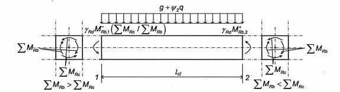

<strong>Hình 5.1 — Giá trị của lực cắt trong dầm được xác định từ thiết kế theo khả năng</strong>

### 5.4.2.3  Cột

(1) Trong những cột kháng chấn chính, các giá trị thiết kế của lực cắt phải được xác định theo các quy tắc thiết kế theo khả năng, trên cơ sở cân bằng của cột khi dưới tác dụng của mô men đầu mút $M_{i,d}$ (với i = 1; 2 là chỉ số biểu thị các tiết diện đầu mút của cột), tương ứng với sự hình thành khớp dẻo theo các chiều dương và âm của tác động động đất. Cần làm sao cho các khớp dẻo hình thành tại các đầu mút của các dầm liên kết vào đầu cột, hoặc tại các đầu mút của cột (nếu chúng hình thành ở đó trước tiên) (xem Hình 5.2).

(2) Mô men tại đầu mút $M_{i,d}$ trong (1) của điều này có thể được xác định từ biểu thức sau đây:

$$M_{i,d} \approx \gamma_{Rd} \cdot M_{Rc,i} \cdot \min\left(1, \frac{\sum M_{Rb}}{\sum M_{Rc}}\right) \qquad (5.9)$$
<!-- formula_id: "F_TCVN_9386_2025_FORMULA_5_9" -->

trong đó:

&nbsp;&nbsp;&nbsp;&nbsp;\- ү$_{Rd}$ là hệ số tính đến vượt cường độ do sự biến cứng của thép và sự hạn chế nở ngang của bê tông vùng nén của tiết diện cột, được lấy bằng 1,1;

&nbsp;&nbsp;&nbsp;&nbsp;\- $M_{Rc,i}$ là giá trị thiết kế của khả năng chịu uốn của cột tại đầu mút thứ i theo chiều của mô men uốn do động đất theo phương đang xét của tác động động đất;

&nbsp;&nbsp;&nbsp;&nbsp;\- $\Sigma M_{Rc}$, $\Sigma M_{Rb}$ được xác định theo 5.4.2.2(2).

&nbsp;&nbsp;&nbsp;&nbsp;\- (3) Các giá trị của $M_{Rc,i}$ và $\Sigma M_{Rc}$ cần tương ứng với lực dọc của cột trong tình huống thiết kế động đất theo phương đang xét của tác động động đất.

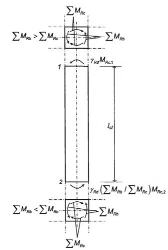

<strong>Hình 5.2 — Giá trị lực cắt trong cột được xác định từ thiết kế theo khả năng</strong>

### 5.4.2.4  Yêu cầu đặc biệt đối với tường có tính dẻo

(1) Tính thiếu tin cậy trong việc phân tích và những ảnh hưởng động sau đàn hồi phải được kể đến, ít nhất là bằng phương pháp đơn giản hóa phù hợp. Nếu không có phương pháp chính xác hơn, thì có thể sử dụng những quy tắc trong các mục sau đây cho đường bao mô men uốn thiết kế, cũng như các hệ số khuyếch đại của lực cắt.

(2) Có thể cho phép phân bố lại tới 30 % những hệ quả của tác động động đất giữa các tường kháng chấn chính, miễn là tổng khả năng chịu lực yêu cầu không bị giảm xuống. Lực cắt cần được phân bố lại theo mô men uốn, sao nêu trong các tường riêng rẽ, tỷ số giữa mô men uốn và lực cắt không bị ảnh hưởng một cách đáng kể. Trong những tường phải chịu sự thay đổi bất thường lớn của lực dọc, chẳng hạn như trong các tường kép, mô men và lực cắt cần được phân bố lại từ tường chịu nén ít hoặc chịu kẻo thuần tuý sang những tường chịu nén dọc trục nhiều.

(3) Trong loại tường kép, sự phân bố lại của những hệ quả của tác động động đất giữa các dầm nối của các tầng khác nhau cho phép lên tới 20 %, miễn là lực dọc do động đất tại chân của từng tường riêng rẽ (tổng hợp các lực cắt trong các dầm nổi) không bị ảnh hưởng.

(4) Tính thiếu tin cậy của sự phân bố mô men theo chiều cao của các tường mảnh kháng chấn chính (với tỷ số chiều cao trên chiều dài lớn hơn 2,0) phải được kể đến.

(5) Yêu cầu nêu trong (4) của điều này có thể được đáp ứng bằng cách áp dụng quy trình đã đơn giản hóa sau đây, không phụ thuộc phương pháp phân tích được sử dụng.

Biểu đồ mô men uốn thiết kế dọc theo chiều cao của tường cần được thiết lập bởi một đường bao của biểu đồ mô men uốn nhận được từ phân tích có kể đến độ dịch lên theo phương đứng. Đường bao này có thể được giả thiết tuyến tính, nếu kết cấu không thể hiện sự gián đoạn đáng kể về khối lượng, độ cứng, hoặc khả năng chịu lực trên toàn chiều cao của nó (xem Hình 5.3). Độ dịch theo phương đứng cần phù hợp với độ nghiêng thanh chống được lấy trong trong khi kiểm tra trạng thái cực hạn đối với lực cắt, với một mẫu thanh kiểu nan quạt có thể có của các thanh chống gần với đáy, và sàn làm việc như là giằng.

(6) Đối với những tường kháng chấn chính, phải xét sự tăng lên có thể có của lực cắt sau khi chảy dẻo tại chân tường.

(7) Yêu cầu nêu trong (6) của điều này có thể được thỏa mãn nếu các lực cắt thiết kế được lấy với mức 50 % cao hơn lực cắt theo kết quả phân tích kết cấu.

(8) Trong hệ hỗn hợp có các tường mảnh, đường bao thiết kế của lực cắt theo Hình 5.4 cần được sử dụng, để tính đến sự thất thường của những ảnh hưởng ở dạng dao động bậc cao hơn.

<!-- DIAGRAM: word/media/image43.png -->

**CHÚ DẪN:**

a  Biểu đồ mô men theo phân tích;

b  Đường bao thiết kế;

$a_{1}$  Độ dịch theo phương đứng.

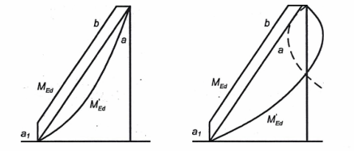

<strong>Hình 5.3 — Đường bao thiết kế cho mô men uốn trong tường mảnh</strong>

<!-- DIAGRAM: word/media/image44.png -->

**CHÚ DẪN:**

a Biểu đồ lực cắt từ phân tích;A) $V_{wall, base;}$

b Biểu đồ lực cắt với hệ số khuếch đại;B) $V_{wall, top}$ ≥ $V_{wall, base}$ /2.

c Đường bao thiết kế;

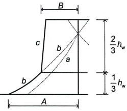

<strong>Hình 5.4 — Đường bao thiết kế của lực cắt trong các tường của hệ kết cấu hỗn hợp</strong>

### 5.4.2.5  Yêu cầu đặc biệt đối với tường kích thước lớn có ít cốt thép

(1) Để bảo đảm sự chảy dẻo do uốn xảy ra trước khi đạt tới trạng thái cực hạn khi cắt, thì lực cắt V'$_{Ed}$ lấy từ kết quả phân tích kết cấu phải được tăng lên.

(2) Yêu cầu trong (1) của mục này được xem là sẽ thỏa mãn nếu tường tại mỗi tầng, lực cắt thiết kế $V_{Ed}$ tính theo biểu thức (5.10), trong đó lực cắt V'$_{Ed}$ lấy theo kết quả phân tích kết cấu:

$$V_{Ed} = \frac{V'_{Ed} (q + 1)}{2} \qquad (5.10)$$
<!-- formula_id: "F_TCVN_9386_2025_RID48" -->

(3) Các lực động dọc trục bổ sung sinh ra trong các tường lớn do sự trồi lên của nền đất, hoặc do sự mở rộng và khép lại của các vết nứt ngang, phải được kể đến trong tính toán kiểm tra theo trạng thái cực hạn của tường chịu uốn có lực dọc.

(4) Trừ khi có các kết quả tính toán chính xác hơn, thành phần động của lực dọc của tường trong (3) của điều này có thể lấy bằng 50 % của lực dọc trong tường đó do các tải trọng trọng trường xuất hiện trong tình huống thiết kế động đất. Lực này cần được lấy theo dấu dương (+) hay âm (-), chọn dấu bất lợi nhất.

(5) Nếu giá trị của hệ số ứng xử q không vượt quá 2,0, thì ảnh hưởng của lực động dọc trục trong (3) và (4) của mục này có thể được bỏ qua.

### 5.4.3  Kiểm tra và cấu tạo theo trạng thái giới hạn cực hạn

### 5.4.3.1  Dầm

### 5.4.3.1.1  Khả năng chịu uốn và chịu cắt

(1) Khả năng chịu uốn và cắt cần được tính toán phù hợp với EN 1992-1-1:2004.

(2) Cốt thép trên của các tiết diện đầu mút của dầm kháng chấn chính có tiết diện hình chữ T hoặc chữ L cần được bố trí chủ yếu trong phạm vi chiều rộng phần bụng. Chỉ một phần trong số cốt thép này có thể đặt bên ngoài phạm vi chiều rộng phần bụng dầm, nhưng trong phạm vi chiều rộng hữu hiệu của bản cánh $b_{eff}$.

(3) Chiều rộng hữu hiệu của bản cánh $b_{eff}$ có thể được giả thiết như sau:

a) \- Với dầm kháng chấn chính liên kết với các cột biên, chiều rộng hữu hiệu của bản cánh $b_{eff}$ được lấy: bằng chiều rộng $b_{c}$ của tiết diện cột khi không có dầm cắt ngang nó (Hình 5.5b), hoặc bằng chiều rộng này tăng lên một lượng 2$h_{f}$ ở mỗi bên dầm khi có một dầm khác có cùng chiều cao cắt ngang nó (Hình 5.5a).

b) \- Với dầm kháng chấn chính liên kết với các cột trong, thì các chiều rộng nêu trên có thể được tăng lên một lượng 2hf ở mỗi bên dầm (Hình 5.5c và d).

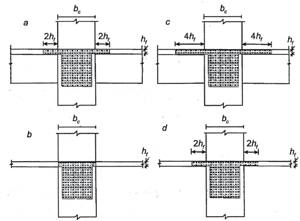

<strong>Hình 5.5 — Chiều rộng hữu hiệu của bản cánh dầm liên kết với cột tạo thành khung</strong>

### 5.4.3.1.2  Cấu tạo để đảm bảo độ dẻo cục bộ

(1) Các vùng của dầm kháng chấn chính có chiều dài lên tới $L_{cr}$ = $h_{w}$ (trong đó $h_{w}$ là chiều cao của dầm) tính từ tiết diện ngang đầu mút dầm liên kết vào nút dầm - cột, cũng như từ cả hai phía của bất kỳ tiết diện ngang nào có khả năng chảy dẻo trong tình huống thiết kế động đất, phải được coi là vùng tới hạn.

(2) Trong các dầm kháng chấn chính đỡ các cấu kiện thẳng đứng không liên tục (bị cắt/ngắt), các vùng trong phạm vi một khoảng bằng 2$h_{w}$ ở mỗi phía của cấu kiện thẳng đứng được chống đỡ cần được xem như là vùng tới hạn.

(3) Để thỏa mãn yêu cầu dẻo cục bộ trong các vùng tới hạn của dầm kháng chấn chính, giá trị của hệ số dẻo khi uốn $\mu_{\phi}$ ít nhất phải tương đương với giá trị đã nêu trong 5.2.3.4(3).

(4) Yêu cầu nêu trong (3) của mục này được xem là sẽ thỏa mãn, nếu những điều kiện sau đây được thỏa mãn tại cả hai cánh của dầm.

a) \- Tại vùng nén, cần bố trí thêm không dưới một nửa lượng cốt thép đã bố trí tại vùng kéo, ngoài những số lượng cốt thép chịu nén cần thiết khi kiểm tra trạng thái cực hạn của dầm trong tình huống thiết kế động đất.

b) \- Hàm lượng cốt thép $\rho$ của vùng kéo không được vượt quá giá trị $p_{\max}:$

$$\rho_{\max} = \rho' + \frac{0,0018}{\mu_\varphi \varepsilon_{sy,d}} \cdot \frac{f_{cd}}{f_{yd}} \tag{5.11}$$
<!-- formula_id: "F_TCVN_9386_2025_RID53" -->

với các hàm lượng cốt thép của vùng kéo và vùng nén, $\rho$ và $\rho'_1$ cả hai được lấy theo bd, trong đó b là chiều rộng của cánh chịu nén của dầm. Nếu như vùng kéo bao gồm cả bản sàn, thì lượng cốt thép sàn song song với dầm trong phạm vi chiều rộng hữu hiệu của bản cánh đã được xác định trong 5.4.3.1.1 (3) được kể đến trong $\rho$.

(5) Dọc theo toàn bộ chiều dài của dầm kháng chấn chính, hàm lượng cốt thép của vùng kéo, $\rho$, không được nhỏ hơn giá trị tối thiểu $p_{\text{min}}$ sau đây:

$$\rho_{\min} = 0{,}5 \cdot \left(\frac{f_{ctm}}{f_{yk}}\right) \tag{5.12}$$
<!-- formula_id: "F_TCVN_9386_2025_RID57" -->

(6) Trong phạm vi các vùng tới hạn của dầm kháng chấn chính, phải được bố trí cốt đai thỏa mãn những điều kiện sau đây:

a) \- Đường kính $d_{bw}$ của các thanh cốt đai (tính bằng mi li mét) không được nhỏ hơn 6;

b) \- Khoảng cách s của các vòng cốt đai (tính bằng mi li mét) không được vượt quá:

$$s = \min \left\{ \frac{h_w}{4}; \, 24d_{bw}; \, 225; \, 8d_{bL} \right\} \tag{5.13}$$
<!-- formula_id: "F_TCVN_9386_2025_RID58" -->

trong đó:

&nbsp;&nbsp;&nbsp;&nbsp;\- $d_{bL}$ là đường kính thanh thép dọc nhỏ nhất (tính bằng milimét);

&nbsp;&nbsp;&nbsp;&nbsp;\- $h_{w}$ là chiều cao tiết diện của dầm (tính bằng milimét).

c) \- Cốt đai đầu tiên phải được đặt cách tiết diện mút dầm không quá 50 mm (xem Hình 5.6).

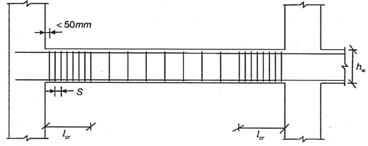

<strong>Hình 5.6 — Cốt đai trong vùng tới hạn của dầm</strong>

### 5.4.3.2  Cột

### 5.4.3.2.1  Khả năng chịu lực

(1) Khả năng chịu uốn và chịu cắt phải được tính toán theo EN 1992-1-1:2004, sử dụng giá trị lực dọc từ kết quả phân tích trong tình huống thiết kế động đất.

(2) Sự uốn theo hai phương có thể được kể đến một cách đơn giản hóa bằng cách tiến hành kiểm tra riêng rẽ theo từng phương, với khả năng chịu mô men uốn một trục được giảm đi 30 %.

(3) Trong các cột kháng chấn chính, giá trị của lực dọc thiết kế tương đối $v_d$ không được vượt quá 0,65.

### 5.4.3.2.2  Cấu tạo cột kháng chấn chính để đảm bảo độ dẻo cục bộ

(1) Tổng hàm lượng cốt thép dọc $\rho_1$ không được nhỏ hơn 0,01 và không được vượt quá 0,04. Trong các tiết diện ngang đối xứng cần bố trí cốt thép đối xứng $(\rho = \rho')$.

(2) Phải bố trí ít nhất một thanh trung gian giữa các thanh thép ở góc dọc theo mỗi mặt cột để bảo đảm tính toàn vẹn của nút dầm-cột.

(3) Các vùng trong khoảng cách $L_{cr}$ kể từ cả hai tiết diện đầu mút của cột kháng chấn chính phải được xem như là các vùng tới hạn.

(4) Khi thiếu những thông tin chính xác hơn, chiều dài của vùng tới hạn Lcr (tính bằng mét) có thể được tính toán từ biểu thức sau đây:

$$L_{cr} = \max \{h_c; L_{cl} / 6; 0,45\} \tag{5.14}$$
<!-- formula_id: "F_TCVN_9386_2025_RID63" -->

trong đó:

&nbsp;&nbsp;&nbsp;&nbsp;\- $h_{c}$  là kích thước lớn nhất tiết diện ngang của cột (tính bằng mét); và

&nbsp;&nbsp;&nbsp;&nbsp;\- $L_{cl}$  là chiều dài thông thủy của cột (tính bằng mét).

&nbsp;&nbsp;&nbsp;&nbsp;\- (5) Nếu $`.

Draft: `$ toàn bộ chiều cao của cột kháng chấn chính phải được xem như là một vùng tới hạn và phải được đặt cốt thép theo yêu cầu.

&nbsp;&nbsp;&nbsp;&nbsp;\- (6) Trong vùng tới hạn tại chân cột kháng chấn chính, giá trị của hệ số dẻo khi uốn, $\mu_{\varphi}$, cần phải lấy ít nhất là bằng giá trị đã nêu trong 5.2.3.4(3).

&nbsp;&nbsp;&nbsp;&nbsp;\- (7) Nếu với giá trị của $\mu_{\varphi}$ nêu trong (6), biến dạng bê tông lớn hơn $\varepsilon_{cu2}$ = 0,0035 là cần thiết trên toàn bộ tiết diện ngang, tổn thất về khả năng chịu lực do sự bong tróc bê tông phải được cải thiện bằng cách bó chặt lõi bê tông một cách đúng mức, trên cơ sở của những đặc trưng của bê tông có cốt đai hạn chế biến dạng theo EN 1992-1-1:2004, 3.1.9.

&nbsp;&nbsp;&nbsp;&nbsp;\- (8) Những yêu cầu đã nêu trong (6) và (7) của điều này được xem là thỏa mãn nếu:

$$...$$
<!-- formula_id: "F_TCVN_9386_2025_RID67" -->

trong đó:

&nbsp;&nbsp;&nbsp;&nbsp;\- $\omega_{vd}$ là tỷ số thể tích cơ học áp dụng trong phạm vi các vùng tới hạn có cốt đai hạn chế biến dạng được tính theo biểu thức sau:

$$\left( \omega_{wd} = \frac{\text{thể tích cốt đai hạn chế biến dạng}}{\text{thể tích lõi bê tông}} \cdot \frac{f_{yd}}{f_{cd}} \right)$$
<!-- formula_id: "F_TCVN_9386_2025_RID69" -->

&nbsp;&nbsp;&nbsp;&nbsp;\- $\mu_{\phi}$ là giá trị yêu cầu của hệ số dẻo khi uốn;

&nbsp;&nbsp;&nbsp;&nbsp;\- $\nu$ là lực dọc thiết kế tương đối $\nu_d = \frac{N_{Ed}}{A_c f_{cd}}$

&nbsp;&nbsp;&nbsp;&nbsp;\- $\varepsilon_{sy,d}$ là giá trị thiết kế của biến dạng cốt thép chịu kéo tại điểm chảy;

&nbsp;&nbsp;&nbsp;&nbsp;\- $h_{c}$ là chiều cao tiết diện ngang toàn phần (song song với phương ngang mà trong đó giá trị $\mu_{\varphi}$ đã sử dụng trong (6) của mục này được áp dụng);

&nbsp;&nbsp;&nbsp;&nbsp;\- $h_{0}$ là chiều cao của phần lõi có cốt đai hạn chế biến dạng (tính tới đường tâm của các vòng cốt đai);

&nbsp;&nbsp;&nbsp;&nbsp;\- $b_{c}$ là chiều rộng tiết diện ngang toàn phần;

&nbsp;&nbsp;&nbsp;&nbsp;\- $b_{0}$ là chiều rộng của lõi có cốt đai hạn chế biến dạng (tính tới đường tâm của các vòng cốt đai);

&nbsp;&nbsp;&nbsp;&nbsp;\- $\alpha$ là hệ số hiệu ứng hạn chế biến dạng, $\alpha = \alpha_n \alpha_s,$

a) \- với tiết diện ngang hình chữ nhật:

$$\begin{aligned} \alpha_n &= 1 - \frac{\sum_n b_i^2}{6b_0h_0} \qquad (5.16\text{a}) \\ \alpha_s &= \left( 1 - \frac{s}{2b_0} \right) \left( 1 - \frac{s}{2h_0} \right) \qquad (5.17\text{a}) \end{aligned}$$
<!-- formula_id: "F_TCVN_9386_2025_RID77" -->

trong đó:

&nbsp;&nbsp;&nbsp;&nbsp;\- n là tổng số thanh thép dọc được cố định theo phương ngang bằng thép đai kín hoặc đai móc;

&nbsp;&nbsp;&nbsp;&nbsp;\- $b_{i}$ là khoảng cách giữa các thanh thép liền kề (xem Hình 5.7; đồng thời cho cả $b_{0}$, $h_{0}$, s).

b) \- Với các tiết diện ngang hình tròn có cốt đai và đường kính của lõi có cốt đai hạn chế biến dạng $D_{0}$ (tính tới đường tâm của cốt đai):

$$\begin{aligned} \alpha_n &= 1 \qquad (5.16\text{b}) \\ \alpha_s &= \left( 1 - \frac{s}{2D_0} \right)^2 \qquad (5.17\text{b}) \end{aligned}$$
<!-- formula_id: "F_TCVN_9386_2025_RID78" -->

c) \- Với tiết diện ngang hình tròn dùng cốt đai vòng xoắn ốc:

$$\alpha_n = 1 \qquad (5.16c)$$
<!-- formula_id: "F_TCVN_9386_2025_RID79" -->

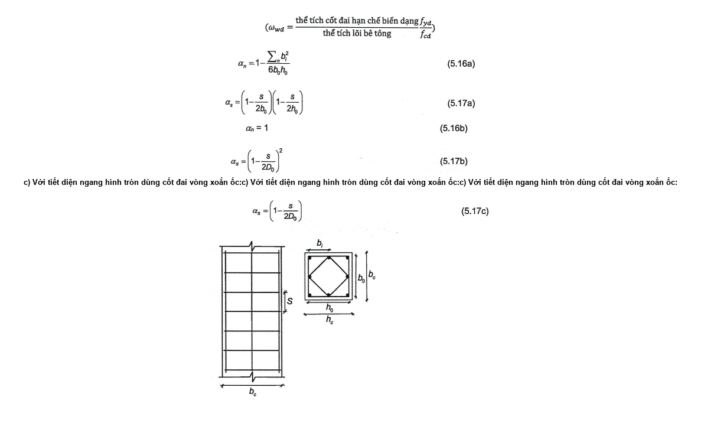

<strong>Hình 5.7 — Sự bó lõi bê tông</strong>

(9) Trong phạm vi vùng tới hạn tại chân cột kháng chấn chính giá trị tối thiểu của $\omega_{\text{wd}}$ cần lấy bằng 0,08.

(10P) Trong phạm vi các vùng tới hạn của những cột kháng chấn chính, cốt đai kín và đai móc có đường kính ít nhất là 6 mm, phải được bố trí với một khoảng cách sao cho bảo đảm độ dẻo tối thiểu và ngăn ngừa sự mất ổn định cục bộ của các thanh thép dọc. Hình dạng đai phải sao cho tăng được khả năng chịu lực của tiết diện ngang do ảnh hưởng của ứng suất 3 chiều do các vòng đai này tạo ra.

(11) Những điều kiện tối thiểu của (10) của mục này được xem như thỏa mãn nếu đáp ứng những điều kiện sau đây.

a) \- Khoảng cách s giữa các vòng đai (tính bằng mi li mét) không được vượt quá:

$$s = min \{ b_0/2; 175; 8d_{bL} \} \qquad (5.18)$$
<!-- formula_id: "F_TCVN_9386_2025_RID82" -->

trong đó:

&nbsp;&nbsp;&nbsp;&nbsp;\- $b_{0}$  là kích thước tối thiểu của lõi bê tông (tính tới đường trục của cốt thép đai) (tính bằng mi li mét);

&nbsp;&nbsp;&nbsp;&nbsp;\- $d_{bL}$  là đường kính tối thiểu của các thanh cốt thép dọc (tính bằng mi li mét).

b) \- Khoảng cách giữa các thanh cốt thép dọc cạnh nhau được cố định bằng cốt đai kín và đai móc không được vượt quá 200 mm, phù hợp với EN 1992-1-1:2004, 9.5.3(6).

(12) Cốt thép ngang trong phạm vi vùng tới hạn tại chân cột kháng chấn chính có thể được xác định theo EN 1992-1-1:2004, miễn là giá trị thiết kế của lực dọc tương đối nhỏ hơn 0,2 trong tình huống thiết kế động đất và giá trị của hệ số ứng xử q được sử dụng trong thiết kế không vượt quá 2,0.

### 5.4.3.3  Nút dầm - cột

(1) Cốt đai hạn chế biến dạng nằm ngang trong nút dầm - cột của dầm kháng chấn chính không nên nhỏ hơn cốt thép đã nêu trong 5.4.3.2.2(8) đến 5.4.3.2.2(11) đối với vùng tới hạn của cột, ngoài những yêu cầu trong những trường hợp được liệt kê trong các điều sau đây:

(2) Nếu các dầm quy tụ từ 4 phía vào nút và chiều rộng của chúng ít nhất là bằng ba phần tư kích thước của cạnh cột song song với nó, thì khoảng cách giữa các cốt hạn chế biến dạng nằm ngang trong nút đó có thể được tăng lên 2 lần so với yêu cầu trong (1) của điều này, nhưng có thể không được vượt quá 150 mm.

(3) Ít nhất một thanh cốt thép trung gian (giữa các thanh ở góc cột) thẳng đứng phải được bố trí ở mỗi phía của nút dầm kháng chấn chính với cột.

### 5.4.3.4  Tường mềm (dẻo)

### 5.4.3.4.1  Khả năng chịu uốn và chịu cắt

(1) Khả năng chịu uốn và cắt phải được tính toán phù hợp với EN 1992-1-1:2004, trừ khi được yêu cầu khác các điểm sau đây khi sử dụng giá trị của lực dọc thu được từ phân tích trong tình huống thiết kế động đất.

(2) Trong các tường kháng chấn chính, giá trị thiết kế của lực dọc tương đối $v_d$ không được vượt quá 0,4.

(3) Cốt thép đứng trong phần bụng tường phải được kể đến trong tính toán khả năng chịu uốn của tiết diện tường.

(4) Các tiết diện tường liên hợp được cấu tạo từ các phần hình chữ nhật nối hoặc giao nhau (L-, T-, U- I- hoặc tiết diện tương tự) cần được lấy như tiết diện tổ hợp bao gồm một hoặc nhiều phần bụng song song hoặc gần song song với phương tác dụng của lực cắt do động đất và gồm một phần cánh hoặc các phần cánh vuông góc hoặc gần vuông góc với nó. Để tính toán khả năng chịu uốn, chiều rộng hữu hiệu của phần cánh ở mỗi phía của phần bụng cần được lấy thêm từ mặt của phần bụng một đoạn tối thiểu bằng:

a) \- Chiều rộng thực tế của bản cánh;

b) \- Một nửa khoảng cách đến bản bụng liền kề của tường;

c) \- 25 % của tổng chiều cao tường phía trên cao trình đang xét.

### 5.4.3.4.2  Cấu tạo để đảm bảo độ dẻo cục bộ

(1) Chiều cao của vùng tới hạn $h_{cr}$ phía trên chân tường có thể được ước tính như dưới đây:

$$`.
    *   Write the equation: `h_{cr} = \max [L_w ; h_w / 6]`.
    *   Add the label: `\qquad (5.19a)`.
    *   End with `$$
<!-- formula_id: "F_TCVN_9386_2025_RID84" -->

trong đó

$$h_{cr} \le \begin{cases} ... \end{cases} \qquad (5.19b)$$
<!-- formula_id: "F_TCVN_9386_2025_RID85" -->

&nbsp;&nbsp;&nbsp;&nbsp;\- $h_{s}$ là chiều cao thông thủy của tầng với chân tường được xác định tại cao trình mặt móng hoặc đỉnh của các tầng hầm có vách cứng và tường bao.

&nbsp;&nbsp;&nbsp;&nbsp;\- (2) Tại các vùng tới hạn của tường cần đảm bảo giá trị $\mu_{\phi}$ của hệ số dẻo khi uốn, ít nhất cũng bằng hệ số dẻo được tính toán từ các biểu thức (5.4), (5.5) trong 5.2.3.4(3) với giá trị cơ bản của hệ số ứng xử $q_{0}$ trong các biểu thức này được thay thế bằng tích số của $q_{0}$ với giá trị lớn nhất của tỷ số $M_{Ed}$/$M_{Rd}$ tại chân tường trong tình huống thiết kế động đất, trong đó $M_{Ed}$ là mô men uốn thiết kế lấy từ kết quả phân tích kết cấu và $M_{Rd}$ là khả năng chịu uốn thiết kế.

&nbsp;&nbsp;&nbsp;&nbsp;\- (3) Trừ khi sử dụng phương pháp chính xác hơn, giá trị của $\mu_{\phi}$ nêu trong (2) của điều này có thể đạt được bằng cách bố trí cốt thép để hạn chế biến dạng phần bê tông trong phạm vi mặt bên của tiết diện ngang, được gọi là phần đầu tường, mà phạm vi của nó cần được xác định phù hợp với (6) của điều này. Lượng cốt thép để hạn chế biến dạng cần được xác định phù hợp với (4) và (5) của điều này.

&nbsp;&nbsp;&nbsp;&nbsp;\- (4) Với tường có tiết diện ngang hình chữ nhật, với giá trị của $\mu\phi$ như nêu trong (2) của mục này, tỷ số $\omega_{\text{kd}}$ yêu cầu (xem ký hiệu như biểu thức (5.15)) của cốt thép để hạn chế biến dạng phần bê tông phần đầu tường cần thỏa mãn biểu thức sau đây,

$$`.
    *   Write the main expression: `\alpha \omega_{wd} \ge 30 \mu_{\phi} (\nu_d + \omega_v) \varepsilon_{sy,d} \cdot \left( \frac{b_c}{b_0} \right) - 0.035`.
    *   Add the tag: `\qquad (5.20)`.
    *   End with `$$
<!-- formula_id: "F_TCVN_9386_2025_RID90" -->

&nbsp;&nbsp;&nbsp;&nbsp;\- trong đó các tham số được xác định trong 5.4.3.2.2(8), trừ $`.

So, the final LaTeX string is `$ là tỷ số cơ học của cốt thép thẳng đứng trong phần bụng tường .

&nbsp;&nbsp;&nbsp;&nbsp;\- (5) Với tường có phần lồi hoặc phần cánh, hoặc có tiết diện bao gồm một số phần hình chữ nhật (tiết diện hình chữ T-, L-, I-, U, v.v...), tỷ số thể tích cơ học của cốt thép để bó phần bê tông trong các phần đầu tường có thể được xác định như dưới đây:

a) \- Lực dọc $N_{Ed}$ và tổng diện tích cốt thép đứng của phần bụng $A_{sv}$ phải được chuẩn hóa theo $h_{c}b_{c}f_{cd}$, với chiều rộng của phần lồi hoặc phần cánh trong vùng nén lấy như chiều rộng tiết diện ngang $b_c \left( \nu_d = \frac{N_{Ed}}{h_c b_c f_{cd}}, \omega_v = \frac{A_{sv}}{h_c b_c} \frac{f_{yd}}{f_{cd}} \right)$. Chiều cao trục trung hòa $x_{u}$ tại độ cong cực hạn sau khi bong tách lớp bê tông bên ngoài lõi bị hạn chế biến dạng của phần đầu tường có thể được ước tính bằng:

$$x_u = (\nu_d + \omega_v)\frac{L_w b_c}{b_0} \qquad (5.21)$$
<!-- formula_id: "F_TCVN_9386_2025_RID94" -->

trong đó $b_{0}$ là chiều rộng của lõi bị hạn chế biến dạng trong phần lồi hoặc phần cánh. Nếu giá trị của $x_{u}$ tính theo biểu thức (5.21) không vượt quá chiều cao của phần lồi hoặc phần cánh sau khi bong tách lớp bê tông bảo vệ, thì tỷ số $\omega_{wd}$  (xem ký hiệu như biểu thức (5.15)) của cốt thép hạn chế biến dạng trong phần ngang hoặc phần cánh được xác định như trong điểm a) của mục này (tức là từ biểu thức (5.20), 5.4.3.4.2(4)), với $v_{d}$, $\omega_{13}$, $b_{c}$ và $b_{0}$ liên quan tới chiều rộng của phần ngang hoặc phần cánh.

b) \- Nếu giá trị của $x_{u}$ vượt quá chiều cao của phần lồi hoặc phần cánh không tính đến lớp bê tông bảo vệ, thì có thể sử dụng phương pháp tổng quát dựa vào:

&nbsp;&nbsp;&nbsp;&nbsp;\- Định nghĩa của hệ số độ dẻo uốn $\mu_{\phi} = \frac{\phi_u}{\phi_y}$,

&nbsp;&nbsp;&nbsp;&nbsp;\- Lấy $\phi_u = \varepsilon_{cu2,c} / x_u \ ; \ \phi_y = \varepsilon_{sy} / (d - x_y)$

&nbsp;&nbsp;&nbsp;&nbsp;\- Xác định chiều cao trục trung hòa $x_{u}$ và $x_{y}$ theo điều kiện cân bằng của tiết diện,

&nbsp;&nbsp;&nbsp;&nbsp;\- Cường độ và biến dạng cực hạn của bê tông bị hạn chế biến dạng, $f_{ck,c}$ và $\varepsilon_{cu2,c}$ được nêu trong EN 1992-1-1:2004, 3.1.9 dưới dạng một hàm của ứng suất hạn chế biến dạng ngang hữu hiệu. Cốt thép yêu cầu để bó phần bê tông, nếu cần thiết, và độ dài tường bị hạn chế biến dạng cần được tính toán theo cách tương ứng.

(6) Cốt thép để bó phần bê tông trong (3)-(5) của điều này cần mở rộng theo phương đứng quá chiều cao $h_{cr}$ của vùng tới hạn được xác định theo 5.4.3.4 2(1) và kéo dài theo phương ngang một đoạn $L_{c}$ tính từ thớ chịu nén ở xa nhất của tường tới điểm mà ở đó bê tông không có cốt đai hạn chế biến dạng có thể bị bong tách do biến dạng nén lớn. Nếu không có số liệu chính xác hơn, biến dạng nén tại chỗ mà sự bong tách được dự tính xảy ra có thể lấy bằng $\varepsilon_{cu2}$ = 0,0035. Phần đầu tường bị hạn chế biến dạng có thể được giới hạn trong khoảng kể từ trục cốt đai gần với thớ chịu nén ngoài cùng là: $x_u \left( 1 - \frac{\varepsilon_{cu2}}{\varepsilon_{cu2,c}} \right)$ trong đó chiều cao của vùng nén có cốt đai hạn chế biến dạng $x_{u}$ tại độ cong cực hạn được tính toán từ sự cân bằng (theo biểu thức (5.21) với chiều rộng $b_{0}$ không đổi của vùng nén bị hạn chế biến dạng) và biến dạng cực hạn $\varepsilon_{cu2,c}$ của bê tông có cốt đai hạn chế biến dạng được ước tính theo EN 1992-1-1:2004, 3.1.9 dưới dạng $\varepsilon_{cu2,c}$ = 0,0035 + 0,1$\alpha \omega_{\text{wd}}$ (Hình 5.8). Chiều dài $L_{c}$ của phần đầu tường bị hạn chế biến dạng không được lấy ở mức nhỏ hơn 0,15 $L_{w}$ hoặc 1,50 $b_{w}$.

<!-- DIAGRAM: word/media/image101.png -->

a) \- Biến dạng ở trạng thái cực hạn khi uốn b) Tiết diện ngang của tường

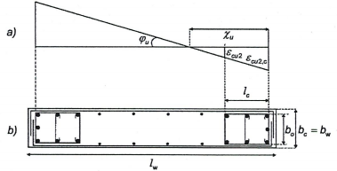

<strong>Hình 5.8 — Phần đầu tường có cốt đai hạn chế biến dạng</strong>

(7) Không yêu cầu bố trí phần đầu tường có cốt đai hạn chế biến dạng vượt qua hai bên phần cánh tường có chiều dày $\frac{s_w}{h_0}$ và chiều rộng $\frac{s_w}{h_0}$ , trong đó $h_{s}$ là chiều cao thông thủy của tầng (Hình 5.9). Tuy nhiên, có thể cần bó phần đầu tường tại các đầu mút của phần cánh tường khi tường bị uốn ngoài mặt phẳng.

(8) Hàm lượng cốt thép dọc trong các phần biên tường không được nhỏ hơn 0,5%.

(9) Những điều khoản của 5.4.3.2.2(9) và 5.4.3.4.2(11) áp dụng được trong phạm vi các phần đầu của tường. Cần sử dụng thép đai kín chồng lên nhau một phần, sao cho mỗi một thanh thép dọc đều được cố định bằng một vòng đai kín hoặc đai móc.

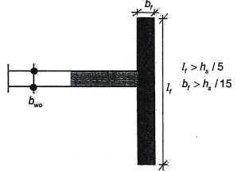

<strong>Hình 5.9 — Phần đầu tường không cần bó khi đầu tường có cánh nằm ngang rộng</strong>

(10) Chiều dày $b_{w}$ của những phần bị hạn chế biến dạng của tiết diện tường (phần đầu tường) không được nhỏ hơn 200 mm. Hơn thế nữa, nếu chiều dài của phần bị hạn chế biến dạng không vượt quá giá trị lớn nhất của các giá trị 2$b_{w}$ và 0,2$L_{w}$, thì $b_{w}$ không được nhỏ hơn $h_{s}$/15 , với $h_{s}$ là chiều cao tầng.

Nếu chiều dài của phần bị hạn chế biến dạng vượt quá giá trị lớn nhất của các giá trị 2$b_{w}$ và 0,2$L_{w}$, thì bw không được nhỏ hơn $h_{s}$/10 . (xem Hình 5.10).

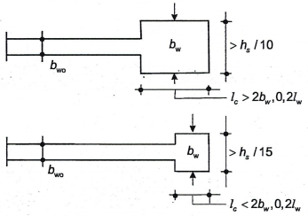

<strong>Hình 5.10 — Chiều dày tối thiểu của phần đầu tường được hạn chế biến dạng</strong>

(11) Trong phạm vi chiều cao của tường phía trên vùng tới hạn, chỉ áp dụng những quy tắc có liên quan của EN 1992-1-1:2004 về cốt thép đặt đứng, đặt nằm ngang và cốt thép ngang. Tuy nhiên ở những phần của tường nơi mà trong tình huống thiết kế động đất, biến dạng nén $\frac{s_{w,\max}}{h_0}$ vượt quá 0,002, thì cần bố trí một hàm lượng cốt thép thẳng đứng tối thiểu bằng 0,5%.

(12) Cốt thép ngang của các phần đầu tường nêu trong (4) đến (10) của mục này có thể được xác định phù hợp với chỉ riêng EN 1992-1-1:2004, nếu một trong số những điều kiện sau đây được thực hiện:

a) \- Giá trị của lực dọc thiết kế tương đối $v_{d}$ không lớn hơn 0,15;

b) \- Giá trị của $v_{d}$ không lớn hơn 0,20 và hệ số q được sử dụng trong phân tích được giảm bớt 15 %.

### 5.4.3.5  Tường kích thước lớn ít cốt thép

### 5.4.3.5.1  Khả năng chịu uốn

(1) Trạng thái cực hạn khi uốn có lực dọc phải được kiểm tra với giả thiết có nứt ngang, theo các điều khoản có liên quan của EN 1992-1-1:2004, có kể đến giả thiết tiết diện phẳng.

(2) Ứng suất pháp trong bê tông phải được hạn chế để ngăn ngừa sự mất ổn định ngoài mặt phẳng của tường.

(3) Yêu cầu của (2) trong mục này có thể được thỏa mãn trên cơ sở của những quy tắc của EN 1992-1-1:2004 đối với những hiệu ứng bậc hai, được bổ sung bởi các quy tắc khác đối với ứng suất pháp trong bê tông nếu cần thiết.

(4) Khi lực động dọc trục theo 5.4.2.5(3) và 5.4.2.5(4) được đưa vào tính toán khi kiểm tra trạng thái cực hạn theo khả năng chịu uốn cùng với lực dọc trục, biến dạng giới hạn $\frac{s_{w,\max}}{h_0}$ đối với bê tông không có cốt hạn chế biến dạng có thể được tăng lên thành 0,005. Có thể lấy giá trị cao hơn để tính toán cho bê tông có cốt đai hạn chế biến dạng phù hợp với EN 1992-1-1:2004, 3.19, miễn là sự bong tách lớp bê tông bảo vệ không có cốt đai hạn chế biến dạng được kể đến trong quá trình kiểm tra như trên.

### 5.4.3.5.2  Khả năng chịu cắt

(1) Do mức độ an toàn được dư ra bởi lực cắt thiết kế được lấy tăng lên theo 5.4.2.5(1) và 5.4.2.5(2) và do sự phản ứng (kể cả khả năng xảy ra nứt nghiêng) được kiểm soát bằng biến dạng, cho nên tại những chỗ mà giá trị của $V_{Ed}$ từ 5.4.2.5(2) nhỏ hơn giá trị thiết kế của khả năng chịu cắt $V_{Rd,c}$ theo EN 1992-1-1:2004, 6.2.2, thì không yêu cầu hàm lượng cốt thép chịu cắt tối thiểu $\rho_{w,\text{min}}$ trong phần bụng.

**CHÚ THÍCH:** Giá trị của $\rho_{w,\min}$ kiến nghị lấy bằng giá trị tối thiểu đối với tường theo EN 1992-1-1:2004.

(2) Khi không thỏa mãn điều kiện $V_{Ed}$ ≤ $V_{Rd,c}$, cốt thép chịu cắt phần bụng cần được tính toán theo EN 1992-1-1:2004, trên cơ sở của mô hình giàn có góc nghiêng thay đổi, hoặc một mô hình thanh chống - giằng, tùy theo mô hình nào phù hợp nhất với kích thước hình học cụ thể của tường.

(3) Nếu sử dụng mô hình thanh chống - giằng thì chiều rộng của thanh chống cần tính đến cả sự có mặt của lỗ mở và không được vượt quá giá trị nhỏ hơn trong hai giá trị 0,25$L_{w}$ và 4$b_{w0}$.

(4) Trạng thái cực hạn trượt do cắt tại các mạch ngừng thi công nằm ngang cần được kiểm tra theo EN 1992-1-1:2004, 6.2.5, với chiều dài neo của các thanh xuyên ngang qua bề mặt giữa hai phần nối được tăng lên 50 % so với chiều dài neo yêu cầu bởi EN 1992-1-1:2004.

### 5.4.3.5.3  Cấu tạo để đảm bảo độ dẻo cục bộ

(1) Các thanh thép thẳng đứng cần phải được kiểm tra theo trạng thái giới hạn cực hạn chịu uốn có lực dọc trục, hoặc kiểm tra việc thỏa mãn mọi điều khoản về cốt thép tối thiểu, cần được cố định bởi cốt đai kín và đai móc có đường kính không nhỏ hơn 6mm hoặc một phần ba đường kính thanh thép thẳng đứng $d_{bL}$. Cốt đai kín và đai móc cần đặt cách nhau theo chiều đứng một khoảng không vượt quá giá trị nhỏ hơn trong hai giá trị 100 mm và 8$d_{bL}$.

(2) Thanh thép thẳng đứng phải được kiểm tra theo trạng thái giới hạn cực hạn khi uốn cùng với lực dọc trục, và được giữ hai bên bởi thép đai kín và đai móc theo điểm (1) của điều này, cần được tập trung trong phần biên tường tại các đầu mút của tiết diện ngang. Các phần biên tường này cần kéo rộng ra theo chiều $L_{w}$ của tường một khoảng không nhỏ hơn giá trị nhỏ hơn trong hai giá trị là $b_{w}$ và $3b_{w}\sigma_{cm}/f_{cd}$ , trong đó $\sigma_{cm}$ là giá trị trung bình của ứng suất bê tông vùng nén ở trạng thái cực hạn khi uốn cùng với lực dọc trục. Đường kính của các thanh thẳng đứng này không được nhỏ hơn 12 mm trong tầng thấp hơn của nhà, hoặc ở tầng bất kỳ có chiều dài $L_{w}$ của bức tường được giảm xuống thấp hơn chiều dài của tầng phía dưới một lượng lớn hơn một phần ba của chiều cao tầng $h_{s}$. Trong tất cả các tầng khác, đường kính thanh thép đứng không được nhỏ hơn 10 mm.

(3) Để tránh sự thay đổi từ kiểu làm việc chịu uốn sang kiểu làm việc chịu cắt, hàm lượng cốt thép thẳng đứng được bố trí trong tiết diện tường không nên vượt quá một cách không cần thiết hàm lượng cốt thép yêu cầu khi kiểm tra theo trạng thái cực hạn khi uốn có lực dọc trục và hàm lượng cốt thép yêu cầu để đảm bảo sự nguyên vẹn của bê tông.

(4) Thanh giằng thép nằm ngang hoặc thẳng đứng, cần được bố trí liên tục: (a) dọc theo tất cả các chỗ giao nhau của các bức tường hoặc tại vị trí liên kết với phần cánh; (b) tại tất cả các cao trình sàn; và (c) xung quanh lỗ mở trên tường. Các thanh giằng thép này tối thiểu cũng cần thỏa mãn EN 1992-1-1:2004, 9.10.

### 5.5  Thiết kế cho trường hợp cấp độ dẻo cao

### 5.5.1  Vật liệu và kích thước hình học

### 5.5.1.1  Yêu cầu về vật liệu

(1) Không được sử dụng bê tông có cấp cường độ thấp hơn C20/25 trong các cấu kiện kháng chấn chính.

(2) Các yêu cầu nêu trong 5.4.1.1(2) được áp dụng cho điều này.

(3) Trong vùng tới hạn của các cấu kiện kháng chấn chính, phải sử dụng loại thép C trong Bảng C.1 của EN 1992-1-1:2004. Ngoài ra, giá trị của cường độ chảy thực tế $f_{yk,0,95}$ không được vượt quá 25 % giá trị danh nghĩa.

### 5.5.1.2  Kích thước hình học

### 5.5.1.2.1  Dầm

(1) Chiều rộng của dầm kháng chấn chính không được nhỏ hơn 200 mm.

(2) Tỷ số giữa chiều rộng và chiều cao bụng dầm kháng chấn chính phải thỏa mãn biểu thức (5.40b) của EN 1992-1-1:2004.

(3) Áp dụng 5.4.1.2.1(1).

(4) Áp dụng 5.4.1.2.1(2).

(5) Áp dụng 5.4.1.2.1(3).

### 5.5.1.2.2  Cột

(1) Kích thước tối thiểu của tiết diện ngang cột kháng chấn chính không được nhỏ hơn 250 mm.

(2) Áp dụng 5.4.1.2.2(1).

### 5.5.1.2.3  Tường có tính dẻo

(1) Những điều này áp dụng cho tường kháng chấn chính là tường đơn, cũng như cho các bộ phận của hệ tường kháng chấn chính là tường kép chịu những hệ quả tác động trong mặt phẳng, được ngàm và neo chắc chắn tại chân của chúng với tầng hầm và móng đủ để tường không bị lắc. Để đạt được điều đó, không cho phép dùng sàn hoặc dầm để đỡ tường (xem thêm 5.4.1.2.5).

(2) Áp dụng 5.4.12.3(1).

(3) Các yêu cầu bổ sung đối với chiều dày của các phần biên tường bị hạn chế biến dạng của tường kháng chấn chính được nêu trong 5.5.3.4.5(8) và (9).

(4) Các tường kháng chấn chính là tường kép, cần tránh bố trí những lỗ mở không đều đặn, trừ khi ảnh hưởng của chúng không đáng kể, hoặc đã được kể đến trong tính toán, lựa chọn kích thước và cấu tạo.

### 5.5.1.2.4  Yêu cầu cụ thể đối với dầm đỡ cấu kiện thẳng đứng không liên tục

(1) Áp dụng 5.4.1.2.5(1).

(2) Áp dụng 5.4.1.2.5(2).

### 5.5.2  Hệ quả tác động thiết kế

### 5.5.2.1  Dầm

(1) Áp dụng 5.4.2.1(1 ) cho các giá trị thiết kế của mô men uốn và lực dọc trục.

(2) Áp dụng 5.4.2.2(1).

(3) Áp dụng 5.4.2.2(2) với giá trị $\gamma_{Rd}$= 1,2 trong biểu thức (5.8).

### 5.5.2.2  Cột

(1) Điều 5.4.2.1(1) (nội dung liên quan đến những yêu cầu thiết kế theo khả năng trong 5.2.3.3(2)) áp dụng cho các giá trị thiết kế của mô men uốn và lực dọc trục.

(2) Áp dụng 5.4 2.3(1).

(3) 5.4.2.3(2) áp dụng với giá trị của $\gamma_{Rd}$= 1,3 trong biểu thức (5.9).

(4) Áp dụng 5.4.2.3(3).

### 5.5.2.3  Nút dầm - cột

(1) Lực cắt theo phương ngang tác dụng vào lõi của nút giữa dầm kháng chấn chính và cột phải được xác định có kể đến điều kiện bất lợi nhất dưới tác động động đất, tức là điều kiện thiết kế theo khả năng đối với dầm quy tụ vào nút khung và các giá trị tương thích thấp nhất của lực cắt trong cấu kiện khác của khung.

(2) Các biểu thức đơn giản đối với lực cắt theo phương ngang tác dụng vào lõi bê tông của các nút có thể được xác định như sau:

a) \- với nút dầm - cột giữa:

$$V_{jhd} = \gamma_{Rd} \cdot (A_{s1} + A_{s2}) \cdot f_{yd} - V_c \tag{5.22}$$
<!-- formula_id: "F_TCVN_9386_2025_RID116" -->

b) \- với nút dầm - cột biên:

$$V_{jhd} = \gamma_{Rd} \cdot A_{s1} \cdot f_{yd} - V_C \qquad (5.23)$$
<!-- formula_id: "F_TCVN_9386_2025_RID117" -->

trong đó:

&nbsp;&nbsp;&nbsp;&nbsp;\- $A_{s1}$ là diện tích tiết diện cốt thép phía trên của dầm;

&nbsp;&nbsp;&nbsp;&nbsp;\- $A_{s2}$ là diện tích tiết diện cốt thép phía dưới của dầm;

&nbsp;&nbsp;&nbsp;&nbsp;\- $V_{C}$ là lực cắt trong cột tại vị trí nằm trên nút được xác định từ tính toán phân tích trong tình huống thiết kế động đất;

&nbsp;&nbsp;&nbsp;&nbsp;\- $`.

So, the LaTeX code is `$ là hệ số kể đến sự tăng cường độ do biến cứng của cốt thép, nó không được lấy nhỏ hơn 1,2.

&nbsp;&nbsp;&nbsp;&nbsp;\- (3) Lực cắt tác dụng vào nút phải tương ứng với hướng bất lợi nhất của tác động động đất có ảnh hưởng tới các giá trị $A_{s1}$, $A_{s2}$ và $V_{C}$ được sử dụng trong các biểu thức (5.22) và (5.23).

### 5.5.2.4  Tường có tính dẻo

### 5.5.2.4.1  Yêu cầu đặc biệt đối với tường mảnh trong mặt phẳng

(1) Áp dụng 5.4.2.4(1).

(2) Áp dụng 5.4 2.4(2).

(3) Áp dụng 5.4.2.4(3).

(4) Áp dụng 5.4.2.4(4).

(5) Áp dụng 5.4.2.4(5).

(6) Áp dụng 5.4.2.4(6).

(7) Yêu cầu (6) được xem là thỏa mãn nếu áp dụng quy trình đơn giản hóa sau, bao gồm quy tắc thiết kế theo khả năng:

Lực cắt thiết kế $V_{Ed}$ cần được xác định từ biểu thức:

$$V_{Ed} = \varepsilon V'_{Ed} \qquad (5.24)$$
<!-- formula_id: "F_TCVN_9386_2025_RID119" -->

trong đó:

&nbsp;&nbsp;&nbsp;&nbsp;\- V'$_{Ed}$ là lực cắt xác định được từ tính toán kết cấu;

&nbsp;&nbsp;&nbsp;&nbsp;\- $...$ là hệ số khuếch đại, được tính từ biểu thức (5.25), nhưng không nhỏ hơn 1,5:

$$\varepsilon = q \sqrt{\dots}$$
<!-- formula_id: "F_TCVN_9386_2025_RID121" -->

trong đó:

&nbsp;&nbsp;&nbsp;&nbsp;\- q  là hệ số ứng xử được sử dụng trong thiết kế;

&nbsp;&nbsp;&nbsp;&nbsp;\- $M_{Ed}$  là mô men uốn thiết kế tại chân tường;

&nbsp;&nbsp;&nbsp;&nbsp;\- $M_{Rd}$  là khả năng chịu uốn thiết kế tại chân tường;

&nbsp;&nbsp;&nbsp;&nbsp;\- $\gamma_{Rd}$  là hệ số kể đến sự tăng cường độ của thép do biến cứng; khi không có những dữ liệu chính xác hơn, $\gamma_{Rd}$ có thể lấy bằng 1,2;

&nbsp;&nbsp;&nbsp;&nbsp;\- $T_{1}$  là chu kỳ dao động cơ bản của nhà theo phương lực cắt $V_{Ed}$;

&nbsp;&nbsp;&nbsp;&nbsp;\- $T_{C}$  là giới hạn trên của chu kỳ, ứng với đoạn nằm ngang của đường phổ phản ứng gia tốc (xem 3.2.2);

&nbsp;&nbsp;&nbsp;&nbsp;\- $S_{e}$(T)  là tung độ của phổ phản ứng đàn hồi (xem 3.2.2).

&nbsp;&nbsp;&nbsp;&nbsp;\- (8)  Những yêu cầu nêu trong 5.4.2.4(8) được áp dụng cho tường mảnh có cấp độ dẻo cao.

### 5.5.2.4.2  Yêu cầu đặc biệt đối với tường dày và thấp

(1) Đối với tường kháng chấn chính có tỷ số giữa chiều cao và chiều dài $\frac{q_{sw,1} Z_1}{R_s A_{s,1}}$ không lớn hơn 2,0, không cần điều chỉnh mô men uốn thu được từ phân tích kết cấu. Sự khuếch đại lực cắt do ảnh hưởng động cũng có thể bỏ qua.

(2) Lực cắt V'$_{Ed}$ thu được từ tính toán cần được tăng lên như sau:

$$V_{Ed} = \gamma_{Rd} \cdot \left( \frac{M_{Rd}}{M_{Ed}} \right) \cdot V'_{Ed} \leq q \cdot V'_{Ed} \qquad (5.26)$$
<!-- formula_id: "F_TCVN_9386_2025_RID124" -->

(định nghĩa và giá trị của các biến số xem 5.5.2.4.1(7)).

### 5.5.3  Kiểm tra theo trạng thái cực hạn và cấu tạo

### 5.5.3.1  Dầm

### 5.5.3.1.1  Khả năng chịu uốn

(1) Khả năng chịu uốn phải được tính toán phù hợp với EN 1992-1-1:2004.

(2) Áp dụng 5.4.3.1.1(2);

(3) Áp dụng 5.4.3.1.1(3).

### 5.5.3.1.2  Khả năng chịu cắt

(1) Việc tính toán và kiểm tra khả năng chịu cắt phải được thực hiện phù hợp với EN 1992-1-1:2004, ngoại trừ các yêu cầu khác nêu dưới đây.

(2) Trong những vùng tới hạn của dầm kháng chấn chính, góc nghiêng của thanh xiên $\frac{q_{sw,1} Z_1}{R_s A_{s,1}}$ trong mô hình giàn phải là 45°.

(3) Về việc bố trí cốt thép chịu cắt trong phạm vi vùng tới hạn tại một đầu mút của dầm kháng chấn chính nơi dầm được liên kết vào khung, cần phân biệt các trường hợp sau đây tùy theo giá trị đại số của tỷ số $\frac{q_{sw,1} Z_1}{R_s A_{s,1}}$ giữa các giá trị nhỏ nhất và lớn nhất của lực cắt tác dụng theo 5.5.2.1(3).

a) \- Nếu $\frac{q_{sw,1} Z_1}{R_s A_{s,1}}$ ≥ - 0,5, khả năng chịu cắt nhờ có cốt thép cần được tính toán phù hợp với EN 1992-1-1:2004.

b) \- Nếu $\frac{q_{sw,1} Z_1}{R_s A_{s,1}}$ < - 0,5, tức là khi các lực cắt dự kiến gần như hoàn toàn ngược chiều, thì:

i) \- nếu

$$`.
*   Left side: `|V_E|_{\max}`.
*   Inequality: `\le`.
*   Right side: `(2 + \zeta) f_{ctd} b_w d`.
*   Equation number: `\qquad (5.27)`.
*   Combine: `|V_E|_{\max} \le (2 + \zeta) f_{ctd} b_w d \qquad (5.27)`.
*   Wrap in `$$
<!-- formula_id: "F_TCVN_9386_2025_RID128" -->

trong đó:

&nbsp;&nbsp;&nbsp;&nbsp;\- $f_{ctd}$ là cường độ chịu kéo thiết kế của bê tông theo EN 1992-1-1:2004, thì áp dụng quy tắc tương tự như trong mục a).

&nbsp;&nbsp;&nbsp;&nbsp;\- ii) nếu $|V_E|_{\max}$ vượt quá giá trị giới hạn trong biểu thức (5.27), thì cần bố trí cốt thép xiên theo hai phương nghiêng một góc ± 45° so với trục dầm hoặc dọc theo hai đường chéo của dầm đó theo chiều cao, và một nửa của $|V_E|_{\max}$ cần được đảm bảo bởi các cốt thép đai và một nửa bởi cốt thép xiên.

&nbsp;&nbsp;&nbsp;&nbsp;\- Trong trường hợp đó, việc kiểm tra được thực hiện theo điều kiện:

$$` and end with `$$
<!-- formula_id: "F_TCVN_9386_2025_RID130" -->

trong đó:

&nbsp;&nbsp;&nbsp;&nbsp;\- $A_{s}$ là diện tích cốt thép xiên theo một phương, cắt ngang qua mặt phẳng trượt có thể có (tức là tiết diện tại mút dầm);

&nbsp;&nbsp;&nbsp;&nbsp;\- $\frac{q_{sw,1} Z_1}{R_s A_{s,1}}$ là góc giữa cốt thép xiên và trục dầm (thông thường thì $\frac{q_{sw,1} Z_1}{R_s A_{s,1}}$ = 45°, hoặc $\operatorname{tg} \alpha \approx \frac{d - d'}{L_b}$

### 5.5.3.1.3  Cấu tạo đảm bảo độ dẻo cục bộ

(1) Trong dầm kháng chấn chính, các vùng tới hạn có chiều dài $L_{cr}$ = 1,5 $h_{w}$ (trong đó $h_{w}$ là chiều cao dầm) tính từ tiết diện ngang tại đầu mút dầm quy tụ vào nút dầm-cột, cũng như tính từ cả hai phía của tiết diện ngang bất kỳ mà ở đó có thể có chảy dẻo trong tình huống thiết kế động đất, phải được xem là các vùng tới hạn.

(2) Áp dụng 5.4.3.1.2(2).

(3) Áp dụng 5.4.3.1.2(3).

(4) Áp dụng 5.4.3.1.2(4).

(5) Để thỏa mãn các điều kiện dẻo cần thiết, các điều kiện sau đây phải được thỏa mãn dọc suốt toàn bộ chiều dài của dầm kháng chấn chính:

a) \- 5.4.3.1.2(5) phải được thỏa mãn;

b) \- ít nhất phải bố trí hai thanh có bám dính tốt với $d_{b}$ = 14 mm ở cả phần mặt trên và đáy dầm liên tục dọc suốt toàn bộ chiều dài dầm.

c) \- 1/4 diện tích tiết diện cốt thép lớn nhất phía trên tại các gối phải chạy dọc suốt chiều dài dầm.

(6) Áp dụng 5.4.3.1.2(6) với biểu thức (5.13) được thay thế bởi:

$$s = \min \left\{ \frac{h_w}{4}; 24d_{bw}; 175; 6d_{bL} \right\} \qquad (5.29)$$
<!-- formula_id: "F_TCVN_9386_2025_RID133" -->

### 5.5.3.2  Cột

### 5.5.3.2.1  Khả năng chịu lực

(1) Áp dụng 5.4.3.2.1(1).

(2) Áp dụng 5.4.3.2.1(2).

(3) Trong các cột kháng chấn chính, giá trị thiết kế của lực dọc tương đối $v_{d}$ không được vượt quá 0,55.

### 5.5.3.2.2  Cấu tạo để đảm bảo độ dẻo cục bộ

(1) Áp dụng 5.4.3.2.2(1).

(2) Áp dụng 5.4.3.2.2(2).

(3) Áp dụng 5.4.3.2.2(3).

(4) Khi không có những thông tin chính xác hơn, chiều dài vùng tới hạn $L_{cr}$ có thể được tính như sau (tính bằng mét):

$$L_{cr} = \max \{1,5h_c; L_{cl}/6; 0,6\} \qquad (5.30)$$
<!-- formula_id: "F_TCVN_9386_2025_RID134" -->

trong đó:

&nbsp;&nbsp;&nbsp;&nbsp;\- $h_{c}$ là kích thước cạnh lớn nhất của tiết diện ngang của cột (tính bằng m);

&nbsp;&nbsp;&nbsp;&nbsp;\- $L_{cl}$ là chiều dài thông thủy của cột (tính bằng mét).

&nbsp;&nbsp;&nbsp;&nbsp;\- (5) Áp dụng 5.4.3.2.2(5).

&nbsp;&nbsp;&nbsp;&nbsp;\- (6) Áp dụng 5.4.3.2.2(6).

&nbsp;&nbsp;&nbsp;&nbsp;\- (7) Cấu tạo của các vùng tới hạn phía trên chân cột cần dựa trên giá trị nhỏ nhất của hệ số dẻo uốn $\mu_{\phi}$ (xem 5.2.3.4) suy ra từ 5.2.3.4(3). Khi mà cột được đảm bảo tránh sự hình thành khớp dẻo bằng cách đáp ứng quy trình thiết kế theo khả năng theo 4.4.2.3(4) (tức là khi biểu thức (4.29) được thỏa mãn), thì giá trị $q_{0}$ trong các biểu thức (5.4) và (5.5) có thể được thay thế bởi 2/3 giá trị $q_{0}$ theo một phương song song với chiều cao tiết diện ngang $h_{c}$ của cột.

&nbsp;&nbsp;&nbsp;&nbsp;\- (8) Áp dụng 5.4.3.2.2(7).

&nbsp;&nbsp;&nbsp;&nbsp;\- (9) Những yêu cầu của (6), (7) và (8) trong điều này được xem như thỏa mãn nếu 5.4.3.2.2(8) được thỏa mãn với các giá trị của $\mu_{\phi}$ đã nêu trong (6) và (7) của điều này.

&nbsp;&nbsp;&nbsp;&nbsp;\- (10) Giá trị nhỏ nhất của $\omega_{wd}$ được lấy là 0,12 trong phạm vi vùng tới hạn tại chân cột, hoặc 0,08 trong tất cả các vùng tới hạn phía trên chân cột.

&nbsp;&nbsp;&nbsp;&nbsp;\- (11) Áp dụng 5.4.3.2.2(10).

&nbsp;&nbsp;&nbsp;&nbsp;\- (12) Các điều kiện tối thiểu của (11) trong điều này được xem là thỏa mãn nếu tất cả các yêu cầu dưới đây được thỏa mãn:

a) \- Đường kính $d_{bw}$ của các cốt thép đai kín ít nhất phải bằng:

$$d_{bw} \geq 0,4 \cdot d_{bL,\text{max}} \sqrt{f_{ydL} / f_{ydw}} \qquad (5.31)$$
<!-- formula_id: "F_TCVN_9386_2025_RID137" -->

b) \- Khoảng cách cốt thép đai kín (tính bằng mm) không vượt quá:

$$s = \min \{b_0/3; 125; 6d_{bL}\} \qquad (5.32)$$
<!-- formula_id: "F_TCVN_9386_2025_RID138" -->

trong đó:

&nbsp;&nbsp;&nbsp;&nbsp;\- $b_{0}$ là kích thước nhỏ nhất của lõi bê tông (tính tới bề mặt trong của cốt thép đai), tính bằng mi li mét;

&nbsp;&nbsp;&nbsp;&nbsp;\- $d_{bL}$ là đường kính nhỏ nhất của các thanh cốt thép dọc, tính bằng mi li mét.

c) \- Khoảng cách giữa các thanh cốt thép dọc cạnh nhau được giữ chặt bởi cốt đai kín và đai móc không được vượt quá 150 mm.

(13) Ở hai tầng dưới cùng của nhà, cốt đai kín lấy theo (11) và (12) trong điều này phải được bố trí vượt qua các vùng tới hạn thêm một khoảng bằng một nửa chiều dài của các vùng tới hạn này.

(14) Hàm lượng cốt thép dọc được bố trí tại chân cột tầng dưới cùng (tức là tại vị trí cột được liên kết với móng) không được nhỏ hơn hàm lượng cốt thép được bố trí tại đỉnh cột cùng tầng.

### 5.5.3.3  Nút dầm - cột

(1) Ứng suất nén xiên sinh ra trong nút bởi cơ cấu thanh chéo không được vượt quá cường độ chịu nén của bê tông khi có các biến dạng do kéo ngang.

(2 Khi không có mô hình tính toán chính xác hơn, yêu cầu (1) trong điều này có thể được thỏa mãn bằng cách tuân theo những quy tắc sau:

a) \- Tại nút dầm - cột giữa, biểu thức sau đây phải được thỏa mãn:

$$V_{jhd} \leq \eta \cdot f_{cd} \cdot \sqrt{1 - \frac{\nu_d}{\eta}} \cdot b_j \cdot h_{jc} \qquad (5.33)$$
<!-- formula_id: "F_TCVN_9386_2025_RID139" -->

trong đó:

&nbsp;&nbsp;&nbsp;&nbsp;\- = 0,6(1 - fck/250)

&nbsp;&nbsp;&nbsp;&nbsp;\- $h_{jc}$  là khoảng cách giữa các lớp thép ngoài cùng của cột;

&nbsp;&nbsp;&nbsp;&nbsp;\- $b_{j}$  là xác định theo biểu thức (84);

&nbsp;&nbsp;&nbsp;&nbsp;\- $v_{d}$  là lực dọc thiết kế tương đối của cột ở phía trên nút;

&nbsp;&nbsp;&nbsp;&nbsp;\- $f_{ck}$  là giá trị đặc trưng của cường độ chịu nén của bê tông, tính bằng MPa

b) \- Tại nút dầm-cột biên:

$V_{jhd}$  phải nhỏ hơn 80 % giá trị ở vế phải của biểu thức (5.33) trong đó:

$V_{jhd}$  được tính từ các biểu thức (5.22) và (5.23) tương ứng.

và chiều rộng hữu hiệu $b_{j}$ của nút bằng:

a) \- $\text{nếu } b_c > b_w: b_j = \min\{b_c; (b_w + 0,5h_c)\} \qquad (5.34\text{a})$ b) $\text{nếu } b_c < b_w: b_j = \min\{b_w; (b_c + 0,5h_c)\} \qquad (5.34\text{b})$

(3) Các nút phải bị hạn chế biến dạng một cách tương xứng (theo cả phương ngang và phương đứng) để hạn chế ứng suất kéo xiên lớn nhất của bê tông $\sigma_{ct}$ xuống bằng $f_{ctd}$. Khi không có mô hình tính toán chính xác hơn, yêu cầu này có thể được thỏa mãn bằng cách bố trí cốt thép đai kín nằm ngang có đường kính không nhỏ hơn 6 mm trong phạm vi nút sao cho:

$$\frac{A_{sh}f_{ywd}}{b_j h_{jw}} \ge \frac{\left(\frac{V_{jhd}}{b_j h_{jc}}\right)^2}{f_{ctd} + \nu_d f_{cd}} - f_{ctd} \tag{5.35}$$
<!-- formula_id: "F_TCVN_9386_2025_RID143" -->

trong đó:

&nbsp;&nbsp;&nbsp;&nbsp;\- $A_{sh}$  là tổng diện tích tiết diện cốt đai kín nằm ngang; $V_{jhd}$ là được tính theo các biểu thức (5.22) và (5.23); $h_{jw}$ là khoảng cách từ mặt dầm tới cốt thép đáy dầm;

&nbsp;&nbsp;&nbsp;&nbsp;\- $h_{jc}$  là khoảng cách giữa các lớp cốt thép ngoài cùng của cột;

&nbsp;&nbsp;&nbsp;&nbsp;\- $b_{j}$  là xem định nghĩa trong biểu thức (5.34);

&nbsp;&nbsp;&nbsp;&nbsp;\- $v_{d}$  là lực dọc thiết kế tương đối của cột $(\nu_d = \frac{N_{Ed}}{A_c f_{cd}});$

&nbsp;&nbsp;&nbsp;&nbsp;\- $f_{ctd}$  là giá trị thiết kế của cường độ chịu kéo của bê tông theo EN 1992-1-1:2004.

&nbsp;&nbsp;&nbsp;&nbsp;\- (4) Một quy tắc khác thay cho quy tắc đã nêu trong (3) của mục này là sự toàn vẹn của nút sau khi hình thành vết nứt xiên có thể được bảo đảm bằng cốt đai kín nằm ngang. Với mục đích đó, tổng diện tích tiết diện cốt đai kín nằm ngang sau đây phải được bố trí trong nút:

a) \- trong các nút dầm-cột giữa:

$$A_{sh} f_{ywd} \ge \gamma_{Rd} \cdot (A_{s1} + A_{s2}) \cdot f_{yd} \cdot (1 - 0,8 \ \nu_d) \qquad (5.36a)$$
<!-- formula_id: "F_TCVN_9386_2025_RID145" -->

b) \- trong các nút dầm-cột biên:

$$A_{sh} f_{ywd} \ge \gamma_{Rd} \cdot A_{s2} \cdot f_{yd} \cdot (1 - 0,8 \nu_d) \qquad (5.36\text{b})$$
<!-- formula_id: "F_TCVN_9386_2025_RID146" -->

trong đó $\gamma R_c$ lấy bằng 1,2 (xem 5.5.2.3(2)) và $v_{d}$ là giá trị thiết kế của lực dọc tương đối trong cột phía trên nút trong biểu thức (5.36a), hoặc của cột phía dưới nút trong biểu thức (5.36b).

(5) Các cốt thép đai kín nằm ngang được tính toán như trong (3) và (4) của điều này phải được bố trí đều trong phạm vi chiều cao $h_{jw}$ giữa các thanh cốt thép phía mặt trên và đáy dầm. Trong các nút biên, chúng phải bao kín các đầu mút của các thanh cốt thép dầm được uốn vào nút.

(6) Cốt thép dọc của cột kéo qua nút cần được bố trí sao cho:

$$A_{\text{sv},j} \ge \frac{2}{3} A_{sh} \left( \frac{h_{jc}}{h_{jw}} \right) \tag{5.37}$$
<!-- formula_id: "F_TCVN_9386_2025_RID148" -->

trong đó $A_{sh}$ là tổng diện tích tiết diện yêu cầu của cốt đai kín nằm ngang phù hợp với (3) và (4) của điều này và $A_{sv,i}$ là tổng diện tích tiết diện của các thanh cốt thép trung gian được đặt ở phía các bề mặt cột tương ứng, giữa các thanh cốt thép ở góc cột (kể cả các thanh cốt thép bổ sung cho cốt thép dọc của cột).

(7) Áp dụng 5.4.3.3(1);

(8) Áp dụng 5.4.3.3(2);

(9) Áp dụng 5.4.3.3(3);

### 5.5.3.4  Tường có tính dẻo

### 5.5.3.4.1  Khả năng chịu uốn

(1) Khả năng chịu uốn phải được tính toán và kiểm tra (như đối với cột) chịu lực dọc bất lợi nhất

trong tình huống thiết kế động đất.

(2) Trong tường kháng chấn chính, giá trị thiết kế của lực dọc tương đối $v_{d}$ không được vượt quá 0,35.

### 5.5.3.4.2  Sự phá hoại nén xiên của bụng tường do cắt

(1) Giá trị của $V_{Rd,max}$ có thể được tính như sau:

a) \- ở ngoài vùng tới hạn:

như trong EN 1992-1-1:2004, với chiều dài của cánh tay đòn z lấy bằng 0,8$L_{w}$ và độ nghiêng của thanh xiên chịu nén so với phương đứng, tính bằng tg$\theta$, là bằng 1,0.

b) \- trong vùng tới hạn:

40% của giá trị ở ngoài vùng tới hạn.

### 5.5.3.4.3  Sự phá hoại kéo theo đường chéo của bụng tường do cắt

(1) Việc tính toán cốt thép phần bụng tường khi kiểm tra theo trạng thái cực hạn khi chịu cắt phải kể đến giá trị của tỷ số $\alpha_s = \frac{M_{Ed}}{V_{Ed} \cdot L_w}$. Cần sử dụng giá trị lớn nhất của $\alpha_s$ trong một tầng để kiểm tra chịu cắt của tầng đó theo trạng thái cực hạn.

(2) Nếu tỷ số $\alpha_s$ ≥ 2,0, những điều trong EN 1992-1-1:2004 6.2.3(1)-(7) được áp dụng với các giá trị của z và tgθ lấy như trong 5.5.3.4.2(1) a).

(3) Nếu $\alpha_s$ < 2,0, những điều sau đây được áp dụng:

a) \- Các thanh cốt thép nằm ngang của phần bụng phải thỏa mãn biểu thức sau (xem EN 1992-1-1:2004, 6.2.3(8)):

$$V_{Ed} \le V_{Rd,c} + 0,75 \rho_h \cdot f_{yd,h} \cdot b_{w0} \cdot \alpha_s \cdot L_w \tag{5.38}$$
<!-- formula_id: "F_TCVN_9386_2025_RID153" -->

trong đó:

&nbsp;&nbsp;&nbsp;&nbsp;\- $\rho_n$  là hàm lượng cốt thép nằm ngang của phần bụng tường $\left(\rho_h = \frac{A_0}{b_{w0} \cdot s_h}\right)$;

&nbsp;&nbsp;&nbsp;&nbsp;\- $f_{yd,h}$  là giá trị thiết kế của cường độ chảy của cốt thép nằm ngang của phần bụng tường;

&nbsp;&nbsp;&nbsp;&nbsp;\- $V_{Rd,c}$  là giá trị thiết kế của khả năng chịu cắt đối với cấu kiện không đặt cốt thép chịu cắt, phù hợp với EN 1992-1-1:2004.

&nbsp;&nbsp;&nbsp;&nbsp;\- Trong vùng tới hạn của tường, $V_{Rd,c}$ cần lấy bằng 0 nếu lực dọc $N_{Ed}$ là lực kéo.

b) \- Các thanh cốt thép thẳng đứng của phần bụng tường được neo và nối dọc theo chiều cao của tường theo EN 1992-1-1:2004, phải được bố trí thỏa mãn điều kiện:

$$\rho_h f_{yd,h} b_{w0} z \le \rho_v f_{yd,v} b_{w0} z + \min N_{Ed} \tag{5.39}$$
<!-- formula_id: "F_TCVN_9386_2025_RID156" -->

trong đó:

&nbsp;&nbsp;&nbsp;&nbsp;\- $\rho_V$ là hàm lượng cốt thép thẳng đứng của phần bụng tường $\rho_v = \frac{A_v}{b_{w0} \cdot s_v}$;

&nbsp;&nbsp;&nbsp;&nbsp;\- $f_{yd,v}$ là giá trị thiết kế của cường độ chảy của cốt thép thẳng đứng của phần bụng;

&nbsp;&nbsp;&nbsp;&nbsp;\- và coi lực dọc $N_{Ed}$ là dương khi là lực nén.

&nbsp;&nbsp;&nbsp;&nbsp;\- (4) Cốt thép nằm ngang của phần bụng tường phải được neo chắc chắn tại các tiết diện đầu mút của tường, ví dụ uốn móc ở đầu với góc 90° hoặc 135°.

&nbsp;&nbsp;&nbsp;&nbsp;\- (5) Cốt thép nằm ngang của phần bụng tường dưới dạng cốt thép đai kín hoặc được neo chắc chắn cũng có thể được coi là tham gia toàn phần việc bỏ các phần biên tường.

### 5.5.3.4.4  Sự phá hoại trượt do cắt

(1) Tại các mặt phẳng có khả năng phá hoại trượt do cắt (ví dụ, tại các mối nối thi công/mạch ngừng) trong phạm vi vùng tới hạn, điều kiện sau phải được thỏa mãn:

$$V_{Ed} \le V_{Rd,s}$$
<!-- formula_id: "F_TCVN_9386_2025_RID159" -->

trong đó:

&nbsp;&nbsp;&nbsp;&nbsp;\- $V_{Rd,s}$  là giá trị thiết kế của khả năng chịu cắt trượt

&nbsp;&nbsp;&nbsp;&nbsp;\- (2) Giá trị của $V_{Rd,s}$ có thể được xác định như sau:

$$`.
    *   Write the equation: `V_{Rd,s} = V_{dd} + V_{id} + V_{fd}`.
    *   Add the tag: `\tag{5.40}`.
    *   End with `$$
<!-- formula_id: "F_TCVN_9386_2025_RID160" -->

với:

$$\begin{aligned}
V_{dd} &= \min \begin{cases} 1,3 \cdot \sum A_{sj} \cdot \sqrt{f_{cd} \cdot f_{yd}} \\ 0,25 \cdot f_{yd} \cdot \sum A_{sj} \end{cases} && (5.41) \\
V_{id} &= \sum A_{sj} \cdot f_{yd} \cdot \cos \varphi && (5.42) \\
V_{fd} &= \min \begin{cases} \mu_f \cdot \left[ \left( \sum A_{sj} \cdot f_{yd} + N_{ed} \right) \cdot \xi + \frac{M_{Ed}}{z} \right] \\ 0,5 \eta \cdot f_{cd} \cdot \xi \cdot L_w \cdot b_{wo} \end{cases} && (5.43)
\end{aligned}$$
<!-- formula_id: "F_TCVN_9386_2025_RID161" -->

trong đó:

&nbsp;&nbsp;&nbsp;&nbsp;\- $V_{dd}$  là khả năng chịu lực kiểu chốt của các thanh cốt thép thẳng đứng;

&nbsp;&nbsp;&nbsp;&nbsp;\- $V_{id}$  là khả năng chịu cắt của các thanh cốt thép xiên (với góc nghiêng $...$ so với mặt phẳng có khả năng trượt, ví dụ như mối nối thi công);

&nbsp;&nbsp;&nbsp;&nbsp;\- $V_{fd}$  là khả năng chịu ma sát;

&nbsp;&nbsp;&nbsp;&nbsp;\- $`? Yes.

Result: `$  là hệ số ma sát giữa bê tông với bê tông khi chịu tác động lặp theo chu kỳ, có thể lấy bằng 0,6 đối với bề mặt bê tông phẳng nhẵn, lấy bằng 0,7 đối với bề mặt bê tông gồ ghề, như đã được xác định trong EN 1992-1-1:2004, 6.2.5(2);

&nbsp;&nbsp;&nbsp;&nbsp;\- $Z$  là chiều dài cánh tay đòn của nội lực;

&nbsp;&nbsp;&nbsp;&nbsp;\- $` as requested.

Result: `$  là chiều cao tương đối vùng nén;

&nbsp;&nbsp;&nbsp;&nbsp;\- $\sum A_{sj}$  là tổng diện tích tiết diện của các thanh cốt thép thẳng đứng của phần bụng tường hoặc của các thanh cốt thép bổ sung được bố trí trong các phần đầu tường để chịu lực cắt chống trượt;

&nbsp;&nbsp;&nbsp;&nbsp;\- $\sum A_{si}$ là tổng diện tích tiết diện của các thanh cốt thép xiên theo cả hai phương; kiến nghị sử dụng các thanh có đường kính lớn;

$$\eta = 0,6\left(1 - \frac{f_{ck}}{250}\right) \qquad (5.44)$$
<!-- formula_id: "F_TCVN_9386_2025_RID168" -->

&nbsp;&nbsp;&nbsp;&nbsp;\- $N_{Ed}$ được coi là dương khi nén;

&nbsp;&nbsp;&nbsp;&nbsp;\- $f_{ck}$  là cường độ chịu nén đặc trưng tính bằng mega pascan (MPa).

&nbsp;&nbsp;&nbsp;&nbsp;\- (3) Đối với tường thấp và dày phải thỏa mãn điều kiện sau:

a) \- tại chân tường $V_{id}$ phải lớn hơn $V_{Ed} / 2$;

b) \- tại các mức cao hơn, Vid phải lớn hơn $V_{Ed}4$;

(4) Các thanh cốt thép xiên cần được neo chắc chắn ở cả hai phía của bề mặt trượt có thể có và phải cắt ngang qua tất cả các tiết diện của tường phía trên tiết diện tới hạn một khoảng bằng giá trị nhỏ hơn trong hai giá trị 0,5$L_{w}$ và 0,5$h_{w}$.

(5) Các thanh cốt thép xiên làm tăng khả năng chịu uốn tại chân tường. Sự tăng khả năng chịu uốn này cần được kể đến trong tính toán khi có lực cắt $V_{Ed}$ tác dụng. Các thanh cốt xiên đó được tính toán theo quy tắc thiết kế theo khả năng (xem 5.5.2.4.1(6), 5.5.2.4.1(7) và 5.5.2.4.2(2)). Hai phương pháp sau đây có thể được sử dụng.

a) \- Độ tăng khả năng chịu uốn nói trên $\Delta M_{Rd}$ sử dụng trong tính toán $V_{Ed}$ có thể được tính gần đúng bằng:

$$\Delta M_{Rd} = \frac{1}{2} \sum A_{si} f_{yd} (\sin \varphi) L_i \qquad (5.45)$$
<!-- formula_id: "F_TCVN_9386_2025_RID172" -->

trong đó:

&nbsp;&nbsp;&nbsp;&nbsp;\- $L_{i}$  là khoảng cách giữa các tâm của hai lớp thanh cốt thép xiên, được đặt nghiêng một góc bằng ±$\omega$ so với mặt phẳng có khả năng trượt, được đo tại tiết diện chân tường;

&nbsp;&nbsp;&nbsp;&nbsp;\- Các ký hiệu khác giống các ký hiệu trong biểu thức (5.42).

b) \- Khi tính toán lực cắt tác dụng $V_{Ed}$ có thể bỏ qua ảnh hưởng của các thanh cốt thép xiên. Trong biểu thức (5.42) $V_{id}$ chính là khả năng chịu cắt thực của các thanh cốt thép xiên này (tức là khả năng chịu cắt thực tế bị giảm xuống do lực cắt tác dụng tăng). Khả năng chịu cắt thực của các thanh cốt thép xiên chịu trượt có thể được tính gần đúng bằng:

$$V_{id} = \sum A_{si} f_{yd} \left[ \cos \phi - 0,5 L_i \frac{\sin \phi}{\alpha_s L_w} \right] \qquad (5.46)$$
<!-- formula_id: "F_TCVN_9386_2025_RID174" -->

### 5.5.3.4.5  Cấu tạo đảm bảo yêu cầu dẻo cục bộ

(1)  Áp dụng 5.4.3.2(1).

(2)  Áp dụng 5.4.3.2(2).

(3)  Áp dụng 5.4.3.2(3).

(4)  Áp dụng 5.4.3.2(4).

(5)  Áp dụng 5.4.3.2(5).

(6)  Áp dụng 5.4.3.2(6).

(7)  Áp dụng 5.4.3.2(8).

(8)  Áp dụng 5.4.3.2(10).

(9)  Nếu tường được nối với cánh tường có chiều dày $b_{f}$ ≥ $h_{s}$/15 và chiều rộng $L_{f}$ ≥ $h_{s}$/5 (trong đó $h_{s}$ là chiều cao thông thủy của một tầng), và phần đầu tường bị hạn chế biến dạng phải kéo sang phần bụng một khoảng tới 3$b_{wo}$ tính từ mép cánh, thì chiều dày $b_{w}$ của đoạn tường bị hạn chế biến dạng đó ở phần bụng chỉ cần phù hợp với 5.4.1.2.3(1) đối với $b_{w0}$ (Hình 5.11).

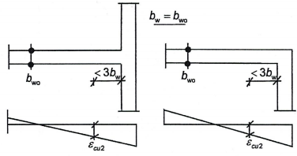

<strong>Hình 5.11 — Chiều dày tối thiểu của phần đầu tường bị hạn chế biến dạng đối với tường có cấp độ dẻo cao có cánh lớn</strong>

(10)  Trong phạm vi các phần đầu tường, những yêu cầu nêu trong 5.5.3.2.2(12) được áp dụng và giá trị tối thiểu của $\omega_{wd}$ lấy bằng 0,12. Phải sử dụng cốt đai kín chồng lên nhau để mỗi một thanh cốt thép dọc khác đều được cố định bằng cốt thép đai kín hoặc đai móc.

(11)  Phía trên vùng tới hạn cần bố trí các phần biên tường bị hạn chế biến dạng cho thêm một tầng nữa, với ít nhất là một nửa cốt thép bó yêu cầu trong vùng tới hạn.

(12)  Áp dụng 5.4.3.4.2(11).

(13)  Để tránh hiện tượng bụng tường nứt sớm do lực cắt, phải bố trí một lượng cốt thép tối thiểu ở phần bụng là: $\rho_{n,\min} = \rho_{v,\min}$ = 0,002.

(14)  Cốt thép ở phần bụng này phải được bố trí dưới dạng hai lưới với các thanh có cùng các đặc trưng bám dính, mỗi lưới được bố trí ở một mặt tường. Các lưới này được liên kết với nhau bằng các thanh đai móc đặt cách nhau khoảng 500 mm.

(15)  Cốt thép ở phần bụng phải có đường kính không nhỏ hơn 8 mm nhưng không lớn hơn 1/8 chiều rộng $b_{w0}$ của phần bụng. Cốt thép này phải được đặt cách nhau với khoảng cách không quá giá trị nhỏ hơn trong 2 giá trị 250 mm và 25 lần đường kính thanh cốt thép.

(16)  Để khử những ảnh hưởng bất lợi do nứt dọc theo mạch ngừng và yếu tố bất thường có liên quan, một lượng cốt thép đứng tối thiểu được neo chắc chắn cần phải bố trí cắt ngang qua các mạch ngừng đó. Hàm lượng tối thiểu của cốt thép này, $\rho_{\min}$, là rất cần thiết để khôi phục khả năng chịu cắt

$$\rho_{\min} \geq \begin{cases} \dfrac{1,3 f_{ctd} - \dfrac{N_{Ed}}{A_w}}{f_{yd}\left(1 + 1,5\sqrt{f_{cd} / f_{yd}}\right)} \\ 0,0025 \end{cases} \qquad (5.47)$$
<!-- formula_id: "F_TCVN_9386_2025_RID179" -->

trong đó:

&nbsp;&nbsp;&nbsp;&nbsp;\- $A_{w}$  là tổng diện tích tiết diện chiếu lên mặt ngang của tường và $N_{Ed}$ là dương khi là lực nén.

### 5.5.3.5  Cấu kiện liên kết của hệ tường kép

(1)  Việc liên kết các tường với nhau bằng bản sàn không được kể đến trong tính toán vì nó không hiệu quả.

(2)  Những điều trong 5.5.3.1 chỉ có thể áp dụng cho dầm liên kết, nếu một trong các điều kiện sau đây được thỏa mãn:

a) \- Nếu sự hình thành vết nứt trong cả hai phương chéo ít có khả năng xảy ra. Quy tắc ứng dụng chấp nhận được là:

$$V_{Ed} \leq f_{ctd} b_w d \qquad (5.48)$$
<!-- formula_id: "F_TCVN_9386_2025_RID180" -->

b) \- Nếu sự phá hoại do uốn là dạng phá hoại phổ biến. Quy tắc ứng dụng chấp nhận được là: L/h ≥ 3.

(3)  Nếu không có điều kiện nào trong số những điều kiện ở (2) của điều này được thỏa mãn, thì khả năng chịu tác động động đất phải được đảm bảo bởi cốt thép bố trí dọc theo cả hai phương chéo của dầm, theo các điều kiện sau (xem Hình 5.12):

a) \- Biểu thức sau đây cần được thỏa mãn.

<!-- DIAGRAM: word/media/image178.png -->

trong đó:

&nbsp;&nbsp;&nbsp;&nbsp;\- $V_{Ed}$  là lực cắt thiết kế trong cấu kiện liên kết $V_{Ed} = \frac{2M_{Ed}}{L}$;

&nbsp;&nbsp;&nbsp;&nbsp;\- $A_{si}$  là tổng diện tích tiết diện của các thanh cốt thép trong từng phương chéo;

&nbsp;&nbsp;&nbsp;&nbsp;\- $\alpha$  là góc giữa các thanh đặt chéo và trục của dầm.

b) \- Cốt thép đặt chéo phải được bố trí theo những cấu kiện giống cột có chiều dài cạnh ít nhất bằng 0,5$b_{w}$; chiều dài neo của cốt thép phải lớn hơn 50% chiều dài neo tính theo EN 1992-1-1:2004.

c) \- Cốt thép đai kín nên được bố trí bao quanh những cấu kiện giống cột để đảm bảo ổn định cho các thanh cốt thép dọc. Cốt thép đai kín phải thỏa mãn những yêu cầu trong 5.5.3.2.2(12).

d) \- Cốt thép dọc và cốt thép ngang phải được bố trí theo cả hai mặt bên của dầm, thỏa mãn những yêu cầu tối thiểu nêu trong EN 1992-1-1:2004 cho dầm cao. Cốt thép dọc không cần neo vào hệ tường kép và chỉ cần kéo dài sâu vào trong các tường một khoảng bằng 150 mm.

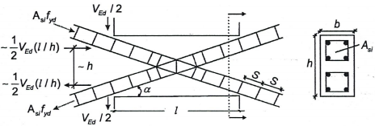

<strong>Hình 5.12 — Dầm liên kết có cốt thép đặt chéo</strong>

### 5.6  Yêu cầu về neo và mối nối

### 5.6.1  Yêu cầu chung

(1) Áp dụng EN 1992-1-1:2004, Điều 8 về cấu tạo cốt thép, với những quy tắc bổ sung sau.

(2) Đối với cốt đai kín được sử dụng làm cốt thép ngang trong dầm, cột hoặc tường, phải sử dụng cốt đai kín có móc uốn 135° và dài thêm một đoạn bằng 10$d_{bw}$. sau móc uốn.

(3) Trong kết cấu có độ dẻo lớn, chiều dài neo của cốt thép dầm hoặc cột trong phạm vi nút dầm- cột phải được tính từ một điểm trên thanh cốt thép cách mặt trong của nút một khoảng 5$d_{bL}$ để tính đến vùng chảy dẻo được mở rộng do những biến dạng lặp sau đàn hồi (ví dụ cho dầm xem Hình 5.13a).

### 5.6.2  Neo cốt thép

### 5.6.2.1  Cột

(1) Khi tính toán neo hoặc chiều dài nối chồng cốt thép cột đảm bảo cường độ chịu uốn của các cấu kiện trong các vùng tới hạn của chúng, tỷ số giữa diện tích cốt thép yêu cầu và diện tích cốt thép thực tế $A_{s,\text{req}} / A_{s,\text{prov}}$ phải được lấy bằng 1.

(2) Nếu trong tình huống thiết kế động đất mà lực dọc trong cột là lực kéo, thì chiều dài neo phải được tăng lên thêm 50 % so với chiều dài neo nêu trong EN 1992-1-1:2004.

### 5.6.2.2  Dầm

(1) Phần cốt thép dọc của dầm được uốn cong để neo vào nút luôn luôn phải ở phía trong các thanh cốt đai kín tương ứng của cột.

(2) Để ngăn ngừa phá hoại do mất bám dính, đường kính $d_{bL}$ của các thanh cốt thép dọc của dầm kéo qua nút dầm - cột phải được giới hạn phù hợp với các biểu thức sau đây:

$$\frac{d_{bL}}{h_c} \le \frac{7,5 f_{ctm}}{\gamma_{Rd} f_{yd}} \frac{1 + 0,8 \nu_d}{1 + 0,75 k_D \rho' / \rho_{\max}} \qquad (5.50\text{a})$$
<!-- formula_id: "F_TCVN_9386_2025_RID186" -->

b) \- với nút dầm - cột biên:

$$\frac{d_{bL}}{h_c} \le \frac{7,5 f_{ctm}}{\gamma_{Rd} f_{yd}} (1 + 0,8 \nu_d) \tag{5.50b}$$
<!-- formula_id: "F_TCVN_9386_2025_RID187" -->

trong đó:

&nbsp;&nbsp;&nbsp;&nbsp;\- $h_{c}$  là chiều rộng của tiết diện cột theo phương song song với các thanh cốt thép dọc của dầm;

&nbsp;&nbsp;&nbsp;&nbsp;\- $f_{ctm}$  là giá trị trung bình của cường độ chịu kéo của bê tông;

&nbsp;&nbsp;&nbsp;&nbsp;\- $f_{yd}$  là giá trị thiết kế của cường độ chảy của thép;

&nbsp;&nbsp;&nbsp;&nbsp;\- $v_{d}$  là lực dọc thiết kế tương đối của cột, được lấy với giá trị tối thiểu của nó cho tình huống thiết kế động đất $\nu_d = \frac{N_{Ed}}{f_{cd} A_c}$;

&nbsp;&nbsp;&nbsp;&nbsp;\- $k_{D}$  là hệ số kể đến cấp độ dẻo, lấy bằng 1 cho trường hợp cấp độ dẻo cao và 2/3 cho trường hợp cấp độ dẻo trung bình;

&nbsp;&nbsp;&nbsp;&nbsp;\- $\rho'$  là hàm lượng cốt thép chịu nén của các thanh cốt thép dầm kéo qua nút;

&nbsp;&nbsp;&nbsp;&nbsp;\- $\rho_{rmax}$  là hàm lượng cho phép lớn nhất của cốt thép chịu kéo (xem 5.4.3.1.2(4) và 5.4.3.1.3(4));

&nbsp;&nbsp;&nbsp;&nbsp;\- $\gamma_{Rd}$  là hệ số kể đến tính thiếu tin cậy của mô hình tính toán về giá trị thiết kế của khả năng chịu lực, lấy bằng 1,2 hoặc 1,0 tương ứng cho trường hợp cấp độ dẻo cao hoặc trường hợp cấp độ dẻo trung bình (do sự tăng cường độ của thép dọc trong dầm do biến cứng).

&nbsp;&nbsp;&nbsp;&nbsp;\- Các điều kiện giới hạn ở trên (các biểu thức (5.50) không áp dụng cho các thanh cốt thép xiên cắt ngang qua nút).

&nbsp;&nbsp;&nbsp;&nbsp;\- (3) Nếu trong các nút dầm-cột biên, yêu cầu nêu trong (2) của điều này không thể thỏa mãn được vì chiều cao $h_{c}$ của tiết diện cột ($h_{c}$ song song với các thanh cốt thép) là quá nhỏ, thì có thể thực hiện các biện pháp bổ sung sau đây để bảo đảm neo chặt cốt thép dọc của dầm:

a) \- Dầm hoặc bản có thể được kéo dài thêm theo phương ngang một đoạn như công xôn ngắn (xem Hình 5.13a).

b) \- Có thể sử dụng các thanh cốt thép có phình ở đầu neo hoặc bản neo được hàn vào đầu mút của các thanh cốt thép (xem Hình 5.13b).

c) \- Có thể kéo dài móc uốn thêm một đoạn có chiều dài tối thiểu bằng 10$d_{bL}$ và cốt thép ngang cần được bố trí dày dọc theo phần kéo dài đó (xem Hình 5.13c).

(4) Các thanh cốt thép ở phía trên hoặc đáy dầm kéo qua các nút trong phải được cắt ở một khoảng không nhỏ hơn $L_{cr}$ trong các cấu kiện quy tụ vào nút đó (chiều dài vùng tới hạn của từng cấu kiện đó, xem 5.4.3.1.2(1) và 5.5.3.1.3(1)) tính từ bề mặt của nút.

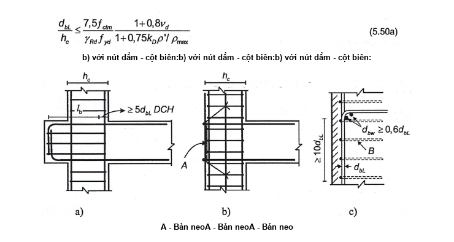

**CHÚ DẪN:**

A - Bản neo

B - Cốt thép đai bao quanh cốt thép cột

<strong>Hình 5.13 — Biện pháp neo bổ sung trong nút dầm-cột biên</strong>

### 5.6.3  Nối các thanh cốt thép

(1) Không cho phép nối chồng bằng hàn trong phạm vi các vùng tới hạn của các cấu kiện chịu lực.

(2) Trong cột và tường có thể nối các thanh cốt thép bằng các cơ cấu nối cơ khí, nếu các cơ cấu nối này được kiểm soát bằng thử nghiệm thích hợp trong điều kiện tương thích với cấp độ dẻo đã chọn.

(3) Cốt thép ngang bố trí trong phạm vi chiều dài nối chồng phải được tính toán theo EN 1992-1-1:2004. Ngoài ra, những yêu cầu sau đây cũng phải được thỏa mãn:

a) \- Nếu thanh cốt thép được neo và thanh cốt thép liên tục được bố trí trong một mặt phẳng song song với cốt thép ngang thì tổng diện tích của tất cả các thanh được nối, $\sum A_{sL}$, phải được kể đến trong tính toán cốt thép ngang.

(b) Nếu thanh cốt thép được neo và thanh cốt thép liên tục được bố trí trong một mặt phẳng vuông góc với cốt thép ngang, thì diện tích của cốt thép ngang phải được tính toán dựa trên diện tích của thanh cốt thép dọc được nối chồng có đường kính lớn hơn, $A_{sL}$.

(c) Khoảng cách s giữa các cốt thép ngang trong đoạn nối chồng (tính bằng mm) không được vượt quá:

$$s = \min \{h/4; 100\} \qquad (5.51)$$
<!-- formula_id: "F_TCVN_9386_2025_RID194" -->

trong đó:

&nbsp;&nbsp;&nbsp;&nbsp;\- h là kích thước cạnh nhỏ nhất của tiết diện ngang (tính bằng mm).

&nbsp;&nbsp;&nbsp;&nbsp;\- (4) Diện tích cốt thép ngang yêu cầu $A_{st}$ trong phạm vi đoạn nối chồng cốt thép dọc của cột được nối tại cùng vị trí (được xác định theo EN 1992-1-1:2004), hoặc của cốt thép dọc các phần đầu tường, có thể được tính toán từ biểu thức sau đây:

$$A_{st} = s \cdot \left(\frac{d_{bl}}{50}\right)\left(\frac{f_{yld}}{f_{ywd}}\right) \tag{5.52}$$
<!-- formula_id: "F_TCVN_9386_2025_RID195" -->

trong đó:

&nbsp;&nbsp;&nbsp;&nbsp;\- $A_{st}$  là diện tích một nhánh cốt thép ngang;

&nbsp;&nbsp;&nbsp;&nbsp;\- $d_{bl}$  là đường kính thanh cốt thép được nối;

&nbsp;&nbsp;&nbsp;&nbsp;\- s  là khoảng cách giữa các cốt thép ngang;

&nbsp;&nbsp;&nbsp;&nbsp;\- $f_{yld}$  là giá trị thiết kế của cường độ chảy của cốt thép dọc;

&nbsp;&nbsp;&nbsp;&nbsp;\- $f_{ywd}$  là giá trị thiết kế của cường độ chảy của cốt thép ngang.

### 5.7  Thiết kế và cấu tạo các cấu kiện kháng chấn phụ

(1) Điều 5.7 được áp dụng cho các cấu kiện đóng vai trò là cấu kiện kháng chấn phụ nghĩa là cấu kiện chịu biến dạng đáng kể trong tình huống thiết kế động đất (ví dụ sườn của bản thì không phù hợp với những yêu cầu của 5.7). Các cấu kiện đó phải được thiết kế và cấu tạo để duy trì khả năng chịu các tải trọng trọng lực trong tình huống thiết kế động đất khi chúng chịu biến dạng lớn nhất trong tình huống thiết kế động đất.

(2) Những biến dạng lớn nhất có được trong tình huống thiết kế động đất phải được tính toán phù hợp với 4.3.4 và phải tính đến hiệu ứng $P-\Delta$ phù hợp với 4.4.2.2(2) và (3). Chúng phải được tính toán từ phân tích kết cấu trong tình huống thiết kế động đất, trong đó bỏ qua sự đóng góp của các cấu kiện kháng chấn phụ tới độ cứng ngang của kết cấu và các cấu kiện kháng chấn chính được mô hình hóa với độ cứng chống uốn và độ cứng chống cắt khi nứt của chúng.

(3) Các cấu kiện kháng chấn phụ được xem là thỏa mãn những yêu cầu của (1) của mục này nếu mô men uốn và lực cắt của chúng được tính toán trên cơ sở của: a) những biến dạng như trong (2) của mục này và b) độ cứng chống cắt và chống uốn khi có vết nứt không vượt quá khả năng chịu uốn và chịu cắt thiết kế $M_{Rd}$ và $V_{Rd}$ của chúng, các giá trị này được xác định trên cơ sở của EN 1992-1-1:2004.

### 5.8  Các bộ phận của móng bê tông

### 5.8.1  Phạm vi

(1) Các yêu cầu sau áp dụng để thiết kế các cấu kiện của móng bê tông, ví dụ như đế móng, dầm giằng, dầm móng, bản móng, tường móng, đài cọc và cọc, cũng như thiết kế các mối nối giữa các cấu kiện đó, hoặc giữa chúng và các cấu kiện bê tông thẳng đứng. Việc thiết kế các cấu kiện này phải phù hợp với TCVN 9386-5:2025, 5.4.

(2) Nếu hệ quả tác động thiết kế đối với việc thiết kế các bộ phận móng của kết cấu tiêu tán năng lượng được tính dựa trên các giả thiết thiết kế theo khả năng phù hợp với 4.4.2.6(2), thì không có sự tiêu tán năng lượng nào được dự kiến trong các cấu kiện này trong tình huống thiết kế động đất. Việc thiết kế các cấu kiện này có thể phù hợp với những quy tắc của 5.3.2(1).

(3) Nếu hệ quả tác động thiết kế của các cấu kiện móng của kết cấu tiêu tán năng lượng động đất được tính từ phân tích kết cấu cho tình huống thiết kế động đất mà không theo các quan niệm thiết kế theo khả năng của 4.4.2.6(2), thì việc thiết kế các cấu kiện này phải tuân theo những quy tắc tương ứng cho các cấu kiện của kết cấu bên trên ứng với cấp độ dẻo đã chọn. Đối với dầm giằng và dầm móng, các lực cắt thiết kế cần được tính toán dựa trên các giả thiết thiết kế theo khả năng, phù hợp với 5.4.2.2 cho loại nhà có cấp độ dẻo trung bình, hoặc theo 5.5.2.1(2), 5.5.2.1(3) cho nhà có cấp độ dẻo cao.

(4) Nếu hệ quả tác động thiết kế của các cấu kiện móng đã được tính toán bằng cách sử dụng giá trị của hệ số ứng xử q nhỏ hơn hoặc bằng giới hạn trên của q cho trường hợp tiêu tán năng lượng thấp (1,5 cho kết cấu bê tông, hoặc giá trị nằm giữa 1,5 và 2,0 cho nhà thép hoặc nhà liên hợp thép-bê tông, phù hợp với ghi chú 1 của Bảng 9 hoặc ghi chú 1 của Bảng 12, tương ứng), thì việc thiết kế các cấu kiện này có thể phù hợp với những quy tắc của 5.3.2(1) (xem cùng 4.4.2.6(3)).

(5) Trong các tầng hầm dạng hộp của kết cấu tiêu tán năng lượng gồm: a) bản sàn bê tông làm việc như một sàn cứng tại cao trình đỉnh tầng hầm; b) bản móng hoặc lưới của dầm-giằng hoặc của dầm móng tại cao trình móng; c) tường bao tầng hầm và/hoặc các tường giữa của tầng hầm, được thiết kế phù hợp với (2) của điều này, thì các cột và dầm (kể cả ở đỉnh tầng hầm) đều được dự kiến là vẫn giữ trạng thái đàn hồi trong tình huống thiết kế động đất và có thể được thiết kế phù hợp với 5.3.2(1). Vách cứng cần được thiết kế để hình thành khớp dẻo tại cao độ của đỉnh tầng hầm. Để làm điều này, trong vách cứng liên tục có tiết diện ngang không đổi phía trên đỉnh tầng hầm, vùng tới hạn cần được kéo dài xuống phía dưới cao độ đỉnh tầng hầm thêm một đoạn $h_{cr}$ (xem 5.4.3.4.2(1) và 5.5.3.4.5(1)). Thêm nữa, toàn bộ chiều cao tự do của các vách đó trong phạm vi tầng hầm nên được tính toán chịu cắt với giả thiết rằng vách đó làm việc trong điều kiện cường độ chịu uốn $\gamma_{Rd} M_{Rd}$ (với $\gamma_{Rd}$= 1,1 cho trường hợp cấp độ dẻo trung bình và $\gamma_{Rd}$ = 1,2 cho trường hợp cấp độ dẻo cao) tại cao độ đỉnh tầng hầm và điểm "không mô men” tại cao trình móng.

### 5.8.2  Dầm giằng và dầm giằng móng

(1) Phải tránh không được để một đoạn cổ cột giữa mặt trên của bản móng hoặc của đài cọc và mặt dưới của dầm giằng hoặc của bản móng. Để đạt được điều này, mặt dưới của dầm giằng hoặc của bản móng phải thấp hơn mặt trên của đế móng hoặc đài cọc.

(2) Lực dọc trong dầm giằng hoặc vùng có giằng của bản giằng móng theo 5.4.1.2(6) và (7) của TCVN 9386-5:2025, cần được lấy từ tính toán kiểm tra chịu cả hệ quả tác động được tính toán theo 4.4.2.6(2) và 4.4.2.6(3) cho tình huống thiết kế động đất, có tính đến những hiệu ứng thứ cấp.

(3) Dầm giằng và dầm giằng móng cần có chiều rộng tiết diện ngang ít nhất là $b_{w,min}$ và chiều cao tiết diện ngang ít nhất là $h_{w,min}$

**CHÚ THÍCH:** Các giá trị kiến nghị là: $b_{w,min}$ = 0,25 m và $h_{w,min}$ = 0,4 m cho loại nhà cao tới 3 tầng, hoặc $h_{w,min}$ = 0,5 m cho những loại nhà có từ 4 tầng trở lên không kể tầng hầm.

(4) Bản móng được bố trí phù hợp với những yêu cầu trong TCVN 9386-5:2025, 5.4.1.2(2) để liên kết theo phương ngang các bản móng đơn hoặc đài cọc, cần có độ dày tối thiểu $t_{mi}$ n và hàm lượng cốt thép tối thiểu là $\rho_{s,\min}$ ở mặt trên và mặt dưới của chúng.

**CHÚ THÍCH:** Các giá trị kiến nghị là: $t_{min}$ = 0,2 m và $\rho_{b,\min}$ = 0,2 %.

(5) Trong dầm giằng và dầm giằng móng, dọc theo toàn bộ chiều dài của chúng, cần có hàm lượng cốt thép dọc ít nhất là $\rho_{b,\min}$ ở cả mặt và đáy.

**CHÚ THÍCH:** Giá trị kiến nghị là: $\rho_{b,\min}$ = 0,4 %.

5.8.3.  Liên kết giữa cấu kiện thẳng đứng với dầm móng hoặc tường

(1) Vùng giao nhau của dầm móng hoặc tường tầng hầm với cấu kiện thẳng đứng phải phù hợp với các quy tắc của 5.4.3.3 hoặc 5.5.3.3 đối với nút dầm-cột.

(2) Nếu dầm móng hoặc tường tầng hầm của kết cấu có cấp độ dẻo cao được thiết kế chịu những hệ quả tác động tính được dựa trên các giả thiết thiết kế theo khả năng phù hợp với 4.4.2.6(2), thì lực cắt theo phương ngang $V_{jhd}$ trong vùng nút được tính dựa trên kết quả phân tích kết cấu phù hợp với 4.4.2.6(2), (4), (5) và (6).

(3) Nếu dầm móng hoặc tường tầng hầm của kết cấu có cấp độ dẻo cao không được thiết kế phù hợp với phương pháp thiết kế theo khả năng theo 4.4.2.6(4), (5), (6) (xem 5.8.1(3)), thì lực cắt theo phương ngang $V_{jhd}$ trong vùng giao nhau được xác định theo 5.5.2.3(2), các biểu thức (5.22) và (5.23) cho các nút dầm - cột.

(4) Trong kết cấu có cấp độ dẻo trung bình, liên kết của dầm móng hoặc tường tầng hầm với cấu kiện thẳng đứng có thể làm theo các quy tắc trong 5.4.3.3.

(5) Cần uốn hoặc tạo móc uốn ở đầu dưới của thanh cốt thép dọc của các cấu kiện thẳng đứng theo hướng sao cho chúng tạo nên lực nén vào vùng nối.

5.8.4.  Cọc và đài cọc bê tông đổ tại chỗ

(1) Phần đỉnh cọc, trong phạm vi một đoạn tính từ mặt dưới đài cọc, có chiều dài bằng hai lần kích thước tiết diện ngang d của cọc, cũng như các vùng có chiều dài bằng 2d theo mỗi phía của bề mặt tiếp xúc giữa hai lớp đất có độ cứng chịu cắt khác nhau rõ rệt (tỷ số của các mô đun cắt lớn hơn 6), phải được cấu tạo như là vùng có khả năng hình thành khớp dẻo. Để đạt điều này, chúng phải được bố trí cốt thép ngang và cốt thép hạn chế biến dạng theo những quy tắc cho vùng tới hạn của cột ứng với cấp độ dẻo tương ứng hoặc ít nhất là ứng với cấp độ dẻo trung bình.

(2) Khi yêu cầu nêu trong 5.8.1(3) được áp dụng để thiết kế cọc của kết cấu tiêu tán năng lượng, cọc phải được thiết kế và cấu tạo để hình thành khớp dẻo dự kiến ở phần đỉnh cọc. Để làm được điều này, chiều dài bố trí tăng cường cốt thép ngang và cốt thép hạn chế biến dạng lõi bê tông tại đỉnh cọc phù hợp với (1) của điều này cần được tăng lên 50 %. Hơn thế nữa, khi kiểm tra theo trạng thái cực hạn của cọc về khả năng chịu cắt, phải sử dụng lực cắt thiết kế tối thiểu là bằng với lực cắt được tính toán trên cơ sở của 4.4.2.6(4) tới (8).

(3) Cọc có yêu cầu chịu lực kéo hoặc được ngàm chống xoay tại đỉnh cọc cần được đảm bảo neo trong đài cọc để tăng khả năng chịu đẩy nổi thiết kế của cọc trong đất nền, hoặc tăng cường độ chịu kéo thiết kế của cốt thép cọc, lấy giá trị nào thấp hơn. Nếu phần ngàm của cọc đó được đổ bê tông trước đài cọc, thì cần bố trí chốt neo tại bề mặt tiếp xúc để liên kết.

### 5.9  Ảnh hưởng cục bộ do tường chèn bằng khối xây hoặc bê tông

(1) Do khả năng tường chèn của tầng trệt dễ bị hư hại, cần dự kiến có thể xảy ra hư hại bất thường do động đất gây ra tại đó và cần có biện pháp thích hợp để ngăn ngừa. Nếu không có phương pháp chính xác hơn, thì toàn bộ chiều dài của các cột tầng trệt cần được coi như là chiều dài tới hạn và phải có cốt đai hạn chế biến dạng một cách thích hợp.

(2) Nếu chiều cao của tường chèn nhỏ hơn chiều dài thông thủy của các cột liền kề, các biện pháp sau đây cần được thực hiện:

a) \- Chiều dài toàn bộ của cột được xem là vùng tới hạn và cần được đặt cốt thép với số lượng và hình dạng cốt thép đai như đối với yêu cầu cho vùng tới hạn;

b) \- Những hệ quả của việc giảm tỷ số giữa các nhịp của những cột này cần được xem xét một cách thích hợp. Để làm được điều này, cần áp dụng 5.4.2.3 và 5.5.2.2 để tính toán lực cắt tác dụng, tùy thuộc vào cấp độ dẻo. Trong tính toán này, chiều dài thông thủy của cột, $L_{c}$ d, cần được lấy bằng chiều dài của phần cột không tiếp xúc với tường chèn và mô men $M_{i,d}$ tại tiết diện cột ở mức đỉnh tường chèn cần được lấy bằng $\gamma_{\text{Rd}} \cdot M_{\text{Rc}, i}$ với $\gamma_{Rd}$= 1,1 ứng với cấp độ dẻo trung bình và $\gamma_{Rd}$= 1,3 ứng với cấp độ dẻo cao và $M_{Rc,i}$ là giá trị thiết kế của khả năng chịu uốn của cột;

c) \- Cốt thép ngang chịu lực cắt này cần được bố trí dọc theo chiều dài của phần cột không tiếp xúc với tường chèn và kéo dài qua phần cột tiếp xúc với tường chèn nói trên một đoạn dài bằng $h_{c}$ ($h_{c}$ là kích thước tiết diện ngang của cột trong mặt phẳng của tường chèn);

d) \- Nếu chiều dài của phần cột không tiếp xúc với tường chèn nhỏ hơn 1,5$h_{c}$ thì lực cắt do cốt thép đặt chéo chịu.

(3) Ở những vị trí có tường chèn kín toàn bộ chiều dài thông thủy của các cột liền kề và tường chèn này chỉ nằm ở một phía của cột (ví dụ như các cột ở góc), chiều dài toàn bộ của cột đó cần được xem như là vùng tới hạn và phải được đặt cốt thép với số lượng và hình dạng cốt thép đai như yêu cầu đối với vùng tới hạn.

(4) Chiều dài, $L_{c}$, của cột mà trên đó lực của thanh chéo của tường chèn đặt vào, cần được kiểm tra lực cắt theo giá trị nhỏ hơn trong hai giá trị lực cắt sau đây: a) thành phần ngang của lực nén xiên của tường chèn, được giả thiết bằng cường độ chịu cắt ngang của ô tường, được ước tính dựa trên cường độ chịu cắt của các mạch vữa nằm ngang; hoặc b) lực cắt được tính toán phù hợp với 5.4.2.3 hoặc 5.5.2.2, tùy thuộc vào cấp độ dẻo, với giả thiết rằng khả năng chịu uốn của cột, tại hai biên giới hạn của đoạn tiếp xúc có chiều dài lc, có giá trị là $\gamma_{\text{Rd}} \cdot M_{\text{Rc}, i}$. Chiều dài đoạn tiếp xúc này cần được lấy bằng chiều rộng theo phương đứng của thanh chống chéo của tường chèn. Khi không có một ước tính chính xác hơn về chiều rộng này mà có kể đến các tính chất đàn hồi và kích thước hình học của tường chèn và của cột, thì chiều rộng thanh chống này có thể được giả thiết là một phần nhỏ cố định của chiều dài đường chéo ô tường.

### 5.10  Yêu cầu đối với tấm cứng bằng bê tông

(1) Bản sàn bê tông cốt thép đặc có thể được xem là làm việc như một tấm cứng nằm ngang, nếu nó có độ dày không nhỏ hơn 70 mm và được đặt cốt thép theo cả hai phương ngang với ít nhất bằng hàm lượng cốt thép tối thiểu theo EN 1992-1-1:2004.

(2) Lớp hoàn thiện đổ tại chỗ trên bản sàn đúc sẵn hoặc hệ thống mái có thể được xem như là một tấm cứng nếu:

a) \- Thỏa mãn những yêu cầu trong (1) của điều này;

b) \- Được thiết kế chỉ để đảm bảo độ cứng và khả năng chịu lực yêu cầu cho tấm cứng;

c) \- Được đổ phía trên lớp nền sạch, nhám, hoặc được liên kết với lớp nền đó thông qua liên kết chịu cắt.

(3) Việc thiết kế chịu động đất phải bao gồm việc kiểm tra sàn cứng bê tông cốt thép theo trạng thái cực hạn trong kết cấu có cấp độ dẻo cao có các đặc điểm sau đây:

&nbsp;&nbsp;\- Kích thước hình học không đều đặn hoặc hình dạng bị chia nhỏ trên mặt bằng, có góc lõm và lỗ mở;

&nbsp;&nbsp;\- Có những lỗ mở lớn và không cân đối trong tấm cứng;

&nbsp;&nbsp;\- Sự phân bố không đều về khối lượng và/hoặc độ cứng (ví dụ như trong trường hợp có vị trí thụt vào hoặc nhô ra);

&nbsp;&nbsp;\- Tầng hầm có tường bố trí chỉ theo một phần chu vi hoặc chỉ trong phạm vi một phần của diện tích sàn tầng trệt.

(4) Hệ quả tác động trong tấm cứng bê tông cốt thép có thể được ước tính bằng cách mô hình hóa nó như dầm cao hoặc giàn phẳng hoặc mô hình giằng-thanh chống, tựa trên gối tựa đàn hồi.

5) Giá trị thiết kế của các hệ quả tác động cần được tính toán kể đến những yêu cầu trong 4.4.2.5.

(6) Khả năng chịu lực thiết kế cần được tính toán theo EN 1992-1-1:2004.

(7) Trường hợp lõi hoặc hệ kết cấu tường chịu lực của các hệ kết cấu có cấp độ dẻo cao, cần kiểm tra về sự truyền các lực ngang từ tấm cứng sang lõi hoặc sang các tường khác. Khi xét đến điều đó, phải áp dụng các yêu cầu sau đây:

a) \- Ứng suất cắt thiết kế tại bề mặt tiếp xúc giữa tấm cứng và lõi hoặc tường cần được hạn chế trong phạm vi 1,5$f_{ctd}$ để khống chế sự hình thành vết nứt;

b) \- Cần bảo đảm đủ độ bền để chống lại phá hoại trượt do lực cắt với giả thiết rằng độ nghiêng của thanh chống là 45°. Cần bố trí các thanh cốt thép bổ sung để tăng khả năng chịu cắt tại bề mặt tiếp xúc giữa các sàn cứng và lõi hoặc tường; việc neo giữ các thanh cốt thép này cần phù hợp với các yêu cầu của 5.6.

### 5.11  Kết cấu bê tông đúc sẵn

### 5.11.1  Yêu cầu chung

### 5.11.1.1  Phạm vi áp dụng và loại kết cấu

(1) Những yêu cầu trong 5.11 áp dụng để thiết kế chịu động đất cho kết cấu bê tông được thi công từng phần hoặc toàn bộ bằng cấu kiện đúc sẵn.

(2) Trừ khi có những yêu cầu khác, tất cả các yêu cầu của Điều 5 trong tiêu chuẩn này và trong EN 1992-1-1:2004, Điều 10, phải được áp dụng, (xem 5.11.1.3.2(4)).

(3) Các loại kết cấu sau đây, được xác định theo 5.1.2 và 5.2.2.1, đều được bao hàm trong 5.11:

&nbsp;&nbsp;\- Hệ khung;

&nbsp;&nbsp;\- Hệ tường;

&nbsp;&nbsp;\- Hệ hỗn hợp (khung bằng cấu kiện đúc sẵn hỗn hợp, tường đúc sẵn hoặc tường đổ tại chỗ).

(4) Ngoài ra, các hệ kết cấu sau đây cũng được sử dụng:

&nbsp;&nbsp;\- Hệ kết cấu tường ngang chịu lực;

&nbsp;&nbsp;\- Hệ kết cấu blốc bán lắp ghép.

### 5.11.1.2  Tính toán kết cấu đúc sẵn

(1) Khi mô hình hóa kết cấu đúc sẵn, các đánh giá sau đây cần được thực hiện:

a) \- Xác định vai trò khác nhau của các bộ phận kết cấu theo một trong các dạng sau:

&nbsp;&nbsp;&nbsp;&nbsp;\- Cấu kiện chỉ chịu tải trọng đứng do trọng lực, ví dụ như cột liên kết khớp bố trí xung quanh kết cấu lõi bê tông cốt thép;

&nbsp;&nbsp;&nbsp;&nbsp;\- Cấu kiện chịu cả tải trọng đứng do trọng lực và tác động động đất, ví dụ như khung hoặc tường;

&nbsp;&nbsp;&nbsp;&nbsp;\- Các bộ phận kết cấu đảm bảo liên kết chắc chắn giữa các cấu kiện đúc sẵn, ví dụ như bản sàn tầng hoặc bản sàn mái (được coi như tấm cứng)

b) \- Khả năng đáp ứng các yêu cầu kháng chấn theo 5.1 tới 5.10 như dưới đây:

&nbsp;&nbsp;&nbsp;&nbsp;\- Hệ kết cấu đúc sẵn có khả năng thỏa mãn tất cả những yêu cầu đó;

&nbsp;&nbsp;&nbsp;&nbsp;\- Hệ kết cấu đúc sẵn kết hợp với cột hoặc tường đổ tại chỗ để thỏa mãn tất cả những yêu cầu đó;

&nbsp;&nbsp;&nbsp;&nbsp;\- Hệ kết cấu đúc sẵn không thỏa mãn những yêu cầu đó, vì thế cần có yêu cầu thiết kế bổ sung và cần được gán các hệ số ứng xử thấp hơn.

c) \- Xác định các bộ phận phi kết cấu mà chúng có thể:

&nbsp;&nbsp;&nbsp;&nbsp;\- Hoàn toàn không được liên kết với kết cấu; hoặc

&nbsp;&nbsp;&nbsp;&nbsp;\- Chịu một phần biến dạng của cấu kiện chịu lực.

d) \- Xác định ảnh hưởng của các mối nối đến khả năng tiêu tán năng lượng của kết cấu:

&nbsp;&nbsp;&nbsp;&nbsp;\- Các mối nối nằm ngoài vùng tới hạn (xem định nghĩa trong 5.1.2(1)), không làm ảnh hưởng tới khả năng tiêu tán năng lượng của kết cấu (xem 5.11.2.1.1 và Hình 5.14a);

&nbsp;&nbsp;&nbsp;&nbsp;\- Các mối nối trong phạm vi vùng tới hạn nhưng được thiết kế có độ bền dư so với phần còn lại của kết cấu sao nêu trong tình huống thiết kế động đất chúng vẫn giữ được trạng thái đàn hồi trong khi phản ứng không đàn hồi xảy ra trong các vùng tới hạn khác (xem 5.11.2.1.2 và Hình 5.14b);

&nbsp;&nbsp;&nbsp;&nbsp;\- Các mối nối nằm trong phạm vi vùng tới hạn và có độ dẻo đáng kể (xem 5.11.2.1.3 và Hình 5.14c).

<!-- DIAGRAM: word/media/image200.png -->

**CHÚ DẪN:**

a) \- mối nối nằm ngoài vùng tới hạn

b) \- mối nối được thiết kế có độ bền dư với khớp dẻo nằm ngoài vùng mối nối

c) \- mối nối mềm chịu cắt của panen lớn đặt trong phạm vi vùng tới hạn (ví dụ như đặt tại tầng trệt)

d) \- mối nối mềm liên tục đặt trong phạm vi vùng tới hạn của khung

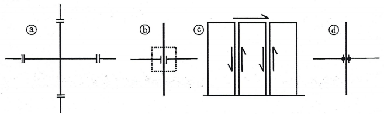

<strong>Hình 5.14 — Ảnh hưởng của các mối nối đến khả năng tiêu tán năng lượng của kết cấu</strong>

### 5.11.1.3  Tiêu chí thiết kế

### 5.11.1.3.1  Khả năng chịu lực cục bộ

(1) Trong các cấu kiện đúc sẵn và các mối nối của chúng, cần kể đến sự giảm khả năng làm việc do những biến dạng có chu kỳ sau giai đoạn chảy dẻo. Thông thường thì sự giảm khả năng làm việc như thế được kiểm soát bằng các hệ số riêng của vật liệu đối với thép và bê tông (xem 5.2.4(1) và 5.2.4(2)). Nếu không thỏa mãn điều kiện đó, khả năng chịu lực thiết kế của mối nối giữa các cấu kiện đúc sẵn khi chịu tải trọng tác động đơn điệu cần được giảm xuống một cách hợp lý khi tính toán kiểm tra trong tình huống thiết kế động đất.

### 5.11.1.3.2  Sự tiêu tán năng lượng

(1) Trong kết cấu bê tông đúc sẵn, cơ chế tiêu tán năng lượng phổ biến chủ yếu là thông qua sự xoay trong trạng thái dẻo ở vùng tới hạn.

(2) Bên cạnh sự tiêu tán năng lượng thông qua sự xoay trong trạng thái dẻo ở vùng tới hạn, kết cấu đúc sẵn cũng có thể tiêu tán năng lượng thông qua cơ cấu cắt dẻo dọc theo mối nối, miễn là cả hai điều kiện sau đây được thỏa mãn:

a) \- Lực phục hồi không giảm đáng kể trong quá trình tác động động đất;

b) \- Sự mất ổn định có thể được phòng tránh một cách phù hợp.

(3) Ba cấp độ dẻo được nêu trong Điều 5 cho kết cấu đúc tại chỗ cũng áp dụng cho hệ kết cấu đúc sẵn. Chỉ có 5.2.1(2) và 5.3 của Điều 5 áp dụng cho việc thiết kế nhà đúc sẵn có cấp độ dẻo thấp.

**CHÚ THÍCH:** Cấp độ dẻo thấp chỉ được kiến nghị dùng cho trường hợp động đất yếu. Với hệ tường đúc sẵn, cấp độ dẻo được kiến nghị là trung bình.

(4) Khả năng tiêu tán năng lượng khi chịu cắt có thể được kể đến, đặc biệt là trong hệ tường đúc sẵn, bằng cách đưa vào tính toán giá trị của các hệ số dẻo khi trượt cục bộ $\mu_s$ trong việc lựa chọn hệ số ứng xử tổng thể q.

### 5.11.1.3.3  Biện pháp bổ sung cụ thể

(1) Chỉ có kết cấu đúc sẵn đều đặn là được áp dụng theo 5.11 (xem 4.2.3). Tuy nhiên, việc kiểm tra cấu kiện đúc sẵn của kết cấu không đều đặn có thể dựa trên những yêu cầu của mục này.

(2) Tất cả các cấu kiện thẳng đứng cần được kéo dài liên tục đến cao trình móng.

(3) Tính thiếu tin cậy về khả năng chịu lực nêu trong 5.2.3.7(2).

(4) Tính thiếu tin cậy về độ dẻo nêu trong 5.2.3.7(3).

### 5.11.1.4  Hệ số ứng xử

(1) Đối với kết cấu đúc sẵn phù hợp với các yêu cầu trong 5.11, giá trị của hệ số ứng xử $q_{p}$ có thể được tính toán từ biểu thức sau đây, trừ khi có nghiên cứu đặc biệt về độ lệch cho phép:

$$q_p = k_p \, q \tag{5.53}$$
<!-- formula_id: "F_TCVN_9386_2025_RID205" -->

trong đó:

&nbsp;&nbsp;&nbsp;&nbsp;\- q  là hệ số ứng xử, lấy từ biểu thức (5.1);

&nbsp;&nbsp;&nbsp;&nbsp;\- $k_{p}$  là hệ số giảm, phụ thuộc vào khả năng tiêu tán năng lượng của kết cấu đúc sẵn (xem (2) của điều này).

**CHÚ THÍCH:** Các giá trị được kiến nghị là:

$k_{p}$ = 1,0 cho kết cấu có mối nối phù hợp với 5.11.2.1.1, 5.11.2.1.2 hoặc 5.11.2.1.3;

$k_{p}$ = 0,5 cho kết cấu có các kiểu mối nối khác.

(2) Với kết cấu đúc sẵn không phù hợp với những yêu cầu thiết kế trong 5.11, hệ số ứng xử $q_{p}$ có thể lấy lớn nhất là 1,5.

### 5.11.1.5  Tính toán trong tình huống tạm thời

(1) Trong quá trình dựng lắp kết cấu nếu việc neo giữ tạm thời là cần thiết, thì tác động động đất không đưa vào tính toán như là một tình huống thiết kế. Tuy nhiên, khi mà động đất có thể làm sụp đổ các phần của kết cấu gây rủi ro nghiêm trọng cho sinh mạng con người, thì việc neo giữ tạm thời phải được thiết kế để giảm bớt tác động động đất.

(2) Nếu không có yêu cầu khác theo những nghiên cứu riêng biệt, thì tác động này có thể được giả thiết bằng một phần $A_{p}$ của tác động thiết kế được xác định theo Điều 3.

**CHÚ THÍCH:** Giá trị được kiến nghị của $A_{p}$ là 30 %.

### 5.11.2  Mối nối các cấu kiện đúc sẵn

### 5.11.2.1  Yêu cầu chung

### 5.11.2.1.1  Mối nối ngoài vùng tới hạn

(1) Các mối nối các cấu kiện đúc sẵn nằm ngoài vùng tới hạn cần được bố trí cách nhau một khoảng ít nhất bằng kích thước lớn nhất của tiết diện ngang của cấu kiện trong vùng tới hạn tính từ bề mặt cuối của vùng tới hạn gần nhất.

(2) Các mối nối kiểu này cần được định kích thước để chịu: a) lực cắt được xác định theo quy tắc thiết kế theo khả năng theo 5.4.2.2 và 5.4.2.3 với hệ số $\gamma_{\text{Rd}}$ kể đến sự làm việc với cường độ cao hơn vì thép biến cứng, lấy bằng 1,1 cho trường hợp cấp độ dẻo trung bình hoặc bằng 1,2 cho trường hợp cấp độ dẻo cao; b) mô men uốn ít nhất là bằng mô men tác dụng lấy từ tính toán và bằng 50 % khả năng chịu uốn $M_{Rd}$ tại bề mặt đầu mút của vùng tới hạn gần nhất, nhân với hệ số $\gamma_{\text{Rd}}$.

### 5.11.2.1.2  Mối nối có độ bền dư

(1) Hệ quả tác động thiết kế của mối nối có độ bền dư cần được tính toán theo những quy tắc thiết kế theo khả năng như trong 5.4.2.2 và 5.4.2.3, trên cơ sở khả năng chịu uốn dư tại các tiết diện giới hạn vùng tới hạn bằng $\gamma_{\text{Rd}}$. $M_{Rd}$, với hệ số $\gamma_{\text{Rd}}$ lấy bằng 1,20 cho trường hợp cấp độ dẻo trung bình và bằng 1,35 cho trường hợp cấp độ dẻo cao.

(2) Các thanh cốt thép của mối nối có độ bền dư cần được neo chắc chắn vào vùng nằm ngoài vùng tới hạn.

(3) Cốt thép của vùng tới hạn cần được neo chắc chắn vào vùng nằm ngoài vùng mối nối có độ bền dư.

### 5.11.2.1.3  Mối nối tiêu tán năng lượng

(1) Các mối nối tiêu tán năng lượng cần phù hợp với các tiêu chí dẻo cục bộ nêu trong 5.2.3.4 và trong các yêu cầu liên quan của 5.4.3 và 5.5.3.

(2) Hoặc là, bằng thí nghiệm lặp không đàn hồi theo chu kỳ đối với một số lượng mẫu thử thích hợp đại diện cho mối nối, cần chứng minh rằng mối nối đó có biến dạng ổn định theo chu kỳ và khả năng tiêu tán năng lượng của nó ít nhất là bằng khả năng tiêu tán năng lượng của mối nối đổ tại chỗ có cùng độ bền và phù hợp với các yêu cầu về dẻo cục bộ trong 5.4.3 hoặc 5.5.3.

(3) Các thí nghiệm trên mẫu thử đại diện cần được thực hiện theo một chuỗi chu kỳ của chuyển vị, bao gồm ít nhất là 3 chu kỳ trọn vẹn có biên độ tương ứng với $q_{p}$ phù hợp với 5.2.3.4(3).

### 5.11.2.2  Xác định khả năng chịu lực của mối nối

(1) Khả năng chịu lực thiết kế của các mối nối giữa các cấu kiện bê tông đúc sẵn cần được tính toán phù hợp với những yêu cầu của EN 1992-1-1:2004, 6.2.5 và của EN 1992-1-1:2004, Điều 10, trong đó sử dụng các hệ số riêng của vật liệu nêu trong 5.2.4(2) và (3). Nếu những yêu cầu này không phản ánh đầy đủ đối với mối nối đang xét, thì khả năng chịu lực của nó cần được xác định bằng các nghiên cứu thực nghiệm thích hợp.

(2) Khi xác định khả năng chịu lực của mối nối chống trượt do lực cắt, cần bỏ qua khả năng chịu lực do ma sát nhờ ứng suất nén bên ngoài (ngược chiều với ứng suất bên trong do ảnh hưởng neo giữ của các thanh cốt thép ngang đi qua mối nối).

(3) Có thể hàn các thanh cốt thép trong mối nối tiêu tán năng lượng khi tất cả những điều kiện sau đây được thỏa mãn:

a) \- chỉ sử dụng các loại thép có khả năng hàn được;

b) \- vật liệu hàn, kỹ thuật hàn và tay nghề bảo đảm để sự hao tổn độ dẻo cục bộ nhỏ hơn 10 % hệ số dẻo đạt được nếu mối nối đó được thực hiện mà không cần phải hàn.

4) Các chi tiết bằng thép (thép hình hay cốt thép) được liên kết chặt vào các bộ phận bằng bê tông và để tham gia kháng chấn cần được chứng minh bằng tính toán và thực nghiệm là chúng chịu được biến dạng do tải trọng tác dụng theo chu kỳ do các biến dạng ứng với độ dẻo nêu trong 5.11.2.1.3(2).

### 5.11.3  Cấu kiện

### 5.11.3.1  Dầm

(1) Những yêu cầu liên quan trong EN 1992-1-1:2004, Điều 10 và trong 5.4.2.1, 5.4.3.1, 5.5.2.1, 5.5.3.1 của tiêu chuẩn này đều được áp dụng, ngoài những quy tắc đã nêu trong 5.11.

(2) Dầm đơn giản bằng bê tông đúc sẵn phải được liên kết để truyền lực với cột hoặc tường. Mối nối này phải bảo đảm truyền các lực ngang trong tình huống thiết kế động đất mà không kể đến thành phần ma sát.

(3) Ngoài những yêu cầu liên quan trong EN 1992-1-1:2004, Điều 10, dung sai và độ dài dự phòng nứt vỡ của gối đỡ cũng cần phải đảm bảo đủ cho chuyển vị dự kiến của cấu kiện đỡ (xem 4.3.4).

### 5.11.3.2  Cột

(1) Ngoài những quy tắc trong 5.11, áp dụng những yêu cầu liên quan trong 5.4.3.2 và 5.5.3.2.

(2) Các mối nối cột với cột trong phạm vi vùng tới hạn chỉ được phép sử dụng đối với trường hợp cấp độ dẻo trung bình.

(3) Đối với hệ khung đúc sẵn có mối nối cột với dầm là khớp, các cột này cần được ngàm chặt tại chân đế vào móng cốc được thiết kế phù hợp với 5.11.2.1.2.

### 5.11.3.3  Nút dầm - cột

(1) Nút dầm-cột toàn khối (xem Hình 5.14a) cần phù hợp với những yêu cầu liên quan trong 5.4.3.3 và 5.5.3.3.

(2) Mối nối giữa đầu mút dầm vào cột (xem Hình 5.14b) và d) cần được đặc biệt kiểm tra về khả năng chịu lực và độ dẻo của chúng như nêu trong 5.11.2.2.1.

### 5.11.3.4  Tường panen tấm lớn đúc sẵn

(1) Áp dụng EN 1992-1-1:2004, Điều 10 với những thay đổi sau đây:

a) \- Tổng hàm lượng thép thẳng đứng tối thiểu là tính với diện tích tiết diện ngang thực tế của bê tông và bao gồm cả các thanh cốt thép thẳng đứng của phần bụng và của các phần đầu tường.

b) \- Không cho phép dùng lưới thép một lớp.

c) \- Cần đảm bảo một lượng cốt thép hạn chế biến dạng tối thiểu cho bê tông ở phần đầu của tất cả các panen đúc sẵn, như nêu trong 5.4.3.4 2 hoặc 5.4.3.4.5 đối với cột, trên một tiết diện vuông có chiều dài cạnh bằng $b_{w}$, trong đó $b_{w}$ là chiều dày của panen.

(2) Phần ô tường nằm giữa mối nối thẳng đứng và lỗ mở được bố trí cách mối nối đó một khoảng nhỏ hơn 2,5$b_{w}$, cần được chọn kích thước và cấu tạo phù hợp với 5.4.3.4.2 hoặc 5.5.3.4.5, tùy thuộc vào cấp độ dẻo.

(3) Cần phải tránh để không có sự giảm khả năng chịu lực của các mối nối.

(4) Để thực hiện yêu cầu trên, tất cả các mối nối thẳng đứng cần phải có độ nhám hoặc có các chi tiết chịu cắt và được kiểm tra khả năng chịu cắt.

(5) Có thể tạo các mối nối nằm ngang chịu nén trên toàn bộ chiều dài của chúng mà không cần tới các chi tiết chịu cắt. Nếu chúng chịu nén một phần và chịu kéo một phần thì nên có chi tiết chịu cắt dọc theo toàn bộ chiều dài của chúng.

(6) Những quy tắc bổ sung sau đây áp dụng để kiểm tra các mối nối nằm ngang của tường được làm từ các panen tấm lớn đúc sẵn:

a) \- Tổng lực kéo do hệ quả tác động dọc trục (với tường) cần được chịu bởi cốt thép thẳng đứng bố trí dọc theo vùng chịu kéo của ô tường và neo chắc chắn vào phần thân của các panen phía trên và phía dưới. Cốt thép này cần được liên tục bằng mối hàn có độ dẻo trong phạm vi mối nối nằm ngang hoặc tốt hơn, trong phạm vi các nút khóa đặc biệt được cấu tạo để đảm bảo yêu cầu này. (Hình 5.15).

<!-- DIAGRAM: word/media/image204.png -->

**CHÚ DẪN:**

A  hàn chồng các thanh thép

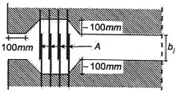

<strong>Hình 5.15 — Cốt thép chịu kéo tại đầu tường</strong>

b) \- Trong các mối nối nằm ngang có một phần chịu nén và một phần chịu kéo (trong tình huống thiết kế động đất) việc kiểm tra khả năng chịu cắt (xem 5.11.2.2) chỉ cần thực hiện cho phần chịu nén. Trong trường hợp đó, giá trị của lực dọc $N_{Ed}$ cần được thay thế bằng giá trị của tổng lực nén $F_{c}$ tác dụng lên vùng nén.

(7) Những quy tắc thiết kế bổ sung sau đây cần được xét đến để tăng độ dẻo cục bộ dọc theo các mối nối thẳng đứng của các ô tường tấm lớn:

a) \- Lượng cốt thép tối thiểu cần được bố trí cắt ngang qua các mối nối là 0,10 % đối với các mối nối hoàn toàn chịu nén và là 0,25 % đối với các mối nối chịu nén một phần và chịu kéo một phần;

b) \- Lượng cốt thép cắt ngang qua các mối nối cần được hạn chế để tránh giảm đột ngột độ cứng sau khi lực phản ứng đạt giá trị đỉnh. Khi thiếu dữ liệu cụ thể hơn, hàm lượng cốt thép này không nên vượt quá 2 %.

c) \- Cốt thép nêu trên cần được phân bố ngang qua toàn bộ chiều dài của mối nối. Trong kết cấu có cấp độ dẻo trung bình, cốt thép này có thể được tập trung tại 3 dải (đỉnh, ở giữa và chân tường);

d) \- Phải thực hiện yêu cầu bảo đảm tính liên tục của cốt thép ngang cắt qua các mối nối giữa panen với panen. Để thực hiện yêu cầu này, trong các mối nối thẳng đứng, thanh cốt thép cần được neo giữ bằng móc hình vuông hoặc (trong trường hợp mối nối có ít nhất một mặt tự do) được hàn dọc theo chiều ngang cắt qua các mối nối (xem Hình 5.16);

e) \- Để bảo đảm tính liên tục dọc theo mối nối sau khi hình thành vết nứt, cốt thép dọc với hàm lượng tối thiểu bằng $\rho$ cần được bố trí trong phạm vi chèn bằng vữa của mối nối (xem Hình 5.16).

**CHÚ THÍCH:** Giá trị kiến nghị là $\rho$ = 1 %

(8) Do khả năng tiêu tán năng lượng dọc theo mối nối thẳng đứng (và một phần dọc theo mối nối nằm ngang) của panen tấm lớn, việc gia cường các phần đầu tường panen đúc sẵn được phép không phù hợp với những yêu cầu trong 5.4.3.4.2 và 5.5.3.4.5.

### 5.11.3.5  Tấm cứng

(1) Ngoài những yêu cầu trong EN 1992-1-1:2004, Điều 10 liên quan tới bản sàn và những yêu cầu trong 5.10, những quy tắc thiết kế sau đây cũng áp dụng cho trường hợp bản sàn là tấm cứng làm bằng các cấu kiện đúc sẵn.

<!-- DIAGRAM: word/media/image206.png -->

a) \- mối nối có 2 mặt tự do b) mối nối có một mặt tự do

**CHÚ DẪN:**

A) \- cốt thép đi qua mối nối;C) mộng răng cưa chịu cắt;

B) \- cốt thép chạy dọc mối nối;D) vữa chèn giữa các panen.

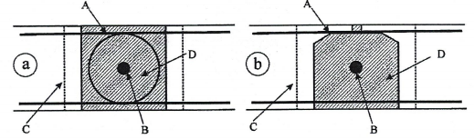

<strong>Hình 5.16 — Tiết diện ngang của mối nối thẳng đứng giữa các panen tấm lớn đúc sẵn</strong>

(2) Khi điều kiện tấm cứng theo 4.3.1(4) không được thỏa mãn, tính dễ uốn trong mặt phẳng của các bản sàn cũng như của các mối nối với các cấu kiện thẳng đứng cần được đưa vào mô hình tính toán.

(3) Sự làm việc của tấm cứng được tăng cường nếu các mối nối trong tấm cứng này được bố trí chỉ trên gối đỡ của nó. Lớp bê tông cốt thép đổ bù tại chỗ có thể tăng đáng kể độ cứng của tấm cứng này. Chiều dày của lớp đổ bù này không được nhỏ hơn 40 mm nếu nhịp giữa các gối đỡ nhỏ hơn 8 m, không nhỏ hơn 50 mm đối với nhịp dài hơn; cốt thép dạng lưới của nó cần liên kết với các cấu kiện chịu lực thẳng đứng phía trên và phía dưới.

(4) Các thanh thép giằng bố trí ít nhất là dọc theo chu vi của sàn cứng, cũng như dọc theo một số mối nối của các bộ phận của sàn đúc sẵn là để chịu được lực kéo. Nếu lớp đổ bù tại chỗ được sử dụng, lượng cốt thép bổ sung này cần được đặt trong lớp đổ bù nói trên.

(5) Trong tất cả các trường hợp, các thanh thép giằng này cần phải tạo thành một hệ cốt thép liên tục dọc và ngang qua toàn bộ tấm cứng và được liên kết hợp lý vào từng cấu kiện chịu lực ngang.

(6) Lực cắt tác dụng trong mặt phẳng dọc theo các mối nối bản sàn với bản sàn hoặc bản sàn với dầm cần được tính toán với hệ số độ bền dư bằng 1,30. Khả năng chịu lực thiết kế cần được tính toán như trong 5.11.2.2.

(7) Các cấu kiện kháng chấn chính, cả phía trên lẫn phía dưới tấm cứng, cần được liên kết hợp lý vào sàn cứng. Để thực hiện yêu cầu này, mọi mối nối nằm ngang cần phải luôn luôn được đặt cốt thép đúng quy cách. Không được kể đến ảnh hưởng có lợi của lực ma sát do các lực nén bên ngoài sinh ra.

## 6  YÊU CẦU RIÊNG CHO KẾT CẤU THÉP

### 6.1  Yêu cầu chung

### 6.1.1  Phạm vi áp dụng

Khi thiết kế nhà thép, áp dụng EN 1993 hoặc TCVN 5575:2024 và các yêu cầu bổ sung dưới đây.

### 6.1.2  Quan niệm thiết kế

(1) Các nhà thép chịu động đất cần được thiết kế theo một trong hai quan niệm sau:

&nbsp;&nbsp;\- quan niệm a) Kết cấu có khả năng tiêu tán năng lượng thấp;

&nbsp;&nbsp;\- quan niệm b) Kết cấu có khả năng tiêu tán năng lượng.

(2) Theo quan niệm a), nội lực có thể được tính toán trên cơ sở phân tích đàn hồi tổng thể mà không xét đến sự làm việc phi tuyến của vật liệu. Khi sử dụng phổ thiết kế nêu trong 3.2.2.5 thì giá trị giới hạn trên của hệ số ứng xử q được lấy bằng 1,5 (xem Bảng 6.1). Trong trường hợp công trình có dạng không đều theo mặt đứng, hệ số ứng xử q phải được nhân với hệ số 0,8 như chỉ dẫn trong 4.2.3.1(7) nhưng không nhất thiết phải nhỏ hơn 1,5.

### Bảng 6.1 - Các quan niệm thiết kế, cấp độ dẻo và giới hạn trên của giá trị tham chiếu của hệ số ứng xử

| Quan niệm thiết kế | Cấp độ dẻo | Phạm vi giá trị tham chiếu của hệ số ứng xử q |
| :--- | :--- | :--- |
| Quan niệm a) | DCL (Thấp) | ≤ 1,5 đến 2 |
| Quan niệm b) | DCM (Trung bình) | ≤ 4 và không vượt quá các giá trị giới hạn trong Bảng 6.2 |
| Quan niệm b) | DCH (Cao) | lấy theo các giá trị giới hạn trong Bảng 6.2 |

(3) Theo quan niệm a), nếu lấy giá trị giới hạn trên của q lớn hơn 1,5 thì các cấu kiện kháng chấn chính của kết cấu phải có tiết diện thép thuộc cấp 1, 2 hoặc 3.

(4) Theo quan niệm a), khả năng chịu lực của các cấu kiện và liên kết cần được tính toán theo EN 1993 hoặc TCVN 5575:2024 mà không cần bổ sung thêm các yêu cầu khác. Đối với những công trình không được cách chấn đáy (xem Điều 10), việc thiết kế theo quan niệm a) được khuyến nghị dùng cho trường hợp động đất yếu (xem 3.2.1(4)).

(5) Theo quan niệm b), khả năng chịu tác động động đất của các bộ phận (vùng tiêu tán năng lượng) của kết cấu phải tính đến sự làm việc ngoài giới hạn đàn hồi. Khi sử dụng phổ thiết kế nêu trong 3.2.2.5, giá trị của hệ số ứng xử q có thể lấy lớn hơn giá trị giới hạn trên nêu trong Bảng 6.1. Giá trị giới hạn trên của q phụ thuộc vào cấp độ dẻo và dạng kết cấu (xem 6.3). Khi thiết kế kết cấu theo quan niệm b, cần phù hợp với các yêu cầu từ 6.2 đến 6.11.

(6) Các kết cấu được thiết kế theo quan niệm b) phải có độ dẻo thuộc DCM hoặc DCH. Các cấp độ dẻo này cho phép tăng khả năng tiêu tán năng lượng của kết cấu theo cơ chế dẻo. Tùy thuộc vào cấp độ dẻo mà các yêu cầu đặc thù của một hoặc nhiều phương diện sau đây phải được thỏa mãn: loại tiết diện thép và khả năng xoay của liên kết.

### 6.1.3  Kiểm tra độ an toàn

(1) Khi kiểm tra trạng thái cực hạn, hệ số riêng của thép $\gamma_{s}$ = $\gamma_{M}$ cần tính đến khả năng suy giảm cường độ do biến dạng theo chu kỳ.

**CHÚ THÍCH:** Do hiện tượng dẻo cục bộ, tỷ số giữa cường độ còn lại sau khi bị suy giảm và cường độ ban đầu xấp xỉ bằng tỷ số giữa các giá trị $\gamma_{M}$ của tổ hợp tác động đặc biệt và tổ hợp tác động cơ bản, kiến nghị sử dụng hệ số $\gamma_{s}$ trong thiết kế với cả hai trường hợp tải trọng thay đổi và tải trọng lâu dài.

(2) Khi kiểm tra thiết kế theo khả năng theo 6.5 đến 6.8 thì nên xét đến khả năng cường độ chảy thực tế của thép cao hơn cường độ chảy danh nghĩa bằng hệ số vượt cường độ của vật liệu $_{ov}$ (xem 6.2(3)).

### 6.2  Vật liệu

(1) Thép làm kết cấu phải phù hợp với EN 1993.

(2) Việc phân phối các đặc trưng vật liệu trong kết cấu (như cường độ chảy, độ dai) phải sao cho tạo được các vùng tiêu tán năng lượng ở các vị trí đã dự định trong thiết kế.

**CHÚ THÍCH:** Vật liệu thép ở các vùng tiêu tán năng lượng phải bị chảy dẻo trước khi các vùng khác vượt quá giai đoạn đàn hồi trong quá trình động đất.

(3) Yêu cầu (2) có thể thỏa mãn nếu cường độ chảy của thép trong các vùng tiêu tán năng lượng và việc thiết kế kết cấu phù hợp với một trong các điều kiện sau:

a) \- Cận trên của cường độ chảy $f_{y,max}$ của thép trong các vùng tiêu tán năng lượng thỏa mãn điều kiện:

$f_{y,max}$ ≤ 1,1 $\gamma_{ov}$ $f_{y}$

trong đó:

&nbsp;&nbsp;&nbsp;&nbsp;\- $\gamma_{ov}$ là hệ số vượt cường độ của vật liệu. Khuyến nghị lấy $\gamma_{ov}$ = 1,25.

&nbsp;&nbsp;&nbsp;&nbsp;\- $f_{y}$ là cường độ chảy danh nghĩa của thép.

**CHÚ THÍCH:** Đối với thép S235 và với hệ số vượt cường độ của vật liệu $\gamma_{ov}$ = 1,25 thì phương pháp này cho giá trị lớn nhất $f_{y,max}$ = 323 N/$mm^{2}$.

b) \- Thiết kế kết cấu được căn cứ vào một số hiệu thép sử dụng và một cường độ chảy danh nghĩa $f_{y}$ cho cả hai vùng tiêu tán và không tiêu tán năng lượng; giá trị cận trên $f_{y,max}$ dùng cho thép ở vùng tiêu tán năng lượng; giá trị danh nghĩa $f_{y}$ được dùng cho thép ở vùng không tiêu tán năng lượng và ở các mối nối là vượt quá giá trị cận trên của cường độ chảy $f_{y,max}$ của vùng tiêu tán năng lượng.

**CHÚ THÍCH:** Theo điều kiện này thì có thể sử dụng thép S355 cho các cấu kiện và cho các liên kết không tiêu tán năng lượng và sử dụng thép S235 cho các cấu kiện tiêu tán năng lượng hoặc các liên kết tiêu tán năng lượng tại đó giá trị cận trên của cường độ chảy của thép S235 được giới hạn không quá $f_{y,max}$ = 355 N/$mm^{2}$.

c) \- Cường độ chảy thực tế $f_{y,act}$ của thép trong vùng tiêu tán năng lượng được xác định bằng thử nghiệm. Hệ số vượt cường độ được tính toán cho từng vùng tiêu tán năng lượng $\gamma_{ov,act}$ = $f_{y,act}$/$f_{y}$ trong đó $f_{y}$ là giá trị cường độ chảy danh nghĩa của thép của vùng tiêu tán năng lượng.

**CHÚ THÍCH:** Điều kiện này có thể áp dụng đối với thép có xuất xứ rõ ràng, cũng có thể được áp dụng để đánh giá công trình đã xây dựng hoặc khi cường độ chảy được xác định bằng thực nghiệm trước khi chế tạo.

(4) Nếu các điều kiện trong (3)b thỏa mãn thì hệ số vượt cường độ $\gamma_{ov}$ có thể lấy bằng 1,0 khi kiểm tra thiết kế cho các cấu kiện của kết cấu nêu trong các điều từ 6.5 đến 6.8. Khi kiểm tra điều kiện (6.1) đối với các liên kết, giá trị được sử dụng cho hệ số vượt cường độ $\gamma_{ov}$ là giá trị như trong (3)a.

(5) Nếu các điều kiện trong (3)c được thỏa mãn thì hệ số vượt cường độ $\gamma_{ov}$ được lấy bằng giá trị lớn nhất trong số các giá trị $\gamma_{ov,act}$ được tính trong các phép kiểm tra từ 6.5 đến 6.8.

(6) Đối với các vùng tiêu tán năng lượng, giá trị cường độ chảy $f_{y,max}$ sử dụng khi áp dụng các điều kiện trong (3) của điều này cần được xác định rõ và ghi chú trên bản vẽ.

(7) Độ dai của thép và của các mối hàn phải được chọn thỏa mãn các yêu cầu khi chịu tác dụng động đất tương ứng với giá trị nhất định của nhiệt độ làm việc (xem EN 1993-1-10:2005).

(8) Độ dai của thép và của các mối hàn và nhiệt độ làm việc thấp nhất được chọn để tổ hợp với tải trọng có tác động động đất cần được nêu trong dự án.

(9) Trong liên kết bulông của những cấu kiện kháng chấn chính của nhà nên dùng bulông cường độ cao thuộc cấp 8.8 hoặc 10.9.

(10) Việc kiểm tra tính năng vật liệu được thực hiện theo 6.11.

### 6.3  Dạng kết cấu và hệ số ứng xử

### 6.3.1  Dạng kết cấu

(1) Tùy theo mức độ ứng xử của kết cấu chịu lực chính dưới tác dụng động đất mà nhà thép cần phải được xếp loại theo một trong các dạng kết cấu sau (xem các Hình vẽ từ 6.1 đến 6.8):

a) \- Khung chịu mô men, là dạng kết cấu trong đó lực ngang được chịu chủ yếu bởi các cấu kiện chịu uốn.

b) \- Khung với hệ giằng đúng tâm, là dạng kết cấu trong đó lực ngang được chịu chủ yếu bởi các cấu kiện chịu lực dọc trục.

c) \- Khung với hệ giằng lệch tâm, là dạng kết cấu trong đó lực ngang được chịu chủ yếu bởi các cấu kiện chịu tải trọng dọc trục, nhưng sự bố trí lệch tâm phải sao cho năng lượng có thể bị tiêu tán tại đoạn nối kháng chấn bởi uốn theo chu kỳ hoặc cắt theo chu kỳ.

d) \- Kết cấu kiểu con lắc ngược, được xác định theo 5.1.2 và là kết cấu mà trong đó các vùng tiêu tán năng lượng được bố trí tại chân cột.

e) \- Kết cấu có lõi bê tông hoặc vách bê tông, là dạng kết cấu mà lực ngang được chịu chủ yếu bởi lõi và vách.

f) \- Khung chịu mô men kết hợp với hệ giằng đúng tâm.

g) \- Khung chịu mô men kết hợp với tường chèn.

(2) Trong các khung chịu mô men, các vùng tiêu tán năng lượng phải chủ yếu được bố trí ở các khớp dẻo trong dầm hoặc chỗ giao nhau giữa dầm - cột để tiêu tán năng lượng gây ra bởi sự uốn theo chu kỳ. Vùng tiêu tán năng lượng cũng có thể bố trí trong cột tại các vị trí sau:

&nbsp;&nbsp;\- Tại chân khung;

&nbsp;&nbsp;\- Tại đỉnh cột ở tầng trên cùng đối với nhà nhiều tầng;

&nbsp;&nbsp;\- Tại đỉnh cột và chân cột của nhà một tầng mà trong đó $N_{Ed}$ trong cột thỏa mãn $N_{Ed}$/$N_{pl,Rd}$ < 0,3.

(3) Trong khung với hệ giằng đúng tâm, các vùng tiêu tán năng lượng phải chủ yếu tập trung tại các thanh chéo chịu kéo.

Hệ giằng có thể thuộc một trong các loại sau:

&nbsp;&nbsp;\- Hệ giằng chéo chịu kéo chủ động, trong đó lực ngang chỉ được chịu bởi các thanh chéo chịu kéo, bỏ qua các thanh chéo chịu nén.

&nbsp;&nbsp;\- Hệ giằng chữ V, trong đó lực ngang được chịu bởi cả thanh chéo chịu kéo và thanh chéo chịu nén. Điểm giao nhau của các thanh chéo này nằm trên 1 thanh ngang liên tục.

Không được sử dụng hệ giằng chữ K mà giao điểm của các thanh chéo nằm trên cột (xem Hình 6.9).

(4) Đối với khung có hệ giằng lệch tâm có thể sử dụng các dạng mà các thanh nối lệch tâm đều được phép tham gia chịu lực, như trên Hình 6.4.

(5) Kết cấu kiểu con lắc ngược có thể xem như khung chịu mô men với điều kiện là kết cấu chịu tác dụng động đất có nhiều hơn một cột trong mỗi mặt phẳng chịu lực và điều kiện hạn chế lực dọc trong cột $N_{Ed}$ < 0,3 $N_{pl,Rd}$ phải được thỏa mãn trong từng cột.

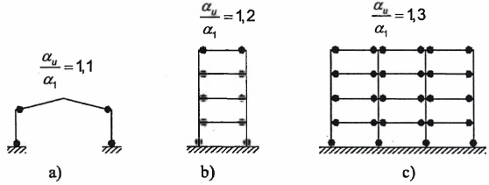

<strong>Hình 6.1 — Khung chịu mô men (vùng tiêu tán năng lượng trong dầm và chân cột). Các giá trị mặc định của tỷ số αu/α1 (xem 6.3.2(3) và Bảng 6.2)</strong>

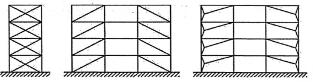

<strong>Hình 6.2 — Khung có hệ giằng chéo đúng tâm (vùng tiêu tán năng lượng chỉ nằm trong các thanh chéo chịu kéo)</strong>

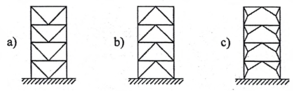

<strong>Hình 6.3 — Khung có hệ giằng chữ V đúng tâm (vùng tiêu tán năng lượng nằm trong các thanh chéo chịu kéo và chịu nén)</strong>

(6) Giá trị lớn nhất của $\alpha_{u}$/$\alpha_{1}$ sử dụng trong thiết kế là bằng 1,6 kể cả khi sử dụng phương pháp phân tích phi tuyến tổng thể dẫn đến các giá trị có khả năng cao hơn.

### Bảng 6.2 - Giới hạn trên của giá trị tham chiếu của hệ số ứng xử cho hệ kết cấu đều đặn theo phương đứng

| Dạng kết cấu | Cấp độ dẻo — DCM | Cấp độ dẻo — DCH |
| :--- | :--- | :--- |
| a) Khung chịu mô men | 4 | 5 $\alpha_{u}$/$\alpha_{1}$ |
| b) Khung có hệ giằng đúng tâm |  |  |
| Hệ giằng chéo | 4 | 4 |
| Hệ giằng chữ V | 2 | 2,5 |
| c) Khung có hệ giằng lệch tâm | 4 | 5 $\alpha_{u}$/$\alpha_{1}$ |
| d) Kết cấu con lắc ngược | 2 | 2 $\alpha_{u}$/$\alpha_{1}$ |
| e) Kết cấu có lõi bê tông hoặc vách bê tông | xem Điều 5 | xem Điều 5 |
| f) Khung chịu mô men kết hợp với hệ giằng đúng tâm | 4 | 4 $\alpha_{u}$/$\alpha_{1}$ |
| g) Khung chịu mô men kết hợp với tường chèn |  |  |
| Tường chèn khối xây hoặc bê tông không được liên kết mà chỉ tiếp giáp với khung | 2 | 2 |
| Tường chèn bê tông cốt thép được liên kết vào khung | xem Điều 7 | xem Điều 7 |
| Tường chèn phân cách với khung chịu mô men (xem phần khung chịu mô men) | 4 | 5 $\alpha_{u}$/$\alpha_{1}$ |

### 6.4  Phân tích kết cấu

(1) Việc thiết kế tấm cứng dạng sàn cần phù hợp với mục 4.4.2.5.

(2) Ngoại trừ những yêu cầu khác trong Điều này (như yêu cầu về việc phân tích khung với hệ giằng đúng tâm được nêu trong 6.7.2(1) và (2)), kết cấu có thể được phân tích với giả thiết toàn bộ các cấu kiện của kết cấu đều tham gia chịu tác động động đất.

### 6.5  Tiêu chí thiết kế và yêu cầu cấu tạo cho mọi loại kết cấu có khả năng tiêu tán năng lượng

### 6.5.1  Yêu cầu chung

(1) Các tiêu chí thiết kế trong 6.5.2 có thể áp dụng cho các bộ phận của kết cấu chịu tác động động đất, được thiết kế theo quan niệm b) (xem 6.1.2).

(2) Các tiêu chí thiết kế đưa ra trong 6.5.2 được xem là thỏa mãn nếu phù hợp với các yêu cầu cụ thể từ 6.5.3 đến 6.5.5.

### 6.5.2  Tiêu chí thiết kế cho kết cấu có khả năng tiêu tán năng lượng

(1) Kết cấu có vùng tiêu tán năng lượng phải được thiết kế sao cho sự chảy dẻo của vật liệu, sự mất ổn định cục bộ hoặc các hiện tượng khác gây bởi ứng xử trễ của các vùng này không ảnh hưởng đển tính ổn định tổng thể của kết cấu.

**CHÚ THÍCH:** Hệ số q nêu trong Bảng 6.2 được xem là đã phù hợp với yêu cầu này (xem 2.2.2(2)).

(2) Các vùng tiêu tán năng lượng phải có độ mềm dẻo và độ bền thích hợp. Độ bền phải được kiểm tra theo EN 1993.

(3) Các vùng tiêu tán năng lượng có thể được bố trí trong các cấu kiện chịu lực hoặc trong các liên kết.

(4) Nếu các vùng tiêu tán năng lượng được định vị trong các cấu kiện chịu lực thì các bộ phận không tiêu tán năng lượng và các liên kết của các bộ phận tiêu tán năng lượng với phần còn lại của kết cấu phải vượt cường độ đủ để cho biến dạng dẻo theo chu kỳ phát triển trong các bộ phận tiêu tán năng lượng.

(5) Khi các vùng tiêu tán năng lượng được bố trí trong liên kết thì các cấu kiện được liên kết với nhau phải vượt cường độ đủ để cho phép phát triển sự chảy dẻo theo chu kỳ trong liên kết.

### 6.5.3  Yêu cầu thiết kế cho cấu kiện có khả năng tiêu tán năng lượng làm việc chịu nén hoặc uốn

(1) Độ dẻo cục bộ thích hợp của cấu kiện chịu nén hoặc uốn có khả năng tiêu tán năng lượng phải được đảm bảo bằng cách giới hạn tỷ số giữa chiều rộng và chiều dày b/t theo phân cấp tiết diện thép như đã nêu trong 5.5 của EN 1993-1-1:2005.

(2) Tùy thuộc vào cấp độ dẻo và hệ số ứng xử q sử dụng trong thiết kế mà yêu cầu về phân cấp tiết diện của cấu kiện thép có khả năng tiêu tán năng lượng được nêu trong Bảng 6.3.

### Bảng 6.3 - Các yêu cầu về loại tiết diện thép của cấu kiện có khả năng tiêu tán năng lượng theo cấp độ dẻo và giá trị tham chiếu của hệ số ứng xử

| Cấp độ dẻo | Giá trị tham chiếu của hệ số ứng xử q | Cấp tiết diện thép yêu cầu |
| :--- | :--- | :--- |
| DCM | 1,5 < q ≤ 2 | Cấp 1, 2 hoặc 3 |
| DCM | 2 < q ≤ 4 | Cấp 1 hoặc 2 |
| DCH | q > 4 | Cấp 1 |

### 6.5.4  Yêu cầu thiết kế cho các bộ phận hoặc cấu kiện chịu kéo

(1) Cấu kiện chịu kéo hoặc các phần của cấu kiện chịu kéo nên thỏa mãn yêu cầu về độ dẻo trong mục 6.2.3(3) của EN 1993-1-1:2005.

### 6.5.5  Yêu cầu thiết kế cho những liên kết trong vùng tiêu tán năng lượng

(1) Việc thiết kế các liên kết phải sao cho hạn chế được vùng biến dạng dẻo, hạn chế ứng suất dư lớn và tránh được các khiếm khuyết chế tạo.

(2) Các liên kết không tiêu tán năng lượng của cấu kiện có khả năng tiêu tán năng lượng (được tạo ra bằng các mối hàn đối đầu thấu hết chiều dày) được xem là phù hợp với tiêu chí về vượt cường độ.

(3) Liên kết hàn góc hoặc liên kết bulông không tiêu tán năng lượng cần thỏa mãn yêu cầu sau:

$$R_d \ge 1.1 \gamma_{av} R_{fy} \qquad (6.1)$$
<!-- formula_id: "F_TCVN_9386_2025_RID213" -->

trong đó:

&nbsp;&nbsp;&nbsp;&nbsp;\- $R_{d}$ là độ bền của liên kết theo EN 1993;

&nbsp;&nbsp;&nbsp;&nbsp;\- $R_{fy}$ là độ bền dẻo của cấu kiện tiêu tán năng lượng được liên kết, dựa trên ứng suất chảy tính toán của vật liệu được xác định theo EN 1993.

&nbsp;&nbsp;&nbsp;&nbsp;\- $\gamma_{ov}$ là hệ số vượt cường độ (xem 6.1.3(2) và 6.2).

&nbsp;&nbsp;&nbsp;&nbsp;\- (4) Nên sử dụng liên kết bulông chịu cắt loại B và C theo 3.4.1 của EN 1993-1-8:2005 và liên kết bulông chịu kéo loại E theo 3.4.2 của EN 1993-1-8:2005. Được phép sử dụng liên kết chịu cắt bằng bulông cường độ cao vặn chặt. Các bề mặt chịu ma sát phải thuộc loại A hoặc B được nêu trong EN 1090-2.

&nbsp;&nbsp;&nbsp;&nbsp;\- (5) Đối với liên kết bulông chịu cắt, sức kháng cắt thiết kế của bulông nên lớn hơn 1,2 lần khả năng chịu lực thiết kế.

&nbsp;&nbsp;&nbsp;&nbsp;\- (6) Nên chứng minh sự phù hợp của thiết kế bằng các căn cứ thực nghiệm về cường độ, độ dẻo của cấu kiện và liên kết của chúng dưới tác dụng của tải trọng có chu kỳ, nhằm phù hợp với các yêu cầu cho từng dạng kết cấu và cấp độ dẻo (nêu trong 6.6 đến 6.9). Điều này áp dụng cho các liên kết nằm bên trong hoặc nằm kề vùng tiêu tán năng lượng đạt toàn phần hoặc một phần cường độ.

&nbsp;&nbsp;&nbsp;&nbsp;\- (7) Các căn cứ thực nghiệm có thể dựa trên các số liệu đã có. Nếu không có các số liệu này thì phải tiến hành thí nghiệm.

### 6.6  Yêu cầu cụ thể cho thiết kế khung chịu mô men

### 6.6.1  Tiêu chí thiết kế

(1) Khung chịu mô men phải được thiết kế để các khớp dẻo hình thành trong dầm hoặc trong các liên kết giữa dầm với cột, nhưng không được ở trong cột (theo 4.4.2.3). Yêu cầu này không được áp dụng cho vùng chân cột khung, tầng trên cùng của nhà nhiều tầng và nhà một tầng.

(2) Tùy vị trí của các vùng tiêu tán năng lượng mà áp dụng 6.5.2(4) hoặc 6.5.2(5).

(3) Để có sơ đồ hình thành khớp dẻo, làm theo chỉ dẫn trong 4.4.2.3, 6.6.2, 6.6.3 và 6.6.4.

### 6.6.2  Dầm

(1) Dầm phải được thiết kế đảm bảo về độ ổn định oằn ngang và oằn xoắn ngang theo EN 1993 với giả thiết rằng có sự hình thành khớp dẻo tại một đầu dầm. Đầu dầm đó nên được chọn là đầu dầm chịu lực lớn nhất trong tình huống thiết kế động đất.

(2) Các khớp dẻo trong dầm phải đảm bảo rằng khả năng chịu mô men uốn dẻo toàn phần và khả năng xoay không bị giảm đi bởi lực nén hay lực cắt. Nhằm mục đích này, đối với các tiết diện cấp 1 và 2, cần kiểm tra các điều kiện sau tại vị trí dự kiến hình thành khớp dẻo:

$$\frac{M_{Ed}}{M_{pl,Rd}} \le 10 \tag{6.2}$$
<!-- formula_id: "F_TCVN_9386_2025_RID214" -->

trong đó:

$$V_{Ed} = V_{Ed,G} + V_{Ed,M} \qquad (6.5)$$
<!-- formula_id: "F_TCVN_9386_2025_FORMULA_6_5" -->

&nbsp;&nbsp;&nbsp;&nbsp;\- $N_{Ed}$, $M_{Ed}$, $V_{Ed}$ lần lượt là lực dọc thiết kế, mô men uốn thiết kế và lực cắt thiết kế;

&nbsp;&nbsp;&nbsp;&nbsp;\- $N_{pl, Rd}$, $M_{pl, Rd}$, $V_{pl, Rd}$ là khả năng chịu lực tính toán theo EN 1993;

&nbsp;&nbsp;&nbsp;&nbsp;\- $V_{Ed,G}$ là lực cắt thiết kế do các tác động không phải là tác động động đất;

&nbsp;&nbsp;&nbsp;&nbsp;\- $V_{Ed,M}$ là giá trị lực cắt thiết kế do mô men dẻo $M_{pl, Rd,A}$ và $M_{pl, Rd,B}$ với dấu trái nhau tại tiết diện hai đầu A và B của dầm.

**CHÚ THÍCH:** $V_{Ed,M}$ = ($M_{pl, Rd,A}$ + $M_{pl, Rd,B}$)/L là điều kiện bất lợi nhất, tương ứng với dầm có nhịp L và vùng tiêu tán năng lượng ở cả 2 đầu dầm.

(3) Đối với các tiết diện loại 3, các biểu thức từ (6.2) đến (6.5) được kiểm tra bằng cách thay thế $N_{pl,Rd}$, $M_{pl,Rd}$, $V_{pl,Rd}$ bằng $N_{el,Rd}$, $M_{el,Rd}$, $V_{EI,Rd}$.

(4) Nếu điều kiện trong biểu thức (6.3) không được kiểm chứng, yêu cầu (2) ở trên được xem là thỏa mãn nếu các điều kiện trong 6.2.9.1 của EN 1993-1-1:2005 được thỏa mãn.

### 6.6.3  Cột

(1) Cột phải được kiểm tra chịu nén có xét đến tổ hợp tác động bất lợi nhất của lực dọc và mô men uốn. Các giá trị $N_{Ed}$, $M_{Ed}$, $V_{Ed}$ được xác định như sau:

$$N_{Ed}$$
<!-- formula_id: "F_TCVN_9386_2025_RID215" -->

trong đó:

&nbsp;&nbsp;&nbsp;&nbsp;\- $N_{Ed,G}$, $M_{Ed,G}$, $V_{Ed,G}$ là lực nén, mô men uốn và lực cắt trong cột gây ra bởi các tác động không phải tác động động đất nằm trong tổ hợp tác động dùng để thiết kế chịu động đất.

&nbsp;&nbsp;&nbsp;&nbsp;\- $N_{Ed,E}$, $M_{Ed,E}$, $V_{Ed,E}$ là lực nén, mô men uốn và lực cắt trong cột do tác động động đất thiết kế gây ra.

&nbsp;&nbsp;&nbsp;&nbsp;\- $\gamma_{ov}$ là hệ số vượt cường độ (xem 6.1.3.2 và 6.2.3)

&nbsp;&nbsp;&nbsp;&nbsp;\- $\Omega$ là giá trị nhỏ nhất trong các giá trị $\Omega_i = \frac{M_{pl,Rd,i}}{M_{Ed,i}}$ của tất cả các dầm có vùng tiêu tán năng lượng;

&nbsp;&nbsp;&nbsp;&nbsp;\- $M_{Ed,i}$ là giá trị thiết kế của mô men uốn trong dầm thứ i khi thiết kế chịu động đất

&nbsp;&nbsp;&nbsp;&nbsp;\- $M_{pl,Rd,i}$ là mô men dẻo tương ứng.

&nbsp;&nbsp;&nbsp;&nbsp;\- (2) Trong những cột có hình thành khớp dẻo như đã nêu trong 6.6.1(1), khi kiểm tra, cần lưu ý là mô men tác động tại các khớp dẻo là bằng $M_{pl,Rd}$.

&nbsp;&nbsp;&nbsp;&nbsp;\- (3) Kiểm tra khả năng chịu lực của cột cần phù hợp với 6 của EN 1993-1-1:2005.

&nbsp;&nbsp;&nbsp;&nbsp;\- (4) Lực cắt trong cột $V_{Ed}$ xác định từ việc tính toán kết cấu phải thỏa mãn:

$$...$$
<!-- formula_id: "F_TCVN_9386_2025_RID217" -->

&nbsp;&nbsp;&nbsp;&nbsp;\- (5) Sự truyền lực từ dầm sang cột phải phù hợp với các yêu cầu thiết kế trong Điều 6 của EN 1993-1-1:2005.

&nbsp;&nbsp;&nbsp;&nbsp;\- (6) Khả năng chịu cắt của ô bản bụng có sườn gia cường của liên kết dầm/cột (xem Hình 6.10) phải thỏa mãn:

$$\frac{V_{wp,Ed}}{V_{wp,Rd}} \le 1,0 \qquad (6.8)$$
<!-- formula_id: "F_TCVN_9386_2025_RID218" -->

trong đó:

&nbsp;&nbsp;&nbsp;&nbsp;\- $V_{wp,Ed}$ là lực cắt thiết kế trong ô bản bụng do các hệ quả tác động, có tính đến độ bền dẻo của vùng tiêu tán năng lượng liền kề trong dầm hoặc trong các liên kết;

&nbsp;&nbsp;&nbsp;&nbsp;\- $V_{wp,Rd}$ là khả năng chịu cắt của ô bản bụng theo 6.2.6.1 của EN 1993-1-8:2005. Không cần thiết phải xét đến ảnh hưởng của ứng suất do lực dọc trục và mô men uốn đến độ bền dẻo chịu cắt.

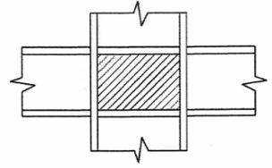

<strong>Hình 6.10 — Ô bản bụng giữa các bản cánh và sườn tăng cường</strong>

(7) Cần kiểm tra khả năng chống mất ổn định cắt của ô bản bụng theo 5 của EN 1993-1-5:2005:

$$V_{wp,Ed} < V_{wb,Rd} \qquad (6.9)$$
<!-- formula_id: "F_TCVN_9386_2025_FORMULA_6_9" -->

trong đó:

&nbsp;&nbsp;&nbsp;&nbsp;\- $V_{wb,Rd}$ là khả năng chống mất ổn định cắt của ô bản bụng.

### 6.6.4  Liên kết dầm - cột

(1) Nếu kết cấu được thiết kế để tiêu tán năng lượng trong dầm thì liên kết của dầm vào cột nên được thiết kế theo yêu cầu về mức vượt cường độ (xem 6.5.5) có tính đến khả năng chịu mô men $M_{pl,Rd}$ và lực cắt ($V_{G,Ed}$ + $V_{M,Ed}$) đã xác định trong 6.6.2.

(2) Cho phép sử dụng liên kết có khả năng tiêu tán năng lượng dạng nửa cứng và/hoặc dạng một phần cường độ nhưng phải kiểm tra các điều kiện sau:

a) \- Liên kết phải có khả năng xoay phù hợp với biến dạng tổng thể;

b) \- Các cấu kiện đi vào liên kết phải ổn định tại trạng thái cực hạn;

c) \- Ảnh hưởng biến dạng của liên kết đến chuyển vị ngang tổng thể được xét đến bằng phương pháp phân tích tĩnh phi tuyến tổng thể hoặc phương pháp phân tích phi tuyến theo thời gian.

(3) Thiết kế liên kết cần sao cho khả năng xoay của liên kết ở vùng khớp dẻo $\theta_{p}$ không nhỏ hơn 35 mrad đối với kết cấu thuộc DCH và 25 mrad cho kết cấu thuộc DCM (q > 2), góc xoay $\theta_{p}$ được xác định như sau:

$$\theta_p = \frac{\delta}{0,5L} \qquad (6.10)$$
<!-- formula_id: "F_TCVN_9386_2025_RID220" -->

trong đó (xem Hình 6.11):

δ là độ võng tại vị trí giữa nhịp dầm;

L là nhịp dầm

Với tất cả các vùng tiêu tán năng lượng, khả năng xoay của vùng khớp dẻo $\theta_{p}$ không được làm giảm cường độ và độ cứng quá 20 % khi chịu tác dụng của tải trọng có chu kỳ.

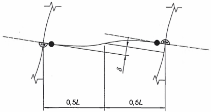

<strong>Hình 6.11 — Xác định θp theo độ võng của dầm</strong>

(4) Trong các thí nghiệm để đánh giá $\theta_{p}$ cường độ chịu cắt của bụng cột cần phù hợp với biểu thức (6.8) và biến dạng do lực cắt của bụng cột không được chiếm quá 30 % khả năng xoay của vùng khớp dẻo $\theta_{p}$.

(5) Không kể đến biến dạng đàn hồi trong cột khi xác định $\theta_{p}$.

(6) Khi sử dụng các liên kết có độ bền riêng, khả năng chịu lực của cột được xác định trên cơ sở độ bền dẻo của các liên kết.

### 6.7  Thiết kế và yêu cầu cấu tạo cho khung với hệ giằng đúng tâm

### 6.7.1  Tiêu chí thiết kế

(1) Khung với hệ giằng đúng tâm phải được thiết kế sao cho sự chảy dẻo trong các thanh chéo chịu kéo hình thành trước khi liên kết bị phá hoại và trước khi xảy ra sự chảy dẻo hoặc mất ổn định trong dầm hoặc cột.

(2) Các thanh chéo của hệ giằng phải được bố trí sao cho kết cấu có đặc trưng lực - chuyển vị như nhau tại mỗi tầng theo tất cả các hướng được giằng dưới tác dụng của tải trọng đổi chiều.

(3) Nhằm mục đích đó, điều kiện sau phải được thỏa mãn tại tất cả các cao trình tầng:

$$\frac{|A^+ - A^-|}{A^+ + A^-} \leq 0,05 \qquad (6.11)$$
<!-- formula_id: "F_TCVN_9386_2025_RID222" -->

trong đó:

&nbsp;&nbsp;&nbsp;&nbsp;\- $A^{+}$ và $A^{-}$ lần lượt là diện tích tiết diện ngang của các thanh chéo chịu kéo được chiếu lên mặt phẳng ngang, dưới các tác động động đất đổi chiều theo phương ngang (xem Hình 6.12).

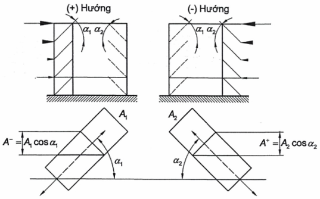

<strong>Hình 6.12 — Ví dụ khi áp dụng 6.7.1(3)</strong>

### 6.7.2  Phân tích kết cấu

(1) Chỉ có dầm và cột được xem như chịu tác dụng của tải trọng trọng trường, không xét đến các cấu kiện giằng.

(2) Khi phân tích đàn hồi hệ kết cấu chịu tác động động đất cần kể đến sự làm việc của các thanh chéo như sau:

&nbsp;&nbsp;\- Trong các khung có giằng chéo, chỉ xét đến các thanh giằng chéo chịu kéo;

&nbsp;&nbsp;\- Trong các khung giằng chữ V, cần xét đến cả các thanh giằng chéo chịu kéo và chịu nén.

(3) Trong tính toán mọi loại hệ giằng đúng tâm, cho phép kể đến sự làm việc của các thanh giằng chéo chịu kéo và chịu nén nếu thỏa mãn tất cả các điều kiện sau:

a) \- Sử dụng phương pháp phân tích tĩnh phi tuyến tổng thể hoặc phương pháp phân tích phi tuyến theo lịch sử thời gian.

b) \- Cả hai trạng thái trước và sau khi bị mất ổn định phải được xem xét khi lập mô hình cho sự ứng xử của các thanh chéo.

c) \- Phải có thông tin cần thiết để xây dựng mô hình mô tả sự làm việc của các thanh giằng chéo.

### 6.7.3  Thanh giằng chéo

(1) Trong các khung có hệ giằng chéo chữ X, độ mảnh không thứ nguyên $\bar{\lambda}$ (nêu trong EN 1993-1-1:2005) được giới hạn trong phạm vi: 1,3 < $\bar{\lambda}$ ≤ 2,0.

**CHÚ THÍCH:** Giá trị giới hạn 1,3 được chọn nhằm tránh cho cột bị quá tải ở trạng thái trước khi bị mất ổn định (khi cả thanh giằng chéo chịu kéo và chịu nén đều làm việc) vượt quá các nội lực thu được từ phép phân tích trạng thái tới hạn khi chỉ có thanh chéo chịu kéo làm việc.

(2) Trong khung có giằng chéo mà các thanh giằng không thuộc dạng giằng chữ X (xem Hình 6.12), độ mảnh không thứ nguyên $\bar{\lambda}$ được giới hạn trong phạm vi: $\bar{\lambda}$ ≤ 2,0.

(3) Trong khung có hệ giằng chữ V, độ mảnh không thứ nguyên $\bar{\lambda}$ được giới hạn trong phạm vi: $\bar{\lambda}$ ≤ 2,0.

(4) Trong kết cấu không quá 2 tầng, không cần giới hạn giá trị độ mảnh $\bar{\lambda}$ .

(5) Độ bền chảy $N_{pl,Rd}$ của tiết diện nguyên các thanh chéo phải có: $N_{pl,Rd}$ ≥ $N_{Ed}$.

(6) Trong khung có hệ giằng chữ V, các thanh chéo chịu nén phải được thiết kế theo khả năng chịu nén theo EN 1993.

(7) Liên kết giữa thanh chéo với các cấu kiện khác cũng phải phù hợp với các yêu cầu trong 6.5.5.

(8) Để mức độ ứng xử tiêu tán năng lượng của các thanh chéo là như nhau, cần khống chế sự gia tăng cường độ lớn nhất $\Omega_{i}$ (được xác định theo 6.7.4(1)) không được sai khác quá 25 % so với giá trị nhỏ nhất Ω.

(9) Các liên kết có độ bền riêng và/hoặc liên kết tiêu tán năng lượng dạng nửa cứng đều có thể chấp nhận được nếu thỏa mãn các điều kiện sau:

a) \- Độ giãn dài của liên kết phù hợp với biến dạng tổng thể của kết cấu;

b) \- Ảnh hưởng của biến dạng liên kết đến chuyển vị ngang tổng thể được kể đến bằng cách sử dụng phương pháp phân tích tĩnh phi tuyến tổng thể hoặc phương pháp phân tích phi tuyến theo thời gian.

### 6.7.4  Dầm và cột

(1) Dầm và cột chịu lực dọc cần thỏa mãn các yêu cầu về độ bền tối thiểu sau đây:

$$N_{pl,Rd} (M_{Ed}) \geq N_{Ed,G} + 1,1 \gamma_{ov} \Omega \cdot N_{Ed,E} \qquad (6.12)$$
<!-- formula_id: "F_TCVN_9386_2025_RID227" -->

trong đó:

&nbsp;&nbsp;&nbsp;&nbsp;\- $N_{pl,Rd}$ ($M_{Ed}$) là khả năng chống mất ổn định của dầm hoặc cột theo EN 1993, có tính đến sự tương tác giữa khả năng chống mất ổn định với mô men uốn $M_{Ed}$ được xác định trong tình huống thiết kế động đất;

&nbsp;&nbsp;&nbsp;&nbsp;\- $N_{Ed,G}$ là lực dọc trong dầm hoặc trong cột gây ra do các tác động không phải là tác động động đất trong tổ hợp tác động tác động dùng để thiết kế chịu động đất;

&nbsp;&nbsp;&nbsp;&nbsp;\- $N_{Ed,E}$ là lực dọc trong dầm hoặc trong cột do tác động động đất thiết kế gây ra;

&nbsp;&nbsp;&nbsp;&nbsp;\- $\gamma_{ov}$ là hệ số vượt cường độ (xem 6.1.3(2) và 6.2(3));

&nbsp;&nbsp;&nbsp;&nbsp;\- $\Omega$ là giá trị nhỏ nhất của $\Omega_{i}$ = $N_{pl,Rd,i}$/$N_{Ed,i}$ tính trên toàn bộ thanh giằng chéo; trong đó:

&nbsp;&nbsp;&nbsp;&nbsp;\- $N_{pl,Rd,i}$ là khả năng chịu lực thiết kế của thanh chéo thứ i;

&nbsp;&nbsp;&nbsp;&nbsp;\- $N_{Ed,i}$ là giá trị lực dọc thiết kế trong cùng thanh chéo thứ i khi thiết kế chịu động đất.

&nbsp;&nbsp;&nbsp;&nbsp;\- (2) Trong khung có hệ giằng chữ V, các dầm cần được thiết kế để chịu được:

&nbsp;&nbsp;&nbsp;&nbsp;\- Tất cả các tác động không phải tác động động đất (bỏ qua ảnh hưởng của các gối đỡ trung gian tạo bởi các thanh giằng);

&nbsp;&nbsp;&nbsp;&nbsp;\- Ảnh hưởng của tác động động đất theo phương đứng không cân bằng tác dụng lên dầm qua các thanh giằng khi thanh chéo chịu nén đã mất ổn định. Ảnh hưởng của tải trọng này được tính toán bằng cách dùng $N_{pl,Rd}$ cho giằng chịu kéo và $\gamma_{pb}$ $N_{pl,Rd}$ cho giằng chịu nén.

**CHÚ THÍCH:** $\gamma_{pb}$ là hệ số xét đến khả năng chịu lực sau khi mất ổn định của thanh chéo chịu nén, $\gamma_{pb}$ = 0,3.

(3) Trong khung có hệ giằng chéo mà các thanh chéo chịu nén và chịu kéo không giao nhau (ví dụ như các thanh chéo trong Hình 6.12), khi thiết kế cần tính đến lực kéo và nén phát triển trong các cột liền kề với thanh chéo chịu nén và tương ứng với những nội lực nén có giá trị bằng khả năng chống mất ổn định tính toán của các thanh chéo này.

### 6.8  Thiết kế và yêu cầu cấu tạo cho khung có hệ giằng lệch tâm

### 6.8.1  Tiêu chí thiết kế

(1) Khung có hệ giằng lệch tâm phải được thiết kế sao cho các cấu kiện hoặc các đoạn nối kháng chấn có khả năng tiêu tán năng lượng bằng sự hình thành cơ chế lực cắt dẻo và/hoặc cơ chế lực uốn dẻo.

(2) Hệ kết cấu phải được thiết kế sao cho toàn bộ các đoạn nối kháng chấn có ứng xử tiêu tán năng lượng như nhau.

**CHÚ THÍCH:** Các yêu cầu trên nhằm đảm bảo rằng, biến dạng dẻo (bao gồm cả ảnh hưởng của biến cứng trong các khớp dẻo hoặc ô bụng chịu cắt) sẽ xảy ra trong các đoạn nối kháng chấn trước khi có bất kỳ sự chảy dẻo hoặc phá hoại ở các vị trí khác.

(3) Các đoạn nối kháng chấn có thể là những thành phần ngang hoặc thẳng đứng (xem Hình 6.4).

### 6.8.2  Đoạn nối kháng chấn

(1) Bản bụng của đoạn nối kháng chấn phải là bản đơn mà không được gia cường bằng bản ốp ở hai bên và không có lỗ hay bị xuyên thủng.

(2) Các đoạn nối kháng chấn được phân làm 3 loại theo cơ chế phát triển dẻo:

&nbsp;&nbsp;\- Đoạn nối kháng chấn ngắn, là đoạn nối kháng chấn tiêu tán năng lượng chủ yếu bằng chảy dẻo do cắt;

&nbsp;&nbsp;\- Đoạn nối kháng chấn dài, là đoạn nối kháng chấn tiêu tán năng lượng chủ yếu bằng chảy dẻo chịu uốn;

&nbsp;&nbsp;\- Đoạn nối kháng chấn trung bình, là đoạn nối kháng chấn tiêu tán năng lượng mà cơ chế dẻo liên quan đến cả mô men uốn và lực cắt.

(3) Đối với tiết diện chữ I, các thông số sau đây được sử dụng để xác định khả năng chịu lực thiết kế và các giới hạn của phân loại:

<!-- DIAGRAM: word/media/image225.png -->

$$\begin{aligned} M_{p,link} &= f_y b t_f (d - t_f) \qquad (6.13) \\ V_{p,link} &= \frac{f_y}{\sqrt{3}} t_w (d - t_f) \qquad (6.14) \end{aligned}$$
<!-- formula_id: "F_TCVN_9386_2025_RID229" -->

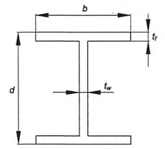

<strong>Hình 6.13 — Các ký hiệu đối với tiết diện nối chữ I</strong>

(4) Nếu $N_{Ed}$/$N_{pl,Rd}$ ≤ 0,15, khả năng chịu lực thiết kế của đoạn nối kháng chấn phải thỏa mãn cả 2 điều kiện sau ở hai đầu:

$$V_{Ed} \le V_{p,link} \qquad (6.15)$$
<!-- formula_id: "F_TCVN_9386_2025_FORMULA_6_15" -->

$$M_{Ed} \le M_{p,link} \qquad (6.16)$$
<!-- formula_id: "F_TCVN_9386_2025_FORMULA_6_16" -->

trong đó:

&nbsp;&nbsp;&nbsp;&nbsp;\- $N_{Ed}$, $M_{Ed}$, $V_{Ed}$ là các hệ quả tác động, lần lượt là lực dọc, mô men uốn và lực cắt tại hai đầu đoạn nối kháng chấn.

&nbsp;&nbsp;&nbsp;&nbsp;\- (5) Nếu $N_{Ed}$/$N_{Rd}$ > 0,15, phải thỏa mãn (6.15) và (6.16) với các giá trị $V_{p,link}$, $M_{p,link}$ được thay bằng giá trị chiết giảm $V_{p,link,r}$, $M_{p,link,r}$. Trong đó $V_{p,link,r}$, $M_{p,link,r}$ được xác định như sau:

$$\begin{aligned} V_{p,link,r} &= V_{p,link} \left[ 1 - \left( \frac{N_{Ed}}{N_{pl,Rd}} \right)^2 \right]^{0,5} \qquad (6.17) \\ M_{p,link,r} &= M_{p,link} \left[ 1 - \left( \frac{N_{Ed}}{N_{pl,Rd}} \right) \right] \qquad (6.18) \end{aligned}$$
<!-- formula_id: "F_TCVN_9386_2025_RID230" -->

&nbsp;&nbsp;&nbsp;&nbsp;\- (6) Nếu $N_{Ed}$ /$N_{Rd}$ ≥ 0,15, chiều dài đoạn nối kháng chấn e phải thỏa mãn:

$$e \le 1,6 \, M_{p,\text{link}} / V_{p,\text{link}} \quad \text{khi } R < 0,3 \qquad (6.19)$$
<!-- formula_id: "F_TCVN_9386_2025_RID231" -->

&nbsp;&nbsp;&nbsp;&nbsp;\- hoặc

$$e \le (1,15 - 0,5R) \cdot 1,6 \frac{M_{p,\text{link}}}{V_{p,\text{link}}} \text{ khi } R \ge 0,3 \qquad (6.20)$$
<!-- formula_id: "F_TCVN_9386_2025_RID232" -->

&nbsp;&nbsp;&nbsp;&nbsp;\- trong đó R = $N_{ed}t_{w}$ (d - 2$t_{f}$ )/($V_{Ed}$ A), với A là diện tích tiết diện nguyên của đoạn nối kháng chấn

&nbsp;&nbsp;&nbsp;&nbsp;\- (7) Để đạt được ứng xử tiêu tán năng lượng tổng thể của kết cấu, cần kiểm tra các giá trị $\Omega_{i}$ (được xác định theo 6.8.3(1)) không được sai khác quá 25 % so với giá trị Ω nhỏ nhất.

&nbsp;&nbsp;&nbsp;&nbsp;\- (8) Trong những trường hợp mà mô men ở hai đầu đoạn nối kháng chấn bằng nhau (xem Hình 6.14a), đoạn nối kháng chấn có thể được phân loại theo chiều dài e. Đối với tiết diện chữ I được phân loại như sau:

$$- đoạn nối kháng chấn ngắn: e < e_{s} = 1,6 M_{p,link} / V_{p,link} \qquad (6.21)$$
<!-- formula_id: "F_TCVN_9386_2025_FORMULA_6_21" -->

$$- đoạn nối kháng chấn dài: e > e_{L} = 3,0 M_{p,link} / V_{p,link} (6.22) \qquad (6.22)$$
<!-- formula_id: "F_TCVN_9386_2025_FORMULA_6_22" -->

$$- đoạn nối kháng chấn trung bình: e_{s} < e < e_{L} (6.23) \qquad (6.23)$$
<!-- formula_id: "F_TCVN_9386_2025_FORMULA_6_23" -->

&nbsp;&nbsp;&nbsp;&nbsp;\- (9) Khi thiết kế chỉ có một khớp dẻo có khả năng hình thành tại một đầu của đoạn nối kháng chấn (xem Hình 6.14b), giá trị của chiều dài e cho từng loại đoạn nối kháng chấn. Đối với tiết diện chữ I được phân loại như sau:

$$- đoạn nối kháng chấn ngắn: e < e_{s} = 0,8(1 + α) M_{p,link} / V_{p,link} (6.24) \qquad (6.24)$$
<!-- formula_id: "F_TCVN_9386_2025_FORMULA_6_24" -->

$$- đoạn nối kháng chấn dài: e > e_{L} = 1,5(1 + α) M_{p,link} / V_{p,link} (6.25) \qquad (6.25)$$
<!-- formula_id: "F_TCVN_9386_2025_FORMULA_6_25" -->

$$- đoạn nối kháng chấn trung bình: e_{s} < e < e_{L} \qquad (6.26)$$
<!-- formula_id: "F_TCVN_9386_2025_FORMULA_6_26" -->

trong đó: α là tỷ số giữa mô men uốn nhỏ hơn $M_{Ed,A}$ tại một đầu của đoạn nối kháng chấn và mô men uốn lớn hơn $M_{Ed,B}$ tại một đầu có khả năng hình thành khớp dẻo, cả hai giá trị mô men này đều lấy giá trị tuyệt đối.

| $\theta_p \text{ a)}$ | $b)$ |
| :--- | :--- |
| a) đoạn nối kháng chấn có momen ở hai đầu bằng nhau | b) đoạn nối kháng chấn có momen ở hai đầu khác nhau |

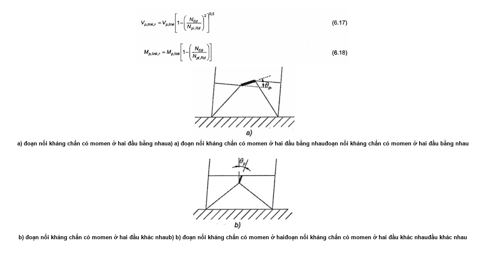

<strong>Hình 6.14 — Đoạn nối kháng chấn có momen ở hai đầu</strong>

(10) Góc xoay $\theta_{p}$ giữa đoạn nối kháng chấn và các cấu kiện khác (xem 6.6.4(3)) cần phù hợp với biến dạng tổng thể. Độ lớn của góc xoay này không được vượt quá các giá trị sau:

&nbsp;&nbsp;\- đoạn nối kháng chấn ngắn: $\theta_{p}$ = θ = 0,08 radian (6.27)

&nbsp;&nbsp;\- đoạn nối kháng chấn dài: $\theta_{p}$ = $\theta_{pR}$ = 0,02 radian (6.28)

&nbsp;&nbsp;\- đoạn nối kháng chấn trung bình: $\theta_{p}$ = $\theta_{pR}$ = giá trị được nội suy tuyến tính giữa hai giá trị trên (6.29)

(11) Sườn gia cường bản bụng phải bố trí cả 2 mặt bản bụng của đoạn nối kháng chấn tại 2 đầu thanh giằng chéo của đoạn nối kháng chấn. Các sườn gia cường liên kết với bản bụng phải có chiều rộng không nhỏ hơn ($b_{f}$ - 2$t_{w}$) và chiều dày không nhỏ hơn 0,75$t_{w}$ và nhỏ nhất phải bằng 10 mm.

(12) Các đoạn nối kháng chấn ngắn cần có các sườn gia cường trung gian của bản bụng như sau:

a) \- Đoạn nối kháng chấn cần có các sườn gia cường trung gian của bản bụng đặt cách nhau không quá (30$t_{w}$ - d/5) khi góc xoay của cấu kiện nối là 0,08 radian hoặc (52$t_{w}$ - d/5) khi góc xoay của cấu kiện là 0,02 radian hoặc nhỏ hơn. Với các giá trị giữa 0,08 radian và 0,02 radian thì nội suy tuyến tính;

b) \- Đoạn nối kháng chấn dài cần có 1 sườn gia cường trung gian của bản bụng đặt với khoảng cách bằng 1,5 lần b, tính từ mỗi đầu của đoạn nối kháng chấn nơi có thể hình thành khớp dẻo;

c) \- Đoạn nối kháng chấn trung bình cần có các sườn gia cường trung gian của bản bụng thỏa mãn các yêu cầu trong a) và b) ở trên;

d) \- Không cần sử dụng sườn gia cường trung gian của bản bụng trong các đoạn nối kháng chấn có chiều dài lớn hơn 5$M_{p}$/$V_{p}$;

e) \- Sườn gia cường trung gian của bản bụng cần có chiều dài bằng chiều cao bản bụng. Đối với các đoạn nối kháng chấn có chiều cao tiết diện dưới 600 mm chỉ cần sườn gia cường một phía bản bụng của đoạn nối kháng chấn. Chiều dày sườn gia cường này không được nhỏ hơn $t_{w}$ và nhỏ nhất phải bằng 10 mm và chiều rộng không được nhỏ hơn (b/2) - $t_{w}$. Đối với các đoạn nối kháng chấn có chiều cao tiết diện từ 600 mm trở lên, cần dùng sườn gia cường như trên cho cả 2 mặt bản bụng.

(13) Đường hàn góc liên kết sườn gia cường với bản bụng của đoạn nối kháng chấn phải có cường độ đủ lớn để chịu được một lực bằng $\gamma_{ov}f_{y}A_{st}$, trong đó $A_{st}$ là diện tích tiết diện sườn gia cường. Cường độ thiết kế của đường hàn góc nối sườn gia cường với bản cánh phải đủ chịu được lực $\gamma_{ov}A_{st}f_{y}$/4.

(14) Các gối đỡ bên phải có ở cả cánh trên và cánh dưới ở hai đầu của đoạn nối kháng chấn. Các gối đỡ bên ở hai đầu đoạn nối kháng chấn phải có khả năng chịu lực dọc trục thiết kế đủ lớn để tiếp nhận lực bằng 6 % khả năng chịu lực dọc trục danh nghĩa của bản cánh, bằng $f_{y}bt_{f}$.

(15) Trong các dầm có đoạn nối kháng chấn, khả năng chịu mất ổn định do cắt của ô bản bụng bên ngoài của đoạn nối kháng chấn cần được kiểm tra theo Điều 5 của EN 1993-1-5:2006.

### 6.8.3  Cấu kiện không có đoạn nối kháng chấn

(1) Các cấu kiện không có đoạn nối kháng chấn, như cột và các thanh chéo (khi sử dụng đoạn nối kháng chấn ngang trong dầm) và dầm (khi sử dụng đoạn nối kháng chấn thẳng đứng), cần được kiểm tra chịu nén với tổ hợp bất lợi nhất của lực dọc và mô men uốn:

$$N_{Rd} (M_{Ed}, V_{Ed}) \geq N_{Ed,G} + 1,1 \gamma_{ov} \Omega N_{Ed,E} \qquad (6.30)$$
<!-- formula_id: "F_TCVN_9386_2025_RID235" -->

trong đó:

&nbsp;&nbsp;&nbsp;&nbsp;\- $N_{Rd}$ ($M_{Ed}$, $V_{Ed}$) là khả năng chịu lực dọc thiết kế của cột hoặc thanh chéo theo EN 1993, có tính đến tương tác với mô men uốn $M_{Ed}$ và lực cắt $V_{Ed}$ được lấy ở giá trị thiết kế trong trạng thái động đất;

&nbsp;&nbsp;&nbsp;&nbsp;\- $N_{Ed,G}$ là lực nén trong cột hoặc trong thanh chéo do các tác động không phải tác động động đất gây ra trong tổ hợp tác động dùng để thiết kế chịu động đất;

&nbsp;&nbsp;&nbsp;&nbsp;\- $N_{Ed,E}$ là lực nén trong cột hoặc trong thanh chéo do tác động động đất tính toán gây ra;

&nbsp;&nbsp;&nbsp;&nbsp;\- $\gamma_{ov}$ là hệ số vượt cường độ (xem 6.1.3(2) và 6.2(3))

&nbsp;&nbsp;&nbsp;&nbsp;\- $\Omega$ là hệ số nhân, lấy giá trị nhỏ nhất trong số các giá trị sau:

&nbsp;&nbsp;&nbsp;&nbsp;\- $\Omega_{i}$ = 1,5$V_{p,link,i}$/$V_{Ed,i}$ của tất cả các đoạn nối kháng chấn ngắn;

&nbsp;&nbsp;&nbsp;&nbsp;\- $\Omega_{i}$ = 1,5$M_{p,link,i}$/$M_{Ed,i}$ của tất cả các đoạn nối kháng chấn trung bình và đoạn nối kháng chấn dài; trong đó:

&nbsp;&nbsp;&nbsp;&nbsp;\- $V_{Ed,i}$, $M_{Ed,i}$ là giá trị thiết kế của lực cắt và mô men uốn trong đoạn nối kháng chấn thứ i;

&nbsp;&nbsp;&nbsp;&nbsp;\- $V_{p,link,i}$, $M_{p,link,i}$ là độ bền cắt và uốn thiết kế khi uốn của đoạn nối kháng chấn thứ i như trong 6.8.2(3).

### 6.8.4  Liên kết của các đoạn nối kháng chấn

(1) Nếu kết cấu được thiết kế để tiêu tán năng lượng trong các đoạn nối kháng chấn thì liên kết giữa các đoạn nối kháng chấn hoặc giữa các cấu kiện có đoạn nối kháng chấn phải thiết kế chịu được hệ quả tác động $E_{d}$. Giá trị $E_{d}$ được xác định như sau:

$$E_d \geq E_{d,G} + 1,1 \gamma_{ov} \Omega_i E_{d,E} \qquad (6.31)$$
<!-- formula_id: "F_TCVN_9386_2025_RID236" -->

trong đó:

&nbsp;&nbsp;&nbsp;&nbsp;\- $E_{d,G}$ là hệ quả tác động trong liên kết, ảnh hưởng này được gây ra bởi các loại tải trọng không phải tác động động đất trong tổ hợp tác động khi thiết kế chống động đất;

&nbsp;&nbsp;&nbsp;&nbsp;\- $E_{d,E}$ là hệ quả tác động trong liên kết gây ra bởi tác động động đất thiết kế;

&nbsp;&nbsp;&nbsp;&nbsp;\- $\gamma_{ov}$ là hệ số vượt cường độ (xem 6.1.3(2) và 6.2(3))

&nbsp;&nbsp;&nbsp;&nbsp;\- $\Omega_{i}$ là hệ số vượt cường độ cho các liên kết được tính theo 6.8.3.

&nbsp;&nbsp;&nbsp;&nbsp;\- (2) Trong trường hợp các liên kết có dạng nửa cứng và/hoặc có độ bền riêng, sự tiêu tán năng lượng có thể giả thiết chỉ được phát sinh từ bản thân các liên kết. Giả thiết này có thể chấp nhận được nếu tất cả các điều kiện sau đều được thỏa mãn:

a) \- Các liên kết phải có khả năng xoay đủ lớn phù hợp với biến dạng tổng thể;

b) \- Các cấu kiện gắn với liên kết vẫn là ổn định trong trạng thái cực hạn;

c) \- Có xét ảnh hưởng của biến dạng liên kết đến độ trượt tổng thể.

(3) Khi liên kết có độ bền riêng được sử dụng cho đoạn nối kháng chấn thì việc thiết kế theo khả năng của các cấu kiện khác trong kết cấu phải được xuất phát từ độ bền dẻo của các đoạn nối kháng chấn.

### 6.9  Yêu cầu thiết kế cho kết cấu kiểu con lắc ngược

(1) Đối với kết cấu kiểu con lắc ngược (như định nghĩa trong 6.3.1d), cột phải được kiểm tra chịu nén với tổ hợp bất lợi nhất của lực dọc và các mô men uốn.

(2) Khi kiểm tra, $N_{Ed}$, $M_{Ed}$, $V_{Ed}$ được xác định theo 6.6.3.

(3) Độ mảnh không thứ nguyên của cột phải được giới hạn là $\bar{\lambda}$ ≤ 1,5.

(4) Hệ số độ nhạy θ của chuyển vị ngang tương đối (nêu trong 4.4.2.2) nên lấy ≤ 0.2.

### 6.10  Yêu cầu thiết kế đối với kết cấu thép có lõi bê tông hoặc tường bê tông và đối với khung chịu mô men kết hợp với hệ giằng đúng tâm hoặc tường chèn

### 6.10.1  Kết cấu có lõi bê tông hoặc tường bê tông

(1) Cấu kiện thép cần được kiểm tra theo Điều 6 của tiêu chuẩn này và EN 1993. Cấu kiện bê tông được thiết kế theo Điều 5 của tiêu chuẩn này.

(2) Cấu kiện liên hợp thép - bê tông cần được kiểm tra theo Điều 7 của tiêu chuẩn này.

### 6.10.2  Khung chịu mô men kết hợp với hệ giằng đúng tâm

(1) Kết cấu kết hợp giữa khung chịu mô men và khung có hệ giằng làm việc trong cùng hướng phải sử dụng cùng một hệ số riêng q. Lực ngang phải được phân phối giữa các khung khác nhau theo độ cứng đàn hồi của chúng.

(2) Khung chịu mô men và khung có giằng cần phù hợp với 6.6, 6.7 và 6.8.

### 6.10.3  Khung chịu mô men kết hợp với tường chèn

(1) Khung chịu mô men có tường chèn bê tông cốt thép liên kết chắc chắn vào kết cấu thép được thiết kế theo Điều 7 của tiêu chuẩn này.

(2) Khung chịu mô men có tường chèn không được liên kết chắc chắn với khung thép tại mặt trên cùng và mặt bên thì cần được thiết kế như kết cấu thép.

(3) Khung chịu mô men có tường chèn tiếp giáp với khung thép nhưng không được liên kết chắc chắn thì phải thỏa mãn các yêu cầu sau:

a) \- Tường chèn cần được phân bố đều theo mặt đứng nhằm không làm tăng độ dẻo cục bộ trong các cấu kiện khung. Nếu điều này không đảm bảo thì công trình cần được xem như có hình dạng không đều theo mặt đứng;

b) \- Cần xét đến sự tương tác của tường chèn trong khung, cần tính đến các nội lực trong các dầm và trong các cột do tác động của các thanh giằng chéo trong tường chèn gây ra. Có thể sử dụng các yêu cầu trong 5.9 để làm việc này.

c) \- Khung thép cần kiểm tra theo các yêu cầu trong mục này, còn tường chèn khối xây hoặc bê tông cốt thép được thiết kế theo Điều 5 hoặc Điều 9 của tiêu chuẩn này.

### 6.11  Quản lý thiết kế và thi công

(1) Việc quản lý thiết kế và thi công phải đảm bảo công trình được xây dựng đúng như thiết kế.

(2) Với mục đích này, ngoài các điều khoản trong EN 1993 cần thỏa mãn các yêu cầu sau:

a) \- Bản vẽ chế tạo và lắp dựng cần chỉ dẫn rõ các chi tiết liên kết, kích thước, chất lượng bulông và mối hàn cũng như mác thép của cấu kiện. Trên bản vẽ cần ghi chú giá trị ứng suất chảy lớn nhất cho phép $f_{y,max}$ của thép dùng trong các vùng tiêu tán năng lượng;

b) \- Đặc trưng vật liệu cần kiểm tra phù hợp với 6.2;

c) \- Việc kiểm soát độ xiết chặt của bulông và chất lượng mối hàn cần phù hợp với các yêu cầu trong EN 1090-2;

d) \- Trong suốt quá trình thi công cần đảm bảo ứng suất chảy của thép sử dụng thực tế không vượt quá 1,1 lần giá trị $f_{y,max}$ được ghi chú trong bản vẽ cho các vùng tiêu tán năng lượng.

(3) Khi một trong các điều kiện trên không thỏa mãn, cần điều chỉnh hoặc sửa chữa nhằm đáp ứng các yêu cầu của tiêu chuẩn này và đảm bảo tính an toàn cho công trình.

## 7  YÊU CẦU RIÊNG CHO KẾT CẤU LIÊN HỢP THÉP - BÊ TÔNG

### 7.1  Yêu cầu chung

### 7.1.1  Phạm vi áp dụng

(1) Khi thiết kế kết cấu nhà liên hợp thép - bê tông cần áp dụng EN 1994-1-1:2004 và các yêu cầu bổ sung dưới đây.

(2) Ngoại trừ các yêu cầu được điều chỉnh trong Điều này thì vẫn áp dụng các yêu cầu trong Điều 5 và Điều 6 của tiêu chuẩn này.

### 7.1.2  Quan niệm thiết kế

(1) Nhà liên hợp thép - bê tông chịu động đất phải được thiết kế theo một trong ba quan niệm sau:

a) \- Kết cấu có khả năng tiêu tán năng lượng thấp (quan niệm a);

b) \- Kết cấu có khả năng tiêu tán năng lượng mà vùng tiêu tán năng lượng ở phần kết cấu liên hợp (quan niệm b);

c) \- Kết cấu có khả năng tiêu tán năng lượng mà vùng tiêu tán năng lượng ở phần kết cấu thép (quan niệm c).

### Bảng 7.1 - Các quan niệm thiết kế, cấp độ dẻo và giới hạn trên của giá trị tham chiếu của hệ số ứng xử

| Quan niệm thiết kế | Cấp độ dẻo | Phạm vi của giá trị tham chiếu của hệ số ứng xử q |
| :--- | :--- | :--- |
| Quan niệm a) | DCL (Thấp) | ≤ 1,5 đến 2 |
| Quan niệm b) hoặc c) | DCM (Trung bình) | ≤ 4 và không vượt quá các giá trị giới hạn trong Bảng 7.2 |
| Quan niệm b) hoặc c) | DCH (Cao) | lấy theo các giá trị giới hạn trong Bảng 7.2 |

(2) Theo quan niệm a), hệ quả tác động có thể được tính toán trên cơ sở phân tích đàn hồi tổng thể mà không xét đến ứng xử phi tuyến của vật liệu nhưng có xét đến sự giảm mô men quán tính do bê tông bị nứt trên một phần của nhịp dầm theo các yêu cầu chung trong 7.4 và các yêu cầu cấu tạo trong 7.7 đến 7.11. Khi sử dụng phổ thiết kế (nêu trong 3.2.2.5) thì giá trị giới hạn trên của hệ số ứng xử q được lấy trong khoảng từ 1,5 đến 2. Trong trường hợp công trình có hình dạng không đều theo mặt đứng thì giá trị giới hạn trên của hệ số ứng xử q phải được nhân với hệ số 0,8 như chỉ dẫn trong 4.2.3.1(7) nhưng không được lấy nhỏ hơn 1,5.

(3) Theo quan niệm a, khả năng chịu lực của cấu kiện và của các liên kết cần được tính toán theo EN 1993 và EN 1994 mà không cần bổ sung thêm các yêu cầu khác. Đối với những nhà không được cách chấn đáy (xem Điều 10) việc thiết kế theo quan niệm a được khuyến nghị chỉ dùng cho trường hợp động đất yếu (xem 3.2.1(4)).

(4) Theo quan niệm b) và c), khả năng chịu lực của kết cấu (trong các vùng tiêu tán năng lượng) dưới tác dụng của tác động động đất phải tính đến sự làm việc ngoài giới hạn đàn hồi. Đối với kết cấu có khả năng tiêu tán năng lượng, khi sử dụng phổ thiết kế nêu trong 3.2.2.5, giá trị của hệ số ứng xử q được lấy lớn hơn giá trị giới hạn trên nêu trong Bảng 7.1, phụ thuộc vào cấp độ dẻo và dạng kết cấu (xem 7.3). Khi chọn quan niệm b) hoặc c) để thiết kế thì phải phù hợp với các yêu cầu từ 7.2 đến 7.12.

(5) Theo quan niệm c), kết cấu không được tận dụng sự làm việc liên hợp của thép - bê tông trong vùng tiêu tán năng lượng. Để áp dụng quan niệm c) phải đáp ứng chặt chẽ các biện pháp nhằm ngăn cản sự tham gia của bê tông vào độ bền của vùng tiêu tán năng lượng. Cũng theo quan niệm này, đối với kết cấu liên hợp thép - bê tông, khi chịu tác động động đất thì thiết kế theo các yêu cầu trong Điều 6, khi không chịu tác động động đất thì thiết kế theo EN 1994-1-1:2004. Các biện pháp ngăn ngừa sự tham gia của phần bê tông được nêu trong 7.7.5.

(6) Các yêu cầu thiết kế cho kết cấu liên hợp có khả năng tiêu tán năng lượng (theo quan niệm b), là nhằm phát triển cơ chế dẻo cục bộ (vùng tiêu tán năng lượng) và của cơ chế dẻo tổng thể sao cho dưới tác động của động đất, khả năng tiêu tán năng lượng càng nhiều càng tốt. Tùy theo loại cấu kiện hoặc dạng kết cấu được xem xét trong Điều này, những yêu cầu bảo đảm đạt được mục đích thiết kế chung được nêu trong 7.5 đến 7.11 có tham khảo những tiêu chí riêng. Những tiêu chí này nhằm phát triển ứng xử cơ học tổng thể mà những điều khoản thiết kế có thể đưa ra cho nó.

(7) Khi thiết kế theo quan niệm b, kết cấu phải thuộc DCM hoặc DCH. Các cấp độ dẻo này tương ứng với sự tăng khả năng tiêu tán năng lượng của kết cấu theo cơ chế dẻo. Mỗi cấu kiện thuộc một cấp độ dẻo nhất định phải thỏa mãn các yêu cầu riêng về một hay nhiều phương diện sau đây: loại tiết diện thép, khả năng xoay của liên kết và các chi tiết cấu tạo.

### 7.1.3  Kiểm tra độ an toàn

(1) Áp dụng 5.2.4(1) và 6.1.3(1).

(2) Áp dụng 5.2.4(2).

(3) Áp dụng 5.2.4(3).

(4) Khi kiểm tra khả năng chịu lực có liên quan tới cấu kiện thép, áp dụng 6.1.3(2).

### 7.2  Vật liệu

### 7.2.1  Bê tông

(1) Trong các vùng tiêu tán năng lượng, cấp cường độ của bê tông không thấp hơn C20/25. Nếu cấp cường độ của bê tông cao hơn C40/50 thì việc thiết kế không thuộc phạm vi của Tiêu chuẩn này.

### 7.2.2  Cốt thép trong bê tông

(1) Đối với kết cấu thuộc DCM, cốt thép được xét để tính độ bền dẻo trong vùng tiêu tán năng lượng phải thuộc loại B hoặc C (theo Bảng C.1 trong EN 1992-1-1:2004). Đối với kết cấu thuộc DCH, cốt thép được xét để tính độ bền dẻo trong vùng tiêu tán năng lượng phải thuộc loại C.

(2) Cốt thép thuộc loại B hoặc C phải được sử dụng cho các vùng có ứng suất lớn của kết cấu không tiêu tán năng lượng. Yêu cầu này áp dụng cho cả thép thanh và lưới thép hàn.

(3) Ngoại trừ thép đai, chỉ dùng các thanh thép có gờ làm cốt trong vùng có ứng suất lớn.

(4) Lưới thép hàn không thỏa mãn các yêu cầu về độ bền dẻo (1) của điều này thì không nên sử dụng trong vùng tiêu tán năng lượng. Nếu vẫn sử dụng lưới thép hàn đó thì phải đặt các cốt thép dẻo cùng với lưới thép hàn và khả năng chịu lực của các cốt này được tính đến khi phân tích khả năng chịu lực của kết cấu.

### 7.2.3  Kết cấu thép

(1) Phù hợp với các yêu cầu trong 6.2.

### 7.3  Dạng kết cấu và hệ số ứng xử

### 7.3.1  Dạng kết cấu

(1) Mỗi kết cấu liên hợp thép - bê tông phải được xếp loại theo một trong các dạng kết cấu sau, tùy theo mức độ ứng xử của kết cấu chịu lực chính dưới tác dụng động đất.

a) \- Khung liên hợp chịu mô men, được định nghĩa trong 6.3.1(1)a, nhưng dầm và cột có thể là kết cấu thép hoặc kết cấu liên hợp (xem Hình 6.1);

b) \- Khung liên hợp với hệ giằng đúng tâm, được định nghĩa trong 6.3.1(1)b (xem Hình 6.2 và Hình 6.3), cột và dầm có thể là thép hoặc kết cấu liên hợp thép - bê tông. Hệ giằng phải bằng thép;

c) \- Khung liên hợp với hệ giằng lệch tâm, được định nghĩa trong 6.3.1(1)c (xem Hình 6.4), các cấu kiện không có đoạn nối lệch tâm có thể bằng thép hoặc kết cấu liên hợp thép - bê tông. Ngoại trừ bản sàn, đoạn nối lệch tâm phải bằng thép. Tiêu tán năng lượng chỉ được xảy ra thông qua sự chảy của đoạn nối lệch tâm do mô men uốn và lực cắt;

d) \- Kết cấu có con lắc ngược, được định nghĩa trong 6.3.1(1)d (xem Hình 6.5);

e) \- Hệ kết cấu liên hợp là hệ kết cấu làm việc chủ yếu như tường bê tông cốt thép. Hệ liên hợp này có thể thuộc một trong các dạng sau:

Dạng 1: hệ kết cấu có khung thép hoặc khung liên hợp thép - bê tông làm việc đồng thời với tường chèn bằng bê tông (xem Hình 7.1a).

Dạng 2: hệ kết cấu có tường bê tông cốt thép liên kết với các cột thép đặt ở hai biên đứng của tường (xem Hình 7.1b);

Dạng 3: hệ kết cấu sử dụng các dầm thép hoặc dầm liên hợp thép - bê tông để liên kết hai hay nhiều tường bê tông hoặc tường liên hợp bê tông - thép (xem Hình 7.2);

f) \- Tường liên hợp chịu cắt dạng tấm thép bọc bê tông là hệ kết cấu gồm một tường thép thẳng đứng liên tục suốt chiều cao công trình được bao bọc bằng bê tông cốt thép ở một hoặc hai mặt của tường thép và các cấu kiện biên của tấm tường ấy bằng thép hoặc liên hợp.

| a) Dạng 1 - Khung thép hoặc khung liên hợp chịu uốn có ô chèn bằng bê tông | b) Dạng 2 - Tường liên hợp được gia cường bằng các thanh thép thẳng đứng ở mỗi biên |
| :--- | :--- |

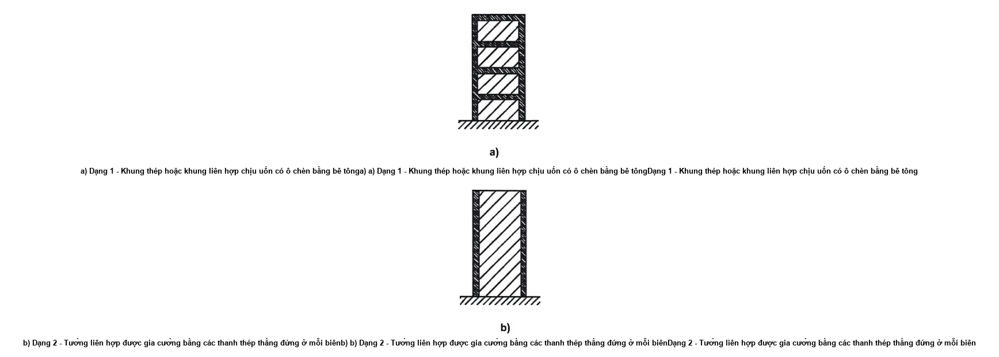

<strong>Hình 7.1 — Hệ kết cấu liên hợp - tường liên hợp</strong>

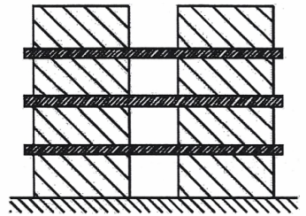

<strong>Hình 7.2 — Hệ kết cấu liên hợp. Dạng 3 - Tường liên hợp hoặc tường bê tông được liên kết bằng các dầm thép hoặc các dầm liên hợp</strong>

(2) Ở tất cả các dạng kết cấu liên hợp, sự tiêu tán năng lượng xảy ra trong cột thép thẳng đứng và trong cốt thép dọc của tường. Đối với dạng 3, sự tiêu tán năng lượng cũng có thể xảy ra trong các dầm liên kết;

(3) Đối với hệ kết cấu liên hợp mà tường không được liên kết với kết cấu thép thì áp dụng các yêu cầu trong Điều 5 và Điều 6 của tiêu chuẩn này.

### 7.3.2  Hệ số ứng xử

(1) Hệ số ứng xử q, như đã nói trong 3.2.2.5, xét đến khả năng tiêu tán năng lượng của kết cấu. Đối với hệ kết cấu đều đặn, hệ số ứng xử q được lấy theo giới hạn trên của giá trị tham chiếu, được nêu trong Bảng 6.2 hoặc 7.2, với điều kiện phải thỏa mãn các yêu cầu nêu trong 7.5 đến 7.11.

### Bảng 7.2 - Giới hạn trên của giá trị tham chiếu của hệ số ứng xử cho hệ kết cấu có tính chất đều đặn theo mặt đứng

| Dạng kết cấu | Cấp độ dẻo — DCM | Cấp độ dẻo — DCH |
| :--- | :--- | :--- |
| a), b), c) và d) | xem Bảng 6.2 | xem Bảng 6.2 |
| e) Kết cấu liên hợp |  |  |
| &nbsp;&nbsp;\- Tường liên hợp (dạng 1 và dạng 2) | 3 $\alpha_{u}$/$\alpha_{1}$ | 4 $\alpha_{u}$/$\alpha_{1}$ |
| &nbsp;&nbsp;\- Tường liên hợp hoặc tường bê tông được liên kết bằng các dầm thép hoặc các dầm liên hợp (dạng 3) | 3 $\alpha_{u}$/$\alpha_{1}$ | 4,5 $\alpha_{u}$/$\alpha_{1}$ |
| f) Vách cứng liên hợp dạng tấm thép bọc bê tông | 3 $\alpha_{u}$/$\alpha_{1}$ | 4 $\alpha_{u}$/$\alpha_{1}$ |

(2) Nếu nhà có tính chất không đều đặn theo mặt đứng (xem 4.2.9.3) thì giá trị của q trong Bảng 6.2 và Bảng 7.2 cần giảm đi 20 %.

(3) Đối với nhà có tính chất đều đặn trong mặt bằng, nếu không tính toán để xác định tỷ số $\alpha_{u}$/$\alpha_{1}$ thì có thể lấy giá trị mặc định gần đúng của tỷ số $\alpha_{u}$/$\alpha_{1}$ nêu trong các hình từ Hình 6.1 đến Hình 6.4. Đối với hệ kết cấu liên hợp dạng e thì giá trị mặc định $\alpha_{u}$/$\alpha_{1}$ = 1,1, hệ kết cấu liên hợp dạng f) thì giá trị mặc định $\alpha_{u}$/$\alpha_{1}$ = 1,2.

(4) Đối với nhà có tính chất không đều trên mặt bằng (xem 4.2.3.2), nếu không xác định tỷ số $\alpha_{u}$/$\alpha_{1}$ thì có thể sử dụng giá trị gần đúng của tỷ số này bằng số trung bình giữa 1,0 và giá trị yêu cầu trong (3) của điều này.

(5) Cho phép dùng giá trị của $\alpha_{u}$/$\alpha_{1}$ cao hơn các giá trị đã xác định trong (3) và (4) của điều này với điều kiện phải tính toán $\alpha_{u}$/$\alpha_{1}$ theo phương pháp phân tích tĩnh phi tuyến tổng thể.

(6) Giá trị lớn nhất của $\alpha_{u}$/$\alpha_{1}$ được sử dụng trong thiết kế là bằng 1,6 kể cả khi sử dụng phương pháp phân tĩnh phi tuyến tổng thể dẫn đến các giá trị có khả năng cao hơn.

### 7.4  Phân tích kết cấu

### 7.4.1  Phạm vi

(1) Các yêu cầu sau đây áp dụng cho sự phân tích kết cấu dưới tác dụng của tác động động đất theo phương pháp phân tích lực ngang và phương pháp phân tích phổ phản ứng.

### 7.4.2  Độ cứng của tiết diện

(1) Độ cứng của tiết diện liên hợp mà trong đó bê tông chịu lực nén được tính toán bằng cách sử dụng hệ số mô đun n:

$$n = E_{a} / E_{cm} = 7 \qquad (7.1)$$
<!-- formula_id: "F_TCVN_9386_2025_FORMULA_7_1" -->

(2) Đối với dầm liên hợp với bản sàn chịu nén, mô men quán tính của diện tích tiết diện được tính toán có kể đến chiều rộng hữu hiệu của bản sàn nêu trong 7.6.3.

(3) Độ cứng của tiết diện liên hợp mà trong đó bê tông chịu kéo được tính toán với giả thiết là bê tông bị nứt và chỉ có thép làm việc.

(4) Đối với dầm liên hợp với bản sàn chịu kéo, mô men quán tính của diện tích tiết diện được tính toán có kể đến chiều rộng hữu hiệu của bản sàn được xác định theo 7.6.3.

(5) Khi phân tích kết cấu cần tính đến sự làm việc của bê tông chịu nén tại một số vùng và bê tông chịu kéo tại một số vùng khác; sự phân bố của các vùng tương ứng với các dạng kết cấu khác nhau được nêu trong 7.7 đến 7.11.

### 7.5  Tiêu chí thiết kế và yêu cầu cấu tạo cho mọi loại kết cấu có khả năng tiêu tán năng lượng

### 7.5.1  Yêu cầu chung

(1) Các tiêu chí thiết kế trong 7.5.2 được áp dụng cho các bộ phận của kết cấu chịu tác dụng động đất, được thiết kế theo quan niệm kết cấu có khả năng tiêu tán năng lượng.

(2) Các tiêu chí thiết kế trong 7.5.2 có thể coi là thỏa mãn nếu phù hợp với các yêu cầu cấu tạo nêu trong 7.5.3, 7.5.4 và 7.6 đến 7.11.

### 7.5.2  Tiêu chí thiết kế đối với kết cấu có khả năng tiêu tán năng lượng

(1) Kết cấu có vùng tiêu tán năng lượng phải được thiết kế sao cho sự chảy dẻo của vật liệu, sự mất ổn định cục bộ hoặc các hiện tượng khác gây ra bởi sự ứng xử trễ của các vùng này không ảnh hưởng đến tính ổn định tổng thể của kết cấu.

**CHÚ THÍCH:** Hệ số q nêu trong Bảng 7.2 được xem là đã phù hợp với yêu cầu này (xem 2.2.2(2)).

(2) Các vùng tiêu tán năng lượng phải có độ dẻo và độ bền thích hợp. Độ bền phải được kiểm tra theo EN 1993 và Điều 6 đối với quan niệm c) (xem 7.1.2) và theo EN 1994-1-1:2004 và Điều 7 đối với quan niệm b) (xem 7.1.2).

(3) Các vùng tiêu tán năng lượng có thể được đặt trong các cấu kiện chịu lực hoặc trong các liên kết.

(4) Nếu các vùng tiêu tán năng lượng được đặt trong các cấu kiện chịu lực thì các bộ phận không tiêu tán năng lượng và các liên kết của các bộ phận tiêu tán năng lượng với phần còn lại của kết cấu phải có độ bền dư đủ để cho biến dạng dẻo theo chu kỳ phát triển trong các vùng tiêu tán năng lượng.

(5) Khi các vùng tiêu tán năng lượng được đặt trong liên kết thì các cấu kiện được liên kết với nhau phải có độ bền dư đủ để cho phép sự chảy theo chu kỳ phát triển trong liên kết.

### 7.5.3  Độ bền dẻo của các vùng tiêu tán năng lượng

(1) Khi thiết kế kết cấu liên hợp thép - bê tông, có hai loại độ bền dẻo được xét cho vùng tiêu tán năng lượng là: độ bền dẻo giới hạn dưới (chỉ số: pl, Rd) và độ bền dẻo giới hạn trên (chỉ số: U, Rd).

(2) Cận dưới của độ bền dẻo của vùng tiêu tán năng lượng là độ bền được xét đến khi kiểm tra thiết kế tại các tiết diện của cấu kiện có khả năng tiêu tán năng lượng; ví dụ $M_{Ed}$ < $M_{pl,Rd}$. Độ bền dẻo giới hạn dưới của vùng tiêu tán năng lượng được tính toán có xét đến phần bê tông của tiết diện và chỉ xét đến các phần thép thuộc loại có tính dẻo của tiết diện.

(3) Cận trên của độ bền dẻo của vùng tiêu tán năng lượng là độ bền được xét đến khi thiết kế theo khả năng của các cấu kiện liền kề với vùng tiêu tán năng lượng: ví dụ trong trường hợp kiểm tra thiết kế theo khả năng theo 4.4.2.3(4), các giá trị thiết kế của khả năng chịu mô men của dầm là độ bền dẻo cận trên $M_{U,Rd,b}$, trong khi độ bền dẻo của cột là độ bền dẻo cận dưới $M_{pl,Rd,c}$.

(4) Khi xác định cận trên của độ bền dẻo cần xét đến phần bê tông trong tiết diện và tất cả các phần thép có trong tiết diện, bao gồm cả các phần không phải thuộc loại có tính dẻo.

(5) Các ảnh hưởng của tác động liên quan trực tiếp đến khả năng chịu lực của vùng tiêu tán năng lượng phải được xác định trên cơ sở giá trị cận trên của độ bền dẻo của tiết diện liên hợp có khả năng tiêu tán năng lượng; ví dụ: khả năng chịu cắt tại đầu dầm liên hợp có khả năng tiêu tán năng lượng được quyết định bởi cận trên của mô men dẻo của tiết diện liên hợp.

### 7.5.4  Yêu cầu cấu tạo cho liên kết liên hợp trong vùng tiêu tán năng lượng

(1) Khi thiết kế phải hạn chế vùng biến dạng dẻo, vùng ứng suất dư lớn và tránh được những khuyết tật do chế tạo.

(2) Phải đảm bảo tính nguyên vẹn của phần bê tông ở vùng chịu nén trong suốt quá trình chịu động đất và chỉ có tiết diện thép mới chảy dẻo.

(3) Sự chảy dẻo của cốt thép bản sàn chỉ được cho phép khi dầm được thiết kế theo 7.6.2(8).

(4) Việc thiết kế liên kết hàn và bu lông được áp dụng theo 6.5.

(5) Cốt thép trong bê tông của vùng liên kết phải được xác định theo các mô hình cân bằng (ví dụ Phụ lục C đối với bản sàn).

(6) Áp dụng 6.5.5(6), 6.5.5(7).

(7) Đối với các ô bản bụng được bọc bê tông của liên kết cột/dầm, khả năng chịu lực của chúng có thể được xác định bằng tổng khả năng chịu lực của bê tông và của bản bụng thép chịu cắt, nếu tất cả các điều kiện sau đều thỏa mãn:

a) \- Tỷ số $h_{b}$/$h_{c}$ của ô bản bụng:

$$0,6 < h_{b} / h_{c} < 1,4 \qquad (7.2)$$
<!-- formula_id: "F_TCVN_9386_2025_FORMULA_7_2" -->

$$b) V_{wp,Ed} < 0,8 V_{wp,Rd} \qquad (7.3)$$
<!-- formula_id: "F_TCVN_9386_2025_FORMULA_7_3" -->

trong đó:

&nbsp;&nbsp;&nbsp;&nbsp;\- $V_{wp,Ed}$ là lực cắt thiết kế trong ô bản bụng khi chịu tải trọng, có tính đến độ bền dẻo của vùng liên hợp tiêu tán năng lượng liền kề trong dầm hoặc trong các liên kết;

&nbsp;&nbsp;&nbsp;&nbsp;\- $V_{wp,Rd}$ là cường độ chịu cắt của ô bản bụng liên hợp thép - bê tông theo EN 1994-1-1:2004;

&nbsp;&nbsp;&nbsp;&nbsp;\- $h_{b}$, $h_{c}$ được xác định theo Hình 7.3a.

&nbsp;&nbsp;&nbsp;&nbsp;\- (8) Các ô bản bụng được bọc một phần bằng bê tông, thì cho phép đánh giá tương tự như (7) nếu thỏa mãn yêu cầu trong (9) và một trong các điều kiện sau đây:

a) \- Cốt thép gia cường nêu trong 7.6.5(4) và 7.6.5(5) và 7.5.4(6) phải được đặt với khoảng cách lớn nhất $s_{1}$ = c để gia cường cho bản bụng; các thép này có hướng vuông góc với mặt dài nhất của ô bụng cột; không cần thêm thép gia cường nào khác cho ô bụng.

b) \- Không đặt cốt gia cường, với điều kiện $h_{b}$/$b_{b}$ < 1,2 và $h_{c}$/$b_{c}$ < 1,2

trong đó: $h_{b}$, $b_{b}$, $b_{c}$ và $h_{c}$ xem Hình 7.3a.

&nbsp;&nbsp;&nbsp;&nbsp;\- (9) Khi một dầm thép hoặc dầm liên hợp tiêu tán năng lượng được liên kết vào cột bê tông cốt thép (như trong Hình 7.3b), các thanh cốt thép dọc trong cột (có khả năng chịu lực dọc trục ít nhất bằng khả năng chịu lực cắt của các dầm ở hai bên cột) được đặt gần với sườn gia cường hoặc tấm đỡ ở mặt bên liền kề với vùng tiêu tán năng lượng. Cho phép đặt thêm cốt thép dọc trong cột để chịu các tác động khác. Cần thiết phải có các tấm đỡ ở mặt bên; chúng phải là các sườn gia cường có chiều cao bằng chiều cao dầm, chiều rộng sau khi ghép với bản bụng không nhỏ hơn ($b_{c}$ - 2t), chiều dày của chúng không được nhỏ hơn 0,75t hoặc 8 mm. Trong đó $b_{b}$ và t lần lượt là chiều rộng bản cánh dầm và chiều dày bản bụng (xem Hình 7.3).

&nbsp;&nbsp;&nbsp;&nbsp;\- (10) Khi dầm liên hợp hoặc dầm thép có khả năng tiêu tán năng lượng được liên kết vào cột liên hợp bao bọc hoàn hoàn như trong Hình 7.3c, liên kết dầm - cột có thể được thiết kế như một liên kết dầm - cột thép hoặc liên kết dầm - cột liên hợp. Trong trường hợp sau, cốt thép dọc trong cột có thể được tính toán theo (9) ở trên hoặc bằng cách phân phối lực cắt trong dầm cho phần thép của cột và cốt thép dọc của cột liên hợp. Trong cả 2 trường hợp yêu cầu phải có các tấm đỡ ở mặt bên như đã nêu trong (9).

&nbsp;&nbsp;&nbsp;&nbsp;\- (11) Cốt thép dọc của cột như đã nêu trong (9) và (10) ở trên phải được đặt trong các thép đai như yêu cầu cho cấu kiện nêu trong 7.6.

### 7.6  Yêu cầu cho cấu kiện

### 7.6.1  Yêu cầu chung

(1) Các cấu kiện liên hợp là kết cấu kháng chấn chính phải phù hợp với EN 1994-1-1:2004 và các yêu cầu bổ sung được nêu trong Điều này.

(2) Kết cấu chịu động đất được thiết kế với một cơ chế dẻo tổng thể bao gồm các vùng tiêu tán năng lượng cục bộ; cơ chế này định ra được các cấu kiện có vùng tiêu tán năng lượng và gián tiếp định ra các cấu kiện không có vùng tiêu tán năng lượng.

(3) Các cấu kiện chịu kéo hoặc các phần của cấu kiện chịu kéo phải thỏa mãn yêu cầu về độ dẻo trong 6.2.3(3) của EN 1993-1-1:2005.

(4) Độ dẻo cục bộ của cấu kiện mà năng lượng tiêu tán nằm trong vùng chịu nén và/hoặc uốn phải được đảm bảo bằng cách hạn chế tỷ số chiều rộng/chiều dày của các tấm tường. Các vùng tiêu tán năng lượng của cấu kiện thép và phần tiết diện thép không được bao bọc của kết cấu liên hợp phải thỏa mãn 6.5.3(1) và Bảng 6.3. Các vùng tiêu tán năng lượng của cấu kiện liên hợp cần thỏa mãn các yêu cầu trong Bảng 7.3. Các giá trị giới hạn cho phần vươn ra của bản cánh của cấu kiện được bao bọc một phần hoặc toàn phần có thể giảm bớt nếu có các giải pháp cấu tạo riêng như mô tả trong 7.6.4(9) và 7.6.5(4).

(5) Các yêu cầu cụ thể cho các cấu kiện liên hợp được nêu trong 7.6.2, 7.6.4, 7.6.5 và 7.6.6.

(6) Khi thiết kế các dạng cột liên hợp, khả năng chịu lực của riêng phần thép hay khả năng chịu lực kết hợp của phần thép và bê tông bao bọc hay nhồi đều có thể được tính đến.

(7) Việc thiết kế cột mà khả năng chịu lực của cấu kiện được xem như chỉ do khả năng chịu lực của phần thép thì có thể áp dụng các yêu cầu trong Điều 6. Trong trường hợp các cột có khả năng tiêu tán năng lượng, phải thỏa mãn các yêu cầu về thiết kế theo khả năng nêu trong 7.5.2(4), 7.5.2(5) và 7.5.3(3).

<!-- DIAGRAM: word/media/image238.png -->

**CHÚ DẪN:**

| A  dầm thép | B  tấm đỡ ở mặt bên |
| :--- | :--- |
| C  cột bê tông cốt thép | D  cột liên hợp |

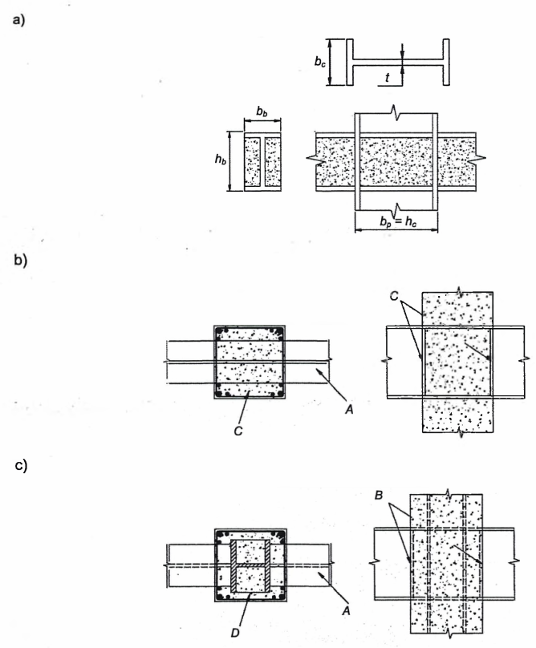

<strong>Hình 7.3 — Liên kết dầm - cột</strong>

### Bảng 7.3 - Quan hệ giữa hệ số ứng xử và độ mảnh giới hạn của các bản thép của tiết diện tại vùng tới hạn của kết cấu liên hợp bọc

| Cấp độ dẻo — Giá trị tham chiếu của hệ số ứng xử (q) | DCM — q ≤ Từ 1,5 đến 2 | DCM — Từ 1,5 đến 2 < q < 4 | DCH — q > 4 |
| :--- | :--- | :--- | :--- |
| Tiết diện chữ I hoặc chữ H được bao bọc một phần hoặc tiết diện chữ I được bao bọc toàn phần, giới hạn phần vươn ra của bản cánh c/$t_{f}$: | 20ε | 14ε | 9ε |
| Tiết diện chữ nhật nhồi bê tông, giới hạn h/t: | 52ε | 38ε | 24ε |
| Tiết diện tròn nhồi bê tông, giới hạn d/t: | 90$\epsilon^{2}$ | 85$\epsilon^{2}$ | 80$\epsilon^{2}$ |

trong đó:

&nbsp;&nbsp;&nbsp;&nbsp;\- $\epsilon$ = ($f_{y}$/235)$^{0,5}$

&nbsp;&nbsp;&nbsp;&nbsp;\- c/$t_{f}$ xem ở Hình 7.8

&nbsp;&nbsp;&nbsp;&nbsp;\- d/t và h/t là tỷ số giữa kích thước ngoài lớn nhất của tiết diện cột và chiều dày bản thép.

&nbsp;&nbsp;&nbsp;&nbsp;\- (8) Đối với cột liên hợp được bao bọc hoàn toàn, kích thước tiết diện thép nhỏ nhất b, h hoặc d phải không được nhỏ hơn 250 mm.

&nbsp;&nbsp;&nbsp;&nbsp;\- (9) Độ bền, bao gồm cả độ bền cắt của cột liên hợp không tiêu tán năng lượng, được xác định theo các yêu cầu trong EN 1994-1-1:2004.

&nbsp;&nbsp;&nbsp;&nbsp;\- (10) Đối với cột liên hợp, khi giả thiết rằng lớp bê tông bao bọc hoặc nhồi cùng góp phần vào khả năng chịu uốn và/hoặc khả năng chịu lực dọc của cấu kiện thì áp dụng các yêu cầu thiết kế nêu trong các mục từ 7.6.4 đến 7.6.6. Các yêu cầu này nhằm đảm bảo truyền toàn bộ lực cắt giữa các phần bê tông và thép trong một tiết diện và bảo vệ vùng tiêu tán năng lượng chống lại sự phá hoại không đàn hồi quá sớm.

&nbsp;&nbsp;&nbsp;&nbsp;\- (11) Khi thiết kế chịu động đất, cường độ cắt thiết kế nêu trong Bảng 6.6 của EN 1994-1-1:2004 được nhân với hệ số giảm 0,5.

&nbsp;&nbsp;&nbsp;&nbsp;\- (12) Khi thiết kế theo khả năng và tận dụng độ bền liên hợp đầy đủ của cột thì cần phải đảm bảo việc truyền toàn bộ lực cắt giữa phần thép và phần bê tông cốt thép. Nếu không truyền được toàn bộ lực cắt bằng sự bám dính hoặc ma sát thì cần bổ sung các đinh chống cắt chịu cắt để đảm bảo sự làm việc liên hợp.

&nbsp;&nbsp;&nbsp;&nbsp;\- (13) Đối với cột liên hợp chịu lực dọc là chủ yếu thì lực cắt phải được truyền toàn bộ để đảm bảo rằng các phần thép và bê tông cùng chịu tải trọng truyền lên cột tại vị trí liên kết với dầm hoặc giằng.

&nbsp;&nbsp;&nbsp;&nbsp;\- (14) Trừ vị trí chân cột của một số dạng kết cấu, nói chung cột không được thiết kế để tiêu tán năng lượng. Tuy nhiên, cần bố trí cốt thép hạn chế biến dạng ở những vùng gọi là “vùng tới hạn” theo 7.6.4.

&nbsp;&nbsp;&nbsp;&nbsp;\- (15) Các yêu cầu về neo và nối cốt thép trong thiết kế cột bê tông cốt thép trong 5.6.2.1 và 5.6.3 cũng được áp dụng cho cột liên hợp.

### 7.6.2  Dầm thép liên hợp với bản

(1) Các yêu cầu trong mục này nhằm đảm bảo tính nguyên vẹn của bản bê tông trong suốt quá trình chịu tác dụng động đất khi phần dưới của thanh thép hình và/hoặc các thanh thép tròn trong bản bê tông đã bị chảy.

(2) Khi phân tích khả năng tiêu tán năng lượng, nếu bỏ qua sự làm việc liên hợp giữa dầm và bản để tiêu tán năng lượng thì áp dụng 7.7.5.

(3) Các dầm, được dự kiến làm việc như cấu kiện liên hợp trong các vùng tiêu tán năng lượng, của kết cấu kháng chấn có thể được thiết kế với liên kết chịu cắt hoàn toàn hoặc không hoàn toàn theo EN 1994-1-1:2004. Mức độ tối thiểu của liên kết η nêu trong 6.6.1.2 của EN 1994-1-1:2004 phải không được nhỏ hơn 0,8 và tổng khả năng chịu lực của các đinh chống cắt chịu cắt trong phạm vi của vùng mô men dương bất kỳ là không được nhỏ hơn độ bền dẻo của cốt thép.

(4) Độ bền thiết kế của đinh chống cắt trong vùng tiêu tán năng lượng được tính toán theo EN 1994-1-1:2004 sẽ được nhân với hệ số suy giảm 0,75.

(5) Khi sử dụng các đinh chống cắt không dẻo thì liên kết phải chịu cắt toàn bộ.

(6) Khi sử dụng các tấm tôn thép dập sóng với các sườn ngang để đỡ dầm thì hệ số suy giảm $k_{t}$ của khả năng chịu cắt của liên kết nêu trong EN 1994-1 phải được giảm đi bằng cách nhân với hệ số $k_{r}$ tùy thuộc vào hình dạng của sóng tôn (xem Hình 7.4).

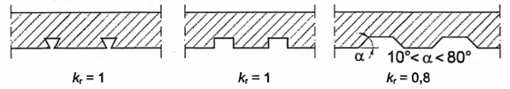

<strong>Hình 7.4 — Các giá trị của hệ số kr</strong>

(7) Để đạt được độ dẻo trong khớp dẻo thì tỷ số x/d của khoảng cách x từ thớ bê tông chịu nén phía trên đến trục trung hòa dẻo, với chiều cao d của tiết diện liên hợp, phải phù hợp với điều kiện:

$$\frac{x}{d} \leqslant \frac{\varepsilon_{cu2}}{\varepsilon_{cu2} + \varepsilon_a} \tag{7.4}$$
<!-- formula_id: "F_TCVN_9386_2025_RID243" -->

trong đó:

&nbsp;&nbsp;&nbsp;&nbsp;\- $\epsilon_{cu2}$ là biến dạng nén cực hạn của bê tông (xem EN 1992-1-1:2004);

&nbsp;&nbsp;&nbsp;&nbsp;\- $\epsilon_{a}$ là tổng biến dạng của thép tại trạng thái cực hạn;

&nbsp;&nbsp;&nbsp;&nbsp;\- (8) Yêu cầu trên được xem là thỏa mãn khi tỷ số x/d của cùng một tiết diện phải nhỏ hơn các giá trị giới hạn nêu trong Bảng 7.4.

&nbsp;&nbsp;&nbsp;&nbsp;\- (9) Trong các vùng tiêu tán năng lượng của dầm, cần bố trí tại vùng liên kết giữa dầm và cột các cốt thép có tính dẻo đặc thù của bản gọi là "cốt thép kháng chấn" (xem Hình 7.5). Việc thiết kế cốt thép cấu tạo kháng chấn và các ký hiệu sử dụng trong Hình 7.5 nêu trong Phụ lục C.

### Bảng 7.4 - Giá trị giới hạn của tỷ số x/d theo độ dẻo của dầm liên hợp với bản

| Cấp độ dẻo | q | $f_{y}$ N/$mm^{2}$ | Giá trị giới hạn trên x/d |
| :--- | :--- | :---: | :---: |
| DCM | 1,5 < q ≤ 4 | 355 | 0,27 |
| DCM | 1,5 < q ≤ 4 | 235 | 0,36 |
| DCH | q > 4 | 355 | 0,20 |
| DCH | q > 4 | 235 | 0,27 |

<!-- DIAGRAM: word/media/image241.png -->

**CHÚ DẪN:**

A  nút biên

B  nút trong

C  dầm thép

D  dầm thép ở biên

E  dải biên công xôn bê tông cốt thép

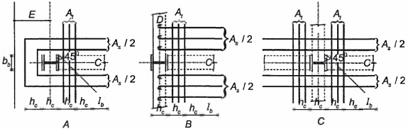

<strong>Hình 7.5 — Cách bố trí cốt thép kháng chấn</strong>

### 7.6.3  Chiều rộng hữu hiệu của bản

(1) Chiều rộng hữu hiệu tổng cộng $b_{eff}$ của bản cánh bê tông kết hợp với mỗi bản bụng thép được lấy bằng tổng của các chiều rộng hữu hiệu thành phần $b_{e1}$ và $b_{e2}$ của phần bản cánh ở hai bên trục bản bụng thép (Hình 7.6). Chiều rộng hữu hiệu thành phần ở mỗi bên được lấy bằng $b_{e}$ như trong Bảng 7.5 nhưng không lớn hơn chiều rộng thực tế đã có $b_{1}$ và $b_{2}$ được xác định theo (2) của điều này.

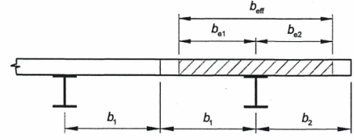

<strong>Hình 7.6 — Chiều rộng hữu hiệu của bản sàn be và beff</strong>

(2) Chiều rộng thực tế b của mỗi phần được lấy bằng 1/2 khoảng cách của hai bản bụng dầm kề nhau, trong trường hợp bản sàn có một cạnh tự do thì chiều rộng thực tế là khoảng cách từ bản bụng tới đầu mút tự do của sàn.

(3) Chiều rộng hữu hiệu thành phần $b_{e}$ của bản được sử dụng trong việc xác định các đặc trưng đàn hồi và dẻo của tiết diện liên hợp chữ T bởi thép hình liên kết với bản sàn được xác định theo Bảng 7.5 và Hình 7.7. Các giá trị này được sử dụng cho những dầm có vị trí như dầm C trong Hình 7.5 và nếu việc thiết kế cốt thép cho bản và liên kết giữa bản với các dầm và cột thép là phù hợp với Phụ lục C. Trong Bảng 7.5 các mô men gây lực nén trong bản được coi là dương và những mô men gây lực kéo được coi là âm. Các ký hiệu $b_{b}$; $h_{c}$; $b_{e}$; $b_{eff}$ và L được sử dụng trong Bảng 7.5.I và 7.5.II được xác định theo Hình 7.5, 7.6 và 7.7, $b_{b}$ là chiều rộng chịu lực của bản bê tông trên cột theo phương ngang vuông góc với dầm mà đang tính chiều rộng hữu hiệu; chiều rộng chịu lực này có thể bao gồm các bản bổ sung hoặc các chi tiết cấu tạo nhằm tăng khả năng chịu lực.

<!-- DIAGRAM: word/media/image243.png -->

**CHÚ DẪN:**

A  cột biên

B  cột ở trong

C  dầm dọc

D  dầm ngang hoặc dầm bo bằng thép

E  dải biên công xôn bằng bê tông

F  tấm gia cường

G  sàn bê tông

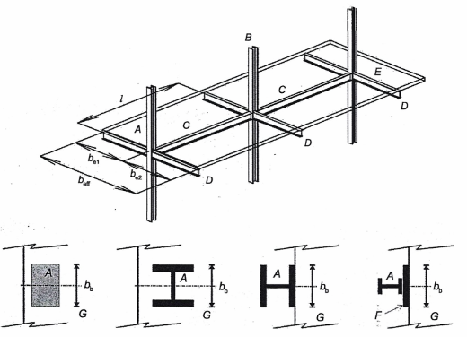

<strong>Hình 7.7 — Các cấu kiện trong kết cấu khung có mô men</strong>

### Bảng 7.5.I - Chiều rộng hữu hiệu $b_{e}$ của bản sàn khi phân tích đàn hồi

| $b_{e}$ | Cấu kiện ngang | be cho I (phân tích đàn hồi) |
| :--- | :--- | :--- |
| Tại cột giữa | Có hoặc không có | Đối với $M^{-}$: 0,05 L Đối với $M^{+}$: 0,0375 L |
| Tại cột biên | Có | Đối với $M^{-}$: 0,05 L Đối với $M^{+}$: 0,0375 L |
| Tại cột biên | Không có, hoặc cốt thép không được neo | Đối với $M^{-}$: 0 Đối với $M^{+}$: 0,025 L |

### Bảng 7.5.II - Chiều rộng hữu hiệu $b_{e}$ của bản sàn khi phân tích dẻo

| Dấu của mô men uốn | Vị trí | Cấu kiện ngang | $b_{e}$ cho $M_{Rd}$ (phân tích dẻo) |
| :--- | :--- | :--- | :--- |
| Mô men âm | Tại cột giữa | Cốt thép kháng chấn | 0,1 L |
| Mô men âm | Tại cột biên | Khi tất cả các thép bố trí đều được neo với dầm biên hoặc với dải biên công xôn bê tông | 0,1 L |
| Mô men âm | Tại cột biên | Khi tất cả các cốt thép bố trí không neo với dầm biên hoặc với dải biên công xôn bê tông | 0,0 |
| Mô men dương | Tại cột giữa | Cốt thép kháng chấn | 0,075 L |
| Mô men dương | Tại cột biên | Dầm thép ngang với các đinh chống cắt Sàn bê tông kéo dài đến mặt ngoài của cột có tiết diện chữ H với trục chính có hướng như trong Hình 7.5 hoặc lộ ra thành dải biên bê tông. Cốt thép kháng chấn. | 0,075 L |
| Mô men dương | Tại cột biên | Không có dầm thép ngang thép hoặc có nhưng không có các đinh chống cắt Sàn bê tông kéo dài đến mặt ngoài của cột có tiết diện chữ H với trục chính có hướng như trong Hình 7.5 hoặc lộ ra thành dải biên bê tông. Cốt thép kháng chấn. | $b_{b}$/2 + 0,7 $h_{c}$/2 |
| Mô men dương | Tại cột biên | Tất cả các bố trí khác. Cốt thép kháng chấn. | $b_{b}$/2 ≤ $b_{e,max}$ $b_{e,max}$ = 0,05 L |

### 7.6.4  Cột liên hợp được bao bọc hoàn toàn

(1) Trong kết cấu tiêu tán năng lượng, các vùng tới hạn xuất hiện tại cả hai đầu của tất cả các cột trong khung chịu mô men và trong một phần của cột liền kề các thanh nối trong khung giằng lệch tâm. Chiều dài $L_{cr}$ của các vùng tới hạn này (mét) theo công thức (5.14) cho cấp độ dẻo trung bình, hoặc bằng công thức (5.30) cho cấp độ dẻo cao, với $h_{c}$ là chiều cao của tiết diện liên hợp (mét).

(2) Để thỏa mãn các yêu cầu về độ xoay vùng khớp dẻo và để bù cho phần suy giảm khả năng chịu lực do sự phá hoại của lớp bê tông ngoài thì các điều kiện sau phải được thỏa mãn trong phạm vi vùng tới hạn đã nêu trên:

$$\alpha \omega_{wd} \ge 30 \mu_\varphi \cdot \nu_d \cdot \varepsilon_{sy,d} \cdot \frac{b_c}{b_o} - 0,035 \tag{7.5}$$
<!-- formula_id: "F_TCVN_9386_2025_RID247" -->

trong đó các tham số trong công thức lấy theo 5.4.3.2.2(8) và tỉ số lực dọc $v_{d}$ được lấy như sau:

$$v_d = \frac{N_{Ed}}{N_{pl,Rd}} = \frac{N_{Ed}}{A_a f_{yd} + A_c f_{cd} + A_s f_{sd}} \tag{7.6}$$
<!-- formula_id: "F_TCVN_9386_2025_RID248" -->

trong đó:

&nbsp;&nbsp;&nbsp;&nbsp;\- $A_{a}$ là diện tích tiết diện thép

&nbsp;&nbsp;&nbsp;&nbsp;\- $A_{c}$ là diện tích bê tông

&nbsp;&nbsp;&nbsp;&nbsp;\- $A_{s}$ là diện tích tiết diện cốt thép

&nbsp;&nbsp;&nbsp;&nbsp;\- $f_{yd}$ là cường độ chảy thiết kế của thép

&nbsp;&nbsp;&nbsp;&nbsp;\- $f_{cd}$ là cường độ chịu nén thiết kế của bê tông

&nbsp;&nbsp;&nbsp;&nbsp;\- $f_{sd}$ là cường độ chảy thiết kế của cốt thép

&nbsp;&nbsp;&nbsp;&nbsp;\- (3) Khoảng cách s tính bằng mm của các cốt đai trong vùng tới hạn không được vượt quá:

$$s = min( b_{o} /2, 260 mm, 9 d_{bL} ) đối với DCM \qquad (7.7)$$
<!-- formula_id: "F_TCVN_9386_2025_FORMULA_7_7" -->

$$s = min( b_{o} /2, 175 mm, 8 d_{bL} ) đối với DCH \qquad (7.8)$$
<!-- formula_id: "F_TCVN_9386_2025_FORMULA_7_8" -->

&nbsp;&nbsp;&nbsp;&nbsp;\- Ở phần chân cột của các tầng dưới, với DCH:

$$s = min( b_{o} /2, 150 mm, 6 d_{bL} ) \qquad (7.9)$$
<!-- formula_id: "F_TCVN_9386_2025_FORMULA_7_9" -->

trong đó:

&nbsp;&nbsp;&nbsp;&nbsp;\- $b_{o}$ là kích thước nhỏ nhất của lõi bê tông (tính đến tâm cốt đai, mi li mét);

&nbsp;&nbsp;&nbsp;&nbsp;\- $d_{bL}$ là đường kính nhỏ nhất của cốt thép dọc (mi li mét).

&nbsp;&nbsp;&nbsp;&nbsp;\- (4) Đường kính cốt đai $d_{bw}$ (mi li mét) ít nhất phải bằng:

$$d_{bw} = 6 mm đối với DCM \qquad (7.10)$$
<!-- formula_id: "F_TCVN_9386_2025_FORMULA_7_10" -->

$$d_{bw} = max (0,35 d_{bL,max} [ f_{ydL} / f_{ydw} ] ^{0,5} , 6 mm) đối với DCH \qquad (7.11)$$
<!-- formula_id: "F_TCVN_9386_2025_FORMULA_7_11" -->

trong đó:

&nbsp;&nbsp;&nbsp;&nbsp;\- $d_{bL,max}$ là đường kính lớn nhất của các cốt thép dọc (mm);

&nbsp;&nbsp;&nbsp;&nbsp;\- (5) Trong các vùng tới hạn, khoảng cách giữa các thanh cốt thép dọc liền kề (nằm trong móc cốt đai hoặc đai móc) không được vượt quá 250 mm với DCM hoặc 200 mm với DCH.

&nbsp;&nbsp;&nbsp;&nbsp;\- (6) Trong 2 tầng dưới cùng của công trình, cốt đai theo (3), (4) và (5) phải được đặt vượt ra ngoài vùng tới hạn với chiều dài bằng một nửa chiều dài vùng tới hạn.

&nbsp;&nbsp;&nbsp;&nbsp;\- (7) Trong các cột có khả năng tiêu tán năng lượng, khả năng chịu cắt được xác định chỉ dựa vào tiết diện thép chịu lực.

&nbsp;&nbsp;&nbsp;&nbsp;\- (8) Trong vùng tiêu tán năng lượng, quan hệ giữa cấp độ dẻo và độ mảnh cho phép (c/$t_{f}$) của phần vươn ra của bản cánh nêu trong Bảng 7.3.

&nbsp;&nbsp;&nbsp;&nbsp;\- (9) Cốt đai hạn chế biến dạng có khả năng làm tăng sự ổn định cục bộ trong vùng tiêu tán năng lượng. Do đó, các giá trị giới hạn độ mảnh của bản cánh (nêu trong Bảng 7.3) có thể được tăng lên nếu khoảng cách s của cốt đai nhỏ hơn độ vươn của bản cánh tức là s/c < 1,0. Khi s/c < 0,5 thì các giá trị trong Bảng 7.3 có thể được tăng lên nhưng không quá 50 %. Khi 0,5 < s/c < 1,0 thì dùng phép nội suy tuyến tính.

&nbsp;&nbsp;&nbsp;&nbsp;\- (10) Đường kính $d_{bw}$ của cốt đai sử dụng để ngăn cản sự mất ổn định của bản cánh phải không nhỏ hơn:

$$d_{bw} = \left[ \left(\frac{b t_{f}}{8}\right) \left(\frac{f_{yd f}}{f_{yd w}}\right) \right]^{0,5} \tag{7.12}$$
<!-- formula_id: "F_TCVN_9386_2025_RID249" -->

trong đó:

&nbsp;&nbsp;&nbsp;&nbsp;\- b và $t_{f}$ là chiều rộng và chiều dày của bản cánh;

&nbsp;&nbsp;&nbsp;&nbsp;\- $f_{ydf}$ và $f_{ydw}$ là cường độ chảy thiết kế của bản cánh và của cốt thép.

### 7.6.5  Cấu kiện được bọc bê tông một phần

(1) Trong các vùng tiêu tán năng lượng, mà năng lượng bị tiêu tán do uốn dẻo của tiết diện liên hợp, khoảng cách các cốt đai s cần thỏa mãn các yêu cầu trong 7.6.4(3) trên một chiều dài lớn hơn hoặc bằng chiều dài vùng tới hạn $L_{cr}$ đối với các vùng tiêu tán năng lượng ở đầu cấu kiện và trên một chiều dài 2$L_{cr}$ đối với các vùng tiêu tán năng lượng ở khoảng giữa cấu kiện.

(2) Trong các cấu kiện có khả năng tiêu tán năng lượng, khả năng chịu cắt được xác định chỉ dựa trên tiết diện thép chịu lực, trừ khi có các chi tiết đặc biệt để huy động được độ bền chống cắt của phần bê tông bọc.

(3) Trong vùng tiêu tán năng lượng, quan hệ giữa cấp độ dẻo của kết cấu và độ mảnh cho phép (c/t) của phần vươn ra của bản cánh nêu trong Bảng 7.3.

(4) Các thanh thép thẳng gia cường được hàn vào bên trong bản cánh như trong Hình 7.8 có thể ngăn cản mất ổn định cục bộ trong vùng tiêu tán năng lượng. Do đó, các giá trị giới hạn độ mảnh của bản cánh (nêu trong Bảng 7.3) có thể được tăng lên nếu khoảng cách $s_{1}$ của cốt đai nhỏ hơn độ vươn của bản cánh tức là $s_{1}$/c < 1,0. Khi $s_{1}$/c < 0,5 thì các giá trị trong Bảng 7.3 có thể được tăng lên nhưng không quá 50 %. Khi 0,5 < $s_{1}$/c < 1,0 thì dùng phép nội suy tuyến tính. Các thanh thép thẳng gia cường cũng cần phù hợp với các yêu cầu trong (5) và (6) của điều này.

<!-- DIAGRAM: word/media/image247.png -->

**CHÚ DẪN:**

A  thanh thép thẳng gia cường

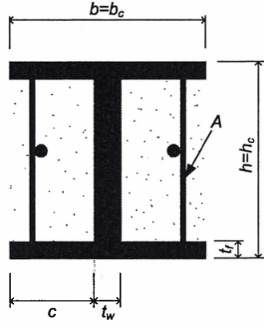

<strong>Hình 7.8 — Chi tiết cốt thép ngang với các thanh thép thẳng gia cường được hàn vào bản cánh</strong>

(5) Đường kính $d_{bw}$ của thanh thép thẳng gia cường trong (4) của điều này phải không nhỏ hơn 6 mm. Khi thanh thép thẳng gia cường này được dùng để ngăn cản mất ổn định cục bộ của bản cánh như đã nói ở (4) thì $d_{bw}$ không được nhỏ hơn giá trị nêu trong biểu thức (7.12).

(6) Thanh thép thẳng gia cường trong (4) phải được hàn vào bản cánh tại cả hai đầu và khả năng chịu lực của mối hàn không nhỏ hơn cường độ chảy khi kéo của đoạn thép. Cần có một lớp bê tông bảo vệ dày ít nhất 20 mm, nhưng không quá 40 mm cho các đoạn thép này.

(7) Việc thiết kế các cấu kiện liên hợp bao bọc một phần có thể tính đến khả năng chịu lực chỉ của tiết diện thép, hoặc khả năng chịu lực liên hợp của tiết diện thép và lớp bê tông bao bọc.

(8) Việc thiết kế các cấu kiện bao bọc một phần mà chỉ có tiết diện thép là góp phần vào khả năng chịu lực của cấu kiện có thể tiến hành theo các yêu cầu trong Điều 6 và các yêu cầu thiết kế trong 7.5.2 và 7.5.3.

### 7.6.6  Cột thép nhồi bê tông

(1) Mối quan hệ giữa cấp độ dẻo và độ mảnh cho phép d/t hoặc h/t nêu trong Bảng 7.3.

(2) Độ bền cắt của cột có khả năng tiêu tán năng lượng được xác định chỉ dựa trên tiết diện thép chịu lực hoặc dựa vào tiết diện bê tông cốt thép nhồi và phần vỏ thép được coi chỉ là cốt chịu cắt.

(3) Trong các cấu kiện không tiêu tán năng lượng, cường độ chịu cắt của cột được xác định theo EN 1994-1-1.

### 7.7  Yêu cầu cụ thể cho thiết kế khung chịu mô men

### 7.7.1  Tiêu chí riêng

(1) Áp dụng 6.6.1(1).

(2) Các dầm liên hợp phải được thiết kế theo cấp độ dẻo và sao cho bê tông được nguyên vẹn.

(3) Tùy vào vị trí của vùng tiêu tán năng lượng mà áp dụng 7.5.2(4) hoặc 7.5.2(5).

(4) Để tạo được các khớp dẻo cần phù hợp với các yêu cầu trong 4.4.2.3, 7.7.3, 7.7.4 và 7.7.5.

### 7.7.2  Phân tích kết cấu

(1) Việc phân tích kết cấu phải dựa trên cơ sở đặc trưng tiết diện như đã nêu trong 7.4.

(2) Trong dầm, có hai độ cứng chống uốn khác nhau cần được xem xét là: $EI_{1}$ đối với phần nhịp dầm chịu mô men dương (tiết diện không nứt) và $EI_{2}$ đối với phần nhịp dầm chịu mô men âm (tiết diện bị nứt).

(3) Phương pháp phân tích có thể được tiến hành theo cách khác bằng cách lấy giá trị mô men quán tính tương đương $I_{eq}$ dùng cho toàn nhịp dầm, $I_{eq}$ xác định như sau:

$$I_{eq} = 0,6 I_{1} + 0,4 I_{2} \qquad (7.13)$$
<!-- formula_id: "F_TCVN_9386_2025_FORMULA_7_13" -->

(4) Đối với cột, độ cứng xác định như sau:

$$(EI) _{c} = 0,9 ( EI_{a} + r E_{cm}I_{c} + EI_{s} ) \qquad (7.14)$$
<!-- formula_id: "F_TCVN_9386_2025_FORMULA_7_14" -->

trong đó:

&nbsp;&nbsp;&nbsp;&nbsp;\- E và $E_{cm}$ là mô đun đàn hồi của thép và bê tông;

&nbsp;&nbsp;&nbsp;&nbsp;\- r là hệ số giảm yếu phụ thuộc dạng tiết diện thép của cột, lấy bằng 0,5;

&nbsp;&nbsp;&nbsp;&nbsp;\- $I_{a}$, $I_{c}$ và $I_{s}$ biểu thị mô men quán tính của tiết diện thép, của bê tông và của cốt thép.

### 7.7.3  Yêu cầu cho dầm và cột

(1) Việc thiết kế dầm liên hợp chữ T phải phù hợp với 7.6.2. Thiết kế dầm bao bọc một phần phải phù hợp với 7.6.5.

(2) Dầm phải được kiểm tra về mất ổn định do uốn bên hoặc uốn xoắn theo EN 1994-1-1 với giả thiết rằng có sự hình thành mô men dẻo âm tại một đầu dầm.

(3) Áp dụng 6.6.2(2).

(4) Dàn liên hợp không được sử dụng như dầm tiêu tán năng lượng.

(5) Áp dụng 6.6.3(1).

(6) Trong các cột có hình thành khớp dẻo như đã nêu trong 7.7.1(1), việc kiểm tra tiến hành với giả thiết rằng $M_{pl,Rd}$ được đạt tới trong các khớp dẻo này.

(7) Bất đẳng thức sau được áp dụng cho tất cả các cột liên hợp:

$$\frac{N_{Ed}}{N_{pl,Rd}} < 0,30 \tag{7.15}$$
<!-- formula_id: "F_TCVN_9386_2025_RID251" -->

(8) Việc kiểm tra khả năng chịu lực của cột được thực hiện theo 4.8 của EN 1994-1-1:2004.

(9) Lực cắt trong cột $V_{Ed}$ cần được giới hạn theo biểu thức (6.4).

### 7.7.4  Liên kết dầm - cột

(1) Áp dụng các điều trong 6.6.4.

### 7.7.5  Điều kiện để bỏ qua đặc trưng liên hợp của dầm với bản

(1) Khi tính toán độ bền dẻo của tiết diện dầm liên hợp với bản có thể chỉ xét đến tiết diện thép (thiết kế theo quan niệm c) được xác định theo 7.1.2) nếu bản hoàn toàn không được liên kết với khung thép trong một vùng có đường kính 2$b_{eff}$ xung quanh cột, với $b_{eff}$ là giá trị lớn nhất trong các chiều rộng hữu hiệu của các dầm liên kết với cột đó.

(2) Với các mục đích của (1) ở trên, khái niệm “hoàn toàn không được liên kết” nghĩa là không có sự tiếp xúc giữa bản với mọi mặt thẳng đứng nào của mọi cấu kiện thép (cấu kiện thép ở đây có thể là: cột, đinh chống cắt chịu cắt, tấm nối, cánh lượn sóng, sàn thép đóng đinh với bản cánh của dầm thép).

(3) Đối với các dầm được bê tông bọc một phần, thì phần bê tông giữa các bản cánh của tiết diện thép phải được kể đến trong tính toán.

### 7.8  Yêu cầu thiết kế và cấu tạo cho khung liên hợp với giằng đúng tâm

### 7.8.1  Tiêu chí cụ thể

(1) Áp dụng 6.7.1(1).

(2) Kết cấu cột và dầm phải là kết cấu thép hoặc kết cấu liên hợp.

(3) Hệ giằng phải bằng thép.

(4) Áp dụng 6.7.1(2).

### 7.8.2  Phương pháp phân tích

(1) Áp dụng các điều trong 6.7.2.

### 7.8.3  Cấu kiện giằng chéo

(1) Áp dụng các điều trong 6.7.3.

### 7.8.4  Dầm và cột

(1) Áp dụng các điều trong 6.7.4.

### 7.9  Yêu cầu thiết kế và cấu tạo cho khung liên hợp với giằng lệch tâm

### 7.9.1  Tiêu chí cụ thể

(1) Khung liên hợp với giằng lệch tâm phải được thiết kế để tiêu tán năng lượng xảy ra chủ yếu thông qua chảy dẻo tại đoạn nối khi chịu uốn hoặc cắt. Tất cả các cấu kiện khác vẫn làm việc trong giai đoạn đàn hồi và các liên kết không bị phá hoại.

(2) Cột, dầm và hệ giằng có thể là kết cấu thép hoặc kết cấu liên hợp.

(3) Hệ giằng, cột và các đoạn dầm bên ngoài đoạn nối phải được thiết kế để chúng luôn làm việc trong giai đoạn đàn hồi dưới tác dụng của các lực lớn nhất có thể xảy ra do các dầm nối chảy dẻo hoàn toàn và bị biến cứng có chu kỳ.

(4) Áp dụng 6.8.1(2).

### 7.9.2  Phân tích kết cấu

(1) Việc phân tích kết cấu phải được dựa trên cơ sở các đặc trưng tiết diện như đã nêu trong 7.4.

(2) Trong dầm, có hai loại độ cứng kháng uốn khác nhau cần được xem xét là: $EI_{1}$ đối với phần nhịp dầm chịu mô men dương (tiết diện không bị nứt) và $EI_{2}$ đối với phần nhịp dầm chịu mô men âm (tiết diện bị nứt).

### 7.9.3  Đoạn nối

(1) Đoạn nối phải được làm bằng thép, có khả năng liên hợp với bản sàn. Chúng có thể không được bọc bê tông.

(2) Áp dụng các yêu cầu cho đoạn nối kháng chấn và các sườn gia cường của chúng được nêu trong 6.8.2. Các đoạn nối này nên có chiều dài ngắn hoặc trung bình, chiều dài lớn nhất e như sau:

Đối với kết cấu có hai khớp dẻo hình thành tại hai đầu đoạn nối:

$$e = \frac{2M_{p,\text{link}}}{V_{p,\text{link}}} \tag{7.16}$$
<!-- formula_id: "F_TCVN_9386_2025_RID252" -->

Đối với kết cấu có một khớp dẻo hình thành tại một đầu đoạn nối:

$$e < \frac{M_{p,link}}{V_{p,link}} \tag{7.17}$$
<!-- formula_id: "F_TCVN_9386_2025_RID253" -->

Định nghĩa về $M_{p,link}$ và $V_{p,link}$ xem trong 6.8.2(3). Với $M_{p,link}$ chỉ có thành phần thép của đoạn nối được xét đến trong tính toán, bỏ qua bản bê tông.

(3) Khi đoạn nối kháng chấn liên kết vào cột bê tông cốt thép hoặc cột thép bọc bê tông thì cần có các bản chịu ép trên cả hai mặt của đoạn nối, tại bề mặt của cột và tại tiết diện đầu còn lại của đoạn nối. Các bản chịu ép này cần phù hợp với các yêu cầu trong 7.5.4.

(4) Khi thiết kế các liên kết dầm/cột liền kề với đoạn nối tiêu tán năng lượng cần phù hợp với 7.5.4.

(5) Các liên kết cần thỏa mãn các yêu cầu về liên kết cho khung thép với giằng lệch tâm như trong 6.8.4.

### 7.9.4  Cấu kiện không chứa đoạn nối kháng chấn

(1) Các cấu kiện không chứa đoạn nối kháng chấn phải phù hợp với các yêu cầu trong 6.8.3, có xét đến khả năng chịu lực của cả thép và bê tông trong trường hợp cấu kiện liên hợp và thỏa mãn các yêu cầu liên quan trong 7.6 và trong EN 1994-1-1:2004.

(2) Tại vị trí mà đoạn nối liền kề với cột liên hợp được bọc bê tông hoàn toàn, cốt thép ngang thỏa mãn các yêu cầu của 7.6.4 phải được đặt ở cả trên và dưới của liên kết nối.

(3) Trong trường hợp giằng liên hợp chịu kéo, chỉ có phần tiết diện của thanh thép hình được tính đến trong việc xác định khả năng chịu lực của giằng.

### 7.10  Yêu cầu thiết kế và cấu tạo cho hệ kết cấu tạo bởi vách cứng bằng bê tông cốt thép liên hợp với các cấu kiện thép chịu lực

### 7.10.1  Tiêu chí cụ thể

(1) Các điều khoản trong mục này được áp dụng cho hệ kết cấu liên hợp thuộc ba dạng được xác định theo 7.3.1e.

(2) Hệ kết cấu dạng 1 và 2 được thiết kế để làm việc như vách cứng và tiêu tán năng lượng trong các thanh thép thẳng đứng và trong cốt thép thẳng đứng. Tường chèn được gắn chặt vào cấu kiện biên để tránh bị tách ra.

(3) Trong hệ kết cấu dạng 1, lực cắt ở mỗi tầng phải được xác định bởi lực cắt ngang trong tường và trong phần tiếp giáp giữa tường và dầm.

<!-- DIAGRAM: word/media/image251.png -->

**CHÚ DẪN:**

A  các thanh được hàn vào cột

B  cốt thép ngang

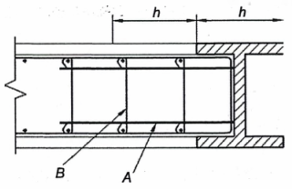

<strong>Hình 7.9a — Chi tiết cấu tạo các cấu kiện biên liên hợp được bọc bê tông không hoàn toàn (chi tiết của cốt thép ngang là dành cho DCH)</strong>

<!-- DIAGRAM: word/media/image252.png -->

**CHÚ DẪN:**

C  đinh chống cắt cứng

D  cốt đai hở

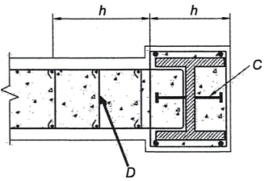

<strong>Hình 7.9b — Chi tiết cấu tạo các cấu kiện biên liên hợp được bọc bê tông hoàn toàn (chi tiết của cốt thép ngang là dành cho DCH)</strong>

<!-- DIAGRAM: word/media/image253.png -->

**CHÚ DẪN:**

A  cốt thép gia cường cho tường tại vị trí dầm thép chôn trong bê tông

B  dầm thép liên kết

C  sườn thép tăng cường

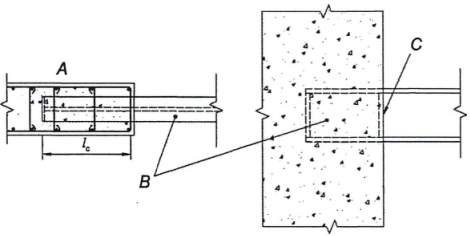

<strong>Hình 7.10 — Chi tiết cấu tạo của dầm nối ngàm vào tường (các chi tiết là của DCH)</strong>

(4) Hệ kết cấu dạng 3 phải được thiết kế để tiêu tán năng lượng trong vách cứng và trong các dầm liên kết (xem Hình 7.2).

### 7.10.2  Phân tích kết cấu

(1) Việc phân tích kết cấu phải dựa trên các đặc trưng tiết diện được nêu trong Điều 5 cho tường bê tông và trong 7.4.2 cho dầm liên hợp.

(2) Trong dạng kết cấu 1 và 2, khi thanh thép hình thẳng đứng (được bọc bê tông một phần hoặc bọc toàn phần) làm việc như cấu kiện biên của ô tường chèn bê tông cốt thép, khi phân tích kết cấu phải giả thiết rằng hệ quả tác động của động đất đến các cấu kiện biên thẳng đứng này chỉ là lực dọc.

(3) Các lực dọc này được xác định với giả thiết lực cắt được chịu bởi tường bê tông cốt thép và toàn bộ trọng lực, lực gây lật được chịu bởi vách cứng làm việc liên hợp với các cấu kiện biên.

(4) Trong hệ kết cấu dạng 3, nếu sử dụng các dầm nối liên hợp thì áp dụng 7.7.2(2) và 7.7.2(3).

### 7.10.3  Yêu cầu cấu tạo cho tường liên hợp thuộc DCM

(1) Các ô tường chèn bằng bê tông cốt thép thuộc dạng 1 và tường bê tông cốt thép thuộc dạng 2 và 3 phải thỏa mãn các yêu cầu trong Điều 5 cho tường thuộc DCM.

(2) Các thanh thép hình được bao bọc một phần và được sử dụng như các cấu kiện biên của ô bản bê tông cốt thép, các thanh thép hình này phải thuộc lớp tiết diện thép tương ứng với hệ số ứng xử của kết cấu như đã chỉ dẫn trong Bảng 7.3.

(3) Các thanh thép hình được bọc bê tông toàn bộ được sử dụng như các cấu kiện biên trong ô bê tông cốt thép phải được thiết kế theo 7.6.4.

(4) Các thanh thép hình được bọc bê tông một phần được sử dụng như các cấu kiện biên trong ô bê tông cốt thép phải được thiết kế theo 7.6.5.

(5) Phải đặt các cốt đai hoặc chất chịu cắt có đầu (được hàn, neo bằng các lỗ trong cấu kiện thép hoặc được neo xung quanh cấu kiện thép) để truyền lực cắt theo phương đứng và phương ngang giữa phần thép của cấu kiện biên và phần tường bê tông cốt thép.

### 7.10.4  Yêu cầu cấu tạo cho dầm nối thuộc DCM

(1) Các dầm nối phải có chiều dài ngàm vào tường bê tông cốt thép đủ để chống lại tổ hợp bất lợi nhất mô men và lực cắt có thể sinh ra (tổ hợp mô men và lực cắt này được xác định trên cơ sở khả năng chịu cắt và chịu uốn của dầm nối). Chiều dài ngàm $L_{e}$​ được tính từ lớp thép hạn chế biến dạng đầu tiên trong tường biên (xem Hình 7.10). Chiều dài ngàm $L_{e}$ ​ không được nhỏ hơn 1,5 lần chiều cao dầm nối.

(2) Việc thiết kế liên kết dầm-cột phải phù hợp với 7.5.4.

(3) Những cốt thép thẳng đứng trong tường (được nêu trong 7.5.4(9) và 7.5.4(10)) có khả năng chịu lực dọc trục bằng khả năng chịu cắt của dầm nối cần được đặt toàn bộ trong phạm vi chiều dài neo $L_{e}$ trong đó 2/3 số lượng thép dọc này được đặt ở nửa đầu tiên của chiều dài neo. Các cốt thép này phải được kéo dài một đoạn không nhỏ hơn chiều dài neo $L_{e}$ ​ bên trên và bên dưới các cánh của dầm nối. Cho phép sử dụng cốt thép dọc đã được đặt cho các mục đích khác, như cho cấu kiện biên thẳng đứng, để làm một phần của cốt thép thẳng đứng này. Cốt thép ngang phải phù hợp với 7.6.

### 7.10.5  Yêu cầu cấu tạo cho DCH

(1) Phải bố trí cốt thép ngang để hạn chế biến dạng các cấu kiện biên liên hợp bao bọc một phần hoặc toàn phần. Các cốt ngang này phải kéo dài một đoạn 2h vào tường bê tông, trong đó h là chiều cao cấu kiện biên trong mặt phẳng tường (xem Hình 7.9a và Hình 7.9b).

(2) Các yêu cầu cho đoạn nối trong khung với giằng lệch tâm được áp dụng cho dầm nối.

### 7.11  Yêu cầu thiết kế và cấu tạo cho vách cứng liên hợp dạng bản thép bọc bê tông

### 7.11.1  Tiêu chí cụ thể

(1) Tường liên hợp chịu cắt dạng tấm thép bọc bê tông phải được thiết kế sao cho bản thép chảy dẻo do lực cắt.

(2) Bản thép phải được gia cường bởi một hoặc hai mặt được bọc bằng bê tông và được liên kết với phần bọc bê tông đó nhằm tránh mất ổn định của bản thép.

### 7.11.2  Phân tích kết cấu

(1) Việc phân tích kết cấu được dựa trên cơ sở các đặc trưng vật liệu và tiết diện như đã nêu trong 7.4.2 và 7.6.

### 7.11.3  Yêu cầu cấu tạo

(1) Điều kiện kiểm tra là:

$$V_{Ed} < V_{Rd} \qquad (7.18)$$
<!-- formula_id: "F_TCVN_9386_2025_FORMULA_7_18" -->

với khả năng chịu cắt được tính như sau:

$$V_{Rd} = \frac{A_{pl} f_{yd}}{\sqrt{3}}$$
<!-- formula_id: "F_TCVN_9386_2025_RID257" -->

trong đó:

&nbsp;&nbsp;&nbsp;&nbsp;\- $f_{yd}$​  là cường độ chảy thiết kế của tấm thép;

&nbsp;&nbsp;&nbsp;&nbsp;\- $A_{pl}$​  là diện tích mặt cắt ngang của tấm thép.

&nbsp;&nbsp;&nbsp;&nbsp;\- (2) Các liên kết giữa tấm thép và các cấu kiện biên (cột và đầm), cũng như các liên kết giữa tấm thép và phần bê tông bao bọc, phải được thiết kế sao cho cường độ chảy toàn bộ của tấm thép có thể phát triển được.

&nbsp;&nbsp;&nbsp;&nbsp;\- (3) Tấm thép phải được liên kết liên tục trên tất cả các cạnh với khung thép và các cấu kiện biên bằng liên kết hàn và/hoặc bulông để phát triển cường độ chảy của bản chịu cắt.

&nbsp;&nbsp;&nbsp;&nbsp;\- (4) Các cấu kiện biên phải được thiết kế để thỏa mãn 7.10.

&nbsp;&nbsp;&nbsp;&nbsp;\- (5) Chiều dày bê tông nhỏ nhất là 200 mm khi nó chỉ bọc bê tông một mặt và 100 mm trên mỗi mặt khi nó bọc bê tông cả hai mặt.

&nbsp;&nbsp;&nbsp;&nbsp;\- (6) Hàm lượng cốt thép nhỏ nhất theo cả hai hướng không được nhỏ hơn 0,25 %.

&nbsp;&nbsp;&nbsp;&nbsp;\- (7) Các lỗ mở trong tấm thép phải được gia cường theo tính toán.

### 7.12  Kiểm soát thiết kế và thi công

(1) Việc kiểm soát thiết kế và thi công cần áp dụng các yêu cầu trong 6.11.

## 8  YÊU CẦU RIÊNG CHO KẾT CẤU GỖ

### 8.1  Yêu cầu chung

### 8.1.1  Phạm vi áp dụng

(1) EN 1995 được dùng để thiết kế kết cấu gỗ. Dưới đây là các yêu cầu bổ sung cho EN 1995.

### 8.1.2  Thuật ngữ và định nghĩa

(1) Dưới đây là một số thuật ngữ được sử dụng trong Điều này:

8.1.2.1

Độ dẻo tĩnh

Tỷ số giữa biến dạng cực hạn và biến dạng ở cuối giai đoạn của ứng xử đàn hồi trong thử nghiệm theo chu kỳ tựa tĩnh (xem 8.3(3));

8.1.2.2

Nút nửa cứng

Các nút có khả năng xoay đáng kể và ảnh hưởng của nó được xét đến trong phép phân tích kết cấu theo EN 1995 (ví dụ các nút dạng chốt);

8.1.2.3

Nút cứng

Các nút có khả năng xoay không đáng kể, theo EN 1995 (ví dụ các nút gỗ đặc được dán chặt);

8.1.2.4

Nút dạng chốt

Các nút với vật liên kết cơ khí dạng chốt (đinh, đinh đĩa, ốc vít, chốt, bu lông, v.v..) chịu lực vuông góc với trục của chúng;

8.1.2.5

Nút mộng

Các nút mà tải trọng được truyền thông qua diện tích chịu ép mà không có các vật liên kết cơ khí (như mộng xiên tì đầu, mộng, mối nối nửa thanh).

### 8.1.3  Quan niệm thiết kế

(1) Công trình kết cấu gỗ chịu động đất được thiết kế theo một trong hai quan niệm sau:

a) \- Ứng xử của kết cấu tiêu tán năng lượng;

b) \- Ứng xử của kết cấu tiêu tán năng lượng thấp.

(2) Theo quan niệm a), có xét đến khả năng các bộ phận kết cấu (vùng tiêu tán năng lượng) có thể chịu được động đất ngoài giới hạn đàn hồi. Khi sử dụng phổ thiết kế để phân tích đàn hồi như đã nêu trong 3.2.2.5, hệ số ứng xử q có thể được lấy lớn hơn 1,5. Giá trị của q phụ thuộc vào cấp độ dẻo (xem 8.3).

(3) Những kết cấu được thiết kế theo quan niệm a) phải thuộc loại cấp độ dẻo trung bình hoặc cao. Kết cấu thuộc một trong hai cấp độ dẻo trên phải thỏa mãn các yêu cầu cụ thể về mặt hay nhiều phương diện sau: dạng kết cấu, dạng và khả năng xoay tại vùng dẻo của liên kết.

(4) Các vùng tiêu tán năng lượng phải bố trí ở các nút và các liên kết, còn các cấu kiện gỗ được xem như làm việc đàn hồi.

(5) Các đặc trưng của vùng tiêu tán năng lượng cần được xác định bằng thí nghiệm trên các nút riêng biệt, trên toàn kết cấu hoặc trên từng phần kết cấu theo EN 12512.

(6) Theo quan niệm b), hệ quả tác động được tính toán trên cơ sở phân tích đàn hồi tổng thể mà không xét đến sự làm việc phi tuyến của vật liệu. Khi sử dụng phổ thiết kế cho phép phân tích đàn hồi như trong 3.2.2.5, hệ số ứng xử q không nên lấy lớn hơn 1,5. Độ bền của các cấu kiện và của liên kết được tính theo EN 1995-1-1:2004 mà không có thêm bất cứ yêu cầu nào khác. Quan niệm này được áp dụng cho kết cấu thuộc cấp độ dẻo thấp và chỉ thích hợp với một vài dạng kết cấu nào đó (xem Bảng 8.1).

### 8.2  Vật liệu và các đặc trưng của vùng tiêu tán năng lượng

(1) Áp dụng các điều khoản có liên quan trong EN 1995. Về tính chất của các cấu kiện thép thì áp dụng EN 1993.

(2) Khi sử dụng quan niệm ứng xử của kết cấu tiêu tán năng lượng thì áp dụng các điều khoản sau:

a) \- Chỉ các vật liệu và các vật liên kết cơ khí có ứng xử mỗi theo chu kỳ thấp thích hợp mới được sử dụng trong các nút được coi là vùng tiêu tán năng lượng;

b) \- Các nút liên kết bằng keo dán được coi như những vùng không tiêu tán năng lượng;

c) \- Các nút mộng chỉ có thể được sử dụng khi chúng có khả năng tiêu tán năng lượng đủ lớn mà không có nguy cơ bị phá hoại giòn khi chịu cắt hoặc chịu kéo vuông góc với thớ gỗ. Việc quyết định sử dụng các nút này dựa trên các kết quả thí nghiệm thích hợp.

(3) Điều (2) a) được coi là thỏa mãn nếu đáp ứng được các yêu cầu trong 8.3(3).

(4) Đối với vật liệu tấm của vách cứng và tấm cứng, (2) có thể coi là thỏa mãn nếu đáp ứng được các yêu cầu sau:

a) \- Các tấm gỗ ép có khối lượng riêng ít nhất là 650 kg/m³;

b) \- Các tấm gỗ dán dày ít nhất 9 mm;

c) \- Các tấm gỗ ép hoặc sợi ép dày ít nhất 13 mm.

(5) Vật liệu thép dùng cho liên kết phải phù hợp với các điều kiện sau:

a) \- Tất cả các cấu kiện của liên kết làm từ thép đúc phải thỏa mãn các yêu cầu liên quan trong EN 1993;

b) \- Các đặc trưng về độ dẻo của liên kết trong các thanh dẫn và giữa lớp vật liệu phủ với khung sườn gỗ thuộc loại kết cấu có cấp độ dẻo trung bình hoặc cao (xem 8.3) phải được kiểm tra về biến dạng theo 8.3(3) bằng thí nghiệm theo chu kỳ với tổ hợp thích hợp của các bộ phận liên kết và các vật liên kết.

### 8.3  Cấp độ dẻo và hệ số ứng xử

(1) Tùy theo ứng xử dẻo và khả năng tiêu tán năng lượng dưới tác động động đất, nhà kết cấu gỗ được coi là thuộc một trong 3 loại cấp độ dẻo: cao, trung bình hoặc thấp như trong Bảng 8.1. Các giá trị giới hạn trên tương ứng của hệ số ứng xử cũng được nêu trong bảng này.

### Bảng 8.1 - Quan niệm thiết kế, các dạng kết cấu và trị số giới hạn trên của hệ số ứng xử đối với ba loại cấp độ dẻo

| Quan niệm thiết kế và cấp độ dẻo | q | Ví dụ về dạng kết cấu |
| :--- | :---: | :--- |
| Kết cấu tiêu tán năng lượng thấp, DCL | 1,5 | Công xôn, dầm, vòm 2 hoặc 3 khớp; đàn được ghép bằng các đinh chống cắt. |
| Kết cấu tiêu tán năng lượng trung bình, DCM | 2 | Tấm tường với các tấm cứng dán keo, được liên kết bằng đinh và bu lông; đàn được liên kết chốt hoặc bu lông. Kết cấu hỗn hợp bao gồm khung gỗ (chịu lực ngang) và tường chèn không chịu lực. |
| Kết cấu tiêu tán năng lượng trung bình, DCM | 2,5 | Khung cổng siêu tĩnh với các liên kết chốt hoặc bu lông (xem 8.1.3(3)). |
| Kết cấu tiêu tán năng lượng cao, DCH | 3 | Tấm tường ghép bằng đinh với các tấm cứng được dán keo, được liên kết bằng đinh và bu lông; đàn có các liên kết đinh. |
| Kết cấu tiêu tán năng lượng cao, DCH | 4 | Khung công siêu tĩnh với các liên kết bu lông hoặc chốt (xem 8.1.3(3)). |
| Kết cấu tiêu tán năng lượng cao, DCH | 5 | Tấm tường ghép bằng đinh với các tấm cứng ghép bằng đinh, được liên kết bằng đinh và bu lông. |

(2) Nếu nhà có hình dạng không đều đặn theo mặt đứng (xem 4.2.3.3) thì giá trị q trong Bảng 8.1 phải giảm đi 20 % (nhưng không nhỏ hơn q = 1,5).

(3) Để đảm bảo các giá trị của hệ số ứng xử đưa ra có thể sử dụng được thì các vùng tiêu tán năng lượng phải có khả năng biến dạng dẻo với ít nhất 3 chu kỳ đảo hoàn toàn với tỷ số độ dẻo tĩnh bằng 4 cho kết cấu có cấp độ dẻo trung bình và tỷ số độ dẻo tĩnh bằng 6 cho kết cấu có cấp độ dẻo cao mà không giảm quá 20 % độ bền.

(4) Các điều khoản của (3) của điều này, 8.2(2) a) và 8.2(5) b) có thể được coi là thỏa mãn trong các vùng tiêu tán năng lượng của tất cả các dạng kết cấu nếu đáp ứng được các điều kiện sau:

a) \- Trong các nút liên kết gỗ - gỗ và gỗ - thép ghép bằng đinh, các bulông và chốt, chiều dày nhỏ nhất của các cấu kiện được nối là 10d và đường kính d của vật liên kết không lớn hơn 12 mm.

b) \- Trong tường chịu cắt và tấm cứng, vật liệu phủ phải được chế tạo bằng gỗ với chiều dày nhỏ nhất là 4d, trong đó đường kính d của đinh không lớn hơn 3,1 mm.

Nếu các yêu cầu trên không thỏa mãn, nhưng chiều dày nhỏ nhất của cấu kiện được đảm bảo là 8d (đối với trường hợp a) và 3d đối với trường hợp b) thì cần giảm giới hạn trên của hệ số ứng xử q như nêu trong Bảng 8.2.

(5) Với kết cấu có tính chất khác nhau và độc lập theo 2 phương ngang thì các hệ số q sử dụng trong tính toán hệ quả tác động động đất trong mỗi phương chính phải tương ứng với các tính chất của hệ chịu lực theo phương đó. Các hệ số q này có thể khác nhau theo các phương.

### Bảng 8.2 - Các dạng kết cấu và giới hạn trên của hệ số ứng xử

| Các dạng kết cấu | Hệ số ứng xử q |
| :--- | :---: |
| Khung cổng siêu tĩnh có các nút bu lông và chốt | 2,5 |
| Tấm tường đóng đinh với tấm cứng được đóng đinh | 4,0 |

### 8.4  Phân tích kết cấu

(1) Trong phân tích cần tính đến sự trượt trong các nút liên kết của kết cấu.

(2) Sử dụng giá trị mô đun $E_{0}$​ cho chất tải tức thời (lớn hơn 10 % so với tải trọng ngắn hạn).

(3) Tấm sàn cứng có thể được coi là cứng tuyệt đối trong mô hình kết cấu mà không cần kiểm tra thêm nếu thỏa mãn cả hai điều kiện sau:

a) \- Các yêu cầu cụ thể về tấm cứng theo phương ngang nêu trong 8.5.3 được áp dụng, và

b) \- Các lỗ mở trên tấm cứng không ảnh hưởng nhiều đến độ cứng tổng thể trong mặt phẳng sàn.

### 8.5  Yêu cầu cấu tạo

### 8.5.1  Yêu cầu chung

(1) Các yêu cầu cấu tạo nêu trong 8.5.2 và 8.5.3 được áp dụng cho các bộ phận kết cấu chịu tác động động đất được thiết kế theo quan niệm ứng xử của kết cấu tiêu tán năng lượng loại cấp độ dẻo cao và trung bình).

(2) Kết cấu trong các vùng tiêu tán năng lượng phải được thiết kế sao cho các vùng này được bố trí chủ yếu trong các bộ phận của kết cấu, nơi mà sự chảy dẻo, mất ổn định cục bộ hay các hiện tượng khác do ứng xử trễ không ảnh hưởng đến tính ổn định tổng thể của kết cấu.

### 8.5.2  Yêu cầu cấu tạo cho liên kết

(1) Các cấu kiện chịu nén và các liên kết của chúng (như các nút mộng) mà có thể bị phá hoại do biến dạng gây ra bởi tải trọng đối chiều, phải được thiết kế sao cho chúng không bị tách rời nhau và giữ nguyên tại vị trí ban đầu.

(2) Các liên kết bulông và liên kết chốt phải được vận chặt và vừa khít với lỗ. Các bulông và chốt cỡ lớn (d >16 mm) không được sử dụng trong liên kết gỗ - gỗ và liên kết thép - gỗ, trừ khi được tổ hợp cùng với các đinh chống cắt bằng gỗ.

(3) Chốt, đinh trơn và đinh đĩa không được sử dụng mà không có các cấu tạo bổ sung về chống nhỏ.

(4) Trong trường hợp lực kéo vuông góc với thớ gỗ thì cần có các cấu tạo bổ sung để tránh bị nứt thớ (ví dụ như ghép thêm các tấm kim loại hoặc tấm gỗ dán bằng đinh).

### 8.5.3  Yêu cầu cấu tạo cho tấm cứng ngang

(1) Đối với các tấm cứng ngang chịu tác động động đất thì áp dụng EN 1995-1-1:2004 với một số điều chỉnh như sau:

a) \- Không dùng hệ số tăng 1,2 cho khả năng chịu lực của các vật liên kết tại biên của tấm.

b) \- Khi các tấm được ghép so le nhau, không dùng hệ số tăng 1,5 cho khoảng cách giữa các đỉnh dọc theo mép tấm không liên tục;

c) \- Việc phân phối lực cắt trong các tấm cứng phải được xác định bằng cách tính đến vị trí trong mặt bằng của các cấu kiện thẳng đứng chịu lực ngang.

(2) Tất cả các mép của tấm phủ không gắn vào các cấu kiện khung phải được tựa và cố định vào các thanh giằng ngang đặt giữa các dầm gỗ. Thanh giằng ngang cũng phải có trong các tấm cứng nằm ngang phía trên các cấu kiện thẳng đứng chịu lực ngang (như tường).

(3) Phải đảm bảo tính liên tục của dầm, bao gồm cả các dầm trong vùng mà tấm cứng có lỗ.

(4) Khi không có các thanh giằng ngang trung gian trên toàn chiều cao dầm thì tỷ số giữa chiều cao và chiều rộng (h/b) của dầm gỗ không được lớn hơn 4.

(5) Nếu $a_{g}$ S ≥ 0,2g thì khoảng cách giữa các vật liên kết trong vùng không liên tục phải giảm đi 25 %, nhưng không nhỏ hơn khoảng cách nhỏ nhất nêu trong EN 1995-1-1:2004.

(6) Khi phân tích kết cấu, sàn được coi là cứng thì không được thay đổi phương của nhịp dầm qua các gói đỡ, nơi lực ngang được truyền sang các cấu kiện thẳng đứng (ví dụ như tường chịu cắt).

### 8.6  Kiểm tra độ an toàn

(1) Giá trị cường độ của vật liệu gỗ phải được xác định có tính đến giá trị $k_{mod}$​ cho trường hợp chất tải tức thời theo EN 1995-1-1:2004.

(2) Đối với việc kiểm tra trạng thái giới hạn về phá hoại của kết cấu được thiết kế theo quan niệm ứng xử của kết cấu không tiêu tán năng lượng (cấp độ dẻo thấp) thì áp dụng các Hệ số riêng cho đặc trưng vật liệu $\gamma_{M}$​ đối với tổ hợp tác động cơ bản theo EN 1995-1-1:2004.

(3) Đối với việc kiểm tra trạng thái cực hạn của kết cấu được thiết kế theo quan niệm ứng xử của kết cấu tiêu tán năng lượng (cấp độ dẻo trung bình và cao) thì áp dụng các hệ số riêng cho đặc trưng vật liệu $\gamma_{M}$​ đối với tổ hợp tác động đặc biệt theo EN 1995-1-1:2004.

(4) Để đảm bảo cho sự chảy dẻo có chu kỳ phát triển trong các vùng tiêu tán năng lượng thì tất cả các cấu kiện chịu lực khác và các liên kết phải được thiết kế với độ vượt cường độ thích hợp. Các yêu cầu về độ vượt cường độ được áp dụng đặc biệt cho:

Các giằng neo và các liên kết với các cấu kiện phụ lớn;

Các liên kết giữa tấm cứng nằm ngang và các cấu kiện thẳng đứng chịu lực ngang.

(5) Nếu phép kiểm tra ứng suất cắt theo EN 1995 được thực hiện với Hệ số riêng bổ sung là 1,3 thì các nút mộng không có nguy cơ bị phá hoại giòn.

### 8.7  Kiểm soát thiết kế và thi công

(1) Áp dụng các điều khoản trong EN 1995.

(2) Các cấu kiện chịu lực sau đây phải có trên bản vẽ thiết kế cùng với các chỉ dẫn kỹ thuật cho việc kiểm soát chặt chẽ trong suốt quá trình thi công:

Các giằng neo và các liên kết với cấu kiện móng;

Các dàn thép với thanh chéo chịu kéo được sử dụng làm giằng;

Các liên kết giữa tấm cứng nằm ngang và các cấu kiện thẳng đứng chịu lực ngang;

Các liên kết giữa tấm phủ và khung gỗ trong tấm cứng nằm ngang và vách đứng.

(3) Việc kiểm soát thi công phải đặc biệt dựa trên các đặc trưng vật liệu và độ chính xác của thi công.

## 9  YÊU CẦU RIÊNG CHO KẾT CẤU KHỐI XÂY

### 9.1  Phạm vi áp dụng

(1) Điều này dùng để thiết kế kết cấu khối xây không có cốt thép, khối xây bị hạn chế biến dạng và khối xây có cốt thép trong vùng động đất.

(2) Áp dụng EN 1996 để thiết kế kết cấu khối xây. Dưới đây là các yêu cầu bổ sung cho các yêu cầu nêu trong EN 1996.

### 9.2  Vật liệu và kiểu liên kết

### 9.2.1  Các loại viên xây

(1) Các viên xây phải có đủ độ đặc chắc để tránh phá hoại giòn cục bộ.

**CHÚ THÍCH:** Có thể lựa chọn viên xây theo Bảng 3.1 của EN 1996-1:2005.

### 9.2.2  Cường độ nhỏ nhất của viên xây

(1) Trừ các trường hợp động đất yếu, cường độ nén tiêu chuẩn của viên xây xác định theo EN 772-1 không được nhỏ hơn các giá trị tối thiểu sau:

&nbsp;&nbsp;\- Vuông góc với mặt đáy: $f_{b.min}$=5 N/$mm^{2}$;

&nbsp;&nbsp;\- Song song với mặt đáy và trong mặt phẳng tường: $f_{bh.min}$=2 N/$mm^{2}$.

### 9.2.3  Vữa xây

(1) Giá trị cường độ tối thiểu được yêu cầu đối với vữa xây, $f_{m.min}$, thường lớn hơn giá trị nhỏ nhất yêu cầu trong EN 1996.

**CHÚ THÍCH:** Khuyến nghị $f_{m.min}$ = 5 N/$mm^{2}$ cho thể xây không có cốt thép hoặc thể xây bị hạn chế biến dạng và $f_{m.min}$ = 10 N/$mm^{2}$ cho thể xây có cốt thép.

### 9.2.4  Kiểu mạch xây

(1) Có ba loại mạch đứng để lựa chọn:

a) \- Các mạch được lấp đầy vữa;

b) \- Các mạch không được lấp vữa;

c) \- Các mạch không được lấp vữa, có các viên xây cài cơ học với nhau.

### 9.3  Các loại kết cấu và hệ số ứng xử

(1) Tùy vào loại khối xây được dùng cho các cấu kiện kháng chấn mà khối xây thuộc một trong những loại kết cấu sau:

a) \- Kết cấu khối xây không có cốt thép;

b) \- Kết cấu khối xây bị hạn chế biến dạng;

c) \- Kết cấu khối xây có cốt thép.

**CHÚ THÍCH 1:** Ở đây cũng bao gồm cả công trình với hệ thống khối xây tạo ra độ dẻo lớn cho kết cấu.

**CHÚ THÍCH 2:** Khung với khối xây chèn không được xét tới trong Điều này.

(2) Do cường độ chịu kéo thấp và độ dẻo thấp nên khối xây không có cốt thép, phù hợp với các điều khoản của riêng EN 1996, được xem là có khả năng tiêu tán năng lượng thấp và cần hạn chế sử dụng, trừ phi chiều dày hữu hiệu của tường, $t_{ef}$​, không nhỏ hơn giá trị nhỏ nhất, $t_{et.min}$.

**CHÚ THÍCH 1:** Thể xây không có cốt thép, phù hợp với các điều khoản của riêng EN 1996, chỉ được khuyến nghị sử dụng trong các trường hợp động đất yếu (xem 3.2.1(4)).

**CHÚ THÍCH 2:** Các giá trị khuyến nghị của $t_{et.min}$ nêu trong Bảng 9.2, cột 2, dòng 2 và 3.

(3) Vì các lý do được ghi trong (2) của điều này, khối xây không có cốt thép thỏa mãn các điều khoản của tiêu chuẩn hiện hành có thể không được sử dụng nếu giá trị $a_{g}$ S​ vượt quá một giá trị giới hạn, $a_{g.um}$.

**CHÚ THÍCH:** Giá trị gán cho $a_{g.um}$ phải phù hợp với giá trị được chọn cho cường độ nhỏ nhất của viên xây $f_{b.min}$, $f_{bh.min}$  và của vữa xây $f_{m.min}$. Với các giá trị khuyến nghị trong ghi chú của 9.2.2 và 9.2.3 thì giá trị khuyến nghị của $a_{g.um}$ ​ là 0,20g.

(4) Đối với các loại công trình từ a) đến c), phạm vi các giá trị cho phép của giới hạn trên của hệ số ứng xử q được nêu trong Bảng 9.1.

### Bảng 9.1 - Các loại kết cấu và giới hạn trên của hệ số ứng xử

| Loại kết cấu | Hệ số ứng xử q |
| :--- | :---: |
| Kết cấu khối xây không có cốt thép phù hợp với các yêu cầu của riêng EN 1996 (chỉ khuyến nghị trong trường hợp động đất yếu) | 1,5 |
| Kết cấu khối xây không có cốt thép phù hợp với tiêu chuẩn này | 1,5 |
| Kết cấu khối xây bị hạn chế biến dạng | 2,0 |
| Kết cấu khối xây có cốt thép | 2,5 |

**CHÚ THÍCH 1:** Các giá trị giới hạn trên được gắn cho q (trong phạm vi của Bảng 9.1) được nêu trong Phụ lục Quốc gia. Các giá trị được khuyến nghị là giới hạn dưới của các phạm vi trong Bảng 9.1.

**CHÚ THÍCH 2:** Đối với những nhà được xây với hệ thống khối xây tạo ra độ dẻo lớn cho kết cấu thì có thể sử dụng các giá trị q khác, miễn là hệ thống và các giá trị q kèm theo được kiểm tra bằng thực nghiệm.

(5) Nếu nhà không đều đặn theo độ cao (xem 4.2.3.3) thì các giá trị q nêu trong Bảng 9.1 phải giảm đi 20% nhưng không cần lấy nhỏ hơn q = 1,5 (xem 4.2.3.1(7) và Bảng 4.1).

### 9.4  Phân tích kết cấu

(1) Mô hình kết cấu dùng để phân tích công trình cần thể hiện được đặc trưng độ cứng của toàn bộ hệ thống.

(2) Độ cứng của các cấu kiện chịu lực cần được đánh giá có xét đến độ mềm uốn lẫn cắt và, nếu cần thiết, cả độ mềm dọc trục của chúng. Độ cứng đàn hồi khi chưa nứt có thể được sử dụng để phân tích, hoặc tốt hơn và thực tế hơn là dùng độ cứng khi đã nứt để tính toán ảnh hưởng của nứt đến biến dạng và để xác định gần đúng hơn độ dốc của nhánh thứ nhất mô hình lực-biến dạng hai đường thẳng đối với cấu kiện của kết cấu.

(3) Khi không đánh giá được một cách chính xác đặc tính độ cứng, độ cứng chống uốn và cắt khi đã nứt có thể được lấy bằng một nửa độ cứng đàn hồi của tiết diện nguyên khi chưa nứt.

(4) Trong mô hình kết cấu, các khối xây trên cửa có thể được xem là dầm liên kết giữa hai cấu kiện tường nếu chúng được liên kết một cách liên tục vào các tường tiếp giáp và được liên kết cả vào dầm giằng của sàn lẫn vào lanh tớ ở bên dưới.

(5) Nếu mô hình kết cấu có kể đến dầm liên kết thì có thể dùng phương pháp phân tích khung để xác định các hệ quả tác động trong các cấu kiện thẳng đứng và nằm ngang của kết cấu.

(6) Lực cắt đáy trong các tường khác nhau, xác định được từ phân tích tuyến tính đã đề cập trong Điều 4, có thể được phân phối lại giữa các tường với nhau, miễn là:

a) \- Sự cân bằng tổng thể được thỏa mãn (nghĩa là lực cắt tổng cộng ở đáy và vị trí của hợp lực không đổi);

b) \- Lực cắt ở bất kỳ tường nào không được giảm quá 25% hoặc không được tăng quá 33%; và

c) \- Có xét tới các hệ quả của sự phân phối lại cho một hoặc các vách cứng.

### 9.5  Tiêu chí thiết kế và yêu cầu thi công

### 9.5.1  Yêu cầu chung

(1) Các nhà xây phải bao gồm các sàn và các tường được liên kết trong hai phương ngang vuông góc và trong phương đứng.

(2) Liên kết giữa các sàn và các tường bằng các giằng thép hoặc các đầm đai bê tông cốt thép.

(3) Có thể sử dụng bất kỳ loại sàn nào, miễn là các yêu cầu chung về tính liên tục và về chức năng vách cứng được thỏa mãn.

(4) Các tường chịu cắt phải bố trí ít nhất theo hai phương vuông góc.

(5) Các tường chịu cắt cần phù hợp với một số yêu cầu hình học sau:

a) \- Chiều dày hữu hiệu của các tường chịu cắt, $t_{ef}$​, không được nhỏ hơn giá trị nhỏ nhất, $t_{ef.min}$,

b) \- Tỉ số $h_{ef}$/$t_{ef}$ ​ giữa chiều cao hữu hiệu của tường (xem EN 1996-1-1:2005) và chiều dày hữu hiệu của nó không được lớn hơn giá trị lớn nhất, ($h_{ef}$/$t_{ef}$)​$_{max}$; và

c) \- Tỉ số giữa chiều dài tường, L, và chiều cao thông thủy lớn nhất, h, của các lỗ mở liền kề với tường không được nhỏ hơn giá trị nhỏ nhất, (L/h)$_{min}$​. Các giá trị khuyến nghị của $t_{ef.min}$, ($h_{ef}$/$t_{ef}$)​$_{max}$ và (L/h)$_{min}$ ​ được nêu trong Bảng 9.2.

### Bảng 9.2 - Các yêu cầu hình học khuyến nghị cho tường

| Loại khối xây | $t_{ef.min}$ mm | ($h_{ef}$/$t_{ef}$)​$_{max}$ | (L/h)$_{min}$​ |
| :--- | :---: | :---: | :--- |
| Khối xây đá tự nhiên không có cốt thép | 350 | 9 | 0,5 |
| Khối xây bằng các vật liệu khác không có cốt thép | 240 | 12 | 0,4 |
| Khối xây bằng các vật liệu khác không có cốt thép, trong trường hợp động đất yếu | 170 | 15 | 0,35 |
| Khối xây bị hạn chế biến dạng | 240 | 15 | 0,3 |
| Khối xây có cốt thép | 240 | 15 | không hạn chế |
| **Các ký hiệu trong bảng: $t_{ef}$  là chiều dày hữu hiệu của tường (xem EN 1996-1-1: 2005); $h_{ef}$  là chiều cao hữu hiệu của tường (xem EN 1996-1-1: 2005); h  là chiều cao thông thủy lớn nhất của các lỗ mở liền kề với tường; L  là chiều dài tường** |  |  |  |

(6) Các tường chịu cắt không phù hợp với các yêu cầu hình học tối thiểu của (5) của mục này có thể được xem là cấu kiện kháng chấn phụ. Chúng cần phù hợp với các yêu cầu trong 9.5.2(1) và (2).

### 9.5.2  Yêu cầu bổ sung cho khối xây không có cốt thép phù hợp với tiêu chuẩn này

(1) Các dầm bê tông nằm ngang hoặc giằng thép cần được bố trí trong mặt phẳng tường, tại mỗi cao trình sàn và, trong mọi trường hợp, với một khoảng cách theo phương đứng không lớn hơn 4 m. Các dầm hoặc giằng này phải tạo thành các cấu kiện liên tục và được liên kết với nhau một cách chắc chắn.

**CHÚ THÍCH:** Các dầm hoặc giằng liên tục trên toàn bộ chu vi là rất quan trọng.

(2) Các dầm bê tông nằm ngang cần có cốt thép dọc với diện tích tiết diện ngang không ít hơn 200 mm².

### 9.5.3  Yêu cầu bổ sung cho khối xây bị hạn chế biến dạng

(1) Các cấu kiện hạn chế biến dạng theo phương ngang và đứng cần được liên kết với nhau và được neo vào các cấu kiện của hệ thống chịu lực chính.

(2) Để có liên kết tốt giữa các cấu kiện hạn chế biến dạng với khối xây, bê tông, các cấu kiện hạn chế biến dạng phải được đúc sau khi khối xây đã được xây xong.

(3) Các kích thước tiết diện ngang của cả cấu kiện hạn chế biến dạng theo phương ngang lẫn đứng, không được nhỏ hơn 150 mm. Trong các tường hai lớp, chiều dày của các cấu kiện hạn chế biến dạng cần đảm bảo liên kết được hai lớp và đảm bảo sự hạn chế có hiệu quả của chúng.

(4) Các cấu kiện hạn chế biến dạng theo chiều đứng cần được bố trí:

&nbsp;&nbsp;\- Ở các cạnh tự do của mỗi tường chịu lực;

&nbsp;&nbsp;\- Ở mỗi cạnh của bất kỳ lỗ mở nào trong tường có diện tích lớn hơn 1,5 m²;

&nbsp;&nbsp;\- Ở trong tường, nếu cần thiết, để khoảng cách giữa các cấu kiện hạn chế biến dạng không vượt quá 5 m;

&nbsp;&nbsp;\- Ở chỗ giao nhau của các tường chịu lực, khi các cấu kiện hạn chế biến dạng bố trí theo các yêu cầu trên, có khoảng cách hơn 1,5 m.

(5) Các cấu kiện hạn chế biến dạng theo phương ngang cần được bố trí trong mặt phẳng tường, tại mỗi cao trình sàn và trong mọi trường hợp khoảng cách theo phương đứng không lớn hơn 4 m.

(6) Cốt thép dọc của các cấu kiện hạn chế biến dạng phải có diện tích tiết diện ngang không nhỏ hơn 300 mm² hoặc 1% diện tích tiết diện ngang của cấu kiện đó.

(7) Cốt đai có đường kính không nhỏ hơn 5 mm và với khoảng cách không quá 150 mm cần được bố trí ôm lấy cốt dọc.

(8) Cốt thép căn thuộc loại B hoặc C theo EN 1992-1-1:2004, Bảng C.1 hoặc CB400-V, CB500-V theo TCVN 1651-2:2018.

(9) Các mối nối chồng có chiều dài không nhỏ hơn 60 lần đường kính thanh thép.

### 9.5.4  Yêu cầu bổ sung cho khối xây có cốt thép

(1) Cốt thép nằm ngang cần được đặt trong các mạch vữa ngang hoặc trong các rãnh thích hợp của các viên xây với khoảng cách theo phương đứng không quá 600 mm.

(2) Các viên xây có rãnh căn chứa được cốt thép cần thiết trong lanh tô và tường lan can.

(3) Cần sử dụng các thanh cốt thép, có đường kính không nhỏ hơn 4 mm, uốn quanh các thanh thẳng đứng tại các mép tường.

(4) Hàm lượng nhỏ nhất của cốt thép ngang ở trong tường, được chuẩn hóa theo diện tích toàn bộ của tiết diện, không được nhỏ hơn 0,05%.

(5) Cần tránh đặt cốt thép ngang với hàm lượng cao vì có thể làm các viên xây bị phá hoại nén trước khi thép bị chảy.

(6) Hàm lượng cốt thép thẳng đứng trong tường, đối với diện tích toàn bộ của tiết diện ngang tường, không được ít hơn 0,08%.

(7) Cần đặt cốt thép thẳng đứng trong các lỗ hổng hoặc các rãnh trong các viên xây.

(8) Các cốt thép thẳng đứng với diện tích tiết diện ngang không nhỏ hơn 200 mm² cần được bố trí:

&nbsp;&nbsp;\- Ở cả hai mép tự do của mỗi cấu kiện tường;

&nbsp;&nbsp;\- Ở mỗi vị trí tường giao nhau;

&nbsp;&nbsp;\- Ở trong tường, sao cho khoảng cách giữa các cốt thép loại này không vượt quá 5 m.

(9) Áp dụng 9.5.3(7), (8) và (9).

(10) Các tường lan can và lanh tô cần được liên kết một cách đều đặn vào khối xây các tường tiếp giáp và giằng với chúng bằng cốt thép ngang.

### 9.6  Kiểm tra an toàn

(1) Cần thực hiện kiểm tra tính an toàn của công trình chống sụp đổ ngoại trừ những nhà thỏa mãn các yêu cầu cho “nhà xây đơn giản” đã nêu trong 9.7.2.

(2) Để kiểm tra tính an toàn chống sụp đổ, cần đánh giá độ bền thiết kế của mỗi cấu kiện chịu tải theo EN 1996-1-1:2005.

(3) Khi kiểm tra trạng thái cực hạn đối với tình huống thiết kế động đất, cần sử dụng hệ số riêng cho các tham số của thể xây là $\gamma_{M}$​ và cốt thép là $\gamma_{S}$​.

**CHÚ THÍCH:** Giá trị khuyến nghị cho $\gamma_{M}$​​ là bằng 2/3 giá trị nêu trong phụ lục của EN 1996-1-1:2005 nhưng không nhỏ hơn 1,5. Giá trị khuyến nghị cho $\gamma_{S}$​​ là 1,0.

### 9.7  Yêu cầu cho “nhà xây đơn giản”

### 9.7.1  Yêu cầu chung

(1) Những nhà có cấp hậu quả 1 hoặc 2 phù hợp với các yêu cầu nêu trong 9.2, 9.5 và 9.7.2 được xếp loại là “nhà xây đơn giản”.

(2) Với những nhà này, không bắt buộc kiểm tra an toàn theo 9.6.

### 9.7.2  Yêu cầu cụ thể

(1) Tùy vào tích số $a_{g}$.S tại địa điểm xây dựng và loại công trình, số tầng trên mặt đất cho phép, n, cần được giới hạn và cần có các tường theo hai phương vuông góc với tổng diện tích tiết diện ngang tối thiểu $A_{min}$,​ theo mỗi phương. Diện tích tiết diện ngang tối thiểu được biểu thị bằng tỷ lệ phần trăm nhỏ nhất $p_{A,min}$,​ của tổng diện tích sàn mỗi tầng.

**CHÚ THÍCH:** Giá trị khuyến nghị n và $p_{A,min}$ ​ được nêu trong Bảng 9.3. Các giá trị này, cũng phụ thuộc vào hệ số hiệu chỉnh k, dựa trên cường độ nhỏ nhất viên xây là 12 N/mm² đối với khối xây không có cốt thép và 5 N/mm² đối với khối xây bị hạn chế biến dạng và khối xây có cốt thép

Đối với những nhà có ít nhất 70% tường chịu cắt đang xét là dài hơn 2 m, hệ số k được cho bởi k=1+($L_{av}$ − 2)/4 ≤ 2, trong đó $L_{av}$​ là chiều dài trung bình, được tính bằng m, của tường chịu cắt đang xét. Với các trường hợp khác k =1.

Độc lập với giá trị của k, cần hạn chế sử dụng khối xây không có cốt thép theo 9.3(3).

(2) Hình dạng mặt bằng của nhà cần thỏa mãn tất cả các điều kiện sau:

a) \- Mặt bằng nên gần giống hình chữ nhật;

b) \- Tỉ số giữa chiều dài của cạnh ngắn và chiều dài của cạnh dài trên mặt bằng không được nhỏ hơn giá trị tối thiểu, $\lambda_{min}$​;

**CHÚ THÍCH:** Giá trị khuyến nghị của $\lambda_{min}$​ là 0,25.

c) \- Diện tích phần nhỏ ra hoặc thực vào từ hình chữ nhật không lớn hơn tỉ lệ phần trăm $p_{max}$​ của tổng diện tích sàn bên trên cao trình đang xét.

**CHÚ THÍCH:** Giá trị khuyến nghị của $p_{max}$​ là 15 %.

### Bảng 9.3 - Số tầng trên mặt đất cho phép được khuyến nghị và diện tích tối thiểu của tường chịu cắt đối với “nhà xây đơn giản”

| Gia tốc ở địa điểm xây dựng $a_{g}$.S — Loại công trình — Khối xây không có cốt thép | Gia tốc ở địa điểm xây dựng $a_{g}$.S — Số tầng (n) 2) — 1 — 2 — 3 | ≤ 0,07k.g — Tổng diện tích tiết diện ngang tối thiểu của các tường chịu cắt theo phương ngang ở mỗi phương, bằng tỷ lệ phần trăm tổng diện tích sàn mỗi tầng ($p_{A.min}$), % — 2,0 — 3,0 | ≤ 0,10k.g — Tổng diện tích tiết diện ngang tối thiểu của các tường chịu cắt theo phương ngang ở mỗi phương, bằng tỷ lệ phần trăm tổng diện tích sàn mỗi tầng ($p_{A.min}$), % — 2,0 — 2,5 — 5,0 | ≤ 0,15k.g — Tổng diện tích tiết diện ngang tối thiểu của các tường chịu cắt theo phương ngang ở mỗi phương, bằng tỷ lệ phần trăm tổng diện tích sàn mỗi tầng ($p_{A.min}$), % — 3,5 — 5,0 — N/A | ≤ 0,20k.g — Tổng diện tích tiết diện ngang tối thiểu của các tường chịu cắt theo phương ngang ở mỗi phương, bằng tỷ lệ phần trăm tổng diện tích sàn mỗi tầng ($p_{A.min}$), % — N/A |
| :--- | :---: | :---: | :--- | :--- | :--- |
| Khối xây không có cốt thép | 4 | 5,0 | N/A 1) | N/A | N/A |
| Khối xây bị hạn chế biến dạng | 2 | 2,0 | 2,5 | 3,0 | 3,5 |
| Khối xây bị hạn chế biến dạng | 3 | 2,0 | 3,0 | 4,0 | N/A |
| Khối xây bị hạn chế biến dạng | 4 | 4,0 | 5,0 | N/A | N/A |
| Khối xây bị hạn chế biến dạng | 5 | 6,0 | N/A | N/A | N/A |
| Khối xây có cốt thép | 2 | 2,0 | 2,0 | 2,0 | 3,5 |
| Khối xây có cốt thép | 3 | 2,0 | 2,0 | 3,0 | 5,0 |
| Khối xây có cốt thép | 4 | 3,0 | 4,0 | 5,0 | N/A |
| Khối xây có cốt thép | 5 | 4,0 | 5,0 | N/A | N/A |
| **1) N/A nghĩa là "không chấp nhận" 2) không gian mái trên toàn bộ các tầng không được kể đến trong số lượng các tầng.** |  |  |  |  |  |

(3) Tường chịu cắt của nhà cần thỏa mãn tất cả các điều kiện sau:

a) \- Nhà cần được làm cứng bằng các tường chịu cắt được bố trí gần như đối xứng trong mặt bằng theo hai phương vuông góc;

b) \- Ít nhất có hai tường song song được bố trí trong mỗi phương của hai phương vuông góc, chiều dài mỗi tường cần lớn hơn 30 % chiều dài nhà theo phương tường đang xét;

c) \- Ít nhất đối với các tường trong phương đang xét, khoảng cách giữa chúng cần lớn hơn 75 % chiều dài nhà theo phương kia;

d) \- Ít nhất 75 % tải trọng thẳng đứng cần do tường chịu cắt chịu;

e) \- Tường chịu cắt cần liên tục từ đỉnh đến chân công trình.

(4) Trong trường hợp động đất yếu (xem 3.2.1(4)) chiều dài tường yêu cầu trong (3)b của mục này có thể tạo bởi chiều dài lũy tích của các tường chịu cắt (xem 9.5.1(5)) trên một trục, bị phân chia bởi các lỗ mở. Trong trường hợp này, ít nhất một tường chịu cắt trong mỗi phương cần có chiều dài, L, không nhỏ hơn chiều dài ứng với hai lần giá trị nhỏ nhất của tỉ số L/h nêu trong 9.5.1(5)c.

(5) Trong các phương ngang vuông góc, sự khác nhau về khối lượng và về diện tích tiết diện ngang của tường chịu cắt giữa các tầng liền nhau cần được giới hạn ở giá trị tối đa ∆$_{m.max}$​ và ∆$_{A.max}$​.

**CHÚ THÍCH:** Giá trị khuyến nghị ∆$_{m.max}$​ = 20% và ∆$_{A.max}$​ ​= 20%.

(6) Đối với nhà xây không có cốt thép, các tường trong cùng một phương cần được liên kết với tường trong phương vuông góc, với khoảng cách lớn nhất là 7 m.

## 10  CÁCH CHẤN ĐÁY

### 10.1  Phạm vi áp dụng

(1) Điều này đề cập đến việc thiết kế các kết cấu được cách chấn trong đó hệ cách chấn nằm bên dưới khối lượng chính của kết cấu nhằm giảm phản ứng động đất của hệ chịu lực ngang.

(2) Để giảm phản ứng động đất của hệ chịu lực ngang, có thể thực hiện bằng cách tăng chu kỳ cơ bản của kết cấu được cách chấn, điều chỉnh dạng dao động cơ bản, tăng độ cản, hoặc tổ hợp các cách trên. Hệ cách chấn có thể gồm các phần tử đàn hồi và/hoặc các thiết bị giảm chấn.

(3) Các yêu cầu riêng liên quan đến cách chấn đáy của nhà được nêu trong Điều này.

(4) Điều này không đề cập đến hệ tiêu tán năng lượng thụ động không được bố trí trên mặt cách chấn duy nhất mà phân bố trên một số tầng hoặc trên một số cao trình khác nhau của công trình.

### 10.2  Thuật ngữ và định nghĩa

(1) Dưới đây định nghĩa một số thuật ngữ được sử dụng trong Điều này:

10.2.1

Hệ cách chấn (isolation system)

Tập hợp các bộ phận được đặt trên mặt cách chấn sử dụng để cách ly động đất.

**CHÚ THÍCH:** Các bộ phận này thường được đặt bên dưới khối lượng chính của kết cấu.

10.2.2

Mặt cách chấn (isolation interface)

Mặt phân tách giữa kết cấu bên trên và kết cấu bên dưới và là nơi đặt hệ cách chấn.

**CHÚ THÍCH:** Việc bố trí mặt cách chấn ở đáy công trình thường dùng đối với nhà, bể chứa và silô. Đối với cầu, hệ cách chấn thường kết hợp với gối đỡ, mặt cách chấn nằm giữa mặt cầu và mố cầu hoặc mặt cầu và trụ cầu.

10.2.3

Bộ cách chấn (isolator units)

Các bộ phận tạo nên hệ cách chấn.

Các thiết bị được xem xét đến trong Điều này bao gồm gối do các tấm đàn hồi ép lại, thiết bị đàn dẻo, bộ cản ma sát hoặc cản nhớt, con lắc và các thiết bị khác làm việc phù hợp với các yêu cầu trong 10.1(2). Mỗi bộ cách chấn tạo ra một hoặc nhiều chức năng sau:

&nbsp;&nbsp;\- Chịu tải trọng thẳng đứng kết hợp với độ dẻo theo phương ngang được tăng cường và độ cứng lớn theo phương đứng;

&nbsp;&nbsp;\- Tiêu tán năng lượng, tạo cản nhớt hoặc ứng xử trễ;

&nbsp;&nbsp;\- Lấy lại cân bằng;

&nbsp;&nbsp;\- Chịu lực ngang (có đủ độ cứng đàn hồi thích hợp) khi chịu tải trọng ngang không phải do động đất.

10.2.4

Kết cấu bên dưới (substructure)

Phần kết cấu nằm bên dưới mặt cách chấn, bao gồm cả móng công trình.

**CHÚ THÍCH:** Độ dẻo theo phương ngang của kết cấu bên dưới, nói chung không đáng kể so với độ dẻo theo phương ngang của hệ cách chấn, nhưng không phải trong tất cả các trường hợp (ví dụ như trong kết cấu cầu).

10.2.5

Kết cấu bên trên (superstructure)

Phần kết cấu được cách chấn và nằm phía trên mặt cách chấn.

10.2.6

Sự cách chấn hoàn toàn (full isolation)

Kết cấu bên trên được cách chấn hoàn toàn nếu trong tình huống thiết kế động đất, nó vẫn nằm trong giới hạn đàn hồi. Ngược lại, kết cấu bên trên được xem là cách chấn một phần.

10.2.7

Tâm cứng hữu hiệu (effective stiffness centre)

Tâm cứng được tính tại mặt phía trên của mặt cách chấn, có kể đến độ dẻo của các bộ cách chấn và của kết cấu bên dưới.

**CHÚ THÍCH:** Đối với nhà, bể chứa và các kết cấu tương tự, có thể bỏ qua độ dẻo của kết cấu bên dưới khi xác định tâm cứng hữu hiệu, trong trường hợp này có thể coi như trùng với tâm cứng của bộ cách chấn.

10.2.8

Chuyển vị thiết kế (của hệ cách chấn theo phương chính) (design displacement (of the isolation system in a principal direction))

Chuyển vị ngang lớn nhất tại tâm cứng hữu hiệu giữa đỉnh kết cấu bên dưới và đáy kết cấu bên trên, do tác động động đất thiết kế gây ra.

10.2.9

Chuyển vị thiết kế tổng cộng (của bộ cách chấn theo phương chính) (total design displacement (of an isolator unit in a principal direction))

Chuyển vị ngang lớn nhất tại vị trí bộ cách chấn, bao gồm cả chuyển vị do chuyển vị thiết kế và do độ xoay tổng thể do xoắn quanh trục thẳng đứng gây ra.

10.2.10

Độ cứng hữu hiệu (của hệ cách chấn theo phương chính) (effective stiffness (of the isolation system in a principal direction))

Tỷ số giữa giá trị của lực ngang tổng cộng được truyền qua mặt cách chấn khi chuyển vị thiết kế xảy ra theo cùng phương đó và giá trị tuyệt đối của chuyển vị thiết kế (độ cứng cát tuyến).

**CHÚ THÍCH:** Độ cứng hữu hiệu thường được tính qua phép phân tích lập động lực.

10.2.11

Chu kỳ hữu hiệu (effective period)

Chu kỳ cơ bản theo phương được xét, của hệ một bậc tự do có khối lượng bằng khối lượng của kết cấu bên trên và có độ cứng bằng độ cứng hữu hiệu của hệ cách chấn.

10.2.12

Độ cản hữu hiệu (của hệ cách chấn theo phương chính) (effective damping (of the isolation system in a principal direction))

Giá trị của độ cân nhót hữu hiệu tương ứng với năng lượng bị tiêu tán bởi hệ cách chấn trong ứng theo chu kỳ ở chuyển vị thiết kế.

### 10.3  Các yêu cầu cơ bản

(1) Tùy theo dạng kết cấu được xét các yêu cầu cơ bản trong 2.1 và trong các phần có liên quan của tiêu chuẩn này phải được thỏa mãn.

(2) Cần tăng độ tin cậy cho các thiết bị cách chấn. Yêu cầu này có thể được thực hiện bằng cách đưa vào hệ số khuếch đại $\gamma_{x}$​ cho chuyển vị động đất của mỗi bộ cách chấn.

**CHÚ THÍCH:** Giá trị $\gamma_{x}$​​ phụ thuộc dạng thiết bị cách chấn được sử dụng, đối với nhà có thể lấy $\gamma_{x}$​ = 1,2.

### 10.4  Tiêu chí cần tuân theo

(1) Để thỏa mãn các yêu cầu cơ bản, cần kiểm tra các trạng thái giới hạn nêu trong 2.2.1(1).

(2) Ở trạng thái hạn chế hư hỏng, tất cả các đường ống kỹ thuật đi qua các liên kết xung quanh kết cấu được cách chấn phải duy trì trong phạm vi đàn hồi.

(3) Đối với nhà, ở trạng thái hạn chế hư hỏng, chuyển vị ngang tương đối giữa các tầng trong kết cấu bên dưới và kết cấu bên trên phải được giới hạn theo 4.4.3 2.

(4) Ở trạng thái giới hạn cực hạn, cần đảm bảo khả năng chịu lực cực hạn của các thiết bị cách chấn về độ bền và về biến dạng, với các hệ số an toàn thích hợp (xem 10.10(6)).

(5) Điều này chỉ xem xét sự cách chấn hoàn toàn.

(6) Mặc dù có thể chấp nhận rằng trong một số trường hợp nhất định, kết cấu bên dưới có ứng xử không đàn hồi, nhưng trong Điều này vẫn xem như nó được duy trì trong phạm vi đàn hồi.

(7) Ở trạng thái giới hạn cực hạn, các thiết bị cách chấn có thể đạt tới khả năng chịu lực cực hạn, trong khi kết cấu bên trên và kết cấu bên dưới vẫn duy trì trong phạm vi làm việc đàn hồi. Khi đó không cần thiết kế theo khả năng, cũng như cấu tạo đảm bảo độ dẻo cho cả kết cấu bên trên lẫn kết cấu bên dưới.

(8) Ở trạng thái giới hạn cực hạn, ống dẫn gas và các đường ống mang tính độc hại đi qua các liên kết chia tách kết cấu bên trên với nền đất hoặc công trình xung quanh có thể thiết kế để chịu được chuyển vị tương đối giữa kết cấu bên trên và nền đất hoặc công trình xung quanh một cách an toàn, bằng cách kẻ đến hệ số khuyếch đại $\gamma_{x}$​ nêu trong 10.3(2).

### 10.5  Yêu cầu thiết kế chung

### 10.5.1  Yêu cầu chung liên quan đến thiết bị

(1) Giữa kết cấu bên trên và kết cấu bên dưới cần có khoảng cách thích hợp, cùng với những sự xếp đặt cần thiết khác, để cho phép kiểm tra, bảo quản và thay thế các thiết bị trong suốt quá trình sử dụng công trình.

(2) Nếu cần thiết, các thiết bị phải được bảo vệ trước những rủi ro có thể xảy ra, như hỏa hoạn sự tấn công bằng hóa học hay sinh học.

(3) Vật liệu sử dụng trong thiết kế và thi công các thiết bị cần phù hợp với các yêu cầu thích hợp có liên quan.

### 10.5.2  Kiểm soát các chuyển động không mong muốn

(1) Nhằm giảm thiểu ảnh hưởng do xoắn, tâm cứng hữu hiệu và tâm cản của hệ cách chấn phải càng gần càng tốt với hình chiếu của tâm khối lượng lên mặt cách chấn.

(2) Để giảm thiểu những ứng xử khác nhau của các thiết bị cách chấn thì ứng suất nén trong chúng do các tác động thường xuyên phải càng đồng đều càng tốt.

(3) Các thiết bị phải được gắn vào cả kết cấu bên trên và kết cấu bên dưới.

(4) Hệ cách chấn phải được thiết kế để các xung động và các chuyển động xoắn có khả năng xảy ra được kiểm soát bằng các biện pháp thích hợp.

(5) Yêu cầu (4) liên quan đến xung động được coi là thỏa mãn nếu tránh được ảnh hưởng của xung động có khả năng xảy ra thông qua các thiết bị thích hợp (Ví dụ như bộ cản, bộ hấp thụ xung động, v.v).

### 10.5.3  Kiểm soát các chuyển động nền khác nhau do động đất

(1) Các cấu kiện kết cấu nằm trên và dưới mặt cách chấn phải có độ cứng đủ lớn theo cả phương ngang và phương đứng để giảm thiểu ảnh hưởng của dịch chuyển nền khác nhau do động đất. Điều này không áp dụng cho kết cấu cầu hoặc các kết cấu trên cao mà trong đó mỏ hoặc trụ nằm bên dưới mặt cách chấn có thể biến dạng.

(2) Đối với nhà và công trình, điều 10.5.3.1 được coi là thỏa mãn nếu đáp ứng được tất cả các điều kiện sau:

a) \- Có tấm cứng nằm trên và dưới mặt cách chấn, bao gồm sàn bê tông cốt thép hoặc lưới giằng, được thiết kế có tính đến tất cả các dạng mất ổn định tổng thể và cục bộ. Nếu công trình là kết cấu hộp cứng thì không cần đến tấm cứng này;

b) \- Các thiết bị tạo nên hệ cách chấn được gắn cả hai đầu vào các tấm cứng nói trên. Nếu không thì gắn vào các cấu kiện thẳng đứng. Chuyển vị ngang tương đối của chúng trong tình huống thiết kế động đất phải nhỏ hơn 1/20 chuyển vị tương đối của hệ cách chấn.

### 10.5.4  Kiểm soát chuyển vị tương đối với nền đất và các công trình xung quanh

(1) Khi thiết kế chịu động đất, giữa kết cấu bên trên được cách chấn với nền đất và các công trình xung quanh phải có khoảng cách đủ lớn để cho phép kết cấu dịch chuyển theo tất cả các phương.

### 10.5.5  Thiết kế sơ bộ cho công trình được cách chấn đáy

(1) Các nguyên tắc thiết kế sơ bộ cho nhà và công trình được cách chấn đáy phải dựa trên các nguyên tắc trong Điều 2 và 4.2, cùng với các điều khoản bổ sung trong Điều này.

### 10.6  Tác động động đất

(1) Cần giả thiết rằng các thành phần ngang và thẳng đứng của tác động động đất xảy ra đồng thời.

(2) Mỗi thành phần của tác động động đất nêu trong 3.2 dưới dạng phổ phản ứng đàn hồi ứng với điều kiện nền địa phương thích hợp và gia tốc nền thiết kế $a_{g}$​.

(3) Với nhà và công trình thuộc cấp hậu quả 3b, nằm trong phạm vi dưới 15 km tính từ đứt gãy hoạt động có khả năng sinh chấn với cường độ $M_{s}$ ≥ 6,5, cần xây dựng phổ hiện trường có kể đến ảnh hưởng của yếu tố gần nguồn. Những phổ như vậy không được lấy nhỏ hơn những phổ chuẩn nêu trong (2) của điều này.

(4) Đối với nhà, tổ hợp các thành phần của tác động động đất được nêu trong 4.3.3.5.

(5) Nếu tính toán bằng phân tích theo lịch sử thời gian thì phải sử dụng một bộ ít nhất 3 giản đồ ghi chuyển động của nền và phải phù hợp với các yêu cầu trong 3.2.3.1 và 3.2.3.2.

### 10.7  Hệ số ứng xử

(1) Ngoại trừ các điều khoản trong 10.10(5), giá trị hệ số ứng xử q được lấy bằng 1,0.

### 10.8  Đặc trưng của hệ cách chấn

(1) Giá trị của các chỉ tiêu cơ lí của hệ cách chấn sử dụng trong tính toán phải là những giá trị bất lợi nhất thu được trong suốt thời gian sử dụng kết cấu. Chúng phản ánh ảnh hưởng của:

&nbsp;&nbsp;\- Tốc độ gia tải;

&nbsp;&nbsp;\- Cường độ của tải trọng thẳng đứng tác động đồng thời;

&nbsp;&nbsp;\- Cường độ của tải trọng ngang tác động đồng thời theo phương ngang;

&nbsp;&nbsp;\- Nhiệt độ;

&nbsp;&nbsp;\- Sự thay đổi tính chất trong suốt thời gian sử dụng dự tính.

(2) Gia tốc và các lực quán tính gây ra do động đất phải được đánh giá có tính đến giá trị lớn nhất của độ cứng và giá trị nhỏ nhất của hệ số cản và các hệ số ma sát.

(3) Các chuyển vị phải được đánh giá có tính đến giá trị nhỏ nhất của độ cứng, của hệ số cản và hệ số ma sát.

(4) Đối với nhà và công trình thuộc cấp hậu quả C1, C2 có thể sử dụng giá trị trung bình của các chỉ tiêu cơ lí, nếu giá trị cực đại hoặc cực tiểu sai khác không quá 15 % so với giá trị trung bình.

### 10.9  Phân tích kết cấu

### 10.9.1  Yêu cầu chung

(1) Phải phân tích phản ứng động lực của hệ kết cấu thông qua gia tốc, lực quán tính và chuyển vị.

(2) Đối với nhà, phải xem xét hiệu ứng do xoắn, bao gồm cả hiệu ứng của độ lệch tâm ngẫu nhiên nêu trong 4.3.2.

(3) Mô hình của hệ cách chấn phải phản ánh đủ chính xác sự phân bố không gian của các bộ cách chấn, sao cho sự dịch chuyển theo cả hai phương ngang, các hiệu ứng lật và xoay xung quanh trục thẳng đứng được tính đến một cách đầy đủ. Mô hình phải phản ánh thích đáng các đặc trưng của các bộ cách chấn khác nhau được sử dụng trong hệ cách chấn.

### 10.9.2  Phân tích tuyến tính tương đương

(1) Tùy thuộc vào các điều kiện trong (5) của điều này, hệ cách chấn có thể được mô hình hóa với ứng xử đàn nhớt tuyến tính tương đương nếu nó bao gồm các thiết bị như gói đỡ do các tấm đàn hồi ép lại hoặc cũng có thể được mô hình hóa với ứng xử trễ song tuyến nếu hệ gồm các tấm đàn dẻo.

(2) Nếu sử dụng mô hình tuyến tính tương đương thì phải dùng độ cứng hữu hiệu của mỗi bộ cách chấn thỏa mãn 10.8(1) (ví dụ giá trị của độ cứng cát tuyến ứng với chuyển vị toàn phần thiết kế $d_{db}$​). Độ cứng hữu hiệu $K_{eff}$​ của hệ cách chấn là tổng của các độ cứng hữu hiệu của các bộ cách chấn.

(3) Nếu sử dụng mô hình tuyến tính tương đương thì tiêu tán năng lượng của hệ cách chấn phải được biểu diễn qua độ cản nhớt tương đương, như "độ cản hữu hiệu" ($\xi_{eff}$​). Sự tiêu tán năng lượng trong gói đỡ phải được biểu diễn bằng năng lượng tiêu tán đo được trong các chu kỳ với tần số nằm trong phạm vi tần số của các dạng dao động đang xem xét. Với những dạng dao động cao hơn nằm ngoài phạm vi này, tỷ số độ cản dao động của toàn bộ kết cấu phải là tỷ số độ cản của kết cấu bên trên móng cứng.

(4) Khi độ cứng hữu hiệu hoặc độ cản hữu hiệu của các bộ cách chấn nào đó phụ thuộc vào chuyển vị thiết kế $d_{dc}$​, phải áp dụng cách tính lập cho đến khi sự chênh lệch giữa giá trị giả thiết và giá trị tính được của $d_{dc}$​​ không vượt quá 5 % giá trị giả thiết.

(5) Ứng xử của hệ cách chấn có thể được coi là tương đương tuyến tính nếu thỏa mãn tất cả các điều kiện sau:

a) \- Độ cứng hữu hiệu của hệ cách chấn, nêu trong (2) của điều này, không bé hơn 50% độ cứng hữu hiệu tại chuyển vị có giá trị bằng 0,2$d_{db}$;

b) \- Tỷ số độ căn hữu hiệu của hệ cách chấn, nêu trong (3) của điều này, không được vượt quá 30 %;

c) \- Các đặc trưng lực - chuyển vị của hệ cách chấn không thay đổi quá 10 % do tốc độ gia tải hoặc do tải trọng thẳng đứng.

d) \- Lực phục hồi trong hệ cách chấn đối với các chuyển vị từ 0,5$d_{db}$​ đến $d_{db}$ ​tăng không ít hơn 2,5 % tổng trọng lực bên trên hệ cách chấn.

(6) Nếu ứng xử của hệ cách chấn được coi như tuyến tính và tác động động đất được xác định thông qua phổ phản ứng đàn hồi như trong 10.6(2), thì việc điều chỉnh độ cản cần được tiến hành theo 3.2.2.2(3).

### 10.9.3  Phân tích tuyến tính đơn giản

(1) Phương pháp phân tích tuyến tính đơn giản xét đến hai dịch chuyển tịnh tiến động lực theo phương ngang và đồng thời xét cả hiệu ứng xoắn tĩnh. Phương pháp phân tích này giả thiết rằng kết cấu bên trên là vật rắn tuyệt đối dịch chuyển phía trên hệ cách chấn, theo các điều kiện của (2) và (3) của điều này. Do đó chu kỳ hữu hiệu của dịch chuyển là:

$$T_{\text{eff}} = 2\pi \sqrt{\frac{M}{K_{\text{eff}}}} \tag{10.1}$$
<!-- formula_id: "F_TCVN_9386_2025_RID258" -->

trong đó:

&nbsp;&nbsp;&nbsp;&nbsp;\- M  là khối lượng của kết cấu bên trên;

&nbsp;&nbsp;&nbsp;&nbsp;\- $K_{eff}$ ​ là độ cứng hữu hiệu theo phương ngang của hệ cách chấn được xác định theo 10.9.2(2).

&nbsp;&nbsp;&nbsp;&nbsp;\- (2) Có thể bỏ qua chuyển động xoắn xung quanh trục thẳng đứng khi đánh giá độ cứng ngang hữu hiệu và trong phép phân tích tuyến tính đơn giản nếu: theo một trong hai phương ngang chính, tổng độ lệch tâm (bao gồm cả độ lệch tâm ngẫu nhiên) giữa tâm cứng của hệ cách chấn và hình chiếu đứng của tâm khối lượng của kết cấu bên trên không vượt quá 7,5% chiều dài mặt cắt ngang của kết cấu bên trên tính theo phương ngang đang xét. Đây là điều kiện cho việc áp dụng phương pháp phân tích tuyến tính đơn giản.

&nbsp;&nbsp;&nbsp;&nbsp;\- (3) Phương pháp đơn giản hóa có thể được áp dụng cho các hệ cách chấn có ứng xử cân tương đương tuyến tính nếu chúng phù hợp với tất cả các điều kiện sau:

a) \- Khoảng cách từ địa điểm xây dựng đến đứt gãy hoạt động có khả năng sinh chấn gần nhất với cường độ $M_{s}$ ≥ 6,5 lớn hơn 15 km;

b) \- Kích thước mặt bằng lớn nhất của kết cấu bên trên không lớn hơn 50 m;

c) \- Kết cấu bên dưới đủ cứng để giảm thiểu các ảnh hưởng của chuyển vị vi sai của nền;

d) \- Tất cả các thiết bị cách chấn được đặt phía trên các cấu kiện của kết cấu bên dưới chịu tải trọng thẳng đứng;

e) \- Chu kỳ hữu hiệu $T_{eff}$​ thỏa mãn điều kiện sau:

$$3 T_{f} \le T_{eff} \le 3s \qquad (10.2)$$
<!-- formula_id: "F_TCVN_9386_2025_FORMULA_10_2" -->

trong đó:

&nbsp;&nbsp;&nbsp;&nbsp;\- $T_{f}$  là chu kỳ cơ bản của kết cấu bên trên giả thiết có móng cứng (xác định thông qua một biểu thức đơn giản hóa).

&nbsp;&nbsp;&nbsp;&nbsp;\- (4) Đối với nhà, ngoài (3) của điều này, để áp dụng phương pháp đơn giản hóa cho hệ cách chấn với ứng xử cản tuyến tính tương đương cần thỏa mãn tất cả các điều kiện sau:

a) \- Hệ thống chịu tải trọng ngang của kết cấu bên trên phải được bố trí đồng đều và đối xứng dọc theo 2 trục chính trên mặt bằng kết cấu;

b) \- Bỏ qua chuyển vị xoay do rung động ở đáy kết cấu bên dưới;

c) \- Tỷ số giữa độ cứng theo phương đứng và ngang của hệ cách chấn phải thỏa mãn biểu thức sau:

$$\frac{K_v}{K_{eff}} \ge 150 \tag{10.3}$$
<!-- formula_id: "F_TCVN_9386_2025_RID259" -->

d) \- Chu kỳ cơ bản theo phương đứng, $T_{v}$​, không được lớn hơn 0,1s, trong đó:

$$T_v = 2\pi \sqrt{\frac{M}{K_v}} \tag{10.4}$$
<!-- formula_id: "F_TCVN_9386_2025_RID260" -->

(5) Chuyển vị của tâm cứng do tác động động đất cần được tính toán theo mỗi phương ngang, theo biểu thức sau:

$$d_{dc} = \frac{M \cdot S_e \cdot (T_{eff}, \xi_{eff})}{K_{eff, \min}} \qquad (10.5)$$
<!-- formula_id: "F_TCVN_9386_2025_RID261" -->

trong đó:

&nbsp;&nbsp;&nbsp;&nbsp;\- $S_{e}$ ($T_{eff}$, $X_{eff}$) là phổ gia tốc được xác định theo 3.2.2.2, có xét đến giá trị thích hợp của độ cản hữu hiệu $\xi_{eff}$​ theo 10.9.2(3).

&nbsp;&nbsp;&nbsp;&nbsp;\- (6) Các lực ngang đặt vào mỗi cao trình sản của kết cấu bên trên cần được tính toán theo mỗi phương ngang thông qua biểu thức sau:

$$f_{j} = m_{j} S_{e} ( T_{eff} , \xi_{eff} ) \qquad (10.6)$$
<!-- formula_id: "F_TCVN_9386_2025_FORMULA_10_6" -->

trong đó:

&nbsp;&nbsp;&nbsp;&nbsp;\- $m_{j}$ ​ là khối lượng tại cao trình sàn thứ j.

&nbsp;&nbsp;&nbsp;&nbsp;\- (7) Hệ lực được xét trong (6) gây ra hiệu ứng xoắn do tổ hợp các độ lệch tâm ngẫu nhiên và tự nhiên.

&nbsp;&nbsp;&nbsp;&nbsp;\- (8) Nếu thỏa mãn điều kiện (2) của điều này về việc bỏ qua chuyển động xoắn xung quanh trục thẳng đứng thì những hiệu ứng xoắn trong mỗi bộ cách chấn riêng biệt có thể được tính bằng cách nhân hiệu ứng của tác động động đất theo mỗi phương được xác định theo (5) và (6) với một hệ số $\delta_{i}$ như sau (đối với tác động động đất theo phương x):

$$\delta_{xi} = 1 + \frac{e_{tot,y}}{r_y^2} \cdot y_i \tag{10.7}$$
<!-- formula_id: "F_TCVN_9386_2025_RID262" -->

trong đó:

&nbsp;&nbsp;&nbsp;&nbsp;\- y  là phương thứ i vuông góc với phương x đang xét trong mặt phẳng ngang;

&nbsp;&nbsp;&nbsp;&nbsp;\- ($x_{i}$, $y_{i}$)  là các tọa độ của bộ cách chấn thứ i so với tâm cứng hữu hiệu;

&nbsp;&nbsp;&nbsp;&nbsp;\- $e_{tot,y}$ ​ là tổng độ lệch tâm theo phương y;

&nbsp;&nbsp;&nbsp;&nbsp;\- $r_{y}$​  là bán kính xoắn của hệ cách chấn theo phương y, được cho bởi biểu thức sau:

$$r_y^2 = \frac{\sum (x_i^2 K_{yi} + y_i^2 K_{xi})}{\sum K_{xi}} \tag{10.8}$$
<!-- formula_id: "F_TCVN_9386_2025_RID263" -->

&nbsp;&nbsp;&nbsp;&nbsp;\- $K_{xi}$​ và $K_{yi}$ ​ tương ứng là độ cứng hữu hiệu của bộ cách chấn thứ i theo phương x và y.

&nbsp;&nbsp;&nbsp;&nbsp;\- (9) Các hiệu ứng xoắn trong kết cấu bên trên cần được tính theo 4.3.3.2.4.

### 10.9.4  Phân tích tuyến tính đơn giản hóa theo dạng dao động

(1) Nếu ứng xử của các thiết bị cách chấn có thể coi như tuyến tính nhưng tất cả các điều kiện trong các 10.9.3(2), (3) và có thể cả (4), không được thỏa mãn thì có thể thực hiện phép phân tích dạng dao động theo 4.3.3.3.

(2) Nếu các điều kiện trong 10.9.3(3) và có thể cả (4) được thỏa mãn thì có thể sử dụng phép phân tích đơn giản có xét đến các chuyển vị ngang và chuyển vị do xoắn xung quanh trục thẳng đứng và giả thiết rằng kết cấu bên dưới cũng như kết cấu bên trên có ứng xử cứng. Trong trường hợp đó, phép phân tích phải tính đến tổng độ lệch tâm (bao gồm cả độ lệch tâm ngẫu nhiên) của khối lượng kết cấu bên trên như trong 4.3.2(1). Các chuyển vị tại mỗi điểm của kết cấu phải được tính toán bằng cách tổ hợp giữa chuyển vị xoay và chuyển vị tịnh tiến. Điều này được đặc biệt áp dụng cho việc tính độ cứng hữu hiệu của mỗi bộ cách chấn. Các lực và mô men quán tính phải được tính đến trong phép kiểm tra các bộ cách chấn, các kết cấu bên dưới và các kết cấu bên trên.

### 10.9.5  Phân tích theo lịch sử thời gian

(1) Nếu hệ cách chấn không được mô tả bằng mô hình tuyến tính tương đương (nghĩa là nếu các điều kiện trong 10.9.2(5) không được thỏa mãn) thì phản ứng động đất phải được tính bằng cách phân tích theo lịch sử thời gian. Phép phân tích này sử dụng quy luật chủ yếu của các thiết bị có khả năng tái hiện một cách đầy đủ ứng xử của hệ thống trong phạm vi biến dạng và tốc độ dự kiến xuất hiện trong tình huống thiết kế động đất.

### 10.9.6  Bộ phận phi kết cấu

(1) Đối với nhà, các bộ phận phi kết cấu phải được phân tích theo các yêu cầu trong 4.3.5, có xét đến ảnh hưởng động lực của hệ cách chấn (xem 4.3.5.1(2) và (3)).

### 10.10  Kiểm tra độ an toàn theo trạng thái cực hạn

(1) Kết cấu bên dưới phải được kiểm tra dưới tác dụng của các lực quán tính đặt trực tiếp lên nó cũng như các lực và mô men truyền tới thông qua hệ cách chấn.

(2) Trạng thái cực hạn của kết cấu bên trên và kết cấu bên dưới cần được kiểm tra có sử dụng đến các giá trị $\gamma_{M}$​ được xác định theo các Điều liên quan của tiêu chuẩn này.

(3) Đối với nhà, việc kiểm tra độ an toàn liên quan đến cân bằng và độ bền của kết cấu bên dưới và kết cấu bên trên phải được thực hiện theo các yêu cầu trong 4.4 không cần thiết kế theo khả năng và không cần thỏa mãn các điều kiện về độ dẻo cục bộ hay tổng thể.

(4) Đối với nhà, các cấu kiện chịu lực của kết cấu bên dưới và kết cấu bên trên có thể thiết kế như cấu kiện không tiêu tán năng lượng. Đối với nhà kết cấu bê tông, kết cấu thép hoặc kết cấu liên hợp thép - bê tông thì thiết kế như kết cấu thuộc loại độ dẻo thấp và tương ứng với áp dụng 5.3, 6.1.2(2), (3) và (4) hoặc 7.2.2(2) và (3).

(5) Đối với nhà, điều kiện về độ bền của các cấu kiện chịu lực của kết cấu bên trên có thể được thỏa mãn bằng cách kể đến các hệ quả của tác động động đất đã được chiết giảm bởi hệ số ứng xử không lớn hơn 1,5.

(6) Khi tính đến khả năng bị phá hoại do mất ổn định có thể xảy ra của các thiết bị và khi sử dụng giá trị $\gamma_{M}$​ thì độ bền của hệ cách chấn nên được xác định có kể đến hệ số $\gamma_{M}$​ được xác định theo 10.3(2).

(7) Tùy theo loại thiết bị cách chấn được xét, độ bền của các bộ cách chấn phải được xác định tại trạng thái cực hạn bằng một trong hai cách sau:

a) \- Các lực có xét đến lực ngang và lực thẳng đứng lớn nhất có thể trong tình huống thiết kế động đất, bao gồm cả hiệu ứng lật;

b) \- Tổng chuyển vị ngang tương đối giữa mặt trên và mặt dưới của bộ cách chấn. Tổng chuyển vị ngang căn kẻ cả biến dạng do tác động động đất thiết kế và các hiệu ứng do co ngót, từ biến, nhiệt độ và ứng suất trước kéo sau (nếu kết cấu bên trên là kết cấu ứng suất trước).

---

## 📑 DANH MỤC PHỤ LỤC KỸ THUẬT CHUYÊN ĐỀ (MODULAR ANNEXES)

Toàn bộ 5 Phụ lục kỹ thuật chuyên đề đã được module hóa thành các tệp độc lập nhằm tối ưu hóa tra cứu và thẩm tra thiết kế (ADR 0021 & ADR 0030):

| Ký hiệu | Tên Phụ Lục | Tính chất | Liên kết Tập tin |
| :---: | :--- | :---: | :---: |
| **Phụ lục A** | Phổ phản ứng chuyển vị đàn hồi | Tham khảo | [📑 **Xem Phụ lục**](annexes/phu_luc_a_pho_phan_ung_chuyen_vi_dan_hoi.md#phu-luc-a) |
| **Phụ lục B** | Xác định chuyển vị mục tiêu đối với phân tích tĩnh phi tuyến (đẩy dần) | Tham khảo | [📑 **Xem Phụ lục**](annexes/phu_luc_b_xac_dinh_chuyen_vi_muc_tieu_doi_voi_phan_tich.md#phu-luc-b) |
| **Phụ lục C** | Thiết kế bản của dầm liên hợp thép-bê tông tại liên kết dầm-cột trong khung chịu mô men | Quy định | [📑 **Xem Phụ lục**](annexes/phu_luc_c_thiet_ke_ban_cua_dam_lien_hop_thep_be_tong_ta.md#phu-luc-c) |
| **Phụ lục D** | Cấp hậu quả của công trình xây dựng | Quy định | [📑 **Xem Phụ lục**](annexes/phu_luc_d_cap_hau_qua_cua_cong_trinh_xay_dung.md#phu-luc-d) |
| **Phụ lục E** | Danh mục các địa danh hành chính cấp tỉnh áp dụng các loại phổ | Quy định | [📑 **Xem Phụ lục**](annexes/phu_luc_e_danh_muc_cac_dia_danh_hanh_chinh_cap_tinh_ap.md#phu-luc-e) |

---

## 📊 HỆ THỐNG TRA CỨU BẢNG & SƠ ĐỒ KỸ THUẬT

- **Tra cứu 27 Bảng Số Liệu:** Tra cứu chi tiết dạng CSV/JSON tại [Thư mục Bảng Số Liệu](tables/README.md).
- **Tra cứu Sơ Đồ Hình Vẽ:** Tra cứu ảnh nét cao và đặc tả phân vùng tại [Danh Mục Sơ Đồ Khí Động](figures/figures_catalog.yaml).