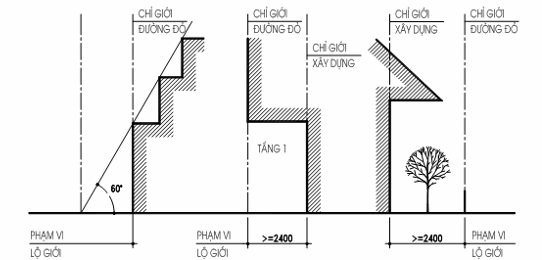
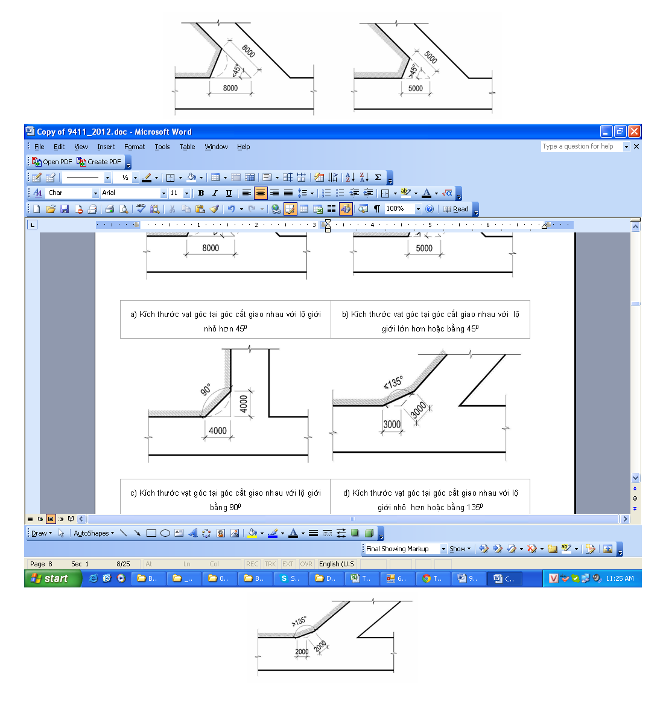
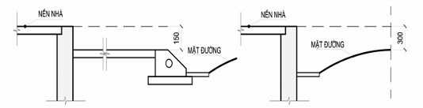
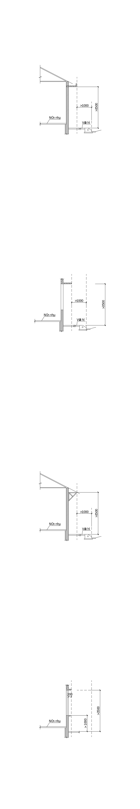
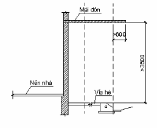
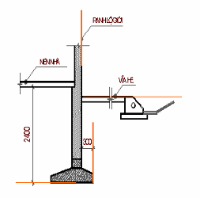
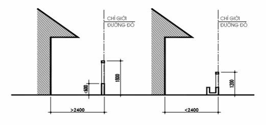

# TIÊU CHUẨN QUỐC GIA

**TCVN 9411 : 2012**

NHÀ Ở LIÊN KẾ - TIÊU CHUẨN THIẾT KẾ

Row houses - Design standards

## Lời nói đầu

**TCVN 9411 : 2012 được chuyển đổi từ TCXDVN 353 : 2005 theo quy định tại khoản 1 Điều 69 của Luật Tiêu chuẩn và Quy chuẩn kỹ thuật và điểm b) khoản 1 Điều 7 Nghị định 127/2007/NĐ- CP ngày 01/8/2007 của Chính phủ quy định chi tiết thi hành một số điều của Luật Tiêu chuẩn và Quy chuẩn kỹ thuật.**

**TCVN 9411 : 2012 do Viện Kiến trúc, Quy hoạch Đô thị và Nông thôn biên soạn, Bộ Xây dựng đề nghị, Tổng cục Tiêu chuẩn Đo lường Chất lượng thẩm định, Bộ Khoa học và Công nghệ công bố.**

**TCVN 9411 : 2012**

NHÀ Ở LIÊN KẾ - TIÊU CHUẨN THIẾT KẾ

Row houses - Design standards

---

## 1  PHẠM VI ÁP DỤNG

Tiêu chuẩn này áp dụng để thiết kế các nhà ở riêng lẻ được xây dựng thành dãy có sự thống nhất về kiến trúc và hệ thống hạ tầng, đáp ứng yêu cầu thiết kế đô thị.

## 2  TÀI LIỆU VIỆN DẪN

Các tài liệu viện dẫn sau rất cần thiết cho việc áp dụng tiêu chuẩn này. Đối với các tài liệu viện dẫn ghi năm công bố thì áp dụng phiên bản được nêu. Đối với các tài liệu viện dẫn không ghi năm công bố thì áp dụng phiên bản mới nhất, bao gồm các sửa đổi, bổ sung (nếu có).

TCVN 2622, Phòng cháy, chống cháy cho nhà và công trình - Yêu cầu thiết kế;

TCVN 4474, Thoát nước bên trong - Tiêu chuẩn thiết kế;

TCVN 4513, Cấp nước bên trong - Tiêu chuẩn thiết kế;

TCVN 4605, Kỹ thuật nhiệt - Kết cấu ngăn che - Tiêu chuẩn thiết kế;

TCVN 5687 : 2010, Thông gió - Điều hoà không khí - Tiêu chuẩn thiết kế;

TCVN 7447, Hệ thống lắp đặt điện của các toà nhà;

TCVN 9385 : 20121) , Chống sét cho công trình xây dựng - Hướng dẫn thiết kế, kiểm tra và bảo trì hệ thống;

TCXD 16 : 19861), Chiếu sáng nhân tạo trong công trình dân dụng;

TCXD 29 : 19911), Chiếu sáng tự nhiên trong công trình dân dụng - Tiêu chuẩn thiết kế;

TCXDVN 264 : 20021), Nhà và công trình - Nguyên tắc cơ bản xây dựng công trình để đảm bảo người tàn tật tiếp cận sử dụng;

&nbsp;&nbsp;\- --------------------------------

1) TCVN sắp ban hành

1) Các TCXD và TCXDVN đang được chuyển đổi

## 3  THUẬT NGỮ VÀ ĐỊNH NGHĨA

Trong tiêu chuẩn này, sử dụng các thuật ngữ và định nghĩa sau:

Nhà ở riêng lẻ

Công trình được xây dựng trong khuôn viên đất ở, thuộc quyền sử dụng của hộ gia đình, cá nhân theo quy định của pháp luật kể cả trường hợp xây dựng trên lô đất của dự án nhà ở.

Nhà ở liên kế

Loại nhà ở riêng lẻ của các hộ gia đình, cá nhân được xây dựng liền nhau, thông nhiều tầng được xây dựng sát nhau thành dãy trong những lô đất nằm liền nhau và có chiều rộng nhỏ hơn so với chiều sâu (chiều dài) của nhà, cùng sử dụng chung một hệ thống hạ tầng của khu vực đô thị.

Nhà ở liên kế mặt phố (nhà phố)

Loại nhà ở liên kế, được xây dựng trên các trục đường phố, khu vực thương mại, dịch vụ theo quy hoạch đã được duyệt. Nhà liên kế mặt phố ngoài chức năng để ở còn sử dụng làm cửa hàng buôn bán, dịch vụ văn phòng, nhà trọ, khách sạn, cơ sở sản xuất nhỏ và các dịch vụ khác.

Nhà ở liên kế có sân vườn

Loại nhà ở liên kế, phía trước hoặc phía sau nhà có một khoảng sân vườn nằm trong khuôn viên của mỗi nhà và kích thước được lấy thống nhất cả dãy theo quy hoạch chi tiết của khu vực.

Chỉ giới đường đỏ

Đường ranh giới phân định giữa lô đất để xây dựng thuộc quyền sử dụng của chủ sở hữu và phần đất được được dành cho đường giao thông hoặc các công trình kỹ thuật hạ tầng.

Chỉ giới xây dựng công trình

Ranh giới xác định giới hạn cho phép xây dựng nhà trên lô đất.

## 4  QUY ĐỊNH CHUNG

Nhà ở liên kế được xây dựng theo quy hoạch chung tại các tuyến đường trong đô thị hoặc ngoại vi. Việc thiết kế và xây dựng phải tuân thủ theo thiết kế và quy định về kiến trúc đô thị được duyệt đối với nhà ở riêng lẻ.

Khi thiết kế xây dựng mới hoặc cải tạo nhà liên kế hai bên tuyến đường đô thị phải hài hòa với tổng thể kiến trúc tuyến phố và phải bảo đảm mỹ quan riêng của công trình.

Khi thiết kế mặt đứng cho một dãy nhà ở liên kế mặt phố cần đảm bảo các nguyên tắc sau :

Có số tầng và cao độ các tầng như nhau trong một dãy nhà;

Có hình thức kiến trúc hài hoà và mái đồng nhất trong một khu vực;

Có màu sắc chung cho một dãy nhà;

Thống nhất khoảng lùi và hình thức hàng rào cho một dãy nhà;

Có hệ thống kỹ thuật hạ tầng thống nhất;

Chiều dài của một dãy nhà ở liên kế không lớn hơn 60 m. Trong một đoạn phố có thể có nhiều dãy nhà khác nhau.

Giữa các dãy nhà phải bố trí đường giao thông với chiều rộng không nhỏ hơn 4,0 m.

Nhà ở liên kế mặt phố xây dựng mới không đồng thời thì các nhà xây sau phải tuân thủ quy hoạch chi tiết được duyệt và thống nhất với các nhà xây trước về cao độ nền, độ cao tầng 1 (tầng trệt), cao độ ban công, cao độ và độ vươn của ô văng, màu sắc hoàn thiện...

Những khu vực sau đây trong đô thị không cho phép xây nhà ở liên kế:

Trong các khuôn viên, trên các tuyến đường, đoạn đường đã được quy định trong quy hoạch chi tiết là biệt thự;

Các khu vực đã có quy hoạch ổn định; nếu xây dựng nhà ở liên kế phải được cấp có thẩm quyền phê duyệt;

Trong khuôn viên có các công trình công cộng như trụ sở cơ quan, các công trình thương mại, dịch vụ, các cơ sở sản xuất;

Trên các tuyến đường, đoạn đường, các khu vực được xác định là đối tượng bảo tồn kiến trúc và cảnh quan đô thị.

Nhà ở liên kế mặt phố được phép có chung hoặc không có chung bộ phận kết cấu (móng, cột, tường, sàn, mái hoặc các kết cấu giáp lai khác của hai nhà liền kề).

Trường hợp tường chung thì hệ thống kết cấu dầm sàn, cột hoặc bất kỳ một bộ phận nào của ngôi nhà không được xây dựng quá tim tường chung. Chiều dày tường chung không nhỏ hơn 0,2 m;

Trường hợp có tường riêng thì chỉ được phép xây dựng trong ranh giới có chủ quyền hoặc quyền sử dụng đất.

Nhà ở liên kế có sân vườn thì kích thước tối thiểu (tính từ mặt nhà đến chỉ giới đường đỏ) của sân trước là 2,4 m và thống nhất theo quy hoạch chi tiết được duyệt. Trường hợp có thêm sân sau thì kích thước tối thiểu của sân sau là 2,0 m.

Thiết kế nhà ở liên kế phải đảm bảo các quy định khác liên quan như an toàn phòng cháy chữa cháy, môi trường, giao thông,...

## 5  YÊU CẦU VỀ QUY HOẠCH

Yêu cầu về lô đất xây dựng

Lô đất xây dựng nhà ở liên kế có chiều rộng không nhỏ hơn 4,5 m và diện tích không nhỏ hơn 45 $m^{2}$. Tùy thuộc diện tích lô đất xây dựng, mật độ xây dựng nhà ở liên kế được lấy theo quy định về quy hoạch xây dựng 1.

**CHÚ THÍCH:** 

Nhà ở liên kế xây dựng trong các dự án phải bảo đảm diện tích xây dựng không nhỏ hơn 50 $m^{2}$ và có chiều rộng mặt tiền không nhỏ hơn 5 m.

Trường hợp sau khi giải phóng mặt bằng hay nâng cấp cải tạo công trình, diện tích còn lại nhỏ hơn 15 $m^{2}$, chiều rộng mặt tiền hoặc chiều sâu so với chỉ giới xây dựng nhỏ hơn 3,0 m thì không được phép xây dựng.

Nhà liên kế mặt phố sâu trên 18 m phải có giải pháp kiến trúc tạo không gian đảm bảo thông gió và chiếu sáng.

**CHÚ THÍCH:** Có thể bố trí sân trống, giếng trời, mái sáng và lỗ thoáng trên khối cầu thang để chiếu sáng và thông gió.

Yêu cầu về khoảng lùi

Nhà ở liên kế phải xây dựng tuân theo chỉ giới xây dựng và chỉ giới đường đỏ.

Khoảng lùi tối thiểu của mặt tiền của nhà ở liên kế so với chỉ giới đường đỏ phụ thuộc chiều cao công trình và chiều rộng của lộ giới, được lấy theo quy định về quy hoạch xây dựng 1.

Nhà ở liên kế được phép xây dựng sát chỉ giới đường đỏ hoặc có khoảng lùi tuỳ theo quy hoạch cụ thể của từng tuyến đường phố (xem Hình 1a). Trong trường hợp xây lùi hơn so với chỉ giới đường đỏ thì phần diện tích nằm trong khoảng lùi này thuộc quyền sử dụng của chủ sở hữu. Dọc theo chỉ giới đường đỏ của ngôi nhà được phép làm hàng rào (xem Hình 1b).

Mặt tiền nhà liên kế mặt phố có sân vườn phải lùi vào một khoảng tối thiểu là 2,4 m so với chỉ giới xây dựng (xem Hình 1c).

<!-- DIAGRAM: word/media/image1.png -->

| a) Nhà liên kế mặt phố sau tuyến phố | b) Nhà liên kế mặt phố sau hàng rào | c) Nhà liên kế mặt phố có sân vườn |
| :--- | :--- | :--- |

<strong>Hình 1 — Quy định về khoảng lùi của nhà liên kế mặt phố</strong>

<em>Đơn vị tính bằng milimét</em>

Yêu cầu về tầm nhìn

Để đảm bảo an toàn và tầm nhìn cho các phương tiện giao thông khi lưu thông trên đường phố, các ngôi nhà ở góc đường phải được cắt vát theo quy định trong Bảng 1 (xem Hình 2).

Kích thước tính bằng mét

### Bảng 1 - Kích thước vạt góc tính từ điểm giao nhau với các lộ giới

| Góc cắt giao nhau với lộ giới | Kích thước vạt góc |
| :--- | :--- |
| Nhỏ hơn 45° | 8,0 x 8,0 |
| Lớn hơn hoặc bằng 45° | 5,0 x 5,0 |
| 90° | 4,0 x 4,0 |
| Nhỏ hơn hoặc bằng 135° | 3,0 x 3,0 |
| Lớn hơn 135° | 2,0 x 2,0 |

<!-- DIAGRAM: word/media/image2.png -->

| a) Kích thước vạt góc tại góc cắt giao nhau với lộ giới nhỏ hơn 45° | b) Kích thước vạt góc tại góc cắt giao nhau với lộ giới lớn hơn hoặc bằng 45° |
| :--- | :--- |

<!-- DIAGRAM: word/media/image3.png -->

| c) Kích thước vạt góc tại góc cắt giao nhau với lộ giới bằng 90° | d) Kích thước vạt góc tại góc cắt giao nhau với lộ giới nhỏ hơn hoặc bằng 135° |
| :--- | :--- |

<!-- DIAGRAM: word/media/image4.png -->

e) \- Kích thước vạt góc tại góc cắt giao nhau với lộ giới lớn hơn 135°

<strong>Hình 2 — Quy định về kích thước vạt góc</strong>

Yêu cầu về khoảng cách và quan hệ với công trình bên cạnh

Khoảng cách giữa hai đầu hồi của hai dãy nhà liên kế không nhỏ hơn 4,0 m. Các cánh cửa ở độ cao từ mặt hè đến 2,5 m khi mở ra không được vượt quá chỉ giới đường đỏ.

Khoảng cách giữa hai mặt tiền của hai dãy nhà liên kế mặt phố từ 8,0 m đến 12,0 m. Phần đất trống giữa hai dãy nhà không được xây chen bất cứ công trình nào. Mặt bên của nhà liên kế mặt phố tiếp giáp với phần đất trống được mở cửa sổ và ban công.

Trường hợp hai dãy nhà ở liên kế quay lưng vào nhau phải đảm bảo khoảng cách không nhỏ hơn 2,0 m (ngoài chỉ giới xây dựng) để bố trí đường ống kỹ thuật dọc theo nhà. Mặt sau của hai dãy nhà liên kế được phép mở cửa đi, cửa sổ và cửa thông gió ở độ cao trên 2,0 m so với sàn nhà. Ranh giới giữa hai dãy nhà nếu cần thiết có thể xây tường kín cao trên 2,0 m.

**CHÚ THÍCH:** Nếu có sân sau thì không cần có khoảng cách trên.

Khoảng cách từ các bộ phận kiến trúc đến hệ thống kỹ thuật hạ tầng và cây xanh đô thị:

Khoảng cách từ các bộ phận kiến trúc đến các đường dây điện gần nhất:

Theo mặt phẳng nằm ngang:

Đến đường dây cao thế: 4,0 m (từ mép ngoài cùng của kiến trúc);

Đến đường dây trung thế: 2,5 m (từ mép ngoài cùng của kiến trúc);

Đến đường dây hạ thế:

Từ cửa sổ: 0,75m;

Từ mép ngoài cùng của ban công: 1,0 m;

Khoảng cách tối thiểu từ mép ngoài cùng của kiến trúc đến cột điện: 0,75 m.

Theo chiều đứng:

Khoảng cách thẳng đứng từ công trình tới dây điện dưới cùng phải đảm bảo:

Đối với điện áp tới 35KV:3 m;

Đối với điện áp 66-100KV:4 m;

Đối với điện áp 220 (230)KV:5 m;

Trên mái nhà, trên ban công:2,5m;

Trên cửa sổ:0,5 m;

Dưới cửa sổ:1,0 m;

Dưới ban công:1,0 m.

Khoảng cách tối thiểu từ mép ngoài cùng của bộ phận kiến trúc đến tuyến ống, cáp ngầm đô thị:

Đến đường cáp ngầm:1,0 m;

Đến mặt ống ngầm và hố ga:1,0 m.

Khoảng cách giữa mép ngoài cùng tường nhà tiếp giáp với cây bụi, cây thân gỗ phải đảm bảo từ 2 m đến 5 m.

**CHÚ THÍCH:** Đối với các khu vực đã trồng cây ổn định, khoảng cách này sẽ được quy định trong quy hoạch chi tiết tuyến phố.

Yêu cầu về chiều cao

Trong mọi trường hợp nhà ở liên kế không được cao hơn 6 tầng. Trong các ngõ (hẻm) có chiều rộng nhỏ hơn 6 m, nhà ở liên kế không được xây cao quá 4 tầng.

Chiều cao của nhà ở liên kế phải tuân theo quy hoạch xây dựng được duyệt.

Đối với các khu vực chưa có quy hoạch chi tiết được duyệt thì chiều cao nhà không lớn hơn 4 lần chiều rộng nhà (không kể phần giàn hoa hoặc kiến trúc trang trí).

Trong một dãy nhà liên kế nếu cho phép có độ cao khác nhau thì chỉ được phép xây cao hơn tối đa 2 tầng so với tầng cao trung bình của cả dãy. Độ cao tầng 1 (tầng trệt) phải đồng nhất.

Đối với nhà liên kế có sân vườn, chiều cao không lớn hơn 3 lần chiều rộng của ngôi nhà hoặc theo khống chế chung của quy hoạch chi tiết.

Các tuyến đường, phố có chiều rộng lớn hơn 12 m, chiều cao nhà ở liên kế được hạn chế theo góc vát 45° (chiều cao mặt tiền ngôi nhà bằng chiều rộng đường).

Trường hợp các tuyến đường, phố có chiều rộng nhỏ hơn hoặc bằng 12 m, chiều cao nhà ở liên kế không được cao hơn giao điểm giữa đường với góc vát 45° (không lớn hơn chiều rộng đường).

Đối với các khu vực có đường nội bộ bên trong, chiều cao của nhà liên kế không vượt quá giao điểm giữa đường với góc vát 30° (không vượt quá 0,6 lần chiều rộng đường).

Tùy thuộc vào vị trí, kích thước của từng lô đất, chiều cao của nhà ở liên kế có thể được thiết kế theo quy định sau:

Lô đất có diện tích 30 $m^{2}$ đến nhỏ hơn 40 $m^{2}$, chiều rộng mặt tiền lớn hơn 3 m, chiều sâu so với chỉ giới xây dựng lớn hơn 5 m thì được phép xây dựng không quá 4 tầng + 1 tum (tổng chiều cao của nhà không lớn hơn 16 m);

Lô đất có diện tích 40 $m^{2}$ đến 50 $m^{2}$, chiều rộng mặt tiền từ trên 3 m đến dưới 8 m, chiều sâu so với chỉ giới xây dựng lớn hơn 5 m thì được phép xây dựng không quá 5 tầng + 1 tum, hoặc có mái chống nóng (tổng chiều cao của nhà không lớn hơn 20 m);

Lô đất có diện tích trên 50 $m^{2}$, chiều rộng mặt tiền lớn hơn 8 m, chiều sâu so với chỉ giới xây dựng lớn hơn 5 m hoặc công trình xây dựng hai bên tuyến đường trong khu vực quy hoạch hạn chế phát triển thì chỉ được xây nhà 6 tầng (tổng chiều cao nhà không lớn hơn 24 m).

Trong trường hợp dãy nhà liên kế có khoảng lùi thì cho phép tăng chiều cao công trình theo chiều cao tối đa được duyệt trong quy hoạch xây dựng, quy định về kiến trúc, cảnh quan của khu vực.

**CHÚ THÍCH:** 

Trong dãy nhà liên kế mặt phố cần có khoảng lùi thống nhất cho toàn đoạn phố. Trong trường hợp các khoảng lùi hiện hữu không thống nhất, khoảng lùi chung được xác định bằng trị số trung bình của các khoảng lùi hiện hữu, làm tròn đến 0,5 m.

Không được xây dựng, lắp đặt thêm các vật thể kiến trúc khác cao hơn chiều cao cho phép của công trình.

Chiều cao thông thuỷ của tầng một (tầng trệt) không nhỏ hơn 3,6 m. Đối với nhà có tầng lửng thì chiều cao tầng một không nhỏ hơn 2,7 m.

## 6  YÊU CẦU VỀ KIẾN TRÚC

Khi thiết kế nhà ở liên kế cần phải phù hợp với công năng sử dụng, phù hợp với điều kiện kinh tế xã hội, điều kiện khí hậu tự nhiên và giải pháp thiết kế được lựa chọn.

**CHÚ THÍCH:** Khi xây dựng nhà ở liên kế cần tính đến nhu cầu sử dụng của người khuyết tật theo quy định trong TCXDVN 264: 2002.

Các không gian chức năng trong nhà ở liên kế phải đảm bảo các yêu cầu sau:

Hợp lý về dây chuyền sử dụng, đảm bảo độc lập, khép kín, không gian kiến trúc hài hoà trong và ngoài nhà;

Thích ứng với các nhu cầu sắp xếp khác nhau, có khả năng chuyển đổi linh hoạt; Có không gian rộng, thoáng, bố cục mở để tăng hiệu quả không gian nội thất của ngôi nhà;

Sử dụng hợp lý, an toàn, không phá vỡ cấu trúc và độ bền vững công trình;

Bảo đảm yêu cầu vệ sinh và điều kiện vi khí hậu.

Các không gian chức năng trong nhà ở liên kế:

Không gian chức năng giao tiếp: gồm các không gian sảnh: đón khách, giao dịch hoặc các hoạt động khác phục vụ nhu cầu giao tiếp;

Không gian chức năng dịch vụ: cửa hàng, không gian làm dịch vụ, sản xuất, gia công;

Không gian chức năng ở: bao gồm các phòng ở;

Không gian khác: nơi để xe, thiết bị điện, nước, thu gom rác, kho hoặc các vật dụng khác;

Không gian chức năng giao thông: cầu thang bộ, hành lang, thang máy (nếu có).

Không gian chức năng giao tiếp

Sảnh chính của nhà ở liên kế phải dễ dàng nhận biết.

Trường hợp nhà ở liên kế mặt phố, sảnh thường được kết hợp với không gian giao tiếp của nhà.

Không gian chức năng dịch vụ

Không gian chức năng dịch vụ trong nhà ở liên kế thường bố trí ở tầng một (tầng trệt) có lối vào trực tiếp từ đường phố, được bố trí kết hợp với không gian ở và phân định theo chiều đứng của nhà.

Trong nhà ở liên kế không được bố trí các cửa hàng kinh doanh hoá chất, các loại hàng hoá gây ô nhiễm môi trường, cháy nổ để đảm bảo an toàn và vệ sinh môi trường.

Không gian chức năng ở

Các chức năng chính trong không gian ở của nhà ở liên kế gồm: phòng sinh hoạt chung; chỗ làm việc, học tập; phòng tập, phòng chơi (nghe nhạc, xem phim, trưng bày và các nhu cầu giải trí khác); chỗ thờ cúng tổ tiên; các phòng ngủ; phòng ăn; bếp; khu vệ sinh (xí, tắm); chỗ giặt, phơi quần áo; ban công hoặc logia; kho chứa đồ...

Tiêu chuẩn diện tích các bộ phận công trình lấy theo yêu cầu sử dụng, đảm bảo an toàn và sức khoẻ cho người sử dụng.

Không gian chức năng khác

Trong nhà ở liên kế cần bố trí chỗ để xe, kho, trang thiết bị phòng chống cháy, nơi thu gom rác thải, máy bơm nước, máy phát điện dự phòng và các vật dụng khác.

Trường hợp nhà ở liên kế sử dụng tầng một (tầng trệt) làm chỗ để ô tô phải đảm bảo yêu cầu về an toàn cháy cho nhà và công trình 2.

Không gian chức năng giao thông

Vị trí cầu thang, số lượng thang và hình thức gian cầu thang phải đáp ứng yêu cầu sử dụng thuận tiện và thoát người an toàn. Chiều rộng của cầu thang bộ dùng để thoát người không nhỏ hơn 0,9 m. Chiều rộng mặt bậc không nhỏ hơn 0,25 m, còn chiều cao bậc không lớn hơn 0,19 m.

**CHÚ THÍCH:** Cầu thang bộ dùng cho người khuyết tật cần tuân thủ các quy định trong TCXDVN 264 : 2002

Trường hợp có nhu cầu có thể bố trí thang máy trong nhà ở liên kế. Số lượng, vị trí lắp đặt và kích thước gian thang máy phải phù hợp với yêu cầu sử dụng. Việc thiết kế và lựa chọn thang máy phải căn cứ vào:

Số tầng cần phục vụ;

Lượng người cần vận chuyển đáp ứng nhu cầu sử dụng;

Nhà có người khuyết tật sử dụng;

Các yêu cầu kỹ thuật khác.

Ngoài việc xác định các thông số kỹ thuật của thang máy cũng cần tính đến giải pháp thiết kế giếng thang, phòng đặt máy và thiết bị, các yếu tố về kinh tế, diện tích chiếm chỗ của thang.

Thiết kế lắp đặt thang máy và yêu cầu khi sử dụng cần tuân thủ theo các quy định của nhà sản xuất.

Yêu cầu thiết kế các bộ phận công trình

Cao độ nền nhà, bậc thềm, vệt dắt xe, bồn hoa ở mặt tiền nhà

Cao độ nền nhà phải cao hơn cao độ vỉa hè tối thiểu là 150 mm (xem Hình 3.a). Vị trí không có vỉa hè rõ ràng thì cao độ nền nhà phải cao hơn cao độ mặt đường tối thiểu là 300 mm (xem Hình 3.b).

**CHÚ THÍCH:** Cao độ vỉa hè được quy định là cao độ ± 0.000 tại vị trí có công trình để tính toán chiều cao cho phép của ngôi nhà.

<!-- DIAGRAM: word/media/image5.png -->

| a) Cao độ nền nhà cao hơn cao độ vỉa hè | b) Cao độ nền nhà cao hơn cao độ mặt đường |
| :--- | :--- |

<strong>Hình 3 — Quy định cao độ nền nhà</strong>

Khi thiết kế xây dựng nhà ở liên kế mặt phố, cần chú ý các quy định sau:

Trường hợp chỉ giới xây dựng trùng với chỉ giới đường đỏ (xem Hình 4):

Trong khoảng cách từ mặt vỉa hè lên tới độ cao 3,5 m, mọi bộ phận của nhà đều không được nhô quá chỉ giới đường đỏ, trừ các trường hợp dưới đây:

Đường ống đứng thoát nước mưa ở mặt ngoài nhà: được phép vượt qua chỉ giới đường đỏ 0,2 m và phải đảm bảo mỹ quan;

Từ độ cao trên 1,0 m (tính từ mặt vỉa hè), các bậu cửa, gờ chỉ, bộ phận trang trí được phép vượt quá chỉ giới đường đỏ 0,2 m (xem Hình 4d).

Trong khoảng cách từ mặt vỉa hè lên tới độ cao 3,5 m: Tất cả các bộ phận cố định của nhà (ô-văng, sê-nô, ban công, mái đua..., trừ mái đón, mái hè) được phép vượt quá chỉ giới đường đỏ, nhưng phải đảm bảo độ vươn ra không được lớn hơn giới hạn được quy định trong 6.4.2, đồng thời phải đảm bảo các quy định về an toàn lưới điện và tuân thủ quy định về quản lý xây dựng áp dụng cụ thể cho khu vực.

**CHÚ THÍCH:** Độ vươn ra được tính từ chỉ giới đường đỏ tới mép ngoài cùng của phần nhô ra.

| a) Trường hợp phần đua ra là sê nô, ô văng, mái dốc | b) Trường hợp phần đua ra là ô văng cửa sổ |
| :--- | :--- |
| c) Trường hợp phần đua ra là con sơn mái dốc | d) Các bộ phận khác như gờ chỉ, bậu cửa, bộ phận trang trí |

<strong>Hình 4 — Quy định về độ vươn ra của các bộ phận công trình</strong>

Trường hợp chỉ giới xây dựng lùi vào sau chỉ giới đường đỏ:

Không có bộ phận nào của nhà vượt quá chỉ giới đường đỏ;

Các bộ phận của công trình như bậc thềm, vệt dắt xe, bậu cửa, gờ chỉ, cách cửa, ô-văng, mái đua, mái đón, móng nhà được phép vượt quá chỉ giới xây dựng.

Tất cả các bộ phận của ngôi nhà, kể cả bộ phận trang trí cho kiến trúc đều không được xây dựng vượt quá ranh giới lô đất hoặc ranh giới nền nhà thuộc quyền sử dụng của người khác.

Mái đón, mái hè phố

Trong khoảng cách từ mặt vỉa hè tới độ cao trên 3,5 m được phép làm mái đón, mái hè phố. Bộ phận nhô ra của mái đón,mái hè phố cách mép vỉa hè không lớn hơn 0,6 m, đồng thời phải nhỏ hơn chiều rộng vỉa hè ít nhất 1,0 m. Không được trồng cột trên vỉa hè (xem Hình 5).

**CHÚ THÍCH:** 

Mái đón là mái che của cổng, gắn vào tường ngoài nhà và đua ra tới cổng vào nhà và hoặc che một phần đường đi từ hè, đường vào nhà;

Mái hè phố là mái che gần vào tường ngoài nhà và che phủ một đoạn vỉa hè.

<strong>Hình 5 — Độ vươn ra cho phép của mái đón, mái hè phố</strong>

Bên trên mái đón, mái hè phố không không được sử dụng làm ban công, sân thượng, sân bày chậu cảnh hay các vật thể kiến trúc khác.

Cửa đi, cửa sổ

Không được phép mở cửa đi, cửa sổ, cửa thông gió nếu tường nhà xây sát với ranh giới lô đất hoặc ranh giới nền nhà thuộc quyền sử dụng của người khác. Chỉ được phép mở cửa đi, cửa sổ, lỗ thông hơi nếu tường xây cách ranh giới lô đất, ranh giới nền nhà bên cạnh từ 2,0 m trở lên.

Trường hợp khu đất liền kề chưa có công trình được xây dựng hoặc là công trình thấp tầng thì được phép mở các loại cửa thông gió hoặc cửa kính cố định lấy ánh sáng. Cạnh dưới của các loại cửa này phải cách mặt sàn tối thiểu là 2,0 m. Tất cả các cửa này phải chấp nhận không được sử dụng khi công trình liền kề được xây dựng.

Nếu dãy nhà ở liên kế tiếp giáp với khu đất công cộng như vườn hoa, công viên, bãi đỗ xe, bãi trống hoặc các không gian công cộng không ảnh hưởng đến dãy nhà liên kế nói trên, cho phép mở cửa sổ cố định hoặc các bộ phận trang trí nhưng phải được cơ quan chức năng xem xét quyết định trong từng trường hợp.

Ban công

Đối với những ngôi nhà có ban công giáp phố thì vị trí độ cao và độ vươn ra của ban công phải phù hợp với quy hoạch chi tiết được duyệt và tuân theo quy định về quản lý xây dựng khu vực.

Độ vươn ra của ban công đối với nhà ở liên kế mặt phố phụ thuộc vào chiều rộng lộ giới và không được lớn hơn các kích thước quy định trong Bảng 2.

Kích thước tính bằng mét

### Bảng 2 - Độ vươn tối đa của ban công

| Chiều rộng lộ giới | Độ vươn ra tối đa |
| :--- | :---: |
| Dưới 5 | 0 |
| Từ 5 đến 7 | 0,5 |
| Từ 7 đến 12 | 0,9 |
| Từ 12 đến 15 | 1,2 |
| Trên 15 | 1,4 |

> **CHÚ THÍCH:**
>
> &nbsp;&nbsp;\- Trên phần nhô ra chỉ được làm ban công, không được che chắn tạo thành lô-gia hay buồng.
>
> &nbsp;&nbsp;\- Trường hợp lộ giới có chiều rộng trên 15 m nhưng chiều rộng vỉa hè nhỏ hơn 3 m, thì độ vươn ban công tối đa là 1,2 m.

Mặt dưới cùng của ban công phải cao hơn mặt vỉa hè tối thiểu là 3,5 m.

Không được phép làm ban công ở các ngõ/hẻm có chiều rộng nhỏ hơn 4,0 m và có dãy nhà liên kế ở hai bên ngõ. Trường hợp chỉ có một dãy nhà ở một bên ngõ thì được làm ban công có độ vươn ra tối đa là 0,6 m.

**CHÚ THÍCH:** Trường hợp đường (hoặc ngõ/hẻm) có hệ thống đường dây điện đi nổi thì khi xây dựng ô văng, ban công phải bảo đảm các quy định về hành lang an toàn đối với hệ thống đường dây điện.

Phần ngầm dưới đất

Tất cả bộ phận ngầm dưới mặt đất của ngôi nhà không được vượt quá chỉ giới đường đỏ.

Giới hạn ngoài cùng của móng nhà và đường ống dưới đất không được vượt quá ranh giới lô đất hoặc ranh giới nền nhà.

Trường hợp đặc biệt cho phép móng nhà vượt quá chỉ giới đường đỏ, ranh giới đường (ngõ/hẻm) tối đa là 0,3 m với điều kiện cao độ của đáy móng thấp hơn cao độ vỉa hè tối thiểu là 2,4 m (xem Hình 6).

<strong>Hình 6 — Quy định móng nhà giáp đường</strong>

Hàng rào và cổng

Đối với nhà ở liên kế mặt phố, hàng rào mặt tiền phải có hình thức kiến trúc thoáng, nhẹ, mỹ quan, thống nhất theo quy định của từng khu vực và phải đảm bảo các yêu cầu sau:

Hàng rào không được phép xây dựng vượt ngoài ranh giới kể cả móng và có chiều cao tối đa 2,6 m;

Khi mặt tiền nhà cách chỉ giới đường đỏ, ranh giới với ngõ/hẻm trên 2,4 m, chỉ được phép xây dựng hàng rào thoáng hoặc hàng rào cây bụi (xem Hình 7.a);

Trường hợp mặt tiền nhà cách chỉ giới đường đỏ, ranh giới ngõ/hẻm nhỏ hơn 2,4 m, chỉ được xây hàng rào nhẹ thoáng, có chiều cao không quá 1,2 m hoặc xây các bồn hoa để ngăn cách ranh giới. (xem Hình 7.b);

Trường hợp có yêu cầu đặc biệt về bảo vệ an toàn, thì hàng rào được che kín lại bằng vật liệu nhẹ. Phần che kín chỉ được phép cao tối đa 1,8 m.

Ngăn cách ranh giới giữa hai nhà phải có hàng rào thoáng cao bằng hàng rào mặt tiền. Phần chân rào có thể xây đặc cao tối đa là 0,6 m.

<!-- DIAGRAM: word/media/image12.png -->

| a) Mặt tiền nhà cách chỉ giới đường đỏ lớn hơn 2,4 m | b) Mặt tiền nhà cách chỉ giới đường đỏ nhỏ hơn 2,4 m |
| :--- | :--- |

<strong>Hình 7 — Quy định cổng, hàng rào</strong>

Khi xây dựng cổng nhà ở liên kế (không phải nhà phố) cần tuân theo các quy định sau:

Mỗi một nhà ở liên kế chỉ được phép mở một cổng chính. Việc mở thêm các cổng phụ, lối thoát nạn phải căn cứ vào yêu cầu cụ thể của công trình và được các cấp thẩm quyền xem xét, quyết định.

Cánh cổng không được phép mở ra ngoài chỉ giới đường đỏ, ranh giới ngõ/hẻm hoặc ranh giới đất thuộc quyền sử dụng của người khác Mép ngoài của trụ cổng không được vi phạm vào chỉ giới đường đỏ.

Vỉa hè

Không được thay đổi kết cấu vỉa hè trước mặt nhà.

Không xây bậc thềm trong phạm vi vỉa hè.

Các yêu cầu kỹ thuật khác

Miệng xả ống khói, ống thông hơi không được hướng ra đường phố.

Các thiết bị điện như ăng- ten truyền hình, thiết bị thu nhận tín hiệu vệ tinh, trạm phát sóng viễn thông, máy điều hòa, thiết bị thu năng lượng mặt trời, bồn nước hoặc các thiết bị khác nếu lắp đặt trong phạm vi ranh giới lô đất phải đảm bảo ít gây ảnh hưởng mỹ quan đô thị và các ngôi nhà liền kề, đảm bảo các quy định chuyên ngành và được các cơ quan quản lý có thẩm quyền cho phép.

Máy điều hòa nhiệt độ nếu đặt ở mặt tiền, sát chỉ giới đường đỏ phải ở độ cao trên 2,7 m và không được xả nước ngưng tụ trực tiếp lên mặt hè, đường phố.

Không được xả nước mưa, nước thải các loại (kể cả nước ngưng tụ của máy điều hòa), khí bụi, khí thải sang nhà bên cạnh.

Mặt ngoài nhà (mặt tiền, mặt bên) không được sử dụng màu sắc, vật liệu gây ảnh hưởng tới thị giác, sức khoẻ con người, yêu cầu về vệ sinh và an toàn giao thông.

Không sử dụng vật liệu và biển quảng cáo đặt ở mặt tiền ngôi nhà có độ phản quang lớn hơn 70 %.

Có giải pháp phòng chống mối mọt cho các công trình xây mới.

Không được sử dụng mái vẩy, mái tạm, hạn chế bố trí sân phơi quần áo tại mặt tiền nhà.

## 7  YÊU CẦU VỀ HỆ THỐNG KỸ THUẬT VÀ VỆ SINH MÔI TRƯỜNG

Yêu cầu thiết kế hệ thống cấp nước

Thiết kế hệ thống cấp nước cho nhà ở liên kế cần tuân thủ các quy định trong TCVN 4513.

Tiêu chuẩn dùng nước được tính như sau:

Đô thị loại I: từ 150 lít/ người/ ngày đêm đến 180 lít/ người/ ngày đêm;

Đô thị loại II: từ 120 lít/ người/ ngày đêm đến 150 lít/ người/ ngày đêm;

Đô thị loại III, IV, V: từ 80 lít/ người/ ngày đêm đến 100 lít/ người/ ngày đêm.

Bể/bồn chứa nước trên mái phải được thiết kế phù hợp với kiến trúc của ngôi nhà, không tạo sự tương phản trong hình thức kiến trúc mặt đứng, không làm ảnh hưởng đến kết cấu mái và nhà.

Phải có bể chứa nước ngầm trong từng nhà để đảm bảo cấp nước thường xuyên cho sinh hoạt và nước chữa cháy khi cần thiết.

Đường ống cấp nước vào nhà và phải được nối với đường ống cấp nước chung của khu ở.

Yêu cầu thiết kế hệ thống thoát nước

Tiêu chuẩn nước thải sinh hoạt được lấy theo tiêu chuẩn thoát nước và được thiết kế theo chế độ tự chảy. Thiết kế hệ thống thoát nước bên trong cần tuân thủ các quy định trong TCVN 4474.

Nước mưa và các loại nước thải không được xả trực tiếp lên mặt hè, đường phố mà phải theo hệ thống cống, ống ngầm từ nhà chảy vào hệ thống thoát nước chung của đô thị.

Hệ thống thoát nước mưa trên mái đảm bảo thoát nước mưa với mọi thời tiết trong năm. Hệ thống thoát nước mưa trên mái được thu gom qua các phễu thu chảy đến các ống đứng, nối vào hệ thống thoát nước của nhà. Cách bố trí phễu thu nước mưa trên mái phải dựa vào mặt bằng mái, diện tích thu nước cho phép của một phễu thu và kết cấu mái nhà.

Mỗi ngôi nhà phải lắp đặt bể tự hoại để xử lý nước thải của khu vệ sinh trước khi thải vào vào hệ thống thoát nước chung của đô thị. Nên bố trí hệ thống thoát nước phân tiểu và nước sinh hoạt riêng. Bể tự hoại được đặt ngầm dưới đất và phải có vật che chắn bảo vệ.

Toàn bộ hệ thống thoát nước thải phải đặt ngầm. Hệ thống thoát nước của mỗi nhà phải nối với hệ thống thoát nước chung của khu phố.

Hệ thống ống đứng không được phép rò rỉ và phải bố trí không ảnh hưởng đến mỹ quan kiến trúc. Ống thoát nước mưa, máng xối không được phép xả nước sang ranh giới lô đất hoặc ranh giới nền nhà liền kề.

Yêu cầu về thiết kế điện chiếu sáng

Thiết kế chiếu sáng tự nhiên cho nhà ở liên kế cần tuân thủ các quy định trong TCXD 29 : 1991. Chiếu sáng tự nhiên có thể là chiếu sáng bên, chiếu sáng trên hoặc chiếu sáng hỗn hợp.

Nếu kết hợp chiếu sáng tự nhiên với che chắn nắng thì các giải pháp kiến trúc không được ảnh hưởng đến chiếu sáng tự nhiên.

Thiết kế chiếu sáng nhân tạo cho nhà ở liên kế cần tuân thủ các quy định trong TCXD 16 : 1986.

**CHÚ THÍCH:** Chiếu sáng nhân tạo bao gồm chiếu sáng làm việc, chiếu sáng sự cố, chiếu sáng để phân tán người, chiếu sáng bảo vệ.

Khi thiết kế chiếu sáng nhân tạo phải đảm bảo độ rọi trên mặt bàn làm việc hoặc vật cần phân biệt trong từng căn phòng.

Hệ thống đường dây dẫn điện phải được thiết kế độc lập với các hệ thống khác và phải đảm bảo dễ dàng thay thế, sửa chữa khi cần thiết. Lắp đặt đường dây dẫn điện và thiết bị điện phải tuân thủ các quy định trong TCVN 7447. Hệ thống chiếu sáng được bảo vệ bằng áptômát. Các công tắc điều khiển được đặt ở độ cao 1,2 m.

**CHÚ THÍCH:** Để đảm bảo an toàn cho trẻ nhỏ tại các ổ điện, công tắc điều khiển phải có hộp hay lưới bảo vệ;

Việc thiết kế và lắp đặt hệ thống điện cần tuân theo các yêu cầu sau:

Đối với nhà liên kế có sân vườn, hộp điện phải được lắp đặt trên tường rào phía trước. Đối với nhà liên kế mặt phố, hộp điện phải được lắp đặt trên mặt tiền và nằm trong ranh giới ngôi nhà;

Số lượng, quy cách của các loại dây điện, ổ cắm, cầu dao công tắc phải phù hợp với thiết kế cho việc sử dụng điện của từng căn nhà;

Tủ phân phối điện phải có dây tiếp đất và phải có công tắc ngắt điện tự động. Các tủ phân phối điện phải làm bằng kim loại và kích cỡ phải phù hợp cho các loại mạch điện.

Để an toàn, tất cả các công tắc nối với nguồn điện phải dùng công tắc có cầu chì và phải được bảo vệ bằng bộ phận ngắt dòng tiếp đất;

Ổ cắm điện và hộp nối lắp đặt trong phòng tắm và nhà bếp phải là loại không thấm nước, có bộ phận ngắt dòng và phải được đặt ở vị trí và độ cao thích hợp.

Hệ thống chống sét phải được lắp đặt trên đỉnh của cấu trúc nhà và có dây tiếp đất. Tính toán hệ thống chống sét tuân phải tuân thủ các quy định trong TCVN 9385 : 2012.

Yêu cầu thiết kế hệ thống thông tin liên lạc, viễn thông và hệ thống kỹ thuật khác

Phải thiết kế đồng bộ hệ thống viễn thông và cáp truyền hình trong và ngoài công trình. Các loại dây phải đủ dung lượng đáp ứng cho nhu cầu sử dụng trước mắt và trong tương lai. Trong trường hợp cần thiết có thêm hệ thống điều khiển từ xa các thiết bị kỹ thuật.

Trong các phòng, các ổ cắm điện thoại đặt ngầm trong tường được bố trí ở độ cao 0,5 m tuỳ theo kiến trúc nội thất.

Thiết kế hệ thống chống trộm và bảo vệ an ninh cho toàn bộ ngôi nhà trong điều kiện có thể.

Yêu cầu thông gió và điều hoà không khí

Thiết kế hệ thống thông gió và điều hoà không khí cần tuân thủ các quy định trong TCVN 5687: 2010.

Khi thiết kế hệ thống thông gió và điều hoà không khí cần phải có các giải pháp công nghệ, giải pháp kiến trúc và kết cấu một cách hợp lý nhằm đảm bảo yêu cầu vệ sinh, yêu cầu kỹ thuật, tiết kiệm năng lượng và kinh tế.

Phải chừa sẵn vị trí lắp đặt hệ thống điều hoà để không ảnh hưởng đến mặt đứng kiến trúc của công trình.

Giàn máy nóng của máy điều hòa và ống hút mùi, quạt gió thoát ra từ bếp không được bố trí hướng sang ranh giới lô đất hoặc ranh giới nền nhà liền kế trong phạm vi dưới 4 m.

Khi thiết kế hệ thống thông gió và điều hoà không khí phải đảm bảo các chỉ tiêu giới hạn tiện nghi vi khí hậu cho phép như quy định ở Bảng 3.

### Bảng 3 - Giới hạn tiện nghi vi khí hậu bên trong nhà ở

| Các thời kỳ trong năm | Nhiệt độ không khí $^{0}$C — Tiện nghi | Nhiệt độ không khí $^{0}$C — Giới hạn cho phép | Độ ẩm tương đối % — Tiện nghi | Độ ẩm tương đối % — Giới hạn cho phép | Tốc độ chuyển động của không khí m/s — Tiện nghi | Tốc độ chuyển động của không khí m/s — Giới hạn cho phép |
| :--- | :--- | :--- | :--- | :--- | :--- | :---: |
| Lạnh | từ 22 đến 24 | từ 20 đến 22 | từ 70 đến 75 | từ 75 đến 80 | từ 0,2 đến 0,3 | 0,5 |
| Nóng | từ 25 đến 28 | 29 | 75 | 80 | từ 0,5 đến 1,0 | 1,5 |

Để đảm bảo thông gió tự nhiên cần tạo gió xuyên phòng bằng các giải pháp cửa đón gió vào và cửa thoát gió ra.

Cần sử dụng các giải pháp kiến trúc và vật lý kiến trúc để thiết kế kết cấu bao che nhằm giữ được nhiệt, tránh gió lạnh về mùa đông, đảm bảo thông thoáng, tận dụng gió tự nhiên, gió xuyên phòng như quy định trong TCVN 4605.

Thoát khói, khí

Không được thường xuyên xả khói, khí thải gây ô nhiễm ra môi trường xung quanh. Miệng xả ống khói, ống thông hơi không được hướng ra đường phố và các nhà xung quanh.

Đối với các phòng có phát sinh khí độc hại, bếp, phòng vệ sinh cần thiết kế hệ thống thông gió cơ khí có cơ cấu năng lượng gió trao đổi trong từng giai đoạn ngắn để đảm bảo môi trường theo tiêu chuẩn.

Lượng gió thải phải đảm bảo 50 $m^{3}$/ h/ xí; 25 $m^{3}$/ h/ tiểu và 100 $m^{3}$/ h cho khu vực bếp.

Khi dùng ống thông gió đứng cho bếp và khu vệ sinh phải bố trí quạt hút cơ khí.

## 8  YÊU CẦU VỀ PHÒNG CHÁY

Khi thiết kế phòng chống cháy cho nhà ở liên kế phải tuân theo các quy định trong TCVN 2622 và các yêu cầu về về an toàn cháy cho nhà và công trình 2.

Phải tránh lửa cháy lan giữa hai nhà qua các ô cửa.

Phải tổ chức đường giao thông, hệ thống cấp nước chữa cháy cho khu nhà ở liên kế.

Phải có giải pháp không cho khói từ buồng thang lan vào các tầng và ngược lại để đảm bảo yêu cầu thoát người khi có sự cố.

Các hộp vòi chữa cháy được đặt ở mỗi tầng tại các sảnh cầu thang và phải đảm bảo cung cấp nước chữa cháy khi có xảy cháy.

## 9  YÊU CẦU VỀ CÔNG TÁC HOÀN THIỆN VÀ CẢNH QUAN ĐÔ THỊ

Công tác hoàn thiện cần phải đảm bảo đáp ứng yêu cầu thích dụng, bền vững và mỹ quan.

Không được xây dựng các kiến trúc bằng vật liệu tạm, thô sơ trong các khu vực đô thị đã ổn định.

Không được xây dựng các kiến trúc chắp vá tạm thời trên các kiến trúc kiên cố (cấp công trình từ cấp II trở lên) như :

Các kiến trúc tạm trên sân thượng, ban công, lô gia của các tầng lầu và nhà trệt mái bằng của các công trình;

Vẩy thêm mái bám vào các kiến trúc hiện hữu hoặc bám vào các tường rào;

Tự ý rào chắn bít kín trên các ban công, lô gia, hành lang ngoài hàng hiên.

Không nên sử dụng nhiều màu sắc và nhiều vật liệu trang trí lên bề mặt ngôi nhà. Cần hoàn thiện ngoại thất cho từng ngôi nhà sao cho hài hoà và đồng nhất cho toàn dãy nhà liên kế mặt phố . Khi hoàn thiện phải thống nhất các chi tiết cụ thể, màu sắc và vật liệu xây dựng cho tất cả các loại nhà. Việc thiết kế và sử dụng vật liệu để hoàn thiện ngoại thất phải được các cơ quan quản lý xem xét và chấp thuận

**CHÚ THÍCH:** Tất cả các loại nhà phải sử dụng màu sắc tạo sự phối hợp nhẹ nhàng. Bảng màu cho ngoại thất sẽ được đưa ra cho từng khu vực cụ thể (trong thiết kế đô thị cho từng khu vực).

Mái nhà được lợp màu theo từng nhóm hoặc từng khu vực theo quy hoạch quy định. Không được đặt tượng trang trí trên mái nhà. Không cho phép gắn các loại hình tượng trang trí trên ban công.

Cửa đi, cửa sổ phải được sử dụng chất liệu thống nhất cho một khu, một tuyến đường phố hoặc một đoạn phố theo quy hoạch chi tiết hoặc thiết kế đô thị khu vực đã được cấp có thẩm quyền phê duyệt.

Mặt tiền ngôi nhà không được dùng màu sắc có độ tương phản cao với sọc ngang hoặc dọc trên khung cửa sổ và tường lửng. Không được sử dụng các loại vật liệu có độ phản quang lớn hơn 70 %.

Chi tiết góc cạnh hoặc chi tiết trang trí của công trình không vượt quá 5 % diện tích bề mặt của công trình.

Tường rào xây kín phải dùng chung màu với màu nhà hoặc màu trắng. Các thanh sắt, thanh nhôm của hàng rào phải dùng màu phù hợp với màu của ngôi nhà.

Các loại cửa đi, cửa sổ, tủ quầy hàng hoặc bộ phận trang trí kiến trúc ở độ cao 3,0 m trở xuống không được phép dùng kính tráng thuỷ ngân phản xạ.

THƯ MỤC TÀI LIỆU THAM KHẢO

QCXDVN 01 : 2008/BXD, Quy chuẩn xây dựng Việt nam- Quy hoạch xây dựng;

QCVN 06 : 2010/BXD, Quy chuẩn kỹ thuật quốc gia - An toàn cháy cho nhà và công trình.

MỤC LỤC

Lời nói đầu

## 1  PHẠM VI ÁP DỤNG

## 2  TÀI LIỆU VIỆN DẪN

## 3  THUẬT NGỮ VÀ ĐỊNH NGHĨA

## 4  QUY ĐỊNH CHUNG

## 5  YÊU CẦU VỀ QUY HOẠCH

### 5.1  Yêu cầu về lô đất xây dựng

### 5.2  Yêu cầu về khoảng lùi

### 5.3  Yêu cầu về tầm nhìn

### 5.4  Yêu cầu về khoảng cách và quan hệ với công trình bên cạnh

### 5.5  Yêu cầu về chiều cao

## 6  YÊU CẦU VỀ KIẾN TRÚC

## 7  YÊU CẦU VỀ HỆ THỐNG KỸ THUẬT VÀ VỆ SINH MÔI TRƯỜNG

### 7.1  Yêu cầu thiết kế hệ thống cấp nước

### 7.2  Yêu cầu thiết kế hệ thống thoát nước

### 7.3  Yêu cầu về thiết kế điện chiếu sáng

### 7.4  Yêu cầu thiết kế hệ thống thông tin liên lạc, viễn thông và hệ thống kỹ thuật khác

### 7.5  Yêu cầu thông gió và điều hoà không khí

### 7.6  Thoát khói, khí

## 8  YÊU CẦU VỀ PHÒNG CHÁY

## 9  YÊU CẦU VỀ CÔNG TÁC HOÀN THIỆN VÀ CẢNH QUAN ĐÔ THỊ

Thư mục tài liệu tham khảo