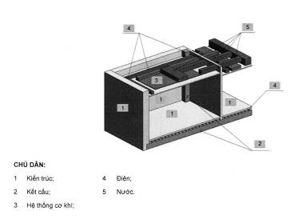
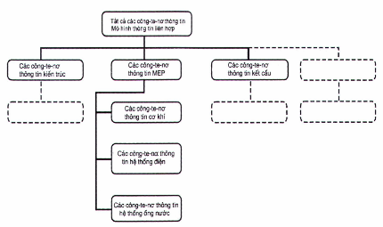
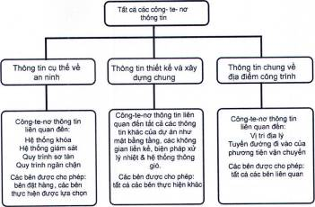

## PHỤ LỤC A (Tham khảo) — Minh họa về các chiến lược liên hợp và phân chia cấu trúc công-te-nơ thông tin

### A.1  Thông tin chung

Các chiến lược liên hợp và các phân chia cấu trúc công-te-nơ thông tin là những khái niệm quan trọng để quản lý các mô hình thông tin liên kết trong "BIM theo bộ TCVN 14177".

Sự liên hợp và phân chia công-te-nơ thông tin được sử dụng để:

&nbsp;&nbsp;\- Cho phép các nhóm triển khai khác nhau làm việc trên các phần khác nhau của mô hình thông tin cùng một lúc mà không gây ra các vấn đề về phối hợp, ví dụ: các xung đột về không gian hoặc không tương thích về chức năng;

&nbsp;&nbsp;\- Hỗ trợ bảo mật thông tin;

&nbsp;&nbsp;\- Dễ dàng truyền tải thông tin bằng cách giảm kích thước các công-te-nơ thông tin riêng biệt

Sự liên hợp và phân chia công-te-nơ thông tin cũng có thể được sử dụng để giúp xác định phạm vi dịch vụ cho các nhóm triển khai.

### A.2  Làm việc đồng thời

Một chiến lược liên hợp cho phép làm việc đồng thời xác định các ranh giới không gian, trong đó mỗi nhóm triển khai cần xác định các hệ thống, thành phần hoặc cấu kiện xây dựng mà nhóm chịu trách nhiệm.

Đối với một tài sản như một tòa nhà, chiến lược liên hợp có thể được xác định thông qua một tập hợp các không gian lồng vào nhau. Sự phân chia công-te-nơ thông tin được minh họa trong Hình A.1. cả hai hình này đều liên quan tới các lĩnh vực thiết kế khác nhau.

### A.3  Bảo mật thông tin

Một chiến lược liên hợp hoặc phân chia cấu trúc công-te-nơ thông tin nhằm hỗ trợ bảo mật thông tin nên tách các công-te-nơ thông tin hoặc các phần của tài sản theo các quyền truy cập thông tin. Đối với một tài sản liên quan đến tư pháp hình sự, chẳng hạn như nhà tù, cấp độ hạn chế khác nhau có thể được áp dụng đối với các thông tin chung về địa điểm công trình (chẳng hạn như vị trí, tuyến đường đi của phương tiện), đối với thông tin thiết kế và xây dựng tổng thể (chẳng hạn như các mặt bằng sàn, không gian lân cận, các biện pháp xử lý hệ thống thông gió và sưởi ấm) và đối với thông tin cụ thể về an ninh (như chi tiết về khóa và cánh buồng giam, chi tiết hệ thống giám sát, các quá trình sơ tán hoặc giam giữ). Điều này được minh họa trong Hình A.2.

### A.4  Truyền tải thông tin

Một chiến lược liên hợp nhằm hỗ trợ truyền tải các công-te-nơ thông tin trong nội bộ nhóm chuyển giao, hoặc đến và đi từ bên đặt hàng nên xem xét kích thước tệp tối đa có thể thực hiện để tải lên và tải xuống với cơ sở hạ tầng công nghệ thông tin cụ thể, ví dụ 250 Mb. Mô hình thông tin khi đó nên được chia nhỏ để không có công-te-nơ thông tin/vùng chứa thông tin đơn lẻ nào lớn hơn 250 Mb.

<strong>Hình A.1 — Minh họa chiến lược liên hợp không gian theo nguyên tắc trong dự án xây dựng</strong>

<strong>Hình A.2 — Minh họa phân chia cấu trúc công-te-nơ thông tin để làm việc đồng thời</strong>

<strong>Hình A.3 — Minh họa phân chia cấu trúc công-te-nơ thông tin để bảo mật thông tin</strong>

Mục lục

Lời nói đầu

Lời giới thiệu

## 1  PHẠM VI ÁP DỤNG

## 2  TÀI LIỆU VIỆN DẪN

## 3  THUẬT NGỮ, ĐỊNH NGHĨA VÀ KÝ HIỆU

### 3.1  Thuật ngữ chung

### 3.2  Các thuật ngữ liên quan đến tài sản và dự án

### 3.3  Các thuật ngữ liên quan đến quản lý thông tin

## 4  THÔNG TIN TÀI SẢN VÀ THÔNG TIN DỰ ÁN, CÁC QUAN ĐIỂM VÀ PHỐI HỢP LÀM VIỆC

### 4.1  Nguyên tắc

### 4.2  Quản lý thông tin theo bộ TCVN 14177

### 4.3  Các quan điểm về quản lý thông tin

## 5  XÁC ĐỊNH YÊU CẦU THÔNG TIN VÀ KẾT QUẢ CỦA CÁC MÔ HÌNH THÔNG TIN

### 5.1  Nguyên tắc

### 5.2  Yêu cầu thông tin tổ chức (OIR)

### 5.3  Yêu cầu thông tin tài sản (AIR)

### 5.4  Yêu cầu thông tin dự án (PIR)

### 5.5  Yêu cầu thông tin trao đổi (EIR)

### 5.6  Mô hình thông tin tài sản (AIM)

### 5.7  Mô hình thông tin dự án (PIM)

## 6  CHU KỲ CHUYỂN GIAO THÔNG TIN

### 6.1  Nguyên tắc

### 6.2  Sự liên kết với vòng đời tài sản

### 6.3  Thiết lập các yêu cầu thông tin và kế hoạch chuyển giao thông tin

## 7  CÁC CHỨC NĂNG QUẢN LÝ THÔNG TIN DỰ ÁN VÀ THÔNG TIN TÀI SẢN

### 7.1  Nguyên tắc

### 7.2  Các chức năng quản lý thông tin tài sản

### 7.3  Các chức năng quản lý thông tin dự án

### 7.4  Các chức năng quản lý thông tin nhiệm vụ

## 8  NĂNG LỰC VÀ KHẢ NĂNG CỦA NHÓM CHUYỂN GIAO

### 8.1  Nguyên tắc

### 8.2  Đánh giá năng lực và khả năng

## 9  PHỐI HỢP LÀM VIỆC TRONG CÔNG-TE-NƠ THÔNG TIN

## 10  KẾ HOẠCH CHUYỂN GIAO THÔNG TIN

### 10.1  Nguyên tắc

### 10.2  Thời điểm chuyển giao thông tin

### 10.3  Ma trận trách nhiệm

### 10.4  Xác định chiến lược liên hợp và cấu trúc phân chia cho các công-te-nơ thông tin

## 11  QUẢN LÝ VIỆC HỢP TÁC TẠO LẬP THÔNG TIN

### 11.1  Nguyên tắc

### 11.2  Mức độ nhu cầu thông tin

### 11.3  Chất lượng thông tin

## 12  GIẢI PHÁP VÀ QUY TRÌNH MÔI TRƯỜNG DỮ LIỆU CHUNG (CDE)

### 12.1  Nguyên tắc

### 12.2  Trạng thái công việc đang tiến hành

### 12.3  Quá trình chuyển đổi kiểm tra/xem xét/phê duyệt

### 12.4  Trạng thái chia sẻ

### 12.5  Chuyển đổi tình trạng xem xét/phê duyệt

### 12.6  Trạng thái đã xuất

### 12.7  Trạng thái lưu trữ

## 13  TÓM TẮT "MÔ HÌNH HÓA THÔNG TIN CÔNG TRÌNH (BIM) THEO BỘ TCVN 14177"