# TIÊU CHUẨN QUỐC GIA

**TCVN 14177-1:2024**

TỔ CHỨC VÀ SỐ HÓA THÔNG TIN VỀ CÔNG TRÌNH XÂY DỰNG, BAO GỒM MÔ HÌNH HÓA THÔNG TIN CÔNG TRÌNH (BIM) - QUẢN LÝ THÔNG TIN SỬ DỤNG MÔ HÌNH HÓA THÔNG TIN CÔNG TRÌNH - PHẦN 1: KHÁI NIỆM VÀ NGUYÊN TẮC

Organization and digitization of information about buildings and civil engineering works, including building information modelling (BIM) - Information management using building information modelling - Part 1 - Concepts and principles

## Lời nói đầu

**TCVN 14177-1:2024 được xây dựng dựa trên cơ sở tham khảo ISO 19650-1:2018.**

**TCVN 14177-1:2024 do Tổng Công ty Tư vấn Xây dựng Việt Nam - CTCP biên soạn, Bộ Xây dựng đề nghị, Ủy ban Tiêu chuẩn Đo lường Chất lượng Quốc gia thẩm định, Bộ Khoa học và Công nghệ công bố.**

Lời giới thiệu

Tiêu chuẩn này đưa ra các khái niệm và nguyên tắc được khuyến cáo cho các quá trình kinh doanh trong lĩnh vực xây dựng nhằm hỗ trợ việc quản lý và tạo lập thông tin trong vòng đời của tài sản xây dựng (gọi tắt là “quản lý thông tin”) khi sử dụng mô hình hóa thông tin công trình (BIM). Các quá trình này có thể mang lại kết quả kinh doanh có lợi cho chủ sở hữu/đơn vị khai thác sử dụng tài sản, khách hàng, chuỗi cung ứng của họ và những người tham gia tài trợ dự án, bao gồm cả việc mở rộng cơ hội hợp tác, giảm thiểu rủi ro và giảm chi phí thông qua việc tạo lập và sử dụng các mô hình thông tin tài sản và dự án.

Tiêu chuẩn này chủ yếu dành cho:

- Những người tham gia vào việc cung cấp, thiết kế, xây dựng và/hoặc khai thác sử dụng các tài sản được xây dựng; và

- Những người tham gia vào việc thực hiện các hoạt động quản lý tài sản, bao gồm cả khai thác sử dụng và bảo trì.

Tiêu chuẩn này áp dụng cho toàn bộ vòng đời của các công trình xây dựng, bao gồm các giai đoạn xác định chủ trương đầu tư, thiết kế, xây dựng, khai thác sử dụng, bảo trì và phá dỡ công trình. Tiêu chuẩn này có thể áp dụng cho các tài sản được xây dựng và các dự án thuộc mọi quy mô và mức độ phức tạp, bao gồm: các bất động sản lớn, mạng lưới cơ sở hạ tầng, các tòa nhà riêng lẻ, các thành phần của cơ sở hạ tầng cũng như các dự án hoặc tập hợp các dự án. Tuy nhiên, các khái niệm và nguyên tắc trong tiêu chuẩn này phải được áp dụng theo cách tương xứng và phù hợp với quy mô và mức độ phức tạp của tài sản hoặc dự án. Lưu ý này đặc biệt xảy ra trong trường hợp các doanh nghiệp vừa và nhỏ được chỉ định quản lý tài sản hoặc thực hiện dự án. Điều quan trọng nữa là việc cung cấp và huy động tài sản cùng với các bên tham gia dự án phải được tích hợp càng nhiều càng tốt với các quy trình cung cấp và huy động kỹ thuật.

Các khái niệm và nguyên tắc trong tiêu chuẩn này nhằm vào tất cả các đối tượng tham gia vào vòng đời của một tài sản. Các đối tượng này bao gồm và không giới hạn ở chủ sở hữu/bên khai thác sử dụng tài sản, khách hàng, người quản lý tài sản, nhóm thiết kế, nhóm xây dựng, nhà sản xuất thiết bị, chuyên gia kỹ thuật, cơ quan quản lý, nhà đầu tư, công ty bảo hiểm và người sử dụng cuối cùng.

Các yêu cầu cụ thể về quản lý thông tin trong quá trình bàn giao tài sản xây dựng được nêu trong TCVN 14177-2:2024. Yêu cầu cụ thể dựa trên các khái niệm và nguyên tắc trong tiêu chuẩn này, nhưng bản thân tiêu chuẩn này không bao gồm nghĩa vụ áp dụng TCVN 14177-2:2024 hoặc bất kỳ phần nào khác của bộ TCVN 14177 (bộ TCVN 14177 bao gồm TCVN 14177-1: 2024 Tổ chức và số hóa thông tin về nhà và công trình xây dựng, bao gồm mô hình hóa thông tin công trình (BIM) - Quản lý thông tin sử dụng mô hình hóa thông tin công trình - Phần 1: Khái niệm và nguyên tắc và TCVN 14177-2: 2024 Tổ chức và số hóa thông tin về nhà và công trình xây dựng, bao gồm mô hình hóa thông tin công trình (BIM) - Quản lý thông tin sử dụng mô hình hóa thông tin công trình, Phần 2: Giai đoạn chuyển giao tài sản)

Có nhiều cách khác nhau mà chủ sở hữu/bên khai thác sử dụng tài sản hoặc khách hàng có thể đáp ứng tốt nhất các yêu cầu cụ thể hoặc đáp ứng trong bối cảnh thực tiễn với các vấn đề phát sinh, có thể bao gồm lộ trình mua sắm tài sản và các thỏa thuận liên quan. Các khái niệm và nguyên tắc quản lý thông tin được mô tả trong tiêu chuẩn này phải được lựa chọn và áp dụng phù hợp với các trường hợp và yêu cầu cụ thể của hoạt động quản lý tài sản hoặc cung cấp thông tin cho dự án. Các yêu cầu về thông tin cần xác định hoặc hướng dẫn cách thức đạt được và các chi tiết cần được thống nhất kịp thời để yêu cầu được chuyển giao một cách hiệu quả.

Sự hợp tác giữa những bên tham gia vào các dự án xây dựng và quản lý tài sản là yếu tố then chốt để chuyển giao/phân phối và khai thác sử dụng tài sản một cách hiệu quả. Các tổ chức đang ngày càng làm việc nhiều trong môi trường hợp tác để đạt được chất lượng cao hơn và tái sử dụng tốt hơn các kiến thức, kinh nghiệm hiện có. Kết quả quan trọng của môi trường hợp tác là khả năng để giao tiếp, tái sử dụng và chia sẻ thông tin một cách hiệu quả; đồng thời, giảm nguy cơ mất mát, mâu thuẫn hoặc hiểu sai thông tin.

Hợp tác làm việc thực sự đòi hỏi sự hiểu biết và tin tưởng lẫn nhau cũng như mức độ kỹ càng hơn của quy trình được tiêu chuẩn hóa so với những gì thường có, nếu thông tin mới được tạo ra và cung cấp một cách nhất quán, kịp thời. Các yêu cầu về thông tin cần phải được chuyển dọc theo chuỗi cung ứng đến nơi mà thông tin có thể được tạo ra một cách hiệu quả nhất và thông tin cần phải được đối chiếu khi nó được truyền ngược lại. Hiện tại, nguồn lực đáng kể được sử dụng để chỉnh sửa thông tin phi cấu trúc hoặc quản lý thông tin không chính xác được tạo bởi nhân lực chưa được đào tạo kỹ lưỡng, giải quyết các vấn đề phát sinh từ khả năng phối hợp của các nhóm chuyển giao và giải quyết các vấn đề liên quan đến tái sử dụng và tái tạo thông tin. Những sự chậm trễ, lãng phí này có thể giảm bớt nếu các khái niệm và nguyên tắc trong tiêu chuẩn này được áp dụng.

Để cải thiện các phiên bản tương lai của bộ TCVN 14177, chủ sở hữu các tài sản quốc gia, khách hàng công và cơ quan có thẩm quyền nên thu thập thông tin và kinh nghiệm về việc triển khai và sử dụng tiêu chuẩn này.

Bộ TCVN 14177 có thể được hưởng lợi từ quy trình chính thức quản lý tài sản, ví dụ như trong ISO 55000 và cũng có thể được hưởng lợi từ phương pháp tiếp cận có hệ thống trong ISO 9001, mặc dù chứng nhận ISO 9001 không phải là yêu cầu của bộ TCVN 14177.

TỔ CHỨC VÀ SỐ HÓA THÔNG TIN VỀ CÔNG TRÌNH XÂY DỰNG, BAO GỒM MÔ HÌNH HÓA THÔNG TIN CÔNG TRÌNH (BIM) QUẢN LÝ THÔNG TIN SỬ DỤNG MÔ HÌNH HÓA THÔNG TIN CÔNG TRÌNH - PHẦN 1: KHÁI NIỆM VÀ NGUYÊN TẮC

Organization and digitization of information about buildings and civil engineering works, including building information modelling (BIM) - Information management using building information modelling - Part 1: Concepts and principles

---

## 1  PHẠM VI ÁP DỤNG

Tiêu chuẩn này đưa ra các khái niệm và nguyên tắc cho việc quản lý thông tin khi đạt mức độ tin cậy gọi là “mô hình hóa thông tin công trình (BIM)’’ theo bộ TCVN 14177.

Tiêu chuẩn này đưa ra các khuyến nghị về quy trình quản lý thông tin bao gồm việc trao đổi, ghi chép, quản lý và tạo lập phiên bản cho các bên tham gia.

Tiêu chuẩn này có thể áp dụng cho toàn bộ vòng đời của bất kỳ tài sản xây dựng nào, bao gồm việc lập kế hoạch chiến lược, thiết kế sơ bộ, công tác kỹ thuật, phát triển, công việc quản lý hồ sơ và thi công, khai thác sử dụng, bảo trì, cải tạo, sửa chữa và kết thúc vòng đời tài sản.

Tiêu chuẩn này có thể được điều chỉnh cho phù hợp với các tài sản hoặc dự án ở bất kỳ quy mô và mức độ phức tạp nào để không cản trở tính linh hoạt và tính đa năng đặc trưng cho các chiến lược mua sắm tiềm năng và để giải quyết chi phí cho việc thực hiện tiêu chuẩn này.

## 2  TÀI LIỆU VIỆN DẪN

Các tài liệu viện dẫn sau là cần thiết khi áp dụng tiêu chuẩn này. Đối với tài liệu viện dẫn ghi năm công bố thì áp dụng phiên bản được nêu. Đối với tài liệu viện dẫn không ghi năm công bố thì áp dụng phiên bản mới nhất, bao gồm cả các sửa đổi, bổ sung (nếu có).

TCVN 14177-2:2024, Tổ chức và số hóa thông tin về công trình xây dựng, bao gồm mô hình hóa thông tin công trình (BIM) - Quản lý thông tin sử dụng mô hình hóa thông tin công trình - Phần 2: Giai đoạn chuyển giao tài sản.

## 3  THUẬT NGỮ, ĐỊNH NGHĨA VÀ KÝ HIỆU

Trong tiêu chuẩn này, sử dụng các thuật ngữ và định nghĩa sau

### 3.1  Thuật ngữ chung

3.1.1

Ma trận trách nhiệm (responsibility matrix)

Biểu đồ/sơ đồ mô tả sự tham gia của các bên trong việc hoàn thành các nhiệm vụ hoặc các chuyển giao.

**CHÚ THÍCH:** Một ma trận trách nhiệm có thể chỉ ra trách nhiệm giải trình, tư vấn và cung cấp thông tin, cùng với nghĩa vụ hoàn thành các nhiệm vụ hoặc các sản phẩm chuyển giao.

3.1.2

Không gian (space)

Phạm vi không gian ba chiều giới hạn được xác định về mặt vật lý hoặc quy ước.

### 3.2  Các thuật ngữ liên quan đến tài sản và dự án

3.2.1

Thành viên (actor)

Cá nhân, tổ chức hoặc một đơn vị tham gia vào quá trình xây dựng.

**CHÚ THÍCH 1:** Các bên/đơn vị bao gồm nhưng không giới hạn về phòng ban, nhóm.

**CHÚ THÍCH 2:** Trong tiêu chuẩn này, quá tình xây dựng diễn ra trong suốt giai đoạn chuyển giao (3.2.11) và giai đoạn khai thác sử dụng (3.2.12).

3.2.2

Thỏa thuận (appointment)

Bản cam kết được thống nhất giữa các bên về việc cung cấp thông tin liên quan đến công việc, hàng hóa hoặc dịch vụ.

**CHÚ THÍCH:** Thuật ngữ này là mặc định sử dụng cho dù có hay không có việc thỏa thuận chính thức giữa các bên. Các cụm từ “thỏa thuận”, “cam kết', “hợp đồng" đều có thể được áp dụng tùy vào từng trường hợp cụ thể.

3.2.3

Bên thực hiện (appointed party)

Bên cung cấp thông tin (3.3.1) liên quan đến công việc, hàng hóa hoặc dịch vụ.

**CHÚ THÍCH 1:** Một bên thực hiện chính được xác định cho mỗi nhóm chuyển giao (3.2.6). Bên thực hiện chính có thể cùng một tổ chức với một trong các nhóm triển khai (3.2.7).

**CHÚ THÍCH 2:** Thuật ngữ “bên thực hiện" là mặc định sử dụng cho dù có hay không có thỏa thuận (3.2.2) chính thức bằng văn bản.

3.2.4

Bên đặt hàng (appointing party)

Bên nhận thông tin (3.3.1) liên quan đến công việc, hàng hóa hoặc dịch vụ từ một bên thực hiện chính (3.2.3).

**CHÚ THÍCH:** Thuật ngữ này là mặc định sử dụng cho dù có hay không có một thỏa thuận (3.2.2) chính thức giữa các bên.

3.2.5

Khách hàng (client)

Thành viên (3.2.1) chịu trách nhiệm khởi tạo dự án và phê duyệt nhiệm vụ thiết kế của dự án.

3.2.6

Nhóm chuyển giao (delivery team)

Bên thực hiện chính và các bên thực hiện (3.2.3) của họ.

**CHÚ THÍCH 1:** Nhóm chuyển giao có thể có số lượng bất kỳ, từ một cá nhân có thể đảm nhiệm tất cả các chức năng cần thiết đến các nhóm triển khai (3.2.7) phức tạp, có nhiều cấp. Số lượng và cơ cấu của mỗi nhóm chuyển giao phụ thuộc vào quy mô và độ phức tạp của các hoạt động quản lý tài sản hoặc các chuyển giao dự án.

**CHÚ THÍCH 2:** Nhiều nhóm chuyển giao có thể được chỉ định đồng thời và/hoặc được chỉ định lần lượt liên quan đến một tài sản hoặc một dự án độc lập, tương ứng với phạm vi và mức độ phức tạp của các hoạt động quản lý tài sản hoặc các chuyển giao dự án.

**CHÚ THÍCH 3:** Một nhóm chuyển giao có thể gồm nhiều nhóm triển khai trong tổ chức của bên thực hiện chính hoặc bất kì bên thực hiện nào.

**CHÚ THÍCH 4:** Một nhóm chuyển giao có thể được tập hợp bởi bên đặt hàng (3.2.4) thay vì bên thực hiện chính.

3.2.7

Nhóm triển khai (task team)

Các nhân sự được tập hợp để triển khai một công việc cụ thể.

3.2.8

Tài sản (asset)

Hạng mục công trình hoặc thực thể có giá trị tiềm năng hoặc thực tế đối với tổ chức.

**CHÚ THÍCH:** Tài sản trong tiêu chuẩn này chủ đích nhắm tới các tài sản được hình thành trong suốt vòng đời của một công trình xây dựng, từ thiết kế, thi công, khai thác sử dụng và phá dỡ.

3.2.9

Thông tin dự án (project information)

Thông tin (3.3.1) được tạo lập hoặc được sử dụng trong một dự án cụ thể.

3.2.10

Vòng đời (life cycle)

Chu kỳ của tài sản (3.2.8) được xác định từ khi xác lập các yêu cầu cho đến khi chấm dứt sử dụng, bao gồm ý tưởng, phát triển, khai thác sử dụng, bảo trì và thanh lý/phá dỡ tài sản đó.

3.2.11

Giai đoạn chuyển giao (delivery phase)

Một phần của vòng đời (3.2.10), khi đó tài sản (3.2.8) đã được thiết kế, xây dựng và đưa vào khai thác sử dụng.

**CHÚ THÍCH:** Giai đoạn chuyển giao thường phản ánh cách tiếp cận dự án theo từng giai đoạn.

3.2.12

Giai đoạn khai thác sử dụng (operational phase)

Một phần của vòng đời (3.2.10), khi đó tài sản (3.2.8) được khai thác sử dụng và bảo trì.

3.2.13

Sự kiện kích hoạt (trigger event)

Sự kiện đã có kế hoạch hoặc chưa có kế hoạch thực hiện làm thay đổi một tài sản (3.2.8) hoặc trạng thái của tài sản trong vòng đời (3.2.10), dẫn đến làm thay đổi kết quả trong việc trao đổi thông tin (3.3.7).

**CHÚ THÍCH:** Trong giai đoạn chuyển giao (3.2.11), sự kiện kích hoạt thường phản ánh sự kết thúc của các bước dự án.

3.2.14

Thời điểm quyết định quan trọng (key decision point)

Thời điểm trong vòng đời (3.2.10), khi một quyết định quan trọng được đưa ra ảnh hưởng tới định hướng hoặc tính khả thi của tài sản (3.2.8)

**CHÚ THÍCH:** Trong một dự án “thời điểm quyết định quan trọng” thường tương ứng với các bước của dự án.

### 3.3  Các thuật ngữ liên quan đến quản lý thông tin

3.3.1

Thông tin (information)

Sự diễn giải dữ liệu theo định dạng phù hợp cho việc trao đổi, giải thích và xử lý thông tin.

**CHÚ THÍCH:** Thông tin có thể được xử lý bằng con người hoặc tự động.

3.3.2

Yêu cầu thông tin (information requirement)

Chỉ dẫn cụ thể về nội dung, thời gian, phương thức và đối tượng của thông tin (3.3.1).

3.3.3

Yêu cầu thông tin tổ chức (organizational information requirements, OIR)

Yêu cầu thông tin (3.3.2) liên quan đến mục tiêu của tổ chức.

3.3.4

Yêu cầu thông tin tài sản (asset information requirements, AIR)

Yêu cầu thông tin (3.3.2) liên quan đến việc khai thác sử dụng của một tài sản (3.2.8).

3.3.5

Yêu cầu thông tin dự án (project information requirements, PIR)

Yêu cầu thông tin (3.3.2) liên quan đến việc chuyển giao của một tài sản (3.2.8).

3.3.6

Yêu cầu thông tin trao đổi (exchange information requirements, EIR)

Yêu cầu thông tin (3.3.2) liên quan đến một thỏa thuận (3.2.2).

3.3.7

Trao đổi thông tin (information exchange)

Hoạt động đáp ứng một phần hoặc toàn bộ yêu cầu thông tin (3.3.2).

3.3.8

Mô hình thông tin (information model)

Tập hợp những công-te-nơ thông tin (3.3.12) có cấu trúc hoặc phi cấu trúc.

3.3.9

Mô hình thông tin tài sản (asset information model, AIM)

Mô hình thông tin (3.3.8) liên quan đến giai đoạn khai thác sử dụng (3.2.12).

3.3.10

Mô hình thông tin dự án (project information model, PIM)

Mô hình thông tin (3.3.8) liên quan đến giai đoạn chuyển giao (3.2.11).

**CHÚ THÍCH:** Trong quá trình thực hiện dự án, mô hình thông tin dự án có thể được sử dụng để thể hiện ý đồ thiết kế (mô hình ý đồ thiết kế) hoặc mô hình số hóa của tài sản (3.2.8) (có thể còn gọi là mô hình xây dựng ảo).

3.3.11

Liên hợp (federation)

Một mô hình thông tin (3.3.8) tổng hợp từ các công-te-nơ thông tin riêng biệt.

**CHÚ THÍCH:** Các công-te-nơ thông tin riêng biệt được sử dụng trong quá trình liên hợp có thể từ các nhóm triển khai (3.2.7) khác nhau.

3.3.12

Công-te-nơ thông tin (information container)

Tập hợp thông tin (3.3.1) được đặt tên cố định có thể truy xuất được từ một tệp tin, một hệ thống hoặc một ứng dụng lưu trữ.

**CHÚ THÍCH 1:** Công-te-nơ thông tin có cấu trúc bao gồm các mô hình hình học, bằng lịch trình và cơ sở dữ liệu. Công-te-nơ thông tin phi cấu trúc gồm tài liệu, bản ghi hình (video) và bản ghi âm;

**CHÚ THÍCH 2:** Thông tin duy trì trong một khoảng thời gian dài phải được quản lý, tức là phải loại trừ những dữ liệu thông tin tạm thời như kết quả tìm kiếm trên internet;

**CHÚ THÍCH 3:** Việc tạo mã định danh/đặt tên cho công-te-nơ thông tin phải theo một quy ước chung đã được thống nhất.

3.3.13

Mã trạng thái (status code)

Siêu dữ liệu (meta-data) mô tả sự phù hợp của nội dung công-te-nơ thông tin (3.3.12).

3.3.14

Mô hình hóa thông tin công trình (BIM - building information modeling)

Sử dụng một đại diện số hóa của một tài sản (3.2.8) xây dựng được chia sẻ phục vụ cho việc thiết kế, xây dựng và khai thác sử dụng, là cơ sở tin cậy để đưa ra các quyết định.

**CHÚ THÍCH:** Các tài sản xây dựng bao gồm nhưng không giới hạn các công trình, nhà máy.

3.3.15

Môi trường dữ liệu chung (CDE - common data environment)

Nguồn thông tin (3.3.1) được thống nhất cho bắt kỳ dự án hoặc tài sản (3.2.8), để thu thập, quản lý, và phổ biến cho công te-nơ thông tin (3.3.12) thông qua một quá trình quản lý.

**CHÚ THÍCH:** Quá trình làm việc trong môi trường dữ liệu chung (CDE) mô tả các phương thức được sử dụng và giải pháp CDE có thể cung cấp công nghệ để hỗ trợ các tiến trình đó.

3.3.16

Mức độ nhu cầu thông tin (level of information need)

Khung xác định phạm vi và mức độ chi tiết của thông tin (3.3.1).

**CHÚ THÍCH:** Một mục đích của việc xác định mức độ nhu cầu thông tin để tránh lãng phí nguồn lực vào việc cung cấp thừa thông tin.

3.3.17

Năng lực (capability)

Thước đo khả năng hoạt động và thực hiện.

**CHÚ THÍCH:** Trong nội dung của tiêu chuẩn này, thuật ngữ “năng lực” liên quan đến kỹ năng, hiểu biết và trình độ chuyên môn để quản lý thông tin (3.3.1).

3.3.18

Khả năng (capacity)

Nguồn lực sẵn có để thực hiện dự án.

**CHÚ THÍCH:** Trong nội dung của tiêu chuẩn này, thuật ngữ “khả năng” liên quan đến phương tiện, nguồn lực và Quy trình để quản lý thông tin (3.3.1).

## 4  THÔNG TIN TÀI SẢN VÀ THÔNG TIN DỰ ÁN, CÁC QUAN ĐIỂM VÀ PHỐI HỢP LÀM VIỆC

### 4.1  Nguyên tắc

Mô hình thông tin tài sản (AIM) và mô hình thông tin dự án (PIM) là dạng thông tin có cấu trúc, lưu trữ thông tin cần thiết cho việc đưa ra quyết định trong suốt vòng đời của một tài sản môi trường xây dựng. Các mô hình này bao gồm công việc thiết kế và xây dựng công trình mới, cải tạo công trình và khai thác sử dụng, bảo trì. Lượng thông tin được tích lũy trong mô hình thông tin được sử dụng với nhiều mục đích khác nhau và sẽ tăng lên trong quá trình chuyển giao dự án và quản lý tài sản.

AIM và PIM có thể bao gồm dữ liệu thông tin cấu trúc hoặc phi cấu trúc. Thông tin cấu trúc như các mô hình hình học, các bảng lịch trình và các cơ sở dữ liệu. Các thông tin phi cấu trúc như tài liệu, bản ghi hình (video), bản ghi âm. Các thông tin vật lý như mẫu đất, mẫu sản phẩm, nên được quản lý bằng cách sử dụng quy trình quản lý thông tin được nêu trong tiêu chuẩn này thông qua các tham chiếu chéo, ví dụ như mã số của các mẫu.

Hầu hết các dự án thực hiện đều liên quan đến một tài sản hiện hữu, ngay cả khi địa điểm thực hiện dự án chưa được phát triển trước đó. Các dự án này cần tổng hợp các thông tin liên quan đến những tài sản đã có để hỗ trợ cho việc phát triển dự án và thông tin cho các bên thực hiện chính làm việc trong dự án.

Quá trình quản lý thông tin bao gồm các công việc chuyển giao thông tin giữa hai mô hình AIM và PIM khi bắt đầu và kết thúc dự án. Thông tin về tài sản và dự án có giá trị đáng kể đối với các bên đặt hàng, bên thực hiện chính và bên thực hiện tham gia quản lý tài sản và chuyển giao dự án. Điều này bao gồm cả những trường hợp không có một thỏa thuận chính thức nào tồn tại.

Bên đặt hàng, bên thực hiện chính và các bên thực hiện bao gồm chủ sở hữu, đơn vị khai thác sử dụng, quản lý tài sản xây dựng; những người cung cấp thiết kế và xây dựng dự án. Thông tin về dự án và tài sản cũng có giá trị với các nhà hoạch định chính sách, các cơ quan quản lý, nhà đầu tư, bảo hiểm và các bên khác.

### 4.2  Quản lý thông tin theo bộ TCVN 14177

Các khuyến nghị và yêu cầu cho việc quản lý thông tin theo bộ TCVN 14177 dựa trên việc phối hợp, hợp tác làm việc giữa bên đặt hàng, bên thực hiện chính và (các) bên thực hiện. Tất cả các bên tham gia cần đảm bảo tuân thủ theo nguyên tắc của bộ TCVN 14177.

Quản lý thông tin có thể được thể hiện qua chuỗi các bước thực hiện như bước 1, 2, 3 trong Hình 1. Hình này thể hiện việc phát triển tiêu chuẩn, tiến bộ trong công nghệ và sự tinh vi trong việc quản lý thông tin được phối hợp để chuyển giao làm tăng hiệu quả kinh doanh. Bộ TCVN 14177 được áp dụng chủ yếu ở bước 2, nhưng cũng có thể ứng dụng một phần ở bước 1 và 3.

Bước 2 được xác định như sau: “Mô hình hóa thông tin công trình theo bộ TCVN 14177”. Bước này là nơi kết hợp các quá trình quản lý thông tin thủ công và tự động để tạo ra một mô hình thông tin

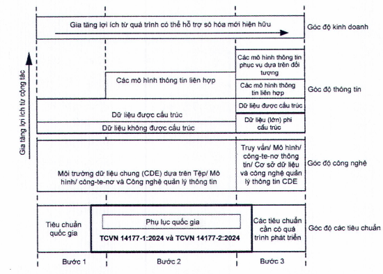

<strong>Hình 1 — Quan điểm về các bước hoàn thiện của mô hình và số hóa trình tự quản lý thông tin</strong>

### 4.3  Các quan điểm về quản lý thông tin

Các quan điểm quản lý thông tin khác nhau nên được xác nhận trong quá trình quản lý thông tin và nên được kết hợp trong quá trình theo những cách sau:

&nbsp;&nbsp;\- Trong mô tả chi tiết của yêu cầu của thông tin;

&nbsp;&nbsp;\- Trong kế hoạch chuyển giao thông tin; và

&nbsp;&nbsp;\- Trong việc chuyển giao thông tin.

Các quan điểm quản lý thông tin nên được xác định theo từng trường hợp cụ thể, nhưng có 4 quan điểm mô tả trong Bảng 1 được khuyến khích áp dụng. Các quan điểm khác nếu phù hợp có thể ứng dụng tùy thuộc vào tính chất của dự án và tài sản.

### Bảng 1 - Quan điểm quản lý thông tin

| Quan điểm | Mục đích | Ví dụ về các sản phẩm chuyển giao |
| :--- | :--- | :--- |
| Quan điểm của chủ sở hữu tài sản | Để thiết lập và duy trì mục đích của tài sản hoặc dự án. Để đưa ra các quyết định kinh doanh chiến lược | Kế hoạch kinh doanh Đánh giá danh mục tài sản chiến lược Phân tích chi phí vòng đời |
| Quan điểm của người sử dụng tài sản | Để xác định các yêu cầu thực sự của người dùng và đảm bảo tài sản đúng chất lượng và năng lực. | Tóm tắt dự án AIM PIM Tài liệu về sản phẩm |
| Quan điểm quản lý chuyển giao dự án hoặc tài sản | Lập kế hoạch và tổ chức công việc, huy động các nguồn lực phù hợp, phối hợp và kiểm soát thực hiện. | Kế hoạch, ví dụ Kế hoạch thực hiện BIM Sơ đồ tổ chức Định nghĩa chức năng |
| Quan điểm của xã hội | Để đảm bảo lợi ích của cộng đồng được quan tâm trong suốt vòng đời của tài sản (lập kế hoạch, bàn giao và khai thác sử dụng). | Quyết định chính trị Quy hoạch Giấy phép xây dựng, chuyển nhượng |

> **CHÚ THÍCH:** Ví dụ về các sản phẩm chuyển giao có liên quan đến góc độ của từng quan điểm và không thể hiện quyền sở hữu đối với chuyển giao hoặc ai thực hiện tạo ra các chuyển giao.

## 5  XÁC ĐỊNH YÊU CẦU THÔNG TIN VÀ KẾT QUẢ CỦA CÁC MÔ HÌNH THÔNG TIN

### 5.1  Nguyên tắc

Bên đặt hàng nên hiểu những thông tin cần thiết liên quan đến (các) tài sản hoặc (các) dự án mà họ triển khai thực hiện nhằm hỗ trợ cho tổ chức hoặc mục tiêu của dự án của họ. Những yêu cầu này có thể đến từ bộ phận phụ trách bên phía tổ chức của họ hoặc các đối tác bên ngoài tham gia thực hiện khác. Bên đặt hàng nên cung cấp các yêu cầu rõ ràng cho các tổ chức và cá nhân khác để hiểu về các thông tin công việc thực hiện. Công việc này cần thiết cho dự án và tài sản trong mọi quy mô, nhưng các nguyên tắc cần áp dụng phù hợp theo quy mô tương ứng. Đối với các bên đặt hàng chưa có kinh nghiệm thì khuyến cáo cần tìm kiếm chuyên gia hỗ trợ thực hiện công việc này.

Các bên thực hiện, bao gồm các bên thực hiện chính, có thể bổ sung yêu cầu thông tin của họ vào nội dung nhận được. Một số yêu cầu về thông tin có thể được chuyển cho các bên thực hiện, đặc biệt khi việc trao đổi thông tin trong nhóm chuyển giao là cần thiết và thông tin này không được trao đổi với bên đặt hàng.

Bên đặt hàng nên nêu rõ mục đích cho việc yêu cầu chuyển giao thông tin, bao gồm các khía cạnh của tài sản được quản lý. Những mục đích có thể bao gồm:

&nbsp;&nbsp;\- Đăng ký tài sản: đăng ký tài sản cần được cung cấp để hỗ trợ việc kiểm toán và báo cáo chính xác; việc đăng ký tài sản nên bao gồm cả tài sản không gian và vật chất cũng như các nhóm thuộc về chúng;

&nbsp;&nbsp;\- Hỗ trợ việc tuân thủ và trách nhiệm pháp lý: bên đặt hàng nên nêu rõ thông tin cần thiết để hỗ trợ đảm bảo an toàn sinh mạng và sức khỏe cho người sử dụng;

&nbsp;&nbsp;\- Quản lý rủi ro: thông tin nên được yêu cầu hoặc bắt buộc để hỗ trợ quản lý rủi ro, đặc biệt để xác định và xem xét các rủi ro có thể gặp phải của một dự án hoặc tài sản, ví dụ như thảm họa tự nhiên, các hiện tượng thời tiết cực đoan hoặc hỏa hoạn; hoặc

&nbsp;&nbsp;\- Hỗ trợ các vấn đề kinh doanh: bên đặt hàng nên nêu rõ thông tin cần thiết cho hỗ trợ kỳ vọng kinh doanh về quyền sở hữu và khai thác sử dụng tài sản; điều này nên bao gồm việc phát triển liên tục của các tác động và các khía cạnh có lợi sau đây cho tài sản kể từ khi được bàn giao sớm nhất:

&nbsp;&nbsp;\- Quản lý công suất và mức sử dụng: nên cung cấp tài liệu về công suất và mức sử dụng tài sản dự kiến để hỗ trợ việc so sánh mức sử dụng và thực tế sử dụng cũng như quản lý danh mục đầu tư;

&nbsp;&nbsp;\- Quản lý an ninh và giám sát: thông tin nên được yêu cầu hoặc bắt buộc để hỗ trợ việc quản lý an ninh và giám sát tài sản và các địa điểm lân cận hoặc liền kề phù hợp với yêu cầu an ninh;

&nbsp;&nbsp;\- Hỗ trợ cải tạo: cải tạo từng không gian hoặc vị trí và toàn bộ tài sản nên được hỗ trợ thông tin chi tiết về công suất, về diện tích, không gian, sức chứa, điều kiện môi trường và khả năng chịu lực của kết cấu;

&nbsp;&nbsp;\- Các tác động được dự đoán và thực tế: bên đặt hàng nên yêu cầu thông tin liên quan đến các tác động từ chất lượng, chi phí, kế hoạch, khí thải, năng lượng, chất thải, tiêu thụ nước hoặc các tác động môi trường khác;

&nbsp;&nbsp;\- Khai thác sử dụng: các thông tin cần thiết cho hoạt động bình thường của tài sản nên được cung cấp để giúp bên đặt hàng dự kiến chi phí khai thác sử dụng tài sản;

&nbsp;&nbsp;\- Bảo trì và sửa chữa: nên cung cấp thông tin về các nhiệm vụ bảo trì, bao gồm bảo cả bảo trì phòng ngừa theo kế hoạch để giúp bên đặt hàng dự đoán và lập kế hoạch chi phí bảo trì;

&nbsp;&nbsp;\- Thay thế: thông tin về tham chiếu hoặc tuổi thọ và chi phí dịch vụ thay thế dự kiến phải có sẵn cho bên đặt hàng để dự đoán chi phí thay thế; việc tái sử dụng tài sản vật chất nên được hỗ trợ bằng thông tin chi tiết liên quan đến vật liệu cấu thành chính; và

&nbsp;&nbsp;\- Chấm dứt việc sử dụng và phá dỡ: thông tin khuyến cáo về việc dừng sử dụng cần được dự đoán để giúp bên đặt hàng lập kế hoạch cho các chi phí kết thúc/phá dỡ công trình.

Các yêu cầu thông tin liên quan đến giai đoạn chuyển giao tài sản nên được thể hiện dưới dạng các bước của dự án được bên đặt hàng hoặc bên thực hiện chính dự kiến sử dụng.

Các yêu cầu thông tin liên quan đến giai đoạn khai thác sử dụng của tài sản phải được thể hiện dưới dạng các sự kiện kích hoạt dự kiến trong vòng đời như việc bảo trì theo kế hoạch, kiểm tra thiết bị chữa cháy, thay thế thiết bị hoặc thay đổi đơn vị quản lý tài sản.

Các loại yêu cầu thông tin và mô hình thông tin khác nhau thể hiện ở Hình 2 và diễn giải trong 5.2 đến 5.7

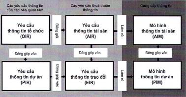

**CHÚ THÍCH:** Trong hình này, “đóng góp vào” có nghĩa là “cung cấp đầu vào cho”, “làm rõ” có nghĩa là “xác định nội dung, cấu trúc và phương pháp luận".

<strong>Hình 2 — Phân cấp của các yêu cầu của thông tin</strong>

### 5.2  Yêu cầu thông tin tổ chức (OIR)

OIR giải thích thông tin cần thiết để trả lời hoặc đáp ứng những mục tiêu chiến lược cấp cao của bên đặt hàng. Những yêu cầu này có thể phát sinh vì nhiều lý do, bao gồm:

&nbsp;&nbsp;\- Chiến lược vận hành kinh doanh;

&nbsp;&nbsp;\- Chiến lược quản lý tài sản;

&nbsp;&nbsp;\- Lập kế hoạch danh mục đầu tư;

&nbsp;&nbsp;\- Trách nhiệm pháp lý;

&nbsp;&nbsp;\- Hoạch định chính sách.

OIR có thể tồn tại vì những lý do khác ngoài quản lý tài sản, ví dụ liên quan đến việc nộp các chi phí tài chính hàng năm. OIR cho mục đích này không được xem xét trong tiêu chuẩn này.

### 5.3  Yêu cầu thông tin tài sản (AIR)

AIR đặt ra các khía cạnh quản lý, thương mại và kỹ thuật của việc tạo lập thông tin tài sản. Các khía cạnh quản lý và thương mại nên bao gồm tiêu chuẩn thông tin và các phương pháp và quy trình tạo lập mà nhóm chuyển giao cần thực hiện.

Các khía cạnh kỹ thuật của yêu cầu thông tin tài sản (AIR) chỉ rõ những thông tin cần thiết để trả lời cho yêu cầu thông tin tổ chức (OIR) liên quan đến tài sản. Các yêu cầu này phải được thể hiện theo cách có thể kết hợp vào các thỏa thuận quản lý tài sản để hỗ trợ việc đưa ra quyết định của tổ chức.

Một tập hợp các AIR cần được chuẩn bị cho từng sự kiện kích hoạt trong suốt quá trình khai thác sử dụng tài sản và trong các trường hợp liên quan khác cũng nên tham chiếu đến các yêu cầu về bảo mật

Khi có chuỗi cung ứng, AIR mà bên thực hiện chính nhận được có thể được chia nhỏ và giao đi theo bất kỳ thỏa thuận nào của bên thực hiện chính. AIR mà bên thực hiện chính nhận được có thể được bổ sung thêm theo yêu cầu thông tin của bên thực hiện chính.

Trong chiến lược và kế hoạch quản lý tài sản có thể có một số thỏa thuận khác nhau. AIR từ tất cả những thỏa thuận này nên tạo thành một tập hợp các yêu cầu thông tin mạch lạc và phối hợp duy nhất, đủ để giải quyết tất cả các OIR liên quan đến tài sản.

### 5.4  Yêu cầu thông tin dự án (PIR)

PIR giải thích thông tin cần thiết để trả lời hoặc thông báo những mục tiêu chiến lược cấp cao của bên đặt hàng liên quan đến một dự án tài sản được xây dựng cụ thể. PIR được xác định từ cả quá trình quản lý dự án và quá trình quản lý tài sản.

Một tập hợp các yêu cầu thông tin nên được chuẩn bị cho từng thời điểm quyết định quan trọng của bên đặt hàng trong suốt dự án.

Các khách hàng truyền thống có thể phát triển một bộ PIR chung, có hoặc không có sửa đổi, áp dụng trên tất cả các dự án của họ.

### 5.5  Yêu cầu thông tin trao đổi (EIR)

EIR thiết lập các thông tin về lĩnh vực quản lý, thương mại và kỹ thuật cho việc tạo lập thông tin dự án. Các khía cạnh quản lý và thương mại nên bao gồm tiêu chuẩn thông tin, các phương pháp và quy trình tạo lập mà nhóm chuyển giao cần thực hiện.

Các khía cạnh kỹ thuật của EIR nên chỉ rõ những thông tin chi tiết cần thiết để trả lời PIR. Các yêu cầu này phải được thể hiện theo cách có thể kết hợp vào các thỏa thuận liên quan đến dự án. EIR thường phải phù hợp với các sự kiện kích hoạt đại diện cho sự hoàn thành một số hoặc tất cả các bước của dự án.

EIR nên được xác định khi các thỏa thuận được thiết lập. Cụ thể, EIR mà bên đặt hàng nhận được có thể được chia nhỏ và giao đi theo bất kỳ thỏa thuận nào của bên thực hiện chính và theo suốt chuỗi cung ứng. EIR mà các bên thực hiện nhận được, bao gồm cả các bên thực hiện chính, có thể được bổ sung thêm bằng EIR của riêng họ. Một số EIR có thể được chuyển cho các bên thực hiện của họ, đặc biệt khi việc trao đổi thông tin trong nhóm chuyển giao là cần thiết và thông tin này không được trao đổi với bên đặt hàng.

Trong một dự án có thể có một số thỏa thuận khác nhau. EIR trong tất cả các thỏa thuận này nên tạo thành một tập hợp các yêu cầu thông tin mạch lạc và phối hợp duy nhất, đủ để giải quyết tất cả các PIR.

### 5.6  Mô hình thông tin tài sản (AIM)

AIM hỗ trợ bên đặt hàng thiết lập chiến lược quy trình quản lý tài sản thường nhật. Mô hình cũng có thể cung cấp thông tin khi bắt đầu quá trình chuyển giao dự án. Ví dụ, AIM có thể bao gồm sổ đăng ký thiết bị, chi phí bảo trì tích lũy, hồ sơ về ngày lắp đặt và bảo trì, chi tiết về quyền sở hữu tài sản và các chi tiết khác mà bên đặt hàng coi là có giá trị và quản lý có hệ thống.

### 5.7  Mô hình thông tin dự án (PIM)

PIM hỗ trợ cho việc chuyển giao dự án và đóng góp vào AIM để hỗ trợ các hoạt động quản lý tài sản. PIM cũng cần để lưu trữ dữ liệu dài hạn cho dự án nhằm mục đích kiểm toán. Ví dụ, PIM có thể bao gồm các thông tin hình học, vị trí các thiết bị, thông số thiết kế trong quá trình thiết kế dự án, giải pháp thi công, kế hoạch, chi phí và chi tiết của hệ thống, thành phần và thiết bị lắp đặt, bao gồm cả yêu cầu về bảo trì trong quá trình xây dựng.

## 6  CHU KỲ CHUYỂN GIAO THÔNG TIN

### 6.1  Nguyên tắc

Việc xác định và chuyển giao thông tin về dự án và tài sản tuân thủ theo 4 nguyên tắc tổng quan, mỗi nguyên tắc được làm rõ trong các mục sau:

1) Thông tin cần thiết cho việc ra quyết định trong tất cả các phần của vòng đời tài sản, bao gồm kể cả khi có ý định phát triển một tài sản mới, sửa đổi hoặc cải tạo một tài sản hiện có hoặc ngừng sử dụng tài sản, tất cả đều là một phần của hệ thống quản lý tài sản tổng thể.

2) Thông tin được xác định lũy tiến thông qua một tập hợp các yêu cầu do bên đặt hàng xác định. Việc chuyển giao thông tin được lên kế hoạch và chuyển giao lũy tiến bởi các nhóm chuyển giao. Ngoài ra, một số thông tin tham khảo cũng có thể được bên đặt hàng cung cấp cho một hoặc nhiều bên thực hiện.

3) Trong trường hợp nhóm chuyển giao có nhiều hơn một bên thì các yêu cầu thông tin nên được chuyển cho bên có liên quan nhất hoặc đầu mối mà thông tin có thể được cung cấp dễ dàng nhất.

4) Trao đổi thông tin bao gồm việc chia sẻ và phối hợp thông tin thông qua CDE, sử dụng các tiêu chuẩn mở bất cứ khi nào có thể và các quá trình khai thác sử dụng được xác định rõ ràng để cho phép tất cả các tổ chức liên quan tiếp cận dữ liệu một cách nhất quán.

Các nguyên tắc này nên được áp dụng theo cách tương ứng với bối cảnh quản lý tài sản hoặc chuyển giao dự án.

### 6.2  Sự liên kết với vòng đời tài sản

AIM và PIM được tạo ra trong suốt vòng đời của tài sản và được sử dụng trong suốt vòng đời của tài sản để đưa ra các quyết định liên quan đến tài sản và dự án.

Hình 3 cho thấy vòng đời tài sản cho giai đoạn khai thác sử dụng và chuyển giao tài sản (vòng tròn màu đen) và một số hoạt động quản lý thông tin (điểm A đến C). Ngoài ba điểm được thể hiện trong hình, việc xác minh ý định của đơn vị thiết kế nên được thực hiện thông qua việc xem xét hiệu suất của tài sản trong giai đoạn khai thác sử dụng. Thời gian sẽ phụ thuộc vào thời điểm và tần suất của các bài kiểm tra sau khi hoàn thành và đánh giá hiệu suất được thực hiện. Nếu việc xác minh không thành công có thể yêu cầu các biện pháp khắc phục. Trong suốt giai đoạn khai thác sử dụng, các sự kiện kích hoạt diễn ra có thể yêu cầu phản hồi quản lý thông tin, dẫn đến phát sinh một hoặc nhiều việc trao đổi thông tin.

Hình 3 mô tả việc quản lý thông tin trong bối cảnh một hệ thống quản lý tài sản.

<!-- DIAGRAM: word/media/image3.jpeg -->

**CHÚ DẪN:**

| AIM | Mô hình thông tin tài sản |
| :--- | :--- |
| PIM | Mô hình thông tin dự án |
| A | Bắt đầu giai đoạn chuyển giao - Chuyển thông tin liên quan từ AIM sang PIM |
| B | Cải tiến phát triển mô hình ý tưởng thành mô hình xây dựng ảo |
| C | Kết thúc giai đoạn chuyển giao - Chuyển thông tin liên quan từ PIM sang AIM |

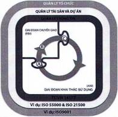

<strong>Hình 3 — Tổng quan vòng đời quản lý thông tin dự án và thông tin tài sản</strong>

Tuân thủ các nguyên tắc chính sau đây rất quan trọng cho việc quản lý thông tin tài sản theo bộ TCVN 14177:

&nbsp;&nbsp;\- Bên đặt hàng trực tiếp liên quan đến việc quản lý tài sản với việc đạt được mục tiêu kinh doanh của họ thông qua các chính sách, chiến lược và kế hoạch quản lý tài sản;

&nbsp;&nbsp;\- Kiểm soát thông tin tài sản phù hợp và kịp thời là một trong những yếu tố cơ bản để quản lý tài sản thành công; và

&nbsp;&nbsp;\- Cấp quản lý cao nhất của chủ sở hữu/đơn vị khai thác sử dụng sẽ điều hành và quản trị công việc quản lý thông tin tài sản.

&nbsp;&nbsp;\- Các nguyên tắc chỉnh sau đây rất quan trọng với việc quản lý thông tin tài sản:

&nbsp;&nbsp;\- Tập trung vào đối tượng khách hàng (người nhận hoặc người sử dụng thông tin tài sản hoặc thông tin dự án);

&nbsp;&nbsp;\- Ứng dụng quy trình lập kế hoạch - thực hiện - kiểm tra - hành động (để phát triển và cung cấp thông tin tài sản hoặc thông tin dự án);

&nbsp;&nbsp;\- Sự tham gia của mọi người, khuyến khích các thao tác phù hợp là yếu tố quan trọng trong việc cung cấp thông tin được nhất quán; và

&nbsp;&nbsp;\- Tập trung vào việc chia sẻ các bài học kinh nghiệm và cải tiến liên tục.

### 6.3  Thiết lập các yêu cầu thông tin và kế hoạch chuyển giao thông tin

### 6.3.1  Nguyên tắc chung

Tất cả thông tin tài sản và thông tin dự án sẽ được cung cấp trong suốt vòng đời tài sản nên được bên đặt hàng chỉ định thông qua một tập hợp các yêu cầu thông tin. Các yêu cầu thông tin liên quan nên được ban hành cho bên thực hiện chính như một phần của quá trình mua sắm. Điều này cũng áp dụng khi một bộ phận của tổ chức ban hành, hướng dẫn công việc cho một bộ phận khác cùng tổ chức. Bên thực hiện chính tiềm năng chuẩn bị phản hồi cho mỗi yêu cầu cung cấp thông tin và được bên đặt hàng xem xét trước thỏa thuận. Việc đáp ứng các yêu cầu thông tin sẽ được quản lý và phát triển bởi từng bên thực hiện chính và bao gồm kế hoạch quản lý tài sản hoặc hoạt động chuyển giao dự án của họ. Thông tin được quản lý và chuyển giao bởi từng bên thực hiện chính và được chấp nhận bởi bên đưa ra yêu cầu. Chu trình phản hồi chuyển giao thông tin sẽ được sửa đổi nếu cần thiết. Sơ đồ chung cho quá trình này được thể hiện tại Hình 4.

Đánh giá rủi ro trong việc cung cấp thông tin tài sản hoặc thông tin dự án phải được đưa vào đánh giá rủi ro tổng thể của tài sản hoặc dự án, sao cho bản chất rủi ro của chuyển giao thông tin, hậu quả và khả năng xảy ra được trao đổi và quản lý. Các khái niệm và nguyên tắc trong tiêu chuẩn này cần được xem xét khi đánh giá rủi ro chuyển giao thông tin.

Các yêu cầu thông tin được xác định để giải quyết các câu hỏi cần phải trả lời để đưa ra quyết định quan trọng liên quan đến tài sản tại các thời điểm khác nhau trong quá trình chuyển giao và khai thác sử dụng tài sản. Kế hoạch chuyển giao thông tin được thực hiện mỗi khi bên thực hiện chính nhận được yêu cầu liên quan đến hoạt động quản lý tài sản hoặc chuyển giao dự án. Điều này bao gồm các thỏa thuận song song được thực hiện bởi bên đặt hàng liên quan đến thiết kế, thi công hoặc bất kỳ dịch vụ nào khác và các thỏa thuận được thực hiện tuần tự thành một chuỗi cung ứng, ví dụ như trong một nhóm thi công

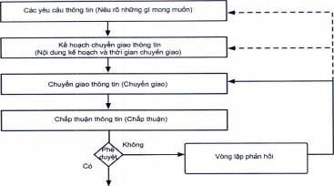

<strong>Hình 4 — Chỉ dẫn chung và hoạch định chuyển giao thông tin</strong>

Hình 5 Minh họa cho việc phân chia các quá trình quản lý thông tin và cách áp dụng cho từng thỏa thuận trong một dự án. Một sự phân chia quá trình tương tự sẽ áp dụng cho từng thỏa thuận trong suốt quá trình quản lý tài sản

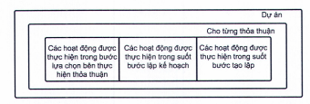

<strong>Hình 5 — Minh họa cho các quá trình phân chia quản lý thông tin</strong>

Chuỗi các yêu cầu thông tin và cung cấp thông tin có một số đặc điểm chính được giải thích trong 6.3.2 đến 6.3.5 và được minh họa cho một hình thức mua sắm cụ thể.

Các nguyên tắc khác liên quan đến chức năng quản lý thông tin, khả năng hợp tác làm việc và năng lực của bên thực hiện được nêu trong các Điều 7, 8 và 9. Các nguyên tắc khác liên liên quan đến tạo lập và chuyển giao thông tin được nêu trong các Điều 11 và 12.

### 6.3.2  Nhóm chuyển giao cung cấp thông tin cho các quyết định của chủ sở hữu/đơn vị khai thác sử dụng tài sản hoặc khách hàng

Hình 6 thể hiện trường hợp một quyết định quan trọng được đưa ra bởi bên đặt hàng. Quyết định đó đưa ra tại thời điểm quyết định quan trọng, hình thoi, nơi một tập hợp yêu cầu thông tin được xác định và chuyển cho nhóm chuyển giao (bên thực hiện chính và những bên thực hiện khác khi thích hợp). Thông tin được chuyển giao thông qua trao đổi thông tin tạo thành vòng tròn khép kín.

Bên đặt hàng nên xác định các thời điểm cần đưa ra quyết định quan trọng và căn cứ theo thông tin yêu cầu từ nhóm chuyển giao để đưa ra quyết định. Bất kỳ thay đổi quan trọng nào đối với các yêu cầu của thông tin cần được thảo luận và thống nhất giữa bên đặt hàng và bên thực hiện chính, một trong hai bên có thể đề xuất yêu cầu đó.

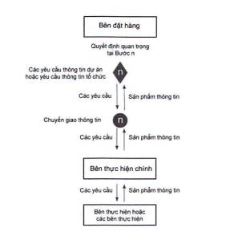

<strong>Hình 6 — Mối quan hệ giữa các quyết định quan trọng và thông tin từ bên thực hiện chính</strong>

### 6.3.3  Xác minh và xác nhận thông tin khi bắt đầu và kết thúc các bước của dự án

Hình 7 thể hiện quá trình trao đổi thông tin diễn ra từ thời điểm kết thúc một bước chuyển giao dự án và bắt đầu bước chuyển giao tiếp theo. Vòng tròn khép kín thể hiện sự trao đổi thông tin.

Các mũi tên dọc thể hiện các yêu cầu thông tin và các chuyển giao thông tin giữa bên đặt hàng và bên thực hiện chính. Mũi tên tròn ở bên trái của mũi tên dọc thể hiện việc cung cấp thông tin của bên thực hiện chính, việc bên đặt hàng kiểm tra thông tin đó so với các yêu cầu và bất kỳ sự lặp lại nào cần thiết để hoàn thành việc trao đổi thông tin (ví dụ khi yêu cầu thông tin bị thiếu hoặc cung cấp chất lượng chưa đáp ứng). Mũi tên tròn ở bên phải mũi tên dọc thể hiện việc cung cấp thông tin từ bên đặt hàng cho bên thực hiện chính, Việc kiểm tra thông tin đó so với các yêu cầu cần thiết để bắt đầu bước dự án tiếp theo và bất kỳ sự lặp lại nào để hoàn thành việc trao đổi thông tin.

Trong các phương pháp xác nhận và xác minh, yếu tố quan trọng là quy trình phê duyệt và chấp thuận phải được thống nhất và ghi lại trước khi thực hiện trao đổi thông tin.

Điều đặc biệt quan trọng là kiểm tra thông tin lần thứ hai, để bắt đầu một bước mới, được thực hiện khi có sự thay đổi của bên thực hiện giữa một bước và bước tiếp theo, đặc biệt chú ý đến khả năng sử dụng của thông tin nhận được. Việc kiểm tra lần thứ hai nên được thực hiện khi có sự chậm trễ trước khi bước dự án tiếp theo bắt đầu. Một số trường hợp việc kiểm tra thông tin lần hai là không cần thiết, ví dụ khi cùng một bên thực hiện chính chuyển giao cả hai bước dự án và không có sự chậm trễ tiến độ dự án giữa các bước.

Thông tin cũng cần được kiểm tra nếu có sự thay đổi bên thực hiện chính của dự án. Trong những trường hợp này, mọi hạn chế về việc sử dụng thông tin của bên thực hiện trước đó đều phải được xem xét.

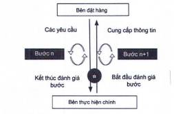

<strong>Hình 7 — Kiểm tra thông tin trong suốt quá trình trao đổi thông tin</strong>

### 6.3.4  Thông tin được thiết lập từ toàn bộ các nhóm chuyển giao

Hình 8 thể hiện cách thức thông tin được chuyển giao trong quá trình trao đổi thông tin từ các nhóm chuyển giao mở rộng cho việc thiết kế, ở bên trái và cho việc thi công ở bên phải. Đối với hình thức mua sắm được minh họa, các đường chấm ngang thể hiện, như một ví dụ, mức độ của thỏa thuận. Mỗi bên thực hiện chính có thể ủy quyền toàn bộ hoặc một phần các yêu cầu thông tin nhận được từ bên đặt hàng của họ và cũng có thể bổ sung các yêu cầu thông tin của riêng mình. Vai trò của mỗi bên thực hiện chính trong việc đáp ứng yêu cầu thông tin tài sản (AIR) hoặc yêu cầu thông tin trao đổi (EIR), nếu phù hợp, nên được xác định trong các kế hoạch chuyển giao. Thông tin được đối chiếu bởi từng bên thực hiện chính từ nhóm chuyển giao của họ và chuyển giao đến bên đặt hàng, có thể kiểm tra và trình lại như được giải thích trong Hình 7.

Nếu có bên mới tham gia nhóm chuyển giao thì kế hoạch chuyển giao nên được cập nhật bao gồm xác nhận thông tin mà họ sẽ phụ trách trong các trao đổi thông tin trong tương lai.

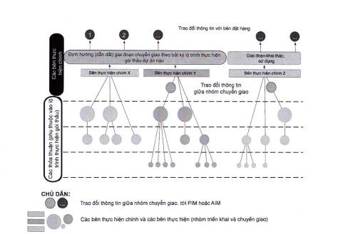

<strong>Hình 8 — Ví dụ về thông tin được cung cấp bởi toàn bộ các nhóm chuyển giao</strong>

### 6.3.5  Tóm tắt việc chuyển giao thông tin từ các nhóm chuyển giao dự án và tài sản

Hình 9 minh họa chuỗi các yêu cầu và chuyển giao thông tin cho một hình thức mua sắm cụ thể. Có thể sử dụng các cách sắp xếp khác nhau cho các bước dự án, các thời điểm quyết định quan trọng khác nhau và các trao đổi thông tin khác nhau với hình minh họa. Ví dụ là việc cung cấp thông tin tiến độ từ chỉ huy thi công đến khách hàng. Tuy nhiên, các điểm chính được giải thích trong 6.3.2, 6.3.3 và 6.3.4 nên áp dụng cho tất cả các bố trí chuyển giao dự án và quản lý tài sản.

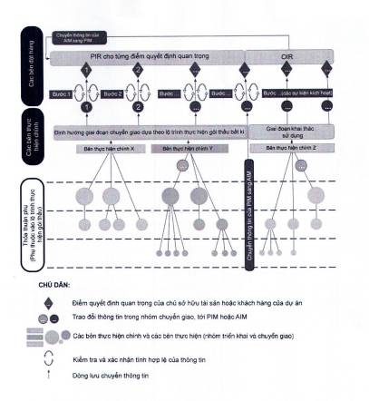

<strong>Hình 9 — Ví dụ về việc chuyển giao thông tin thông qua các trao đổi thông tin để hỗ trợ các quyết định quan trọng của bên đặt hàng</strong>

## 7  CÁC CHỨC NĂNG QUẢN LÝ THÔNG TIN DỰ ÁN VÀ THÔNG TIN TÀI SẢN

### 7.1  Nguyên tắc

Sự rõ ràng về chức năng, trách nhiệm, quyền hạn và phạm vi của bất kỳ nhiệm vụ nào là điều thiết yếu của việc quản lý thông tin hiệu quả. Các chức năng nên được đưa vào thỏa thuận, thông qua một lịch trình dịch vụ cụ thể hoặc bằng cách đề cập các nghĩa vụ chung.

Tiêu chuẩn này xác định các loại chức năng quản lý thông tin nên được xem xét và trách nhiệm của từng chức năng và nên được liên kết với các tài liệu thỏa thuận khác. Các chức năng, trách nhiệm, quyền hạn quản lý thông tin cần được phân bổ cho các bên trên cơ sở phù hợp và khả năng thực hiện. Trong các doanh nghiệp hoặc dự án nhỏ, nhiều chức năng có thể thực hiện bởi cùng một nhân sự hoặc một bên.

Các chức năng quản lý thông tin không nên xem là trách nhiệm của thiết kế. Tuy nhiên, đối với các tài sản hoặc dự án có quy mô nhỏ và ít phức tạp, các chức năng quản lý thông tin có thể thực hiện cùng với các chức năng khác như quản lý tài sản, quản lý dự án, điều hành nhóm thiết kế hoặc kiểm soát thi công.

Điều quan trọng là không được nhầm lẫn giữa các chức năng và các trách nhiệm với chức danh công việc hoặc chức danh chuyên môn hoặc các chức danh khác.

Trong các hoạt động quản lý tài sản hoặc chuyển giao dự án phức tạp, có thể xác định một chức năng cụ thể hỗ trợ thông tin hoặc quá trình quản lý thông tin để hỗ trợ làm việc theo nhóm hoặc hợp tác. Điều này sẽ cho phép tập trung tốt hơn vào các khía cạnh khác nhau của quản lý thông tin để thực hiện hiệu quả quá trình quản lý thông tin.

### 7.2  Các chức năng quản lý thông tin tài sản

Mức độ phức tạp của chức năng quản lý thông tin tài sản phản ánh quy mô, mức độ phức tạp của tài sản hoặc danh mục tài sản được quản lý. Điều quan trọng là các chức năng được phân công trong suốt vòng đời của tài sản. Tuy nhiên, do tính chất dài hạn của quản lý tài sản, gần như các chức năng đó sẽ được thực hiện bởi các tổ chức hoặc các cá nhân kế nhiệm. Do đó, điều quan trọng là lập kế hoạch kế nhiệm được giải quyết hợp lý trong quá trình quản lý thông tin.

Liên quan đến tài sản, việc quản lý thông tin tài sản có thể được giao cho một hoặc nhiều cá nhân trong số nhân viên của bên đặt hàng. Quản lý thông tin tài sản liên quan đến việc lãnh đạo xác nhận thông tin được cung cấp từ mỗi bên thực hiện và lãnh đạo việc cho phép đưa thông tin đó vào mô hình thông tin tài sản (AIM). Chức năng quản lý thông tin tài sản nên được giao ngay từ bước đầu tiên quản lý tài sản.

Khi kết thúc bất kỳ dự án nào, thông tin chính cần bàn giao bao gồm cả thông tin cần thiết để khai thác sử dụng và bảo trì tài sản. Do đó, việc quản lý thông tin tài sản tham gia ở tất cả các bước chuyển giao dự án như định nghĩa trong Bảng 1.

### 7.3  Các chức năng quản lý thông tin dự án

Sự phức tạp của chức năng quản lý thông tin dự án cần phản ánh quy mô và mức độ phức tạp của thông tin dự án. Điều quan trọng là các chức năng được phân công trong suốt dự án, nhưng trình tự của các thỏa thuận và phạm vi của chúng phải phản ánh lộ trình mua sắm đang được sử dụng.

Quản lý thông tin dự án liên quan đến việc điều hành thiết lập tiêu chuẩn thông tin của dự án, các phương pháp và quy trình tạo lập cũng như môi trường dữ liệu chung (CDE) của dự án.

Bên đặt hàng phân bổ trách nhiệm cung cấp thông tin cho các bên thực hiện chính một cách phù hợp. Việc phân bổ các trách nhiệm này nên cụ thể theo từng dự án và được ghi lại trong các tài liệu thỏa thuận.

### 7.4  Các chức năng quản lý thông tin nhiệm vụ

Khi các nhóm chuyển giao được chia thành nhiều nhóm triển khai, các chức năng quản lý thông tin nhiệm vụ nên được giao cho từng nhóm triển khai. Quản lý thông tin ở cấp độ nhóm triển khai cần quan tâm đến thông tin liên quan đến nhiệm vụ đó và yêu cầu phối hợp thông tin trên nhiều nhiệm vụ.

## 8  NĂNG LỰC VÀ KHẢ NĂNG CỦA NHÓM CHUYỂN GIAO

### 8.1  Nguyên tắc

Bên đặt hàng cần xem xét năng lực và khả năng của nhóm chuyển giao dự kiến đảm bảo đáp ứng các yêu cầu thông tin. Việc đánh giá này có thể thực hiện bởi bên đặt hàng, bởi chính nhóm chuyển giao tiềm năng hoặc một bên độc lập. Phạm vi đánh giá nên được cung cấp cho nhóm chuyển giao tiềm năng. Việc xem xét có thể có nhiều bước, ví dụ như sơ tuyển nhưng phải được hoàn thành trước khi ký kết thỏa thuận.

Năng lực đề cập đến khả năng thực hiện một hoạt động nhất định, ví dụ như kinh nghiệm, kỹ năng hoặc khả năng kỹ thuật cần thiết. Khả năng liên quan đến việc có thể hoàn thành một hoạt động trong thời gian cần thiết.

Khi một thỏa thuận mới được thực hiện trong khuôn khổ một thỏa thuận khung hoặc thỏa thuận dài hạn tương tự thì phạm vi đánh giá có thể giảm xuống chỉ còn các khía cạnh liên quan đến đánh giá năng lực và khả năng. Ví dụ, trong một thỏa thuận khung của dự án, kinh nghiệm của nhóm chuyển giao tiềm năng và khả năng đáp ứng công nghệ thông tin cần thiết không cần đánh giá cho mỗi dự án mới, trừ khi có yêu cầu khác biệt đáng kể so với dự án đã thực hiện trước đó. Trong một thỏa thuận khung bảo trì tài sản, năng lực thực hiện của nhóm chuyển giao tiềm năng chỉ cần được đánh giá lại theo các khoảng thời gian được xác định trước trong khung thỏa thuận thay vì trước mỗi hoạt động bảo trì.

### 8.2  Đánh giá năng lực và khả năng

Việc đánh giá năng lực và khả năng của nhóm chuyển giao tiềm năng nên bao gồm ít nhất những nội dung sau:

&nbsp;&nbsp;\- Cam kết tuân thủ tiêu chuẩn và các yêu cầu thông tin;

&nbsp;&nbsp;\- Khả năng phối hợp làm việc của nhóm chuyển giao tiềm năng, kinh nghiệm trong việc phối hợp làm việc trong một công-te-nơ thông tin;

&nbsp;&nbsp;\- Khả năng tiếp cận và trải nghiệm các công nghệ thông tin được chỉ định sử dụng hoặc dự kiến sử dụng trong các yêu cầu thông tin hoặc do nhóm chuyển giao đề xuất; và

&nbsp;&nbsp;\- Số lượng nhân viên có kinh nghiệm và năng lực phù hợp trong nhóm chuyển giao tiềm năng sẵn sàng làm việc với các công việc liên quan đến tài sản hoặc dự án được đề xuất.

## 9  PHỐI HỢP LÀM VIỆC TRONG CÔNG-TE-NƠ THÔNG TIN

Việc phối hợp tạo lập thông tin nên được quy định theo điều khoản chung của cấu trúc thông tin cho phép đạt được các nguyên tắc cơ bản của hoạt động phối hợp làm việc trong công-te-nơ thông tin. Những nguyên tắc cơ bản này như sau:

a) \- Các tác giả tạo lập thông tin, tuân theo các thỏa thuận sở hữu trí tuệ mà họ kiểm soát và kiểm tra, chỉ tìm nguồn cung cấp thông tin đã được phê duyệt khác khi được yêu cầu bằng cách tham khảo, liên hợp hoặc trao đổi thông tin trực tiếp;

b) \- Cung cấp các yêu cầu thông tin rõ ràng ở cấp độ tổng quan, bởi các bên quan tâm liên quan đến dự án hoặc tài sản, và cấp độ chi tiết bởi bên đặt hàng;

c) \- Xem xét đề xuất phương pháp tiếp cận, năng lực và khả năng của từng nhóm chuyển giao trước khi giao nhiệm vụ so với các yêu cầu;

d) \- Cung cấp môi trường dữ liệu chung (CDE) để quản lý và lưu trữ thông tin được chia sẻ, với tính khả dụng thích hợp và đảm bảo cho tất cả các cá nhân hoặc các bên được yêu cầu tạo lập, sử dụng và duy trì thông tin đó;

đ) \- Các mô hình thông tin được phát triển bằng cách sử dụng công nghệ phù hợp với tài liệu này;

e) \- Các quá trình liên quan đến bảo mật thông tin nên được thực hiện trong suốt vòng đời của tài sản để tránh tình trạng truy cập trái phép, mất thông tin, xuống cấp, lỗi thời trong chừng mực có thể thực hiện được.

## 10  KẾ HOẠCH CHUYỂN GIAO THÔNG TIN

### 10.1  Nguyên tắc

Lập kế hoạch chuyển giao thông tin là trách nhiệm của từng bên thực hiện chính và bên thực hiện. Các kế hoạch nên được xây dựng để đáp ứng các yêu cầu thông tin do bên đặt hàng đặt ra và phản ánh phạm vi của thỏa thuận trong tổng thể vòng đời tài sản. Mỗi kế hoạch chuyển giao thông tin nên nêu rõ:

&nbsp;&nbsp;\- Cách thức để đáp ứng các yêu cầu được xác định trong AIR hoặc EIR;

&nbsp;&nbsp;\- Thời điểm thông tin sẽ được chuyển giao, trước tiên liên quan đến các bước của dự án hoặc các mốc quản lý tài sản và sau đó liên quan đến ngày chuyển giao thực tế;

&nbsp;&nbsp;\- Cách thức thông tin sẽ được chuyển giao;

&nbsp;&nbsp;\- Cách thức thông tin sẽ được phối hợp với thông tin của các bên thực hiện khác liên quan;

&nbsp;&nbsp;\- Thông tin sẽ được chuyển giao;

&nbsp;&nbsp;\- Người chịu trách nhiệm chuyển giao thông tin; và

&nbsp;&nbsp;\- Người nhận thông tin.

Yêu cầu tối thiểu của một số kế hoạch cung cấp thông tin được thực hiện bởi bên thực hiện chính hoặc bên thực hiện trước thỏa thuận, vì nội dung này sẽ là một phần quá trình đánh giá của bên đặt hàng. Sau đó, có thể yêu cầu lập kế hoạch chi tiết hơn sau khi thỏa thuận được kí kết như một phần của quá trình huy động. Nên lập kế hoạch chuyển giao thông tin bổ sung nếu có thay đổi về các yêu cầu thông tin hoặc nhóm chuyển giao.

Nhóm chuyển giao nên xem xét giải pháp quản lý thông tin trước khi bắt đầu thực hiện nhiệm vụ thiết kế kỹ thuật, thi công hoặc quản lý tài sản. Điều này nên bao gồm những nội dung sau đây:

&nbsp;&nbsp;\- Các điều kiện thỏa thuận cần thiết và các điều chỉnh đã được chuẩn bị và thống nhất;

&nbsp;&nbsp;\- Các quá trình quản lý thông tin được áp dụng;

&nbsp;&nbsp;\- Kế hoạch chuyển giao thông tin dựa trên khả năng của nhóm chuyển giao;

&nbsp;&nbsp;\- Nhóm chuyển giao có các kỹ năng và năng lực phù hợp; và

&nbsp;&nbsp;\- Công nghệ hỗ trợ và cho phép quản lý thông tin theo tiêu chuẩn này.

Đề xuất đưa vào kế hoạch đào tạo liên quan đến kỹ năng và năng lực.

Thông tin được chuyển giao thông qua trao đổi thông tin được xác định trước. Trao đổi thông tin có thể diễn ra giữa bên đặt hàng và các bên thực hiện chính, cũng như giữa các đơn vị được chỉ định chính với nhau.

Việc cung cấp thông tin phù hợp với các yêu cầu thông tin là một trong những tiêu chí để hoàn thành một dự án hoặc hoạt động quản lý tài sản. Mỗi công-te-nơ thông tin liên quan trực tiếp đến một hoặc nhiều yêu cầu thông tin đã được xác định trước.

### 10.2  Thời điểm chuyển giao thông tin

Một kế hoạch chuyển giao thông tin được xác định cho toàn bộ dự án hoặc việc quản lý tài sản ngắn hạn, trung hạn theo lịch trình và thỏa thuận của các bên. Trong các trường hợp phức tạp, kế hoạch có thể được hợp nhất từ các kế hoạch chuyển giao cho từng dự án hoặc nhiệm vụ quản lý tài sản.

Thời điểm của mỗi lần chuyển giao thông tin bao gồm trong mỗi kế hoạch chuyển giao thông tin, có tham chiếu đến lịch trình quản lý dự án và quản lý tài sản khi đã được biết những điều này.

### 10.3  Ma trận trách nhiệm

Ma trận trách nhiệm được tạo ra như một phần của quá trình lập kế hoạch chuyển giao thông tin ở một hoặc nhiều cấp độ chi tiết. Các trục của ma trận trách nhiệm cần xác định:

&nbsp;&nbsp;\- Các chức năng quản lý thông tin;

&nbsp;&nbsp;\- Hoặc dự án hoặc nhiệm vụ quản lý thông tin tài sản hoặc các chuyển giao thông tin nếu thích hợp.

Nội dung của ma trận trách nhiệm thể hiện chi tiết phù hợp liên quan đến các trục.

### 10.4  Xác định chiến lược liên hợp và cấu trúc phân chia cho các công-te-nơ thông tin

Mục đích của chiến lược liên hợp và phân chia cấu trúc công-te-nơ thông tin là giúp công việc lập kế hoạch tạo lập thông tin từ các nhóm triển khai riêng biệt tương ứng với mức độ nhu cầu thông tin trong 11.2.

Chiến lược liên hợp nên được phát triển trong suốt các hoạt động lập kế hoạch thông tin. Giải thích cách mô hình thông tin dự định phân chia thành một hay nhiều phần của công-te-nơ thông tin. Việc phân chia có thể thực hiện bằng cách xem xét mô hình thông tin ở các góc nhìn khác nhau, như chức năng, không gian và hình học. Ý tưởng phân chia chức năng có thể được hỗ trợ thông qua thể hiện mô hình ngữ nghĩa. Thể hiện mô hình hình học thường được sử dụng trong suốt giai đoạn chuyển giao.

Chiến lược liên hợp được phát triển thành một hoặc nhiều nhóm phân chia cấu trúc công-te-nơ thông tin trong quá trình lập kế hoạch chi tiết để giải thích chi tiết hơn sự liên kết giữa các công-te-nơ thông tin với nhau. Chiến lược liên hợp và phân chia cấu trúc công-te-nơ thông tin giải thích phương pháp quản lý các giao diện được liên kết với tài sản trong giai đoạn chuyển giao hoặc giai đoạn khai thác sử dụng. Các cách sắp xếp khác nhau của các công-te-nơ thông tin được xác định cho các mục đích khác nhau, ví dụ như dựa trên tương thích chức năng, phối hợp không gian hoặc giao diện hình học. Điều này phải tương ứng với mức độ phức tạp của tài sản hoặc dự án. Giải thích và ví dụ về ứng dụng khác nhau của chiến lược liên hợp và phân chia cấu trúc cho công-te-nơ thông tin được đưa ra trong Phụ lục A.

Chiến lược liên hợp và phân chia cấu trúc công-te-nơ thông tin được cập nhật khi có nhóm triển khai mới được chỉ định/lựa chọn. Việc cập nhật cũng có thể được yêu cầu do tính chất công việc đang thực hiện thay đổi, đặc biệt khi sự thay đổi từ việc quản lý tài sản sang chuyển giao dự án và ngược lại.

Các công-te-nơ thông tin trong phân chia cấu trúc công-te-nơ thông tin nên được tham chiếu chéo đến các nhóm triển khai. Trong trường hợp chiến lược liên hợp và phân chia cấu trúc công-te-nơ thông tin chỉ xác định một tập hợp của công-te-nơ thông tin, mỗi nhóm triển khai phải được phân bổ một hoặc nhiều công-te-nơ thông tin trong tập hợp đó và mỗi công-te-nơ thông tin chỉ nên được phân bổ cho một nhóm triển khai.

Việc xác định chiến lược liên hợp và phân chia cấu trúc công-te-nơ thông tin đều là các hoạt động chiến lược liên quan đến dự án hoặc tài sản và nên được thống nhất cách phối hợp. Chiến lược liên hợp và phân chia cấu trúc công-te-nơ thông tin nên được sở hữu và quản lý bởi các nhóm chức năng nắm rõ cách tiếp cận chiến lược để chuyển giao dự án và quản lý tài sản.

Chiến lược liên hợp và phân chia cấu trúc công-te-nơ thông tin được truyền đạt đến tất cả các bên tham gia vào các hoạt động tài sản hoặc dự án. Việc chuẩn bị và lưu hành các minh họa hoặc mô tả chi tiết có thể hữu ích. Các yếu tố bảo mật của việc truyền đạt chiến lược liên hợp hoặc phân chia cấu trúc công-te-nơ thông tin nên được xem xét và có thể hạn chế việc lưu thông của chúng.

## 11  QUẢN LÝ VIỆC HỢP TÁC TẠO LẬP THÔNG TIN

### 11.1  Nguyên tắc

Giải pháp CDE nên được triển khai để cho phép những người yêu cầu thông tin có thể truy cập thông tin để thực hiện chức năng của họ. Giải pháp có thể được thực hiện theo nhiều cách và sử dụng nhiều công nghệ khác nhau. Trong “BIM theo bộ TCVN 14177”, giải pháp và quy trình CDE cho phép phát triển mô hình thông tin liên hợp. Điều này bao gồm các mô hình thông tin từ các bên thực hiện chính, các nhóm chuyển giao hoặc các nhóm triển khai khác nhau. Chất lượng bảo mật và thông tin được xem xét khi thích hợp, được tích hợp vào định nghĩa hoặc các đề xuất cho CDE. Các ý tưởng và nguyên tắc chi tiết hơn về giải pháp và quy trình CDE được nêu trong Điều 12.

Cần tránh các vấn đề về mô hình thông tin trong suốt quá trình tạo lập thông tin thay vì được phát hiện sau khi chuyển giao thông tin. Các vấn đề có thể là không gian, ví dụ như các bộ phận kết cấu và công việc thi công chiếm cùng một không gian hoặc về chức năng, ví dụ như vật liệu chống cháy không tương thích với mức chịu lửa yêu cầu của một bức tường. Các vấn đề về phối hợp không gian có nhiều kiểu khác nhau, ví dụ như “cứng” khi hai vật thể chiếm cùng một không gian hoặc “mềm” khi một đối tượng chiếm không gian khai thác sử dụng hoặc bảo trì của đối tượng khác hoặc “thời gian” khi hai đối tượng hiện diện trong cùng một nơi vào cùng một thời điểm. Nguyên tắc này củng cố yêu cầu về chiến lược liên hợp (xem Điều 10.4)

Thông tin nên được sử dụng trước khi thành phẩm được chọn hoặc sản xuất, chỉ ra không gian cần thiết để lắp đặt, kết nối, bảo trì và thay thế, và được thay thế bằng thông tin cụ thể ngay khi nhận được. Tất cả các quyền liên quan đến thông tin phải được điều chỉnh bằng thỏa thuận giữa các bên có liên quan.

### 11.2  Mức độ nhu cầu thông tin

Mức độ nhu cầu thông tin của mỗi thông tin được chuyển giao phải được xác định theo mục đích của thông tin. Điều này bao gồm việc xác định sự phù hợp về chất lượng, số lượng và mức độ chi tiết của thông tin. Mức độ nhu cầu thông tin và có thể thay đổi tùy theo các lần chuyển giao.

Một loạt các số liệu có sẵn để xác định mức độ nhu cầu thông tin. Ví dụ: hai số liệu bổ sung nhưng độc lập có thể xác định hình học và chữ số về chất lượng, số lượng và mức độ chi tiết. Khi các số liệu này đã được xác định, chúng sẽ được sử dụng để xác định mức độ nhu cầu thông tin trên toàn bộ dự án hoặc tài sản. Tất cả điều này được mô tả rõ ràng trong OIR, PIR, AIR hay EIR.

Mức độ nhu cầu thông tin được xác định bằng lượng thông tin yêu cầu tối thiểu để đáp ứng yêu cầu liên quan, bao gồm cả thông tin do các bên thực hiện khác yêu cầu. Vượt quá mức tối thiểu đều được xem là lãng phí. Các bên thực hiện chính nên cân nhắc rủi ro bằng việc nhập thông tin đối tượng tự động vào mô hình thông tin có thể đưa ra mức độ nhu cầu thông tin cao hơn cấp độ yêu cầu. Sự liên quan của thông tin chuyển giao không phải lúc nào cũng tương quan với mức độ chi tiết của nó. Tuy nhiên, mức độ nhu cầu thông tin có liên hệ mật thiết với chiến lược liên hợp (xem Điều 10.4). Mức độ chi tiết của thông tin chữ và số tối thiểu phải được coi trọng như thông tin hình học.

### 11.3  Chất lượng thông tin

Thông tin được quản lý trong CDE phải dễ hiểu với tất cả các bên tham gia. Những điều sau đây nên được thống nhất để hỗ trợ việc quản lý chất lượng thông tin:

&nbsp;&nbsp;\- Các định dạng thông tin;

&nbsp;&nbsp;\- Các định dạng chuyển giao;

&nbsp;&nbsp;\- Cấu trúc của mô hình thông tin;

&nbsp;&nbsp;\- Phương pháp cấu trúc và phân loại thông tin;

&nbsp;&nbsp;\- Đặt tên thuộc tính cho siêu dữ liệu, ví dụ các thuộc tính hạng mục xây dựng và các chuyển giao thông tin.

Việc phân loại đối tượng phải phù hợp với nguyên tắc trong TCVN 14176-2:2024. Thông tin đối tượng phải phù hợp với ISO 12006-3, để hỗ trợ cho việc trao đổi đối tượng.

Việc kiểm tra tự động các thông tin trong CDE nên được cân nhắc.

## 12  GIẢI PHÁP VÀ QUY TRÌNH MÔI TRƯỜNG DỮ LIỆU CHUNG (CDE)

### 12.1  Nguyên tắc

Giải pháp và quy trình CDE nên được sử dụng để quản lý thông tin trong suốt quá trình quản lý tài sản và chuyển giao dự án. Trong giai đoạn chuyển giao, giải pháp và quy trình CDE hỗ trợ các quá trình quản lý thông tin trong TCVN 14177-2:2024, 5.6 và 5.7.

Khi kết thúc một dự án, các công-te-nơ thông tin cần thiết cho việc quản lý tài sản được chuyển từ PIM sang AIM. Các công-te-nơ thông tin dự án còn lại, bất kỳ công-te-nơ thông tin dự án nào ở trạng thái lưu trữ, nên được giữ lại ở dạng chỉ đọc trong trường hợp có tranh chấp và để giúp rút kinh nghiệm. Khoảng thời gian để lưu giữ các công-te-nơ thông tin dự án được xác định trong EIR.

Bản sửa đổi hiện hành của từng công-te-nơ thông tin trong CDE phải ở một trong ba trạng thái sau:

&nbsp;&nbsp;\- Đang thực hiện (xem 12.2);

&nbsp;&nbsp;\- Đã chia sẻ (xem 12.4);

&nbsp;&nbsp;\- Đã xuất bản (xem 12.6).

Các công-te-nơ thông tin hiện hành có thể tồn tại trên cả ba trạng thái, tùy thuộc vào sự phát triển của chúng. Cũng cần có trạng thái lưu trữ (xem 12.7) cung cấp nhật ký về tất cả các giao dịch trong công- te-nơ thông tin và dấu vết đối chiếu quá trình phát triển.

Các trạng thái này thể hiện trong sơ đồ minh họa ở Hình 10. Hình 10 minh họa thể hiện đơn giản hóa quy trình làm việc trên CDE, liên quan đến nhiều lần điều chỉnh của dữ liệu, nhiều lần xem xét, phê duyệt và ủy quyền, và nhiều mục nhật ký bản ghi lưu trữ các công-te-nơ thông tin ở các trạng thái.

Việc chuyển đổi trạng thái tuân theo quá trình xem xét và phê duyệt (12.3 và 12.5).

Mỗi công-te-nơ thông tin được quản lý thông qua CDE nên có siêu dữ liệu bao gồm:

1) Mã sửa đổi, phù hợp với tiêu chuẩn đã chấp thuận; và

2) Mã trạng thái, hiển thị (các) cách sử dụng thông tin được phép.

Ban đầu, siêu dữ liệu được đưa ra bởi người tạo lập và sau đó được sửa đổi bởi quá trình phê duyệt và ủy quyền. Sử dụng công-te-nơ thông tin cho các mục đích khác với mã trạng thái đang hiển thị của dữ liệu gây rủi ro cho người sử dụng.

Giải pháp CDE có thể bao gồm cả khả năng quản lý cơ sở dữ liệu để quản lý các thuộc tính của công- te-nơ thông tin và siêu dữ liệu, và khả năng truyền tải để đưa ra thông báo cập nhật cho các thành viên trong nhóm và duy trì quá trình kiểm tra việc xử lý thông tin.

Toàn bộ mô hình thông tin thường không tổ chức ở một nơi, đặc biệt đối với tài sản hoặc dự án lớn, phức tạp, hoặc các nhóm phân tán. Dựa trên công-te-nơ thông tin phối hợp làm việc cho phép quy trình CDE được chuyển giao trên các hệ thống máy tính hoặc nền tảng công nghệ khác nhau.

Những lợi thế của việc áp dụng giải pháp và quy trình CDE bao gồm:

&nbsp;&nbsp;\- Trách nhiệm đối với thông tin trong mỗi công-te-nơ thông tin vẫn thuộc về tổ chức tạo lập, mặc dù nó được chia sẻ và sử dụng lại nhưng chỉ tổ chức tạo lập được phép sửa đổi;

&nbsp;&nbsp;\- Chia sẻ các công-te-nơ thông tin làm giảm thời gian và chi phí trong việc tạo thông tin phối hợp; và

&nbsp;&nbsp;\- Có sẵn một bản kiểm tra đầy đủ về việc tạo lập thông tin để sử dụng trong và sau mỗi hoạt động chuyển giao dự án và quản lý tài sản.

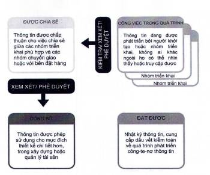

<strong>Hình 10 — Khái niệm môi trường dữ liệu chung</strong>

### 12.2  Trạng thái công việc đang tiến hành

Trạng thái công việc đang tiến hành được sử dụng cho thông tin đang được phát triển bởi nhóm triển khai. Một công-te-nơ thông tin ở trạng thái này sẽ không thể hiển thị hoặc truy cập được đối với bất kỳ nhóm triển khai khác. Điều này đặc biệt quan trọng nếu giải pháp môi trường dữ liệu chung (CDE) được triển khai thông qua một hệ thống chia sẻ, ví dụ: máy chủ chia sẻ hoặc cổng thông tin web.

### 12.3  Quá trình chuyển đổi kiểm tra/xem xét/phê duyệt

Quá trình chuyển đổi kiểm tra/xem xét/phê duyệt so sánh công-te-nơ thông tin với kế hoạch chuyển giao thông tin và với các tiêu chuẩn, phương pháp và quy trình tạo lập thông tin đã được chấp thuận. Quá trình chuyển đổi kiểm tra/xem xét/phê duyệt nên được thực hiện bởi nhóm triển khai ban đầu.

### 12.4  Trạng thái chia sẻ

Mục đích của trạng thái chia sẻ cũng được sử dụng cho các công-te-nơ thông tin đã được phê duyệt để chia sẻ với bên đặt hàng và sẵn sàng cho phép. Việc sử dụng trạng thái chia sẻ này có thể được gọi là trạng thái chia sẻ khách hàng.

### 12.5  Chuyển đổi tình trạng xem xét/phê duyệt

Chuyển đổi tình trạng xem xét/phê duyệt so sánh tất cả các công-te-nơ thông tin khi trao đổi thông tin để kiểm tra các yêu cầu thông tin liên quan về sự phối hợp, sự hoàn thiện và tính chính xác. Nếu công- te-nơ thông tin đáp ứng được các yêu cầu thông tin, trạng thái được chuyển thành đã xuất bản. Các công-te-nơ thông tin không đáp ứng được các yêu cầu thông tin được trả về trạng thái công việc đang tiến hành để sửa đổi và trình lại.

Phê duyệt sẽ tách riêng thông tin (ở trạng thái đã xuất bản) có thể được dùng trong bước chuyển giao dự án tiếp theo bao gồm công việc thiết kế hoặc thi công xây dựng chi tiết hoặc để quản lý tài sản, ra khỏi thông tin vẫn có thể thay đổi được (ở trạng thái công việc đang tiến hành hoặc trạng thái chia sẻ).

### 12.6  Trạng thái đã xuất bản

Trạng thái đã xuất bản được dùng cho thông tin mà đã được cấp phép sử dụng, ví dụ: việc xây dựng một dự án mới hoặc trong việc khai thác sử dụng một tài sản. PIM khi kết thúc một dự án hoặc AIM trong quá trình khai thác sử dụng tài sản chỉ bao gồm thông tin ở trạng thái đã xuất bản hoặc trạng thái lưu trữ.

### 12.7  Trạng thái lưu trữ

Trạng thái lưu trữ được sử dụng để chứa nhật ký của tất cả các công-te-nơ thông tin đã được chia sẻ và xuất bản trong suốt quá trình quản lý thông tin cũng như là dấu vết kiểm toán của quá trình phát triển của các công-te-nơ thông tin. Một công-te-nơ thông tin được tham chiếu ở trạng thái lưu trữ mà trước đây là trạng thái đã xuất bản thể hiện thông tin có khả năng đã được sử dụng cho công việc thiết kế chi tiết hơn, cho thi công công trình hoặc để quản lý tài sản.

## 13  TÓM TẮT "MÔ HÌNH HÓA THÔNG TIN CÔNG TRÌNH (BIM) THEO BỘ TCVN 14177"

Quản lý thông tin khác với tạo lập và chuyển giao thông tin, nhưng chúng được liên kết chặt chẽ với nhau. Quản lý thông tin được áp dụng trong suốt toàn bộ vòng đời của tài sản. Các chức năng quản lý thông tin nên được giao cho các tổ chức thích hợp nhất (bên đặt hàng, các bên thực hiện chính, các bên thực hiện) và không nhất thiết phải yêu cầu chỉ định/lựa chọn từ các tổ chức mới.

Lượng thông tin đang được quản lý thường sẽ tăng lên trong cả giai đoạn chuyển giao và giai đoạn khai thác sử dụng. Tuy nhiên, chỉ nên cung cấp hoặc chuyển giao những thông tin liên quan giữa các hoạt động trong giai đoạn khai thác sử dụng, giai đoạn chuyển giao.

Một quá trình quản lý thông tin được bắt đầu mỗi khi có một thỏa thuận cung cấp thông tin mới của giai đoạn chuyển giao hoặc giai đoạn khai thác sử dụng bất kể thỏa thuận này là chính thức hay không chính thức. Quá trình này bao gồm việc chuẩn bị các yêu cầu thông tin, xem xét các bên thực hiện tiềm năng liên quan đến quản lý thông tin, lập kế hoạch ban đầu, chi tiết về cách thức và và thời gian thông tin sẽ được chuyển giao và xem xét các chuyển giao thông tin so với các yêu cầu thông tin trước khi chúng được đưa vào các hệ thống khai thác sử dụng. Quá trình quản lý thông tin cần được áp dụng sao cho tương xứng với quy mô và độ phức tạp của các hoạt động quản lý dự án hoặc quản lý tài sản.

Các yêu cầu về thông tin được chuyển đến bên thực hiện phù hợp trong một nhóm chuyển giao. Chuyển giao thông tin đối chiếu bởi bên thực hiện chính trước khi chuyển giao cho bên thực hiện thông qua trao đổi thông tin. Trao đổi thông tin cũng được sử dụng để chuyển thông tin giữa các bên thực hiện chính khi điều này đã được bên đặt hàng cho phép.

Quy trình CDE được sử dụng để hỗ trợ hợp tác tạo lập, quản lý, chia sẻ và trao đổi của tất cả thông tin trong các giai đoạn khai thác sử dụng và chuyển giao.

Các mô hình thông tin bao gồm các chuyển giao thông tin liên kết được tạo lập bởi tiến trình CDE nhằm giải quyết các vấn đề của tất cả các bên quan tâm.

Trong quá trình quản lý thông tin, số lượng và mô tả các phần trong vòng đời tài sản (hình chữ nhật khép kín), các mốc trao đổi thông tin (hình tròn khép kín) và các thời điểm quyết định cho các nhóm chuyển giao, các bên quan tâm hoặc bên đặt hàng (hình kim cương) nên phản ánh thực tiễn địa phương, bên quan tâm và các yêu cầu của bên đặt hàng, và bất kỳ văn bản hoặc yêu cầu cụ thể nào đối với việc chuyển giao dự án hoặc quản lý tài sản.

Các khái niệm và nguyên tắc trên được tóm tắt trong Hình 11.

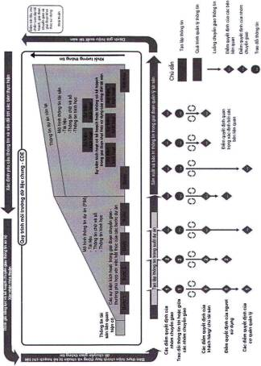

<strong>Hình 11 — Ví dụ về chuyển giao thông tin thông qua trao đổi thông tin để hỗ trợ các quyết định quan trọng của bên đặt hàng</strong>

---

## 📑 DANH MỤC PHỤ LỤC KỸ THUẬT CHUYÊN ĐỀ (MODULAR ANNEXES)

Toàn bộ 1 Phụ lục kỹ thuật chuyên đề đã được module hóa thành các tệp độc lập nhằm tối ưu hóa tra cứu và thẩm tra thiết kế (ADR 0021 & ADR 0030):

| Ký hiệu | Tên Phụ Lục | Tính chất | Liên kết Tập tin |
| :---: | :--- | :---: | :---: |
| **Phụ lục A** | Minh họa về các chiến lược liên hợp và phân chia cấu trúc công-te-nơ thông tin | Tham khảo | [📑 **Xem Phụ lục**](annexes/phu_luc_a_minh_hoa_ve_cac_chien_luoc_lien_hop_va_phan_c.md#phu-luc-a) |

---

## 📊 HỆ THỐNG TRA CỨU BẢNG & SƠ ĐỒ KỸ THUẬT

- **Tra cứu 1 Bảng Số Liệu:** Tra cứu chi tiết dạng CSV/JSON tại [Thư mục Bảng Số Liệu](tables/README.md).
- **Tra cứu Sơ Đồ Hình Vẽ:** Tra cứu ảnh nét cao và đặc tả phân vùng tại [Danh Mục Sơ Đồ Khí Động](figures/figures_catalog.yaml).