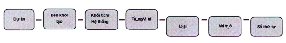

## PHỤ LỤC — sẽ hỗ trợ người dùng hiểu được việc thực hiện tiêu chuẩn này bằng cách dịch các thuật ngữ chính và mở rộng các yêu cầu.

### B.2  Mã định danh công-te-nơ thông tin (ID)

### B.2.1  Làm rõ

TCVN 14177-2:2024, (5.1.7.a) nêu rõ: “Môi trường dữ liệu chung của dự án sẽ cho phép mỗi công-te- nơ thông tin sẽ có một mã định danh (ID) duy nhất, dựa trên một quy ước đã được thống nhất và nêu rõ bằng văn bản, bao gồm các trường thông tin được tách rời bằng dấu phân cách”.

### B.2.2  Công-te-nơ thông tin

Mã định danh (ID) duy nhất cho các công-te-nơ thông tin trong môi trường dữ liệu chung có thể được xác định bằng cách sử dụng các trường sau, được phân tách bằng dấu cách, theo quy ước sau.

$$\text{Dự án} - \text{Bên khởi tạo} - \text{Khối tích/Hệ thống} - \text{Tầng/Vị trí} - \text{Loại} - \text{Vai trò} - \text{Số thứ tự}$$
<!-- formula_id: "F_TCVN_ISO_19650_2_2021_RID21" -->

<strong>Hình B.1 — Định danh các công-te-nơ thông tin trong môi trường dữ liệu chung</strong>

**CHÚ THÍCH 1:** Nếu một công-te-nơ thông tin bị xóa hoặc xuất khỏi môi trường dữ liệu chung thì các trường bổ sung “sự phù hợp” và “phiên bản sửa đổi”, được phân tách bằng dấu cách, phải được thêm vào mã định danh (ID) của nó dưới dạng hậu tố.

**CHÚ THÍCH 2:** Tùy thuộc vào từng gói thỏa thuận cụ thể và các bên thực hiện cụ thể, có thể linh hoạt trong quy định trường ID.

### B.2.3  Dấu phân cách

Dấu phân cách sau sẽ được sử dụng.

Dấu gạch nối - Trừ (**) tham chiếu Unicode U+002D

(**): Dấu gạch nối - trong bảng chữ cái la tinh, đã được thêm vào bộ mã chuẩn quốc tế Unicode phiên bản 1.1 (năm 1993)

### B.3  Trường mã hóa

### B.3.1  Làm rõ

Tại 5.1.7 b nêu rõ: “Môi trường dữ liệu chung của dự án sẽ cho phép môi trường được được gán một giá trị từ một tiêu chuẩn mã hóa đã được thống nhất và ghi lại”.

**CHÚ THÍCH:** Việc mã hóa cho từng trường phải được xác định từ các mã hóa sau.

### B.3.2  Dự án

Duy nhất một mã định danh dự án phải được xác định khi bắt đầu dự án. Nó nên độc lập và khác biệt rõ ràng với mã số công việc nội bộ của bất kỳ tổ chức cá nhân nào và cố định trong tiêu chuẩn thông tin dự án. Khuyến cáo rằng mã cho các chủ đề, hoạt động và nhân tố dự án có từ hai đến sáu ký tự.

**CHÚ THÍCH 1:** Không có mã tiêu chuẩn cho trường dự án. Mã định danh dự án phụ thuộc vào quyết định của bên đặt hàng hoặc bên khởi tạo dự án

**CHÚ THÍCH 2:** Một dự án có thể được chia thành các dự án thành phần.

**CHÚ THÍCH 3:** Trong trường hợp một dự án bao gồm nhiều dự án thành phần hoặc một dự án thành phần có nhiều giai đoạn thì mỗi dự án thành phần hoặc giai đoạn đó có thể được gán một định danh-

### B.3.3  Bên khởi tạo

Cần xác định một mã định danh duy nhất cho mỗi tổ chức khi tham gia dự án, để xác định tổ chức chịu trách nhiệm tạo lập thông tin trong công-te-nơ thông tin và cố định trong tiêu chuẩn thông tin dự án. Khuyến cáo rằng mã cho trường bên khởi tạo có từ ba tới sáu ký tự.

**CHÚ THÍCH:** Khi một dự án bao gồm nhiều dự án thành phần hoặc một dự án thành phần có nhiều giai đoạn, mỗi dự án thành phần hoặc giai đoạn có thể được gán một mã định danh.

### B.3.4  Khối tích (***)/ Hệ thống (****)

Phải xác định một mã định danh duy nhất cho từng khối tích/hệ thống và cố định trong tiêu chuẩn thông tin dự án. Khuyến cáo rằng mã cho trường khối tích/hệ thống có hai ký tự.

Các mã tiêu chuẩn sau đây nên được áp dụng.

ZZ  tất cả các khối tích/hệ thống

XX  không áp dụng cho khối tích /hệ thống nào

**CHÚ THÍCH:** Danh sách này có thể mở rộng với các mã dành riêng cho dự án.

### B.3.5  Tầng/Vị trí

Cần xác định một mã định danh duy nhất cho từng tầng/vị trí và cố định trong tiêu chuẩn thông tin dự án. Khuyến cáo mã cho trường tầng/vị trí có hai ký tự.

Các mã tiêu chuẩn sau đây nên được áp dụng.

ZZ  nhiều mức độ/vị trí

XX  không áp dụng cho tầng/vị trí nào

01  tầng 1/tầng trệt

02  tầng 2, v.v.

M1  tầng lửng M1 trên tầng 1

M2  tầng lửng M2 trên tầng 2, v.v.

B1  tầng hầm 1

B2  tầng hầm 2, v.v.

**CHÚ THÍCH 1:** Danh sách này có thể được mở rộng bằng các mã dành riêng cho dự án.

**CHÚ THÍCH 2:** Mã vị trí cho các tài sản không phải là tòa nhà có thể yêu cầu mã dành riêng cho dự án.

### B.3.6  Loại

Cần xác định một mã định danh duy nhất cho từng loại thông tin, để xác định loại thông tin được giữ trong công-te-nơ thông tin và được cố định trong tiêu chuẩn thông tin dự án. Khuyến cáo mã cho trường loại có hai ký tự.

Các mã tiêu chuẩn sau đây nên được áp dụng.

AF  tệp file động (của một mô hình)

BQ  bảng khối lượng

CA  tính toán

CM  mô hình kết hợp (mô hình kết hợp nhiều bộ môn)

CO  tương ứng

CP  kế hoạch chi phí

CR  phiên bản xung đột

DB  cơ sở dữ liệu

DR  thể hiện bằng hình vẽ

FN  ghi chú tập tin

HS  sức khoẻ và an toàn

IE  hồ sơ trao đổi thông tin

M2  mô hình 2D

M3  mô hình 3D

MI  biên bản /ghi chú hành động

MR  thể hiện bằng mô hình cho các diễn họa khác, ví dụ: phân tích nhiệt, v.v.

MS  tuyên bố phương pháp

PP  trình bày

PR  chương trình

RD  bảng dữ liệu của phòng

**CHÚ THÍCH:** Là bảng thống kê vị trí, thông số, vật liệu hoàn thiện, vật dụng, thiết bị... của phòng. Bảng này có thể tạo từ các trường dữ liệu khác nhau tùy theo nhu cầu thông tin của các bên.

RI  yêu cầu thông tin

RP  báo cáo

SA  lịch trình giải quyết

SH  lịch

SN  danh sách cần khắc phục

**CHÚ THÍCH:** Là bảng thống kê các lỗi nhỏ còn tồn tại để lưu ý hoặc để theo dõi khắc phục SP chỉ dẫn kỹ thuật

SU  khảo sát

VS  trực quan hóa

**CHÚ THÍCH:** Danh sách này có thể được mở rộng với các mã dành riêng cho dự án.

### B.3.7  Vai trò

Cần xác định một mã định danh duy nhất cho từng vai trò trong dự án mà tổ chức giao và cố định trong tiêu chuẩn thông tin dự án. Khuyến cáo mã cho trường vai trò là một hoặc hai ký tự.

Các mã tiêu chuẩn sau đây nên được áp dụng.

A  kiến trúc sư

B  khảo sát công trình

C  kỹ sư xây dựng

D  kỹ sư nước, giao thông

E  kỹ sư điện

F  quản lý cơ sở vật chất

G  khảo sát địa chất và địa hình

H  thiết kế hệ thống sưởi ấm, thông gió

I  thiết kế nội thất

K  chủ đầu tư/khách hàng

L  kiến trúc sư cảnh quan

M  kỹ sư cơ khí

P  kỹ sư an toàn và sức khoẻ

Q  kỹ sư định giá

S  kỹ sư kết cấu

T  quản lý quy hoạch đô thị

W  nhà thầu

X  nhà thầu phụ

Y  nhà thiết kế chuyên biệt

Z  chung (không thuộc bộ môn/chuyên ngành nêu trên)

**CHÚ THÍCH:** Danh sách này có thể được mở rộng bằng hai mã dành riêng cho dự án

### B.3.8  Số thứ tự

Một số thứ tự phải được gán cho mỗi công-te-nơ thông tin khi nó là một trong một chuỗi chứ không phải được phân biệt bởi bất kỳ trường nào khác.

Việc đánh số cho mã hóa tiêu chuẩn phải được cố định trong tiêu chuẩn thông tin dự án và nó được khuyến cáo rằng nó có độ dài từ bốn đến sáu chữ số nguyên.

**CHÚ THÍCH:** Nên sử dụng các số 0 ở đầu và cần thận trọng để không thể hiện thông tin có trong các trường khác.

### B.4  Siêu dữ liệu công-te-nơ thông tin

### B.4.1  Làm rõ

Tại 5.1.7 c nêu rõ: “Môi trường dữ liệu chung của dự án sẽ cho phép mỗi nơi chứa công-te-nơ thông tin được gán các thuộc tính [siêu dữ liệu] sau: trạng thái sự phù hợp; phiên bản sửa đổi; phân loại (theo khung phân loại trong TCVN 14176-2:2024).

Các thuộc tính (siêu dữ liệu) cho các công-te-nơ thông tin trong môi trường dữ liệu chung được đề xuất bằng các từ mã hóa sau.

### B.4.2  Trạng thái

### Bảng B.1 - Mã trạng thái cho các công-te-nơ thông tin trong môi trường dữ liệu chung

| Mã | Mô tả | Phiên bản |
| :--- | :--- | :--- |
| **Tiến trình công việc** |  |  |
| SO | Trạng thái khởi tạo ban đầu | Phiên bản sơ bộ và các phiên bản sửa đổi |
| **Chia sẻ (không trong hợp đồng)** |  |  |
| S1 | Phục vụ cho phối hợp | Phiên bản sơ bộ |
| S2 | Phục vụ cho phổ biến thông tin | Phiên bản sơ bộ |
| S3 | Phục vụ cho xem xét và góp ý | Phiên bản sơ bộ |
| S4 | Phục vụ cho phê duyệt giai đoạn | Phiên bản sơ bộ |
| S5 | Thu hồi | Không có giá trị được gắn kèm |
| S6 (có thể không áp dụng) | Phù hợp để ủy quyền PIM | Phiên bản sơ bộ |
| S7 (có thể không áp dụng) | Phù hợp để ủy quyền AIM | Phiên bản sơ bộ |
| **Đã xuất bản (trong hợp đồng)** |  |  |
| A1, An, v.v. | Được ủy quyền và chấp thuận | Phiên bản của hợp đồng |
| B1, Bn, v.v. | Chấp thuận một phần (Với các khuyến cáo) | Phiên bản sơ bộ |
| Đã xuất bản (chấp thuận mô hình thông tin tài sản - AIM) |  |  |
| CR | Hồ sơ hoàn công | Phiên bản của hợp đồng |

**CHÚ THÍCH:** Danh sách này có thể được mở rộng cho các mã trường thông tin khác phù hợp với các yêu cầu cụ thể của bên đặt hàng và được cố định trong tiêu chuẩn thông tin dự án.

### B.4.3  Sửa đổi

Bản sửa đổi sơ bộ của công-te-nơ thông tin phải là hai số nguyên, có tiền tố là chữ cái “P”. ví dụ: P01.

Các bản sửa đổi sơ bộ của công-te-nơ thông tin ở trạng thái “đang tiến hành’’ cũng cần có hai hậu tố số nguyên để xác định phiên bản của bản sửa đổi sơ bộ, ví dụ: P02.05.

Bản sửa đổi ban đầu của công-te-nơ thông tin phải là P01.01.

Các sửa đổi theo hợp đồng của các công-te-nơ thông tin phải là hai số nguyên, có tiền tố là chữ cái “C”, ví dụ: C01.

### B.4.4  Phân loại

Việc phân loại thông tin trong công-te-nơ thông tin tùy thuộc vào quyết định của bên đặt hàng hoặc bên đặt hàng chính lựa chọn trong giai đoạn đánh giá và xác định nhu cầu.

Có thể tham khảo TCVN 14176-2:2024.

Có thể theo hệ phân loại Uniclass hoặc Omniclass.

### B.5  Trao đổi mô hình thông tin

### B.5.1  Làm rõ

Tại 5.2.1 nêu rõ: “Bên đặt hàng phải thiết lập yêu cầu thông tin trao đổi để bên thực hiện tiềm năng phải đáp ứng trong suốt thỏa thuận”.

Các mẫu thông tin được trao đối với bên đặt hàng, trừ khi có quy định ngược lại trong tiêu chuẩn thông tin dự án, nên bao gồm

a) \- Thông tin hình học ở định dạng độc quyền hoặc định dạng dữ liệu mở;

b) \- Thông tin phi hình học ở định dạng dữ liệu mở, được chứa trong một công-te-nơ thông tin duy nhất; và

c) \- Tài liệu ở định dạng dữ liệu mở.

**CHÚ THÍCH 1:** Dữ liệu thông tin hình học: Thông tin hình học là dữ liệu chính tạo nên mô hình 3D. Chúng có thể hiểu đơn giản là các thông tin được tạo nên từ toán học, các dạng hình học được hình thành bằng các đường, điểm hoặc đường cong., chúng là các thông tin/ dữ liệu dùng để lắp đặt, xây dựng nền công trình, (nếu hình dạng chúng không xác định được bằng toán học thì nó không phải là thông tin hình học).

**CHÚ THÍCH 2:** Dữ liệu thông tin phi hình học: Khác với các thông tin hình học, Dữ liệu phi hình học không dễ hình dung, những dữ liệu này thường là thông tin liên kết với tài sản như mô tả đặc tính sản phẩm, thông số kỹ thuật, hoặc các nội dung về quản lý, bàn giao...

**CHÚ THÍCH 3:** Các định dạng dữ liệu mở sẵn sàng kết nối với các dữ liệu khác.

### B.6  Yêu cầu thông tin của dự án

### B.6.1  Làm rõ

TCVN 14177-2:2024, (5.1.2) nêu rõ: “Bên đặt hàng phải xác lập thông tin của dự án các yêu cầu, như được mô tả trong TCVN 14177-1:2024, (5.3), để giải quyết các câu hỏi để bên đặt hàng cần phải trả lời tại mỗi thời điểm quyết định quan trọng trong suốt dự án”.

Thư mục tài liệu tham khảo

[1] TCVN 11866:2017 (ISO 21500:2012), Hướng dẫn quản lý dự án;

[2] TCVN 12690:2019, Công nghệ thông tin - Ký hiệu và mô hình quy trình nghiệp vụ cho nhóm quản lý đối tượng;

[3] ISO 22263:2008, Organization of information about construction works - Framework for management of project information (Tổ chức thông tin công trình xây dựng - Khung quản lý thông tin dự án);

[4] ISO 55000:2014, Asset management - Overview, principles and terminology (Quản lý tài sản - Tổng quan, nguyên tắc và thuật ngữ).

Mục lục

Lời nói đầu

0  Lời giới thiệu

0.1  Mục đích

0.2  Mối liên hệ với các tiêu chuẩn khác

0.3  Lợi ích của bộ TCVN 14177

0.4  Mối liên hệ giữa các bên và các nhóm cho mục đích quản lý thông tin

## 1  PHẠM VI ÁP DỤNG

## 2  TÀI LIỆU VIỆN DẪN

## 3  THUẬT NGỮ VÀ ĐỊNH NGHĨA VÀ KÝ HIỆU

### 3.1  Thuật ngữ và định nghĩa

### 3.1.1  Thuật ngữ chung

### 3.1.2  Các thuật ngữ liên quan đến tài sản và dự án (terms related to assets and projects)

### 3.2  Ký hiệu

## 4  QUẢN LÝ THÔNG TIN TRONG GIAI ĐOẠN CHUYỂN GIAO TÀI SẢN/DỰ ÁN

## 5  QUÁ TRÌNH QUẢN LÝ THÔNG TIN TRONG GIAI ĐOẠN CHUYỂN GIAO TÀI SẢN

### 5.1  Quá trình quản lý thông tin - Các hoạt động đánh giá và xác định nhu cầu

### 5.2  Quá trình quản lý thông tin - Hồ sơ yêu cầu

### 5.3  Quá trình quản lý thông tin - Hồ sơ đề xuất

### 5.4  Quá trình quản lý thông tin - Thỏa thuận

### 5.5  Quá trình quản lý thông tin - Huy động

### 5.6  Quá trình quản lý thông tin - Các hoạt động hợp tác tạo lập thông tin

### 5.7  Quá trình quản lý thông tin - Chuyển giao mô hình thông tin

### 5.8  Quá trình quản lý thông tin - Kết thúc chuyển giao dự án