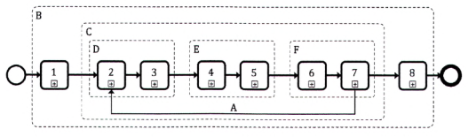
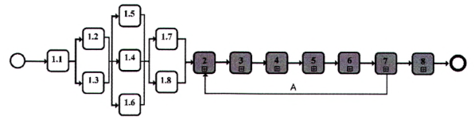
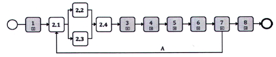
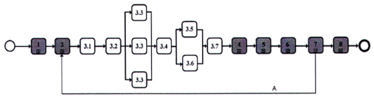
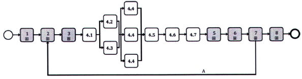
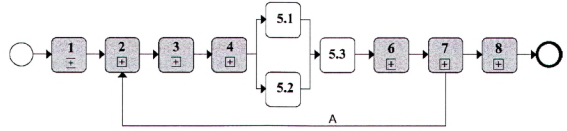
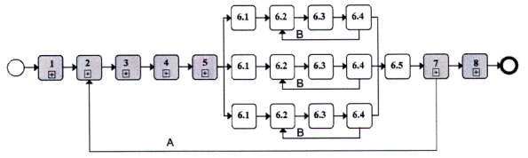
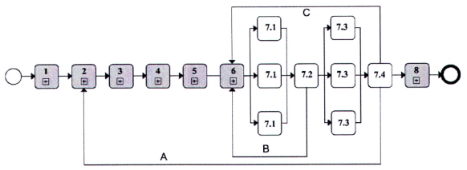
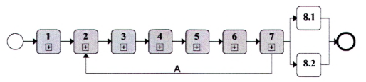

# TIÊU CHUẨN QUỐC GIA

**TCVN 14177-2:2024**

TỔ CHỨC VÀ SỐ HÓA THÔNG TIN VỀ CÔNG TRÌNH XÂY DỰNG, BAO GỒM MÔ HÌNH HÓA THÔNG TIN CÔNG TRÌNH (BIM) - QUẢN LÝ THÔNG TIN SỬ DỤNG MÔ HÌNH HÓA THÔNG TIN CÔNG TRÌNH - PHẦN 2: GIAI ĐOẠN CHUYỂN GIAO TÀI SẢN

Organization and digitization of information about buildings and civil engineering works, including building information modelling (BIM) - Information management using building information modelling - Part 2: Delivery phase of the assets

## Lời nói đầu

**TCVN 14177-2:2024 được xây dựng dựa trên cơ sở tham khảo ISO 19650-2:2018.**

**TCVN 14177-2:2024 do Tổng Công ty Tư vấn xây dựng Việt Nam - CTCP biên soạn, Bộ Xây dựng đề nghị, Ủy ban Tiêu chuẩn Đo lường Chất lượng Quốc gia thẩm định, Bộ Khoa học và Công nghệ công bố.**

0  Lời giới thiệu

0.1  Mục đích

Mục đích tiêu chuẩn này là để cho phép bên đặt hàng thiết lập các yêu cầu của họ về thông tin trong giai đoạn chuyển giao tài sản và cung cấp môi trường hợp tác và thương mại phù hợp trong đó (nhiều) bên thực hiện chính có thể tạo ra thông tin một cách hiệu quả và tiết kiệm.

Tiêu chuẩn này có thể áp dụng cho các tài sản được xây dựng và các dự án xây dựng thuộc mọi quy mô và mọi mức độ phức tạp, bao gồm các bất động sản lớn, mạng lưới cơ sở hạ tầng, các tòa nhà riêng lẻ và các phần cơ sở hạ tầng cũng như các dự án hoặc chương trình chuyển giao. Tuy nhiên, những yêu cầu trong tiêu chuẩn này phải được áp dụng theo cách tương xứng và phù hợp với quy mô và mức độ phức tạp của tài sản hoặc dự án. Đặc biệt, việc mua sắm và huy động tài sản hoặc các bên thực hiện dự án cần được lồng ghép ở mức độ cao nhất có thể với các quy trình được văn bản hóa để mua sắm và huy động kỹ thuật.

Tiêu chuẩn này sử dụng rộng rãi cụm từ “phải xem xét”, đặc biệt trong các yêu cầu ở Điều 5. Cụm từ này được sử dụng để giới thiệu danh sách các mục mà bên được đề cập cần suy nghĩ cẩn thận liên quan đến yêu cầu chính được mô tả trong điều. Các cân nhắc liên quan, thời gian cần thiết để hoàn thành và nhu cầu về bằng chứng hỗ trợ sẽ phụ thuộc vào mức độ phức tạp của dự án, kinh nghiệm của (những) bên liên quan và chính sách của bất kỳ quốc gia nào về việc giới thiệu mô hình hóa thông tin công trình. Trong một dự án tương đối nhỏ hoặc đơn giản, một số mục có thể hoàn thành hoặc loại bỏ vì không liên quan đến việc “phải xem xét” rất nhanh chóng.

Một cách để giúp xác định nội dung trong số những nội dung “phải xem xét” có tính phù hợp có thể là xem xét từng nội dung và tạo mẫu cho các dự án có quy mô và mức độ phức tạp khác nhau.

Tiêu chuẩn này có thể được sử dụng bởi một bên đặt hàng bất kỳ. Nếu bên đặt hàng dự định áp dụng tiêu chuẩn này cho bất kỳ tài sản (dự án) nào thì điều này phải được phản ánh trong thoả thuận.

Tiêu chuẩn này xác định quy trình quản lý thông tin, bao gồm các hoạt động mà qua đó các nhóm chuyển giao hợp tác khởi tạo thông tin và giảm thiểu các hoạt động lãng phí. Tiêu chuẩn này chủ yếu dành cho những đối tượng sau (xem Hình 1):

- Những bên tham gia vào việc quản lý hoặc tạo ra thông tin trong giai đoạn chuyển giao tài sản;

- Những bên tham gia vào việc xác định và mua sắm các dự án xây dựng;

- Những bên liên quan đến việc chỉ định cụ thể và tạo điều kiện thuận lợi cho công việc cộng tác;

- Những bên tham gia vào việc thiết kế, xây dựng, khai thác sử dụng, bảo trì và ngừng hoạt động tài sản; và

- Những bên chịu trách nhiệm tạo ra giá trị cho tổ chức từ cơ sở tài sản của họ.

Tiêu chuẩn này bao gồm các yêu cầu liên quan đến việc quản lý thông tin trong giai đoạn chuyển giao tài sản đã xây dựng, cần được xem xét và sửa đổi thường xuyên cho đến khi đạt kết quả tốt nhất.

CHÚ DẪN:

Hình 1 - Phạm vi của tiêu chuẩn này

0.2  Mối liên hệ với các tiêu chuẩn khác

Các khái niệm và nguyên tắc liên quan đến việc áp dụng các yêu cầu trong tiêu chuẩn này được tham khảo dựa trên ISO 19650.

Các thông tin chung trong quản lý tài sản của tiêu chuẩn này có thể thấy tương đồng trong ISO 55000.

Bên đặt hàng cân nhắc các định nghĩa và khái niệm của ISO 19650; ISO 55000; TCVN 14177-1:2024; TCVN 14176-2:2024 để phù hợp với tiêu chuẩn tài liệu và quản lý của tổ chức.

0.3  Lợi ích của bộ TCVN 14177

Mục đích của bộ tiêu chuẩn này là hỗ trợ tất cả các bên đạt được mục tiêu của mình trong quá trình tham gia vào hoạt động xây dựng thông qua việc tạo lập, sử dụng và quản lý thông tin một cách tường minh và hiệu quả.

0.4  Mối liên hệ giữa các bên và các nhóm cho mục đích quản lý thông tin

Mục đích trong tiêu chuẩn này, Hình số 2 biểu thị mối liên hệ giữa các bên và các nhóm về mặt liên kết thông tin, không bắt buộc phải là liên hệ hợp đồng.

Các thuật ngữ dành cho cả các bên và các nhóm được sử dụng xuyên suốt tiêu chuẩn này để xác định và chỉ định bên chịu trách nhiệm cho từng nhánh hoạt động.

CHÚ DẪN:

Hình 2 - Mối liên hệ giữa các bên và các nhóm cho mục đích quản lý thông tin

TỔ CHỨC VÀ SỐ HÓA THÔNG TIN VỀ CÔNG TRÌNH XÂY DỰNG, BAO GỒM MÔ HÌNH HÓA THÔNG TIN CÔNG TRÌNH (BIM) - QUẢN LÝ THÔNG TIN SỬ DỤNG MÔ HÌNH HÓA THÔNG TIN CÔNG TRÌNH - PHẦN 2: GIAI ĐOẠN CHUYỂN GIAO TÀI SẢN

Organization and digitization of information about buildings and civil engineering works, including building information modelling (BIM) - Information management using building information modelling - Part 2: Delivery phase of the assets

---

## 1  PHẠM VI ÁP DỤNG

Tiêu chuẩn này quy định các yêu cầu về quản lý thông tin, dưới dạng quá trình quản lý, trong bối cảnh giai đoạn chuyển giao tài sản và trao đổi thông tin bằng cách sử dụng mô hình hoá thông tin công trình.

Tiêu chuẩn này có thể được áp dụng cho tất cả các loại tài sản cũng như cho mọi loại hình và quy mô tổ chức, cho bất kể chiến lược mua sắm đã lựa chọn.

**CHÚ THÍCH 1:** “BIM” Trong một số trường hợp có thể được hiểu là mô hình thông tin công trình, trong tiêu chuẩn này khuyến cáo sử dụng chung từ “Mô hình hóa thông tin công trình”.

**CHÚ THÍCH 2:** Các nội dung trong tiêu chuẩn này được hiểu và áp dụng một cách tương xứng, phù hợp với từng quy mô và mức độ phức tạp của dự án.

## 2  TÀI LIỆU VIỆN DẪN

Các tài liệu viện dẫn sau là cần thiết khi áp dụng tiêu chuẩn này. Đối với các tài liệu viện dẫn ghi năm công bố thì áp dụng phiên bản được nêu. Đối với các tài liệu viện dẫn không ghi năm công bố thì áp dụng phiên bản mới nhất, bao gồm cả các sửa đổi, bổ sung (nếu có).

TCVN 14177-1:2024, Tổ chức và số hóa thông tin về công trình xây dựng, bao gồm mô hình hóa thông tin công trình (BIM) - Quản lý thông tin sử dụng mô hình hóa thông tin công trình - Phần 1: Khái niệm và định nghĩa;

TCVN 14176-2:2024, Công trình xây dựng - Tổ chức thông tin về công trình xây dựng - Phần 2: Khung phân loại.

## 3  THUẬT NGỮ VÀ ĐỊNH NGHĨA VÀ KÝ HIỆU

### 3.1  Thuật ngữ và định nghĩa

Trong tiêu chuẩn này sử dụng các thuật ngữ, định nghĩa trong TCVN 14177-1:2024 và các thuật ngữ, định nghĩa sau:

### 3.1.1  Thuật ngữ chung

3.1.1.1

Tiêu chí chấp nhận (acceptance criteria)

Bằng chứng cần thiết để đánh giá thỏa thuận/yêu cầu đã được hoàn thành.

### 3.1.2  Các thuật ngữ liên quan đến tài sản và dự án (terms related to assets and projects)

3.1.2.1

Nhóm dự án (project team)

Bên đặt hàng và tất cả các nhóm chuyển giao.

3.1.2.2

Kế hoạch công việc (plan of work)

Tài liệu mô tả chi tiết các nhiệm vụ chính, nhân lực trong các giai đoạn thiết kế, thi công và bảo trì của một dự án.

**CHÚ THÍCH:** Kế hoạch công việc có thể bao gồm các giai đoạn phá dỡ và tái sử dụng của một dự án.

### 3.1.3  Thuật ngữ liên quan đến quản lý thông tin (terms related to information management)

3.1.3.1

Kế hoạch thực hiện BIM (BIM execution plan - BEP)

Kế hoạch giải thích phương thức các khía cạnh quản lý thông tin theo thỏa thuận sẽ được nhóm chuyển giao thực hiện.

**CHÚ THÍCH:** Kế hoạch thực hiện BIM trong hồ sơ đề xuất cần tập trung vào phương pháp tiếp cận được đề xuất của nhóm chuyển giao đối với quản lý thông tin, năng lực và khả năng của họ để quản lý thông tin.

3.1.3.2

Mốc chuyển giao thông tin (information delivery milestone)

Sự kiện được đưa vào lịch trình cho việc trao đổi thông tin được xác định trước.

3.1.3.3

Kế hoạch chuyển giao thông tin tổng thể (master information delivery plan - MIDP)

Kế hoạch kết hợp tất cả các kế hoạch chuyển giao thông tin nhiệm vụ (3.1.3.4)

**CHÚ THÍCH:** Thuật ngữ “chuyển giao”, “phân phối”, “cung cấp” là cách gọi trong từng bối cảnh cụ thể.

3.1.3.4

Kế hoạch chuyển giao thông tin nhiệm vụ (task information delivery plan -TIDP)

Lịch trình và thời gian phân phối các công-te-nơ thông tin cho từng nhóm triển khai cụ thể.

### 3.2  Ký hiệu

| $\bigcirc$ | Bắt đầu |
| :--- | :--- |
| $\circ$ | Kết thúc |
| $3$ | Quá trình phụ đã thu gọn |
| $2.3$ | Hành động |

**CHÚ THÍCH 1:** Các ký hiệu này cũng có thể được điều chỉnh phù hợp theo các quy trình nghiệp vụ BPMN (Business Process Model and Notation) cho các tổ chức khác nhau.

**CHÚ THÍCH 2:** Các ký hiệu này có thể được điều chỉnh từ UML- Ngôn ngữ mô hình hóa thống nhất (Unified Modeling Language) để có thể mô hình hóa phần mềm trong chuyển đổi số.

## 4  QUẢN LÝ THÔNG TIN TRONG GIAI ĐOẠN CHUYỂN GIAO TÀI SẢN/DỰ ÁN

Quá trình quản lý thông tin (Hình 3) sẽ được áp dụng trong suốt giai đoạn chuyển giao cho từng thỏa thuận, không phụ thuộc vào bước thực hiện.

<!-- DIAGRAM: word/media/image9.png -->

Các hoạt động:

| 1 | Đánh giá và xác định nhu cầu | A | Mô hình thông tin được triển khai bởi các nhóm chuyển giao tiếp nối nhau (cho từng thỏa thuận) |
| :---: | :--- | :--- | :--- |
| 2 | Hồ sơ yêu cầu | B | Các hoạt động được thực hiện cho mỗi dự án |
| 3 | Hồ sơ đề xuất | C | Các hoạt động được thực hiện theo mỗi thỏa thuận |
| 4 | Thỏa thuận | D | Các hoạt động được thực hiện trong bước lựa chọn thầu (cho mỗi thỏa thuận) |
| 5 | Huy động nguồn lực | E | Các hoạt động được thực hiện trong bước lập kế hoạch thông tin (cho mỗi thỏa thuận) |
| 6 | Hợp tác tạo lập thông tin | F | Các hoạt động trong bước tạo lập thông tin (cho mỗi thỏa thuận) |
| 7 | Chuyển giao mô hình thông tin |  |  |
| 8 | Kết thúc (kết thúc giai đoạn chuyển giao) |  |  |

<strong>Hình 3 — Quá trình quản lý thông tin trong giai đoạn chuyển giao tài sản</strong>

**CHÚ THÍCH 1:** Chính những hoạt động này đã được sử dụng làm cấu trúc cho tiêu chuẩn này, cụ thể là Điều 5.

**CHÚ THÍCH 2:** Thứ tự các hoạt động được trình bày trong Hình 3 phản ánh thứ tự chúng được thực hiện.

**CHÚ THÍCH 3:** Trong trường hợp quá trình quản lý thông tin được thực hiện trong tổ chức, thỏa thuận có thể được bổ sung bằng hướng dẫn công việc nội bộ, sau đó là chấp nhận hướng dẫn công việc và xác nhận để tiếp tục. Xem TCVN 14177-1:2024, 6.3 và 8.1 để biết thêm thông tin.

## 5  QUÁ TRÌNH QUẢN LÝ THÔNG TIN TRONG GIAI ĐOẠN CHUYỂN GIAO TÀI SẢN

### 5.1  Quá trình quản lý thông tin - Các hoạt động đánh giá và xác định nhu cầu

### 5.1.1  Chỉ định các cá nhân đảm nhận nhiệm vụ quản lý thông tin

Bên đặt hàng phải chú trọng đến việc quản lý thông tin hiệu quả trong suốt dự án và phản ánh được chiến lược quản lý thông tin tài sản dài hạn, như được mô tả trong TCVN 14177-1:2024, 5.3, bằng cách chỉ định các cá nhân thuộc tổ chức của bên đặt hàng đảm nhận nhiệm vụ quản lý thông tin thay mặt cho bên đặt hàng. Ngoài ra, bên đặt hàng có thể chỉ định một bên thực hiện chính tiềm năng hoặc một bên thứ ba để đảm nhận toàn bộ hoặc một phần nhiệm vụ quản lý thông tin; trong trường hợp này, bên đặt hàng phải thiết lập rõ phạm vi công việc.

Để thực hiện việc này, bên đặt hàng phải xem xét:

&nbsp;&nbsp;\- Các nhiệm vụ mà bên thực hiện chính tiềm năng hoặc bên thứ ba sẽ chịu trách nhiệm;

&nbsp;&nbsp;\- Thẩm quyền bên đặt hàng sẽ cấp cho bên thực hiện chính tiềm năng hoặc bên thứ ba; và

&nbsp;&nbsp;\- Năng lực (kiến thức hoặc các kỹ năng) mà các cá nhân đảm nhận nhiệm vụ quản lý thông tin cần có.

**CHÚ THÍCH:** Trường hợp bên đặt hàng chỉ định bên thực hiện chính hoặc bên thứ ba để đảm nhận tất cả hoặc một phần của nhiệm vụ quản lý thông tin, việc sử dụng ma trận trách nhiệm quản lý thông tin (Phụ lục A) có thể giúp thiết lập phạm vi các dịch vụ cần thiết.

### 5.1.2  Thiết lập yêu cầu thông tin dự án

Bên đặt hàng phải thiết lập các yêu cầu của thông tin dự án, như được mô tả trong TCVN 14177- 1:2024, 5.3, để giải quyết các câu hỏi mà bên đặt hàng cần có các câu trả lời tại mỗi điểm quyết định quan trọng trong suốt dự án.

Để làm điều này, bên đặt hàng phải xem xét:

&nbsp;&nbsp;\- Quy mô dự án;

&nbsp;&nbsp;\- Mục đích dự kiến về thông tin nào sẽ được sử dụng bởi bên đặt hàng;

&nbsp;&nbsp;\- Kế hoạch thực hiện công việc của dự án;

&nbsp;&nbsp;\- Lộ trình gói thầu dự kiến;

&nbsp;&nbsp;\- Số lượng điểm quyết định quan trọng cần đưa ra suốt tiến trình của dự án;

&nbsp;&nbsp;\- Các quyết định mà bên đặt hàng cần đưa ra tại mỗi điểm quyết định quan trọng; và

&nbsp;&nbsp;\- Các câu hỏi mà bên đặt hàng cần câu trả lời để đưa ra những quyết định sáng suốt.

### 5.1.3  Thiết lập các mốc chuyển giao thông tin dự án

Bên đặt hàng phải thiết lập các mốc chuyển giao thông tin phù hợp với kế hoạch thực hiện dự án.

Để làm được điều này, bên đặt hàng phải xem xét:

&nbsp;&nbsp;\- Các thời điểm quyết định quan trọng của bên đặt hàng;

&nbsp;&nbsp;\- Nghĩa vụ chuyển giao thông tin (nếu có);

&nbsp;&nbsp;\- Bản chất và nội dung của thông tin được chuyển giao tại mỗi thời điểm quyết định quan trọng; với

&nbsp;&nbsp;\- Thời gian tương ứng với mỗi thời điểm quyết định quan trọng mà mô hình thông tin được chuyển giao.

### 5.1.4  Thiết lập tiêu chuẩn thông tin dự án

Bên đặt hàng phải thiết lập các tiêu chuẩn cụ thể mà tổ chức của bên đặt hàng yêu cầu trong phạm vi tiêu chuẩn thông tin của dự án.

Để làm được điều này, bên đặt hàng phải xem xét:

a) \- Việc trao đổi của thông tin:

&nbsp;&nbsp;&nbsp;&nbsp;\- Trong nội bộ tổ chức của bên đặt hàng;

&nbsp;&nbsp;&nbsp;&nbsp;\- Giữa bên đặt hàng với các bên liên quan bên ngoài;

&nbsp;&nbsp;&nbsp;&nbsp;\- Giữa bên đặt hàng với các đơn vị khai thác sử dụng hoặc bảo trì;

&nbsp;&nbsp;&nbsp;&nbsp;\- Giữa bên thực hiện chính tiềm năng và bên đặt hàng;

&nbsp;&nbsp;&nbsp;&nbsp;\- Giữa các bên thực hiện tiềm năng trong cùng dự án, và

&nbsp;&nbsp;&nbsp;&nbsp;\- Giữa các dự án độc lập.

b) \- Phương tiện để cấu trúc và phân loại thông tin.

c) \- Phương pháp để xác định mức độ của thông tin yêu cầu; và

d) \- Việc sử dụng thông tin trong giai đoạn khai thác sử dụng tài sản.

### 5.1.5  Thiết lập các phương pháp và quy trình tạo lập thông tin dự án

Bên đặt hàng phải thiết lập các phương pháp và quy trình tạo lập thông tin cụ thể mà tổ chức của họ yêu cầu trong khuôn khổ các phương pháp và quy trình tạo lập thông tin của dự án.

Để làm điều này, bên đặt hàng phải xem xét:

a) \- Thu thập thông tin tài sản hiện hữu.

b) \- Việc tạo lập, xem xét hoặc phê duyệt thông tin mới.

c) \- Vấn đề bảo mật hoặc phân phối thông tin; và

d) \- Chuyển giao thông tin cho bên đặt hàng.

### 5.1.6  Thiết lập thông tin tham chiếu của dự án và tài nguyên chia sẻ

Bên đặt hàng phải thiết lập thông tin tham chiếu và tài nguyên chia sẻ mà họ dự định chia sẻ với các bên thực hiện chính tiềm năng trong quá trình đấu thầu hoặc thỏa thuận, sử dụng các tiêu chuẩn dữ liệu mở bất cứ khi nào có thể để tránh trùng lặp nỗ lực và các vấn đề về khả năng tương tác.

Khi thực hiện việc này, bên đặt hàng sẽ xem xét:

a) \- Các thông tin tài sản hiện hữu:

&nbsp;&nbsp;&nbsp;&nbsp;\- Từ trong tổ chức của bên đặt hàng;

&nbsp;&nbsp;&nbsp;&nbsp;\- Từ các bên khai thác sử dụng các tài sản có liên quan (các công ty dịch vụ tiện ích; v.v...);

&nbsp;&nbsp;&nbsp;&nbsp;\- Theo giấy phép của các nhà cung cấp bên ngoài (bản đồ và hình ảnh, v.v.); và

&nbsp;&nbsp;&nbsp;&nbsp;\- Trong các thư viện công cộng và các tư liệu lịch sử khác.

&nbsp;&nbsp;&nbsp;&nbsp;\- Các nguồn thông tin được chia sẻ, ví dụ:

&nbsp;&nbsp;&nbsp;&nbsp;\- Các mẫu kết quả của quá trình (kế hoạch thực hiện BIM, kế hoạch chuyển giao thông tin tổng thể, v.v.);

&nbsp;&nbsp;&nbsp;&nbsp;\- Các mẫu công-te-nơ thông tin (các mô hình hình học 2D/3D, các văn bản, v.v.);

&nbsp;&nbsp;&nbsp;&nbsp;\- Thư viện mẫu (đường nét, mô phỏng vật liệu, etc.); hoặc

&nbsp;&nbsp;&nbsp;&nbsp;\- Thư viện đối tượng (các ký hiệu 2D, các vật thể 3D, v.v.)

b) \- Các thư viện đối tượng được xác định trong các tiêu chuẩn quốc gia và khu vực.

**CHÚ THÍCH:** Bên đặt hàng có thể tìm kiếm sự hỗ trợ từ các nhà cung cấp chuyên biệt để thiết lập thông tin tham chiếu hoặc tài nguyên chia sẻ.

### 5.1.7  Thiết lập môi trường dữ liệu chung dự án

Bên đặt hàng phải thiết lập (triển khai, xác định cấu hình và hỗ trợ) môi trường dữ liệu chung (CDE) của dự án để phục vụ các yêu cầu chung của dự án và để hỗ trợ hợp tác tạo lập thông tin (5.6).

Môi trường dữ liệu chung của dự án sẽ có thể:

a) \- Mỗi công-te-nơ thông tin sẽ có một mã định danh (ID) duy nhất, dựa trên một quy ước đã được thống nhất và nêu rõ bằng văn bản, bao gồm các lĩnh vực được tách rời bằng dấu phân cách:

b) \- Môi trường được gán một giá trị từ một tiêu chuẩn mã hóa đã được thống nhất và nêu rõ bằng văn bản.

c) \- Mỗi công-te-nơ thông tin sẽ được gán các thuộc tính sau:

&nbsp;&nbsp;&nbsp;&nbsp;\- Trạng thái (sự phù hợp);

&nbsp;&nbsp;&nbsp;&nbsp;\- Phiên bản (thông tin về hiệu chỉnh);

&nbsp;&nbsp;&nbsp;&nbsp;\- Phân loại (phù hợp với hệ thống khung phân loại được xác định trong TCVN 14176-2:2024.

d) \- Khả năng chuyển tiếp giữa các trạng thái của các công-te-nơ thông tin.

e) \- Ghi lại tên người sử dụng và ngày chuyển đổi các phiên bản công-te-nơ thông tin; và

f) \- Kiểm soát quyền truy cập ở mức độ công-te-nơ thông tin.

Đặc biệt khuyến cáo rằng CDE của dự án phải được thực hiện trước khi phát hành hồ sơ yêu cầu để thông tin có thể được chia sẻ với các tổ chức tham gia thiết lập hồ sơ đề xuất một cách an toàn.

Bên đặt hàng cũng có thể chỉ định một bên thứ ba để làm chủ trì, quản lý hoặc hỗ trợ CDE của dự án. Trong trường hợp này, khuyến cáo rằng việc này được thực hiện như một gói thỏa thuận riêng trước khi các bên thực hiện bắt đầu mua sắm. Hoặc sau này, bên đặt hàng cũng có thể chỉ định/lựa chọn một bên thực hiện chính để làm chủ trì, quản lý hoặc hỗ trợ CDE dự án. Trong cả hai trường hợp, bên đặt hàng xác định yêu cầu, đặc tả yêu cầu chức năng và yêu cầu phi chức năng.

### 5.1.8  Thiết lập giao thức thông tin của dự án

Bên đặt hàng phải thiết lập giao thức thông tin của dự án, như được xác định dưới đây, bao gồm mọi thỏa thuận cấp phép liên quan sau đó và một cách thích hợp, sẽ được đưa vào tất cả các gói thỏa thuận.

Để làm việc này, bên đặt hàng phải xem xét:

&nbsp;&nbsp;\- Nghĩa vụ cụ thể của bên đặt hàng, bên thực hiện chính tiềm năng và các bên thực hiện tiềm năng liên quan đến việc quản lý hoặc tạo lập thông tin, bao gồm cả việc sử dụng môi trường dữ liệu chung của dự án;

&nbsp;&nbsp;\- Bất kỳ sự đảm bảo hoặc trách nhiệm pháp lý nào có liên quan đến mô hình thông tin dự án;

&nbsp;&nbsp;\- Nền tảng và các vấn đề liên quan về quyền sở hữu trí tuệ về thông tin;

&nbsp;&nbsp;\- Cách sử dụng thông tin tài sản hiện hữu;

&nbsp;&nbsp;\- Cách sử dụng tài nguyên chia sẻ;

&nbsp;&nbsp;\- Cách sử dụng thông tin trong thời gian thực hiện dự án, bao gồm các điều khoản cấp phép liên quan và;

&nbsp;&nbsp;\- Sử dụng lại thông tin sau thỏa thuận hoặc trường hợp chấm dứt thỏa thuận.

### 5.1.9  Các hoạt động đánh giá và xác định nhu cầu

Các hoạt động đánh giá và xác định nhu cầu được trình bày trong Hình 4

<!-- DIAGRAM: word/media/image10.png -->

**CHÚ DẪN:**

### 1.1  Chỉ định các cá nhân đảm nhận nhiệm vụ quản lý thông tin

### 1.2  Thiết lập các yêu cầu thông tin của dự án

### 1.3  Thiết lập các mốc chuyển giao thông tin của dự án

### 1.4  Thiết lập tiêu chuẩn thông tin dự án

### 1.5  Thiết lập các phương pháp và quy trình tạo lập thông tin của dự án

### 1.6  Thiết lập thông tin tham chiếu và tài nguyên chia sẻ

### 1.7  Thiết lập môi trường dữ liệu chung dự án

### 1.8  Thiết lập giao thức thông tin trong (của) dự án

A  Mô hình thông tin được tiến hành bởi các nhóm chuyển giao tiếp theo cho mỗi thỏa thuận.

**CHÚ THÍCH:** Các hoạt động được hiển thị song song nhằm nhấn mạnh rằng các hoạt động này có thể được thực hiện đồng thời và áp dụng cho tất cả các trường hợp.

<strong>Hình 4 — Quá trình quản lý thông tin - Các hoạt động đánh giá và xác định nhu cầu</strong>

### 5.2  Quá trình quản lý thông tin - Hồ sơ yêu cầu

### 5.2.1  Thiết lập các yêu cầu thông tin trao đổi của bên đặt hàng

Bên đặt hàng phải thiết lập các yêu cầu thông tin trao đổi để đáp ứng yêu cầu của bên thực hiện chính tiềm năng trong quá trình thỏa thuận.

Để làm được việc này, bên đặt hàng phải:

a) \- Thiết lập các yêu cầu cung cấp thông tin của bên đặt hàng trong quá trình thỏa thuận và khi thực hiện như thế cần xem xét:

&nbsp;&nbsp;&nbsp;&nbsp;\- Các yêu cầu thông tin tổ chức (OIR);

&nbsp;&nbsp;&nbsp;&nbsp;\- Các yêu cầu thông tin tài sản (AIR); và

&nbsp;&nbsp;&nbsp;&nbsp;\- Các yêu cầu thông tin dự án (PIR).

b) \- Thiết lập mức độ nhu cầu để đáp ứng với mỗi yêu cầu thông tin

**CHÚ THÍCH:** Các phương pháp khác nhằm mô tả trạng thái thông tin, chẳng hạn như độ chính xác, có thể được bổ sung sau khi xem xét tính phù hợp của chúng.

c) \- Thiết lập tiêu chí đạt cho từng yêu cầu thông tin, và để thực hiện điều này phải xem xét:

&nbsp;&nbsp;&nbsp;&nbsp;\- Tiêu chuẩn thông tin của dự án;

&nbsp;&nbsp;&nbsp;&nbsp;\- Các phương pháp và quy trình tạo lập thông tin của dự án, và

&nbsp;&nbsp;&nbsp;&nbsp;\- Sử dụng thông tin tham chiếu hoặc tài nguyên chia sẻ do bên đặt hàng cung cấp.

d) \- Thiết lập thông tin hỗ trợ mà bên thực hiện chính tiềm năng có thể cần, nhằm giải thích đầy đủ từng yêu cầu thông tin hoặc tiêu chí chấp nhận, và để thực hiện điều này phải xem xét:

&nbsp;&nbsp;&nbsp;&nbsp;\- Thông tin tài sản hiện hữu,

&nbsp;&nbsp;&nbsp;&nbsp;\- Các tài nguyên chia sẻ;

&nbsp;&nbsp;&nbsp;&nbsp;\- Các tài liệu hỗ trợ hoặc tài liệu hướng dẫn;

&nbsp;&nbsp;&nbsp;&nbsp;\- Viện dẫn các tiêu chuẩn quốc tế, quốc gia hoặc ngành có liên quan; và

&nbsp;&nbsp;&nbsp;&nbsp;\- Ví dụ về các sản phẩm chuyển giao thông tin tương tự.

e) \- Thiết lập các thời điểm (ngày) mà mỗi yêu cầu phải được đáp ứng, liên quan đến các mốc quan trọng trong việc cung cấp thông tin của dự án và các thời điểm quyết định quan trọng của bên đặt hàng, để thực hiện việc này phải xem xét:

&nbsp;&nbsp;&nbsp;&nbsp;\- Thời gian cần thiết để bên đặt hàng xem xét và chấp thuận thông tin;

&nbsp;&nbsp;&nbsp;&nbsp;\- Các quá trình đảm bảo nội bộ của bên đặt hàng.

### 5.2.2  Tập hợp thông tin tham chiếu và tài nguyên chia sẻ

Bên đặt hàng phải tập hợp các thông tin tham chiếu hoặc các tài nguyên chia sẻ được dự định cung cấp cho bên thực hiện chính tiềm năng trong quá trình lựa chọn hoặc chỉ định đơn vị thực hiện.

Để thực hiện việc này, bên đặt hàng phải xem xét:

&nbsp;&nbsp;\- Thông tin tham chiếu hoặc các nguồn tài nguyên chia sẻ được xác định trong quá trình khởi tạo dự án;

&nbsp;&nbsp;\- Thông tin được tạo lập trong bước trước của dự án; và

&nbsp;&nbsp;\- Sự phù hợp của thông tin có thể được sử dụng bởi bên thực hiện chính tiềm năng.

Lưu ý rằng thông tin tham chiếu này và nguồn tài nguyên chia sẻ nên được cung cấp cho các bên thiết lập sơ đề xuất trong một môi trường bảo mật, chẳng hạn như môi trường dữ liệu chung của dự án.

Lưu ý rằng các bên đặt hàng cần xác định tính phù hợp mà thông tin có thể được các bên thiết lập sơ đề xuất và nhóm chuyển giao sử dụng bằng mã trạng thái liên kết với từng công-te-nơ thông tin.

### 5.2.3  Thiết lập các yêu cầu hồ sơ đề xuất và tiêu chí đánh giá

Bên đặt hàng phải thiết lập yêu cầu mà các bên thiết lập hồ sơ đề xuất phải đáp ứng trong hồ sơ yêu cầu của họ.

Để làm điều này, bên đặt hàng phải xem xét:

&nbsp;&nbsp;\- Nội dung của kế hoạch thực hiện BIM (giai đoạn trước khi ký thỏa thuận) của nhóm chuyển giao;

Năng lực của các cá nhân tiềm năng đảm nhận nhiệm vụ quản lý thông tin đại diện cho nhóm chuyển giao;

&nbsp;&nbsp;\- Đánh giá của bên thực hiện chính tiềm năng về năng lực và khả năng của nhóm chuyển giao;

&nbsp;&nbsp;\- Phương án huy động của nhóm chuyển giao;

&nbsp;&nbsp;\- Đánh giá rủi ro trong việc cung cấp thông tin của nhóm chuyển giao.

### 5.2.4  Biên soạn hồ sơ yêu cầu

Bên đặt hàng phải tổng hợp thông tin để đưa vào hồ sơ yêu cầu.

Để làm những điều này, bên đặt hàng phải xem xét:

&nbsp;&nbsp;\- Những yêu cầu thông tin trao đổi của bên đặt hàng;

&nbsp;&nbsp;\- Thông tin tham chiếu và tài nguyên chia sẻ có liên quan (trong môi trường dữ liệu chung của dự án);

&nbsp;&nbsp;\- Phản hồi làm rõ hồ sơ yêu cầu và tiêu chí đánh giá (nếu có);

&nbsp;&nbsp;\- Các mốc chuyển giao thông tin dự án;

&nbsp;&nbsp;\- Tiêu chuẩn thông tin của dự án;

&nbsp;&nbsp;\- Các phương pháp và quy trình tạo lập thông tin của dự án, và

&nbsp;&nbsp;\- Giao thức thông tin của dự án.

### 5.2.5  Các hoạt động cho hồ sơ yêu cầu

Các hoạt động cho hồ sơ yêu cầu thể hiện trong Hình 5.

<!-- DIAGRAM: word/media/image11.png -->

**CHÚ DẪN:**

### 2.1  Thiết lập các yêu cầu thông tin trao đổi của bên đặt hàng

### 2.2  Tập hợp thông tin tham chiếu và tài nguyên chia sẻ

### 2.3  Thiết lập các yêu cầu hồ sơ đề xuất và tiêu chí đánh giá

### 2.4  Biên soạn hồ sơ yêu cầu

A  Mô hình thông tin được tiến hành bởi các nhóm chuyển giao cho mỗi thỏa thuận

**CHÚ THÍCH:** Các hoạt động được hiển thị song song nhằm nhấn mạnh rằng các hoạt động này có thể được thực hiện đồng thời

<strong>Hình 5 — Quá trình quản lý thông tin - Hồ sơ yêu cầu</strong>

### 5.3  Quá trình quản lý thông tin - Hồ sơ đề xuất

### 5.3.1  Đề cử các nhân sự đảm nhận nhiệm vụ quản lý thông tin

Bên thực hiện chính tiềm năng phải quan tâm đến việc quản lý thông tin hiệu quả trong suốt thoả thuận bằng cách đề cử các cá nhân trong tổ chức của mình để đảm nhận nhiệm vụ quản lý thông tin thay mặt cho bên thực hiện chính.

Ngoài ra, bên thực hiện chính tiềm năng có thể chỉ định một bên thực hiện tiềm năng hoặc bên thứ ba để đảm nhận toàn bộ hoặc một phần chức năng quản lý thông tin, trong trường hợp này, bên thực hiện chính phải thiết lập phạm vi dịch vụ.

Để thực hiện việc này, bên đặt hàng phải xem xét:

&nbsp;&nbsp;\- Các yêu cầu thông tin trao đổi của bên đặt hàng;

&nbsp;&nbsp;\- Các nhiệm vụ mà bên thực hiện chính tiềm năng hoặc bên thứ ba sẽ chịu trách nhiệm;

&nbsp;&nbsp;\- Thẩm quyền mà bên thực hiện chính tiềm năng sẽ ủy quyền cho bên thực hiện tiềm năng hoặc bên thứ ba;

&nbsp;&nbsp;\- Năng lực (kiến thức hoặc kỹ năng) mà các cá nhân đảm nhận nhiệm vụ sẽ cần; và

&nbsp;&nbsp;\- Các thỏa thuận xác thực về việc giải quyết nếu xung đột lợi ích tiềm ẩn có thể phát sinh.

Bên đặt hàng có thể bổ nhiệm bên thực hiện chính để đảm nhận toàn bộ hoặc một phần chức năng quản lý thông tin thay mặt họ. Trong trường hợp này, để tránh mọi xung đột lợi ích tiềm ẩn, khuyến cáo là để các cá nhân đảm nhận chức năng quản lý thông tin thay mặt cho bên đặt hàng hoặc bên thực hiện chính.

### 5.3.2  Thiết lập kế hoạch thực hiện BIM sơ bộ của nhóm chuyển giao (trước khi ký thỏa thuận)

Bên thực hiện chính tiềm năng phải thiết lập kế hoạch thực hiện BIM sơ bộ (trước khi ký thỏa thuận) của nhóm chuyển giao vào hồ sơ đề xuất của bên thực hiện chính tiềm năng.

Để làm điều này, bên thực hiện chính tiềm năng phải xem xét:

a) \- Tên và lý lịch trích ngang của các cá nhân đại diện cho nhóm chuyển giao dự án được đề xuất để tham gia đảm nhận nhiệm vụ quản lý thông tin;

b) \- Chiến lược chuyển giao thông tin của nhóm chuyển giao, bao gồm:

&nbsp;&nbsp;&nbsp;&nbsp;\- Cách tiếp cận của nhóm chuyển giao để đáp ứng các yêu cầu thông tin trao đổi bên đặt hàng;

&nbsp;&nbsp;&nbsp;&nbsp;\- Một tập hợp các mục tiêu cộng tác phối hợp tạo lập thông tin;

&nbsp;&nbsp;&nbsp;&nbsp;\- Tổng quan về cơ cấu tổ chức và các mối liên hệ thương mại của nhóm chuyển giao; và

&nbsp;&nbsp;&nbsp;&nbsp;\- Tổng quan về thành phần nhóm chuyển giao dự án, dưới hình thức một hoặc nhiều nhóm triển khai.

c) \- Chiến lược liên hợp đề xuất sẽ được nhóm chuyển giao thông qua;

d) \- Ma trận trách nhiệm mức độ cao của nhóm chuyển giao, bao gồm trách nhiệm được phân bổ cho từng thành phần của mô hình thông tin và các sản phẩm bàn giao chính liên quan đến từng thành phần;

e) \- Các đề xuất hoặc hiệu chỉnh của nhóm chuyển giao về pháp và quy trình tạo lập thông tin của dự án nhằm nâng cao hiệu quả, gồm có:

&nbsp;&nbsp;&nbsp;&nbsp;\- Thu thập thông tin tài sản hiện hữu;

&nbsp;&nbsp;&nbsp;&nbsp;\- Tạo lập, xem xét, phê duyệt và cấp phép thông tin;

&nbsp;&nbsp;&nbsp;&nbsp;\- Bảo mật và phân phối thông tin; và

&nbsp;&nbsp;&nbsp;&nbsp;\- Chuyển giao thông tin cho bên đặt hàng.

f) \- Mọi đề xuất hoặc hiệu chỉnh của nhóm chuyển giao về tiêu chuẩn thông tin của dự án nhằm nâng cao hiệu quả, gồm có:

&nbsp;&nbsp;&nbsp;&nbsp;\- Trao đổi thông tin giữa các nhóm triển khai;

&nbsp;&nbsp;&nbsp;&nbsp;\- Phân phối thông tin với các đơn vị bên ngoài; hoặc

&nbsp;&nbsp;&nbsp;&nbsp;\- Chuyển giao thông tin cho bên đặt hàng.

g) \- Danh mục phần mềm dự kiến (bao gồm phiên bản sử dụng), phần cứng và hạ tầng công nghệ thông tin mà nhóm chuyển giao dự kiến sử dụng.

### 5.3.3  Đánh giá năng lực và khả năng của nhóm triển khai

Mỗi nhóm triển khai phải chịu trách nhiệm đánh giá năng lực và khả năng cung cấp để chuyển giao thông tin của mình dựa theo các yêu cầu chuyển giao thông tin của bên đặt hàng và kế hoạch thực hiện BIM được đề xuất (trước khi ký thỏa thuận) của nhóm chuyển giao.

Để làm điều này, mỗi nhóm triển khai phải xem xét:

a) \- Năng lực và khả năng để quản lý thông tin của nhóm triển khai, dựa trên:

&nbsp;&nbsp;&nbsp;&nbsp;\- Kinh nghiệm liên quan và số lượng thành viên nhóm triển khai đã quản lý thông tin theo chiến lược chuyển giao thông tin đề xuất; và

&nbsp;&nbsp;&nbsp;&nbsp;\- Các chương trình giảng dạy và đào tạo mà các thành viên nhóm triển khai đã tham gia.

b) \- Năng lực và khả năng tạo lập thông tin của nhóm triển khai, dựa trên:

&nbsp;&nbsp;&nbsp;&nbsp;\- Kinh nghiệm liên quan và số lượng thành viên nhóm triển khai đã tạo lập thông tin phù hợp với các phương pháp và quy trình tạo lập thông tin của dự án; và

&nbsp;&nbsp;&nbsp;&nbsp;\- Các chương trình giảng dạy và đào tạo mà các thành viên nhóm triển khai đã tham gia;

c) \- Khả năng sẵn có của công nghệ thông tin (CNTT) trong nội bộ nhóm triển khai, dựa trên:

&nbsp;&nbsp;&nbsp;&nbsp;\- Kế hoạch CNTT được đề xuất;

&nbsp;&nbsp;&nbsp;&nbsp;\- Thông số kỹ thuật và số lượng phần cứng của nhóm triển khai;

&nbsp;&nbsp;&nbsp;&nbsp;\- Cấu trúc, công suất tối đa và mức độ sử dụng hiện hành của hạ tầng CNTT của nhóm triển khai;

&nbsp;&nbsp;&nbsp;&nbsp;\- Các thỏa thuận hỗ trợ và mức độ cung cấp dịch vụ sẵn có cho nhóm triển khai.

### 5.3.4  Thiết lập năng lực và khả năng của nhóm chuyển giao

Bên thực hiện chính tiềm năng phải thiết lập năng lực và khả năng của nhóm chuyển giao bằng cách tập hợp các đánh giá được thực hiện bởi mỗi nhóm triển khai để đưa ra bản tóm tắt về năng lực quản lý và tạo lập thông tin cũng như khả năng chuyển giao thông tin kịp thời của nhóm chuyển giao.

### 5.3.5  Thiết lập kế hoạch huy động của nhóm chuyển giao

Bên thực hiện chính tiềm năng phải thiết lập kế hoạch huy động cho nhóm chuyển giao mà được bắt đầu và thực hiện trong quá trình huy động (5.5).

Để làm được điều này, bên thực hiện chính tiềm năng phải xem xét cách tiếp cận, khung thời gian và trách nhiệm cho:

&nbsp;&nbsp;\- Thử nghiệm và việc ghi nhận văn bản các pháp và quy trình tạo lập thông tin đề xuất;

&nbsp;&nbsp;\- Thử nghiệm trao đổi thông tin giữa các nhóm triển khai;

&nbsp;&nbsp;\- Thử nghiệm chuyển giao thông tin cho bên đặt hàng;

&nbsp;&nbsp;\- Cấu hình và thử nghiệm vận hành CDE của dự án theo 5.1.7;

&nbsp;&nbsp;\- Cấu hình và thử nghiệm vận hành CDE của nhóm chuyển giao (đã phân bổ) và khả năng kết nối với CDE của dự án (nếu có) theo 5.1.7;

&nbsp;&nbsp;\- Mua sắm, lắp đặt, cấu hình và thử nghiệm vận hành phần mềm bổ sung, phần cứng và hạ tầng CNTT;

&nbsp;&nbsp;\- Phát triển tài nguyên chia sẻ sẽ được sử dụng bởi nhóm chuyển giao dự án;

&nbsp;&nbsp;\- Phát triển và tổ chức tập huấn (các kiến thức cần thiết) cho các thành viên nhóm chuyển giao dự án;

&nbsp;&nbsp;\- Phát triển và tổ chức đào tạo (các kỹ năng cần thiết) cho các thành viên nhóm chuyển giao dự án;

&nbsp;&nbsp;\- Tuyển dụng thêm thành viên của nhóm chuyển giao nhằm đạt được năng lực yêu cầu; và

&nbsp;&nbsp;\- Hỗ trợ các cá nhân, tổ chức tham gia nhóm chuyển giao trong suốt thỏa thuận.

### 5.3.6  Thiết lập danh mục rủi ro của nhóm chuyển giao

Bên thực hiện chính tiềm năng phải thiết lập đăng ký rủi ro trong công việc của nhóm chuyển giao bao gồm các rủi ro liên quan đến việc cung cấp thông tin đúng thời hạn, phù hợp với các yêu cầu chuyển giao của bên đặt hàng và cách nhóm chuyển giao dự kiến quản lý những rủi ro này.

Để làm được điều này, bên thực hiện chính tiềm năng phải xem xét các rủi ro liên quan đến:

&nbsp;&nbsp;\- Các giả định mà nhóm chuyển giao đưa ra liên quan đến các yêu cầu thông tin trao đổi của bên đặt hàng;

&nbsp;&nbsp;\- Đáp ứng các mốc chuyển giao trong việc cung cấp thông tin dự án của bên thực hiện;

&nbsp;&nbsp;\- Các nội dung của giao thức thông tin dự án;

&nbsp;&nbsp;\- Đáp ứng chiến lược chuyển giao thông tin đã đề xuất;

&nbsp;&nbsp;\- Thông qua tiêu chuẩn thông tin của dự án cũng như phương pháp và quy trình tạo lập thông tin;

&nbsp;&nbsp;\- Bao gồm (hoặc không bao gồm) các sửa đổi được đề xuất cho tiêu chuẩn thông tin của dự án; và

&nbsp;&nbsp;\- Huy động nhóm chuyển giao để đạt được năng lực và khả năng cần thiết.

**CHÚ THÍCH:** Đăng ký rủi ro của nhóm chuyển giao có thể được kết hợp trong các danh mục rủi ro khác sử dụng trong suốt dự án.

### 5.3.7  Tổng hợp hồ sơ đề xuất của nhóm chuyển giao

Bên thực hiện chính tiềm năng phải tổng hợp (nếu có) các mục sau để đưa vào hồ sơ đề xuất của nhóm chuyển giao:

&nbsp;&nbsp;\- (Trước khi ký thỏa thuận) kế hoạch thực hiện BIM sơ bộ (5.3.2);

&nbsp;&nbsp;\- Tóm tắt năng lực và khả năng (5.3.4);

&nbsp;&nbsp;\- Kế hoạch huy động (5.3.5); và

&nbsp;&nbsp;\- Đánh giá rủi ro chuyển giao thông tin (5.3.6).

### 5.3.8  Các hoạt động cho hồ sơ đề xuất

Các hoạt động cho hồ sơ đề xuất thể hiện như Hình 6.

<!-- DIAGRAM: word/media/image12.png -->

**CHÚ DẪN:**

### 3.1  Đề cử các nhân sự có nhiệm vụ quản lý thông tin

### 3.2  Thiết lập kế hoạch thực hiện BIM của nhóm chuyển giao (trước khi ký thỏa thuận)

### 3.3  Đánh giá năng lực và khả năng của nhóm triển khai

### 3.4  Thiết lập năng lực và khả năng của nhóm chuyển giao

### 3.5  Thiết lập kế hoạch huy động của nhóm chuyển giao

### 3.6  Thiết lập danh mục rủi ro của nhóm chuyển giao

### 3.7  Tổng hợp hồ sơ đề xuất của nhóm chuyển giao

A  Tiến trình mô hình thông tin của nhóm chuyển giao tiếp theo cho mỗi thỏa thuận.

**CHÚ THÍCH 1:** Hoạt động 3.3 được hiển thị nhiều lần nhằm nhấn mạnh rằng mỗi nhóm triển khai đều phải thực hiện mục này.

**CHÚ THÍCH 2:** Các hoạt động được hiển thị song song nhằm nhấn mạnh rằng các hoạt động này có thể được thực hiện đồng thời.

<strong>Hình 6 — Quá trình quản lý thông tin - Hồ sơ đề xuất</strong>

### 5.4  Quá trình quản lý thông tin - Thỏa thuận

### 5.4.1  Xác nhận kế hoạch thực hiện BIM của nhóm chuyển giao

Bên thực hiện chính phải xác nhận kế hoạch thực hiện BIM của nhóm chuyển giao trong thỏa thuận với từng bên thực hiện.

Để làm điều này, bên thực hiện chính phải xem xét:

a) \- Xác nhận các cá nhân cụ thể sẽ đảm nhận nhiệm vụ quản lý thông tin trong nhóm chuyển giao;

b) \- Cập nhật chiến lược chuyển giao thông tin của nhóm chuyển giao (theo yêu cầu);

c) \- Cập nhật ma trận trách nhiệm cấp độ cao của nhóm chuyển giao dự án (theo yêu cầu);

d) \- Xác nhận và ghi nhận văn bản các phương pháp và quy trình tạo lập thông tin được đề xuất của nhóm chuyển giao;

e) \- Thống nhất với bên đặt hàng bất kỳ bổ sung hoặc sửa đổi nào đối với tiêu chuẩn thông tin của dự án; và

f) \- Xác nhận danh sách các phần mềm, phần cứng và hạ tầng công nghệ thông tin mà nhóm chuyển giao sẽ sử dụng.

### 5.4.2  Thiết lập ma trận trách nhiệm chi tiết của nhóm chuyển giao

Bên thực hiện chính phải sàng lọc ma trận trách nhiệm mức độ cao để thiết lập ma trận trách nhiệm chi tiết, trong đó xác định:

&nbsp;&nbsp;\- Thông tin nào sẽ được tạo lập;

&nbsp;&nbsp;\- Thời gian thông tin được trao đổi và đối tượng trao đổi thông tin; và

&nbsp;&nbsp;\- Nhóm triển khai chịu trách nhiệm cho việc tạo lập các thông tin tương ứng;

Để thực hiện việc này, bên thực hiện chính phải xem xét:

&nbsp;&nbsp;\- Các mốc chuyển giao thông tin;

&nbsp;&nbsp;\- Ma trận trách nhiệm mức độ cao;

&nbsp;&nbsp;\- Các phương pháp và quy trình tạo lập thông tin của dự án;

&nbsp;&nbsp;\- Các thành phần cấu trúc phân chia của công-te-nơ thông tin được phân bổ cho từng nhóm triển khai; và

&nbsp;&nbsp;\- Các yếu tố phụ thuộc trong quá trình tạo lập thông tin.

### 5.4.3  Thiết lập các yêu cầu chuyển giao thông tin của bên thực hiện chính

Bên thực hiện chính phải thiết lập các yêu cầu thông tin trao đổi cho mỗi bên thực hiện khi phối hợp với các nhóm nội bộ, bên thực hiện chính nên thiết lập một kế hoạch rõ ràng về các yêu cầu thông tin như đã đạt được thỏa thuận chính thức.

Để làm điều này bên thực hiện chính phải xem xét:

a) \- Xác định rõ từng yêu cầu thông tin, và để thực hiện điều này cần xem xét:

&nbsp;&nbsp;&nbsp;&nbsp;\- Các yêu cầu thông tin từ bên đặt hàng, bên thực hiện chính yêu cầu bên thực hiện đáp ứng; và

&nbsp;&nbsp;&nbsp;&nbsp;\- Bất kỳ các yêu cầu thông tin bổ sung mà bên thực hiện chính yêu cầu bên thực hiện phải đáp ứng;

b) \- Thiết lập mức nhu cầu thông tin nhằm đáp ứng từng yêu cầu của thông tin sản xuất;

**CHÚ THÍCH:** Các phương pháp đo lường khác để mô tả trạng thái thông tin, chẳng hạn như mức độ chính xác, có thể được bổ sung sau khi xem xét tính phù hợp của chúng.

c) \- Thiết lập tiêu chí chấp nhận cho từng yêu cầu thông tin, và để thực hiện điều này cần xem xét:

&nbsp;&nbsp;&nbsp;&nbsp;\- Tiêu chuẩn thông tin của dự án;

&nbsp;&nbsp;&nbsp;&nbsp;\- Các phương pháp và quy trình tạo lập thông tin của dự án; và

&nbsp;&nbsp;&nbsp;&nbsp;\- Việc sử dụng thông tin tham chiếu hoặc tài nguyên chia sẻ được bên đặt hàng hoặc bên thực hiện chính cung cấp;

d) \- Thiết lập thời hạn (ngày) mà mỗi yêu cầu phải được đáp ứng, có liên quan đến các mốc chuyển giao thông tin của dự án, và để thực hiện phải xem xét:

&nbsp;&nbsp;&nbsp;&nbsp;\- Thời gian cần thiết để bên thực hiện chính xem xét và chấp thuận thông tin, và

&nbsp;&nbsp;&nbsp;&nbsp;\- Các quá trình nội bộ nhằm đảm bảo chất lượng của bên thực hiện chính;

e) \- Thiết lập thông tin hỗ trợ mà bên thực hiện có thể cần, giúp hiểu rõ hoặc đánh giá đầy đủ từng yêu cầu thông tin hoặc các tiêu chí chấp nhận , và để thực hiện điều này phải xem xét:

&nbsp;&nbsp;&nbsp;&nbsp;\- Thông tin tài sản hiện hữu;

&nbsp;&nbsp;&nbsp;&nbsp;\- Các tài nguyên chia sẻ;

&nbsp;&nbsp;&nbsp;&nbsp;\- Tài liệu hỗ trợ hoặc tài liệu hướng dẫn;

&nbsp;&nbsp;&nbsp;&nbsp;\- Tham chiếu đến các tiêu chuẩn ngành, quốc gia hoặc quốc tế có liên quan; và

&nbsp;&nbsp;&nbsp;&nbsp;\- Các mẫu sản phẩm chuyển giao thông tin tương tự.

### 5.4.4  Thiết lập các kế hoạch chuyển giao thông tin nhiệm vụ

Mỗi nhóm triển khai phải thiết lập một kế hoạch chuyển giao thông tin nhiệm vụ (TIDP), và duy trì trong suốt quá trình thực hiện thỏa thuận.

Để làm việc này, nhóm triển khai phải xem xét:

&nbsp;&nbsp;\- Các mốc chuyển giao thông tin của dự án;

&nbsp;&nbsp;\- Trách nhiệm của nhóm triển khai trong ma trận trách nhiệm chi tiết;

&nbsp;&nbsp;\- Các yêu cầu thông tin của bên thực hiện chính;

&nbsp;&nbsp;\- Các tài nguyên chia sẻ có sẵn trong nhóm chuyển giao; và

&nbsp;&nbsp;\- Thời gian cần có cho nhóm triển khai thực hiện (tạo lập, phối hợp, xem xét và phê duyệt) thông tin. Đối với mỗi công-te-nơ thông tin, kế hoạch chuyển giao thông tin nhiệm vụ (TIDP) cần liệt kê và xác định:

&nbsp;&nbsp;\- Tên và tiêu đề;

&nbsp;&nbsp;\- Phiên bản thông tin trước hoặc phiên bản phụ thuộc;

&nbsp;&nbsp;\- Mức độ nhu cầu thông tin;

&nbsp;&nbsp;\- Thời gian tạo lập thông tin (ước tính);

&nbsp;&nbsp;\- Tác giả thông tin chịu trách nhiệm cho việc tạo lập thông tin; và

&nbsp;&nbsp;\- Các mốc chuyển giao thông tin.

### 5.4.5  Thiết lập kế hoạch chuyển giao thông tin tổng thể

Bên thực hiện chính phải tập hợp kế hoạch chuyển giao thông tin nhiệm vụ (TIDP) từ mỗi nhóm triển khai để thiết lập kế hoạch chuyển giao thông tin tổng thể (MIDP) của nhóm chuyển giao.

Để làm điều này, bên thực hiện chính phải xem xét:

&nbsp;&nbsp;\- Các trách nhiệm được giao trong ma trận trách nhiệm chi tiết;

&nbsp;&nbsp;\- Thông tin trước đó hoặc sự phụ thuộc vào thông tin giữa các nhóm triển khai;

&nbsp;&nbsp;\- Thời gian bên đặt hàng cần cố để xem xét và phê duyệt mô hình thông tin; và

&nbsp;&nbsp;\- Thời gian bên đặt hàng cần có để xem xét và chấp thuận mô hình thông tin.

Sau khi kế hoạch chuyển giao thông tin tổng thể (MIDP) được thiết lập, bên thực hiện chính cần:

&nbsp;&nbsp;\- Xác định các mốc chuyển giao và các ngày trong kế hoạch chuyển giao thông tin tổng thể (MIDP);

&nbsp;&nbsp;\- Thông báo từng nhóm triển khai và lưu ý nếu có bất cứ thay đổi nào của kế hoạch chuyển giao thông tin nhiệm vụ (TIDP); và

&nbsp;&nbsp;\- Thông báo cho bên đặt hàng bất kỳ rủi ro hoặc vấn đề có thể ảnh hưởng đến các mốc chuyển giao thông tin của dự án.

### 5.4.6  Hoàn thiện các hồ sơ thỏa thuận bên thực hiện chính

Bên đặt hàng phải xem xét những điều dưới đây, trong đó những điều này cần được bao gồm trong hồ sơ thỏa thuận đã hoàn chỉnh cho bên thực hiện chính và được quản lý thông qua quy trình kiểm soát thay đổi trong suốt thời gian của thỏa thuận:

&nbsp;&nbsp;\- Các yêu cầu thông tin trao đổi của bên đặt hàng;

&nbsp;&nbsp;\- Tiêu chuẩn thông tin của dự án (bao gồm bất kỳ bổ sung hoặc sửa đổi đã được thống nhất);

&nbsp;&nbsp;\- Giao thức thông tin của dự án (bao gồm bất kỳ bổ sung hoặc sửa đổi đã được thống nhất);

&nbsp;&nbsp;\- Kế hoạch thực hiện BIM của nhóm chuyển giao; và

&nbsp;&nbsp;\- Kế hoạch chuyển giao thông tin tổng thể (MIDP) của nhóm chuyển giao.

### 5.4.7  Hoàn thiện các hồ sơ thỏa thuận của bên thực hiện

Bên thực hiện chính phải xem xét những điều dưới đây, trong đó những điều này cần được bao gồm trong hồ sơ thỏa thuận đã hoàn chỉnh cho bên thực hiện và được quản lý thông qua quy trình kiểm soát thay đổi trong suốt thời gian của thỏa thuận:

&nbsp;&nbsp;\- Các yêu cầu thông tin trao đổi của bên thực hiện chính;

&nbsp;&nbsp;\- Tiêu chuẩn thông tin của dự án (bao gồm bất kỳ bổ sung hoặc sửa đổi đã được thống nhất) (xem 5.1.4);

&nbsp;&nbsp;\- Giao thức thông tin của dự án (bao gồm bất kỳ bổ sung hoặc sửa đổi đã được thống nhất);

&nbsp;&nbsp;\- Kế hoạch thực hiện BIM của nhóm chuyển giao; và

&nbsp;&nbsp;\- Kế hoạch chuyển giao thông tin nhiệm vụ (TIDP) đã được thống nhất.

### 5.4.8  Các hoạt động thỏa thuận

Các hoạt động đối với thỏa thuận thể hiện trong Hình 7.

<!-- DIAGRAM: word/media/image13.png -->

**CHÚ DẪN:**

### 4.1  Xác nhận kế hoạch thực hiện BIM của nhóm chuyển giao

### 4.2  Thiết lập ma trận trách nhiệm chi tiết của nhóm chuyển giao

### 4.3  Thiết lập các yêu cầu chuyển giao thông tin của bên thực hiện chính

### 4.4  Thiết lập các kế hoạch cung cấp thông tin nhiệm vụ

### 4.5  Thiết lập kế hoạch chuyển giao thông tin tổng thể

### 4.6  Hoàn thiện các hồ sơ thỏa thuận bên thực hiện chính

### 4.7  Hoàn thiện các hồ sơ thỏa thuận bên thực hiện

A  Mô hình thông tin được tiến hành bởi các nhóm chuyển giao dự án cho từng thỏa thuận

**CHÚ THÍCH 1:** Các hoạt động được hiển thị song song nhằm nhấn mạnh rằng các hoạt động này có thể được thực hiện đồng thời.

**CHÚ THÍCH 2:** Hoạt động 4.4 được hiển thị nhiều lần để nhấn mạnh rằng mỗi nhóm triển khai cần thực hiện hoạt động

<strong>Hình 7 — Quá trình quản lý thông tin - Thỏa thuận</strong>

### 5.5  Quá trình quản lý thông tin - Huy động

### 5.5.1  Huy động nguồn lực

Bên thực hiện chính phải huy động các nguồn lực như đã được xác định trong kế hoạch huy động của nhóm chuyển giao (5.3.5).

Để làm điều này, bên thực hiện chính phải xem xét:

&nbsp;&nbsp;\- Xác nhận nguồn lực sẵn có của từng nhóm triển khai;

&nbsp;&nbsp;\- Phát triển và chuyển giao giảng dạy các chủ đề hoặc tổ chức các lớp tập huấn về phạm vi dự án, các yêu cầu thông tin trao đổi và các mốc chuyển giao (kiến thức cần thiết) cho các thành viên nhóm chuyển giao, và

&nbsp;&nbsp;\- Phát triển và thực hành đào tạo (yêu cầu kỹ năng) cho các thành viên nhóm chuyển giao.

### 5.5.2  Huy động công nghệ thông tin

Bên thực hiện chính phải huy động công nghệ thông tin như đã được xác định trong kế hoạch huy động của nhóm chuyển giao (5.3.5).

Để làm điều này, bên thực hiện chính phải:

&nbsp;&nbsp;\- Mua sắm, lắp đặt, xác định cấu hình và thử nghiệm phần mềm, phần cứng và hạ tầng công nghệ thông tin (theo yêu cầu);

&nbsp;&nbsp;\- Cấu hình và thử nghiệm CDE của dự án theo 5.1.7;

&nbsp;&nbsp;\- Cấu hình và thử nghiệm CDE (đã phân bổ) của nhóm chuyển giao và khả năng kết nối của nó với CDE dự án (nếu có) theo 5.1.7,

&nbsp;&nbsp;\- Thử nghiệm công việc trao đổi thông tin giữa các nhóm triển khai; và

&nbsp;&nbsp;\- Thử nghiệm chuyển giao thông tin cho bên đặt hàng.

### 5.5.3  Thử nghiệm các phương pháp và quy trình tạo lập thông tin của dự án

Bên thực hiện chính phải thử nghiệm các phương pháp và quy trình tạo lập thông tin của dự án như đã được xác định trong kế hoạch huy động của nhóm chuyển giao (5.3.5).

Để làm điều này, bên thực hiện chính phải xem xét:

&nbsp;&nbsp;\- Thử nghiệm và ghi nhận văn bản các phương pháp và quy trình tạo lập thông tin của dự án;

&nbsp;&nbsp;\- Sàng lọc và xác minh tính khả thi cấu trúc phân chia của công-te-nơ thông tin đã đề xuất;

&nbsp;&nbsp;\- Phát triển tài nguyên chia sẻ để nhóm chuyển giao sử dụng; và

&nbsp;&nbsp;\- Truyền đạt các phương pháp và quy trình tạo lập thông tin của dự án cho tất cả các nhóm triển khai.

### 5.5.4  Các hoạt động huy động

Các hoạt động huy động được thể hiện trong Hình 8.

<!-- DIAGRAM: word/media/image14.png -->

**CHÚ DẪN:**

### 5.1  Huy động nguồn lực

### 5.2  Huy động công nghệ thông tin

### 5.3  Thử nghiệm các phương pháp và quy trình tạo lập thông tin của dự án

A  Mô hình thông tin được tiến hành bởi các nhóm chuyển giao tiếp theo cho mỗi thỏa thuận

**CHÚ THÍCH:** Các hoạt động được hiển thị song song để nhấn mạnh rằng các hoạt động này có thể được thực hiện đồng thời.

<strong>Hình 8 — Quá trình quản lý thông tin - Huy động</strong>

### 5.6  Quá trình quản lý thông tin - Các hoạt động hợp tác tạo lập thông tin

### 5.6.1  Kiểm tra tính sẵn có của thông tin tham chiếu và các tài nguyên chia sẻ

Trước khi tạo lập thông tin, mỗi nhóm triển khai phải kiểm tra xem họ có truy cập được vào hệ thống thông tin tham chiếu và tài nguyên chia sẻ trong môi trường dữ liệu chung của dự án không. Nếu không, họ cần phải thông báo càng sớm càng tốt cho bên thực hiện chính và đánh giá tác động tiềm ẩn mà có thể ảnh hưởng đến đến kế hoạch chuyển giao thông tin nhiệm vụ (TIDP).

### 5.6.2  Tạo lập thông tin

Mỗi nhóm triển khai phải tạo lập thông tin tuân thủ TIDP tương ứng của họ.

Để làm điều này, nhóm triển khai phải xem xét:

a) \- Tạo lập thông tin:

&nbsp;&nbsp;&nbsp;&nbsp;\- Tuân thủ tiêu chuẩn thông tin của dự án, và

&nbsp;&nbsp;&nbsp;&nbsp;\- Phù hợp với các phương pháp và quy trình tạo lập thông tin của dự án;

b) \- Không tạo lập thông tin mà:

&nbsp;&nbsp;&nbsp;&nbsp;\- Vượt quá mức nhu cầu thông tin;

&nbsp;&nbsp;&nbsp;&nbsp;\- Nằm ngoài phạm vi các yếu tố đã được phân bổ trong cấu trúc phân chia của công-te-nơ thông tin;

&nbsp;&nbsp;&nbsp;&nbsp;\- Trùng lặp với các thông tin thuộc phạm vi tạo lập của các nhóm triển khai khác, hoặc

&nbsp;&nbsp;&nbsp;&nbsp;\- Chứa chi tiết không cần thiết.

c) \- Phối hợp và tham chiếu chéo toàn bộ thông tin với những thông tin được chia sẻ trong môi trường dữ liệu chung của dự án, phù hợp với các phương pháp và quy trình tạo lập thông tin của dự án; và

d) \- Phối hợp không gian các mô hình hình học với nhau được chia sẻ phù hợp, nằm trong môi trường dữ liệu chung của dự án.

Trong trường hợp có vấn đề về phối hợp, các nhóm triển khai có liên quan cần hợp tác để tìm một giải pháp khả thi. Nếu không thể tìm được giải pháp, các nhóm triển khai cần thông báo cho bên thực hiện chính.

### 5.6.3  Thực hiện kiểm tra đảm bảo chất lượng

Mỗi nhóm triển khai phải thực hiện việc kiểm tra đảm bảo chất lượng của từng công-te-nơ thông tin, phù hợp với các phương pháp và quy trình tạo lập thông tin của dự án, trước khi đảm nhận xem xét thông tin bên trong nó (5.6.4).

Để làm điều này, nhóm triển khai phải kiểm tra công-te-nơ thông tin phù hợp với tiêu chuẩn thông tin của dự án.

Mỗi lần hoàn thành việc kiểm tra, nhóm triển khai sẽ:

a) \- Nếu kiểm tra thành công:

&nbsp;&nbsp;&nbsp;&nbsp;\- Đánh dấu công-te-nơ thông tin đã được kiểm tra; và

&nbsp;&nbsp;&nbsp;&nbsp;\- Ghi lại kết quả kiểm tra; hoặc

b) \- Nếu kiểm tra không thành công:

&nbsp;&nbsp;&nbsp;&nbsp;\- Từ chối công-te-nơ thông tin, và

&nbsp;&nbsp;&nbsp;&nbsp;\- Thông báo cho tác giả tạo lập thông tin về kết quả và hành động khắc phục cần thiết.

**CHÚ THÍCH 1:** Việc kiểm tra có thể được thực hiện tự động trong môi trường dữ liệu chung của dự án.

**CHÚ THÍCH 2:** Việc tuân thủ này không bao gồm việc kiểm tra tính chính xác hoặc tính phù hợp của thông tin trong công-te-nơ thông tin đó; do đó không thể thay thế cho việc xem xét và chấp thuận nội dung thông tin bên trong (5.6.4)

### 5.6.4  Xem xét thông tin và chấp thuận chia sẻ

Theo đúng các phương pháp và quy trình tạo lập thông tin của dự án, mỗi nhóm triển khai phải xem xét thông tin trong công-te-nơ thông tin thông tin trước khi chia sẻ với môi trường dữ liệu chung của dự án.

Để làm điều này, nhóm triển khai phải xem xét:

&nbsp;&nbsp;\- Các yêu cầu thông tin của bên thực hiện chính

&nbsp;&nbsp;\- Mức độ nhu cầu thông tin; và

&nbsp;&nbsp;\- Thông tin cần thiết để phối hợp với các nhóm triển khai khác.

Mỗi lần hoàn thành việc xem xét, nhóm triển khai dự án sẽ:

a) \- Nếu kiểm tra thành công:

&nbsp;&nbsp;&nbsp;&nbsp;\- Gán mã trạng thái phù hợp cho thông tin trong công-te-nơ thông tin thông tin có thể được sử dụng,

&nbsp;&nbsp;&nbsp;&nbsp;\- Chấp thuận công-te-nơ thông tin thông tin được chia sẻ;

b) \- Nếu kiểm tra không thành công:

&nbsp;&nbsp;&nbsp;&nbsp;\- Ghi lại lý do xem xét không thành công;

&nbsp;&nbsp;&nbsp;&nbsp;\- Ghi lại mọi sửa đổi để nhóm triển khai hoàn thành, và

&nbsp;&nbsp;&nbsp;&nbsp;\- Từ chối công-te-nơ thông tin.

### 5.6.5  Xem xét mô hình thông tin

Nhóm chuyển giao phải tiến hành xem xét mô hình thông tin theo đúng các phương pháp và quy trình tạo lập thông tin của dự án, để tạo điều kiện cho việc phối hợp thông tin liên tục cho từng thành phần của mô hình thông tin.

Để làm điều này, nhóm chuyển giao phải xem xét:

&nbsp;&nbsp;\- Các yêu cầu thông tin và tiêu chí chấp thuận của bên đặt hàng; và

&nbsp;&nbsp;\- Các công-te-nơ thông tin được liệt kê trong kế hoạch chuyển giao thông tin tổng thể.

### 5.6.6  Các hoạt động hợp tác tạo lập thông tin

Các hoạt động hợp tác tạo lập thông tin được thể hiện trong Hình 9.

<!-- DIAGRAM: word/media/image15.png -->

**CHÚ DẪN:**

### 6.1  Kiểm tra tính sẵn có của thông tin tham chiếu và tài nguyên chia sẻ

### 6.2  Tạo lập thông tin

### 6.3  Kiểm tra đảm bảo chất lượng hoàn chỉnh

### 6.4  Xem xét thông tin và chấp thuận chia sẻ

### 6.5  Xem xét mô hình thông tin

A  Mô hình thông tin được tiến hành bởi các nhóm chuyển giao tiếp theo cho mỗi thỏa thuận

B  Sửa đổi công-te-nơ thông tin mới

**CHÚ THÍCH 1:** Các hoạt động được hiển thị song song để nhấn mạnh việc thông tin tạo lập của mỗi nhóm triển khai trước khi xem xét mô hình thông tin.

**CHÚ THÍCH 2:** Việc xem xét mô hình thông tin được thực hiện trong 6.5 có thể được lặp lại cho đến khi mô hình thông tin sẵn sàng để đệ trình cho bên thực hiện chính chấp thuận.

<strong>Hình 9 — Quá trình quản lý thông tin - Các hoạt động hợp tác tạo lập thông tin</strong>

### 5.7  Quá trình quản lý thông tin - Chuyển giao mô hình thông tin

### 5.7.1  Đệ trình mô hình thông tin để bên thực hiện chính chấp nhận

Trước khi chuyển giao mô hình thông tin cho bên đặt hàng, mỗi nhóm triển khai phải đệ trình mô hình thông tin của họ cho bên thực hiện chính để cho phép trong môi trường dữ liệu chung của dự án.

### 5.7.2  Xem xét và chấp nhận mô hình thông tin

Bên thực hiện chính phải thực hiện việc xem xét mô hình thông tin phù hợp với các phương pháp và quy trình tạo lập thông tin của dự án.

Để làm điều này, bên thực hiện chính phải xem xét:

&nbsp;&nbsp;\- Danh mục các sản phẩm chuyển giao thông tin trong kế hoạch chuyển giao thông tin tổng thể;

&nbsp;&nbsp;\- Các yêu cầu thông tin trao đổi của bên đặt hàng;

&nbsp;&nbsp;\- Các yêu cầu thông tin trao đổi của bên thực hiện chính;

&nbsp;&nbsp;\- Tiêu chí chấp nhận cho từng yêu cầu thông tin; và

&nbsp;&nbsp;\- Mức độ nhu cầu thông tin cho từng yêu cầu thông tin.

Nếu việc xem xét thành công, bên thực hiện chính phải cấp quyền cho mô hình thông tin và hướng dẫn mỗi nhóm triển khai đệ trình thông tin của họ để bên đặt hàng chấp thuận trong môi trường dữ liệu chung của dự án.

Nếu việc xem xét không thành công, bên thực hiện chính sẽ từ chối mô hình thông tin và hướng dẫn các nhóm triển khai sửa đổi thông tin và đệ trình lại cho bên đặt hàng chính chấp thuận.

Việc chấp nhận một phần thông tin cần trao đổi (như được xác định trong MIDP) có thể dẫn đến các vấn đề phối hợp, do đó, bên thực hiện chính có thể chấp nhận hoặc từ chối toàn bộ mô hình thông tin.

### 5.7.3  Đệ trình mô hình thông tin để bên đặt hàng chấp thuận

Mỗi nhóm triển khai phải đệ trình thông tin của họ để bên đặt hàng xem xét và chấp thuận trong môi trường dữ liệu chung của dự án.

### 5.7.4  Xem xét và chấp thuận mô hình thông tin

Bên đặt hàng phải thực hiện việc xem xét mô hình thông tin phù hợp với các phương pháp và quy trình tạo lập thông tin của dự án.

Để thực hiện việc này, bên đặt hàng phải xem xét:

&nbsp;&nbsp;\- Danh mục các sản phẩm chuyển giao thông tin trong kế hoạch chuyển giao thông tin tổng thể

&nbsp;&nbsp;\- Các yêu cầu thông tin trao đổi của bên đặt hàng;

&nbsp;&nbsp;\- Các tiêu chí chấp thuận cho từng yêu cầu thông tin; và

&nbsp;&nbsp;\- Mức độ nhu cầu thông tin cho từng yêu cầu thông tin.

Nếu việc xem xét thành công, bên đặt hàng phải chấp nhận mô hình thông tin như một sản phẩm chuyển giao trong môi trường dữ liệu chung của dự án.

Nếu việc xem xét không thành công, bên đặt hàng sẽ từ chối mô hình thông tin và hướng dẫn bên thực hiện chỉnh sửa đổi thông tin và đệ trình lại để bên đặt hàng chấp thuận.

Việc chấp thuận một phần thông tin được trao đổi (như được xác định trong MIDP) có thể dẫn đến các vấn đề phối hợp, do đó, bên đặt hàng có thể chấp thuận hoặc từ chối toàn bộ mô hình thông tin.

### 5.7.5  Các hoạt động chuyển giao mô hình thông tin

Các hoạt động chuyển giao mô hình thông tin được thể hiện trong Hình 10.

<!-- DIAGRAM: word/media/image16.png -->

**CHÚ DẪN:**

### 7.1  Đệ trình mô hình thông tin để bên thực hiện chính chấp nhận

### 7.2  Xem xét và chấp nhận mô hình thông tin

### 7.3  Đệ trình mô hình thông tin để bên đặt hàng chấp thuận

### 7.4  Xem xét và chấp thuận mô hình thông tin

A  Mô hình thông tin được tiến hành bởi các nhóm chuyển giao cho mỗi thỏa thuận

B  Mô hình thông tin bị từ chối bởi bên thực hiện chính

C  Mô hình thông tin bị từ chối bởi bên đặt hàng

<strong>Hình 10 — Quá trình quản lý thông tin - Chuyển giao mô hình thông tin</strong>

### 5.8  Quá trình quản lý thông tin - Kết thúc chuyển giao dự án

### 5.8.1  Lưu trữ mô hình thông tin dự án

Khi chấp thuận mô hình thông tin dự án hoàn chỉnh, bên đặt hàng phải lưu trữ các công-te-nơ thông tin trong môi trường dữ liệu chung của dự án theo các phương pháp và quy trình tạo lập thông tin của dự án.

Để làm những việc này, bên đặt hàng phải xem xét:

&nbsp;&nbsp;\- Những công-te-nơ thông tin sẽ cần sử dụng để hình thành mô hình thông tin tài sản;

&nbsp;&nbsp;\- Yêu cầu truy cập trong tương lai;

&nbsp;&nbsp;\- Tái sử dụng trong tương lai; và

&nbsp;&nbsp;\- Các quy định về lưu trữ có liên quan sẽ được áp dụng.

### 5.8.2  Ghi lại bài học kinh nghiệm cho các dự án trong tương lai

Khi phối hợp với từng bên thực hiện chính, bên đặt hàng phải có các bài học kinh nghiệm trong quá trình thực hiện dự án và lưu chúng lại trong nơi lưu trữ phù hợp để phục vụ cho các dự án trong tương lai.

Khuyến cáo rằng các bài học kinh nghiệm nên được thu thập xuyên suốt quá trình thực hiện dự án.

### 5.8.3  Các hoạt động kết thúc chuyển giao dự án

Các hoạt động kết thúc chuyển giao dự án được thể hiện trong Hình 11.

<!-- DIAGRAM: word/media/image17.png -->

**CHÚ DẪN:**

### 8.1  Lưu trữ mô hình thông tin dự án

### 8.2  Ghi lại bài học kinh nghiệm cho các dự án trong tương lai

A  Mô hình thông tin được tiến hành bởi các nhóm chuyển giao tiếp theo cho từng thỏa thuận

**CHÚ THÍCH:** Các hoạt động được hiển thị song song nhằm nhấn mạnh rằng các hoạt động này có thể được thực hiện đồng thời.

<strong>Hình 11 — Quá trình quản lý thông tin - Kết thúc chuyển giao dự án</strong>

Thư mục tài liệu tham khảo

---

## 📑 DANH MỤC PHỤ LỤC KỸ THUẬT CHUYÊN ĐỀ (MODULAR ANNEXES)

Toàn bộ 3 Phụ lục kỹ thuật chuyên đề đã được module hóa thành các tệp độc lập nhằm tối ưu hóa tra cứu và thẩm tra thiết kế (ADR 0021 & ADR 0030):

| Ký hiệu | Tên Phụ Lục | Tính chất | Liên kết Tập tin |
| :---: | :--- | :---: | :---: |
| **Phụ lục A** | Ma trận trách nhiệm quản lý thông tin | Tham khảo | [📑 **Xem Phụ lục**](annexes/phu_luc_a_ma_tran_trach_nhiem_quan_ly_thong_tin.md#phu-luc-a) |
| **Phụ lục B** | Ví dụ thực hiện theo TCVN 14177-2:2024 | Tham khảo | [📑 **Xem Phụ lục**](annexes/phu_luc_b_vi_du_thuc_hien_theo_tcvn_14177_2_2024.md#phu-luc-b) |
| **Phụ lục 1** | sẽ hỗ trợ người dùng hiểu được việc thực hiện tiêu chuẩn này bằng cách dịch các thuật ngữ chính và mở rộng các yêu cầu. | Quy định | [📑 **Xem Phụ lục**](annexes/phu_luc_1_se_ho_tro_nguoi_dung_hieu_duoc_viec_thuc_hien.md#phu-luc-1) |

---

## 📊 HỆ THỐNG TRA CỨU BẢNG & SƠ ĐỒ KỸ THUẬT

- **Tra cứu 2 Bảng Số Liệu:** Tra cứu chi tiết dạng CSV/JSON tại [Thư mục Bảng Số Liệu](tables/README.md).
- **Tra cứu Sơ Đồ Hình Vẽ:** Tra cứu ảnh nét cao và đặc tả phân vùng tại [Danh Mục Sơ Đồ Khí Động](figures/figures_catalog.yaml).